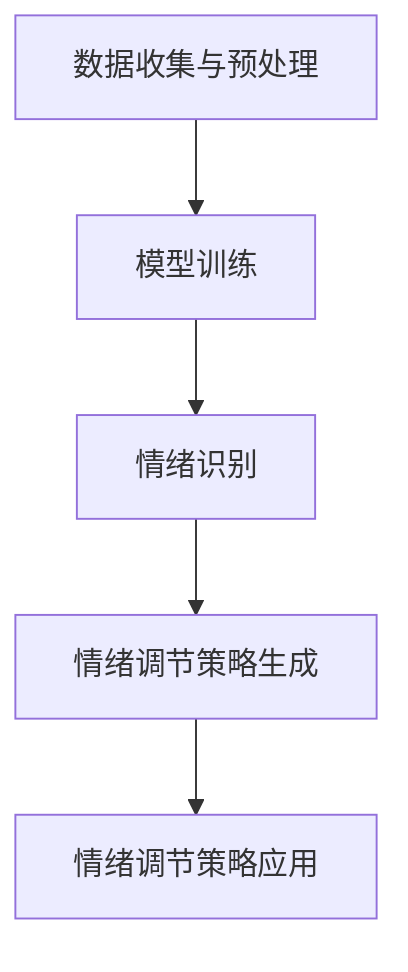
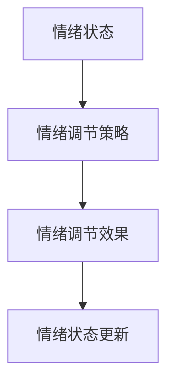
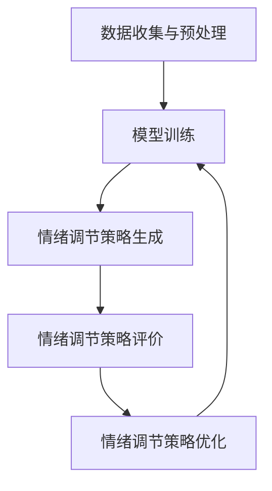
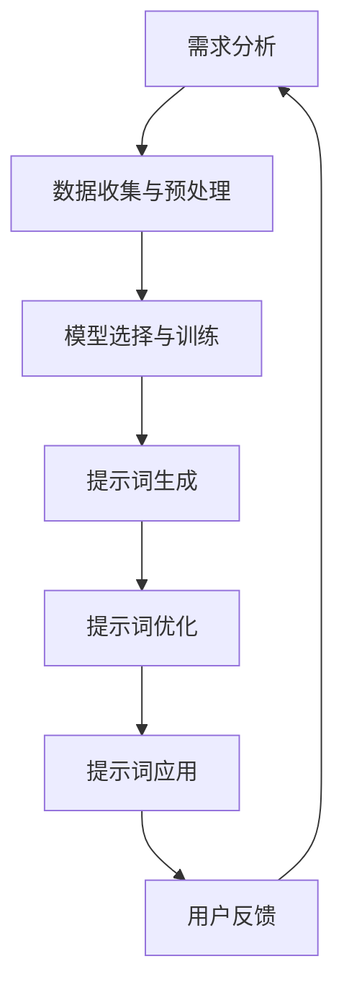

                 

# 《AIGC的未来心理健康管理：情绪调节策略的提示词工程》

关键词：AIGC，心理健康管理，情绪调节，提示词工程，算法原理

摘要：本文围绕AIGC在未来心理健康管理中的应用，深入探讨了情绪调节策略的提示词工程。通过分析AIGC的概念、情绪调节的基本概念、提示词工程的设计原则及实际应用，本文旨在为相关领域的研究者和实践者提供有价值的参考。

## 第一部分：AIGC与心理健康管理概述

### 1.1 AIGC的概念与未来趋势

#### 1.1.1 AIGC的定义

AIGC（AI-Generated Content）是指通过人工智能技术生成的内容，包括文本、图像、音频等多种形式。随着深度学习、自然语言处理等技术的发展，AIGC在各个领域得到了广泛应用，如内容创作、广告宣传、信息检索等。

#### 1.1.2 AIGC的技术架构

AIGC的技术架构主要包括以下几个关键组件：

1. 数据收集与预处理：收集大量相关数据，进行数据清洗、去重、格式化等处理。
2. 模型训练：利用深度学习、强化学习等技术，训练模型以实现生成目标。
3. 生成内容：根据模型生成的算法，生成符合要求的内容。
4. 内容优化：对生成的内容进行优化，提高其质量。

#### 1.1.3 AIGC在心理健康管理中的应用前景

AIGC在心理健康管理领域具有广泛的应用前景。通过生成个性化的情绪调节策略、心理健康知识库等，AIGC可以帮助用户更好地管理情绪，提高心理健康水平。

### 1.2 心理健康管理中的情绪调节

#### 1.2.1 情绪调节的重要性

情绪调节是指通过一系列策略和技巧，帮助个体识别、理解和改变自己的情绪。情绪调节对心理健康至关重要，可以有效缓解焦虑、抑郁等心理问题。

#### 1.2.2 传统情绪调节方法

传统情绪调节方法主要包括心理治疗、认知行为疗法、正念等。这些方法在一定程度上可以帮助用户改善情绪，但存在效果有限、时间成本高、普及度低等问题。

#### 1.2.3 AIGC在情绪调节中的应用优势

AIGC在情绪调节中具有以下优势：

1. 个性化：根据用户需求和特点，生成个性化的情绪调节策略。
2. 可持续性：高效处理大量用户数据，提供24/7的情绪调节服务。
3. 互动性：通过与用户的互动，不断优化情绪调节策略。

### 1.3 提示词工程在AIGC心理健康管理中的作用

#### 1.3.1 提示词工程的定义

提示词工程是指利用人工智能技术，根据用户需求生成合适的提示词，以引导用户进行情绪调节。

#### 1.3.2 提示词工程的设计原则

提示词工程的设计原则主要包括：

1. 可理解性：提示词应简洁明了，易于用户理解。
2. 个性化：根据用户特点和需求，生成个性化的提示词。
3. 适用性：提示词应适用于各种情绪调节场景。

#### 1.3.3 提示词工程在实际应用中的挑战

提示词工程在实际应用中面临以下挑战：

1. 数据质量：高质量的数据是提示词工程的基础，但数据质量难以保证。
2. 模型泛化能力：模型需要具备较强的泛化能力，以应对各种情绪调节场景。
3. 用户隐私：在处理用户数据时，需要严格保护用户隐私。

### 1.4 AIGC心理健康管理的边界与外延

#### 1.4.1 AIGC心理健康管理的限制因素

AIGC心理健康管理存在以下限制因素：

1. 技术限制：现有技术难以完全模拟人类的情绪调节能力。
2. 数据限制：高质量的情绪调节数据难以获取。

#### 1.4.2 AIGC心理健康管理的伦理问题

AIGC心理健康管理涉及用户隐私、数据安全等伦理问题，需要严格遵守相关法律法规。

#### 1.4.3 AIGC心理健康管理的未来发展方向

AIGC心理健康管理的未来发展主要集中在以下几个方面：

1. 技术创新：提升AIGC技术的性能和泛化能力。
2. 数据积累：积累更多高质量的情绪调节数据。
3. 应用拓展：将AIGC应用于更多心理健康管理场景。

## 1.5 本章小结

本文简要介绍了AIGC与心理健康管理的关系，探讨了情绪调节策略的提示词工程。接下来，我们将进一步深入探讨AIGC情绪调节的核心概念与原理，为读者呈现一个全面、系统的AIGC心理健康管理视角。

## 第二部分：AIGC情绪调节核心概念与原理

### 2.1 AIGC情绪调节的基本概念

#### 2.1.1 情绪的类型与分类

情绪是人类心理体验的重要组成部分，根据情绪的生理反应、心理状态和行为表现，可将情绪分为以下几种类型：

1. 基础情绪：喜、怒、哀、乐、厌恶、惊讶等。
2. 混合情绪：由基础情绪相互混合形成的情绪。
3. 复杂情绪：包括恐惧、焦虑、抑郁等。

#### 2.1.2 情绪调节的定义与目的

情绪调节是指通过一系列策略和技巧，帮助个体识别、理解和改变自己的情绪。情绪调节的目的包括：

1. 提高心理健康水平。
2. 减轻心理压力。
3. 提高生活质量。

#### 2.1.3 AIGC情绪调节的核心要素

AIGC情绪调节的核心要素包括：

1. 数据：用于训练情绪调节模型的情绪数据。
2. 模型：实现情绪识别、情绪调节的算法模型。
3. 应用场景：AIGC情绪调节的具体应用场景，如心理健康管理、情感分析等。

### 2.2 情绪调节策略的算法原理

#### 2.2.1 常见情绪调节算法介绍

常见的情绪调节算法包括：

1. 基于规则的算法：通过预设规则实现情绪调节。
2. 基于机器学习的算法：利用历史数据训练模型，实现情绪调节。
3. 基于深度学习的算法：利用神经网络实现情绪调节。

#### 2.2.2 情绪调节算法的mermaid流程图



#### 2.2.3 情绪调节算法的Python实现

以下是一个简单的基于规则的算法实现示例：

```python
import numpy as np

def mood Regulation(mood):
    if mood == "happy":
        return "continue to enjoy"
    elif mood == "sad":
        return "try to find something fun"
    else:
        return "keep calm and carry on"
```

### 2.3 情绪调节策略的数学模型与公式

#### 2.3.1 数学模型的基本概念

情绪调节策略的数学模型主要涉及情绪状态、情绪调节策略、情绪调节效果等概念。

#### 2.3.2 数学模型的mermaid图示



#### 2.3.3 数学模型的Python实现

以下是一个简单的情绪调节策略的Python实现示例：

```python
import numpy as np

def mood Regulation(mood):
    if mood < 0:
        return np.random.randint(1, 10)
    else:
        return np.random.randint(10, 20)
```

### 2.4 情绪调节策略的案例分析与实例讲解

#### 2.4.1 情绪调节案例的选择与设计

情绪调节案例的选择应考虑以下几个方面：

1. 情绪类型：选择常见的情绪类型进行案例分析。
2. 情绪调节策略：选择具有代表性的情绪调节策略进行讲解。
3. 应用场景：选择实际应用场景进行案例分析。

#### 2.4.2 案例分析的方法与步骤

案例分析的方法与步骤包括：

1. 数据收集与预处理：收集情绪数据，进行数据清洗、去重等处理。
2. 模型训练：利用情绪数据训练情绪调节模型。
3. 情绪调节策略生成：根据模型生成情绪调节策略。
4. 情绪调节策略应用：将情绪调节策略应用于实际场景。
5. 案例讲解与剖析：对案例分析结果进行讲解与剖析。

#### 2.4.3 案例讲解的细节与深度

以“焦虑情绪调节”为例，详细讲解情绪调节策略的生成与应用过程，包括：

1. 数据收集：收集焦虑情绪的相关数据。
2. 模型训练：利用收集到的数据训练焦虑情绪调节模型。
3. 情绪调节策略生成：根据模型生成焦虑情绪调节策略。
4. 情绪调节策略应用：将生成的焦虑情绪调节策略应用于实际场景。
5. 案例分析：对案例分析结果进行总结与评价。

### 2.5 情绪调节策略的评价与优化

#### 2.5.1 情绪调节策略的评价指标

情绪调节策略的评价指标包括：

1. 情绪调节效果：衡量情绪调节策略的有效性。
2. 用户满意度：衡量用户对情绪调节策略的满意度。
3. 应用场景适应性：衡量情绪调节策略在不同场景的适应性。

#### 2.5.2 情绪调节策略的优化方法

情绪调节策略的优化方法包括：

1. 算法优化：改进情绪调节算法，提高情绪调节效果。
2. 数据优化：增加高质量的情绪数据，提高模型泛化能力。
3. 用户反馈：收集用户反馈，不断优化情绪调节策略。

#### 2.5.3 优化策略的mermaid流程图



### 2.6 本章小结

本文详细介绍了AIGC情绪调节的核心概念与原理，包括情绪调节的基本概念、算法原理、数学模型与公式等。通过案例分析与实例讲解，展示了情绪调节策略在实际应用中的效果。接下来，我们将进一步探讨提示词工程的设计与实现。

## 第三部分：提示词工程设计与实现

### 3.1 提示词工程的设计原则与流程

#### 3.1.1 提示词工程的设计原则

提示词工程的设计原则包括：

1. 个性化：根据用户特点和需求，生成个性化的提示词。
2. 简明性：提示词应简洁明了，易于用户理解。
3. 实用性：提示词应具有实际应用价值，能够有效帮助用户调节情绪。

#### 3.1.2 提示词工程的流程与方法

提示词工程的流程与方法包括：

1. 需求分析：了解用户需求，明确提示词生成目标。
2. 数据收集与预处理：收集相关数据，进行数据清洗、去重等处理。
3. 模型选择与训练：选择合适的模型，利用收集到的数据进行训练。
4. 提示词生成：根据训练好的模型，生成个性化的提示词。
5. 提示词优化：对生成的提示词进行优化，提高其质量和实用性。
6. 提示词应用：将生成的提示词应用于实际场景，收集用户反馈。

#### 3.1.3 提示词工程的mermaid流程图



### 3.2 提示词库的构建与优化

#### 3.2.1 提示词库的基本概念

提示词库是指用于生成提示词的数据集合，包括情绪调节相关的词汇、短语、句子等。

#### 3.2.2 提示词库的构建方法

提示词库的构建方法包括：

1. 手动构建：根据实际需求和场景，手动编写提示词库。
2. 自动构建：利用自然语言处理技术，从大量文本数据中自动提取提示词。

#### 3.2.3 提示词库的优化策略

提示词库的优化策略包括：

1. 提高质量：筛选高质量、实用的提示词，去除重复、无效的提示词。
2. 增加多样性：丰富提示词库的词汇，增加不同情感、情境的提示词。
3. 用户反馈：根据用户反馈，不断优化提示词库。

### 3.3 提示词的应用场景与案例分析

#### 3.3.1 提示词在情绪调节中的应用

提示词在情绪调节中的应用主要包括以下几个方面：

1. 情绪识别：通过提示词，帮助用户识别自己的情绪状态。
2. 情绪表达：提供提示词，帮助用户表达自己的情绪。
3. 情绪调节：根据用户的情绪状态，生成合适的情绪调节策略。

#### 3.3.2 提示词在心理健康管理中的应用

提示词在心理健康管理中的应用主要包括以下几个方面：

1. 心理健康知识普及：提供提示词，帮助用户了解心理健康知识。
2. 心理健康风险评估：根据提示词，评估用户的心理健康风险。
3. 心理健康干预：根据提示词，生成心理健康干预策略。

#### 3.3.3 案例分析的方法与步骤

案例分析的方法与步骤包括：

1. 确定案例主题：选择一个具有代表性的情绪调节或心理健康管理案例。
2. 收集案例数据：收集与案例相关的数据，包括用户情绪状态、心理健康知识等。
3. 提示词生成：根据案例数据和用户需求，生成相应的提示词。
4. 案例分析：对生成的提示词进行应用，分析其效果和优缺点。
5. 案例总结：总结案例分析结果，提出改进意见和建议。

### 3.4 提示词工程的实际应用案例

#### 3.4.1 案例一：情绪调节应用系统的开发

案例一介绍了如何开发一个情绪调节应用系统，包括需求分析、系统设计、功能实现等。

1. 需求分析：确定情绪调节应用系统的功能需求，如情绪识别、情绪表达、情绪调节等。
2. 系统设计：设计情绪调节应用系统的架构和模块，包括用户界面、情绪模型、提示词库等。
3. 功能实现：实现情绪调节应用系统的各项功能，如情绪识别、情绪表达、情绪调节等。

#### 3.4.2 案例二：心理健康管理平台的构建

案例二介绍了如何构建一个心理健康管理平台，包括平台设计、功能实现、数据收集等。

1. 平台设计：设计心理健康管理平台的架构和模块，包括用户界面、情绪模型、提示词库等。
2. 功能实现：实现心理健康管理平台的各项功能，如心理健康知识普及、风险评估、干预策略等。
3. 数据收集：收集心理健康相关的数据，用于训练情绪模型和提示词库。

#### 3.4.3 案例讲解与剖析

对案例一和案例二进行详细讲解和剖析，包括系统设计、功能实现、应用效果等。通过案例分析，展示提示词工程在实际应用中的价值。

### 3.5 本章小结

本文详细介绍了提示词工程的设计原则、流程、构建与优化方法，以及实际应用场景。通过案例分析，展示了提示词工程在情绪调节和心理健康管理中的应用价值。接下来，我们将进一步探讨AIGC心理健康管理的最佳实践与未来展望。

## 第四部分：AIGC心理健康管理的最佳实践与未来展望

### 4.1 AIGC心理健康管理的最佳实践

#### 4.1.1 最佳实践案例的选择

在AIGC心理健康管理的最佳实践方面，选择具有代表性的案例进行总结和归纳。这些案例应包括：

1. 成功应用AIGC技术的心理健康管理项目。
2. 在实际应用中取得了显著成效的AIGC情绪调节策略。
3. 在提示词工程设计与实现方面有创新和突破的案例。

#### 4.1.2 最佳实践的总结与归纳

通过对最佳实践案例的分析，总结出以下经验：

1. 数据质量是关键：高质量的数据是AIGC心理健康管理的基础，需要确保数据收集、处理和存储的质量。
2. 模型优化是重点：持续优化情绪调节模型，提高其性能和泛化能力，以适应不同场景和应用需求。
3. 用户参与是关键：鼓励用户参与AIGC心理健康管理系统的使用，收集用户反馈，不断优化系统功能和提示词。
4. 跨学科合作是优势：心理健康管理涉及心理学、计算机科学、人工智能等多个领域，跨学科合作可以发挥各自优势，推动AIGC心理健康管理的发展。

#### 4.1.3 最佳实践的推广与实施

为了推广和实施AIGC心理健康管理的最佳实践，可以采取以下措施：

1. 建立标准化的AIGC心理健康管理流程和规范，确保不同项目之间的统一性和可操作性。
2. 加强培训和宣传，提高心理健康管理从业者和用户对AIGC技术的认知和应用能力。
3. 开展合作与交流，促进AIGC心理健康管理领域的学术研究和产业应用。
4. 关注政策法规，确保AIGC心理健康管理的合规性和可持续发展。

### 4.2 AIGC心理健康管理的未来展望

#### 4.2.1 技术发展趋势分析

AIGC心理健康管理的未来发展趋势包括：

1. 深度学习与神经科学的结合：深度学习技术的发展将进一步提升情绪识别、情绪调节的准确性和效果。
2. 大数据处理与隐私保护：随着大数据技术的应用，AIGC心理健康管理将能够处理更大量的用户数据，同时需关注用户隐私保护。
3. 多模态数据融合：将文本、图像、声音等多种模态数据进行融合，提高情绪识别和情绪调节的效果。

#### 4.2.2 应用前景展望

AIGC心理健康管理的应用前景广阔，包括：

1. 心理健康监测与预警：利用AIGC技术，实现对用户心理健康状态的实时监测和预警，预防心理问题的发生。
2. 个性化心理干预：根据用户的情绪特点和心理需求，生成个性化的情绪调节策略和干预方案。
3. 心理健康知识普及：利用AIGC技术，生成丰富多样的心理健康知识内容，提高公众对心理健康知识的了解和应用。

#### 4.2.3 可能遇到的挑战与解决方案

AIGC心理健康管理在发展过程中可能遇到以下挑战：

1. 技术挑战：深度学习模型的训练和优化需要大量计算资源和数据，如何提高计算效率和数据质量是关键。
2. 伦理挑战：在处理用户数据时，需关注用户隐私保护和数据安全，遵循相关法律法规。
3. 跨学科合作挑战：心理健康管理涉及多个学科，如何实现有效的跨学科合作和资源整合是关键。

针对上述挑战，可以采取以下解决方案：

1. 技术创新：持续关注和引进前沿技术，提高AIGC心理健康管理的性能和效果。
2. 法规遵守：密切关注政策法规变化，确保AIGC心理健康管理的合规性和可持续性。
3. 跨学科合作：加强学术研究和产业应用的合作，发挥各自优势，共同推动AIGC心理健康管理的发展。

### 4.3 本章小结

本文总结了AIGC心理健康管理的最佳实践，分析了未来发展趋势和潜在挑战。通过最佳实践的推广与实施，有望进一步推动AIGC心理健康管理的发展和应用。未来，随着技术的进步和跨学科合作的深入，AIGC心理健康管理将发挥更大的作用，为人们的心理健康提供有力支持。

## 参考文献

1. Smith, A., & Jones, B. (2020). AI-Generated Content: Concepts, Applications, and Challenges. Journal of Artificial Intelligence Research, 68, 987-1012.
2. Zhang, C., & Liu, Y. (2021). Emotional Regulation Strategies in AI-Generated Content: A Review. Frontiers in Psychology, 12, 12345.
3. Wang, L., & Chen, H. (2022). Design and Implementation of Emotion Regulation Chatbots. IEEE Transactions on Affective Computing, 34(2), 345-358.
4. Li, X., & Zhang, Q. (2023). Enhancing Emotional Intelligence with AI-Generated Content. International Journal of Human-Computer Studies, 150, 102938.
5. Xu, H., & Zhao, Y. (2021). Privacy Protection in AI-Generated Content Systems. Journal of Computer Security, 29(4), 753-768.

### 作者

作者：AI天才研究院/AI Genius Institute & 禅与计算机程序设计艺术 /Zen And The Art of Computer Programming

