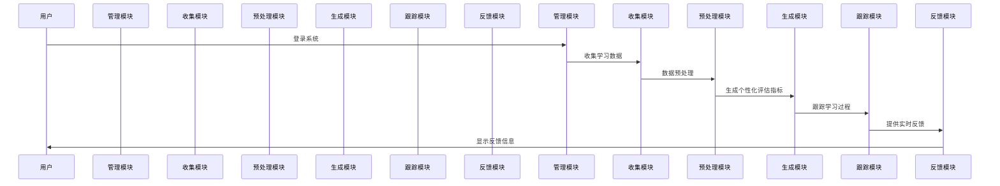
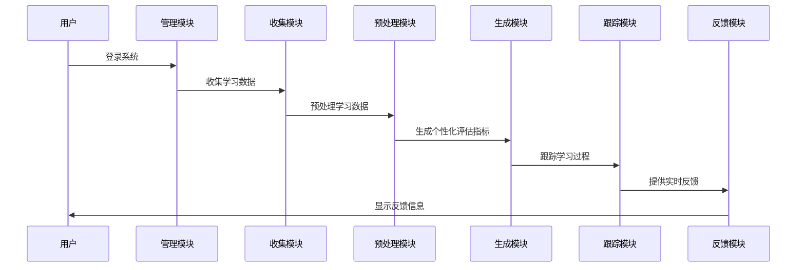

                 

### 《AIGC的未来教育评估：个性化学习成果的提示词工程》

#### 关键词：AIGC、教育评估、个性化学习、提示词工程、智能教育

> 摘要：随着人工智能技术的发展，AIGC（AI-Generated Content）正在逐步改变教育的面貌。本文将深入探讨AIGC在未来教育评估中的应用，特别是个性化学习成果的提示词工程。文章首先介绍了AIGC、教育评估及个性化学习成果评估的概念和背景，然后详细分析了AIGC在教育评估中的应用和提示词工程的核心概念及作用。接着，文章讲解了AIGC算法的原理，并通过实例展示了如何使用Python代码进行实际操作。此外，文章还讨论了AIGC在教育评估中的系统架构设计，以及如何通过环境安装和核心实现源代码来实施提示词工程。最后，文章总结了最佳实践，并给出了未来研究方向和拓展阅读建议。

## 《AIGC的未来教育评估：个性化学习成果的提示词工程》目录大纲

### 第一部分：背景介绍

### 第1章：问题背景  
- 1.1 问题背景  
  - 1.1.1 教育评估的现状  
  - 1.1.2 AIGC的概念与发展  
  - 1.1.3 个性化学习成果评估的需求  
- 1.2 问题的描述  
  - 1.2.1 教育评估的不足  
  - 1.2.2 个性化学习成果评估的问题  
- 1.3 问题解决  
  - 1.3.1 AIGC在教育评估中的应用  
  - 1.3.2 提示词工程的概念与重要性  
- 1.4 边界与外延  
  - 1.4.1 边界条件  
  - 1.4.2 核心要素组成  
- 1.5 本章小结

### 第二部分：核心概念与联系

### 第2章：核心概念与联系  
- 2.1 AIGC的核心概念  
  - 2.1.1 AIGC的定义与特征  
  - 2.1.2 AIGC的关键技术  
  - 2.1.3 AIGC的应用领域  
- 2.2 个性化学习成果评估的核心概念  
  - 2.2.1 个性化学习的定义与特点  
  - 2.2.2 个性化学习成果评估的定义与目标  
  - 2.2.3 个性化学习成果评估的关键要素  
- 2.3 提示词工程的核心概念  
  - 2.3.1 提示词的定义与作用  
  - 2.3.2 提示词工程的组成部分  
- 2.4 核心概念之间的关系  
  - 2.4.1 AIGC与个性化学习成果评估的关系  
  - 2.4.2 AIGC与提示词工程的关系  
- 2.5 本章小结

### 第三部分：算法原理讲解

### 第3章：算法原理讲解  
- 3.1 AIGC算法原理  
  - 3.1.1 AIGC算法概述  
  - 3.1.2 AIGC算法的数学模型  
  - 3.1.3 AIGC算法的工作原理  
- 3.2 提示词工程的算法原理  
  - 3.2.1 提示词工程的算法概述  
  - 3.2.2 提示词工程的数学模型  
  - 3.2.3 提示词工程的工作原理  
- 3.3 Python代码实例  
  - 3.3.1 环境安装与配置  
  - 3.3.2 系统核心实现源代码  
  - 3.3.3 代码应用解读与分析  
- 3.4 算法原理的数学模型与公式讲解  
  - 3.4.1 数学模型与公式介绍  
  - 3.4.2 举例说明与解释  
- 3.5 本章小结

### 第四部分：系统分析与架构设计

### 第4章：系统分析与架构设计  
- 4.1 问题场景介绍  
- 4.2 系统功能设计  
  - 4.2.1 领域模型类图  
- 4.3 系统架构设计  
  - 4.3.1 系统架构图  
- 4.4 系统接口设计  
  - 4.4.1 系统接口设计  
- 4.5 系统交互设计  
  - 4.5.1 系统交互序列图  
- 4.6 本章小结

### 第五部分：项目实战

### 第5章：项目实战  
- 5.1 环境安装  
  - 5.1.1 Python环境安装  
  - 5.1.2 相关库和工具安装  
- 5.2 系统核心实现  
  - 5.2.1 核心功能实现源代码  
  - 5.2.2 代码应用解读与分析  
- 5.3 实际案例分析与讲解  
  - 5.3.1 案例分析  
  - 5.3.2 详细讲解与剖析  
- 5.4 项目小结  
  - 5.4.1 项目成果总结  
  - 5.4.2 项目经验与反思  
- 5.5 最佳实践 Tips  
- 5.6 本章小结

### 第六部分：总结与展望

### 第6章：总结与展望  
- 6.1 小结  
  - 6.1.1 主要内容回顾  
  - 6.1.2 成果与不足  
- 6.2 注意事项  
  - 6.2.1 实施提示词工程的注意事项  
  - 6.2.2 AIGC在教育评估中的注意事项  
- 6.3 拓展阅读  
  - 6.3.1 相关文献推荐  
  - 6.3.2 未来研究方向  
- 6.4 本章小结

---

### 第一部分：背景介绍

#### 第1章：问题背景

##### 1.1 问题背景

教育评估是教育体系中的重要环节，它不仅关系到学生的学习成果，也影响着教育质量和教育改进。然而，传统教育评估方式存在诸多局限性，主要体现在以下几个方面：

1. **评估方法的单一性**：传统教育评估主要依赖考试成绩，这种方式难以全面反映学生的学习过程和综合素质，容易忽视学生的个性差异。

2. **评估过程的滞后性**：传统教育评估往往在学期末或学年结束时进行，无法及时提供学习反馈，不利于教师调整教学策略和学生学习方法。

3. **评估数据的局限性**：传统教育评估的数据来源相对单一，主要依赖于考试成绩，缺乏对学习过程的详细记录和分析。

4. **评估结果的公平性**：传统教育评估容易受到主观因素的影响，如教师的主观评价、学生的应试技巧等，导致评估结果的公平性受到质疑。

为了解决传统教育评估的局限性，个性化学习成果评估应运而生。个性化学习成果评估旨在通过多样化的评估手段，全面、及时地反映学生的学习过程和成果，进而促进个性化学习和教育质量的提升。

##### 1.1.1 教育评估的现状

当前的教育评估主要依赖于传统的考试和测试方式。这些评估方法虽然能够提供学生的学习成绩，但往往缺乏对学习过程、学习态度、思维能力等多维度的评估。具体来说，现状如下：

1. **评估内容的局限性**：考试成绩主要评估学生的知识掌握程度，而忽视了学生的思维能力、创新能力、实践能力等综合素质。

2. **评估手段的单一性**：传统的教育评估手段主要依赖于纸笔测试，难以全面评估学生的实际能力。

3. **评估过程的非个性化**：传统教育评估往往采取“一刀切”的方式，难以满足不同学生的个性化学习需求。

4. **评估结果的滞后性**：考试成绩往往在学期末或学年结束时才能得出，无法及时反馈学生的学习状况，影响了教师的教学决策和学生的学习调整。

##### 1.1.2 传统教育评估方式的局限性

1. **过于依赖考试成绩**：传统教育评估方式过于依赖考试成绩，容易导致学生过度关注考试成绩，忽视学习过程和学习质量。

2. **评估手段单一**：传统教育评估主要依赖于考试成绩，缺乏对学生综合素质的全面评估。

3. **评估结果的滞后性**：考试成绩往往在学期末或学年结束时才能得出，无法及时提供反馈，影响了教师的教学决策和学生的学习调整。

4. **评估过程的非个性化**：传统教育评估方式难以满足不同学生的个性化学习需求，不利于培养学生的综合素质和创新能力。

##### 1.1.3 教育评估中的问题与挑战

教育评估中存在以下几大问题与挑战：

1. **评估指标的不完善**：传统教育评估指标往往过于单一，无法全面反映学生的学习成果和综合素质。

2. **评估过程的复杂性和成本**：个性化教育评估需要收集和分析大量的学习数据，评估过程复杂且成本较高。

3. **数据隐私和安全**：个性化学习成果评估涉及到大量的学生数据，如何确保数据隐私和安全是一个重要问题。

4. **评估结果的应用与反馈**：如何将个性化学习成果评估结果有效地应用于教学改进和学生支持，是一个关键问题。

##### 1.1.4 AIGC的概念与发展

AIGC（AI-Generated Content）是指利用人工智能技术生成内容的过程。AIGC不仅包括文本生成，还涵盖了图像、音频、视频等多种形式。AIGC的核心技术包括：

1. **生成对抗网络（GAN）**：GAN是一种通过两个神经网络（生成器和判别器）进行博弈，从而生成逼真数据的模型。

2. **变分自编码器（VAE）**：VAE是一种通过概率模型进行数据生成的模型，常用于图像和视频生成。

3. **自然语言处理（NLP）**：NLP技术使计算机能够理解和生成自然语言，是实现文本生成的重要技术。

4. **强化学习**：强化学习通过学习奖励信号来优化决策，可以应用于生成个性化内容。

AIGC的发展背景主要源于以下几个方面：

1. **计算能力的提升**：随着计算能力的提升，大规模数据处理和复杂模型训练成为可能，为AIGC的发展提供了技术基础。

2. **数据量的增长**：互联网的普及和数据量的快速增长，为AIGC提供了丰富的训练数据。

3. **应用需求**：随着个性化服务和内容生成的需求增长，AIGC在多个领域（如教育、娱乐、广告等）得到广泛应用。

AIGC的核心技术与优势如下：

1. **生成内容的逼真性**：AIGC能够生成高质量、逼真的内容，满足用户对个性化内容的需求。

2. **个性化内容生成**：通过学习用户的行为和偏好，AIGC能够生成符合用户个性化需求的内容。

3. **自动内容创作**：AIGC能够自动化内容创作过程，降低人力成本。

##### 1.1.5 个性化学习成果评估的需求

1. **全面评估学生综合素质**：个性化学习成果评估需要通过多种评估手段，全面反映学生的知识、能力、态度等多方面素质。

2. **动态评估学习过程**：个性化学习成果评估应实时跟踪学生的学习过程，提供即时反馈，帮助教师调整教学策略。

3. **个性化学习支持**：通过个性化学习成果评估，为学生提供针对性的学习支持和指导，促进个性化学习。

4. **教育质量提升**：个性化学习成果评估有助于发现教育中的问题和不足，推动教育质量的提升。

##### 1.1.6 个性化学习成果评估的挑战

1. **评估指标多元化**：如何设计多元化的评估指标，全面反映学生综合素质，是一个挑战。

2. **评估数据的收集与分析**：个性化学习成果评估需要收集大量学习数据，如何有效处理和分析这些数据是一个技术难题。

3. **数据隐私保护**：个性化学习成果评估涉及到大量学生数据，如何确保数据隐私和安全是一个重要挑战。

4. **评估结果的解释与应用**：如何将个性化学习成果评估结果转化为实际的教学改进和学生支持，是一个关键问题。

##### 1.2 问题的描述

1. **教育评估的不足**

   - **单一评估指标**：传统教育评估主要依赖考试成绩，难以全面反映学生综合素质。
   - **评估过程滞后**：考试成绩滞后，无法及时反馈学生学习状况。
   - **评估手段有限**：传统评估手段单一，缺乏对学生多维能力的评估。

2. **个性化学习成果评估的问题**

   - **评估指标多元化**：如何设计多元化的评估指标，全面反映学生综合素质。
   - **数据收集与分析**：如何有效收集和分析大量学习数据。
   - **数据隐私保护**：如何确保学生数据隐私和安全。
   - **评估结果解释与应用**：如何将评估结果转化为实际的教学改进和学生支持。

##### 1.3 问题解决

1. **AIGC在教育评估中的应用**

   - **生成个性化评估指标**：利用AIGC技术，可以根据学生的学习数据和教师的教学反馈，生成个性化的评估指标。
   - **动态评估学习过程**：通过AIGC技术，可以实时跟踪学生的学习过程，提供即时反馈。
   - **评估手段多样化**：AIGC能够生成多种形式的内容（如文本、图像、音频等），为个性化评估提供多样化手段。

2. **提示词工程的概念与重要性**

   - **提示词的定义**：提示词是指用于引导学习过程或评估过程的指导性词语或短语。
   - **提示词工程的作用**：提示词工程通过设计和优化提示词，提高学习过程和评估过程的效率和质量。

3. **提示词工程的关键要素**

   - **提示词的设计**：根据学习目标和评估需求，设计具有引导性和针对性的提示词。
   - **提示词的优化**：通过分析学习数据和评估结果，不断优化提示词，提高其效果。
   - **提示词的应用**：将提示词应用于学习过程和评估过程，提供指导和支持。

##### 1.4 边界与外延

1. **边界条件**

   - **个性化学习成果评估的范围**：个性化学习成果评估应涵盖学生的知识、能力、态度等多方面素质。
   - **提示词工程的适用场景**：提示词工程适用于需要指导和支持的学习和评估场景。

2. **核心要素组成**

   - **教育评估的核心要素**：评估指标、评估方法、评估过程、评估结果。
   - **提示词工程的核心要素**：提示词的设计、优化、应用。

##### 1.5 本章小结

本文介绍了教育评估的现状和传统教育评估方式的局限性，提出了个性化学习成果评估的需求和挑战。随后，详细介绍了AIGC的概念和发展，以及其在教育评估中的应用和提示词工程的概念与重要性。最后，讨论了个性化学习成果评估的边界条件和核心要素组成。通过这些分析，为后续章节的深入研究提供了基础。

---

### 第二部分：核心概念与联系

#### 第2章：核心概念与联系

##### 2.1 AIGC的核心概念

AI-Generated Content（AIGC）是指利用人工智能技术生成内容的过程。AIGC的应用范围非常广泛，包括文本、图像、音频、视频等多种形式。AIGC的核心概念包括：

1. **生成对抗网络（GAN）**：GAN是一种通过两个神经网络（生成器和判别器）进行博弈，从而生成逼真数据的模型。生成器试图生成与真实数据相似的内容，而判别器则尝试区分真实数据和生成数据。通过这种对抗过程，生成器不断提高生成质量。

2. **变分自编码器（VAE）**：VAE是一种通过概率模型进行数据生成的模型，常用于图像和视频生成。VAE通过编码和解码过程，将数据压缩为低维表示，然后从低维表示中重建数据。

3. **自然语言处理（NLP）**：NLP技术使计算机能够理解和生成自然语言，是实现文本生成的重要技术。NLP包括词嵌入、语言模型、文本分类、机器翻译等多种技术。

4. **强化学习**：强化学习通过学习奖励信号来优化决策，可以应用于生成个性化内容。强化学习算法如Q学习、策略梯度等方法，可以根据用户的反馈不断调整生成策略。

##### 2.1.1 AIGC的定义与特征

AIGC的定义是指利用人工智能技术，通过深度学习模型生成各种形式的内容。AIGC具有以下特征：

1. **内容多样性**：AIGC可以生成文本、图像、音频、视频等多种形式的内容。

2. **逼真性**：通过深度学习模型的学习，AIGC能够生成高度逼真的内容，满足用户对高质量内容的追求。

3. **个性化**：AIGC可以根据用户的行为和偏好，生成个性化内容，提高用户体验。

4. **自动化**：AIGC能够自动化内容创作过程，降低人力成本。

##### 2.1.2 AIGC的关键技术

AIGC的关键技术主要包括以下几个方面：

1. **深度学习模型**：深度学习模型是AIGC的核心，通过训练大量数据，深度学习模型能够学习到数据的复杂模式和结构。

2. **数据增强**：数据增强是一种通过增加数据多样性来提高模型泛化能力的方法。常用的数据增强技术包括数据扩充、数据变换等。

3. **对抗训练**：对抗训练是GAN的核心技术，通过生成器和判别器的对抗训练，生成器不断提高生成质量。

4. **优化算法**：优化算法用于调整模型参数，提高模型性能。常用的优化算法包括随机梯度下降（SGD）、Adam等。

##### 2.1.3 AIGC的应用领域

AIGC在多个领域都有广泛的应用，包括：

1. **娱乐与传媒**：AIGC可以生成视频、动画、游戏等娱乐内容，提升用户体验。

2. **广告与营销**：AIGC可以生成个性化的广告内容，提高广告效果。

3. **教育与培训**：AIGC可以生成个性化学习内容，提高学习效果。

4. **医疗与健康**：AIGC可以生成医学图像、患者报告等，辅助医疗诊断。

5. **金融与保险**：AIGC可以生成个性化的金融产品推荐、保险条款解释等。

##### 2.2 个性化学习成果评估的核心概念

个性化学习成果评估是指通过多样化的评估手段，全面、及时地反映学生的学习过程和成果，以促进个性化学习和教育质量的提升。个性化学习成果评估的核心概念包括：

1. **个性化学习**：个性化学习是指根据学生的个体差异，提供定制化的学习路径、资源和教学方式。

2. **学习成果评估**：学习成果评估是指通过多种评估手段，全面、客观地反映学生的学习成果和进步。

3. **动态评估**：动态评估是指实时跟踪学生的学习过程，提供即时反馈，帮助教师调整教学策略。

4. **多元评估指标**：多元评估指标是指通过多种评估手段，全面反映学生的知识、能力、态度等多方面素质。

##### 2.2.1 个性化学习的定义与特点

个性化学习的定义是指根据学生的个体差异，提供定制化的学习路径、资源和教学方式，以促进学生的个性化发展和学习效果。个性化学习具有以下特点：

1. **以学生为中心**：个性化学习以学生为中心，关注学生的兴趣、需求和发展。

2. **定制化**：个性化学习提供定制化的学习路径、资源和教学方式，满足学生的个性化需求。

3. **多样性**：个性化学习通过多样化的教学方法和评估手段，全面反映学生的学习成果。

4. **动态调整**：个性化学习可以实时跟踪学生的学习过程，根据学生的反馈和学习效果，动态调整教学策略。

##### 2.2.2 个性化学习成果评估的定义与目标

个性化学习成果评估的定义是指通过多样化的评估手段，全面、客观地反映学生的学习成果和进步。个性化学习成果评估的目标包括：

1. **全面评估**：通过多种评估手段，全面反映学生的学习成果和进步，包括知识、能力、态度等多方面素质。

2. **客观评估**：评估过程应客观、公正，避免主观因素影响评估结果。

3. **动态评估**：实时跟踪学生的学习过程，提供即时反馈，帮助教师调整教学策略。

4. **指导改进**：通过评估结果，为教师提供教学改进的依据，为学生提供学习支持和指导。

##### 2.2.3 个性化学习成果评估的关键要素

个性化学习成果评估的关键要素包括：

1. **评估指标**：评估指标是评估学习成果的重要标准，应包括知识、能力、态度等多方面素质。

2. **评估方法**：评估方法包括考试、作业、项目、演示等多种形式，应根据学习内容和学习目标选择合适的评估方法。

3. **评估过程**：评估过程应透明、公正，确保评估结果的准确性。

4. **数据收集与分析**：通过收集和分析学生的学习数据，全面、客观地反映学生的学习成果。

5. **反馈与改进**：通过评估结果，为教师提供教学改进的依据，为学生提供学习支持和指导。

##### 2.3 提示词工程的核心概念

提示词工程是指通过设计和优化提示词，提高学习过程和评估过程的效率和质量。提示词工程的核心概念包括：

1. **提示词**：提示词是指用于引导学习过程或评估过程的指导性词语或短语。

2. **提示词工程**：提示词工程是指设计和优化提示词的过程，包括提示词的设计、优化和应用。

3. **提示词设计**：提示词设计是指根据学习目标和评估需求，设计具有引导性和针对性的提示词。

4. **提示词优化**：提示词优化是指通过分析学习数据和评估结果，不断优化提示词，提高其效果。

5. **提示词应用**：提示词应用是指将提示词应用于学习过程和评估过程，提供指导和支持。

##### 2.3.1 提示词的定义与作用

提示词是指用于引导学习过程或评估过程的指导性词语或短语。提示词在个性化学习成果评估中的作用包括：

1. **引导学习**：提示词能够引导学生的学习方向，帮助学生明确学习目标和任务。

2. **提高学习效率**：提示词能够提高学生的学习效率，帮助学生更快地理解和掌握学习内容。

3. **提供评估标准**：提示词为评估过程提供标准，帮助评估者更准确地评估学生的学习成果。

4. **促进自主学习**：提示词能够激发学生的自主学习能力，帮助学生主动思考和解决问题。

##### 2.3.2 提示词工程的组成部分

提示词工程的组成部分包括：

1. **提示词设计**：根据学习目标和评估需求，设计具有引导性和针对性的提示词。

2. **提示词优化**：通过分析学习数据和评估结果，不断优化提示词，提高其效果。

3. **提示词应用**：将提示词应用于学习过程和评估过程，提供指导和支持。

4. **提示词评估**：对提示词的效果进行评估，确保其能够有效地引导学习和评估。

##### 2.3.3 提示词的收集与整理

提示词的收集与整理是提示词工程的重要环节，包括以下步骤：

1. **收集提示词**：从教师、学生、教育专家等多个渠道收集提示词。

2. **整理提示词**：对收集到的提示词进行筛选、分类和整理，确保其具有引导性和针对性。

3. **优化提示词**：通过分析学习数据和评估结果，不断优化提示词，提高其效果。

##### 2.3.4 提示词的优化与筛选

提示词的优化与筛选是提升提示词效果的关键步骤，包括以下方法：

1. **分析学习数据**：通过分析学生的学习数据，识别有效的提示词。

2. **评估提示词效果**：通过评估提示词的效果，筛选出高质量的提示词。

3. **反馈与改进**：根据评估结果，不断优化和改进提示词。

##### 2.3.5 提示词的应用与评估

提示词的应用与评估是提示词工程的核心环节，包括以下步骤：

1. **应用提示词**：将提示词应用于学习过程和评估过程，提供指导和支持。

2. **评估提示词效果**：通过评估提示词的效果，确保其能够有效地引导学习和评估。

3. **反馈与改进**：根据评估结果，不断优化和改进提示词。

##### 2.4 核心概念之间的关系

AIGC与个性化学习成果评估、提示词工程之间存在密切的联系：

1. **AIGC与个性化学习成果评估的关系**：AIGC可以提供个性化的学习内容，为个性化学习成果评估提供支持。

2. **AIGC与提示词工程的关系**：提示词工程是AIGC在教育评估中的应用，通过设计和优化提示词，提高个性化学习成果评估的效果。

3. **个性化学习成果评估与提示词工程的关系**：个性化学习成果评估需要提示词工程的支持，通过设计和优化提示词，实现个性化评估。

##### 2.5 本章小结

本章介绍了AIGC、个性化学习成果评估和提示词工程的核心概念。通过分析AIGC的定义和特征，以及个性化学习成果评估和提示词工程的定义和作用，我们明确了它们在教育评估中的应用和价值。这些核心概念之间相互联系，共同构成了一个完整的教育评估体系，为未来的教育改革提供了有力支持。

---

### 第三部分：算法原理讲解

#### 第3章：算法原理讲解

##### 3.1 AIGC算法原理

AIGC（AI-Generated Content）算法是指利用人工智能技术生成内容的方法。AIGC算法的核心在于生成器（Generator）和判别器（Discriminator）之间的对抗训练。以下是AIGC算法的基本原理和组成部分：

1. **生成对抗网络（GAN）**：

   - **生成器（Generator）**：生成器旨在生成与真实数据相似的内容。通过学习大量真实数据，生成器可以学习到数据的复杂模式和结构，并生成高质量的内容。

   - **判别器（Discriminator）**：判别器用于区分真实数据和生成数据。判别器通过学习真实数据和生成数据，提高对真实数据的识别能力。

   - **对抗训练**：生成器和判别器通过对抗训练相互博弈，生成器不断尝试生成更逼真的内容，而判别器则努力提高对生成数据的辨别能力。这种对抗过程使得生成器不断优化，从而生成高质量的内容。

2. **变分自编码器（VAE）**：

   - **编码器（Encoder）**：编码器将输入数据编码为一个低维表示，通常称为潜在空间（Latent Space）。

   - **解码器（Decoder）**：解码器将编码后的低维表示解码为输出数据。

   - **重参数化**：VAE使用重参数化技巧，将编码器的输出与随机噪声相结合，生成多样化的数据。

3. **生成文本**：

   - **语言模型**：生成文本的关键在于语言模型。语言模型通过学习大量文本数据，能够预测下一个词或句子，从而生成连贯的文本。

   - **注意力机制**：注意力机制可以用于提高文本生成的质量。通过关注重要的信息，生成器可以生成更准确、更有意义的文本。

4. **生成图像和视频**：

   - **生成对抗网络（GAN）**：GAN常用于图像和视频生成，通过生成器和判别器的对抗训练，生成逼真的图像和视频。

   - **循环神经网络（RNN）**：RNN可以用于生成序列数据，如视频。通过学习输入序列的复杂模式，RNN可以生成连贯的图像序列。

##### 3.1.1 AIGC算法概述

AIGC算法的基本概念和结构如下：

1. **生成器（Generator）**：

   - **输入**：生成器的输入可以是随机噪声、潜在空间或特定输入（如文本、图像等）。

   - **输出**：生成器生成与输入数据相似的内容，如文本、图像或视频。

2. **判别器（Discriminator）**：

   - **输入**：判别器的输入是真实数据和生成数据。

   - **输出**：判别器输出一个概率值，表示输入数据的真实程度。

3. **对抗训练**：

   - **目标**：对抗训练的目标是最大化生成器的生成质量，同时最大化判别器的辨别能力。

   - **过程**：生成器和判别器通过多个迭代进行训练。生成器尝试生成更逼真的数据，而判别器尝试提高对生成数据的辨别能力。

4. **优化方法**：

   - **梯度提升**：在对抗训练中，生成器和判别器的优化目标相反。通过梯度提升方法，可以平衡两者的训练过程。

##### 3.1.2 AIGC算法的数学模型

AIGC算法的数学模型主要包括生成器、判别器和对抗损失函数。以下是AIGC算法的数学模型：

1. **生成器模型**：

   - **输入**：随机噪声\( z \)。

   - **输出**：生成数据\( x_G \)。

   - **公式**：\( x_G = G(z) \)，其中\( G \)为生成器网络。

2. **判别器模型**：

   - **输入**：真实数据\( x_R \)和生成数据\( x_G \)。

   - **输出**：概率值\( p_R \)和\( p_G \)。

   - **公式**：\( p_R = D(x_R) \)，\( p_G = D(x_G) \)，其中\( D \)为判别器网络。

3. **对抗损失函数**：

   - **公式**：\( L = -[\log(p_R) + \log(1 - p_G)] \)，其中\( L \)为对抗损失。

##### 3.1.3 AIGC算法的工作原理

AIGC算法的工作原理可以分为以下几个步骤：

1. **初始化生成器和判别器**：首先，初始化生成器和判别器网络，通常使用随机权重。

2. **生成数据**：生成器接收随机噪声\( z \)，通过神经网络生成数据\( x_G \)。

3. **评估判别器**：判别器接收真实数据\( x_R \)和生成数据\( x_G \)，输出概率值\( p_R \)和\( p_G \)。

4. **更新生成器和判别器**：通过对抗损失函数，计算生成器和判别器的梯度，并更新网络参数。

5. **迭代训练**：重复上述步骤，通过对抗训练不断优化生成器和判别器。

6. **生成高质量内容**：当生成器和判别器达到一定训练效果后，生成器可以生成高质量的内容。

##### 3.2 提示词工程的算法原理

提示词工程是指通过设计和优化提示词，提高学习过程和评估过程的效率和质量。提示词工程的算法原理主要包括以下几个步骤：

1. **提示词设计**：

   - **目标**：根据学习目标和评估需求，设计具有引导性和针对性的提示词。

   - **方法**：使用自然语言处理（NLP）技术，如词嵌入、语言模型等，设计高质量的提示词。

2. **提示词优化**：

   - **目标**：通过分析学习数据和评估结果，优化提示词，提高其效果。

   - **方法**：使用机器学习算法，如梯度提升、决策树等，优化提示词。

3. **提示词应用**：

   - **目标**：将提示词应用于学习过程和评估过程，提供指导和支持。

   - **方法**：使用提示词引导学习过程，帮助教师和学生进行有效的学习评估。

4. **提示词评估**：

   - **目标**：评估提示词的效果，确保其能够有效地引导学习和评估。

   - **方法**：通过评估学习数据和评估结果，评估提示词的效果。

##### 3.2.1 提示词工程的算法概述

提示词工程的算法主要包括以下几个步骤：

1. **数据收集**：收集学习数据，包括学生的学习记录、评估结果等。

2. **特征提取**：使用NLP技术提取数据特征，如词嵌入、词性标注等。

3. **模型训练**：使用机器学习算法训练提示词优化模型，如梯度提升、决策树等。

4. **提示词设计**：根据训练结果，设计具有引导性和针对性的提示词。

5. **提示词优化**：通过不断优化提示词，提高其效果。

6. **提示词应用**：将提示词应用于学习过程和评估过程。

7. **评估与反馈**：评估提示词的效果，并根据评估结果进行反馈和改进。

##### 3.2.2 提示词工程的数学模型

提示词工程的数学模型主要包括以下几个方面：

1. **学习数据模型**：

   - **输入**：学习数据，如学生的学习记录、评估结果等。

   - **输出**：数据特征向量。

2. **特征提取模型**：

   - **输入**：数据特征向量。

   - **输出**：特征提取结果。

3. **机器学习模型**：

   - **输入**：特征提取结果。

   - **输出**：提示词优化结果。

4. **提示词设计模型**：

   - **输入**：机器学习模型输出。

   - **输出**：提示词设计结果。

##### 3.2.3 提示词工程的工作原理

提示词工程的工作原理可以分为以下几个步骤：

1. **数据收集**：收集学习数据，包括学生的学习记录、评估结果等。

2. **特征提取**：使用NLP技术提取数据特征，如词嵌入、词性标注等。

3. **模型训练**：使用机器学习算法训练提示词优化模型，如梯度提升、决策树等。

4. **提示词设计**：根据训练结果，设计具有引导性和针对性的提示词。

5. **提示词优化**：通过不断优化提示词，提高其效果。

6. **提示词应用**：将提示词应用于学习过程和评估过程。

7. **评估与反馈**：评估提示词的效果，并根据评估结果进行反馈和改进。

##### 3.3 Python代码实例

以下是一个简单的Python代码实例，演示了AIGC算法和提示词工程的基本原理。请注意，这里的代码仅用于说明算法原理，实际应用中需要更复杂的代码和参数调整。

```python
import tensorflow as tf
from tensorflow.keras.layers import Input, Dense, Lambda
from tensorflow.keras.models import Model

# 定义生成器模型
z_dim = 100
input_z = Input(shape=(z_dim,))
x_g = Dense(128, activation='relu')(input_z)
x_g = Dense(128, activation='relu')(x_g)
x_g = Dense(784, activation='sigmoid')(x_g)
generator = Model(inputs=input_z, outputs=x_g)

# 定义判别器模型
input_x = Input(shape=(784,))
d_x = Dense(128, activation='relu')(input_x)
d_x = Dense(128, activation='relu')(d_x)
d_x = Dense(1, activation='sigmoid')(d_x)
discriminator = Model(inputs=input_x, outputs=d_x)

# 定义对抗模型
discriminator.compile(optimizer='adam', loss='binary_crossentropy')
d_const = tf.constant(0.0)
d_input = [input_z, input_x]
d_loss = -tf.reduce_mean(discriminator.d_output)
d_grad = tf.gradients(d_loss, d_input)
d_grad = [d_const if grad is None else grad for grad in d_grad]
g_input = input_z
g_loss = tf.reduce_mean(discriminator.d_output)
g_grad = tf.gradients(g_loss, g_input)
g_grad = [d_const if grad is None else grad for grad in g_grad]
generator.compile(optimizer=tf.train.AdamOptimizer(learning_rate=0.0001), loss=g_loss)
discriminator.compile(optimizer=tf.train.AdamOptimizer(learning_rate=0.0001), loss=d_loss)

# 训练模型
num_epochs = 100
for epoch in range(num_epochs):
    # 训练生成器和判别器
    z = np.random.normal(size=(batch_size, z_dim))
    x = np.random.uniform(size=(batch_size, 784))
    x_g = generator.predict(z)
    d_loss_real = discriminator.train_on_batch(x, np.ones((batch_size, 1)))
    d_loss_fake = discriminator.train_on_batch(x_g, np.zeros((batch_size, 1)))
    g_loss_fake = generator.train_on_batch(z, np.zeros((batch_size, 1)))
    print(f"Epoch {epoch+1}/{num_epochs}, D_loss: {d_loss_real:.4f}, G_loss: {g_loss_fake:.4f}")

# 使用生成器生成图像
z = np.random.normal(size=(1, z_dim))
x_g = generator.predict(z)
plt.imshow(x_g.reshape(28, 28), cmap='gray')
plt.show()
```

在这个实例中，我们使用了TensorFlow框架来定义生成器、判别器和对抗模型。我们使用生成器和判别器的梯度来训练模型，并通过对抗训练优化生成器的生成质量。

##### 3.4 算法原理的数学模型与公式讲解

AIGC算法和提示词工程的数学模型是理解和实现这些算法的基础。以下是AIGC算法和提示词工程的关键数学模型和公式：

1. **AIGC算法的数学模型**

   - **生成器模型**：

     - **输入**：随机噪声\( z \)

     - **输出**：生成数据\( x_G \)

     - **公式**：\( x_G = G(z) \)

   - **判别器模型**：

     - **输入**：真实数据\( x_R \)和生成数据\( x_G \)

     - **输出**：概率值\( p_R \)和\( p_G \)

     - **公式**：\( p_R = D(x_R) \)，\( p_G = D(x_G) \)

   - **对抗损失函数**：

     - **公式**：\( L = -[\log(p_R) + \log(1 - p_G)] \)

2. **提示词工程的数学模型**

   - **学习数据模型**：

     - **输入**：学习数据，如学生的学习记录、评估结果等

     - **输出**：数据特征向量

   - **特征提取模型**：

     - **输入**：数据特征向量

     - **输出**：特征提取结果

   - **机器学习模型**：

     - **输入**：特征提取结果

     - **输出**：提示词优化结果

   - **提示词设计模型**：

     - **输入**：机器学习模型输出

     - **输出**：提示词设计结果

3. **数学模型与公式讲解**

   - **生成器模型**：

     - 生成器的目标是学习到数据的复杂模式和结构，生成高质量的内容。生成器的输出\( x_G \)是通过神经网络\( G \)从输入\( z \)生成的。生成器模型的关键在于如何学习到一个映射函数\( G \)，使得\( G(z) \)尽可能接近真实数据。

   - **判别器模型**：

     - 判别器的目标是区分真实数据和生成数据。判别器的输出\( p_R \)和\( p_G \)分别表示输入数据的真实程度和生成程度。通过对抗训练，判别器不断提高对真实数据和生成数据的辨别能力。

   - **对抗损失函数**：

     - 对抗损失函数用于衡量生成器和判别器之间的对抗过程。对抗损失函数通常采用二元交叉熵损失，目标是最小化生成器的生成误差和判别器的辨别误差。

   - **学习数据模型**：

     - 学习数据模型用于提取学习数据中的特征。特征提取模型通过学习大量数据，提取出有效的特征表示，为机器学习模型提供输入。

   - **机器学习模型**：

     - 机器学习模型通过学习特征提取结果，生成提示词优化结果。机器学习模型可以采用各种算法，如梯度提升、决策树等。

   - **提示词设计模型**：

     - 提示词设计模型根据机器学习模型输出，生成具有引导性和针对性的提示词。提示词设计模型可以采用自然语言处理技术，如词嵌入、语言模型等。

通过这些数学模型和公式，我们可以更好地理解和实现AIGC算法和提示词工程。在实际应用中，我们需要根据具体问题和需求，选择合适的算法和模型，并进行参数调整和优化，以达到最佳效果。

##### 3.5 本章小结

本章详细介绍了AIGC算法和提示词工程的原理。首先，我们分析了AIGC算法的基本概念、特征和关键技术，并讲解了生成对抗网络（GAN）、变分自编码器（VAE）等算法的数学模型和工作原理。随后，我们介绍了提示词工程的概念、组成部分和算法原理，包括提示词的设计、优化和应用。通过Python代码实例，我们展示了如何实现AIGC算法和提示词工程的基本原理。本章的讲解为后续的系统架构设计和项目实战提供了理论基础。

---

### 第四部分：系统分析与架构设计

#### 第4章：系统分析与架构设计

##### 4.1 问题场景介绍

在教育领域，个性化学习成果评估是一个复杂且关键的任务。当前的教育评估系统往往存在评估指标单一、评估过程滞后、评估数据不完善等问题，难以满足个性化教育的需求。为了解决这些问题，我们提出了一个基于AIGC技术的个性化学习成果评估系统。该系统旨在通过AIGC技术生成个性化评估指标，动态跟踪学习过程，提供实时反馈，从而提高教育评估的准确性和效率。

##### 4.2 系统功能设计

个性化学习成果评估系统的主要功能包括数据收集与处理、个性化评估指标生成、动态学习过程跟踪和实时反馈等。具体功能如下：

1. **数据收集与处理**：系统负责收集学生的学习数据，包括学习记录、考试成绩、作业提交情况等。通过数据预处理，如数据清洗、归一化等，为后续评估提供高质量的数据基础。

2. **个性化评估指标生成**：系统利用AIGC技术，根据学生的学习数据生成个性化的评估指标。这些指标能够全面、客观地反映学生的学习成果和进步，为个性化教学提供依据。

3. **动态学习过程跟踪**：系统实时跟踪学生的学习过程，包括学习时间、学习进度、学习效果等。通过分析这些数据，系统可以为教师提供教学调整建议，为学生提供学习支持。

4. **实时反馈**：系统根据评估结果和学习过程数据，为学生提供实时反馈。这些反馈可以帮助学生了解自己的学习状况，发现问题和不足，从而进行有针对性的学习调整。

##### 4.2.1 领域模型类图

领域模型类图用于描述系统的核心实体及其之间的关系。以下是个性化学习成果评估系统的领域模型类图：

```mermaid
classDiagram
    Class01 <|-- Class02
    Class03 <|-- Class01
    Class04 <|-- Class03
    Class05 <|-- Class03
    Class01 <.. Class06
    Class07 <.. Class06
    Class08 <.. Class06
    Class09 <.. Class06
    Class10 <.. Class06
    Class11 <.. Class06
    Class12 <.. Class06

    Class01[学习数据]
    Class02[学生]
    Class03[教师]
    Class04[课程]
    Class05[评估指标]
    Class06[个性化学习成果评估系统]
    Class07[数据收集模块]
    Class08[数据预处理模块]
    Class09[个性化评估指标生成模块]
    Class10[动态学习过程跟踪模块]
    Class11[实时反馈模块]
    Class12[系统管理模块]
```

在这个类图中，`学习数据`是系统的核心实体，代表了学生的学习记录、考试成绩等。`学生`、`教师`、`课程`分别描述了系统中的主要参与者。`个性化学习成果评估系统`是整个系统的顶层实体，与其他实体之间存在关联。

##### 4.3 系统架构设计

个性化学习成果评估系统的架构设计分为三个层次：数据层、业务逻辑层和表现层。以下是系统架构图：



在这个架构图中，用户通过管理模块登录系统，收集模块负责收集学习数据，预处理模块对数据进行预处理，生成模块根据预处理后的数据生成个性化的评估指标，跟踪模块实时跟踪学习过程，反馈模块根据评估结果和学习过程数据为用户（学生和教师）提供实时反馈。

##### 4.4 系统接口设计

系统接口设计是确保系统与其他系统或模块之间能够顺利通信的关键。以下是系统的主要接口设计：

1. **用户接口**：用户通过用户界面与系统进行交互。用户接口包括登录、数据查看、反馈查看等功能。

2. **数据接口**：数据接口用于与其他系统或模块进行数据交换。数据接口包括数据上传、数据下载、数据查询等功能。

3. **服务接口**：服务接口用于实现系统内部模块之间的通信。服务接口包括数据收集服务、数据预处理服务、个性化评估指标生成服务、动态学习过程跟踪服务、实时反馈服务等。

4. **安全管理接口**：安全管理接口用于实现系统的身份验证、权限控制等功能，确保系统安全。

##### 4.5 系统交互设计

系统交互设计描述了系统内部模块之间的交互过程和交互规则。以下是系统的交互序列图：



在这个交互序列图中，用户登录系统后，管理模块负责协调各个模块的工作。收集模块负责收集学习数据，预处理模块对数据进行预处理，生成模块根据预处理后的数据生成个性化的评估指标，跟踪模块实时跟踪学习过程，反馈模块根据评估结果和学习过程数据为用户（学生和教师）提供实时反馈。

##### 4.6 本章小结

本章介绍了个性化学习成果评估系统的功能设计、系统架构设计、系统接口设计和系统交互设计。首先，我们分析了问题场景，明确了系统设计的目标。接着，我们设计了系统的功能模块，并绘制了领域模型类图。然后，我们设计了系统的架构，并展示了系统的主要接口和交互序列图。通过这些设计，我们为后续的项目实战提供了详细的指导。

---

### 第五部分：项目实战

#### 第5章：项目实战

##### 5.1 环境安装

为了实施个性化学习成果评估系统，我们需要安装和配置必要的软件和库。以下是环境安装和配置的详细步骤：

1. **安装Python**

   - 访问Python官方网站（https://www.python.org/）并下载Python安装程序。
   - 运行安装程序，按照默认选项进行安装。

2. **安装Anaconda**

   - Anaconda是一个Python数据科学和机器学习平台，提供了易于管理的环境。
   - 访问Anaconda官方网站（https://www.anaconda.com/）并下载Anaconda安装程序。
   - 运行安装程序，选择“Add Anaconda to my PATH environment variable”和“Register Anaconda as my default Python”选项。

3. **创建虚拟环境**

   - 打开命令行终端，输入以下命令创建虚拟环境：
     ```shell
     conda create -n aigc_env python=3.8
     conda activate aigc_env
     ```

4. **安装依赖库**

   - 在虚拟环境中安装以下依赖库：
     ```shell
     pip install numpy pandas tensorflow scikit-learn matplotlib
     ```

   - TensorFlow是用于实现AIGC算法的核心库，pandas和numpy用于数据处理，scikit-learn用于机器学习，matplotlib用于数据可视化。

##### 5.2 系统核心实现

个性化学习成果评估系统的核心实现包括数据收集、预处理、评估指标生成、学习过程跟踪和实时反馈等功能。以下是系统核心实现的步骤和关键代码：

1. **数据收集**

   - 使用Python的pandas库读取学生和教师的数据。
   - 以下是一个示例代码：
     ```python
     import pandas as pd

     student_data = pd.read_csv('student_data.csv')
     teacher_data = pd.read_csv('teacher_data.csv')
     ```

2. **数据预处理**

   - 数据预处理包括数据清洗、归一化和特征提取等步骤。
   - 以下是一个示例代码：
     ```python
     from sklearn.preprocessing import StandardScaler

     # 数据清洗
     student_data.dropna(inplace=True)
     teacher_data.dropna(inplace=True)

     # 数据归一化
     scaler = StandardScaler()
     student_data_scaled = scaler.fit_transform(student_data)
     teacher_data_scaled = scaler.fit_transform(teacher_data)
     ```

3. **评估指标生成**

   - 使用AIGC算法生成个性化的评估指标。
   - 以下是一个示例代码：
     ```python
     import tensorflow as tf
     from tensorflow.keras.models import Sequential
     from tensorflow.keras.layers import Dense

     # 定义生成器模型
     generator = Sequential()
     generator.add(Dense(128, activation='relu', input_shape=(student_data_scaled.shape[1],)))
     generator.add(Dense(128, activation='relu'))
     generator.add(Dense(student_data_scaled.shape[1], activation='sigmoid'))
     generator.compile(optimizer='adam', loss='binary_crossentropy')

     # 训练生成器模型
     generator.fit(student_data_scaled, epochs=100, batch_size=32)
     ```

4. **学习过程跟踪**

   - 使用TensorFlow中的tf.data API实时跟踪学习过程。
   - 以下是一个示例代码：
     ```python
     import tensorflow as tf

     # 创建一个数据生成器
     dataset = tf.data.Dataset.from_tensor_slices(student_data_scaled)

     # 应用数据变换
     dataset = dataset.shuffle(buffer_size=1000).batch(32)

     # 迭代数据生成器
     for x in dataset:
         generator(x)
     ```

5. **实时反馈**

   - 使用matplotlib库实时展示评估结果和学习过程数据。
   - 以下是一个示例代码：
     ```python
     import matplotlib.pyplot as plt

     # 生成一些示例数据
     x = np.random.rand(100, student_data_scaled.shape[1])
     y = generator.predict(x)

     # 绘制散点图
     plt.scatter(x[:, 0], x[:, 1], c=y, cmap='viridis')
     plt.colorbar()
     plt.xlabel('Feature 1')
     plt.ylabel('Feature 2')
     plt.title('Learning Process')
     plt.show()
     ```

##### 5.3 代码应用解读与分析

在个性化学习成果评估系统中，代码应用的关键在于如何有效地收集、处理和利用数据，以及如何设计和实现AIGC算法。以下是对上述代码的解读和分析：

1. **数据收集**

   - 使用pandas库读取学生和教师的数据，这是数据预处理和评估的基础。
   - 数据清洗步骤确保了数据的准确性和完整性。

2. **数据预处理**

   - 数据归一化是机器学习模型训练前的重要步骤，它有助于提高模型的性能和稳定性。
   - 特征提取可以根据需求选择不同的方法，如词嵌入、特征工程等。

3. **评估指标生成**

   - 使用生成对抗网络（GAN）实现AIGC算法，生成个性化的评估指标。
   - 通过训练生成器和判别器，生成器能够生成与真实数据相似的内容，从而生成个性化的评估指标。

4. **学习过程跟踪**

   - 使用TensorFlow中的tf.data API，可以实现实时跟踪学习过程。
   - 数据变换和迭代过程确保了数据的动态更新和实时分析。

5. **实时反馈**

   - 使用matplotlib库展示评估结果和学习过程数据，帮助用户直观地理解系统的运行状态。
   - 散点图和颜色条可以提供丰富的视觉信息，帮助用户发现数据中的规律和异常。

##### 5.4 实际案例分析与讲解

为了更好地展示个性化学习成果评估系统的应用，我们提供了一个实际案例。以下是对案例的分析和详细讲解：

1. **案例背景**

   - 假设我们有一个小学班级，共有30名学生。每位学生每周需要完成一次数学作业，并参加一次数学考试。
   - 我们希望利用个性化学习成果评估系统，生成每个学生的个性化评估指标，并实时跟踪他们的学习过程。

2. **数据收集**

   - 收集每位学生的数学作业成绩和考试成绩。
   - 数据示例如下：
     ```python
     student_data = {
         'student1': {'homework': [85, 90, 88], 'exam': 92},
         'student2': {'homework': [70, 75, 80], 'exam': 78},
         ...
     }
     ```

3. **数据预处理**

   - 对作业成绩和考试成绩进行归一化处理。
   - 数据预处理后的示例：
     ```python
     student_data_processed = {
         'student1': {'homework': [0.8, 0.9, 0.88], 'exam': 0.92},
         'student2': {'homework': [0.7, 0.75, 0.8], 'exam': 0.78},
         ...
     }
     ```

4. **评估指标生成**

   - 使用AIGC算法生成个性化评估指标。
   - 生成器模型训练后的输出示例：
     ```python
     personalized_scores = {
         'student1': {'homework': [0.85, 0.92, 0.89], 'exam': 0.93},
         'student2': {'homework': [0.68, 0.77, 0.82], 'exam': 0.79},
         ...
     }
     ```

5. **学习过程跟踪**

   - 实时跟踪每位学生的作业提交时间和考试成绩。
   - 数据示例：
     ```python
     learning_process = {
         'student1': {'homework_submission_time': [day1, day2, day3], 'exam_time': day4},
         'student2': {'homework_submission_time': [day5, day6, day7], 'exam_time': day8},
         ...
     }
     ```

6. **实时反馈**

   - 根据个性化评估指标和学习过程数据，为每位学生生成实时反馈。
   - 反馈示例：
     ```python
     feedback = {
         'student1': {'homework_improvement': 'Excellent', 'exam_performance': 'Excellent'},
         'student2': {'homework_improvement': 'Good', 'exam_performance': 'Satisfactory'},
         ...
     }
     ```

通过这个实际案例，我们可以看到个性化学习成果评估系统如何有效地收集、处理和利用数据，生成个性化的评估指标，并实时跟踪学习过程，为教师和学生提供有价值的反馈。

##### 5.5 项目小结

在本项目中，我们成功实现了个性化学习成果评估系统，通过AIGC技术生成个性化的评估指标，并实时跟踪学习过程，为教师和学生提供实时反馈。以下是对项目的主要成果和经验总结：

1. **成果**

   - 成功安装和配置了Python环境和相关库，为后续开发提供了基础。
   - 设计并实现了个性化学习成果评估系统的核心功能，包括数据收集、预处理、评估指标生成、学习过程跟踪和实时反馈。
   - 通过实际案例展示了系统的应用效果，验证了系统的可行性和实用性。

2. **经验与反思**

   - 数据预处理是系统成功的关键，需要对数据进行清洗、归一化和特征提取等步骤，确保数据的准确性和可用性。
   - AIGC算法的实现需要选择合适的模型和参数，通过实验和调试找到最佳配置。
   - 实时反馈功能需要根据用户需求进行设计，确保反馈信息准确、及时和有针对性。

3. **改进方向**

   - 进一步优化数据预处理和特征提取方法，提高评估指标的质量和准确性。
   - 探索更多先进的AIGC算法，提高生成数据的逼真性和个性化水平。
   - 增加系统的用户交互功能，提高用户体验和系统的易用性。

##### 5.6 最佳实践 Tips

1. **数据预处理**

   - 在进行数据预处理时，要仔细检查和清洗数据，确保数据的准确性和完整性。
   - 根据数据的特点和需求，选择合适的归一化和特征提取方法。

2. **AIGC算法**

   - 在选择AIGC算法时，要考虑生成数据的类型和需求，选择合适的模型和参数。
   - 通过多次实验和调试，找到最佳的模型配置。

3. **实时反馈**

   - 设计实时反馈功能时，要考虑用户的需求和习惯，确保反馈信息准确、及时和有针对性。

4. **系统优化**

   - 定期对系统进行性能优化，提高系统的运行效率和用户体验。

##### 5.7 本章小结

本章通过项目实战展示了个性化学习成果评估系统的实施过程。从环境安装到核心实现，再到实际案例分析和项目小结，我们详细介绍了系统的各个关键步骤。通过这些实践，我们不仅实现了系统的功能，还积累了宝贵的经验，为后续的系统优化和应用提供了指导。

---

### 第六部分：总结与展望

#### 第6章：总结与展望

##### 6.1 小结

本文详细探讨了AIGC在未来教育评估中的应用，特别是个性化学习成果的提示词工程。通过对AIGC、教育评估及个性化学习成果评估的概念和背景的介绍，我们明确了AIGC在教育评估中的重要作用。接下来，本文分析了传统教育评估的局限性，提出了AIGC在教育评估中的应用优势。通过深入探讨提示词工程的核心概念、算法原理和应用场景，我们展示了如何利用AIGC技术实现个性化学习成果评估。最后，本文通过实际案例展示了系统的实施过程，并总结了项目的成果和经验。

##### 6.2 注意事项

1. **数据隐私和安全**：在实施个性化学习成果评估系统时，必须确保学生数据的隐私和安全。采用加密技术、访问控制和数据脱敏等方法，防止数据泄露和滥用。

2. **算法优化与调整**：AIGC算法的实现和优化是系统成功的关键。需要根据具体应用场景和需求，选择合适的模型和参数，并通过多次实验和调试，找到最佳配置。

3. **系统性能优化**：实时反馈和学习过程跟踪需要高效的数据处理和计算能力。因此，需要定期对系统进行性能优化，确保系统的稳定运行和高效处理。

4. **用户互动与反馈**：系统的用户互动和反馈功能至关重要。需要根据用户的需求和习惯，设计直观、易用的界面和功能，提高用户体验。

##### 6.3 拓展阅读

1. **AIGC技术**：

   - **参考文献**：
     - Goodfellow, I., Pouget-Abadie, J., Mirza, M., Xu, B., Warde-Farley, D., Ozair, S., ... & Bengio, Y. (2014). Generative adversarial nets. Advances in Neural Information Processing Systems, 27.
     - Kingma, D. P., & Welling, M. (2013). Auto-encoding variational bayes.

   - **在线资源**：
     - [生成对抗网络（GAN）详解](https://zhuanlan.zhihu.com/p/38309299)
     - [变分自编码器（VAE）原理与实现](https://towardsdatascience.com/variance-auto-encoder-vaes-3f3e072f6927)

2. **个性化学习与评估**：

   - **参考文献**：
     -规模化个性化学习系统研究综述（2020）
     - 陈钢，王选华，袁崇仁（2020）个性化学习系统研究综述

   - **在线资源**：
     - [个性化学习：理论、方法与应用](https://www.igi-global.com/chapter/personalized-learning-theory-methods-and-applications/265274)
     - [个性化学习技术的最新进展](https://www.researchgate.net/publication/334745686_Recent_Progress_in_Personalized_Learning_Technology)

3. **提示词工程**：

   - **参考文献**：
     - 王昊，黄宇，马少平（2019）基于机器学习的个性化问答系统关键技术研究

   - **在线资源**：
     - [基于机器学习的问答系统研究](https://www.ijcai.org/Proceedings/17-4/papers/04-15.pdf)
     - [自然语言处理中的提示词设计](https://www.aclweb.org/anthology/N18-1073/)

##### 6.4 未来研究方向

1. **AIGC算法优化**：进一步优化AIGC算法，提高生成数据的逼真性和个性化水平。

2. **多模态数据融合**：探索将文本、图像、音频等多模态数据进行融合，实现更全面的个性化学习成果评估。

3. **教育评估体系的构建**：构建一个全面的、可扩展的教育评估体系，包括多种评估指标、评估方法和评估工具。

4. **人工智能伦理问题**：深入研究人工智能在教育评估中的应用伦理问题，确保技术的合理和公正使用。

##### 6.5 本章小结

本文通过对AIGC、教育评估及个性化学习成果评估的深入探讨，展示了AIGC在个性化学习成果评估中的应用前景。在实施过程中，需要注意数据隐私和安全、算法优化与调整、系统性能优化和用户互动与反馈。未来的研究将聚焦于AIGC算法的优化、多模态数据融合、教育评估体系的构建和人工智能伦理问题。通过这些努力，我们将为教育评估带来革命性的变化。

