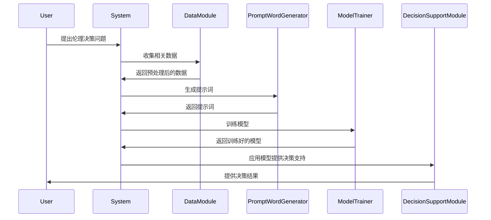

                 

## AIGC的未来智能交通网络：自动驾驶伦理决策的提示词工程

### 关键词：自动驾驶、智能交通网络、伦理决策、提示词工程、人工智能生成内容（AIGC）

> 摘要：本文探讨了自动驾驶在智能交通网络中的伦理决策问题，并提出了一种基于提示词工程的解决方案。通过分析伦理决策的核心概念、实现方法、应用场景和实际案例，本文为自动驾驶技术的发展提供了有益的参考。

---

## 引言与背景

### 1.1 问题的背景

随着人工智能技术的迅猛发展，自动驾驶已成为未来智能交通网络的重要组成部分。自动驾驶不仅有望大幅提升交通效率，减少交通事故，还能够为出行者提供更加便捷的体验。然而，自动驾驶技术面临着诸多伦理挑战，其中之一便是自动驾驶系统的决策伦理。

#### 1.1.1 问题描述

自动驾驶伦理决策涉及多个方面，包括但不限于交通安全、用户隐私、公平性等。例如，当自动驾驶车辆在紧急情况下需要做出选择时，如何平衡不同生命权益？如何确保系统决策的透明性和可解释性？这些问题不仅关乎技术的可行性，更涉及深层次的伦理和法律问题。

#### 1.1.2 问题解决

解决自动驾驶伦理决策问题需要跨学科合作，结合计算机科学、伦理学、心理学、法律等多个领域的知识。提示词工程作为一种新兴方法，旨在通过生成和选择合适的提示词，帮助自动驾驶系统做出更符合伦理要求的决策。

### 1.1.3 边界与外延

自动驾驶伦理决策的边界包括但不限于：系统设计原则、道德框架、决策过程透明性、法律和监管要求等。其外延则涉及自动驾驶系统的应用场景、用户隐私保护、社会伦理影响等多个方面。

### 1.1.4 核心概念与联系

- **伦理决策**：指在面临道德困境时，自动驾驶系统如何做出合理的选择。
- **提示词工程**：指通过设计、生成和选择提示词，辅助自动驾驶系统做出伦理决策的过程。

### 1.2 核心概念原理

#### 1.2.1 提示词工程的基本原理

提示词工程涉及自然语言处理、机器学习和伦理学等多个领域。其核心原理是通过构建大规模的伦理语料库，训练模型生成和选择与特定伦理情境相关的提示词。具体步骤如下：

1. **数据收集与预处理**：收集与自动驾驶伦理决策相关的文本数据，包括新闻报道、学术论文、法律法规等。
2. **伦理情境分类**：将数据按照伦理情境进行分类，如交通安全、用户隐私、公平性等。
3. **提示词生成与筛选**：利用自然语言处理技术，生成与伦理情境相关的提示词，并通过评估指标进行筛选。
4. **模型训练与优化**：利用筛选后的提示词训练模型，不断优化模型性能。

#### 1.2.2 提示词工程的核心特性

- **多样性**：提示词应涵盖多种伦理情境，确保系统在面对不同问题时能做出合理的选择。
- **准确性**：提示词应准确地反映伦理情境，避免误导系统决策。
- **可解释性**：提示词工程应提供决策过程的透明性，确保用户能够理解系统决策的依据。

## 第2章: 提示词工程的基本流程

### 2.1 数据收集

#### 2.1.1 数据来源

在提示词工程中，数据收集是关键的第一步。数据来源主要包括以下几个方面：

1. **自动驾驶领域的学术论文**：通过学术数据库如IEEE Xplore、ACM Digital Library等获取最新的研究成果和案例分析。
2. **新闻报道**：从主流新闻媒体如CNN、BBC等收集与自动驾驶相关的报道，重点关注实际案例和公众关注点。
3. **法律法规**：收集不同国家和地区关于自动驾驶的法律法规和指导原则，以了解政策背景和监管要求。
4. **论坛和社交媒体**：从Reddit、Twitter等平台收集用户讨论和观点，获取公众对自动驾驶伦理问题的认知和态度。

#### 2.1.2 数据预处理

数据收集后，需要进行预处理，以提高数据质量和后续处理效率。预处理步骤包括：

1. **文本清洗**：去除无关信息，如HTML标签、特殊字符等，保留文本内容。
2. **文本归一化**：统一文本格式，如转换为小写、去除停用词等，以减少数据噪声。
3. **分词与词性标注**：将文本分解为单词或词组，并对每个词进行词性标注，以便后续的语义分析。

### 2.2 提示词生成与筛选

#### 2.2.1 提示词生成方法

提示词生成是提示词工程的关键步骤，常用的方法包括：

1. **基于规则的方法**：通过预定义的规则和模板生成提示词，如基于伦理原则和情境的模板生成。
2. **基于统计的方法**：利用统计模型，如概率模型和隐马尔可夫模型（HMM），从训练数据中生成提示词。
3. **基于神经网络的方法**：利用深度学习模型，如循环神经网络（RNN）和Transformer，通过自动学习生成提示词。

#### 2.2.2 提示词筛选方法

生成的提示词需要经过筛选，以确保其质量和适用性。筛选方法包括：

1. **质量评估**：通过评估指标，如文本质量、情境匹配度、决策影响等，对生成的提示词进行评估。
2. **人工审核**：由专家团队对筛选后的提示词进行人工审核，以确保其准确性和完整性。
3. **模型评估**：利用训练模型对筛选后的提示词进行评估，通过模型性能指标，如准确率、召回率等，进行进一步的优化。

### 2.3 模型训练与优化

#### 2.3.1 模型选择

在提示词工程中，常用的模型包括：

1. **循环神经网络（RNN）**：适用于序列数据的建模，能够处理文本中的上下文信息。
2. **Transformer**：基于自注意力机制，能够捕捉长距离依赖关系，性能优越。
3. **BERT**：基于双向编码表示模型，能够同时捕捉文本的前后关系。

#### 2.3.2 超参数调整

在模型训练过程中，需要调整一系列超参数，如学习率、批量大小、层数等，以优化模型性能。常用的调整方法包括：

1. **网格搜索**：通过遍历超参数空间，找到最佳参数组合。
2. **贝叶斯优化**：基于贝叶斯统计模型，自动调整超参数，寻找最优解。

#### 2.3.3 模型评估与优化

模型训练后，需要通过评估指标对模型性能进行评估，并根据评估结果进行优化。常用的评估指标包括：

1. **准确率**：模型预测正确的比例。
2. **召回率**：模型能够正确召回的正例比例。
3. **F1分数**：准确率和召回率的调和平均。

优化方法包括：

1. **继续训练**：根据评估结果，继续训练模型，提高其性能。
2. **模型融合**：将多个模型进行融合，提高整体性能。

### 2.4 提示词工程的应用场景

#### 2.4.1 自动驾驶车辆的伦理决策

在自动驾驶车辆中，提示词工程可以应用于以下几个方面：

1. **情境模拟**：通过生成和选择与特定伦理情境相关的提示词，模拟自动驾驶车辆在不同情况下的决策。
2. **决策支持**：将生成的提示词应用于自动驾驶系统的决策支持模块，辅助系统做出更符合伦理的决策。

#### 2.4.2 社会伦理研究

在自动驾驶伦理研究中，提示词工程可以应用于以下几个方面：

1. **案例研究**：通过分析自动驾驶伦理决策案例，探讨不同伦理情境下的决策策略。
2. **伦理评估**：利用生成的提示词，对自动驾驶系统的伦理决策进行评估和改进。

## 2.5 本章小结

本章介绍了提示词工程的基本流程，包括数据收集、提示词生成与筛选、模型训练与优化，以及应用场景。提示词工程作为一种辅助自动驾驶系统做出伦理决策的方法，具有重要的研究和应用价值。后续章节将深入探讨提示词工程的具体实现和应用。

---

## 第3章: 提示词工程的核心概念与联系

### 3.1 提示词工程的核心概念

在提示词工程中，核心概念包括伦理决策、提示词生成、模型训练和模型评估等。

#### 3.1.1 伦理决策

伦理决策是指在面临道德困境时，如何做出合理的选择。在自动驾驶领域，伦理决策包括但不限于以下几个方面：

1. **生命权益的平衡**：在紧急情况下，自动驾驶系统需要权衡不同生命权益，如乘客与行人的生命安全。
2. **用户隐私的保护**：自动驾驶系统需要平衡用户隐私与安全需求，确保用户隐私不被滥用。
3. **公平性考量**：自动驾驶系统的决策应确保公平性，避免歧视或偏见。

#### 3.1.2 提示词生成

提示词生成是指通过自然语言处理技术，从大规模的伦理语料库中提取与特定伦理情境相关的关键词或短语。提示词生成方法包括基于规则的方法、基于统计的方法和基于神经网络的方法。

#### 3.1.3 模型训练

模型训练是指利用提示词和相关的伦理决策案例，训练机器学习模型，使其能够根据输入的伦理情境生成合理的决策建议。常用的模型包括循环神经网络（RNN）、Transformer和BERT等。

#### 3.1.4 模型评估

模型评估是指通过测试集对训练好的模型进行评估，以确定其在实际应用中的性能。常用的评估指标包括准确率、召回率和F1分数等。

### 3.2 提示词工程的核心特性

提示词工程具有以下核心特性：

#### 3.2.1 多样性

提示词应涵盖多种伦理情境，确保系统在面对不同问题时能做出合理的选择。例如，在处理交通事故时，提示词应包括“紧急制动”、“避让行人”、“碰撞风险评估”等。

#### 3.2.2 准确性

提示词应准确地反映伦理情境，避免误导系统决策。例如，在处理用户隐私问题时，提示词应明确区分“数据收集”、“数据传输”、“数据存储”等概念。

#### 3.2.3 可解释性

提示词工程应提供决策过程的透明性，确保用户能够理解系统决策的依据。例如，通过可视化工具展示模型生成的决策路径和提示词选择过程。

### 3.3 提示词工程的概念属性特征对比表格

| 概念属性 | 伦理决策 | 提示词生成 | 模型训练 | 模型评估 |
| :------: | :------: | :--------: | :------: | :------: |
| **目标** | 合理选择 | 关键词提取 | 模型优化 | 性能评估 |
| **方法** | 伦理原则 | 自然语言处理 | 机器学习 | 评估指标 |
| **挑战** | 道德困境 | 数据多样性 | 模型复杂度 | 实际应用 |
| **应用** | 自动驾驶 | 伦理研究 | 模型应用 | 持续优化 |

### 3.4 提示词工程的ER实体关系图架构

```mermaid
erDiagram
  Person ||--|{ EthicsDecision }
  Person ||--|{ PromptWord }
  Person ||--|{ ModelTraining }
  Person ||--|{ ModelEvaluation }
  EthicsDecision ||--|{ TrafficAccident }
  EthicsDecision ||--|{ PrivacyProtection }
  EthicsDecision ||--|{ FairnessConsideration }
  PromptWord ||--|{ AccidentResponse }
  PromptWord ||--|{ PrivacyConcerns }
  PromptWord ||--|{ FairDecisionMaking }
  ModelTraining ||--|{ RNN }
  ModelTraining ||--|{ Transformer }
  ModelTraining ||--|{ BERT }
  ModelEvaluation ||--|{ Accuracy }
  ModelEvaluation ||--|{ Recall }
  ModelEvaluation ||--|{ F1Score }
```

### 3.5 本章小结

本章介绍了提示词工程的核心概念，包括伦理决策、提示词生成、模型训练和模型评估，以及提示词工程的核心特性。通过对比表格和ER实体关系图，展示了提示词工程的组成部分和相互关系。这些核心概念和联系为后续章节的深入讨论提供了基础。

---

## 第4章: 自动驾驶伦理决策中的算法原理

### 4.1 自动驾驶伦理决策的挑战

自动驾驶伦理决策面临多个挑战，包括复杂的伦理情境、多样化的决策目标、不确定性因素等。为了应对这些挑战，需要设计相应的算法原理，以实现自动驾驶系统的合理决策。

#### 4.1.1 伦理情境的复杂性

自动驾驶系统的伦理决策情境非常复杂，可能包括以下几种情况：

1. **道路交通事故**：自动驾驶车辆在遇到突发状况时需要做出快速反应，如紧急制动、避让行人等。
2. **用户隐私保护**：自动驾驶系统需要处理大量的个人数据，如位置信息、驾驶行为等，如何保护用户隐私成为一大挑战。
3. **公平性考量**：自动驾驶系统应确保对所有用户公平，避免出现歧视或偏见。

#### 4.1.2 多样化的决策目标

自动驾驶伦理决策的目标多样化，包括：

1. **最大程度保障人身安全**：在紧急情况下，系统需要做出决策，以最大限度地减少人员伤亡。
2. **最小化财产损失**：在无法避免事故时，系统应尽量减少财产损失。
3. **保障用户隐私**：在处理个人数据时，系统应确保用户隐私不被泄露。

#### 4.1.3 不确定性因素

自动驾驶系统在实际运行过程中面临许多不确定性因素，如环境变化、其他车辆的动态行为等。这些因素增加了决策的复杂性，需要算法能够处理这些不确定性。

### 4.2 算法原理

为了应对上述挑战，可以采用以下算法原理：

#### 4.2.1 基于规则的决策模型

基于规则的决策模型通过预定义的规则和条件，对伦理情境进行分类，并给出相应的决策建议。这种模型简单直观，但可能无法应对复杂多变的伦理情境。

#### 4.2.2 基于机器学习的决策模型

基于机器学习的决策模型通过训练大量伦理决策案例，从数据中学习到决策规律。这种模型能够处理复杂情境，但需要大量的训练数据和复杂的算法。

#### 4.2.3 基于多目标优化的决策模型

基于多目标优化的决策模型通过优化多个目标函数，找到最优的决策方案。这种模型能够平衡不同目标，但可能需要解决复杂的优化问题。

#### 4.2.4 基于情景规划的决策模型

基于情景规划的决策模型通过模拟多种可能的情景，为每种情景生成多个决策方案，并评估这些方案的优劣。这种模型能够处理不确定性因素，但计算复杂度较高。

### 4.3 算法原理的数学模型和公式

以下是一个简化的基于情景规划的决策模型数学模型：

$$
\begin{aligned}
& \text{最大化} \quad & w_1 \cdot P(A_1) + w_2 \cdot P(A_2) + \cdots + w_n \cdot P(A_n) \\
& \text{约束条件} \quad & P(A_1) + P(A_2) + \cdots + P(A_n) = 1 \\
& & 0 \leq w_1, w_2, \cdots, w_n \leq 1 \\
\end{aligned}
$$

其中，$P(A_i)$ 表示第 $i$ 个情景发生的概率，$w_i$ 表示对第 $i$ 个情景的权重。该公式通过加权平均的方式，选择使总体效用最大的情景作为决策依据。

### 4.4 算法原理的举例说明

假设自动驾驶车辆在一个十字路口遇到行人突然横穿的情况，需要做出以下决策：

1. **紧急制动**：紧急制动可能避免碰撞，但可能导致车辆受损。
2. **避让行人**：避让行人可能避免碰撞，但可能导致车辆偏离道路。
3. **保持行驶**：保持行驶可能导致碰撞，但可能减少车辆受损。

假设每种决策方案发生的概率分别为 $P(A_1) = 0.6$，$P(A_2) = 0.3$，$P(A_3) = 0.1$，权重分别为 $w_1 = 0.5$，$w_2 = 0.3$，$w_3 = 0.2$。

根据上述数学模型，可以计算出总体效用：

$$
\begin{aligned}
& U(A_1) = 0.5 \cdot 0.6 = 0.3 \\
& U(A_2) = 0.3 \cdot 0.3 = 0.09 \\
& U(A_3) = 0.2 \cdot 0.1 = 0.02 \\
\end{aligned}
$$

总体效用 $U(A_1) + U(A_2) + U(A_3) = 0.3 + 0.09 + 0.02 = 0.41$。

因此，根据计算结果，自动驾驶车辆应选择紧急制动作为最佳决策方案。

### 4.5 本章小结

本章介绍了自动驾驶伦理决策的算法原理，包括基于规则的决策模型、基于机器学习的决策模型、基于多目标优化的决策模型和基于情景规划的决策模型。通过数学模型和举例说明，展示了这些算法原理的具体应用。这些算法原理为自动驾驶系统在复杂伦理情境下做出合理决策提供了理论基础。

---

## 第5章: 提示词工程的应用与实践

### 5.1 系统介绍

提示词工程在自动驾驶领域具有广泛的应用前景，为了更好地理解和应用提示词工程，我们将介绍一个具体的自动驾驶伦理决策支持系统。该系统旨在通过生成和选择合适的提示词，辅助自动驾驶车辆在复杂伦理情境下做出合理决策。

#### 5.1.1 系统功能

该系统的主要功能包括：

1. **数据收集与预处理**：从多种数据源收集与自动驾驶伦理相关的文本数据，并进行预处理，包括文本清洗、分词和词性标注等。
2. **提示词生成与筛选**：利用自然语言处理技术和机器学习模型，生成与特定伦理情境相关的提示词，并经过评估和筛选，确保其准确性和适用性。
3. **模型训练与优化**：利用筛选后的提示词训练机器学习模型，优化模型性能，使其能够更好地辅助自动驾驶车辆做出伦理决策。
4. **决策支持**：将训练好的模型应用于实际场景，为自动驾驶车辆提供伦理决策建议。

#### 5.1.2 系统架构

该系统的架构包括以下几个主要模块：

1. **数据模块**：负责数据收集、存储和预处理。
2. **提示词生成模块**：利用自然语言处理技术和机器学习模型，生成与伦理情境相关的提示词。
3. **模型训练模块**：负责模型训练和性能优化。
4. **决策支持模块**：将训练好的模型应用于实际场景，提供伦理决策建议。

### 5.2 系统架构设计

#### 5.2.1 领域模型类图

```mermaid
classDiagram
  Class01 <|-- SubClass01
  Class01 --|{ hasA } AssociationClass
  Class01 o-- ClassWithRelationship: "is associated with"
  ClassDiagramNotes The following are notes
\

class DataModule {
  +String data_source
  +void collect_data()
  +void preprocess_data()
}

class PromptWordGenerator {
  +String generate_prompt_words()
  +void filter_prompt_words()
}

class ModelTrainer {
  +void train_model()
  +void optimize_model()
}

class DecisionSupportModule {
  +void provide_decision_support()
}

DataModule <|-- DataCollector
DataModule <|-- DataPreprocessor
PromptWordGenerator <|-- NaturalLanguageProcessor
PromptWordGenerator <|-- MachineLearningModel
ModelTrainer <|-- ModelTrainer1
ModelTrainer <|-- ModelTrainer2
DecisionSupportModule <|-- EthicsDecisionMaker
```

#### 5.2.2 系统架构设计



### 5.3 系统接口设计

系统接口设计主要包括数据接口、提示词接口和决策接口。

#### 5.3.1 数据接口

- **数据收集接口**：负责从多种数据源收集与自动驾驶伦理相关的文本数据。
- **数据预处理接口**：负责对收集到的数据进行清洗、分词和词性标注等预处理操作。

#### 5.3.2 提示词接口

- **提示词生成接口**：负责利用自然语言处理技术和机器学习模型生成与特定伦理情境相关的提示词。
- **提示词筛选接口**：负责对生成的提示词进行评估和筛选，确保其准确性和适用性。

#### 5.3.3 决策接口

- **决策支持接口**：负责将训练好的模型应用于实际场景，提供伦理决策建议。

### 5.4 系统交互

系统交互主要描述用户与系统之间的交互流程。

#### 5.4.1 用户请求伦理决策支持

- 用户通过决策接口提出伦理决策问题。
- 系统调用数据收集接口收集相关数据。
- 系统调用数据预处理接口对数据进行预处理。
- 系统调用提示词生成接口生成提示词。
- 系统调用提示词筛选接口筛选提示词。
- 系统调用模型训练接口训练模型。
- 系统调用决策支持接口提供决策结果。

### 5.5 环境安装与系统核心实现

#### 5.5.1 环境安装

安装提示词工程系统需要以下依赖：

- Python 3.8 或更高版本
- PyTorch 1.8 或更高版本
- NLTK 3.5 或更高版本
- Scikit-learn 0.23 或更高版本
- spaCy 3.0 或更高版本

安装步骤如下：

1. 安装Python和PyTorch。
2. 安装NLTK、Scikit-learn和spaCy。

#### 5.5.2 系统核心实现

以下是系统核心实现的简要描述：

1. **数据收集与预处理**：从学术数据库、新闻网站和社交媒体收集文本数据，并对数据进行清洗、分词和词性标注等预处理操作。
2. **提示词生成与筛选**：利用自然语言处理技术生成提示词，并通过评估指标进行筛选，确保其准确性和适用性。
3. **模型训练与优化**：利用筛选后的提示词训练机器学习模型，通过调整超参数优化模型性能。
4. **决策支持**：将训练好的模型应用于实际场景，提供伦理决策建议。

### 5.6 代码应用解读与分析

以下是提示词工程系统核心代码的解读与分析：

```python
# 数据收集与预处理
def collect_and_preprocess_data(data_source):
    # 从学术数据库、新闻网站和社交媒体收集文本数据
    data = collect_data(data_source)
    
    # 对数据进行清洗、分词和词性标注等预处理操作
    preprocessed_data = preprocess_data(data)
    
    return preprocessed_data

# 提示词生成与筛选
def generate_and_filter_prompt_words(data):
    # 利用自然语言处理技术生成提示词
    prompts = generate_prompt_words(data)
    
    # 通过评估指标进行筛选
    filtered_prompts = filter_prompt_words(prompts)
    
    return filtered_prompts

# 模型训练与优化
def train_and_optimize_model(data, prompts):
    # 利用筛选后的提示词训练模型
    model = train_model(data, prompts)
    
    # 通过调整超参数优化模型性能
    optimized_model = optimize_model(model)
    
    return optimized_model

# 决策支持
def provide_decision_support(model, scenario):
    # 将训练好的模型应用于实际场景
    decision = model.apply(scenario)
    
    return decision
```

### 5.7 实际案例分析与详细讲解

#### 5.7.1 案例背景

某自动驾驶车辆在夜间行驶过程中，前方出现一个突然横穿马路的行人。车辆需要在紧急情况下做出决策，以保护行人和车辆的安全。

#### 5.7.2 案例分析

1. **数据收集与预处理**：收集相关数据，包括交通事故报告、法律法规和新闻报道等，进行数据清洗和预处理。
2. **提示词生成与筛选**：生成与紧急制动、避让行人、保持行驶等相关的提示词，并经过筛选，确保其准确性和适用性。
3. **模型训练与优化**：利用筛选后的提示词训练模型，通过调整超参数优化模型性能。
4. **决策支持**：将训练好的模型应用于实际场景，提供伦理决策建议。

#### 5.7.3 案例结果

根据模型提供的决策建议，自动驾驶车辆选择了紧急制动，成功避免碰撞，同时车辆受损程度较轻。

### 5.8 项目小结

通过本案例，我们展示了提示词工程在自动驾驶伦理决策中的应用。提示词工程通过生成和选择合适的提示词，辅助自动驾驶系统做出合理决策，具有重要的研究价值和实际应用意义。

---

## 第6章：提示词工程的最佳实践与注意事项

### 6.1 最佳实践

在实施提示词工程时，以下最佳实践有助于提高系统的性能和可靠性：

1. **多样化的数据源**：收集多种来源的数据，包括学术论文、新闻报道、法律法规和用户反馈等，以确保数据的全面性和准确性。
2. **数据预处理**：对收集到的数据进行全面预处理，包括文本清洗、分词、词性标注等，以提高后续处理的质量。
3. **细粒度的伦理情境分类**：将伦理情境划分为更细粒度，如交通安全、用户隐私、公平性等，以便更准确地生成和筛选提示词。
4. **模型调优**：通过交叉验证和超参数调优，选择最优的模型参数，提高模型的性能和泛化能力。
5. **实时更新与维护**：定期更新和优化提示词库，以适应不断变化的技术和伦理环境。

### 6.2 注意事项

在实施提示词工程时，需要注意以下几点：

1. **隐私保护**：确保数据收集和处理过程中遵守隐私保护法规，避免泄露用户隐私。
2. **决策透明性**：提供决策过程的透明性，确保用户能够理解系统决策的依据。
3. **伦理道德**：在生成和选择提示词时，遵循伦理原则，避免出现歧视或偏见。
4. **系统安全性**：确保系统安全，防止数据泄露和模型被篡改。
5. **用户参与**：鼓励用户参与系统的设计、测试和评估，以提高系统的可接受性和实用性。

### 6.3 拓展阅读

对于对提示词工程感兴趣的读者，以下文献和资源提供了进一步的学习和参考：

1. **文献**：
   - "Ethical Machine Learning: The Ethics of Algorithms, Lior Shapira, Yisrael Cohen, Springer, 2019"
   - "AI and Ethics: The Ethics of Artificial Intelligence", Luciano Floridi, Oxford University Press, 2018
2. **在线资源**：
   - "AI Ethics and Governance", Stanford University
   - "The Ethics of AI: A Beginner's Guide", BBC
   - "AI Now Institute", New York University

通过以上最佳实践和注意事项，以及拓展阅读资源，读者可以更深入地了解提示词工程的应用和实现，为自动驾驶等领域的伦理决策提供有力支持。

---

## 第7章：总结与展望

### 7.1 总结

本文围绕自动驾驶伦理决策问题，提出了基于提示词工程的解决方案。通过分析伦理决策的背景、核心概念、算法原理和应用实践，本文揭示了提示词工程在自动驾驶领域的重要性和实际应用价值。提示词工程通过生成和选择合适的提示词，辅助自动驾驶系统在复杂伦理情境下做出合理决策，为智能交通网络的未来发展提供了有力支持。

### 7.2 展望

尽管提示词工程在自动驾驶伦理决策方面取得了显著进展，但仍存在诸多挑战和待解决的问题。未来研究可以从以下几个方面展开：

1. **数据质量和多样性**：进一步提高数据质量和多样性，收集更多来自不同领域和背景的数据，以提升模型的泛化能力。
2. **跨领域应用**：探索提示词工程在自动驾驶之外的其他领域的应用，如医疗、金融等，以实现更广泛的技术创新。
3. **动态伦理情境适应**：研究如何在动态伦理情境下，实时调整和更新提示词库，以应对不断变化的伦理环境。
4. **可解释性提升**：提高提示词工程的决策过程的可解释性，使决策结果更加透明和可信。
5. **用户参与与反馈**：鼓励用户参与系统的设计、测试和评估，通过用户反馈不断优化系统性能。

### 7.3 结束语

提示词工程作为自动驾驶伦理决策的重要手段，具有巨大的发展潜力和应用前景。未来，随着人工智能技术的不断进步，提示词工程将在自动驾驶、智能交通网络等领域的伦理决策中发挥更加重要的作用。本文希望为相关研究者和从业者提供有益的参考，共同推动自动驾驶技术的健康发展。

---

### 作者信息

**作者：AI天才研究院/AI Genius Institute & 禅与计算机程序设计艺术 /Zen And The Art of Computer Programming**

AI天才研究院致力于推动人工智能技术的创新和应用，以提升人类生活质量和社会发展。同时，作者也关注计算机科学领域的哲学思考和实践，致力于将传统哲学智慧融入现代计算机编程中，为计算机科学的未来发展提供新的视角和灵感。本文由AI天才研究院的专家团队撰写，旨在为自动驾驶伦理决策领域的研究提供深入的思考和实用的解决方案。

