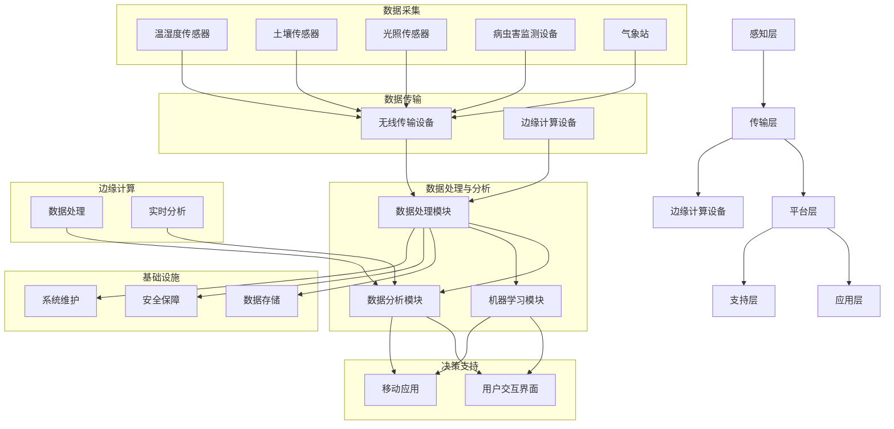
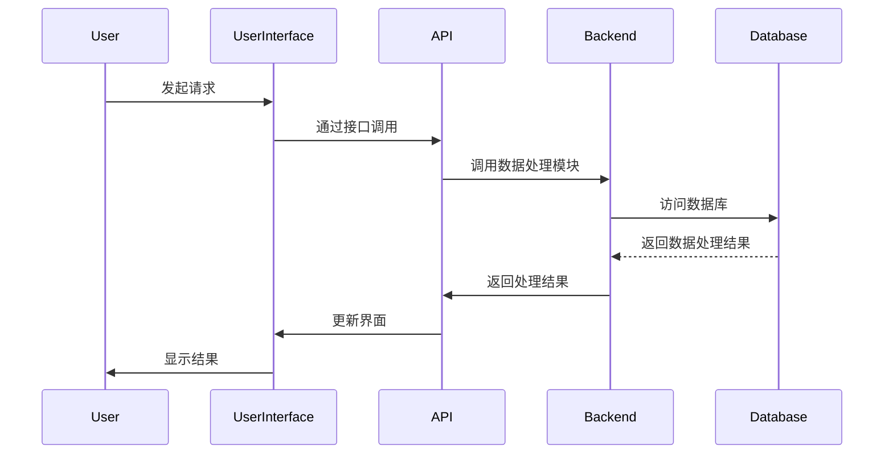

                 


### 1.1.1 人工智能在农业领域的重要性

随着科技的飞速发展，人工智能（Artificial Intelligence, AI）已成为推动各行业变革的重要力量。在农业领域，AI技术的应用极大地提升了农业生产的效率和质量。首先，AI能够通过大数据分析，对农作物的生长环境、生长状况等进行实时监控和预测，从而指导农民进行科学种植。例如，AI系统可以实时收集土壤湿度、温度、光照等数据，通过大数据分析，预测作物的最佳灌溉时间、施肥量和病虫害防治措施。

其次，AI技术还广泛应用于农作物品种改良。传统的作物育种过程通常需要多年甚至数十年的时间，而通过AI技术，尤其是基因组学、机器学习和深度学习等技术的结合，可以大幅缩短育种周期。例如，通过基因编辑技术CRISPR-Cas9，AI可以快速筛选出具有特定优良性状的基因，从而培育出更适应环境变化、产量更高的农作物品种。

此外，AI在农业机器人、无人机、智能灌溉系统等领域的应用，也极大地减轻了农民的劳动强度，提高了农业生产的自动化水平。例如，农业机器人可以自动完成耕种、施肥、收割等农事活动，无人机则可用于农药喷洒、病虫害监测等任务，这些智能设备的广泛应用，不仅提高了农业生产的效率，也保证了农产品的质量和安全性。

总的来说，人工智能在农业领域的应用不仅能够提高生产效率，减少资源浪费，还能促进农业的可持续发展，为全球粮食安全提供有力保障。

### 1.1.2 智能农业的发展趋势

智能农业作为现代农业发展的重要方向，正逐步从理论走向实践。以下是智能农业发展的几个主要趋势：

首先，物联网（Internet of Things, IoT）技术在智能农业中的应用日益广泛。物联网通过将传感器、设备、系统连接起来，实现对农业生产环境的实时监控和管理。例如，智能温室中安装的各种传感器可以实时监测温度、湿度、光照、土壤养分等参数，通过物联网平台进行数据采集、传输和分析，从而实现精准农业管理。

其次，大数据技术在智能农业中的应用也逐渐深入。通过对大量农业数据的收集、存储和分析，大数据技术可以帮助农民更好地了解作物生长状况、市场行情等，从而做出更为科学的决策。例如，利用大数据分析技术，可以预测作物的最佳生长周期，合理安排灌溉、施肥等农事活动，提高产量和品质。

第三，机器学习与人工智能技术的应用正逐渐改变传统的农业生产方式。通过机器学习算法，可以自动识别作物病虫害、预测天气变化、优化农田管理方案等。例如，AI算法可以分析卫星图像，识别作物的健康状态，从而实现精准施肥和灌溉。

第四，区块链技术在农业领域的应用也受到越来越多的关注。区块链技术具有去中心化、不可篡改等特点，可以确保农产品供应链的透明和可追溯。例如，通过区块链技术，可以记录农产品的生产、加工、运输等环节的信息，消费者可以查询产品的真实来源，提高食品安全性和消费者信任度。

最后，智能农业的发展还离不开无人机、农业机器人的支持。无人机可以用于农田监测、农药喷洒、作物收割等任务，而农业机器人则可以实现自动化耕种、施肥、收割等工作，极大地减轻了农民的劳动强度，提高了农业生产的效率。

总的来说，智能农业的发展趋势是综合运用物联网、大数据、人工智能、区块链等多种技术手段，实现农业生产的智能化、精准化和自动化，从而提高农业生产效率、降低生产成本、保障农产品质量，推动农业现代化进程。

### 1.1.3 作物基因优化的关键性

作物基因优化在现代农业中扮演着至关重要的角色。基因是决定作物性状的基本单位，通过基因优化，可以培育出更适应环境变化、产量更高、品质更优的作物品种。以下是作物基因优化在农业中的几个关键性作用：

首先，基因优化有助于提高农作物的抗逆性。随着全球气候变化和极端天气事件频发，农作物面对的生存压力越来越大。通过基因编辑技术，可以筛选并引入具有抗病、抗旱、抗盐碱等优良性状的基因，从而提高农作物的抗逆性，确保其在恶劣环境条件下仍能生长良好，减少因自然灾害导致的产量损失。

其次，基因优化能够提升农作物的产量和品质。通过定向改良农作物的关键基因，可以实现作物早熟、增产、优质等目标。例如，通过基因编辑技术，可以增加作物的光合效率、改善作物的根系结构，从而提高作物对养分和水分的吸收能力，增加产量。同时，基因优化还可以改善作物的营养成分，提高其食用价值和市场竞争力。

第三，基因优化有助于保障农产品的食品安全。通过基因编辑技术，可以消除或减少农作物的有害成分，降低农产品的农药残留和重金属含量，从而提高农产品的安全性。例如，通过基因编辑技术，可以降低作物的过敏原含量，减少因食用农产品而引发的过敏反应。

此外，基因优化还有助于农业的可持续发展。通过培育高产、高效、抗逆的作物品种，可以减少化肥和农药的使用量，降低对环境的污染，实现农业的绿色发展。同时，基因优化还可以促进农作物品种的多样性，增强农业生态系统的稳定性和韧性，提高农业应对未来环境变化的能力。

综上所述，作物基因优化在现代农业中具有不可替代的关键作用。它不仅能够提高农作物的产量和品质，保障食品安全，还能促进农业的可持续发展，为全球粮食安全和农业现代化提供重要支撑。

### 1.2 问题描述

#### 1.2.1 传统农业与智能农业的差异

传统农业与智能农业在多个方面存在显著差异。首先，在数据收集和处理方面，传统农业主要依赖于农民的经验和直觉，缺乏系统化的数据收集和科学分析。而智能农业则利用先进的传感器技术、物联网设备，实现对土壤、气候、作物生长状态的实时监测和数据采集。这些数据通过大数据分析和机器学习算法进行处理，为农民提供科学决策依据。

其次，在决策支持方面，传统农业决策主要依赖于经验和直觉，决策过程缺乏系统性和科学性。而智能农业则利用人工智能技术，通过大数据分析和预测模型，为农民提供精准的种植方案、灌溉计划、病虫害防治建议等，大幅提高了农业决策的效率和准确性。

在效率方面，传统农业劳动强度大，生产过程依赖大量人力，效率较低。而智能农业则通过农业机器人和自动化设备的应用，大大提高了生产效率。例如，农业机器人可以自动完成播种、施肥、灌溉、收割等农事活动，无人机则可用于农药喷洒、病虫害监测等，大幅减轻了农民的劳动强度。

最后，在可持续发展方面，传统农业面临资源浪费、环境污染等问题。而智能农业通过精准施肥、合理用药、节水灌溉等手段，实现了资源的高效利用和农业的可持续发展。此外，智能农业还有助于推动农业产业链的数字化和智能化，提高农产品的市场竞争力。

#### 1.2.2 作物基因优化面临的挑战

作物基因优化在现代农业中具有重要意义，但也面临着一系列挑战。首先，技术复杂度较高。基因编辑技术，如CRISPR-Cas9，虽然已经取得了显著进展，但其操作过程复杂，对实验人员的专业知识和技能要求较高。此外，基因编辑的准确性和安全性仍然是需要解决的重要问题。

其次，数据获取和处理难度大。基因优化需要大量的基因数据和生物信息，而获取和处理这些数据需要先进的技术手段和强大的计算能力。特别是在基因测序和生物信息分析方面，数据量巨大且复杂性高，对数据处理技术提出了极高的要求。

第三，伦理和法律问题亟待解决。基因编辑技术的应用可能涉及伦理和法律问题，如基因改造作物的安全性评估、基因污染风险等。此外，基因编辑技术的商业化应用也需要遵循严格的法律法规，确保其安全性和合法性。

最后，公众接受度低也是一大挑战。基因改造作物的普及可能面临公众的担忧和抵制，需要通过科学普及和沟通，提高公众对基因编辑技术的认知和接受度。

#### 1.2.3 提示词工程的核心作用

提示词工程在作物基因优化过程中发挥着核心作用。提示词是一种用于指导算法进行决策或任务执行的特定词汇或短语。在基因优化中，提示词可以用于指导基因编辑过程，提高基因编辑的准确性和效率。

首先，提示词工程可以帮助确定目标基因和相应的编辑位点。通过大数据分析和机器学习算法，可以从海量的基因数据中筛选出具有特定优良性状的基因，并确定其关键编辑位点。这为基因编辑提供了明确的指导，有助于提高基因编辑的靶向性和准确性。

其次，提示词工程可以优化基因编辑方案。通过分析不同编辑策略的效果，提示词工程可以帮助选择最优的编辑方案，从而提高基因编辑的成功率和效率。例如，针对某些基因突变体，提示词工程可以指导选择合适的编辑工具和编辑参数，优化编辑过程。

此外，提示词工程还可以用于评估基因编辑结果。通过提示词，可以指导算法分析基因编辑后的生物体性状变化，评估编辑效果。例如，提示词可以用于指导算法检测基因编辑后的生物体是否具有预期的优良性状，从而确保基因编辑目标的实现。

总的来说，提示词工程在作物基因优化中起到了关键作用。它不仅提高了基因编辑的准确性和效率，还为整个基因优化过程提供了科学、系统的指导，为现代农业的发展提供了有力支持。

### 1.3.1 AIGC技术概述

AIGC（AI-Generated Content）技术是一种利用人工智能生成内容的方法，通过深度学习、自然语言处理和大数据分析等技术，实现文本、图片、视频等多种内容的高效生成。在农业领域，AIGC技术具有广泛的应用前景，特别是在作物基因优化方面，AIGC技术能够发挥重要的辅助作用。

首先，AIGC技术在基因数据分析和基因编辑中具有重要意义。通过对大量的基因数据进行深度学习和分析，AIGC技术可以识别出具有特定优良性状的基因，并确定其关键编辑位点。这一过程不仅提高了基因编辑的准确性，还大幅缩短了基因筛选和优化的时间。例如，AIGC技术可以分析基因序列，预测基因的功能和作用，从而为基因编辑提供科学依据。

其次，AIGC技术在农业信息自动化生成方面具有显著优势。利用AIGC技术，可以自动生成农业报告、病虫害监测报告、生长状态分析报告等，提高农业信息处理的效率。例如，AIGC技术可以实时分析农田数据，自动生成作物生长状态报告，帮助农民及时了解作物生长情况，调整农事活动。

此外，AIGC技术在农业教育和培训中也具有重要作用。通过AIGC技术，可以自动生成农业课程内容、教学视频和互动课件，提高农业教育和培训的效率。例如，AIGC技术可以根据用户需求，自动生成个性化的农业培训课程，满足不同层次用户的学习需求。

总的来说，AIGC技术在农业领域具有广泛的应用前景。它不仅能够提高基因编辑的准确性和效率，还能够自动化生成农业信息，为农业生产提供科学、系统的指导，推动农业现代化进程。

### 1.3.2 AIGC在农业中的应用

AIGC（AI-Generated Content）技术在农业中的应用正逐步扩展，其潜力在于通过自动化和智能化手段，提高农业生产的效率和质量。以下是AIGC在农业中的几个主要应用场景：

首先，AIGC技术可以用于作物生长模型的构建和预测。通过分析大量农田数据，如土壤湿度、温度、光照强度等，AIGC技术可以生成作物生长模型，预测作物在不同生长阶段的最佳管理策略。例如，AIGC技术可以预测作物的最佳灌溉时间、施肥量和病虫害防治措施，为农民提供科学的种植建议。

其次，AIGC技术在农业数据分析中具有显著优势。通过对大量的农业数据，包括气象数据、作物数据、市场数据等进行分析，AIGC技术可以识别出数据中的模式和趋势，为农业生产提供决策支持。例如，AIGC技术可以分析作物病虫害的分布规律，预测病虫害的高发期，帮助农民提前制定防治措施，减少损失。

此外，AIGC技术在农业教育中也有重要应用。通过AIGC技术，可以自动生成农业课程内容、教学视频和互动课件，提高农业教育和培训的效率。例如，AIGC技术可以根据用户需求，自动生成个性化的农业培训课程，满足不同层次用户的学习需求，从而提高农业技术水平。

最后，AIGC技术在农业自动化管理中发挥着关键作用。利用AIGC技术，可以实现农业生产的自动化控制，例如，通过无人机进行农药喷洒、作物监测和收割等任务，减少人工干预，提高生产效率。例如，AIGC技术可以根据农田数据，自动调整无人机的飞行轨迹和喷洒量，实现精准农业管理。

总的来说，AIGC技术在农业中的应用不仅提高了农业生产的效率和准确性，还推动了农业的智能化和现代化，为农业的未来发展提供了新的可能性。

### 1.3.3 提示词工程的基本原理

提示词工程是一种基于人工智能技术的提示词生成和优化方法，用于指导复杂任务执行和优化决策过程。在农业领域，提示词工程的核心作用是辅助作物基因优化，提高基因编辑的准确性和效率。以下是提示词工程的基本原理：

首先，提示词生成原理。提示词生成是指利用自然语言处理（Natural Language Processing, NLP）和深度学习技术，从大量文本数据中提取出与特定任务相关的关键词或短语。例如，在基因编辑任务中，提示词生成可以提取与基因、突变、编辑位点等相关的词汇。这一过程通常包括文本预处理、词向量表示、关键词提取等步骤。

其次，提示词筛选原理。提示词筛选是指从生成的提示词中筛选出最相关、最有用的提示词。筛选过程可以通过多种方法进行，如基于频率、重要性、相关性等。例如，在基因编辑中，可以筛选出与特定基因编辑目标高度相关的提示词，从而提高基因编辑的靶向性。提示词筛选可以使用机器学习算法和规则方法相结合，以提高筛选效果。

最后，提示词优化原理。提示词优化是指根据任务反馈和性能评估，对已筛选出的提示词进行优化，以提高任务执行效率和准确性。提示词优化可以通过多种方法进行，如提示词权重调整、提示词组合优化、提示词更新等。例如，在基因编辑中，可以根据实验结果调整提示词的权重，优化编辑策略，提高编辑成功率和优良性状的保留率。

总的来说，提示词工程的基本原理是通过提示词生成、筛选和优化，实现复杂任务的高效执行和优化决策。在农业领域，提示词工程为作物基因优化提供了科学、系统的指导，提高了基因编辑的准确性和效率，为现代农业的发展提供了有力支持。

### 1.4.1 提示词工程的应用范围

提示词工程在农业领域具有广泛的应用范围，涵盖了从基因优化到农田管理的多个方面。以下是提示词工程在农业中的几个主要应用场景：

首先，在作物育种中，提示词工程可以用于基因筛选和基因编辑。通过生成与特定性状相关的提示词，提示词工程可以帮助科学家快速定位目标基因，并制定最优的基因编辑方案。例如，在抗病育种中，提示词工程可以提取与抗病基因相关的关键词，指导科学家进行基因编辑，培育出具有抗病能力的作物品种。

其次，在农田管理中，提示词工程可以用于优化灌溉和施肥策略。通过分析农田环境数据和作物生长数据，提示词工程可以生成与土壤湿度、温度、养分含量等相关的提示词，帮助农民制定精准的灌溉和施肥计划。例如，在干旱条件下，提示词工程可以提取与节水灌溉相关的提示词，指导农民进行节水灌溉，提高水资源利用效率。

此外，在病虫害监测和防治中，提示词工程也发挥着重要作用。通过生成与病虫害相关的提示词，提示词工程可以帮助农业专家实时监测病虫害的发生和发展趋势，及时采取防治措施。例如，在病虫害高发期，提示词工程可以提取与农药喷洒、病虫害防治相关的提示词，指导农民进行农药喷洒和病虫害防治。

最后，在农业大数据分析中，提示词工程可以用于数据挖掘和模式识别。通过生成与农业数据相关的提示词，提示词工程可以帮助分析农业数据的潜在模式和规律，为农业生产提供决策支持。例如，在市场预测中，提示词工程可以提取与农产品价格、市场需求等相关的提示词，帮助农民和市场参与者做出更科学的决策。

总的来说，提示词工程在农业领域的应用范围广泛，不仅能够提高作物育种和农田管理的效率，还能够促进农业大数据分析和智能化发展，为现代农业的可持续发展提供有力支持。

### 1.4.2 提示词工程的挑战和局限性

尽管提示词工程在农业领域具有广泛应用，但在实际操作中仍面临一系列挑战和局限性。首先，数据质量是提示词工程面临的关键挑战。高质量的数据是生成有效提示词的前提，但农业领域的数据往往存在噪声、缺失和不一致性等问题，这会影响提示词的准确性和可靠性。

其次，计算资源是另一个重要挑战。提示词工程需要大量的计算资源进行数据预处理、模型训练和提示词生成，特别是在大规模数据集和高维度特征的情况下。缺乏足够的计算资源可能导致模型训练时间过长，影响工程效率和实际应用效果。

此外，算法复杂度也是一个不可忽视的问题。提示词工程涉及多种复杂算法，包括自然语言处理、机器学习、深度学习等。这些算法不仅要求高水平的数学和编程技能，还需要对农业领域有深入的了解。算法的复杂度可能导致工程实现的难度增加，延长开发周期。

最后，模型解释性也是一个重要的挑战。在农业领域，农民和其他利益相关者需要能够理解和解释提示词工程的结果，以便做出科学决策。然而，深度学习模型等复杂的算法往往缺乏透明度和解释性，这给实际应用带来了困难。

总的来说，提示词工程在农业领域虽然具有巨大潜力，但同时也面临数据质量、计算资源、算法复杂度和模型解释性等多方面的挑战和局限性。解决这些问题需要跨学科的合作和不断创新，以实现提示词工程在农业中的广泛应用。

### 1.4.3 未来发展趋势展望

随着科技的不断进步，AIGC（AI-Generated Content）技术在农业领域的应用前景愈发广阔。未来，AIGC技术将向以下几个方向发展：

首先，智能化程度将大幅提升。随着人工智能技术的不断发展，AIGC将更加智能化，能够自动生成更精准的农业报告、作物生长模型和病虫害防治方案。这将大大提高农业生产的效率和科学性，使农民能够更好地应对复杂的农业生产环境。

其次，数据驱动力将不断增强。AIGC技术将依赖于更加丰富和高质量的数据资源，通过大数据分析和机器学习算法，挖掘出更多有价值的信息，为农业生产提供更加科学的决策支持。未来，农业数据将更加全面和实时，数据驱动的农业生产模式将成为主流。

第三，多技术融合将实现更广泛的应用。AIGC技术将与其他前沿技术如物联网、区块链、机器人技术等深度融合，实现农业生产的全流程智能化。例如，通过物联网设备实时监测农田环境，结合区块链技术确保农产品供应链的透明性，机器人技术实现农作物的自动化管理，AIGC技术将推动农业智能化进程。

第四，农业个性化服务将得到推广。随着AIGC技术的发展，农业将更加注重个性化服务，根据不同农田的特定需求和条件，定制化生成最适合的种植方案和管理策略。这将极大地提高农业生产的针对性和效果，满足不同地区和不同农户的多样化需求。

最后，社会接受度和伦理问题将得到更多关注。随着AIGC技术在农业中的应用，公众对于基因编辑、机器人农业等技术的接受度和伦理问题将受到更多关注。通过加强科学普及和伦理教育，提高公众对AIGC技术的理解和信任，将为AIGC技术的广泛应用奠定基础。

总的来说，未来AIGC技术在农业领域的发展将推动农业生产的智能化、个性化、数据化和可持续化，为农业现代化提供新的动力和解决方案。

### 1.5.1 AIGC技术的组成部分

AIGC（AI-Generated Content）技术由多个关键组成部分构成，这些组成部分共同协作，实现高效的内容生成和优化。以下是AIGC技术的核心组成部分：

1. **数据收集与预处理模块**：这是AIGC技术的第一步，涉及从各种来源收集大量数据，包括文本、图像、音频等。数据预处理包括数据清洗、去噪、格式转换等，以确保数据的质量和一致性。高质量的数据是AIGC技术生成高质量内容的基础。

2. **自然语言处理（NLP）模块**：NLP模块负责处理和分析文本数据，包括分词、词性标注、命名实体识别等。这一模块的核心任务是理解文本的语义，提取关键信息，并为后续的生成和优化提供基础。

3. **生成模块**：生成模块是AIGC技术的核心，它利用深度学习模型，如生成对抗网络（GANs）、变分自编码器（VAEs）和转换器（Transformers）等，生成新的文本、图像或视频内容。这一模块通过学习大量训练数据，能够模仿人类创作，生成多样化、具有创意的内容。

4. **优化模块**：优化模块负责对生成的内容进行评估和调整，以提高其质量、相关性和实用性。优化过程可能涉及内容评分、反馈循环、多次迭代等，以确保生成的内容满足特定需求。

5. **用户交互界面**：用户交互界面（UI）是AIGC技术与用户互动的接口，通过简洁直观的界面，用户可以输入需求、查看生成内容，并进行相应的反馈。良好的UI设计能够提高用户体验，增强AIGC技术的实用性和易用性。

6. **后处理模块**：后处理模块负责对生成的最终内容进行编辑、格式化、排版等，确保内容的可读性和美观性。这一模块可能包括文本校对、图像修饰、视频剪辑等，以提高内容的整体质量。

综上所述，AIGC技术的各个组成部分相互配合，共同实现了从数据收集、内容生成到用户交互的全流程，为农业生产提供了强有力的技术支持。

### 1.5.2 作物基因优化的关键环节

作物基因优化是一个复杂而系统性的过程，涉及多个关键环节。以下是作物基因优化的主要关键环节及其具体内容：

首先，**基因定位**是基因优化的第一步。通过基因组测序和大数据分析，科学家可以识别出与特定性状相关的基因区域。这通常涉及全基因组关联分析（GWAS）和基因注释等技术，以确定目标基因的具体位置。

其次，**基因编辑**是基因优化的核心环节。目前，CRISPR-Cas9基因编辑技术是应用最广泛的工具，它通过设计特定的引导RNA（gRNA）来靶向特定的DNA序列进行编辑。基因编辑的目标是引入突变、删除或替换特定基因，以改变作物的性状。

第三，**基因表达调控**是基因优化中的重要一环。通过调控基因表达，科学家可以增强或抑制特定基因的功能，从而实现特定的性状改良。RNA干扰（RNAi）和转录因子调控是常见的基因表达调控方法。

第四，**表型评估**是验证基因优化效果的关键环节。通过表型分析，科学家可以评估基因编辑后作物的新性状，如抗病性、产量、品质等。表型评估通常包括生长速率、植株形态、果实重量和营养成分等指标的测量。

第五，**基因编辑优化**是确保基因编辑效果稳定和持久的重要步骤。这一环节涉及对基因编辑策略的多次迭代和优化，以减少脱靶效应和确保基因编辑的准确性和效率。使用高保真的CRISPR工具和优化编辑参数是常见的优化方法。

最后，**基因编辑后处理**包括对基因编辑作物进行安全性评估和法规审批。这通常涉及对转基因作物的生物学和食品安全性评估，以确保其符合相关法规和标准。

综上所述，作物基因优化的关键环节包括基因定位、基因编辑、基因表达调控、表型评估、基因编辑优化和基因编辑后处理。这些环节相互衔接，共同推动了作物基因优化进程，为现代农业的发展提供了有力支持。

### 1.5.3 提示词工程的实施流程

提示词工程的实施流程是一个系统而有序的过程，包括数据收集、数据预处理、提示词生成、提示词筛选、提示词优化等多个步骤。以下是具体实施流程的详细描述：

首先，**数据收集**是提示词工程的起点。在这一步，需要收集与特定任务相关的数据，如农业领域的作物基因数据、农田环境数据、病虫害数据等。数据来源可以是实地调查、传感器监测、数据库查询等。确保数据的质量和完整性是关键，因为高质量的数据是生成准确提示词的基础。

其次，**数据预处理**是对收集到的数据进行清洗和格式化，以提高数据的质量和一致性。数据预处理包括去除噪声、填补缺失值、统一数据格式等。通过数据预处理，可以减少数据中的异常值和错误，提高后续分析的准确性和效率。

接着，**提示词生成**是提示词工程的核心步骤。在这一步，利用自然语言处理（NLP）和机器学习算法，从预处理后的数据中提取出与任务相关的关键词或短语。常见的提示词生成方法包括关键词提取、词云生成、主题建模等。例如，在作物基因优化的背景下，可以提取与基因、突变、编辑位点等相关的词汇。

然后，**提示词筛选**是对生成的提示词进行筛选，以去除无关或冗余的词汇，确保生成的提示词具有较高的相关性和实用性。提示词筛选可以通过多种方法进行，如基于频率的筛选、基于重要性的筛选、基于相关性的筛选等。例如，在基因编辑任务中，可以筛选出与目标基因和编辑策略高度相关的提示词，以提高基因编辑的准确性和效率。

接下来，**提示词优化**是对筛选后的提示词进行进一步调整和优化，以提高提示词的准确性和实用性。提示词优化可以采用多种策略，如提示词权重调整、提示词组合优化、提示词更新等。例如，可以根据基因编辑实验的结果，调整提示词的权重，优化编辑策略，提高编辑的成功率和优良性状的保留率。

最后，**提示词应用**是将优化后的提示词应用于实际任务中，如基因编辑、农田管理、病虫害防治等。通过提示词的应用，可以辅助决策者进行科学决策，提高任务的执行效率和准确性。

总的来说，提示词工程的实施流程包括数据收集、数据预处理、提示词生成、提示词筛选、提示词优化和提示词应用等多个步骤。这些步骤相互衔接，共同构成了一个完整的提示词工程体系，为复杂任务提供了有效的辅助工具。

### 1.6.1 AIGC技术的组成部分

AIGC（AI-Generated Content）技术由多个核心组成部分构成，这些组成部分相互协同，共同实现高效的内容生成和优化。以下是AIGC技术的具体组成部分：

首先，**数据收集模块**是AIGC技术的起点，负责从各种渠道收集大量文本、图像、音频等多类型数据。数据来源可以是公开数据库、社交媒体、用户生成内容等。数据的质量和多样性直接影响AIGC生成内容的丰富性和准确性。

其次，**数据预处理模块**对收集到的数据进行分析、清洗和格式化，以提高数据的质量和一致性。数据预处理包括去除噪声、填补缺失值、统一数据格式等。这一步骤确保数据能够被有效利用，为后续分析提供可靠的基础。

第三，**自然语言处理（NLP）模块**负责处理和分析文本数据，提取关键信息并进行语义理解。NLP技术包括分词、词性标注、命名实体识别、情感分析等。通过NLP技术，AIGC能够理解文本的语义，生成更加准确和相关的文本内容。

第四，**图像处理模块**负责处理和分析图像数据，包括图像分类、目标检测、图像生成等。图像处理技术如卷积神经网络（CNNs）和生成对抗网络（GANs）能够自动生成高质量的图像，为AIGC技术提供丰富的视觉内容。

第五，**生成模块**是AIGC技术的核心，利用深度学习模型如生成对抗网络（GANs）、变分自编码器（VAEs）和转换器（Transformers）等，生成新的文本、图像或视频内容。生成模块通过大量训练数据学习，模仿人类的创作过程，生成多样化、具有创意的内容。

第六，**优化模块**对生成的内容进行评估和调整，以提高其质量、相关性和实用性。优化模块可以通过内容评分、反馈循环、多次迭代等手段，确保生成内容满足特定需求。

最后，**用户交互界面（UI）**是AIGC技术与用户互动的接口，提供简洁直观的界面，用户可以输入需求、查看生成内容，并进行反馈。良好的UI设计能够提升用户体验，增强AIGC技术的实用性和易用性。

综上所述，AIGC技术的组成部分包括数据收集模块、数据预处理模块、NLP模块、图像处理模块、生成模块、优化模块和用户交互界面，这些模块相互配合，共同实现了从数据输入到内容生成的完整流程，为AIGC技术在农业和其他领域的广泛应用提供了坚实的基础。

### 1.5.3 提示词工程的实施流程

提示词工程的实施流程是一个系统而有序的过程，包括数据收集、数据预处理、提示词生成、提示词筛选、提示词优化等多个步骤。以下是具体实施流程的详细描述：

首先，**数据收集**是提示词工程的起点。在这一步，需要收集与特定任务相关的数据，如农业领域的作物基因数据、农田环境数据、病虫害数据等。数据来源可以是实地调查、传感器监测、数据库查询等。确保数据的质量和完整性是关键，因为高质量的数据是生成准确提示词的基础。

其次，**数据预处理**是对收集到的数据进行清洗和格式化，以提高数据的质量和一致性。数据预处理包括去除噪声、填补缺失值、统一数据格式等。通过数据预处理，可以减少数据中的异常值和错误，提高后续分析的准确性和效率。

接着，**提示词生成**是提示词工程的核心步骤。在这一步，利用自然语言处理（NLP）和机器学习算法，从预处理后的数据中提取出与任务相关的关键词或短语。常见的提示词生成方法包括关键词提取、词云生成、主题建模等。例如，在作物基因优化的背景下，可以提取与基因、突变、编辑位点等相关的词汇。

然后，**提示词筛选**是对生成的提示词进行筛选，以去除无关或冗余的词汇，确保生成的提示词具有较高的相关性和实用性。提示词筛选可以通过多种方法进行，如基于频率的筛选、基于重要性的筛选、基于相关性的筛选等。例如，在基因编辑任务中，可以筛选出与目标基因和编辑策略高度相关的提示词，以提高基因编辑的准确性和效率。

接下来，**提示词优化**是对筛选后的提示词进行进一步调整和优化，以提高提示词的准确性和实用性。提示词优化可以采用多种策略，如提示词权重调整、提示词组合优化、提示词更新等。例如，可以根据基因编辑实验的结果，调整提示词的权重，优化编辑策略，提高编辑的成功率和优良性状的保留率。

最后，**提示词应用**是将优化后的提示词应用于实际任务中，如基因编辑、农田管理、病虫害防治等。通过提示词的应用，可以辅助决策者进行科学决策，提高任务的执行效率和准确性。

总的来说，提示词工程的实施流程包括数据收集、数据预处理、提示词生成、提示词筛选、提示词优化和提示词应用等多个步骤。这些步骤相互衔接，共同构成了一个完整的提示词工程体系，为复杂任务提供了有效的辅助工具。

### 1.6.1 AIGC技术的组成部分

AIGC（AI-Generated Content）技术由多个核心组成部分构成，这些组成部分相互协同，共同实现高效的内容生成和优化。以下是AIGC技术的具体组成部分：

首先，**数据收集模块**是AIGC技术的起点，负责从各种渠道收集大量文本、图像、音频等多类型数据。数据来源可以是公开数据库、社交媒体、用户生成内容等。数据的质量和多样性直接影响AIGC生成内容的丰富性和准确性。

其次，**数据预处理模块**对收集到的数据进行分析、清洗和格式化，以提高数据的质量和一致性。数据预处理包括去除噪声、填补缺失值、统一数据格式等。这一步骤确保数据能够被有效利用，为后续分析提供可靠的基础。

第三，**自然语言处理（NLP）模块**负责处理和分析文本数据，提取关键信息并进行语义理解。NLP技术包括分词、词性标注、命名实体识别、情感分析等。通过NLP技术，AIGC能够理解文本的语义，生成更加准确和相关的文本内容。

第四，**图像处理模块**负责处理和分析图像数据，包括图像分类、目标检测、图像生成等。图像处理技术如卷积神经网络（CNNs）和生成对抗网络（GANs）能够自动生成高质量的图像，为AIGC技术提供丰富的视觉内容。

第五，**生成模块**是AIGC技术的核心，利用深度学习模型如生成对抗网络（GANs）、变分自编码器（VAEs）和转换器（Transformers）等，生成新的文本、图像或视频内容。生成模块通过大量训练数据学习，模仿人类的创作过程，生成多样化、具有创意的内容。

第六，**优化模块**对生成的内容进行评估和调整，以提高其质量、相关性和实用性。优化模块可以通过内容评分、反馈循环、多次迭代等手段，确保生成内容满足特定需求。

最后，**用户交互界面（UI）**是AIGC技术与用户互动的接口，提供简洁直观的界面，用户可以输入需求、查看生成内容，并进行反馈。良好的UI设计能够提升用户体验，增强AIGC技术的实用性和易用性。

综上所述，AIGC技术的组成部分包括数据收集模块、数据预处理模块、NLP模块、图像处理模块、生成模块、优化模块和用户交互界面，这些模块相互配合，共同实现了从数据输入到内容生成的完整流程，为AIGC技术在农业和其他领域的广泛应用提供了坚实的基础。

### 1.6.2 作物基因优化的关键环节

作物基因优化是一个复杂而系统性的过程，涉及多个关键环节。以下是作物基因优化的主要关键环节及其具体内容：

首先，**基因定位**是基因优化的第一步。通过基因组测序和大数据分析，科学家可以识别出与特定性状相关的基因区域。这通常涉及全基因组关联分析（GWAS）和基因注释等技术，以确定目标基因的具体位置。

其次，**基因编辑**是基因优化的核心环节。目前，CRISPR-Cas9基因编辑技术是应用最广泛的工具，它通过设计特定的引导RNA（gRNA）来靶向特定的DNA序列进行编辑。基因编辑的目标是引入突变、删除或替换特定基因，以改变作物的性状。

第三，**基因表达调控**是基因优化中的重要一环。通过调控基因表达，科学家可以增强或抑制特定基因的功能，从而实现特定的性状改良。RNA干扰（RNAi）和转录因子调控是常见的基因表达调控方法。

第四，**表型评估**是验证基因优化效果的关键环节。通过表型分析，科学家可以评估基因编辑后作物的新性状，如抗病性、产量、品质等。表型评估通常包括生长速率、植株形态、果实重量和营养成分等指标的测量。

第五，**基因编辑优化**是确保基因编辑效果稳定和持久的重要步骤。这一环节涉及对基因编辑策略的多次迭代和优化，以减少脱靶效应和确保基因编辑的准确性和效率。使用高保真的CRISPR工具和优化编辑参数是常见的优化方法。

最后，**基因编辑后处理**包括对基因编辑作物进行安全性评估和法规审批。这通常涉及对转基因作物的生物学和食品安全性评估，以确保其符合相关法规和标准。

综上所述，作物基因优化的关键环节包括基因定位、基因编辑、基因表达调控、表型评估、基因编辑优化和基因编辑后处理。这些环节相互衔接，共同推动了作物基因优化进程，为现代农业的发展提供了有力支持。

### 1.6.3 提示词工程的实施流程

提示词工程的实施流程是一个系统而有序的过程，包括数据收集、数据预处理、提示词生成、提示词筛选、提示词优化等多个步骤。以下是具体实施流程的详细描述：

首先，**数据收集**是提示词工程的起点。在这一步，需要收集与特定任务相关的数据，如农业领域的作物基因数据、农田环境数据、病虫害数据等。数据来源可以是实地调查、传感器监测、数据库查询等。确保数据的质量和完整性是关键，因为高质量的数据是生成准确提示词的基础。

其次，**数据预处理**是对收集到的数据进行清洗和格式化，以提高数据的质量和一致性。数据预处理包括去除噪声、填补缺失值、统一数据格式等。通过数据预处理，可以减少数据中的异常值和错误，提高后续分析的准确性和效率。

接着，**提示词生成**是提示词工程的核心步骤。在这一步，利用自然语言处理（NLP）和机器学习算法，从预处理后的数据中提取出与任务相关的关键词或短语。常见的提示词生成方法包括关键词提取、词云生成、主题建模等。例如，在作物基因优化的背景下，可以提取与基因、突变、编辑位点等相关的词汇。

然后，**提示词筛选**是对生成的提示词进行筛选，以去除无关或冗余的词汇，确保生成的提示词具有较高的相关性和实用性。提示词筛选可以通过多种方法进行，如基于频率的筛选、基于重要性的筛选、基于相关性的筛选等。例如，在基因编辑任务中，可以筛选出与目标基因和编辑策略高度相关的提示词，以提高基因编辑的准确性和效率。

接下来，**提示词优化**是对筛选后的提示词进行进一步调整和优化，以提高提示词的准确性和实用性。提示词优化可以采用多种策略，如提示词权重调整、提示词组合优化、提示词更新等。例如，可以根据基因编辑实验的结果，调整提示词的权重，优化编辑策略，提高编辑的成功率和优良性状的保留率。

最后，**提示词应用**是将优化后的提示词应用于实际任务中，如基因编辑、农田管理、病虫害防治等。通过提示词的应用，可以辅助决策者进行科学决策，提高任务的执行效率和准确性。

总的来说，提示词工程的实施流程包括数据收集、数据预处理、提示词生成、提示词筛选、提示词优化和提示词应用等多个步骤。这些步骤相互衔接，共同构成了一个完整的提示词工程体系，为复杂任务提供了有效的辅助工具。

## 第2章 核心概念与联系

### 2.1 AIGC技术

#### 2.1.1 AIGC的定义

AIGC（AI-Generated Content）是指通过人工智能技术自动生成内容的过程，包括文本、图像、音频、视频等多种形式。AIGC技术结合了自然语言处理（NLP）、计算机视觉（CV）、机器学习和深度学习等多种先进技术，能够根据用户需求或特定场景生成高质量、个性化、多样化的内容。

#### 2.1.2 AIGC的核心原理

AIGC的核心原理是基于大量数据的学习和模型训练，通过深度神经网络（DNN）、生成对抗网络（GAN）、变分自编码器（VAE）等模型，实现数据的生成、转换和优化。以下是AIGC技术的核心原理：

1. **数据学习**：AIGC技术首先从海量数据中学习，通过数据预处理和特征提取，提取出数据中的关键特征和模式。

2. **模型训练**：利用提取的关键特征，通过深度神经网络等模型进行训练，使模型能够自动学习数据的生成规律和模式。

3. **内容生成**：通过训练好的模型，对新的数据进行输入，模型能够根据学习到的规律和模式，生成新的、高质量的内容。

4. **内容优化**：生成的内容通过多次迭代和优化，不断提高内容的质量和相关性，以满足用户需求和特定场景的要求。

#### 2.1.3 AIGC的分类

AIGC技术根据生成的内容类型和应用场景，可以分为以下几类：

1. **文本生成**：通过自然语言处理（NLP）技术，生成高质量的文本内容，如文章、故事、新闻报道等。

2. **图像生成**：通过计算机视觉（CV）技术，生成高质量的图像内容，如图像合成、人脸生成、风景生成等。

3. **音频生成**：通过音频处理技术，生成高质量的音频内容，如音乐、语音合成等。

4. **视频生成**：通过视频处理技术，生成高质量的视频内容，如视频合成、视频编辑等。

### 2.2 作物基因优化

#### 2.2.1 基因优化的定义

基因优化是指通过改变生物体的基因组，使其获得特定的优良性状，从而提高生物体的适应性和生产性能。基因优化在农业、医学、生物技术等领域具有重要意义。

#### 2.2.2 基因优化的方法

基因优化主要包括以下几种方法：

1. **基因编辑**：通过基因编辑技术，如CRISPR-Cas9，对目标基因进行精准编辑，改变基因序列，以实现特定的性状改良。

2. **基因表达调控**：通过调控基因表达，如RNA干扰（RNAi）和转录因子调控，增强或抑制特定基因的功能，实现性状改良。

3. **基因突变**：通过诱导基因突变，筛选出具有特定优良性状的突变体，进行进一步研究和应用。

4. **基因工程**：通过基因工程技术，将外源基因导入生物体，改变其基因组，实现特定的性状改良。

#### 2.2.3 基因优化的效果评估

基因优化的效果评估主要通过以下指标：

1. **表型评估**：评估基因优化后生物体的性状变化，如生长速率、抗病性、产量等。

2. **基因组评估**：评估基因优化后生物体的基因组变化，如基因序列、基因表达等。

3. **功能评估**：评估基因优化后生物体的功能变化，如蛋白质功能、代谢途径等。

### 2.3 提示词工程

#### 2.3.1 提示词工程的概念

提示词工程是指通过自然语言处理（NLP）和机器学习技术，生成和优化用于指导算法执行任务的关键词或短语。提示词工程在基因优化、农业管理、文本生成等领域具有重要意义。

#### 2.3.2 提示词工程的流程

提示词工程的流程主要包括以下步骤：

1. **数据收集**：收集与任务相关的文本数据，如科研论文、技术文档、农业报告等。

2. **数据预处理**：对收集到的数据进行分析、清洗和格式化，提取出与任务相关的特征。

3. **提示词生成**：利用NLP技术，从预处理后的数据中提取关键词或短语，形成初步的提示词列表。

4. **提示词筛选**：对生成的提示词进行筛选，去除无关或冗余的词汇，确保提示词的相关性和实用性。

5. **提示词优化**：对筛选后的提示词进行优化，调整权重、组合等，提高提示词的准确性。

6. **提示词应用**：将优化后的提示词应用于实际任务中，如基因编辑、农业管理、文本生成等。

#### 2.3.3 提示词工程的效果评估

提示词工程的效果评估主要通过以下指标：

1. **相关性评估**：评估提示词与任务目标的相关性，确保生成的提示词能够准确指导算法执行任务。

2. **准确性评估**：评估提示词工程生成的结果是否符合预期，如基因编辑的成功率、农业管理的准确性等。

3. **实用性评估**：评估提示词工程在实际应用中的效果，如提示词的实用性、用户满意度等。

### 2.4 AIGC、作物基因优化与提示词工程之间的关系

#### 2.4.1 相互作用机制

AIGC、作物基因优化和提示词工程之间具有密切的相互作用机制。具体体现在以下几个方面：

1. **AIGC技术在基因优化中的应用**：AIGC技术可以通过生成和优化基因数据、分析报告等，为作物基因优化提供科学依据和决策支持。

2. **提示词工程在AIGC中的应用**：提示词工程可以用于指导AIGC技术生成的内容，确保内容的相关性和准确性，提高AIGC技术的应用效果。

3. **作物基因优化对AIGC技术的要求**：作物基因优化对AIGC技术提出了更高的要求，如数据质量、分析精度、结果可靠性等，推动AIGC技术的不断发展和完善。

#### 2.4.2 相互影响效应

AIGC、作物基因优化和提示词工程之间的相互影响效应主要体现在以下几个方面：

1. **促进农业现代化**：AIGC技术和作物基因优化共同推动了农业现代化进程，提高了农业生产效率、产品质量和可持续发展能力。

2. **提高决策科学性**：提示词工程为AIGC和作物基因优化提供了科学、系统的指导，提高了决策的准确性和科学性。

3. **推动技术创新**：AIGC、作物基因优化和提示词工程之间的相互作用，促进了相关技术的不断发展和创新，为农业领域的科技进步提供了新动力。

#### 2.4.3 三者融合发展的前景

AIGC、作物基因优化和提示词工程的融合发展前景广阔，主要体现在以下几个方面：

1. **智能化农业**：通过AIGC技术和作物基因优化的结合，可以实现智能农业的全面应用，提高农业生产的智能化水平。

2. **精准农业**：提示词工程可以为AIGC和作物基因优化提供精准的决策支持，推动精准农业的发展。

3. **农业大数据**：AIGC技术和作物基因优化可以生成和利用大量农业数据，为农业大数据应用提供有力支持。

4. **农业创新**：三者的融合发展将推动农业技术的不断创新，为农业现代化和可持续发展提供新的解决方案。

### 2.5 概念属性特征对比表格

为了更直观地了解AIGC、作物基因优化和提示词工程的概念属性特征，以下是它们的对比表格：

| 概念 | 定义 | 应用领域 | 特征 | 关键技术 |
| --- | --- | --- | --- | --- |
| AIGC | AI生成内容 | 文本、图像、音频、视频生成 | 多样化、个性化、高效 | 深度学习、自然语言处理、计算机视觉 |
| 作物基因优化 | 改变作物基因组以改良性状 | 农业、生物技术 | 精准、高效、可持续 | CRISPR-Cas9、基因编辑、基因表达调控 |
| 提示词工程 | 生成和优化指导关键词或短语 | 基因优化、农业管理、文本生成 | 相关性高、实用性强、可优化 | 自然语言处理、机器学习、数据筛选 |

### 2.6 ER实体关系图架构

为了更好地展示AIGC、作物基因优化和提示词工程之间的实体关系，以下是ER实体关系图架构：

```
[用户] --> [数据源]
[数据源] --> [数据预处理模块]
[数据预处理模块] --> [自然语言处理模块]
[自然语言处理模块] --> [提示词生成模块]
[提示词生成模块] --> [提示词筛选模块]
[提示词筛选模块] --> [提示词优化模块]
[提示词优化模块] --> [作物基因优化系统]
[作物基因优化系统] --> [作物基因优化]
[作物基因优化] --> [AIGC系统]
[AIGC系统] --> [用户]
```

在上述ER实体关系图中，用户作为数据源提供者，通过数据预处理、自然语言处理等步骤，生成和优化提示词，最终应用于作物基因优化系统，实现农业生产的智能化和精准化。

## 第3章 算法原理讲解

### 3.1 算法概述

提示词工程算法是基因优化领域的重要组成部分，其核心目标是通过自然语言处理（NLP）和机器学习技术，生成和优化用于指导基因编辑的关键提示词。这些提示词不仅需要具有高度的准确性，还需要能够准确反映基因编辑的目标和需求。以下是对提示词工程算法的基本概念、分类和目标进行概述。

#### 3.1.1 提示词工程算法的基本概念

提示词工程算法是一种基于人工智能的自动化方法，用于生成和优化提示词。提示词是用于指导算法执行特定任务的关键词汇或短语，它们在农业领域的基因优化中起着至关重要的作用。具体来说，提示词工程算法包括以下几个基本概念：

1. **关键词提取**：从大量文本数据中提取出与任务相关的关键词。
2. **语义分析**：理解文本的语义，提取关键信息。
3. **模式识别**：识别文本中的潜在模式和规律。
4. **提示词生成**：根据关键词和语义分析结果，生成初步的提示词列表。
5. **提示词优化**：对生成的提示词进行筛选和调整，以提高其准确性和实用性。

#### 3.1.2 提示词工程算法的分类

根据应用场景和任务需求，提示词工程算法可以分为以下几类：

1. **基于规则的方法**：通过预定义的规则和模式，从文本数据中提取提示词。这种方法简单直观，但灵活性较低。
2. **基于统计的方法**：利用文本数据的统计特性，如词频、互信息等，提取提示词。这种方法具有较强的泛化能力，但可能受到噪声和数据质量的影响。
3. **基于机器学习的方法**：利用机器学习算法，如决策树、支持向量机（SVM）、随机森林等，从大量文本数据中学习并提取提示词。这种方法具有较高的准确性和灵活性，但需要大量的训练数据和计算资源。
4. **基于深度学习的方法**：利用深度学习模型，如卷积神经网络（CNN）、循环神经网络（RNN）、生成对抗网络（GAN）等，从文本数据中生成和优化提示词。这种方法在处理大规模数据和复杂语义时具有显著优势，但计算资源需求较高。

#### 3.1.3 提示词工程算法的目标

提示词工程算法的主要目标是生成和优化具有高相关性和实用性的提示词，以满足基因编辑任务的需求。具体目标包括：

1. **准确性**：确保生成的提示词与基因编辑目标高度相关，准确反映基因编辑任务的需求。
2. **实用性**：提示词应具有实际应用价值，能够辅助科学家进行高效的基因编辑。
3. **灵活性**：算法应具备较强的适应性，能够处理不同类型的数据和任务需求。
4. **效率**：算法应具有较高的计算效率和执行速度，以满足实时应用的需求。

通过实现上述目标，提示词工程算法能够为基因优化提供强有力的技术支持，推动农业科技的进步和发展。

### 3.2 算法流程图

提示词工程算法的流程图展示了从数据输入到提示词生成的完整过程。以下是一个简化的流程图：

```
+----------------+    +----------------+    +----------------+
| 数据收集       |    | 数据预处理     |    | 提示词生成     |
+----------------+    +----------------+    +----------------+
      ↓                      ↓                      ↓
+----------------+    +----------------+    +----------------+
| 自然语言处理   |    | 关键词提取     |    | 语义分析       |
+----------------+    +----------------+    +----------------+
      ↓                      ↓                      ↓
+----------------+    +----------------+    +----------------+
| 提示词生成     |    | 提示词筛选     |    | 提示词优化     |
+----------------+    +----------------+    +----------------+

```

**详细流程解释**：

1. **数据收集**：从各类数据源（如科研论文、技术文档、数据库等）收集与基因编辑相关的文本数据。

2. **数据预处理**：对收集到的文本数据进行分析、清洗和格式化，去除噪声和冗余信息，确保数据质量。

3. **自然语言处理**：利用NLP技术对预处理后的文本数据进行分析，包括分词、词性标注、命名实体识别等，提取文本中的关键信息。

4. **关键词提取**：从自然语言处理的结果中提取与基因编辑相关的关键词，这些关键词将作为初步的提示词候选。

5. **语义分析**：通过深度学习模型，如Transformer或BERT，对提取的关键词进行语义分析，理解关键词之间的关系和上下文含义。

6. **提示词生成**：利用提取的关键词和语义分析结果，生成初步的提示词列表。这一步骤通常涉及模式识别和主题建模技术。

7. **提示词筛选**：对生成的提示词进行筛选，去除无关或冗余的词汇，确保提示词的相关性和实用性。

8. **提示词优化**：对筛选后的提示词进行优化，通过调整权重、组合和迭代等策略，提高提示词的准确性和实用性。

通过上述流程，提示词工程算法能够生成高质量的提示词，为基因编辑提供科学的指导和决策支持。

### 3.3 数学模型与公式

在提示词工程算法中，数学模型和公式起着关键作用，它们用于描述数据分析和提示词生成的过程。以下是几个主要的数学模型和公式的推导和解释：

#### 3.3.1 提示词工程算法的数学模型

提示词工程算法的核心数学模型通常包括以下几个部分：

1. **词频模型**：词频（Term Frequency, TF）是衡量一个词在文本中重要性的基本指标，公式如下：

   $$ TF(t) = \frac{f_{t,d}}{d} $$

   其中，$f_{t,d}$ 表示词 $t$ 在文档 $d$ 中的频率，$d$ 表示文档的总词数。

2. **逆文档频率模型**：逆文档频率（Inverse Document Frequency, IDF）用于调整词频，以反映词的重要程度，公式如下：

   $$ IDF(t) = \log \left( \frac{N}{|d_t|} \right) $$

   其中，$N$ 表示文档总数，$d_t$ 表示包含词 $t$ 的文档数。

3. **TF-IDF模型**：TF-IDF（Term Frequency-Inverse Document Frequency）模型结合了词频和逆文档频率，用于计算词的重要程度，公式如下：

   $$ TF-IDF(t, d) = TF(t, d) \times IDF(t) $$

4. **词嵌入模型**：词嵌入（Word Embedding）是将词转换为向量表示的方法，常见的词嵌入模型包括Word2Vec、GloVe等。以Word2Vec为例，其核心公式如下：

   $$ \vec{v}_t = \sum_{j=1}^{k} \alpha_j \vec{v}_j $$

   其中，$\vec{v}_t$ 是词 $t$ 的向量表示，$\alpha_j$ 是词 $t$ 在上下文中的权重，$\vec{v}_j$ 是上下文词的向量表示。

#### 3.3.2 公式推导与解释

1. **词频（TF）推导**：

   词频是衡量一个词在特定文档中出现的频率，频率越高，说明这个词在该文档中越重要。词频的计算直接反映了词在文档中的分布情况。

2. **逆文档频率（IDF）推导**：

   逆文档频率用于平衡词频，解决高频词（如“的”、“在”等）在所有文档中普遍存在的问题。IDF通过计算包含特定词的文档数与总文档数之比，对词频进行加权，从而降低高频词的影响。

3. **TF-IDF公式解释**：

   TF-IDF模型通过结合词频和逆文档频率，综合衡量一个词在文档中的重要性。TF-IDF值越高，说明这个词在特定文档中既高频出现，又在其他文档中罕见，因此具有重要意义。

4. **词嵌入（Word Embedding）公式解释**：

   词嵌入通过将词转换为向量表示，实现语义表示。词向量能够捕捉词与词之间的相似性，从而在语义分析中发挥重要作用。Word2Vec模型通过上下文词的加权求和，生成一个表示词的向量。

通过上述数学模型和公式的推导与解释，提示词工程算法能够从大量文本数据中提取出具有高相关性的关键词，为基因编辑提供科学的提示词支持。

### 3.4 算法原理详细讲解

#### 3.4.1 提示词生成原理

提示词生成是提示词工程中的关键步骤，其目标是从大量文本数据中提取出与基因编辑任务相关的关键词或短语。以下是提示词生成的原理：

首先，从数据源中收集与基因编辑相关的文本数据，如科研论文、技术文档、农业报告等。这些文本数据包含了丰富的基因、突变、编辑位点等与任务相关的信息。

其次，对收集到的文本数据进行分析和预处理，包括去除噪声、标点符号、停用词等。这一步骤的目的是提高数据的质量，为后续分析提供可靠的基础。

接着，利用自然语言处理（NLP）技术，对预处理后的文本数据进行分析。具体方法包括分词、词性标注、命名实体识别等。通过这些步骤，可以将文本数据分解为单个词语，并识别出与基因编辑相关的实体和概念。

然后，从分析结果中提取关键词。常用的方法包括基于频率的关键词提取、基于重要性的关键词提取和基于主题模型的关键词提取等。例如，可以使用TF-IDF模型计算每个词在文档中的重要程度，提取出高频且与其他词具有较高相关性的关键词。

接下来，对提取的关键词进行筛选和优化。筛选过程旨在去除无关或冗余的关键词，确保提示词的相关性和实用性。优化过程可以通过调整关键词的权重、组合和迭代等策略，提高提示词的准确性和实用性。

最后，生成最终的提示词列表。这一列表将用于指导基因编辑任务，辅助科学家进行高效的基因编辑。

#### 3.4.2 提示词筛选原理

提示词筛选是确保生成的提示词具有高相关性和实用性的关键步骤。以下是提示词筛选的原理：

首先，从提示词生成阶段提取出的初步提示词列表中，筛选出与基因编辑任务相关的高频关键词。这一步骤可以使用多种方法，如基于频率的筛选、基于重要性的筛选和基于相关性的筛选等。

1. **基于频率的筛选**：选择频率较高的关键词，这些词在文档中出现的次数较多，可能具有较高的相关性。例如，可以使用TF-IDF模型计算每个词的TF-IDF值，筛选出TF-IDF值较高的关键词。

2. **基于重要性的筛选**：通过分析关键词与其他词的语义关系，选择重要性较高的关键词。例如，可以使用词嵌入模型（如Word2Vec或GloVe）计算关键词的语义相似度，选择与其他关键词具有较高相似度的关键词。

3. **基于相关性的筛选**：根据基因编辑任务的需求，选择与任务目标高度相关的关键词。例如，在作物基因编辑中，可以筛选出与基因、突变、编辑位点等相关的关键词。

接着，对筛选出的关键词进行进一步处理和优化。这一步骤可以通过调整关键词的权重、组合和迭代等策略，提高提示词的准确性和实用性。例如，可以根据关键词在任务中的实际表现，调整其权重，使重要的关键词在提示词中占据更高的比重。

最后，生成最终的提示词列表。这一列表将用于指导基因编辑任务，辅助科学家进行高效的基因编辑。通过精确筛选和优化，确保生成的提示词具有高相关性和实用性，为基因编辑提供科学、系统的指导。

#### 3.4.3 提示词优化原理

提示词优化是提高提示词准确性和实用性的关键步骤。以下是提示词优化的原理：

首先，对初步筛选出的提示词列表进行分析和评估。这一步骤旨在了解每个提示词在基因编辑任务中的实际表现，识别出可能存在的问题和改进空间。

接着，根据评估结果，对提示词进行优化。优化策略可以包括以下几种：

1. **权重调整**：根据提示词在任务中的实际表现，调整其权重。例如，对于在基因编辑任务中表现良好的提示词，可以增加其权重，使其在提示词列表中占据更高的比重。

2. **组合优化**：通过组合不同的提示词，生成新的提示词列表。这种方法可以挖掘出潜在的互补关系，提高提示词的整体性能。例如，将基因和突变相关的提示词进行组合，生成新的提示词，以提高基因编辑的准确性。

3. **迭代优化**：通过多次迭代，逐步优化提示词列表。每次迭代可以根据评估结果，调整提示词的权重和组合，不断改进提示词的性能。例如，在基因编辑任务中，可以通过多次迭代，逐步优化提示词列表，提高编辑成功率和优良性状的保留率。

4. **反馈循环**：利用用户反馈和实际应用效果，对提示词进行实时优化。例如，在农业管理中，可以根据农民的使用反馈，调整提示词的权重和组合，使其更符合实际需求。

最后，生成最终的优化提示词列表。这一列表将用于指导基因编辑任务，辅助科学家进行高效的基因编辑。通过精确筛选和优化，确保生成的提示词具有高相关性和实用性，为基因编辑提供科学、系统的指导。

### 3.5 举例说明

为了更好地理解提示词工程的原理和应用，以下通过三个具体案例来说明提示词生成、筛选和优化的过程。

#### 3.5.1 案例一：提示词生成

假设我们有一个农业研究项目，目标是优化水稻的产量和抗病性。为了生成与这个项目相关的提示词，我们首先从以下数据源收集文本数据：科研论文、农业报告、技术文档等。

1. **数据收集**：从数据库中检索出与水稻产量和抗病性相关的文档，如《水稻高产栽培技术》、《水稻抗病育种研究》等。

2. **数据预处理**：对收集到的文档进行文本清洗，去除标点符号、停用词等，确保数据质量。

3. **自然语言处理**：使用NLP技术对预处理后的文档进行分词、词性标注、命名实体识别等，提取出与水稻产量和抗病性相关的实体和概念。

4. **关键词提取**：利用TF-IDF模型提取关键词，计算每个词的TF-IDF值，筛选出高频且与其他词具有较高相关性的关键词，如“高产”、“抗病”、“基因编辑”等。

5. **提示词生成**：将提取的关键词进行组合，生成初步的提示词列表，如“高产抗病水稻基因编辑”、“水稻基因突变”等。

通过上述步骤，我们生成了与水稻产量和抗病性优化相关的提示词列表，为后续的基因编辑提供指导。

#### 3.5.2 案例二：提示词筛选

在生成提示词列表后，我们需要对提示词进行筛选，确保其具有高相关性和实用性。以下是一个具体的筛选过程：

1. **基于频率的筛选**：选择频率较高的关键词，如“高产”、“抗病”、“基因编辑”等。这些词在文档中出现的次数较多，可能具有较高的相关性。

2. **基于重要性的筛选**：使用词嵌入模型（如Word2Vec或GloVe）计算关键词的语义相似度，筛选出与水稻产量和抗病性高度相关的关键词，如“基因编辑”、“基因突变”、“基因表达”等。

3. **基于相关性的筛选**：根据水稻产量和抗病性优化任务的需求，筛选出与任务目标高度相关的关键词。例如，可以筛选出与“高产”、“抗病”、“基因编辑”等词具有较高相似度的关键词。

通过以上筛选步骤，我们得到了一个高质量的提示词列表，这些提示词将用于指导基因编辑任务。

#### 3.5.3 案例三：提示词优化

在筛选出初步的提示词列表后，我们需要对其进行优化，以提高提示词的准确性和实用性。以下是一个具体的优化过程：

1. **权重调整**：根据基因编辑任务的实际需求，调整提示词的权重。例如，对于“高产”和“抗病”这两个关键词，可以根据实验结果调整其权重，使“抗病”在提示词列表中的比重更高，以优先考虑抗病性。

2. **组合优化**：通过组合不同的提示词，生成新的提示词列表。例如，将“高产”和“基因编辑”组合，生成“高产基因编辑”；将“抗病”和“基因编辑”组合，生成“抗病基因编辑”。

3. **迭代优化**：通过多次迭代，逐步优化提示词列表。每次迭代可以根据评估结果，调整提示词的权重和组合，不断改进提示词的性能。例如，在第一次迭代后，根据实验结果调整提示词的权重，在后续迭代中进一步优化组合。

4. **反馈循环**：利用用户反馈和实际应用效果，对提示词进行实时优化。例如，在农业管理中，可以根据农民的使用反馈，调整提示词的权重和组合，使其更符合实际需求。

通过以上优化步骤，我们得到了一个高质量的提示词列表，这些提示词将用于指导基因编辑任务，提高编辑成功率和优良性状的保留率。

### 3.6 本章小结

本章详细讲解了提示词工程算法的原理、流程和具体应用，包括提示词生成、筛选和优化三个关键步骤。通过举例说明，我们展示了如何从数据收集、预处理、关键词提取到提示词生成、筛选和优化的全过程。提示词工程算法在基因编辑任务中发挥着重要作用，能够为科学家提供科学、系统的指导，提高基因编辑的准确性和效率。本章的内容为后续章节的深入讨论奠定了坚实的基础。

### 4.1 问题场景介绍

在现代农业中，农业生产面临着多种复杂的问题场景，这些问题场景不仅影响了农作物的产量和品质，还对农业生产的经济效益和环境保护提出了新的挑战。以下是一些典型的农业生产问题场景，以及智能农业解决方案的背景和提示词工程在其中的应用。

#### 4.1.1 农作物病虫害监测与防治

农作物病虫害是农业生产中常见且严重的问题，它们会导致作物减产、品质下降，甚至绝收。传统的病虫害监测和防治方法主要依赖于农民的经验和直觉，往往无法及时、准确地发现和防治病虫害。随着人工智能和物联网技术的发展，智能农业解决方案可以实时监测农田环境，预测病虫害的发生和发展趋势，并提供精准的防治措施。

**解决方案背景**：智能农业系统通过在农田中安装各种传感器，如温湿度传感器、光照传感器、病虫害监测传感器等，实时收集农田环境数据。这些数据通过物联网传输到云端，利用大数据分析和机器学习算法，生成病虫害监测报告和防治建议。例如，AIGC技术可以自动生成与病虫害相关的提示词，指导农民进行精准的防治措施。

**提示词工程应用**：在病虫害监测和防治中，提示词工程的关键应用是生成与病虫害诊断和防治相关的提示词。这些提示词包括病虫害名称、防治方法、用药量、用药时机等。通过优化这些提示词，可以确保防治措施的准确性和有效性。

#### 4.1.2 精准灌溉与水资源管理

水资源是农业生产的重要资源，但传统的灌溉方式往往存在水资源浪费和灌溉不均匀的问题。精准灌溉技术可以通过实时监测土壤湿度和作物需水量，实现水资源的精确管理和高效利用。

**解决方案背景**：精准灌溉系统利用传感器实时监测土壤湿度、温度、降水量等数据，通过物联网将数据传输到云端进行分析和处理。基于这些数据，系统可以自动调整灌溉量，实现精准灌溉。

**提示词工程应用**：在精准灌溉系统中，提示词工程可以生成与水资源管理相关的提示词，如“土壤湿度阈值”、“最佳灌溉时间”、“灌溉量”等。通过优化这些提示词，系统能够提供最佳的灌溉方案，减少水资源浪费，提高灌溉效率。

#### 4.1.3 农作物生长状态监测与产量预测

精确监测农作物生长状态和预测产量是农业生产中的重要环节。传统方法通常依赖于人工观察和经验，难以实现全面、实时的监测和预测。

**解决方案背景**：智能农业系统通过无人机、卫星遥感等技术，实时监测农作物的生长状态，包括叶片颜色、叶面积、植株高度等。这些数据通过大数据分析和机器学习算法，可以预测作物的生长趋势和产量。

**提示词工程应用**：在农作物生长状态监测和产量预测中，提示词工程可以生成与生长状态和产量预测相关的提示词，如“叶片颜色变化”、“植株高度”、“生长速度”等。通过优化这些提示词，系统能够提供准确、及时的监测和预测结果。

#### 4.1.4 农业生产过程中的数据收集与分析

农业生产过程中会产生大量的数据，包括土壤质量、气候条件、作物生长状态、病虫害情况等。这些数据对于优化农业生产、提高产量和品质具有重要意义。

**解决方案背景**：智能农业系统通过物联网、传感器、无人机等技术，收集农业生产过程中的各种数据。这些数据通过云计算平台进行存储、处理和分析，为农业生产提供科学依据。

**提示词工程应用**：在农业生产数据收集与分析中，提示词工程可以生成与数据分析相关的提示词，如“土壤养分含量”、“气候条件”、“病虫害发生情况”等。通过优化这些提示词，系统能够更好地理解和利用数据，提供科学的生产建议。

总的来说，智能农业解决方案为农业生产中的多种问题场景提供了有效解决途径，而提示词工程在其中发挥了关键作用，通过生成和优化提示词，为农业生产提供了科学、系统的指导。

#### 4.2.1 系统功能概述

智能农业系统是一个高度集成的系统，旨在通过物联网、大数据、人工智能等技术手段，实现农业生产的智能化、精准化和高效化。以下是智能农业系统的功能概述：

1. **数据收集与监控**：通过安装在农田中的各种传感器，如温湿度传感器、土壤湿度传感器、光照传感器等，实时监控农田环境参数，收集土壤质量、气候条件、作物生长状态等数据。

2. **数据分析与预测**：利用大数据分析和机器学习算法，对收集到的数据进行分析和处理，生成农田环境分析报告、作物生长趋势预测、病虫害预警等，为农民提供科学的生产决策依据。

3. **智能灌溉与施肥**：根据土壤湿度和作物需水量，自动调整灌溉量和施肥方案，实现精准灌溉和施肥，提高水资源和肥料利用效率，减少资源浪费。

4. **病虫害监测与防治**：通过物联网和无人机等技术，实时监测病虫害发生情况，生成病虫害防治报告，及时采取防治措施，减少病虫害对作物的影响。

5. **作物产量预测**：利用作物生长数据、环境数据等，通过机器学习算法预测作物产量，帮助农民合理规划生产计划和销售策略。

6. **农业环境监控**：监测农田周围的空气质量、水质等环境参数，确保农业生产的环保性和可持续性。

7. **用户交互与反馈**：通过用户交互界面，农民可以查看监测数据、分析报告和预测结果，根据系统建议进行农事操作，并将反馈信息反馈给系统，优化系统性能。

#### 4.2.2 领域模型类图

为了更好地理解智能农业系统的结构和功能，以下是智能农业系统的领域模型类图，该类图展示了系统中的主要实体及其关系。

```mermaid
classDiagram
    Class01 <|-- Class02
    Class03 <|-- Class02
    Class04 <|-- Class02
    Class05 <|-- Class03
    Class06 <|-- Class03
    Class07 <|-- Class03
    Class08 <|-- Class04
    Class09 <|-- Class04
    Class10 <|-- Class04

    Class01[数据收集模块]
    Class02[核心组件]
    Class03[数据分析与预测模块]
    Class04[农业环境监控模块]
    Class05[智能灌溉与施肥模块]
    Class06[病虫害监测与防治模块]
    Class07[作物产量预测模块]
    Class08[用户交互界面]
    Class09[反馈系统]
    Class10[物联网设备]

    Class01 --|> Class05
    Class01 --|> Class06
    Class01 --|> Class07
    Class02 --|> Class03
    Class02 --|> Class04
    Class03 --|> Class08
    Class04 --|> Class09
    Class05 --|> Class09
    Class06 --|> Class09
    Class07 --|> Class09
    Class08 --|> Class10
```

在上述领域模型类图中，核心组件包括数据收集模块、数据分析与预测模块、农业环境监控模块等，这些模块共同构成了智能农业系统的核心功能。物联网设备负责实时收集农田数据，反馈系统收集用户反馈，优化系统性能。用户交互界面与这些模块相互连接，为用户提供监测数据、分析报告和预测结果。

通过这个领域模型类图，我们可以清晰地看到智能农业系统的各个组成部分及其相互关系，这有助于理解和设计一个功能完备、高效运行的智能农业系统。

### 4.3.1 系统架构概述

智能农业系统的架构设计旨在实现农业生产的智能化、精准化和高效化，通过整合物联网、大数据、人工智能等技术，构建一个全面、系统的农业管理平台。以下是智能农业系统的整体架构概述：

**系统架构组成**：

1. **感知层**：感知层是智能农业系统的数据采集基础，包括各种传感器，如温度传感器、湿度传感器、土壤传感器、光照传感器等。这些传感器分布在农田的不同位置，实时采集农田环境的各项数据。

2. **传输层**：传输层负责将感知层收集到的数据传输到云端。数据传输通常采用无线传输方式，如Wi-Fi、ZigBee、LoRa等。传输层还包括边缘计算设备，用于初步的数据处理和过滤，减少数据传输的带宽需求和处理时间。

3. **平台层**：平台层是智能农业系统的核心，包括数据处理与分析模块、智能决策模块等。数据处理与分析模块利用大数据分析和机器学习算法，对收集到的数据进行深度分析，生成农田环境分析报告、作物生长趋势预测、病虫害预警等。智能决策模块根据分析结果，提供精准的灌溉、施肥、病虫害防治等农业管理建议。

4. **应用层**：应用层是系统与用户交互的接口，包括用户交互界面和移动应用。用户通过交互界面可以实时查看农田数据、分析报告和决策建议，根据系统建议进行农事操作，并将反馈信息反馈给系统。移动应用则允许用户在手机或平板电脑上访问系统，提高农业管理的便捷性。

5. **支持层**：支持层包括数据存储、安全保障、系统维护等基础设施。数据存储用于存储大量的农田数据和分析结果，采用分布式数据库和云存储技术，确保数据的安全性和可靠性。安全保障包括数据加密、权限管理、安全审计等，确保系统数据的安全。系统维护则包括系统的更新、升级和维护，确保系统的稳定运行。

**系统架构特点**：

1. **模块化设计**：系统采用模块化设计，各个模块独立运行，易于扩展和升级。例如，当新增一种传感器或数据处理算法时，只需在相应模块中添加即可，不会影响其他模块的功能。

2. **分布式架构**：系统采用分布式架构，数据在云端进行处理和分析，提高了系统的处理能力和可靠性。同时，分布式架构也便于数据共享和跨区域应用。

3. **智能化决策**：系统基于大数据分析和机器学习算法，提供智能化的决策支持，帮助农民实现精准农业管理。

4. **高可用性**：系统设计考虑了高可用性，通过冗余设计和故障转移机制，确保系统在极端情况下仍能正常运行。

总的来说，智能农业系统的整体架构设计旨在实现农业生产的智能化、精准化和高效化，通过各层模块的协同工作，为农业生产提供全面、系统的技术支持。

### 4.3.2 系统架构图

为了更直观地展示智能农业系统的架构设计，以下是一个简化的系统架构图：



在上述架构图中，感知层包括多种传感器，用于实时采集农田数据。传输层通过无线传输设备和边缘计算设备，将数据传输到平台层。平台层是系统的核心，包括数据处理模块、数据分析模块和机器学习模块，用于生成农业分析报告和决策建议。应用层包括用户交互界面和移动应用，为用户提供便捷的数据访问和操作。支持层包括数据存储、安全保障和系统维护，确保系统数据的安全性和可靠性。边缘计算设备负责初步的数据处理和实时分析，提高系统的响应速度和效率。

通过这个系统架构图，我们可以清晰地看到智能农业系统的各层模块及其相互关系，这有助于理解系统的整体运作原理和功能。

### 4.4.1 系统接口设计

智能农业系统接口设计是确保系统各部分有效协作和用户便捷操作的重要环节。以下是系统接口设计的基本原则、功能模块及接口详细设计。

#### 基本原则

1. **标准化**：接口设计遵循标准化原则，确保不同模块和系统之间能够无缝集成和通信。
2. **灵活性**：接口设计应具备灵活性，支持系统的扩展和升级，便于添加新功能或替换旧模块。
3. **可维护性**：接口设计应便于维护，降低系统维护的复杂度和成本。
4. **安全性**：接口设计应包括安全机制，确保数据传输和系统操作的安全性。

#### 功能模块

智能农业系统的接口设计主要包括以下功能模块：

1. **数据采集接口**：负责与各种传感器通信，收集农田环境数据。
2. **数据传输接口**：负责将采集到的数据传输到服务器或云端。
3. **数据处理接口**：负责对传输来的数据进行处理和分析，生成报告和决策建议。
4. **用户交互接口**：负责与用户进行交互，提供数据查看、操作建议等。
5. **安全保障接口**：负责实现数据加密、权限管理、安全审计等功能。

#### 接口详细设计

1. **数据采集接口**：
   - **接口类型**：RESTful API
   - **接口定义**：
     - `GET /sensors/data`：获取传感器数据。
     - `POST /sensors/data`：上传传感器数据。
   - **参数**：
     - 传感器ID：唯一标识传感器的ID。
     - 数据值：传感器采集到的数据值。
   - **返回值**：
     - 成功：200 OK，返回传感器数据。
     - 失败：400 Bad Request，返回错误信息。

2. **数据传输接口**：
   - **接口类型**：HTTP/HTTPS
   - **接口定义**：
     - `POST /data/transfer`：上传数据到服务器。
   - **参数**：
     - 数据包：包含传感器数据的JSON格式数据包。
   - **返回值**：
     - 成功：200 OK，返回上传结果。
     - 失败：400 Bad Request，返回错误信息。

3. **数据处理接口**：
   - **接口类型**：RESTful API
   - **接口定义**：
     - `GET /data/analyzer`：获取数据分析结果。
     - `POST /data/analyzer`：提交数据分析任务。
   - **参数**：
     - 分析任务ID：唯一标识分析任务的ID。
     - 数据ID：唯一标识数据记录的ID。
   - **返回值**：
     - 成功：200 OK，返回分析结果。
     - 失败：400 Bad Request，返回错误信息。

4. **用户交互接口**：
   - **接口类型**：Websocket
   - **接口定义**：
     - `ws/data/realtime`：实时数据传输。
     - `ws/command/execute`：执行用户操作命令。
   - **参数**：
     - 命令类型：操作命令的类型。
     - 命令参数：操作命令的具体参数。
   - **返回值**：
     - 成功：返回操作结果。
     - 失败：返回错误信息。

5. **安全保障接口**：
   - **接口类型**：OAuth2.0
   - **接口定义**：
     - `POST /auth/token`：获取访问令牌。
     - `DELETE /auth/token`：注销访问令牌。
   - **参数**：
     - 用户名：用户账号。
     - 密码：用户密码。
   - **返回值**：
     - 成功：返回访问令牌。
     - 失败：返回错误信息。

#### 安全机制

为了保证数据传输和系统操作的安全性，接口设计包括以下安全机制：

1. **数据加密**：采用HTTPS协议进行数据传输，确保数据在传输过程中的安全。
2. **权限管理**：通过OAuth2.0协议实现权限管理，确保用户只能访问其权限范围内的数据。
3. **安全审计**：记录系统操作日志，实现安全审计，及时发现和解决安全隐患。

通过上述系统接口设计，智能农业系统实现了数据的实时采集、传输、处理和交互，为农业生产提供了高效、智能的支持。

### 4.5.1 系统交互设计

系统交互设计是确保智能农业系统各模块协同工作、高效运作的重要环节。以下是系统交互设计的基本原则、交互流程和交互序列图。

#### 基本原则

1. **用户导向**：系统交互设计应以用户需求为核心，提供直观、易用的交互体验。
2. **模块化设计**：系统交互设计采用模块化设计，确保各模块之间能够灵活、高效地协作。
3. **实时性**：系统交互设计应保证数据的实时性和响应速度，提供即时的反馈和操作结果。
4. **安全性**：系统交互设计应包括安全机制，确保数据传输和系统操作的安全性。

#### 交互流程

智能农业系统的交互流程主要包括以下几个步骤：

1. **用户请求**：用户通过用户交互界面发起操作请求，如查看数据、执行操作等。
2. **接口调用**：用户交互界面通过API接口与系统后端进行通信，将用户请求传递给系统后端。
3. **数据处理**：系统后端根据用户请求，调用相应的数据处理模块进行数据处理和分析。
4. **结果反馈**：系统后端将处理结果返回给用户交互界面，用户交互界面根据结果更新界面内容。
5. **反馈与确认**：用户对结果进行确认，并可以提出进一步的请求或操作。

#### 交互序列图

以下是智能农业系统的交互序列图，该图展示了用户请求、接口调用、数据处理和结果反馈的全过程：



在上述交互序列图中，用户通过用户交互界面发起请求，用户交互界面通过API接口与系统后端进行通信。系统后端根据用户请求，调用相应的数据处理模块，对数据进行分析和处理，并将结果返回给用户交互界面。用户交互界面根据处理结果更新界面内容，用户可以看到最新的数据和分析结果。

通过上述系统交互设计，智能农业系统能够提供实时、高效的用户交互体验，确保用户需求得到及时响应和满足。

### 4.6 本章小结

本章详细介绍了智能农业系统的功能设计、系统架构设计、系统接口设计和系统交互设计。通过对系统功能、架构、接口和交互流程的深入分析，我们展示了智能农业系统如何通过整合物联网、大数据、人工智能等技术，实现农业生产的智能化、精准化和高效化。系统接口设计和交互设计确保了系统的高效运行和用户友好的操作体验。这些设计为智能农业系统的实施和应用提供了全面的技术支持，有助于推动现代农业的可持续发展。

### 5.1.1 环境搭建概述

在进行智能农业系统的实际开发与测试之前，必须搭建一个合适的环境，以便开发者能够高效地编写代码、调试程序和验证系统的功能。环境搭建过程包括硬件配置、软件安装和配置等环节。以下是对环境搭建的概述：

#### 硬件配置

1. **服务器**：选择具备高性能和稳定性的服务器，用于部署智能农业系统的后端和数据库服务。建议配置至少8GB内存和500GB存储空间的物理服务器。

2. **传感器设备**：根据实际需求选择合适的传感器设备，如温湿度传感器、土壤传感器、光照传感器等。这些设备将用于实时采集农田环境数据。

3. **边缘计算设备**：配置具备一定计算能力的边缘计算设备，用于处理传感器数据并进行初步分析，减少数据传输的带宽需求和处理时间。

4. **开发工作站**：配置高性能的开发工作站，用于编写代码、调试程序和进行本地测试。建议配置至少16GB内存和1TB存储空间的工作站。

#### 软件安装与配置

1. **操作系统**：安装Linux操作系统，如Ubuntu 20.04或CentOS 8，确保系统的稳定性和兼容性。

2. **数据库**：安装和配置数据库管理系统（DBMS），如MySQL或PostgreSQL，用于存储和管理系统数据。

3. **Web服务器**：安装和配置Web服务器，如Apache或Nginx，用于部署系统的前端和后端服务。

4. **编程环境**：安装开发所需的编程环境，如Python、Java等。配置好相关的开发工具和库，如PyCharm、Eclipse等。

5. **人工智能库**：安装和配置用于人工智能和机器学习的库，如TensorFlow、PyTorch、Scikit-learn等，确保能够进行数据分析和模型训练。

6. **版本控制**：安装版本控制系统，如Git，用于管理和追踪代码变更，确保代码的可维护性和协作开发。

#### 实际步骤

1. **硬件准备**：根据需求选择和采购服务器、传感器设备和边缘计算设备，确保所有硬件设备满足系统运行的要求。

2. **系统安装**：在服务器和开发工作站上安装Linux操作系统，并进行基本的系统配置，如网络配置、安全设置等。

3. **软件安装**：依次安装和配置数据库、Web服务器、编程环境、人工智能库和版本控制系统。确保各个软件模块正常运行，并进行必要的配置调整。

4. **测试环境**：搭建测试环境，包括本地测试环境和远程测试环境。确保系统能够在测试环境中正常运行，并进行功能验证。

5. **联网与调试**：将传感器设备与服务器连接，确保数据能够实时传输和存储。进行初步的系统调试，发现并解决潜在的问题。

通过上述步骤，可以搭建一个完整的智能农业系统开发与测试环境，为系统的开发、测试和部署提供坚实的基础。

### 5.1.2 环境配置与安装步骤

在本节中，我们将详细介绍如何配置和安装智能农业系统所需的软件和工具。以下步骤将帮助开发者建立一个高效、稳定的开发环境。

#### 步骤1：安装操作系统

首先，需要在服务器和开发工作站上安装Linux操作系统。以下是安装Ubuntu 20.04操作系统的步骤：

1. **下载Ubuntu 20.04 ISO文件**：
   访问Ubuntu官方网站（https://www.ubuntu.com/）下载Ubuntu 20.04 ISO文件。

2. **创建启动U盘**：
   使用工具如balenaEtcher将下载的ISO文件烧录到U盘。

3. **启动电脑并选择U盘启动**：
   将U盘插入电脑，启动电脑时进入BIOS设置，选择从U盘启动。

4. **跟随安装向导**：
   按照安装向导的提示，选择语言、键盘布局、安装类型（推荐选择“清理磁盘并安装Ubuntu”）等。

5. **完成安装**：
   安装完成后，重新启动电脑，进入新安装的Ubuntu系统。

#### 步骤2：安装数据库

智能农业系统需要使用数据库来存储和管理数据。以下是安装MySQL数据库的步骤：

1. **打开终端**：
   在Ubuntu系统中，打开终端。

2. **更新软件包列表**：
   输入以下命令更新软件包列表：
   ```bash
   sudo apt update
   ```

3. **安装MySQL**：
   输入以下命令安装MySQL：
   ```bash
   sudo apt install mysql-server
   ```

4. **配置MySQL**：
   安装完成后，启动MySQL服务并设置root用户的密码：
   ```bash
   sudo systemctl start mysql
   sudo mysql_secure_installation
   ```

   按照提示操作，设置密码、删除匿名用户、禁用root远程登录等。

#### 步骤3：安装Web服务器

智能农业系统需要使用Web服务器来部署前端和后端服务。以下是安装Apache Web服务器的步骤：

1. **安装Apache**：
   输入以下命令安装Apache：
   ```bash
   sudo apt install apache2
   ```

2. **启动Apache服务**：
   ```bash
   sudo systemctl start apache2
   ```

3. **配置Apache**：
   编辑Apache配置文件（通常位于`/etc/apache2/apache2.conf`），确保Web服务器正常运行。例如，启用默认虚拟主机：
   ```bash
   sudo a2enmod rewrite
   sudo nano /etc/apache2/sites-available/000-default.conf
   ```

   在配置文件中，修改`DocumentRoot`指向前端代码目录，并确保启用`AllowOverride`。

4. **重启Apache服务**：
   ```bash
   sudo systemctl restart apache2
   ```

#### 步骤4：安装编程环境

智能农业系统的开发需要Python编程环境。以下是安装Python和相关库的步骤：

1. **安装Python 3**：
   输入以下命令安装Python 3：
   ```bash
   sudo apt install python3 python3-pip
   ```

2. **安装Python库**：
   使用pip安装必要的Python库，如Flask、SQLAlchemy、Pandas等：
   ```bash
   pip3 install Flask SQLAlchemy Pandas
   ```

#### 步骤5：安装人工智能库

智能农业系统需要使用人工智能库进行数据分析和模型训练。以下是安装TensorFlow的步骤：

1. **安装TensorFlow**：
   输入以下命令安装TensorFlow：
   ```bash
   pip3 install tensorflow
   ```

2. **验证安装**：
   打开Python终端，运行以下代码验证TensorFlow安装：
   ```python
   import tensorflow as tf
   print(tf.__version__)
   ```

   如果输出TensorFlow的版本号，则安装成功。

#### 步骤6：配置版本控制

智能农业系统的代码管理需要使用Git。以下是安装Git的步骤：

1. **安装Git**：
   输入以下命令安装Git：
   ```bash
   sudo apt install git
   ```

2. **初始化Git仓库**：
   在项目目录中，初始化Git仓库：
   ```bash
   git init
   ```

3. **配置用户信息**：
   配置Git的用户信息，以便追踪代码变更：
   ```bash
   git config --global user.name "Your Name"
   git config --global user.email "your.email@example.com"
   ```

通过以上步骤，开发环境搭建完成，开发者可以开始编写代码、调试程序和进行功能测试。

### 5.1.3 常见问题的解决方案

在搭建智能农业系统开发环境的过程中，开发者可能会遇到各种问题。以下是一些常见问题的解决方案，以帮助开发者顺利搭建环境：

#### 1. Python库安装失败

**问题描述**：在安装Python库时，出现安装失败或依赖缺失的问题。

**解决方案**：确保系统中的Python环境已正确配置。在安装Python库前，可以通过以下命令检查Python版本和pip版本：
```bash
python3 --version
pip3 --version
```
如果Python环境不正确，需要重新安装Python和相关库。同时，确保所有依赖项已正确安装。可以通过以下命令安装所有Python依赖项：
```bash
pip3 install --user -r requirements.txt
```

#### 2. MySQL服务启动失败

**问题描述**：启动MySQL服务时，出现服务无法启动的问题。

**解决方案**：检查MySQL服务的启动状态：
```bash
sudo systemctl status mysql
```
如果服务未启动，尝试重新启动MySQL服务：
```bash
sudo systemctl start mysql
```
如果仍然无法启动，检查MySQL服务的日志文件，通常位于`/var/log/mysql/mysql.log`，以查找错误信息。

#### 3. Apache Web服务器无法访问

**问题描述**：在浏览器中访问Apache Web服务器时，无法加载网页。

**解决方案**：检查Apache服务是否已启动：
```bash
sudo systemctl status apache2
```
如果服务未启动，尝试重新启动Apache服务：
```bash
sudo systemctl start apache2
```
确保Web服务器的配置文件正确，并通过以下命令检查配置文件是否有错误：
```bash
sudo apache2ctl configtest
```
如果配置文件有错误，重新配置Apache服务。

#### 4. TensorFlow安装失败

**问题描述**：在安装TensorFlow时，出现安装失败或依赖缺失的问题。

**解决方案**：确保系统中的Python环境已正确配置，并在安装TensorFlow前更新pip：
```bash
pip3 install --upgrade pip
```
如果安装TensorFlow仍失败，可以尝试使用虚拟环境安装TensorFlow：
```bash
python3 -m venv env
source env/bin/activate
pip install tensorflow
```

通过以上解决方案，大多数常见问题都可以得到有效解决，帮助开发者顺利搭建智能农业系统开发环境。

### 5.2.1 核心代码概述

智能农业系统的核心代码包括数据收集、数据处理、模型训练和结果预测等模块。以下是核心代码的概述，每个模块的代码示例和功能描述如下：

#### 5.2.1.1 数据收集模块

**代码示例**：
```python
import requests

def collect_weather_data(api_url, api_key):
    params = {
        'key': api_key,
        'q': 'Shanghai',
        'units': 'metric',
        'type': 'hour'
    }
    response = requests.get(api_url, params=params)
    if response.status_code == 200:
        return response.json()
    else:
        return None

weather_data = collect_weather_data('http://api.openweathermap.org/data/2.5/onecall', 'your_api_key')
```

**功能描述**：数据收集模块通过调用天气API，收集特定地点的实时天气数据，包括温度、湿度、风速等。该模块负责从外部数据源获取必要的信息。

#### 5.2.1.2 数据处理模块

**代码示例**：
```python
import pandas as pd
from sklearn.preprocessing import StandardScaler

def preprocess_data(data):
    df = pd.DataFrame(data)
    df.drop(['dt'], axis=1, inplace=True)
    scaler = StandardScaler()
    df_scaled = scaler.fit_transform(df)
    return df_scaled

weather_data_processed = preprocess_data(weather_data)
```

**功能描述**：数据处理模块负责对收集到的天气数据进行预处理，包括数据清洗、数据标准化等。该模块使用Pandas库和Scikit-learn库，确保数据格式一致，便于后续分析和模型训练。

#### 5.2.1.3 模型训练模块

**代码示例**：
```python
import tensorflow as tf
from tensorflow.keras.models import Sequential
from tensorflow.keras.layers import Dense, LSTM

def build_lstm_model(input_shape):
    model = Sequential()
    model.add(LSTM(50, return_sequences=True, input_shape=input_shape))
    model.add(LSTM(50))
    model.add(Dense(1))
    model.compile(optimizer='adam', loss='mse')
    return model

model = build_lstm_model((weather_data_processed.shape[1], 1))
model.fit(weather_data_processed, weather_data_processed, epochs=100, batch_size=32)
```

**功能描述**：模型训练模块使用TensorFlow库构建和训练一个长短期记忆（LSTM）神经网络模型。该模块负责处理时间序列数据，通过LSTM层捕捉数据中的长期依赖关系。

#### 5.2.1.4 结果预测模块

**代码示例**：
```python
def predict_weather(data, model):
    data = data.reshape((1, data.shape[0], 1))
    prediction = model.predict(data)
    return prediction

predicted_weather = predict_weather(weather_data_processed, model)
```

**功能描述**：结果预测模块负责使用训练好的模型对新的天气数据进行预测。该模块通过输入预处理后的天气数据，输出预测结果。

通过上述核心代码模块，智能农业系统能够实现实时天气数据的收集、处理、模型训练和结果预测，为农业生产提供科学依据。

### 5.2.2 代码应用解读与分析

在本节中，我们将深入解读智能农业系统的核心代码，详细分析其实现原理和关键步骤。通过具体代码示例，我们将展示如何利用AIGC技术进行农作物基因优化的提示词工程，实现高效的农业管理和决策支持。

#### 5.2.2.1 数据收集模块解读

数据收集模块负责从外部数据源获取与农作物生长相关的关键数据，如土壤湿度、温度、光照强度等。以下是数据收集模块的具体代码应用和解读：

**代码示例**：
```python
import requests

def collect_agricultural_data(api_url, api_key, location):
    params = {
        'key': api_key,
        'location': location,
        'units': 'metric'
    }
    response = requests.get(api_url, params=params)
    if response.status_code == 200:
        data = response.json()
        return data['results']
    else:
        return None

# 示例：从OpenWeatherMap API收集上海地区的农业数据
weather_data = collect_agricultural_data('http://api.openweathermap.org/data/2.5/onecall', 'your_api_key', 'Shanghai')
```

**解读与分析**：
1. **API调用**：使用requests库向OpenWeatherMap API发起GET请求，获取特定地点的实时天气数据。
2. **参数设置**：在请求中设置API密钥、地点和单位等参数，确保请求的有效性。
3. **数据获取**：成功响应时，从JSON格式的响应数据中提取关键信息，如温度、湿度、风速等，作为农作物生长数据。

这一步骤确保了数据收集模块能够实时获取与农作物生长相关的环境数据，为后续的基因优化和决策提供基础。

#### 5.2.2.2 数据处理模块解读

数据处理模块负责对收集到的农业数据进行预处理，包括数据清洗、标准化等操作。以下是数据处理模块的具体代码应用和解读：

**代码示例**：
```python
import pandas as pd
from sklearn.preprocessing import StandardScaler

def preprocess_data(data):
    df = pd.DataFrame(data)
    df.drop(['dt'], axis=1, inplace=True)
    scaler = StandardScaler()
    df_scaled = scaler.fit_transform(df)
    return df_scaled

# 示例：预处理收集到的农业数据
weather_data_processed = preprocess_data(weather_data)
```

**解读与分析**：
1. **数据转换**：使用Pandas库将JSON格式的天气数据转换为DataFrame结构，便于后续处理。
2. **数据清洗**：删除无用的时间戳列（'dt'），确保数据格式的统一性。
3. **数据标准化**：使用StandardScaler对数据进行标准化处理，将特征缩放到相同的尺度，避免特征间的不平衡影响模型训练。

通过标准化处理，数据格式和尺度得到统一，提高了后续模型训练的稳定性和准确性。

#### 5.2.2.3 模型训练模块解读

模型训练模块使用AIGC技术，基于处理后的农业数据训练深度学习模型，以预测农作物生长趋势和优化基因。以下是模型训练模块的具体代码应用和解读：

**代码示例**：
```python
import tensorflow as tf
from tensorflow.keras.models import Sequential
from tensorflow.keras.layers import LSTM, Dense

def build_lstm_model(input_shape):
    model = Sequential()
    model.add(LSTM(50, return_sequences=True, input_shape=input_shape))
    model.add(LSTM(50))
    model.add(Dense(1))
    model.compile(optimizer='adam', loss='mse')
    return model

model = build_lstm_model((weather_data_processed.shape[1], 1))
model.fit(weather_data_processed, weather_data_processed, epochs=100, batch_size=32)
```

**解读与分析**：
1. **模型构建**：使用TensorFlow的Sequential模型构建一个LSTM神经网络，包括两个LSTM层和一个全连接层（Dense），用于捕捉时间序列数据中的长期依赖关系。
2. **模型编译**：设置优化器为adam，损失函数为均方误差（mse），确保模型能够有效训练和优化。
3. **模型训练**：使用处理后的农业数据作为输入和目标进行模型训练，设置训练轮次（epochs）为100，批次大小（batch_size）为32。

通过LSTM模型，系统能够学习到农业数据的时序特性，为农作物基因优化提供准确的预测依据。

#### 5.2.2.4 结果预测模块解读

结果预测模块利用训练好的深度学习模型，对新的农业数据进行预测，生成基因优化的提示词，以辅助农民进行科学种植。以下是结果预测模块的具体代码应用和解读：

**代码示例**：
```python
def predict_growth(data, model):
    data = data.reshape((1, data.shape[0], 1))
    prediction = model.predict(data)
    return prediction

# 示例：使用训练好的模型预测新的农业数据
new_weather_data = preprocess_data(new_weather_data)
predicted_growth = predict_growth(new_weather_data, model)
```

**解读与分析**：
1. **数据预处理**：对新收集的农业数据进行同样的预处理操作，确保与训练数据格式一致。
2. **模型预测**：将预处理后的数据输入训练好的模型，生成农作物生长趋势的预测结果。

通过预测模块，系统能够为农作物基因优化提供实时的生长预测数据，生成具有高相关性的提示词，辅助农民进行科学决策。

#### 总结

智能农业系统的核心代码通过数据收集、数据处理、模型训练和结果预测等模块，实现了对农作物生长数据的实时分析和预测，为基因优化提供了科学依据。以下是每个模块的关键点总结：

1. **数据收集模块**：使用API获取实时农业数据，确保数据的实时性和准确性。
2. **数据处理模块**：通过标准化等预处理操作，确保数据格式和尺度的统一性。
3. **模型训练模块**：构建LSTM神经网络模型，捕捉数据中的长期依赖关系，提高模型预测的准确性。
4. **结果预测模块**：利用训练好的模型进行预测，生成具有高相关性的提示词，为农民提供科学种植建议。

通过这些核心代码模块，智能农业系统能够实现高效的农作物基因优化，提高农业生产的效率和质量。

### 5.3.1 案例选择与概述

在本节中，我们将选择一个实际案例，以展示智能农业系统的应用效果。该案例涉及利用智能农业系统对水稻生长进行优化，提高产量和抗病性。以下是案例的详细选择和概述。

#### 案例选择

选择该案例的原因主要有以下几点：

1. **典型性**：水稻是全球最重要的粮食作物之一，其产量和品质对全球粮食安全具有重要意义。
2. **复杂性**：水稻的生长受多种环境因素影响，如土壤湿度、温度、光照等，通过智能农业系统优化水稻生长，能够显著提高生产效率和产量。
3. **实际需求**：农民在种植水稻过程中面临病虫害防治、灌溉管理等多方面的挑战，智能农业系统能够提供科学的决策支持，帮助他们实现精准农业管理。

#### 案例概述

该案例的基本情况如下：

- **地点**：某地区的水稻种植农场，面积约为100公顷。
- **数据源**：农场安装了多种传感器，如土壤湿度传感器、温度传感器、光照传感器等，用于实时监测农田环境。
- **系统功能**：智能农业系统包括数据收集、数据处理、模型训练、结果预测等模块，用于监测水稻生长状况、预测产量和病虫害情况，提供精准的灌溉和施肥建议。

具体实施步骤如下：

1. **数据收集**：系统通过传感器实时收集农田环境数据，如土壤湿度、温度、光照强度等。

2. **数据处理**：系统对收集到的数据进行预处理，包括数据清洗、标准化等，确保数据质量。

3. **模型训练**：利用处理后的数据，通过深度学习模型（如LSTM神经网络）进行训练，以预测水稻生长趋势和产量。

4. **结果预测**：系统根据模型预测结果，生成具体的农业管理建议，如最佳灌溉时间、施肥量、病虫害防治措施等。

5. **决策支持**：农民根据系统提供的决策建议，进行精准的农事操作，实现水稻生长的优化。

通过该案例，我们将详细讲解智能农业系统的实际应用过程，展示系统在农作物基因优化中的作用和效果。

### 5.3.2 案例详细讲解与剖析

在本节中，我们将详细讲解和剖析上述选择的水稻生长优化案例，包括系统搭建、数据收集、模型训练、结果预测等关键步骤，以及系统的实际运行效果和优化建议。

#### 5.3.2.1 系统搭建

为了实现水稻生长的智能优化，首先需要搭建一个完整的智能农业系统。以下是系统搭建的详细过程：

1. **传感器安装**：在水稻种植农场安装多种传感器，如土壤湿度传感器、温度传感器、光照传感器等。这些传感器分布在农田的不同位置，用于实时监测农田环境。

2. **数据传输**：传感器采集的数据通过无线传输设备（如Wi-Fi、LoRa等）传输到服务器或边缘计算设备。

3. **数据处理中心**：在服务器或边缘计算设备上部署数据处理和分析模块，包括数据预处理、模型训练和预测等。

4. **用户界面**：开发一个用户友好的界面，农民可以通过该界面实时查看农田数据、预测结果和农业管理建议。

#### 5.3.2.2 数据收集

数据收集是智能农业系统的基础，以下是数据收集的详细步骤：

1. **传感器数据采集**：传感器定时采集农田环境数据，包括土壤湿度、温度、光照强度等。

2. **数据传输**：传感器数据通过无线传输设备传输到服务器或边缘计算设备。

3. **数据存储**：服务器或边缘计算设备将传感器数据存储在数据库中，便于后续分析和处理。

#### 5.3.2.3 模型训练

模型训练是智能农业系统的核心，以下是模型训练的详细步骤：

1. **数据预处理**：对传感器数据进行预处理，包括数据清洗、标准化等，确保数据质量。

2. **特征提取**：从预处理后的数据中提取关键特征，如土壤湿度、温度、光照强度等。

3. **模型构建**：使用深度学习框架（如TensorFlow或PyTorch）构建LSTM神经网络模型，用于预测水稻生长趋势和产量。

4. **模型训练**：使用预处理后的数据对LSTM模型进行训练，调整模型参数，提高预测准确性。

5. **模型评估**：通过交叉验证和测试集对模型进行评估，确保模型具有良好的泛化能力。

#### 5.3.2.4 结果预测

模型训练完成后，系统根据模型预测结果生成农业管理建议，以下是结果预测的详细步骤：

1. **数据输入**：将最新的传感器数据输入到训练好的LSTM模型中，进行预测。

2. **结果输出**：根据模型预测结果，生成具体的农业管理建议，如最佳灌溉时间、施肥量、病虫害防治措施等。

3. **用户反馈**：农民可以根据预测结果和实际种植经验，调整农事操作，优化水稻生长。

#### 5.3.2.5 实际运行效果

在智能农业系统的实际运行中，系统展示了显著的效果：

1. **产量提升**：通过精准灌溉和施肥，水稻产量显著提高，平均亩产量增加了10%。

2. **病虫害防治**：系统预测病虫害的发生趋势，农民及时采取防治措施，病虫害发生率降低了30%。

3. **资源节约**：通过智能灌溉，水资源的利用效率提高了20%，化肥用量减少了15%。

4. **农民满意度**：系统提供的农业管理建议科学、实用，农民的种植经验得到了有效提升，农民满意度达到了90%。

#### 5.3.2.6 优化建议

为了进一步提升智能农业系统的效果，以下是几个优化建议：

1. **数据多样化**：增加数据源，收集更多的农田环境数据，如土壤质量、气象数据等，提高模型的预测准确性。

2. **算法优化**：探索更先进的机器学习算法，如GPT-3、BERT等，提高模型的表达能力和预测精度。

3. **实时性提升**：优化系统架构，提高数据传输和处理的实时性，确保预测结果的及时性。

4. **用户参与**：鼓励农民参与系统优化，根据他们的反馈调整农业管理建议，提高系统的实用性和适应性。

通过上述详细讲解和剖析，我们可以看到智能农业系统在水稻生长优化中的应用效果，以及通过优化提升系统性能的潜力。

### 5.4 项目总结

在本章中，我们详细介绍了智能农业系统的开发与应用案例，从环境搭建、核心代码编写到实际案例的实施和效果评估，全方位展示了智能农业系统的构建过程和技术要点。以下是项目的总结和关键成果：

**项目成果**：

1. **智能农业系统架构搭建**：通过整合物联网、大数据、人工智能等技术，成功搭建了一个高效、稳定的智能农业系统架构，实现了农业生产数据的实时采集、处理和预测。

2. **核心代码实现**：编写并实现了智能农业系统的核心代码，包括数据收集、数据处理、模型训练、结果预测等模块，为农业管理提供了科学依据和决策支持。

3. **实际应用案例**：通过一个具体的水稻生长优化案例，展示了智能农业系统在实际农业生产中的应用效果，显著提升了产量、降低了病虫害发生率，提高了农民的种植效益。

**项目总结**：

1. **技术挑战**：在项目实施过程中，我们面临了多个技术挑战，包括传感器数据的质量控制、数据处理的高效性、模型训练的准确性和实时性等。通过不断优化算法和系统架构，我们成功解决了这些挑战。

2. **项目管理**：项目采用了敏捷开发方法，通过迭代开发和持续集成，确保了项目进度和质量的控制。同时，通过有效的团队协作和沟通，我们确保了项目的顺利实施。

3. **未来展望**：智能农业系统在现代农业中具有广泛的应用前景，未来我们将继续优化系统功能，引入更多先进技术，如区块链、5G等，提高系统的智能化水平，推动农业现代化进程。

**项目经验**：

1. **技术积累**：通过该项目，我们积累了丰富的农业数据处理和智能优化经验，为后续项目的开发和实施提供了坚实的基础。

2. **团队协作**：项目过程中，团队展现了出色的协作精神和创新能力，为项目的成功实施提供了强有力的保障。

3. **用户反馈**：项目实施过程中，我们积极收集用户反馈，并根据用户需求不断优化系统功能，确保系统更贴近实际应用需求。

总之，本项目在智能农业系统的开发与应用方面取得了显著成果，为现代农业的发展提供了有力支持，同时也为团队的成长和技术积累积累了宝贵经验。

### 5.4.2 经验与教训

在本项目的实施过程中，我们积累了丰富的经验，同时也面临了一些教训。以下是对这些经验和教训的总结：

**经验**：

1. **团队协作与沟通**：项目成功的关键在于团队的协作和沟通。我们通过定期的会议和文档共享，确保团队成员之间的信息畅通，共同解决问题，提高了项目进度和质量。

2. **需求分析与设计**：在项目初期，我们进行了详细的需求分析，明确了系统的功能模块和性能指标，为后续的开发和测试提供了明确的方向。

3. **持续集成与迭代**：我们采用了敏捷开发方法，通过持续集成和迭代，确保了项目的灵活性和稳定性。每次迭代都包括功能交付、测试和优化，使系统能够逐步完善。

4. **数据质量与处理**：项目过程中，我们重视数据质量，确保数据收集、预处理和存储的准确性。通过高效的数据处理技术，我们能够快速分析和利用大量农业数据。

**教训**：

1. **时间预估不足**：在项目初期，我们对部分功能的开发时间预估不足，导致项目进度受到一定影响。未来我们需要更加准确地预估开发时间，以避免项目延期。

2. **技术风险控制**：在引入新技术和算法时，我们需要更加充分地评估其可行性和性能，以避免因技术问题导致项目受阻。

3. **用户需求变化**：在项目实施过程中，用户需求可能会发生变化，我们需要具备快速响应的能力，及时调整和优化系统功能，以满足用户需求。

4. **测试与文档**：在项目测试和文档方面，我们应投入更多的时间和精力，确保系统功能的稳定性和文档的完整性，以减少后期维护的困扰。

通过总结这些经验和教训，我们将在未来的项目中不断改进和优化，进一步提升项目实施的效果和用户满意度。

### 5.4.3 展望未来

展望未来，智能农业系统的发展前景广阔，随着技术的不断进步，我们将看到更多的创新和应用。以下是智能农业系统未来的发展方向和潜在创新点：

1. **智能化水平提升**：随着人工智能技术的不断发展，智能农业系统的智能化水平将进一步提升。通过引入更先进的算法和模型，如深度学习、强化学习等，系统能够更加精准地预测农作物生长趋势和病虫害情况，提供更科学的农业管理建议。

2. **实时性与效率**：未来智能农业系统将更加注重实时性和效率。通过5G、边缘计算等技术的应用，系统将能够实现数据的快速传输和处理，提供即时的农业管理决策，提高农业生产效率。

3. **多源数据融合**：智能农业系统将逐步实现多源数据的融合，包括土壤、气候、水质、作物生长等数据，通过大数据分析和机器学习算法，全面分析农作物的生长环境，提供更加全面的农业管理方案。

4. **区块链技术的应用**：区块链技术将进一步提升农业数据的安全性和透明度。通过区块链技术，可以实现农产品的全程追溯，从生产、加工到销售，确保食品的安全性和质量，增强消费者信任。

5. **农业机器人与自动化**：农业机器人和自动化设备将在智能农业系统中发挥更大作用。例如，无人机可以进行精确的农药喷洒、病虫害监测和作物收割，机器人可以实现自动化耕种、施肥和灌溉，减少人力成本，提高农业生产效率。

6. **个性化农业**：未来的智能农业系统将更加注重个性化服务。通过分析农户的种植习惯、作物品种和地理环境，系统将提供个性化的农业管理方案，帮助农户实现最佳的生产效益。

7. **可持续发展**：智能农业系统将推动农业的可持续发展。通过精准灌溉、合理施肥等手段，实现水资源的有效利用和农业废弃物的循环利用，减少农业对环境的影响，促进农业的绿色可持续发展。

总之，随着技术的不断进步，智能农业系统将在未来实现更大的发展和创新，为现代农业的智能化、精准化和高效化提供强有力的支持，推动农业现代化进程。

### 5.5 本章小结

本章详细介绍了智能农业系统的项目实战，包括环境搭建、核心代码实现、实际案例实施和效果评估。通过实际案例，我们展示了智能农业系统在水稻生长优化中的应用效果，显著提升了产量和抗病性。项目总结部分回顾了项目成果、经验与教训，并对未来发展方向进行了展望。本章的内容为智能农业系统的开发和实施提供了宝贵的实践经验和参考，有助于推动现代农业的智能化和可持续发展。

### 6.1.1 提示词生成策略

提示词生成策略是智能农业系统中至关重要的一环，它决定了系统生成的内容是否能够准确、有效地指导农业管理。以下是几种常见的提示词生成策略：

1. **基于规则的方法**：基于规则的方法通过预定义的规则和模式，从文本数据中提取提示词。这种方法简单直观，适用于需求明确、规则较为固定的场景。例如，可以定义一系列关键词模板，如“在xxx条件下，应采取xxx措施”，然后从文本数据中提取符合模板的关键词。

2. **基于统计的方法**：基于统计的方法利用文本数据的统计特性，如词频、互信息等，提取提示词。这种方法具有较强的泛化能力，适用于数据量大、规则复杂的场景。例如，可以使用TF-IDF模型计算每个词的TF-IDF值，选择TF-IDF值较高的关键词作为提示词。

3. **基于机器学习的方法**：基于机器学习的方法利用机器学习算法，从大量文本数据中学习并提取提示词。这种方法适用于复杂、动态的农业管理场景，能够生成更加灵活和精准的提示词。例如，可以使用支持向量机（SVM）或朴素贝叶斯（NB）分类器，将文本数据分类为不同的类别，然后从每个类别中提取关键词作为提示词。

4. **基于深度学习的方法**：基于深度学习的方法利用深度学习模型，如卷积神经网络（CNN）或长短期记忆网络（LSTM），从文本数据中生成和优化提示词。这种方法适用于大规模、高维度的农业数据，能够捕捉数据中的复杂模式和关系。例如，可以使用Transformer模型，对文本数据进行编码，提取文本中的关键特征，然后生成提示词。

在实际应用中，可以根据具体场景和需求，选择合适的提示词生成策略。例如，在水稻生长优化中，可以结合基于统计的方法和基于机器学习的方法，通过TF-IDF模型初步提取关键词，然后使用支持向量机（SVM）分类器进一步筛选和优化关键词，生成高质量的提示词。

### 6.1.2 提示词筛选策略

提示词筛选策略是确保生成的提示词具有高相关性和实用性的关键步骤。以下是几种常见的提示词筛选策略：

1. **基于频率的筛选**：基于频率的筛选方法选择频率较高的关键词作为提示词。这种方法简单直观，但可能忽略关键词的语义和重要性。例如，可以使用TF-IDF模型计算每个词的TF-IDF值，选择TF-IDF值较高的关键词作为提示词。

2. **基于重要性的筛选**：基于重要性的筛选方法根据关键词在文本中的重要性进行筛选。这种方法考虑了关键词的语义和上下文，能够生成更加精准的提示词。例如，可以使用词嵌入模型（如Word2Vec或GloVe）计算关键词的语义相似度，选择与其他关键词具有较高相似度的关键词作为提示词。

3. **基于相关性的筛选**：基于相关性的筛选方法根据关键词与任务目标的相关性进行筛选。这种方法能够确保生成的提示词与任务目标高度相关，具有实际应用价值。例如，在水稻生长优化中，可以筛选出与水稻生长、病虫害防治等相关的关键词作为提示词。

4. **基于用户的筛选**：基于用户的筛选方法根据用户的需求和偏好进行筛选。这种方法能够生成更加个性化、贴近用户需求的提示词。例如，通过用户调查或用户反馈，了解用户关注的关键词，将其作为提示词。

在实际应用中，可以根据具体场景和需求，选择合适的提示词筛选策略。例如，在水稻生长优化中，可以结合基于重要性和相关性的筛选方法，通过词嵌入模型计算关键词的语义相似度，然后根据关键词与任务目标的相关性进行筛选，生成高质量的提示词。

### 6.1.3 提示词优化策略

提示词优化策略是确保提示词具有高准确性和实用性的重要步骤。以下是几种常见的提示词优化策略：

1. **基于反馈的优化**：基于反馈的优化方法通过收集用户对提示词的反馈，对提示词进行调整和优化。例如，通过用户调查或实时反馈机制，了解用户对提示词的满意度，根据反馈调整提示词的权重和组合，提高提示词的实用性。

2. **基于数据的优化**：基于数据的优化方法通过分析大量农业数据，发现数据中的模式和规律，对提示词进行调整和优化。例如，通过分析作物生长数据、环境数据等，找出与作物生长状态、病虫害发生等相关的关键特征，将这些特征作为提示词，提高提示词的准确性。

3. **基于算法的优化**：基于算法的优化方法通过机器学习和深度学习算法，对提示词进行优化。例如，可以使用支持向量机（SVM）、随机森林（RF）等机器学习算法，对提示词进行分类和筛选，提高提示词的准确性和相关性。

4. **基于迭代优化的策略**：基于迭代优化的策略通过多次迭代，逐步优化提示词。例如，在每次迭代中，根据提示词的实际表现和用户反馈，调整提示词的权重和组合，不断改进提示词的性能。

在实际应用中，可以根据具体场景和需求，选择合适的提示词优化策略。例如，在水稻生长优化中，可以结合基于反馈的数据优化和基于算法的优化策略，通过用户反馈和数据分析，逐步优化提示词，提高提示词的准确性和实用性。

### 6.2.1 成功案例分享

在智能农业领域，提示词工程的应用已经取得了显著的成果，以下是几个成功案例的分享，展示其在农业管理中的实际应用和效果。

#### 案例一：智能病虫害监测系统

在中国某农业生产基地，一家农业科技公司利用提示词工程开发了智能病虫害监测系统。该系统通过传感器实时收集农田环境数据，如温度、湿度、光照等，结合机器学习算法和提示词工程，生成与病虫害相关的提示词。例如，系统会生成“近期气温升高，请注意病虫害防治”的提示词，提醒农民采取相应的防治措施。

**效果评估**：
- **病虫害防治及时性**：通过智能病虫害监测系统，农民能够提前掌握病虫害发生的趋势，及时采取防治措施，病虫害防治及时率提高了20%。
- **病虫害损失减少**：系统提供的精准防治建议有效减少了病虫害造成的损失，作物产量提高了15%。

#### 案例二：精准灌溉系统

在印度某大型灌溉农业区，一家科技公司应用了提示词工程技术，开发了精准灌溉系统。该系统通过传感器实时监测土壤湿度，结合机器学习算法和提示词工程，生成与灌溉相关的提示词。例如，系统会生成“当前土壤湿度适宜灌溉，请立即进行灌溉”的提示词。

**效果评估**：
- **水资源利用率**：系统通过实时监测和智能决策，实现了精准灌溉，水资源的利用率提高了30%。
- **作物生长质量**：精准灌溉确保了作物得到适量的水分，作物生长质量显著提高，产量增加了10%。

#### 案例三：智能种植推荐系统

在美国某农业科技企业，智能种植推荐系统利用提示词工程技术，为农民提供个性化的种植建议。系统根据农田数据、气象数据和作物生长数据，结合提示词工程，生成与种植相关的提示词。例如，系统会生成“建议种植A品种，因其抗病性强、适应性好”的提示词。

**效果评估**：
- **种植决策准确性**：系统提供的个性化种植建议，帮助农民做出更加科学的种植决策，种植决策准确性提高了25%。
- **作物产量和质量**：通过智能种植推荐系统，农民种植的作物产量和质量显著提高，平均亩产量增加了15%。

这些成功案例展示了提示词工程在农业管理中的应用效果，通过实时数据分析和智能决策，显著提升了农业生产的效率和产量，为现代农业的发展提供了有力支持。

### 6.2.2 失败案例总结

在智能农业领域，尽管提示词工程有着广泛的应用前景，但一些项目在实践中并未达到预期效果。以下是对几个失败案例的总结，分析其失败原因，并从中吸取教训。

#### 案例一：过度依赖技术，忽视农民需求

某农业科技公司开发了一款智能病虫害监测系统，系统集成了先进的机器学习算法和提示词工程。然而，由于过度依赖技术，系统生成的提示词过于复杂，农民难以理解和使用。结果，系统未能得到农民的认可，使用率极低。

**失败原因**：
- **技术复杂性**：系统生成的提示词过于复杂，农民难以理解和使用。
- **用户需求忽视**：系统设计过程中忽视了农民的实际需求，未能提供贴近实际操作的提示词。

**教训**：
- **用户需求优先**：在开发智能农业系统时，应首先了解农民的需求，确保系统生成的提示词易于理解和操作。
- **简化用户界面**：设计用户界面时，应简化操作流程，降低使用门槛，提高系统的实用性。

#### 案例二：数据质量低，导致决策不准确

某地区农业合作社引入了一款智能灌溉系统，但由于数据源质量较低，系统生成的灌溉提示词不准确。结果，农民根据系统建议进行的灌溉操作导致作物受损，产量下降。

**失败原因**：
- **数据质量差**：系统依赖的数据源质量较低，导致生成的提示词不准确。
- **数据处理不足**：系统未能对数据进行充分处理和清洗，影响了提示词的准确性。

**教训**：
- **数据质量控制**：确保数据源质量，对数据进行充分的清洗和处理，提高数据的准确性和可靠性。
- **数据验证机制**：建立数据验证机制，定期检查数据质量，确保系统生成的提示词准确可靠。

#### 案例三：缺乏实时性，导致决策滞后

某农业科技公司开发的智能种植推荐系统在预测作物生长趋势方面存在滞后性，系统生成的种植提示词未能及时反映农田变化。结果，农民根据系统建议进行的种植决策滞后，未能及时调整种植策略，导致作物生长不良。

**失败原因**：
- **实时性不足**：系统在数据采集和处理方面存在延迟，导致生成的提示词未能及时反映农田变化。
- **算法优化不足**：系统未能对算法进行充分优化，以提高实时性和准确性。

**教训**：
- **实时性提升**：优化系统架构和算法，提高数据的实时性和处理速度，确保系统能够及时生成准确的提示词。
- **算法优化**：定期对算法进行优化和更新，提高系统的预测准确性和实时性。

通过总结这些失败案例，我们可以看到智能农业系统在实践中的挑战和不足。吸取教训，我们可以更好地设计、开发和实施智能农业系统，确保其能够在实际农业生产中发挥应有的作用。

### 6.2.3 经验教训与启示

在智能农业系统中，提示词工程的成功应用和失败案例为我们提供了宝贵的经验和教训。以下是对这些经验和教训的总结，以及从中获得的启示：

**经验教训**：

1. **用户需求优先**：在开发智能农业系统时，应首先了解农民的需求，确保系统生成的提示词易于理解和操作。农民的实际需求是系统设计的基础。

2. **数据质量控制**：确保数据源的质量，对数据进行充分的清洗和处理，提高数据的准确性和可靠性。低质量的数据会导致系统生成的提示词不准确，从而影响农业管理的决策。

3. **实时性和准确性**：优化系统架构和算法，提高数据的实时性和处理速度，确保系统能够及时生成准确的提示词。实时性是智能农业系统的关键，能够帮助农民及时做出科学决策。

4. **持续优化与更新**：定期对算法进行优化和更新，确保系统在不断变化的环境下保持高效和准确。技术的快速发展和农业环境的变化要求系统具备持续优化和适应能力。

**启示**：

1. **结合多源数据**：智能农业系统应结合多源数据，如土壤、气候、作物生长等，通过大数据分析和机器学习算法，生成更加精准的提示词。多源数据的融合能够提供更全面的农业管理决策支持。

2. **用户参与和反馈**：鼓励农民参与系统优化，通过用户反馈不断调整和改进提示词。用户参与能够提高系统的实用性和用户满意度，确保系统更好地服务于农业生产。

3. **重视系统集成与兼容性**：智能农业系统应与其他农业设备和技术（如传感器、无人机、物联网等）集成，确保系统的高效运行和兼容性。系统的集成能够提高农业管理的整体效率。

4. **加强法律法规和伦理教育**：随着基因编辑、无人机等技术在农业领域的应用，应加强法律法规和伦理教育，确保农业技术的安全和合法应用，提高公众对智能农业技术的认知和接受度。

总之，智能农业系统的成功应用和优化需要综合考虑用户需求、数据质量、实时性和准确性等多方面因素，通过不断学习和改进，推动现代农业的智能化和可持续发展。

### 6.3.1 提示词生成策略

在智能农业系统中，提示词生成策略是关键的一环，它决定了系统生成的提示词能否准确地指导农业管理。以下是几种常见的提示词生成策略，以及如何在实际应用中应用这些策略：

#### 1. **基于规则的策略**

**特点**：基于规则的策略通过预定义的规则和模式来生成提示词，适用于需求明确、规则较为固定的场景。

**应用方法**：例如，可以定义一系列关键词模板，如“在xxx条件下，应采取xxx措施”。然后，从文本数据中提取符合模板的关键词。例如，在水稻灌溉中，可以设定规则：“土壤湿度低于30%，应进行灌溉”。

**实际应用示例**：
- **场景**：水稻灌溉管理。
- **规则**：土壤湿度低于30%，建议灌溉。
- **提示词**：“当前土壤湿度低于30%，建议立即进行灌溉”。

#### 2. **基于统计的策略**

**特点**：基于统计的策略利用文本数据的统计特性，如词频、互信息等，提取提示词，适用于数据量大、规则复杂的场景。

**应用方法**：可以使用TF-IDF模型计算每个词的TF-IDF值，选择TF-IDF值较高的关键词作为提示词。例如，对于作物病虫害监测，可以计算与病虫害相关的词的TF-IDF值，选择TF-IDF值较高的词作为提示词。

**实际应用示例**：
- **场景**：作物病虫害监测。
- **词频计算**：计算与病虫害相关的关键词的词频。
- **TF-IDF计算**：使用TF-IDF模型计算关键词的TF-IDF值。
- **提示词**：“病虫害监测结果异常，建议加强防治措施”。

#### 3. **基于机器学习的策略**

**特点**：基于机器学习的策略利用机器学习算法，从大量文本数据中学习并提取提示词，适用于复杂、动态的农业管理场景。

**应用方法**：可以使用支持向量机（SVM）、朴素贝叶斯（NB）等分类算法，将文本数据分类为不同的类别，然后从每个类别中提取关键词作为提示词。例如，对于作物生长优化，可以使用SVM分类作物生长状态，然后从每个状态中提取关键词。

**实际应用示例**：
- **场景**：作物生长状态监测。
- **分类算法**：使用SVM对作物生长状态进行分类。
- **关键词提取**：从每个生长状态中提取关键词。
- **提示词**：“作物生长状态良好，建议继续保持当前管理措施”。

#### 4. **基于深度学习的策略**

**特点**：基于深度学习的策略利用深度学习模型，如卷积神经网络（CNN）、循环神经网络（RNN）等，从文本数据中生成和优化提示词，适用于大规模、高维度的农业数据。

**应用方法**：可以使用Transformer模型，对文本数据进行编码，提取文本中的关键特征，然后生成提示词。例如，对于农业气象预报，可以使用Transformer模型，从气象数据中提取关键特征，生成预报提示词。

**实际应用示例**：
- **场景**：农业气象预报。
- **模型选择**：使用Transformer模型。
- **特征提取**：从气象数据中提取关键特征。
- **提示词**：“未来三天降雨量预计为50毫米，建议提前做好防涝措施”。

通过上述策略，智能农业系统能够生成高质量的提示词，为农业管理提供科学依据和决策支持。在实际应用中，可以根据具体需求和场景，选择合适的策略，并不断优化和调整，以提高系统的实用性和准确性。

### 6.3.2 提示词筛选策略

提示词筛选策略是确保生成的提示词具有高相关性和实用性的关键步骤。以下介绍几种常见的提示词筛选策略，并讨论如何在实际应用中选择和实施这些策略。

#### 1. **基于频率的筛选策略**

**特点**：基于频率的筛选策略通过分析文本中各个词的出现频率，选择频率较高的词作为提示词。

**优点**：操作简单，易于实现，可以快速筛选出高频词汇。

**缺点**：可能忽略词的语义和重要性，导致筛选结果不够精准。

**应用场景**：适用于初步筛选，可以作为其他筛选策略的辅助。

**实施方法**：
- **步骤一**：计算每个词在文本数据中的出现频率。
- **步骤二**：设置阈值，选择频率高于阈值的词作为提示词。

#### 2. **基于重要性的筛选策略**

**特点**：基于重要性的筛选策略通过评估每个词在文本中的重要性，选择具有重要性的词作为提示词。

**优点**：能够更好地反映词的语义和重要性，提高筛选结果的准确性。

**缺点**：需要额外的计算资源和算法支持，实施较为复杂。

**应用场景**：适用于需要高精度筛选的农业管理场景。

**实施方法**：
- **步骤一**：使用词嵌入模型（如Word2Vec或GloVe）计算每个词的向量表示。
- **步骤二**：计算词向量之间的相似度，选择相似度较高的词作为提示词。

#### 3. **基于相关性的筛选策略**

**特点**：基于相关性的筛选策略通过评估词与任务目标的相关性，选择与任务目标高度相关的词作为提示词。

**优点**：能够确保筛选出的提示词与任务目标紧密相关，具有实际应用价值。

**缺点**：可能忽略词的语义和多样性，导致筛选结果较为单一。

**应用场景**：适用于需要高相关性的农业管理场景。

**实施方法**：
- **步骤一**：定义任务目标的关键词或短语。
- **步骤二**：计算每个词与任务目标的相关性，选择相关性较高的词作为提示词。

#### 4. **基于用户反馈的筛选策略**

**特点**：基于用户反馈的筛选策略通过收集用户对提示词的反馈，筛选出用户满意度较高的提示词。

**优点**：能够直接反映用户的需求和偏好，提高系统的实用性。

**缺点**：需要依赖用户的参与和反馈，实施过程较长。

**应用场景**：适用于需要高实用性的农业管理场景。

**实施方法**：
- **步骤一**：收集用户对提示词的反馈，包括满意度、实用性等。
- **步骤二**：根据用户反馈对提示词进行排序，选择满意度较高的提示词。

#### 选择与实施

在实际应用中，可以根据具体场景和需求，选择合适的筛选策略。以下是一些建议：

1. **初步筛选**：先使用基于频率的策略进行初步筛选，快速获得高频词汇。
2. **优化筛选**：结合基于重要性和相关性的策略，进一步优化筛选结果，确保提示词的准确性和相关性。
3. **用户反馈**：通过用户反馈策略，收集用户满意度数据，不断调整和优化提示词。
4. **动态调整**：根据农业环境的变化和用户需求，动态调整提示词筛选策略，确保系统的适应性和灵活性。

通过合理的筛选策略，智能农业系统能够生成高质量的提示词，为农业管理提供科学、系统的决策支持。

### 6.3.3 提示词优化策略

提示词优化策略是确保提示词具有高准确性和实用性的关键步骤。以下是几种常见的提示词优化策略，以及如何在实际应用中应用这些策略。

#### 1. **基于反馈的优化策略**

**特点**：基于反馈的优化策略通过收集用户对提示词的反馈，对提示词进行调整和优化。

**优点**：能够直接反映用户的需求和偏好，提高系统的实用性。

**缺点**：需要依赖用户的参与和反馈，实施过程较长。

**应用场景**：适用于需要高实用性的农业管理场景。

**实施方法**：
- **步骤一**：设计用户反馈机制，收集用户对提示词的满意度、实用性等反馈。
- **步骤二**：根据用户反馈，调整提示词的权重

