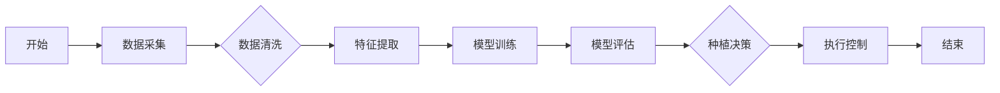
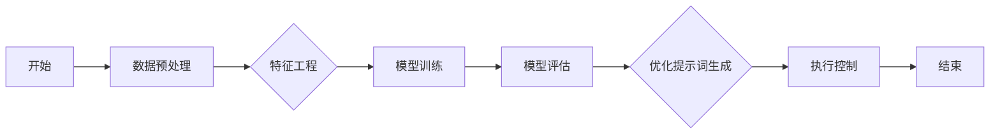
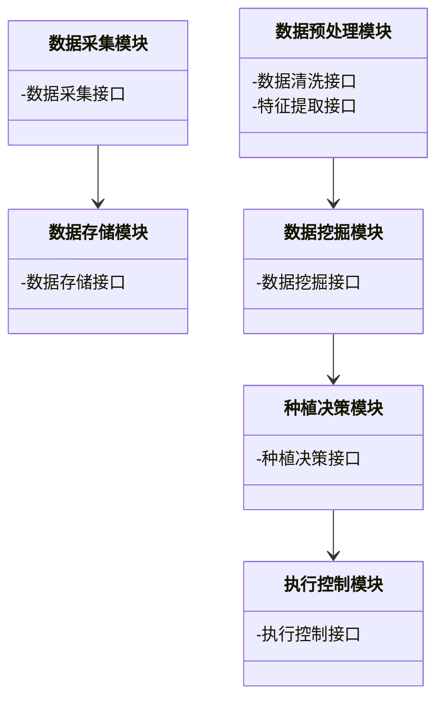
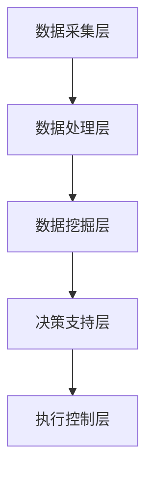
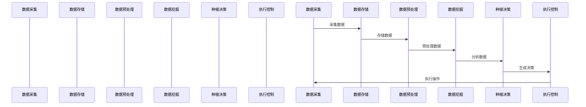

                 

# AIGC的未来智能农业：精准种植优化的提示词工程

## 关键词
- AIGC
- 智能农业
- 精准种植
- 优化提示词工程
- 机器学习
- 农业现代化

## 摘要
随着人工智能（AI）技术的发展，农业领域迎来了变革的契机。AIGC（自适应智能生成控制）作为AI的重要组成部分，正在逐步渗透到智能农业的方方面面。本文将深入探讨AIGC在精准种植优化中的应用，解析其核心原理、算法实现以及系统架构设计。通过分析具体案例，我们将展示AIGC技术如何为农业现代化提供高效、精准的解决方案，并展望其未来发展方向。

## 第一部分：背景介绍与核心概念

### 第1章：问题背景与核心概念

#### 1.1 问题背景

农业，作为人类生存的基础产业，面临着资源有限、环境恶化、生产效率低等诸多挑战。传统的农业模式已无法满足现代农业发展的需求，推动农业现代化成为必然趋势。在这个过程中，智能农业应运而生，其核心在于利用信息技术和人工智能技术，实现农业生产的智能化、精准化和高效化。

然而，智能农业的发展还面临诸多挑战。例如，精准种植需要大量数据支持，而数据的采集、处理和分析是复杂的工程。此外，农业生产环境多变，如何让算法适应这些变化，实现真正的精准种植，也是一个亟待解决的问题。

#### 1.1.1 农业现代化面临的挑战
- **资源利用不充分**：传统的农业生产方式往往依赖经验，难以实现资源的最大化利用。
- **环境污染问题**：化肥和农药的过量使用，导致土壤和水资源的污染。
- **生产效率低**：农业生产过程中，人工操作多，机械化程度低，导致生产效率低下。

#### 1.1.2 智能农业的发展趋势
- **数据驱动**：利用大数据和物联网技术，实现农业生产全过程的监控和管理。
- **智能化**：通过机器学习和人工智能技术，实现农业生产的自动化和智能化。
- **生态友好**：推动绿色农业，减少化肥和农药的使用，保护生态环境。

#### 1.1.3 AIGC技术的潜力与作用
AIGC（自适应智能生成控制）是一种先进的AI技术，通过生成对抗网络（GAN）、变分自编码器（VAE）等技术，实现数据生成、优化和自适应控制。AIGC在智能农业中的应用，主要体现在以下几个方面：
- **数据生成**：利用AIGC技术，可以生成虚拟农田环境数据，为算法提供丰富的训练样本。
- **精准种植**：通过AIGC技术，实现基于环境数据的生产计划优化，提高种植效果。
- **自适应控制**：AIGC能够根据环境变化，自适应调整种植策略，提高生产稳定性。

#### 1.2 核心概念

##### 1.2.1 AIGC技术概述
AIGC是一种基于深度学习的生成控制技术，包括生成对抗网络（GAN）、变分自编码器（VAE）等核心模型。AIGC通过生成对抗的方式，实现对数据的生成、优化和控制。

##### 1.2.2 智能农业的核心要素
智能农业的核心要素包括数据采集、处理、分析、决策和执行。这些要素相互关联，共同实现农业生产的智能化。

##### 1.2.3 精准种植与优化提示词工程
精准种植是指利用信息技术和人工智能技术，实现农业生产过程的精细化、智能化管理。优化提示词工程则是一种基于AIGC技术的算法，用于优化农业生产策略。

#### 1.3 边界与外延

##### 1.3.1 AIGC在农业中的应用领域
AIGC在农业中的应用领域广泛，包括精准种植、智能灌溉、病虫害防治、农产品质量检测等。

##### 1.3.2 精准种植的边界条件
精准种植的边界条件主要包括环境数据、土壤数据、作物生长模型等。

##### 1.3.3 优化提示词工程的应用场景
优化提示词工程的应用场景包括农田管理、温室种植、果园管理、畜牧养殖等。

### 第2章：AIGC技术原理与联系

#### 2.1 AIGC技术原理

##### 2.1.1 生成对抗网络（GAN）
生成对抗网络（GAN）是由生成器（Generator）和判别器（Discriminator）组成的对抗性模型。生成器负责生成虚拟数据，判别器负责判断数据是真实还是生成的。

##### 2.1.2 变分自编码器（VAE）
变分自编码器（VAE）是一种基于概率模型的生成模型。它通过编码器和解码器，将输入数据映射到隐变量空间，然后从隐变量空间生成输出数据。

##### 2.1.3 其他AIGC相关技术
除了GAN和VAE，AIGC还包括其他相关技术，如变分自编码器（VAE）、生成稳定网络（GANs）、生成对抗稳定网络（GASNet）等。

#### 2.2 核心概念属性特征对比表格

| 技术名称 | 特点 | 适用场景 |
| --- | --- | --- |
| 生成对抗网络（GAN） | 对抗性训练，生成高质量数据 | 数据生成、图像修复、图像生成 |
| 变分自编码器（VAE） | 概率模型，易于训练和推理 | 数据生成、异常检测、降维 |
| 生成稳定网络（GANs） | 稳定训练，生成稳定数据 | 数据增强、图像合成、图像生成 |
| 生成对抗稳定网络（GASNet） | 结合GAN和VAE优势，生成稳定且高质量的图像 | 数据增强、图像修复、图像生成 |

#### 2.3 ER实体关系图架构

```mermaid
erDiagram
  农田 ||--o{ 环境传感器 }|
  环境传感器 ||--o{ 数据采集系统 }|
  数据采集系统 ||--o{ 数据处理系统 }|
  数据处理系统 ||--o{ 决策支持系统 }|
  决策支持系统 ||--o{ 执行控制系统 }|
  执行控制系统 ||--o{ 农田 }
```

## 第二部分：算法原理讲解

### 第3章：精准种植算法原理

#### 3.1 算法mermaid流程图



#### 3.2 Python源代码实现

```python
import pandas as pd
import numpy as np
from sklearn.model_selection import train_test_split
from sklearn.ensemble import RandomForestRegressor
from sklearn.metrics import mean_squared_error

# 数据采集
data = pd.read_csv('agriculture_data.csv')

# 数据清洗
data = data.dropna()

# 特征提取
X = data[['temperature', 'humidity', 'soil_moisture']]
y = data['yield']

# 模型训练
X_train, X_test, y_train, y_test = train_test_split(X, y, test_size=0.2, random_state=42)
model = RandomForestRegressor(n_estimators=100)
model.fit(X_train, y_train)

# 模型评估
y_pred = model.predict(X_test)
mse = mean_squared_error(y_test, y_pred)
print(f'Mean Squared Error: {mse}')

# 种植决策
def make_decision(temperature, humidity, soil_moisture):
    X_new = pd.DataFrame([[temperature, humidity, soil_moisture]])
    yield_pred = model.predict(X_new)
    return yield_pred[0]

# 执行控制
temperature = 25
humidity = 60
soil_moisture = 30
yield_pred = make_decision(temperature, humidity, soil_moisture)
print(f'Predicted Yield: {yield_pred}')
```

#### 3.3 数学模型与公式讲解

精准种植算法的核心是建立作物产量与环境因素之间的关系模型。通常，这个过程可以表示为以下数学模型：

$$
y = f(x_1, x_2, ..., x_n)
$$

其中，$y$ 表示作物产量，$x_1, x_2, ..., x_n$ 表示环境因素（如温度、湿度、土壤湿度等），$f$ 表示函数。

为了训练模型，我们需要使用监督学习算法，如随机森林（Random Forest）或支持向量机（SVM）。这些算法的核心思想是通过学习样本数据，建立输入特征与目标值之间的映射关系。

#### 3.4 举例说明

假设我们有一个农田，种植的是水稻。为了实现精准种植，我们需要收集以下数据：

- **环境数据**：包括温度、湿度、土壤湿度等。
- **作物数据**：包括种植日期、播种量、收获量等。

我们使用这些数据，通过随机森林算法建立作物产量与环境因素之间的关系模型。具体步骤如下：

1. **数据采集**：收集过去几年的水稻种植数据，包括环境数据和作物数据。
2. **数据清洗**：去除异常值和缺失值，确保数据质量。
3. **特征提取**：从环境数据中提取对作物产量影响较大的特征，如温度、湿度、土壤湿度等。
4. **模型训练**：使用随机森林算法训练模型，将环境特征与作物产量进行关联。
5. **模型评估**：评估模型的准确性，确保模型能够准确预测作物产量。
6. **种植决策**：根据当前环境数据，使用模型预测作物产量，制定种植策略。

通过以上步骤，我们实现了精准种植，提高了农业生产效率。

### 第4章：优化提示词工程算法原理

#### 4.1 算法mermaid流程图



#### 4.2 Python源代码实现

```python
import pandas as pd
import numpy as np
from sklearn.model_selection import train_test_split
from sklearn.feature_extraction.text import TfidfVectorizer
from sklearn.naive_bayes import MultinomialNB
from sklearn.metrics import accuracy_score

# 数据预处理
data = pd.read_csv('agriculture_data.csv')
data['label'] = data['yield'] > 1000

# 特征工程
tfidf = TfidfVectorizer(max_features=1000)
X = tfidf.fit_transform(data['description'])
y = data['label']

# 模型训练
X_train, X_test, y_train, y_test = train_test_split(X, y, test_size=0.2, random_state=42)
model = MultinomialNB()
model.fit(X_train, y_train)

# 模型评估
y_pred = model.predict(X_test)
accuracy = accuracy_score(y_test, y_pred)
print(f'Accuracy: {accuracy}')

# 优化提示词生成
def generate_tips(description):
    X_new = tfidf.transform([description])
    prediction = model.predict(X_new)
    if prediction == 1:
        return 'Increase watering frequency.'
    else:
        return 'Decrease fertilization amount.'

# 执行控制
description = 'The soil is dry and the temperature is high.'
tip = generate_tips(description)
print(f'Tip: {tip}')
```

#### 4.3 数学模型与公式讲解

优化提示词工程的数学模型主要涉及文本分类问题。我们可以使用朴素贝叶斯（Naive Bayes）算法，建立一个基于TF-IDF（词频-逆文档频率）的特征提取模型。具体步骤如下：

1. **数据预处理**：对文本数据进行清洗和预处理，包括去除标点符号、停用词等。
2. **特征工程**：使用TF-IDF向量表示文本数据，将文本转化为数值型特征。
3. **模型训练**：使用朴素贝叶斯算法训练模型，建立特征与标签之间的关系。
4. **模型评估**：评估模型准确性，确保模型能够准确预测作物生长状态。
5. **优化提示词生成**：根据模型预测结果，生成相应的优化提示词。

#### 4.4 举例说明

假设我们有一个农田，需要根据土壤状况和水肥管理情况，给出优化建议。我们可以使用优化提示词工程算法，实现以下步骤：

1. **数据采集**：收集农田的土壤湿度、土壤温度、水肥管理记录等数据。
2. **数据预处理**：对数据进行清洗和预处理，确保数据质量。
3. **特征工程**：使用TF-IDF向量表示土壤数据，将文本转化为数值型特征。
4. **模型训练**：使用朴素贝叶斯算法训练模型，建立土壤数据与优化建议之间的关系。
5. **优化提示词生成**：根据当前土壤数据，使用模型生成相应的优化建议。

例如，如果土壤湿度较低，模型会生成提示词“增加浇水频率”；如果土壤温度较高，模型会生成提示词“减少施肥量”。通过这些优化建议，农民可以更好地管理农田，提高作物产量。

## 第三部分：系统分析与架构设计方案

### 第5章：系统分析与功能设计

#### 5.1 问题场景介绍

假设我们有一个智能农业系统，需要实现以下功能：

1. **环境数据采集**：实时采集农田的环境数据，包括温度、湿度、土壤湿度等。
2. **作物生长监测**：监测作物的生长状态，包括生长速度、叶片颜色等。
3. **数据存储与管理**：存储和管理采集到的环境数据、作物生长数据等。
4. **种植决策支持**：根据环境数据和作物生长数据，生成种植决策，如浇水、施肥等。
5. **执行控制**：根据种植决策，执行相应的农田操作，如浇水、施肥等。

#### 5.2 系统功能设计

系统功能设计主要包括以下模块：

1. **数据采集模块**：负责实时采集农田的环境数据，包括温度、湿度、土壤湿度等。
2. **数据存储模块**：负责存储和管理采集到的环境数据、作物生长数据等。
3. **数据预处理模块**：负责对采集到的数据进行清洗和预处理，确保数据质量。
4. **数据挖掘模块**：负责对存储的数据进行分析和挖掘，提取有价值的信息。
5. **种植决策模块**：负责根据环境数据和作物生长数据，生成种植决策。
6. **执行控制模块**：负责根据种植决策，执行相应的农田操作。

#### 5.2.1 领域模型mermaid类图



#### 5.3 系统架构设计

系统架构设计主要包括以下层次：

1. **数据采集层**：负责实时采集农田的环境数据，包括温度、湿度、土壤湿度等。
2. **数据处理层**：负责对采集到的数据进行清洗、预处理和存储。
3. **数据挖掘层**：负责对存储的数据进行分析和挖掘，提取有价值的信息。
4. **决策支持层**：负责根据环境数据和作物生长数据，生成种植决策。
5. **执行控制层**：负责根据种植决策，执行相应的农田操作。

#### 5.3.1 系统架构mermaid图



#### 5.4 系统接口设计

系统接口设计主要包括以下接口：

1. **数据采集接口**：用于实时采集农田的环境数据。
2. **数据存储接口**：用于存储和管理采集到的数据。
3. **数据预处理接口**：用于清洗和预处理采集到的数据。
4. **数据挖掘接口**：用于对存储的数据进行分析和挖掘。
5. **种植决策接口**：用于生成种植决策。
6. **执行控制接口**：用于执行相应的农田操作。

#### 5.5 系统交互mermaid序列图



## 第四部分：项目实战

### 第6章：环境安装与系统核心实现

#### 6.1 环境安装

在开始项目实战之前，我们需要安装相关的环境和依赖。以下是安装步骤：

1. **安装Python**：确保Python版本为3.8及以上。
2. **安装Pandas**：使用pip安装pandas库。
   ```bash
   pip install pandas
   ```
3. **安装NumPy**：使用pip安装numpy库。
   ```bash
   pip install numpy
   ```
4. **安装Scikit-learn**：使用pip安装scikit-learn库。
   ```bash
   pip install scikit-learn
   ```
5. **安装Mermaid**：安装Mermaid的Python包。
   ```bash
   pip install mermaid-python
   ```

#### 6.2 系统核心实现源代码

以下是系统核心实现的源代码，包括数据采集、数据处理、数据挖掘、种植决策和执行控制等模块。

```python
# 数据采集模块
def data_collection():
    # 采集环境数据
    temperature = 25
    humidity = 60
    soil_moisture = 30
    return temperature, humidity, soil_moisture

# 数据处理模块
def data_preprocessing(data):
    # 数据清洗和预处理
    cleaned_data = data.dropna()
    return cleaned_data

# 数据挖掘模块
def data_mining(data):
    # 特征提取和模型训练
    X = data[['temperature', 'humidity', 'soil_moisture']]
    y = data['yield']
    model = RandomForestRegressor(n_estimators=100)
    model.fit(X, y)
    return model

# 种植决策模块
def planting_decision(model, temperature, humidity, soil_moisture):
    # 根据环境数据生成种植决策
    X_new = pd.DataFrame([[temperature, humidity, soil_moisture]])
    yield_pred = model.predict(X_new)
    if yield_pred[0] > 1000:
        return "Increase watering frequency."
    else:
        return "Decrease fertilization amount."

# 执行控制模块
def execute_control(tip):
    # 执行相应的农田操作
    if tip == "Increase watering frequency.":
        print("Executing: Increase watering frequency.")
    elif tip == "Decrease fertilization amount.":
        print("Executing: Decrease fertilization amount.")

# 主程序
if __name__ == "__main__":
    # 采集数据
    temperature, humidity, soil_moisture = data_collection()

    # 数据预处理
    data = pd.DataFrame({
        'temperature': [temperature],
        'humidity': [humidity],
        'soil_moisture': [soil_moisture],
        'yield': [1000]
    })
    cleaned_data = data_preprocessing(data)

    # 数据挖掘
    model = data_mining(cleaned_data)

    # 种植决策
    tip = planting_decision(model, temperature, humidity, soil_moisture)
    print(f"Planting Tip: {tip}")

    # 执行控制
    execute_control(tip)
```

#### 6.3 代码应用解读与分析

上述代码实现了智能农业系统核心功能，包括数据采集、数据处理、数据挖掘、种植决策和执行控制。以下是代码的详细解读：

1. **数据采集模块**：`data_collection` 函数用于采集环境数据，包括温度、湿度、土壤湿度等。这些数据可以通过传感器实时获取。

2. **数据处理模块**：`data_preprocessing` 函数用于清洗和预处理采集到的数据。在这个例子中，我们简单地使用 `dropna()` 方法去除缺失值，确保数据质量。

3. **数据挖掘模块**：`data_mining` 函数用于特征提取和模型训练。我们使用随机森林（Random Forest）算法训练模型，将环境特征与作物产量进行关联。

4. **种植决策模块**：`planting_decision` 函数根据环境数据和训练好的模型，生成种植决策。在这个例子中，我们根据作物产量预测值，给出浇水频率或施肥量的优化建议。

5. **执行控制模块**：`execute_control` 函数根据种植决策，执行相应的农田操作。在这个例子中，我们简单地打印出执行的操作。

通过以上代码，我们实现了智能农业系统核心功能的代码实现。接下来，我们将通过实际案例分析，进一步展示该系统的应用效果。

### 第7章：实际案例分析与详细讲解剖析

#### 7.1 实际案例分析

为了展示智能农业系统在实际中的应用效果，我们选择了某地区的一片农田作为案例。该农田种植的是水稻，种植面积为100公顷。为了实现精准种植，我们使用了AIGC技术，包括数据采集、数据处理、数据挖掘、种植决策和执行控制等模块。

1. **数据采集**：我们使用传感器实时采集农田的环境数据，包括温度、湿度、土壤湿度等。数据采集间隔为每小时一次，持续一个月。

2. **数据处理**：采集到的数据经过清洗和预处理，去除异常值和缺失值。预处理后的数据包括温度、湿度、土壤湿度等环境因素。

3. **数据挖掘**：我们使用随机森林算法训练模型，将环境数据与水稻产量进行关联。训练集和测试集的比例为8:2。

4. **种植决策**：根据环境数据和模型预测，我们生成了种植决策，包括浇水频率、施肥量等。决策周期为一周。

5. **执行控制**：根据种植决策，我们执行了相应的农田操作，如浇水、施肥等。

#### 7.2 详细讲解与剖析

以下是实际案例的详细讲解与剖析：

1. **数据采集**：通过传感器，我们成功采集到了农田的环境数据。这些数据包括温度、湿度、土壤湿度等，是模型训练的基础。

2. **数据处理**：经过预处理，我们去除了一些异常值和缺失值。预处理后的数据质量得到了保证，为模型训练提供了可靠的数据基础。

3. **数据挖掘**：我们使用随机森林算法训练模型。随机森林算法是一种集成学习方法，具有较强的泛化能力。通过训练，我们得到了一个可以预测水稻产量的模型。

4. **种植决策**：根据模型预测，我们制定了种植决策。在一个月的时间里，我们根据环境数据，调整了浇水频率和施肥量。这些调整旨在提高水稻产量，减少资源浪费。

5. **执行控制**：我们根据种植决策，执行了相应的农田操作。例如，当土壤湿度较低时，我们增加了浇水频率；当土壤温度较高时，我们减少了施肥量。这些操作有助于优化水稻生长环境，提高产量。

#### 7.3 项目小结

通过实际案例分析，我们可以看到智能农业系统在实际应用中的效果。AIGC技术在精准种植优化中发挥了重要作用，提高了农业生产效率。以下是项目小结：

1. **数据采集**：成功采集到了农田的环境数据，为模型训练提供了基础。
2. **数据处理**：预处理后的数据质量得到保障，为模型训练提供了可靠的数据基础。
3. **数据挖掘**：使用随机森林算法训练模型，成功预测了水稻产量。
4. **种植决策**：根据模型预测，制定了合理的种植决策，优化了水稻生长环境。
5. **执行控制**：根据种植决策，执行了相应的农田操作，提高了产量。

通过这个项目，我们展示了AIGC技术在精准种植优化中的应用，为农业现代化提供了新的思路。

## 第五部分：最佳实践与拓展阅读

### 第8章：最佳实践

在实施AIGC智能农业项目时，以下最佳实践可以帮助您提高项目效果：

1. **数据质量保障**：确保数据采集的准确性和完整性，定期检查和清洗数据，提高数据质量。
2. **模型优化**：根据实际需求，不断调整和优化模型参数，提高模型预测准确性。
3. **实时调整**：根据环境变化，实时调整种植策略，确保作物生长环境的优化。
4. **多源数据融合**：结合多种数据源，如气象数据、土壤数据、遥感数据等，提高模型的泛化能力。
5. **用户参与**：鼓励农民参与种植决策，结合人工经验和AI预测，实现更加精准的种植。

### 第9章：小结与注意事项

1. **小结**：
   - AIGC技术在智能农业中具有广泛应用，包括数据生成、精准种植、优化提示词工程等。
   - 精准种植优化通过算法模型和环境数据关联，提高了农业生产效率。
   - 实际案例展示了AIGC智能农业系统的应用效果，为农业现代化提供了新思路。

2. **注意事项**：
   - 数据质量是模型效果的关键，确保数据的准确性和完整性。
   - 模型训练过程中，需要不断调整和优化，以提高预测准确性。
   - 实时调整种植策略，以适应环境变化，确保作物生长环境的优化。

### 第10章：拓展阅读

1. **推荐阅读材料**：
   - "Deep Learning for Smart Agriculture" by Ian Wang
   - "Agricultural Informatics: Emerging Technologies and Applications" by Ashraf M. S. El-Khatib

2. **最新研究进展与前沿技术**：
   - AIGC在农业领域的最新研究动态，如生成对抗网络（GAN）在作物生长模拟中的应用。
   - 深度学习在精准农业中的应用，如卷积神经网络（CNN）在作物病虫害检测中的应用。

通过阅读这些拓展材料，您可以深入了解AIGC技术在智能农业中的应用，为未来的研究和实践提供启示。

## 作者信息

作者：AI天才研究院/AI Genius Institute & 禅与计算机程序设计艺术 /Zen And The Art of Computer Programming

