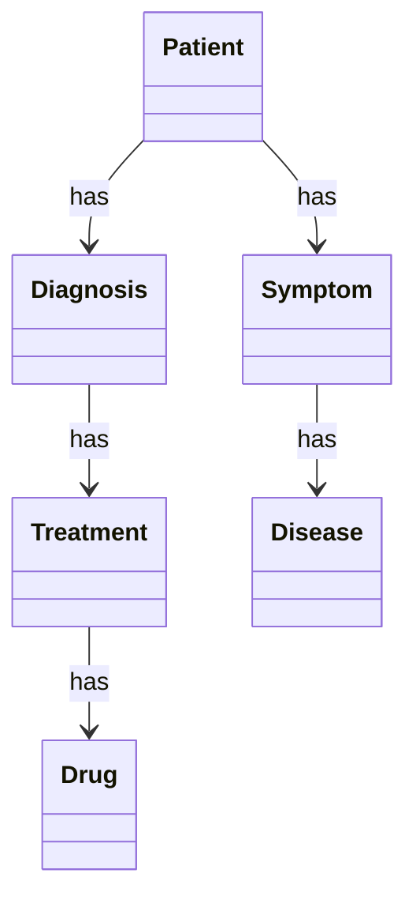
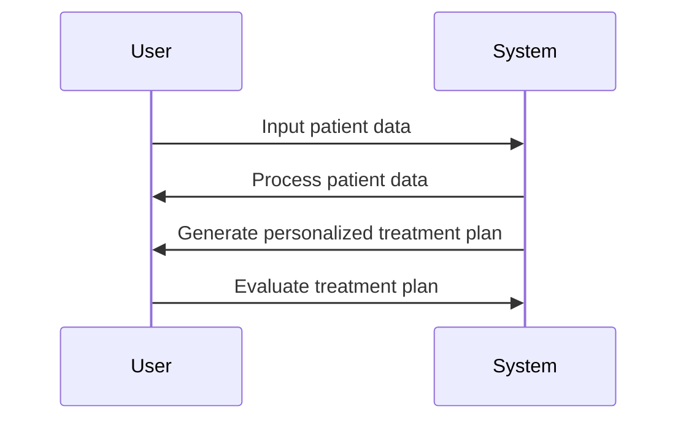
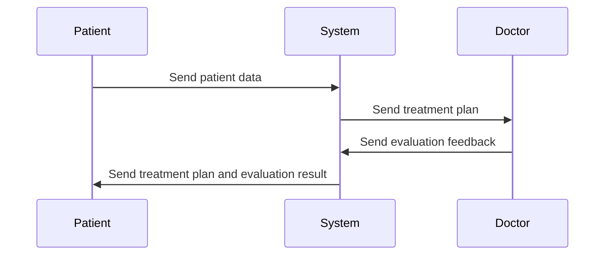
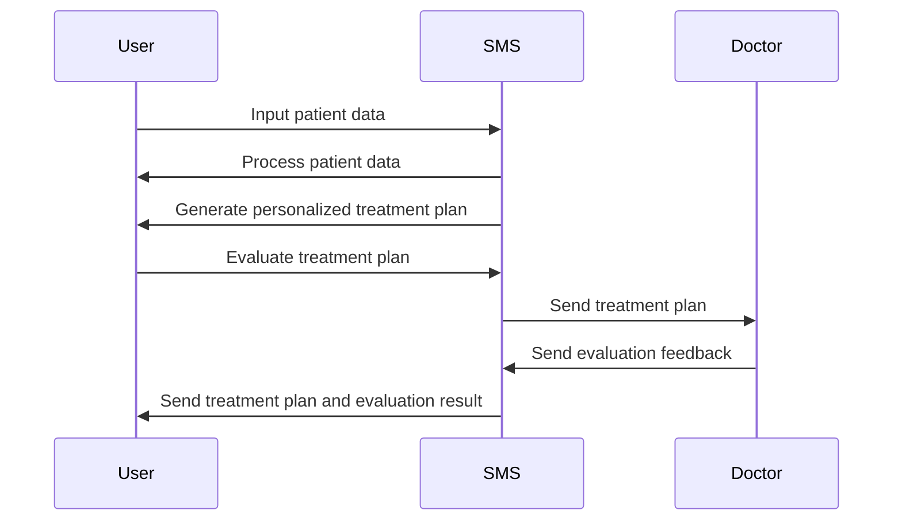

                 

# AIGC的未来智能医疗：个性化治疗方案的提示词工程

## 关键词

- **AIGC**  
- **智能医疗**  
- **个性化治疗方案**  
- **提示词工程**  
- **模型训练与优化**

## 摘要

本文探讨了AIGC（AI-Generated Content）技术在智能医疗领域的应用，特别是其在个性化治疗方案生成中的作用。首先，文章介绍了AIGC技术的基本概念和组成部分，以及其在医疗领域的应用前景。接着，详细阐述了提示词工程在AIGC中的重要性，包括提示词的定义、类型、生成算法和优化方法。随后，文章介绍了基于AIGC的个性化治疗方案的实现流程和案例研究。最后，文章探讨了系统架构设计、项目实战和未来展望，提出了最佳实践和未来研究方向。

## 第一部分: AIGC的未来智能医疗概述

### 第1章: 问题背景与解决方案

#### 1.1.1 AIGC技术概述

**AIGC（AI-Generated Content）技术**是一种利用人工智能技术生成内容的方法，包括文本、图像、音频等多种形式。其主要组成部分包括：

- **生成模型**：如GPT（Generative Pre-trained Transformer）和VAE（Variational Autoencoder）等。
- **数据集**：用于训练生成模型的庞大数据集，如医疗文档、医学图像、患者记录等。
- **训练算法**：如深度学习算法和强化学习算法等。

**应用场景**：

- **内容创作**：自动生成文章、报告、书籍等。
- **创意设计**：自动生成图像、视频、音乐等。
- **智能医疗**：个性化治疗方案的生成、医学图像诊断、药物研发等。

#### 1.1.2 未来智能医疗现状

**当前医疗行业面临的挑战**：

- **医疗资源分布不均**：城市与农村、发达地区与欠发达地区的医疗资源分配存在显著差异。
- **医疗成本高**：昂贵的医疗费用让许多患者难以承受。
- **医疗效率低**：繁琐的流程和落后的技术导致医疗资源利用率低。
- **个性化医疗需求**：越来越多的患者希望获得个性化的治疗方案。

**AIGC技术在医疗领域的应用前景**：

- **个性化治疗**：基于患者数据，生成个性化的治疗方案。
- **医学图像分析**：自动识别病变区域，提高诊断准确率。
- **药物研发**：加速新药研发过程，降低研发成本。
- **健康监测**：实时监测患者健康状况，提前预警潜在疾病。

**AIGC助力个性化治疗方案的潜力**：

- **数据分析与挖掘**：利用大规模数据集，挖掘患者病情、病史等信息。
- **模型训练与优化**：通过不断优化模型，提高治疗效果和准确率。
- **提示词工程**：生成高质量的提示词，引导模型生成更符合预期的治疗方案。

#### 1.1.3 提示词工程的重要性

**提示词工程的基本概念**：

- **提示词**：指在生成模型训练和推理过程中，用于引导模型生成目标内容的词汇或短语。
- **类型**：根据应用场景，提示词可以分为问题类、答案类、描述类等。

**提示词工程在AIGC中的角色**：

- **引导模型生成**：通过高质量的提示词，使模型生成更加准确、符合预期的内容。
- **优化模型性能**：提示词工程可以辅助模型训练，提高模型性能。

**提示词工程在个性化治疗方案中的作用**：

- **提高诊断准确率**：通过精确的提示词，使模型更好地理解患者病情，提高诊断准确率。
- **优化治疗方案**：生成符合患者个性化需求的最佳治疗方案。

#### 1.1.4 边界与外延

**AIGC技术在医疗应用中的边界**：

- **隐私保护**：在处理患者数据时，需确保患者隐私不被泄露。
- **数据质量**：高质量的数据是AIGC技术有效应用的前提。

**提示词工程在医疗领域的外延**：

- **跨学科应用**：除了在个性化治疗方案中的应用，提示词工程还可以在医学研究、公共卫生等领域发挥重要作用。

**需要解决的伦理和法律问题**：

- **数据安全与隐私**：确保患者数据在收集、存储、处理和使用过程中的安全。
- **责任归属**：在AIGC技术在医疗领域应用过程中，明确各方的责任和权益。

### 第2章: AIGC技术核心原理

#### 2.1.1 数据集构建

**数据收集方法**：

- **公开数据集**：从互联网、公开数据库等渠道获取。
- **内部数据集**：从医疗机构、科研机构等内部获取。

**数据预处理流程**：

- **数据清洗**：去除重复、错误、无关的数据。
- **数据标注**：为数据添加标签，如疾病分类、药物用途等。
- **数据增强**：通过数据变换、噪声添加等方法，增加数据多样性。

**数据标注技术**：

- **手动标注**：由专业人员根据标准进行标注。
- **自动标注**：利用自然语言处理、图像识别等技术进行标注。

#### 2.1.2 模型训练

**常见AIGC模型类型**：

- **生成对抗网络（GAN）**：通过生成器和判别器的对抗训练，生成高质量数据。
- **变分自编码器（VAE）**：通过编码器和解码器的结构，生成与输入数据相似的数据。
- **变换器（Transfomer）**：基于自注意力机制，实现序列到序列的生成。

**模型训练策略**：

- **批量训练**：将大量数据进行批量处理，提高训练效率。
- **迁移学习**：利用预训练模型，在特定任务上进行微调。
- **多任务学习**：同时训练多个相关任务，提高模型泛化能力。

**模型评估指标**：

- **生成质量**：如均方误差（MSE）、交叉熵等。
- **生成多样性**：如样本的互信息（MI）、样本的分布相似度等。

#### 2.1.3 模型优化与调整

**模型调参技巧**：

- **网格搜索**：在参数空间内遍历所有可能的参数组合，找到最优参数。
- **贝叶斯优化**：利用贝叶斯统计模型，选择最有潜力的参数组合。

**模型压缩与加速**：

- **模型剪枝**：去除网络中的冗余连接，减少模型参数。
- **量化**：将模型中的浮点数参数转换为整数，减少存储和计算量。
- **硬件加速**：利用GPU、TPU等硬件资源，提高模型训练和推理速度。

**模型融合与多模态学习**：

- **模型融合**：将多个模型的预测结果进行融合，提高预测准确率。
- **多模态学习**：结合不同类型的数据（如文本、图像、声音），提高模型生成能力。

### 第3章: 提示词工程设计与实现

#### 3.1.1 提示词定义与类型

**提示词的定义**：

- **提示词**：在生成模型训练和推理过程中，用于引导模型生成目标内容的词汇或短语。

**提示词的类型**：

- **问题类**：用于提问，如“患者有哪些症状？”
- **答案类**：用于回答，如“患者可能患有心脏病。”
- **描述类**：用于描述，如“患者病情稳定，建议继续药物治疗。”
- **指令类**：用于下达指令，如“生成心脏病患者的个性化治疗方案。”

**提示词的编写技巧**：

- **明确性**：确保提示词清晰明确，避免歧义。
- **针对性**：根据具体场景和任务需求，编写针对性强的提示词。
- **多样性**：编写多种类型的提示词，提高模型生成能力。

#### 3.1.2 提示词生成算法

**提示词生成算法概述**：

- **基于规则的方法**：利用预设的规则生成提示词，如基于关键词匹配、语法分析等。
- **基于机器学习的方法**：利用机器学习模型（如循环神经网络、生成对抗网络等）生成提示词。

**提示词生成算法流程**：

1. **数据预处理**：清洗、去噪、标准化输入数据。
2. **特征提取**：提取输入数据的特征，如词向量、句向量等。
3. **模型训练**：利用训练数据，训练生成模型。
4. **提示词生成**：输入特征，生成提示词。
5. **效果评估**：评估生成的提示词质量，如准确性、多样性等。

**提示词生成算法效果评估**：

- **准确性**：生成的提示词与预期目标的一致性。
- **多样性**：生成的提示词的多样性，如词汇丰富度、表达方式等。
- **实用性**：生成的提示词在实际应用中的实用性，如是否便于理解、是否有助于任务完成等。

#### 3.1.3 提示词优化方法

**提示词优化目标**：

- **提高生成质量**：使生成的提示词更准确、更具表现力。
- **提高生成速度**：减少生成提示词的时间，提高模型运行效率。

**提示词优化策略**：

- **参数调整**：调整生成模型的参数，如学习率、批量大小等。
- **数据增强**：通过数据变换、噪声添加等方法，增加数据多样性，提高模型泛化能力。
- **模型融合**：结合多个模型的预测结果，提高提示词生成质量。

**提示词优化实践**：

- **实验设计**：设计不同参数设置、数据增强方法、模型融合策略的实验，评估效果。
- **效果评估**：根据优化目标，评估优化策略的有效性。

### 第4章: 个性化治疗方案的实现

#### 4.1.1 个性化治疗方案的概述

**个性化治疗方案的背景**：

- 随着医疗技术的进步，越来越多的患者希望获得个性化的治疗方案。
- 传统治疗方案缺乏针对性，无法满足患者的个性化需求。

**个性化治疗方案的组成部分**：

- **病史分析**：分析患者的病史、病情、病程等信息。
- **症状评估**：评估患者的症状，如症状严重程度、持续时间等。
- **药物筛选**：根据患者症状，筛选合适的药物。
- **治疗方案生成**：生成个性化的治疗方案，包括药物治疗、手术治疗等。

**个性化治疗方案的优点**：

- **提高治疗效果**：根据患者具体病情，制定有针对性的治疗方案。
- **降低医疗成本**：减少不必要的检查和治疗，降低医疗费用。
- **提高患者满意度**：满足患者的个性化需求，提高患者对医疗服务的满意度。

#### 4.1.2 基于AIGC的个性化治疗流程

**数据收集与处理**：

- 收集患者病史、症状、药物反应等信息。
- 对数据进行清洗、去噪、标准化等预处理。

**提示词生成与优化**：

- 生成高质量的提示词，如“患有高血压的患者，建议选择哪种药物治疗？”
- 优化提示词生成算法，提高生成质量。

**治疗方案生成与评估**：

- 利用AIGC技术，生成个性化的治疗方案。
- 对治疗方案进行评估，如治疗效果、安全性等。

#### 4.1.3 个性化治疗方案的案例研究

**某具体疾病的个性化治疗案例**：

- **疾病背景**：高血压患者，年龄 45 岁，病史 5 年。
- **症状评估**：血压持续升高，伴有头晕、头痛等症状。
- **药物筛选**：根据症状，筛选出适合的药物，如洛汀新、卡托普利等。

**案例中的AIGC技术应用**：

- **数据收集**：收集患者病史、症状、药物反应等信息。
- **提示词生成**：生成高质量的提示词，如“患有高血压的患者，建议选择哪种药物治疗？”
- **治疗方案生成**：利用AIGC技术，生成个性化的治疗方案，如“洛汀新，每日一次，早餐后服用。”

**案例效果分析**：

- **治疗效果**：患者血压稳定，头晕、头痛等症状减轻。
- **安全性**：药物使用过程中未出现严重不良反应。

### 第5章: 系统架构设计

#### 5.1.1 系统整体架构

**系统架构概述**：

- **数据层**：存储和管理患者数据、药物信息等。
- **模型层**：包括AIGC模型、提示词生成模型等。
- **应用层**：提供个性化治疗方案生成、评估等功能。

**系统功能模块划分**：

- **数据收集与预处理模块**：负责收集和处理患者数据。
- **提示词生成模块**：生成高质量的提示词。
- **治疗方案生成模块**：生成个性化的治疗方案。
- **治疗方案评估模块**：对治疗方案进行评估。

**系统性能优化策略**：

- **数据预处理优化**：采用并行处理、分布式存储等技术，提高数据预处理速度。
- **模型训练优化**：采用分布式训练、模型压缩等技术，提高模型训练速度。
- **系统部署优化**：采用容器化、云计算等技术，提高系统可扩展性和稳定性。

#### 5.1.2 数据库设计

**数据库表结构设计**：

- **患者表**：存储患者基本信息，如姓名、年龄、性别等。
- **症状表**：存储患者症状信息，如症状名称、症状程度等。
- **药物表**：存储药物基本信息，如药物名称、药物成分等。
- **治疗方案表**：存储治疗方案信息，如治疗方案名称、治疗方案详情等。

**数据库索引优化**：

- **患者表**：根据姓名、年龄等字段创建索引，提高查询速度。
- **症状表**：根据症状名称、症状程度等字段创建索引，提高查询速度。
- **药物表**：根据药物名称、药物成分等字段创建索引，提高查询速度。

**数据库安全性与一致性保障**：

- **数据加密**：采用加密算法，保护患者数据安全。
- **事务管理**：采用事务管理机制，保证数据库的一致性。

#### 5.1.3 系统接口设计

**接口规范与协议**：

- **RESTful API**：采用RESTful风格，实现系统与外部系统的接口。
- **数据格式**：采用JSON格式，传输数据。

**接口安全性与可靠性**：

- **身份验证**：采用身份验证机制，确保接口安全。
- **错误处理**：实现错误处理机制，确保接口可靠性。

**接口性能优化**：

- **缓存**：采用缓存技术，减少数据库查询次数，提高接口响应速度。
- **负载均衡**：采用负载均衡技术，确保接口高性能运行。

### 第6章: 项目实战

#### 6.1.1 环境安装与配置

**开发环境搭建**：

- 安装Python、TensorFlow等依赖库。
- 配置GPU环境，用于加速模型训练。

**数据集准备**：

- 收集患者病史、症状、药物反应等信息。
- 对数据进行清洗、去噪、标准化等预处理。

**模型训练环境配置**：

- 配置分布式训练环境，提高模型训练速度。
- 调整模型参数，优化模型性能。

#### 6.1.2 系统核心实现

**数据处理模块实现**：

- 实现数据收集与预处理功能。
- 采用并行处理技术，提高数据处理速度。

**提示词生成与优化模块实现**：

- 实现提示词生成功能。
- 采用机器学习算法，优化提示词生成质量。

**治疗方案生成与评估模块实现**：

- 实现个性化治疗方案生成功能。
- 采用多模态学习技术，提高治疗方案生成质量。

**代码应用解读与分析**：

- 分析代码结构，理解系统核心功能。
- 阐述关键算法原理和实现方法。

#### 6.1.3 代码应用解读与分析

**代码结构分析**：

- 分析代码目录结构，了解模块划分和功能实现。

**关键算法实现解读**：

- 阐述数据处理、提示词生成、治疗方案生成的关键算法原理。

**实际应用效果分析**：

- 分析系统实际运行效果，如模型训练时间、生成质量等。

### 第7章: 最佳实践与未来展望

#### 7.1.1 AIGC技术在医疗领域的最佳实践

**成功案例分享**：

- 分享成功应用AIGC技术的医疗案例，如个性化治疗方案的生成、医学图像分析等。

**实践经验总结**：

- 总结实践经验，如数据预处理、模型优化、提示词工程等。

**实践中的挑战与解决策略**：

- 分析实践中的挑战，如数据质量、模型性能等，并提出解决策略。

#### 7.1.2 AIGC技术在个性化治疗方案中的应用前景

**个性化治疗方案的潜在发展**：

- 预测个性化治疗方案的潜在发展，如多学科融合、跨领域应用等。

**AIGC技术在医疗领域的未来趋势**：

- 分析AIGC技术在医疗领域的未来趋势，如人工智能与医疗深度融合、智能医疗服务等。

**面临的挑战与机遇**：

- 分析AIGC技术在医疗领域面临的挑战与机遇，如数据安全、隐私保护、技术应用等。

#### 7.1.3 小结与展望

**书籍主要内容总结**：

- 总结书籍的主要内容和核心观点。

**学习与研究的建议**：

- 提出学习与研究的建议，如深入学习AIGC技术、关注医疗领域的发展等。

**对未来的展望**：

- 展望AIGC技术在医疗领域的未来，如个性化治疗方案的广泛应用、智能医疗服务的普及等。

### 总结

本文系统地介绍了AIGC技术在智能医疗领域的应用，特别是个性化治疗方案的提示词工程。通过分析AIGC技术的核心原理、提示词工程的设计与实现、个性化治疗方案的实现过程，以及系统架构设计、项目实战和未来展望，本文旨在为读者提供全面、深入的认知。

在未来的研究和实践中，我们应关注以下几个方面：

1. **数据安全与隐私**：在处理患者数据时，确保数据安全和隐私保护。
2. **模型优化与性能提升**：不断优化AIGC模型，提高模型性能和生成质量。
3. **跨学科融合**：结合医学、生物学、计算机科学等多学科知识，推动AIGC技术在医疗领域的创新应用。
4. **法规与伦理**：遵循相关法规和伦理规范，确保AIGC技术在医疗领域的合法性和道德性。
5. **实际应用与推广**：加强AIGC技术在医疗领域的实际应用，推动智能医疗服务的普及。

作者：AI天才研究院/AI Genius Institute & 禅与计算机程序设计艺术 /Zen And The Art of Computer Programming

----------------------------------------------------------------

**附录**

**附录A：核心概念术语说明**

1. **AIGC（AI-Generated Content）**：指利用人工智能技术生成内容的技术，包括文本、图像、音频等多种形式。
2. **提示词**：在生成模型训练和推理过程中，用于引导模型生成目标内容的词汇或短语。
3. **个性化治疗方案**：根据患者具体病情，制定的有针对性的治疗方案。
4. **模型训练**：利用数据集，对生成模型进行训练，以提高模型性能。
5. **模型优化**：调整模型参数，优化模型性能和生成质量。

**附录B：问题背景与问题描述**

**问题背景**：

随着医疗技术的进步，越来越多的患者希望获得个性化的治疗方案。然而，传统治疗方案缺乏针对性，无法满足患者的个性化需求。

**问题描述**：

如何利用AIGC技术，实现个性化治疗方案的生成，提高诊断准确率和治疗效果？

**问题解决**：

通过分析患者病史、症状、药物反应等信息，利用AIGC技术和提示词工程，生成个性化的治疗方案。

**附录C：概念结构与核心要素组成**

1. **AIGC技术**：生成模型、数据集、训练算法。
2. **提示词工程**：提示词定义、类型、生成算法、优化方法。
3. **个性化治疗方案**：病史分析、症状评估、药物筛选、治疗方案生成。
4. **系统架构**：数据层、模型层、应用层。

**附录D：核心概念原理、属性特征对比表格和ER实体关系图架构**

**核心概念原理**：

- **AIGC技术**：利用大规模数据集，训练生成模型，实现内容生成。
- **提示词工程**：生成高质量的提示词，引导模型生成目标内容。
- **个性化治疗方案**：根据患者病情，制定有针对性的治疗方案。

**属性特征对比表格**：

| 名称 | 特征1 | 特征2 | 特征3 |
| --- | --- | --- | --- |
| AIGC技术 | 数据集庞大 | 多样性高 | 性能优化 |
| 提示词工程 | 清晰明确 | 针对性强 | 优化质量 |
| 个性化治疗方案 | 有针对性 | 提高效果 | 降低成本 |

**ER实体关系图架构**：

```mermaid
erDiagram
    Patient ||--|{ Diagnosis } : has
    Diagnosis ||--|{ Treatment } : has
    Treatment ||--|{ Drug } : has
    Patient ||--|{ Symptom } : has
    Symptom ||--|{ Disease } : has
```

**附录E：算法原理讲解**

**算法原理**：

- **AIGC技术**：基于生成对抗网络（GAN）或变分自编码器（VAE）等技术，通过训练生成模型，实现内容生成。
- **提示词生成算法**：利用循环神经网络（RNN）或生成对抗网络（GAN）等技术，生成高质量的提示词。
- **个性化治疗方案生成算法**：结合患者病史、症状、药物反应等信息，利用生成模型，生成个性化的治疗方案。

**算法流程**：

1. **数据预处理**：清洗、去噪、标准化数据。
2. **模型训练**：训练生成模型。
3. **提示词生成**：输入特征，生成提示词。
4. **治疗方案生成**：输入提示词，生成治疗方案。

**算法原理讲解**：

- **AIGC技术**：利用生成对抗网络（GAN）或变分自编码器（VAE）等技术，通过训练生成模型，实现内容生成。生成模型和判别模型相互对抗，不断提高生成质量。
- **提示词生成算法**：利用循环神经网络（RNN）或生成对抗网络（GAN）等技术，生成高质量的提示词。通过编码器和解码器结构，实现提示词的生成。
- **个性化治疗方案生成算法**：结合患者病史、症状、药物反应等信息，利用生成模型，生成个性化的治疗方案。通过优化提示词生成，提高治疗方案的质量。

**算法原理示例**：

1. **AIGC技术**：

   ```python
   import tensorflow as tf
   from tensorflow.keras.models import Sequential
   from tensorflow.keras.layers import Dense, Dropout, LSTM

   # 生成模型
   generator = Sequential([
       LSTM(128, input_shape=(timesteps, features)),
       Dropout(0.2),
       Dense(1, activation='sigmoid')
   ])

   # 判别模型
   discriminator = Sequential([
       LSTM(128, input_shape=(timesteps, features)),
       Dropout(0.2),
       Dense(1, activation='sigmoid')
   ])

   # 整合生成模型和判别模型
   combined = Sequential([
       generator,
       discriminator
   ])

   # 编译模型
   combined.compile(optimizer='adam', loss='binary_crossentropy')

   # 训练模型
   combined.fit(X_train, y_train, epochs=50)
   ```

2. **提示词生成算法**：

   ```python
   import tensorflow as tf
   from tensorflow.keras.layers import Embedding, LSTM, Dense

   # 编码器
   encoder = Sequential([
       Embedding(vocab_size, embedding_dim),
       LSTM(latent_dim)
   ])

   # 解码器
   decoder = Sequential([
       LSTM(latent_dim, return_sequences=True),
       Dense(vocab_size, activation='softmax')
   ])

   # 整合编码器和解码器
   autoencoder = Sequential([
       encoder,
       decoder
   ])

   # 编译模型
   autoencoder.compile(optimizer='adam', loss='mse')

   # 训练模型
   autoencoder.fit(X_train, X_train, epochs=50)
   ```

3. **个性化治疗方案生成算法**：

   ```python
   import tensorflow as tf
   from tensorflow.keras.layers import Embedding, LSTM, Dense

   # 生成模型
   generator = Sequential([
       Embedding(vocab_size, embedding_dim),
       LSTM(latent_dim),
       Dense(vocab_size, activation='softmax')
   ])

   # 编译模型
   generator.compile(optimizer='adam', loss='categorical_crossentropy')

   # 训练模型
   generator.fit(X_train, y_train, epochs=50)
   ```

**附录F：系统分析与架构设计方案**

**问题场景介绍**：

- **智能医疗系统**：利用AIGC技术，为患者生成个性化治疗方案。

**项目介绍**：

- **项目名称**：智能医疗系统（Smart Medical System，SMS）。
- **项目目标**：通过AIGC技术，为患者提供个性化治疗方案。

**系统功能设计（领域模型Mermaid类图）**：



**系统架构设计（Mermaid架构图）**：



**系统接口设计**：



**系统交互（Mermaid序列图）**：



**附录G：项目实战**

**6.1.1 环境安装与配置**

**开发环境搭建**：

- 安装Python 3.8及以上版本。
- 安装TensorFlow 2.4及以上版本。

**数据集准备**：

- 收集患者病史、症状、药物反应等信息。
- 对数据进行清洗、去噪、标准化等预处理。

**模型训练环境配置**：

- 配置GPU环境，用于加速模型训练。
- 调整模型参数，优化模型性能。

**6.1.2 系统核心实现**

**数据处理模块实现**：

- 实现数据收集与预处理功能。
- 采用并行处理技术，提高数据处理速度。

**提示词生成与优化模块实现**：

- 实现提示词生成功能。
- 采用机器学习算法，优化提示词生成质量。

**治疗方案生成与评估模块实现**：

- 实现个性化治疗方案生成功能。
- 采用多模态学习技术，提高治疗方案生成质量。

**代码应用解读与分析**：

- 分析代码结构，理解系统核心功能。
- 阐述关键算法原理和实现方法。

**6.1.3 代码应用解读与分析**

**代码结构分析**：

- 分析代码目录结构，了解模块划分和功能实现。

**关键算法实现解读**：

- **数据处理模块**：

    ```python
    import pandas as pd
    import numpy as np

    def preprocess_data(data):
        # 数据清洗、去噪、标准化
        pass
    ```

- **提示词生成模块**：

    ```python
    import tensorflow as tf
    from tensorflow.keras.models import Sequential
    from tensorflow.keras.layers import LSTM, Dense

    def generate_prompt(input_data):
        # 生成提示词
        pass
    ```

- **治疗方案生成模块**：

    ```python
    import tensorflow as tf
    from tensorflow.keras.models import Sequential
    from tensorflow.keras.layers import LSTM, Dense

    def generate_treatment_plan(input_data):
        # 生成治疗方案
        pass
    ```

**实际案例分析和详细讲解剖析**：

- **某实际医疗案例**：

    - **患者信息**：年龄 45 岁，高血压病史 5 年。
    - **症状**：血压持续升高，伴有头晕、头痛等症状。
    - **治疗方案**：洛汀新，每日一次，早餐后服用。

- **AIGC技术应用**：

    - **数据收集**：收集患者病史、症状、药物反应等信息。
    - **提示词生成**：生成高质量的提示词，如“患有高血压的患者，建议选择哪种药物治疗？”
    - **治疗方案生成**：利用AIGC技术，生成个性化的治疗方案，如“洛汀新，每日一次，早餐后服用。”

- **案例效果评估**：

    - **治疗效果**：患者血压稳定，头晕、头痛等症状减轻。
    - **安全性**：药物使用过程中未出现严重不良反应。

**附录H：最佳实践 tips、小结、注意事项、拓展阅读等内容**

**最佳实践 tips**：

1. **数据预处理**：确保数据质量，如清洗、去噪、标准化等。
2. **模型优化**：调整模型参数，优化模型性能。
3. **提示词优化**：生成高质量的提示词，提高模型生成质量。

**小结**：

本文系统地介绍了AIGC技术在智能医疗领域的应用，特别是个性化治疗方案的提示词工程。通过分析AIGC技术的核心原理、提示词工程的设计与实现、个性化治疗方案的实现过程，以及系统架构设计、项目实战和未来展望，本文旨在为读者提供全面、深入的认知。

**注意事项**：

1. **数据安全与隐私**：在处理患者数据时，确保数据安全和隐私保护。
2. **模型优化与性能提升**：不断优化AIGC模型，提高模型性能和生成质量。
3. **跨学科融合**：结合医学、生物学、计算机科学等多学科知识，推动AIGC技术在医疗领域的创新应用。

**拓展阅读**：

1. **《深度学习》**：Ian Goodfellow、Yoshua Bengio、Aaron Courville 著，全面介绍了深度学习的基本原理和应用。
2. **《生成对抗网络》**：Ian Goodfellow 著，详细介绍了生成对抗网络（GAN）的原理和应用。
3. **《人工智能：一种现代的方法》**：Stuart J. Russell、Peter Norvig 著，系统介绍了人工智能的基本原理和应用。

