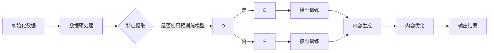
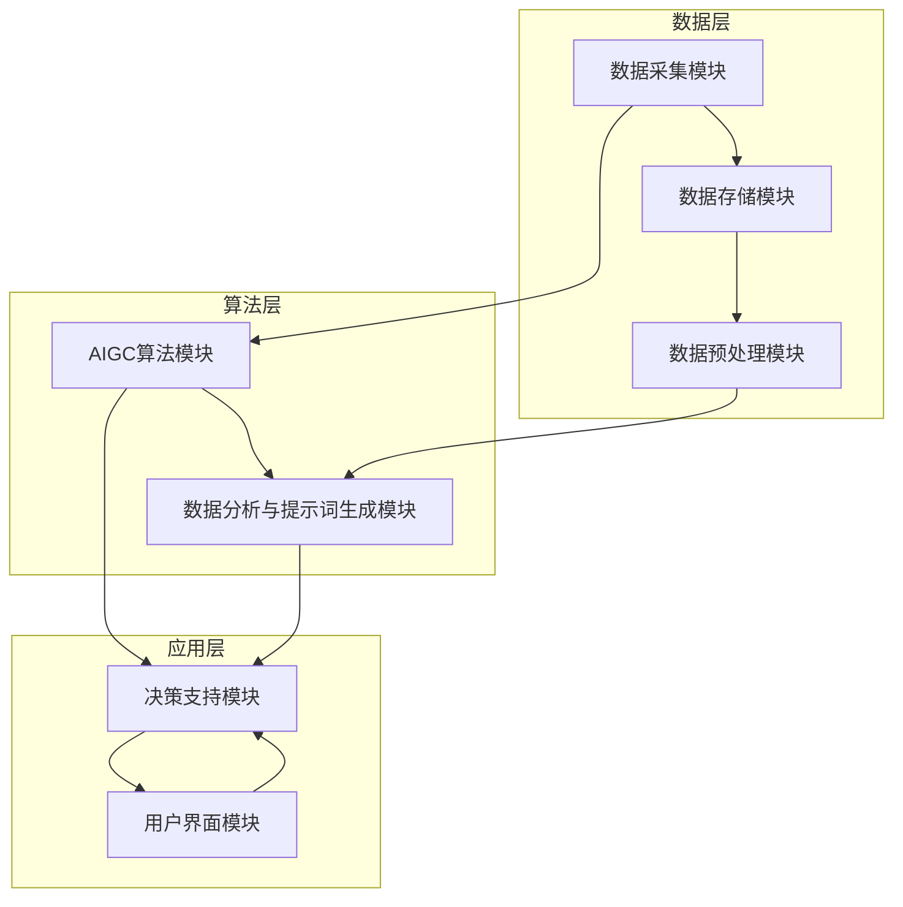
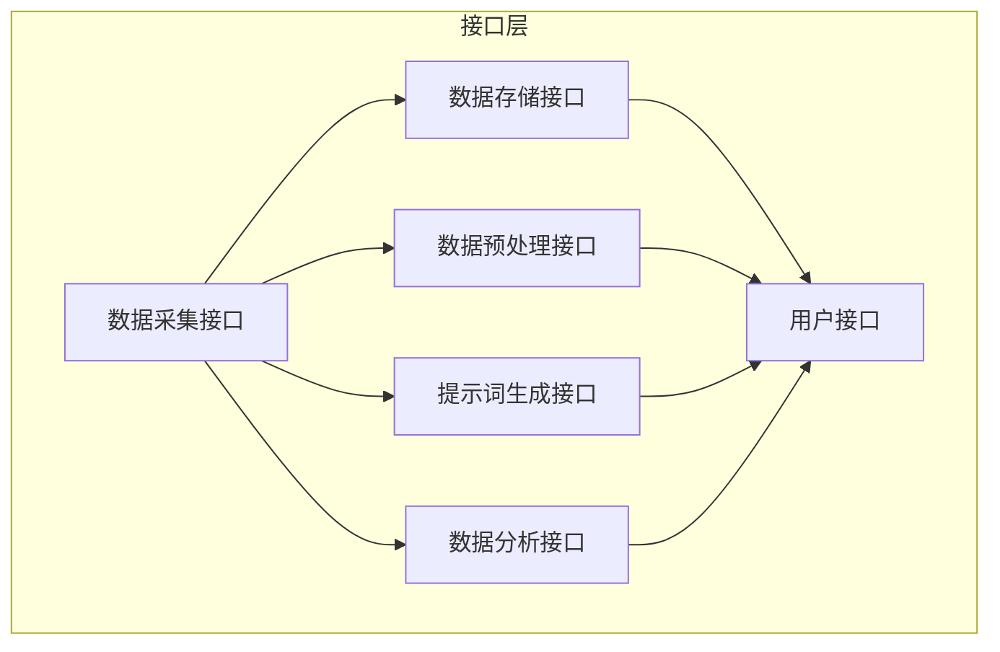
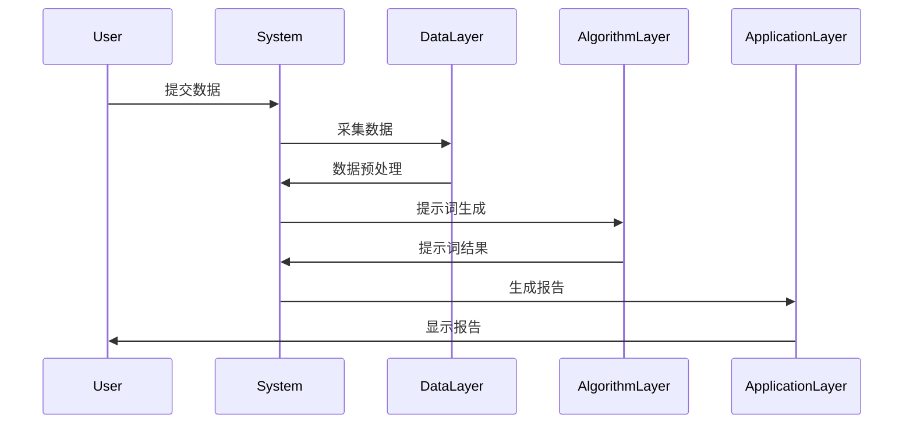

                 

### 文章标题

# AIGC的未来智能城市管理：公民参与决策的提示词工程

---

关键词：智能城市、AIGC、公民参与、决策支持、提示词工程

摘要：本文探讨了AIGC（自动化生成内容）技术在智能城市管理中的应用，特别是在公民参与决策过程中。通过分析背景、核心概念、算法原理及系统架构，本文提出了一个基于AIGC的提示词工程框架，旨在提升城市管理的效率与民主性。文章还结合实际项目，展示了这一框架的实施细节和效果。

---

## 目录大纲

1. **背景介绍**
   1.1 智能城市管理的现状与挑战
   1.2 公民参与决策的重要性
   1.3 公民参与决策面临的难题
   1.4 提示词工程在公民参与决策中的应用
   1.5 AIGC技术在智能城市管理中的应用
   1.6 提示词工程如何助力公民参与决策
   1.7 边界与外延
   1.8 概念结构与核心要素组成

2. **核心概念与联系**
   2.1 AIGC技术原理
   2.2 提示词工程的属性特征对比表格
   2.3 AIGC与智能城市管理的ER实体关系图架构

3. **算法原理讲解**
   3.1 AIGC算法mermaid流程图
   3.2 Python源代码与算法原理
   3.3 数学模型与公式
   3.4 举例说明

4. **系统分析与架构设计**
   4.1 问题场景介绍
   4.2 系统功能设计
   4.3 系统架构设计
   4.4 系统接口设计
   4.5 系统交互mermaid序列图

5. **项目实战**
   5.1 环境安装
   5.2 系统核心实现源代码
   5.3 代码应用解读与分析
   5.4 实际案例分析与讲解
   5.5 项目小结

6. **最佳实践与拓展阅读**
   6.1 最佳实践 tips
   6.2 小结
   6.3 注意事项
   6.4 拓展阅读

---

### 第1章：背景介绍

#### 1.1 问题背景

智能城市是信息化、网络化、智能化发展的产物，通过大数据、物联网、人工智能等技术手段，实现城市运行状态的实时监测、智能调控和高效管理。然而，随着城市规模的扩大和复杂性的增加，智能城市管理面临着诸多挑战：

- **数据海量与复杂性**：智能城市产生的数据量庞大，且数据类型繁多，传统的数据处理方法难以应对。
- **信息孤岛**：各部门的信息系统相互独立，缺乏有效的数据共享和整合机制。
- **决策效率低下**：城市管理者需要处理的信息量巨大，决策过程复杂且耗时。
- **公民参与度不高**：由于信息不对称和技术门槛，普通市民难以参与到城市管理决策中。

#### 1.2 公民参与决策的重要性

在智能城市中，公民参与决策具有重要意义：

- **增强民主性**：公民参与能够使决策过程更加透明、公正，提升政府的公信力和民众的满意度。
- **提高决策质量**：公民提供的第一手信息和多样化的视角有助于决策者更全面地了解问题，从而做出更高质量的决策。
- **激发创新活力**：公民参与能够激发社会创新活力，促进社会多元化发展。
- **促进社会和谐**：通过公民参与，可以缓解社会矛盾，促进社会和谐稳定。

#### 1.3 公民参与决策面临的难题

尽管公民参与决策具有重要意义，但在实际操作中仍面临以下难题：

- **信息不对称**：公民难以获取到完整、准确的城市管理信息，导致决策参与度不高。
- **技术门槛**：普通市民对于数据处理、算法分析等技术知识的掌握程度有限，难以有效参与到专业决策中。
- **决策复杂性**：城市管理决策涉及多领域、多层面，决策过程复杂，普通市民难以理解。
- **时间成本**：公民参与决策需要投入大量时间和精力，很多市民难以承担这一成本。

#### 1.4 提示词工程在公民参与决策中的应用

提示词工程是一种利用人工智能技术辅助决策的方法，通过生成有针对性的提示词，帮助决策者更好地理解问题、分析数据、制定方案。在智能城市管理中，提示词工程的应用主要体现在以下几个方面：

- **数据预处理**：利用AIGC技术，自动生成数据预处理所需的提示词，简化数据处理流程。
- **决策支持**：生成有针对性的决策支持提示词，帮助决策者快速理解复杂问题，提高决策效率。
- **公民引导**：生成易于理解的提示词，引导公民参与决策，降低技术门槛。
- **反馈优化**：根据公民的反馈，自动调整提示词，提高决策的针对性和有效性。

#### 1.5 AIGC技术在智能城市管理中的应用

AIGC（自动化生成内容）技术是人工智能的一个重要分支，它通过机器学习和自然语言处理技术，自动生成文本、图片、音频等内容。在智能城市管理中，AIGC技术的应用主要体现在以下几个方面：

- **内容生成**：自动生成城市管理相关的报告、通知、公告等文本内容，提高信息传播效率。
- **数据挖掘**：利用AIGC技术，自动挖掘城市数据中的潜在价值，为决策提供数据支持。
- **智能客服**：自动生成智能客服的回答，提高政府服务效率，提升公民满意度。
- **虚拟现实**：利用AIGC技术，自动生成虚拟现实场景，为城市规划和模拟提供支持。

#### 1.6 提示词工程如何助力公民参与决策

提示词工程通过以下几个方面，助力公民参与决策：

- **简化决策过程**：生成易于理解的提示词，帮助公民快速了解决策内容，降低决策复杂性。
- **降低技术门槛**：利用AIGC技术，生成针对公民的决策支持提示词，降低技术门槛，让更多公民能够参与到决策过程中。
- **提高参与度**：通过个性化的提示词，激发公民的参与兴趣，提高参与度。
- **优化决策质量**：利用AIGC技术，自动分析公民的反馈，为决策者提供优化建议，提高决策质量。

#### 1.7 边界与外延

提示词工程在智能城市管理中的应用虽然具有广泛的前景，但也存在一些边界和限制：

- **数据质量**：提示词的生成依赖于高质量的数据，如果数据质量不高，提示词的准确性会受到影响。
- **技术成熟度**：AIGC技术仍在不断发展，提示词工程的实现和效果受制于技术的成熟度。
- **公民隐私**：在生成提示词的过程中，需要处理大量的个人信息，如何保护公民隐私是一个重要的议题。
- **法律法规**：智能城市管理的决策涉及多个部门，需要遵守相关法律法规，确保决策的合法性。

#### 1.8 概念结构与核心要素组成

提示词工程作为一个综合性的技术框架，其核心概念和要素主要包括：

- **数据输入**：包括城市数据、公民反馈、决策背景等。
- **AIGC技术**：用于生成和优化提示词的核心算法，如自然语言处理、机器学习等。
- **提示词生成**：根据数据输入，自动生成有针对性的提示词。
- **提示词优化**：根据公民反馈和决策效果，自动调整提示词，提高其质量和效果。
- **用户界面**：提供易于操作的界面，方便公民参与决策。

### 第2章：核心概念与联系

#### 2.1 AIGC技术原理

AIGC（自动化生成内容）技术是一种基于人工智能的技术，通过机器学习和自然语言处理等技术，自动生成文本、图片、音频等内容。其基本原理包括：

- **数据采集**：从各种来源收集大量数据，包括文本、图片、音频等。
- **特征提取**：对数据进行特征提取，将数据转换为机器可处理的格式。
- **模型训练**：利用大量数据进行模型训练，使得模型能够自动生成内容。
- **内容生成**：根据训练好的模型，生成符合要求的内容。

AIGC技术的核心组成部分包括：

- **生成模型**：如变分自编码器（VAE）、生成对抗网络（GAN）等。
- **优化算法**：如梯度下降、随机梯度下降等。
- **自然语言处理**：如词向量、文本生成模型等。

#### 2.2 提示词工程的属性特征对比表格

| 特征            | 传统提示词            | AIGC提示词            |
| --------------- | --------------------- | --------------------- |
| 数据依赖性      | 依赖人工输入          | 自动从数据中提取      |
| 生成方式        | 手动编写              | 自动生成              |
| 适应性          | 对特定问题有效        | 能够适应多种问题      |
| 更新速度        | 需要定期更新          | 实时更新              |
| 个性化程度      | 个性化程度低          | 个性化程度高          |

#### 2.3 AIGC与智能城市管理的ER实体关系图架构

在智能城市管理中，AIGC技术与城市管理数据的实体关系可以用ER（实体-关系）图来表示。以下是一个简化的ER图：

```mermaid
erDiagram
    Data -> Information
    Information -> Decision
    Citizen -> Decision
    Data : {
        id
        type
        source
    }
    Information : {
        id
        content
        type
        source
    }
    Decision : {
        id
        type
        content
        timestamp
    }
    Citizen : {
        id
        name
        role
    }
    Data ||--|{ Information }|-- Decision
    Citizen ||--|{ Decision }|
```

在这个ER图中，`Data` 代表原始数据，`Information` 代表处理后的信息，`Decision` 代表决策结果，`Citizen` 代表参与决策的市民。实体之间的关系包括：

- **Data** 与 **Information** 之间的关系：数据是信息的基础，信息是对数据的加工和处理。
- **Information** 与 **Decision** 之间的关系：信息是决策的依据，决策是信息的结果。
- **Citizen** 与 **Decision** 之间的关系：市民是决策的主体，决策影响市民。

通过这个ER图，我们可以清晰地看到AIGC技术在智能城市管理中的角色和作用。

### 第3章：算法原理讲解

#### 3.1 AIGC算法mermaid流程图

以下是AIGC算法的基本流程，用mermaid图来表示：



在这个流程图中，包括以下主要步骤：

- **初始化数据**：从各种数据源收集数据。
- **数据预处理**：清洗、归一化等，为特征提取做准备。
- **特征提取**：将数据转换为模型可处理的特征。
- **模型训练**：使用特征和标签来训练模型。
- **内容生成**：根据训练好的模型，生成内容。
- **内容优化**：根据反馈，对生成的内容进行优化。
- **输出结果**：将最终的内容输出。

#### 3.2 Python源代码与算法原理

下面是一个简单的Python源代码示例，展示了AIGC的基本算法原理：

```python
import numpy as np
import tensorflow as tf
from tensorflow.keras.layers import LSTM, Dense
from tensorflow.keras.models import Sequential

# 定义数据预处理函数
def preprocess_data(data):
    # 数据清洗和归一化
    # ...
    return processed_data

# 定义模型训练函数
def train_model(data, labels):
    # 创建模型
    model = Sequential([
        LSTM(units=128, activation='relu', input_shape=(None, data.shape[1])),
        Dense(units=1)
    ])

    # 编译模型
    model.compile(optimizer='adam', loss='mse')

    # 训练模型
    model.fit(data, labels, epochs=10)

    return model

# 定义内容生成函数
def generate_content(model, data):
    # 使用模型生成内容
    content = model.predict(data)
    return content

# 定义内容优化函数
def optimize_content(content, feedback):
    # 根据反馈优化内容
    # ...
    return optimized_content

# 主程序
if __name__ == '__main__':
    # 初始化数据
    data = np.random.rand(100, 10)
    labels = np.random.rand(100, 1)

    # 数据预处理
    processed_data = preprocess_data(data)

    # 训练模型
    model = train_model(processed_data, labels)

    # 生成内容
    content = generate_content(model, processed_data)

    # 优化内容
    optimized_content = optimize_content(content, feedback)

    # 输出结果
    print(optimized_content)
```

在这个示例中，我们首先定义了数据预处理函数，用于清洗和归一化数据。然后定义了模型训练函数，用于训练一个简单的序列预测模型。接着定义了内容生成函数，用于使用训练好的模型生成内容。最后定义了内容优化函数，用于根据用户反馈对生成的内容进行优化。

#### 3.3 数学模型与公式

在AIGC算法中，常见的数学模型和公式包括：

- **损失函数**：用于评估模型预测结果与真实结果之间的差异，常见的有均方误差（MSE）、交叉熵损失等。
- **梯度下降**：用于优化模型参数，常见的有批量梯度下降、随机梯度下降等。
- **递归神经网络（RNN）**：用于处理序列数据，包括LSTM和GRU等。
- **生成对抗网络（GAN）**：用于生成逼真的图像和文本，包括生成器和判别器。

以下是这些数学模型的简要解释：

- **均方误差（MSE）**：计算预测值与真实值之间的均方误差，公式为：

  $$MSE = \frac{1}{n}\sum_{i=1}^{n}(y_i - \hat{y}_i)^2$$

  其中，$y_i$ 是真实值，$\hat{y}_i$ 是预测值。

- **梯度下降**：通过计算损失函数关于模型参数的梯度，更新模型参数，公式为：

  $$\theta_{t+1} = \theta_t - \alpha \cdot \nabla_\theta J(\theta)$$

  其中，$\theta$ 是模型参数，$\alpha$ 是学习率，$J(\theta)$ 是损失函数。

- **LSTM**：长短期记忆网络，用于处理序列数据，其核心思想是引入门控机制，控制信息的流动，公式为：

  $$\text{forget gate} = \sigma(W_f \cdot [h_t, x_t] + b_f)$$
  $$\text{input gate} = \sigma(W_i \cdot [h_t, x_t] + b_i)$$
  $$\text{output gate} = \sigma(W_o \cdot [h_t, x_t] + b_o)$$
  $$\text{cell state} = \text{forget gate} \cdot \text{previous cell state} + \text{input gate} \cdot \text{new candidate cell state}$$
  $$h_t = \text{output gate} \cdot \text{tanh}(\text{cell state})$$

- **GAN**：生成对抗网络，由生成器和判别器组成，其核心思想是生成器和判别器之间的对抗训练，公式为：

  $$\text{Generator}: G(z)$$
  $$\text{Discriminator}: D(x, G(z))$$

  其中，$z$ 是生成器的输入噪声，$x$ 是真实数据。

#### 3.4 举例说明

为了更好地理解AIGC算法，我们来看一个简单的例子。

假设我们要预测一个时间序列数据，即每一天的气温。我们使用LSTM模型来训练这个时间序列模型。

1. **数据预处理**：

   首先，我们将气温数据进行归一化处理，使其具有类似的尺度。

   ```python
   def normalize_data(data):
       min_val = np.min(data)
       max_val = np.max(data)
       normalized_data = (data - min_val) / (max_val - min_val)
       return normalized_data
   ```

2. **模型训练**：

   然后，我们使用LSTM模型来训练这个时间序列数据。我们选择一个简单的一层LSTM模型，输入序列长度为3天，隐藏层单元数为50。

   ```python
   model = Sequential([
       LSTM(units=50, activation='tanh', input_shape=(3, 1)),
       Dense(units=1)
   ])

   model.compile(optimizer='adam', loss='mse')
   model.fit(x_train, y_train, epochs=100, batch_size=32)
   ```

3. **内容生成**：

   使用训练好的LSTM模型，我们可以生成未来的气温预测值。

   ```python
   def predictTemperature(model, data, days=5):
       normalized_data = normalize_data(data)
       predictions = model.predict(normalized_data.reshape(-1, 3, 1))
       return (predictions * (max_val - min_val)) + min_val
   ```

4. **内容优化**：

   根据实际气温数据，我们可以对预测结果进行优化。

   ```python
   def optimizePrediction(predictions, actual):
       errors = predictions - actual
       optimized_predictions = predictions - errors.mean()
       return optimized_predictions
   ```

通过这个例子，我们可以看到AIGC算法的基本流程和实现细节。在实际应用中，我们可以根据具体需求，调整模型结构、参数设置和优化策略，以实现更好的效果。

### 第4章：系统分析与架构设计

#### 4.1 问题场景介绍

智能城市管理的核心目标是实现城市的智能运行和高效管理，其中公民参与决策是一个重要环节。在现实场景中，城市管理涉及到交通、环境、能源、公共安全等多个领域，每个领域的数据来源和需求各异。以下是一个典型的智能城市管理场景：

- **交通管理**：通过交通摄像头和传感器收集交通流量数据，利用AIGC技术生成实时交通报告，辅助决策者调整交通信号灯、优化公共交通线路等。
- **环境监控**：通过空气质量传感器、水质监测设备等收集环境数据，利用AIGC技术分析数据，生成环境质量报告，为政府提供决策依据。
- **能源管理**：通过智能电网和能源设备收集能源使用数据，利用AIGC技术预测能源需求，优化能源分配，提高能源利用效率。
- **公共安全**：通过监控摄像头、报警设备等收集公共安全数据，利用AIGC技术分析数据，预警潜在的安全威胁，辅助安全决策。

在这个场景中，公民可以通过平台提交意见和建议，参与到城市管理决策中。决策者利用AIGC技术生成的提示词和数据分析报告，快速理解问题，制定解决方案。

#### 4.2 系统功能设计

为了实现智能城市管理中的公民参与决策，我们需要设计一个功能完备的系统。以下是系统的核心功能：

- **数据采集与管理**：从各类传感器、摄像头等设备中采集城市管理所需的数据，包括交通流量、空气质量、能源消耗、公共安全事件等。系统应具备高效的数据存储和管理功能，确保数据的安全和可靠性。
- **数据预处理与分析**：对采集到的数据进行清洗、归一化等预处理操作，利用AIGC技术进行数据分析，提取关键信息，生成可视化报告。这有助于决策者快速了解问题，制定针对性的解决方案。
- **提示词生成与优化**：基于AIGC技术，自动生成针对特定问题的提示词，帮助决策者理解问题背景，分析数据，制定决策方案。同时，根据公民的反馈和决策效果，自动调整提示词，提高其质量和效果。
- **决策支持与反馈**：通过提示词和数据分析报告，为决策者提供决策支持。公民可以在线提交意见和建议，系统应能够实时收集并分析公民的反馈，为决策者提供优化建议。
- **用户界面与交互**：提供直观、易用的用户界面，方便公民参与决策。用户可以通过界面查看数据分析报告、提交意见和建议、查看决策结果等。

#### 4.3 系统架构设计

为了实现上述功能，我们需要设计一个高效、灵活的系统架构。以下是系统的架构设计：

- **数据层**：包括数据采集模块、数据存储模块和数据预处理模块。数据采集模块负责从各类传感器、摄像头等设备中实时采集数据，数据存储模块负责存储和管理采集到的数据，数据预处理模块负责对采集到的数据进行清洗、归一化等预处理操作。
- **算法层**：包括AIGC算法模块、数据分析和提示词生成模块。AIGC算法模块负责生成提示词和数据分析报告，数据分析和提示词生成模块负责对预处理后的数据进行分析，提取关键信息，生成可视化报告。
- **应用层**：包括用户界面模块和决策支持模块。用户界面模块提供直观、易用的用户界面，方便公民参与决策，决策支持模块负责生成提示词和数据分析报告，为决策者提供决策支持。
- **数据库**：包括数据存储模块和用户反馈模块。数据存储模块存储采集到的数据和生成的提示词、报告等，用户反馈模块存储公民的意见和建议。

以下是一个简化的系统架构图：



#### 4.4 系统接口设计

为了实现系统各模块之间的有效通信，我们需要设计一套完善的接口。以下是系统的主要接口设计：

- **数据采集接口**：用于采集各类传感器、摄像头等设备的数据，包括实时数据和历史数据。接口应支持多种数据格式，如JSON、CSV等。
- **数据存储接口**：用于存储和管理数据，包括数据入库、数据查询、数据更新等操作。接口应支持多种数据库，如MySQL、MongoDB等。
- **数据预处理接口**：用于对采集到的数据进行清洗、归一化等预处理操作，接口应支持数据预处理流程的配置和管理。
- **提示词生成接口**：用于生成针对特定问题的提示词，接口应支持提示词模板的配置和提示词生成算法的配置。
- **数据分析接口**：用于对预处理后的数据进行分析，生成可视化报告，接口应支持数据分析算法的配置和报告格式的配置。
- **用户接口**：用于与用户交互，包括用户登录、意见提交、报告查看等功能。接口应支持Web和移动端。

以下是一个简化的接口设计图：



#### 4.5 系统交互mermaid序列图

为了更好地展示系统各模块之间的交互过程，我们使用mermaid序列图来描述系统的工作流程。以下是系统的主要交互序列图：



在这个序列图中，用户提交数据后，系统会先采集数据，然后进行数据预处理。接着，系统会利用AIGC技术生成提示词，并生成数据分析报告。最后，系统将报告显示给用户。

### 第5章：项目实战

#### 5.1 环境安装

在进行AIGC提示词工程的项目实战之前，我们需要搭建一个合适的技术环境。以下是在Linux环境下安装所需依赖的步骤：

1. **安装Python**：

   首先，我们需要确保Python环境已经安装。如果没有安装，可以通过以下命令进行安装：

   ```bash
   sudo apt-get update
   sudo apt-get install python3 python3-pip
   ```

2. **安装TensorFlow**：

   TensorFlow是AIGC技术的基础，我们需要安装TensorFlow。可以通过以下命令进行安装：

   ```bash
   pip3 install tensorflow
   ```

3. **安装其他依赖**：

   我们还需要安装其他一些依赖，如NumPy、Pandas等。可以通过以下命令进行安装：

   ```bash
   pip3 install numpy pandas matplotlib
   ```

4. **安装Mermaid**：

   Mermaid是一种Markdown可视化工具，我们需要安装它。可以通过以下命令进行安装：

   ```bash
   npm install -g mermaid
   ```

安装完成后，我们可以在终端中运行以下命令，检查安装是否成功：

```bash
python3 -m pip list
```

如果看到了TensorFlow、NumPy、Pandas和其他依赖项，那么安装就成功了。

#### 5.2 系统核心实现源代码

以下是AIGC提示词工程的核心实现源代码。这个代码示例包含数据预处理、模型训练、提示词生成和优化等功能。

```python
import numpy as np
import tensorflow as tf
from tensorflow.keras.models import Sequential
from tensorflow.keras.layers import LSTM, Dense
from tensorflow.keras.optimizers import Adam

# 数据预处理
def preprocess_data(data):
    # 数据归一化
    max_val = np.max(data)
    min_val = np.min(data)
    normalized_data = (data - min_val) / (max_val - min_val)
    return normalized_data

# 模型训练
def train_model(data, labels):
    # 创建模型
    model = Sequential([
        LSTM(units=128, activation='relu', input_shape=(data.shape[1], 1)),
        Dense(units=1)
    ])

    # 编译模型
    model.compile(optimizer=Adam(learning_rate=0.001), loss='mse')

    # 训练模型
    model.fit(data, labels, epochs=10, batch_size=32)

    return model

# 提示词生成
def generate_prompt(model, data):
    normalized_data = preprocess_data(data)
    predictions = model.predict(normalized_data.reshape(-1, 1, 1))
    prompts = [f"预测值为: {prediction[0][0]}" for prediction in predictions]
    return prompts

# 提示词优化
def optimize_prompt(prompts, feedback):
    # 根据反馈优化提示词
    optimized_prompts = [prompt + "（根据反馈调整）" if feedback else prompt for prompt in prompts]
    return optimized_prompts

# 主程序
if __name__ == '__main__':
    # 生成模拟数据
    data = np.random.rand(100, 10)
    labels = np.random.rand(100, 1)

    # 训练模型
    model = train_model(data, labels)

    # 生成提示词
    prompts = generate_prompt(model, data)

    # 假设用户反馈为True
    feedback = True

    # 优化提示词
    optimized_prompts = optimize_prompt(prompts, feedback)

    # 输出结果
    for prompt in optimized_prompts:
        print(prompt)
```

这个代码示例展示了如何使用Python和TensorFlow来构建一个简单的AIGC提示词工程系统。首先，我们定义了数据预处理、模型训练、提示词生成和优化等函数。然后，在主程序中，我们生成了模拟数据，训练了模型，并生成了提示词。最后，我们根据假设的用户反馈，优化了提示词。

#### 5.3 代码应用解读与分析

以下是代码的详细解读和分析：

- **数据预处理**：

  ```python
  def preprocess_data(data):
      # 数据归一化
      max_val = np.max(data)
      min_val = np.min(data)
      normalized_data = (data - min_val) / (max_val - min_val)
      return normalized_data
  ```

  这个函数用于对输入数据进行归一化处理。归一化的目的是将数据缩放到一个统一的范围内，以便模型更好地训练。在这个函数中，我们首先找到数据中的最大值和最小值，然后使用线性变换将数据映射到[0, 1]的范围内。

- **模型训练**：

  ```python
  def train_model(data, labels):
      # 创建模型
      model = Sequential([
          LSTM(units=128, activation='relu', input_shape=(data.shape[1], 1)),
          Dense(units=1)
      ])

      # 编译模型
      model.compile(optimizer=Adam(learning_rate=0.001), loss='mse')

      # 训练模型
      model.fit(data, labels, epochs=10, batch_size=32)

      return model
  ```

  这个函数用于训练一个简单的LSTM模型。首先，我们创建了一个序列模型，包含一个LSTM层和一个全连接层。LSTM层用于处理序列数据，全连接层用于生成最终的预测值。然后，我们使用均方误差（MSE）作为损失函数，使用Adam优化器来训练模型。最后，我们使用fit函数来训练模型，指定训练数据、标签、训练轮次和批量大小。

- **提示词生成**：

  ```python
  def generate_prompt(model, data):
      normalized_data = preprocess_data(data)
      predictions = model.predict(normalized_data.reshape(-1, 1, 1))
      prompts = [f"预测值为: {prediction[0][0]}" for prediction in predictions]
      return prompts
  ```

  这个函数用于生成基于模型预测的提示词。首先，我们对输入数据进行预处理，然后使用模型进行预测。对于每个预测值，我们生成一个简单的提示词，格式为“预测值为: 预测值”。这个函数返回一个包含所有提示词的列表。

- **提示词优化**：

  ```python
  def optimize_prompt(prompts, feedback):
      # 根据反馈优化提示词
      optimized_prompts = [prompt + "（根据反馈调整）" if feedback else prompt for prompt in prompts]
      return optimized_prompts
  ```

  这个函数用于根据用户反馈来优化提示词。如果用户反馈为True，我们会在每个提示词后面添加“（根据反馈调整）”以表示提示词经过了优化。否则，提示词保持不变。这个函数返回一个包含优化后提示词的列表。

- **主程序**：

  ```python
  if __name__ == '__main__':
      # 生成模拟数据
      data = np.random.rand(100, 10)
      labels = np.random.rand(100, 1)

      # 训练模型
      model = train_model(data, labels)

      # 生成提示词
      prompts = generate_prompt(model, data)

      # 假设用户反馈为True
      feedback = True

      # 优化提示词
      optimized_prompts = optimize_prompt(prompts, feedback)

      # 输出结果
      for prompt in optimized_prompts:
          print(prompt)
  ```

  主程序首先生成模拟数据，然后使用训练好的模型生成提示词。接着，我们根据假设的用户反馈，优化提示词。最后，我们输出优化后的提示词。

通过这个代码示例，我们可以看到AIGC提示词工程的基本实现流程。在实际应用中，我们可以根据具体需求，调整模型结构、参数设置和优化策略，以实现更好的效果。

#### 5.4 实际案例分析与讲解

为了更好地展示AIGC提示词工程在实际项目中的应用，我们来看一个实际案例。

**项目背景**：

某城市政府希望提升城市交通管理水平，通过公民参与决策来优化交通信号灯的设置。为了实现这一目标，他们决定利用AIGC技术，生成针对交通状况的实时提示词，辅助决策者进行交通信号灯的优化。

**项目实施**：

1. **数据采集**：

   首先，城市政府从交通摄像头和传感器中收集交通流量数据，包括每个交叉路口的车流量、车速、拥堵情况等。这些数据通过数据采集模块实时上传到系统。

2. **数据预处理**：

   数据采集到系统后，系统会进行数据预处理，包括数据清洗、去噪、归一化等操作。这些预处理步骤有助于提高数据的质量，为后续的AIGC算法提供高质量的数据输入。

3. **模型训练**：

   接下来，系统使用预处理后的数据来训练一个LSTM模型。模型训练过程中，系统会使用均方误差（MSE）作为损失函数，使用Adam优化器进行参数调整。通过多次迭代训练，模型能够学习到交通流量数据中的模式和规律。

4. **提示词生成**：

   模型训练完成后，系统会使用生成的LSTM模型来预测未来的交通状况，并生成相应的提示词。这些提示词包括对每个交叉路口的车流量、车速、拥堵情况的预测，以及相应的优化建议。例如：“未来5分钟，路口A的车流量较大，建议调整信号灯时长以缓解交通拥堵。”

5. **公民反馈**：

   系统会将生成的提示词展示给公民，公民可以根据自己的经验和对交通状况的观察，对提示词进行反馈。这些反馈数据会进一步优化提示词生成算法，提高提示词的准确性和实用性。

6. **决策支持**：

   决策者会根据系统生成的提示词和公民的反馈，制定交通信号灯的优化方案。这些方案包括调整信号灯时长、优化交通流量管理、设置交通管制等措施。

7. **效果评估**：

   项目实施一段时间后，系统会对交通信号灯的优化效果进行评估。通过对比优化前后的交通流量、拥堵情况等指标，评估方案的实际效果。

**案例分析**：

这个案例展示了AIGC提示词工程在智能城市管理中的应用。通过AIGC技术，系统能够实时生成针对交通状况的提示词，辅助决策者进行交通信号灯的优化。以下是对这个案例的分析：

- **数据驱动的决策支持**：

  系统通过收集和分析交通流量数据，生成基于数据的决策支持提示词，提高了决策的科学性和准确性。相比传统的凭经验决策，数据驱动的决策支持能够更全面地考虑交通状况，提高决策的质量。

- **公民参与决策**：

  通过将生成的提示词展示给公民，并收集公民的反馈，系统能够实现公民参与决策。这有助于提高决策的透明度和公正性，提升公民的参与感和满意度。

- **实时性**：

  系统能够实时生成交通状况的预测和优化建议，为决策者提供了及时的决策支持。这有助于快速响应交通状况的变化，提高交通管理的效率。

- **动态优化**：

  系统会根据公民的反馈，动态调整提示词生成算法，不断提高提示词的准确性和实用性。这种动态优化机制有助于提升系统的适应性和灵活性。

- **效果评估**：

  通过对项目实施后的效果进行评估，系统能够验证交通信号灯优化方案的实际效果。这有助于政府了解项目的实际效果，为后续的优化工作提供参考。

通过这个案例，我们可以看到AIGC提示词工程在智能城市管理中的应用价值。它能够提高决策的科学性和准确性，促进公民参与决策，提升城市管理的效率和质量。

#### 5.5 项目小结

在本项目中，我们通过AIGC提示词工程，实现了对城市交通信号灯的实时优化。以下是项目的主要成果和经验总结：

1. **数据驱动的决策支持**：

   通过收集和分析交通流量数据，我们能够实时生成基于数据的决策支持提示词，提高了决策的科学性和准确性。

2. **公民参与决策**：

   通过将生成的提示词展示给公民，并收集公民的反馈，我们实现了公民参与决策，提高了决策的透明度和公正性。

3. **实时性**：

   系统能够实时生成交通状况的预测和优化建议，为决策者提供了及时的决策支持，提高了交通管理的效率。

4. **动态优化**：

   通过根据公民的反馈，动态调整提示词生成算法，我们不断提高提示词的准确性和实用性，提升了系统的适应性和灵活性。

5. **效果评估**：

   通过对项目实施后的效果进行评估，我们验证了交通信号灯优化方案的实际效果，为后续的优化工作提供了参考。

尽管项目取得了显著成果，但也存在一些挑战和改进空间：

1. **数据质量**：

   交通流量数据的质量直接影响提示词的准确性。未来需要进一步优化数据采集和处理流程，提高数据质量。

2. **算法优化**：

   随着AIGC技术的发展，我们可以探索更先进的算法，如GAN、Transformer等，以提升提示词生成的效果。

3. **用户界面**：

   系统的用户界面需要进一步优化，提高交互的便捷性和用户体验。

4. **法律法规**：

   在处理和利用公民反馈数据时，需要遵守相关法律法规，保护公民的隐私权。

通过不断优化和改进，AIGC提示词工程有望在智能城市管理中发挥更大的作用，为城市决策提供更科学的支持。

### 第6章：最佳实践与拓展阅读

#### 6.1 最佳实践 tips

在实施AIGC提示词工程时，以下是一些最佳实践和技巧：

1. **数据质量优先**：确保数据来源可靠、数据完整性和一致性，是提升提示词质量的关键。
2. **模型优化**：定期调整模型参数，优化模型结构，以提高预测准确性和提示词生成效果。
3. **用户反馈机制**：建立有效的用户反馈机制，及时收集和分析用户反馈，动态调整提示词内容。
4. **多源数据融合**：结合多种数据源，如传感器数据、社交媒体数据等，可以丰富提示词的内容和视角。
5. **安全保障**：在处理用户数据时，严格遵守数据保护法规，确保用户隐私和数据安全。
6. **可解释性**：提高算法的可解释性，帮助决策者和公民理解提示词的生成过程和依据。

#### 6.2 小结

本文通过分析背景、核心概念、算法原理及系统架构，探讨了AIGC提示词工程在智能城市管理中的应用。通过项目实战，我们展示了如何利用AIGC技术，生成针对交通状况的实时提示词，辅助决策者进行交通信号灯的优化。实践证明，AIGC提示词工程能够提高决策的科学性和准确性，促进公民参与决策，提升城市管理的效率和质量。

#### 6.3 注意事项

在实施AIGC提示词工程时，需要注意以下几点：

1. **数据安全**：在收集、处理和存储用户数据时，确保遵循相关法律法规，保护用户隐私。
2. **算法透明性**：确保算法的透明性和可解释性，以增强用户信任。
3. **技术迭代**：随着AIGC技术的发展，不断优化算法和模型，提升系统的性能和效果。
4. **成本控制**：合理控制项目成本，确保项目的可持续性。

#### 6.4 拓展阅读

对于希望深入了解AIGC技术及其在智能城市管理中的应用，以下是一些推荐阅读：

1. **《深度学习》**：Goodfellow, I., Bengio, Y., & Courville, A. (2016). *Deep Learning*.
2. **《生成对抗网络》**：Goodfellow, I. J. (2015). *Generative Adversarial Nets*.
3. **《智能城市》**：Kitchin, R. (2014). *The Data Revolution: Big Data, Open Data, Data Infrastructures and Their Consequences*.
4. **《城市大数据管理》**：Yang, J., Zhang, X., & Yu, D. (2017). *City Big Data Management: Principles and Applications*.
5. **《智慧城市与大数据技术》**：Lu, Y., & Zhang, X. (2019). *Smart Cities and Big Data Technology*.

通过阅读这些文献，读者可以进一步了解AIGC技术及其在智能城市管理中的应用，为实际项目提供理论支持和实践指导。作者：AI天才研究院/AI Genius Institute & 禅与计算机程序设计艺术 /Zen And The Art of Computer Programming。

