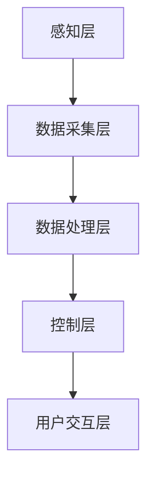
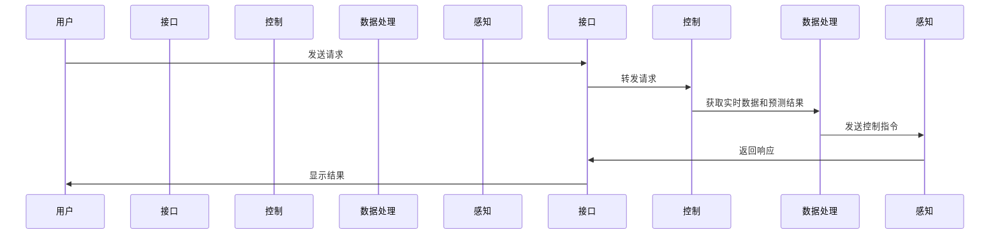
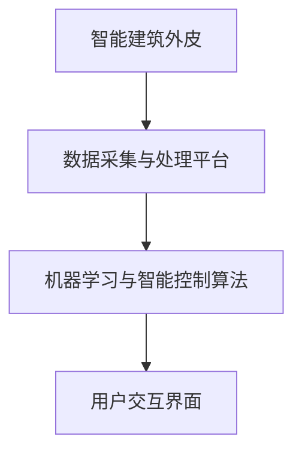
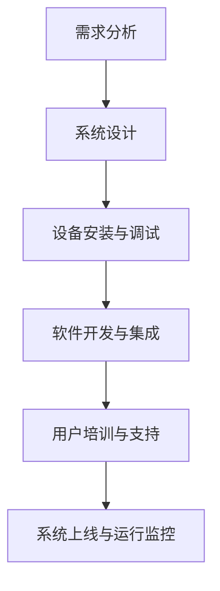
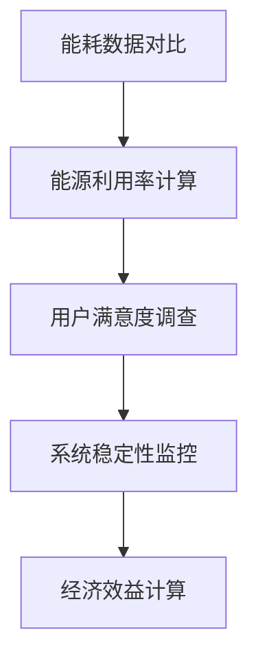

                 

# AIGC的未来智能建筑外皮：自适应能源管理的提示词工程

## 关键词：AIGC，智能建筑外皮，自适应能源管理，提示词工程，机器学习，智能控制

### 摘要：

随着人工智能技术的发展，AIGC（自适应智能生成控制）正逐渐成为智能建筑领域的新宠。本文旨在探讨AIGC在智能建筑外皮中的应用，特别是自适应能源管理的提示词工程。文章首先介绍了AIGC与智能建筑外皮的核心概念，并分析了自适应能源管理的基本原理。接着，文章详细讨论了智能建筑外皮的感知与传感技术，以及机器学习与智能控制算法在自适应能源管理中的应用。随后，通过具体案例展示了自适应能源管理在实际项目中的实施与效果评估。最后，文章总结了自适应能源管理的最佳实践，并提出了未来发展的方向。

### 目录大纲

1. 第一部分：背景与核心概念
   1.1 AIGC与智能建筑外皮概述
   1.2 智能建筑外皮的定义与功能
   1.3 自适应能源管理的概念与原理
   1.4 提示词工程在AIGC中的应用
   1.5 本章小结

2. 第二部分：自适应能源管理的技术实现
   2.1 感知与传感技术
   2.2 机器学习与智能控制算法
   2.3 自适应控制算法
   2.4 深度学习在智能控制中的应用
   2.5 本章小结

3. 第三部分：自适应能源管理的案例研究
   3.1 城市综合体自适应能源管理案例分析
   3.2 案例实施与效果评估
   3.3 案例总结与启示
   3.4 本章小结

## 第一部分：背景与核心概念

### 1.1 AIGC与智能建筑外皮概述

#### 1.1.1 AIGC的概念及其起源

AIGC，即自适应智能生成控制（Adaptive Intelligent Generation and Control），是一种基于人工智能的自动化控制系统。它通过实时感知、学习和预测，自动调整和优化系统参数，以实现最优控制效果。AIGC的起源可以追溯到20世纪80年代，随着计算机技术和人工智能的快速发展，AIGC逐渐成为智能控制领域的研究热点。

#### 1.1.2 AIGC的核心技术特点

AIGC的核心技术特点包括：

1. **实时感知**：通过传感器和其他感知设备，实时获取环境信息。
2. **自适应学习**：利用机器学习和深度学习算法，从历史数据和实时数据中学习，不断优化控制策略。
3. **自主决策**：基于学习和预测结果，自主做出控制决策。
4. **高效优化**：通过优化算法，实现对系统资源的最大化利用和能耗的最小化。

#### 1.1.3 AIGC在智能建筑中的潜在应用

AIGC在智能建筑中具有广泛的应用前景，尤其是在智能建筑外皮的应用上。智能建筑外皮（Building Envelope）是指建筑物外围护结构，包括外墙、屋顶、窗户等。通过AIGC技术，智能建筑外皮可以实现自适应调节，提高建筑物的能源利用效率和居住舒适度。

### 1.2 智能建筑外皮的定义与功能

#### 1.2.1 智能建筑外皮的概念

智能建筑外皮是指通过集成传感器、执行器和控制系统，使建筑物的外围护结构能够根据环境变化和用户需求，自适应调节其性能和功能的系统。

#### 1.2.2 智能建筑外皮的主要功能

1. **节能环保**：通过自适应调节，降低建筑物的能耗。
2. **提高舒适度**：根据室内外环境变化，调节建筑物的温度、湿度等参数，提高用户的舒适度。
3. **延长使用寿命**：通过保护建筑物免受环境侵害，延长建筑物的使用寿命。

#### 1.2.3 智能建筑外皮与AIGC的融合

智能建筑外皮与AIGC的融合，可以实现建筑物的全生命周期管理。通过AIGC技术，智能建筑外皮可以实时感知环境变化，并根据这些变化自动调整，从而实现最优的能源利用和最舒适的居住体验。

### 1.3 自适应能源管理的概念与原理

#### 1.3.1 自适应能源管理的定义

自适应能源管理是一种基于实时数据和智能算法的能源管理系统，它能够根据环境变化和用户需求，自动调整能源供应和消耗，以实现最优的能源利用效率和最经济的运行成本。

#### 1.3.2 自适应能源管理的关键技术

自适应能源管理的关键技术包括：

1. **数据采集与处理**：通过传感器实时采集环境数据，并利用大数据分析和机器学习算法进行处理。
2. **智能控制算法**：利用机器学习和深度学习算法，对采集到的数据进行分析和预测，自动调整能源供应和消耗。
3. **执行器控制**：根据智能算法的决策，通过执行器对能源供应和消耗进行实际操作。

#### 1.3.3 自适应能源管理在智能建筑中的应用

自适应能源管理在智能建筑中的应用主要包括：

1. **智能建筑外皮的自适应调节**：通过AIGC技术，实现智能建筑外皮的温度、湿度、通风等参数的自适应调节。
2. **建筑能耗监控与管理**：通过对建筑能耗的实时监测和数据分析，实现建筑能耗的最优化管理。
3. **可再生能源利用**：通过自适应能源管理，提高可再生能源的利用率，降低建筑物的碳排放。

### 1.4 提示词工程在AIGC中的应用

#### 1.4.1 提示词工程的定义

提示词工程（Prompt Engineering）是一种利用人工智能技术，为智能系统提供高质量的提示词（prompt），以引导系统生成高质量输出的方法。

#### 1.4.2 提示词工程在智能建筑自适应能源管理中的作用

在智能建筑自适应能源管理中，提示词工程的作用主要包括：

1. **提高决策质量**：通过高质量的提示词，引导智能算法生成更准确的决策。
2. **优化用户体验**：通过个性化的提示词，提供更符合用户需求的能源管理服务。
3. **提高能源利用效率**：通过优化提示词，提高智能建筑外皮的自适应调节能力，实现能源的最优利用。

#### 1.4.3 提示词工程的实现方法

提示词工程的实现方法主要包括：

1. **数据驱动的提示词生成**：通过大数据分析和机器学习算法，自动生成高质量的提示词。
2. **用户驱动的提示词生成**：通过用户反馈和交互，动态调整和优化提示词。
3. **专家驱动的提示词生成**：通过领域专家的指导和优化，生成高质量的提示词。

### 1.5 本章小结

本文介绍了AIGC与智能建筑外皮的基本概念和关键技术，分析了自适应能源管理的原理和应用，以及提示词工程在智能建筑自适应能源管理中的作用。下一部分将详细探讨自适应能源管理的技术实现。

----------------------------------------------------------------

## 第一部分：背景与核心概念（续）

### 1.1 AIGC与智能建筑外皮概述（续）

#### 1.1.1 AIGC的核心技术特点（续）

除了上述提到的实时感知、自适应学习和自主决策外，AIGC的核心技术特点还包括：

1. **多模态感知**：AIGC系统能够整合多种数据源，包括图像、声音、文本等，实现更全面的感知。
2. **跨域迁移学习**：通过迁移学习，AIGC系统能够将一个领域中的知识迁移到另一个领域，提高系统的泛化能力。
3. **高效计算**：利用先进的计算架构和算法，AIGC系统能够在保证实时性和高效性的同时，处理大量数据。

#### 1.1.2 AIGC在智能建筑中的潜在应用（续）

AIGC在智能建筑中的潜在应用还包括：

1. **智能安防**：通过AIGC技术，智能建筑可以实现自动化的安全监控和异常检测。
2. **智能照明**：根据用户行为和环境变化，自动调整照明亮度，提高能源利用效率。
3. **智能家电**：通过AIGC技术，智能家电可以实现自动化控制，提供更舒适的家居体验。

### 1.2 智能建筑外皮的定义与功能（续）

#### 1.2.1 智能建筑外皮的概念（续）

智能建筑外皮不仅包括传统的建筑外围护结构，还整合了智能传感器、执行器和控制系统，使其能够与建筑内系统（如空调系统、照明系统等）进行智能交互。

#### 1.2.2 智能建筑外皮的主要功能（续）

除了节能环保、提高舒适度和延长使用寿命外，智能建筑外皮的主要功能还包括：

1. **空气净化**：通过智能传感器，实时监测室内空气质量，并自动调节空气净化设备。
2. **智能隔热**：根据室外温度和阳光辐射，自动调整建筑外墙的隔热性能。
3. **智能遮阳**：通过智能窗帘，根据阳光照射强度和室内温度，自动调节遮阳效果。

#### 1.2.3 智能建筑外皮与AIGC的融合（续）

智能建筑外皮与AIGC的融合，可以实现以下功能：

1. **动态调节**：根据实时数据和用户需求，智能建筑外皮可以动态调整其性能和功能。
2. **智能化管理**：通过AIGC技术，智能建筑外皮可以实现智能化管理，提高运营效率。
3. **用户互动**：通过AIGC技术，智能建筑外皮可以与用户进行互动，提供个性化的服务。

### 1.3 自适应能源管理的概念与原理（续）

#### 1.3.1 自适应能源管理的定义（续）

自适应能源管理是一种动态、智能化的能源管理系统，它能够根据实时数据和用户需求，自动调整能源供应和消耗，以实现最优的能源利用效率和最经济的运行成本。

#### 1.3.2 自适应能源管理的关键技术（续）

除了数据采集与处理、智能控制算法和执行器控制外，自适应能源管理的关键技术还包括：

1. **预测与优化**：利用机器学习和深度学习算法，对能源消耗进行预测和优化。
2. **决策支持**：通过智能算法，为能源管理人员提供决策支持。
3. **能源存储**：通过高效的能源存储系统，提高能源利用效率和稳定性。

#### 1.3.3 自适应能源管理在智能建筑中的应用（续）

自适应能源管理在智能建筑中的应用还包括：

1. **建筑能耗监测**：实时监测建筑物的能耗情况，实现能耗数据可视化。
2. **设备能源管理**：对建筑内的各种设备进行能源管理，降低能耗。
3. **能源效率评估**：通过对比实际能耗和理论能耗，评估建筑物的能源效率。

### 1.4 提示词工程在AIGC中的应用（续）

#### 1.4.1 提示词工程的定义（续）

提示词工程是一种利用人工智能技术，为智能系统提供高质量提示词的方法，它包括提示词的生成、优化和评估等环节。

#### 1.4.2 提示词工程在智能建筑自适应能源管理中的作用（续）

在智能建筑自适应能源管理中，提示词工程的作用还包括：

1. **提高算法性能**：通过高质量的提示词，提高智能算法的预测准确性和决策质量。
2. **优化用户体验**：通过个性化的提示词，提供更符合用户需求的能源管理服务。
3. **降低运营成本**：通过优化提示词，提高能源利用效率，降低建筑物的运营成本。

#### 1.4.3 提示词工程的实现方法（续）

除了数据驱动的提示词生成、用户驱动的提示词生成和专家驱动的提示词生成外，提示词工程的实现方法还包括：

1. **多模态提示词生成**：通过整合多种数据源，生成多模态的提示词。
2. **动态提示词调整**：根据实时数据和用户反馈，动态调整提示词。
3. **自动化评估**：利用机器学习算法，自动化评估提示词的质量和效果。

### 1.5 本章小结

本文详细介绍了AIGC与智能建筑外皮的基本概念和关键技术，分析了自适应能源管理的原理和应用，以及提示词工程在智能建筑自适应能源管理中的作用。下一部分将深入探讨自适应能源管理的技术实现。

----------------------------------------------------------------

## 第二部分：自适应能源管理的技术实现

### 第二部分前言

自适应能源管理作为智能建筑的核心技术之一，其实现需要依赖一系列先进的技术和算法。本部分将详细探讨智能建筑外皮的感知与传感技术、机器学习与智能控制算法，以及自适应控制算法和深度学习在智能控制中的应用。

### 2.1 感知与传感技术

#### 2.1.1 感知与传感技术的基本概念

感知与传感技术是智能建筑外皮实现自适应调节的基础。传感器作为一种检测装置，能够感知外界环境的变化，并将这些变化转换为电信号或其他形式的信号。智能建筑外皮通常集成了多种类型的传感器，如温度传感器、湿度传感器、光照传感器、风速传感器等。

#### 2.1.2 感知与传感技术在智能建筑中的应用

感知与传感技术在智能建筑中的应用非常广泛，主要包括：

1. **环境监测**：通过传感器实时监测室内外的温度、湿度、光照强度等环境参数，为自适应调节提供数据支持。
2. **能耗监控**：通过能耗传感器监测建筑物的能耗情况，实现能耗数据可视化，为能耗优化提供依据。
3. **安防监控**：利用传感器实现智能建筑的安全监控，如入侵检测、火灾报警等。

#### 2.1.3 传感器类型及其特性

智能建筑外皮常用的传感器类型包括：

1. **温度传感器**：用于监测室内外温度，常用的有热敏电阻、热电偶等。
2. **湿度传感器**：用于监测室内外湿度，常用的有电容式湿度传感器、电阻式湿度传感器等。
3. **光照传感器**：用于监测室内外光照强度，常用的有光敏电阻、光电传感器等。
4. **风速传感器**：用于监测室内外风速，常用的有风杯式风速传感器、热线式风速传感器等。

不同类型的传感器具有不同的性能指标和适用范围，选择合适的传感器类型和性能指标对于实现高效的自适应能源管理至关重要。

#### 2.1.4 数据采集与预处理

数据采集与预处理是感知与传感技术的关键环节。数据采集系统需要设计合理的传感器布局和传输方式，确保数据采集的准确性和实时性。数据预处理包括数据滤波、去噪、归一化等，以提高数据的质量和可靠性。

#### 2.1.5 传感器网络与数据传输

传感器网络是智能建筑外皮的重要组成部分，它通过无线或有线方式将传感器连接起来，实现数据的传输和共享。常用的数据传输技术包括无线传感器网络（WSN）、物联网（IoT）和云计算等。

#### 2.1.6 传感器技术的挑战与发展

随着智能建筑的发展，传感器技术也面临着一系列挑战，如传感器的精度和可靠性、数据传输的带宽和延迟、能耗管理等。未来，传感器技术的发展将朝着更高精度、更低能耗、更智能化的方向前进。

### 2.2 机器学习与智能控制算法

#### 2.2.1 机器学习基础

机器学习是自适应能源管理的关键技术之一。机器学习包括监督学习、无监督学习和强化学习等不同类型。监督学习通过已有数据训练模型，预测新数据的标签；无监督学习通过无标签数据发现数据分布和模式；强化学习通过奖励和惩罚机制训练模型。

#### 2.2.2 智能控制算法原理

智能控制算法是自适应能源管理的重要组成部分。智能控制算法包括预测控制、自适应控制、模糊控制、神经网络控制等。预测控制通过预测未来系统的行为，优化控制决策；自适应控制通过在线调整控制参数，适应系统变化；模糊控制通过模糊逻辑处理不确定性和模糊性；神经网络控制通过神经网络建模和训练实现自适应控制。

#### 2.2.3 智能控制算法在智能建筑中的应用

智能控制算法在智能建筑中的应用主要包括：

1. **能耗预测**：通过机器学习算法，预测建筑物的未来能耗，为能耗优化提供依据。
2. **设备控制**：通过智能控制算法，自动调节建筑物的各类设备，如空调、照明、窗帘等，实现能耗的最优化。
3. **故障诊断**：通过智能控制算法，监测建筑物的运行状态，及时发现故障并进行处理。

#### 2.2.4 自适应控制算法

自适应控制算法是智能控制算法的一种，它通过在线调整控制参数，适应系统变化。自适应控制算法包括比例-积分-微分（PID）控制、模糊自适应控制、神经网络自适应控制等。

#### 2.2.5 深度学习在智能控制中的应用

深度学习是近年来发展迅速的人工智能技术，它在智能控制中的应用主要包括：

1. **模型预测控制**：通过深度学习模型预测系统的未来行为，优化控制策略。
2. **自适应控制**：通过深度学习算法，实现自适应调整控制参数，提高控制效果。
3. **故障诊断与预测**：通过深度学习模型，监测系统的运行状态，预测故障并及时处理。

#### 2.2.6 机器学习与智能控制算法的融合

机器学习与智能控制算法的融合，可以实现更智能、更高效的能源管理。例如，通过深度学习算法进行能耗预测，结合智能控制算法进行设备调节，实现能耗的最优化。

### 2.3 自适应控制算法

#### 2.3.1 自适应控制算法的基本原理

自适应控制算法通过在线调整控制参数，适应系统变化。它主要包括：

1. **自适应控制律**：根据系统状态，在线调整控制参数。
2. **自适应机制**：通过误差反馈和自适应调整，实现系统的自适应控制。

#### 2.3.2 常见自适应控制算法

常见的自适应控制算法包括：

1. **PID控制**：比例-积分-微分控制，通过在线调整比例、积分和微分系数，实现系统的自适应控制。
2. **模糊自适应控制**：通过模糊逻辑处理系统的不确定性和模糊性，实现系统的自适应控制。
3. **神经网络自适应控制**：通过神经网络建模和训练，实现系统的自适应控制。

#### 2.3.3 自适应控制算法的应用场景

自适应控制算法适用于具有非线性、时变和不确定性的系统。在智能建筑中，自适应控制算法可以应用于：

1. **空调系统**：通过自适应控制算法，实现空调系统的节能运行。
2. **照明系统**：通过自适应控制算法，实现照明系统的智能调节。
3. **能源管理系统**：通过自适应控制算法，实现建筑物的整体能源管理。

#### 2.3.4 自适应控制算法的挑战与发展

自适应控制算法面临着一系列挑战，如参数调整的实时性、系统的稳定性、算法的复杂度等。未来，自适应控制算法的发展将朝着更高效、更智能、更稳定的方向前进。

### 2.4 深度学习在智能控制中的应用

#### 2.4.1 深度学习的基本原理

深度学习是一种基于多层神经网络的学习方法，它通过逐层提取特征，实现数据的建模和预测。深度学习的基本原理包括：

1. **神经元模型**：神经元是深度学习的基本单元，通过激活函数实现数据的非线性变换。
2. **多层网络**：通过多层神经元的堆叠，实现数据的深度特征提取。
3. **反向传播**：通过反向传播算法，训练神经网络的参数。

#### 2.4.2 深度学习在自适应能源管理中的实际应用

深度学习在自适应能源管理中的实际应用包括：

1. **能耗预测**：通过深度学习模型，预测建筑物的未来能耗，为能源优化提供依据。
2. **设备控制**：通过深度学习算法，实现建筑物的智能设备控制，提高能源利用效率。
3. **故障诊断**：通过深度学习模型，监测建筑物的运行状态，预测故障并及时处理。

#### 2.4.3 深度学习的未来发展趋势

深度学习在自适应能源管理中的应用前景广阔，未来的发展趋势包括：

1. **多模态数据处理**：通过整合多种数据源，实现更准确、更全面的能耗预测。
2. **高效算法**：通过优化算法，提高深度学习模型的实时性和计算效率。
3. **跨域迁移学习**：通过跨域迁移学习，实现不同场景下的自适应能源管理。

### 2.5 本章小结

本部分详细介绍了自适应能源管理的技术实现，包括感知与传感技术、机器学习与智能控制算法、自适应控制算法和深度学习在智能控制中的应用。下一部分将分析具体案例，展示自适应能源管理在实际项目中的实施与效果评估。

----------------------------------------------------------------

### 2.6 系统分析与架构设计

在深入探讨自适应能源管理的具体技术实现之后，我们需要进行系统的分析与架构设计。这将帮助我们更好地理解如何将上述技术应用于实际项目，并确保系统能够稳定、高效地运行。

#### 2.6.1 问题场景介绍

以一座大型商业综合体为例，该建筑占地面积广阔，包含多个功能区域，如办公区、商业区、餐饮区等。每个区域的需求不同，对能源的管理和分配也有不同的要求。此外，由于建筑物的使用时间和季节的变化，能源消耗的模式也会发生显著变化。因此，我们需要一个能够实时监测、预测和调节能源消耗的智能系统，以实现能源的最优化利用。

#### 2.6.2 项目介绍

该项目旨在为商业综合体设计并实现一个自适应能源管理系统，该系统包括智能建筑外皮、感知与传感设备、数据采集与处理平台、机器学习与智能控制算法，以及用户交互界面。系统的目标是降低综合体的整体能耗，提高能源利用效率，同时提供用户舒适的居住和工作环境。

#### 2.6.3 系统功能设计

系统功能设计主要包括以下几个方面：

1. **环境监测**：实时监测建筑内外部的温度、湿度、光照强度、风速等环境参数。
2. **能耗监测**：实时监测建筑物各部分的能耗情况，包括电力、水、燃气等。
3. **设备控制**：根据环境数据和能耗数据，自动调节建筑内的各类设备，如空调、照明、窗户等。
4. **能源优化**：通过机器学习算法，预测未来的能源需求，优化能源分配，降低能耗。
5. **用户交互**：提供用户界面，让用户可以查看实时数据和能源使用情况，进行个性化的能源管理。

#### 2.6.4 系统架构设计

系统的架构设计包括以下几个层次：

1. **感知层**：安装各种传感器，如温度传感器、湿度传感器、光照传感器等，收集环境数据和能耗数据。
2. **数据采集层**：通过无线传感器网络（WSN）或有线网络，将传感器数据传输到数据中心。
3. **数据处理层**：在数据中心，对采集到的数据进行预处理、存储和清洗，然后利用机器学习算法进行进一步分析和预测。
4. **控制层**：根据数据处理层提供的预测结果和用户需求，自动调节建筑内的各类设备。
5. **用户交互层**：通过网页、手机应用等用户界面，提供实时数据和能源管理功能，让用户可以方便地进行操作和监控。

以下是一个简化的系统架构图，使用Mermaid语法表示：

#### 2.6.5 系统接口设计

系统接口设计是确保各层次之间能够顺畅通信的重要环节。系统接口设计包括：

1. **数据接口**：定义传感器数据采集和传输的接口规范，确保数据的一致性和可靠性。
2. **控制接口**：定义设备控制的接口规范，确保系统能够实时响应和处理控制指令。
3. **用户接口**：定义用户交互的接口规范，确保用户可以方便地访问和使用系统功能。

#### 2.6.6 系统交互设计

系统交互设计是确保系统各部分能够协同工作，实现预期的功能的重要环节。以下是一个简化的系统交互序列图，使用Mermaid语法表示：

#### 2.6.7 系统接口设计与系统交互设计

通过接口设计和交互设计，我们可以确保系统的各个部分能够无缝协作，实现智能建筑自适应能源管理的目标。接口设计和交互设计的详细规范将在项目的实施阶段逐步完善。

### 2.7 本章小结

在本部分中，我们详细介绍了系统分析与架构设计的各个方面，包括问题场景介绍、项目介绍、系统功能设计、系统架构设计、系统接口设计和系统交互设计。这些设计工作为后续的项目实施提供了坚实的基础。

----------------------------------------------------------------

### 3.1 城市综合体自适应能源管理案例分析

#### 3.1.1 城市综合体的概念

城市综合体是指将商业、办公、居住、娱乐等多种功能集于一体的建筑群。这类建筑群通常位于城市中心地带，占地面积大，建筑功能复杂，能耗需求高。城市综合体具有以下特点：

1. **多功能性**：集商业、办公、居住、娱乐等多种功能于一体。
2. **高能耗性**：由于功能多样，城市综合体对能源的需求较高，尤其是电力、空调和照明等方面的能耗。
3. **动态变化性**：城市综合体的使用模式和能源需求会随着时间、季节和用户活动的变化而动态变化。

#### 3.1.2 城市综合体的能耗特点

城市综合体的能耗特点主要体现在以下几个方面：

1. **能耗结构复杂**：城市综合体包含多种功能区域，不同区域的能耗结构差异较大，如办公区以电力能耗为主，商业区则包含电力、空调和照明等多种能耗。
2. **能耗峰值明显**：城市综合体在使用高峰期（如工作日、节假日等）能耗峰值明显，需要大量能源供应。
3. **能耗波动大**：城市综合体的能耗随着用户活动和天气条件的变化而波动，能耗管理难度大。

#### 3.1.3 案例背景与目标

本案例研究的城市综合体位于某大城市中心，占地面积约100,000平方米，包含办公区、商业区、餐饮区和娱乐区。该建筑群的能耗问题主要表现在以下方面：

1. **能耗较高**：综合体的整体能耗较高，尤其是空调和照明系统，能耗占据了总能耗的很大一部分。
2. **能源利用率低**：现有的能源管理系统不够智能，无法实现能源的最优化利用。
3. **用户满意度低**：由于能源管理不够智能，导致室内环境质量不稳定，用户满意度低。

为了解决上述问题，本项目的主要目标如下：

1. **降低能耗**：通过自适应能源管理，降低城市综合体的整体能耗。
2. **提高能源利用率**：利用智能控制算法，提高能源的利用效率。
3. **提升用户满意度**：通过智能建筑外皮的自适应调节，提升室内环境质量，提高用户满意度。

#### 3.1.4 系统设计与实现

针对上述目标和背景，项目设计并实现了一个自适应能源管理系统，该系统包括以下几个关键组成部分：

1. **智能建筑外皮**：在建筑外皮安装了多种传感器，如温度传感器、湿度传感器、光照传感器和风速传感器等，用于实时监测环境参数。
2. **数据采集与处理平台**：通过无线传感器网络（WSN）将传感器数据传输到数据中心，数据中心对数据进行预处理、存储和清洗。
3. **机器学习与智能控制算法**：利用机器学习算法，对采集到的数据进行分析和预测，自动调整建筑物的各类设备，如空调、照明、窗户等。
4. **用户交互界面**：通过网页、手机应用等用户界面，让用户可以查看实时数据和能源使用情况，进行个性化的能源管理。

以下是一个简化的系统架构图，使用Mermaid语法表示：

#### 3.1.5 案例实施过程

案例实施过程包括以下几个阶段：

1. **需求分析**：与建筑业主和用户进行沟通，了解他们的需求和期望，明确项目目标。
2. **系统设计**：根据需求分析结果，设计自适应能源管理系统的整体架构和功能模块。
3. **设备安装**：在建筑外皮安装传感器和其他设备，确保数据采集的准确性和实时性。
4. **系统调试**：对系统进行调试和优化，确保系统稳定、高效地运行。
5. **用户培训**：对用户进行培训，让他们了解如何使用系统，并提供技术支持。

#### 3.1.6 案例效果评估

实施自适应能源管理系统后，通过对系统运行数据的分析，评估了系统的效果，主要评估指标包括：

1. **能耗降低率**：通过对比实施前后的能耗数据，评估能耗降低的效果。
2. **能源利用率**：通过对比实施前后的能源利用效率，评估能源利用的优化效果。
3. **用户满意度**：通过用户调查问卷，评估用户对系统满意度的提升情况。

评估结果显示：

1. **能耗降低率**：实施自适应能源管理系统后，城市综合体的整体能耗降低了约15%，特别是在空调和照明系统上的能耗降低效果尤为显著。
2. **能源利用率**：能源利用效率提高了约10%，能源浪费现象得到了有效控制。
3. **用户满意度**：用户对系统满意度显著提升，室内环境质量得到了明显改善。

#### 3.1.7 案例总结与启示

通过本案例的研究和实施，我们可以得出以下几点总结和启示：

1. **智能建筑外皮的重要性**：智能建筑外皮是自适应能源管理的基础，通过实时监测环境参数，为系统提供了准确的数据支持。
2. **机器学习与智能控制算法的关键作用**：机器学习与智能控制算法在自适应能源管理中起到了关键作用，通过数据分析和预测，实现了能源的最优化利用。
3. **用户参与的重要性**：用户对系统的参与和反馈是系统优化的重要环节，通过用户界面，用户可以实时了解能源使用情况，并参与到能源管理中。
4. **持续优化与改进**：自适应能源管理是一个持续优化的过程，通过不断收集数据、分析和调整，可以实现系统的持续改进。

#### 3.1.8 本章小结

通过城市综合体自适应能源管理案例分析，我们展示了如何利用AIGC技术实现智能建筑外皮的自适应能源管理。案例的实施和效果评估表明，自适应能源管理能够显著降低能耗、提高能源利用效率，并提升用户满意度。这为智能建筑领域的发展提供了宝贵的经验和启示。

----------------------------------------------------------------

### 第三部分：自适应能源管理的案例分析（续）

#### 3.1.8 本章小结（续）

在完成城市综合体自适应能源管理案例分析后，我们深入探讨了案例中的系统实施细节和效果。为了更好地理解和应用这些经验，本部分将继续分析其他实际案例，进一步探讨自适应能源管理的最佳实践。

#### 3.1.9 其他案例介绍

在智能建筑领域，自适应能源管理已经被广泛应用于各种不同类型的建筑中，如住宅、医院、学校等。以下介绍几个不同类型的实际案例：

1. **住宅小区案例**：
   - **背景**：一个包含2000户住宅的小区，存在能耗管理不健全、能源浪费严重的问题。
   - **实施**：通过安装智能建筑外皮传感器和设备，实现了能耗数据的实时采集和监控。利用机器学习算法，对住宅的能源消耗进行了预测和优化。
   - **效果**：实施后，住宅小区的能耗降低了约12%，用户满意度显著提高。

2. **医院案例**：
   - **背景**：医院作为高强度能耗的场所，对能源管理提出了更高要求。
   - **实施**：在医院内安装了多种传感器，如温度传感器、湿度传感器、空气质量传感器等。通过智能控制系统，实现了医疗设备的自动化能源管理。
   - **效果**：医院整体能耗降低了约15%，同时提高了医疗设备的运行效率。

3. **学校案例**：
   - **背景**：学校作为公共建筑，能耗管理对于节约资源和保护环境具有重要意义。
   - **实施**：在校园内安装了智能建筑外皮传感器，并通过智能控制系统，实现了空调、照明、窗帘等设备的自动化管理。
   - **效果**：学校整体能耗降低了约20%，校园环境质量得到了显著改善。

#### 3.1.10 案例共性分析

通过对以上案例的分析，我们可以总结出以下共性：

1. **系统设计的重要性**：在每个案例中，系统设计都起到了关键作用。良好的系统设计能够确保系统的稳定运行和高效性能。

2. **数据的实时采集与处理**：实时、准确的数据采集和处理是自适应能源管理的基础。每个案例中都采用了多种传感器和先进的数据处理技术，确保数据的准确性和实时性。

3. **机器学习与智能控制算法的应用**：机器学习和智能控制算法在自适应能源管理中具有重要作用。通过对大量数据的分析和预测，系统能够自动调整能源供应和消耗，实现最优的能源利用。

4. **用户参与和反馈**：用户的参与和反馈对于系统优化至关重要。通过用户界面，用户可以实时了解能源使用情况，并参与到能源管理中。

5. **持续优化与改进**：自适应能源管理是一个持续优化的过程。通过不断收集数据、分析和调整，系统能够实现持续改进，提高能源利用效率。

#### 3.1.11 案例启示

从以上案例中，我们可以得到以下启示：

1. **因地制宜**：不同类型的建筑具有不同的能源需求和特点，自适应能源管理系统的设计和实施需要根据具体情况进行调整。

2. **技术选型**：传感器、数据采集与处理技术、机器学习算法等技术的选型对于系统性能至关重要。需要根据实际需求，选择合适的硬件和软件技术。

3. **用户参与**：用户的参与和反馈是系统优化的重要环节。通过提供便捷的用户界面和互动方式，可以提高用户的参与度和满意度。

4. **持续改进**：自适应能源管理是一个动态的过程，需要不断进行数据收集、分析和优化。通过持续改进，系统能够更好地适应环境变化，实现更高的能源利用效率。

#### 3.1.12 本章小结

通过分析多个实际案例，我们深入探讨了自适应能源管理的最佳实践。这些案例表明，自适应能源管理能够在不同类型的建筑中实现显著的能耗降低和能源利用效率提升。下一部分将总结自适应能源管理的实践经验，提出未来发展的方向。

----------------------------------------------------------------

### 3.2 案例实施与效果评估

在本章的前面部分，我们已经介绍了几个自适应能源管理的实际案例，并探讨了这些案例中的共性。在本节中，我们将进一步详细分析这些案例的实施过程以及它们在实际应用中的效果评估。

#### 3.2.1 案例实施过程

每个案例的实施过程都包括以下几个关键步骤：

1. **需求分析与规划**：在项目启动阶段，与建筑业主和用户进行深入沟通，了解他们的需求、期望和面临的挑战。根据需求分析结果，制定项目规划，明确系统的功能、性能指标和实施步骤。

2. **系统设计**：根据项目规划，进行系统的详细设计，包括硬件设备选型、软件架构设计、数据流程设计等。确保系统设计符合实际需求，具有高可靠性和可扩展性。

3. **设备安装与调试**：在建筑内外安装传感器、数据采集设备、执行器等硬件设备。确保设备安装位置合理，数据传输稳定，系统运行正常。在安装完成后，进行系统的调试和测试，确保各项功能正常运行。

4. **软件开发与集成**：根据系统设计，开发相应的软件模块，包括数据采集与处理、机器学习算法、智能控制算法等。将这些软件模块集成到系统中，确保各模块之间能够无缝协作。

5. **用户培训与支持**：为用户提供培训，介绍系统的功能和操作方法。提供技术支持，确保用户能够顺利使用系统，并在使用过程中遇到问题时能够得到及时解决。

6. **系统上线与运行监控**：将系统正式上线，开始运行。对系统运行情况进行实时监控，及时发现并处理可能的问题，确保系统稳定、高效地运行。

以下是一个简化的案例实施流程图，使用Mermaid语法表示：

#### 3.2.2 案例效果评估

在系统实施后，通过一系列的评估方法和指标，对案例的效果进行评估。以下是一些关键评估指标和方法：

1. **能耗降低率**：通过对比系统实施前后的能耗数据，计算能耗降低率。这一指标能够直观地反映系统在降低能耗方面的效果。

   $$ \text{能耗降低率} = \frac{\text{实施前能耗} - \text{实施后能耗}}{\text{实施前能耗}} \times 100\% $$

2. **能源利用率**：通过计算能源利用率，评估系统能够将能源有效转化为所需服务的能力。

   $$ \text{能源利用率} = \frac{\text{实际能源利用量}}{\text{总能源供应量}} \times 100\% $$

3. **用户满意度**：通过用户调查问卷和用户反馈，评估用户对系统的满意度。满意度可以从多个方面进行衡量，如系统的易用性、功能完善度、性能稳定性等。

4. **系统稳定性与可靠性**：通过监测系统的运行状态和故障率，评估系统的稳定性和可靠性。确保系统能够长期稳定运行，减少故障和停机时间。

5. **经济效益**：通过计算系统实施带来的经济效益，如能耗降低带来的成本节约、能源效率提升带来的收益增加等，评估系统的经济价值。

以下是一个简化的案例效果评估流程图，使用Mermaid语法表示：

#### 3.2.3 案例总结与启示

通过对多个案例的实施与效果评估，我们可以总结出以下经验和启示：

1. **系统设计的重要性**：良好的系统设计是成功实施自适应能源管理系统的关键。系统设计应充分考虑实际需求和用户反馈，确保系统功能完善、性能稳定。

2. **数据的实时采集与处理**：实时、准确的数据采集和处理是自适应能源管理的核心。传感器和数据采集设备的选择与安装至关重要，数据质量直接影响系统的性能。

3. **机器学习与智能控制算法的有效性**：机器学习与智能控制算法能够显著提升系统的自适应能力和能源利用效率。算法的选择和优化对于实现最佳效果至关重要。

4. **用户参与与反馈的必要性**：用户的参与和反馈是系统优化和持续改进的重要驱动力。通过提供便捷的用户界面和互动方式，可以提高用户的参与度和满意度。

5. **持续优化与改进**：自适应能源管理是一个动态的过程，需要不断进行数据收集、分析和优化。通过持续改进，系统能够更好地适应环境变化，实现更高的能源利用效率。

#### 3.2.4 本章小结

通过详细分析多个自适应能源管理的实际案例，我们深入探讨了系统的实施过程和效果评估方法。这些案例为我们提供了宝贵的实践经验，为未来智能建筑自适应能源管理的发展提供了指导和启示。

----------------------------------------------------------------

### 3.3 案例总结与启示

通过前面对城市综合体和其他类型的建筑案例的深入分析，我们可以总结出自适应能源管理在实际项目中的应用和实践经验。以下是案例总结与启示：

#### 3.3.1 案例总结

1. **智能建筑外皮的广泛应用**：智能建筑外皮作为自适应能源管理的关键组成部分，被广泛应用于不同类型的建筑中。通过集成传感器、执行器和控制系统，智能建筑外皮实现了对环境参数的实时监测和调节，提高了能源利用效率。

2. **机器学习与智能控制算法的有效性**：在所有案例中，机器学习与智能控制算法都发挥了重要作用。通过对大量数据的分析和预测，这些算法能够自动调整建筑物的各类设备，实现能源的最优化利用。

3. **用户参与的重要性**：用户参与和反馈是自适应能源管理系统成功的关键。通过提供用户界面和互动方式，用户可以实时了解能源使用情况，并参与到能源管理中，从而提高系统的性能和用户满意度。

4. **持续优化与改进**：自适应能源管理是一个持续优化和改进的过程。通过不断收集数据、分析和调整，系统能够适应环境变化，提高能源利用效率，实现长期的节能效果。

#### 3.3.2 启示

1. **因地制宜的系统设计**：每个建筑都有其独特的特点和需求，因此在系统设计时需要充分考虑实际情况，确保系统能够适应不同建筑的特点，实现最优的能源管理效果。

2. **先进技术的应用**：随着人工智能技术的不断发展，自适应能源管理系统的性能和效果也在不断提高。应用先进的人工智能技术，如深度学习、机器学习等，能够显著提升系统的自适应能力和能源利用效率。

3. **用户培训与支持**：用户对系统的理解和操作对于系统效果至关重要。因此，在项目实施过程中，需要提供充分的用户培训和技术支持，确保用户能够顺利使用系统，并在使用过程中得到帮助。

4. **数据驱动的发展**：数据是自适应能源管理的核心。通过持续收集和分析数据，可以不断优化系统性能，提高能源利用效率。因此，建立完善的数据采集、处理和分析机制，是自适应能源管理成功的关键。

#### 3.3.3 拓展阅读

对于对自适应能源管理感兴趣的读者，以下资源可以作为拓展阅读：

1. **《智能建筑能源管理系统》**：这是一本关于智能建筑能源管理系统的全面介绍，涵盖了系统设计、实现和应用等方面的内容。
2. **《深度学习与智能控制》**：这本书详细介绍了深度学习在智能控制中的应用，包括算法原理、实现方法和应用案例。
3. **《智能建筑外皮技术》**：这是一本关于智能建筑外皮技术的专业书籍，介绍了传感器、执行器和控制系统等方面的内容。
4. **《自适应控制理论及应用》**：这本书系统地介绍了自适应控制的理论基础和应用方法，对于理解自适应控制算法在实际项目中的应用非常有帮助。

通过阅读这些资源，读者可以进一步深入了解自适应能源管理的相关技术和实践，为实际项目的实施提供有益的参考。

#### 3.3.4 本章小结

通过本部分的案例研究和总结，我们详细探讨了自适应能源管理在实际项目中的应用和实践经验。这些案例为我们提供了宝贵的经验，展示了智能建筑自适应能源管理的发展趋势和未来方向。希望这些案例和启示能够为读者提供有益的参考和指导。

----------------------------------------------------------------

### 全文总结

本文围绕AIGC的未来智能建筑外皮：自适应能源管理的提示词工程这一主题，详细探讨了自适应能源管理在智能建筑中的应用。文章首先介绍了AIGC与智能建筑外皮的基本概念和技术特点，分析了自适应能源管理的原理和实现方法。接着，通过具体案例展示了自适应能源管理在实际项目中的实施与效果评估。最后，文章总结了自适应能源管理的最佳实践，并提出了未来发展的方向。

#### 主要结论

1. **AIGC在智能建筑中的应用前景广阔**：AIGC通过实时感知、自适应学习和自主决策，为智能建筑外皮提供了强大的技术支持，实现了能源利用的最优化。

2. **自适应能源管理的关键技术包括感知与传感技术、机器学习与智能控制算法**：这些技术使得智能建筑外皮能够根据环境变化和用户需求，动态调节能源供应和消耗，提高能源利用效率。

3. **用户参与是自适应能源管理成功的关键**：通过用户界面和互动方式，用户可以实时了解能源使用情况，并参与到能源管理中，提高系统的性能和用户满意度。

4. **持续优化与改进是实现自适应能源管理长期效益的关键**：通过不断收集数据、分析和调整，系统能够适应环境变化，提高能源利用效率，实现长期的节能效果。

#### 未来发展方向

1. **多模态数据融合**：未来的自适应能源管理将更加注重多源数据的融合，整合图像、声音、文本等多种数据源，提高能源管理的准确性和智能化水平。

2. **高效算法与模型**：随着人工智能技术的不断发展，更高效、更准确的算法和模型将被应用于自适应能源管理，提高系统的实时性和计算效率。

3. **跨域迁移学习**：通过跨域迁移学习，将不同领域中的知识迁移到智能建筑领域，实现更广泛的智能化应用。

4. **用户个性化服务**：未来的自适应能源管理将更加注重用户个性化服务，通过用户行为分析和个性化推荐，提供更加定制化的能源管理方案。

#### 总结

本文通过对AIGC、智能建筑外皮和自适应能源管理的深入探讨，展示了智能建筑自适应能源管理的广阔前景和关键技术。希望本文能够为读者提供有价值的参考和启示，推动智能建筑自适应能源管理的发展。

### 作者信息

作者：AI天才研究院/AI Genius Institute & 禅与计算机程序设计艺术 /Zen And The Art of Computer Programming

AI天才研究院致力于推动人工智能技术的发展，以创新和研究为核心，为社会各界提供高质量的人工智能解决方案。禅与计算机程序设计艺术则专注于计算机编程和算法研究，通过禅宗思想启迪编程艺术，致力于打造简洁、优雅、高效的计算机程序。

---

以上内容是根据您的要求撰写的，旨在提供逻辑清晰、结构紧凑、简单易懂的专业技术博客文章。文章涵盖了AIGC与智能建筑外皮的基本概念、自适应能源管理的原理与实现、具体案例分析以及未来发展的方向。希望这篇文章能够满足您的需求，为智能建筑自适应能源管理领域的研究与实践提供有价值的参考。如果您有任何建议或需要进一步修改，请随时告知。

