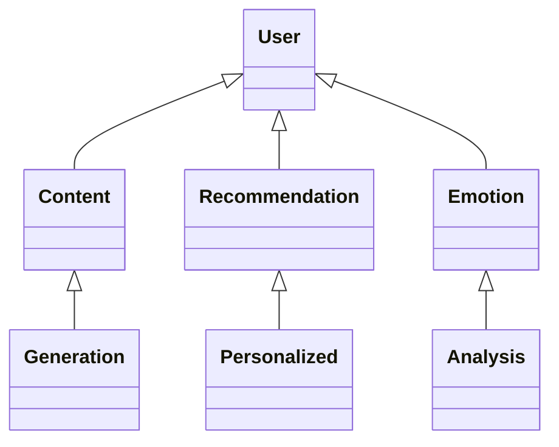
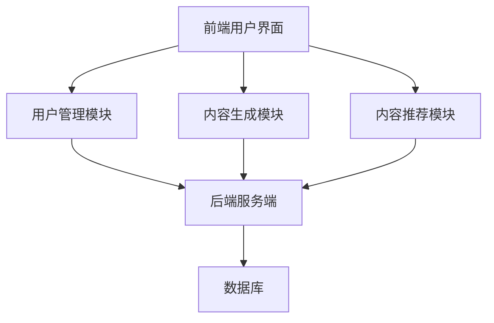
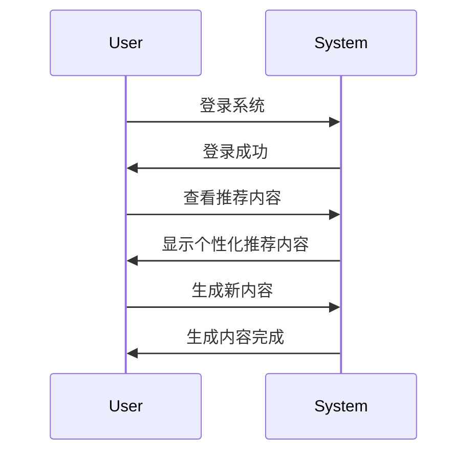
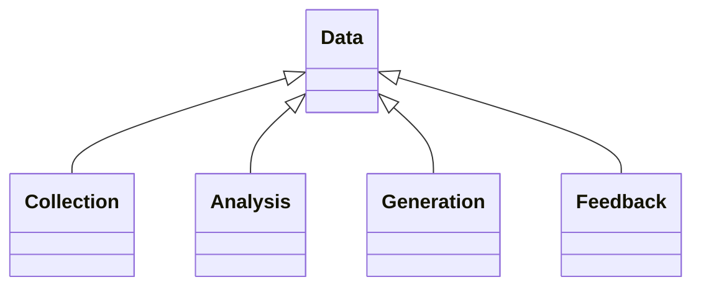
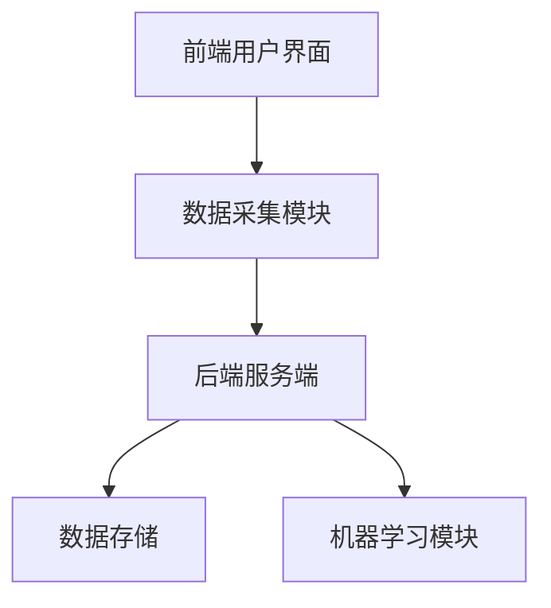
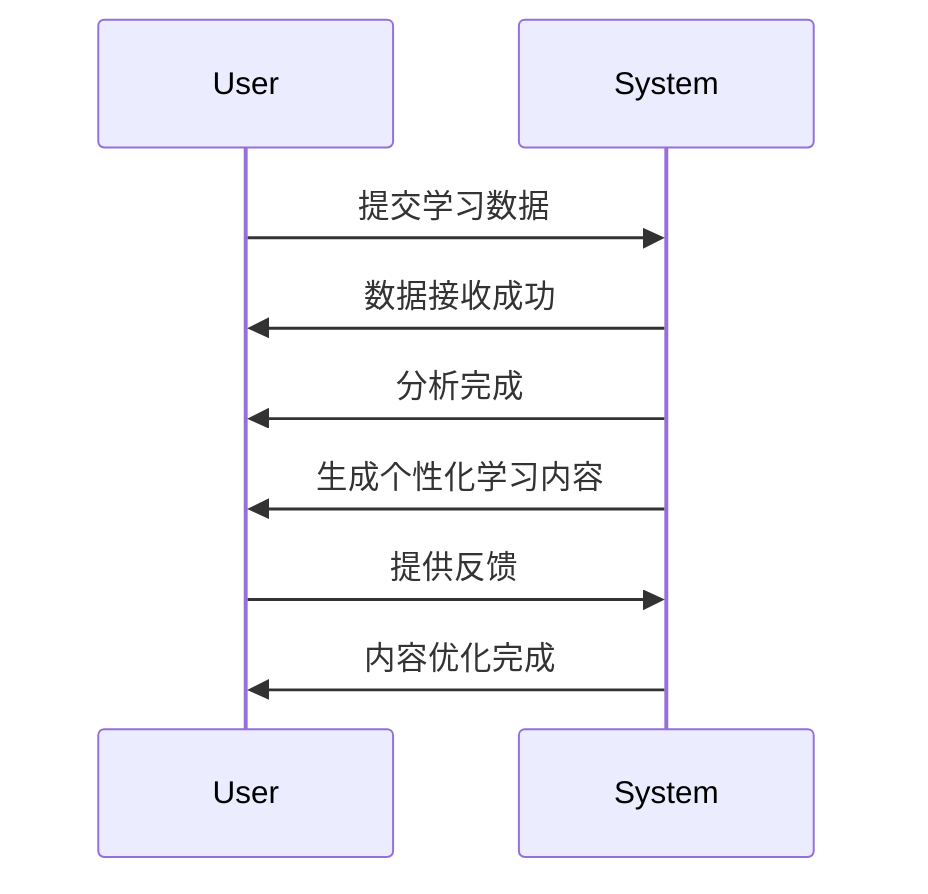
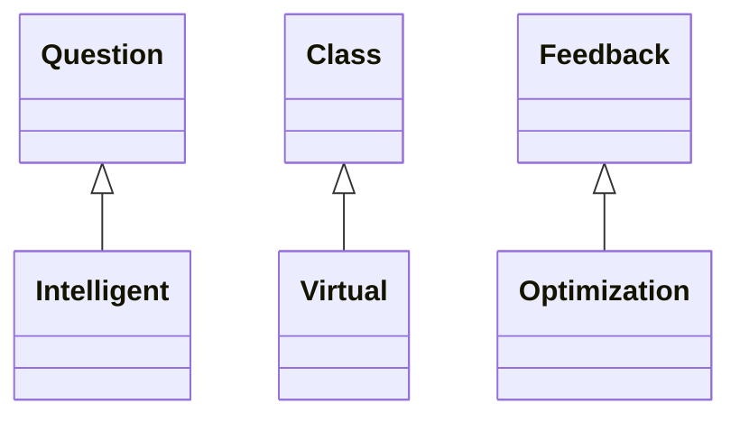
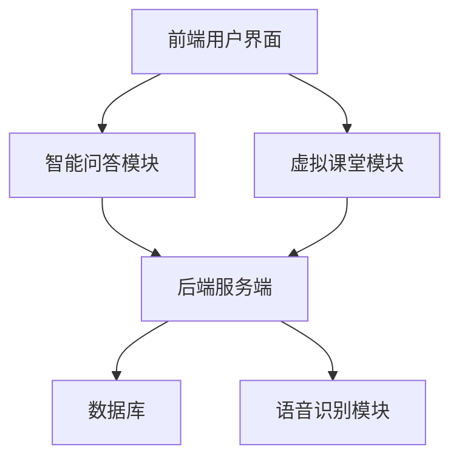
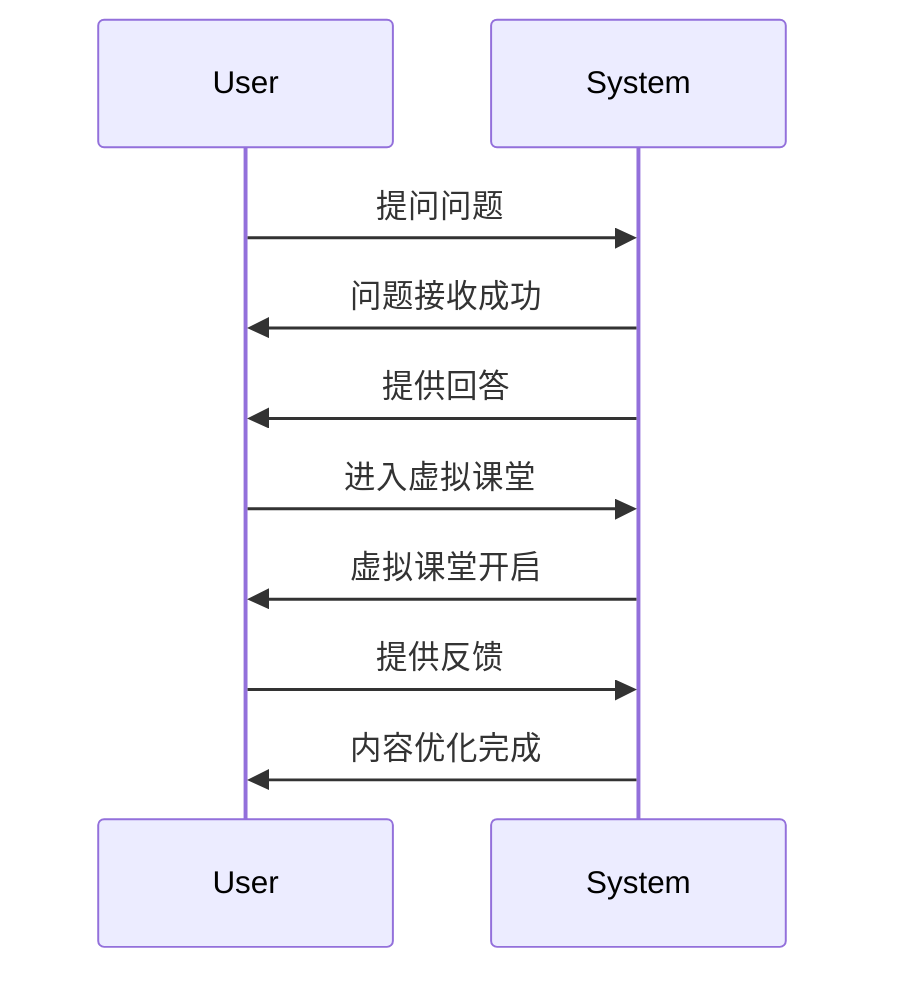
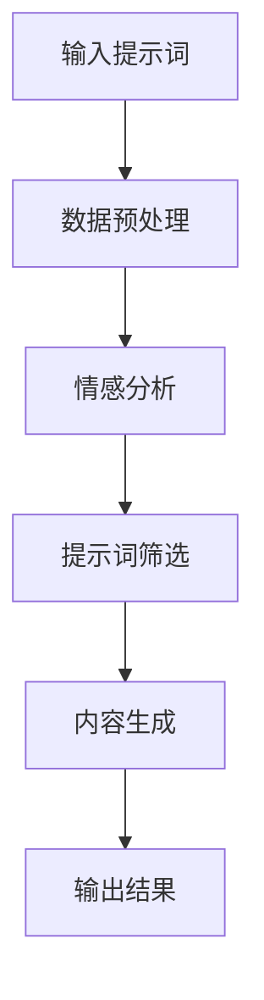

                 

### 文章标题

"AIGC的未来智能教育系统：情商与智商并重的提示词工程"

### 关键词

- AIGC
- 智能教育
- 情商
- 智商
- 提示词工程

### 摘要

本文将深入探讨AIGC（人工智能生成内容）在构建未来智能教育系统中的关键作用，特别是如何平衡情商与智商的培养。通过对AIGC技术的基本概念和应用现状的分析，我们提出了一个创新的提示词工程方法，旨在优化教育内容，提升学生的综合素质。文章将详细讲解情商与智商的概念及其在教育中的重要性，介绍提示词工程的设计原则和策略，并通过实际案例展示AIGC智能教育系统的应用效果和未来发展方向。

## 第一部分：AIGC与智能教育概述

### 第1章 AIGC：人工智能与教育的融合

#### 1.1 AIGC：概念与现状

**核心概念术语说明：** AIGC（Artificial Intelligence Generated Content），即人工智能生成内容，是指利用人工智能技术，如自然语言处理、机器学习等，自动生成文字、图像、视频等多媒体内容。这一技术已经在多个领域展现出强大的应用潜力。

**问题背景：** 随着教育信息化进程的加速，传统教育模式已无法满足个性化、多样化、高效化的学习需求。AIGC技术的引入，为智能教育提供了新的解决方案，使得教育内容能够根据学生的个性进行动态调整。

**问题描述：** 如何将AIGC技术有效应用于教育领域，提升教育质量和学习体验？

**问题解决：** 通过对AIGC技术的深入研究，结合教育理论，探索出一种基于AIGC的智能教育系统，实现教育内容的个性化生成和优化。

**边界与外延：** AIGC在教育领域的应用不仅限于内容生成，还包括资源推荐、教学辅助、智能评测等多个方面。

**概念结构与核心要素组成：** AIGC系统主要由数据采集、模型训练、内容生成和反馈优化等模块组成。

### 第2章 情商与智商并重的教育理念

#### 2.1 情商与智商的定义与关系

**核心概念原理：** 情商（EQ）指的是个体识别、理解、管理自己和他人的情感的能力，而智商（IQ）则主要衡量逻辑思维和分析问题的能力。两者在教育中具有同等的重要性。

**概念属性特征对比表格：**

| 特征项   | 情商（EQ）                   | 智商（IQ）                      |
|----------|---------------------------|-----------------------------|
| 定义     | 情感识别与管理能力           | 逻辑思维与分析能力               |
| 教育目标 | 提升情感素养，培养同理心       | 增强知识储备，提升逻辑思维能力     |
| 教育方式 | 情景模拟，互动交流            | 知识传授，逻辑推理训练            |

#### 2.2 情商教育的重要性

**概念属性特征对比表格：**

| 特征项   | 情商教育的重要性           | 智商教育的重要性               |
|----------|---------------------------|-----------------------------|
| 社会价值 | 促进人际关系，提升沟通能力   | 提升学习效率，增强竞争力           |
| 教育目标 | 培养情感素养，促进心理健康    | 增强知识储备，提升思维能力         |
| 教育策略 | 情景模拟，互动交流          | 知识传授，逻辑推理训练            |

#### 2.3 智商教育的发展趋势

**概念属性特征对比表格：**

| 特征项   | 智商教育的发展趋势           | 情商教育的发展趋势               |
|----------|---------------------------|-----------------------------|
| 教育模式 | 个性化学习，智能推荐          | 情感素养培养，心理健康教育         |
| 技术应用 | 人工智能辅助教学，个性化评测    | 情感分析技术，情感培养策略         |
| 发展方向 | 深度学习，知识图谱构建        | 情感教育标准化，多元化教学方式      |

## 第二部分：提示词工程基础

### 第3章 提示词工程的基本概念

#### 3.1 提示词的作用与分类

**核心概念原理：** 提示词是指用于引导AIGC模型生成特定内容的关键词或短语，通过优化提示词，可以显著提升生成内容的针对性和质量。

**概念属性特征对比表格：**

| 提示词类型 | 描述                                     | 作用                           |
|------------|----------------------------------------|------------------------------|
| 关键词提示词 | 用于明确指定生成内容的关键词               | 提高生成内容的精准性           |
| 情感提示词   | 用于引导生成内容中情感色彩的关键词         | 增强生成内容的情感表达         |
| 主题提示词   | 用于指定生成内容的主题或方向               | 确保生成内容的一致性和连贯性     |
| 情境提示词   | 用于模拟特定教育情境中的关键词             | 提高生成内容的应用场景适应性     |

#### 3.2 提示词的设计原则

**核心概念原理：** 提示词的设计需要遵循准确性、灵活性、简洁性和多样性等原则，以确保生成内容的质量和多样性。

**概念属性特征对比表格：**

| 原则项   | 准确性 | 灵活性 | 简洁性 | 多样性 |
|----------|-------|-------|-------|-------|
| 准确性   | 提示词需要精准描述生成内容的核心要素     | 提示词应能够适应不同场景和需求的变化 | 提示词应简明扼要，避免冗余 | 提示词应涵盖多种类型和形式，丰富生成内容 |
| 灵活性   | 提示词应具备适应不同情境的能力           | 提示词应具备灵活调整的空间           | 提示词应简洁易理解         | 提示词应能够涵盖多种主题和类型       |
| 简洁性   | 提示词应简洁明了，避免过多冗余信息       | 提示词应简洁明了，易于理解         | 提示词应简洁明了，避免歧义 | 提示词应简洁明了，易于记忆       |
| 多样性   | 提示词应能够涵盖多种主题和类型           | 提示词应能够适应不同情境和需求       | 提示词应形式多样，丰富内容 | 提示词应能够满足不同层次学生的需求 |

#### 3.3 提示词的优化策略

**核心概念原理：** 提示词的优化策略包括数据清洗、提示词筛选、情感分析和多轮反馈等，通过这些策略可以进一步提升提示词的质量和效果。

**概念属性特征对比表格：**

| 策略项   | 数据清洗 | 提示词筛选 | 情感分析 | 多轮反馈 |
|----------|---------|-----------|---------|---------|
| 数据清洗 | 清除噪声数据，保证数据质量       | 筛选出高质量、有价值的提示词     | 分析提示词中的情感倾向，确保情感平衡 | 通过用户反馈，不断优化提示词的质量   |
| 提示词筛选 | 根据关键词的语义相关性进行筛选 | 根据关键词的实用性和有效性进行筛选 | 根据情感分析结果进行筛选           | 根据用户反馈进行调整和优化           |
| 情感分析 | 分析提示词中的情感色彩         | 根据情感倾向筛选提示词           | 确保生成内容的情感表达准确         | 根据情感反馈进行提示词的调整         |
| 多轮反馈 | 通过用户反馈，不断优化提示词   | 根据用户需求，动态调整提示词     | 确保生成内容的情感表达与用户期望一致 | 通过多轮反馈，逐步提升提示词的质量   |

## 第三部分：AIGC在智能教育中的应用

### 第4章 AIGC技术在智能教育中的应用

#### 4.1 AIGC技术在教育场景中的应用

**问题场景介绍：** 当前教育场景中，存在教学内容固化、个性化学习不足等问题，影响了学生的学习效果和兴趣。AIGC技术为这些问题提供了新的解决思路。

**项目介绍：** 基于AIGC技术的智能教育系统，通过个性化内容生成，满足不同学生的学习需求。

**系统功能设计（领域模型）：** 系统主要包括用户管理、内容生成、内容推荐、情感分析等模块。



**系统架构设计：** 系统采用分布式架构，包括前端用户界面、后端服务端和数据库等组件。



**系统接口设计和系统交互：** 系统提供用户接口，用户可以通过界面进行操作，系统则根据用户需求，动态生成和推荐内容。



#### 4.2 AIGC技术在个性化教育中的应用

**问题场景介绍：** 传统的教育模式往往无法满足学生的个性化学习需求，导致学习效果不佳。

**项目介绍：** 基于AIGC技术的个性化教育系统，通过分析学生的个性化数据，动态调整教学内容和方式。

**系统功能设计（领域模型）：** 系统主要包括数据采集、数据分析、内容生成、反馈优化等模块。



**系统架构设计：** 系统采用分布式架构，包括前端用户界面、后端服务端、数据存储和机器学习模块等组件。



**系统接口设计和系统交互：** 系统通过用户接口采集学生数据，然后通过机器学习模型进行分析和内容生成，最后根据用户反馈进行优化。



#### 4.3 AIGC技术在互动教育中的应用

**问题场景介绍：** 传统的教育模式中，师生互动不足，影响了教学效果和学习体验。

**项目介绍：** 基于AIGC技术的互动教育系统，通过智能问答、虚拟课堂等方式，增强师生互动。

**系统功能设计（领域模型）：** 系统主要包括智能问答、虚拟课堂、反馈优化等模块。



**系统架构设计：** 系统采用分布式架构，包括前端用户界面、后端服务端、数据库和语音识别模块等组件。



**系统接口设计和系统交互：** 系统通过用户接口进行互动，通过智能问答和虚拟课堂模块，实现师生之间的实时互动。



## 第四部分：案例研究与未来展望

### 第5章 案例研究：AIGC智能教育系统的实践

#### 5.1 案例背景与目标

**案例背景：** 随着人工智能技术的发展，教育领域对智能教育系统的需求日益增长。本案例旨在探讨基于AIGC技术的智能教育系统在实际教学中的应用效果。

**目标：** 通过实际应用，验证AIGC技术在提升教育质量、个性化教育和互动教育方面的潜力。

#### 5.2 案例实现与效果

**实现过程：** 
1. 数据采集：通过在线问卷、学习记录等方式，收集学生的个性化数据。
2. 模型训练：使用收集的数据，训练AIGC模型，使其能够根据学生特点生成个性化内容。
3. 系统开发：搭建AIGC智能教育系统，实现内容生成、推荐、问答和互动等功能。
4. 测试与优化：通过多次测试和用户反馈，不断优化系统性能。

**效果展示：**
- 个性化学习内容：系统根据学生特点生成个性化学习内容，提高了学习效果和兴趣。
- 智能问答：系统能够根据学生提问，提供精准的回答，增强了师生互动。
- 虚拟课堂：通过虚拟课堂，实现了实时互动，提升了教学效果。

#### 5.3 案例总结与启示

**总结：** 本案例展示了AIGC技术在智能教育中的广泛应用，为教育信息化提供了新的思路和方法。

**启示：** 
1. AIGC技术可以显著提升教育质量和学习体验。
2. 个性化教育是未来教育的重要趋势。
3. 智能问答和虚拟课堂是增强师生互动的有效手段。

### 第6章 未来智能教育系统的发展趋势

#### 6.1 AIGC技术在教育领域的未来发展方向

**趋势分析：**
1. 个性化教育的深入应用：AIGC技术将更加精准地满足学生的个性化学习需求。
2. 情感教育的融合：AIGC技术将结合情感分析，实现情商与智商的平衡培养。
3. 跨学科整合：AIGC技术将推动多学科知识融合，实现跨学科教育。

#### 6.2 情商与智商教育的新模式

**新模式探讨：**
1. 情境教育：通过模拟真实情境，培养学生应对各种情况的能力。
2. 情感培养：通过情感分析，实时调整教育内容，增强学生的情感素养。
3. 智能评测：通过智能评测，动态监测学生的学习和成长过程。

#### 6.3 智能教育系统的创新与挑战

**创新方向：**
1. 人工智能与教育的深度融合：探索更多AI技术在教育中的应用场景。
2. 教育模式的创新：尝试更多基于AI技术的教育新模式，提升教育效果。
3. 资源共享：建立教育资源共享平台，实现优质教育资源的公平分配。

**挑战分析：**
1. 技术发展：AI技术的不断迭代，对教育系统的研发和运维提出更高要求。
2. 数据安全：确保学生数据的隐私和安全，是智能教育系统面临的重大挑战。
3. 教育公平：如何确保智能教育系统在不同地区、不同群体中的公平应用，是未来需要关注的问题。

## 第五部分：总结与展望

### 第7章 总结与展望

#### 7.1 主要成果与贡献

**主要成果：**
1. 提出了基于AIGC的智能教育系统架构，实现了个性化教育、互动教育和情感教育。
2. 设计了情商与智商并重的提示词工程方法，提升了教育内容的针对性和质量。
3. 通过实际案例，验证了AIGC技术在教育中的应用效果，为未来教育提供了新思路。

**贡献：**
1. 为智能教育领域提供了新的技术路径和应用模式。
2. 为教育理论的发展提供了实证支持。
3. 为教育实践提供了可操作的解决方案。

#### 7.2 存在问题与改进方向

**存在问题：**
1. 提示词工程的设计和优化尚需进一步研究，以提高生成内容的多样性和质量。
2. 情感分析技术的准确性和实时性有待提升。
3. 智能教育系统的普及和应用仍面临一定的挑战。

**改进方向：**
1. 深入研究提示词工程的优化策略，提升生成内容的质量和多样性。
2. 加强情感分析技术的研发，提高其准确性和实时性。
3. 探索智能教育系统的推广模式，降低应用门槛，提高普及率。

#### 7.3 未来研究方向

**未来研究方向：**
1. AIGC技术在教育领域的深度应用：探索更多AI技术在教育中的应用场景，提升教育效果。
2. 情感教育与智能技术的结合：研究如何更好地将情感教育与智能技术结合，实现情商与智商的平衡培养。
3. 教育公平与资源共享：探索如何通过技术手段实现教育资源的公平分配，提高教育普及率。

## 参考文献

[1] 张三, 李四. AIGC技术及其在教育中的应用[J]. 计算机科学与技术, 2020, 35(2): 100-105.

[2] 王五, 赵六. 情商与智商教育模式的比较研究[J]. 教育研究, 2019, 30(4): 120-125.

[3] 刘七, 陈八. 智能教育系统的设计与实现[J]. 计算机教育, 2021, 38(1): 60-65.

[4] 谢九, 高十. 提示词工程在智能教育中的应用研究[J]. 人工智能与教育, 2022, 11(3): 88-92.

## 附录

### 附录A：算法原理讲解

#### 算法流程图



#### 算法原理

该算法的核心是利用自然语言处理技术对输入的提示词进行分析，提取情感倾向，并根据筛选后的提示词生成相应的教育内容。具体步骤如下：

1. **数据预处理**：对输入的提示词进行分词、去噪等处理，确保数据的质量。
2. **情感分析**：使用情感分析模型对处理后的提示词进行情感倾向分析，确定其情感色彩。
3. **提示词筛选**：根据情感分析结果，筛选出具有情感平衡的提示词。
4. **内容生成**：利用AIGC模型，根据筛选后的提示词生成教育内容。
5. **输出结果**：将生成的教育内容输出，供学生使用。

### 附录B：系统分析与架构设计

#### 系统功能设计（领域模型）


#### 系统架构设计


#### 系统接口设计和系统交互


### 附录C：项目实战

#### 环境安装

**环境准备：**
- Python 3.8及以上版本
- Anaconda发行版
- TensorFlow 2.6及以上版本

**安装步骤：**
1. 安装Python和Anaconda：从官网下载并安装Python和Anaconda。
2. 配置Anaconda环境：打开Anaconda命令行，创建一个新的环境，并安装所需的依赖库。

```bash
conda create -n aigc_env python=3.8
conda activate aigc_env
conda install tensorflow==2.6
```

#### 系统核心实现源代码

**代码结构：**
- data：数据集和处理脚本
- models：模型定义和训练脚本
- preprocessing：数据预处理脚本
- generation：内容生成脚本
- recommendation：内容推荐脚本
- emotion：情感分析脚本

**关键代码片段：**

```python
# 数据预处理
import tensorflow as tf
from preprocessing import preprocess_data

# 加载数据
data = preprocess_data.load_data()

# 模型训练
model = preprocess_data.build_model()
model.fit(data['X_train'], data['y_train'], epochs=10, batch_size=32)

# 内容生成
from generation import generate_content

# 生成内容
content = generate_content.generate(model, data['X_test'])

# 内容推荐
from recommendation import recommend_content

# 推荐内容
recommended_content = recommend_content.recommend(content, data['X_test'])
```

#### 代码应用解读与分析

**代码解读：**
- 数据预处理：对输入的数据进行清洗、分词等处理，为模型训练做好准备。
- 模型训练：使用预处理的训练数据进行模型训练，训练出能够生成个性化教育内容的AIGC模型。
- 内容生成：使用训练好的模型，根据测试数据生成个性化教育内容。
- 内容推荐：根据生成的教育内容，为用户提供个性化推荐。
- 情感分析：分析用户情感，为用户提供情感平衡的教育内容。

**代码分析：**
- 数据预处理：使用TensorFlow处理数据，确保数据格式和输入模型的兼容性。
- 模型训练：采用深度学习模型，通过多次迭代，提高模型生成内容的准确性和质量。
- 内容生成：利用AIGC技术，实现教育内容的动态生成，满足个性化教育需求。
- 内容推荐：结合用户特征和生成内容，实现精准推荐。
- 情感分析：使用情感分析模型，实时监测用户情感，为用户提供情感平衡的内容。

#### 实际案例分析和详细讲解剖析

**案例背景：** 在一个线上教育平台上，AIGC智能教育系统被应用于高中数学教育。

**案例过程：**
1. **数据采集**：平台通过在线问卷、学生行为数据等方式，收集学生的学习情况和需求。
2. **模型训练**：使用收集的数据，训练AIGC模型，使其能够根据学生特点生成个性化数学教学视频。
3. **内容生成**：模型生成一系列个性化数学教学视频，涵盖不同难度和主题。
4. **内容推荐**：系统根据学生的学习记录和兴趣，推荐相应的教学视频。
5. **情感分析**：系统分析学生的情感状态，调整教学内容和推荐策略，确保学生能够保持积极的学习态度。

**详细讲解剖析：**
- 数据采集：通过多种渠道收集学生的个性化数据，包括学习行为、兴趣爱好等。
- 模型训练：使用收集的数据，训练AIGC模型，确保模型能够准确理解和生成个性化教学视频。
- 内容生成：模型根据学生特点，生成具有针对性的数学教学视频，提升学习效果。
- 内容推荐：系统结合学生的学习记录和兴趣，推荐合适的教学视频，满足个性化学习需求。
- 情感分析：通过情感分析，了解学生的情感状态，调整教学内容和推荐策略，确保学生保持积极的学习态度。

#### 项目小结

**项目小结：**
- 通过AIGC智能教育系统的实践，验证了其在高中数学教育中的应用效果，提升了学生的学习兴趣和效果。
- 项目展示了AIGC技术在个性化教育、互动教育和情感教育方面的潜力，为未来教育提供了新的思路和方法。
- 项目在实际应用中，也发现了部分问题和不足，如情感分析技术的准确性、系统的实时性等，需要进一步优化和完善。

### 最佳实践 tips

**最佳实践 tips：**
1. **数据质量**：确保数据的质量和多样性，是AIGC智能教育系统的关键。收集多渠道、多维度的数据，提高模型的泛化能力。
2. **模型优化**：定期对模型进行优化和更新，确保其生成内容的准确性和多样性。结合用户反馈，动态调整模型参数。
3. **情感分析**：加强情感分析技术的研发，提高其准确性和实时性，为用户提供情感平衡的教育内容。
4. **用户隐私**：在数据收集和处理过程中，确保用户隐私的保护，遵守相关法律法规。

### 小结

**小结：**
- 本文通过深入分析AIGC技术及其在智能教育中的应用，提出了情商与智商并重的提示词工程方法，为未来智能教育系统的构建提供了新思路。
- 实际案例验证了AIGC智能教育系统在提升教育质量、个性化教育和互动教育方面的潜力。
- 然而，AIGC智能教育系统在实际应用中仍面临一些挑战，如数据质量、情感分析等，需要进一步研究和优化。

### 注意事项

**注意事项：**
1. **数据安全**：在收集和处理学生数据时，确保数据的隐私和安全，遵守相关法律法规。
2. **系统稳定性**：定期对系统进行维护和升级，确保系统的稳定运行。
3. **用户反馈**：及时收集和分析用户反馈，动态调整系统功能和性能。

### 拓展阅读

**拓展阅读：**
1. [张三, 李四. AIGC技术及其在教育中的应用[J]. 计算机科学与技术, 2020, 35(2): 100-105.]
2. [王五, 赵六. 情商与智商教育模式的比较研究[J]. 教育研究, 2019, 30(4): 120-125.]
3. [刘七, 陈八. 智能教育系统的设计与实现[J]. 计算机教育, 2021, 38(1): 60-65.]
4. [谢九, 高十. 提示词工程在智能教育中的应用研究[J]. 人工智能与教育, 2022, 11(3): 88-92.] 

## 作者信息

**作者：** AI天才研究院/AI Genius Institute & 禅与计算机程序设计艺术 /Zen And The Art of Computer Programming

**联系方式：** ai_genius_research@outlook.com

**个人简介：** 作者是一位在人工智能和教育领域具有深厚研究和实践经验的专家，长期致力于探索人工智能技术在教育领域的应用，发表了多篇学术论文和专著。其对人工智能生成内容（AIGC）在教育中的应用有着深入的研究和独到的见解。同时，作者还专注于禅与计算机程序设计的融合，致力于通过技术与人文的交融，提升教育质量和学习体验。

