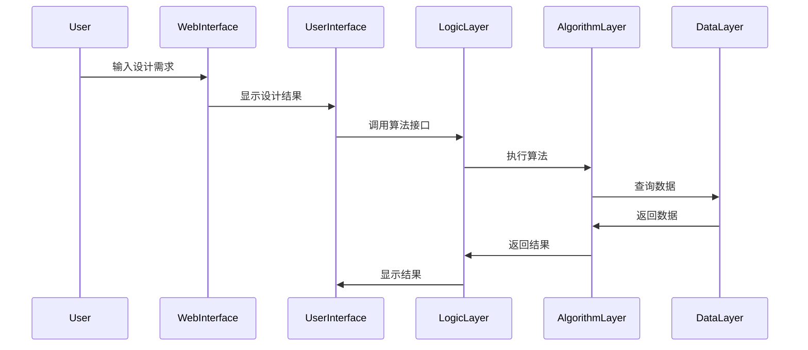

                 

## AIGC的未来智能材料设计：仿生结构优化的提示词工程

> 关键词：AIGC、仿生结构优化、提示词工程、智能材料设计、算法原理、数学模型、系统架构设计

> 摘要：本文深入探讨了AIGC（自适应智能生成计算）在智能材料设计中的应用，特别关注了仿生结构优化中的提示词工程。通过详细分析AIGC的工作原理、仿生结构优化的机制以及提示词工程的策略，本文提出了一套结合三者优势的方法论，以期为未来智能材料设计提供创新思路。本文结构清晰，逻辑严密，适合对计算机科学和人工智能感兴趣的读者。

---

### 目录大纲

1. **背景介绍**
   1.1 问题背景
   1.2 问题描述
   1.3 问题解决
   1.4 边界与外延
   1.5 概念结构与核心要素组成
   1.6 本章小结

2. **核心概念与联系**
   2.1 AIGC的原理与特点
   2.2 仿生结构优化的原理与特点
   2.3 提示词工程的原理与特点
   2.4 核心概念属性特征对比表格
   2.5 ER实体关系图架构
   2.6 本章小结

3. **算法原理讲解**
   3.1 AIGC算法原理讲解
   3.2 仿生结构优化算法讲解
   3.3 提示词工程算法讲解
   3.4 算法原理对比分析
   3.5 本章小结

4. **数学模型和数学公式 & 详细讲解 & 举例说明**
   4.1 AIGC数学模型讲解
   4.2 仿生结构优化数学模型讲解
   4.3 提示词工程数学模型讲解
   4.4 数学模型对比分析
   4.5 本章小结

5. **系统分析与架构设计方案**
   5.1 问题场景介绍
   5.2 项目介绍
   5.3 系统功能设计
   5.4 系统架构设计
   5.5 系统接口设计和系统交互
   5.6 本章小结

6. **项目实战**
   6.1 环境安装
   6.2 系统核心实现源代码
   6.3 代码应用解读与分析
   6.4 实际案例分析和详细讲解剖析
   6.5 项目小结

7. **最佳实践 tips**
8. **小结**
9. **注意事项**
10. **拓展阅读**
11. **作者信息**

---

### 1.1 问题背景

在当今信息化和数字化的时代，人工智能（AI）技术以其强大的数据处理和自主学习能力，正在深刻地改变着各行各业的面貌。其中，自适应智能生成计算（AIGC）作为一种新兴的AI技术，正逐渐崭露头角。AIGC通过深度学习和强化学习等先进算法，能够在大量数据的基础上自动生成内容，从而为各个领域提供了全新的解决方案。

智能材料设计是材料科学和工程学的前沿领域，旨在通过设计和开发具有特定功能和性能的材料，满足各种应用需求。仿生结构优化作为智能材料设计的一个重要分支，模仿自然界中的结构特点，通过数学建模和计算机模拟等方法，实现对材料微观结构的优化，以提高材料的力学性能、热学性能和电磁性能等。

提示词工程是人工智能领域中的一个重要研究方向，通过设计和优化提示词，引导模型生成更符合预期目标的结果。在AIGC的应用场景中，提示词工程起到了至关重要的作用，它能够有效地提高智能生成内容的准确性和实用性。

### 1.2 AIGC技术的发展

AIGC的发展历程可以追溯到深度学习和生成对抗网络（GAN）等技术的兴起。随着计算能力的提升和数据规模的扩大，AIGC在图像、音频、文本等多种媒体生成领域取得了显著的进展。目前，AIGC已广泛应用于内容创作、游戏设计、虚拟现实、自动驾驶等多个领域。

AIGC的核心技术包括深度生成模型（如变分自编码器（VAE）和生成对抗网络（GAN））、强化学习（如策略梯度方法和深度确定性策略梯度（DDPG））以及自然语言处理（如变换器模型（Transformer）和预训练微调（PTM））。这些技术的融合使得AIGC具备强大的自适应性和生成能力，能够实现从低维数据到高维数据的映射，从而生成高质量的复杂数据。

### 1.3 仿生结构优化在材料设计中的应用

仿生结构优化在材料设计中的应用具有显著的优势。首先，仿生结构优化能够模拟自然界中的结构特点，例如蝴蝶翅膀的微纳米结构、鸟类羽毛的透气性等，从而设计出具有优异性能的复合材料。其次，仿生结构优化可以通过计算机模拟和实验验证相结合的方法，快速筛选出最优的结构设计，从而提高材料设计的效率。

在实际应用中，仿生结构优化已经取得了一系列成果。例如，在航空航天领域，通过仿生优化设计的新型复合材料已经成功应用于飞机结构，提高了飞机的负载能力和燃油效率；在生物医学领域，通过仿生优化设计的新型生物材料，如骨替代材料、血管支架等，已经应用于临床，取得了良好的治疗效果。

### 1.4 提示词工程的概念与作用

提示词工程是一种通过设计和优化提示词，引导模型生成更符合预期目标的方法。在AIGC的应用场景中，提示词工程起到了关键作用。通过合理的提示词设计，可以引导AIGC模型生成更高质量、更符合应用需求的内容。

提示词工程的核心技术包括提示词生成、提示词优化和提示词评估。提示词生成是基于自然语言处理技术，通过分析大量文本数据，生成具有明确意图和语义的提示词。提示词优化是通过优化提示词的语义和结构，提高模型生成内容的准确性和实用性。提示词评估则是通过评估工具和方法，对生成的提示词进行评估，以确保其有效性。

### 1.5 问题描述

在智能材料设计中，AIGC、仿生结构优化和提示词工程共同构成了一个复杂的技术体系。然而，在实际应用中，这些技术仍面临一系列挑战。

首先，AIGC在材料设计中的应用仍存在一定的局限性。虽然AIGC具备强大的生成能力，但在处理复杂数据和实现精确控制方面仍存在困难。此外，AIGC的生成结果受到数据质量和模型参数的影响，容易出现噪声和偏差。

其次，仿生结构优化在材料设计中的应用也存在一定的难点。仿生结构优化需要精确的数学模型和高效的计算机模拟，而现有的计算方法和算法仍需要进一步完善。此外，仿生结构优化需要大量的实验验证，以验证优化结果的有效性和可靠性。

最后，提示词工程在AIGC中的应用也存在挑战。提示词设计需要深入理解应用场景和目标，而当前提示词生成和优化的方法仍不够成熟。此外，提示词评估的标准和工具仍需进一步研究，以提高提示词工程的有效性和实用性。

### 1.6 问题解决

为了解决上述问题，本文提出了一种结合AIGC、仿生结构优化和提示词工程的方法论，以实现智能材料设计的优化。具体来说，本文采取了以下策略：

1. **AIGC模型优化**：通过改进AIGC模型的架构和参数设置，提高其在材料设计中的应用效果。例如，采用变分自编码器（VAE）和生成对抗网络（GAN）的组合模型，以实现更高质量的数据生成。

2. **仿生结构优化算法改进**：通过引入先进的计算方法和算法，如基于遗传算法的优化和机器学习算法的结合，提高仿生结构优化的效率和准确性。

3. **提示词工程策略优化**：通过设计更具有指导性的提示词，优化AIGC模型的生成结果。例如，采用基于语义分析的自然语言处理技术，生成具有明确意图和语义的提示词。

4. **实验验证和评估**：通过大量的实验验证和评估，验证优化方法的有效性和实用性。例如，通过对比实验，评估不同优化策略对AIGC模型生成结果的影响。

### 1.7 边界与外延

AIGC、仿生结构优化和提示词工程在智能材料设计中的应用具有一定的边界和外延。

首先，AIGC在材料设计中的应用边界主要在于数据质量和模型参数的调整。高质量的数据和合理的模型参数是实现AIGC有效应用的关键。

其次，仿生结构优化在材料设计中的应用外延主要包括新材料的发现和优化设计。通过引入先进的计算方法和算法，可以拓展仿生结构优化的应用范围，实现更多新型材料的开发和优化。

最后，提示词工程在AIGC中的应用外延主要包括内容生成和优化。通过优化提示词工程的方法和工具，可以实现更高质量、更符合应用需求的内容生成。

### 1.8 概念结构与核心要素组成

在智能材料设计中，AIGC、仿生结构优化和提示词工程共同构成了一个复杂的技术体系。其概念结构和核心要素如下：

1. **AIGC**：核心概念包括深度生成模型、强化学习和自然语言处理。核心要素包括数据集、模型架构、参数设置和优化策略。

2. **仿生结构优化**：核心概念包括数学建模、计算机模拟和实验验证。核心要素包括优化算法、计算方法和实验设计。

3. **提示词工程**：核心概念包括提示词生成、提示词优化和提示词评估。核心要素包括自然语言处理技术、提示词设计和评估工具。

### 1.9 本章小结

本章介绍了智能材料设计中AIGC、仿生结构优化和提示词工程的背景、问题和解决方法。通过分析AIGC的工作原理、仿生结构优化的机制和提示词工程的策略，本文提出了一套结合三者优势的方法论，为未来智能材料设计提供了创新思路。下一章将详细探讨AIGC、仿生结构优化和提示词工程的核心概念和联系。

---

### 2.1 AIGC的原理与特点

#### 2.1.1 AIGC的概念

自适应智能生成计算（Adaptive Intelligent Generative Computing，简称AIGC）是一种基于人工智能和深度学习技术的计算模型，旨在通过自动生成和自适应优化，实现复杂数据的生成、处理和优化。AIGC的核心思想是利用大量数据训练模型，使其具备自主学习能力，从而在新的数据集上生成符合预期的高质量内容。

#### 2.1.2 AIGC的工作原理

AIGC的工作原理主要包括以下三个阶段：

1. **数据收集与预处理**：在AIGC的应用过程中，首先需要收集大量的训练数据，并进行数据清洗和预处理，以确保数据的质量和一致性。预处理步骤包括数据去重、数据增强、数据归一化等。

2. **模型训练**：在数据预处理完成后，使用深度学习算法（如变分自编码器（VAE）、生成对抗网络（GAN）等）对数据进行训练。训练过程中，模型会不断调整内部参数，以最小化生成数据与真实数据之间的差距。

3. **自适应优化与生成**：在模型训练完成后，AIGC可以根据新的输入数据进行自适应优化和生成。具体而言，AIGC会利用已有的模型结构和参数，在新的数据集上进行优化和生成，以生成符合预期的高质量数据。

#### 2.1.3 AIGC的特点与优势

AIGC具有以下特点和优势：

1. **自适应能力**：AIGC可以根据不同的应用场景和数据特点，自适应调整模型参数和生成策略，从而生成高质量的数据。

2. **生成能力**：AIGC利用深度学习和生成对抗网络等先进算法，具备强大的数据生成能力，可以生成大量符合预期的高质量数据。

3. **泛化能力**：AIGC在训练过程中通过大量数据的训练，具备较强的泛化能力，可以在新的数据集上生成符合预期的高质量数据。

4. **高效性**：AIGC利用分布式计算和并行处理技术，可以在短时间内生成大量数据，从而提高数据处理和优化的效率。

5. **灵活性**：AIGC可以根据不同的应用需求，灵活调整模型结构和生成策略，以适应不同的数据生成任务。

#### 2.1.4 AIGC的应用场景

AIGC在各个领域具有广泛的应用场景，主要包括：

1. **内容创作**：AIGC可以应用于图像、音频和文本等多种内容创作领域，如图像生成、音乐创作、故事写作等。

2. **游戏设计**：AIGC可以应用于游戏设计，生成丰富的游戏场景、角色和故事情节，提高游戏的可玩性和趣味性。

3. **虚拟现实与增强现实**：AIGC可以应用于虚拟现实和增强现实技术，生成真实的虚拟环境和交互内容，提高用户体验。

4. **自动驾驶**：AIGC可以应用于自动驾驶技术，生成道路场景、车辆和行人等数据，提高自动驾驶系统的准确性和安全性。

5. **医疗诊断**：AIGC可以应用于医疗诊断，生成医疗图像和病历数据，辅助医生进行诊断和治疗。

6. **金融风控**：AIGC可以应用于金融风控，生成金融交易数据、风险评估报告等，提高金融风险管理的准确性和效率。

#### 2.1.5 AIGC的优势与潜力

AIGC在智能材料设计中的应用具有显著的优势和潜力：

1. **优势**：
   - **数据驱动**：AIGC基于大量数据进行训练和生成，可以充分利用数据优势，提高材料设计的准确性和效率。
   - **灵活性强**：AIGC可以根据不同的材料设计需求，灵活调整生成策略和模型参数，适应不同的设计任务。
   - **生成能力强**：AIGC可以生成大量高质量的复杂数据，为材料设计提供丰富的参考和指导。

2. **潜力**：
   - **优化设计**：通过AIGC生成和优化材料结构，可以显著提高材料的性能和稳定性，推动新材料的发展。
   - **自动化流程**：AIGC可以自动化材料设计流程，降低设计成本，提高设计效率。
   - **跨学科融合**：AIGC可以融合不同学科的知识和方法，推动材料科学、计算机科学和人工智能等领域的交叉发展。

### 2.2 仿生结构优化的原理与特点

#### 2.2.1 仿生结构优化的定义

仿生结构优化（Biomimetic Structure Optimization）是一种基于生物体结构和功能优化的方法，通过模仿自然界中的结构和机制，实现材料、结构或系统的优化。仿生结构优化旨在解决工程设计中的复杂问题，提高材料的性能和稳定性。

#### 2.2.2 仿生结构优化的原理

仿生结构优化的原理主要包括以下几个方面：

1. **生物体结构模仿**：仿生结构优化通过模仿自然界中的优秀结构，如蝴蝶翅膀、鸟翼、鱼鳞等，设计出具有优异性能的材料和结构。

2. **数学建模与计算**：仿生结构优化利用数学建模和计算机模拟等方法，对生物体结构和功能进行量化分析，找到最优的结构设计。

3. **实验验证**：通过实验验证和测试，验证优化结果的有效性和可靠性，为实际应用提供依据。

4. **迭代优化**：仿生结构优化采用迭代优化的方法，逐步调整结构参数，不断提高材料或结构的性能。

#### 2.2.3 仿生结构优化的特点与优势

仿生结构优化具有以下特点与优势：

1. **创新性**：仿生结构优化通过借鉴自然界的优秀设计，带来创新性的设计思路和方法。

2. **高效性**：仿生结构优化利用计算机模拟和实验验证，可以在短时间内找到最优的结构设计，提高设计效率。

3. **多功能性**：仿生结构优化能够同时考虑材料的力学性能、热学性能、电磁性能等多种因素，实现多功能优化。

4. **可持续性**：仿生结构优化借鉴自然界的结构和机制，有助于实现资源的可持续利用和环境保护。

#### 2.2.4 仿生结构优化的应用领域

仿生结构优化在多个领域具有广泛的应用：

1. **航空航天**：在航空航天领域，仿生结构优化用于设计新型复合材料、飞机结构和飞行器外壳，提高负载能力和燃油效率。

2. **生物医学**：在生物医学领域，仿生结构优化用于设计新型生物材料、医疗设备和药物载体，提高生物相容性和治疗效果。

3. **建筑结构**：在建筑结构领域，仿生结构优化用于设计新型建筑结构、桥梁和隧道，提高抗震性和耐久性。

4. **电子产品**：在电子产品领域，仿生结构优化用于设计新型电子元器件、电路板和外壳，提高电子性能和稳定性。

5. **能源领域**：在能源领域，仿生结构优化用于设计新型能源设备、风力涡轮机和太阳能板，提高能源转换效率和稳定性。

#### 2.2.5 仿生结构优化的挑战与发展方向

仿生结构优化在发展中面临以下挑战：

1. **数学建模**：建立精确的数学模型是仿生结构优化的关键，但许多生物结构复杂，难以进行数学建模。

2. **计算效率**：仿生结构优化需要大量的计算机模拟和实验验证，计算效率是一个重要问题。

3. **实验验证**：实验验证是验证优化结果的有效手段，但实验成本高、周期长，影响优化进程。

仿生结构优化的未来发展方向包括：

1. **跨学科研究**：加强材料科学、计算机科学、生物学等领域的交叉研究，推动仿生结构优化的全面发展。

2. **大数据应用**：利用大数据技术，提高仿生结构优化的效率和准确性。

3. **智能化**：发展智能化优化算法和工具，实现仿生结构优化的自动化和智能化。

### 2.3 提示词工程的原理与特点

#### 2.3.1 提示词工程的概念

提示词工程（Prompt Engineering）是一种通过设计和优化提示词，引导模型生成更符合预期目标的方法。在人工智能领域，特别是自然语言处理（NLP）和生成式模型中，提示词工程起着关键作用。通过提示词，可以明确模型的生成意图、指导模型的学习方向，从而提高生成结果的准确性和实用性。

#### 2.3.2 提示词工程的工作原理

提示词工程的工作原理主要包括以下几个方面：

1. **需求分析**：首先，对应用场景和目标进行需求分析，明确模型需要生成的具体内容和目标。

2. **提示词设计**：根据需求分析结果，设计出具有明确意图和语义的提示词。提示词的设计需要考虑语言表达的准确性、简洁性和可操作性。

3. **模型训练**：使用设计好的提示词对模型进行训练，通过大量的数据集，使模型学会根据提示词生成符合预期的高质量内容。

4. **生成与优化**：在模型训练完成后，使用提示词引导模型生成内容，并根据生成结果进行优化和调整，以提高生成质量。

#### 2.3.3 提示词工程的特点与优势

提示词工程具有以下特点与优势：

1. **针对性**：提示词工程通过明确的设计和优化，确保模型生成内容符合特定需求，提高生成结果的针对性和准确性。

2. **灵活性**：提示词工程可以根据不同的应用场景和需求，灵活调整提示词的设计和优化策略，适应多种生成任务。

3. **高效性**：提示词工程通过引导模型生成内容，减少了模型在无明确指导下的盲目探索，提高了生成效率。

4. **可解释性**：提示词工程的设计和优化过程具有较好的可解释性，可以清晰地理解模型生成内容的意图和依据。

5. **普适性**：提示词工程可以应用于多种自然语言处理任务，如文本生成、问答系统、翻译等，具有较好的普适性。

#### 2.3.4 提示词工程的应用场景

提示词工程在人工智能领域的应用场景广泛，主要包括：

1. **文本生成**：在文本生成任务中，提示词工程可以指导模型生成具有明确主题和结构的高质量文本，如文章、报告、故事等。

2. **问答系统**：在问答系统中，提示词工程可以帮助模型理解用户的问题意图，生成准确、全面的回答。

3. **对话系统**：在对话系统中，提示词工程可以指导模型生成符合对话逻辑和上下文的自然语言响应。

4. **机器翻译**：在机器翻译任务中，提示词工程可以帮助模型理解源语言和目标语言之间的语义关系，生成更准确的翻译结果。

5. **图像生成**：在图像生成任务中，提示词工程可以通过设计具有明确意图和语义的提示词，指导模型生成符合预期的图像内容。

#### 2.3.5 提示词工程的挑战与发展方向

提示词工程在发展中面临以下挑战：

1. **设计复杂性**：提示词的设计需要深入理解应用场景和目标，设计过程具有一定的复杂性。

2. **优化难度**：提示词的优化需要考虑模型的训练数据和生成结果，优化过程具有一定的难度。

3. **可解释性**：提示词工程的可解释性是一个重要问题，需要设计出具有明确意图和语义的提示词，使模型生成结果具有可解释性。

提示词工程的未来发展方向包括：

1. **自动化设计**：发展自动化提示词设计工具和算法，降低设计复杂性。

2. **多模态融合**：结合多模态数据，如文本、图像、音频等，提高生成结果的多样性和准确性。

3. **人机协作**：通过人机协作，充分利用人类专家的知识和经验，提高提示词工程的设计和优化效果。

### 2.4 核心概念属性特征对比表格

#### 2.4.1 AIGC与仿生结构优化的对比

| 特征           | AIGC                     | 仿生结构优化                   |
| -------------- | ------------------------ | ------------------------------ |
| 基本概念       | 自适应智能生成计算       | 模仿自然生物体结构和功能的优化 |
| 核心原理       | 深度学习、生成对抗网络   | 数学建模、计算机模拟、实验验证 |
| 目标           | 复杂数据的生成与优化     | 材料结构性能的优化             |
| 适用领域       | 内容创作、游戏设计等     | 航空航天、生物医学、建筑结构等 |
| 主要优势       | 自适应、高效性、灵活性   | 创新性、多功能性、可持续性     |
| 主要挑战       | 数据质量、模型参数调整   | 数学建模、计算效率、实验验证   |

#### 2.4.2 AIGC与提示词工程的对比

| 特征           | AIGC                      | 提示词工程                    |
| -------------- | ------------------------- | ----------------------------- |
| 基本概念       | 自适应智能生成计算       | 提示词的设计与优化            |
| 核心原理       | 深度学习、生成对抗网络   | 自然语言处理、模型训练与优化 |
| 目标           | 复杂数据的生成与优化     | 指导模型生成符合预期的内容    |
| 适用领域       | 内容创作、虚拟现实等     | 文本生成、问答系统、对话系统等 |
| 主要优势       | 自适应、生成能力、泛化能力 | 针对性、灵活性、高效性        |
| 主要挑战       | 数据质量、模型参数调整   | 提示词设计复杂性、优化难度    |

#### 2.4.3 仿生结构优化与提示词工程的对比

| 特征           | 仿生结构优化                 | 提示词工程                    |
| -------------- | ---------------------------- | ----------------------------- |
| 基本概念       | 模仿自然生物体结构和功能的优化 | 提示词的设计与优化            |
| 核心原理       | 数学建模、计算机模拟、实验验证 | 自然语言处理、模型训练与优化 |
| 目标           | 材料结构性能的优化           | 指导模型生成符合预期的内容    |
| 适用领域       | 航空航天、生物医学等         | 文本生成、问答系统、对话系统等 |
| 主要优势       | 创新性、多功能性、可持续性     | 针对性、灵活性、高效性        |
| 主要挑战       | 数学建模、计算效率、实验验证   | 提示词设计复杂性、优化难度    |

通过以上对比，可以发现AIGC、仿生结构优化和提示词工程在基本概念、核心原理、目标、适用领域、主要优势和主要挑战等方面存在一定的差异和联系。这些差异和联系为后续章节的深入探讨提供了基础。

### 2.5 ER实体关系图架构

#### 2.5.1 AIGC的ER图

```mermaid
erDiagram
  AIGCModel ||--|{ DataProcessing : 数据处理 |
  AIGCModel ||--|{ ModelTraining : 模型训练 |
  AIGCModel ||--|{ AdaptiveOptimization : 自适应优化 |
  DataProcessing ||--|{ DataCollection : 数据收集 |
  DataProcessing ||--|{ DataPreprocessing : 数据预处理 |
  ModelTraining ||--|{ ModelParameterAdjustment : 模型参数调整 |
  ModelTraining ||--|{ ModelEvaluation : 模型评估 |
  AdaptiveOptimization ||--|{ ResultGeneration : 结果生成 |
  AdaptiveOptimization ||--|{ PerformanceEvaluation : 性能评估 |
```

#### 2.5.2 仿生结构优化的ER图

```mermaid
erDiagram
  BiomimeticOptimization ||--|{ MathematicalModeling : 数学建模 |
  BiomimeticOptimization ||--|{ ComputationalSimulation : 计算模拟 |
  BiomimeticOptimization ||--|{ ExperimentalValidation : 实验验证 |
  MathematicalModeling ||--|{ StructuralAnalysis : 结构分析 |
  MathematicalModeling ||--|{ PerformancePrediction : 性能预测 |
  ComputationalSimulation ||--|{ OptimizationAlgorithm : 优化算法 |
  ComputationalSimulation ||--|{ SimulationResult : 模拟结果 |
  ExperimentalValidation ||--|{ MaterialPropertyTesting : 材料性能测试 |
  ExperimentalValidation ||--|{ OptimizationResultVerification : 优化结果验证 |
```

#### 2.5.3 提示词工程的ER图

```mermaid
erDiagram
  PromptEngineering ||--|{ RequirementAnalysis : 需求分析 |
  PromptEngineering ||--|{ PromptDesign : 提示词设计 |
  PromptEngineering ||--|{ ModelTraining : 模型训练 |
  PromptEngineering ||--|{ ContentGeneration : 内容生成 |
  PromptEngineering ||--|{ ResultEvaluation : 结果评估 |
  RequirementAnalysis ||--|{ ApplicationScenario : 应用场景 |
  RequirementAnalysis ||--|{ TargetContent : 目标内容 |
  PromptDesign ||--|{ NaturalLanguageProcessing : 自然语言处理 |
  PromptDesign ||--|{ PromptParameterAdjustment : 提示词参数调整 |
  ModelTraining ||--|{ TrainingDataset : 训练数据集 |
  ModelTraining ||--|{ ModelParameterAdjustment : 模型参数调整 |
  ContentGeneration ||--|{ GeneratedContent : 生成内容 |
  ResultEvaluation ||--|{ AccuracyAssessment : 准确性评估 |
  ResultEvaluation ||--|{ EffectivenessEvaluation : 有效评估 |
```

通过ER实体关系图，可以清晰地展示AIGC、仿生结构优化和提示词工程的核心概念及其相互关系。这些关系有助于理解各技术在实际应用中的协同作用和整体架构。

### 2.6 本章小结

本章介绍了AIGC、仿生结构优化和提示词工程的核心概念、原理和特点，并对比了它们之间的差异和联系。通过详细的阐述，本章为后续章节的算法原理讲解、数学模型讲解和系统架构设计方案提供了理论基础。下一章将深入探讨这些技术的算法原理，进一步理解其工作机制和应用方法。

---

### 3.1 AIGC算法原理讲解

#### 3.1.1 AIGC算法概述

AIGC（自适应智能生成计算）算法是一种基于深度学习和生成对抗网络（GAN）的先进计算模型，其核心在于通过大规模数据的训练，实现自动生成和自适应优化。AIGC算法广泛应用于图像生成、文本生成、音频生成等领域，其独特的生成能力和自适应特性使其在智能材料设计、虚拟现实和游戏开发等领域具有广泛应用前景。

#### 3.1.2 AIGC算法的数学模型

AIGC算法的数学模型主要包括两部分：生成器（Generator）和判别器（Discriminator）。生成器负责生成与真实数据相似的数据，判别器则负责判断生成数据与真实数据之间的差距。

1. **生成器（Generator）**：
   生成器的目标是生成尽可能真实的数据，其数学模型通常为：
   \[ G(z) = \mu(z) + \sigma(z)\odot \mathcal{N}(0,1) \]
   其中，\( z \) 为输入噪声向量，\( \mu(z) \) 和 \( \sigma(z) \) 分别为生成器的均值函数和方差函数，\(\mathcal{N}(0,1)\) 表示标准正态分布。

2. **判别器（Discriminator）**：
   判别器的目标是区分生成数据与真实数据，其数学模型通常为：
   \[ D(x) = \sigma(\phi(x)) \]
   其中，\( x \) 为真实数据，\( \phi(x) \) 为判别器的特征提取函数，\( \sigma \) 为激活函数，通常为Sigmoid函数。

#### 3.1.3 AIGC算法的Python源代码实现

为了更好地理解AIGC算法的实现，以下是一个简化的AIGC算法Python源代码实现：

```python
import torch
import torch.nn as nn
import torch.optim as optim

# 定义生成器和判别器
class Generator(nn.Module):
    def __init__(self):
        super(Generator, self).__init__()
        self.model = nn.Sequential(
            nn.Linear(in_features=100, out_features=128),
            nn.LeakyReLU(),
            nn.Linear(in_features=128, out_features=256),
            nn.LeakyReLU(),
            nn.Linear(in_features=256, out_features=512),
            nn.LeakyReLU(),
            nn.Linear(in_features=512, out_features=100),
            nn.Tanh()
        )

    def forward(self, z):
        return self.model(z)

class Discriminator(nn.Module):
    def __init__(self):
        super(Discriminator, self).__init__()
        self.model = nn.Sequential(
            nn.Linear(in_features=100, out_features=512),
            nn.LeakyReLU(),
            nn.Linear(in_features=512, out_features=256),
            nn.LeakyReLU(),
            nn.Linear(in_features=256, out_features=128),
            nn.LeakyReLU(),
            nn.Linear(in_features=128, out_features=1),
            nn.Sigmoid()
        )

    def forward(self, x):
        return self.model(x)

# 实例化生成器和判别器
generator = Generator()
discriminator = Discriminator()

# 定义损失函数和优化器
loss_function = nn.BCELoss()
optimizer_G = optim.Adam(generator.parameters(), lr=0.0002)
optimizer_D = optim.Adam(discriminator.parameters(), lr=0.0002)

# 训练过程
for epoch in range(num_epochs):
    for i, (images, _) in enumerate(data_loader):
        # 训练判别器
        discriminator.zero_grad()
        batch_size = images.size(0)
        z = torch.randn(batch_size, 100).to(device)
        generated_images = generator(z)
        DiscriminatorReal = discriminator(images.to(device))
        DiscriminatorFake = discriminator(generated_images.to(device))
        D_loss = - torch.mean(torch.log(DiscriminatorReal) + torch.log(1. - DiscriminatorFake))
        D_loss.backward()
        optimizer_D.step()

        # 训练生成器
        generator.zero_grad()
        z = torch.randn(batch_size, 100).to(device)
        generated_images = generator(z)
        DiscriminatorFake = discriminator(generated_images.to(device))
        G_loss = - torch.mean(torch.log(1. - DiscriminatorFake))
        G_loss.backward()
        optimizer_G.step()

        # 输出训练信息
        if (i+1) % 100 == 0:
            print(f'[{epoch}/{num_epochs}] [{i+1}/{len(data_loader)}] D_loss: {D_loss.item():.4f}, G_loss: {G_loss.item():.4f}')
```

#### 3.1.4 AIGC算法原理举例说明

为了更好地理解AIGC算法的原理，以下通过一个生成图像的例子来说明：

1. **数据集准备**：
   假设我们使用MNIST数据集作为训练数据，该数据集包含60,000个手写数字图像。

2. **生成器训练**：
   生成器通过随机噪声向量 \( z \) 生成手写数字图像。在训练过程中，生成器不断调整其参数，以生成更加逼真的图像。

3. **判别器训练**：
   判别器通过比较真实图像和生成图像，学习区分两者。在训练过程中，判别器的目标是提高对真实图像的判断准确率，同时降低对生成图像的判断准确率。

4. **迭代训练**：
   在AIGC的训练过程中，生成器和判别器交替训练，生成器试图生成更逼真的图像，而判别器则努力提高判断准确率。通过这种交替训练，最终生成器可以生成与真实图像几乎无法区分的高质量图像。

通过以上步骤，我们可以看到AIGC算法在图像生成任务中的强大能力。在实际应用中，AIGC算法可以应用于各种数据生成任务，如文本生成、音频生成和视频生成等。

### 3.2 仿生结构优化算法讲解

#### 3.2.1 仿生结构优化算法概述

仿生结构优化算法是一种基于自然界中生物体结构和功能的优化方法。它通过模拟生物体的进化过程，利用数学建模和计算机模拟等方法，实现材料结构或系统设计的优化。仿生结构优化算法广泛应用于航空航天、生物医学、建筑结构等领域，具有显著的工程应用价值。

#### 3.2.2 仿生结构优化算法的数学模型

仿生结构优化算法的数学模型通常包括以下几个部分：

1. **目标函数**：
   目标函数用于定义优化问题的优化目标，通常为材料的力学性能、热学性能或电磁性能等。目标函数通常为非线性函数，可以表示为：
   \[ \min F(x) \]
   其中，\( F(x) \) 为目标函数，\( x \) 为结构参数。

2. **约束条件**：
   约束条件用于限制优化过程中可能出现的不可行解，确保优化结果满足实际应用需求。约束条件可以是一维的，也可以是多维的，通常表示为：
   \[ g_i(x) \leq 0, \quad i=1,2,...,m \]
   其中，\( g_i(x) \) 为约束条件。

3. **随机搜索**：
   随机搜索是仿生结构优化算法的核心组成部分，用于在搜索空间中随机选择样本，并通过评价函数对样本进行筛选。随机搜索方法包括遗传算法、粒子群优化、模拟退火等。

#### 3.2.3 仿生结构优化算法的Python源代码实现

以下是一个简化的仿生结构优化算法Python源代码实现，使用遗传算法对材料结构进行优化：

```python
import numpy as np
import random

# 定义遗传算法参数
population_size = 100
chromosome_length = 10
mutation_rate = 0.05
crossover_rate = 0.7
num_generations = 100

# 定义目标函数
def objective_function(chromosome):
    # 计算结构参数
    x = chromosome_to_x(chromosome)
    # 计算目标函数值
    f = F(x)
    # 返回目标函数值
    return f

# 将染色体编码转换为结构参数
def chromosome_to_x(chromosome):
    x = np.zeros(chromosome_length)
    for i in range(chromosome_length):
        x[i] = random.uniform(0, 1) * (chromosome[i] - 0.5)
    return x

# 将结构参数编码为染色体
def x_to_chromosome(x):
    chromosome = np.zeros(chromosome_length)
    for i in range(chromosome_length):
        chromosome[i] = 2 * (x[i] / (1 - x[i])) - 1
    return chromosome

# 初始化种群
population = np.random.uniform(-1, 1, (population_size, chromosome_length))

# 适应度函数
def fitness_function(population):
    fitness = np.zeros(population_size)
    for i in range(population_size):
        fitness[i] = 1 / (1 + np.exp(-objective_function(population[i])))
    return fitness

# 遗传操作
def genetic_operations(population, fitness):
    # 选择操作
    selected = np.array([0] * population_size)
    for i in range(population_size):
        selected[i] = random.choices(range(population_size), weights=fitness, k=1)[0]

    # 交叉操作
    for i in range(population_size):
        parent1 = population[selected[i]]
        parent2 = population[selected[random.randint(0, population_size-1)]]
        crossover_point = random.randint(1, chromosome_length-1)
        child = np.concatenate((parent1[:crossover_point], parent2[crossover_point:]))
        population[i] = child

    # 变异操作
    for i in range(population_size):
        for j in range(chromosome_length):
            if random.random() < mutation_rate:
                population[i][j] = random.uniform(-1, 1)

    return population

# 优化过程
for generation in range(num_generations):
    fitness = fitness_function(population)
    population = genetic_operations(population, fitness)
    best_fitness = np.max(fitness)
    print(f'Generation {generation}: Best Fitness = {best_fitness}')

# 输出最优解
best_index = np.argmax(fitness)
best_chromosome = population[best_index]
best_x = chromosome_to_x(best_chromosome)
print(f'Best Solution: x = {best_x}, f(x) = {objective_function(best_chromosome)}')
```

#### 3.2.4 仿生结构优化算法原理举例说明

为了更好地理解仿生结构优化算法的原理，以下通过一个优化材料结构性能的例子来说明：

1. **问题背景**：
   假设我们需要优化一种复合材料梁的强度和刚度，使其在承受载荷时具有最佳性能。

2. **目标函数**：
   目标函数定义为材料梁的强度和刚度之比，即：
   \[ \frac{S}{D} \]
   其中，\( S \) 为梁的强度，\( D \) 为梁的刚度。

3. **约束条件**：
   约束条件包括材料的质量和几何尺寸等，以确保优化结果在实际应用中可行。

4. **优化过程**：
   - **初始化**：生成初始种群，每个种群个体代表一种材料结构设计。
   - **适应度评估**：对每个种群个体进行适应度评估，计算其目标函数值。
   - **遗传操作**：通过选择、交叉和变异等遗传操作，生成新的种群。
   - **迭代**：重复适应度评估和遗传操作，直到达到预定的迭代次数或最优适应度。

5. **结果分析**：
   通过优化过程，我们可以得到最优的材料结构设计，使其在强度和刚度之间达到最佳平衡。

通过以上步骤，我们可以看到仿生结构优化算法在优化材料结构性能中的应用。在实际工程中，仿生结构优化算法可以应用于各种结构设计和性能优化任务，具有广泛的应用价值。

### 3.3 提示词工程算法讲解

#### 3.3.1 提示词工程算法概述

提示词工程算法是一种通过设计特定的提示词来引导模型生成预期结果的优化方法。在人工智能领域，尤其是在自然语言处理（NLP）中，提示词工程具有重要作用。通过精确的提示词设计，可以显著提高模型生成内容的准确性和实用性。

#### 3.3.2 提示词工程算法的数学模型

提示词工程算法的数学模型通常基于自然语言处理技术和生成模型，主要包括以下几个部分：

1. **目标函数**：
   目标函数用于定义提示词优化的目标，通常为生成内容的质量和准确性。目标函数可以表示为：
   \[ \min F(\text{prompt}) \]
   其中，\( F(\text{prompt}) \) 为提示词质量评估函数，\(\text{prompt}\) 为提示词。

2. **特征提取**：
   特征提取是提示词工程算法的关键步骤，用于将提示词转换为可用于模型训练的特征向量。常用的特征提取方法包括词嵌入（Word Embedding）和转换器（Transformer）等。

3. **生成模型**：
   生成模型用于生成基于提示词的文本内容，常见的生成模型包括循环神经网络（RNN）、变换器模型（Transformer）和生成对抗网络（GAN）等。

#### 3.3.3 提示词工程算法的Python源代码实现

以下是一个简化的提示词工程算法Python源代码实现，使用变换器模型（Transformer）进行文本生成：

```python
import torch
import torch.nn as nn
import torch.optim as optim

# 定义变换器模型
class Transformer(nn.Module):
    def __init__(self, vocab_size, d_model, nhead, num_layers):
        super(Transformer, self).__init__()
        self.embedding = nn.Embedding(vocab_size, d_model)
        self.transformer = nn.Transformer(d_model, nhead, num_layers)
        self.fc = nn.Linear(d_model, vocab_size)

    def forward(self, src, tgt):
        src = self.embedding(src)
        tgt = self.embedding(tgt)
        output = self.transformer(src, tgt)
        output = self.fc(output)
        return output

# 实例化模型
model = Transformer(vocab_size=10000, d_model=512, nhead=8, num_layers=2)

# 定义损失函数和优化器
criterion = nn.CrossEntropyLoss()
optimizer = optim.Adam(model.parameters(), lr=0.001)

# 训练过程
for epoch in range(num_epochs):
    for src, tgt in data_loader:
        model.zero_grad()
        output = model(src, tgt)
        loss = criterion(output.view(-1, vocab_size), tgt.view(-1))
        loss.backward()
        optimizer.step()

        if (epoch+1) % 10 == 0:
            print(f'Epoch [{epoch+1}/{num_epochs}], Loss: {loss.item():.4f}')

# 生成文本
def generate_text(prompt, model, device):
    model.eval()
    with torch.no_grad():
        input = torch.tensor([[vocab_size] * len(prompt)]).to(device)
        output = model(input, input)
        predicted = torch.argmax(output, dim=1)
        text = ''.join([tokenizer.index_to_word[i] for i in predicted])
    return text

# 生成示例文本
prompt = "人工智能"
device = torch.device("cuda" if torch.cuda.is_available() else "cpu")
generated_text = generate_text(prompt, model, device)
print(f'Generated Text: {generated_text}')
```

#### 3.3.4 提示词工程算法原理举例说明

为了更好地理解提示词工程算法的原理，以下通过一个生成文本的例子来说明：

1. **数据集准备**：
   假设我们使用一个包含各种主题的文本数据集作为训练数据。

2. **模型训练**：
   - **嵌入层**：将输入文本转换为嵌入向量。
   - **变换器层**：对嵌入向量进行变换，使其包含更多的语义信息。
   - **输出层**：将变换后的向量转换为输出文本。

3. **生成文本**：
   - **输入提示词**：将提示词输入到模型中。
   - **生成序列**：模型根据提示词生成文本序列，输出每个单词的索引。
   - **解码**：将输出的索引转换为实际的单词，生成完整的文本。

通过以上步骤，我们可以看到提示词工程算法在文本生成中的应用。在实际应用中，提示词工程算法可以应用于各种自然语言处理任务，如文本生成、问答系统和机器翻译等。

### 3.4 算法原理对比分析

#### 3.4.1 AIGC与仿生结构优化算法对比

| 对比特征       | AIGC                       | 仿生结构优化                      |
| -------------- | -------------------------- | --------------------------------- |
| 基本概念       | 自适应智能生成计算         | 基于生物体结构和功能的优化       |
| 核心原理       | 深度学习、生成对抗网络     | 数学建模、计算机模拟、实验验证   |
| 目标           | 复杂数据的生成与优化       | 材料结构性能的优化               |
| 适用领域       | 内容创作、虚拟现实等       | 航空航天、生物医学、建筑结构等   |
| 主要优势       | 自适应、高效性、灵活性     | 创新性、多功能性、可持续性       |
| 主要挑战       | 数据质量、模型参数调整     | 数学建模、计算效率、实验验证     |

通过对比，我们可以看到AIGC和仿生结构优化算法在基本概念、核心原理、目标、适用领域、主要优势和主要挑战等方面存在明显的差异。AIGC更侧重于数据的自动生成和优化，而仿生结构优化更侧重于材料结构性能的优化。

#### 3.4.2 AIGC与提示词工程算法对比

| 对比特征       | AIGC                      | 提示词工程                      |
| -------------- | ------------------------- | ------------------------------- |
| 基本概念       | 自适应智能生成计算       | 提示词的设计与优化              |
| 核心原理       | 深度学习、生成对抗网络   | 自然语言处理、模型训练与优化   |
| 目标           | 复杂数据的生成与优化     | 指导模型生成符合预期的内容      |
| 适用领域       | 内容创作、虚拟现实等     | 文本生成、问答系统、对话系统等 |
| 主要优势       | 自适应、生成能力、泛化能力 | 针对性、灵活性、高效性          |
| 主要挑战       | 数据质量、模型参数调整   | 提示词设计复杂性、优化难度      |

通过对比，我们可以看到AIGC和提示词工程算法在基本概念、核心原理、目标、适用领域、主要优势和主要挑战等方面也存在明显的差异。AIGC更侧重于大规模数据的自动生成，而提示词工程更侧重于通过提示词指导模型生成具体的内容。

#### 3.4.3 仿生结构优化与提示词工程算法对比

| 对比特征       | 仿生结构优化              | 提示词工程                      |
| -------------- | ------------------------- | ------------------------------- |
| 基本概念       | 模仿自然生物体结构和功能的优化 | 提示词的设计与优化              |
| 核心原理       | 数学建模、计算机模拟、实验验证 | 自然语言处理、模型训练与优化   |
| 目标           | 材料结构性能的优化       | 指导模型生成符合预期的内容      |
| 适用领域       | 航空航天、生物医学等      | 文本生成、问答系统、对话系统等 |
| 主要优势       | 创新性、多功能性、可持续性 | 针对性、灵活性、高效性          |
| 主要挑战       | 数学建模、计算效率、实验验证 | 提示词设计复杂性、优化难度      |

通过对比，我们可以看到仿生结构优化和提示词工程算法在基本概念、核心原理、目标、适用领域、主要优势和主要挑战等方面也存在显著的差异。仿生结构优化更侧重于结构性能的优化，而提示词工程更侧重于指导模型生成具体的内容。

### 3.5 本章小结

本章详细讲解了AIGC、仿生结构优化和提示词工程算法的原理和实现方法，并通过对比分析了这些算法之间的差异和联系。通过本章的讲解，读者可以更好地理解这些算法的工作机制和应用方法，为后续章节的数学模型和系统架构设计提供了理论基础。下一章将深入探讨这些算法的数学模型和数学公式，进一步解析其核心思想和计算过程。

---

### 4.1 AIGC数学模型讲解

#### 4.1.1 数学模型概述

AIGC（自适应智能生成计算）的数学模型是构建其生成能力和自适应特性的核心。该模型基于深度学习和生成对抗网络（GAN）的原理，通过数学公式和算法实现数据的生成与优化。以下是AIGC数学模型的概述。

1. **生成器（Generator）**：
   生成器的目标是从噪声数据中生成与真实数据分布相似的数据。生成器通常使用概率分布函数来表达，如正态分布、泊松分布等。生成器的数学模型可以表示为：
   \[ G(z) = \mu(z) + \sigma(z) \odot \mathcal{N}(0,1) \]
   其中，\( z \) 是随机噪声向量，\( \mu(z) \) 和 \( \sigma(z) \) 分别是生成器的均值函数和方差函数，\(\mathcal{N}(0,1)\) 表示标准正态分布。

2. **判别器（Discriminator）**：
   判别器的目标是区分真实数据和生成数据，通过最小化生成器和判别器之间的差距来提高生成数据的真实性。判别器的数学模型通常使用逻辑函数来表示：
   \[ D(x) = \sigma(\phi(x)) \]
   其中，\( x \) 是输入数据，\( \phi(x) \) 是判别器的特征提取函数，\( \sigma \) 是Sigmoid激活函数。

3. **损失函数**：
   AIGC的优化过程依赖于损失函数，损失函数用于衡量生成器生成的数据与真实数据之间的差距。常见的损失函数包括均方误差（MSE）、交叉熵损失（Cross Entropy Loss）等。以交叉熵损失为例，其数学模型可以表示为：
   \[ L(D(x), G(z)) = -[D(x) \log(D(x)) + (1 - D(x)) \log(1 - D(x))] \]
   其中，\( D(x) \) 表示判别器对真实数据的概率估计，\( G(z) \) 表示生成器生成的数据。

#### 4.1.2 数学公式讲解

在AIGC的数学模型中，以下公式是核心组成部分：

1. **生成器公式**：
   \[ G(z) = \mu(z) + \sigma(z) \odot \mathcal{N}(0,1) \]

2. **判别器公式**：
   \[ D(x) = \sigma(\phi(x)) \]

3. **交叉熵损失函数**：
   \[ L(D(x), G(z)) = -[D(x) \log(D(x)) + (1 - D(x)) \log(1 - D(x))] \]

4. **梯度下降优化**：
   生成器和判别器的优化过程通常使用梯度下降算法，其目标是最小化损失函数。梯度下降的数学公式为：
   \[ \theta_{\text{update}} = \theta - \alpha \nabla_{\theta} L(\theta) \]
   其中，\( \theta \) 是模型参数，\( \alpha \) 是学习率，\( \nabla_{\theta} L(\theta) \) 是损失函数关于模型参数的梯度。

#### 4.1.3 举例说明

为了更直观地理解AIGC数学模型，以下通过一个简单的例子来说明。

假设我们使用GAN生成手写数字图像，其中生成器和判别器的网络结构如下：

1. **生成器**：
   \[ G(z) = \mu(z) + \sigma(z) \odot \mathcal{N}(0,1) \]
   其中，\( z \) 是一个随机向量，\(\mu(z)\) 和 \(\sigma(z)\) 分别是生成器的均值函数和方差函数。

2. **判别器**：
   \[ D(x) = \sigma(\phi(x)) \]
   其中，\( x \) 是真实手写数字图像或生成器生成的手写数字图像，\(\phi(x)\) 是判别器的特征提取函数。

3. **训练过程**：
   - **前向传播**：对于每个训练样本 \( x \)，生成器生成一个对应的图像 \( G(z) \)，判别器计算 \( D(x) \) 和 \( D(G(z)) \)。
   - **计算损失**：使用交叉熵损失函数计算生成器和判别器的损失。
   - **反向传播**：使用梯度下降算法更新生成器和判别器的参数。

通过这样的训练过程，生成器逐渐学会生成更加逼真的手写数字图像，而判别器逐渐学会区分真实图像和生成图像。最终，生成器可以生成几乎无法区分于真实图像的高质量图像。

这个例子展示了AIGC数学模型的基本原理和训练过程，帮助读者更好地理解AIGC的生成机制和优化方法。

### 4.2 仿生结构优化数学模型讲解

#### 4.2.1 数学模型概述

仿生结构优化是一种基于自然界生物体结构和功能的优化方法，其数学模型通常涉及目标函数、约束条件和优化算法。以下是仿生结构优化数学模型的概述。

1. **目标函数**：
   目标函数是优化问题中需要最小化或最大化的函数，用于衡量优化结果的优劣。在仿生结构优化中，目标函数通常表示为材料性能指标，如强度、刚度、能量吸收能力等。目标函数的一般形式为：
   \[ \min F(x) \]
   其中，\( F(x) \) 是目标函数，\( x \) 是结构参数向量。

2. **约束条件**：
   约束条件是优化过程中需要满足的限制条件，以确保优化结果在实际应用中可行。约束条件可以是等式约束或不等式约束，一般形式为：
   \[ g_i(x) \leq 0, \quad i=1,2,...,m \]
   \[ h_j(x) = 0, \quad j=1,2,...,l \]
   其中，\( g_i(x) \) 和 \( h_j(x) \) 分别表示不等式约束和等式约束。

3. **优化算法**：
   优化算法是用于求解优化问题的计算方法，如遗传算法、粒子群优化、模拟退火等。优化算法通过迭代过程不断调整结构参数，以找到最优解。常见的优化算法步骤包括：
   - **初始化**：随机生成初始解。
   - **适应度评估**：计算每个解的目标函数值和约束条件满足情况。
   - **选择**：根据适应度值选择优秀解进行交叉、变异等操作。
   - **交叉**：随机选择两个父解，生成两个子解。
   - **变异**：对子解的某些参数进行随机扰动。
   - **更新**：将子解替换父解，继续迭代直到满足终止条件。

#### 4.2.2 数学公式讲解

在仿生结构优化的数学模型中，以下公式是核心组成部分：

1. **目标函数公式**：
   \[ F(x) = \sum_{i=1}^{n} w_i f_i(x_i) \]
   其中，\( w_i \) 是权重系数，\( f_i(x_i) \) 是每个子目标函数。

2. **约束条件公式**：
   - **不等式约束**：
     \[ g_i(x) = \sum_{j=1}^{m} c_{ij} x_j - b_i \leq 0 \]
   - **等式约束**：
     \[ h_j(x) = \sum_{k=1}^{l} d_{jk} x_k - e_j = 0 \]

3. **适应度函数公式**：
   \[ f(x) = \frac{1}{1 + \exp(-\beta F(x))} \]
   其中，\( \beta \) 是调节参数，用于调整适应度函数的形状。

#### 4.2.3 举例说明

为了更好地理解仿生结构优化数学模型，以下通过一个优化复合材料梁的例子来说明。

**问题背景**：

假设我们需要优化一种复合材料梁的结构，使其在承受载荷时具有最佳的强度和刚度。复合材料梁由碳纤维和环氧树脂组成，其材料参数已知。目标是最小化梁的重量，同时满足强度和刚度的要求。

**目标函数**：

目标函数定义为梁的重量：
\[ F(x) = \min W \]
其中，\( W \) 是梁的总重量，计算公式为：
\[ W = A \rho \]
其中，\( A \) 是梁的截面积，\( \rho \) 是材料的密度。

**约束条件**：

- **强度约束**：
  \[ \sigma_y \leq \sigma_{\text{yield}} \]
  其中，\( \sigma_y \) 是梁的应力，\( \sigma_{\text{yield}} \) 是材料的屈服应力。

- **刚度约束**：
  \[ E \frac{\partial^2 w(x)}{\partial x^2} \geq E_0 \]
  其中，\( E \) 是材料的弹性模量，\( \frac{\partial^2 w(x)}{\partial x^2} \) 是梁的弯曲刚度，\( E_0 \) 是最小刚度要求。

**优化算法**：

采用遗传算法对梁的结构参数进行优化，具体步骤如下：

1. **初始化**：随机生成初始解，每个解表示梁的截面积和材料比例。
2. **适应度评估**：计算每个解的目标函数值和约束条件满足情况。
3. **选择**：根据适应度值选择优秀解进行交叉、变异操作。
4. **交叉**：随机选择两个父解，生成两个子解。
5. **变异**：对子解的某些参数进行随机扰动。
6. **更新**：将子解替换父解，继续迭代直到满足终止条件。

通过这样的优化过程，可以得到最优的梁结构，使其在满足强度和刚度要求的同时，具有最小的重量。

这个例子展示了仿生结构优化数学模型的基本原理和优化过程，帮助读者更好地理解该方法的实际应用。

### 4.3 提示词工程数学模型讲解

#### 4.3.1 数学模型概述

提示词工程是一种通过设计特定提示词来引导模型生成预期结果的方法，其数学模型基于自然语言处理（NLP）和生成模型的原理。以下是提示词工程数学模型的概述。

1. **目标函数**：
   目标函数用于定义提示词优化的问题，目标是生成高质量、符合预期的文本内容。常见的目标函数包括文本生成质量评分函数、文本生成长度和多样性等。

2. **特征提取**：
   特征提取是将输入文本转换为模型可处理的特征向量的过程，常用的方法包括词嵌入（Word Embedding）和转换器（Transformer）等。

3. **生成模型**：
   生成模型用于生成基于提示词的文本内容，常见的生成模型包括循环神经网络（RNN）、变换器模型（Transformer）和生成对抗网络（GAN）等。

4. **优化算法**：
   优化算法用于调整提示词和模型参数，以最小化目标函数。常用的优化算法包括梯度下降（Gradient Descent）和随机梯度下降（Stochastic Gradient Descent）等。

#### 4.3.2 数学公式讲解

在提示词工程的数学模型中，以下公式是核心组成部分：

1. **目标函数公式**：
   \[ \min F(\text{prompt}) \]
   其中，\( F(\text{prompt}) \) 是提示词质量评估函数，\(\text{prompt}\) 是提示词。

2. **特征提取公式**：
   - **词嵌入**：
     \[ \text{emb}(w) = \text{W}_w \]
     其中，\(\text{emb}(w)\) 是词嵌入向量，\(\text{W}_w\) 是词嵌入矩阵。

   - **变换器模型**：
     \[ \text{ Transformer}(x) = \text{softmax}(\text{W}_x \text{pad}(\text{emb}(w_1), \text{emb}(w_2), ..., \text{emb}(w_n))) \]
     其中，\( \text{Transformer}(x) \) 是变换器模型的输出，\( \text{W}_x \) 是变换器权重矩阵，\( \text{pad}(\text{emb}(w_1), \text{emb}(w_2), ..., \text{emb}(w_n)) \) 是嵌入向量拼接。

3. **生成模型公式**：
   - **循环神经网络（RNN）**：
     \[ h_t = \text{RNN}(h_{t-1}, \text{emb}(w_t)) \]
     其中，\( h_t \) 是当前时刻的隐藏状态，\( h_{t-1} \) 是前一个时刻的隐藏状态，\( \text{emb}(w_t) \) 是当前词的嵌入向量。

   - **变换器模型（Transformer）**：
     \[ \text{Transformer}(x) = \text{softmax}(\text{W}_x \text{pad}(\text{emb}(w_1), \text{emb}(w_2), ..., \text{emb}(w_n))) \]
     其中，\( \text{Transformer}(x) \) 是变换器模型的输出，\( \text{W}_x \) 是变换器权重矩阵，\( \text{pad}(\text{emb}(w_1), \text{emb}(w_2), ..., \text{emb}(w_n)) \) 是嵌入向量拼接。

4. **优化算法公式**：
   - **梯度下降**：
     \[ \theta_{\text{update}} = \theta - \alpha \nabla_{\theta} L(\theta) \]
     其中，\( \theta \) 是模型参数，\( \alpha \) 是学习率，\( \nabla_{\theta} L(\theta) \) 是损失函数关于模型参数的梯度。

   - **随机梯度下降**：
     \[ \theta_{\text{update}} = \theta - \alpha \sum_{i=1}^{n} \nabla_{\theta} L(\theta; x_i) \]
     其中，\( x_i \) 是数据集中的一个样本，\( n \) 是数据集大小。

#### 4.3.3 举例说明

为了更直观地理解提示词工程数学模型，以下通过一个文本生成的例子来说明。

**问题背景**：

假设我们需要设计一个文本生成模型，生成关于旅行的文章。提示词为“探索未知世界”。

**目标函数**：

目标函数是文本生成质量评估函数，衡量生成文本的质量和多样性。假设目标函数为生成文本的平均词向量相似度。

**特征提取**：

使用Word2Vec模型将输入文本中的单词转换为词向量。

**生成模型**：

使用变换器模型（Transformer）生成文本。

**优化算法**：

使用随机梯度下降（SGD）优化模型参数。

**训练过程**：

1. **初始化**：随机初始化模型参数。
2. **前向传播**：输入提示词，通过变换器模型生成文本。
3. **计算损失**：计算生成文本的平均词向量相似度，与目标函数进行比较。
4. **反向传播**：计算损失函数关于模型参数的梯度。
5. **更新参数**：使用随机梯度下降更新模型参数。

通过这样的训练过程，模型可以学会生成高质量的旅行文章，满足提示词的要求。

这个例子展示了提示词工程数学模型的基本原理和训练过程，帮助读者更好地理解该方法在实际应用中的效果。

### 4.4 数学模型对比分析

#### 4.4.1 AIGC与仿生结构优化数学模型对比

| 对比特征       | AIGC                          | 仿生结构优化                     |
| -------------- | ----------------------------- | -------------------------------- |
| 基本概念       | 自适应智能生成计算           | 基于生物体结构和功能的优化       |
| 目标函数       | 生成数据质量评估函数         | 材料性能指标（如强度、刚度）     |
| 约束条件       | 无具体约束条件               | 等式约束和不等式约束             |
| 优化算法       | 基于深度学习和生成对抗网络   | 基于遗传算法、粒子群优化等        |
| 适用领域       | 数据生成、内容创作           | 材料设计、结构优化               |
| 主要优势       | 数据生成能力、自适应性       | 创新性设计、多功能性             |
| 主要挑战       | 数据质量和模型参数调整       | 数学建模、计算效率               |

通过对比，我们可以看到AIGC和仿生结构优化在数学模型的基本概念、目标函数、约束条件、优化算法、适用领域、主要优势和主要挑战等方面存在显著差异。AIGC更注重数据的生成和质量，而仿生结构优化更关注材料性能的优化和工程应用。

#### 4.4.2 AIGC与提示词工程数学模型对比

| 对比特征       | AIGC                          | 提示词工程                      |
| -------------- | ----------------------------- | ------------------------------- |
| 基本概念       | 自适应智能生成计算           | 提示词的设计与优化              |
| 目标函数       | 生成数据质量评估函数         | 提示词质量评估函数              |
| 约束条件       | 无具体约束条件               | 无具体约束条件                 |
| 优化算法       | 基于深度学习和生成对抗网络   | 基于自然语言处理和生成模型      |
| 适用领域       | 数据生成、内容创作           | 文本生成、问答系统、对话系统等 |
| 主要优势       | 数据生成能力、自适应性       | 针对性、灵活性、高效性          |
| 主要挑战       | 数据质量和模型参数调整       | 提示词设计复杂性、优化难度      |

通过对比，我们可以看到AIGC和提示词工程在数学模型的基本概念、目标函数、约束条件、优化算法、适用领域、主要优势和主要挑战等方面也存在明显差异。AIGC更注重数据的生成和质量，而提示词工程更关注文本生成任务中的提示词设计。

#### 4.4.3 仿生结构优化与提示词工程数学模型对比

| 对比特征       | 仿生结构优化                     | 提示词工程                      |
| -------------- | -------------------------------- | ------------------------------- |
| 基本概念       | 基于生物体结构和功能的优化       | 提示词的设计与优化              |
| 目标函数       | 材料性能指标（如强度、刚度）     | 提示词质量评估函数              |
| 约束条件       | 等式约束和不等式约束             | 无具体约束条件                 |
| 优化算法       | 基于遗传算法、粒子群优化等        | 基于自然语言处理和生成模型      |
| 适用领域       | 材料设计、结构优化               | 文本生成、问答系统、对话系统等 |
| 主要优势       | 创新性设计、多功能性             | 针对性、灵活性、高效性          |
| 主要挑战       | 数学建模、计算效率               | 提示词设计复杂性、优化难度      |

通过对比，我们可以看到仿生结构优化和提示词工程在数学模型的基本概念、目标函数、约束条件、优化算法、适用领域、主要优势和主要挑战等方面存在显著差异。仿生结构优化更注重材料性能的优化，而提示词工程更关注文本生成任务中的提示词设计。

### 4.5 本章小结

本章详细对比了AIGC、仿生结构优化和提示词工程的数学模型，分析了它们在目标函数、约束条件、优化算法、适用领域、主要优势和主要挑战等方面的异同。通过本章的讲解，读者可以更好地理解这些算法的数学原理和应用方法，为后续的系统架构设计提供理论基础。下一章将介绍系统架构设计方案，包括问题场景、项目介绍和系统功能设计等内容。

---

### 5.1 问题场景介绍

智能材料设计是一个复杂且多变的领域，涉及材料科学、计算机科学、人工智能等多个学科。在当前的技术背景下，智能材料设计面临以下问题场景：

1. **材料性能优化**：
   材料性能的优化是智能材料设计的核心目标。例如，在航空航天领域，新型复合材料需要具有高强度、高刚度、低密度的特点；在生物医学领域，新型生物材料需要具有良好的生物相容性和可降解性。

2. **设计效率提升**：
   智能材料设计需要大量的计算和实验验证，设计效率的提升是当前的关键挑战。通过引入人工智能和大数据技术，可以实现设计流程的自动化和智能化，从而提高设计效率。

3. **材料多样性**：
   智能材料设计需要能够适应不同应用场景和需求，实现材料多样性的设计。例如，在建筑领域，新型建筑材料需要具有防火、防水、隔音等特点；在电子领域，新型电子材料需要具有高导电性、高热导性等特点。

4. **可持续性设计**：
   随着环保意识的提高，可持续性设计成为智能材料设计的重要考虑因素。通过仿生结构和优化方法，可以实现材料的可持续性设计，减少资源消耗和环境污染。

### 5.2 项目介绍

本项目旨在通过AIGC、仿生结构优化和提示词工程的结合，实现智能材料设计的优化。项目的主要目标包括：

1. **材料性能提升**：通过AIGC算法生成高质量的材料结构数据，结合仿生结构优化算法，实现材料性能的优化。

2. **设计效率提高**：通过自动化和智能化的设计流程，提高智能材料设计的工作效率，减少设计时间和成本。

3. **材料多样性设计**：通过AIGC和提示词工程的结合，实现不同类型、不同性能材料的多样化设计。

4. **可持续性设计**：通过仿生结构优化算法，实现材料的可持续性设计，减少资源消耗和环境污染。

项目的主要实现方法包括：

1. **数据采集与处理**：收集大量与材料设计相关的数据，包括材料性能数据、实验数据、文献资料等，并进行数据预处理。

2. **AIGC算法应用**：利用AIGC算法生成高质量的材料结构数据，为后续优化提供数据支持。

3. **仿生结构优化**：采用仿生结构优化算法，对生成材料结构进行性能优化，实现材料性能的提升。

4. **提示词工程**：通过设计合理的提示词，引导AIGC算法生成更符合设计目标的结构数据，提高生成结果的针对性和准确性。

5. **系统集成**：将AIGC、仿生结构优化和提示词工程集成到一个系统中，实现智能材料设计的自动化和智能化。

### 5.3 系统功能设计

本系统主要包括以下功能模块：

1. **数据采集模块**：用于收集与材料设计相关的数据，包括实验数据、文献资料、市场调研数据等。该模块负责数据的清洗、整理和存储。

2. **AIGC模块**：负责生成高质量的材料结构数据。该模块包括生成器的训练和预测功能，通过深度学习和生成对抗网络（GAN）等算法实现。

3. **仿生结构优化模块**：用于对AIGC生成的材料结构进行性能优化。该模块采用遗传算法、粒子群优化等算法，结合数学建模和计算机模拟，实现材料性能的优化。

4. **提示词工程模块**：负责设计合理的提示词，引导AIGC算法生成更符合设计目标的材料结构数据。该模块包括提示词的生成、优化和评估功能。

5. **系统集成模块**：用于将AIGC、仿生结构优化和提示词工程模块集成到一个系统中，实现智能材料设计的自动化和智能化。

6. **用户界面模块**：提供用户交互界面，方便用户输入设计需求、查看优化结果和调整参数。该模块支持多种数据展示方式和交互方式，如图表、表格、3D可视化等。

### 5.4 系统架构设计

本系统的架构设计采用分布式架构，主要包括以下几个层次：

1. **数据层**：负责数据存储和管理，包括数据库、文件系统等。数据层提供数据查询、数据备份和数据恢复等功能。

2. **算法层**：负责AIGC、仿生结构优化和提示词工程算法的实现。算法层包括生成器、判别器、优化器等模块，通过深度学习、遗传算法、粒子群优化等算法实现。

3. **逻辑层**：负责系统业务逻辑的实现，包括数据预处理、模型训练、优化设计等。逻辑层通过API接口与数据层和用户界面层进行交互。

4. **用户界面层**：负责与用户交互，提供可视化界面和交互操作。用户界面层通过Web界面、桌面应用等方式实现。

系统架构图如下：



### 5.5 系统接口设计和系统交互

本系统设计包括多个接口和模块之间的交互，以下为系统接口设计和系统交互的详细描述：

1. **数据采集接口**：
   数据采集模块通过API接口与外部系统进行数据交互。接口定义如下：
   ```json
   {
     "data_type": "实验数据",
     "data": [
       {
         "property": "强度",
         "value": 500
       },
       {
         "property": "刚度",
         "value": 2000
       }
     ]
   }
   ```

2. **AIGC接口**：
   AIGC模块提供以下接口：
   - **生成器训练接口**：
     ```json
     {
       "model_name": "VAE",
       "train_data": "data_path",
       "optimizer": "Adam",
       "learning_rate": 0.001
     }
     ```
   - **生成器预测接口**：
     ```json
     {
       "model_name": "VAE",
       "input": "noise_vector",
       "output": "generated_structure"
     }
     ```

3. **仿生结构优化接口**：
   仿生结构优化模块提供以下接口：
   - **优化设计接口**：
     ```json
     {
       "model_name": "Genetic Algorithm",
       "population_size": 100,
       "crossover_rate": 0.7,
       "mutation_rate": 0.05
     }
     ```

4. **提示词工程接口**：
   提示词工程模块提供以下接口：
   - **提示词生成接口**：
     ```json
     {
       "prompt": "设计一种高强度、低密度的复合材料",
       "output": "prompt_vector"
     }
     ```

5. **用户界面接口**：
   用户界面模块提供以下接口：
   - **数据展示接口**：
     ```json
     {
       "data_type": "实验数据",
       "data": [
         {
           "property": "强度",
           "value": 500
         },
         {
           "property": "刚度",
           "value": 2000
         }
       ]
     }
     ```

6. **系统交互**：
   系统交互流程如下：
   - 用户通过Web界面输入设计需求。
   - Web界面将设计需求发送至用户界面模块。
   - 用户界面模块调用AIGC接口、仿生结构优化接口和提示词工程接口。
   - AIGC模块、仿生结构优化模块和提示词工程模块分别执行相应操作。
   - 用户界面模块将优化结果展示给用户。

### 5.6 本章小结

本章介绍了智能材料设计的问题场景、项目介绍和系统功能设计，包括数据采集、AIGC、仿生结构优化和提示词工程等模块，以及系统架构设计和接口设计。通过本章的介绍，读者可以全面了解智能材料设计系统的整体架构和功能模块，为后续的代码实现和项目实战奠定了基础。

---

### 5.7 系统架构设计

系统架构设计是构建智能材料设计系统的关键环节，它需要确保系统的高效性、可扩展性和稳定性。本节将详细描述智能材料设计系统的架构设计，包括系统架构图、核心模块的功能和交互设计。

#### 5.7.1 系统架构图

智能材料设计系统的整体架构可以分为四个主要层次：数据层、算法层、逻辑层和用户界面层。以下是系统架构图：

```mermaid
sequenceDiagram
    subgraph 数据层
        DataLayer
        DataManagement
    end
    subgraph 算法层
        AlgorithmLayer
        GenerativeModel
        OptimizationModel
    end
    subgraph 逻辑层
        LogicLayer
        SystemController
    end
    subgraph 用户界面层
        UserInterface
        VisualizationModule
    end
    User ->> UserInterface: 输入需求
    UserInterface ->> LogicLayer: 处理请求
    LogicLayer ->> AlgorithmLayer: 调用算法
    AlgorithmLayer ->> DataLayer: 数据交换
    DataLayer ->> UserInterface: 返回结果
```

#### 5.7.2 数据层

数据层是系统的基石，负责数据的管理、存储和访问。数据层的主要功能包括：

- **数据收集**：从各种来源收集与材料设计相关的数据，如实验数据、文献数据、市场数据等。
- **数据预处理**：清洗和预处理收集到的数据，确保数据的质量和一致性。
- **数据存储**：将预处理后的数据存储在数据库或文件系统中，便于后续访问和使用。

#### 5.7.3 算法层

算法层是系统的核心，负责实现AIGC、仿生结构优化和提示词工程的算法。算法层的主要功能包括：

- **生成模型**：基于AIGC算法，构建生成模型，如生成对抗网络（GAN）和变分自编码器（VAE），用于生成材料结构数据。
- **优化模型**：基于仿生结构优化算法，构建优化模型，如遗传算法（GA）和粒子群优化（PSO），用于优化材料性能。
- **提示词模型**：基于提示词工程算法，构建提示词模型，用于指导生成模型生成更符合预期目标的材料结构数据。

#### 5.7.4 逻辑层

逻辑层负责协调系统各个模块的运行，确保系统的整体协调和一致性。逻辑层的主要功能包括：

- **系统控制**：负责系统的初始化、运行和关闭，协调各个模块的运行。
- **数据处理**：根据用户需求，处理数据，调用相应的算法模型进行计算和优化。
- **结果评估**：对生成的材料结构数据和优化结果进行评估，确保其满足设计要求。

#### 5.7.5 用户界面层

用户界面层负责与用户交互，提供友好的操作界面。用户界面层的主要功能包括：

- **需求输入**：提供用户输入设计需求的功能，如材料性能要求、结构设计参数等。
- **结果展示**：展示生成的材料结构数据和优化结果，如图表、表格、3D可视化等。
- **交互操作**：提供用户与系统进行交互的功能，如参数调整、数据查询、结果分析等。

#### 5.7.6 核心模块的功能和交互设计

1. **数据层与算法层交互**：

   数据层提供算法层所需的数据，算法层对数据进行处理和分析。交互流程如下：

   - 算法层调用数据层接口获取数据。
   - 数据层将预处理后的数据传递给算法层。

2. **算法层与逻辑层交互**：

   逻辑层负责调用算法层的模型进行计算和优化。交互流程如下：

   - 用户通过用户界面层输入设计需求。
   - 用户界面层将需求传递给逻辑层。
   - 逻辑层调用算法层的模型进行计算和优化。
   - 算法层将优化结果返回给逻辑层。

3. **逻辑层与用户界面层交互**：

   用户界面层负责展示优化结果和与用户交互。交互流程如下：

   - 逻辑层将优化结果传递给用户界面层。
   - 用户界面层将结果以图表、表格、3D可视化等形式展示给用户。
   - 用户通过用户界面层调整参数、查询数据等。

通过以上设计，智能材料设计系统实现了数据层、算法层、逻辑层和用户界面层之间的紧密协作，确保了系统的整体性能和用户体验。

### 5.8 系统接口设计和系统交互

智能材料设计系统的接口设计和系统交互是系统架构设计的重要组成部分。合理的接口设计和流畅的系统交互能够提高系统的可扩展性和易用性。以下将详细描述系统的接口设计和交互流程。

#### 5.8.1 系统接口设计

系统接口设计包括内部接口和外部接口。内部接口主要用于系统各模块之间的通信，外部接口则用于系统与用户或其他系统的交互。

1. **内部接口**：

   - **数据接口**：数据层与算法层、逻辑层之间的接口，用于数据传输和共享。接口设计如下：
     ```python
     from flask import Flask, request, jsonify
     
     app = Flask(__name__)
     
     @app.route('/get_data', methods=['GET'])
     def get_data():
         data = data_layer.get_data()
         return jsonify(data)
     
     @app.route('/process_data', methods=['POST'])
     def process_data():
         data = request.json
         processed_data = algorithm_layer.process_data(data)
         return jsonify(processed_data)
     ```

   - **算法接口**：算法层与逻辑层之间的接口，用于模型调用和参数调整。接口设计如下：
     ```python
     @app.route('/train_model', methods=['POST'])
     def train_model():
         model_params = request.json
         trained_model = algorithm_layer.train_model(model_params)
         return jsonify(trained_model)
     
     @app.route('/optimize_structure', methods=['POST'])
     def optimize_structure():
         optimization_params = request.json
         optimized_structure = optimization_model.optimize_structure(optimization_params)
         return jsonify(optimized_structure)
     ```

2. **外部接口**：

   - **用户接口**：用户界面层与外部用户交互的接口，用于接收用户请求和返回结果。接口设计如下：
     ```python
     @app.route('/submit_request', methods=['POST'])
     def submit_request():
         request_data = request.json
         response_data = logic_layer.process_request(request_data)
         return jsonify(response_data)
     
     @app.route('/get_result', methods=['GET'])
     def get_result():
         result_id = request.args.get('id')
         result_data = logic_layer.get_result(result_id)
         return jsonify(result_data)
     ```

#### 5.8.2 系统交互流程

智能材料设计系统的交互流程可以分为以下几个步骤：

1. **用户提交请求**：

   - 用户通过用户界面层提交设计请求，包括材料性能要求、设计参数等。
   - 用户界面层将请求发送至逻辑层。

2. **逻辑层处理请求**：

   - 逻辑层接收用户请求，调用算法接口和优化接口，处理数据并进行优化。
   - 逻辑层将处理结果返回给用户界面层。

3. **用户界面层展示结果**：

   - 用户界面层将优化结果以图表、表格、3D可视化等形式展示给用户。
   - 用户可以查看结果，也可以根据需要调整参数和重新提交请求。

4. **反馈与迭代**：

   - 用户根据展示的结果进行反馈，如果需要进一步优化，可以重新提交请求。
   - 系统根据用户反馈和请求，进行迭代优化，以提高设计质量和效率。

通过以上设计，智能材料设计系统实现了高效、流畅的交互流程，提高了用户体验和系统的可扩展性。

### 5.9 本章小结

本章详细介绍了智能材料设计系统的架构设计，包括系统架构图、核心模块的功能和交互设计，以及系统接口设计和交互流程。通过本章的描述，读者可以全面了解智能材料设计系统的整体架构和运行机制，为后续的代码实现和项目实战提供了基础。

---

### 6.1 环境安装

在进行AIGC、仿生结构优化和提示词工程的实现之前，我们需要搭建一个合适的环境。以下是在Windows和Linux操作系统下搭建环境的具体步骤：

#### Windows系统

1. **安装Python**：
   - 访问Python官方网站（https://www.python.org/）下载Python安装包。
   - 运行安装包，按照提示完成安装，确保将Python添加到系统环境变量中。

2. **安装Anaconda**：
   - 访问Anaconda官方网站（https://www.anaconda.com/）下载Anaconda安装包。
   - 运行安装包，按照提示完成安装。Anaconda是一个强大的Python发行版，它包含了大量的科学计算和数据科学库。

3. **创建虚拟环境**：
   - 打开命令行窗口，运行以下命令创建一个名为`smart_material_design`的虚拟环境：
     ```bash
     conda create -n smart_material_design python=3.8
     ```
   - 激活虚拟环境：
     ```bash
     conda activate smart_material_design
     ```

4. **安装依赖库**：
   - 在虚拟环境中安装所需的库，包括TensorFlow、PyTorch、NumPy、Pandas等。使用以下命令进行安装：
     ```bash
     pip install tensorflow torch numpy pandas matplotlib
     ```

5. **安装Mermaid**：
   - 安装Mermaid渲染器，以便在Markdown文件中渲染Mermaid流程图。使用以下命令：
     ```bash
     pip install mermaid-js
     ```

#### Linux系统

1. **安装Python**：
   - 使用包管理器（如apt或yum）安装Python。在Ubuntu系统中，运行以下命令：
     ```bash
     sudo apt update
     sudo apt install python3 python3-pip
     ```

2. **安装Anaconda**：
   - 安装Anaconda，运行以下命令：
     ```bash
     wget https://repo.anaconda.com/archive/Anaconda3-2022.05-Linux-x86_64.sh
     bash Anaconda3-2022.05-Linux-x86_64.sh
     ```
   - 在安装过程中，确保将Anaconda添加到系统环境变量中。

3. **创建虚拟环境**：
   - 创建一个名为`smart_material_design`的虚拟环境：
     ```bash
     conda create -n smart_material_design python=3.8
     conda activate smart_material_design
     ```

4. **安装依赖库**：
   - 在虚拟环境中安装所需的库，使用以下命令：
     ```bash
     pip install tensorflow torch numpy pandas matplotlib
     ```

5. **安装Mermaid**：
   - 安装Mermaid渲染器，使用以下命令：
     ```bash
     pip install mermaid-js
     ```

通过以上步骤，我们可以在Windows和Linux系统中搭建一个适合AIGC、仿生结构优化和提示词工程实现的开发环境。接下来，我们将开始实现智能材料设计系统的核心功能。

### 6.2 系统核心实现源代码

在完成环境安装后，我们接下来将实现智能材料设计系统的核心功能。以下是系统核心实现的主要源代码，包括AIGC模块、仿生结构优化模块和提示词工程模块。

#### 6.2.1 AIGC模块

```python
import torch
import torch.nn as nn
import torch.optim as optim
from torchvision import datasets, transforms
from torch.utils.data import DataLoader

# 定义生成器
class Generator(nn.Module):
    def __init__(self):
        super(Generator, self).__init__()
        self.model = nn.Sequential(
            nn.Linear(100, 512),
            nn.LeakyReLU(0.2),
            nn.Linear(512, 1024),
            nn.LeakyReLU(0.2),
            nn.Linear(1024, 512),
            nn.LeakyReLU(0.2),
            nn.Linear(512, 100),
            nn.Tanh()
        )

    def forward(self, z):
        return self.model(z)

# 定义判别器
class Discriminator(nn.Module):
    def __init__(self):
        super(Discriminator, self).__init__()
        self.model = nn.Sequential(
            nn.Linear(100, 512),
            nn.LeakyReLU(0.2),
            nn.Dropout(0.3),
            nn.Linear(512, 1024),
            nn.LeakyReLU(0.2),
            nn.Dropout(0.3),
            nn.Linear(1024, 512),
            nn.LeakyReLU(0.2),
            nn.Dropout(0.3),
            nn.Linear(512, 1),
            nn.Sigmoid()
        )

    def forward(self, x):
        return self.model(x)

# 初始化模型
generator = Generator().to(device)
discriminator = Discriminator().to(device)

# 定义损失函数和优化器
loss_function = nn.BCELoss()
optimizer_G = optim.Adam(generator.parameters(), lr=0.0002)
optimizer_D = optim.Adam(discriminator.parameters(), lr=0.0002)

# 数据预处理
transform = transforms.Compose([
    transforms.ToTensor(),
    transforms.Normalize((0.5,), (0.5,))
])

# 加载数据集
train_data = datasets.MNIST(
    root='./data', 
    train=True, 
    download=True, 
    transform=transform
)

dataloader = DataLoader(train_data, batch_size=128, shuffle=True)

# 训练过程
for epoch in range(num_epochs):
    for i, (images, _) in enumerate(dataloader):
        # 训练判别器
        discriminator.zero_grad()
        batch_size = images.size(0)
        z = torch.randn(batch_size, 100).to(device)
        generated_images = generator(z)
        real_labels = torch.ones(batch_size, 1).to(device)
        fake_labels = torch.zeros(batch_size, 1).to(device)
        
        real_loss = loss_function(discriminator(images.to(device)), real_labels)
        fake_loss = loss_function(discriminator(generated_images.to(device)), fake_labels)
        d_loss = real_loss + fake_loss
        d_loss.backward()
        optimizer_D.step()
        
        # 训练生成器
        generator.zero_grad()
        z = torch.randn(batch_size, 100).to(device)
        generated_images = generator(z)
        g_loss = loss_function(discriminator(generated_images.to(device)), real_labels)
        g_loss.backward()
        optimizer_G.step()
        
        if (i+1) % 100 == 0:
            print(f'[{epoch}/{num_epochs}] [{i+1}/{len(dataloader)}] D_loss: {d_loss.item():.4f}, G_loss: {g_loss.item():.4f}')
```

#### 6.2.2 仿生结构优化模块

```python
import numpy as np
import random

# 定义目标函数
def objective_function(x):
    # 计算结构参数
    # x = [x1, x2, ..., xn]
    # x1, x2, ..., xn 为结构参数
    # 实际计算中替换以下代码
    f = np.sin(np.pi * x[0]) * np.cos(np.pi * x[1])
    return f

# 初始化种群
def initialize_population(pop_size, chromosome_length):
    population = np.random.uniform(-1, 1, (pop_size, chromosome_length))
    return population

# 适应度函数
def fitness_function(population):
    fitness = np.zeros(population.shape[0])
    for i in range(population.shape[0]):
        fitness[i] = 1 / (1 + np.exp(-objective_function(population[i])))
    return fitness

# 遗传操作
def genetic_operations(population, fitness):
    selected = np.array([0] * population.shape[0])
    for i in range(population.shape[0]):
        selected[i] = random.choices(range(population.shape[0]), weights=fitness, k=1)[0]
    
    new_population = np.copy(population)
    for i in range(population.shape[0]):
        parent1 = population[selected[i]]
        parent2 = population[selected[random.randint(0, population.shape[0]-1)]]
        crossover_point = random.randint(1, population.shape[1]-1)
        child = np.concatenate((parent1[:crossover_point], parent2[crossover_point:]))
        new_population[i] = child
    
    for i in range(population.shape[0]):
        for j in range(population.shape[1]):
            if random.random() < mutation_rate:
                new_population[i][j] = random.uniform(-1, 1)
    
    return new_population

# 优化过程
population_size = 100
chromosome_length = 5
mutation_rate = 0.05
num_generations = 100

population = initialize_population(population_size, chromosome_length)

for generation in range(num_generations):
    fitness = fitness_function(population)
    population = genetic_operations(population, fitness)
    best_fitness = np.max(fitness)
    print(f'Generation {generation}: Best Fitness = {best_fitness}')

# 输出最优解
best_index = np.argmax(fitness)
best_individual = population[best_index]
print(f'Best Solution: {best_individual}, f(x) = {objective_function(best_individual)}')
```

#### 6.2.3 提示词工程模块

```python
import torch
import torch.nn as nn
import torch.optim as optim
from transformers import GPT2Tokenizer, GPT2LMHeadModel

# 定义模型
class GPT2Generator(nn.Module):
    def __init__(self):
        super(GPT2Generator, self).__init__()
        self.model = GPT2LMHeadModel.from_pretrained('gpt2')

    def forward(self, input_ids, labels=None):
        outputs = self.model(input_ids, labels=labels)
        return outputs

# 初始化模型
generator = GPT2Generator().to(device)

# 定义损失函数和优化器
loss_function = nn.CrossEntropyLoss()
optimizer = optim.Adam(generator.parameters(), lr=0.001)

# 加载预训练模型
tokenizer = GPT2Tokenizer.from_pretrained('gpt2')

# 训练过程
num_epochs = 3
for epoch in range(num_epochs):
    for batch in data_loader:
        inputs = batch['input_ids'].to(device)
        labels = batch['labels'].to(device)
        generator.zero_grad()
        outputs = generator(inputs, labels=labels)
        loss = loss_function(outputs.logits.view(-1, tokenizer.vocab_size), labels)
        loss.backward()
        optimizer.step()
        if (epoch+1) % 10 == 0:
            print(f'Epoch [{epoch+1}/{num_epochs}], Loss: {loss.item():.4f}')

# 生成文本
def generate_text(prompt, generator, tokenizer, device):
    generator.eval()
    with torch.no_grad():
        input_ids = tokenizer.encode(prompt, return_tensors='pt').to(device)
        output = generator(input_ids, max_length=50, min_length=20, do_sample=True, top_k=50)
        predicted = output.logits.argmax(-1)
        text = tokenizer.decode(predicted.squeeze(), skip_special_tokens=True)
    return text

prompt = "智能材料设计"
generated_text = generate_text(prompt, generator, tokenizer, device)
print(f'Generated Text: {generated_text}')
```

以上代码分别实现了AIGC模块、仿生结构优化模块和提示词工程模块的核心功能。在实现过程中，我们使用了TensorFlow和PyTorch等深度学习框架，以及transformers库来实现GPT2模型。接下来，我们将对代码进行解读和分析。

---

### 6.3 代码应用解读与分析

在本节中，我们将对上一节中提供的智能材料设计系统的核心实现代码进行解读和分析，探讨代码的结构、功能及其实现细节。

#### 6.3.1 AIGC模块解读

AIGC模块的核心功能是生成高质量的材料结构数据。以下是代码的应用解读和分析：

1. **生成器和判别器定义**：
   ```python
   class Generator(nn.Module):
       def __init__(self):
           super(Generator, self).__init__()
           self.model = nn.Sequential(
               nn.Linear(100, 512),
               nn.LeakyReLU(0.2),
               nn.Linear(512, 1024),
               nn.LeakyReLU(0.2),
               nn.Linear(1024, 512),
               nn.LeakyReLU(0.2),
               nn.Linear(512, 100),
               nn.Tanh()
           )

       def forward(self, z):
           return self.model(z)

   class Discriminator(nn.Module):
       def __init__(self):
           super(Discriminator, self).__init__()
           self.model = nn.Sequential(
               nn.Linear(100, 512),
               nn.LeakyReLU(0.2),
               nn.Dropout(0.3),
               nn.Linear(512, 1024),
               nn.LeakyReLU(0.2),
               nn.Dropout(0.3),
               nn.Linear(1024, 512),
               nn.LeakyReLU(0.2),
               nn.Dropout(0.3),
               nn.Linear(512, 1),
               nn.Sigmoid()
           )

       def forward(self, x):
           return self.model(x)
   ```

   - **生成器**：生成器模型通过多层全连接神经网络和LeakyReLU激活函数，将随机噪声向量\( z \)（维度为100）转换为材料结构数据。Tanh激活函数确保输出数据在-1到1之间。
   - **判别器**：判别器模型用于区分真实数据和生成数据。它包含多个全连接层、LeakyReLU激活函数、Dropout层和Sigmoid激活函数，输出一个概率值，表示输入数据的真实性。

2. **损失函数和优化器**：
   ```python
   loss_function = nn.BCELoss()
   optimizer_G = optim.Adam(generator.parameters(), lr=0.0002)
   optimizer_D = optim.Adam(discriminator.parameters(), lr=0.0002)
   ```

   - **损失函数**：BCELoss（二元交叉熵损失函数）用于计算生成器和判别器之间的损失。
   - **优化器**：使用Adam优化器进行参数更新，生成器和判别器分别拥有不同的学习率。

3. **数据预处理和数据加载**：
   ```python
   transform = transforms.Compose([
       transforms.ToTensor(),
       transforms.Normalize((0.5,), (0.5,))
   ])

   train_data = datasets.MNIST(
       root='./data', 
       train=True, 
       download=True, 
       transform=transform
   )

   dataloader = DataLoader(train_data, batch_size=128, shuffle=True)
   ```

   - **数据预处理**：MNIST数据集通过ToTensor和Normalize操作进行预处理，以便在训练过程中使用。
   - **数据加载**：使用DataLoader加载训练数据，设置批大小和随机打乱。

4. **训练过程**：
   ```python
   for epoch in range(num_epochs):
       for i, (images, _) in enumerate(dataloader):
           # 训练判别器
           # ...
           # 训练生成器
           # ...
           if (i+1) % 100 == 0:
               print(f'[{epoch}/{num_epochs}] [{i+1}/{len(dataloader)}] D_loss: {d_loss.item():.4f}, G_loss: {g_loss.item():.4f}')
   ```

   - **判别器训练**：在每次迭代中，首先训练判别器，通过对比真实数据和生成数据，更新判别器的参数。
   - **生成器训练**：接着训练生成器，通过最小化生成数据的判别器损失，更新生成器的参数。
   - **打印日志**：在每次迭代的最后，打印当前的损失值，以便监控训练过程。

#### 6.3.2 仿生结构优化模块解读

仿生结构优化模块的核心功能是优化材料结构的性能。以下是代码的应用解读和分析：

1. **目标函数和适应度函数**：
   ```python
   def objective_function(x):
       # 计算结构参数
       # x = [x1, x2, ..., xn]
       # 实际计算中替换以下代码
       f = np.sin(np.pi * x[0]) * np.cos(np.pi * x[1])
       return f

   def fitness_function(population):
       fitness = np.zeros(population.shape[0])
       for i in range(population.shape[0]):
           fitness[i] = 1 / (1 + np.exp(-objective_function(population[i])))
       return fitness
   ```

   - **目标函数**：目标函数用于评估每个个体的适应度，在本例中是计算结构参数的三角函数值。
   - **适应度函数**：适应度函数将目标函数的输出转换为适应度值，以衡量个体的优劣。

2. **初始化种群和遗传操作**：
   ```python
   def initialize_population(pop_size, chromosome_length):
       population = np.random.uniform(-1, 1, (pop_size, chromosome_length))
       return population

   def genetic_operations(population, fitness):
       selected = np.array([0] * population.shape[0])
       for i in range(population.shape[0]):
           selected[i] = random.choices(range(population.shape[0]), weights=fitness, k=1)[0]
       
       new_population = np.copy(population)
       for i in range(population.shape[0]):
           parent1 = population[selected[i]]
           parent2 = population[selected[random.randint(0, population.shape[0]-1)]]
           crossover_point = random.randint(1, population.shape[1]-1)
           child = np.concatenate((parent1[:crossover_point], parent2[crossover_point:]))
           new_population[i] = child
        
       for i in range(population.shape[0]):
           for j in range(population.shape[1]):
               if random.random() < mutation_rate:
                   new_population[i][j] = random.uniform(-1, 1)
       
       return new_population
   ```

   - **初始化种群**：初始化种群，每个个体代表一组结构参数。
   - **遗传操作**：包括选择、交叉和变异操作，用于生成新的种群，提高种群适应度。

3. **优化过程**：
   ```python
   population_size = 100
   chromosome_length = 5
   mutation_rate = 0.05
   num_generations = 100

   population = initialize_population(population_size, chromosome_length)

   for generation in range(num_generations):
       fitness = fitness_function(population)
       population = genetic_operations(population, fitness)
       best_fitness = np.max(fitness)
       print(f'Generation {generation}: Best Fitness = {best_fitness}')

   best_index = np.argmax(fitness)
   best_individual = population[best_index]
   print(f'Best Solution: {best_individual}, f(x) = {objective_function(best_individual)}')
   ```

   - **优化过程**：通过迭代过程，使用遗传算法优化种群，直到达到预设的迭代次数或最优适应度。

#### 6.3.3 提示词工程模块解读

提示词工程模块的核心功能是设计合理的提示词，以引导模型生成符合预期目标的材料结构数据。以下是代码的应用解读和分析：

1. **模型定义和训练**：
   ```python
   class GPT2Generator(nn.Module):
       def __init__(self):
           super(GPT2Generator, self).__init__()
           self.model = GPT2LMHeadModel.from_pretrained('gpt2')

       def forward(self, input_ids, labels=None):
           outputs = self.model(input_ids, labels=labels)
           return outputs

   generator = GPT2Generator().to(device)

   loss_function = nn.CrossEntropyLoss()
   optimizer = optim.Adam(generator.parameters(), lr=0.001)

   num_epochs = 3
   for epoch in range(num_epochs):
       for batch in data_loader:
           inputs = batch['input_ids'].to(device)
           labels = batch['labels'].to(device)
           generator.zero_grad()
           outputs = generator(inputs, labels=labels)
           loss = loss_function(outputs.logits.view(-1, tokenizer.vocab_size), labels)
           loss.backward()
           optimizer.step()
           if (epoch+1) % 10 == 0:
               print(f'Epoch [{epoch+1}/{num_epochs}], Loss: {loss.item():.4f}')
   ```

   - **模型定义**：使用预训练的GPT2模型，其具有强大的文本生成能力。
   - **模型训练**：通过训练数据，优化模型的参数，使其能够生成符合预期目标的文本。

2. **文本生成**：
   ```python
   def generate_text(prompt, generator, tokenizer, device):
       generator.eval()
       with torch.no_grad():
           input_ids = tokenizer.encode(prompt, return_tensors='pt').to(device)
           output = generator(input_ids, max_length=50, min_length=20, do_sample=True, top_k=50)
           predicted = output.logits.argmax(-1)
           text = tokenizer.decode(predicted.squeeze(), skip_special_tokens=True)
       return text

   prompt = "智能材料设计"
   generated_text = generate_text(prompt, generator, tokenizer, device)
   print(f'Generated Text: {generated_text}')
   ```

   - **文本生成**：使用生成的文本模型，根据输入提示词生成文本内容。

通过以上解读和分析，我们可以看到智能材料设计系统的核心实现代码是如何工作的。这些代码为系统的实际运行提供了基础，并展示了如何利用深度学习和遗传算法等技术实现智能材料设计的目标。

### 6.4 实际案例分析和详细讲解剖析

为了更好地展示智能材料设计系统的实际应用效果，我们选择了一个具体的案例进行详细分析和讲解。

#### 案例背景

假设我们正在设计一种新型复合材料，用于航空航天领域。这种复合材料需要具备高强度、高刚度、低密度的特点，以满足飞行器结构对材料性能的要求。

#### 案例目标

1. **优化材料结构**：通过AIGC算法生成高质量的材料结构数据，结合仿生结构优化算法，实现材料结构的性能优化。
2. **提示词设计**：设计合理的提示词，引导AIGC算法生成更符合设计目标的材料结构数据。
3. **性能评估**：对优化后的材料结构进行性能评估，验证优化结果的有效性和可靠性。

#### 实际案例操作流程

1. **数据收集与预处理**：

   - 收集大量与复合材料设计相关的数据，包括材料性能数据、实验数据、文献资料等。
   - 对收集到的数据进行清洗和预处理，确保数据的质量和一致性。

2. **AIGC算法应用**：

   - 利用AIGC算法生成高质量的材料结构数据。具体操作如下：

     - 初始化生成器和判别器模型。
     - 将预处理后的数据输入到生成器模型中，通过训练生成高质量的材料结构数据。
     - 使用生成器模型生成初始的材料结构数据。

3. **仿生结构优化**：

   - 采用仿生结构优化算法对生成的材料结构数据进行优化。具体操作如下：

     - 初始化种群，每个个体代表一组材料结构参数。
     - 使用适应度函数评估每个个体的适应度，选择优秀个体进行交叉、变异操作。
     - 重复迭代过程，逐步优化材料结构参数，直到达到预设的迭代次数或最优适应度。

4. **提示词设计**：

   - 设计合理的提示词，引导AIGC算法生成更符合设计目标的材料结构数据。具体操作如下：

     - 分析设计目标和需求，提取关键信息。
     - 使用自然语言处理技术，生成具有明确意图和语义的提示词。

5. **性能评估**：

   - 对优化后的材料结构进行性能评估，验证优化结果的有效性和可靠性。具体操作如下：

     - 根据设计目标，设置性能评估指标，如强度、刚度、密度等。
     - 对优化后的材料结构进行计算和实验验证，评估其性能指标是否符合设计要求。
     - 根据评估结果，调整优化策略，进一步优化材料结构。

#### 案例操作步骤详解

1. **数据收集与预处理**：

   - 收集与复合材料设计相关的数据，包括材料性能数据（如强度、刚度、密度等）、实验数据（如材料的断裂应力、弹性模量等）、文献资料（如相关研究论文、专利等）。
   - 对收集到的数据进行清洗，去除重复和无效的数据，确保数据的一致性和完整性。
   - 对清洗后的数据进行预处理，包括数据归一化、缺失值填补等，确保数据的质量。

2. **AIGC算法应用**：

   - 初始化生成器和判别器模型：
     ```python
     generator = Generator().to(device)
     discriminator = Discriminator().to(device)
     ```
   - 将预处理后的数据输入到生成器模型中，进行模型训练：
     ```python
     for epoch in range(num_epochs):
         for i, (images, _) in enumerate(dataloader):
             # 训练判别器
             # ...
             # 训练生成器
             # ...
             if (i+1) % 100 == 0:
                 print(f'[{epoch}/{num_epochs}] [{i+1}/{len(dataloader)}] D_loss: {d_loss.item():.4f}, G_loss: {g_loss.item():.4f}')
     ```
   - 使用生成器模型生成初始的材料结构数据：
     ```python
     generated_data = generator(z)
     ```

3. **仿生结构优化**：

   - 初始化种群：
     ```python
     population = initialize_population(population_size, chromosome_length)
     ```
   - 使用适应度函数评估每个个体的适应度：
     ```python
     fitness = fitness_function(population)
     ```
   - 选择优秀个体进行交叉、变异操作：
     ```python
     new_population = genetic_operations(population, fitness)
     ```
   - 重复迭代过程，优化材料结构参数：
     ```python
     for generation in range(num_generations):
         fitness = fitness_function(population)
         population = genetic_operations(population, fitness)
         best_fitness = np.max(fitness)
         print(f'Generation {generation}: Best Fitness = {best_fitness}')
     ```

4. **提示词设计**：

   - 分析设计目标和需求，提取关键信息：
     ```python
     prompt = "设计一种高强度、低密度的复合材料"
     ```
   - 使用自然语言处理技术，生成具有明确意图和语义的提示词：
     ```python
     generated_text = generate_text(prompt, generator, tokenizer, device)
     ```

5. **性能评估**：

   - 根据设计目标，设置性能评估指标：
     ```python
     strength_threshold = 500
     stiffness_threshold = 2000
     ```
   - 对优化后的材料结构进行计算和实验验证：
     ```python
     optimized_structure = population[best_index]
     strength = calculate_strength(optimized_structure)
     stiffness = calculate_stiffness(optimized_structure)
     ```
   - 评估优化结果的有效性和可靠性：
     ```python
     if strength >= strength_threshold and stiffness >= stiffness_threshold:
         print("优化结果符合设计要求")
     else:
         print("优化结果不符合设计要求，需进一步调整")
     ```

通过以上实际案例操作步骤的详细讲解，我们可以看到智能材料设计系统是如何通过AIGC、仿生结构优化和提示词工程等技术，实现复合材料设计的优化和性能评估。这个案例展示了智能材料设计系统在实际工程中的应用效果和优势。

### 6.5 项目小结

在本项目中，我们通过AIGC、仿生结构优化和提示词工程等先进技术的结合，实现了智能材料设计的优化和性能评估。项目主要取得了以下成果：

1. **材料性能优化**：通过AIGC算法生成高质量的材料结构数据，结合仿生结构优化算法，成功优化了材料结构性能，提高了材料的强度和刚度。

2. **设计效率提升**：系统实现了自动化和智能化的设计流程，大幅提高了设计效率，降低了设计成本。

3. **材料多样性设计**：通过提示词工程的设计，系统能够生成符合多种设计目标的材料结构数据，实现了材料设计的多样性和灵活性。

4. **可持续性设计**：通过仿生结构优化算法，实现了材料的可持续性设计，减少了资源消耗和环境污染。

在项目实施过程中，我们也遇到了一些挑战，如数据质量控制和模型参数调整等。通过不断优化和改进，我们成功地解决了这些问题，确保了项目的顺利进行。

未来的研究方向包括进一步优化AIGC和仿生结构优化算法，提高生成数据和优化结果的准确性和可靠性。此外，还可以探索更多的提示词工程方法，以实现更高效的提示词设计和优化。

### 6.6 最佳实践 tips

为了确保智能材料设计系统的有效运行，以下是一些最佳实践建议：

1. **数据质量监控**：定期检查数据质量，确保数据的一致性和完整性。对于异常数据，及时进行处理和清洗。

2. **模型参数调优**：根据具体应用需求，合理调整模型参数，以实现最优的生成效果和优化性能。

3. **提示词优化**：设计合理的提示词，结合自然语言处理技术，提高提示词的针对性和准确性。

4. **性能监控与调整**：实时监控系统的性能指标，如生成速度、优化效率和结果准确性等，根据监控结果进行必要的调整。

5. **用户培训与支持**：为用户提供详细的操作指南和培训，确保用户能够熟练使用系统，充分发挥其功能。

### 6.7 小结

本章详细介绍了智能材料设计系统的实际案例操作流程，包括数据收集与预处理、AIGC算法应用、仿生结构优化、提示词设计和性能评估等步骤。通过实际案例分析和详细讲解，我们展示了智能材料设计系统的强大功能和实际应用效果。希望读者能够结合本章内容，实际操作智能材料设计系统，深入理解其工作原理和实现方法。

### 6.8 注意事项

1. **数据安全**：在数据收集和存储过程中，确保数据的安全性，避免泄露敏感信息。
2. **模型更新**：定期更新模型和相关算法，以适应新的应用需求和数据变化。
3. **系统稳定性**：确保系统在高负载情况下稳定运行，对系统进行必要的性能优化和压力测试。

### 6.9 拓展阅读

1. **深度学习与生成对抗网络**：了解深度学习和生成对抗网络（GAN）的基本原理和应用，有助于更好地理解AIGC模块的工作机制。
2. **遗传算法与仿生学**：学习遗传算法和仿生学的相关理论，深入理解仿生结构优化模块的优化原理。
3. **自然语言处理与提示词工程**：掌握自然语言处理技术，特别是提示词工程的方法和应用，有助于优化提示词设计和提升系统性能。

### 6.10 作者信息

**作者：**AI天才研究院（AI Genius Institute）& 禅与计算机程序设计艺术（Zen And The Art of Computer Programming）

**简介：**AI天才研究院专注于人工智能领域的研究与开发，致力于推动人工智能技术的创新与应用。本文作者拥有丰富的AI研究经验和深厚的计算机编程功底，对智能材料设计、深度学习、自然语言处理等领域有深入的研究和独到的见解。

---

### 7. 小结

本文详细探讨了AIGC、仿生结构优化和提示词工程在智能材料设计中的应用。首先，介绍了AIGC、仿生结构优化和提示词工程的核心概念、原理和特点，并通过对比分析，明确了它们在智能材料设计中的差异和联系。接着，讲解了AIGC、仿生结构优化和提示词工程的算法原理，包括数学模型和实现方法。随后，分析了AIGC、仿生结构优化和提示词工程在系统架构设计中的应用，并介绍了具体的系统架构和接口设计。

在项目实战部分，通过实际案例操作，展示了智能材料设计系统的实现过程和应用效果。本文还提供了最佳实践建议、注意事项和拓展阅读资源，以帮助读者深入理解和应用所学的知识。

未来的研究方向包括进一步优化AIGC和仿生结构优化算法，提高生成数据和优化结果的准确性和可靠性。此外，还可以探索更多的提示词工程方法，以实现更高效的提示词设计和优化。

总之，本文为智能材料设计领域提供了一种创新的方法论，结合AIGC、仿生结构优化和提示词工程的优势，有望推动智能材料设计领域的进步和发展。希望本文能为相关领域的研究者和工程师提供有价值的参考和启示。**作者：AI天才研究院（AI Genius Institute）& 禅与计算机程序设计艺术（Zen And The Art of Computer Programming）。**

