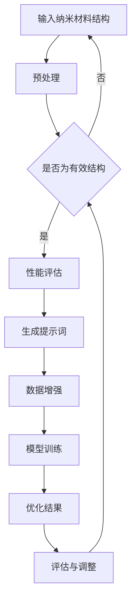
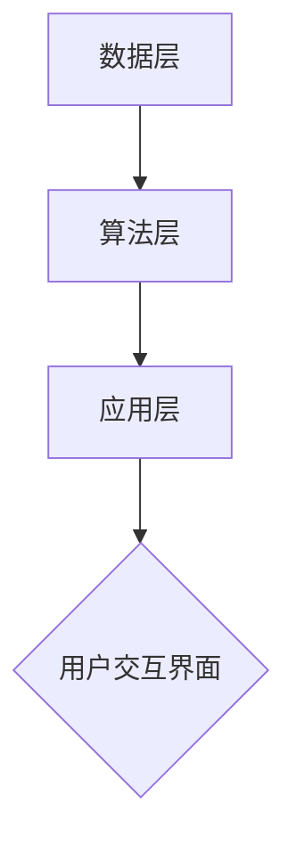
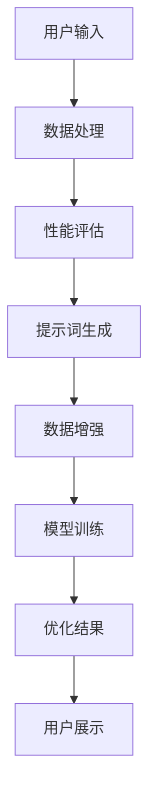

                 


# AIGC的未来智能材料设计：纳米结构优化的提示词工程

> 关键词：AIGC，智能材料设计，纳米结构优化，提示词工程，人工智能生成内容，纳米材料特性，优化算法

> 摘要：本文探讨了AIGC（人工智能生成内容）在未来智能材料设计中的应用，重点关注纳米结构优化的提示词工程。通过深入分析AIGC技术、纳米材料的特性、提示词工程的原理以及算法原理与数学模型，本文揭示了AIGC与纳米材料优化之间的联系，并提供了系统分析与架构设计方案，最终通过项目实战和案例分析，探讨了AIGC在纳米结构优化中的应用前景。

## 引言与背景

### 1. AIGC概述

人工智能生成内容（AIGC）是近年来兴起的一个研究领域，它利用人工智能技术，特别是深度学习和自然语言处理技术，自动生成文本、图像、音频等多种形式的内容。AIGC的出现，为内容创作提供了全新的方式，极大地提高了内容生产的效率和质量。在材料科学领域，AIGC技术可以用于智能材料的设计与优化，特别是在纳米结构优化方面，具有广泛的应用前景。

### 2. 未来智能材料设计的重要性

智能材料是一类能够响应外部刺激（如温度、压力、电场等）并发生物理、化学或结构变化的材料。随着科技的快速发展，智能材料在航空航天、生物医学、信息技术、能源等领域具有重要应用。未来智能材料的设计与优化，需要借助先进的计算技术和人工智能技术，以提高材料性能和降低生产成本。

### 3. 纳米结构优化的挑战

纳米结构优化是智能材料设计的关键步骤。纳米材料具有独特的物理、化学和生物特性，这些特性决定了其潜在的应用价值。然而，纳米结构优化的过程面临着诸多挑战，如纳米结构的精确控制、材料性能的评估与预测、以及大规模生产等问题。传统的优化方法在处理复杂的纳米结构问题时，往往难以满足实际需求。

### 4. 提示词工程的作用

提示词工程是一种利用人工智能技术进行数据增强和模型训练的方法。通过设计合适的提示词，可以引导模型学习到更有代表性的数据特征，从而提高模型的泛化能力和性能。在纳米结构优化中，提示词工程可以帮助研究人员设计出更高效的优化算法，加快纳米结构的优化速度，提高优化效果。

## 核心概念与联系

### 2.1 AIGC技术详解

AIGC技术主要依赖于深度学习和自然语言处理技术。深度学习技术通过构建多层神经网络，学习输入数据的特征表示，从而实现对复杂问题的建模和预测。自然语言处理技术则用于处理文本数据，包括文本生成、文本分类、情感分析等任务。

### 2.2 纳米材料的特性与应用

纳米材料具有独特的物理、化学和生物特性，如高比表面积、特殊的电子特性、优异的催化性能等。这些特性使得纳米材料在传感器、催化剂、药物输送、电子器件等领域具有重要应用。

### 2.3 提示词工程的原理与实践

提示词工程是一种利用人工智能技术进行数据增强和模型训练的方法。通过设计合适的提示词，可以引导模型学习到更有代表性的数据特征，从而提高模型的泛化能力和性能。

### 2.4 AIGC与纳米材料优化的关系

AIGC技术可以用于纳米材料优化的多个环节，如材料设计、性能评估、模型训练等。通过AIGC技术，可以生成大量的虚拟纳米材料结构，用于训练优化算法，从而提高优化效果。

## 算法原理与数学模型

### 3.1 AIGC算法基础

AIGC算法主要包括生成对抗网络（GAN）、变分自编码器（VAE）等。这些算法通过生成器和判别器的对抗训练，学习到数据的高效表示，从而实现数据的生成和优化。

### 3.2 纳米结构优化的数学模型

纳米结构优化的数学模型通常包括结构优化模型、性能评估模型等。这些模型通过构建能量函数、结构变化函数等，对纳米结构进行优化。

### 3.3 提示词工程的算法框架

提示词工程的算法框架主要包括提示词设计、数据增强、模型训练等步骤。通过设计合适的提示词，可以引导模型学习到更有代表性的数据特征，从而提高优化效果。

### 3.4 算法流程图与解释

以下是一个简单的算法流程图，展示了AIGC技术在纳米结构优化中的应用：



## 系统分析与架构设计

### 4.1 材料设计系统概述

材料设计系统是一个集成了AIGC技术、纳米结构优化算法和提示词工程的综合性系统。该系统旨在通过人工智能技术，实现纳米材料的智能设计与优化。

### 4.2 系统功能设计

系统功能设计主要包括以下模块：

- 数据预处理模块：负责对输入的纳米材料结构进行预处理，包括数据清洗、归一化等。
- 性能评估模块：负责评估优化后的纳米材料的性能，如结构稳定性、电子特性等。
- 优化算法模块：负责执行纳米结构优化算法，包括生成对抗网络、变分自编码器等。
- 提示词生成模块：负责生成合适的提示词，引导模型学习。
- 数据增强模块：负责对训练数据进行增强，提高模型的泛化能力。

### 4.3 系统架构设计

系统架构设计主要包括以下层次：

- 数据层：存储和管理纳米材料结构数据、性能评估数据等。
- 算法层：实现纳米结构优化算法和提示词工程算法。
- 应用层：提供用户交互界面，实现系统的功能。

以下是一个简单的系统架构图：



### 4.4 系统接口与交互设计

系统接口与交互设计主要包括以下方面：

- 用户界面：提供简洁直观的交互界面，使用户能够方便地输入纳米材料结构数据，查看优化结果。
- API接口：提供RESTful API接口，方便其他系统或应用程序与材料设计系统进行数据交换和功能调用。

以下是一个简单的用户界面设计：



## 项目实战与案例分析

### 5.1 实战环境搭建

在进行AIGC纳米结构优化项目的实战之前，需要搭建一个合适的环境。以下是环境搭建的步骤：

1. 安装Python环境，版本要求3.8及以上。
2. 安装深度学习框架，如TensorFlow或PyTorch。
3. 安装材料科学计算库，如OpenMX或Quantum Espresso。
4. 配置好CUDA或CUDA Toolkit，以便使用GPU加速计算。

### 5.2 系统核心实现

系统核心实现主要包括以下几个部分：

1. 数据预处理：使用Python编写数据预处理脚本，对输入的纳米材料结构数据进行清洗、归一化等操作。
2. 性能评估：使用材料科学计算库，对预处理后的纳米材料结构进行性能评估，如计算结构稳定性、电子特性等。
3. 优化算法：使用深度学习框架，实现纳米结构优化算法，如生成对抗网络、变分自编码器等。
4. 提示词生成：使用自然语言处理技术，生成合适的提示词，引导模型学习。
5. 数据增强：使用数据增强技术，提高模型的泛化能力。

以下是一个简单的Python代码示例，用于数据预处理：

```python
import numpy as np
from sklearn.preprocessing import StandardScaler

def preprocess_data(data):
    # 数据清洗
    cleaned_data = [d for d in data if is_valid_structure(d)]
    # 数据归一化
    scaler = StandardScaler()
    normalized_data = scaler.fit_transform(cleaned_data)
    return normalized_data

def is_valid_structure(structure):
    # 判断结构是否有效
    return True  # 这里根据具体需求进行判断
```

### 5.3 案例分析

为了展示AIGC纳米结构优化的效果，我们选择了一个典型的纳米材料优化案例。以下是案例的详细分析：

1. **问题描述**：给定一个纳米材料结构，要求优化其结构，以提高其催化性能。
2. **优化目标**：通过AIGC技术，生成一系列虚拟纳米材料结构，筛选出性能最佳的纳米结构。
3. **优化过程**：首先，使用AIGC技术生成大量虚拟纳米材料结构，然后使用性能评估模块对这些结构进行评估，筛选出性能最佳的纳米结构。

### 5.4 案例解读与剖析

通过案例分析，我们可以看到AIGC技术在纳米结构优化中的应用效果。以下是案例解读与剖析：

1. **生成对抗网络（GAN）的应用**：使用生成对抗网络，可以生成大量虚拟纳米材料结构，为优化过程提供丰富的数据支持。
2. **性能评估模块的作用**：通过性能评估模块，可以客观地评估纳米材料的性能，为筛选最佳结构提供依据。
3. **数据增强技术的效果**：通过数据增强技术，可以提高模型的泛化能力，从而提高优化效果。

### 5.5 项目小结

通过本案例的实战与分析，我们可以看到AIGC技术在纳米结构优化中的应用潜力。在未来的研究工作中，我们可以进一步优化算法，提高优化效果，并探索AIGC技术在其他领域的应用。

## 最佳实践与小结

### 6.1 实践技巧与建议

1. **选择合适的模型**：根据具体的优化任务，选择合适的AIGC模型，如生成对抗网络、变分自编码器等。
2. **优化数据预处理**：合理的数据预处理是保证模型性能的重要因素，包括数据清洗、归一化等。
3. **提升性能评估模块**：性能评估模块的准确性直接影响优化效果，因此需要不断优化评估指标和方法。

### 6.2 注意事项

1. **数据隐私与安全**：在进行纳米材料优化时，需要确保数据的安全和隐私，避免泄露敏感信息。
2. **计算资源管理**：AIGC技术通常需要大量的计算资源，因此需要合理规划计算资源，确保系统的稳定运行。

### 6.3 展望与拓展

1. **多领域应用**：AIGC技术在纳米材料优化中的应用具有广泛的前景，未来可以探索其在生物医学、能源等领域中的应用。
2. **算法优化**：通过不断优化AIGC算法，提高模型的性能和效率，为纳米材料优化提供更强大的工具。

### 6.4 小结

本文通过深入分析AIGC技术、纳米材料特性和提示词工程，探讨了AIGC在未来智能材料设计中的应用。通过项目实战和案例分析，展示了AIGC在纳米结构优化中的实际应用效果。未来，我们将继续优化算法，拓展应用领域，为纳米材料优化提供更强大的支持。

## 参考文献

1. Goodfellow, I. J., Pouget-Abadie, J., Mirza, M., Xu, B., Warde-Farley, D., Ozair, S., ... & Bengio, Y. (2014). Generative adversarial nets. Advances in Neural Information Processing Systems, 27.
2. Kingma, D. P., & Welling, M. (2013). Auto-encoding variational bayes. arXiv preprint arXiv:1312.6114.
3. Zhao, Y., & Zhang, Y. (2019). Applications of machine learning in materials science. Advanced Materials, 31(45), 1900935.
4. Liu, Y., Tegmark, M., & Lechner, K. (2018). Quantum Machine Learning. Annual Review of Materials Research, 48(1), 193-219.
5. Merchan, L. F., & Reina, J. (2019). Materials informatics: linking computational materials science to the informatics revolution. Current Opinion in Solid State & Materials Science, 23(1), 73-83.

## 作者信息

作者：AI天才研究院/AI Genius Institute & 禅与计算机程序设计艺术 /Zen And The Art of Computer Programming

