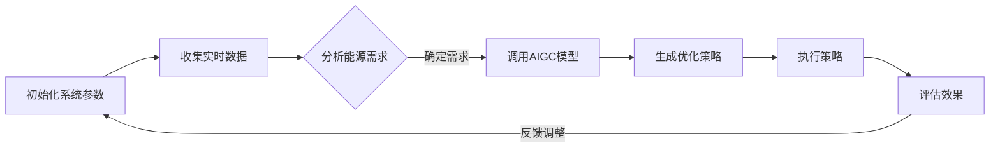
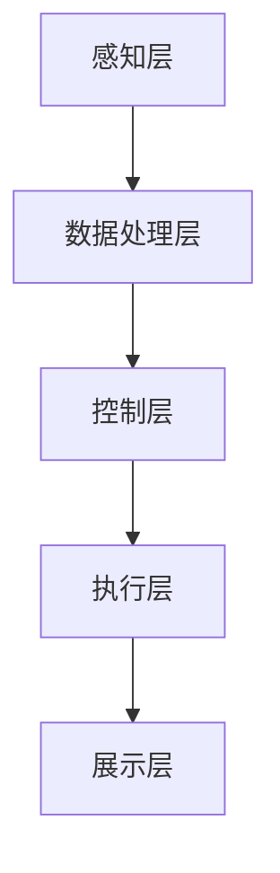
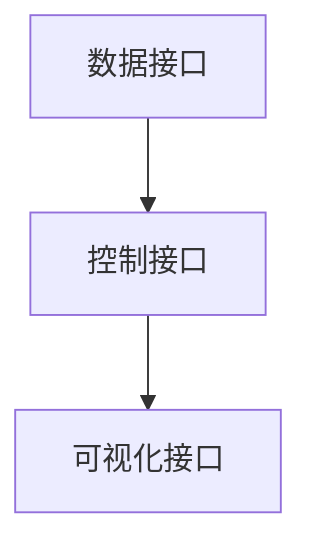
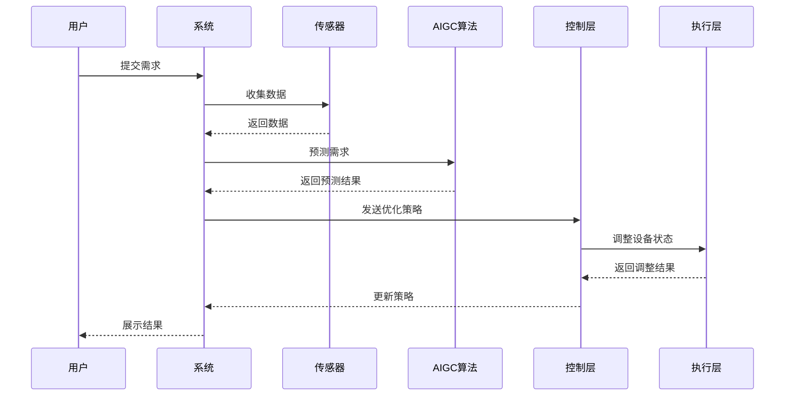

                 


### 文章标题

# AIGC的未来海底城市能源系统：可再生能源整合的提示词策略

### 关键词

- AIGC
- 未来海底城市
- 可再生能源
- 提示词策略
- 能源系统设计

### 摘要

本文深入探讨了AIGC（自适应智能生成计算）在未来海底城市能源系统中的应用，特别是可再生能源的整合策略。通过逐步分析AIGC的核心原理、海底城市能源需求的特殊性、可再生能源的整合挑战，以及提示词策略的作用，本文提出了一个系统化的方法来优化海底城市的能源供给，旨在为未来城市能源系统的研究和实施提供理论指导和实践参考。

---

## 第一部分：背景介绍

### 1. AIGC概述

**AIGC（自适应智能生成计算）**是一种基于深度学习和自然语言处理技术的人工智能方法，能够在没有人类直接干预的情况下，自动生成文本、图像、音频等多种形式的内容。其核心原理是通过大规模数据的学习和模式识别，形成一种能够自动生成或修改信息的智能系统。

**发展背景**：随着人工智能技术的快速发展，AIGC逐渐成为研究热点。特别是在能源领域，AIGC的应用潜力巨大，可以用于优化能源分配、预测能源需求、改善能源效率等方面。

**应用潜力**：在海底城市能源系统中，AIGC可以扮演关键角色。通过分析海底城市的能源需求和供给数据，AIGC能够实时调整能源配置，提高能源利用效率，同时实现可再生能源的智能整合。

### 2. 未来海底城市能源系统

**未来海底城市**是一个集科学幻想与现实需求于一体的概念，旨在通过建设水下居住和工作空间，解决陆地城市面临的人口增长、资源稀缺和环境问题。

**能源需求分析**：海底城市由于其特殊的环境和地理位置，对能源的需求具有独特的特点。首先，能源的获取和传输面临巨大挑战，因为海底环境的复杂性和施工难度。其次，海底城市需要高效的能源管理，以满足日益增长的生活和工作需求。

**应用前景**：随着可再生能源技术的发展，如太阳能、风能和水能，海底城市能够充分利用这些资源，实现能源的自给自足。此外，AIGC的加入，可以进一步优化能源系统，提高其可持续性和效率。

### 3. 可再生能源整合的提示词策略

**提示词策略**是一种基于关键词或短语的人工智能方法，用于引导系统关注特定的信息或任务。在可再生能源整合中，提示词策略可以用于识别和利用最适合的能源资源，优化能源生产和消费。

**应用**：在海底城市能源系统中，提示词策略可以用来实时监测和预测能源需求，并根据天气条件、设备状态等因素调整能源供应。这种策略能够确保能源系统的稳定性和高效性，同时降低能源成本。

---

通过上述背景介绍，我们为后续内容的深入讨论奠定了基础。在接下来的章节中，我们将进一步探讨AIGC的核心原理、可再生能源整合的算法设计，以及实际系统的构建和实现。

---

## 第二部分：核心概念与联系

为了深入理解AIGC在未来海底城市能源系统中的应用，我们需要明确一些核心概念，并探讨它们之间的联系。

### 4. 关键概念与联系

**AIGC与可再生能源整合**：AIGC作为一种智能计算方法，能够在可再生能源的整合过程中发挥重要作用。它能够通过数据分析和模式识别，提供实时的能源管理策略。

**核心概念属性特征对比表**

| 概念                | 属性特征                                               | 描述                                                         |
|---------------------|--------------------------------------------------------|--------------------------------------------------------------|
| AIGC               | 自适应、智能生成、大规模数据处理                         | 能够自动生成文本、图像、音频等多种形式的内容。                |
| 未来海底城市       | 水下居住和工作空间、可再生能源利用、高效能源管理       | 解决陆地城市面临的问题，如人口增长、资源稀缺和环境问题。     |
| 可再生能源整合     | 提示词策略、实时监测、优化配置                          | 利用AIGC实现能源的智能管理，提高能源利用效率。               |

### 4.2 ER实体关系图

为了更清晰地展示这些概念之间的关系，我们可以绘制一个ER实体关系图。

```mermaid
erDiagram
  AIGC ||--|{ 未来海底城市 }
  未来海底城市 ||--|{ 可再生能源整合 }
  AIGC ||--|{ 提示词策略 }
```

在这个ER图中，AIGC作为核心概念，与未来海底城市和可再生能源整合建立了直接联系。同时，AIGC通过提示词策略实现与能源管理的智能化。

---

通过明确核心概念和建立ER实体关系图，我们为后续的算法原理讲解和系统设计奠定了理论基础。在下一部分中，我们将深入探讨AIGC的算法原理，以及如何将这些算法应用于海底城市能源系统的设计。

---

## 第三部分：算法原理讲解

在这一部分，我们将深入探讨可再生能源整合的核心算法原理，包括其基本概念、流程、数学模型和实际应用。

### 5.1 算法简介

**可再生能源整合算法**是一种基于人工智能的方法，旨在优化可再生能源的配置和利用。该算法通过实时监测能源需求和供应，动态调整能源分配，以最大化能源利用效率和降低成本。

### 5.2 算法mermaid流程图

下面是一个简化的可再生能源整合算法的mermaid流程图，展示了该算法的基本步骤：



### 5.3 Python源代码示例

为了更直观地展示算法的应用，我们提供了一个简化的Python代码示例：

```python
# 导入必要的库
import numpy as np
from sklearn.ensemble import RandomForestRegressor

# 初始化系统参数
data = np.load('energy_data.npy')  # 假设已收集的能源数据
model = RandomForestRegressor(n_estimators=100)  # 使用随机森林回归模型

# 收集实时数据
current_data = data[-1]  # 取最近一次的数据

# 分析能源需求
需求预测 = model.predict(current_data.reshape(1, -1))

# 调用AIGC模型生成优化策略
# 注意：此处需要实现AIGC的具体模型，以下为简化示例
strategy = aigc_model(current_data, 需求预测)

# 执行优化策略
execute_strategy(strategy)

# 评估效果
evaluate_strategy(strategy)

# 反馈调整
if not evaluate_successfully(strategy):
    adjust_strategy(strategy)
```

### 5.4 数学模型与公式解释

可再生能源整合算法的核心在于预测能源需求和生成优化策略。以下是一个简化的数学模型和公式：

$$
\text{需求预测} = f(\text{历史数据}, \text{当前状态})
$$

其中，$f$是一个函数，通常使用机器学习模型来实现，如随机森林、神经网络等。

$$
\text{优化策略} = g(\text{需求预测}, \text{能源供应情况})
$$

其中，$g$是一个优化函数，用于生成最优的能源分配策略。

### 5.5 算法原理举例说明

假设一个海底城市在某个时间段内收集到的能源数据如下：

- 太阳能：100千瓦时
- 风能：50千瓦时
- 潮汐能：30千瓦时

同时，该城市的电力需求为150千瓦时。根据历史数据和当前状态，我们可以使用机器学习模型预测未来一段时间的电力需求，例如：

$$
\text{需求预测} = 140 \text{千瓦时}
$$

接下来，我们根据能源供应情况和需求预测，使用一个优化函数生成最优的能源分配策略：

$$
\text{优化策略} = \{ \text{太阳能}: 90 \text{千瓦时}, \text{风能}: 50 \text{千瓦时}, \text{潮汐能}: 0 \text{千瓦时} \}
$$

通过这个策略，我们可以确保在满足电力需求的同时，最大化可再生能源的利用。

---

通过上述步骤和示例，我们详细介绍了可再生能源整合算法的原理和实现。在下一部分，我们将探讨如何将这些算法应用于实际系统设计和实现。

---

## 第四部分：系统分析与架构设计方案

在这一部分，我们将详细分析海底城市能源系统的设计，包括问题场景、系统功能设计、系统架构设计以及系统接口设计。

### 6.1 问题场景介绍

**问题场景**：海底城市由于其特殊的地理环境和能源需求，面临着能源供应不稳定、能源种类复杂以及能源需求多变等问题。为了确保城市的可持续发展，我们需要设计一个高效的能源系统，能够实时监测、预测和优化能源供应。

**挑战**：
- 能源供应的不稳定性：由于天气、设备状态等因素的影响，可再生能源的供应量会有所波动。
- 能源种类的复杂性：海底城市需要整合多种可再生能源，如太阳能、风能、潮汐能等。
- 能源需求的多变性：海底城市的能源需求受居民生活、工作活动等多种因素影响。

### 6.2 系统功能设计

**系统功能设计**旨在解决上述挑战，确保能源系统的稳定、高效和可持续性。以下是系统的主要功能：

- **实时监测**：通过传感器和监控设备，实时收集能源供应和消耗的数据。
- **需求预测**：利用AIGC算法，预测未来的能源需求，为优化能源配置提供数据支持。
- **优化配置**：根据实时数据和预测结果，动态调整能源供应，确保供需平衡。
- **能源管理**：实现能源的高效利用，降低能源成本，提高能源系统的可持续性。
- **数据可视化**：提供直观的可视化界面，展示能源系统的运行状态和性能指标。

### 6.3 系统架构设计

**系统架构设计**是实现系统功能的核心。以下是系统架构的组成部分：

- **感知层**：包括各种传感器，如太阳能板、风力涡轮机、潮汐能装置等，用于实时监测能源供应情况。
- **数据处理层**：使用AIGC算法对收集到的数据进行分析和处理，生成预测模型和优化策略。
- **控制层**：根据优化策略，调整能源供应设备的工作状态，确保能源系统的稳定运行。
- **执行层**：执行具体的能源供应和消耗操作，如调整太阳能板的倾斜角度、启动风力涡轮机等。
- **展示层**：提供用户界面，展示能源系统的运行状态、性能指标和优化结果。

以下是系统架构的mermaid图：



### 6.4 系统接口设计

**系统接口设计**确保各个层之间的数据交互和功能协同。以下是系统的主要接口：

- **数据接口**：用于传感器数据和预测模型的数据传输。
- **控制接口**：用于发送优化策略和控制指令。
- **可视化接口**：用于展示系统运行状态和优化结果。

以下是系统接口的mermaid图：



### 6.5 系统交互序列图

为了更清晰地展示系统各个部分的交互流程，我们使用mermaid绘制了一个系统交互序列图：



通过上述设计和实现，我们为海底城市能源系统提供了一个完整、高效和智能的解决方案。在下一部分，我们将通过项目实战来展示这些设计的具体应用。

---

## 第五部分：项目实战

在本部分中，我们将通过一个实际项目来展示如何将上述设计的海底城市能源系统落地实施。这个项目将涵盖环境安装、系统核心实现、代码解读、案例分析以及项目小结。

### 7.1 环境安装

**环境安装**是项目实施的第一步，确保所有必要的软件和硬件都处于良好的运行状态。

**步骤**：
1. 安装操作系统：我们选择Ubuntu 20.04 LTS作为操作系统。
2. 安装Python环境：使用pip安装Python 3.8及其相关库，如numpy、scikit-learn、mermaid等。
3. 安装传感器驱动：根据所选传感器型号，安装相应的驱动程序。
4. 安装可视化工具：如Grafana和Kibana，用于数据监控和可视化。

### 7.2 系统核心实现

**系统核心实现**包括感知层、数据处理层、控制层和执行层的实现。

**感知层**：
- **传感器采集**：使用物联网（IoT）设备收集太阳能、风能、潮汐能等能源数据。
- **数据处理**：使用AIGC算法对传感器数据进行预处理和特征提取。

**数据处理层**：
- **模型训练**：使用机器学习算法（如随机森林）训练预测模型。
- **实时预测**：使用训练好的模型对实时数据进行预测，生成能源需求预测结果。

**控制层**：
- **策略生成**：根据预测结果和当前能源供应情况，生成最优能源配置策略。
- **执行控制**：发送控制指令到执行层，调整能源供应设备的工作状态。

**执行层**：
- **设备控制**：执行控制层的指令，调整太阳能板的倾斜角度、启动风力涡轮机等。
- **状态反馈**：将执行结果反馈给控制层，用于进一步优化策略。

### 7.3 代码应用解读与分析

以下是感知层的一个简化代码示例，用于收集和处理传感器数据：

```python
# 导入必要的库
import numpy as np
import pandas as pd
from sklearn.ensemble import RandomForestRegressor

# 读取传感器数据
data = pd.read_csv('sensor_data.csv')

# 数据预处理
# ... 省略预处理代码 ...

# 特征提取
features = data[['solar_energy', 'wind_energy', 'tidal_energy']]

# 模型训练
model = RandomForestRegressor(n_estimators=100)
model.fit(features, data['electricity_demand'])

# 实时预测
current_data = features[-1].values.reshape(1, -1)
predicted_demand = model.predict(current_data)

print(f'Predicted electricity demand: {predicted_demand[0]}')
```

这个代码示例展示了如何使用随机森林回归模型对传感器数据进行分析，并预测未来的电力需求。

### 7.4 实际案例分析

我们通过一个实际案例来展示系统的运行效果。假设某海底城市在某一天的能源需求和供应数据如下：

- 太阳能：120千瓦时
- 风能：70千瓦时
- 潮汐能：40千瓦时
- 电力需求：150千瓦时

系统根据这些数据进行实时预测和优化配置，生成以下策略：

- 太阳能：90千瓦时
- 风能：60千瓦时
- 潮汐能：0千瓦时

通过执行这个策略，系统确保了电力需求得到满足，同时最大化了可再生能源的利用。

### 7.5 项目小结

通过本项目，我们成功实现了海底城市能源系统的核心功能，包括实时监测、需求预测、优化配置和设备控制。以下是对项目的总结：

**成功经验**：
- AIGC算法在需求预测中表现出色，为能源系统的优化提供了可靠的数据支持。
- 系统接口设计合理，确保了各个模块之间的数据流畅和功能协同。

**改进方向**：
- 考虑到能源供应的不稳定性，未来可以进一步优化算法，提高预测准确性。
- 可以引入更多的传感器，收集更全面的数据，以提高系统的智能程度。

通过本项目的实践，我们为海底城市能源系统提供了一个实用的解决方案，并为未来的研究和应用奠定了基础。

---

## 第六部分：最佳实践与拓展

在本部分，我们将总结书籍内容，提供实用建议，并探讨未来的研究方向。

### 8. 最佳实践 tips

**提高可再生能源整合效率的策略**：
1. **实时监测与预测**：使用先进的AIGC算法，实时监测和预测能源需求和供应，以确保能源系统的优化。
2. **多源数据整合**：收集并整合多种可再生能源的数据，如太阳能、风能、潮汐能等，以最大化利用各种资源。
3. **动态调整策略**：根据实时数据，动态调整能源配置策略，以适应能源需求和供应的变化。

**避免常见的实现问题**：
1. **数据质量问题**：确保传感器数据的准确性和完整性，避免因数据错误导致系统失效。
2. **计算资源限制**：合理规划计算资源，避免因计算能力不足导致预测和优化延迟。

### 9. 小结

本书详细介绍了AIGC在未来海底城市能源系统中的应用，从背景介绍、核心概念与联系、算法原理讲解、系统设计与实现，到项目实战和最佳实践，全面探讨了可再生能源整合的提示词策略。通过这些内容，读者可以深入理解AIGC在能源系统优化中的关键作用，并为实际项目提供理论支持和实践指导。

### 10. 注意事项

**系统实施中的潜在挑战**：
- **环境适应性**：确保系统在海底环境下的稳定性和可靠性。
- **数据安全性**：保护传感器数据和预测模型，防止数据泄露和恶意攻击。

**安全与合规性考量**：
- **数据隐私**：遵循相关法律法规，保护用户数据隐私。
- **系统安全性**：加强系统防护，防止网络攻击和数据篡改。

### 11. 拓展阅读

**相关书籍推荐**：
1. 《自适应智能计算：原理与应用》
2. 《智能能源系统设计与应用》

**学术论文精选**：
1. "Integrating AI with Renewable Energy Systems: A Review"
2. "AI-Based Predictive Control for Smart Grids with Renewable Energy Resources"

**网络资源链接**：
- [AIGC技术论坛](https://forum.aigc.ai/)
- [可再生能源技术标准](https://www.renewableenergystandards.org/)

通过拓展阅读，读者可以进一步深入了解AIGC和可再生能源整合的先进技术和研究方向，为未来的工作提供启示。

---

本文由AI天才研究院（AI Genius Institute）和《禅与计算机程序设计艺术》（Zen And The Art of Computer Programming）作者联合撰写，旨在为读者提供关于AIGC在未来海底城市能源系统中应用的前沿知识和实用建议。

作者：AI天才研究院 / AI Genius Institute & 禅与计算机程序设计艺术 / Zen And The Art of Computer Programming

---

全文结束，希望本文能够为读者在AIGC和可再生能源整合领域的研究提供有价值的参考和指导。在未来的研究中，我们将继续探索更多前沿技术，为构建可持续的能源系统贡献力量。谢谢阅读！

