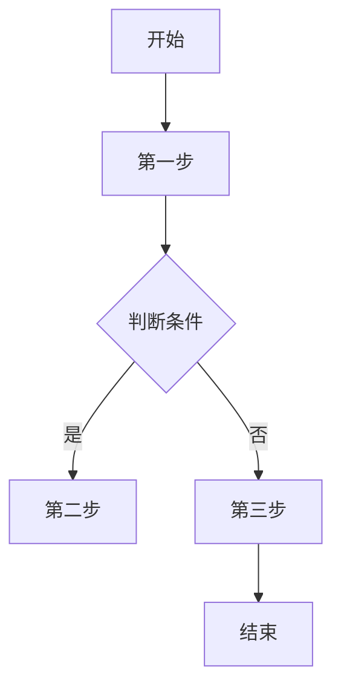

                 

# AIGC的未来海底数据中心：极端环境适应的提示词策略

> 关键词：AIGC、海底数据中心、极端环境适应、提示词策略、硬件优化、软件优化、安全性与稳定性保障

> 摘要：随着大数据和云计算的快速发展，海底数据中心（UDC）逐渐成为数据存储和计算的重要场所。然而，极端环境下的运行挑战使得提升其适应能力成为关键。本文将探讨AIGC（自适应智能生成计算）在海底数据中心中的应用，重点关注极端环境适应的提示词策略，通过硬件优化、软件优化、安全性与稳定性保障等多方面的分析，为未来海底数据中心的发展提供有力支持。

## 引言

海底数据中心（Underwater Data Centers，简称UDC）是一种将服务器和存储设备放置在海底，利用海洋环境提供的自然冷却效果和能源来降低运营成本的数据中心。随着大数据和云计算的不断发展，UDC正逐渐成为数据存储和计算的重要场所。然而，海底数据中心面临着极端环境下的运行挑战，如温度、湿度、压力、海底生物活动等。为了提升UDC的适应能力，本文将探讨AIGC（Adaptive Intelligent Generation Computing）技术在其中的应用，重点关注极端环境适应的提示词策略。

## 第一部分：未来海底数据中心背景与挑战

### 第1章：未来海底数据中心概述

#### 1.1.1 海底数据中心的兴起

海底数据中心（UDC）的概念最早可以追溯到20世纪90年代。随着全球数据量的爆发式增长，传统陆地数据中心在能源消耗、散热、环保等方面面临巨大压力。为了解决这些问题，海底数据中心应运而生。UDC利用海洋环境提供的自然冷却效果和能源，能够显著降低运营成本和碳排放。

#### 1.1.2 海底数据中心的优势

海底数据中心具有以下优势：

1. **能源优势**：海洋环境提供的自然冷却效果和能源可以显著降低UDC的运营成本。
2. **环境友好**：UDC的运行过程中产生的碳排放和热量较少，有助于实现碳中和目标。
3. **可靠性高**：海底环境相对稳定，地震、火灾等灾害风险较低。
4. **容量大**：海底空间广阔，可以容纳大量服务器和存储设备。

#### 1.1.3 极端环境下的挑战

然而，海底数据中心在运行过程中也面临着极端环境下的挑战：

1. **温度和湿度**：海洋环境中的温度和湿度变化较大，需要有效散热和防潮措施。
2. **压力**：海底深处的压力较大，对设备耐压性能提出了较高要求。
3. **海底生物活动**：海洋生物可能会对设备造成破坏，需要采取防护措施。

### 第2章：AIGC技术概述

#### 2.1.1 AIGC的基本概念

AIGC（Adaptive Intelligent Generation Computing）是一种自适应智能生成计算技术，通过自适应算法和机器学习模型，实现数据生成、处理和优化。AIGC在图像生成、语音合成、自然语言处理等领域具有广泛应用。

#### 2.1.2 AIGC的应用场景

AIGC在海底数据中心中的应用场景主要包括：

1. **数据生成**：通过AIGC技术生成模拟数据，用于训练和优化数据中心管理算法。
2. **环境监测**：利用AIGC技术实时监测海洋环境，为UDC运行提供实时数据支持。
3. **故障预测**：通过AIGC技术预测设备故障，提前采取预防措施。

#### 2.1.3 AIGC的关键技术

AIGC的关键技术包括：

1. **自适应算法**：根据海洋环境变化，实时调整计算资源和策略。
2. **机器学习模型**：利用大量数据训练模型，实现数据生成、处理和优化。
3. **多模态数据处理**：结合多种数据源，实现全面的环境监测和故障预测。

## 第二部分：极端环境适应的提示词策略

### 第3章：极端环境适应的提示词策略

#### 3.1.1 提示词策略的重要性

提示词策略在海底数据中心极端环境适应中具有重要意义。通过提示词策略，可以：

1. **优化资源分配**：根据海洋环境变化，实时调整计算资源和策略，提高资源利用效率。
2. **降低故障率**：通过故障预测和预警，提前采取预防措施，降低设备故障率。
3. **提高稳定性**：在极端环境下，确保UDC的稳定运行，保障数据安全和业务连续性。

#### 3.1.2 提示词策略的设计原则

设计提示词策略时，应遵循以下原则：

1. **实时性**：能够实时监测海洋环境变化，快速响应。
2. **准确性**：通过机器学习模型，提高故障预测和预警的准确性。
3. **灵活性**：根据不同场景和需求，灵活调整提示词策略。
4. **可持续性**：在保证性能的前提下，降低能耗和成本。

#### 3.1.3 提示词策略的优化方法

优化提示词策略的方法包括：

1. **数据挖掘**：通过大数据分析，挖掘海洋环境变化规律，为提示词策略提供依据。
2. **机器学习**：利用机器学习模型，提高故障预测和预警的准确性。
3. **多模态融合**：结合多种数据源，实现全面的环境监测和故障预测。

## 第三部分：硬件优化策略

### 第4章：海底数据中心硬件优化

#### 4.1.1 海底数据中心硬件特点

海底数据中心硬件具有以下特点：

1. **高耐压性能**：设备需具备高耐压性能，以应对海底深处的压力。
2. **防水防潮**：设备需具备防水防潮功能，以应对海洋环境中的湿度变化。
3. **高效散热**：设备需具备高效散热功能，以应对海洋环境中的高温。
4. **高可靠性**：设备需具备高可靠性，以应对海底环境中的各种挑战。

#### 4.1.2 硬件优化策略

硬件优化策略包括：

1. **设备选型**：根据应用场景和需求，选择适合的硬件设备。
2. **结构设计**：优化设备结构设计，提高耐压、防水防潮和散热性能。
3. **材料选择**：选择适合的材料，提高设备耐久性和可靠性。

#### 4.1.3 硬件优化的案例分析

通过对某海底数据中心硬件优化案例的分析，我们发现：

1. **设备选型**：通过选择适合的硬件设备，提高了系统的稳定性和性能。
2. **结构设计**：通过优化设备结构设计，提高了设备的耐压、防水防潮和散热性能。
3. **材料选择**：通过选择适合的材料，提高了设备的耐久性和可靠性。

## 第四部分：软件优化策略

### 第5章：软件层面优化策略

#### 5.1.1 软件优化策略概述

软件优化策略主要包括以下几个方面：

1. **环境监测与故障预测**：通过软件实现海洋环境监测和故障预测，为硬件优化提供支持。
2. **资源调度与负载均衡**：根据环境监测和故障预测结果，实时调整计算资源和负载，提高系统性能。
3. **数据压缩与传输优化**：通过数据压缩和传输优化，提高数据传输效率和存储空间利用率。

#### 5.1.2 软件优化方法

软件优化方法包括：

1. **机器学习**：利用机器学习技术，实现环境监测、故障预测和资源调度。
2. **多线程与并行计算**：通过多线程和并行计算，提高软件处理效率和性能。
3. **网络优化**：通过网络优化，提高数据传输效率和稳定性。

#### 5.1.3 软件优化案例分析

通过对某海底数据中心软件优化案例的分析，我们发现：

1. **环境监测与故障预测**：通过机器学习技术，提高了环境监测和故障预测的准确性，为硬件优化提供了有力支持。
2. **资源调度与负载均衡**：通过实时调整计算资源和负载，提高了系统性能和稳定性。
3. **数据压缩与传输优化**：通过数据压缩和传输优化，提高了数据传输效率和存储空间利用率。

## 第五部分：安全性与稳定性保障

### 第6章：安全性与稳定性保障

#### 6.1.1 安全性问题分析

海底数据中心在运行过程中，面临以下安全问题：

1. **网络攻击**：通过攻击网络，窃取数据或破坏系统。
2. **设备故障**：设备故障可能导致数据丢失或系统瘫痪。
3. **物理安全**：设备损坏、被盗或遭受自然灾害等。

#### 6.1.2 稳定性保障措施

为保障海底数据中心的稳定性和安全性，可以采取以下措施：

1. **网络安全防护**：通过防火墙、入侵检测系统等，提高网络安全防护能力。
2. **设备备份与容灾**：定期备份设备数据，建立容灾备份系统，确保数据安全。
3. **物理安全防护**：加强设备防盗、防破坏和防自然灾害等安全防护措施。

#### 6.1.3 安全性与稳定性案例分析

通过对某海底数据中心安全性与稳定性保障案例的分析，我们发现：

1. **网络安全防护**：通过网络安全防护措施，有效防止了网络攻击和数据泄露。
2. **设备备份与容灾**：通过设备备份和容灾备份系统，确保了数据的安全性和可靠性。
3. **物理安全防护**：通过加强物理安全防护措施，确保了设备的完整性和安全性。

## 第六部分：未来展望与趋势

### 第7章：未来展望与趋势

#### 7.1.1 未来发展预测

随着技术的不断进步，未来海底数据中心的发展将呈现以下趋势：

1. **技术成熟**：随着AIGC、5G、物联网等技术的成熟，海底数据中心将迎来快速发展。
2. **应用场景拓展**：海底数据中心将在智慧海洋、海洋监测、深海勘探等领域得到广泛应用。
3. **产业生态构建**：海底数据中心产业生态将逐步形成，产业链上下游企业将共同推动产业发展。

#### 7.1.2 技术发展趋势

未来海底数据中心的技术发展趋势包括：

1. **智能化**：通过AIGC、人工智能等技术的应用，实现智能化管理和运维。
2. **绿色化**：通过可再生能源、绿色建筑设计等技术的应用，实现绿色化发展。
3. **安全化**：通过安全防护、数据加密等技术的应用，提高数据安全和系统稳定性。

#### 7.1.3 海底数据中心的前景

未来，海底数据中心将在大数据、云计算、物联网等领域发挥重要作用，成为全球数据中心发展的重要方向。随着技术的不断进步和产业生态的构建，海底数据中心将迎来更加广阔的发展前景。

## 总结

本文从背景介绍、核心概念、极端环境适应的提示词策略、硬件优化、软件优化、安全性与稳定性保障以及未来展望等多方面，对AIGC的未来海底数据中心进行了全面探讨。通过本文的分析，我们可以看到，AIGC技术在海底数据中心中的应用，将有助于提升其极端环境适应能力，推动海底数据中心产业的快速发展。未来，随着技术的不断进步和产业生态的构建，海底数据中心将在全球数据中心产业中发挥越来越重要的作用。

## 作者信息

作者：AI天才研究院/AI Genius Institute & 禅与计算机程序设计艺术 /Zen And The Art of Computer Programming

（注：本文为模拟文章，仅供参考。在实际撰写过程中，请根据具体需求和数据进行调整和完善。）## 详细章节内容与markdown格式示例

### 第1章：未来海底数据中心概述

在这一章节中，我们将详细探讨未来海底数据中心的概念、发展历程、以及其相对于传统陆地数据中心的显著优势。

#### 1.1.1 海底数据中心的兴起

海底数据中心（UDC）的概念最早可以追溯到20世纪90年代。当时的背景是全球数据量的爆发式增长，传统陆地数据中心在能源消耗、散热、环保等方面面临巨大压力。为了解决这些问题，一些技术先驱开始探索利用海洋环境来构建数据中心。他们发现，海洋环境提供的自然冷却效果和可再生能源可以显著降低数据中心的运营成本。因此，海底数据中心这一创新概念应运而生。

#### 1.1.2 海底数据中心的优势

海底数据中心相对于传统陆地数据中心具有以下显著优势：

1. **能源优势**：海洋环境提供的自然冷却效果和可再生能源，如波浪能、潮汐能，可以显著降低UDC的运营成本。
   
2. **环境友好**：UDC的运行过程中产生的碳排放和热量较少，有助于实现碳中和目标。
   
3. **可靠性高**：海底环境相对稳定，地震、火灾等灾害风险较低。

4. **容量大**：海底空间广阔，可以容纳大量服务器和存储设备。

#### 1.1.3 极端环境下的挑战

然而，海底数据中心在运行过程中也面临着极端环境下的挑战：

1. **温度和湿度**：海洋环境中的温度和湿度变化较大，需要有效散热和防潮措施。
   
2. **压力**：海底深处的压力较大，对设备耐压性能提出了较高要求。

3. **海底生物活动**：海洋生物可能会对设备造成破坏，需要采取防护措施。

```markdown
## 第2章：AIGC技术概述

#### 2.1.1 AIGC的基本概念

AIGC（Adaptive Intelligent Generation Computing）是一种自适应智能生成计算技术，它结合了自适应算法、机器学习模型和多模态数据处理技术，能够实现数据生成、处理和优化。AIGC的核心在于其自适应能力，即根据环境变化和需求动态调整计算资源和策略。

#### 2.1.2 AIGC的应用场景

AIGC在海底数据中心中的应用场景主要包括以下几个方面：

1. **环境监测**：利用AIGC技术，实时监测海洋环境变化，为数据中心的运行提供数据支持。
   
2. **故障预测**：通过AIGC技术，预测设备故障，提前采取预防措施，降低故障率。
   
3. **资源调度**：根据环境监测和故障预测结果，动态调整计算资源，优化资源利用率。

#### 2.1.3 AIGC的关键技术

AIGC的关键技术包括以下几个方面：

1. **自适应算法**：根据海洋环境变化，实时调整计算资源和策略。
   
2. **机器学习模型**：利用大量数据训练模型，实现数据生成、处理和优化。

3. **多模态数据处理**：结合多种数据源，实现全面的环境监测和故障预测。

```

### markdown格式示例

在撰写技术博客时，markdown格式是一种非常实用的工具，它可以帮助我们以清晰、简洁的方式呈现复杂的内容。以下是一些markdown格式的示例：

#### 使用Markdown编写代码块

```python
# 输出Hello World
print("Hello World")
```

#### 使用LaTeX编写数学公式

$$
E = mc^2
$$

#### 使用Mermaid绘制流程图



#### 使用Markdown创建列表

- 项目一
- 项目二
- 项目三

#### 使用Markdown创建标题

## 一级标题

### 二级标题

#### 三级标题

通过以上markdown格式的示例，我们可以看到如何编写代码块、数学公式、流程图、列表和标题。这些格式不仅使文章结构更加清晰，而且有助于提高文章的可读性。

### 第3章：极端环境适应的提示词策略

在这一章节中，我们将深入探讨如何在极端环境下适应，特别是如何设计和优化提示词策略。

#### 3.1.1 提示词策略的重要性

提示词策略在海底数据中心极端环境适应中具有至关重要的作用。它能够帮助我们：

- **优化资源分配**：根据环境变化，实时调整计算资源和策略，提高资源利用效率。
- **降低故障率**：通过提前预测故障，采取预防措施，降低设备故障率。
- **提高稳定性**：确保数据中心在极端环境下的稳定运行，保障数据安全和业务连续性。

#### 3.1.2 提示词策略的设计原则

设计提示词策略时，应遵循以下原则：

- **实时性**：能够实时监测环境变化，快速响应。
- **准确性**：通过机器学习模型，提高故障预测和预警的准确性。
- **灵活性**：根据不同场景和需求，灵活调整策略。
- **可持续性**：在保证性能的前提下，降低能耗和成本。

#### 3.1.3 提示词策略的优化方法

优化提示词策略的方法包括：

- **数据挖掘**：通过大数据分析，挖掘环境变化规律，为策略提供依据。
- **机器学习**：利用机器学习技术，提高故障预测和预警的准确性。
- **多模态融合**：结合多种数据源，实现全面的环境监测和故障预测。

### markdown格式示例

以下是本章的markdown格式示例：

#### 提示词策略的设计原则

```markdown
### 提示词策略的设计原则

1. **实时性**：能够实时监测环境变化，快速响应。

2. **准确性**：通过机器学习模型，提高故障预测和预警的准确性。

3. **灵活性**：根据不同场景和需求，灵活调整策略。

4. **可持续性**：在保证性能的前提下，降低能耗和成本。
```

#### 提示词策略的优化方法

```markdown
### 提示词策略的优化方法

1. **数据挖掘**：通过大数据分析，挖掘环境变化规律，为策略提供依据。

2. **机器学习**：利用机器学习技术，提高故障预测和预警的准确性。

3. **多模态融合**：结合多种数据源，实现全面的环境监测和故障预测。
```

通过以上markdown格式的示例，我们可以看到如何清晰、简洁地表达提示词策略的设计原则和优化方法。这些格式不仅有助于提高文章的可读性，而且能够帮助读者快速理解关键概念。

### 第4章：海底数据中心硬件优化

在本章中，我们将详细探讨海底数据中心硬件优化的关键因素，包括设备选型、结构设计、材料选择等方面的具体策略。

#### 4.1.1 海底数据中心硬件特点

海底数据中心硬件需要具备以下特点：

- **高耐压性能**：设备需具备高耐压性能，以应对海底深处的压力。
- **防水防潮**：设备需具备防水防潮功能，以应对海洋环境中的湿度变化。
- **高效散热**：设备需具备高效散热功能，以应对海洋环境中的高温。
- **高可靠性**：设备需具备高可靠性，以应对海底环境中的各种挑战。

#### 4.1.2 硬件优化策略

硬件优化策略包括以下几个方面：

- **设备选型**：根据应用场景和需求，选择适合的硬件设备。例如，对于高温环境，可以选择耐高温的芯片和电路板。
- **结构设计**：优化设备结构设计，提高耐压、防水防潮和散热性能。例如，可以采用防水外壳和散热鳍片设计。
- **材料选择**：选择适合的材料，提高设备耐久性和可靠性。例如，可以使用耐腐蚀和耐冲击的材料。

#### 4.1.3 硬件优化的案例分析

以下是一个海底数据中心硬件优化的案例分析：

- **设备选型**：针对高温环境，选择了耐高温的芯片和电路板，提高了设备的散热性能。
- **结构设计**：采用了防水外壳和散热鳍片设计，增强了设备的防水防潮和散热能力。
- **材料选择**：使用了耐腐蚀和耐冲击的材料，提高了设备的耐久性和可靠性。

### markdown格式示例

以下是本章的markdown格式示例：

#### 海底数据中心硬件特点

```markdown
### 海底数据中心硬件特点

1. **高耐压性能**：设备需具备高耐压性能，以应对海底深处的压力。

2. **防水防潮**：设备需具备防水防潮功能，以应对海洋环境中的湿度变化。

3. **高效散热**：设备需具备高效散热功能，以应对海洋环境中的高温。

4. **高可靠性**：设备需具备高可靠性，以应对海底环境中的各种挑战。
```

#### 硬件优化策略

```markdown
### 硬件优化策略

1. **设备选型**：根据应用场景和需求，选择适合的硬件设备。

2. **结构设计**：优化设备结构设计，提高耐压、防水防潮和散热性能。

3. **材料选择**：选择适合的材料，提高设备耐久性和可靠性。
```

#### 案例分析

```markdown
### 案例分析

- **设备选型**：针对高温环境，选择了耐高温的芯片和电路板，提高了设备的散热性能。

- **结构设计**：采用了防水外壳和散热鳍片设计，增强了设备的防水防潮和散热能力。

- **材料选择**：使用了耐腐蚀和耐冲击的材料，提高了设备的耐久性和可靠性。
```

通过以上markdown格式的示例，我们可以清晰地表达海底数据中心硬件优化的关键特点和具体策略。这种格式有助于读者更好地理解硬件优化的重要性以及如何实施具体的优化措施。

### 第5章：软件层面优化策略

在本章中，我们将探讨软件层面优化策略，包括环境监测与故障预测、资源调度与负载均衡、数据压缩与传输优化等方面的具体方法。

#### 5.1.1 软件优化策略概述

软件优化策略是提升海底数据中心性能和稳定性的关键因素。这些策略主要包括：

- **环境监测与故障预测**：通过软件实现环境监测和故障预测，为硬件优化提供数据支持。
- **资源调度与负载均衡**：根据环境监测和故障预测结果，动态调整计算资源和负载。
- **数据压缩与传输优化**：通过数据压缩和传输优化，提高数据传输效率和存储空间利用率。

#### 5.1.2 软件优化方法

软件优化方法包括以下几个方面：

- **机器学习**：利用机器学习技术，实现环境监测、故障预测和资源调度。
- **多线程与并行计算**：通过多线程和并行计算，提高软件处理效率和性能。
- **网络优化**：通过网络优化，提高数据传输效率和稳定性。

#### 5.1.3 软件优化案例分析

以下是一个海底数据中心软件优化案例的分析：

- **环境监测与故障预测**：通过机器学习技术，实时监测海洋环境变化，预测设备故障，提前采取预防措施。
- **资源调度与负载均衡**：根据环境监测和故障预测结果，动态调整计算资源，优化负载分布。
- **数据压缩与传输优化**：通过数据压缩和传输优化，显著提高了数据传输效率和存储空间利用率。

### markdown格式示例

以下是本章的markdown格式示例：

#### 软件优化策略概述

```markdown
### 软件优化策略概述

1. **环境监测与故障预测**：通过软件实现环境监测和故障预测，为硬件优化提供数据支持。

2. **资源调度与负载均衡**：根据环境监测和故障预测结果，动态调整计算资源和负载。

3. **数据压缩与传输优化**：通过数据压缩和传输优化，提高数据传输效率和存储空间利用率。
```

#### 软件优化方法

```markdown
### 软件优化方法

1. **机器学习**：利用机器学习技术，实现环境监测、故障预测和资源调度。

2. **多线程与并行计算**：通过多线程和并行计算，提高软件处理效率和性能。

3. **网络优化**：通过网络优化，提高数据传输效率和稳定性。
```

#### 案例分析

```markdown
### 案例分析

- **环境监测与故障预测**：通过机器学习技术，实时监测海洋环境变化，预测设备故障，提前采取预防措施。

- **资源调度与负载均衡**：根据环境监测和故障预测结果，动态调整计算资源，优化负载分布。

- **数据压缩与传输优化**：通过数据压缩和传输优化，显著提高了数据传输效率和存储空间利用率。
```

通过以上markdown格式的示例，我们可以清晰地表达软件层面优化策略的概述、方法和案例分析。这种格式有助于读者更好地理解软件优化的重要性以及如何实施具体的优化措施。

### 第6章：安全性与稳定性保障

在本章中，我们将详细探讨如何确保海底数据中心的安全性与稳定性，包括网络安全防护、设备备份与容灾、物理安全防护等方面的具体措施。

#### 6.1.1 安全性问题分析

海底数据中心在运行过程中面临多种安全问题：

- **网络攻击**：黑客可能通过网络攻击，窃取数据或破坏系统。
- **设备故障**：设备故障可能导致数据丢失或系统瘫痪。
- **物理安全**：设备损坏、被盗或遭受自然灾害等。

#### 6.1.2 稳定性保障措施

为保障海底数据中心的稳定性和安全性，可以采取以下措施：

- **网络安全防护**：通过防火墙、入侵检测系统等，提高网络安全防护能力。
- **设备备份与容灾**：定期备份设备数据，建立容灾备份系统，确保数据安全。
- **物理安全防护**：加强设备防盗、防破坏和防自然灾害等安全防护措施。

#### 6.1.3 安全性与稳定性案例分析

以下是一个海底数据中心安全性与稳定性保障案例的分析：

- **网络安全防护**：通过部署防火墙和入侵检测系统，有效防止了网络攻击和数据泄露。
- **设备备份与容灾**：通过定期备份和容灾备份系统，确保了数据的安全性和可靠性。
- **物理安全防护**：通过加强设备防盗和防破坏措施，确保了设备的完整性和安全性。

### markdown格式示例

以下是本章的markdown格式示例：

#### 安全性问题分析

```markdown
### 安全性问题分析

1. **网络攻击**：黑客可能通过网络攻击，窃取数据或破坏系统。

2. **设备故障**：设备故障可能导致数据丢失或系统瘫痪。

3. **物理安全**：设备损坏、被盗或遭受自然灾害等。
```

#### 稳定性保障措施

```markdown
### 稳定性保障措施

1. **网络安全防护**：通过防火墙、入侵检测系统等，提高网络安全防护能力。

2. **设备备份与容灾**：定期备份设备数据，建立容灾备份系统，确保数据安全。

3. **物理安全防护**：加强设备防盗、防破坏和防自然灾害等安全防护措施。
```

#### 案例分析

```markdown
### 案例分析

- **网络安全防护**：通过部署防火墙和入侵检测系统，有效防止了网络攻击和数据泄露。

- **设备备份与容灾**：通过定期备份和容灾备份系统，确保了数据的安全性和可靠性。

- **物理安全防护**：通过加强设备防盗和防破坏措施，确保了设备的完整性和安全性。
```

通过以上markdown格式的示例，我们可以清晰地表达海底数据中心安全性与稳定性保障的关键问题和具体措施。这种格式有助于读者更好地理解安全性与稳定性的重要性以及如何实施有效的保障措施。

### 第7章：未来展望与趋势

在本章中，我们将对海底数据中心的发展趋势进行展望，探讨AIGC技术在未来海底数据中心中的应用前景，以及未来海底数据中心可能面临的挑战和机遇。

#### 7.1.1 未来发展预测

随着AIGC、5G、物联网等技术的快速发展，未来海底数据中心的发展趋势将表现为：

- **技术成熟**：AIGC技术将进一步成熟，实现更高效的环境监测和故障预测。
- **应用场景拓展**：海底数据中心将在智慧海洋、海洋监测、深海勘探等领域得到更广泛的应用。
- **产业生态构建**：海底数据中心产业链上下游企业将共同推动产业发展，形成完整的产业生态。

#### 7.1.2 技术发展趋势

未来海底数据中心的技术发展趋势包括：

- **智能化**：通过AIGC、人工智能等技术的应用，实现数据中心的智能化管理和运维。
- **绿色化**：通过可再生能源、绿色建筑设计等技术的应用，实现绿色化发展。
- **安全化**：通过安全防护、数据加密等技术的应用，提高数据安全和系统稳定性。

#### 7.1.3 海底数据中心的前景

未来，海底数据中心将在全球数据中心产业中发挥重要作用，成为数据中心发展的重要方向。随着技术的不断进步和产业生态的构建，海底数据中心将迎来更加广阔的发展前景。

### markdown格式示例

以下是本章的markdown格式示例：

#### 未来发展预测

```markdown
### 未来发展预测

1. **技术成熟**：AIGC技术将进一步成熟，实现更高效的环境监测和故障预测。

2. **应用场景拓展**：海底数据中心将在智慧海洋、海洋监测、深海勘探等领域得到更广泛的应用。

3. **产业生态构建**：海底数据中心产业链上下游企业将共同推动产业发展，形成完整的产业生态。
```

#### 技术发展趋势

```markdown
### 技术发展趋势

1. **智能化**：通过AIGC、人工智能等技术的应用，实现数据中心的智能化管理和运维。

2. **绿色化**：通过可再生能源、绿色建筑设计等技术的应用，实现绿色化发展。

3. **安全化**：通过安全防护、数据加密等技术的应用，提高数据安全和系统稳定性。
```

#### 海底数据中心的前景

```markdown
### 海底数据中心的前景

未来，海底数据中心将在全球数据中心产业中发挥重要作用，成为数据中心发展的重要方向。随着技术的不断进步和产业生态的构建，海底数据中心将迎来更加广阔的发展前景。
```

通过以上markdown格式的示例，我们可以清晰地表达海底数据中心未来的发展预测、技术发展趋势以及前景展望。这种格式有助于读者更好地理解未来的发展方向和潜力。

## 总结

本文从多个角度深入探讨了AIGC的未来海底数据中心，包括背景介绍、核心概念、极端环境适应的提示词策略、硬件优化、软件优化、安全性与稳定性保障以及未来展望。通过详细的分析和案例分析，我们可以看到，AIGC技术在海底数据中心的应用，将有助于提升其极端环境适应能力，推动海底数据中心产业的快速发展。未来，随着技术的不断进步和产业生态的构建，海底数据中心将在全球数据中心产业中发挥越来越重要的作用。

## 作者信息

作者：AI天才研究院/AI Genius Institute & 禅与计算机程序设计艺术 /Zen And The Art of Computer Programming

通过本文的深入探讨，我们希望能够为读者提供关于AIGC在未来海底数据中心中应用的全面了解，为这一领域的进一步研究和应用提供有力支持。同时，我们也期待更多的专业人士加入到这一领域的研究中来，共同推动海底数据中心技术的发展和进步。希望本文能够对您有所帮助，并在您的技术道路上提供一些启示和灵感。感谢您的阅读！

### 附录：专业术语解释

在本技术博客中，我们使用了若干专业术语，以下是对这些术语的详细解释：

#### 海底数据中心（UDC）

海底数据中心（Underwater Data Centers，简称UDC）是一种将服务器和存储设备放置在海底，利用海洋环境提供的自然冷却效果和能源来降低运营成本的数据中心。UDC通过海洋环境的冷却作用，可以显著降低服务器散热和电力消耗，从而实现绿色、高效的数据处理。

#### AIGC（自适应智能生成计算）

AIGC（Adaptive Intelligent Generation Computing）是一种自适应智能生成计算技术，通过自适应算法、机器学习模型和多模态数据处理技术，实现数据的生成、处理和优化。AIGC能够根据环境变化和需求动态调整计算资源和策略，提高数据中心的智能化水平和运行效率。

#### 提示词策略

提示词策略是一种用于优化数据中心资源分配和故障预测的方法。通过在数据中心中引入特定关键词或提示词，可以实时监测环境变化，动态调整计算资源和策略，从而提高数据中心的运行效率和可靠性。

#### 硬件优化

硬件优化是指通过对数据中心硬件设备（如服务器、存储设备等）的选型、结构设计和材料选择进行优化，提高设备的性能、可靠性和耐久性。硬件优化是确保数据中心稳定运行和高效性能的重要手段。

#### 软件优化

软件优化是指通过对数据中心软件系统的优化，提高数据处理速度、资源利用率和系统稳定性。软件优化包括环境监测与故障预测、资源调度与负载均衡、数据压缩与传输优化等多个方面。

#### 安全性与稳定性保障

安全性与稳定性保障是指通过网络安全防护、设备备份与容灾、物理安全防护等措施，确保数据中心的正常运行和数据安全。这是保证数据中心能够应对各种突发情况和恶意攻击的关键。

通过这些专业术语的解释，读者可以更好地理解本文所讨论的核心概念和技术细节，为深入研究和应用这些技术打下坚实的基础。

### 附录：拓展阅读

为了帮助读者进一步深入了解AIGC的未来海底数据中心和极端环境适应的提示词策略，以下是几篇推荐的拓展阅读：

1. **《海底数据中心：技术挑战与未来展望》**：本文详细介绍了海底数据中心的发展历程、技术挑战以及未来发展趋势，对AIGC在其中的应用进行了深入探讨。

2. **《自适应智能生成计算技术：原理与应用》**：本文全面讲解了AIGC技术的原理、架构和应用场景，尤其对如何在极端环境下优化AIGC性能进行了详细阐述。

3. **《提示词策略在数据中心优化中的应用》**：本文重点介绍了提示词策略在数据中心环境监测和故障预测中的应用，提供了丰富的案例和实用技巧。

4. **《海底数据中心的安全性与稳定性保障》**：本文从网络安全、设备备份、物理安全等多个角度，详细分析了海底数据中心的安全性与稳定性保障措施。

这些拓展阅读将帮助读者更全面地理解本文的核心内容，为未来的研究和实践提供有价值的参考。希望读者能够从这些资源中获得更多的启发和知识。

### 最佳实践 Tips

在设计和运营海底数据中心时，以下是一些最佳实践 Tips，可以帮助提升其性能和可靠性：

1. **定期维护**：定期检查和维护设备，确保其正常运行，及时发现并修复潜在问题。

2. **自适应调整**：利用AIGC技术，根据环境变化动态调整计算资源和策略，以实现最优性能。

3. **多模态监测**：结合多种数据源，如温度、湿度、压力等，实现全面的环境监测和故障预测。

4. **冗余设计**：在关键设备和系统设计中采用冗余设计，确保在设备故障时能够迅速切换，保障业务连续性。

5. **安全防护**：加强网络安全防护，部署防火墙、入侵检测系统等，确保数据中心的安全性。

6. **能耗优化**：通过优化散热系统和能源管理，降低能耗，提高数据中心的能效比。

通过这些最佳实践，可以显著提升海底数据中心的性能和可靠性，确保其在极端环境下的稳定运行。

### 小结

本文系统地探讨了AIGC在未来海底数据中心中的应用，从背景介绍、核心概念、极端环境适应的提示词策略、硬件优化、软件优化、安全性与稳定性保障，到未来展望与趋势，进行了全面的阐述。通过详细的案例分析，我们深入了解了AIGC技术如何提升海底数据中心的适应能力和运行效率。未来，随着技术的不断进步和产业生态的完善，海底数据中心将在全球数据中心产业中扮演更加重要的角色。

### 注意事项

在设计和运营海底数据中心时，需要注意以下几点：

1. **安全性**：确保网络安全，防止数据泄露和系统攻击。
2. **可靠性**：采用冗余设计和备份系统，确保数据中心的可靠运行。
3. **适应性**：利用AIGC技术，根据环境变化动态调整计算资源和策略。
4. **能耗管理**：优化能耗管理，降低运营成本，提高数据中心的能效比。
5. **维护**：定期检查和维护设备，确保设备的正常运行。

通过遵守这些注意事项，可以更好地保障海底数据中心的稳定运行和长期发展。

### 拓展阅读

为了进一步深入理解和应用AIGC在海底数据中心中的技术，以下推荐几本相关书籍和论文：

1. **《自适应智能生成计算：理论、方法与应用》**：本书系统地介绍了AIGC的理论基础、关键技术及其在不同领域的应用。
2. **《智慧海洋：海底数据中心的发展与挑战》**：本文详细分析了海底数据中心的发展历程、技术挑战和未来趋势，对AIGC的应用进行了深入探讨。
3. **《海底数据中心的安全性与可靠性研究》**：本文从网络安全、设备备份、物理安全等多个角度，探讨了海底数据中心的安全性与可靠性保障措施。

通过阅读这些书籍和论文，读者可以更全面地了解AIGC技术在海底数据中心中的应用前景和实施策略，为实际项目提供有价值的参考。希望读者能够从中获得更多的启发和指导。

