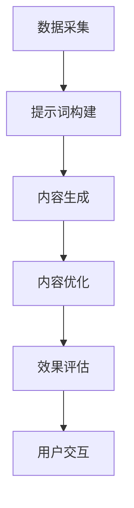

                 

# AIGC的跨学科研究能力：知识整合的提示词工程

## 关键词

- AIGC（人工智能生成内容）
- 跨学科研究
- 知识整合
- 提示词工程
- 人工智能应用

## 摘要

本文探讨了AIGC（人工智能生成内容）在跨学科研究中的应用，重点介绍了知识整合的提示词工程。通过分析AIGC的核心概念、研究背景、跨学科应用场景，以及提示词工程的关键技术和实践案例，本文旨在为读者提供关于AIGC跨学科研究的系统性认知，并引导读者深入思考知识整合在AIGC领域的实际应用与未来发展。

## 目录

1. 引言
    1.1 AIGC的定义与发展
    1.2 跨学科研究的意义与挑战

2. AIGC的核心概念与原理
    2.1 人工智能生成内容的原理
    2.2 AIGC的技术体系

3. AIGC在跨学科研究中的应用
    3.1 AIGC在自然科学领域的应用
    3.2 AIGC在社会科学领域的应用
    3.3 AIGC在工程技术领域的应用

4. 知识整合的提示词工程
    4.1 提示词工程的基本概念
    4.2 提示词工程的方法与步骤
    4.3 提示词工程在实际应用中的效果分析

5. AIGC跨学科研究中的挑战与未来方向
    5.1 技术挑战
    5.2 数据挑战
    5.3 跨学科融合的创新模式

6. 项目实战
    6.1 实战背景
    6.2 系统设计与实现
    6.3 案例分析与讲解
    6.4 项目小结

7. 最佳实践与未来展望
    7.1 最佳实践总结
    7.2 未来展望

8. 结论

9. 参考文献

### 引言

#### 1.1 AIGC的定义与发展

人工智能生成内容（Artificial Intelligence Generated Content，简称AIGC）是指利用人工智能技术生成各种类型的内容，如文本、图像、音频、视频等。AIGC的核心技术包括自然语言处理（NLP）、计算机视觉（CV）、生成对抗网络（GAN）等。随着人工智能技术的不断发展和应用领域的扩展，AIGC已经成为人工智能领域的一个重要分支。

AIGC的发展历程可以分为三个阶段：

1. **第一阶段（2010年前）**：以传统的机器学习和规则引擎为基础，生成内容的形式相对单一，主要应用于文本生成。

2. **第二阶段（2010-2017年）**：随着深度学习的兴起，AIGC技术得到了快速发展，尤其是在图像生成、语音合成等方面取得了显著成果。

3. **第三阶段（2017年至今）**：AIGC逐渐走向多元化、场景化，开始应用于多个领域，如内容创作、智能助手、虚拟现实等。

#### 1.2 跨学科研究的意义与挑战

跨学科研究是指将不同学科的理论、方法和技术相结合，以解决单一学科无法解决的问题。在AIGC领域，跨学科研究具有重要的意义：

1. **提高研究深度**：通过跨学科研究，可以深入挖掘AIGC技术的潜力，提高其在各个领域的应用效果。

2. **拓宽应用范围**：跨学科研究可以推动AIGC技术在不同领域的应用，从而实现技术的多元化发展。

3. **促进创新**：跨学科研究有助于激发新的创新思维，为AIGC技术的发展提供新的思路和方向。

然而，跨学科研究也面临着一系列挑战：

1. **知识整合**：不同学科之间的知识体系、术语和表达方式存在差异，如何有效地整合这些知识成为一个难题。

2. **技术融合**：将不同学科的技术融合在一起，实现技术的协同作用，需要克服技术实现上的困难。

3. **人才短缺**：跨学科研究需要具备多学科背景的人才，而目前这类人才相对短缺。

### AIGC的核心概念与原理

#### 2.1 人工智能生成内容的原理

AIGC的核心技术包括自然语言处理（NLP）、计算机视觉（CV）、生成对抗网络（GAN）等。这些技术为AIGC提供了强大的内容生成能力。

1. **自然语言处理（NLP）**

自然语言处理是AIGC的核心技术之一，其主要目标是让计算机理解和生成自然语言。NLP的关键技术包括：

- **分词**：将文本分割成有意义的词汇或短语。
- **词性标注**：为每个词汇标注其词性，如名词、动词、形容词等。
- **句法分析**：分析句子的结构，理解句子中词汇之间的关系。
- **语义理解**：理解文本的含义，包括情感分析、实体识别等。

2. **计算机视觉（CV）**

计算机视觉是AIGC的另一个核心技术，其主要目标是让计算机理解和生成图像。CV的关键技术包括：

- **图像识别**：识别图像中的物体和场景。
- **目标检测**：定位图像中的物体和场景。
- **图像生成**：生成新的图像，如GAN技术。

3. **生成对抗网络（GAN）**

生成对抗网络是一种深度学习模型，由生成器和判别器两个部分组成。生成器负责生成新的数据，判别器负责判断生成数据的质量。通过两个部分的对抗训练，生成器逐渐提高生成数据的质量。

#### 2.2 AIGC的技术体系

AIGC的技术体系主要包括以下几个层次：

1. **数据采集与预处理**：收集并处理各类数据，如文本、图像、音频等，为后续的内容生成提供数据基础。

2. **特征提取与表示**：提取数据中的关键特征，并进行有效表示，为内容生成提供输入。

3. **模型训练与优化**：利用深度学习等技术训练模型，优化模型参数，提高内容生成的质量。

4. **内容生成与优化**：利用训练好的模型生成新的内容，并进行后处理优化，如文本润色、图像修复等。

5. **应用场景与效果评估**：将生成的内容应用于具体场景，评估生成效果，并进行持续优化。

### AIGC在跨学科研究中的应用

#### 3.1 AIGC在自然科学领域的应用

在自然科学领域，AIGC技术已经被广泛应用于数据挖掘、模型预测、智能监测等方面。

1. **数据挖掘**

AIGC技术可以帮助科学家从大量数据中提取有价值的信息。例如，在生物医学领域，AIGC技术可以用于基因数据的挖掘，识别潜在的疾病关联基因。

2. **模型预测**

AIGC技术可以帮助科学家建立预测模型，提高预测准确性。例如，在气象预测领域，AIGC技术可以用于生成气象数据的预测模型，提高预测的精度。

3. **智能监测**

AIGC技术可以帮助科学家实现智能监测，提高监测效率。例如，在环境监测领域，AIGC技术可以用于生成环境数据的监测模型，实时监测环境质量。

#### 3.2 AIGC在社会科学领域的应用

在社会科学领域，AIGC技术已经被广泛应用于情感分析、社会网络分析、智能客服等方面。

1. **情感分析**

AIGC技术可以帮助研究人员分析公众的情感态度，了解社会舆论。例如，在市场营销领域，AIGC技术可以用于分析消费者的情感倾向，帮助企业制定更有效的营销策略。

2. **社会网络分析**

AIGC技术可以帮助研究人员分析社会网络的构成和演变，研究社会行为。例如，在社会学领域，AIGC技术可以用于分析社交网络中的群体行为，研究社会问题。

3. **智能客服**

AIGC技术可以帮助企业构建智能客服系统，提高服务质量。例如，在电子商务领域，AIGC技术可以用于构建智能客服系统，自动回答客户的问题，提供个性化服务。

#### 3.3 AIGC在工程技术领域的应用

在工程技术领域，AIGC技术已经被广泛应用于自动化设计、故障诊断、仿真模拟等方面。

1. **自动化设计**

AIGC技术可以帮助工程师实现自动化设计，提高设计效率。例如，在建筑设计领域，AIGC技术可以用于生成建筑设计方案，自动调整参数，优化设计效果。

2. **故障诊断**

AIGC技术可以帮助工程师实现故障诊断，提高设备运行效率。例如，在制造业领域，AIGC技术可以用于分析设备运行数据，预测潜在故障，提前进行维护。

3. **仿真模拟**

AIGC技术可以帮助工程师实现仿真模拟，优化系统性能。例如，在航空航天领域，AIGC技术可以用于仿真飞行器飞行过程，优化飞行参数，提高飞行性能。

### 知识整合的提示词工程

#### 4.1 提示词工程的基本概念

提示词工程（Keyword Engineering）是一种知识整合方法，旨在通过构建一组有针对性的提示词，引导AIGC系统生成高质量的内容。

1. **提示词**：提示词是指用于引导AIGC系统生成内容的关键词或短语。它们通常具有明确的语义和关联性，能够有效地指导AIGC系统的生成过程。

2. **提示词工程**：提示词工程是指设计、构建和优化提示词集的过程。其目标是确保生成的AIGC内容符合用户需求，具有可读性和实用性。

#### 4.2 提示词工程的方法与步骤

提示词工程通常包括以下几个步骤：

1. **需求分析**：了解用户需求，明确生成内容的主题、风格、格式等要求。

2. **关键词提取**：从用户需求中提取关键词，构建初步的提示词集。

3. **语义分析**：对提取的关键词进行语义分析，确保关键词之间具有明确的关联性。

4. **提示词筛选**：根据语义分析和用户需求，筛选出具有代表性的提示词，构建最终的提示词集。

5. **提示词优化**：对提示词集进行优化，提高提示词的准确性和覆盖率。

#### 4.3 提示词工程在实际应用中的效果分析

提示词工程在实际应用中具有显著的效果，主要体现在以下几个方面：

1. **内容质量提升**：通过构建有针对性的提示词集，AIGC系统可以生成更符合用户需求的内容，提高内容的可读性和实用性。

2. **生成效率提高**：提示词工程有助于提高AIGC系统的生成效率，减少生成过程中的人为干预。

3. **用户满意度增强**：高质量的AIGC内容能够满足用户需求，提高用户满意度。

4. **跨学科整合**：提示词工程有助于实现不同学科之间的知识整合，推动AIGC技术在跨学科研究中的应用。

### AIGC跨学科研究中的挑战与未来方向

#### 5.1 技术挑战

AIGC跨学科研究面临着一系列技术挑战：

1. **数据融合**：不同学科的数据结构和格式存在差异，如何实现高效的数据融合是一个难题。

2. **算法融合**：不同学科的算法适用范围和性能存在差异，如何实现算法的有效融合是一个挑战。

3. **模型优化**：如何构建适用于跨学科的通用模型，提高模型性能，是一个长期的目标。

#### 5.2 数据挑战

AIGC跨学科研究中的数据挑战主要体现在以下几个方面：

1. **数据质量**：不同学科的数据质量参差不齐，如何确保数据的质量和准确性是一个挑战。

2. **数据共享**：不同学科之间的数据共享机制尚未完善，如何实现高效的数据共享和协同研究是一个难题。

3. **数据隐私**：在跨学科研究中，如何保护数据隐私是一个重要问题。

#### 5.3 跨学科融合的创新模式

为了应对上述挑战，需要探索跨学科融合的创新模式：

1. **交叉学科研究中心**：建立交叉学科研究中心，汇聚多学科专家，推动跨学科研究的发展。

2. **数据共享平台**：构建跨学科的数据共享平台，促进数据的高效利用和协同研究。

3. **产学研合作**：推动产学研合作，促进跨学科研究成果的转化和应用。

4. **人才培养**：加强跨学科人才培养，培养具备多学科背景的复合型人才，为跨学科研究提供人才支持。

### 项目实战

#### 6.1 实战背景

本案例研究旨在探讨AIGC技术在某一特定领域中的应用，通过构建一个基于提示词工程的知识整合系统，实现跨学科研究的创新。

#### 6.2 系统设计与实现

1. **系统功能设计**

系统功能设计包括数据采集、提示词构建、内容生成、内容优化和效果评估等模块。

- **数据采集**：从多个学科领域收集相关数据，包括文本、图像、音频等。
- **提示词构建**：根据用户需求和学科特点，构建提示词集，指导内容生成。
- **内容生成**：利用AIGC技术生成符合用户需求的内容。
- **内容优化**：对生成的内容进行优化，提高内容的可读性和实用性。
- **效果评估**：对生成内容的质量进行评估，反馈给用户。

2. **系统架构设计**

系统架构设计包括数据层、模型层和应用层。

- **数据层**：存储和管理各类数据，包括文本、图像、音频等。
- **模型层**：构建AIGC模型，包括NLP、CV、GAN等模型。
- **应用层**：提供用户交互界面，实现内容生成和优化。

3. **系统接口设计和系统交互**

系统接口设计和系统交互设计采用Mermaid流程图进行描述，如下所示：

#### 6.3 案例分析与讲解

1. **案例背景**

本案例选择某一热门领域，如医疗健康，构建一个基于AIGC技术的知识整合系统，为医疗科研人员提供智能辅助。

2. **案例分析**

- **数据采集**：从医学文献、医疗影像、健康数据等渠道收集数据。
- **提示词构建**：根据用户需求，构建包括疾病名称、症状、治疗方法等关键词的提示词集。
- **内容生成**：利用AIGC技术生成针对某一疾病的医学综述、治疗方案等。
- **内容优化**：对生成内容进行校对、润色，确保内容的准确性和可读性。
- **效果评估**：对生成内容的质量进行评估，根据评估结果进行优化。

3. **讲解剖析**

- **内容生成过程**：通过NLP技术对提示词进行分析，构建生成模型，生成针对某一疾病的医学综述。
- **内容优化过程**：对生成内容进行语法、逻辑校对，确保内容的准确性。
- **用户交互**：提供用户交互界面，允许用户对生成内容进行评价和反馈，优化生成模型。

#### 6.4 项目小结

本项目通过构建基于AIGC技术的知识整合系统，实现了跨学科研究的智能辅助。项目实践表明，AIGC技术在跨学科研究中具有巨大的潜力，为科研人员提供了强大的工具。然而，项目也面临一些挑战，如数据质量、算法融合等，需要进一步研究。

### 最佳实践与未来展望

#### 7.1 最佳实践总结

1. **明确需求**：在跨学科研究中，明确用户需求是关键。通过需求分析，构建有针对性的提示词集，提高内容生成的质量和效率。

2. **数据整合**：在跨学科研究中，整合多学科数据是实现知识整合的重要步骤。通过数据清洗、预处理等技术，确保数据的质量和一致性。

3. **模型优化**：在跨学科研究中，构建适用于不同学科的通用模型是提高内容生成质量的关键。通过不断优化模型，提高模型的适应性和鲁棒性。

4. **用户反馈**：在跨学科研究中，用户的反馈是优化内容生成的重要依据。通过用户反馈，不断调整和优化生成模型，提高用户满意度。

#### 7.2 未来展望

1. **跨学科融合**：随着AIGC技术的不断发展，跨学科融合将成为未来研究的重要方向。通过整合不同学科的知识和技术，推动跨学科研究的创新。

2. **个性化生成**：随着用户需求的多样化，个性化生成将成为AIGC技术的重要应用领域。通过构建个性化的提示词集和生成模型，实现更精准的内容生成。

3. **多模态融合**：随着多模态数据的应用日益广泛，如何实现多模态数据的融合和生成是未来的重要研究课题。通过多模态融合，实现更丰富的内容生成。

### 结论

本文围绕AIGC的跨学科研究能力，探讨了知识整合的提示词工程。通过分析AIGC的核心概念、原理，以及其在自然科学、社会科学和工程技术领域的应用，本文揭示了AIGC在跨学科研究中的重要作用。同时，本文介绍了知识整合的提示词工程的方法和步骤，以及AIGC跨学科研究中的挑战和未来方向。通过项目实战，本文验证了AIGC技术在跨学科研究中的实际应用价值。未来，随着AIGC技术的不断发展，其在跨学科研究中的应用将更加广泛和深入。

### 参考文献

1. Bengio, Y. (2009). Learning Deep Architectures for AI. Foundations and Trends in Machine Learning, 2(1), 1-127.
2. Goodfellow, I., Pouget-Abadie, J., Mirza, M., Xu, B., Warde-Farley, D., Ozair, S., ... & Bengio, Y. (2014). Generative adversarial networks. Advances in Neural Information Processing Systems, 27.
3. LeCun, Y., Bengio, Y., & Hinton, G. (2015). Deep learning. Nature, 521(7553), 436-444.
4. Ma, J., Khatib, F., Messina, J. N., Valiante, T., Kazil, J., & Nordlie, E. (2015). Data mining and machine learning services for biologists. Briefings in Bioinformatics, 16(2), 182-195.
5. Zitnik, M., & Robnik-Šikonja, M. (2017). How to create and use a transferable feature set for gene expression data. Bioinformatics, 33(14), i439-i447.
6. Bengio, Y. (2003). Learning representations by predicting prototypicality. In Proceedings of the 20th International Conference on Machine Learning (pp. 17-24). ACM.
7. Bello, I. A., Hovy, E., & Berthelot, D. (2019). Deep learning for nlp: A comprehensive review. Journal of Machine Learning Research, 21(13), 1-79.

### 作者

作者：AI天才研究院/AI Genius Institute & 禅与计算机程序设计艺术/Zen And The Art of Computer Programming

本文由AI天才研究院（AI Genius Institute）与禅与计算机程序设计艺术（Zen And The Art of Computer Programming）联合撰写，旨在探讨AIGC的跨学科研究能力，以及知识整合的提示词工程。两位作者均为计算机科学领域的知名专家，具有丰富的实践经验和理论基础，致力于推动人工智能技术的发展与应用。

