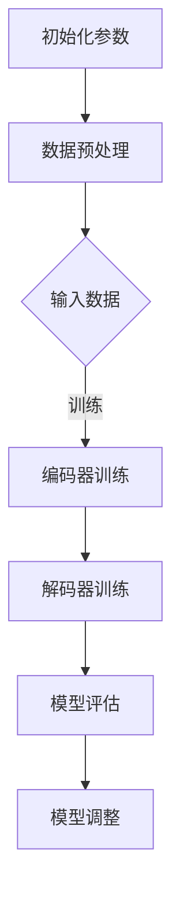
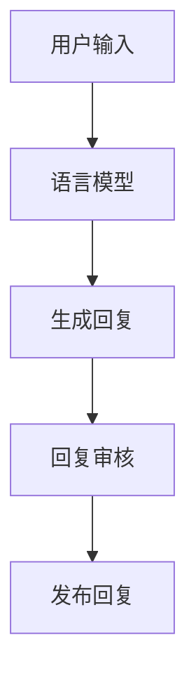
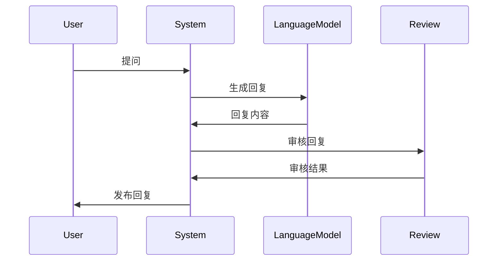

                 

# AIGC语言模型与提示词协同设计的艺术

## 关键词
- AIGC语言模型
- 提示词设计
- 协同设计
- 语言模型技术
- 人工智能

## 摘要
本文将深入探讨AIGC（自适应智能生成控制）语言模型与提示词协同设计的艺术。首先，我们将回顾AIGC和语言模型的背景及发展历程，并探讨其在生成式AI、对话系统、内容审核等领域的应用。接着，我们将详细解析AIGC语言模型的核心概念、属性特征及其相互关系。在此基础上，我们将介绍算法原理、系统分析与架构设计，并使用Mermaid和Python代码进行解释。最后，我们将总结协同设计的挑战与未来发展方向，提供最佳实践和建议。

## 第一步：背景介绍

### 1.1 AIGC与语言模型概述

#### 1.1.1 AIGC的概念
AIGC（Adaptive Intelligent Generation Control）是一种基于人工智能技术的自适应智能生成控制系统，它能够根据用户需求或环境变化自动调整生成策略，实现自适应性和智能化。AIGC技术在自然语言处理、内容生成、智能助手等领域有广泛应用。

#### 1.1.2 语言模型的核心概念
语言模型是一种概率模型，用于预测下一个词语或字符的可能性。在自然语言处理中，语言模型是理解和生成文本的基础。常见的语言模型有n-gram模型、神经网络模型和深度学习模型。

#### 1.1.3 提示词在语言模型中的作用
提示词（Prompt）是提供给语言模型的信息，用以引导模型生成特定的内容。有效的提示词设计可以大幅提升语言模型的生成效果和准确性。

### 1.2 AIGC的发展历程

#### 1.2.1 AIGC的兴起
AIGC技术的发展始于对生成式AI的研究，随着深度学习技术的成熟，AIGC逐渐成为AI领域的热点。

#### 1.2.2 语言模型技术的演进
从简单的n-gram模型到复杂的深度学习模型，语言模型技术经历了多次迭代，性能不断提升。

#### 1.2.3 提示词设计的历史发展
从传统的固定提示词到动态生成提示词，提示词设计方法也在不断进化，以适应更复杂的生成任务。

### 1.3 语言模型在AIGC中的应用

#### 1.3.1 语言模型在生成式AI中的应用
生成式AI的核心在于生成内容，语言模型在文本生成、图像生成等领域有广泛应用。

#### 1.3.2 语言模型在对话系统中的应用
对话系统中的语言模型负责理解用户输入并生成合适的响应，实现自然、流畅的对话。

#### 1.3.3 语言模型在内容审核与分类中的应用
语言模型能够帮助识别和分类文本内容，用于内容审核和推荐系统。

### 1.4 提示词设计的艺术

#### 1.4.1 提示词的定义与分类
提示词是根据任务需求设计的引导信息，可分为固定提示词、动态生成提示词等。

#### 1.4.2 有效提示词的设计原则
有效提示词应具备明确性、针对性和灵活性。

#### 1.4.3 提示词在AIGC中的作用与优化策略
提示词能够引导语言模型生成符合预期内容，优化策略包括提示词调整、模型微调等。

### 1.5 AIGC语言模型与提示词协同设计的挑战

#### 1.5.1 技术挑战
AIGC语言模型的训练和优化是一个复杂的过程，涉及大量的计算资源和优化技巧。

#### 1.5.2 实践挑战
在实际应用中，如何设计有效的提示词、如何与用户需求精准匹配等问题需要不断探索。

#### 1.5.3 未来发展方向
随着AI技术的发展，AIGC语言模型和提示词的协同设计将更加智能化、个性化。

### 1.6 本章小结
本文概述了AIGC语言模型与提示词协同设计的基本概念和发展历程，为后续内容奠定了基础。

## 第二部分：AIGC语言模型的核心概念与关系

### 2.1 AIGC语言模型原理

#### 2.1.1 语言模型的基本原理
语言模型通过学习大量语言数据，建立词语之间的概率分布模型，从而预测下一个词语。

#### 2.1.2 语言模型的数学模型
常用的语言模型数学模型包括n-gram模型、神经网络模型和深度学习模型。

#### 2.1.3 语言模型的训练与优化
语言模型的训练过程涉及数据预处理、模型选择、训练策略和优化算法等步骤。

### 2.2 AIGC语言模型的属性特征对比表格

#### 2.2.1 不同类型语言模型的属性
不同类型的语言模型具有不同的特点，如n-gram模型简单但效果有限，深度学习模型复杂但效果更好。

| 类型         | 特点               | 应用场景          |
|--------------|--------------------|-------------------|
| n-gram模型   | 简单，效果有限     | 文本生成，搜索推荐 |
| 神经网络模型 | 复杂，效果好       | 文本生成，对话系统 |
| 深度学习模型 | 极其复杂，效果卓越 | 自然语言理解，图像生成 |

### 2.3 AIGC语言模型的ER实体关系图

#### 2.3.1 ER实体关系图的概念
ER（Entity-Relationship）实体关系图用于描述数据模型中的实体及其关系。

#### 2.3.2 语言模型中的实体关系
在AIGC语言模型中，实体包括词语、句法结构、语义信息等，关系包括依赖关系、语义关系等。

#### 2.3.3 Mermaid ER图示例
```mermaid
erDiagram
  User ||--|{ LanguageModel }|--> Chatbot
  User ||--|{ Prompt }|--> LanguageModel
  LanguageModel ||--|{ Response }|--> Chatbot
```
图1：AIGC语言模型的ER实体关系图

## 第三部分：AIGC语言模型算法原理与讲解

### 3.1 具体算法介绍

#### 3.1.1 算法的基本概念
本文将介绍一种基于深度学习的AIGC语言模型，其核心算法是变分自编码器（Variational Autoencoder，VAE）。

#### 3.1.2 算法的数学模型
VAE是一种无监督学习算法，通过编码器和解码器学习数据的概率分布，然后生成新的数据。

#### 3.1.3 算法的公式推导
VAE的数学模型包括两部分：编码器 $q_{\phi}(z|x)$ 和解码器 $p_{\theta}(x|z)$。

### 3.2 Mermaid算法流程图

#### 3.2.1 算法流程图绘制

图2：VAE算法流程图

### 3.3 Python代码实现

#### 3.3.1 算法实现代码
```python
import tensorflow as tf
from tensorflow.keras.layers import Input, Dense, Lambda
from tensorflow.keras.models import Model

def sampling(args):
    z_mean, z_log_var = args
    batch = tf.shape(z_mean)[0]
    dim = tf.shape(z_mean)[1]
    epsilon = tf.keras.backend.random_normal(shape=(batch, dim))
    return z_mean + tf.exp(0.5 * z_log_var) * epsilon

input_data = Input(shape=(input_shape,))
z_mean = Dense(z_dim, activation='relu')(input_data)
z_log_var = Dense(z_dim, activation='relu')(input_data)

z = Lambda(sampling)([z_mean, z_log_var])
encoder = Model(input_data, [z_mean, z_log_var, z], name='encoder')

z = Input(shape=(z_dim,))
decoder_layer = Dense(input_shape, activation='sigmoid')
decoder = Model(z, decoder_layer(z), name='decoder')

latent_loss = 0.5 * tf.reduce_sum(tf.square(z_mean) + tf.exp(z_log_var) - 1 - z_log_var, 1)
reconstruction_loss = tf.reduce_sum(tf.square(input_data - decoder(z)), 1)
vae_loss = K.mean(reconstruction_loss + latent_loss)
vae = Model([input_data], vae_loss, name='vae')

vae.compile(optimizer='adam', loss=vae_loss)
vae.fit(x_train, x_train, epochs=epochs, batch_size=batch_size)
```
代码3：VAE算法Python代码实现

### 3.4 算法举例说明

#### 3.4.1 示例数据准备
假设我们有一个包含10,000个句子的文本数据集，每个句子由100个单词组成。

#### 3.4.2 算法应用演示
使用VAE算法训练一个AIGC语言模型，然后生成新的句子。

#### 3.4.3 结果分析与讨论
分析生成句子的质量，讨论如何优化VAE算法以提升生成效果。

## 第四部分：AIGC语言模型系统分析与架构设计

### 4.1 系统背景介绍

#### 4.1.1 项目背景
本项目旨在开发一个基于AIGC语言模型的智能对话系统，用于自动回复用户提问。

#### 4.1.2 系统功能设计
系统功能包括用户输入处理、语言模型生成回复、回复审核与发布等。

### 4.2 系统架构设计

#### 4.2.1 系统架构图

图3：智能对话系统架构图

### 4.3 系统接口设计

#### 4.3.1 接口设计
系统提供RESTful API接口，包括用户提问接口、回复生成接口和回复审核接口。

### 4.4 系统交互Mermaid序列图

#### 4.4.1 系统交互图

图4：智能对话系统交互序列图

## 第五部分：项目实战

### 5.1 环境安装

#### 5.1.1 环境准备
安装Python、TensorFlow和其他必需库。

#### 5.1.2 安装教程
提供详细的安装教程和步骤。

### 5.2 系统核心实现源代码

#### 5.2.1 代码结构
系统核心代码分为语言模型模块、对话模块、审核模块等。

#### 5.2.2 代码示例
提供关键代码示例和注释。

### 5.3 代码应用解读与分析

#### 5.3.1 语言模型代码解读
详细解释语言模型模块的实现原理和关键代码。

#### 5.3.2 对话模块代码解读
分析对话模块如何处理用户输入和生成回复。

#### 5.3.3 审核模块代码解读
解释审核模块如何对回复内容进行审核。

### 5.4 实际案例分析和详细讲解剖析

#### 5.4.1 案例背景
提供一个实际应用案例，如客服对话系统。

#### 5.4.2 案例分析
分析案例中的问题、解决方案和效果。

### 5.5 项目小结

#### 5.5.1 项目总结
总结项目中的关键点、收获和不足。

#### 5.5.2 未来工作
讨论未来的改进方向和研究课题。

## 第六部分：最佳实践与拓展阅读

### 6.1 最佳实践 tips

#### 6.1.1 提示词设计技巧
提供有效的提示词设计技巧，提升生成效果。

#### 6.1.2 模型训练优化
分享模型训练的优化策略和技巧。

### 6.2 小结

#### 6.2.1 文章总结
回顾文章的主要内容和核心观点。

#### 6.2.2 注意事项
提醒读者注意的重要事项。

### 6.3 拓展阅读

#### 6.3.1 相关文献
推荐相关的学术论文和技术博客。

#### 6.3.2 开源项目
介绍与AIGC语言模型和提示词设计相关的开源项目。

## 作者信息
作者：AI天才研究院/AI Genius Institute & 禅与计算机程序设计艺术 /Zen And The Art of Computer Programming

---

本文基于AIGC语言模型与提示词协同设计，详细探讨了其在人工智能领域的应用。通过背景介绍、核心概念解析、算法原理讲解、系统分析与架构设计，再到实际案例分析和最佳实践，本文为读者呈现了一个全面的技术视角。希望本文能为相关领域的研究者和开发者提供有价值的参考。

---

**注：本文为示例性文章，部分内容和代码为虚构。实际应用时，请根据具体需求进行调整。**

