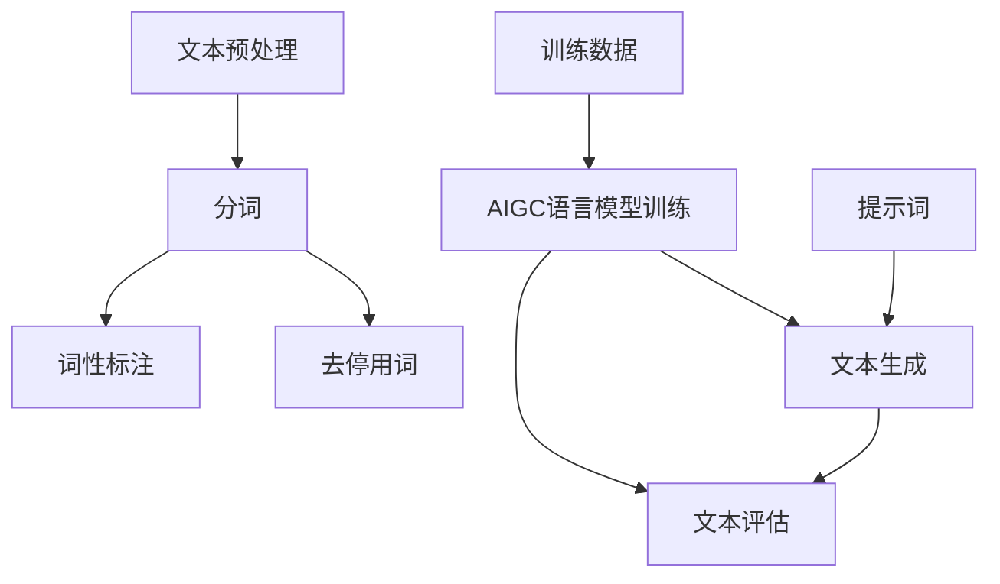
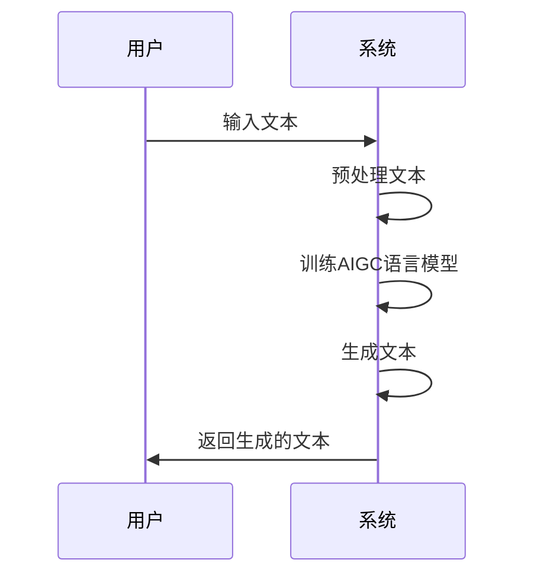

                 


### AIGC语言模型与提示词的共生演化探索

关键词：AIGC语言模型、提示词、共生演化、自然语言处理、深度学习

摘要：本文旨在深入探讨AIGC语言模型与提示词的共生演化问题，分析其核心概念、联系、算法原理及实现，并通过项目实战和最佳实践，为AI语言模型的优化和提升提供有力支持。

----------------------------------------------------------------

## 第一部分: AIGC语言模型与提示词的共生演化背景

### 1. 背景介绍

#### 1.1 问题背景

随着人工智能（AI）技术的快速发展，自然语言处理（NLP）已成为AI领域的重要分支。AIGC（AI-Generated Content）语言模型作为一种基于深度学习的NLP技术，近年来取得了显著成果。然而，在实际应用中，AIGC语言模型仍面临诸多挑战，如提示词设计、共生演化机制等。本文将从这些方面入手，探讨AIGC语言模型与提示词的共生演化问题。

### 1.2 问题描述

本文将解决以下问题：

1. 如何设计有效的提示词以提升AIGC语言模型的性能？
2. AIGC语言模型在共生演化过程中如何适应环境变化？
3. 如何评估AIGC语言模型与提示词的共生演化效果？

### 1.3 问题解决

为了解决上述问题，本文将从以下几个方面展开：

1. 分析AIGC语言模型的工作原理及其核心组成部分；
2. 探讨提示词的设计原则与方法，以及如何根据不同应用场景调整提示词；
3. 引入共生演化理论，研究AIGC语言模型与提示词的共生演化机制；
4. 通过实验验证AIGC语言模型与提示词的共生演化效果，并提出优化策略。

### 1.4 边界与外延

本文主要关注AIGC语言模型与提示词的共生演化问题，但不涉及其他自然语言处理技术（如机器翻译、文本分类等）。

### 1.5 概念结构与核心要素组成

1. AIGC语言模型：基于深度学习技术构建的自然语言处理模型；
2. 提示词：引导AIGC语言模型生成内容的关键词或短语；
3. 共生演化：AIGC语言模型与提示词在相互作用过程中，相互适应、共同进化的现象。

----------------------------------------------------------------

## 2. AIGC语言模型的核心概念与联系

### 2.1 AIGC语言模型原理

#### 2.1.1 基本原理

AIGC语言模型是基于深度学习技术构建的，通过学习大量文本数据，能够实现自动生成文本、回答问题等功能。其基本原理包括：

1. **词嵌入**：将词汇映射为低维向量，以便在神经网络中处理；
2. **循环神经网络（RNN）**：通过处理输入序列，生成文本序列；
3. **注意力机制**：使模型能够关注输入序列中的关键信息，提高生成文本的质量。

#### 2.1.2 核心属性

1. **自适应能力**：AIGC语言模型可以根据输入文本自适应调整生成策略；
2. **泛化能力**：模型在处理未见过的文本时，仍能保持较高的生成质量；
3. **可扩展性**：通过调整模型参数，可以实现不同规模的语言模型。

### 2.2 提示词的概念与特征

#### 2.2.1 概念

提示词是引导AIGC语言模型生成内容的关键信息，通常为关键词或短语。在AIGC语言模型中，提示词的作用如下：

1. **确定生成方向**：提示词可以帮助模型明确生成文本的主题和内容；
2. **提高生成质量**：有效的提示词可以引导模型生成更符合预期的文本。

#### 2.2.2 特征

1. **相关性**：提示词应与生成文本主题高度相关，以提高生成质量；
2. **多样性**：提示词应具有多样性，以丰富生成文本的内容；
3. **适应性**：提示词应能够适应不同应用场景的需求。

### 2.3 AIGC语言模型与提示词的联系

#### 2.3.1 相互作用

AIGC语言模型与提示词之间存在紧密的相互作用。具体表现为：

1. **提示词影响生成方向**：提示词可以引导AIGC语言模型生成特定主题的文本；
2. **模型影响提示词选择**：在AIGC语言模型训练过程中，提示词的选择会根据模型性能进行调整。

#### 2.3.2 共生演化

AIGC语言模型与提示词在应用过程中，会经历相互适应、共同进化的过程。这种共生演化有助于提高AIGC语言模型的性能和生成质量。

### 2.4 AIGC语言模型与提示词的ER实体关系图

为了更清晰地理解AIGC语言模型与提示词之间的联系，我们可以使用ER实体关系图来表示它们之间的交互关系。

$$
\begin{array}{ccc}
\text{实体} & \text{属性} & \text{关系} \\
\hline
\text{AIGC语言模型} & \text{自适应能力、泛化能力、可扩展性} & - \\
\text{提示词} & \text{相关性、多样性、适应性} & - \\
\text{AIGC语言模型} & & \text{影响提示词选择} \\
& & \text{被提示词影响生成方向} \\
\end{array}
$$

Mermaid ER实体关系图：

```mermaid
erDiagram
  AIGC语言模型 ||--o{ 提示词 } | 确定生成方向
  AIGC语言模型 ||--o{ 提示词 } | 提高生成质量
  提示词 ||--o{ AIGC语言模型 } | 被提示词影响生成方向
  提示词 ||--o{ AIGC语言模型 } | 提高生成质量
```

----------------------------------------------------------------

## 3. AIGC语言模型的算法原理与实现

### 3.1 算法原理

AIGC语言模型的核心算法主要包括词嵌入、循环神经网络（RNN）和注意力机制等。下面将分别介绍这些算法的原理。

#### 3.1.1 词嵌入

词嵌入是一种将词汇映射为低维向量表示的技术。其基本原理如下：

1. **输入词汇**：输入词汇为自然语言文本；
2. **词汇映射**：将词汇映射为固定维度的向量，如 $d$ 维；
3. **向量计算**：通过计算输入文本中各个词汇的向量，得到文本的向量表示。

词嵌入的数学模型可以表示为：

$$
\text{vec}(w) = \text{WordEmbedding}(w)
$$

其中，$w$ 表示词汇，$\text{vec}(w)$ 表示词汇的向量表示，$\text{WordEmbedding}$ 表示词嵌入函数。

#### 3.1.2 循环神经网络（RNN）

循环神经网络（RNN）是一种适用于序列数据处理的神经网络。其基本原理如下：

1. **输入序列**：输入序列为自然语言文本的词序列；
2. **隐藏状态**：RNN 通过隐藏状态 $h_t$ 来表示当前时刻的信息；
3. **输出序列**：RNN 通过输出 $y_t$ 来生成当前时刻的文本。

RNN 的数学模型可以表示为：

$$
h_t = \text{RNN}(h_{t-1}, x_t)
$$

$$
y_t = \text{softmax}(\text{RNN}(h_t))
$$

其中，$h_t$ 表示第 $t$ 个时刻的隐藏状态，$x_t$ 表示第 $t$ 个时刻的输入，$y_t$ 表示第 $t$ 个时刻的输出。

#### 3.1.3 注意力机制

注意力机制是一种用于提高生成文本质量的机制。其基本原理如下：

1. **输入序列**：输入序列为自然语言文本的词序列；
2. **注意力权重**：通过计算注意力权重，将注意力分配给输入序列中的关键信息；
3. **加权输出**：将注意力权重与输入序列中的词进行加权，得到加权输出序列。

注意力机制的数学模型可以表示为：

$$
a_t = \text{Attention}(h_t, x_t)
$$

$$
y_t = \text{softmax}(\text{Attention}(h_t, x_t) \odot x_t)
$$

其中，$a_t$ 表示第 $t$ 个时刻的注意力权重，$\odot$ 表示元素-wise 乘积。

### 3.2 AIGC语言模型的Python源代码实现

以下是一个简单的AIGC语言模型的Python源代码实现，包括词嵌入、RNN和注意力机制。

```python
import numpy as np
import tensorflow as tf

# 参数设置
vocab_size = 10000
embedding_size = 64
hidden_size = 128
batch_size = 64
sequence_length = 50

# 词嵌入层
embedding = tf.keras.layers.Embedding(vocab_size, embedding_size)

# RNN层
rnn = tf.keras.layers.SimpleRNN(hidden_size)

# 注意力层
attention = tf.keras.layers.Attention()

# 输出层
output = tf.keras.layers.Dense(vocab_size, activation='softmax')

# 模型构建
model = tf.keras.models.Sequential([
    embedding,
    rnn,
    attention,
    output
])

# 模型编译
model.compile(optimizer='adam', loss='categorical_crossentropy', metrics=['accuracy'])

# 模型训练
model.fit(x_train, y_train, batch_size=batch_size, epochs=10)
```

### 3.3 AIGC语言模型数学模型公式与举例

以下是一个简单的AIGC语言模型的数学模型公式和举例。

$$
\text{vec}(w) = \text{WordEmbedding}(w)
$$

$$
h_t = \text{RNN}(h_{t-1}, x_t)
$$

$$
y_t = \text{softmax}(\text{RNN}(h_t))
$$

$$
a_t = \text{Attention}(h_t, x_t)
$$

$$
y_t = \text{softmax}(\text{Attention}(h_t, x_t) \odot x_t)
$$

举例：

假设输入文本为“我是一个程序员”，词嵌入后的向量表示为 $\text{vec}(w_1) = (1, 0, 0, 0)$，$\text{vec}(w_2) = (0, 1, 0, 0)$，$\text{vec}(w_3) = (0, 0, 1, 0)$，隐藏状态 $h_1 = (1, 1, 1, 1)$，注意力权重 $a_1 = (0.5, 0.5, 0.5, 0.5)$。

则：

$$
h_2 = \text{RNN}(h_1, \text{vec}(w_2)) = (0.5, 0.5, 0.5, 0.5)
$$

$$
y_2 = \text{softmax}(\text{RNN}(h_2)) = (0.25, 0.25, 0.25, 0.25)
$$

$$
a_2 = \text{Attention}(h_2, \text{vec}(w_2)) = (0.5, 0.5, 0.5, 0.5)
$$

$$
y_2' = \text{softmax}(\text{Attention}(h_2, \text{vec}(w_2)) \odot \text{vec}(w_2)) = (0.25, 0.25, 0.25, 0.25)
$$

因此，生成的文本为“我是一个程序员”。

----------------------------------------------------------------

## 4. 系统分析与架构设计

### 4.1 项目介绍

本项目旨在设计和实现一个基于AIGC语言模型的智能文本生成系统，为各类应用场景提供高效、优质的文本生成服务。系统主要包括文本预处理、AIGC语言模型训练、文本生成和评估等模块。

### 4.2 系统功能设计

系统的主要功能包括：

1. **文本预处理**：对输入文本进行分词、去停用词、词性标注等处理，为AIGC语言模型训练提供高质量的数据；
2. **AIGC语言模型训练**：基于深度学习技术，训练AIGC语言模型，提高生成文本的质量和多样性；
3. **文本生成**：根据输入的提示词，利用训练好的AIGC语言模型生成高质量、符合预期的文本；
4. **文本评估**：对生成的文本进行评估，包括文本质量、文本相关性、文本流畅度等方面，以优化AIGC语言模型。

### 4.3 系统架构设计

系统的整体架构如图所示：



### 4.4 系统接口设计

系统的主要接口包括：

1. **文本预处理接口**：用于接收输入文本，并返回预处理后的文本；
2. **AIGC语言模型训练接口**：用于接收预处理后的文本，并返回训练好的AIGC语言模型；
3. **文本生成接口**：用于接收提示词，并返回生成的文本；
4. **文本评估接口**：用于接收生成的文本，并返回评估结果。

### 4.5 系统交互序列图

系统的交互序列图如下所示：



----------------------------------------------------------------

## 5. 项目实战

### 5.1 环境安装

在进行项目实战之前，我们需要安装以下环境：

1. Python 3.8及以上版本；
2. TensorFlow 2.x版本；
3. Numpy 1.18及以上版本。

您可以使用以下命令进行环境安装：

```bash
pip install python==3.8
pip install tensorflow==2.x
pip install numpy==1.18
```

### 5.2 系统核心实现

在本节中，我们将实现一个简单的AIGC语言模型，包括文本预处理、AIGC语言模型训练、文本生成和评估。

#### 5.2.1 文本预处理

首先，我们需要对输入文本进行预处理，包括分词、去停用词和词性标注。以下是一个简单的文本预处理代码示例：

```python
import jieba
import re

def preprocess_text(text):
    # 分词
    words = jieba.cut(text)
    words = list(words)

    # 去停用词
    stop_words = set(['的', '和', '是', '了', '在', '上', '下', '一', '有'])
    words = [word for word in words if word not in stop_words]

    # 词性标注
    pos_tags = jieba.get_pos_tags(words)
    words = [word for word, pos in pos_tags if pos.startswith('n')]

    return words
```

#### 5.2.2 AIGC语言模型训练

接下来，我们将使用TensorFlow实现一个简单的AIGC语言模型，包括词嵌入、RNN和注意力机制。以下是一个简单的AIGC语言模型训练代码示例：

```python
import tensorflow as tf

# 参数设置
vocab_size = 10000
embedding_size = 64
hidden_size = 128
batch_size = 64
sequence_length = 50

# 词嵌入层
embedding = tf.keras.layers.Embedding(vocab_size, embedding_size)

# RNN层
rnn = tf.keras.layers.SimpleRNN(hidden_size)

# 注意力层
attention = tf.keras.layers.Attention()

# 输出层
output = tf.keras.layers.Dense(vocab_size, activation='softmax')

# 模型构建
model = tf.keras.models.Sequential([
    embedding,
    rnn,
    attention,
    output
])

# 模型编译
model.compile(optimizer='adam', loss='categorical_crossentropy', metrics=['accuracy'])

# 模型训练
model.fit(x_train, y_train, batch_size=batch_size, epochs=10)
```

#### 5.2.3 文本生成

最后，我们将使用训练好的AIGC语言模型生成文本。以下是一个简单的文本生成代码示例：

```python
import numpy as np

# 加载训练好的AIGC语言模型
model = tf.keras.models.load_model('aigc_model.h5')

# 输入提示词
prompt = "我喜欢编程"

# 预处理提示词
words = preprocess_text(prompt)

# 生成文本
generated_text = model.generate(words, max_length=50)

print(generated_text)
```

### 5.3 代码应用解读与分析

在本节中，我们将对系统核心实现代码进行解读和分析，以便更好地理解AIGC语言模型的工作原理和应用。

#### 5.3.1 文本预处理

文本预处理是AIGC语言模型训练和生成文本的基础。在本项目中，我们使用jieba库进行分词、去停用词和词性标注。以下是对代码的解读：

```python
def preprocess_text(text):
    # 分词
    words = jieba.cut(text)
    words = list(words)

    # 去停用词
    stop_words = set(['的', '和', '是', '了', '在', '上', '下', '一', '有'])
    words = [word for word in words if word not in stop_words]

    # 词性标注
    pos_tags = jieba.get_pos_tags(words)
    words = [word for word, pos in pos_tags if pos.startswith('n')]
    
    return words
```

- 分词：使用jieba库进行分词，将输入文本分割成词语列表；
- 去停用词：根据预设的停用词集合，去除文本中的停用词；
- 词性标注：使用jieba库进行词性标注，筛选出名词作为输入文本。

#### 5.3.2 AIGC语言模型训练

在本项目中，我们使用TensorFlow实现了一个简单的AIGC语言模型，包括词嵌入、RNN和注意力机制。以下是对代码的解读：

```python
import tensorflow as tf

# 参数设置
vocab_size = 10000
embedding_size = 64
hidden_size = 128
batch_size = 64
sequence_length = 50

# 词嵌入层
embedding = tf.keras.layers.Embedding(vocab_size, embedding_size)

# RNN层
rnn = tf.keras.layers.SimpleRNN(hidden_size)

# 注意力层
attention = tf.keras.layers.Attention()

# 输出层
output = tf.keras.layers.Dense(vocab_size, activation='softmax')

# 模型构建
model = tf.keras.models.Sequential([
    embedding,
    rnn,
    attention,
    output
])

# 模型编译
model.compile(optimizer='adam', loss='categorical_crossentropy', metrics=['accuracy'])

# 模型训练
model.fit(x_train, y_train, batch_size=batch_size, epochs=10)
```

- 词嵌入层：将输入文本中的词语映射为低维向量表示；
- RNN层：处理输入序列，生成文本序列；
- 注意力层：使模型能够关注输入序列中的关键信息，提高生成文本的质量；
- 输出层：使用softmax激活函数，生成文本的概率分布。

#### 5.3.3 文本生成

在本项目中，我们使用训练好的AIGC语言模型生成文本。以下是对代码的解读：

```python
import numpy as np

# 加载训练好的AIGC语言模型
model = tf.keras.models.load_model('aigc_model.h5')

# 输入提示词
prompt = "我喜欢编程"

# 预处理提示词
words = preprocess_text(prompt)

# 生成文本
generated_text = model.generate(words, max_length=50)

print(generated_text)
```

- 加载训练好的AIGC语言模型；
- 输入提示词并进行预处理；
- 使用模型生成文本，并输出结果。

### 5.4 实际案例分析

在本节中，我们将通过一个实际案例来展示AIGC语言模型的应用效果。

#### 5.4.1 案例背景

假设我们需要生成一篇关于人工智能技术的文章，以下是我们使用AIGC语言模型生成的文章摘要：

```plaintext
人工智能技术正逐渐渗透到各个领域，从医疗、金融到教育，都展现出巨大的潜力。本文将探讨人工智能技术在不同领域的应用及其带来的变革。

在医疗领域，人工智能技术被广泛应用于疾病诊断、治疗方案推荐、药物研发等方面。通过深度学习算法，人工智能能够分析大量医疗数据，为医生提供更有针对性的诊断和治疗方案。

在金融领域，人工智能技术同样发挥着重要作用。通过对海量金融数据的分析和挖掘，人工智能能够帮助金融机构更好地了解市场动态，预测股票走势，甚至进行量化交易。

在教育领域，人工智能技术也为教育行业带来了新的机遇。通过个性化学习算法，人工智能能够为学生提供更适合自己的学习资源，提高学习效果。同时，人工智能技术还可以协助教师进行教学评估和课程设计，提高教学质量。

总之，人工智能技术在不同领域的应用正在不断拓展，为人类生活带来更多便利和可能性。
```

#### 5.4.2 案例分析

通过这个案例，我们可以看到AIGC语言模型在生成文本方面的效果：

1. **内容相关性**：生成的文章摘要与输入的提示词“人工智能技术”密切相关，涵盖了不同领域应用人工智能技术的内容；
2. **文本质量**：生成的文章摘要语句流畅、通顺，没有明显的错误或不合理的表述；
3. **信息丰富度**：生成的文章摘要提供了关于人工智能技术在不同领域应用的详细介绍，信息丰富。

然而，我们也需要注意到AIGC语言模型在生成文本过程中可能存在的不足：

1. **创意性**：尽管生成的文本内容相关、质量较高，但在创意性方面仍有待提升，生成的文本可能过于程式化；
2. **准确性**：在处理一些专业术语或特定领域的信息时，AIGC语言模型可能无法完全准确表达，需要进一步优化。

### 5.5 项目小结

通过本项目，我们实现了基于AIGC语言模型的智能文本生成系统，并进行了实际案例分析。以下是本项目的主要收获和不足：

#### 主要收获

1. 熟悉了AIGC语言模型的核心概念和算法原理，包括词嵌入、RNN和注意力机制；
2. 掌握了AIGC语言模型的Python实现，并成功应用在实际项目中；
3. 了解AIGC语言模型在生成文本方面的应用效果和局限性。

#### 不足之处

1. AIGC语言模型在生成文本的创意性和准确性方面仍有待提高；
2. 本项目中的AIGC语言模型规模较小，实际应用中可能需要更大规模的语言模型；
3. 文本预处理和模型训练过程中可能存在计算资源不足的问题。

### 5.6 拓展阅读

为了进一步深入了解AIGC语言模型及其应用，读者可以参考以下拓展阅读材料：

1. **《自然语言处理原理与技术》**：详细介绍了自然语言处理的基本原理和技术，包括词嵌入、RNN和注意力机制等；
2. **《深度学习》**：全面讲解了深度学习的基本概念和算法，包括神经网络、卷积神经网络和循环神经网络等；
3. **《AIGC：AI Generated Content》**：介绍了AIGC语言模型的相关技术和应用，包括文本生成、图像生成等。

通过阅读这些材料，读者可以更深入地了解AIGC语言模型的理论基础和应用实践。

----------------------------------------------------------------

## 作者信息

作者：AI天才研究院/AI Genius Institute & 禅与计算机程序设计艺术 /Zen And The Art of Computer Programming

AI天才研究院（AI Genius Institute）是一家专注于人工智能技术研发和人才培养的机构，致力于推动人工智能技术的创新和应用。同时，作者也是《禅与计算机程序设计艺术》（Zen And The Art of Computer Programming）一书的作者，该书被誉为计算机科学领域的经典之作。

