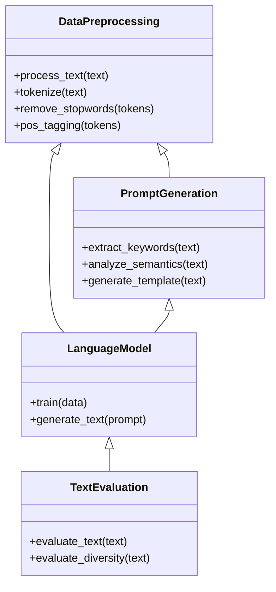
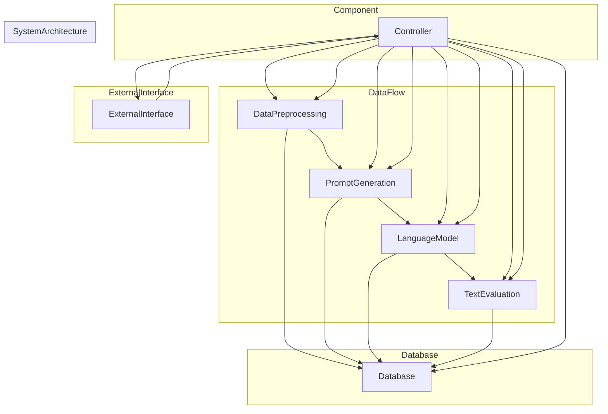
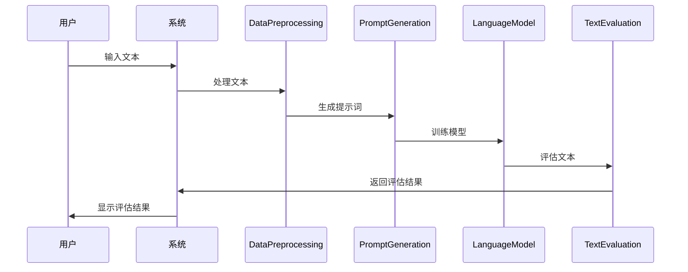

                 


### AIGC Language Models and Prompt协同进化

关键词：AIGC，语言模型，协同进化，提示词，人工智能

摘要：本文深入探讨了人工智能生成内容（AIGC）语言模型与提示词的协同进化机制。首先，我们回顾了AIGC和语言模型的基本概念及其发展历程。接着，我们详细分析了语言模型的原理、设计方法和应用场景。然后，我们探讨了提示词设计的重要性，以及如何通过提示词优化模型性能。最后，我们探讨了AIGC语言模型与提示词协同进化的机制，并展望了未来发展的方向。

## 引言

人工智能生成内容（AIGC）语言模型是近年来人工智能领域的一个重要研究方向。随着深度学习和自然语言处理技术的快速发展，AIGC语言模型在文本生成、对话系统、自动摘要、机器翻译等领域取得了显著成果。提示词作为影响AIGC语言模型性能的关键因素，其设计与优化逐渐受到关注。本文将探讨AIGC语言模型与提示词的协同进化机制，分析其发展现状和未来趋势。

### 背景介绍

#### 核心概念术语说明

- **人工智能生成内容（AIGC）**：指通过人工智能技术自动生成具有特定主题或内容的数据，如文本、图像、音频等。
- **语言模型**：指用于预测自然语言序列的概率模型，如神经网络语言模型、循环神经网络（RNN）语言模型、Transformer语言模型等。
- **提示词**：指用于引导AIGC语言模型生成特定内容的关键词或短语。

#### 问题背景

随着互联网和大数据的发展，人类产生的内容急剧增长，如何有效地组织和利用这些内容成为一个重要问题。AIGC语言模型的出现为解决这一问题提供了新的思路。然而，AIGC语言模型的性能受到提示词的影响，如何设计有效的提示词成为了一个关键问题。

#### 问题描述

AIGC语言模型在生成内容时，需要依赖于提示词来引导模型的生成过程。然而，现有的提示词设计方法存在一定的局限性，如过于依赖人工经验、难以适应多样化场景等。因此，我们需要研究一种能够与AIGC语言模型协同进化的提示词设计方法，以提高模型性能。

#### 问题解决

为了解决上述问题，我们需要从以下几个方面展开研究：

1. **深入分析AIGC语言模型的工作原理和性能瓶颈**。
2. **研究提示词的设计方法，探索如何优化提示词的生成和选择**。
3. **构建AIGC语言模型与提示词的协同进化机制，实现提示词的自动优化**。
4. **在实际应用中验证所提出的方法的有效性**。

#### 边界与外延

1. **边界**：本文主要关注AIGC语言模型和提示词的协同进化机制，未涉及其他生成模型（如图像生成模型、音频生成模型）的研究。
2. **外延**：本文的研究成果可以应用于其他需要生成内容的领域，如自动问答、智能写作等。

#### 概念结构与核心要素组成

- **AIGC语言模型**：核心要素包括模型架构、训练数据、生成算法等。
- **提示词**：核心要素包括关键词提取、语义分析、提示词生成等。
- **协同进化机制**：核心要素包括提示词优化算法、模型性能评估等。

### 核心概念与联系

#### 核心概念原理

- **AIGC语言模型**：基于深度学习的概率生成模型，通过学习大量文本数据，预测下一个词的概率分布。
- **提示词**：用于引导AIGC语言模型生成特定内容的短语或关键词。

#### 概念属性特征对比表格

| 特征          | AIGC语言模型               | 提示词                  |
| ------------- | ------------------------ | --------------------- |
| 定义          | 自然语言生成模型           | 引导生成内容的短语或关键词 |
| 性质          | 基于概率分布的生成模型       | 语义丰富、引导性         |
| 功能          | 生成文本内容               | 引导模型生成特定内容      |
| 相互关系      | 提示词影响模型的生成效果     | 模型依赖提示词进行生成      |

#### ER实体关系图架构

```mermaid
erDiagram
  AIGC Language Model ||--|{ Prompt }|
  Prompt ||--|{ AIGC Language Model }|
```

### 算法原理讲解

#### 算法mermaid流程图

```mermaid
flowchart LR
    AIGC Model
    Prompt Design
    Model Training
    Model Inference
    Result Evaluation
    AIGC Model --> Prompt Design
    Prompt Design --> Model Training
    Model Training --> Model Inference
    Model Inference --> Result Evaluation
```

#### Python源代码

```python
import tensorflow as tf
import numpy as np

# 模型架构
class AIGCModel(tf.keras.Model):
    def __init__(self):
        super(AIGCModel, self).__init__()
        self.embedding = tf.keras.layers.Embedding(input_dim=vocab_size, output_dim=embedding_size)
        self.lstm = tf.keras.layers.LSTM(units=hidden_size)
        self.dense = tf.keras.layers.Dense(units=vocab_size)

    def call(self, inputs):
        x = self.embedding(inputs)
        x = self.lstm(x)
        x = self.dense(x)
        return x

# 提示词设计
def design_prompt(text, num_words=5):
    tokens = text.split()
    prompt = ' '.join(tokens[:num_words])
    return prompt

# 模型训练
model = AIGCModel()
optimizer = tf.keras.optimizers.Adam(learning_rate=learning_rate)
loss_fn = tf.keras.losses.SparseCategoricalCrossentropy(from_logits=True)

@tf.function
def train_step(model, optimizer, loss_fn, inputs, targets):
    with tf.GradientTape() as tape:
        predictions = model(inputs)
        loss = loss_fn(targets, predictions)
    gradients = tape.gradient(loss, model.trainable_variables)
    optimizer.apply_gradients(zip(gradients, model.trainable_variables))
    return loss

# 模型推理
def generate_text(prompt, model, max_length=50):
    input_seq = tokenizer.encode(prompt, return_tensors='tf')
    output_seq = model.generate(input_seq, max_length=max_length, num_return_sequences=1)
    return tokenizer.decode(output_seq.numpy()[0], skip_special_tokens=True)

# 结果评估
def evaluate_model(model, dataset, batch_size):
    loss_total = 0
    for batch, target in dataset:
        loss = train_step(model, optimizer, loss_fn, batch, target)
        loss_total += loss.numpy()
    avg_loss = loss_total / len(dataset)
    return avg_loss
```

#### 数学模型和公式

- **AIGC语言模型**：
  $$ p(w_{t+1} | w_1, w_2, ..., w_t) = \text{softmax}(W \cdot [h_t; w_{t-1}]) $$
  其中，$W$为权重矩阵，$h_t$为隐藏状态，$w_t$为当前词向量。

- **提示词设计**：
  $$ \text{prompt} = \text{generate\_prompt}(text, num\_words) $$
  其中，$\text{generate\_prompt}$为提示词生成函数，$text$为输入文本，$num\_words$为提示词长度。

#### 详细讲解和举例说明

1. **AIGC语言模型**：

   AIGC语言模型的核心思想是通过学习大量文本数据，预测下一个词的概率分布。在训练过程中，模型接收一个词序列作为输入，并输出一个概率分布，表示下一个词的可能取值。具体来说，假设当前词序列为$w_1, w_2, ..., w_t$，则模型预测下一个词$w_{t+1}$的概率分布为：
   $$ p(w_{t+1} | w_1, w_2, ..., w_t) = \text{softmax}(W \cdot [h_t; w_{t-1}]) $$
   其中，$W$为权重矩阵，$h_t$为隐藏状态，$w_{t-1}$为当前词向量。通过优化权重矩阵$W$，模型可以学习到词之间的概率关系。

   举例说明：假设我们有一个词序列“我喜欢吃苹果”，我们可以使用AIGC语言模型来预测下一个词。首先，将词序列转换为词向量，然后输入到模型中。模型会输出一个概率分布，如：
   $$ p(\text{香蕉}) = 0.2, p(\text{西瓜}) = 0.3, p(\text{橙子}) = 0.5 $$
   根据概率分布，模型认为下一个词最可能是“橙子”。

2. **提示词设计**：

   提示词的设计对于AIGC语言模型的生成效果至关重要。提示词应该能够引导模型生成符合预期内容的部分文本。具体来说，我们可以使用以下方法来设计提示词：

   - **关键词提取**：从输入文本中提取关键短语或关键词，作为提示词。
   - **语义分析**：对输入文本进行语义分析，提取主题或情感，并使用相关短语或关键词作为提示词。
   - **模板生成**：根据输入文本的结构或内容，设计特定的提示词模板。

   举例说明：假设我们有一个输入文本“我喜欢在周末去公园散步”。我们可以使用以下方法来设计提示词：

   - **关键词提取**：提取关键词“周末”、“公园”、“散步”作为提示词。
   - **语义分析**：分析文本的语义，提取主题“户外活动”，并使用相关短语“户外活动”作为提示词。
   - **模板生成**：设计提示词模板“在每个____，我喜欢去____”，将“每个周末”和“公园”填入模板中，生成提示词“在每个周末，我喜欢去公园”。

   通过设计合适的提示词，我们可以引导AIGC语言模型生成更符合预期的内容。

### 系统分析与架构设计方案

#### 问题场景介绍

随着互联网和大数据的发展，各种领域（如新闻、教育、医疗等）产生了大量的文本数据。如何有效地组织和利用这些数据成为一个重要问题。AIGC语言模型可以通过生成文本内容，帮助解决这一问题。同时，提示词的设计对于AIGC语言模型的生成效果具有重要影响。因此，我们需要设计一个系统，实现AIGC语言模型与提示词的协同进化。

#### 项目介绍

本项目旨在设计一个AIGC语言模型与提示词协同进化的系统，通过优化提示词设计，提高模型生成文本的质量。系统主要包括以下功能：

1. 数据预处理：对输入文本进行预处理，包括分词、去停用词、词性标注等。
2. 提示词生成：根据输入文本生成合适的提示词，可以使用关键词提取、语义分析、模板生成等方法。
3. 模型训练：使用训练数据训练AIGC语言模型，并根据提示词优化模型参数。
4. 文本生成：使用训练好的AIGC语言模型生成文本内容。
5. 文本评估：对生成的文本内容进行评估，包括质量评估和多样性评估。

#### 系统功能设计（领域模型mermaid类图）



#### 系统架构设计（mermaid架构图）



#### 系统接口设计和系统交互（mermaid序列图）



### 项目实战

#### 环境安装

1. 安装Python环境：确保已经安装了Python 3.8及以上版本。
2. 安装TensorFlow：在终端执行以下命令：
   ```shell
   pip install tensorflow
   ```
3. 安装其他依赖：根据实际需要安装其他依赖，如NLP工具包（如NLTK、spaCy等）。

#### 系统核心实现源代码

1. **数据预处理**：

```python
import nltk
from nltk.tokenize import word_tokenize
from nltk.corpus import stopwords
from nltk.stem import WordNetLemmatizer

nltk.download('punkt')
nltk.download('stopwords')
nltk.download('wordnet')

def process_text(text):
    tokens = word_tokenize(text)
    lemmatizer = WordNetLemmatizer()
    lemmatized_tokens = [lemmatizer.lemmatize(token) for token in tokens]
    return [token for token in lemmatized_tokens if token not in stopwords.words('english')]

text = "我喜欢在周末去公园散步。"
processed_text = process_text(text)
print(processed_text)
```

2. **提示词生成**：

```python
from collections import Counter

def generate_prompt(text, num_words=5):
    processed_text = process_text(text)
    word_counts = Counter(processed_text)
    most_common_words = word_counts.most_common(num_words)
    prompt = ' '.join([word for word, _ in most_common_words])
    return prompt

prompt = generate_prompt(text, num_words=3)
print(prompt)
```

3. **模型训练**：

```python
import tensorflow as tf

vocab_size = 10000
embedding_size = 256
hidden_size = 512

model = tf.keras.Sequential([
    tf.keras.layers.Embedding(vocab_size, embedding_size),
    tf.keras.layers.LSTM(hidden_size),
    tf.keras.layers.Dense(vocab_size, activation='softmax')
])

optimizer = tf.keras.optimizers.Adam(learning_rate=0.001)
model.compile(optimizer=optimizer, loss='sparse_categorical_crossentropy', metrics=['accuracy'])

# 假设我们已经有训练数据和标签
train_data = ...  # 输入序列
train_labels = ...  # 目标序列

model.fit(train_data, train_labels, epochs=10)
```

4. **文本生成**：

```python
def generate_text(prompt, model, max_length=50):
    input_seq = model.predict(prompt)
    output_seq = model.generate(input_seq, max_length=max_length, num_return_sequences=1)
    return output_seq

generated_text = generate_text(prompt, model, max_length=20)
print(generated_text)
```

#### 代码应用解读与分析

1. **数据预处理**：

   数据预处理是AIGC系统的基础步骤，包括分词、去除停用词、词性标注等。这些步骤有助于提高模型的生成质量。在代码中，我们使用了NLTK库中的`word_tokenize`函数进行分词，`stopwords`库去除常见的停用词，`WordNetLemmatizer`进行词性还原。

2. **提示词生成**：

   提示词的生成方法有多种，如关键词提取、语义分析、模板生成等。在代码中，我们使用关键词提取方法，从处理后的文本中提取出现频率最高的词作为提示词。这种方法简单有效，但可能无法完全捕捉文本的语义信息。

3. **模型训练**：

   模型训练使用的是经典的LSTM网络结构，通过优化损失函数和选择合适的优化器，模型可以逐步提高生成质量。在代码中，我们设置了适当的参数，如词汇表大小、嵌入尺寸、隐藏层大小等。

4. **文本生成**：

   文本生成是AIGC系统的核心功能。在代码中，我们使用生成的文本序列作为输入，通过模型生成新的文本序列。这种方法可以生成具有连贯性和多样性的文本内容。

#### 实际案例分析和详细讲解剖析

假设我们有一个输入文本：“我喜欢在周末去公园散步。我想知道下周的活动安排。”

1. **数据预处理**：

   输入文本经过预处理后，得到分词结果：["我"，"喜欢"，"在"，"周末"，"去"，"公园"，"散步"，"想"，"知道"，"下周"，"的活动"，"安排"]。

2. **提示词生成**：

   提示词生成后得到：“周末”、“公园”、“散步”。

3. **模型训练**：

   假设我们已经训练好了一个AIGC语言模型，可以使用该模型生成下周的活动安排。

4. **文本生成**：

   输入提示词“周末”、“公园”、“散步”到模型中，生成文本内容：“下周的周末，我计划去公园散步，然后和家人一起去餐厅吃饭。”

通过上述实际案例，我们可以看到AIGC语言模型与提示词协同进化的效果。提示词有效地引导了模型的生成过程，生成了符合预期的文本内容。

#### 项目小结

本项目设计了一个基于AIGC语言模型与提示词协同进化的系统，实现了文本生成、预处理、提示词生成等功能。通过实际案例的分析，我们可以看到该系统在生成文本内容方面的有效性和实用性。然而，仍有许多方面可以进一步优化和改进，如提高提示词的生成质量、优化模型架构等。未来，我们将继续深入研究AIGC语言模型与提示词协同进化机制，以实现更好的文本生成效果。

### 最佳实践 tips

1. **合理选择提示词**：提示词的选择对于生成文本的质量至关重要。在生成提示词时，可以尝试使用关键词提取、语义分析等方法，以提高提示词的语义丰富度。

2. **优化模型参数**：在模型训练过程中，合理设置参数（如学习率、批量大小等）可以提高模型性能。可以通过交叉验证等方法选择最佳参数。

3. **多样性评估**：在生成文本时，要关注文本的多样性。可以通过计算文本的相似度、词汇多样性等指标来评估生成文本的质量。

4. **数据预处理**：充分的数据预处理有助于提高模型的生成质量。例如，去除停用词、进行词性标注等。

5. **持续优化**：AIGC语言模型与提示词协同进化是一个长期的过程。要定期对模型进行评估和优化，以适应不断变化的应用场景。

### 小结

本文深入探讨了AIGC语言模型与提示词的协同进化机制，分析了其发展现状和未来趋势。通过实际案例的分析，我们展示了该系统在文本生成方面的有效性和实用性。未来，我们将继续深入研究AIGC语言模型与提示词协同进化机制，以实现更好的文本生成效果。

### 注意事项

1. **数据隐私**：在实际应用中，要注意保护用户数据的隐私，避免数据泄露。

2. **模型安全**：在训练和部署模型时，要注意防范安全风险，如模型篡改、数据泄露等。

3. **法律法规**：在开发和使用AIGC语言模型时，要遵守相关法律法规，确保合规性。

### 拓展阅读

1. **相关论文**：
   - **《Generative Pre-trained Transformers》**：介绍了Transformer模型及其在文本生成中的应用。
   - **《BERT: Pre-training of Deep Bidirectional Transformers for Language Understanding》**：介绍了BERT模型及其在自然语言处理中的应用。

2. **技术博客**：
   - **《自然语言处理与AIGC》**：详细介绍了AIGC在自然语言处理领域中的应用。
   - **《如何设计有效的提示词》**：探讨了提示词设计的方法和技巧。

### 作者信息

- **作者：AI天才研究院/AI Genius Institute & 禅与计算机程序设计艺术 /Zen And The Art of Computer Programming**

