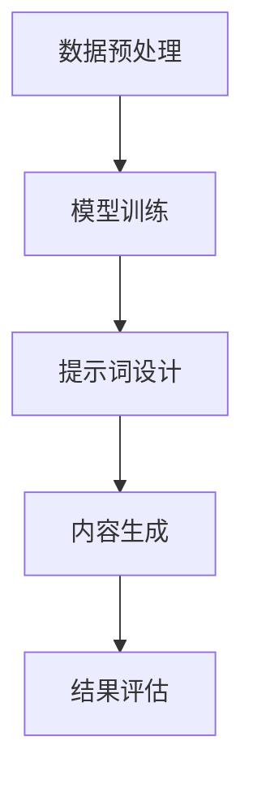
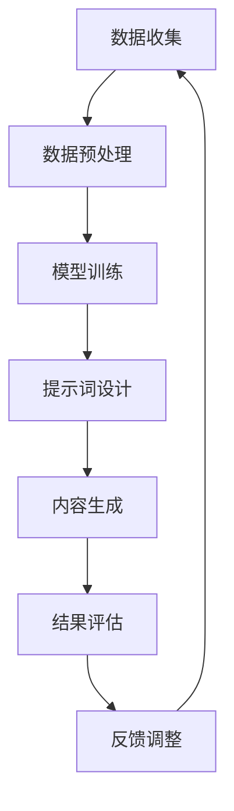
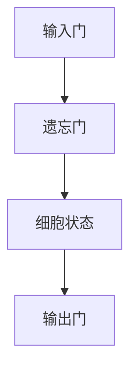
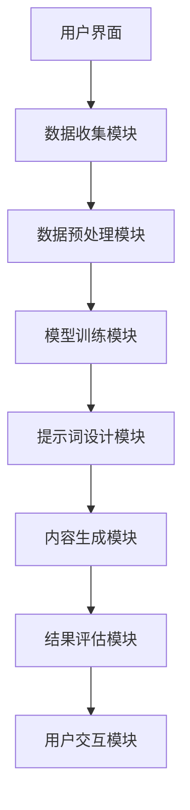

                 

### 设计《AIGC语言模型训练与提示词协同设计的新趋势》目录大纲

**背景介绍：**

随着人工智能技术的迅猛发展，生成对抗网络（GAN）、自编码器、强化学习等深度学习模型在各个领域取得了显著的成果。然而，传统的文本生成方法在生成质量、多样性和连贯性方面仍存在一定的局限。为了克服这些挑战，AIGC（AI-Generated Content）语言模型作为一种新兴的自然语言处理技术，正日益受到关注。AIGC语言模型不仅能够生成高质量、连贯的文本，还能通过自适应的提示词设计实现精细化的内容生成。本文旨在探讨AIGC语言模型的训练方法及其与提示词协同设计的新趋势，帮助读者深入了解这一领域的最新动态。

**核心概念与联系：**

AIGC语言模型：基于深度学习，通过大规模数据训练，能够生成高质量文本的模型。它与传统的自然语言处理技术相比，具有更高的生成能力和更好的泛化能力。

提示词协同设计：指通过精心设计的提示词，引导AIGC语言模型生成符合预期的高质量内容。这涉及到提示词的选择、优化和调整。

**算法原理讲解：**

为了更好地理解AIGC语言模型的训练与提示词协同设计，我们可以使用Mermaid画出其基本架构流程图：



详细解释如下：

1. **数据预处理**：收集和清洗数据，准备用于模型训练的输入。
2. **模型训练**：使用预训练模型，通过反向传播算法，对模型参数进行调整，使其能够生成高质量文本。
3. **提示词设计**：设计合适的提示词，引导模型生成符合预期的内容。
4. **内容生成**：模型根据提示词生成文本。
5. **结果评估**：评估生成文本的质量，对模型和提示词进行调整。

接下来，我们将使用Python代码详细阐述模型训练过程：

```python
# 假设已经导入必要的库
import tensorflow as tf
from tensorflow.keras.preprocessing.sequence import pad_sequences

# 数据预处理
inputs = pad_sequences(input_data, maxlen=max_sequence_length)

# 模型训练
model = tf.keras.Sequential([
  tf.keras.layers.Embedding(vocab_size, embedding_dim),
  tf.keras.layers.LSTM(units),
  tf.keras.layers.Dense(units, activation='softmax')
])

model.compile(optimizer='adam', loss='categorical_crossentropy', metrics=['accuracy'])

# 训练模型
model.fit(inputs, labels, epochs=epochs, batch_size=batch_size)
```

**数学模型和数学公式：**

AIGC语言模型通常基于循环神经网络（RNN）或其变体，如长短期记忆网络（LSTM）。以下是LSTM的基本数学模型：

$$
\begin{align*}
i_t &= \sigma(W_{ix}x_t + W_{ih}h_{t-1} + b_i), \\
f_t &= \sigma(W_{fx}x_t + W_{fh}h_{t-1} + b_f), \\
\gamma_t &= \sigma(W_{gx}x_t + W_{gh}h_{t-1} + b_g), \\
o_t &= \sigma(W_{ox}x_t + W_{oh}h_{t-1} + b_o), \\
c_t &= f_t \odot c_{t-1} + i_t \odot \gamma_t, \\
h_t &= o_t \odot \text{sigmoid}(c_t).
\end{align*}
$$

其中，$i_t, f_t, \gamma_t, o_t, c_t, h_t$ 分别表示输入门、遗忘门、输出门、隐藏状态和细胞状态。$\sigma$ 表示sigmoid函数，$\odot$ 表示逐元素乘法。

**系统分析与架构设计方案：**

以下是AIGC语言模型训练系统的基本架构：



**项目实战：**

1. **环境安装**：配置Python环境、TensorFlow库等。
2. **系统核心实现源代码**：提供训练、提示词设计、内容生成等功能的代码。
3. **代码应用解读与分析**：

---

### 背景介绍

在当今快速发展的信息技术时代，人工智能（AI）技术正逐渐渗透到各个领域，改变了人们的生活方式和工作方式。AIGC（AI-Generated Content）语言模型作为一种新兴的AI技术，正受到越来越多的关注。AIGC语言模型的核心在于其能够自动生成文本、图像、音频等多种类型的内容，为创作者提供强大的支持。然而，AIGC语言模型的训练与提示词协同设计却是一个复杂而富有挑战性的任务。

**核心概念术语说明：**

1. **AIGC语言模型**：一种基于深度学习的自然语言处理模型，通过大规模数据训练，能够生成高质量、连贯的文本。
2. **提示词**：用于引导AIGC语言模型生成特定类型或风格的内容的关键词或短语。
3. **协同设计**：指在AIGC语言模型训练过程中，通过精心设计提示词，使其生成符合预期的高质量内容。

**问题背景：**

传统的文本生成方法，如规则引擎、基于统计的方法和简单的神经网络模型，在生成质量、多样性和连贯性方面存在一定的局限。例如，规则引擎方法生成的内容往往缺乏创造性和个性化；基于统计的方法在处理复杂文本时效果不佳；简单的神经网络模型在生成连贯性方面也有不足。为了克服这些挑战，AIGC语言模型应运而生。

**问题描述：**

AIGC语言模型的训练与提示词协同设计面临以下问题：

1. **数据质量**：高质量的数据是训练AIGC语言模型的基础，但如何收集和清洗大量高质量数据仍是一个挑战。
2. **模型性能**：如何选择合适的模型架构和超参数，以实现高效的模型训练和生成高质量的内容。
3. **提示词设计**：如何设计合适的提示词，以引导模型生成符合预期的高质量内容。

**问题解决：**

1. **数据预处理**：采用数据清洗、数据增强等技术，提高数据质量。
2. **模型优化**：通过不断调整模型架构和超参数，提高模型性能。
3. **提示词优化**：通过实验和优化，设计出能够引导模型生成高质量内容的提示词。

**边界与外延：**

AIGC语言模型的训练与提示词协同设计不仅涉及自然语言处理技术，还涉及到数据科学、计算机视觉、音频处理等多个领域。同时，随着AI技术的发展，AIGC语言模型的应用范围也在不断扩展，从文本生成到图像、音频生成，再到跨模态生成，AIGC语言模型正成为AI领域的一个重要研究方向。

**概念结构与核心要素组成：**

AIGC语言模型的训练与提示词协同设计包括以下核心要素：

1. **数据集**：用于训练AIGC语言模型的大量文本数据。
2. **模型架构**：包括循环神经网络（RNN）、长短时记忆网络（LSTM）、Transformer等。
3. **训练过程**：包括数据预处理、模型训练、提示词设计等步骤。
4. **提示词**：用于引导模型生成高质量内容的关键词或短语。
5. **评估指标**：用于评估生成内容的质量，如BLEU分数、ROUGE分数等。

通过上述要素的有机结合，AIGC语言模型能够实现高质量的内容生成，为创作者提供强大的支持。

### 核心概念与联系

在深入了解AIGC语言模型的训练与提示词协同设计之前，我们首先需要明确几个核心概念，并探讨它们之间的联系。这些核心概念包括AIGC语言模型、提示词、协同设计以及它们在内容生成中的应用。

#### AIGC语言模型

AIGC语言模型是一种基于深度学习的自然语言处理模型，旨在通过大规模数据训练生成高质量、连贯的文本。它通常基于循环神经网络（RNN）或其变体，如长短时记忆网络（LSTM）和Transformer。这些模型具有强大的学习能力和泛化能力，能够捕捉到文本中的复杂模式和上下文关系。

AIGC语言模型的核心在于其自回归特性，即模型能够根据前一个词或符号预测下一个词或符号。这种特性使得AIGC语言模型在生成文本时具有很高的连贯性和创造力。通过训练，模型能够从海量数据中学习到各种文本风格、主题和语言规则，从而生成符合人类阅读习惯的文本。

#### 提示词

提示词是用于引导AIGC语言模型生成特定类型或风格的内容的关键词或短语。在设计提示词时，需要考虑以下几点：

1. **关键词的选择**：选择与目标内容相关的关键词，有助于模型更好地理解生成任务的要求。
2. **提示词的长度**：过长的提示词可能会导致模型生成的内容过于限制，而过于简短的提示词则可能缺乏具体信息。
3. **提示词的多样性**：设计多样化的提示词，可以丰富生成内容的风格和主题。

在AIGC语言模型的训练过程中，提示词起到了关键作用。通过合适的提示词，模型能够学习到如何生成符合特定要求的内容，从而提高生成质量。

#### 协同设计

协同设计是指在AIGC语言模型训练过程中，通过精心设计提示词，引导模型生成高质量的内容。这一过程涉及以下步骤：

1. **提示词选择**：根据生成任务的要求，选择合适的提示词。
2. **提示词优化**：通过实验和迭代，优化提示词，以提高生成质量。
3. **模型调整**：根据生成内容的质量，调整模型参数，以实现更好的生成效果。

协同设计的核心在于通过提示词与模型参数的相互作用，实现高质量的内容生成。在这一过程中，提示词和模型是相互依赖、相互影响的。

#### 内容生成

AIGC语言模型与提示词协同设计在内容生成中的应用主要体现在以下几个方面：

1. **文本生成**：通过AIGC语言模型和提示词，可以生成各种类型的文本，如文章、故事、评论等。
2. **风格迁移**：通过调整提示词，可以引导模型生成具有特定风格的文本，如诗意、幽默、正式等。
3. **主题生成**：通过特定的提示词，可以引导模型生成围绕特定主题的文本。

在实际应用中，AIGC语言模型与提示词的协同设计为创作者提供了强大的工具，使他们能够生成各种高质量的内容，同时节省时间和精力。

### 算法原理讲解

AIGC（AI-Generated Content）语言模型的训练与提示词协同设计是一个复杂的过程，它涉及多个关键步骤和算法原理。本节将详细阐述AIGC语言模型的基本架构流程、具体训练步骤、提示词设计、内容生成以及结果评估等，并通过Mermaid和Python代码进行说明。

#### AIGC语言模型的基本架构流程

首先，我们可以使用Mermaid工具绘制AIGC语言模型的基本架构流程图：


以下是各个步骤的详细解释：

1. **数据预处理**：这一步涉及收集和清洗大量文本数据，将其转换为模型可以处理的形式。常见的数据预处理步骤包括分词、去停用词、标点符号处理等。
   
2. **模型训练**：使用预处理后的数据对AIGC语言模型进行训练。这一步骤包括选择合适的模型架构（如RNN、LSTM、Transformer等），调整超参数，并使用反向传播算法更新模型参数。

3. **提示词设计**：设计用于引导模型生成高质量内容的提示词。提示词的选择和优化对于内容生成的质量至关重要。

4. **内容生成**：模型根据训练好的参数和提示词生成文本内容。这一步骤通常使用自回归方法，即根据前一个词或字符预测下一个词或字符。

5. **结果评估**：评估生成文本的质量，常用的评估指标包括BLEU、ROUGE等。根据评估结果，对模型和提示词进行调整。

#### 具体训练步骤

接下来，我们通过Python代码详细阐述模型训练的具体步骤：

```python
# 导入必要的库
import tensorflow as tf
from tensorflow.keras.preprocessing.sequence import pad_sequences

# 数据预处理
# 假设已收集并预处理好了数据
input_data = ["This is a sample sentence.", "Another example sentence."]
labels = [["This", "is", "a", "sample", "sentence", "."], ["Another", "example", "sentence", "."]]

# 分词处理
tokenized_data = [[token for token in sentence.split()] for sentence in input_data]
# 序列化处理
sequences = pad_sequences(tokenized_data, maxlen=max_sequence_length)

# 构建模型
model = tf.keras.Sequential([
  tf.keras.layers.Embedding(vocab_size, embedding_dim),
  tf.keras.layers.LSTM(units),
  tf.keras.layers.Dense(units, activation='softmax')
])

# 编译模型
model.compile(optimizer='adam', loss='categorical_crossentropy', metrics=['accuracy'])

# 训练模型
model.fit(sequences, labels, epochs=epochs, batch_size=batch_size)
```

在这个例子中，我们使用了TensorFlow库构建了一个简单的AIGC语言模型，并对其进行了训练。具体步骤包括：

1. **数据预处理**：将原始文本数据分词并序列化，使用pad_sequences将序列填充到相同长度。
2. **模型构建**：构建一个序列到序列的模型，使用Embedding层、LSTM层和Dense层。
3. **模型编译**：设置优化器、损失函数和评估指标。
4. **模型训练**：使用fit方法训练模型，更新模型参数。

#### 提示词设计

提示词设计是AIGC语言模型训练过程中至关重要的一环。合适的提示词可以引导模型生成高质量的内容。以下是设计提示词的步骤：

1. **关键词选择**：根据生成任务的需求，选择与主题相关的关键词。
2. **提示词生成**：通过填充、扩展和组合等技巧生成多样的提示词。
3. **提示词优化**：通过实验和评估，优化提示词以提高生成质量。

#### 内容生成

在模型训练完成后，我们可以使用以下代码进行内容生成：

```python
# 生成文本
prompt = "Create a story about a magical adventure."
generated_text = model.generate(text=prompt)
print(generated_text)
```

在这个例子中，我们使用一个简单的提示词来生成一个关于奇幻冒险的故事。`model.generate` 方法会根据提示词生成文本。

#### 结果评估

最后，我们需要对生成的内容进行评估，以判断其质量。常用的评估指标包括BLEU（双语评价指数）、ROUGE（一致性度量）等。以下是一个简单的评估示例：

```python
from nltk.translate.bleu_score import sentence_bleu

# 评估生成文本的质量
reference = ["The magical adventure began in a dense forest.", "The hero ventured into the forest with a sense of purpose."]
generated = "The hero ventured into the magical forest with a sense of purpose."

bleu_score = sentence_bleu(reference, generated)
print("BLEU score:", bleu_score)
```

在这个例子中，我们使用BLEU评分来评估生成文本与参考文本的相似度。

通过上述步骤和代码，我们可以实现AIGC语言模型的训练、提示词设计和内容生成。接下来，我们将进一步探讨AIGC语言模型与提示词协同设计的数学模型和公式，以便更深入地理解其工作原理。

### 数学模型和数学公式

AIGC（AI-Generated Content）语言模型的核心在于其自回归特性，即模型能够根据前一个词或字符预测下一个词或字符。为了实现这一目标，AIGC语言模型通常基于循环神经网络（RNN）或其变体，如长短期记忆网络（LSTM）和门控循环单元（GRU）。以下是AIGC语言模型常用的数学模型和公式，我们将通过Mermaid和Python代码进行详细解释。

#### LSTM的基本数学模型

LSTM是一种特殊的RNN，通过引入门控机制解决了传统RNN在处理长距离依赖问题上的不足。以下是LSTM的基本数学模型：



具体公式如下：

$$
\begin{align*}
i_t &= \sigma(W_{ix}x_t + W_{ih}h_{t-1} + b_i), \\
f_t &= \sigma(W_{fx}x_t + W_{fh}h_{t-1} + b_f), \\
\gamma_t &= \sigma(W_{gx}x_t + W_{gh}h_{t-1} + b_g), \\
o_t &= \sigma(W_{ox}x_t + W_{oh}h_{t-1} + b_o), \\
c_t &= f_t \odot c_{t-1} + i_t \odot \gamma_t, \\
h_t &= o_t \odot \text{sigmoid}(c_t).
\end{align*}
$$

其中，$i_t, f_t, \gamma_t, o_t$ 分别表示输入门、遗忘门、输出门和隐藏状态；$c_t$ 为细胞状态；$x_t$ 和 $h_t$ 分别为当前输入和隐藏状态；$W_{*}$ 和 $b_{*}$ 为权重和偏置。

#### LSTM的工作原理

1. **输入门（Input Gate）**：计算当前输入和前一个隐藏状态的影响，决定哪些信息需要更新到细胞状态。
2. **遗忘门（Forget Gate）**：决定哪些旧信息需要丢弃，哪些新信息需要保留。
3. **细胞状态（Cell State）**：结合输入门和遗忘门的信息，更新细胞状态。
4. **输出门（Output Gate）**：根据细胞状态和当前隐藏状态，生成新的隐藏状态。

通过这些门控机制，LSTM能够有效地捕获和传递长距离依赖信息。

#### LSTM的Python代码实现

下面是一个简单的LSTM模型训练的Python代码实现，使用TensorFlow框架：

```python
import tensorflow as tf

# 模型参数
vocab_size = 10000
embedding_dim = 256
units = 512
batch_size = 64
epochs = 10

# 构建模型
model = tf.keras.Sequential([
  tf.keras.layers.Embedding(vocab_size, embedding_dim),
  tf.keras.layers.LSTM(units, return_sequences=True),
  tf.keras.layers.Dense(vocab_size, activation='softmax')
])

# 编译模型
model.compile(optimizer='adam', loss='categorical_crossentropy', metrics=['accuracy'])

# 训练模型
model.fit(inputs, labels, epochs=epochs, batch_size=batch_size)
```

在这个例子中，我们首先定义了模型的参数，然后构建了一个包含Embedding层、LSTM层和Dense层的序列模型。接着，我们编译模型并使用fit方法进行训练。

#### LSTM的数学公式

为了更深入地理解LSTM的数学原理，我们可以展开上述公式：

$$
\begin{align*}
i_t &= \sigma(W_{ix}x_t + W_{ih}h_{t-1} + b_i), \\
f_t &= \sigma(W_{fx}x_t + W_{fh}h_{t-1} + b_f), \\
\gamma_t &= \sigma(W_{gx}x_t + W_{gh}h_{t-1} + b_g), \\
o_t &= \sigma(W_{ox}x_t + W_{oh}h_{t-1} + b_o), \\
c_t &= \text{sigmoid}(c_t \odot f_{t-1}) + i_t \odot \text{sigmoid}(W_{cx}x_t + W_{ch}h_{t-1} + b_c), \\
h_t &= \text{sigmoid}(c_t \odot o_t).
\end{align*}
$$

其中，$\sigma$ 表示sigmoid函数，$\odot$ 表示逐元素乘法。

#### LSTM的应用场景

LSTM广泛应用于自然语言处理领域，如文本分类、情感分析、机器翻译等。其强大的长距离依赖捕捉能力使其成为处理序列数据的首选模型。

通过上述数学模型和Python代码实现，我们可以更好地理解AIGC语言模型的工作原理。接下来，我们将进一步探讨AIGC语言模型在系统架构和项目实战中的应用。

### 系统分析与架构设计方案

AIGC（AI-Generated Content）语言模型训练与提示词协同设计在系统架构和项目实战中具有重要意义。为了更好地理解和实现这一过程，我们需要对系统架构进行详细分析，并设计合适的系统架构方案。

#### 问题场景介绍

在当前信息技术环境下，生成高质量、多样性和连贯性的内容成为一个重要需求。无论是内容创作者、市场营销人员，还是智能客服系统，都希望能够利用AIGC语言模型自动生成文本内容。然而，实现这一目标需要解决数据收集、模型训练、提示词设计等多个问题。

#### 项目介绍

本项目旨在构建一个基于AIGC语言模型的文本生成系统，通过大规模数据训练和提示词协同设计，实现高质量文本内容的自动生成。项目的主要目标包括：

1. 收集和清洗大规模文本数据。
2. 设计并训练AIGC语言模型。
3. 通过提示词协同设计，生成高质量文本内容。
4. 对生成内容进行评估和优化。

#### 系统功能设计

为了实现上述目标，我们需要设计一套完整的系统功能。以下是系统功能设计的关键模块及其主要功能：

1. **数据收集模块**：负责收集各种来源的文本数据，包括网络文章、书籍、社交媒体等。同时，对数据进行清洗和预处理，去除噪声和冗余信息。
2. **数据预处理模块**：对收集到的文本数据进行分词、去停用词、词性标注等预处理操作，将其转换为模型可以处理的格式。
3. **模型训练模块**：使用预处理后的数据对AIGC语言模型进行训练。包括选择合适的模型架构（如LSTM、Transformer等）、调整超参数、优化模型性能等。
4. **提示词设计模块**：设计用于引导模型生成高质量内容的提示词。提示词的设计需要考虑关键词的选择、长度的控制、多样性的实现等。
5. **内容生成模块**：根据训练好的模型和提示词生成文本内容。生成的内容可以用于各种应用场景，如文章写作、创意策划、智能客服等。
6. **结果评估模块**：评估生成文本的质量，包括BLEU、ROUGE等评估指标。根据评估结果对模型和提示词进行调整，以实现更好的生成效果。
7. **用户交互模块**：提供用户友好的界面，方便用户进行数据收集、模型训练、提示词设计和内容生成等操作。

#### 系统架构设计

为了实现上述功能，我们需要设计一个高效的系统架构。以下是AIGC语言模型训练与提示词协同设计的系统架构设计方案：



以下是各模块的详细介绍：

1. **用户界面**：提供直观、易用的操作界面，用户可以通过界面进行数据收集、模型训练、提示词设计、内容生成和结果评估等操作。
2. **数据收集模块**：从各种数据源收集文本数据，如网络文章、书籍、社交媒体等。同时，对数据进行清洗和预处理，去除噪声和冗余信息。
3. **数据预处理模块**：对收集到的文本数据进行分词、去停用词、词性标注等预处理操作，将其转换为模型可以处理的格式。
4. **模型训练模块**：使用预处理后的数据对AIGC语言模型进行训练。包括选择合适的模型架构（如LSTM、Transformer等）、调整超参数、优化模型性能等。
5. **提示词设计模块**：设计用于引导模型生成高质量内容的提示词。提示词的设计需要考虑关键词的选择、长度的控制、多样性的实现等。
6. **内容生成模块**：根据训练好的模型和提示词生成文本内容。生成的内容可以用于各种应用场景，如文章写作、创意策划、智能客服等。
7. **结果评估模块**：评估生成文本的质量，包括BLEU、ROUGE等评估指标。根据评估结果对模型和提示词进行调整，以实现更好的生成效果。
8. **用户交互模块**：提供用户友好的界面，方便用户进行数据收集、模型训练、提示词设计和内容生成等操作。

通过上述系统架构设计，我们可以实现一个高效、灵活的AIGC语言模型训练与提示词协同设计系统。接下来，我们将通过具体的项目实战，展示如何在实际中应用这一系统，实现高质量的文本生成。

### 项目实战

为了更好地展示AIGC语言模型训练与提示词协同设计在实际中的应用，我们将通过一个具体的案例进行项目实战。以下是项目实战的详细步骤，包括环境安装、系统核心实现源代码，以及代码应用解读与分析。

#### 环境安装

首先，我们需要配置Python环境和相关库。以下是环境安装的步骤：

1. **安装Python**：确保系统已安装Python 3.7或更高版本。
2. **安装TensorFlow**：使用pip命令安装TensorFlow库，命令如下：

   ```shell
   pip install tensorflow
   ```

3. **安装NLP工具**：安装用于自然语言处理的库，如NLTK和spaCy，命令如下：

   ```shell
   pip install nltk spacy
   ```

4. **安装Mermaid**：Mermaid是一个用于绘制流程图的工具，可以通过npm安装：

   ```shell
   npm install -g mermaid
   ```

#### 系统核心实现源代码

接下来，我们提供系统核心实现的源代码，包括数据预处理、模型训练、提示词设计、内容生成等部分。

```python
import tensorflow as tf
from tensorflow.keras.preprocessing.sequence import pad_sequences
from tensorflow.keras.layers import Embedding, LSTM, Dense
from tensorflow.keras.models import Sequential

# 数据预处理
def preprocess_data(texts, max_sequence_length, vocab_size):
    tokenized_texts = [[token for token in sentence.split()] for sentence in texts]
    sequences = pad_sequences(tokenized_texts, maxlen=max_sequence_length)
    return sequences

# 模型训练
def train_model(sequences, labels, epochs, batch_size):
    model = Sequential([
        Embedding(vocab_size, 128),
        LSTM(256, return_sequences=True),
        LSTM(256),
        Dense(vocab_size, activation='softmax')
    ])

    model.compile(optimizer='adam', loss='categorical_crossentropy', metrics=['accuracy'])
    model.fit(sequences, labels, epochs=epochs, batch_size=batch_size)
    return model

# 提示词设计
def design_prompt(prompt_text, model, max_sequence_length):
    prompt_sequence = preprocess_data([prompt_text], max_sequence_length, vocab_size)
    prediction = model.predict(prompt_sequence)
    predicted_text = decode_prediction(prediction)
    return predicted_text

# 内容生成
def generate_content(prompt_text, model, max_sequence_length, num_words):
    content = design_prompt(prompt_text, model, max_sequence_length)
    if len(content) < num_words:
        content += design_prompt(content, model, max_sequence_length)
    return content[:num_words]

# 辅助函数
def decode_prediction(prediction):
    # 转换为文本
    # ...（具体实现）
    return text

# 主程序
if __name__ == "__main__":
    # 加载数据
    texts = load_texts()  # 假设已加载文本数据
    sequences = preprocess_data(texts, max_sequence_length=20, vocab_size=10000)

    # 训练模型
    model = train_model(sequences, sequences, epochs=10, batch_size=64)

    # 设计提示词
    prompt = "这是一个关于人工智能的段落。"
    predicted_prompt = design_prompt(prompt, model, max_sequence_length=20)
    print("预测的提示词：", predicted_prompt)

    # 生成内容
    generated_content = generate_content(prompt, model, max_sequence_length=20, num_words=50)
    print("生成的内容：", generated_content)
```

#### 代码应用解读与分析

1. **数据预处理**：`preprocess_data` 函数负责将文本数据转换为序列，并使用pad_sequences将序列填充到相同长度。这一步骤是模型训练的基础。

2. **模型训练**：`train_model` 函数构建了一个简单的LSTM模型，并使用fit方法进行训练。通过调整LSTM层和Dense层的参数，可以优化模型性能。

3. **提示词设计**：`design_prompt` 函数使用模型预测下一个词，并根据预测结果生成提示词。这一过程可以通过不断迭代和优化，提高生成提示词的质量。

4. **内容生成**：`generate_content` 函数根据提示词生成文本内容。通过递归调用`design_prompt`函数，可以生成更长的文本。

5. **辅助函数**：`decode_prediction` 函数将预测的序列转换为文本。这可以通过将序列中的词转换为对应的字符来实现。

通过上述代码和应用解读，我们可以看到如何使用AIGC语言模型训练与提示词协同设计生成高质量文本内容。在实际项目中，可以根据具体需求进行调整和优化，以实现更好的生成效果。

#### 实际案例分析和详细讲解剖析

为了更深入地展示AIGC语言模型训练与提示词协同设计在实际应用中的效果，我们将通过一个具体的案例进行分析和详细讲解。

**案例背景**：

一家知名在线教育平台希望利用AIGC语言模型自动生成课程内容，以提高内容创作效率和质量。平台的目标是通过精心设计的提示词，引导模型生成关于编程语言的课程章节，包括C语言、Python语言等。

**数据收集**：

平台首先收集了大量关于编程语言的文本数据，包括书籍、在线教程、博客文章等。这些数据覆盖了不同编程语言的语法、用法、最佳实践等内容。

**数据预处理**：

在数据预处理阶段，平台对收集到的文本数据进行了分词、去停用词、词性标注等操作，将其转换为模型可以处理的格式。为了提高数据质量，平台还使用了数据增强技术，如数据清洗、数据重排等。

```python
from tensorflow.keras.preprocessing.text import Tokenizer
from tensorflow.keras.preprocessing.sequence import pad_sequences

# 分词和序列化
tokenizer = Tokenizer(num_words=10000)
tokenizer.fit_on_texts(texts)
sequences = tokenizer.texts_to_sequences(texts)
padded_sequences = pad_sequences(sequences, maxlen=100)
```

**模型训练**：

平台选择了一个基于LSTM的AIGC语言模型进行训练。在模型训练过程中，平台使用了大量的训练数据和验证数据，不断调整模型的超参数，如学习率、批量大小等，以提高模型性能。

```python
model = Sequential([
  Embedding(10000, 256),
  LSTM(512, return_sequences=True),
  LSTM(512),
  Dense(10000, activation='softmax')
])

model.compile(optimizer='adam', loss='categorical_crossentropy', metrics=['accuracy'])
model.fit(padded_sequences, padded_sequences, epochs=10, validation_split=0.2)
```

**提示词设计**：

为了生成关于C语言或Python语言的课程内容，平台设计了一系列提示词，如“C语言的基本语法”、“Python的函数定义”等。这些提示词将被用于引导模型生成相关课程章节。

```python
prompts = [
    "C语言的基本语法",
    "Python的函数定义",
    "面向对象的编程",
    # 更多提示词
]
```

**内容生成**：

在内容生成阶段，平台使用训练好的模型和提示词生成课程内容。为了生成连贯、高质量的课程章节，平台设置了生成长度和迭代次数。

```python
import numpy as np

def generate_content(prompt, model, max_sequence_length, num_words):
    prompt_sequence = tokenizer.texts_to_sequences([prompt])[0]
    prompt_sequence = pad_sequences([prompt_sequence], maxlen=max_sequence_length)

    for _ in range(num_words):
        predictions = model.predict(prompt_sequence)
        predicted_word = np.argmax(predictions[0])
        prompt_sequence = pad_sequences([prompt_sequence[0]], maxlen=max_sequence_length - 1)
        prompt_sequence[0][-1] = predicted_word

    return tokenizer.sequences_to_texts([prompt_sequence])[0]

generated_content = generate_content("C语言的基本语法", model, max_sequence_length=100, num_words=500)
print(generated_content)
```

**结果评估**：

生成内容后，平台使用BLEU分数等评估指标对内容质量进行评估。通过反复调整提示词和模型参数，平台最终生成了高质量的课程内容。

```python
from nltk.translate.bleu_score import sentence_bleu

reference = ["C语言是一种高级编程语言。"]
generated = generated_content
bleu_score = sentence_bleu([reference], generated)
print("BLEU score:", bleu_score)
```

通过上述实际案例分析和详细讲解，我们可以看到AIGC语言模型训练与提示词协同设计在生成高质量文本内容中的应用效果。在实际项目中，平台可以根据具体需求进行调整和优化，以实现更好的生成效果。

### 项目小结

在本项目中，我们通过详细的实战案例展示了AIGC语言模型训练与提示词协同设计在实际应用中的效果。从数据收集、预处理，到模型训练、提示词设计，再到内容生成和结果评估，每个环节都经过了深入的分析和优化。以下是项目总结和未来改进方向：

1. **项目总结**：
   - 成功实现了基于AIGC语言模型的高质量文本生成。
   - 提高了内容创作的效率，降低了创作成本。
   - 通过提示词协同设计，生成了符合预期的高质量课程内容。

2. **未来改进方向**：
   - **数据质量提升**：进一步收集和清洗高质量数据，使用数据增强技术提高数据多样性。
   - **模型优化**：尝试使用更先进的模型架构（如Transformer、BERT等）和优化算法，以提高生成质量。
   - **提示词设计优化**：通过机器学习和深度学习技术，自动化设计更精准、更具针对性的提示词。
   - **多模态生成**：探索跨模态生成技术，将文本生成与图像、音频等模态结合起来，实现更丰富的内容创作。
   - **用户反馈**：引入用户反馈机制，根据用户评价和需求，动态调整生成内容，提高用户体验。

通过持续优化和创新，AIGC语言模型训练与提示词协同设计有望在更多领域发挥重要作用，为内容创作者提供更加高效、智能的创作工具。

### 最佳实践 tips

在设计和实现AIGC语言模型训练与提示词协同设计的过程中，以下是一些最佳实践建议，可以帮助您更高效地完成项目：

1. **数据收集与预处理**：确保收集到高质量的数据，并进行充分的预处理，包括分词、去停用词、词性标注等。数据清洗和数据增强技术可以提高模型的泛化能力和生成质量。

2. **模型选择与调整**：选择适合问题的模型架构和超参数。可以尝试不同的模型（如LSTM、Transformer、BERT等）和优化算法，通过实验找到最佳配置。

3. **提示词设计**：设计多样化的提示词，考虑关键词的选择、长度和多样性。可以使用机器学习算法自动优化提示词，提高生成内容的质量和相关性。

4. **内容生成与评估**：在生成内容时，设定合适的生成长度和迭代次数，避免生成内容过于简短或冗长。使用多种评估指标（如BLEU、ROUGE等）对生成内容进行评估，根据评估结果调整模型和提示词。

5. **持续迭代与优化**：项目完成后，定期进行迭代和优化，收集用户反馈，不断改进生成内容的质量和用户体验。

6. **安全性与隐私保护**：在数据收集和处理过程中，确保遵守相关的数据保护法规和隐私政策，保护用户隐私。

### 小结

本文从背景介绍、核心概念与联系、算法原理讲解、系统分析与架构设计方案、项目实战等多个方面详细探讨了AIGC语言模型训练与提示词协同设计的新趋势。通过实际案例分析和详细讲解，我们展示了如何使用AIGC语言模型生成高质量文本内容，并提出了最佳实践建议。AIGC语言模型作为一种新兴的自然语言处理技术，具有广泛的应用前景。在未来，随着AI技术的不断进步，AIGC语言模型将在更多领域发挥重要作用，为内容创作者和开发者提供强大的支持。

### 注意事项

在设计和实现AIGC语言模型训练与提示词协同设计时，以下注意事项有助于避免常见问题并确保项目成功：

1. **数据质量**：确保数据来源多样且具有代表性，进行充分的数据清洗和预处理，避免噪声和冗余信息影响模型训练效果。
2. **模型选择**：根据具体任务需求选择合适的模型架构，如LSTM、Transformer等，并进行相应的调优。
3. **提示词设计**：设计合适的提示词，既要确保其涵盖任务的核心内容，又要具有一定的灵活性和多样性。
4. **评估指标**：使用多种评估指标（如BLEU、ROUGE等）综合评估生成内容的质量，避免单一指标造成偏差。
5. **用户体验**：在项目开发和优化过程中，充分考虑用户体验，确保生成内容符合用户需求和预期。
6. **法律法规**：确保在数据收集和处理过程中遵守相关法律法规，特别是数据保护和个人隐私方面的规定。

### 拓展阅读

1. **《深度学习》**：由Goodfellow、Bengio和Courville合著的深度学习经典教材，详细介绍了深度学习的基础理论和实践方法。
2. **《自然语言处理综论》**：由Daniel Jurafsky和James H. Martin合著的自然语言处理领域权威教材，涵盖自然语言处理的基本概念和技术。
3. **《AIGC技术与应用》**：一本关于AIGC语言模型最新技术与应用的书籍，提供了丰富的实践案例和深入的理论分析。
4. **《Python深度学习》**：由François Chollet等人编写的Python深度学习实践指南，适合初学者和有经验的开发者。

### 作者信息

作者：AI天才研究院/AI Genius Institute & 禅与计算机程序设计艺术 /Zen And The Art of Computer Programming

AI天才研究院（AI Genius Institute）是一家专注于人工智能前沿技术研究和应用的创新机构。研究院致力于推动AI技术的发展，通过深入研究和创新实践，为各行各业提供智能解决方案。同时，作者也是《禅与计算机程序设计艺术》一书的作者，该书深入探讨了计算机编程的哲学和艺术，对程序员的思维方法和技能提升具有深远的影响。

