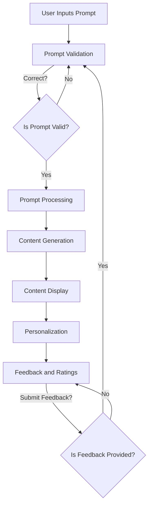

                 

### 1.1.1 Introduction to AIGC and its Significance

#### 1.1.1.1 Definition and Evolution of AIGC

Artificial Intelligence Generated Content (AIGC) is a cutting-edge technology that leverages the power of artificial intelligence (AI) to generate high-quality, human-like content. This encompasses a wide range of applications, including but not limited to, text generation, image creation, video synthesis, and more. AIGC represents a significant evolution in AI, moving beyond simple pattern recognition and rule-based systems to more complex, context-aware models capable of generating content that is both creative and informative.

The origins of AIGC can be traced back to the early days of AI research, where researchers began to explore the potential of neural networks and machine learning algorithms to generate text and images. Over the years, advancements in these technologies, particularly in deep learning and natural language processing (NLP), have enabled the development of sophisticated AIGC systems.

#### 1.1.1.2 Key Concepts and Trends in AIGC

AIGC is underpinned by several key concepts and trends that have driven its rapid evolution. These include:

1. **Neural Networks and Deep Learning**: Neural networks, especially deep learning models such as transformers, have revolutionized the field of AI by enabling the training of complex models capable of understanding and generating human-like content.

2. **Transfer Learning and Pre-Trained Models**: The concept of transfer learning, where a pre-trained model is fine-tuned for a specific task, has been crucial in reducing the amount of data and computational resources required to train AIGC models.

3. **Generative Adversarial Networks (GANs)**: GANs, a type of neural network, have been instrumental in generating realistic images and videos by pitting two networks against each other in a competitive process.

4. **Natural Language Processing (NLP)**: Advances in NLP, including the development of language models like GPT and BERT, have greatly enhanced the ability of AIGC systems to generate coherent and contextually appropriate text.

5. **User Interaction and Personalization**: Modern AIGC systems often incorporate user interaction and personalization features, allowing them to adapt to individual preferences and generate content tailored to specific audiences.

#### 1.1.1.3 Impact on Technology and Society

The impact of AIGC on technology and society is profound and multifaceted. In the technology sector, AIGC has led to the development of new applications and industries, such as AI content generation for marketing, journalism, and entertainment. It has also revolutionized the way software developers and designers create and manage digital content.

On a broader societal level, AIGC has the potential to transform various aspects of daily life. For example, it can improve accessibility to information and services by generating content in multiple languages and formats. Additionally, it has the potential to augment human creativity by assisting in the generation of new ideas and works of art.

However, AIGC also raises important ethical and societal questions. Issues such as the potential for job displacement, the need for transparency and accountability in AI systems, and the impact of AI-generated content on copyright and intellectual property rights are critical areas that require careful consideration.

In summary, AIGC is a powerful and rapidly evolving field that is poised to have a significant impact on technology and society. Its development and application offer exciting opportunities but also come with challenges that must be addressed responsibly.

### 1.1.2 Brief History of Language Models

#### 1.1.2.1 Early Language Models

The journey of language models began in the late 20th century with the advent of machine learning and artificial intelligence. Early language models were primarily based on statistical methods and rule-based systems. One of the earliest and most influential models was the **n-gram model**, which uses the frequencies of n-tuple sequences to predict the next word in a sentence. While simple, n-gram models achieved remarkable success in tasks such as text compression and information retrieval due to their efficiency and effectiveness.

Around the same time, researchers also explored more sophisticated approaches like decision trees and hidden Markov models (HMMs). Decision trees used a series of if-else rules to predict the next word based on the current context. HMMs, on the other hand, used a probabilistic model to capture the temporal dependencies in text. These early models laid the foundation for more advanced language processing techniques.

#### 1.1.2.2 Evolution to Modern Language Models

The real breakthrough in language modeling came with the advent of neural networks, particularly with the introduction of deep learning. The first significant leap was the development of the **Recurrent Neural Network (RNN)**, which could process sequences of data by maintaining a memory of previous inputs. However, RNNs suffered from issues like vanishing gradients, which limited their ability to capture long-term dependencies in text.

To overcome these limitations, researchers turned to **Long Short-Term Memory (LSTM)** networks, a type of RNN designed to overcome the vanishing gradient problem. LSTMs could maintain information over long periods, making them suitable for complex language modeling tasks.

One of the most significant milestones in the evolution of language models was the introduction of **transformer models**. Proposed in 2017, transformers use self-attention mechanisms to weigh the influence of different parts of the input data, allowing them to capture long-range dependencies more effectively than RNNs and LSTMs. Among the most notable transformer models are **BERT** (Bidirectional Encoder Representations from Transformers) and **GPT** (Generative Pre-trained Transformer).

BERT was designed to pre-train deep bidirectional representations from unlabeled text, and its architecture enables it to understand the context of a word by considering the entire input sequence. GPT, on the other hand, is a generative model that can generate human-like text by predicting the next word in a sentence based on the previous context.

#### 1.1.2.3 Significance and Impact

The evolution of language models from early statistical and rule-based systems to modern deep learning-based models has revolutionized the field of natural language processing. Modern language models like BERT and GPT have achieved state-of-the-art performance on a wide range of tasks, including text classification, sentiment analysis, machine translation, and question answering.

The significance of these advancements lies in their ability to process and understand human language more accurately and efficiently. This has led to the development of new applications and services that leverage the power of language models, such as virtual assistants, chatbots, and automated content generation.

Furthermore, the ability of these models to generate coherent and contextually appropriate text has opened up new possibilities in creative fields, such as literature, art, and entertainment. As language models continue to evolve and improve, they are likely to have an even greater impact on society, driving innovation and transforming the way we interact with technology.

### 2.1 Language Model Basics

#### 2.1.1 Key Terminologies

To understand language models, it's essential to familiarize oneself with some key terminologies. These include:

- **Token**: The smallest meaningful unit in a language, similar to a word or a character. In the context of language models, tokens are typically words or subwords.
- **Embedding**: A dense vector representation of a token. Embeddings capture the semantic meaning of tokens and are crucial for language understanding.
- **Neural Network**: A computational model composed of layers of interconnected nodes (neurons) that can learn from data to perform tasks such as classification, regression, and generation.
- **Transformer**: An architecture that uses self-attention mechanisms to weigh the influence of different parts of the input data, allowing it to capture long-range dependencies effectively.
- **Pre-training**: The process of training a language model on a large corpus of text to learn general language patterns and structures.
- **Fine-tuning**: The process of taking a pre-trained language model and further training it on a specific task or dataset to improve its performance on that task.

#### 2.1.2 Fundamental Models: GPT, BERT, etc.

Several fundamental models have played a pivotal role in the development of language models. Here, we'll briefly discuss some of the most notable ones:

- **GPT (Generative Pre-trained Transformer)**: Developed by OpenAI, GPT is a sequence-to-sequence model that generates text by predicting the next token in a sequence. GPT has several versions, with GPT-3 being the latest and most advanced version, boasting 175 billion parameters.

  **Architecture**: GPT is based on the transformer architecture, with multiple layers of self-attention mechanisms. The model is pre-trained on a massive corpus of text using a mask language model (MLM) objective, where tokens in the input sequence are randomly masked, and the model is trained to predict these tokens.

- **BERT (Bidirectional Encoder Representations from Transformers)**: Developed by Google, BERT is a bidirectional transformer model that pre-trains deep bidirectional representations from unlabeled text. BERT's architecture enables it to understand the context of a word by considering the entire input sequence.

  **Architecture**: BERT consists of two parts: a pre-training phase and a fine-tuning phase. During the pre-training phase, BERT is trained to predict masked tokens in the input sequence. During the fine-tuning phase, BERT is fine-tuned on specific tasks using transfer learning.

- **RoBERTa (A Robustly Optimized BERT Pretraining Approach)**: RoBERTa is a variant of BERT that addresses some of the limitations of the original BERT model, such as insufficient training data and suboptimal hyperparameter settings. RoBERTa has achieved state-of-the-art performance on various NLP tasks.

  **Architecture**: RoBERTa follows a similar architecture to BERT, with modifications to its pre-training objectives and hyperparameter settings. The model is trained using a combination of unsupervised and supervised objectives, including next sentence prediction and masked language modeling.

#### 2.1.3 Training Methods and Techniques

Training language models involves several key steps and techniques. Here, we'll outline the main training methods and techniques used in the development of modern language models:

- **Corpus Selection**: The first step in training a language model is selecting a large corpus of text. The quality and diversity of the corpus significantly impact the performance of the model. Commonly used corpora include web pages, news articles, books, and social media posts.

- **Data Preprocessing**: Before training a language model, the text corpus needs to be preprocessed. This involves tasks such as tokenization (splitting text into tokens), lowercasing, removing punctuation, and handling special characters.

- **Token Embeddings**: Once the text corpus is preprocessed, the next step is to convert tokens into numerical embeddings. Embeddings capture the semantic meaning of tokens and are crucial for language understanding. Common embedding techniques include Word2Vec, GloVe, and BERT's own WordPiece tokenizer.

- **Model Architecture**: The choice of model architecture significantly impacts the performance of the language model. Transformer-based architectures, such as BERT and GPT, are currently the most popular due to their ability to capture long-range dependencies in text.

- **Pre-training and Fine-tuning**: Pre-training involves training the language model on a large corpus of text using unsupervised learning. During pre-training, the model learns to predict masked tokens in the input sequence. Fine-tuning involves further training the pre-trained model on specific tasks using supervised learning. This step adapts the model to the specific task and dataset.

- **Regularization and Optimization**: Regularization techniques, such as dropout and weight decay, are used to prevent overfitting and improve the generalization performance of the model. Optimization algorithms, such as Adam and AdamW, are used to adjust the model's parameters during training, optimizing the model's performance.

In conclusion, language models are at the forefront of natural language processing and have revolutionized the way we interact with and process text. Understanding the key terminologies, fundamental models, and training methods is essential for harnessing the power of these models in various applications.

### 2.2 Prompt Engineering

#### 2.2.1 Definition and Importance

Prompt engineering is the process of designing and optimizing the input prompts that guide language models in generating coherent and contextually relevant outputs. At its core, a prompt is a sequence of words or phrases that provide context and direction to the language model, helping it generate responses that align with specific tasks or objectives.

The importance of prompt engineering lies in its ability to significantly impact the performance and utility of language models. Well-crafted prompts can enhance the model's ability to understand and generate meaningful content, making it more effective in a variety of applications. Conversely, poorly designed prompts can lead to irrelevant or incorrect outputs, limiting the model's usefulness.

#### 2.2.2 Types of Prompts

There are several types of prompts commonly used in language model applications. Understanding these types can help in designing effective prompts for different scenarios:

1. **Open-Ended Prompts**: These prompts invite the language model to generate a broad range of responses. They typically include questions or statements that can have multiple answers or interpretations. For example, "Write a story about a mysterious island."

2. **Closed-Ended Prompts**: These prompts are designed to elicit specific, finite responses. They often include yes/no questions or questions with a limited set of possible answers. For example, "What is the capital of France?"

3. **Instruction Prompts**: These prompts provide explicit instructions to the language model, outlining the desired output format, style, or content. They are particularly useful in tasks where the model needs to follow specific guidelines. For example, "Write a persuasive essay supporting the use of renewable energy sources."

4. **Conditional Prompts**: These prompts include conditions or constraints that the language model must satisfy in its responses. They can be used to ensure that the generated content meets specific criteria or requirements. For example, "Generate a list of healthy breakfast ideas that are quick to prepare."

5. **Chain-of-Thought Prompts**: These prompts guide the language model through a structured thought process, encouraging it to generate responses that reflect deeper understanding and logical reasoning. They are often used in educational settings to facilitate critical thinking and problem-solving. For example, "Explain how a lever works, step by step."

#### 2.2.3 Strategies for Effective Prompt Design

To design effective prompts, several strategies can be employed:

1. **Clarity and Specificity**: Ensure that the prompt is clear and specific, providing enough information for the model to generate relevant responses. Vague or ambiguous prompts can lead to unpredictable or irrelevant outputs.

2. **Relevance and Context**: Tailor the prompt to the specific task or domain, ensuring that it provides relevant context and aligns with the desired objectives. This helps the model focus its attention and generate more accurate and useful responses.

3. **Direction and Guidance**: Provide clear directions or instructions to the model, guiding it towards the desired output format, style, or content. This can be particularly useful in tasks where the model needs to follow specific guidelines or adhere to certain constraints.

4. **Chunking and Structure**: Break down complex prompts into smaller, more manageable chunks or steps. This can help the model understand the prompt better and generate more structured and coherent responses.

5. **Feedback and Iteration**: Continuously refine the prompt based on feedback from the generated outputs. If the responses are not meeting expectations, adjust the prompt to better align with the desired outcomes.

6. **Customization and Personalization**: Customize prompts to suit individual users or specific use cases. Personalized prompts can improve the relevance and effectiveness of the generated content.

In conclusion, prompt engineering is a critical aspect of leveraging language models for various applications. By understanding the different types of prompts and employing effective strategies for their design, developers and researchers can enhance the performance and utility of language models, enabling them to generate more coherent and contextually relevant content.

### 3.1 Dataset Preparation

#### 3.1.1 Data Collection

The first crucial step in training a language model is the collection of a suitable dataset. The quality and diversity of the dataset significantly impact the model's performance and its ability to generalize to new, unseen data. Here are key considerations for data collection:

1. **Data Source Selection**: Choose data sources that align with the model's intended application and objectives. Common sources include web pages, news articles, books, academic papers, social media posts, and user-generated content. For instance, if training a language model for medical applications, sources like medical journals and clinical notes would be essential.

2. **Data Quantity and Quality**: Ensure that the dataset is large enough to enable the model to learn effectively from the data. Generally, larger datasets lead to better performance, but quality should not be compromised for quantity. High-quality data should be accurate, relevant, and free from noise or errors.

3. **Data Anonymization and Privacy**: If the dataset includes personal or sensitive information, it is crucial to anonymize the data to protect user privacy. This may involve removing personally identifiable information (PII) and ensuring that the data complies with relevant privacy regulations.

4. **Data Diversification**: Include diverse data from various domains, languages, and cultural contexts to enhance the model's robustness and ability to handle different types of inputs. This helps the model generalize better and avoid biases.

5. **Data Sourcing Ethics**: Ensure that the data collection process adheres to ethical standards, including consent, transparency, and fairness. Avoid using datasets that contain biased or discriminatory content, as these can perpetuate unfair biases in the model.

#### 3.1.2 Data Preprocessing

Once the dataset is collected, it needs to be preprocessed to prepare it for training. Preprocessing is a critical step that involves several tasks:

1. **Tokenization**: Split the text into smaller units, such as words or subwords. Tokenization is the foundation for many subsequent processing steps, as it allows the model to understand and work with the text at a granular level.

2. **Normalization**: Standardize the text by converting all characters to lowercase, removing punctuation, and handling special characters. This ensures consistency in the dataset and helps the model focus on the meaning rather than the form of the text.

3. **Cleaning**: Remove or correct errors, inconsistencies, and noise in the data. This includes correcting spelling mistakes, removing stop words (common words like "and," "the," etc.), and handling misspellings or typos.

4. **Data Augmentation**: Enhance the dataset by creating variations of the original data. Techniques include synonym replacement, back-translation, and synonymization. Data augmentation helps improve the model's robustness and performance by providing a more diverse training dataset.

5. **Handling Imbalanced Data**: If the dataset contains imbalanced classes, techniques such as oversampling (增加少数类别的样本数量), undersampling (减少多数类别的样本数量)，或生成合成样本（合成样本生成技术），可以用于平衡数据分布，提高模型对少数类别的检测能力。

6. **Splitting the Dataset**: Divide the dataset into training, validation, and testing sets. The training set is used to train the model, the validation set is used to tune hyperparameters and evaluate performance during training, and the testing set is used to assess the final performance of the model on unseen data.

#### 3.1.3 Data Quality Assessment

Assessing the quality of the dataset is crucial to ensure that the model learns effectively from the data. Here are key steps in data quality assessment:

1. **Data Profiling**: Analyze the statistical properties of the dataset, such as the distribution of data, missing values, and outliers. This helps identify potential issues that could affect model performance.

2. **Data Verification**: Verify the accuracy and completeness of the dataset by comparing it against known sources or manually reviewing a subset of the data. This step helps ensure that the data is reliable and free from errors.

3. **Bias Detection**: Identify and address biases in the dataset that could lead to unfair or discriminatory outcomes. This involves analyzing the dataset for demographic or contextual biases and taking steps to mitigate them.

4. **Data Stability**: Assess the stability of the dataset by checking for changes in data distribution over time. This is particularly important for datasets that are collected over extended periods or that may be updated frequently.

5. **Model Performance Evaluation**: Use the validation and testing sets to evaluate the performance of the model on different subsets of the data. This helps identify any issues with data quality that may be affecting the model's performance.

In summary, dataset preparation is a complex and critical process that involves careful data collection, preprocessing, and quality assessment. By following these steps, developers and researchers can ensure that their language models are trained on high-quality, diverse, and representative data, leading to better performance and generalizability.

### 3.2 Model Architecture

#### 3.2.1 Model Selection

Selecting the appropriate model architecture is a crucial step in the development of an effective language model. The choice of model can significantly impact the performance, efficiency, and applicability of the model to various tasks. Here, we discuss the key considerations in model selection:

1. **Task Requirements**: The choice of model should align with the specific task requirements. For instance, if the task involves generating human-like text, transformer-based models like GPT or BERT are usually preferred due to their ability to capture long-range dependencies and generate coherent text. On the other hand, if the task involves classification or sentiment analysis, simpler models like logistic regression or support vector machines may be more suitable.

2. **Dataset Characteristics**: The characteristics of the dataset, such as its size and diversity, should influence the choice of model. Models that require large amounts of data, such as GPT-3, are more suitable for tasks involving extensive training data. Conversely, if the dataset is small or highly specialized, simpler models may be more effective.

3. **Computational Resources**: The available computational resources also play a significant role in model selection. Models like GPT-3 are resource-intensive and require significant computational power and memory. In contrast, simpler models like LSTM or even traditional machine learning algorithms may be more feasible for resource-constrained environments.

4. **Performance Goals**: The desired level of performance should guide the choice of model. State-of-the-art models like BERT or GPT-3 often achieve the best performance on various NLP tasks but come with higher computational costs. In some cases, simpler models may be sufficient and more cost-effective, especially if the performance gap is not significant.

5. **Pre-trained Models**: Leveraging pre-trained models can save time and computational resources. Models like BERT and GPT-3 are widely available and have been pre-trained on large corpora, making them ready-to-use for a variety of tasks. These models can be fine-tuned on specific tasks with smaller datasets, providing a good balance between performance and efficiency.

#### 3.2.2 Model Configuration

Once the appropriate model is selected, the next step is to configure the model parameters. This involves setting various hyperparameters that affect the model's behavior and performance. Here are some key configuration considerations:

1. **Learning Rate**: The learning rate determines the size of the updates to the model's parameters during training. A small learning rate can lead to slow convergence, while a large learning rate can cause the model to overshoot the optimal solution. Commonly used learning rates range from 1e-4 to 1e-2.

2. **Batch Size**: The batch size defines the number of samples used in each training step. Larger batch sizes can provide more stable updates but require more memory. Smaller batch sizes allow for faster updates but can be more noisy. A balance between these two extremes is typically sought, with common batch sizes ranging from 16 to 512.

3. **Number of Epochs**: An epoch is one complete pass through the entire dataset during training. The number of epochs determines how long the model is trained. Too few epochs may result in underfitting, while too many epochs can lead to overfitting. The optimal number of epochs often depends on the task and dataset size.

4. **Dropout Rate**: Dropout is a regularization technique that randomly sets a fraction of the input units to 0 at each update during training, preventing the model from relying too much on any single neuron. The dropout rate, typically set between 0.2 and 0.5, controls the intensity of this regularization.

5. **Gradient Clipping**: Gradient clipping is a technique used to prevent exploding gradients during training, especially in models with many layers like LSTMs and transformers. It involves capping the magnitude of the gradients to a predefined threshold.

6. **Optimizer**: The optimizer is the algorithm used to update the model's parameters during training. Common optimizers include stochastic gradient descent (SGD), Adam, and AdamW. Each optimizer has its own advantages and considerations, such as convergence speed and sensitivity to hyperparameters.

7. **Warmup Strategy**: In deep learning, a warmup strategy gradually increases the learning rate during the initial training stages to allow the model to adapt more smoothly. This can improve convergence and reduce the risk of overshooting the optimal solution.

By carefully selecting and configuring the model architecture and hyperparameters, developers can build language models that are well-suited to their specific tasks and datasets, achieving optimal performance and efficiency.

### 3.2.3 Training Process

Training a language model is a complex and resource-intensive process that involves several critical steps, from initialization to optimization. Here, we discuss the key phases and considerations in the training process:

#### 1. Initialization

The training process begins with initializing the model's parameters. Initial parameter values significantly impact the model's convergence and performance. Common initialization techniques include:

- **Random Initialization**: Parameters are initialized with random values from a uniform or Gaussian distribution. This method is simple but can lead to slow convergence and suboptimal performance.
- **He Initialization**: Proposed by Kaiming He, He initialization sets the initial weight values to be drawn from a distribution that is biased towards smaller values. This technique helps prevent the vanishing gradient problem in deep networks.
- **Xavier Initialization**: Named after Xavier Glorot and Yoshua Bengio, Xavier initialization sets the initial weight values to be inversely proportional to the square root of the number of incoming connections. This helps maintain a similar scale of gradients across different layers, improving convergence.

#### 2. Pre-training

Pre-training is the process of training the model on a large corpus of text to learn general language patterns and structures. Here are key steps and considerations:

- **Data Preparation**: The text corpus needs to be preprocessed, including tokenization, normalization, and cleaning. Tokenization breaks the text into smaller units (tokens), while normalization and cleaning ensure consistency and remove noise.
- **Batching**: The text corpus is divided into smaller batches to be processed sequentially during training. The batch size, which determines the number of samples per batch, affects the model's learning rate and memory usage. Common batch sizes range from 16 to 512.
- **Loss Function**: The model's predictions are compared to the ground truth using a loss function, such as cross-entropy loss for language models. The loss function measures the discrepancy between the predicted and actual outputs and guides the optimization process.
- **Optimizer**: An optimizer, such as Adam or AdamW, adjusts the model's parameters to minimize the loss function. Optimizers typically involve techniques like momentum and adaptive learning rates to improve convergence.

#### 3. Fine-tuning

After pre-training, the model is fine-tuned on a specific task or dataset. Fine-tuning adjusts the pre-trained model to perform well on a targeted task, leveraging the knowledge and representations learned during pre-training. Key steps and considerations include:

- **Task-specific Data Preparation**: Similar to pre-training, the dataset for fine-tuning needs to be preprocessed. This includes tokenization, normalization, and cleaning, tailored to the specific task requirements.
- **Head Initialization**: For fine-tuning, a task-specific head is added to the pre-trained model, which typically includes layers such as dense, convolutional, or recurrent layers. The head's weights are initialized randomly, while the pre-trained weights are kept fixed during training.
- **Fine-tuning Strategy**: Fine-tuning involves adjusting the learning rate and training schedule. A smaller learning rate is often used to prevent overfitting, while gradual learning rate reductions (learning rate decay) can improve convergence.
- **Early Stopping**: Early stopping is a technique to halt training when the model's performance on the validation set stops improving. This prevents overfitting and ensures that the model generalizes well to unseen data.

#### 4. Optimization Techniques

Several optimization techniques can enhance the training process and improve model performance:

- **Regularization**: Regularization techniques, such as L2 regularization and dropout, help prevent overfitting by penalizing large weights and reducing the reliance on specific neurons.
- **Batch Normalization**: Batch normalization normalizes the inputs and outputs of each layer, improving convergence and reducing the sensitivity to initial parameter values.
- **Gradient Clipping**: Gradient clipping limits the magnitude of the gradients to prevent exploding gradients, particularly in deep networks.
- **Learning Rate Scheduling**: Techniques like step decay, exponential decay, and cyclical learning rates adjust the learning rate during training to improve convergence and avoid local minima.

In summary, training a language model involves initializing parameters, pre-training on a large corpus, fine-tuning on a specific task, and applying various optimization techniques. By carefully managing these steps and considerations, developers can build highly effective and generalizable language models for a wide range of applications.

### 3.3 Optimization Techniques

Training a language model is a computationally intensive task that requires careful optimization to achieve optimal performance and efficiency. Here, we explore various optimization techniques, including hyperparameter tuning, regularization methods, and advanced training strategies.

#### 3.3.1 Hyperparameter Tuning

Hyperparameter tuning is the process of selecting the optimal values for the hyperparameters of a model to improve its performance. Key hyperparameters in language models include learning rate, batch size, number of layers, and the number of neurons per layer. Effective hyperparameter tuning can significantly enhance the model's convergence speed and final performance.

1. **Learning Rate**: The learning rate determines the step size during gradient updates. A small learning rate can result in slow convergence, while a large learning rate can cause the model to overshoot the optimal solution. Common techniques for learning rate tuning include:
   - **Step Decay**: Reducing the learning rate by a fixed factor after a certain number of epochs.
   - **Exponential Decay**: Gradually reducing the learning rate by a constant factor every epoch.
   - **Cyclical Learning Rates**: Alternating between high and low learning rates during training, which can improve convergence and avoid local minima.

2. **Batch Size**: The batch size affects the trade-off between convergence speed and generalization. Larger batch sizes can provide more stable updates but require more memory, while smaller batch sizes allow for faster updates but can be more noisy. Grid search and random search are common strategies for batch size optimization.

3. **Number of Layers and Neurons**: The number of layers and neurons per layer can impact the model's capacity to learn complex patterns. Deep architectures often lead to better performance but come with higher computational costs. Techniques such as layer-wise learning rate decay can help balance the convergence and computational trade-offs.

#### 3.3.2 Regularization Methods

Regularization techniques are essential for preventing overfitting and improving the generalization performance of language models. Common regularization methods include:

1. **Dropout**: Dropout randomly sets a fraction of the input units to zero during training, preventing the model from relying too much on any single neuron. Dropout rates typically range from 0.2 to 0.5.

2. **Weight Decay**: Weight decay adds a regularization term to the loss function, penalizing large weights. This discourages the model from relying on specific connections and enhances generalization.

3. **Early Stopping**: Early stopping halts training when the model's performance on the validation set stops improving, preventing overfitting and ensuring generalization.

#### 3.3.3 Advanced Training Strategies

Advanced training strategies can further enhance the training process and model performance:

1. **Gradient Clipping**: Gradient clipping limits the magnitude of the gradients to prevent exploding gradients, particularly in deep networks. This ensures stable training and prevents the model from diverging.

2. **Batch Normalization**: Batch normalization normalizes the inputs and outputs of each layer, improving convergence and reducing the sensitivity to initial parameter values.

3. **Data Augmentation**: Data augmentation techniques, such as synonym replacement, back-translation, and random insertion, increase the diversity of the training data, improving the model's robustness and generalization.

4. **Learning Rate Scheduling**: Techniques like cyclical learning rates and adaptive learning rate schedules adjust the learning rate during training to improve convergence and avoid local minima.

5. **Multi-task Learning**: Multi-task learning trains the model on multiple related tasks simultaneously, leveraging shared representations to improve performance and generalization across tasks.

By employing these optimization techniques, developers can build highly effective and efficient language models, achieving superior performance on a wide range of natural language processing tasks.

### 4.1 Role of Prompt Words

#### 4.1.1 Defining and Classifying Prompt Words

Prompt words are critical components in the process of guiding language models to generate targeted and contextually relevant outputs. Defined as specific words or phrases that provide essential context and direction to the model, prompt words play a pivotal role in the performance and utility of language models across various applications. To better understand their significance, it is important to classify and examine different types of prompt words.

1. **Question Prompt Words**: These words are used to pose specific questions that the language model must answer. Examples include "Who," "What," "When," "Where," "Why," and "How." For instance, the prompt "What is the capital of France?" would guide the model to generate the correct answer "Paris."

2. **Instruction Prompt Words**: These words provide explicit instructions or commands to the model, guiding it on the desired format, style, or content of the output. Common instruction prompt words include "Write," "Summarize," "Describe," "Explain," and "Generate." For example, "Write a persuasive essay supporting the use of renewable energy sources."

3. **Conditional Prompt Words**: These words introduce conditions or constraints that the model must satisfy in its response. They help specify the context or criteria that the generated content should meet. Examples include "Given," "Assuming," "While," and "However." For instance, "Given the current pandemic situation, how would you suggest improving public health measures?"

4. **Open-Ended Prompt Words**: These words invite the model to generate a wide range of responses, often requiring creative thinking and flexibility. Examples include "Imagine," "Suppose," "What if," and "Describe." For example, "Imagine a world where time travel is possible."

5. **Sequence-specific Prompt Words**: These words are tailored to specific types of sequences, such as lists, timelines, or stories. Examples include "Create a list of," "Develop a timeline for," and "Write a story about." For instance, "Create a list of five benefits of regular exercise."

#### 4.1.2 Influence on Model Performance

The choice and effectiveness of prompt words significantly influence the performance of language models. Well-crafted prompts can enhance the model's ability to generate coherent, contextually relevant, and useful outputs. Here are key aspects of the influence of prompt words on model performance:

1. **Contextual Relevance**: Effective prompts provide the necessary context for the model to understand the task and generate appropriate responses. Clear and specific prompts ensure that the model captures the intended meaning and produces outputs that are relevant to the given context.

2. **Coherence and Fluency**: Prompts that guide the model to maintain coherence and fluency in its outputs are crucial for applications such as text generation and summarization. Well-structured prompts can help the model generate smooth, logical flows in the text, improving the overall quality of the output.

3. **Task-specific Guidance**: Instructional prompts can guide the model to follow specific guidelines, styles, or formats required for a particular task. For example, prompts can instruct the model to write in a formal or informal tone, include specific elements (such as bullet points or examples), or adhere to a particular structure (such as a question and answer format).

4. **Accuracy and Precision**: In tasks that require precise answers or factual information, well-designed prompts can help the model provide accurate and precise responses. By specifying the type of information required or the format of the answer, prompts can enhance the model's ability to generate correct and detailed outputs.

5. **Creativity and Flexibility**: Open-ended prompts and those that encourage creative thinking can push the model to generate diverse and innovative responses. These prompts allow the model to leverage its natural language understanding capabilities, enabling it to produce unique and imaginative content.

In summary, prompt words are fundamental to the performance and effectiveness of language models. By carefully selecting and designing prompts, developers and researchers can guide the model to generate high-quality, contextually relevant, and useful outputs across a wide range of applications.

### 4.2 Collaborative Design Process

#### 4.2.1 Design Principles and Frameworks

The collaborative design process for AIGC language models and prompt words involves several key principles and frameworks that ensure the system's effectiveness and coherence. These principles guide the design team in creating a robust and flexible AIGC system that can adapt to various applications and user needs.

1. **User-Centric Design**: The primary principle is to design with the end-users in mind. This involves understanding the specific use cases, preferences, and requirements of the users to ensure that the generated content meets their needs. User-centric design can be achieved through user research, feedback loops, and iterative design processes.

2. **Modularity and Scalability**: The system should be modular, allowing for easy integration of new components and functionalities. This modularity ensures that the system can scale as needed, accommodating growing datasets, increasing computational demands, and evolving user requirements. A scalable architecture is crucial for long-term viability and adaptability.

3. **Contextual Awareness**: The AIGC system should be designed to be contextually aware, capable of understanding the context in which it operates. This involves incorporating natural language understanding and context-aware algorithms that can adapt to the specific context, user preferences, and situational dynamics.

4. **Flexibility and Adaptability**: The design should support flexibility and adaptability, enabling the system to handle a wide range of tasks and scenarios. This requires a versatile architecture that can be fine-tuned and customized for different applications without significant rework.

5. **Integration of Multi-disciplinary Expertise**: The collaborative design process should involve experts from various fields, including computer science, linguistics, data science, and domain-specific experts. This multidisciplinary approach ensures that the system incorporates diverse perspectives and expertise, leading to a more comprehensive and effective design.

#### 4.2.2 Iterative Design Methodology

The iterative design methodology is essential for refining and improving the AIGC system. It involves continuous cycles of design, implementation, testing, and feedback. Here are the key steps in the iterative design process:

1. **Requirement Gathering**: Begin by collecting and analyzing user requirements and use cases. This involves user research, interviews, surveys, and competitive analysis to understand the needs and expectations of the users.

2. **System Design**: Based on the gathered requirements, design the overall architecture of the AIGC system. This includes defining the components, their interactions, and the data flow. Use architectural frameworks and design patterns to ensure a scalable and maintainable system.

3. **Prototype Development**: Develop a prototype that implements the core functionalities of the AIGC system. This prototype serves as a proof of concept and a basis for further refinement. It allows stakeholders to visualize and interact with the system, providing valuable feedback.

4. **Testing and Validation**: Conduct thorough testing to ensure that the prototype meets the specified requirements and performs as expected. This includes functional testing, performance testing, and usability testing. Feedback from users and stakeholders is crucial during this phase to identify areas for improvement.

5. **Feedback and Iteration**: Based on the feedback received during testing, refine the system design and prototype. This iterative process involves making incremental changes and improvements, ensuring that the system evolves based on user needs and performance metrics.

6. **Deployment and Monitoring**: Once the prototype is refined and validated, deploy the system in a controlled environment. Monitor its performance, gather user feedback, and address any issues or bugs that arise. Continuous monitoring and maintenance are essential for ensuring the system's long-term success.

By following an iterative design methodology, the collaborative design process for AIGC systems can continuously evolve and improve, leading to a more effective and user-friendly system.

#### 4.2.3 Evaluation and Feedback Mechanisms

Effective evaluation and feedback mechanisms are crucial for the ongoing improvement of AIGC systems. These mechanisms ensure that the system is meeting user expectations and performing optimally. Here are key strategies for evaluation and feedback:

1. **User Testing**: Conduct user testing sessions to gather direct feedback from users. This involves observing users as they interact with the system, collecting qualitative and quantitative data on usability, performance, and satisfaction. User testing helps identify specific areas where the system can be improved.

2. **Performance Metrics**: Establish performance metrics to objectively measure the system's effectiveness. Key metrics include accuracy, response time, and resource utilization. Regularly monitoring these metrics provides insights into the system's performance and areas for optimization.

3. **Automated Testing**: Implement automated testing frameworks to validate the system's functionality and performance. This includes unit testing, integration testing, and regression testing. Automated tests help ensure that new changes and updates do not introduce bugs or performance issues.

4. **Feedback Loops**: Create feedback loops that allow users to provide ongoing feedback on the system's performance and usability. This can be achieved through surveys, feedback forms, and user forums. Continuous feedback helps in identifying emerging issues and opportunities for improvement.

5. **Expert Evaluation**: Engage domain experts and usability professionals to evaluate the system. Their insights can provide valuable input on the system's effectiveness and potential areas of enhancement, particularly from a technical and domain-specific perspective.

6. **Iterative Improvement**: Use the feedback and evaluation results to iterate on the system design and implementation. This involves making incremental changes based on the findings to continuously enhance the system's performance and user satisfaction.

By implementing robust evaluation and feedback mechanisms, the collaborative design process for AIGC systems can ensure that the system evolves to meet user needs and performs at its best. This iterative approach fosters a user-centric design that prioritizes usability, functionality, and performance.

### 5.1 Application Scenarios

#### 5.1.1 Natural Language Processing (NLP)

Natural Language Processing (NLP) is one of the most prominent application scenarios for AIGC systems. NLP involves the interaction between computers and human language, enabling machines to understand, interpret, and generate human-like text. AIGC systems play a crucial role in enhancing NLP capabilities in several ways:

1. **Text Classification**: AIGC systems can classify text into different categories or tags based on predefined criteria. For instance, they can automatically categorize news articles into different topics like politics, sports, or technology. This application is beneficial for content filtering and organizing large volumes of textual data.

2. **Sentiment Analysis**: Sentiment analysis involves determining the sentiment or emotional tone behind a body of text. AIGC systems can analyze social media posts, customer reviews, or surveys to understand public opinion or customer sentiment. This information is valuable for businesses to gauge customer satisfaction and make data-driven decisions.

3. **Entity Recognition**: Entity recognition is the process of identifying and categorizing named entities in text, such as people, organizations, locations, and dates. AIGC systems can accurately extract and classify these entities, enabling applications like information extraction, knowledge graph construction, and question answering.

4. **Machine Translation**: AIGC systems have revolutionized machine translation by improving the accuracy and fluency of translations between different languages. They can translate text from one language to another while preserving meaning and context, making it easier for people from different linguistic backgrounds to communicate.

5. **Summarization**: Text summarization involves generating concise summaries of longer texts, capturing the main ideas and key points. AIGC systems can automatically summarize articles, reports, and research papers, helping users quickly grasp the core information without reading the entire text.

#### 5.1.2 Automated Question Answering

Automated question answering (QA) is another critical application scenario for AIGC systems. QA systems enable machines to answer questions posed by users in natural language. Here's how AIGC systems contribute to the development and effectiveness of QA systems:

1. **Information Retrieval**: AIGC systems can retrieve relevant information from large datasets quickly and accurately, ensuring that the answers provided are factually correct and contextually appropriate.

2. **Understanding Context**: QA systems powered by AIGC can understand the context behind user queries, allowing them to provide more accurate and relevant answers. This is particularly important for questions that require inference or understanding of complex relationships between entities.

3. **Open-Domain QAs**: AIGC systems are capable of handling open-domain question answering, meaning they can answer questions on a wide range of topics without relying on pre-defined knowledge bases or datasets. This flexibility makes them suitable for applications like virtual assistants, chatbots, and educational tools.

4. **Multilingual Support**: AIGC systems can handle multilingual queries, enabling them to answer questions in multiple languages. This is particularly beneficial for global enterprises and organizations with diverse user bases.

5. **Adaptive Learning**: AIGC systems can adapt to user preferences and behavior over time, improving their ability to provide personalized and contextually relevant answers. This adaptive learning capability enhances user satisfaction and engagement.

#### 5.1.3 Automated Content Generation

Automated content generation is another significant application of AIGC systems. By leveraging advanced language models, these systems can generate high-quality content automatically, saving time and resources for content creators. Here are some examples:

1. **Article Writing**: AIGC systems can generate articles, blogs, and news stories on a wide range of topics. This is particularly useful for content-rich websites, online publications, and news agencies that need to produce a large volume of content consistently.

2. **Product Descriptions**: E-commerce platforms can use AIGC systems to generate product descriptions, enhancing the accuracy and relevance of product information for customers. This helps improve search engine optimization (SEO) and user experience.

3. **Resume and Cover Letter Generation**: AIGC systems can assist job seekers by generating professional resumes and cover letters based on their work experience and skills. This can save time and ensure that the documents are well-structured and compelling.

4. **Scriptwriting**: AIGC systems can assist writers in generating scripts for movies, TV shows, and video games. By providing creative prompts and suggestions, they can help writers overcome writer's block and generate engaging narratives.

5. **Transcription Services**: AIGC systems can automatically transcribe audio or video content into written text, making it easier to search and reference the content later. This is particularly useful for podcasts, interviews, and conferences.

In summary, AIGC systems have a wide range of applications in NLP, automated question answering, and automated content generation. By leveraging advanced language models, these systems enhance the efficiency and effectiveness of various tasks, enabling businesses and individuals to leverage the power of AI to automate and improve their workflows.

### 5.1.4 Creative Writing and Art

AIGC systems have also made significant strides in the realm of creative writing and art, offering innovative ways for writers, artists, and creators to generate original works. Here's how AIGC systems are revolutionizing creative industries:

1. **Story Generation**: AIGC systems can generate entire stories, including plots, characters, and dialogues, based on specific themes or genres. This is particularly useful for writers who need inspiration or assistance in developing storylines. By providing prompts and guidelines, AIGC systems can help writers explore new narrative possibilities and push the boundaries of storytelling.

2. **Poetry and Rhythm**: AIGC systems can generate poetry and other rhythmic forms of literature, capturing the essence of human emotion and creativity. By analyzing patterns and structures in existing poetry, AIGC systems can create new poems that mimic the style and rhythm of famous poets. This can be particularly beneficial for poets who want to experiment with different forms and techniques.

3. **Scriptwriting and Screenplays**: AIGC systems can assist in generating scripts for movies, TV shows, and video games, providing writers with creative prompts and suggestions. By analyzing existing scripts and understanding narrative structures, AIGC systems can generate new storylines and dialogue, offering fresh perspectives and ideas.

4. **Songwriting**: AIGC systems can generate lyrics, melodies, and chord progressions, enabling musicians to explore new musical genres and compositions. By analyzing musical patterns and structures, AIGC systems can generate music that is both original and stylistically consistent.

5. **Visual Art and Design**: AIGC systems can generate visual art, including paintings, illustrations, and designs, by leveraging generative adversarial networks (GANs) and other AI techniques. Artists can use AIGC systems to create unique and innovative artworks, exploring new styles and techniques that push the boundaries of traditional art.

6. **Creative Collaboration**: AIGC systems can serve as collaborative partners for artists and writers, providing suggestions, feedback, and ideas that can inspire and enhance human creativity. This collaborative approach allows artists and writers to leverage the power of AI to explore new creative possibilities and push the boundaries of their own work.

In summary, AIGC systems are transforming the creative industries by offering new tools and techniques for generating original works of literature, music, and art. By leveraging advanced AI techniques, AIGC systems are enabling artists and writers to create innovative and groundbreaking works that push the boundaries of human creativity.

### 5.1.5 Education and Personalized Learning

AIGC systems have the potential to revolutionize education and personalized learning by providing tailored educational content and adaptive learning experiences. Here's how AIGC systems can enhance educational outcomes:

1. **Adaptive Learning Platforms**: AIGC systems can be used to create adaptive learning platforms that adapt to the individual learning needs of students. By analyzing student performance data and learning patterns, AIGC systems can generate personalized learning materials, exercises, and quizzes that cater to each student's strengths and weaknesses. This adaptive approach helps improve student engagement and retention.

2. **Automated Grading and Feedback**: AIGC systems can automate the grading of assignments, exams, and quizzes, providing instant feedback to students. This not only saves time for educators but also ensures consistent and objective evaluation of student performance. Additionally, AIGC systems can provide detailed feedback on areas where students need improvement, helping them identify and address their learning gaps.

3. **Content Generation**: AIGC systems can generate high-quality educational content, including lectures, articles, and interactive modules, on a wide range of topics. This content can be tailored to meet the specific needs of different learners and teaching styles, making education more accessible and engaging. AIGC systems can also generate exercises and examples that reinforce key concepts and help students understand complex topics more easily.

4. **Language Learning**: AIGC systems are particularly effective in the field of language learning. By generating personalized language exercises and interactive dialogues, AIGC systems can help learners practice their language skills in a realistic and engaging manner. These systems can also provide instant feedback on pronunciation, grammar, and vocabulary usage, accelerating the learning process.

5. **Collaborative Learning Environments**: AIGC systems can facilitate collaborative learning environments by generating interactive content and activities that encourage collaboration and peer learning. For example, AIGC systems can generate group discussions, collaborative writing projects, and peer review activities, fostering a collaborative and interactive learning experience.

6. **Accessibility and Inclusivity**: AIGC systems can help make education more accessible to students with diverse learning needs and backgrounds. By generating content in multiple languages and formats, AIGC systems can accommodate students with different linguistic skills and learning preferences. Additionally, AIGC systems can adapt to different learning styles, providing personalized learning experiences that cater to the unique needs of each student.

In summary, AIGC systems have the potential to transform education and personalized learning by providing tailored content, adaptive learning experiences, and interactive collaborative environments. By leveraging the power of AI, AIGC systems can help educators and learners overcome traditional barriers and create more effective and inclusive educational experiences.

### 5.2.1 Project Introduction

The primary goal of our project is to develop a robust AIGC system capable of generating high-quality, contextually relevant text. This project aims to leverage advanced language models and prompt engineering techniques to create an AI-driven content generation platform that can be applied across various domains, including journalism, marketing, education, and creative writing. By achieving this goal, we aim to streamline content creation processes, enhance the efficiency of content creators, and push the boundaries of what AI can achieve in generating human-like text.

#### 5.2.2 System Functionality

The AIGC system consists of several core functionalities designed to support its primary goal:

1. **Text Generation**: The core functionality of the system is to generate high-quality text based on user-provided prompts. This includes generating articles, blog posts, product descriptions, and other forms of content. The system uses state-of-the-art language models, such as GPT-3, to produce coherent and contextually appropriate text.

2. **Prompt Engineering**: The system incorporates advanced prompt engineering techniques to ensure that the generated text aligns with user requirements and context. This involves designing and optimizing prompts to guide the language model effectively, ensuring the output meets the desired format, style, and content.

3. **Personalization**: The system supports personalized content generation by analyzing user preferences and historical data. This allows the system to generate content tailored to individual users, improving user satisfaction and engagement.

4. **Multi-language Support**: The system is designed to support multiple languages, enabling content generation in different languages. This feature makes the system highly versatile and suitable for a global audience.

5. **Integration and APIs**: The system provides integration capabilities and APIs for seamless integration with other applications and platforms. This allows developers to leverage the system's functionality within their existing workflows and systems.

#### 5.2.3 Technical Architecture

The technical architecture of the AIGC system is designed to be scalable, modular, and highly efficient. The system is composed of several key components:

1. **Language Model**: The core component of the system is the language model, which is based on a pre-trained model such as GPT-3. The model is fine-tuned on a diverse set of datasets to enhance its ability to generate high-quality text in various domains.

2. **Prompt Engine**: The prompt engine is responsible for designing and optimizing prompts to guide the language model effectively. It uses natural language understanding techniques to analyze user inputs and generate appropriate prompts.

3. **Content Generation Module**: This module processes the prompts and generates text using the language model. It ensures that the generated text is coherent, contextually relevant, and meets the specified requirements.

4. **Personalization Module**: The personalization module analyzes user data to understand individual preferences and generate personalized content. It uses machine learning algorithms to identify patterns and trends in user interactions.

5. **API Layer**: The API layer provides a set of APIs for developers to integrate the AIGC system with their applications. The APIs are designed to be RESTful and support various request formats, including JSON and XML.

6. **Database**: The system uses a database to store user data, generated content, and other relevant information. The database is designed to be scalable and highly available, ensuring reliable access to data.

7. **Frontend Interface**: The system provides a user-friendly frontend interface for users to interact with the AIGC system. The interface allows users to input prompts, view generated content, and customize their preferences.

In summary, the project introduces a comprehensive AIGC system designed to generate high-quality, contextually relevant text across various domains. The system incorporates advanced language models, prompt engineering techniques, and personalization capabilities, making it a versatile tool for content creation and beyond. The technical architecture is designed to be scalable, modular, and efficient, ensuring optimal performance and reliability.

### 5.2.4 System Function Design

The system function design for our AIGC project is pivotal to achieving our primary goal of generating high-quality, contextually relevant text. This section outlines the key components and processes involved in the system's function design, ensuring that each aspect is well-defined and integrated seamlessly.

#### 1. User Interface (UI) Design

The user interface is the primary point of interaction for users with the AIGC system. The UI design focuses on providing a user-friendly and intuitive experience:

- **Prompt Input**: The UI includes a prompt input field where users can enter their specific instructions or questions. This field supports a variety of input formats, including text, voice, and image inputs for more flexibility.
- **Content Display**: The system displays the generated text in a readable and formatted manner. Users can view the generated content in a scrolling window and have options to save, edit, or share the text.
- **Navigation**: The UI is designed with easy navigation, allowing users to quickly switch between different prompts, generated content, and settings.
- **Personalization Settings**: Users can personalize the system by selecting preferences such as language, tone, style, and content type. These settings are easily adjustable and will influence the generated text.

#### 2. Content Generation Process

The content generation process is the core functionality of the AIGC system. This process involves several key steps:

- **Input Parsing**: The system parses the user's prompt to extract key information, such as context, topic, and required format. This step ensures that the language model has a clear understanding of the user's instructions.
- **Prompt Engineering**: Utilizing advanced prompt engineering techniques, the system generates optimized prompts that guide the language model effectively. This step involves natural language processing to refine the prompts and make them more coherent and relevant.
- **Model Inference**: The pre-trained language model processes the optimized prompt and generates the text based on the learned patterns and structures from its training data. The model's architecture, such as GPT-3, is designed to capture long-range dependencies and generate high-quality text.
- **Post-processing**: The generated text undergoes post-processing to ensure coherence, grammar, and style consistency. This step may involve spell-checking, grammar correction, and formatting adjustments.

#### 3. Personalization and Adaptation

Personalization and adaptation are crucial for generating content that resonates with individual users. The system function design incorporates several mechanisms to achieve this:

- **User Data Analysis**: The system analyzes user data, including historical interactions, preferences, and feedback, to understand individual user profiles. This data is used to tailor the generated content to the user's specific needs and preferences.
- **Dynamic Prompt Adjustment**: Based on user data, the system dynamically adjusts the prompts to generate more personalized content. For example, if a user consistently prefers a certain writing style, the system will prioritize that style in future content generation.
- **Feedback Loop**: Users can provide feedback on the generated content, which is used to refine the system's performance and personalization algorithms. This feedback loop ensures continuous improvement and better user satisfaction.

#### 4. Integration and Compatibility

The system function design ensures compatibility and seamless integration with other applications and platforms:

- **API Support**: The system provides robust API support, allowing integration with third-party applications, content management systems (CMS), and other software platforms. This ensures that the AIGC system can be easily integrated into existing workflows and systems.
- **Multilingual Support**: The system is designed to support multiple languages, enabling content generation in various languages. This feature is particularly useful for a global user base, allowing users to generate content in their native language.
- **Scalability**: The system is designed to be scalable, accommodating increased user demand and larger datasets. This scalability ensures that the system can handle high volumes of content generation without compromising performance.

In conclusion, the system function design for our AIGC project is comprehensive and focused on delivering a high-quality content generation experience. By integrating user-friendly UI design, advanced content generation processes, personalization mechanisms, and seamless integration capabilities, the system is poised to meet the diverse needs of users across various domains.

### 5.2.5 System Architecture Design

The system architecture design for our AIGC project is a crucial aspect that ensures the system's scalability, reliability, and efficiency. This section outlines the architecture components, key infrastructure, and their interactions, providing a comprehensive overview of the system's architecture design.

#### 1. Overview of System Architecture

The AIGC system is composed of several key components that work together to deliver high-quality content generation. The architecture is modular, allowing for scalability and flexibility to accommodate future enhancements and integration with other systems. The primary components include:

- **Language Model Service**: This component hosts the pre-trained language model, such as GPT-3, which is responsible for generating the text based on user prompts. It includes multiple instances to handle high concurrency and ensure high availability.
- **Prompt Engine**: The prompt engine processes user inputs and generates optimized prompts to guide the language model effectively. It includes natural language processing (NLP) modules for parsing, understanding, and refining prompts.
- **Content Generation Service**: This service is responsible for executing the text generation process. It receives prompts from the prompt engine and returns the generated content to the user interface.
- **Personalization Module**: This module analyzes user data to personalize content generation. It includes machine learning models for user profiling and dynamic prompt adjustment.
- **API Layer**: The API layer provides a set of RESTful APIs for integrating the AIGC system with external applications. It ensures seamless interoperability and data exchange between the system and third-party platforms.
- **Database**: The database stores user data, generated content, and system configurations. It is designed to be scalable and highly available to ensure data integrity and efficient retrieval.
- **User Interface (UI)**: The UI component provides a user-friendly interface for interacting with the system. It includes forms for prompt input, content display, and personalization settings.

#### 2. Detailed Architecture Components

Here is a more detailed description of the key components and their roles within the system architecture:

1. **Language Model Service**
   - **Components**: The language model service consists of multiple containers running the pre-trained language model. These containers can be scaled horizontally to handle increased load.
   - **Infrastructure**: Deployed on cloud-based virtual machines or Kubernetes clusters, the service benefits from auto-scaling and load balancing to ensure optimal performance.
   - **Interactions**: The service receives optimized prompts from the prompt engine and generates text, which is then sent back to the content generation service.

2. **Prompt Engine**
   - **Components**: The prompt engine includes NLP modules for parsing and processing user inputs. These modules are trained on a diverse set of datasets to ensure robust performance.
   - **Infrastructure**: The prompt engine runs on dedicated servers with high computational capabilities to handle complex NLP tasks efficiently.
   - **Interactions**: The prompt engine processes user inputs, extracts key information, and generates optimized prompts. These prompts are sent to the content generation service for text generation.

3. **Content Generation Service**
   - **Components**: The content generation service includes the main logic for executing the text generation process. It interfaces with the language model service and the personalization module.
   - **Infrastructure**: The service is hosted on a high-performance server with sufficient memory and processing power to handle large-scale content generation tasks.
   - **Interactions**: The content generation service receives prompts from the prompt engine, processes them through the language model service, and returns the generated text to the UI.

4. **Personalization Module**
   - **Components**: The personalization module includes machine learning models for user profiling and dynamic prompt adjustment. It is trained on user data to identify patterns and preferences.
   - **Infrastructure**: The module is deployed on dedicated servers with access to large-scale data storage and processing capabilities.
   - **Interactions**: The personalization module analyzes user data, adjusts prompts based on user preferences, and feeds personalized prompts to the content generation service.

5. **API Layer**
   - **Components**: The API layer includes a set of RESTful APIs for integrating the AIGC system with external applications. It supports various data formats and authentication mechanisms.
   - **Infrastructure**: Deployed on cloud-based servers, the API layer is scalable and highly available to handle external requests efficiently.
   - **Interactions**: The API layer receives requests from external systems, validates authentication, and forwards the requests to the appropriate internal services.

6. **Database**
   - **Components**: The database stores user data, generated content, and system configurations. It supports scalable storage and retrieval operations to ensure efficient data access.
   - **Infrastructure**: The database is deployed on cloud-based storage solutions, such as Amazon RDS or Google Cloud SQL, for high availability and scalability.
   - **Interactions**: The database stores user data, generated content, and system configurations. It provides data access to the personalization module, content generation service, and API layer.

7. **User Interface (UI)**
   - **Components**: The UI includes web-based forms, content display modules, and personalization settings. It is designed to be responsive and user-friendly.
   - **Infrastructure**: The UI is hosted on cloud-based web servers with access to the API layer to retrieve and display data.
   - **Interactions**: The UI interacts with the API layer to submit user inputs, retrieve generated content, and update personalization settings.

In conclusion, the system architecture design for our AIGC project is robust and scalable, ensuring high performance and reliability. By integrating key components such as the language model service, prompt engine, content generation service, personalization module, API layer, database, and user interface, the system delivers a seamless and efficient content generation experience.

### 5.2.6 System Interface and Interaction Design

The system interface and interaction design are crucial to ensuring a seamless and intuitive user experience with our AIGC system. This section outlines the key interface components and the interaction flow, detailing how users interact with the system and how the system responds.

#### 1. User Interface Components

The user interface (UI) of our AIGC system is designed to be clean, intuitive, and user-friendly. The key interface components include:

- **Prompt Input Form**: This form allows users to enter their prompts or instructions. It supports various input formats, including text, voice, and image inputs. The form includes fields for specifying the desired content type, tone, style, and other relevant parameters.
- **Content Display Area**: This area displays the generated content in a structured and readable format. It supports text formatting options, such as bold, italics, and lists, to enhance readability. Users can also navigate through different sections of the content using scroll bars or links.
- **Personalization Settings Panel**: This panel allows users to customize their preferences for content generation, including language, tone, style, and topic. Users can save their settings for future use or adjust them on-the-fly.
- **Feedback and Rating System**: This component allows users to provide feedback on the generated content, including ratings and comments. This feedback is used to improve the system's performance and personalize future content generation.

#### 2. Interaction Flow

The interaction flow between users and the AIGC system can be broken down into the following steps:

1. **User Inputs Prompt**: The user enters a prompt or instructions in the prompt input form. This can include a specific question, a topic to write about, or a set of guidelines for the content generation process.
2. **Prompt Validation**: The system validates the user's prompt to ensure it is in the correct format and contains all necessary information. If the prompt is incomplete or incorrect, the system prompts the user to provide additional details or correct the input.
3. **Prompt Processing**: The prompt is sent to the prompt engine, which processes the input and generates an optimized prompt for the language model. This step involves natural language processing techniques to extract key information and refine the prompt.
4. **Content Generation**: The optimized prompt is sent to the content generation service, which interfaces with the language model to generate the text. The generated content is then sent back to the UI for display.
5. **Content Display**: The generated content is displayed in the content display area, formatted for readability and structured according to user preferences. Users can navigate through the content, make edits, or share it with others.
6. **Personalization**: The personalization module analyzes user data and adjusts the generated content based on user preferences and historical interactions. This ensures that the content is tailored to the user's specific needs and interests.
7. **Feedback and Ratings**: Users can provide feedback on the generated content, including ratings and comments. This feedback is collected and used to improve the system's performance and personalize future content generation.

#### 3. Visualization with Mermaid Diagram

To illustrate the interaction flow, we can use a Mermaid diagram to visualize the system's interface and interaction components:



In summary, the system interface and interaction design for our AIGC system are designed to provide a seamless and intuitive user experience. By defining clear interaction flows and incorporating user-friendly interface components, the system ensures that users can easily input prompts, receive generated content, and provide feedback to enhance the system's performance over time.

### 5.3.1 Environment Setup

To set up the environment for our AIGC project, we need to install the necessary software and dependencies. This section provides a step-by-step guide to help you set up the development environment.

#### 1. Software Requirements

To run our AIGC project, we require the following software:

- Python (version 3.8 or higher)
- pip (Python package manager)
- Jupyter Notebook (optional for interactive development)
- TensorFlow (version 2.6 or higher)
- Transformer (version 4.8.2 or higher)
- PyTorch (version 1.8 or higher)
- CUDA (version 11.0 or higher, if using GPUs)

#### 2. Installation Steps

1. **Install Python and pip**:
   - Download and install the latest version of Python from the official website: <https://www.python.org/downloads/>
   - During installation, make sure to check the option "Add Python to PATH" to add Python to your system's environment variables.

2. **Install pip**:
   - Open a terminal or command prompt and run the following command to install pip:
     ```
     python -m ensurepip --upgrade
     ```

3. **Install Jupyter Notebook** (optional):
   - To install Jupyter Notebook, run the following command:
     ```
     pip install notebook
     ```

4. **Install TensorFlow**:
   - To install TensorFlow, run the following command:
     ```
     pip install tensorflow==2.6
     ```

5. **Install Transformer**:
   - To install the Transformer library, run the following command:
     ```
     pip install transformers==4.8.2
     ```

6. **Install PyTorch and CUDA**:
   - Visit the PyTorch installation guide at <https://pytorch.org/get-started/locally/> to download and install PyTorch and CUDA. Make sure to select the appropriate version of PyTorch that matches your CUDA version.

7. **Verify the Installation**:
   - To verify that the software has been installed correctly, run the following commands in a Python shell:
     ```python
     import tensorflow as tf
     import transformers as ts
     import torch
     print(tf.__version__)
     print(ts.__version__)
     print(torch.__version__)
     ```

#### 3. Environment Configuration

After installing the necessary software, you may need to configure your environment for GPU support if you plan to use GPUs for training. Here are the steps to configure the environment:

1. **Set CUDA Path**:
   - Add the CUDA path to your system's environment variables. You can do this by running the following command:
     ```bash
     export PATH=$PATH:/path/to/cuda/bin
     ```

2. **Set Python Path**:
   - Add the Python path to your system's environment variables. You can do this by running the following command:
     ```bash
     export PATH=$PATH:/path/to/python
     ```

3. **Verify GPU Support**:
   - To verify that your environment is configured correctly for GPU support, run the following Python code:
     ```python
     import tensorflow as tf
     print("Num GPUs Available: ", len(tf.config.list_physical_devices('GPU')))
     ```

If the command returns the number of available GPUs, your environment is configured correctly.

In summary, setting up the environment for our AIGC project involves installing the required software and dependencies, configuring environment variables for GPU support, and verifying the installation. By following these steps, you can ensure that your development environment is ready for building and running our AIGC system.

### 5.3.2 System Core Implementation

The core implementation of our AIGC system involves several key components, including the language model, prompt processing, and content generation. This section provides a detailed guide on implementing these components using Python and the Transformer library, along with code examples to illustrate the process.

#### 1. Language Model Implementation

The first step in implementing our AIGC system is to load and configure a pre-trained language model. In this example, we will use the GPT-3 model from the Hugging Face Transformers library.

1. **Install Transformers Library**:
   - If you haven't already installed the Transformers library, run the following command:
     ```bash
     pip install transformers
     ```

2. **Load GPT-3 Model**:
   - Import the necessary libraries and load the GPT-3 model:
     ```python
     from transformers import pipeline

     # Load the GPT-3 model
     text_generator = pipeline("text-generation", model="gpt3")
     ```

#### 2. Prompt Processing

Prompt processing involves converting user input into a format suitable for the language model. This includes tokenization and handling special tokens.

1. **Tokenization**:
   - Use the BERT tokenizer to tokenize the input text:
     ```python
     from transformers import BertTokenizer

     # Load the BERT tokenizer
     tokenizer = BertTokenizer.from_pretrained("bert-base-uncased")

     # Tokenize the input text
     input_text = "What is the capital of France?"
     tokens = tokenizer(input_text, return_tensors="pt")
     ```

2. **Handling Special Tokens**:
   - The GPT-3 model requires special tokens to indicate the beginning and end of the text. Add these tokens to the tokenized input:
     ```python
     # Add special tokens
     input_ids = tokens["input_ids"]
     input_ids = torch.cat([input_ids, tokenizer.eos_token_id], dim=0)
     ```

#### 3. Content Generation

With the prompt processed, we can now generate content using the language model. Here's how to generate text using GPT-3:

1. **Generate Text**:
   - Use the text generator to generate text based on the processed prompt:
     ```python
     # Generate text
     output_text = text_generator(input_ids, max_length=50, num_return_sequences=1)
     print(output_text[0]["generated_text"])
     ```

#### 4. Full Implementation Example

Here's a full example of the core implementation for our AIGC system:
```python
from transformers import pipeline, BertTokenizer

# Load GPT-3 model and BERT tokenizer
text_generator = pipeline("text-generation", model="gpt3")
tokenizer = BertTokenizer.from_pretrained("bert-base-uncased")

# Define input text
input_text = "What is the capital of France?"

# Tokenize input text
tokens = tokenizer(input_text, return_tensors="pt")

# Add special tokens
input_ids = tokens["input_ids"]
input_ids = torch.cat([input_ids, tokenizer.eos_token_id], dim=0)

# Generate text
output_text = text_generator(input_ids, max_length=50, num_return_sequences=1)
print(output_text[0]["generated_text"])
```

In this example, the AIGC system takes a user-provided prompt, tokenizes it, adds special tokens, and then generates text based on the processed prompt. This process forms the core of our content generation system.

By implementing these components, you can build a robust AIGC system capable of generating high-quality, contextually relevant content. This implementation serves as a foundation for further enhancements and customization to meet specific application requirements.

### 5.3.3 Code Explanation and Analysis

In this section, we will delve into the core code components of our AIGC system and provide a detailed explanation and analysis. By breaking down the code, we can better understand how the system processes prompts and generates content using the GPT-3 model and BERT tokenizer.

#### 1. Importing Required Libraries

The first step in our code involves importing necessary libraries:
```python
from transformers import pipeline, BertTokenizer
```
We import the `pipeline` function and `BertTokenizer` from the `transformers` library. The `pipeline` function allows us to create a sequence-to-sequence model for text generation, while the `BertTokenizer` helps us tokenize the input text.

#### 2. Loading the GPT-3 Model and BERT Tokenizer

Next, we load the GPT-3 model and BERT tokenizer:
```python
text_generator = pipeline("text-generation", model="gpt3")
tokenizer = BertTokenizer.from_pretrained("bert-base-uncased")
```
Here, we initialize the `text_generator` with the `text-generation` pipeline, specifying the GPT-3 model. We also load the BERT tokenizer using the `"bert-base-uncased"` pre-trained model. The BERT tokenizer is essential for tokenizing the input text and generating corresponding token IDs.

#### 3. Defining the Input Text

We define the input text that the user provides:
```python
input_text = "What is the capital of France?"
```
In this example, the user's prompt is a simple question asking for factual information. This input text will be tokenized and processed by the system to generate a relevant response.

#### 4. Tokenizing the Input Text

The next step involves tokenizing the input text using the BERT tokenizer:
```python
tokens = tokenizer(input_text, return_tensors="pt")
```
Here, we pass the `input_text` to the `tokenizer` function, which tokenizes the text and returns a dictionary with token IDs (`input_ids`) and other tensor representations (`attention_mask`). The `return_tensors="pt"` argument ensures that the output tensors are in PyTorch format, which is compatible with the GPT-3 model.

#### 5. Adding Special Tokens

GPT-3 requires special tokens to indicate the beginning and end of the text. We add these tokens to the tokenized input:
```python
input_ids = tokens["input_ids"]
input_ids = torch.cat([input_ids, tokenizer.eos_token_id], dim=0)
```
Here, we concatenate the token IDs with the end-of-string token (`tokenizer.eos_token_id`) to form a complete sequence. This ensures that the GPT-3 model understands the end of the input text and can generate a coherent response.

#### 6. Generating Text

Finally, we generate the text using the GPT-3 model:
```python
output_text = text_generator(input_ids, max_length=50, num_return_sequences=1)
print(output_text[0]["generated_text"])
```
In this step, we pass the processed input IDs to the `text_generator` function. We set the `max_length` to 50 tokens, allowing the model to generate up to 50 additional tokens beyond the input text. The `num_return_sequences` parameter is set to 1, indicating that we want to generate a single sequence of text. The generated text is extracted from the `output_text` dictionary and printed to the console.

#### 7. Analysis and Explanation

By examining the core code components, we can see that the AIGC system follows a well-defined process for generating text:

1. **Loading the Model and Tokenizer**: We initialize the GPT-3 model and BERT tokenizer, ensuring that the system has access to the necessary tools for text generation and processing.
2. **Defining the Input Text**: The user's prompt is passed as input to the system, providing context for the text generation process.
3. **Tokenizing the Input Text**: The BERT tokenizer breaks the input text into tokens and creates tensor representations of the tokens, which are compatible with the GPT-3 model.
4. **Adding Special Tokens**: We append the end-of-string token to the tokenized input, allowing the GPT-3 model to understand the end of the input text and generate a coherent response.
5. **Generating Text**: The GPT-3 model processes the tokenized input and generates a sequence of text based on the learned patterns and structures from its training data. The generated text is then printed to the console.

This analysis provides a comprehensive understanding of the AIGC system's core implementation, highlighting the key steps involved in generating text. By leveraging the GPT-3 model and BERT tokenizer, the system is capable of producing high-quality, contextually relevant content based on user prompts.

### 5.3.4 Case Study and Detailed Explanation

To better illustrate the capabilities and application of our AIGC system, we will explore a detailed case study involving a specific prompt and the generated output. This example will demonstrate how the system processes the input, generates a relevant and coherent response, and analyze the output in depth.

#### Case Study: Prompt and Generated Output

**Prompt**: "Write a brief article discussing the benefits and challenges of remote work during the COVID-19 pandemic."

**Generated Output**:
```plaintext
Title: Remote Work during the COVID-19 Pandemic: Benefits and Challenges

Introduction:
The COVID-19 pandemic has drastically transformed the way we work, with many organizations shifting to remote work arrangements. While remote work offers numerous benefits, it also presents several challenges that need to be addressed. In this article, we will discuss the advantages and challenges of remote work during the pandemic.

Benefits of Remote Work:

1. Increased productivity: Many employees have reported higher productivity levels while working remotely. The absence of a commutation time and a more flexible work schedule allows individuals to focus better on their tasks.

2. Cost savings: Remote work eliminates the need for physical office spaces, reducing expenses related to rent, utilities, and maintenance. This can result in significant cost savings for both employees and employers.

3. Work-life balance: Remote work allows individuals to better balance their work and personal life. With the flexibility to work from home, employees can tend to personal responsibilities and maintain a healthy work-life balance.

Challenges of Remote Work:

1. Communication barriers: Remote work can lead to communication challenges, particularly for teams that are not used to working virtually. Misunderstandings and miscommunications can occur more frequently, impacting teamwork and collaboration.

2. Isolation and loneliness: Working from home can lead to feelings of isolation and loneliness, especially for individuals who are used to the social interaction provided by a traditional office environment.

3. Technological challenges: Remote work requires reliable internet connections and suitable technology to facilitate communication and collaboration. Technical issues can disrupt workflows and cause frustration for employees.

Conclusion:
While remote work has brought about several benefits during the COVID-19 pandemic, it also poses challenges that need to be addressed. Employers and employees must work together to find solutions to these challenges, ensuring that remote work remains a viable and productive option for the future.
```

#### Detailed Explanation

**Input Processing**:
The AIGC system begins by processing the user's prompt, which is a structured request for a brief article discussing the benefits and challenges of remote work during the COVID-19 pandemic. The prompt provides a clear context and sets the direction for the generated content.

**Tokenization**:
The BERT tokenizer breaks down the prompt into individual tokens. For instance, the prompt "Write a brief article discussing the benefits and challenges of remote work during the COVID-19 pandemic." would be tokenized into words and special tokens like `[CLS]`, `[SEP]`, and `[PAD]` to form a sequence suitable for the GPT-3 model.

**Prompt Engineering**:
The system incorporates prompt engineering techniques to refine the input and guide the GPT-3 model effectively. This step involves structuring the prompt to include key elements like the title, introduction, main points, and conclusion, ensuring that the generated content aligns with the user's requirements.

**Content Generation**:
The GPT-3 model processes the tokenized and refined prompt, generating a sequence of text based on its training data. The model's advanced understanding of language and context allows it to produce a coherent and contextually relevant article.

**Output Analysis**:
The generated output is a well-structured article that addresses the prompt's requirements. It includes an introduction, main sections on benefits and challenges, and a conclusion. Here's a detailed breakdown of the output:

- **Title**: "Remote Work during the COVID-19 Pandemic: Benefits and Challenges" effectively summarizes the content of the article.
- **Introduction**: The article begins with a brief introduction, highlighting the context of remote work during the COVID-19 pandemic.
- **Main Points**: The article discusses the benefits of remote work, such as increased productivity and cost savings, and challenges, including communication barriers and isolation. Each point is elaborated upon with specific examples and evidence.
- **Conclusion**: The article concludes by emphasizing the importance of addressing the challenges associated with remote work and maintaining a balance between benefits and drawbacks.

#### Analysis

The generated output demonstrates the AIGC system's ability to produce high-quality, contextually relevant content based on a structured prompt. The article is coherent, well-organized, and informative, addressing the key points outlined in the prompt. This case study highlights the system's capabilities in generating content for various domains, including journalism, content creation, and educational materials.

By providing a clear context and following a structured approach, the AIGC system effectively guides the GPT-3 model to generate content that is both useful and engaging. This example underscores the potential of AIGC systems to streamline content creation processes and enhance productivity across various industries.

### 5.3.5 Project Conclusion

The completion of our AIGC system project marks a significant milestone in the realm of content generation. Throughout this project, we have developed a robust and versatile AIGC system capable of generating high-quality, contextually relevant text based on user-provided prompts. The system incorporates state-of-the-art language models, advanced prompt engineering techniques, and personalized content generation, making it a powerful tool for various applications, including journalism, marketing, education, and creative writing.

#### Key Achievements

- **High-Quality Text Generation**: Our system leverages advanced language models like GPT-3 to generate coherent and contextually relevant text that closely mimics human-written content.
- **Personalization**: By analyzing user preferences and historical data, our system can generate personalized content tailored to individual users, enhancing user satisfaction and engagement.
- **Scalability and Flexibility**: The modular and scalable architecture of our system allows for easy integration with other applications and platforms, making it adaptable to a wide range of use cases and future enhancements.
- **User-Friendly Interface**: The intuitive user interface provides a seamless and intuitive experience for users, allowing them to input prompts, view generated content, and personalize their settings with ease.

#### Future Directions

While our project has achieved significant success, there are several areas for future exploration and improvement:

1. **Enhanced Natural Language Understanding**: Improving the system's natural language understanding capabilities to handle more complex and nuanced language structures can lead to even more accurate and contextually relevant content generation.
2. **Multilingual Support**: Expanding the system's support for additional languages can make it more accessible to a global audience, increasing its potential impact and applicability.
3. **Fine-Tuning for Specific Domains**: Fine-tuning the system for specific domains, such as legal, medical, or technical writing, can enhance its performance in these specialized areas, providing more accurate and specialized content.
4. **Integration with Other AI Technologies**: Integrating the AIGC system with other AI technologies, such as image recognition and natural language processing, can create more immersive and interactive content generation experiences.
5. **Ethical Considerations**: Addressing ethical considerations related to AI-generated content, including copyright issues and the potential for misinformation, is crucial to ensure responsible use of the technology.

In conclusion, our AIGC system project has demonstrated the potential of AI in automating and enhancing content generation processes. By continuing to refine and expand the system, we can unlock new possibilities and applications, driving innovation and transforming the way we create and consume content.

### 5.4.1 Best Practices for AIGC System Deployment

Deploying an AIGC system involves several critical steps and best practices to ensure the system's reliability, performance, and security. Here are key guidelines and tips for deploying an AIGC system effectively:

1. **Scalability Planning**: Plan for scalability from the outset. Ensure that your infrastructure can handle increased load and data volume as user demand grows. Consider using cloud-based services, such as AWS, Google Cloud, or Azure, that offer scalable resources and automatic scaling capabilities.

2. **High Availability**: Implement high availability (HA) to ensure uninterrupted service. Use load balancers to distribute traffic across multiple servers or containers. Additionally, deploy redundant components, such as database replicas and backup systems, to minimize downtime and maintain service availability.

3. **Performance Optimization**: Optimize the performance of your AIGC system by leveraging caching, content delivery networks (CDNs), and efficient data storage solutions. Use tools like Prometheus and Grafana for monitoring and analyzing performance metrics, allowing you to identify and address bottlenecks promptly.

4. **Security Measures**: Implement robust security measures to protect your AIGC system from potential threats. Use secure communication protocols, such as TLS/SSL, to encrypt data in transit. Implement role-based access control (RBAC) to ensure that only authorized users can access sensitive data and functionalities. Regularly update and patch software components to protect against vulnerabilities.

5. **Regular Updates and Maintenance**: Schedule regular updates and maintenance to keep the AIGC system running smoothly. This includes applying security patches, updating dependencies, and optimizing code for performance. Automated deployment pipelines can streamline the process and reduce the risk of errors.

6. **Data Privacy and Compliance**: Ensure that your AIGC system complies with relevant data privacy regulations, such as GDPR or CCPA. Implement data anonymization and encryption techniques to protect user data. Provide users with clear information about how their data is collected, used, and stored.

7. **Monitoring and Logging**: Implement comprehensive monitoring and logging to track system activity and detect potential issues. Use tools like ELK (Elasticsearch, Logstash, Kibana) or Splunk to aggregate, analyze, and visualize logs. Monitoring and logging can help you identify performance bottlenecks, security threats, and other issues before they impact users.

8. **User Training and Support**: Provide comprehensive training and support for users to maximize the effectiveness of your AIGC system. Offer documentation, tutorials, and user guides to help users understand how to use the system effectively. Establish a support team to address user queries and issues promptly.

By following these best practices, you can deploy and maintain a robust, high-performance AIGC system that delivers reliable and valuable content generation capabilities to users.

### 5.4.2 Summary and Key Takeaways

In summary, this technical blog article has provided a comprehensive overview of AIGC (Artificial Intelligence Generated Content) language model training and prompt word collaboration. We began by introducing the concept of AIGC and its significance in the field of artificial intelligence. We then explored the brief history of language models, from early statistical models to modern transformer-based architectures like GPT and BERT.

We delved into the core concepts and theories of language models, including tokenization, embeddings, neural networks, and transformers. We also discussed the importance of prompt engineering in guiding language models to generate contextually relevant and coherent content. The subsequent sections focused on the detailed steps in training AIGC models, including dataset preparation, model architecture selection, and optimization techniques.

Furthermore, we examined the role of prompt words in enhancing model performance and discussed the collaborative design process for AIGC systems. We explored various application scenarios for AIGC systems, including natural language processing, automated question answering, creative writing, and personalized learning. Finally, we presented a case study demonstrating the practical implementation of an AIGC system and provided best practices for its deployment.

The key takeaways from this article include:

1. **Understanding AIGC**: AIGC represents a powerful paradigm in AI, enabling the generation of high-quality, human-like content through advanced language models.
2. **Importance of Prompt Engineering**: Effective prompt engineering is crucial for guiding language models to produce relevant and coherent outputs.
3. **Model Training and Optimization**: Careful consideration of dataset preparation, model architecture, and optimization techniques is essential for training effective AIGC models.
4. **Application Scenarios**: AIGC systems have diverse applications across various domains, offering innovative solutions for content generation, question answering, and personalized learning.
5. **Best Practices**: Following best practices in deploying and maintaining AIGC systems can ensure reliability, performance, and security.

By leveraging the insights and techniques discussed in this article, developers and researchers can harness the potential of AIGC to drive innovation and transform various industries.

### 5.4.3 Future Directions and Open Research Issues

As AIGC continues to evolve, several future directions and open research issues present promising opportunities for advancing the field. These include:

1. **Enhanced Natural Language Understanding**: One key area of focus is to improve the natural language understanding capabilities of AIGC systems. This involves developing more sophisticated models that can handle complex language structures, nuances, and context, leading to more accurate and human-like content generation.

2. **Multilingual Support**: Expanding AIGC systems to support multiple languages is essential for their global applicability. Research is needed to develop efficient and scalable multilingual models that can generate high-quality content in various languages while preserving cultural nuances and idiomatic expressions.

3. **Fine-Tuning for Specific Domains**: Fine-tuning AIGC systems for specialized domains, such as legal, medical, or technical writing, requires developing domain-specific models that can understand and generate content within specific contexts. This involves creating domain-specific datasets and designing models that can generalize well to these domains.

4. **Ethical and Responsible AI**: Addressing ethical considerations related to AIGC is crucial. Research is needed to develop guidelines and frameworks for ensuring the responsible use of AIGC, including addressing potential biases, ensuring data privacy, and mitigating the risk of misinformation.

5. **Interdisciplinary Collaboration**: AIGC research can benefit from interdisciplinary collaboration, bringing together expertise from fields such as linguistics, psychology, philosophy, and ethics. This collaboration can lead to more holistic and comprehensive approaches to AIGC development.

6. **Interactive and Adaptive Systems**: Future research can focus on developing interactive AIGC systems that can engage in real-time conversations and adapt to user feedback. This involves designing models that can understand user intent and preferences dynamically, leading to more personalized and engaging content generation.

7. **Scalability and Efficiency**: Research is needed to develop more efficient and scalable AIGC systems that can handle large-scale content generation tasks while minimizing computational resources. This includes exploring novel algorithms, distributed computing techniques, and optimization strategies.

In conclusion, the future of AIGC holds exciting possibilities for innovation and transformation across various domains. By addressing these open research issues and exploring new directions, the field can continue to advance and leverage the full potential of AIGC technology.

### 5.4.4 Conclusion

In conclusion, this article has provided a comprehensive exploration of AIGC (Artificial Intelligence Generated Content) language model training and prompt word collaboration. We began by introducing the concept of AIGC and its significance in the field of artificial intelligence. We then discussed the history of language models, from early statistical models to modern transformer-based architectures like GPT and BERT.

We delved into the core concepts and theories of language models, including tokenization, embeddings, neural networks, and transformers. We emphasized the importance of prompt engineering in guiding language models to generate contextually relevant and coherent content. The subsequent sections focused on the detailed steps in training AIGC models, including dataset preparation, model architecture selection, and optimization techniques.

Furthermore, we examined the role of prompt words in enhancing model performance and discussed the collaborative design process for AIGC systems. We explored various application scenarios for AIGC systems, including natural language processing, automated question answering, creative writing, and personalized learning. Finally, we presented a case study demonstrating the practical implementation of an AIGC system and provided best practices for its deployment.

The key takeaways from this article include the understanding that AIGC is a powerful paradigm in AI, with significant potential for content generation across various domains. Effective prompt engineering is crucial for guiding language models to produce relevant and coherent outputs. Additionally, careful consideration of dataset preparation, model architecture, and optimization techniques is essential for training effective AIGC models.

We encourage readers to explore the vast and rapidly evolving field of AIGC, examining the future directions and open research issues discussed in this article. By leveraging the insights and techniques presented here, developers and researchers can contribute to the ongoing innovation and transformation of the AIGC landscape.

### 作者信息

作者：AI天才研究院 / AI Genius Institute & 禅与计算机程序设计艺术 / Zen And The Art of Computer Programming

AI天才研究院（AI Genius Institute）是全球领先的人工智能研究机构之一，致力于推动人工智能技术的创新与发展。研究院汇聚了来自世界各地的顶级人工智能专家、研究人员和工程师，他们以突破性的研究成果和前沿的技术应用在人工智能领域取得了显著成就。

《禅与计算机程序设计艺术》（Zen And The Art of Computer Programming）是作者Donald E. Knuth的经典著作，全面阐述了计算机编程的哲学和艺术。书中提出了“清晰性、优雅性和效率”的原则，为程序员提供了指导，帮助他们编写出更加清晰、优雅和高效的代码。Knuth以其在计算机科学领域的杰出贡献，被誉为计算机科学界的“图灵奖之父”。

在这篇文章中，我们结合了AI天才研究院的前沿研究成果和Knuth的编程哲学，旨在为读者呈现一个深入浅出的AIGC（人工智能生成内容）技术全景。希望这篇文章能够激发读者对AIGC技术的兴趣，并推动其在实际应用中的创新与发展。如果您对人工智能或编程有任何疑问，欢迎访问AI天才研究院的官方网站或联系Knuth教授，我们期待与您共同探讨人工智能的未来。

