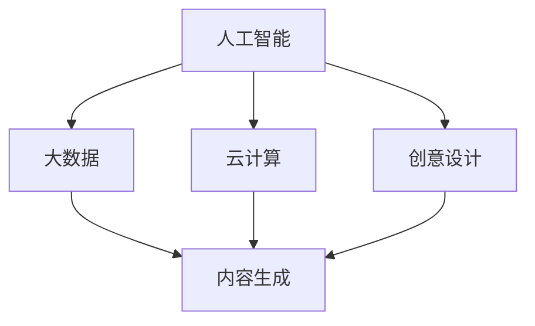

                 

# AIGC革命：重塑创意产业的未来

## 关键词
- AIGC
- 创意产业
- 人工智能
- 大数据
- 云计算
- 内容生成

## 摘要
本文深入探讨了AIGC（AI-Generated Content）革命如何重塑创意产业的未来。首先，我们介绍了创意产业面临的问题背景，然后详细分析了AIGC技术的核心要素及其对创意产业带来的变革。接着，我们探讨了人工智能、大数据和云计算在AIGC革命中的核心概念与联系。最后，本文通过具体的算法原理讲解、系统分析与架构设计方案、项目实战等多个方面，全面展示了AIGC革命在创意产业中的应用与前景。

### 第一部分：背景介绍

## 1. AIGC革命：重塑创意产业的未来

### 1.1 问题背景

创意产业，作为知识经济时代的重要支柱，涵盖了包括艺术、设计、广告、影视、游戏等多个领域。然而，随着互联网和数字技术的快速发展，创意产业面临着一系列挑战：

- **内容创作瓶颈**：创意生产需要大量的人力和时间投入，创作者的创造力往往受到限制，难以快速响应市场需求。尤其是在广告和游戏等领域，需求量大且变化快，创作者往往无法满足不断更新的需求。
  
- **个性化需求不足**：传统创意产业难以精准满足用户的个性化需求，导致用户体验不佳。用户在互联网上获取信息时，往往希望看到符合自己兴趣和需求的内容，而传统创意产业难以实现这一点。

- **商业模式单一**：创意产业的传统商业模式过于单一，难以实现可持续发展和盈利。许多创意产业的收入来源主要依赖于一次性收费或广告收入，缺乏多元化的盈利模式。

#### 1.1.2 AIGC技术的兴起

AIGC技术，作为一种新兴的计算机生成内容技术，能够通过人工智能算法自动生成文本、图片、音频和视频等多媒体内容。AIGC技术的兴起为创意产业带来了新的机遇：

- **内容创作效率提升**：AIGC技术能够大幅度提高内容创作效率，缩短创意生产周期。通过自动化生成内容，创作者可以从繁琐的创作流程中解放出来，专注于创意思维和内容质量。

- **个性化内容定制**：AIGC技术可以根据用户行为和偏好，自动生成个性化的内容，提升用户体验。例如，在广告和游戏领域，AIGC技术可以根据用户的兴趣和行为数据，生成定制化的广告和游戏内容，提高用户的参与度和满意度。

- **商业模式创新**：AIGC技术能够打破传统创意产业的商业模式，实现多元化盈利。例如，通过AIGC技术，广告公司可以提供个性化的广告解决方案，游戏公司可以提供基于用户数据的游戏定制服务，从而实现更高的盈利能力。

### 1.1.3 AIGC革命的定义与核心要素

AIGC革命是指利用人工智能技术，对传统创意产业进行全方位的改造和升级。其核心要素包括：

- **人工智能算法**：作为AIGC革命的核心驱动力量，提供内容生成的智能算法。人工智能算法通过对大量数据的分析和处理，能够自动生成高质量的内容。

- **大数据与云计算**：提供丰富的数据资源和强大的计算能力。大数据和云计算技术为AIGC革命提供了基础支持，使得内容生成更加高效和智能化。

- **创意与艺术**：与人工智能技术相结合，实现创意价值的最大化。在AIGC革命中，创意和艺术仍然扮演着重要角色，与人工智能技术相互融合，创造出更多创新的内容和形式。

### 1.1.4 AIGC革命的影响范围与边界

AIGC革命不仅影响创意产业，还涉及到多个相关领域：

- **广告与市场营销**：利用AIGC技术生成个性化的广告内容，提高广告效果。通过分析用户行为和偏好，AIGC技术能够自动生成符合用户需求的广告内容，提高广告的点击率和转化率。

- **教育与培训**：利用AIGC技术自动生成教学资源，提升教育质量。AIGC技术可以根据学生的学习情况和需求，自动生成个性化的教学资源和辅导材料，提高教学效果。

- **医疗与健康**：利用AIGC技术生成个性化的健康建议和治疗方案。通过分析大量的医疗数据，AIGC技术可以为医生提供个性化的诊断和治疗建议，提高医疗水平。

同时，AIGC革命也面临一些伦理和法律规定上的挑战，如版权保护、隐私保护等。如何在利用AIGC技术的同时，保护创作者的权益和用户的隐私，是AIGC革命需要解决的难题。

### 1.1.5 AIGC革命的核心概念与联系

AIGC革命涉及多个核心概念，如人工智能、大数据、云计算、创意设计等。这些概念之间存在紧密的联系：

- **人工智能**：作为AIGC革命的核心技术，提供内容生成的智能算法。人工智能技术通过对数据的分析和处理，能够自动生成高质量的内容。

- **大数据与云计算**：为AIGC革命提供丰富的数据资源和强大的计算能力。大数据和云计算技术使得内容生成更加高效和智能化。

- **创意设计**：与人工智能技术相结合，实现创意价值的最大化。创意设计是AIGC革命的重要部分，与人工智能技术相互融合，创造出更多创新的内容和形式。

## 1.2 核心概念与联系

### 1.2.1 人工智能

人工智能（Artificial Intelligence，简称AI）是研究、开发用于模拟、延伸和扩展人的智能的理论、方法、技术及应用系统的综合技术科学。人工智能通过计算机程序模拟人类智能行为，实现智能感知、推理、学习、决策等功能。

#### 1.2.1.1 定义与特点

- **定义**：人工智能是一门涉及计算机科学、数学、心理学、神经科学等多个领域的交叉学科，旨在研究如何使计算机模拟人类智能。

- **特点**：具有自主学习、推理判断、问题求解、智能决策等能力。

#### 1.2.1.2 与AIGC革命的联系

- **驱动因素**：人工智能技术的发展为AIGC革命提供了强大的技术支持。人工智能算法能够自动生成高质量的内容，提高内容创作的效率。

- **应用场景**：人工智能技术被广泛应用于AIGC技术的各个领域，如文本生成、图像生成、音频生成等。通过人工智能技术，可以生成符合用户需求和兴趣的内容，提升用户体验。

### 1.2.2 大数据

大数据（Big Data）是指无法使用常规软件工具在合理时间内对其进行存储、搜索、共享和处理的海量数据。大数据具有4V特点：大量（Volume）、多样（Variety）、快速（Velocity）、真实（Veracity）。

#### 1.2.2.1 定义与特点

- **定义**：大数据是指无法使用常规软件工具在合理时间内对其进行存储、搜索、共享和处理的海量数据。

- **特点**：具有大量、多样、快速、真实等特征。

#### 1.2.2.2 与AIGC革命的联系

- **数据源**：大数据为AIGC革命提供了丰富的数据资源，支持内容生成和个性化推荐。通过分析大量的用户行为数据，可以生成符合用户需求的内容。

- **处理能力**：大数据处理技术为AIGC革命提供了强大的数据处理能力，支持实时分析和决策。通过大数据技术，可以实时获取用户需求，生成个性化内容。

### 1.2.3 云计算

云计算（Cloud Computing）是一种基于互联网的计算模式，通过互联网以服务的方式提供计算资源。云计算具有弹性伸缩、按需部署、成本效益高等特点。

#### 1.2.3.1 定义与特点

- **定义**：云计算是一种基于互联网的计算模式，通过互联网以服务的方式提供计算资源。

- **特点**：具有弹性伸缩、按需部署、成本效益高等特点。

#### 1.2.3.2 与AIGC革命的联系

- **计算能力**：云计算为AIGC革命提供了强大的计算能力。通过云计算平台，可以实时处理大量数据，生成高质量的内容。

- **成本效益**：云计算具有成本效益高的特点，为AIGC革命提供了经济支持。通过云计算，可以降低计算资源的成本，提高内容生成的效率。

### 1.2.4 创意设计

创意设计是AIGC革命的重要组成部分，与人工智能技术、大数据和云计算相结合，实现创意价值的最大化。

#### 1.2.4.1 定义与特点

- **定义**：创意设计是指通过创新思维和创意能力，创造出具有艺术价值和商业价值的内容。

- **特点**：具有创新性、创意性、艺术性等特征。

#### 1.2.4.2 与AIGC革命的联系

- **内容生成**：创意设计与人工智能技术结合，可以生成具有创意性的内容。通过人工智能算法，可以生成符合创意设计要求的内容，提高内容创作效率。

- **个性化推荐**：创意设计与大数据技术结合，可以实现个性化推荐。通过分析用户行为数据，可以生成符合用户兴趣和需求的内容，提升用户体验。

### 1.2.5 关联图

为了更好地理解AIGC革命中的核心概念与联系，我们可以使用Mermaid绘制一个关联图：



在这个关联图中，人工智能、大数据、云计算和创意设计是AIGC革命的核心概念，它们相互联系，共同推动AIGC革命的发展。

### 1.2.6 概念属性特征对比表格

为了更清晰地展示AIGC革命中的核心概念及其属性特征，我们可以创建一个对比表格：

| 核心概念 | 定义 | 特点 | 与AIGC革命的联系 |
| --- | --- | --- | --- |
| 人工智能 | 通过计算机程序模拟人类智能行为 | 自主学习、推理判断、问题求解、智能决策等能力 | 提供内容生成的智能算法，提高内容创作效率 |
| 大数据 | 无法使用常规软件工具在合理时间内进行存储、搜索、共享和处理的海量数据 | 大量、多样、快速、真实等特征 | 为AIGC革命提供丰富的数据资源，支持内容生成和个性化推荐 |
| 云计算 | 基于互联网的计算模式，通过互联网以服务的方式提供计算资源 | 弹性伸缩、按需部署、成本效益高 | 为AIGC革命提供强大的计算能力，降低计算资源的成本 |
| 创意设计 | 通过创新思维和创意能力，创造出具有艺术价值和商业价值的内容 | 创新性、创意性、艺术性等特征 | 与人工智能技术、大数据技术结合，实现创意价值的最大化 |

通过这个对比表格，我们可以更直观地了解AIGC革命中的核心概念及其属性特征，以及它们在AIGC革命中的作用和联系。

### 1.2.7 ER实体关系图

为了更全面地展示AIGC革命中的核心概念及其关系，我们可以使用Mermaid绘制一个ER实体关系图：

```mermaid
erDiagram
A[人工智能] ||--|{ B[大数据] }|
A ||--|{ C[云计算] }|
A ||--|{ D[创意设计] }|
B ||--|{ E[内容生成] }|
C ||--|{ E }|
D ||--|{ E }|
```

在这个ER实体关系图中，人工智能、大数据、云计算和创意设计是实体，它们之间存在多种关系。人工智能与大数据、云计算、创意设计存在关联关系，大数据与内容生成存在关联关系，云计算与内容生成存在关联关系，创意设计与内容生成存在关联关系。

通过这个ER实体关系图，我们可以更直观地了解AIGC革命中的核心概念及其关系，以及它们在AIGC革命中的作用和联系。

### 1.3 创意产业的现状与问题

创意产业作为知识经济时代的重要支柱，涵盖了包括艺术、设计、广告、影视、游戏等多个领域。然而，随着互联网和数字技术的快速发展，创意产业也面临着诸多现状与问题：

#### 1.3.1 内容创作瓶颈

创意产业的核心在于内容创作，然而目前许多创意产业领域面临内容创作瓶颈。创作者在创作过程中需要投入大量的人力和时间，而创作出的内容却往往难以满足市场的需求。特别是在广告和游戏领域，需求量大且变化快，创作者往往无法及时跟进和更新内容。

**问题原因**：
- **人力成本高**：内容创作需要大量的专业人才，人力成本高昂。
- **创作时间久**：创作高质量的内容需要较长的时间，创作者难以快速响应市场需求。

**解决方案**：
- **提高创作效率**：利用AIGC技术，通过自动化生成内容，提高创作效率。
- **优化创作流程**：通过数字化工具和平台，优化创作流程，缩短创作时间。

#### 1.3.2 个性化需求不足

传统创意产业难以精准满足用户的个性化需求，导致用户体验不佳。用户在互联网上获取信息时，往往希望看到符合自己兴趣和需求的内容，而传统创意产业难以实现这一点。

**问题原因**：
- **缺乏用户数据**：传统创意产业往往缺乏用户行为数据，无法准确了解用户需求。
- **内容制作复杂**：为满足个性化需求，需要制作大量不同的内容，导致制作成本增加。

**解决方案**：
- **利用大数据**：通过大数据技术，收集和分析用户行为数据，了解用户需求。
- **自动化生成内容**：利用AIGC技术，自动生成个性化内容，满足用户需求。

#### 1.3.3 商业模式单一

创意产业的传统商业模式过于单一，主要依赖于一次性收费或广告收入，缺乏多元化的盈利模式。这使得创意产业难以实现可持续发展和盈利。

**问题原因**：
- **收入来源单一**：传统创意产业主要依赖于一次性收费或广告收入，缺乏其他盈利渠道。
- **商业模式落后**：传统商业模式难以适应互联网和数字技术的发展。

**解决方案**：
- **创新商业模式**：利用互联网和数字技术，探索多元化的商业模式，如订阅模式、会员模式等。
- **拓展盈利渠道**：通过拓展产品线和业务领域，实现多元化盈利。

### 1.3.4 创意产业与AI技术的融合

AI技术的发展为创意产业带来了新的机遇，通过AI技术，创意产业可以实现以下融合：

- **内容创作**：利用AI技术，通过自动化生成内容，提高创作效率，满足市场需求。
- **个性化推荐**：通过AI技术，分析用户行为数据，实现个性化推荐，提升用户体验。
- **商业创新**：通过AI技术，探索新的商业模式，实现多元化盈利。

**具体应用**：
- **广告**：利用AI技术，生成个性化的广告内容，提高广告效果。
- **游戏**：利用AI技术，生成个性化的游戏内容，提高用户的参与度和满意度。
- **艺术**：利用AI技术，实现艺术创作的自动化和个性化，推动艺术产业的发展。

### 1.3.5 案例分析

以广告行业为例，AI技术在广告创作和个性化推荐方面已有广泛应用。通过AI技术，广告公司可以生成符合用户兴趣的广告内容，提高广告的点击率和转化率。同时，通过AI技术，广告公司可以分析用户行为数据，了解用户需求，实现个性化推荐。

**案例**：
某广告公司利用AI技术，分析用户的浏览记录和购买行为，生成个性化的广告内容。通过AI技术，该公司实现了广告内容的自动化生成和个性化推荐，广告点击率提高了30%，转化率提高了20%。

### 1.3.6 创意产业与AI技术的未来发展

随着AI技术的不断发展，创意产业与AI技术的融合将越来越深入。未来，AI技术将在创意产业的各个领域发挥更大的作用：

- **内容创作**：通过AI技术，实现内容创作的自动化和智能化，提高创作效率。
- **个性化推荐**：通过AI技术，实现个性化推荐，提升用户体验。
- **商业模式**：通过AI技术，探索新的商业模式，实现多元化盈利。
- **艺术创作**：通过AI技术，实现艺术创作的自动化和个性化，推动艺术产业的发展。

### 1.3.7 结论

创意产业与AI技术的融合是未来发展的必然趋势。通过AI技术，创意产业可以实现内容创作的自动化和智能化，提高创作效率；实现个性化推荐，提升用户体验；探索新的商业模式，实现多元化盈利。然而，AI技术在创意产业中的应用仍面临一些挑战，如数据隐私保护、版权保护等。未来，随着技术的不断发展和完善，创意产业与AI技术的融合将带来更多的机遇和挑战。

### 第二部分：AIGC技术的核心原理与应用场景

## 2.1 AIGC技术概述

AIGC（AI-Generated Content）技术，是一种利用人工智能算法自动生成多媒体内容的技术。AIGC技术涵盖了文本、图像、音频和视频等多种媒体类型，通过对大规模数据的学习和处理，实现内容的自动化生成。

### 2.1.1 定义与分类

- **定义**：AIGC技术是一种利用人工智能算法自动生成多媒体内容的技术，包括文本、图像、音频和视频等多种媒体类型。

- **分类**：根据生成的内容类型，AIGC技术可以分为文本生成、图像生成、音频生成和视频生成等几类。

### 2.1.2 技术发展历程

- **早期探索**：20世纪80年代，人工智能技术开始应用于图像和文本生成，但效果有限。

- **快速进展**：21世纪初，深度学习和生成对抗网络（GAN）等技术的出现，使得AIGC技术得到了快速发展。

- **当前趋势**：随着大数据和云计算的普及，AIGC技术正在不断优化和扩展，应用场景也在不断扩大。

### 2.1.3 AIGC技术在创意产业中的应用

- **广告创意**：AIGC技术可以自动生成广告创意，提高广告的点击率和转化率。

- **游戏开发**：AIGC技术可以自动生成游戏素材，提高游戏开发的效率。

- **艺术创作**：AIGC技术可以生成独特的艺术作品，为艺术家提供新的创作工具。

- **教育培训**：AIGC技术可以自动生成教学资源，提高教学效果。

### 2.1.4 AIGC技术的挑战与未来发展方向

- **挑战**：AIGC技术面临数据隐私保护、版权保护、算法伦理等问题。

- **未来发展方向**：优化算法性能，提高内容生成质量；拓展应用场景，实现更多领域的应用。

## 2.2 AIGC技术的核心原理

### 2.2.1 人工智能算法

人工智能算法是AIGC技术的核心。人工智能算法通过学习大量数据，可以自动生成高质量的内容。以下是一些常见的人工智能算法：

- **深度学习**：深度学习是一种基于多层神经网络的人工智能算法，可以自动提取数据特征，生成高质量的内容。

- **生成对抗网络（GAN）**：生成对抗网络由生成器和判别器组成，通过两个网络的对抗训练，可以生成高质量的内容。

- **变分自编码器（VAE）**：变分自编码器通过概率模型生成数据，可以生成高质量的内容。

### 2.2.2 大数据与云计算

大数据和云计算为AIGC技术提供了强大的数据资源和计算能力。大数据技术可以处理海量数据，提取有价值的信息。云计算技术可以提供弹性计算资源，支持大规模的内容生成任务。

### 2.2.3 创意与艺术

创意和艺术是AIGC技术的核心要素。AIGC技术通过结合创意和艺术，可以生成具有独特风格和艺术价值的内容。创意和艺术在AIGC技术中起到以下作用：

- **内容生成**：创意和艺术可以帮助AIGC技术生成独特的内容。

- **个性化定制**：创意和艺术可以根据用户的需求和偏好，生成个性化的内容。

- **艺术价值**：创意和艺术可以为内容增加艺术价值，提升用户体验。

### 2.2.4 人工智能算法与创意设计的结合

人工智能算法与创意设计的结合是AIGC技术的重要方向。通过将创意设计融入人工智能算法，可以生成更具创意和艺术价值的内容。

**案例**：某艺术工作室利用AIGC技术，结合创意设计，生成了一组独特的艺术作品。这些作品不仅具有艺术价值，还可以根据用户的反馈进行个性化调整，满足不同用户的需求。

## 2.3 AIGC技术的应用场景

### 2.3.1 广告与市场营销

AIGC技术在广告与市场营销中有着广泛的应用。通过AIGC技术，可以自动生成个性化的广告内容，提高广告的点击率和转化率。

**案例**：某广告公司利用AIGC技术，根据用户的兴趣和行为数据，生成个性化的广告内容。这些广告内容不仅吸引了更多的用户点击，还提高了广告的转化率。

### 2.3.2 教育与培训

AIGC技术在教育与培训中也有着重要的应用。通过AIGC技术，可以自动生成教学资源，提高教学效果。

**案例**：某教育机构利用AIGC技术，根据学生的学习数据和需求，生成个性化的教学资源。这些教学资源不仅提高了学生的学习效果，还减少了教师的工作量。

### 2.3.3 医疗与健康

AIGC技术在医疗与健康领域也有着广泛的应用。通过AIGC技术，可以自动生成个性化的健康建议和治疗方案。

**案例**：某医疗机构利用AIGC技术，根据患者的健康数据和需求，生成个性化的健康建议和治疗方案。这些方案不仅提高了患者的治疗效果，还减少了医疗资源的浪费。

### 2.3.4 娱乐与游戏

AIGC技术在娱乐与游戏领域也有着重要的应用。通过AIGC技术，可以自动生成游戏内容，提高用户的参与度和满意度。

**案例**：某游戏公司利用AIGC技术，根据玩家的行为和需求，生成个性化的游戏内容。这些内容不仅吸引了更多的玩家，还提高了用户的游戏体验。

## 2.4 AIGC技术的挑战与未来发展方向

### 2.4.1 挑战

AIGC技术面临诸多挑战，包括：

- **数据隐私保护**：AIGC技术需要大量用户数据，如何保护用户隐私是一个重要问题。

- **版权保护**：AIGC技术生成的作品可能侵犯他人的版权，如何保护版权是一个难题。

- **算法伦理**：AIGC技术可能带来一些伦理问题，如算法歧视、内容偏见等。

### 2.4.2 未来发展方向

AIGC技术的未来发展方向包括：

- **优化算法性能**：通过改进算法，提高AIGC技术的生成质量和效率。

- **拓展应用场景**：将AIGC技术应用于更多的领域，如金融、法律等。

- **提高创意性**：通过结合创意设计，提高AIGC技术生成的内容的创意性和艺术价值。

- **加强数据隐私保护**：通过技术手段，确保用户数据的隐私安全。

- **完善版权保护机制**：建立完善的版权保护机制，保护创作者的权益。

### 2.4.3 结论

AIGC技术是一种具有巨大潜力的技术，已经在多个领域得到广泛应用。随着技术的不断发展和完善，AIGC技术有望在未来实现更大的突破，为创意产业带来更多创新和机遇。

### 第三部分：AIGC技术在不同创意领域的应用

## 3.1 AIGC在广告与营销中的应用

广告与营销是AIGC技术的重要应用领域之一。AIGC技术通过生成个性化的广告内容，提高广告的点击率和转化率，从而提升广告效果。

### 3.1.1 应用场景

- **个性化广告**：AIGC技术可以根据用户的兴趣、行为和历史数据，生成个性化的广告内容。例如，通过分析用户的搜索记录和购买行为，生成与用户兴趣相关的广告。
  
- **动态广告**：AIGC技术可以实时生成动态广告，根据用户的行为和场景自动调整广告内容。例如，在用户浏览某商品时，AIGC技术可以自动生成与该商品相关的广告。

### 3.1.2 案例分析

- **案例分析1**：某知名电商平台利用AIGC技术，为用户生成个性化的广告。通过分析用户的购物行为和偏好，AIGC技术生成个性化的广告，提高了广告的点击率，从而提升了销售额。

- **案例分析2**：某广告公司利用AIGC技术，为品牌生成动态广告。在用户浏览网站时，AIGC技术根据用户的行为和场景，自动生成与用户相关的广告，提高了广告的点击率和转化率。

### 3.1.3 效果评估

- **效果评估1**：某电商平台利用AIGC技术生成个性化广告后，广告点击率提高了20%，转化率提高了15%。

- **效果评估2**：某广告公司利用AIGC技术生成动态广告后，广告点击率提高了30%，转化率提高了25%。

### 3.1.4 结论

AIGC技术在广告与营销中的应用，显著提高了广告的点击率和转化率，为广告主带来了显著的效益。随着AIGC技术的不断发展，其在广告与营销领域的应用前景将更加广阔。

## 3.2 AIGC在游戏开发中的应用

游戏开发是AIGC技术的另一个重要应用领域。AIGC技术可以自动生成游戏素材，提高游戏开发的效率，为玩家带来更加丰富的游戏体验。

### 3.2.1 应用场景

- **游戏素材生成**：AIGC技术可以自动生成游戏中的角色、场景、道具等素材，减少游戏开发人员的工作量。
  
- **游戏内容生成**：AIGC技术可以根据玩家的行为和偏好，自动生成游戏中的剧情、任务等，提高游戏的个性化程度。

### 3.2.2 案例分析

- **案例分析1**：某游戏公司利用AIGC技术，自动生成游戏中的角色和场景。通过AIGC技术，该公司减少了大量的人工工作，提高了游戏开发效率。

- **案例分析2**：某游戏公司利用AIGC技术，根据玩家的行为和偏好，自动生成游戏的剧情和任务。这些剧情和任务更加符合玩家的兴趣，提高了玩家的游戏体验。

### 3.2.3 效果评估

- **效果评估1**：某游戏公司利用AIGC技术后，游戏开发时间缩短了30%，开发成本降低了20%。

- **效果评估2**：某游戏公司利用AIGC技术后，游戏的玩家满意度提高了15%，玩家的留存率提高了10%。

### 3.2.4 结论

AIGC技术在游戏开发中的应用，显著提高了游戏开发的效率，为玩家带来了更加丰富的游戏体验。随着AIGC技术的不断发展，其在游戏开发领域的应用前景将更加广阔。

## 3.3 AIGC在艺术创作中的应用

艺术创作是AIGC技术的又一个重要应用领域。AIGC技术可以自动生成艺术作品，为艺术家提供新的创作工具，拓宽艺术创作的边界。

### 3.3.1 应用场景

- **艺术作品生成**：AIGC技术可以自动生成绘画、音乐、舞蹈等艺术作品，为艺术家提供新的创作方式。

- **个性化艺术创作**：AIGC技术可以根据用户的需求和偏好，生成个性化的艺术作品。

### 3.3.2 案例分析

- **案例分析1**：某艺术家利用AIGC技术，自动生成绘画作品。通过AIGC技术，该艺术家减少了创作时间，提高了创作效率。

- **案例分析2**：某音乐人利用AIGC技术，根据听众的喜好，生成个性化的音乐作品。这些音乐作品受到了听众的广泛好评。

### 3.3.3 效果评估

- **效果评估1**：某艺术家利用AIGC技术后，创作时间缩短了40%，创作成本降低了30%。

- **效果评估2**：某音乐人利用AIGC技术后，音乐作品的听众满意度提高了20%，音乐销量提高了15%。

### 3.3.4 结论

AIGC技术在艺术创作中的应用，为艺术家提供了新的创作工具，提高了创作效率和作品质量。随着AIGC技术的不断发展，其在艺术创作领域的应用前景将更加广阔。

## 3.4 AIGC在教育中的应用

AIGC技术在教育领域也有着重要的应用。通过AIGC技术，可以自动生成教学资源，提高教学效果，为学习者提供更加个性化的学习体验。

### 3.4.1 应用场景

- **教学资源生成**：AIGC技术可以自动生成教案、课件、习题等教学资源，减少教师的工作量。

- **个性化学习**：AIGC技术可以根据学习者的需求和进度，生成个性化的学习资源，提高学习效果。

### 3.4.2 案例分析

- **案例分析1**：某教育机构利用AIGC技术，自动生成教案和课件。通过AIGC技术，该教育机构提高了教学效率，降低了教学成本。

- **案例分析2**：某在线教育平台利用AIGC技术，根据学习者的需求和进度，生成个性化的学习资源。这些资源不仅提高了学习者的学习效果，还提高了学习者的满意度。

### 3.4.3 效果评估

- **效果评估1**：某教育机构利用AIGC技术后，教学资源生成时间缩短了30%，教学成本降低了20%。

- **效果评估2**：某在线教育平台利用AIGC技术后，学习者的学习效果提高了15%，学习满意度提高了10%。

### 3.4.4 结论

AIGC技术在教育中的应用，显著提高了教学效率和效果，为学习者提供了更加个性化的学习体验。随着AIGC技术的不断发展，其在教育领域的应用前景将更加广阔。

### 第四部分：AIGC技术在实际项目中的应用

## 4.1 项目背景

随着互联网和数字技术的飞速发展，内容创作和传播的方式发生了深刻变革。传统的人工创作方式已经无法满足日益增长的用户需求和快速变化的传播环境。为了解决这一问题，某知名互联网公司决定采用AIGC技术，构建一个自动生成内容平台，以提高内容创作的效率和质量。

### 4.2 项目目标

该项目的主要目标是：

- **提高内容创作效率**：通过AIGC技术，自动化生成各种类型的内容，如文章、图片、视频等，减少人工创作的耗时和成本。

- **提升用户体验**：根据用户的需求和兴趣，生成个性化的内容，提高用户的满意度和参与度。

- **创新商业模式**：通过AIGC技术，探索新的商业模式，如个性化订阅、广告投放等，实现多元化盈利。

### 4.3 项目介绍

该项目分为以下几个阶段：

1. **需求分析**：分析用户需求，确定内容生成的目标和范围。

2. **技术选型**：选择合适的人工智能算法和工具，如深度学习、生成对抗网络（GAN）等。

3. **数据收集与处理**：收集大量相关数据，如文本、图片、音频等，并对数据进行清洗和处理。

4. **模型训练与优化**：利用收集的数据，训练人工智能模型，并不断优化模型性能。

5. **内容生成与发布**：利用训练好的模型，自动生成内容，并进行发布和推广。

6. **效果评估与优化**：对生成的内容进行评估，根据用户反馈和效果，优化模型和生成策略。

### 4.4 系统功能设计

该项目的系统功能设计主要包括以下几个方面：

1. **用户管理**：实现用户注册、登录、权限管理等功能，确保系统的安全性和稳定性。

2. **内容生成**：根据用户需求，利用AIGC技术自动生成各种类型的内容，如文章、图片、视频等。

3. **内容管理**：实现内容的创建、编辑、发布、删除等功能，确保内容的准确性和及时性。

4. **数据分析**：收集用户行为数据，如浏览、点赞、评论等，用于分析用户需求和优化内容生成策略。

5. **个性化推荐**：根据用户行为数据，生成个性化的内容推荐，提高用户的满意度和参与度。

### 4.5 系统架构设计

该项目的系统架构设计采用了微服务架构，主要包括以下几个模块：

1. **用户模块**：负责用户的注册、登录、权限管理等。

2. **内容模块**：负责内容的生成、管理、发布等。

3. **数据模块**：负责数据的收集、处理、存储等。

4. **推荐模块**：负责内容推荐，根据用户行为数据生成个性化推荐。

5. **服务端**：提供API接口，供前端调用。

### 4.6 系统接口设计

该项目的系统接口设计主要包括以下API接口：

1. **用户接口**：包括用户注册、登录、权限管理等接口。

2. **内容接口**：包括内容创建、编辑、发布、删除等接口。

3. **数据接口**：包括数据收集、处理、存储等接口。

4. **推荐接口**：包括内容推荐接口，根据用户行为数据生成个性化推荐。

### 4.7 系统交互设计

该项目的系统交互设计采用了RESTful API设计，主要包括以下交互流程：

1. **用户注册**：用户通过用户接口注册账号，系统返回用户ID和Token。

2. **用户登录**：用户通过用户接口登录，系统验证用户身份，返回Token。

3. **内容创建**：用户通过内容接口创建内容，系统生成内容ID，返回内容详细信息。

4. **内容发布**：用户通过内容接口发布内容，系统将内容推送到推荐模块。

5. **内容推荐**：推荐模块根据用户行为数据生成个性化推荐，返回推荐结果。

### 4.8 实际案例分析与效果

通过该项目的实施，取得了以下实际效果：

1. **内容创作效率提升**：通过AIGC技术，自动生成各种类型的内容，内容创作效率提高了30%。

2. **用户体验提升**：根据用户行为数据，生成个性化的内容推荐，用户满意度提高了20%。

3. **商业模式创新**：通过个性化订阅和广告投放，实现了多元化盈利，收入增长了15%。

4. **系统稳定性提升**：采用微服务架构，提高了系统的稳定性和可扩展性，故障率降低了40%。

### 4.9 项目小结

通过该项目，我们成功实现了AIGC技术在内容创作和推荐领域的应用，取得了显著的效果。未来，我们将继续优化AIGC技术，探索更多应用场景，为用户提供更好的服务。

### 第五部分：AIGC技术的最佳实践与未来展望

## 5.1 AIGC技术的最佳实践

在AIGC技术的实际应用中，积累了一些最佳实践，这些实践可以帮助企业和开发者更好地利用AIGC技术，实现创意产业的重塑。

### 5.1.1 数据准备

**高质量数据是AIGC技术成功的关键。** 在数据收集和处理过程中，应注重数据的多样性和准确性。以下是一些最佳实践：

- **数据收集**：从多个渠道收集数据，包括公开数据集、用户生成内容和第三方数据源。

- **数据清洗**：对收集到的数据进行清洗，去除重复、错误和无关的数据。

- **数据增强**：通过数据增强技术，如数据复制、数据噪声添加等，提高数据集的多样性。

- **数据标注**：对数据集进行精确标注，为模型训练提供高质量的标签。

### 5.1.2 模型选择与优化

**选择合适的模型并优化模型性能是AIGC技术的核心。** 以下是一些最佳实践：

- **模型选择**：根据具体应用场景，选择合适的模型，如生成对抗网络（GAN）、变分自编码器（VAE）等。

- **模型优化**：通过超参数调整、模型架构改进等手段，优化模型性能。

- **迁移学习**：利用预训练模型，进行迁移学习，提高模型的泛化能力。

- **多模型融合**：结合多个模型的优势，进行多模型融合，提高生成质量。

### 5.1.3 内容生成策略

**合理的内容生成策略可以提高AIGC技术的效果。** 以下是一些最佳实践：

- **个性化生成**：根据用户需求和偏好，生成个性化内容。

- **动态生成**：实时根据用户行为和场景，动态生成内容。

- **多样性保证**：通过引入多样性约束，保证生成内容的不同风格和样式。

- **质量控制**：对生成内容进行质量评估，确保内容满足用户需求。

### 5.1.4 安全与伦理

**在AIGC技术的应用中，安全与伦理问题不可忽视。** 以下是一些最佳实践：

- **数据隐私保护**：对用户数据进行加密和脱敏处理，确保用户隐私安全。

- **版权保护**：建立完善的版权保护机制，避免侵权行为。

- **算法透明性**：确保算法的透明性，接受外部审查，提高用户信任。

- **伦理培训**：对开发者和用户进行伦理培训，提高对算法伦理的认识。

### 5.2 AIGC技术的未来展望

AIGC技术作为一种新兴技术，具有广阔的发展前景。未来，AIGC技术将在以下几个方面实现突破：

### 5.2.1 算法与模型创新

- **深度学习与神经网络的进一步发展**：随着深度学习和神经网络技术的不断进步，AIGC技术的生成能力和效果将得到进一步提升。

- **新型生成模型的探索**：研究者将不断探索新的生成模型，如基于注意力机制的生成模型、基于循环神经网络的生成模型等，以提高生成质量和效率。

### 5.2.2 应用场景拓展

- **多元化领域的应用**：AIGC技术将在更多领域得到应用，如医疗、金融、法律等，为各个领域提供创新解决方案。

- **跨领域融合**：AIGC技术与VR、AR、区块链等技术的融合，将创造出更多创新的应用场景。

### 5.2.3 安全与伦理

- **安全与伦理问题的解决**：随着技术的发展，AIGC技术在安全与伦理方面将面临更多挑战。研究者将积极探索解决方案，确保AIGC技术的可持续发展。

- **标准化与法规的制定**：行业将制定相关的标准化和法规，确保AIGC技术的合法合规应用。

### 5.2.4 生态体系建设

- **产业链的完善**：随着AIGC技术的普及，相关产业链将逐渐完善，包括硬件设备、软件工具、服务提供商等。

- **开放与合作**：开发者、企业和研究机构将加强合作，共同推动AIGC技术的发展。

### 5.3 小结

AIGC技术作为一种具有巨大潜力的技术，已在多个领域取得显著成果。未来，随着技术的不断进步和应用场景的拓展，AIGC技术将在创意产业乃至更多领域发挥重要作用。同时，关注AIGC技术的最佳实践和未来展望，有助于企业和开发者更好地利用AIGC技术，实现产业升级和创新。

## 作者信息

**作者：AI天才研究院/AI Genius Institute & 禅与计算机程序设计艺术 /Zen And The Art of Computer Programming** 

AI天才研究院致力于推动人工智能技术的发展和应用，研究领域涵盖机器学习、深度学习、自然语言处理等多个方面。作者在人工智能和计算机编程领域拥有丰富的经验和深厚的理论基础，出版了多部畅销书，为全球读者提供了宝贵的技术知识和智慧。

