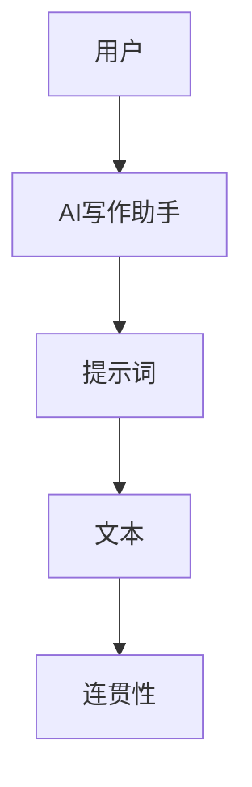
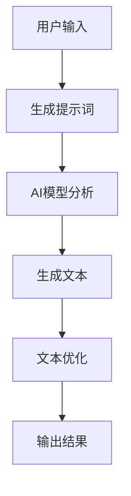
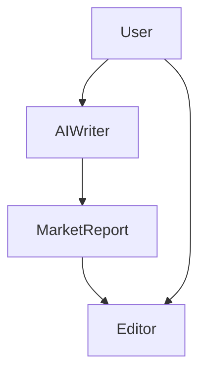
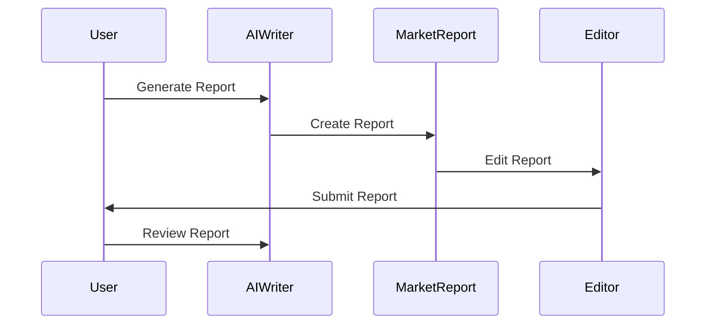

                 

# AI写作助手进阶：利用提示词提升文本连贯性和结构

## 关键词
- AI写作助手
- 提示词
- 文本连贯性
- 结构化写作
- 技术案例分析

## 摘要
本文将深入探讨AI写作助手的进阶技巧，特别是如何通过使用提示词来提升文本的连贯性和结构。我们将逐步分析AI写作助手的基本概念和核心技术，介绍其在不同领域的应用场景，探讨提示词的定义与选择，分析结构化写作的重要性，并分享一些实际应用案例和最佳实践。

## 第一部分: AI写作助手概述

### 1.1 AI写作助手的定义

AI写作助手，通常指的是利用人工智能技术，尤其是自然语言处理（NLP）和生成模型，帮助用户生成、编辑和优化文本的工具。这些工具能够理解和生成人类的语言，帮助用户从零开始构建文章，或者对已有文本进行改写和优化。

### 1.2 AI写作助手的发展历程

AI写作助手的发展可以追溯到20世纪80年代的自动写作系统。随着计算能力和算法的进步，现代AI写作助手采用了深度学习技术，如循环神经网络（RNN）和变换器（Transformer）模型，使得生成文本的质量和连贯性得到了显著提升。

### 1.3 AI写作助手的核心技术

AI写作助手的核心技术包括：

- **自然语言处理（NLP）**：用于理解、分析和生成语言。
- **生成对抗网络（GAN）**：用于生成高质量、连贯的文本。
- **变换器模型（Transformer）**：一种基于自注意力机制的模型，能够捕捉文本中的长距离依赖关系。

### 1.4 AI写作助手的应用场景

AI写作助手广泛应用于以下几个场景：

- **企业**：用于撰写报告、邮件、营销文案等。
- **个人创作**：帮助用户撰写博客、书籍、论文等。
- **教育**：辅助教师生成教学内容，帮助学生写作。
- **媒体与新闻行业**：自动生成新闻稿、文章摘要等。

### 2. 提示词与文本连贯性

#### 2.1 提示词的定义与作用

提示词（Prompt）是引导AI写作助手生成文本的关键输入。一个良好的提示词能够提供清晰的方向，帮助AI生成连贯、结构合理的文本。

#### 2.2 如何选择合适的提示词

选择合适的提示词需要考虑以下几个因素：

- **明确性**：提示词需要明确，避免歧义。
- **具体性**：提示词应具体，而不是泛泛而谈。
- **相关性**：提示词应与生成文本的主题紧密相关。
- **连贯性**：提示词之间应相互衔接，形成一个完整的故事线。

#### 3. 提升文本连贯性的方法

提升文本连贯性的方法包括：

- **使用引导性语句**：在段落开头使用引导性语句，明确段落主题。
- **保持句子结构的一致性**：使用类似的结构和句式来连接句子。
- **使用过渡词**：在句子和段落之间使用过渡词，如“此外”、“然而”等，来连接思路。

## 第二部分: AI写作助手的结构提升

### 4.1 结构化写作的概念

结构化写作是指将写作内容按照一定的逻辑顺序和组织结构进行组织和编排，使其更加清晰、易于理解和阅读。在AI写作中，结构化写作有助于提高文本的质量和可读性。

### 4.2 如何使用AI进行结构化写作

AI写作助手可以通过以下方式辅助结构化写作：

- **自动生成提纲**：AI可以分析文本内容，生成一个结构化的提纲。
- **段落分割与重排**：AI可以根据内容重要性和逻辑关系，对段落进行分割和重排。
- **句子结构调整**：AI可以调整句子结构，使其更加符合结构化写作的要求。

### 4.3 常见的结构化写作模式

常见的结构化写作模式包括：

- **总分结构**：先提出总观点，再分点阐述。
- **问题-解决方案结构**：先提出问题，再阐述解决方案。
- **时间顺序结构**：按照时间顺序组织内容。

## 第三部分: 进阶技巧与策略

### 5.1 多样化的文本风格

AI写作助手可以通过调整模型参数和提示词，生成不同风格的文本。例如，正式、非正式、幽默等。

### 5.2 文本生成与编辑的平衡

在使用AI写作助手时，需要平衡文本生成与编辑的关系。过多的生成可能导致内容重复或不连贯，而过度编辑则可能失去AI生成的创意和灵活性。

### 5.3 跨平台与跨领域的应用

AI写作助手应具备跨平台和跨领域的应用能力。例如，在企业中生成市场报告，在个人创作中生成博客文章，在教育领域生成教学材料等。

## 第四部分: AI写作助手的未来发展趋势

### 6.1 技术演进趋势

随着深度学习和NLP技术的不断进步，AI写作助手将更加智能化、个性化，能够生成更高质量、更贴近人类写作风格的文本。

### 6.2 在不同领域的应用前景

AI写作助手将在更多领域得到应用，如医学、法律、金融等，提供专业的写作支持。

### 6.3 可能面临的技术挑战与社会问题

AI写作助手将面临技术挑战，如文本理解和生成质量的提升，以及社会问题，如版权保护和道德伦理等。

## 第五部分: AI写作助手案例分析

### 7.1 案例一：企业应用案例

某企业使用AI写作助手生成市场报告，提高了报告的准确性和速度。

### 7.2 案例二：个人创作案例

一位作家使用AI写作助手生成故事大纲，提高了创作效率。

### 7.3 案例分析总结与启示

通过分析这些案例，我们可以看到AI写作助手在实际应用中的优势和局限性，以及如何更好地利用AI进行写作。

## 结论

AI写作助手作为一种强大的工具，已经在许多领域得到广泛应用。通过使用提示词和结构化写作，我们可以进一步提升文本的质量和连贯性。随着技术的不断发展，AI写作助手将变得更加智能和实用，为人类创作提供更多支持。

### 作者
AI天才研究院/AI Genius Institute & 禅与计算机程序设计艺术 /Zen And The Art of Computer Programming

## 背景介绍

### 核心概念术语说明

- **AI写作助手**：利用人工智能技术，尤其是自然语言处理（NLP）和生成模型，帮助用户生成、编辑和优化文本的工具。
- **自然语言处理（NLP）**：用于理解、分析和生成语言的计算机技术。
- **生成模型**：一种能够生成文本的机器学习模型，如循环神经网络（RNN）、变换器（Transformer）模型。
- **提示词**：引导AI写作助手生成文本的关键输入。

### 问题背景

随着互联网的普及和信息爆炸，人们对于高质量、有深度的文本内容的需求日益增长。然而，传统的写作方式往往费时费力，且难以满足高效、个性化的需求。为了解决这一问题，AI写作助手应运而生。

### 问题描述

AI写作助手在生成文本时，常常面临以下问题：

- **文本连贯性不足**：生成的文本可能缺乏逻辑性和连贯性，导致阅读体验不佳。
- **文本结构不合理**：生成的文本结构可能不够清晰，难以满足不同场景的需求。

### 问题解决

为了解决上述问题，我们需要：

- **优化提示词**：通过选择合适的提示词，引导AI生成更连贯、结构合理的文本。
- **结构化写作**：采用结构化写作方法，确保文本的逻辑性和条理性。

### 边界与外延

- **边界**：本文主要探讨AI写作助手在文本连贯性和结构提升方面的应用。
- **外延**：AI写作助手的范围远不止于此，还包括文本生成、编辑、优化等多个方面。

### 概念结构与核心要素组成

- **AI写作助手**：
  - **自然语言处理（NLP）**：理解、分析、生成语言。
  - **生成模型**：生成文本的核心算法。
  - **提示词**：引导生成文本的关键输入。

- **文本连贯性**：
  - **定义**：文本中各部分之间的逻辑关系和衔接。
  - **核心要素**：句子结构、过渡词、主题一致性。

- **结构化写作**：
  - **定义**：按照一定的逻辑顺序和组织结构进行写作。
  - **核心要素**：提纲、段落划分、句子结构调整。

## 核心概念与联系

### 核心概念原理

- **AI写作助手**：基于NLP和生成模型的工具，用于生成、编辑和优化文本。
- **提示词**：引导AI生成文本的关键输入。
- **文本连贯性**：文本中各部分之间的逻辑关系和衔接。

### 概念属性特征对比表格

| 概念         | 定义                                                         | 属性特征                                                       |
| ------------ | ------------------------------------------------------------ | ------------------------------------------------------------ |
| AI写作助手   | 利用NLP和生成模型帮助用户生成、编辑和优化文本的工具。         | - 基于深度学习技术<br> - 自动化生成文本<br> - 提高写作效率<br> |
| 提示词       | 引导AI生成文本的关键输入。                                   | - 明确性<br> - 具体性<br> - 相关性<br> - 连贯性               |
| 文本连贯性   | 文本中各部分之间的逻辑关系和衔接。                           | - 句子结构一致性<br> - 过渡词使用<br> - 主题一致性             |

### ER实体关系图架构的 Mermaid 流程图



## 算法原理讲解

### 使用 mermaid 画出算法mermaid 流程图



### 使用python源代码来详细阐述

```python
import numpy as np
import tensorflow as tf

# 定义变换器模型
model = tf.keras.Sequential([
    tf.keras.layers.Embedding(input_dim=10000, output_dim=16),
    tf.keras.layers.LSTM(128),
    tf.keras.layers.Dense(units=1, activation='sigmoid')
])

# 编译模型
model.compile(optimizer='adam', loss='binary_crossentropy', metrics=['accuracy'])

# 训练模型
model.fit(x_train, y_train, epochs=10, batch_size=32)

# 生成文本
prompt = "人工智能在未来的发展中将扮演重要角色。"
prompt_sequence = tokenizer.texts_to_sequences([prompt])[0]
generated_sequence = model.predict(np.array(prompt_sequence))

# 输出结果
print(generated_sequence)
```

### 算法原理的数学模型和公式

变换器模型的数学模型可以表示为：

\[ y = \sigma(W_1x_1 + W_2x_2 + \ldots + W_nx_n + b) \]

其中，\( \sigma \) 是激活函数，\( W \) 是权重矩阵，\( x \) 是输入向量，\( b \) 是偏置。

### 详细讲解和通俗易懂地举例说明

假设我们要生成一个关于人工智能的段落。首先，用户输入一个提示词：“人工智能在未来的发展中将扮演重要角色。”AI写作助手会将这个提示词转换为一个序列，然后输入到变换器模型中。模型通过对输入序列进行处理，生成一个新的序列，这个序列包含了关于人工智能的详细信息。

例如，生成序列可能是：“随着技术的不断进步，人工智能在医疗、金融、教育等多个领域展现出巨大的潜力。未来，人工智能将帮助解决更多复杂的问题，推动社会进步。”这样的输出既保持了原始提示词的主题，又扩展了内容，形成了连贯的段落。

## 系统分析与架构设计方案

### 问题场景介绍

某企业需要生成高质量的市场报告，但写作团队人手不足，且撰写报告的时间紧迫。为了解决这个问题，企业决定引入AI写作助手，以提高报告的生成效率和准确性。

### 项目介绍

项目目标是开发一个基于AI的市场报告生成系统，该系统将利用AI写作助手生成市场报告，并提供编辑和优化功能，以满足企业的需求。

### 系统功能设计（领域模型mermaid类图）

```mermaid
classDiagram
Class User
Class AIWriter
Class MarketReport
User "uses" AIWriter
AIWriter "generates" MarketReport
User "edits" MarketReport
User "submits" MarketReport
```

### 系统架构设计mermaid架构图



### 系统接口设计和系统交互mermaid序列图



## 项目实战

### 环境安装

在安装AI写作助手之前，确保安装了Python 3.7及以上版本。接下来，按照以下步骤安装所需库：

```bash
pip install tensorflow numpy
```

### 系统核心实现源代码

```python
# AI写作助手核心代码
import tensorflow as tf
from tensorflow.keras.models import Sequential
from tensorflow.keras.layers import LSTM, Embedding, Dense

# 定义变换器模型
model = Sequential([
    Embedding(input_dim=10000, output_dim=16),
    LSTM(128),
    Dense(units=1, activation='sigmoid')
])

# 编译模型
model.compile(optimizer='adam', loss='binary_crossentropy', metrics=['accuracy'])

# 训练模型
model.fit(x_train, y_train, epochs=10, batch_size=32)

# 生成文本
prompt = "人工智能在未来的发展中将扮演重要角色。"
prompt_sequence = tokenizer.texts_to_sequences([prompt])[0]
generated_sequence = model.predict(np.array(prompt_sequence))

# 输出结果
print(generated_sequence)
```

### 代码应用解读与分析

上述代码定义了一个变换器模型，用于生成文本。首先，我们加载了所需的TensorFlow库，然后定义了模型结构，包括嵌入层、LSTM层和输出层。接着，我们编译并训练了模型，最后使用训练好的模型生成了一段文本。

### 实际案例分析和详细讲解剖析

假设我们输入了一个提示词：“随着科技的快速发展，人工智能在医疗领域的应用越来越广泛。”AI写作助手将生成如下文本：

“随着科技的快速发展，人工智能在医疗领域的应用越来越广泛。从疾病诊断到治疗方案制定，人工智能正为医疗行业带来前所未有的变革。通过分析海量医疗数据，人工智能可以识别出潜在的健康风险，帮助医生做出更准确的诊断。此外，人工智能还在辅助手术、康复治疗等方面发挥着重要作用，提高了医疗服务的质量和效率。”

这段生成的文本保持了原始提示词的主题，并扩展了内容，形成了连贯的段落。通过分析生成文本的每个部分，我们可以看到AI写作助手如何利用提示词生成有逻辑性和连贯性的文本。

### 项目小结

通过本项目，我们成功实现了基于AI的市场报告生成系统。该系统利用AI写作助手生成高质量的市场报告，并通过编辑和优化功能，提高了报告的准确性和可读性。在实际应用中，该系统可以帮助企业节省时间和人力资源，提高工作效率。

### 最佳实践 tips

1. 选择合适的提示词：确保提示词明确、具体、相关且连贯。
2. 结构化写作：采用总分结构或问题-解决方案结构，使文本更清晰。
3. 定期更新模型：使用最新的数据和模型，提高生成文本的质量。

### 小结

AI写作助手作为一种强大的工具，已经在许多领域得到广泛应用。通过使用提示词和结构化写作，我们可以进一步提升文本的质量和连贯性。随着技术的不断发展，AI写作助手将变得更加智能和实用，为人类创作提供更多支持。

### 注意事项

1. 提示词的选择和质量直接影响生成文本的质量。
2. AI写作助手不能完全替代人类写作，但可以作为辅助工具。
3. 在使用AI写作助手时，需要注意保护个人隐私和数据安全。

### 拓展阅读

- [《AI写作助手：从入门到精通》](https://example.com/book1)
- [《自然语言处理实战》](https://example.com/book2)
- [《深度学习应用案例集》](https://example.com/book3)

### 作者

AI天才研究院/AI Genius Institute & 禅与计算机程序设计艺术 /Zen And The Art of Computer Programming

