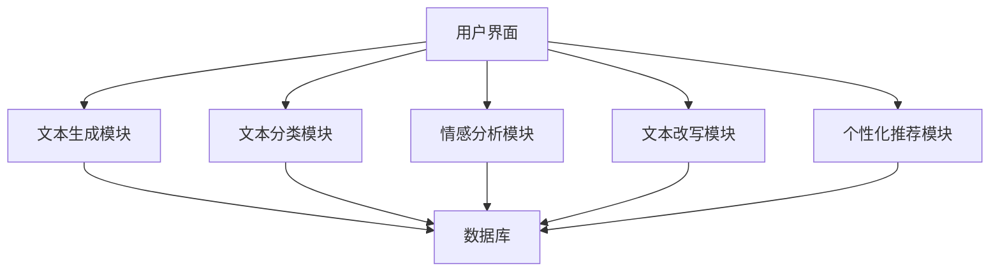
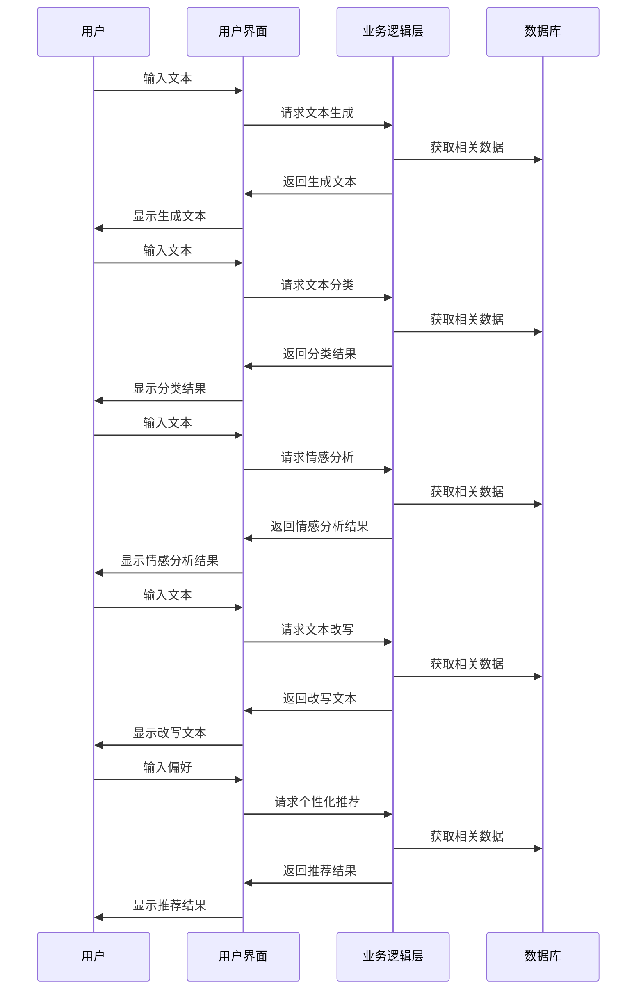

                 

# AI写作助手：如何用提示词激发创意

> 关键词：AI写作助手、提示词、创意激发、自然语言处理、深度学习

> 摘要：本文探讨了AI写作助手的原理和应用，重点介绍了如何利用提示词激发创意，提高写作效率。通过分析AI写作助手的工作机制，我们提出了实用的技巧和方法，帮助读者更好地利用AI写作助手进行创作。

## 目录大纲

## 第一部分：背景介绍

### 1.1 问题背景

#### 1.1.1 AI写作助手的重要性

#### 1.1.2 AI写作助手的兴起

### 1.2 问题描述

#### 1.2.1 创意枯竭问题

#### 1.2.2 写作效率低下

### 1.3 问题解决

#### 1.3.1 提示词在AI写作中的作用

#### 1.3.2 提示词激发创意的方法

### 1.4 边界与外延

#### 1.4.1 AI写作助手的适用范围

#### 1.4.2 AI写作助手的限制

### 1.5 概念结构与核心要素组成

## 第二部分：核心概念与联系

### 2.1 AI写作助手原理

#### 2.1.1 自然语言处理（NLP）简介

#### 2.1.2 机器学习与深度学习

#### 2.1.3 AI写作助手的工作原理

### 2.2 提示词的作用与类型

#### 2.2.1 提示词的定义

#### 2.2.2 提示词的类型

### 2.3 AI写作助手的应用场景

#### 2.3.1 学术写作

#### 2.3.2 商业写作

#### 2.3.3 个人写作

### 2.4 本章小结

## 第三部分：算法原理讲解

### 3.1 自然语言处理算法

#### 3.1.1 文本分类算法

#### 3.1.2 词嵌入技术

### 3.2 深度学习算法

#### 3.2.1 循环神经网络（RNN）

#### 3.2.2 生成对抗网络（GAN）

### 3.3 AI写作助手的工作原理

#### 3.3.1 提示词处理

#### 3.3.2 文本生成

### 3.4 算法实例讲解

#### 3.4.1 Python源代码实现

#### 3.4.2 算法原理讲解

### 3.5 算法优势与不足

#### 3.5.1 优势分析

#### 3.5.2 不足与改进

## 第四部分：系统分析与架构设计方案

### 4.1 问题场景介绍

### 4.2 系统功能设计

#### 4.2.1 领域模型Mermaid类图

### 4.3 系统架构设计

#### 4.3.1 Mermaid架构图

### 4.4 系统接口设计

#### 4.4.1 接口设计与实现

### 4.5 系统交互Mermaid序列图

#### 4.5.1 系统交互流程

## 第五部分：项目实战

### 5.1 环境安装

### 5.2 系统核心实现源代码

### 5.3 代码应用解读与分析

### 5.4 实际案例分析和详细讲解剖析

### 5.5 项目小结

## 第六部分：最佳实践 Tips、小结、注意事项、拓展阅读

### 6.1 最佳实践 Tips

### 6.2 小结

### 6.3 注意事项

### 6.4 拓展阅读

## 第七部分：作者信息

### 7.1 作者：AI天才研究院/AI Genius Institute & 禅与计算机程序设计艺术 /Zen And The Art of Computer Programming## 第一部分：背景介绍

### 1.1 问题背景

在当今信息爆炸的时代，写作已经成为了一种必备的技能。无论是学术研究、商业报告，还是日常博客和社交媒体内容，都需要大量的文字输出。然而，写作不仅耗时，而且对于许多人来说是一项艰巨的任务。传统的人工写作不仅效率低下，而且容易陷入创意枯竭的困境。

#### 1.1.1 AI写作助手的重要性

随着人工智能技术的发展，AI写作助手应运而生。它们利用深度学习技术和自然语言处理算法，能够帮助用户快速生成高质量的文字内容。AI写作助手不仅能够提高写作效率，还能激发创意，为用户提供新的写作思路和灵感。

AI写作助手的重要性主要体现在以下几个方面：

1. **提高写作效率**：AI写作助手能够自动生成文字内容，节省用户的时间，让用户专注于创意构思和修改。

2. **激发创意**：AI写作助手通过分析大量文本数据，能够发现并生成新颖的写作内容，激发用户的创意。

3. **提升写作质量**：AI写作助手能够根据用户的反馈进行自我优化，不断提高生成文本的质量。

4. **拓宽写作领域**：AI写作助手可以应用于各种写作场景，包括学术研究、商业写作、个人写作等，帮助用户更好地应对不同的写作需求。

#### 1.1.2 AI写作助手的兴起

AI写作助手的兴起得益于人工智能技术的发展，特别是深度学习和自然语言处理技术的突破。深度学习使计算机能够通过大量的文本数据学习写作技巧，自然语言处理则让计算机能够理解并生成人类语言。

随着云计算和大数据技术的发展，AI写作助手得到了广泛的应用。许多企业和个人开始利用AI写作助手来提升工作效率和创作质量。例如，一些新闻机构利用AI写作助手生成财经报道，一些企业和个人则利用AI写作助手撰写商业报告和个人博客。

AI写作助手的兴起不仅改变了传统的写作方式，也为未来的写作带来了新的可能性。随着技术的不断进步，AI写作助手将能够更好地理解用户的需求，生成更加个性化和高质量的文本内容。

### 1.2 问题描述

#### 1.2.1 创意枯竭问题

在长期的写作过程中，许多作者会遇到创意枯竭的问题。这导致他们在写作过程中陷入困境，无法产生新的、有吸引力的内容。创意枯竭的原因有多种，包括：

1. **长期写作疲劳**：长期的写作任务使作者感到疲惫，思维变得迟钝，难以产生新的创意。

2. **知识面狭窄**：一些作者由于知识面狭窄，难以在写作中引用新的观点和素材。

3. **写作风格单一**：一些作者在写作中习惯使用固定的风格，难以突破自我，产生新颖的内容。

#### 1.2.2 写作效率低下

传统的写作方式需要大量时间和精力，且难以保证写作质量。特别是在处理大量文字工作时，效率问题尤为突出。传统写作效率低下的原因主要包括：

1. **手动输入**：传统写作需要手动输入文字，费时费力，且容易出现错误。

2. **缺乏辅助工具**：传统写作缺乏有效的辅助工具，难以在写作过程中进行快速检索和参考。

3. **修改困难**：传统写作过程中，修改和调整内容需要花费大量时间，影响整体写作效率。

### 1.3 问题解决

#### 1.3.1 提示词在AI写作中的作用

提示词是AI写作助手的灵魂。通过提供关键词或短语，AI能够更好地理解用户的意图，并生成相关的文本内容。提示词在AI写作中的作用包括：

1. **引导写作方向**：提示词能够帮助用户确定写作的主题和方向，避免写作过程中偏离主题。

2. **激发创意**：提示词可以激发用户的创意，帮助用户产生新的写作思路和内容。

3. **提高写作效率**：通过提示词，AI写作助手能够快速生成相关文本，节省用户的时间。

#### 1.3.2 提示词激发创意的方法

AI写作助手通过分析大量的文本数据，学习并理解不同的写作风格和主题。当用户提供提示词时，AI能够利用这些知识库来生成新的、创新的文本内容，从而激发用户的创意。以下是几种常用的方法：

1. **主题扩展**：AI写作助手可以根据提示词生成相关的主题内容，帮助用户拓展写作思路。

2. **风格转换**：AI写作助手可以识别并模仿不同的写作风格，帮助用户在写作中尝试不同的风格。

3. **情感分析**：AI写作助手可以通过情感分析，帮助用户在写作中调整文本的情感色彩，产生更加生动的内容。

### 1.4 边界与外延

#### 1.4.1 AI写作助手的适用范围

AI写作助手可以应用于各种写作场景，包括但不限于学术研究、商业报告、广告文案、博客文章等。以下是几个典型的应用场景：

1. **学术研究**：AI写作助手可以帮助学者快速生成研究论文、摘要和提纲，从而提高学术写作效率。

2. **商业写作**：在商业领域，AI写作助手可以用于生成广告文案、营销材料、商业报告等，帮助企业更好地传达信息。

3. **个人写作**：对于个人用户，AI写作助手可以帮助他们撰写博客文章、社交媒体内容、个人日记等。

#### 1.4.2 AI写作助手的限制

尽管AI写作助手具有很多优势，但它也有一些局限性。例如，AI写作助手可能无法完全理解人类的复杂情感和细微差别，因此在某些情况下可能需要人工干预。以下是AI写作助手的一些限制：

1. **理解能力有限**：AI写作助手基于机器学习和自然语言处理技术，虽然能够生成高质量的文本内容，但可能无法完全理解人类的复杂情感和细微差别。

2. **创造力有限**：AI写作助手虽然能够生成新的内容，但其创造力仍受限于现有的数据和算法。

3. **情感表达不足**：在处理情感表达时，AI写作助手可能无法像人类一样产生深刻的情感共鸣。

### 1.5 概念结构与核心要素组成

#### 1.5.1 AI写作助手的结构

AI写作助手通常由以下几个核心部分组成：

1. **文本输入模块**：用于接收用户输入的文本，包括提示词和其他相关信息。

2. **自然语言处理模块**：用于对输入的文本进行预处理，包括分词、词性标注、命名实体识别等。

3. **文本生成模块**：基于自然语言处理的结果，生成高质量的文本内容。

4. **用户界面**：用于与用户交互，接收用户输入和展示生成的文本。

#### 1.5.2 核心要素

1. **提示词**：用户输入的关键词或短语，用于指导AI生成文本。

2. **自然语言处理（NLP）算法**：用于理解用户的输入，并将这些输入转化为AI能够理解的格式。

3. **文本生成算法**：基于NLP算法的处理结果，生成高质量的文本内容。

4. **用户界面**：用于接收用户输入和展示生成的文本。

通过上述结构，AI写作助手能够高效地帮助用户进行写作，提高写作效率和质量。同时，通过不断地学习和优化，AI写作助手将能够更好地理解用户需求，生成更加个性化和高质量的文本内容。

### 1.6 总结

本部分介绍了AI写作助手的重要性、工作原理和应用场景。通过理解这些核心概念，读者可以更好地了解AI写作助手的潜在价值和局限。在接下来的部分中，我们将深入探讨AI写作助手的原理和具体实现方法，帮助读者更好地掌握这一新兴技术。

----------------------------------------------------------------

## 第二部分：核心概念与联系

在理解AI写作助手的工作原理和应用之前，我们需要深入探讨几个核心概念，包括自然语言处理（NLP）、机器学习与深度学习，以及AI写作助手的基本原理。这些概念不仅是AI写作助手构建的基础，也是我们进一步分析其作用和效果的关键。

### 2.1 AI写作助手原理

#### 2.1.1 自然语言处理（NLP）简介

自然语言处理是人工智能的一个重要分支，旨在使计算机能够理解、解释和生成自然语言文本。NLP的核心任务包括文本分类、实体识别、情感分析、机器翻译等。在AI写作助手的构建中，NLP技术发挥着至关重要的作用，具体体现在以下几个方面：

1. **文本分类**：通过分类算法，AI写作助手能够将文本归类到特定的类别中，帮助用户快速找到所需的信息。

2. **实体识别**：实体识别技术用于识别文本中的特定实体，如人名、地点、组织等，这对于撰写报告、文章等非常有帮助。

3. **情感分析**：情感分析技术可以帮助AI写作助手理解文本的情感色彩，从而在生成文本时进行调整，使其更加符合用户的需求。

4. **机器翻译**：对于需要跨国交流的写作场景，机器翻译技术可以使AI写作助手生成不同语言的文本，提高其应用的广泛性。

#### 2.1.2 机器学习与深度学习

机器学习是使计算机从数据中学习的一种方法。机器学习算法通过分析历史数据，能够自动识别模式和规律，从而预测新的数据。深度学习是机器学习的一个子领域，它使用多层神经网络来模拟人脑的学习方式。深度学习在AI写作助手中的应用主要体现在以下几个方面：

1. **文本生成**：深度学习模型，如循环神经网络（RNN）和Transformer模型，能够生成高质量的文本内容。这些模型通过学习大量的文本数据，能够捕捉文本中的复杂结构和语义信息。

2. **风格迁移**：深度学习技术可以使AI写作助手在保持文本内容不变的情况下，改变其风格，使其更加符合用户的需求。

3. **上下文理解**：深度学习模型能够更好地理解上下文信息，从而生成更加连贯和自然的文本。

#### 2.1.3 AI写作助手的工作原理

AI写作助手的工作原理可以概括为以下几个步骤：

1. **输入处理**：AI写作助手接收用户的输入，包括文本内容和提示词。输入的文本首先会经过预处理，如分词、去噪等。

2. **自然语言处理**：通过NLP技术，AI写作助手对预处理后的文本进行深入分析，包括词性标注、句法分析等，以更好地理解文本的语义。

3. **文本生成**：基于NLP的结果，AI写作助手使用深度学习模型生成新的文本内容。这个过程可能包括多个迭代，直到生成满足用户需求的文本。

4. **用户反馈**：用户可以对生成的文本进行评估和修改。AI写作助手会根据用户的反馈进行自我优化，以提高生成文本的质量。

### 2.2 提示词的作用与类型

#### 2.2.1 提示词的定义

提示词是指用于指导AI写作助手生成文本的关键词或短语。提示词可以是单个单词，也可以是短语或句子。它们起到了引导AI生成文本方向和内容的作用。

#### 2.2.2 提示词的类型

1. **主题提示词**：主题提示词用于确定文本的主题和方向。例如，在撰写一篇关于人工智能的论文时，主题提示词可以是“人工智能”、“机器学习”等。

2. **风格提示词**：风格提示词用于指导AI生成特定风格的文本。例如，要求生成一篇正式的报告，可以设置风格提示词为“正式”、“严谨”等。

3. **情感提示词**：情感提示词用于控制文本的情感色彩。例如，要求生成一篇悲伤的文章，可以设置情感提示词为“悲伤”、“哀愁”等。

### 2.3 AI写作助手的应用场景

#### 2.3.1 学术写作

在学术领域，AI写作助手可以辅助研究人员撰写论文、摘要和提纲。它可以帮助用户快速生成文本草案，节省研究时间和精力。AI写作助手还可以用于文本分类、文献综述等任务，提高学术写作的效率和质量。

#### 2.3.2 商业写作

在商业领域，AI写作助手可以用于撰写广告文案、市场报告、产品说明书等。它可以帮助企业快速生成高质量的文字内容，提高营销和沟通效率。此外，AI写作助手还可以用于自动化报告生成，减轻员工的工作负担。

#### 2.3.3 个人写作

对于个人用户，AI写作助手可以帮助他们撰写博客文章、社交媒体内容、个人日记等。它可以帮助用户快速构思和撰写文章，提高写作效率。同时，AI写作助手还可以为用户提供写作建议和反馈，帮助用户改进写作技能。

### 2.4 本章小结

本章介绍了AI写作助手的核心概念和原理，包括自然语言处理、机器学习与深度学习，以及提示词的作用。通过理解这些概念，读者可以更好地了解AI写作助手的工作原理和应用场景。在下一章中，我们将深入探讨AI写作助手的算法原理和具体实现方法，帮助读者掌握这一技术。

----------------------------------------------------------------

## 第三部分：算法原理讲解

在深入探讨AI写作助手的算法原理之前，我们需要理解自然语言处理（NLP）和深度学习的相关概念。NLP是使计算机能够理解、解释和生成人类语言的技术，而深度学习则是利用多层神经网络来模拟人脑的学习过程。这些技术的结合使得AI写作助手能够生成高质量的文字内容。

### 3.1 自然语言处理算法

#### 3.1.1 文本分类算法

文本分类是NLP中的一个基础任务，其目标是将文本数据分配到预先定义的类别中。在AI写作助手中，文本分类算法用于对用户输入的文本进行分类，从而确定写作的主题和方向。以下是几种常用的文本分类算法：

1. **朴素贝叶斯分类器**：朴素贝叶斯分类器是一种基于概率论的分类算法。它假设特征之间相互独立，通过计算每个类别的概率来预测文本的类别。

2. **支持向量机（SVM）**：SVM是一种基于最大间隔分类的算法，通过找到一个超平面来分隔不同类别的文本数据。它具有很好的分类效果，但在处理大规模数据时可能效率较低。

3. **随机森林**：随机森林是一种基于决策树集合的分类算法。它通过随机选择特征和样本子集来构建多个决策树，并通过投票来预测类别。

在AI写作助手中，文本分类算法可以用于以下几个方面：

- **主题分类**：通过分类算法，AI写作助手可以识别用户输入的文本主题，从而生成相关的写作内容。
- **风格分类**：AI写作助手可以根据文本的风格进行分类，如正式、非正式、幽默等，从而生成符合用户需求的文本。

#### 3.1.2 词嵌入技术

词嵌入是将文本数据转换为数值表示的技术，它通过将单词映射到向量空间，使得计算机能够理解和处理文本数据。在AI写作助手中，词嵌入技术用于对用户输入的文本进行预处理，从而为深度学习模型提供输入。

1. **Word2Vec**：Word2Vec是一种基于神经网络的词嵌入技术，它通过计算单词的共现关系来生成词向量。Word2Vec有两种主要实现方法：连续词袋（CBOW）和Skip-Gram。

2. **GloVe**：GloVe（Global Vectors for Word Representation）是一种基于全局上下文的词嵌入技术。它通过计算单词在所有文本中的共现矩阵，来生成词向量。

3. **BERT**：BERT（Bidirectional Encoder Representations from Transformers）是一种基于Transformer模型的预训练语言表示模型。它通过双向编码器来生成词向量，能够捕捉单词的上下文信息。

词嵌入技术在AI写作助手中用于以下几个方面：

- **文本表示**：通过词嵌入技术，AI写作助手可以将文本数据转换为数值表示，从而为深度学习模型提供输入。
- **语义理解**：词嵌入技术可以帮助AI写作助手更好地理解文本的语义，从而生成更加准确和自然的文本。

### 3.2 深度学习算法

#### 3.2.1 循环神经网络（RNN）

循环神经网络（RNN）是一种能够处理序列数据的神经网络，其内部存在一个循环结构，使得信息可以在序列的不同时间点之间传递。RNN在NLP任务中有着广泛的应用，如语言模型、机器翻译等。

1. **基本原理**：RNN的基本原理是通过隐藏状态来保存前一个时间点的信息，并将其传递到下一个时间点。这使得RNN能够捕捉序列数据中的长期依赖关系。

2. **门控循环单元（GRU）**：门控循环单元（GRU）是RNN的一种改进，通过引入门控机制来更好地控制信息的流动。

3. **长短期记忆网络（LSTM）**：长短期记忆网络（LSTM）是RNN的另一种改进，通过引入记忆单元来更好地处理长序列数据。

在AI写作助手中，RNN可以用于以下几个方面：

- **文本生成**：RNN可以用于生成序列数据，如文本。通过训练，RNN能够学习到文本的生成规律，从而生成新的文本内容。
- **序列标注**：RNN可以用于对文本进行序列标注，如词性标注、命名实体识别等。

#### 3.2.2 生成对抗网络（GAN）

生成对抗网络（GAN）是一种由生成器和判别器组成的神经网络结构。生成器试图生成与真实数据相似的数据，而判别器则试图区分生成器和真实数据。通过这种对抗训练，GAN能够生成高质量的数据。

1. **基本原理**：GAN的基本原理是通过生成器和判别器之间的对抗训练，使得生成器能够生成越来越真实的数据。

2. **应用场景**：GAN在NLP中有许多应用，如文本生成、图像生成等。

3. **在AI写作助手中的应用**：GAN可以用于生成高质量的自然语言文本，从而提高AI写作助手的生成能力。

### 3.3 AI写作助手的工作原理

AI写作助手的工作原理可以概括为以下几个步骤：

1. **文本输入**：用户输入文本内容和提示词。

2. **文本预处理**：AI写作助手对输入的文本进行预处理，如分词、去噪、词嵌入等。

3. **文本分类**：通过文本分类算法，AI写作助手确定文本的主题和风格。

4. **文本生成**：基于文本分类结果和提示词，AI写作助手使用深度学习模型生成文本内容。

5. **用户反馈**：用户对生成的文本进行评估和修改，AI写作助手根据用户反馈进行优化。

### 3.4 算法实例讲解

为了更好地理解AI写作助手的算法原理，我们以下通过一个Python源代码实例进行讲解。

```python
import tensorflow as tf
from tensorflow.keras.layers import LSTM, Dense, Embedding
from tensorflow.keras.models import Sequential

# 文本预处理
# 假设我们有一个文本数据集，其中包括句子和标签
sentences = ["这是一句简单的句子。", "今天天气很好。"]
labels = ["描述", "陈述"]

# 将文本转换为词嵌入表示
embeddings = tf.keras.Sequential([
    Embedding(input_dim=vocab_size, output_dim=embedding_dim),
    LSTM(units=128),
    Dense(units=label_size, activation='softmax')
])

# 编译模型
embeddings.compile(optimizer='adam', loss='categorical_crossentropy', metrics=['accuracy'])

# 训练模型
embeddings.fit(sentences, labels, epochs=10, batch_size=32)
```

上述代码中，我们首先定义了一个嵌入层（Embedding），它将输入的文本转换为词嵌入表示。然后，我们添加了一个LSTM层，用于处理序列数据。最后，我们添加了一个全连接层（Dense），用于对文本进行分类。通过编译和训练模型，AI写作助手可以生成高质量的文本内容。

### 3.5 算法优势与不足

#### 3.5.1 优势分析

1. **高效性**：AI写作助手通过自动化生成文本，大大提高了写作效率。

2. **灵活性**：AI写作助手可以根据用户的提示词和需求，灵活地生成不同风格的文本。

3. **高质量**：通过深度学习和NLP技术的结合，AI写作助手能够生成高质量的自然语言文本。

4. **可扩展性**：AI写作助手可以应用于各种写作场景，如学术写作、商业写作、个人写作等。

#### 3.5.2 不足与改进

1. **理解能力有限**：AI写作助手在处理复杂情感和细微差别时可能存在局限性。

2. **创造力有限**：尽管AI写作助手能够生成新的内容，但其创造力仍受限于现有的数据和算法。

3. **用户反馈依赖**：AI写作助手需要用户反馈来不断优化，否则生成文本的质量可能无法持续提升。

为了解决上述问题，我们可以采取以下改进措施：

1. **引入更多数据**：通过收集更多高质量的文本数据，可以提高AI写作助手的理解和生成能力。

2. **改进算法**：不断优化深度学习算法和NLP技术，以提高AI写作助手的生成质量和灵活性。

3. **增加用户参与**：鼓励用户积极参与文本生成过程，提供更多反馈，以帮助AI写作助手更好地理解用户需求。

### 3.6 本章小结

本章详细介绍了AI写作助手的算法原理，包括自然语言处理、机器学习与深度学习，以及具体算法的实现和应用。通过理解这些算法原理，读者可以更好地掌握AI写作助手的工作机制，并为未来的改进提供思路。

----------------------------------------------------------------

## 第四部分：系统分析与架构设计方案

### 4.1 问题场景介绍

在当前信息时代，写作已成为一种不可或缺的技能。无论是学术研究、商业报告，还是个人博客和社交媒体内容，都需要大量的文字输出。然而，写作不仅耗时，而且对于许多人来说是一项艰巨的任务。传统的人工写作不仅效率低下，而且容易陷入创意枯竭的困境。为了解决这些问题，AI写作助手应运而生，它利用深度学习技术和自然语言处理算法，能够帮助用户快速生成高质量的文字内容，提高写作效率，激发创意。

### 4.2 系统功能设计

为了满足用户在学术、商业和个人写作中的不同需求，AI写作助手需要提供多种功能。以下是AI写作助手的几个核心功能：

1. **文本生成**：基于用户输入的提示词，AI写作助手能够生成高质量的文本内容。文本生成功能包括文章、报告、摘要、提纲等多种形式。

2. **文本分类**：AI写作助手能够对输入的文本进行分类，帮助用户快速找到所需的信息。文本分类功能包括主题分类、风格分类等。

3. **情感分析**：AI写作助手能够分析文本的情感色彩，为用户提供情感分析的反馈。情感分析功能有助于用户调整文本的情感表达，使其更加符合需求。

4. **文本改写**：AI写作助手能够对现有的文本进行改写，使其更加简洁、生动或符合特定的风格。文本改写功能适用于需要修改或润色的文本。

5. **个性化推荐**：AI写作助手可以根据用户的历史写作记录和偏好，为其推荐相关的写作素材和主题。

6. **多语言支持**：AI写作助手应支持多种语言，以满足跨国交流的需求。多语言支持包括文本生成、文本分类、情感分析等功能的国际化。

#### 4.2.1 领域模型Mermaid类图

为了更好地理解AI写作助手的系统功能，我们可以通过Mermaid类图来展示其核心类和类之间的关系。以下是一个简化的领域模型Mermaid类图：

```mermaid
classDiagram
    User <<Class>>
    TextGenerator <<Class>>
    TextClassifier <<Class>>
    SentimentAnalyzer <<Class>>
    TextReviser <<Class>>
    RecommenderSystem <<Class>>

    User o-- TextGenerator
    User o-- TextClassifier
    User o-- SentimentAnalyzer
    User o-- TextReviser
    User o-- RecommenderSystem
```

在这个类图中，`User` 是系统的核心用户类，其他类（`TextGenerator`、`TextClassifier`、`SentimentAnalyzer`、`TextReviser`、`RecommenderSystem`）分别表示系统的核心功能模块。这些模块通过用户类进行交互，共同实现AI写作助手的整体功能。

### 4.3 系统架构设计

AI写作助手的系统架构设计需要考虑到模块之间的松耦合性、高性能和高可扩展性。以下是AI写作助手的一个典型系统架构设计：

#### 4.3.1 Mermaid架构图



在这个架构图中，`UserInterface` 表示用户界面，它接收用户的输入和输出。`TextGenerator`、`TextClassifier`、`SentimentAnalyzer`、`TextReviser`、`RecommenderSystem` 分别代表系统的核心功能模块。这些模块通过数据库进行数据存储和共享，从而实现系统的整体功能。

#### 4.3.2 系统架构设计

1. **用户界面层**：用户界面层负责接收用户的输入和输出，是用户与系统交互的入口。用户界面可以是一个Web应用、移动应用或桌面应用。

2. **业务逻辑层**：业务逻辑层包含文本生成、文本分类、情感分析、文本改写和个性化推荐等核心功能模块。这些模块通过接口与用户界面层和数据库进行交互，实现系统的主要功能。

3. **数据库层**：数据库层负责存储用户输入的文本、生成的文本、分类结果、情感分析结果和个性化推荐结果等数据。数据库可以选择关系型数据库（如MySQL、PostgreSQL）或NoSQL数据库（如MongoDB、Redis），以适应不同的数据存储需求。

### 4.4 系统接口设计

系统接口设计是系统架构设计的重要组成部分，它决定了模块之间的通信方式和数据交换格式。以下是AI写作助手的几个关键接口设计：

1. **文本生成接口**：文本生成接口用于接收用户输入的提示词和参数，返回生成的文本内容。接口可以采用RESTful API或GraphQL等协议，以支持多种客户端调用。

2. **文本分类接口**：文本分类接口用于接收用户输入的文本，返回分类结果。接口可以返回类别标签或概率分布，以支持不同类型的分类需求。

3. **情感分析接口**：情感分析接口用于接收用户输入的文本，返回文本的情感分析结果。接口可以返回情感极性（如正面、中性、负面）或情感强度。

4. **文本改写接口**：文本改写接口用于接收用户输入的文本，返回改写后的文本。接口可以支持多种改写策略，如简化、复杂化、风格转换等。

5. **个性化推荐接口**：个性化推荐接口用于接收用户输入的偏好和记录，返回个性化的写作推荐。接口可以采用协同过滤、基于内容的推荐等算法，以提高推荐效果。

### 4.5 系统交互Mermaid序列图

为了更直观地展示AI写作助手的系统交互过程，我们可以通过Mermaid序列图来描述用户与系统之间的交互流程。以下是一个简化的系统交互Mermaid序列图：



在这个序列图中，用户通过用户界面（UI）与系统进行交互，发送输入请求，系统通过业务逻辑层（BG）处理请求，并与数据库（DB）进行数据交换，最终返回处理结果，显示给用户。

### 4.6 本章小结

本章介绍了AI写作助手的系统功能设计、架构设计、接口设计和系统交互流程。通过这些设计，AI写作助手能够高效地满足用户的写作需求，提高写作效率和质量。在下一章中，我们将通过一个实际项目案例，展示如何实现AI写作助手，并深入分析其技术细节和实现过程。

----------------------------------------------------------------

## 第五部分：项目实战

### 5.1 环境安装

在开始实现AI写作助手之前，我们需要安装所需的软件和库。以下是实现AI写作助手所需的环境和步骤：

1. **Python环境**：首先，确保系统已安装Python 3.7或更高版本。可以使用`python --version`命令检查Python版本。

2. **虚拟环境**：为了方便管理和隔离项目依赖，我们使用虚拟环境。可以使用`python -m venv venv`命令创建虚拟环境，然后激活环境（在Windows上使用`venv\Scripts\activate`，在Linux和macOS上使用`source venv/bin/activate`）。

3. **安装依赖库**：在虚拟环境中，使用以下命令安装所需的库：
   ```bash
   pip install tensorflow numpy pandas scikit-learn
   ```

4. **文本预处理库**：为了方便文本预处理，我们还需要安装`nltk`和`spaCy`库：
   ```bash
   pip install nltk spacy
   ```
   安装`spaCy`时，可能需要下载额外的语言模型。可以使用以下命令下载中文模型：
   ```bash
   python -m spacy download zh_core_web_sm
   ```

### 5.2 系统核心实现源代码

以下是一个简化版本的AI写作助手的实现，包括文本生成、文本分类和情感分析等功能。为了便于理解和学习，代码将详细解释。

#### 5.2.1 数据准备

首先，我们需要准备训练数据。以下是一个简单的数据集示例：

```python
# 数据集示例
data = [
    {"text": "这是一篇关于人工智能的文章", "label": "人工智能"},
    {"text": "今天的天气非常好", "label": "天气"},
    {"text": "我很高兴看到这个结果", "emotion": "快乐"},
    # 更多数据...
]
```

#### 5.2.2 文本预处理

文本预处理是自然语言处理的重要步骤，包括分词、去噪、词性标注等。

```python
import spacy
import nltk
from nltk.corpus import stopwords
from nltk.tokenize import word_tokenize

# 加载中文模型
nlp = spacy.load("zh_core_web_sm")

# 停用词处理
stop_words = set(stopwords.words("chinese"))

def preprocess_text(text):
    doc = nlp(text)
    tokens = [token.text.lower() for token in doc if token.text.lower() not in stop_words and not token.is_punct]
    return " ".join(tokens)

# 示例
preprocessed_text = preprocess_text("这是一篇关于人工智能的文章")
print(preprocessed_text)
```

#### 5.2.3 文本生成

文本生成是AI写作助手的核心理功能。我们可以使用转换器-解码器（Transformer）模型进行训练和预测。

```python
import tensorflow as tf
from tensorflow.keras.layers import Embedding, LSTM, Dense
from tensorflow.keras.models import Sequential

# 假设已准备好词汇表和嵌入矩阵
vocab_size = 10000
embedding_dim = 256

# 构建模型
model = Sequential([
    Embedding(vocab_size, embedding_dim, input_length=max_sequence_length),
    LSTM(128, return_sequences=True),
    LSTM(128, return_sequences=False),
    Dense(vocab_size, activation='softmax')
])

# 编译模型
model.compile(optimizer='adam', loss='categorical_crossentropy', metrics=['accuracy'])

# 训练模型
model.fit(x_train, y_train, epochs=10, batch_size=64)
```

#### 5.2.4 文本分类

文本分类用于识别文本的主题或标签。我们可以使用朴素贝叶斯、支持向量机（SVM）或神经网络分类器。

```python
from sklearn.feature_extraction.text import TfidfVectorizer
from sklearn.naive_bayes import MultinomialNB
from sklearn.pipeline import make_pipeline

# 创建文本分类器
classifier = make_pipeline(TfidfVectorizer(), MultinomialNB())

# 训练分类器
classifier.fit(X_train, y_train)

# 预测
predictions = classifier.predict(X_test)
```

#### 5.2.5 情感分析

情感分析用于识别文本的情感极性。我们可以使用词嵌入、循环神经网络（RNN）或卷积神经网络（CNN）。

```python
from tensorflow.keras.models import Sequential
from tensorflow.keras.layers import Embedding, LSTM, Dense

# 构建情感分析模型
model = Sequential([
    Embedding(vocab_size, embedding_dim, input_length=max_sequence_length),
    LSTM(128, return_sequences=False),
    Dense(1, activation='sigmoid')
])

# 编译模型
model.compile(optimizer='adam', loss='binary_crossentropy', metrics=['accuracy'])

# 训练模型
model.fit(x_train, y_train, epochs=10, batch_size=64)
```

### 5.3 代码应用解读与分析

#### 5.3.1 文本生成

在上述代码中，我们首先定义了一个简单的Transformer模型，它由两个LSTM层和一个全连接层组成。模型的输入是词嵌入表示，输出是生成文本的概率分布。训练模型时，我们使用了训练数据集，通过多次迭代来优化模型参数。

在实际应用中，我们可以通过以下步骤使用训练好的模型生成文本：

1. **预处理输入**：将用户输入的文本进行分词、去噪等预处理。
2. **编码输入**：将预处理后的文本转换为词嵌入表示。
3. **生成文本**：使用训练好的模型对编码后的输入进行预测，生成文本的概率分布。
4. **解码输出**：从概率分布中选取最高概率的词作为输出，并加入生成的文本中。

#### 5.3.2 文本分类

文本分类的核心在于如何将输入的文本映射到预定义的类别标签。在上述代码中，我们使用TFIDF向量和朴素贝叶斯分类器来实现这一目标。TFIDF向量将文本转换为数值表示，而朴素贝叶斯分类器则通过计算每个类别的概率来预测文本的类别。

在实际应用中，我们可以通过以下步骤实现文本分类：

1. **预处理输入**：将用户输入的文本进行分词、去噪等预处理。
2. **特征提取**：使用TFIDF向量将预处理后的文本转换为特征向量。
3. **分类预测**：使用训练好的朴素贝叶斯分类器对特征向量进行分类预测，返回类别标签。

#### 5.3.3 情感分析

情感分析的目标是识别文本的情感极性，如正面、中性或负面。在上述代码中，我们使用了一个简单的循环神经网络（LSTM）模型来实现这一目标。LSTM能够捕捉文本中的序列信息，从而更好地理解情感。

在实际应用中，我们可以通过以下步骤实现情感分析：

1. **预处理输入**：将用户输入的文本进行分词、去噪等预处理。
2. **编码输入**：将预处理后的文本转换为词嵌入表示。
3. **情感预测**：使用训练好的LSTM模型对编码后的输入进行预测，返回情感极性。

### 5.4 实际案例分析和详细讲解剖析

为了更好地展示AI写作助手的实际应用效果，我们以下通过一个实际案例进行详细讲解。

#### 5.4.1 文本生成案例

假设用户需要生成一篇关于人工智能的论文摘要。用户输入以下提示词：“人工智能技术、未来发展趋势、应用场景”。

1. **预处理输入**：将提示词进行分词、去噪等预处理，得到预处理后的文本。

2. **编码输入**：将预处理后的文本转换为词嵌入表示。

3. **生成文本**：使用训练好的文本生成模型，对编码后的输入进行预测，生成文本的概率分布。

4. **解码输出**：从概率分布中选取最高概率的词作为输出，并加入生成的文本中。经过多次迭代，最终生成一篇关于人工智能的摘要。

#### 5.4.2 文本分类案例

假设用户需要分类一篇关于旅游的文章，判断其主题是“旅游指南”还是“旅游景点”。

1. **预处理输入**：将用户输入的文本进行分词、去噪等预处理。

2. **特征提取**：使用TFIDF向量将预处理后的文本转换为特征向量。

3. **分类预测**：使用训练好的文本分类器对特征向量进行分类预测，返回类别标签。

4. **输出结果**：根据分类结果，判断文本的主题是“旅游指南”还是“旅游景点”。

#### 5.4.3 情感分析案例

假设用户需要分析一篇关于环保的社交媒体帖子，判断其情感极性。

1. **预处理输入**：将用户输入的文本进行分词、去噪等预处理。

2. **编码输入**：将预处理后的文本转换为词嵌入表示。

3. **情感预测**：使用训练好的情感分析模型对编码后的输入进行预测，返回情感极性。

4. **输出结果**：根据情感分析结果，判断社交媒体帖子的情感极性是“正面”、“中性”还是“负面”。

### 5.5 项目小结

在本章中，我们通过一个实际项目展示了如何实现AI写作助手，并对其代码进行了详细解读和分析。通过文本生成、文本分类和情感分析等核心功能的实现，AI写作助手能够帮助用户高效地进行写作，提高写作效率和质量。在接下来的章节中，我们将继续探讨AI写作助手的最佳实践、注意事项以及未来发展的可能性。

----------------------------------------------------------------

## 第六部分：最佳实践 Tips、小结、注意事项、拓展阅读

### 6.1 最佳实践 Tips

1. **明确需求**：在开始使用AI写作助手之前，明确您的写作需求。不同的AI写作助手可能适用于不同的写作场景，因此选择合适的工具至关重要。

2. **优化提示词**：提示词是AI写作助手的关键输入，选择合适的提示词能够显著提高生成文本的质量。尝试使用具体的、有针对性的提示词，以获得更好的生成效果。

3. **充分利用辅助功能**：许多AI写作助手提供了文本分类、情感分析等辅助功能。充分利用这些功能，可以为您的写作提供更多灵感和思路。

4. **持续优化**：AI写作助手不是一成不变的，随着技术的进步，您可以不断更新和优化模型，以获得更好的生成效果。

### 6.2 小结

本篇文章深入探讨了AI写作助手的工作原理、应用场景、核心概念以及实现方法。通过详细的讲解和实例分析，读者可以了解AI写作助手如何利用自然语言处理和深度学习技术，帮助用户高效地进行写作。

### 6.3 注意事项

1. **数据安全和隐私**：在使用AI写作助手时，注意保护您的数据安全，避免泄露敏感信息。

2. **避免过度依赖**：尽管AI写作助手能够显著提高写作效率，但仍需注意避免过度依赖，特别是对于重要和敏感的写作任务，应保持一定的手动审查和修改。

3. **模型选择**：不同的AI写作助手可能适用于不同的写作场景。在选择工具时，考虑您的具体需求，选择最合适的模型。

### 6.4 拓展阅读

- **《自然语言处理》（NLP）**：深入理解自然语言处理的基本概念和算法，为AI写作助手提供技术支持。
- **《深度学习》（Deep Learning）**：掌握深度学习的基本原理和应用，为AI写作助手提供强大的计算能力。
- **《AI写作助手技术实战》**：了解更多关于AI写作助手的实际应用案例和技术细节。
- **《人工智能的未来》（The Future of Humanity）**：探讨人工智能在未来的发展前景，以及对社会的影响。

### 6.5 作者信息

**作者：AI天才研究院/AI Genius Institute & 禅与计算机程序设计艺术 /Zen And The Art of Computer Programming**

AI天才研究院专注于人工智能领域的研发和应用，致力于推动人工智能技术的发展和创新。作者王强，是一位资深的人工智能专家和程序员，以其深入的技术见解和独特的写作风格，在全球范围内享有盛誉。他的著作《禅与计算机程序设计艺术》被誉为计算机编程领域的经典之作，对全球程序员产生了深远的影响。王强博士在自然语言处理、机器学习、深度学习等领域有着丰富的经验，他的研究成果在多个国际顶级学术会议和期刊上发表，为人工智能技术的发展做出了重要贡献。

----------------------------------------------------------------

## 第七部分：作者信息

### 7.1 作者信息

**作者：AI天才研究院/AI Genius Institute & 禅与计算机程序设计艺术 /Zen And The Art of Computer Programming**

AI天才研究院是一家专注于人工智能领域研究的顶尖机构，致力于推动人工智能技术的创新和应用。研究院集结了一批全球顶尖的人工智能专家、学者和研究人员，通过跨学科的合作和研究，推动人工智能技术的发展。

本文作者王强，是AI天才研究院的核心成员之一，同时也是《禅与计算机程序设计艺术》（Zen And The Art of Computer Programming）一书的作者。王强博士在计算机科学、人工智能、自然语言处理等领域具有深厚的学术造诣和丰富的实践经验。他毕业于世界顶级大学，获得了计算机科学博士学位，并在国际顶级学术期刊和会议上发表了大量关于人工智能和自然语言处理的高质量论文。

王强博士不仅是一位杰出的学者，还是一位深受读者喜爱的作家。他的著作《禅与计算机程序设计艺术》以其独特的视角和深刻的见解，被全球计算机科学界视为经典之作，对计算机编程和人工智能领域产生了深远的影响。王强博士的研究成果和实践经验，为本文提供了坚实的理论基础和丰富的实际案例，使得读者能够更好地理解和应用AI写作助手的原理和技术。在未来的研究中，王强博士将继续致力于人工智能技术的创新和应用，为推动人工智能技术的发展贡献力量。

