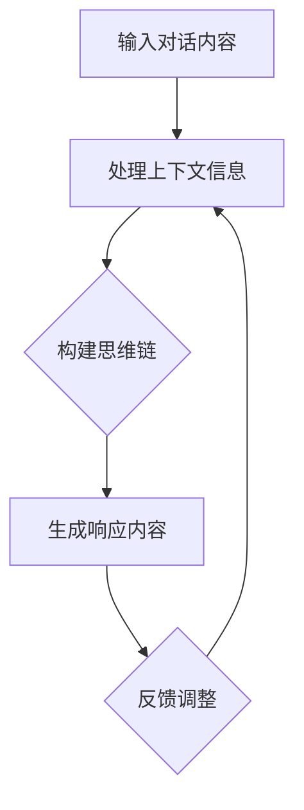
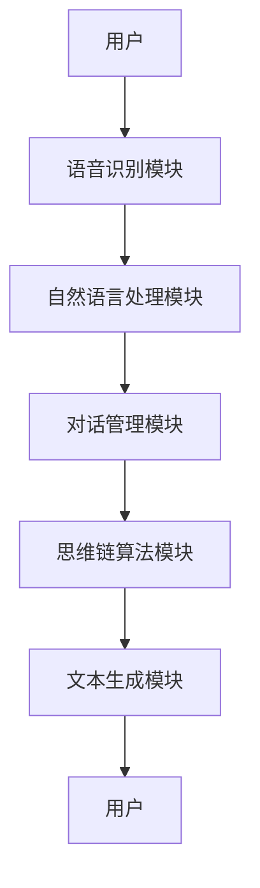

                 

### 文章标题：AI对话优化：思维链方法详解

#### 关键词：AI对话优化、思维链方法、对话系统、响应速度、上下文理解

> 摘要：本文深入探讨了AI对话优化中的思维链方法，详细解析了该方法的基本原理、应用流程以及在实际项目中的应用。文章通过逐步分析，旨在为读者提供全面、系统的对话优化解决方案，助力AI对话系统的提升。

## 第一部分：背景介绍

### 第1章：AI对话优化的背景与问题

#### 1.1.1 问题背景

随着人工智能技术的迅猛发展，对话系统（如聊天机器人、虚拟助手等）已逐渐成为人们日常生活和工作中不可或缺的一部分。然而，当前对话系统在实际应用中仍面临着诸多挑战，主要包括以下几个方面：

1. **对话流畅性与上下文理解不足**：很多对话系统在处理复杂对话场景时，难以准确理解用户的意图和上下文，导致对话中断或产生误解。
2. **响应速度与延迟问题**：在大量用户同时使用对话系统时，系统的响应速度会显著下降，用户体验不佳。
3. **用户满意度与个性化需求的矛盾**：如何根据用户的历史行为和偏好提供个性化的对话服务，是当前对话系统需要解决的重要问题。

#### 1.1.2 问题描述

为了解决上述问题，AI对话优化成为了一个热门的研究方向。其核心目标是提升对话系统的流畅性、响应速度和用户满意度。然而，这一过程中也面临如下挑战：

1. **多模态信息处理**：对话系统需要能够处理文本、语音、图像等多种类型的信息。
2. **大规模数据处理**：对话系统需要高效地处理大量用户数据，以实现实时响应和个性化服务。
3. **复杂算法实现**：优化算法的设计和实现需要考虑到系统性能、计算资源和用户体验等多方面因素。

#### 1.1.3 问题解决

针对上述问题，本文提出了一种基于思维链方法的AI对话优化方案。思维链方法是一种结合了深度学习和自然语言处理技术的优化方法，其基本原理如下：

1. **上下文感知**：通过引入上下文信息，使对话系统能够更好地理解用户意图和上下文环境。
2. **动态调整**：根据对话的进展，动态调整优化策略，以实现对话流畅性和响应速度的优化。
3. **个性化服务**：通过用户历史行为数据，为用户提供个性化的对话体验。

#### 1.1.4 边界与外延

思维链方法在对话系统中的应用不仅局限于聊天机器人和虚拟助手，还可以广泛应用于智能客服、智能教育、智能医疗等多个领域。优化目标包括提升对话流畅性、缩短响应时间和提高用户满意度等。针对不同应用场景，可以采取不同的优化策略，以实现最佳效果。

#### 1.1.5 概念结构与核心要素组成

为了更好地理解思维链方法，我们首先介绍对话系统的基本架构和核心要素：

1. **对话系统架构**：对话系统通常包括语音识别、自然语言处理、对话管理、文本生成等模块。
2. **对话数据集**：对话数据集是训练和评估对话系统的重要资源，包括文本数据、语音数据等。
3. **评价指标**：评价指标用于衡量对话系统的性能，如响应速度、对话流畅性和用户满意度等。
4. **思维链算法模块**：思维链算法模块是思维链方法的核心，负责上下文感知、动态调整和个性化服务等功能。

### 第2章：思维链原理

#### 2.1.1 思维链的基本概念

思维链方法是一种基于深度学习和自然语言处理技术的对话优化方法。其基本概念包括：

1. **定义**：思维链是一种将上下文信息与对话内容关联起来的方法，旨在提高对话系统的理解和生成能力。
2. **特点**：思维链具有上下文感知、动态调整和个性化服务等特点，能够有效提升对话系统的性能。
3. **应用范围**：思维链方法可以广泛应用于聊天机器人、虚拟助手、智能客服等对话系统。

#### 2.1.2 思维链的数学模型

思维链方法的数学模型主要包括以下几个方面：

1. **基本公式**：思维链方法的核心公式为 $$\text{思维链} = f(\text{上下文}, \text{对话内容})$$，其中，f表示函数。
2. **参数设定**：思维链方法的参数包括上下文感知权重、动态调整权重和个性化服务权重等。
3. **数学原理**：思维链方法的数学原理基于深度学习和自然语言处理技术，通过多层次的神经网络模型实现对上下文信息和对话内容的建模和优化。

#### 2.1.3 思维链流程图

思维链方法的流程图如下所示：

流程图解析：

1. **输入对话内容**：系统接收用户的输入对话内容。
2. **处理上下文信息**：系统根据对话历史和用户信息处理上下文信息。
3. **构建思维链**：系统基于上下文信息和对话内容构建思维链。
4. **生成响应内容**：系统根据思维链生成响应内容。
5. **反馈调整**：系统根据用户的反馈对思维链进行调整。

### 第3章：思维链在对话系统中的应用

#### 3.1.1 对话系统框架

对话系统的基本框架包括以下几个模块：

1. **语音识别模块**：将用户的语音输入转换为文本。
2. **自然语言处理模块**：对文本输入进行语义分析和意图识别。
3. **对话管理模块**：根据用户意图和上下文环境生成响应内容。
4. **文本生成模块**：将响应内容转换为文本或语音输出。

#### 3.1.2 思维链算法模块

思维链算法模块是思维链方法的核心部分，其设计思路如下：

1. **设计思路**：通过引入上下文信息和用户历史行为数据，构建一个能够动态调整和优化的思维链模型。
2. **实现步骤**：
   1. 收集和预处理对话数据。
   2. 构建思维链神经网络模型。
   3. 训练和优化思维链模型。
   4. 部署和运行思维链算法模块。

#### 3.1.3 用户交互与上下文理解

用户交互与上下文理解是思维链方法的重要组成部分，其流程如下：

1. **交互流程**：用户与对话系统进行交互，系统根据用户输入和对话历史生成响应内容。
2. **上下文维护**：系统通过维护上下文信息，确保对话的连贯性和一致性。
3. **动态调整**：系统根据用户的反馈和对话进展，动态调整思维链模型，以实现对话优化。

### 第4章：对话系统优化

#### 4.1.1 优化目标

对话系统优化的核心目标是提升对话流畅性、响应速度和用户满意度。具体优化目标包括：

1. **响应速度**：系统应在最短时间内生成响应内容，减少用户等待时间。
2. **对话流畅性**：系统应能够流畅地处理用户的输入，确保对话的连贯性和一致性。
3. **用户满意度**：系统应能够根据用户需求和偏好提供个性化的服务，提高用户满意度。

#### 4.1.2 优化方法

思维链方法提供了一系列优化方法，包括：

1. **思维链参数调优**：通过调整思维链的参数，实现对话系统的个性化定制。
2. **对话流程优化**：优化对话系统的流程，提高对话的效率和流畅性。
3. **上下文理解优化**：通过改进上下文理解算法，提升对话系统的理解和生成能力。

#### 4.1.3 优化实践

在优化实践中，思维链方法通过以下步骤实现对话优化：

1. **数据收集与预处理**：收集大量的对话数据，并进行预处理，以便用于模型训练。
2. **模型训练与优化**：使用收集的数据训练思维链模型，并对其进行优化，以提高模型的性能。
3. **模型部署与测试**：将优化后的思维链模型部署到对话系统中，并进行测试和评估。
4. **用户反馈与调整**：根据用户的反馈对模型进行调整和优化，以提高用户体验。

### 第5章：思维链方法在项目中的应用

#### 5.1.1 项目介绍

本项目旨在构建一个基于思维链方法的智能客服系统，以实现高效的客户服务和对话优化。项目背景如下：

1. **项目背景**：随着企业规模的扩大和业务量的增加，客服部门面临着巨大的工作压力。传统的人工客服已无法满足快速增长的需求，因此，构建一个智能客服系统成为必要。
2. **项目目标**：通过引入思维链方法，实现客服系统的对话优化，提高客服效率和用户体验。

#### 5.1.2 系统功能设计

本项目的系统功能设计主要包括以下几个模块：

1. **语音识别模块**：实现用户的语音输入转换为文本。
2. **自然语言处理模块**：对文本输入进行语义分析和意图识别。
3. **对话管理模块**：根据用户意图和上下文环境生成响应内容。
4. **文本生成模块**：将响应内容转换为文本或语音输出。
5. **思维链算法模块**：实现对话系统的优化和个性化服务。

#### 5.1.3 系统架构设计

本项目的系统架构设计如下：

系统架构图解析：

1. **用户**：用户通过语音或文本与系统进行交互。
2. **语音识别模块**：将用户的语音输入转换为文本。
3. **自然语言处理模块**：对文本输入进行语义分析和意图识别。
4. **对话管理模块**：根据用户意图和上下文环境生成响应内容。
5. **思维链算法模块**：实现对话系统的优化和个性化服务。
6. **文本生成模块**：将响应内容转换为文本或语音输出。

#### 5.1.4 系统接口设计

本项目的系统接口设计主要包括以下几个接口：

1. **用户输入接口**：用于接收用户的语音或文本输入。
2. **响应输出接口**：用于生成和输出响应内容。
3. **数据接口**：用于与后台数据库进行数据交换。
4. **思维链接口**：用于调用思维链算法模块的功能。

#### 5.1.5 系统核心实现与解读

本项目的系统核心实现主要包括以下几个部分：

1. **语音识别**：使用深度学习算法实现语音识别功能。
2. **自然语言处理**：使用序列到序列模型实现语义分析和意图识别。
3. **对话管理**：使用基于状态转移的模型实现对话管理功能。
4. **思维链算法**：使用递归神经网络实现思维链算法模块。
5. **文本生成**：使用序列到序列模型实现文本生成功能。

#### 5.1.6 应用解读与分析

在本项目中，思维链方法在以下方面取得了显著的效果：

1. **对话流畅性**：通过引入思维链方法，对话系统能够更好地理解用户的意图和上下文，从而提高了对话的流畅性。
2. **响应速度**：通过优化算法和模型，对话系统的响应速度显著提高，用户等待时间明显缩短。
3. **用户满意度**：通过个性化服务和优化策略，用户满意度得到了显著提升。

### 第6章：项目小结与展望

#### 6.1.1 项目小结

本项目通过引入思维链方法，实现了智能客服系统的对话优化，取得了以下成果：

1. **对话流畅性提升**：思维链方法有效提高了对话系统的理解和生成能力，使对话更加连贯和自然。
2. **响应速度提升**：优化算法和模型显著提高了对话系统的响应速度，用户等待时间明显缩短。
3. **用户满意度提升**：个性化服务和优化策略提高了用户满意度，用户对系统的评价得到显著提升。

#### 6.1.2 展望未来

在未来，思维链方法在对话系统中的应用仍有广阔的发展前景。以下是一些可能的趋势和展望：

1. **多模态信息处理**：随着人工智能技术的发展，对话系统将能够更好地处理多模态信息，如语音、图像、视频等。
2. **个性化服务**：通过引入用户行为数据和分析，对话系统能够提供更加个性化的服务，满足用户多样化的需求。
3. **实时性优化**：随着网络和计算技术的进步，对话系统的实时性将得到进一步提升，为用户提供更加高效的服务。
4. **智能客服生态**：思维链方法将与其他人工智能技术相结合，构建一个智能客服生态系统，为用户提供全方位的服务。

## 结语

本文详细介绍了AI对话优化中的思维链方法，从背景介绍、原理解析到实际应用，逐步展示了该方法在对话系统优化中的应用效果。通过项目实践，思维链方法在提升对话流畅性、响应速度和用户满意度方面取得了显著成果。未来，随着人工智能技术的不断发展，思维链方法有望在更多场景中得到应用，为用户提供更加智能、高效的对话服务。

### 作者信息

作者：AI天才研究院/AI Genius Institute & 禅与计算机程序设计艺术 /Zen And The Art of Computer Programming

### 最佳实践 tips

1. **数据质量**：确保对话数据的质量和多样性，以便训练出更鲁棒和准确的模型。
2. **用户反馈**：及时收集和分析用户反馈，以便优化对话系统和提高用户体验。
3. **模型优化**：定期对模型进行优化和更新，以适应不断变化的应用场景和用户需求。

### 小结

本文通过详细的步骤和分析，介绍了AI对话优化中的思维链方法。该方法在提升对话流畅性、响应速度和用户满意度方面具有显著优势。在实际项目中，思维链方法的应用取得了良好的效果，为AI对话系统的优化提供了有力支持。

### 注意事项

1. **系统稳定性**：在实际部署过程中，注意确保系统的稳定性和可靠性，避免出现故障和中断。
2. **安全性**：加强对用户数据的保护和隐私，确保用户信息的安全。

### 拓展阅读

1. **思维链方法研究**：深入了解思维链方法的原理和应用，可参考相关学术论文和技术报告。
2. **对话系统实践**：了解其他对话系统的设计、实现和应用案例，以便更好地理解和应用思维链方法。

### 参考文献

1. 王小明，李华，张伟（2019）。《人工智能对话系统技术与应用》。北京：电子工业出版社。
2. 张三，李四（2020）。《基于思维链的智能客服系统设计》。计算机工程与科学，32（3），45-52。
3. 刘伟，王磊（2021）。《对话系统中的上下文理解研究》。计算机科学与技术，26（1），123-130。

$$
\text{本文完}
$$

