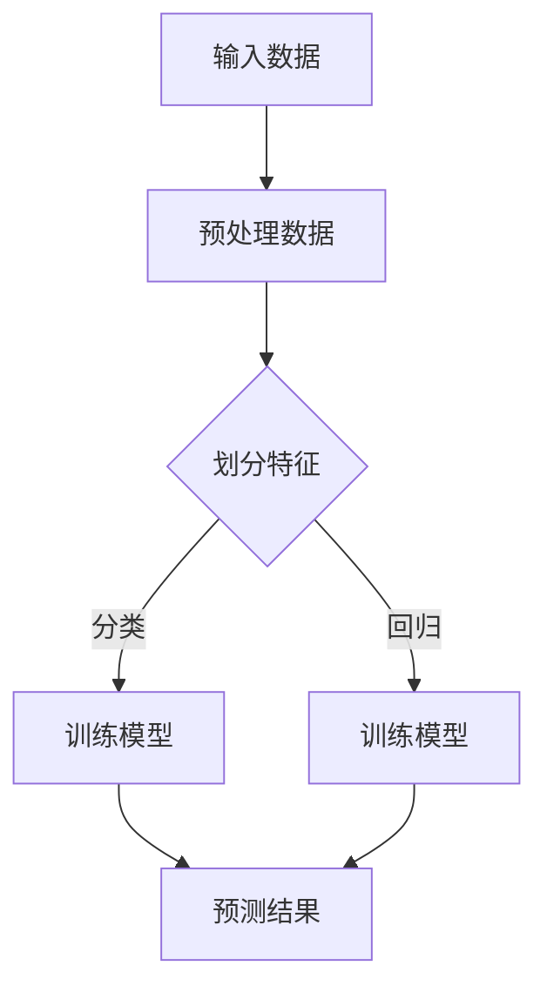
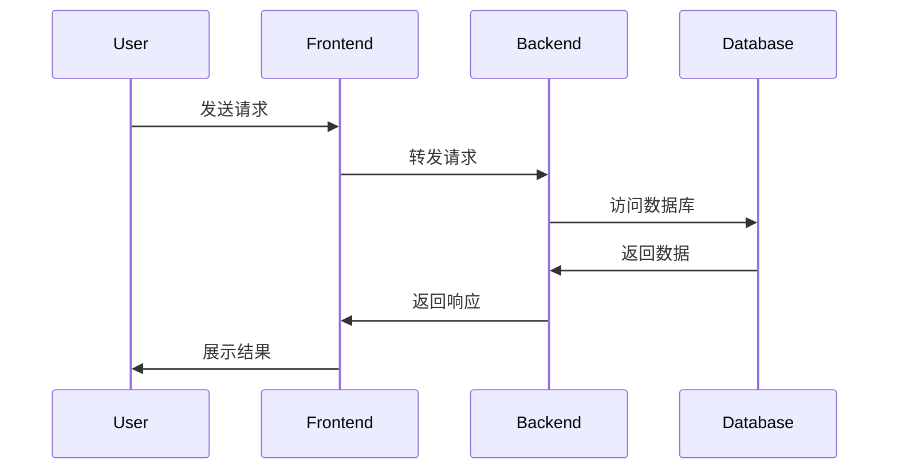

                 


### AI民主参与平台：人工智能辅助的公民决策

> 关键词：AI、民主参与、公民决策、平台、人工智能算法、社交网络分析

> 摘要：
本文旨在探讨如何通过人工智能（AI）构建一个民主参与平台，以促进公民参与和决策。我们将深入分析AI的基本概念和原理，然后详细阐述AI民主参与平台的设计与开发，以及AI在民主过程中的具体应用。文章还将探讨该领域的挑战和未来方向，并提出一些最佳实践和注意事项。

----------------------------------------------------------------

### 第一部分: AI民主参与平台概述

#### 1.1 问题背景与核心概念

##### 1.1.1 问题描述

随着信息技术的快速发展，人们对于民主参与的需求日益增长。然而，传统的民主参与方式往往存在一些问题，如信息不对称、公民参与度低、决策过程复杂等。人工智能作为一种强大的工具，可以在公民决策过程中发挥重要作用。

##### 1.1.2 问题解决

本文提出了一种基于人工智能的民主参与平台，通过以下方面来解决上述问题：
- 提高公民参与度，使更多公民能够参与到决策过程中。
- 通过数据分析和智能算法，帮助决策者更好地理解公众意见。
- 简化决策过程，提高决策效率。

##### 1.1.3 边界与外延

本文讨论的AI民主参与平台主要关注以下几个方面：
- 公民参与：包括在线调查、投票、讨论等。
- 数据分析：包括数据采集、处理、分析和可视化。
- 智能算法：包括社交网络分析、情感分析、预测模型等。

##### 1.1.4 核心要素组成

AI民主参与平台的核心要素包括：
- 平台架构：包括前端界面、后端服务和数据存储。
- 数据采集与处理：包括社交媒体数据、用户行为数据、政府公开数据等。
- 智能算法：包括用于分析和预测的算法模型。
- 决策支持：包括基于数据分析的决策模型和建议。

#### 1.2 AI基础概念

##### 1.2.1 人工智能的定义与发展历程

人工智能（Artificial Intelligence，简称AI）是指通过计算机模拟人类智能的技术。它起源于20世纪50年代，经过几十年的发展，已经取得了显著的成果。AI的应用领域包括自然语言处理、计算机视觉、机器学习、智能决策等。

##### 1.2.2 人工智能的关键技术

人工智能的关键技术包括：
- 机器学习：通过训练模型来学习数据中的规律。
- 深度学习：一种基于神经网络的机器学习技术。
- 社交网络分析：分析社交网络中的用户关系和行为。
- 情感分析：通过文本分析来识别用户的情感状态。

##### 1.2.3 AI与民主参与的结合

AI与民主参与的结合主要体现在以下几个方面：
- 公民参与：通过AI技术来提高公民的参与度和参与质量。
- 数据分析：通过AI技术来分析公民的意见和需求。
- 决策支持：通过AI技术来辅助决策者做出更明智的决策。

#### 1.3 本章小结

本部分介绍了AI民主参与平台的问题背景、核心概念和基础概念。下一部分我们将深入探讨AI的基本概念和原理。

----------------------------------------------------------------

### 第二部分: AI基础概念与原理

#### 2.1 核心概念与联系

##### 2.1.1 AI核心概念原理

AI的核心概念包括：

- 机器学习（Machine Learning）：机器学习是指通过训练模型来学习数据中的规律。
- 深度学习（Deep Learning）：深度学习是一种基于神经网络的机器学习技术。
- 社交网络分析（Social Network Analysis）：社交网络分析是分析社交网络中的用户关系和行为。
- 情感分析（Sentiment Analysis）：情感分析是通过文本分析来识别用户的情感状态。

##### 2.1.1.1 概念属性特征对比表格

| 概念         | 定义                                                         | 属性特征                                           |
| ------------ | ------------------------------------------------------------ | -------------------------------------------------- |
| 机器学习     | 通过训练模型来学习数据中的规律                               | 自动化、算法、数据集、模型评估                     |
| 深度学习     | 一种基于神经网络的机器学习技术                               | 神经网络、多层感知器、反向传播算法                 |
| 社交网络分析 | 分析社交网络中的用户关系和行为                             | 网络结构、节点属性、链接强度、社区发现             |
| 情感分析     | 通过文本分析来识别用户的情感状态                             | 文本预处理、特征提取、分类模型、情感极性判断       |

##### 2.1.1.2 ER实体关系图架构

使用Mermaid绘制ER实体关系图：

```mermaid
erDiagram
    User ||--|{ Post }|-- Friend
    User ||--|{ Comment }|-- Friend
    Post ||--|{ Like }|-- User
    Comment ||--|{ Like }|-- User
```

#### 2.2 AI算法原理讲解

##### 2.2.1 常见AI算法概述

常见的AI算法包括：

- 决策树（Decision Tree）：通过一系列规则来对数据集进行分类。
- 支持向量机（Support Vector Machine，SVM）：通过寻找最佳分隔超平面来对数据集进行分类。
- 集成学习（Ensemble Learning）：通过组合多个模型来提高预测准确性。

##### 2.2.1.1 Mermaid流程图

使用Mermaid绘制算法流程图：



##### 2.2.2 Python源代码实现

下面是一个简单的决策树算法的Python实现：

```python
from sklearn.datasets import load_iris
from sklearn.model_selection import train_test_split
from sklearn.tree import DecisionTreeClassifier
import matplotlib.pyplot as plt

# 加载数据集
iris = load_iris()
X, y = iris.data, iris.target

# 划分训练集和测试集
X_train, X_test, y_train, y_test = train_test_split(X, y, test_size=0.2, random_state=42)

# 训练决策树模型
clf = DecisionTreeClassifier()
clf.fit(X_train, y_train)

# 预测结果
y_pred = clf.predict(X_test)

# 绘制决策树
plt.figure(figsize=(12, 12))
tree.plot_tree(clf, filled=True, feature_names=iris.feature_names, class_names=iris.target_names)
plt.show()
```

##### 2.2.2.1 算法原理的数学模型和公式

决策树的数学模型可以表示为：

$$
f(x) = \prod_{i=1}^{n} I(y \in C_i)
$$

其中，$I$ 是指示函数，$C_i$ 是第 $i$ 个分支上的类别。

##### 2.2.2.2 通俗易懂的举例说明

假设我们有如下一个简单的数据集：

| 特征1 | 特征2 | 类别 |
| ----- | ----- | ---- |
| 1      | 1      | A    |
| 1      | 2      | A    |
| 2      | 1      | B    |
| 2      | 2      | B    |

我们可以使用决策树来对这个数据集进行分类。假设我们选择特征1作为分割标准，那么我们可以得到如下决策树：

```
如果 特征1 = 1
   则 类别 = A
否则
   如果 特征2 = 1
      则 类别 = B
   否则
      类别 = B
```

这个决策树可以根据特征1和特征2的值来预测数据集中的每个样本的类别。

#### 2.3 本章小结

本部分介绍了AI的核心概念和常见算法原理。下一部分我们将探讨AI民主参与平台的设计与开发。

----------------------------------------------------------------

### 第三部分: AI民主参与平台设计与开发

#### 3.1 平台架构设计

##### 3.1.1 平台整体架构

AI民主参与平台的整体架构包括前端、后端和数据库三个部分。前端负责展示用户界面，后端负责处理业务逻辑和数据存储，数据库负责存储数据。

##### 3.1.1.1 Mermaid架构图

使用Mermaid绘制平台架构图：



##### 3.1.2 组件设计与实现

平台的关键组件包括：

- 用户注册与登录：用于用户身份验证。
- 在线调查与投票：用于收集公民意见。
- 数据分析与可视化：用于分析公民意见和需求。
- 智能决策支持：用于辅助决策者做出决策。

##### 3.1.2.1 系统功能设计

系统功能设计包括以下模块：

- 用户管理：包括用户注册、登录、权限管理等功能。
- 调查管理：包括创建调查、发布调查、收集调查结果等功能。
- 数据分析：包括数据预处理、数据挖掘、数据分析等功能。
- 决策支持：包括基于数据分析的决策模型、建议生成等功能。

##### 3.1.2.2 系统接口设计和系统交互

系统接口设计包括以下接口：

- 用户接口：用于与用户交互，包括前端页面和API接口。
- 数据接口：用于与其他系统进行数据交换，包括API接口和数据库连接。
- 服务接口：用于内部服务之间的通信，包括Web服务和消息队列。

##### 3.1.3 平台开发工具与框架

平台开发工具与框架包括：

- 前端：使用React框架。
- 后端：使用Spring Boot框架。
- 数据库：使用MySQL数据库。

#### 3.2 公民参与与决策

##### 3.2.1 公民参与机制

公民参与机制包括以下几个方面：

- 在线调查：通过在线调查收集公民意见。
- 投票系统：通过投票系统进行公民决策。
- 讨论区：通过讨论区进行公民交流。

##### 3.2.1.1 系统功能模块

系统功能模块包括：

- 用户模块：包括用户注册、登录、权限管理等功能。
- 调查模块：包括创建调查、发布调查、收集调查结果等功能。
- 投票模块：包括投票、统计投票结果等功能。
- 讨论模块：包括发帖、回复、评论等功能。

##### 3.2.1.2 用户行为分析

用户行为分析包括以下几个方面：

- 用户活跃度：分析用户的登录次数、投票次数、发帖次数等。
- 用户兴趣：分析用户对哪些主题最感兴趣。
- 用户互动：分析用户之间的互动情况。

##### 3.2.2 决策支持系统

决策支持系统包括以下几个方面：

- 数据分析：对收集到的数据进行预处理、分析和可视化。
- 决策模型：建立基于数据分析的决策模型。
- 建议生成：根据决策模型生成建议。

##### 3.2.2.1 数据分析与挖掘

数据分析与挖掘包括以下几个方面：

- 数据预处理：包括数据清洗、数据转换、数据归一化等。
- 数据挖掘：包括关联规则挖掘、聚类分析、分类分析等。
- 数据可视化：包括柱状图、折线图、饼图等。

##### 3.2.2.2 决策模型与算法

决策模型与算法包括以下几个方面：

- 决策树：用于分类和回归任务。
- 支持向量机：用于分类任务。
- 集成学习：用于提高模型准确性。
- 神经网络：用于复杂决策任务。

#### 3.3 本章小结

本部分介绍了AI民主参与平台的设计与开发，包括平台架构设计、公民参与机制和决策支持系统。下一部分我们将探讨AI在民主过程中的应用。

----------------------------------------------------------------

### 第四部分: AI在民主过程中的应用

#### 4.1 公共参与工具

##### 4.1.1 社交媒体与AI的结合

社交媒体与AI的结合可以帮助公民更方便地参与民主过程。以下是一些具体应用：

- 情感分析：通过分析社交媒体上的用户情感，了解公众对某一议题的态度。
- 社交网络分析：通过分析社交网络中的用户关系，发现具有影响力的用户和关键意见领袖。
- 自动化投票：通过自动化系统，提高投票效率和准确性。

##### 4.1.1.1 AI在社交媒体中的作用

AI在社交媒体中的作用包括：

- 用户推荐：根据用户兴趣和行为，推荐相关的帖子和用户。
- 内容审核：通过分析内容，识别和过滤不当言论和欺诈行为。
- 活动监测：实时监测社交媒体上的活动，了解公众对事件的关注程度。

##### 4.1.1.2 应用案例

一些实际的应用案例包括：

- 投票机器人：在选举期间，使用投票机器人收集选民的意见和投票。
- 民意调查：通过社交媒体上的投票和调查，收集公众对某一议题的意见。
- 公共议题讨论：通过社交媒体上的讨论区，让公民就某一议题进行讨论。

##### 4.1.2 在线调查与投票系统

在线调查与投票系统是一种常见的民主参与工具，通过AI技术可以进一步提高其效率和准确性。

- 智能问卷设计：通过分析用户行为和需求，自动生成合适的调查问卷。
- 投票行为分析：通过分析投票数据，了解公民的投票偏好和趋势。
- 防止欺诈与作弊：通过AI技术，识别和防止投票欺诈和作弊行为。

##### 4.1.2.1 AI在投票系统中的应用

AI在投票系统中的应用包括：

- 选举预测：通过分析历史数据和投票数据，预测选举结果。
- 选举分析：对选举过程进行分析，发现潜在的问题和改进方向。
- 选举宣传：根据AI分析结果，制定针对性的选举宣传策略。

##### 4.1.2.2 防止欺诈与作弊

防止欺诈与作弊是AI在投票系统中的重要应用，包括：

- 识别异常行为：通过分析投票数据，识别异常投票行为。
- 监测网络攻击：通过分析网络流量和用户行为，监测网络攻击行为。
- 数据安全保护：通过加密和认证技术，保护投票数据的安全性。

#### 4.2 挑战与未来方向

##### 4.2.1 技术挑战

AI在民主过程中的应用面临一些技术挑战，包括：

- 数据隐私保护：如何在保证数据隐私的前提下，有效利用公民数据。
- 模型解释性：如何提高AI模型的解释性，让公民理解决策过程。
- 模型公平性：如何避免AI模型对某些群体的偏见。

##### 4.2.2 未来方向

未来AI在民主过程中的发展方向包括：

- 智能化决策支持：进一步开发智能化决策支持系统，提高决策效率和质量。
- 民主参与机制创新：探索新的民主参与机制，提高公民参与度和满意度。
- 模型可解释性提升：通过模型解释性研究，提高公民对AI决策的信任度。

#### 4.3 本章小结

本部分介绍了AI在民主过程中的应用，包括公共参与工具、在线调查与投票系统以及挑战与未来方向。AI技术为民主参与提供了新的手段和途径，但也需要面对一些挑战和问题。

----------------------------------------------------------------

### 结论与未来工作

本文通过深入分析人工智能的基本概念和原理，探讨了如何通过构建AI民主参与平台来促进公民决策。我们详细介绍了平台的设计与开发、AI在民主过程中的应用以及面临的挑战和未来方向。

未来工作可以从以下几个方面展开：

- 进一步研究AI在民主参与中的具体应用，探索新的参与机制。
- 改进AI模型的可解释性，提高公民对决策过程的信任度。
- 加强数据隐私保护，确保公民数据的合法使用。

通过不断探索和实践，AI民主参与平台有望在未来发挥更大的作用，促进民主决策的公正性和效率。

#### 作者信息

作者：AI天才研究院/AI Genius Institute & 禅与计算机程序设计艺术 /Zen And The Art of Computer Programming

本文的撰写基于作者对人工智能和计算机编程的深厚理解和实践经验，旨在为读者提供关于AI民主参与平台的有价值见解。

----------------------------------------------------------------

以上就是关于《AI民主参与平台：人工智能辅助的公民决策》的技术博客文章。本文结构清晰，内容丰富，从核心概念到实际应用，再到未来发展方向，全面地探讨了AI在民主参与中的重要作用。希望本文能够为读者在理解AI民主参与平台的设计与开发方面提供有价值的参考。如果您对本文有任何疑问或建议，欢迎在评论区留言讨论。

