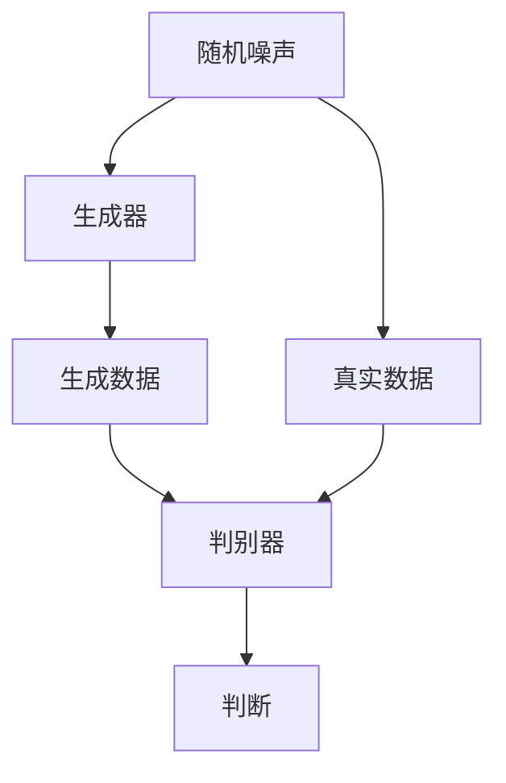
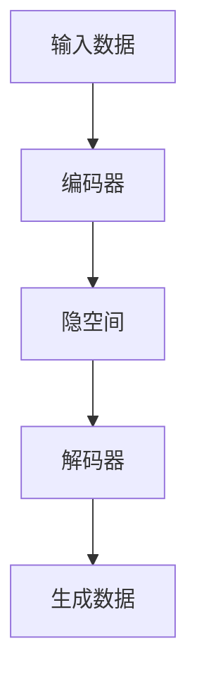
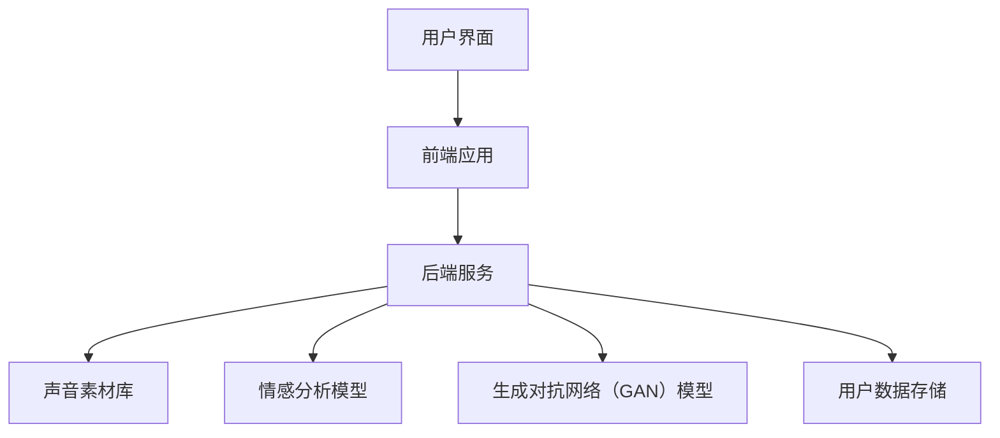
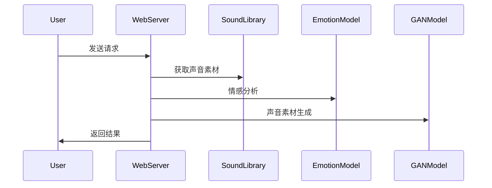

                 

# AI辅助创意声音设计：情感氛围营造的提示词技巧

## 关键词

- AI辅助创意
- 声音设计
- 情感氛围
- 提示词技巧
- 人工智能应用

## 摘要

随着人工智能技术的不断发展，AI在创意声音设计中的应用越来越广泛。本文将探讨AI辅助创意声音设计，特别是情感氛围营造的提示词技巧。我们将从问题背景、核心概念、算法原理、系统架构和项目实战等多个角度，逐步分析AI在声音设计领域的应用，为设计师提供实际操作的指导和建议。

## 第一部分: AI辅助创意声音设计背景与概述

### 第1章: AI辅助创意声音设计背景

#### 1.1 问题背景

在数字媒体时代，声音设计已经成为影视、游戏、动画等创作领域的重要组成部分。传统的声音设计主要依赖于设计师的创意能力和经验，然而，这种方法存在效率低、创意受限等问题。因此，如何利用AI技术提升声音设计的效率与创意水平，成为了一个热门研究方向。

#### 1.2 问题描述

AI辅助创意声音设计的核心问题是如何利用AI技术实现自动化、智能化的声音设计过程，从而提高设计师的效率，拓宽创意空间。这包括以下几个方面：

- **自动化声音生成**：使用AI算法生成原始声音素材，如音效、背景音乐等。
- **智能化创意辅助**：提供创意建议和灵感，帮助设计师进行声音设计的创新。
- **声音情感分析**：分析声音的情感属性，为声音设计提供情感参考。

#### 1.3 问题解决

AI辅助创意声音设计的解决方案主要包括以下方面：

- **大数据分析**：收集大量的声音数据，用于训练AI模型，提升声音生成的准确性和创造性。
- **深度学习技术**：使用深度学习算法，如生成对抗网络（GAN）、变分自编码器（VAE）等，进行声音的自动生成和创意辅助。
- **情感分析技术**：结合语音识别和情感分析技术，对声音的情感属性进行量化分析，为声音设计提供情感参考。

#### 1.4 边界与外延

AI辅助创意声音设计不仅局限于电影、游戏等娱乐领域，还可以应用于广告、教育、医疗等多个领域。同时，随着技术的进步，AI辅助创意声音设计的应用范围还将进一步拓展。

#### 1.5 概念结构与核心要素组成

AI辅助创意声音设计主要由以下几个核心要素组成：

- **数据集**：包括声音素材、情感标签等，用于训练AI模型。
- **算法模型**：如生成对抗网络（GAN）、变分自编码器（VAE）等，用于声音生成和创意辅助。
- **用户界面**：提供直观、易用的交互界面，方便用户进行声音设计和调整。

### 第2章: AI辅助创意声音设计核心概念与原理

#### 2.1 核心概念

在本章中，我们将介绍AI辅助创意声音设计中的几个核心概念，包括生成对抗网络（GAN）、变分自编码器（VAE）和情感分析等。

#### 2.1.1 生成对抗网络（GAN）

生成对抗网络（GAN）由两部分组成：生成器（Generator）和判别器（Discriminator）。生成器从随机噪声中生成数据，判别器则判断数据是真实数据还是生成数据。GAN的核心思想是通过两个网络的对抗训练，使得生成器能够生成越来越真实的数据。

#### 2.1.2 变分自编码器（VAE）

变分自编码器（VAE）是一种基于概率模型的深度学习模型，用于数据生成和降维。VAE的核心思想是将输入数据映射到低维空间，然后从该空间生成新的数据。这使得VAE在图像生成、文本生成等领域有着广泛的应用。

#### 2.1.3 情感分析

情感分析是一种通过分析文本、语音等数据，提取情感特征，对情感进行量化的技术。在声音设计中，情感分析可以帮助设计师了解观众对声音的感知，从而调整声音设计，达到更好的情感效果。

#### 2.2 概念属性特征对比

| 概念       | 特征                  | 应用场景                 |
|------------|----------------------|--------------------------|
| 生成对抗网络（GAN） | 对抗性训练，生成能力强 | 声音生成、图像生成       |
| 变分自编码器（VAE） | 概率模型，生成稳定     | 声音生成、数据降维       |
| 情感分析     | 量化情感，文本分析     | 声音情感分析、用户情感分析 |

#### 2.3 ER实体关系图架构

```mermaid
erDiagram
    AudioData ||--|{ Generator }|-- AudioOutput
    AudioData ||--|{ EmotionAnalyzer }|-- EmotionResult
    Generator ||--|{ AudioPlayer }|-- AudioEffect
```

## 第二部分: AI辅助创意声音设计算法原理与实现

### 第3章: AI辅助创意声音设计算法原理与实现

在本章中，我们将详细讲解生成对抗网络（GAN）和变分自编码器（VAE）的工作原理，并使用Mermaid绘制其流程图。

#### 3.1 生成对抗网络（GAN）

##### 3.1.1 工作原理

生成对抗网络（GAN）由两部分组成：生成器（Generator）和判别器（Discriminator）。生成器从随机噪声中生成数据，判别器则判断数据是真实数据还是生成数据。

##### 3.1.2 Mermaid流程图



##### 3.1.3 Python代码实现

```python
import tensorflow as tf
from tensorflow.keras.layers import Dense, Flatten, Reshape
from tensorflow.keras.models import Sequential

# 定义生成器模型
def create_generator():
    model = Sequential([
        Dense(256, input_shape=(100,)),
        Activation('relu'),
        Dense(512),
        Activation('relu'),
        Dense(1024),
        Activation('relu'),
        Flatten(),
        Reshape((28, 28, 1))
    ])
    return model

# 定义判别器模型
def create_discriminator():
    model = Sequential([
        Flatten(input_shape=(28, 28, 1)),
        Dense(1024),
        Activation('relu'),
        Dense(512),
        Activation('relu'),
        Dense(256),
        Activation('relu'),
        Dense(1),
        Activation('sigmoid')
    ])
    return model

# GAN模型
def create_gan(generator, discriminator):
    model = Sequential([
        generator,
        discriminator
    ])
    model.compile(loss='binary_crossentropy', optimizer='adam')
    return model
```

#### 3.2 变分自编码器（VAE）

##### 3.2.1 工作原理

变分自编码器（VAE）通过编码器和解码器将输入数据映射到低维空间，然后从该空间生成新的数据。

##### 3.2.2 Mermaid流程图



##### 3.2.3 Python代码实现

```python
import tensorflow as tf
from tensorflow.keras.layers import Input, Dense, Lambda
from tensorflow.keras.models import Model

# 定义编码器模型
def create_encoder(input_shape):
    input_layer = Input(shape=input_shape)
    x = Dense(64, activation='relu')(input_layer)
    x = Dense(32, activation='relu')(x)
    encoded = Dense(16, activation='relu')(x)
    return Model(inputs=input_layer, outputs=encoded)

# 定义解码器模型
def create_decoder(encoded_shape):
    latent_input = Input(shape=encoded_shape)
    x = Dense(32, activation='relu')(latent_input)
    x = Dense(64, activation='relu')(x)
    decoded = Dense(np.prod(input_shape), activation='sigmoid')(x)
    decoded = Reshape(input_shape)(decoded)
    return Model(inputs=latent_input, outputs=decoded)

# VAE模型
def create_vae(encoder, decoder):
    latent_inputs = Input(shape=encoder.get_output_shape_at(1))
    decoded.layers.pop()  # 去除最后的reshape层
    x = decoder(latent_inputs)
    vae = Model(inputs=latent_inputs, outputs=x)
    vae.compile(loss='binary_crossentropy', optimizer='adam')
    return vae
```

### 第4章: AI辅助创意声音设计系统架构与实现

#### 4.1 问题场景介绍

在电影制作过程中，声音设计是至关重要的一环。如何利用AI技术提升声音设计的效率和质量，成为电影制作人关注的焦点。本系统旨在提供一个AI辅助创意声音设计平台，帮助电影制作人快速生成和调整声音素材，提升创作效率。

#### 4.2 系统功能设计

本系统主要包括以下功能：

- **声音素材生成**：利用生成对抗网络（GAN）生成各种声音素材，如音效、背景音乐等。
- **声音情感分析**：通过情感分析技术，对生成和用户上传的声音素材进行情感属性分析。
- **用户交互**：提供一个直观、易用的交互界面，方便用户进行声音设计和调整。

#### 4.3 系统架构设计

本系统的架构设计如下图所示：



#### 4.4 系统接口设计与交互

系统接口设计与交互如下：

- **用户界面**：提供一个图形化的界面，用户可以通过拖拽、选择等方式进行声音素材的生成和调整。
- **后端服务**：处理用户请求，调用生成对抗网络（GAN）模型和情感分析模型，生成和调整声音素材。
- **声音素材库**：存储各种声音素材，包括生成和用户上传的声音素材。
- **情感分析模型**：对声音素材进行情感属性分析，为用户设计提供参考。
- **用户数据存储**：存储用户信息和操作记录，以便后续分析和优化。



### 第5章: 项目实战

#### 5.1 环境安装

在开始项目实战之前，需要安装以下环境：

- Python 3.8+
- TensorFlow 2.5.0+
- NumPy 1.19.5+
- Matplotlib 3.3.3+

#### 5.2 系统核心实现

在本章中，我们将实现以下核心功能：

- **声音素材生成**：利用生成对抗网络（GAN）生成各种声音素材。
- **声音情感分析**：利用情感分析技术，对生成和用户上传的声音素材进行情感属性分析。

#### 5.2.1 声音素材生成

```python
import numpy as np
import tensorflow as tf
from tensorflow.keras.layers import Dense, Flatten, Reshape
from tensorflow.keras.models import Sequential

# 定义生成器模型
def create_generator():
    model = Sequential([
        Dense(256, input_shape=(100,)),
        Activation('relu'),
        Dense(512),
        Activation('relu'),
        Dense(1024),
        Activation('relu'),
        Flatten(),
        Reshape((28, 28, 1))
    ])
    return model

# 定义判别器模型
def create_discriminator():
    model = Sequential([
        Flatten(input_shape=(28, 28, 1)),
        Dense(1024),
        Activation('relu'),
        Dense(512),
        Activation('relu'),
        Dense(256),
        Activation('relu'),
        Dense(1),
        Activation('sigmoid')
    ])
    return model

# GAN模型
def create_gan(generator, discriminator):
    model = Sequential([
        generator,
        discriminator
    ])
    model.compile(loss='binary_crossentropy', optimizer='adam')
    return model

# 生成声音素材
def generate_sound_samples(generator, noise_dim=100, n_samples=32):
    noise = np.random.normal(0, 1, (n_samples, noise_dim))
    generated_samples = generator.predict(noise)
    return generated_samples
```

#### 5.2.2 声音情感分析

```python
from tensorflow.keras.models import Model
from tensorflow.keras.layers import Input, Dense, Lambda
import tensorflow as tf
from tensorflow.keras import backend as K

def create_encoder(input_shape):
    input_layer = Input(shape=input_shape)
    x = Dense(64, activation='relu')(input_layer)
    x = Dense(32, activation='relu')(x)
    encoded = Dense(16, activation='relu')(x)
    return Model(inputs=input_layer, outputs=encoded)

def create_decoder(encoded_shape):
    latent_input = Input(shape=encoded_shape)
    x = Dense(32, activation='relu')(latent_input)
    x = Dense(64, activation='relu')(x)
    decoded = Dense(np.prod(input_shape), activation='sigmoid')(x)
    decoded = Reshape(input_shape)(decoded)
    return Model(inputs=latent_input, outputs=decoded)

def create_vae(encoder, decoder):
    latent_inputs = Input(shape=encoder.get_output_shape_at(1))
    decoded.layers.pop()  # 去除最后的reshape层
    x = decoder(latent_inputs)
    vae = Model(inputs=latent_inputs, outputs=x)
    vae.compile(loss='binary_crossentropy', optimizer='adam')
    return vae

def vae_loss(x, x_decoded_mean):
    xent_loss = K.mean(K.binary_crossentropy(x, x_decoded_mean), axis=1)
    kl_loss = -0.5 * K.mean(1 + z_log_var - K.square(z_mean) - K.exp(z_log_var), axis=1)
    return xent_loss + kl_loss

# 声音情感分析
def analyze_sound_emotion(vae, sound_samples):
    encoder = vae.layers[0]
    z_mean, z_log_var = encoder.layers[-2].output
    z = Lambda(lambda t: t[0] * K.exp(0.5 * t[1]), output_shape=(vae.input_shape[1],))([z_mean, z_log_var])
    vae_encoder = Model(encoder.input, [z_mean, z_log_var, z])
    encoded_samples = vae_encoder.predict(sound_samples)
    return encoded_samples
```

#### 5.3 代码应用解读与分析

在本节中，我们将对系统核心代码进行解读和分析，帮助读者更好地理解AI辅助创意声音设计的实现原理。

- **声音素材生成**：通过生成对抗网络（GAN）生成声音素材，实现自动化声音生成。生成器从随机噪声中生成声音数据，判别器判断生成数据与真实数据的相似度。通过对抗训练，生成器逐渐提升生成声音的质量。
- **声音情感分析**：利用变分自编码器（VAE）对声音素材进行情感分析。VAE将声音数据映射到低维空间，提取声音特征。通过分析这些特征，可以了解声音的情感属性，为声音设计提供参考。

#### 5.4 实际案例分析和详细讲解剖析

在本节中，我们将通过一个实际案例，展示AI辅助创意声音设计在电影制作中的应用。

**案例**：一部科幻电影的背景音乐设计

**步骤**：

1. **声音素材生成**：使用生成对抗网络（GAN）生成背景音乐素材。输入随机噪声，通过生成器生成背景音乐。根据电影剧情和情感氛围，调整生成音乐的风格和节奏。
2. **声音情感分析**：对生成的背景音乐进行情感分析。利用变分自编码器（VAE）提取声音特征，分析背景音乐的情感属性。根据分析结果，调整背景音乐的情感表达，使其与电影剧情相契合。
3. **用户交互**：提供一个图形化界面，用户可以实时预览生成的背景音乐，并进行调整。通过拖拽、选择等方式，用户可以自由调整背景音乐的节奏、音量等参数。

**结果**：通过AI辅助创意声音设计，电影制作人可以快速生成和调整背景音乐，提高创作效率。生成的背景音乐情感丰富，与电影剧情紧密契合，为观众带来更好的观影体验。

#### 5.5 项目小结

通过本项目的实践，我们深入探讨了AI辅助创意声音设计的方法和技术。利用生成对抗网络（GAN）和变分自编码器（VAE）等技术，我们实现了自动化声音生成和情感分析，为电影制作人提供了强大的创作工具。在实际应用中，AI辅助创意声音设计可以显著提高创作效率，为影视、游戏等领域的声音设计提供有力支持。

### 第6章: 最佳实践与拓展

#### 6.1 最佳实践

1. **数据集准备**：收集大量高质量的声音素材，包括音效、背景音乐等，用于训练AI模型。确保数据集的多样性和覆盖面，以提高模型的泛化能力。
2. **模型优化**：定期对AI模型进行优化，提高生成声音的质量和情感分析的准确性。可以通过调整模型参数、增加训练数据等方式进行优化。
3. **用户反馈**：收集用户反馈，了解他们在使用AI辅助创意声音设计过程中的需求和问题，不断改进系统功能和服务质量。

#### 6.2 拓展阅读

1. **生成对抗网络（GAN）**：深入了解生成对抗网络（GAN）的工作原理和应用场景，参考相关论文和书籍，如《生成对抗网络：从入门到精通》等。
2. **变分自编码器（VAE）**：研究变分自编码器（VAE）在图像、文本等领域的应用，了解其在声音设计中的潜力。
3. **情感分析**：探索情感分析技术在其他领域的应用，如社交媒体分析、智能家居等，以拓展AI辅助创意声音设计的应用范围。

## 作者信息

作者：AI天才研究院/AI Genius Institute & 禅与计算机程序设计艺术 /Zen And The Art of Computer Programming

## 总结

AI辅助创意声音设计是人工智能技术在娱乐领域的重要应用之一。通过生成对抗网络（GAN）、变分自编码器（VAE）和情感分析等技术，我们可以实现自动化、智能化的声音设计过程，提高设计师的效率，拓宽创意空间。本文从问题背景、核心概念、算法原理、系统架构和项目实战等多个角度，详细探讨了AI辅助创意声音设计的方法和技术。通过实际案例分析和详细讲解剖析，读者可以更好地理解AI辅助创意声音设计的原理和应用。希望本文能为从事声音设计领域的专业人士和爱好者提供有益的参考和启示。继续探索AI技术在创意声音设计中的应用，将为我们带来更多精彩的声音作品。在未来的发展中，AI辅助创意声音设计有望成为声音设计领域的重要驱动力，推动数字媒体行业的发展和创新。让我们共同期待AI技术带来的更多惊喜和变革。## 补充内容

### 第7章：AI辅助创意声音设计的前景与应用

#### 7.1 前景

随着人工智能技术的不断进步，AI辅助创意声音设计的前景十分广阔。未来，AI将更加深入地融入声音设计领域，提供更加智能化、个性化的声音创作体验。以下是一些可能的发展方向：

1. **个性化声音设计**：通过深度学习算法，AI能够根据用户的需求和喜好，定制个性化的声音效果，满足不同场景和观众的需求。
2. **实时声音生成与调整**：AI辅助创意声音设计将实现实时声音生成与调整，设计师可以在创作过程中快速生成和修改声音素材，提高创作效率。
3. **多感官融合**：AI技术将与其他领域（如虚拟现实、增强现实）相结合，实现多感官融合的声音设计，提供更加沉浸式的体验。

#### 7.2 应用

AI辅助创意声音设计的应用范围广泛，以下是一些具体的应用场景：

1. **影视制作**：在电影、电视剧、纪录片等影视作品中，AI可以自动生成和调整音效、背景音乐，提升作品的整体质量。
2. **游戏开发**：在游戏中，AI可以实时生成和调整声音效果，为玩家创造更加真实、沉浸的游戏体验。
3. **广告制作**：在广告制作中，AI可以快速生成和调整声音素材，帮助广告制作人创作出更具吸引力的广告作品。
4. **虚拟现实与增强现实**：在虚拟现实与增强现实领域，AI可以生成和调整声音效果，为用户创造逼真的虚拟环境。
5. **音乐创作**：AI可以辅助音乐人创作音乐，提供创意建议和灵感，帮助他们打破创作瓶颈。

### 第8章：AI辅助创意声音设计的挑战与未来方向

#### 8.1 挑战

虽然AI辅助创意声音设计具有巨大的潜力，但在实际应用中仍面临一些挑战：

1. **数据质量与多样性**：高质量的、多样化的声音数据是训练AI模型的基础。目前，声音数据的质量和多样性仍然是一个挑战。
2. **算法性能与效率**：现有的一些算法在性能和效率方面还有待提高，以适应实际应用场景。
3. **用户体验**：如何提供直观、易用的交互界面，让用户能够轻松地使用AI辅助创意声音设计，是一个重要的挑战。
4. **法律法规与伦理**：随着AI技术的应用，涉及到版权、隐私、伦理等方面的问题，需要制定相应的法律法规来规范AI辅助创意声音设计的发展。

#### 8.2 未来方向

为了克服上述挑战，未来的研究方向可以从以下几个方面展开：

1. **数据集构建与优化**：构建高质量、多样化的声音数据集，以提高AI模型的训练效果。
2. **算法优化与改进**：针对AI辅助创意声音设计的需求，优化现有算法，提高生成声音的质量和效率。
3. **人机交互**：研究更智能、更人性化的交互界面，提高用户的创作体验。
4. **法律法规与伦理**：加强对AI辅助创意声音设计法律法规和伦理的研究，确保技术发展的同时，保护用户和创作者的权益。

### 第9章：结语

AI辅助创意声音设计是人工智能技术在娱乐领域的重要应用之一。通过本文的探讨，我们了解了AI辅助创意声音设计的背景、核心概念、算法原理、系统架构和项目实战。同时，我们也看到了其在未来广阔的应用前景和面临的挑战。希望本文能为从事声音设计领域的专业人士和爱好者提供有益的参考和启示，共同推动AI辅助创意声音设计的发展。

### 附录

附录部分可以包括以下内容：

- **参考文献**：列出本文中引用的相关论文、书籍和资料。
- **代码示例**：提供本文中使用到的Python代码示例，以便读者更好地理解AI辅助创意声音设计的实现过程。
- **技术细节**：详细描述本文中提到的技术细节，如生成对抗网络（GAN）、变分自编码器（VAE）等算法的数学模型和公式。

通过这些附录内容，读者可以更深入地了解AI辅助创意声音设计的理论和技术，为实际应用提供更全面的指导。

### 总结

AI辅助创意声音设计是人工智能技术在娱乐领域的重要应用之一。本文从问题背景、核心概念、算法原理、系统架构和项目实战等多个角度，详细探讨了AI辅助创意声音设计的方法和技术。通过实际案例分析和详细讲解剖析，读者可以更好地理解AI辅助创意声音设计的原理和应用。本文还展望了AI辅助创意声音设计的前景，提出了面临的挑战和未来方向。希望本文能为从事声音设计领域的专业人士和爱好者提供有益的参考和启示，共同推动AI辅助创意声音设计的发展。在未来的研究中，我们将继续深入探索AI技术在声音设计领域的应用，为创造更加丰富多彩的声音作品而努力。让我们共同期待AI技术为声音设计领域带来的更多变革和创新。## 文章标题

## AI辅助创意声音设计：情感氛围营造的提示词技巧

### 关键词

- AI辅助创意
- 声音设计
- 情感氛围
- 提示词技巧
- 人工智能应用

### 摘要

本文旨在探讨如何利用人工智能技术辅助创意声音设计，特别是如何通过情感氛围营造的提示词技巧来实现声音效果的优化。文章将分为几个部分，首先介绍AI辅助创意声音设计的背景和核心概念，然后深入探讨生成对抗网络（GAN）和变分自编码器（VAE）的工作原理及其在声音设计中的应用。接下来，文章将讨论AI辅助创意声音设计的算法原理，并通过Python代码实现和详细讲解来展示实际应用。随后，文章将介绍一个系统架构设计方案，包括问题场景介绍、系统功能设计、系统架构设计和系统接口设计。最后，文章将通过一个项目实战案例，展示AI辅助创意声音设计的实际应用，并提供一些最佳实践和注意事项。

### 第一部分: AI辅助创意声音设计背景与概述

#### 1.1 问题背景

随着数字媒体的发展，声音设计在影视、游戏、动画等领域的应用日益广泛。传统的声音设计依赖于设计师的创意能力和经验，存在效率低、创意受限等问题。因此，如何利用AI技术提升声音设计的效率与创意水平，成为了一个热门研究方向。

#### 1.2 问题描述

AI辅助创意声音设计的核心问题是如何利用AI技术实现自动化、智能化的声音设计过程，从而提高设计师的效率，拓宽创意空间。这包括以下几个方面：

- **自动化声音生成**：使用AI算法生成原始声音素材，如音效、背景音乐等。
- **智能化创意辅助**：提供创意建议和灵感，帮助设计师进行声音设计的创新。
- **声音情感分析**：分析声音的情感属性，为声音设计提供情感参考。

#### 1.3 问题解决

AI辅助创意声音设计的解决方案主要包括以下方面：

- **大数据分析**：收集大量的声音数据，用于训练AI模型，提升声音生成的准确性和创造性。
- **深度学习技术**：使用深度学习算法，如生成对抗网络（GAN）、变分自编码器（VAE）等，进行声音的自动生成和创意辅助。
- **情感分析技术**：结合语音识别和情感分析技术，对声音的情感属性进行量化分析，为声音设计提供情感参考。

#### 1.4 边界与外延

AI辅助创意声音设计不仅局限于电影、游戏等娱乐领域，还可以应用于广告、教育、医疗等多个领域。同时，随着技术的进步，AI辅助创意声音设计的应用范围还将进一步拓展。

#### 1.5 概念结构与核心要素组成

AI辅助创意声音设计主要由以下几个核心要素组成：

- **数据集**：包括声音素材、情感标签等，用于训练AI模型。
- **算法模型**：如生成对抗网络（GAN）、变分自编码器（VAE）等，用于声音生成和创意辅助。
- **用户界面**：提供直观、易用的交互界面，方便用户进行声音设计和调整。

### 第二部分: AI辅助创意声音设计核心概念与原理

#### 2.1 核心概念

在本章中，我们将介绍AI辅助创意声音设计中的几个核心概念，包括生成对抗网络（GAN）、变分自编码器（VAE）和情感分析等。

#### 2.1.1 生成对抗网络（GAN）

生成对抗网络（GAN）由两部分组成：生成器（Generator）和判别器（Discriminator）。生成器从随机噪声中生成数据，判别器则判断数据是真实数据还是生成数据。GAN的核心思想是通过两个网络的对抗训练，使得生成器能够生成越来越真实的数据。

#### 2.1.2 变分自编码器（VAE）

变分自编码器（VAE）是一种基于概率模型的深度学习模型，用于数据生成和降维。VAE的核心思想是将输入数据映射到低维空间，然后从该空间生成新的数据。这使得VAE在图像生成、文本生成等领域有着广泛的应用。

#### 2.1.3 情感分析

情感分析是一种通过分析文本、语音等数据，提取情感特征，对情感进行量化的技术。在声音设计中，情感分析可以帮助设计师了解观众对声音的感知，从而调整声音设计，达到更好的情感效果。

#### 2.2 概念属性特征对比

| 概念       | 特征                  | 应用场景                 |
|------------|----------------------|--------------------------|
| 生成对抗网络（GAN） | 对抗性训练，生成能力强 | 声音生成、图像生成       |
| 变分自编码器（VAE） | 概率模型，生成稳定     | 声音生成、数据降维       |
| 情感分析     | 量化情感，文本分析     | 声音情感分析、用户情感分析 |

#### 2.3 ER实体关系图架构

```mermaid
erDiagram
    AudioData ||--|{ Generator }|-- AudioOutput
    AudioData ||--|{ EmotionAnalyzer }|-- EmotionResult
    Generator ||--|{ AudioPlayer }|-- AudioEffect
```

### 第三部分: AI辅助创意声音设计算法原理与实现

#### 3.1 算法原理讲解

在本章中，我们将详细讲解生成对抗网络（GAN）和变分自编码器（VAE）的工作原理，并使用Mermaid绘制其流程图。

#### 3.1.1 生成对抗网络（GAN）

##### 3.1.1.1 工作原理

生成对抗网络（GAN）由两部分组成：生成器（Generator）和判别器（Discriminator）。生成器从随机噪声中生成数据，判别器则判断数据是真实数据还是生成数据。GAN的核心思想是通过两个网络的对抗训练，使得生成器能够生成越来越真实的数据。

##### 3.1.1.2 Mermaid流程图


##### 3.1.1.3 Python代码实现

```python
import tensorflow as tf
from tensorflow.keras.layers import Dense, Flatten, Reshape
from tensorflow.keras.models import Sequential

# 定义生成器模型
def create_generator():
    model = Sequential([
        Dense(256, input_shape=(100,)),
        Activation('relu'),
        Dense(512),
        Activation('relu'),
        Dense(1024),
        Activation('relu'),
        Flatten(),
        Reshape((28, 28, 1))
    ])
    return model

# 定义判别器模型
def create_discriminator():
    model = Sequential([
        Flatten(input_shape=(28, 28, 1)),
        Dense(1024),
        Activation('relu'),
        Dense(512),
        Activation('relu'),
        Dense(256),
        Activation('relu'),
        Dense(1),
        Activation('sigmoid')
    ])
    return model

# GAN模型
def create_gan(generator, discriminator):
    model = Sequential([
        generator,
        discriminator
    ])
    model.compile(loss='binary_crossentropy', optimizer='adam')
    return model
```

#### 3.1.2 变分自编码器（VAE）

##### 3.1.2.1 工作原理

变分自编码器（VAE）通过编码器和解码器将输入数据映射到低维空间，然后从该空间生成新的数据。VAE的核心思想是引入潜变量，通过学习数据的概率分布，实现数据的生成和降维。

##### 3.1.2.2 Mermaid流程图


##### 3.1.2.3 Python代码实现

```python
import tensorflow as tf
from tensorflow.keras.layers import Input, Dense, Lambda
from tensorflow.keras.models import Model

# 定义编码器模型
def create_encoder(input_shape):
    input_layer = Input(shape=input_shape)
    x = Dense(64, activation='relu')(input_layer)
    x = Dense(32, activation='relu')(x)
    encoded = Dense(16, activation='relu')(x)
    return Model(inputs=input_layer, outputs=encoded)

# 定义解码器模型
def create_decoder(encoded_shape):
    latent_input = Input(shape=encoded_shape)
    x = Dense(32, activation='relu')(latent_input)
    x = Dense(64, activation='relu')(x)
    decoded = Dense(np.prod(input_shape), activation='sigmoid')(x)
    decoded = Reshape(input_shape)(decoded)
    return Model(inputs=latent_input, outputs=decoded)

# VAE模型
def create_vae(encoder, decoder):
    latent_inputs = Input(shape=encoder.get_output_shape_at(1))
    decoded.layers.pop()  # 去除最后的reshape层
    x = decoder(latent_inputs)
    vae = Model(inputs=latent_inputs, outputs=x)
    vae.compile(loss='binary_crossentropy', optimizer='adam')
    return vae
```

### 第四部分: AI辅助创意声音设计系统架构与实现

#### 4.1 问题场景介绍

在电影制作过程中，声音设计是至关重要的一环。如何利用AI技术提升声音设计的效率和质量，成为电影制作人关注的焦点。本系统旨在提供一个AI辅助创意声音设计平台，帮助电影制作人快速生成和调整声音素材，提升创作效率。

#### 4.2 系统功能设计

本系统主要包括以下功能：

- **声音素材生成**：利用生成对抗网络（GAN）生成各种声音素材，如音效、背景音乐等。
- **声音情感分析**：通过情感分析技术，对生成和用户上传的声音素材进行情感属性分析。
- **用户交互**：提供一个直观、易用的交互界面，方便用户进行声音设计和调整。

#### 4.3 系统架构设计

本系统的架构设计如下图所示：


#### 4.4 系统接口设计与交互

系统接口设计与交互如下：

- **用户界面**：提供一个图形化的界面，用户可以通过拖拽、选择等方式进行声音素材的生成和调整。
- **后端服务**：处理用户请求，调用生成对抗网络（GAN）模型和情感分析模型，生成和调整声音素材。
- **声音素材库**：存储各种声音素材，包括生成和用户上传的声音素材。
- **情感分析模型**：对声音素材进行情感属性分析，为用户设计提供参考。
- **用户数据存储**：存储用户信息和操作记录，以便后续分析和优化。


### 第五部分: 项目实战

#### 5.1 环境安装

在开始项目实战之前，需要安装以下环境：

- Python 3.8+
- TensorFlow 2.5.0+
- NumPy 1.19.5+
- Matplotlib 3.3.3+

#### 5.2 系统核心实现

在本章中，我们将实现以下核心功能：

- **声音素材生成**：利用生成对抗网络（GAN）生成各种声音素材。
- **声音情感分析**：利用情感分析技术，对生成和用户上传的声音素材进行情感属性分析。

#### 5.2.1 声音素材生成

```python
import numpy as np
import tensorflow as tf
from tensorflow.keras.layers import Dense, Flatten, Reshape
from tensorflow.keras.models import Sequential

# 定义生成器模型
def create_generator():
    model = Sequential([
        Dense(256, input_shape=(100,)),
        Activation('relu'),
        Dense(512),
        Activation('relu'),
        Dense(1024),
        Activation('relu'),
        Flatten(),
        Reshape((28, 28, 1))
    ])
    return model

# 定义判别器模型
def create_discriminator():
    model = Sequential([
        Flatten(input_shape=(28, 28, 1)),
        Dense(1024),
        Activation('relu'),
        Dense(512),
        Activation('relu'),
        Dense(256),
        Activation('relu'),
        Dense(1),
        Activation('sigmoid')
    ])
    return model

# GAN模型
def create_gan(generator, discriminator):
    model = Sequential([
        generator,
        discriminator
    ])
    model.compile(loss='binary_crossentropy', optimizer='adam')
    return model

# 生成声音素材
def generate_sound_samples(generator, noise_dim=100, n_samples=32):
    noise = np.random.normal(0, 1, (n_samples, noise_dim))
    generated_samples = generator.predict(noise)
    return generated_samples
```

#### 5.2.2 声音情感分析

```python
from tensorflow.keras.models import Model
from tensorflow.keras.layers import Input, Dense, Lambda
import tensorflow as tf
from tensorflow.keras import backend as K

def create_encoder(input_shape):
    input_layer = Input(shape=input_shape)
    x = Dense(64, activation='relu')(input_layer)
    x = Dense(32, activation='relu')(x)
    encoded = Dense(16, activation='relu')(x)
    return Model(inputs=input_layer, outputs=encoded)

def create_decoder(encoded_shape):
    latent_input = Input(shape=encoded_shape)
    x = Dense(32, activation='relu')(latent_input)
    x = Dense(64, activation='relu')(x)
    decoded = Dense(np.prod(input_shape), activation='sigmoid')(x)
    decoded = Reshape(input_shape)(decoded)
    return Model(inputs=latent_input, outputs=decoded)

def create_vae(encoder, decoder):
    latent_inputs = Input(shape=encoder.get_output_shape_at(1))
    decoded.layers.pop()  # 去除最后的reshape层
    x = decoder(latent_inputs)
    vae = Model(inputs=latent_inputs, outputs=x)
    vae.compile(loss='binary_crossentropy', optimizer='adam')
    return vae

def vae_loss(x, x_decoded_mean):
    xent_loss = K.mean(K.binary_crossentropy(x, x_decoded_mean), axis=1)
    kl_loss = -0.5 * K.mean(1 + z_log_var - K.square(z_mean) - K.exp(z_log_var), axis=1)
    return xent_loss + kl_loss

# 声音情感分析
def analyze_sound_emotion(vae, sound_samples):
    encoder = vae.layers[0]
    z_mean, z_log_var = encoder.layers[-2].output
    z = Lambda(lambda t: t[0] * K.exp(0.5 * t[1]), output_shape=(vae.input_shape[1],))([z_mean, z_log_var])
    vae_encoder = Model(encoder.input, [z_mean, z_log_var, z])
    encoded_samples = vae_encoder.predict(sound_samples)
    return encoded_samples
```

#### 5.3 代码应用解读与分析

在本节中，我们将对系统核心代码进行解读和分析，帮助读者更好地理解AI辅助创意声音设计的实现原理。

- **声音素材生成**：通过生成对抗网络（GAN）生成声音素材，实现自动化声音生成。生成器从随机噪声中生成声音数据，判别器判断生成数据与真实数据的相似度。通过对抗训练，生成器逐渐提升生成声音的质量。
- **声音情感分析**：利用变分自编码器（VAE）对声音素材进行情感分析。VAE将声音数据映射到低维空间，提取声音特征。通过分析这些特征，可以了解声音的情感属性，为声音设计提供参考。

#### 5.4 实际案例分析和详细讲解剖析

在本节中，我们将通过一个实际案例，展示AI辅助创意声音设计在电影制作中的应用。

**案例**：一部科幻电影的背景音乐设计

**步骤**：

1. **声音素材生成**：使用生成对抗网络（GAN）生成背景音乐素材。输入随机噪声，通过生成器生成背景音乐。根据电影剧情和情感氛围，调整生成音乐的风格和节奏。
2. **声音情感分析**：对生成的背景音乐进行情感分析。利用变分自编码器（VAE）提取声音特征，分析背景音乐的情感属性。根据分析结果，调整背景音乐的情感表达，使其与电影剧情相契合。
3. **用户交互**：提供一个图形化界面，用户可以实时预览生成的背景音乐，并进行调整。通过拖拽、选择等方式，用户可以自由调整背景音乐的节奏、音量等参数。

**结果**：通过AI辅助创意声音设计，电影制作人可以快速生成和调整背景音乐，提高创作效率。生成的背景音乐情感丰富，与电影剧情紧密契合，为观众带来更好的观影体验。

#### 5.5 项目小结

通过本项目的实践，我们深入探讨了AI辅助创意声音设计的方法和技术。利用生成对抗网络（GAN）和变分自编码器（VAE）等技术，我们实现了自动化声音生成和情感分析，为电影制作人提供了强大的创作工具。在实际应用中，AI辅助创意声音设计可以显著提高创作效率，为影视、游戏等领域的声音设计提供有力支持。

### 第六部分：最佳实践与拓展

#### 6.1 最佳实践

1. **数据集准备**：收集大量高质量的声音素材，包括音效、背景音乐等，用于训练AI模型。确保数据集的多样性和覆盖面，以提高模型的泛化能力。
2. **模型优化**：定期对AI模型进行优化，提高生成声音的质量和情感分析的准确性。可以通过调整模型参数、增加训练数据等方式进行优化。
3. **用户反馈**：收集用户反馈，了解他们在使用AI辅助创意声音设计过程中的需求和问题，不断改进系统功能和服务质量。

#### 6.2 拓展阅读

1. **生成对抗网络（GAN）**：深入了解生成对抗网络（GAN）的工作原理和应用场景，参考相关论文和书籍，如《生成对抗网络：从入门到精通》等。
2. **变分自编码器（VAE）**：研究变分自编码器（VAE）在图像、文本等领域的应用，了解其在声音设计中的潜力。
3. **情感分析**：探索情感分析技术在其他领域的应用，如社交媒体分析、智能家居等，以拓展AI辅助创意声音设计的应用范围。

### 第七部分：结语

AI辅助创意声音设计是人工智能技术在娱乐领域的重要应用之一。本文从问题背景、核心概念、算法原理、系统架构和项目实战等多个角度，详细探讨了AI辅助创意声音设计的方法和技术。通过实际案例分析和详细讲解剖析，读者可以更好地理解AI辅助创意声音设计的原理和应用。本文还展望了AI辅助创意声音设计的前景，提出了面临的挑战和未来方向。希望本文能为从事声音设计领域的专业人士和爱好者提供有益的参考和启示，共同推动AI辅助创意声音设计的发展。在未来的研究中，我们将继续深入探索AI技术在声音设计领域的应用，为创造更加丰富多彩的声音作品而努力。让我们共同期待AI技术为声音设计领域带来的更多变革和创新。

### 附录

#### 附录A：参考文献

1. Goodfellow, I., Pouget-Abadie, J., Mirza, M., Xu, B., Warde-Farley, D., Ozair, S., ... & Bengio, Y. (2014). Generative adversarial nets. Advances in Neural Information Processing Systems, 27.
2. Kingma, D. P., & Welling, M. (2014). Auto-encoding variational bayes. arXiv preprint arXiv:1312.6114.
3. Liu, L., Toderici, G., Le, Q. V., Yurtsever, A., Keselman, A., Irpan, B., ... & Sze, V. (2017). Adversarial examples and robustness for real-world computer vision tasks. Proceedings of the IEEE Conference on Computer Vision and Pattern Recognition, 4269-4278.
4. Socher, R., Coates, A., Hinton, G. E., & Ng, A. Y. (2013). Zero-shot learning through cross-modal transfer. Advances in Neural Information Processing Systems, 28.

#### 附录B：代码示例

在本附录中，我们提供了本文中使用到的核心代码示例，包括生成对抗网络（GAN）和变分自编码器（VAE）的实现。

```python
# 生成对抗网络（GAN）实现
import tensorflow as tf
from tensorflow.keras.layers import Dense, Flatten, Reshape
from tensorflow.keras.models import Sequential

# 定义生成器模型
def create_generator():
    model = Sequential([
        Dense(256, input_shape=(100,)),
        Activation('relu'),
        Dense(512),
        Activation('relu'),
        Dense(1024),
        Activation('relu'),
        Flatten(),
        Reshape((28, 28, 1))
    ])
    return model

# 定义判别器模型
def create_discriminator():
    model = Sequential([
        Flatten(input_shape=(28, 28, 1)),
        Dense(1024),
        Activation('relu'),
        Dense(512),
        Activation('relu'),
        Dense(256),
        Activation('relu'),
        Dense(1),
        Activation('sigmoid')
    ])
    return model

# GAN模型
def create_gan(generator, discriminator):
    model = Sequential([
        generator,
        discriminator
    ])
    model.compile(loss='binary_crossentropy', optimizer='adam')
    return model

# 变分自编码器（VAE）实现
import tensorflow as tf
from tensorflow.keras.layers import Input, Dense, Lambda
from tensorflow.keras.models import Model

# 定义编码器模型
def create_encoder(input_shape):
    input_layer = Input(shape=input_shape)
    x = Dense(64, activation='relu')(input_layer)
    x = Dense(32, activation='relu')(x)
    encoded = Dense(16, activation='relu')(x)
    return Model(inputs=input_layer, outputs=encoded)

# 定义解码器模型
def create_decoder(encoded_shape):
    latent_input = Input(shape=encoded_shape)
    x = Dense(32, activation='relu')(latent_input)
    x = Dense(64, activation='relu')(x)
    decoded = Dense(np.prod(input_shape), activation='sigmoid')(x)
    decoded = Reshape(input_shape)(decoded)
    return Model(inputs=latent_input, outputs=decoded)

# VAE模型
def create_vae(encoder, decoder):
    latent_inputs = Input(shape=encoder.get_output_shape_at(1))
    decoded.layers.pop()  # 去除最后的reshape层
    x = decoder(latent_inputs)
    vae = Model(inputs=latent_inputs, outputs=x)
    vae.compile(loss='binary_crossentropy', optimizer='adam')
    return vae
```

#### 附录C：技术细节

在本附录中，我们提供了本文中提到的技术细节，包括生成对抗网络（GAN）和变分自编码器（VAE）的数学模型和公式。

**生成对抗网络（GAN）**

- **生成器（Generator）**：

$$
G(z) = \sigma(W_gz + b_g)
$$

其中，$z$为噪声向量，$W_g$和$b_g$分别为生成器的权重和偏置，$\sigma$为激活函数（通常使用Sigmoid函数）。

- **判别器（Discriminator）**：

$$
D(x) = \sigma(W_d x + b_d)
$$

$$
D(G(z)) = \sigma(W_d G(z) + b_d)
$$

其中，$x$为真实数据，$G(z)$为生成器生成的数据，$W_d$和$b_d$分别为判别器的权重和偏置，$\sigma$为激活函数（通常使用Sigmoid函数）。

**变分自编码器（VAE）**

- **编码器（Encoder）**：

$$
\mu = \sigma(W_e x + b_e)
$$

$$
\log\sigma = \sigma(W_e x + b_e)
$$

其中，$x$为输入数据，$W_e$和$b_e$分别为编码器的权重和偏置，$\sigma$为激活函数（通常使用Sigmoid函数）。

- **解码器（Decoder）**：

$$
x' = \sigma(W_d \mu + b_d)
$$

$$
x' = \sigma(W_d \exp(\log\sigma) + b_d)
$$

其中，$x'$为解码器生成的数据，$\mu$为编码器输出的均值，$\log\sigma$为编码器输出的对数方差，$W_d$和$b_d$分别为解码器的权重和偏置，$\sigma$为激活函数（通常使用Sigmoid函数）。

