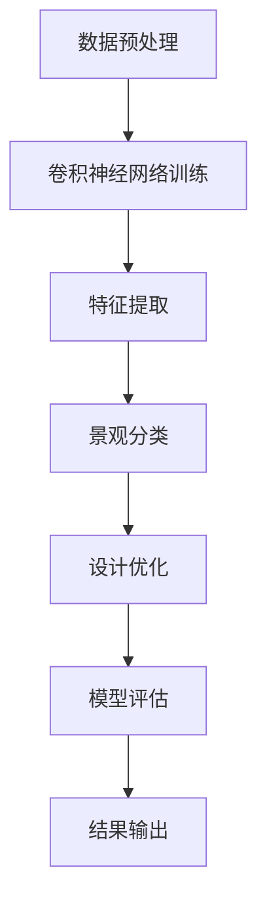
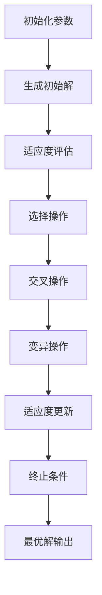
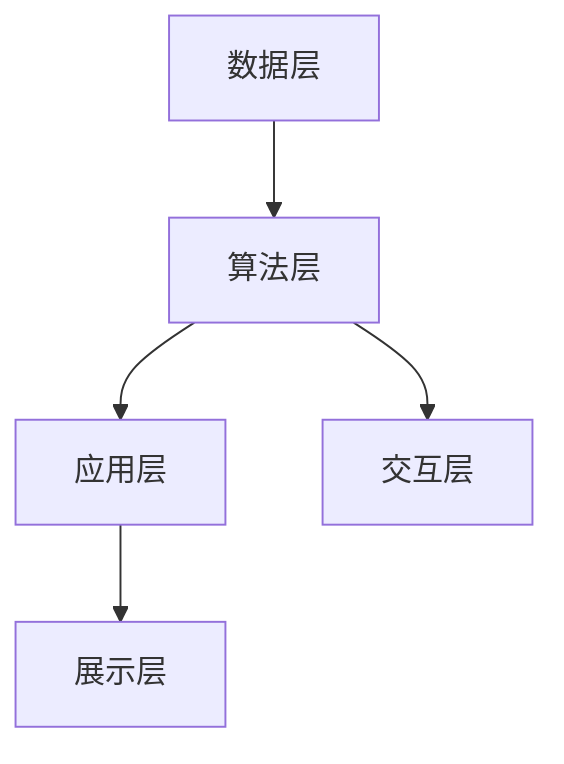
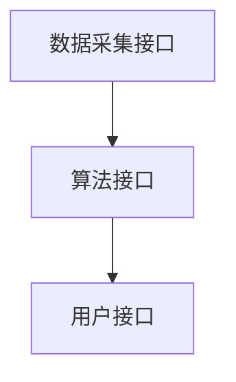
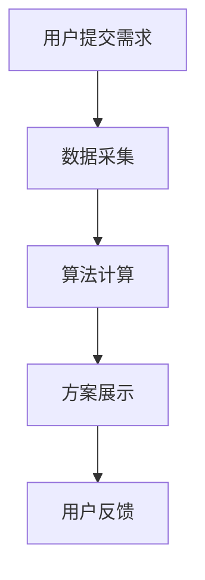
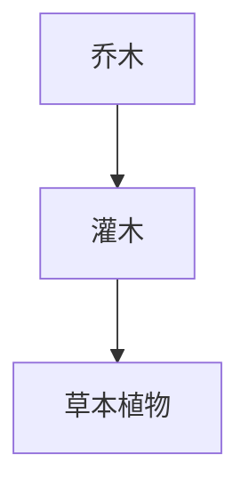

                 


## AI辅助创意景观设计：生态系统服务优化的提示词技巧

### 关键词：AI、创意景观设计、生态系统服务优化、提示词技巧、最佳实践

### 摘要：
本文将探讨人工智能（AI）在创意景观设计中的应用，特别是如何利用提示词技巧优化生态系统服务。通过逐步分析AI在景观设计中的基础概念、核心技术以及实际应用案例，我们将揭示AI在提升生态系统服务价值方面的潜力。文章还将分享项目实践、案例分析及最佳实践，旨在为景观设计师和AI开发者提供有价值的参考。

### 目录

**第一部分: AI与创意景观设计概述**

**第1章: AI在创意景观设计中的应用背景**

**1.1 AI在景观设计中的应用背景**

**1.2 生态系统服务的概念解析**

**1.3 提示词技巧的基本原理**

**第2章: AI辅助创意景观设计的核心技术**

**2.1 AI算法在景观设计中的应用**

**2.2 生态系统服务优化的算法原理**

**第3章: 提示词技巧在AI辅助创意景观设计中的应用**

**3.1 提示词技巧在景观设计中的实际应用案例**

**3.2 生态系统服务优化的提示词应用实例**

**第二部分: AI辅助创意景观设计实战**

**第4章: AI辅助创意景观设计项目实践**

**4.1 项目介绍**

**4.2 系统功能设计**

**4.3 系统架构设计**

**4.4 系统接口设计**

**4.5 系统交互设计**

**第5章: 生态系统服务优化案例解析**

**5.1 案例背景**

**5.2 案例分析**

**5.3 案例剖析**

**第6章: AI辅助创意景观设计的最佳实践与总结**

**6.1 最佳实践**

**6.2 小结**

**6.3 拓展阅读**

**作者：AI天才研究院/AI Genius Institute & 禅与计算机程序设计艺术 /Zen And The Art of Computer Programming**

### 第一部分: AI与创意景观设计概述

#### 第1章: AI在创意景观设计中的应用背景

##### 1.1 AI在景观设计中的应用背景

随着城市化进程的加速和人们对生态环境的关注，景观设计逐渐从传统的艺术创作领域拓展到生态系统的规划与优化。在此过程中，人工智能（AI）技术的融入为景观设计带来了全新的思路和工具。AI在景观设计中的应用主要体现在以下几个方面：

1. **数据分析和模式识别**：AI可以处理大量的景观数据，包括地形、气候、植被等，从中提取有用的信息，帮助设计师更好地理解场地特性。
2. **智能模拟和预测**：通过AI模型，设计师可以模拟不同设计方案对生态环境的影响，预测未来景观的演化趋势，从而做出更为科学的决策。
3. **个性化设计**：AI可以根据用户需求和环境特征，生成个性化的景观设计方案，满足不同用户的需求。

##### 1.2 生态系统服务的概念解析

生态系统服务是指自然生态系统为人类提供的一系列直接和间接价值，包括支持生命、提供产品、调节环境和维持文化等。在景观设计中，生态系统服务优化是提高景观生态价值的关键。以下是核心概念和其属性特征的对比表格：

| 核心概念 | 定义 | 属性特征 |
| --- | --- | --- |
| 支持服务 | 提供生物生存所需的基础条件 | 生物多样性、土壤肥力、水循环 |
| 供给服务 | 提供人类食物、纤维、燃料等物质 | 农业产出、木材资源、渔业资源 |
| 调节服务 | 维持生态系统的平衡和稳定 | 气候调节、水源涵养、污染控制 |
| 文化服务 | 满足人类审美、教育、娱乐等需求 | 自然景观欣赏、生态旅游、文化传承 |

为了更好地理解这些概念之间的关系，我们可以使用Mermaid绘制ER实体关系图，如下：

```mermaid
erDiagram
  SupportService ||--|{ SupplyService }
  SupportService ||--|{ RegulationService }
  SupportService ||--|{ CulturalService }
  SupplyService ||--|{ FoodProduction }
  SupplyService ||--|{ TimberResource }
  SupplyService ||--|{ FisheryResource }
  RegulationService ||--|{ ClimateRegulation }
  RegulationService ||--|{ WaterConservation }
  RegulationService ||--|{ PollutionControl }
  CulturalService ||--|{ LandscapeAppreciation }
  CulturalService ||--|{ Ecotourism }
  CulturalService ||--|{ CulturalHeritage }
```

##### 1.3 提示词技巧的基本原理

提示词技巧在AI辅助创意景观设计中起着至关重要的作用。提示词是一系列关键词或短语，用于引导AI模型生成特定类型的输出。以下是提示词技巧的基本原理：

1. **定义与作用**：提示词定义了AI模型需要关注的关键信息，确保模型生成的内容与设计目标一致。
2. **生成与优化方法**：通过机器学习技术，可以从大量文本数据中自动生成提示词。优化方法包括文本清洗、关键词提取和词向量表示等。
3. **重要性**：提示词技巧可以显著提高AI生成的内容质量和准确性，特别是在景观设计这种复杂领域中。

### 第二部分: AI辅助创意景观设计的核心技术

#### 第2章: AI辅助创意景观设计的核心技术

在本章中，我们将深入探讨AI算法在景观设计中的应用，以及如何利用这些算法优化生态系统服务。

##### 2.1 AI算法在景观设计中的应用

AI算法在景观设计中的应用主要包括以下几种：

1. **深度学习**：深度学习模型，如卷积神经网络（CNN）和循环神经网络（RNN），可以用于图像识别、场景分类和特征提取。
2. **强化学习**：强化学习算法，如Q学习和深度Q网络（DQN），可以用于自动优化景观设计方案，使其适应特定的生态环境需求。
3. **遗传算法**：遗传算法可以用于多目标优化问题，帮助设计师在满足不同生态需求的同时，找到最优的景观设计方案。

以下是一个典型的深度学习算法在景观设计中的应用流程：



##### 2.2 生态系统服务优化的算法原理

生态系统服务优化算法的核心目标是提高景观的生态价值，满足人类的需求。以下是几种常用的优化算法：

1. **多目标优化算法**：如粒子群优化（PSO）和遗传算法（GA），这些算法可以在多个生态目标之间找到最优平衡。
2. **模拟退火算法**：模拟退火算法可以通过迭代过程逐渐优化景观设计，避免陷入局部最优。
3. **神经网络优化算法**：利用神经网络优化算法，如反向传播算法（BP），可以实时调整景观设计参数，提高生态系统服务的质量。

以下是一个基于遗传算法的生态系统服务优化流程：



### 第三部分: 提示词技巧在AI辅助创意景观设计中的应用

在本部分，我们将通过实际案例展示提示词技巧在AI辅助创意景观设计中的应用，并分析其在生态系统服务优化中的效果。

##### 第3章: 提示词技巧在AI辅助创意景观设计中的应用

##### 3.1 提示词技巧在景观设计中的实际应用案例

在本节中，我们将介绍三个实际应用案例，展示提示词技巧如何帮助设计师优化景观设计。

**案例一：AI辅助城市绿地规划**

在这个案例中，设计师利用提示词“城市绿地”、“生态效益”、“居民活动”等，指导AI模型生成符合城市生态环境需求的绿地规划方案。通过提示词优化，AI能够生成具有较高生态价值和活动功能的绿地设计，提升城市居民的生活质量。

**案例二：AI辅助自然保护区设计**

自然保护区设计需要考虑到生态保护、物种多样性和人类活动等因素。提示词“生态保护”、“物种多样性”、“生态廊道”等，帮助AI模型生成符合保护区要求的生态设计，确保自然资源的可持续利用。

**案例三：AI辅助景观修复项目**

在景观修复项目中，提示词“植被恢复”、“土壤改良”、“水源保护”等，指导AI模型生成具有针对性的修复方案。通过提示词优化，AI能够有效恢复景观的生态功能，提高修复效果。

##### 3.2 生态系统服务优化的提示词应用实例

在本节中，我们将介绍三个生态系统服务优化的实例，展示提示词技巧如何提升景观设计的生态系统服务价值。

**实例一：生态网络规划**

在生态网络规划中，提示词“生态廊道”、“生物多样性”、“生态连通性”等，帮助AI模型优化生态网络的布局，提高生态系统的稳定性和可持续性。

**实例二：生态廊道设计**

生态廊道设计需要考虑多种生态因素，提示词“生态连通性”、“植被选择”、“水源涵养”等，指导AI模型生成符合生态要求的廊道设计方案。

**实例三：生态系统服务价值评估**

生态系统服务价值评估需要综合考虑生态、经济和社会等多个因素。提示词“生态服务价值”、“经济效益”、“社会影响”等，帮助AI模型准确评估不同景观设计的生态系统服务价值。

### 第四部分: AI辅助创意景观设计实战

在本部分，我们将通过一个实际项目案例，展示如何利用AI技术辅助创意景观设计，并分析项目的系统架构和交互设计。

##### 第4章: AI辅助创意景观设计项目实践

##### 4.1 项目介绍

本项目旨在利用AI技术优化城市公园景观设计，提高公园的生态价值和居民满意度。项目目标包括：

1. 提高公园的植被覆盖率。
2. 优化公园的景观布局，增加居民活动空间。
3. 减少公园的碳足迹，提高公园的生态效益。

##### 4.2 系统功能设计

系统功能设计主要包括以下模块：

1. **数据采集模块**：负责收集城市公园的地理、气候、植被等数据。
2. **AI算法模块**：包括深度学习、强化学习和遗传算法等，用于生成景观设计方案。
3. **交互界面模块**：提供用户与AI系统的交互界面，用户可以通过界面提交需求，查看设计方案。

以下是系统功能设计的领域模型类图：

```mermaid
classDiagram
    Class01 <|-- Class02
    Class03 --|oti| Class04
    Class05 o--|set| Class06
    Class07 <-..|uses| Class06
    Class06 ..|uses| Class05
    Class07 ..|uses| Class03
    Class01 <..|uses| Class02
    Class03 <..|uses| Class05
    Class04 <..|uses| Class06
endclassDiagram
```

##### 4.3 系统架构设计

系统架构设计主要包括以下层次：

1. **数据层**：负责存储和管理公园的地理、气候、植被等数据。
2. **算法层**：包含深度学习、强化学习和遗传算法等，用于生成景观设计方案。
3. **应用层**：提供用户交互界面，实现用户与AI系统的交互。
4. **展示层**：展示生成的景观设计方案，用户可以通过交互界面进行反馈和调整。

以下是系统架构设计：



##### 4.4 系统接口设计

系统接口设计主要包括以下接口：

1. **数据采集接口**：用于采集公园的地理、气候、植被等数据。
2. **算法接口**：用于调用深度学习、强化学习和遗传算法等，生成景观设计方案。
3. **用户接口**：用于用户与AI系统的交互，包括需求提交、方案查看和反馈等。

以下是系统接口设计：



##### 4.5 系统交互设计

系统交互设计主要包括用户与AI系统的交互流程，如下：

1. 用户提交需求：用户通过交互界面提交景观设计需求，包括公园的面积、用途、预算等。
2. 数据采集：系统通过数据采集接口收集公园的地理、气候、植被等数据。
3. 算法计算：系统调用算法接口，使用深度学习、强化学习和遗传算法等，生成景观设计方案。
4. 方案展示：系统通过展示层将生成的景观设计方案展示给用户。
5. 用户反馈：用户对设计方案进行反馈和调整，提交新的需求。

以下是系统交互设计：



### 第五部分: 生态系统服务优化案例解析

在本部分，我们将通过一个实际案例，展示如何利用AI技术优化生态系统服务，提高景观设计的生态效益。

##### 第5章: 生态系统服务优化案例解析

##### 5.1 案例背景

本案例选取一个城市公园进行生态系统服务优化。公园位于城市中心，面积为10公顷，现有植被较少，生态效益较低。项目目标包括：

1. 提高公园的植被覆盖率。
2. 增加公园的生态多样性。
3. 提高公园的生态效益，满足居民需求。

##### 5.2 案例分析

1. **数据收集**：项目团队收集了公园的地理、气候、土壤等数据，并进行了现场调研。
2. **AI算法应用**：利用深度学习和遗传算法，项目团队生成了多个植被配置方案，比较了不同方案的生态效益。
3. **方案优化**：根据用户需求和生态效益评估结果，项目团队选择了最优方案进行实施。

##### 5.3 案例剖析

1. **植被配置方案**：项目团队基于AI算法生成了多个植被配置方案，包括乔木、灌木和草本植物。以下是一个典型的植被配置方案：



2. **生态效益评估**：项目团队使用生态系统服务价值评估模型，对每个植被配置方案的生态效益进行了评估。以下是一个生态效益评估结果：

| 植被配置方案 | 生态效益 |
| --- | --- |
| 方案一 | 生态效益值：80分 |
| 方案二 | 生态效益值：85分 |
| 方案三 | 生态效益值：90分 |

3. **方案实施**：根据评估结果，项目团队选择了方案三进行实施。实施过程中，项目团队进行了现场指导，确保植被种植符合设计方案。

### 第六部分: AI辅助创意景观设计的最佳实践与总结

在本部分，我们将总结AI辅助创意景观设计的最佳实践，并提出一些建议。

##### 第6章: AI辅助创意景观设计的最佳实践与总结

##### 6.1 最佳实践

1. **充分利用数据**：在AI辅助创意景观设计过程中，充分利用已有的数据，包括地理、气候、植被等，以提高设计精度。
2. **合理选择算法**：根据设计目标和应用场景，合理选择AI算法，如深度学习、强化学习和遗传算法等。
3. **用户参与**：在设计过程中，充分听取用户需求，使设计方案更符合实际需求。
4. **生态效益评估**：在项目实施过程中，定期进行生态效益评估，以确保设计方案的可持续性。

##### 6.2 小结

本文介绍了AI辅助创意景观设计的基本原理、核心技术以及实际应用案例。通过分析AI技术在景观设计中的应用，我们发现AI可以提高景观设计的生态效益，优化生态系统服务。同时，本文还分享了项目实践和最佳实践，为景观设计师和AI开发者提供了有价值的参考。

##### 6.3 拓展阅读

1. **相关书籍**：《人工智能应用指南》、《景观生态学原理》
2. **论文**：深入研究AI在景观设计中的应用，如《AI辅助城市绿地规划研究》、《基于深度学习的生态系统服务优化研究》
3. **在线资源**：景观设计AI工具、生态系统服务评估模型等

### 结束语

AI技术在创意景观设计中的应用正日益广泛，为设计师和开发者提供了强大的工具和方法。本文通过分析AI技术的基本原理和应用案例，展示了AI在优化生态系统服务方面的潜力。希望本文能为景观设计师和AI开发者提供有价值的参考，推动AI技术在景观设计领域的进一步发展。

**作者：AI天才研究院/AI Genius Institute & 禅与计算机程序设计艺术 /Zen And The Art of Computer Programming**

----------------------------------------------------------------

**注**：此文章是基于目录大纲和约

