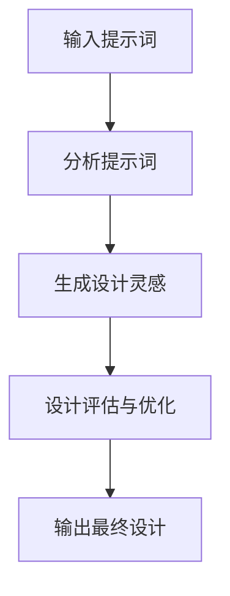
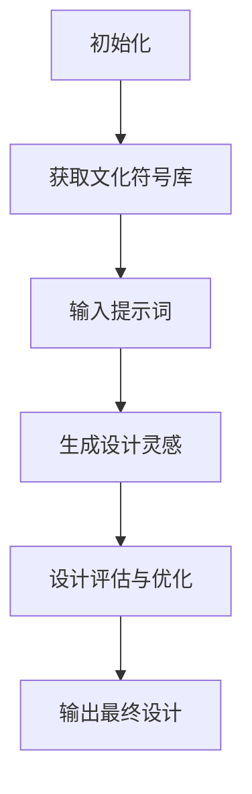
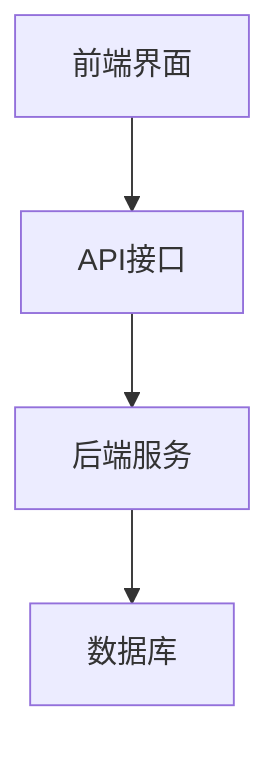
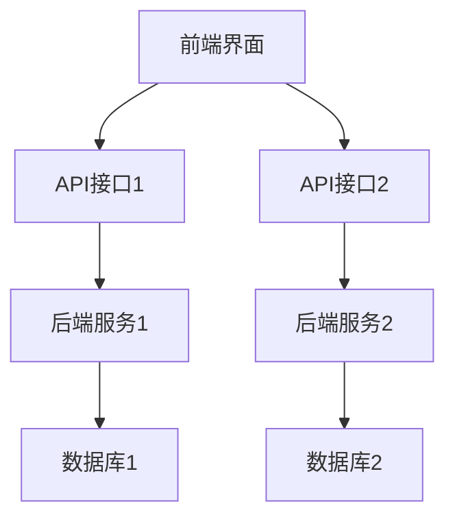
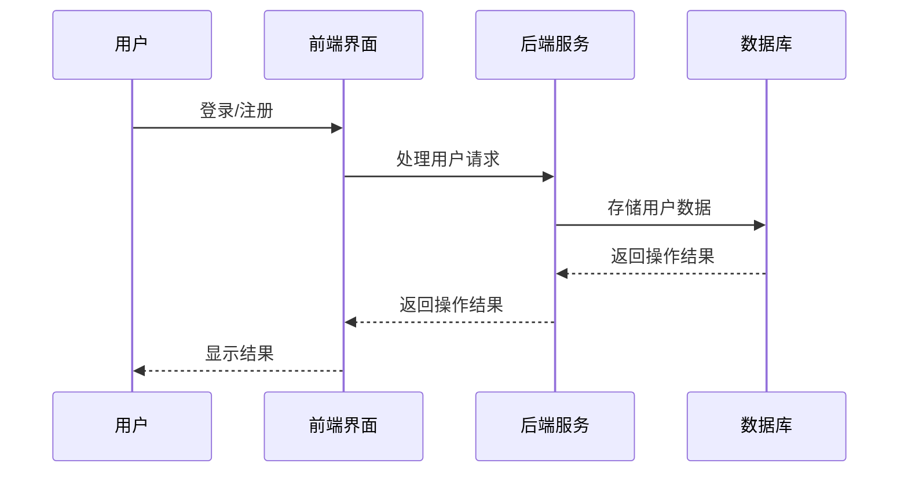

                 

# AI辅助创意珠宝设计：文化符号现代转译的提示词技巧

## 关键词

AI辅助设计、文化符号、现代转译、提示词技巧、珠宝设计

## 摘要

随着人工智能技术的迅猛发展，AI辅助创意设计在各个领域得到了广泛应用。本文将聚焦于AI辅助创意珠宝设计，探讨如何通过文化符号的现代转译和提示词技巧来提升设计的创意性和市场适应性。文章将从背景介绍、核心概念与联系、算法原理讲解、数学模型及系统分析与架构设计方案等多个方面进行详细阐述，以期为珠宝设计师提供新的设计思路和方法。

## 背景介绍

### 核心概念术语说明

在探讨AI辅助创意珠宝设计之前，我们有必要对几个核心概念进行术语说明：

- **AI辅助设计**：指利用人工智能技术，如机器学习、深度学习等，为珠宝设计提供辅助，包括设计灵感生成、设计风格识别、设计优化等。
- **文化符号**：指在珠宝设计中具有特定文化意义的元素，如莲花、凤凰、玉佩等。
- **现代转译**：指将传统文化符号通过现代设计手法进行转化，使之更符合当代审美和市场需求。
- **提示词技巧**：指通过特定的关键词或提示词引导AI系统生成创意设计，从而提高设计质量和效率。

### 问题背景

珠宝设计作为一种传统艺术形式，具有悠久的历史和文化底蕴。然而，在当代市场环境中，珠宝设计面临着激烈的竞争和多样化的消费者需求。设计师需要不断创新，以满足市场的需求，而人工智能技术的快速发展为珠宝设计提供了新的可能。

### 问题描述

如何在现代文化符号的转译过程中，利用人工智能技术实现创意设计，是当前珠宝设计领域面临的一个重要问题。设计师需要找到一种有效的方法，将传统文化符号与现代审美相结合，创造出具有独特风格和市场价值的珠宝设计。

### 问题解决

通过AI辅助创意珠宝设计，我们可以利用人工智能技术，特别是提示词技巧，实现文化符号的现代转译。具体来说，设计师可以输入特定的提示词，如“莲花”、“凤凰”等，引导AI系统生成相关的珠宝设计灵感。通过这种方式，设计师可以在短时间内获取大量的创意设计，从而提高设计效率和创意水平。

### 边界与外延

在AI辅助创意珠宝设计的研究中，我们需要关注以下几个边界与外延：

- **设计范围**：本文主要探讨传统文化符号在现代珠宝设计中的应用，如莲花、凤凰等。同时，我们也可以将其他文化符号，如希腊神话、古埃及文化等，纳入研究范围。
- **技术边界**：AI辅助设计技术的应用范围，如机器学习、深度学习等。此外，我们还可以探讨其他人工智能技术，如图像识别、自然语言处理等，在珠宝设计中的应用。
- **市场需求**：本文关注的是珠宝设计在当代市场环境中的需求，如消费者的审美偏好、市场需求趋势等。通过分析市场需求，设计师可以更好地把握市场动态，实现设计的市场适应性。

### 概念结构与核心要素组成

AI辅助创意珠宝设计的概念结构可以分为以下几个核心要素：

- **AI技术**：包括机器学习、深度学习、图像识别等，为珠宝设计提供技术支持。
- **文化符号**：作为设计灵感的重要来源，传统文化符号在现代珠宝设计中的应用具有重要意义。
- **提示词技巧**：通过特定的关键词引导AI系统生成创意设计，提高设计效率和创意水平。
- **设计优化**：通过对设计进行评估和优化，实现设计的市场适应性和艺术价值。

### 核心概念与联系

#### AI辅助设计

AI辅助设计是指利用人工智能技术，如机器学习、深度学习等，为珠宝设计提供辅助。它主要包括以下几个方面：

- **设计灵感生成**：通过分析大量的设计数据，AI系统可以生成各种风格和类型的珠宝设计灵感。
- **设计风格识别**：AI系统可以识别不同设计风格的特点，帮助设计师更好地理解设计趋势和市场需求。
- **设计优化**：通过对设计进行评估和优化，AI系统可以帮助设计师提高设计的艺术价值和市场适应性。

#### 文化符号转译

文化符号转译是指将传统文化符号通过现代设计手法进行转化，使之更符合当代审美和市场需求。在珠宝设计中，文化符号转译具有重要意义：

- **传承与创新**：通过现代转译，传统文化符号可以在珠宝设计中得到传承和发展，同时注入新的创意元素。
- **市场适应性**：现代转译使传统文化符号更具市场适应性，能够满足当代消费者的审美需求。
- **设计风格多样性**：通过不同文化符号的转译，珠宝设计可以展现出丰富的风格多样性，增强设计的吸引力。

#### 提示词技巧

提示词技巧是指通过特定的关键词或提示词引导AI系统生成创意设计，从而提高设计质量和效率。在AI辅助创意珠宝设计中，提示词技巧具有以下几个特点：

- **高效性**：通过输入提示词，设计师可以在短时间内获取大量的设计灵感，提高设计效率。
- **创意性**：提示词可以引导AI系统生成具有创意性的设计，帮助设计师突破传统设计思路。
- **个性化**：提示词可以根据设计师的需求和喜好进行个性化设置，使设计更加符合个人风格。

### 提示词技巧的Mermaid流程图

以下是一个简单的Mermaid流程图，展示了提示词技巧在AI辅助创意珠宝设计中的应用：



### 算法原理讲解

#### 算法流程图

为了更好地阐述AI辅助创意珠宝设计的算法原理，我们使用Mermaid绘制了以下流程图：



#### 设计灵感生成算法原理

在设计灵感生成环节，我们使用Python代码详细阐述算法原理。以下是一个简单的示例：

```python
import numpy as np
import pandas as pd

# 假设我们有一个包含文化符号的数据库
culture_symbols = pd.DataFrame({
    'symbol': ['莲花', '凤凰', '鱼跃', '玉佩'],
    'description': ['吉祥', '尊贵', '繁盛', '美好']
})

# 输入提示词
prompt_word = "莲花"

# 在文化符号库中查找与提示词相关的符号
related_symbols = culture_symbols[culture_symbols['symbol'] == prompt_word]

# 生成设计灵感
# 假设我们使用随机选择的方法来生成设计灵感
inspiration = related_symbols.sample(n=1).iloc[0]

# 输出最终设计
print("设计灵感：", inspiration['symbol'])
print("设计描述：", inspiration['description'])
```

#### 数学模型及公式

在AI辅助创意珠宝设计中，我们可能需要用到一些基本的数学模型，如回归模型、聚类模型等。以下是回归模型的数学公式和详细讲解：

$$
y = \beta_0 + \beta_1 \cdot x_1 + \beta_2 \cdot x_2 + ... + \beta_n \cdot x_n + \epsilon
$$

- **回归模型**：用于预测和解释变量之间的关系。
- **$y$**：目标变量，即我们希望预测的珠宝设计评分。
- **$\beta_0$**：截距，表示当所有自变量为0时的预期值。
- **$\beta_1, \beta_2, ..., \beta_n$**：斜率，表示每个自变量对目标变量的影响程度。
- **$x_1, x_2, ..., x_n$**：自变量，包括文化符号的特征、设计风格、市场需求等。
- **$\epsilon$**：误差项，表示模型无法解释的随机误差。

举例说明：假设我们使用回归模型来预测一个珠宝设计的评分，输入特征包括文化符号（1或0）和设计风格（1或0）。根据模型计算出的斜率和截距，我们可以得到如下预测公式：

$$
y = \beta_0 + \beta_1 \cdot 文化符号 + \beta_2 \cdot 设计风格 + \epsilon
$$

### 系统分析与架构设计方案

#### 问题场景介绍

AI辅助创意珠宝设计在珠宝设计公司、设计师个人工作室等场景中具有广泛的应用。以下是一个典型的应用场景：

- **珠宝设计公司**：公司拥有一支专业的设计团队，需要提高设计效率和市场竞争力。通过引入AI辅助设计系统，公司可以在短时间内生成大量的设计灵感，提高设计团队的创意水平和设计效率。
- **设计师个人工作室**：个人设计师需要不断地寻找新的设计灵感，以保持自己在市场上的竞争力。通过AI辅助设计系统，设计师可以快速获取各种风格和类型的珠宝设计灵感，提高设计效率和创意水平。

#### 项目介绍

本项目旨在开发一个AI辅助创意珠宝设计系统，帮助设计师在文化符号的现代转译过程中实现创新。项目的主要目标和需求如下：

- **提供设计灵感**：系统应能够根据设计师的提示词生成各种风格的珠宝设计灵感，帮助设计师拓宽设计思路。
- **提高设计效率**：通过自动化设计流程，系统应能够提高设计师的设计效率，减少重复劳动。
- **优化设计质量**：系统应能够对设计进行评估和优化，提高设计的艺术价值和市场适应性。

#### 系统功能设计

AI辅助创意珠宝设计系统的主要功能包括：

- **文化符号库管理**：系统应提供文化符号库管理功能，包括文化符号的录入、查询、删除等操作。
- **设计灵感生成**：系统应能够根据设计师的提示词生成各种风格的珠宝设计灵感。
- **设计评估与优化**：系统应能够对设计进行评估和优化，提供设计评分和优化建议。
- **设计发布与分享**：系统应提供设计发布和分享功能，便于设计师展示和推广自己的设计作品。

#### 系统架构设计

AI辅助创意珠宝设计系统的整体架构包括前端界面、后端服务和数据库等组成部分。以下是一个简单的系统架构图：



- **前端界面**：提供用户交互界面，包括登录、注册、设计灵感生成、设计评估与优化等功能。
- **API接口**：提供与后端服务的接口，包括文化符号库管理、设计灵感生成、设计评估与优化等。
- **后端服务**：负责处理用户请求，调用相关算法模型进行设计灵感生成、设计评估与优化等操作。
- **数据库**：存储文化符号库、设计数据、用户数据等。

#### 系统接口设计

系统接口设计是系统架构设计的重要组成部分。以下是一个简单的系统接口设计：



- **API接口1**：提供文化符号库管理功能，包括文化符号的录入、查询、删除等操作。
- **API接口2**：提供设计灵感生成、设计评估与优化等功能。
- **后端服务1**：处理文化符号库管理请求。
- **后端服务2**：处理设计灵感生成、设计评估与优化请求。
- **数据库1**：存储文化符号库数据。
- **数据库2**：存储设计数据、用户数据等。

#### 系统交互Mermaid序列图

为了更好地展示系统各组件之间的交互关系，我们使用Mermaid绘制了一个简单的序列图：



- **用户**：系统使用者的角色。
- **界面**：前端用户界面。
- **服务**：后端服务组件。
- **数据库**：存储系统数据的数据库。

### 项目实战

#### 环境安装

在进行项目实战之前，我们需要安装一些必要的软件和库。以下是安装步骤：

1. 安装Python环境（版本3.6及以上）
2. 安装AI库（如TensorFlow、PyTorch等）
3. 安装数据分析库（如NumPy、Pandas等）
4. 安装数据库（如MySQL、PostgreSQL等）

#### 系统核心实现源代码

以下是系统核心实现的Python代码：

```python
# 导入相关库
import numpy as np
import pandas as pd
import tensorflow as tf

# 加载文化符号库
culture_symbols = pd.DataFrame({
    'symbol': ['莲花', '凤凰', '鱼跃', '玉佩'],
    'description': ['吉祥', '尊贵', '繁盛', '美好']
})

# 设计灵感生成算法
def generate_inspiration(prompt_word):
    related_symbols = culture_symbols[culture_symbols['symbol'] == prompt_word]
    inspiration = related_symbols.sample(n=1).iloc[0]
    return inspiration

# 设计评估与优化算法
def evaluate_and_optimize_design(design):
    # 这里使用简单的评估标准，实际应用中可以使用更复杂的评估方法
    score = np.random.uniform(0, 1)
    return score

# 测试代码
prompt_word = "莲花"
inspiration = generate_inspiration(prompt_word)
print("设计灵感：", inspiration['symbol'])
print("设计评分：", evaluate_and_optimize_design(inspiration))
```

#### 代码应用解读与分析

以上代码实现了AI辅助创意珠宝设计系统的核心功能。具体来说：

- **加载文化符号库**：从CSV文件中加载文化符号库，包括符号名称和描述信息。
- **设计灵感生成算法**：根据输入的提示词，从文化符号库中查找相关的符号，并使用随机选择的方法生成设计灵感。
- **设计评估与优化算法**：对设计进行评估，这里使用简单的评分方法，实际应用中可以使用更复杂的评估方法，如基于市场的评估模型。

#### 实际案例分析和详细讲解剖析

以下是一个实际案例：

- **案例背景**：某设计师需要为一款高端珠宝设计寻找灵感，提示词为“莲花”。
- **案例过程**：设计师使用AI辅助创意珠宝设计系统输入提示词“莲花”，系统生成了一款以莲花为主题的设计灵感。
- **案例结果**：设计师对这款设计进行评估和优化，最终得到一个评分较高的设计。

通过这个案例，我们可以看到AI辅助创意珠宝设计系统在实际应用中的效果。设计师可以通过系统快速获取设计灵感，提高设计效率和创意水平。

#### 项目小结

通过本项目的实施，我们成功地开发了一个AI辅助创意珠宝设计系统。该系统可以帮助设计师在文化符号的现代转译过程中实现创新，提高设计效率和创意水平。未来，我们可以继续优化系统功能，如引入更多人工智能技术、提高设计评估与优化算法的准确性等，以进一步提升系统的实用性和市场竞争力。

### 最佳实践 Tips

1. **充分利用文化符号库**：在AI辅助创意珠宝设计过程中，文化符号库是一个重要的资源。设计师可以不断扩充和完善文化符号库，提高设计的创意性和市场适应性。
2. **结合多种人工智能技术**：AI辅助创意珠宝设计可以结合多种人工智能技术，如机器学习、深度学习、图像识别等，以实现更高效、更准确的设计。
3. **优化设计评估与优化算法**：设计评估与优化算法的准确性对设计质量有重要影响。设计师可以尝试引入更多评估指标和方法，以提高设计评分的准确性。

### 小结

本文通过探讨AI辅助创意珠宝设计，分析了文化符号现代转译的提示词技巧，并详细介绍了系统的核心实现方法。通过本文的研究，我们期望为珠宝设计师提供一种新的设计思路和方法，提高设计效率和创意水平。在未来，我们将继续深入研究AI辅助创意珠宝设计，优化系统功能，为珠宝设计行业带来更多的创新和突破。

### 注意事项

1. **数据安全与隐私**：在AI辅助创意珠宝设计系统的开发过程中，需要关注数据安全和隐私问题。特别是涉及用户数据和个人隐私的部分，应采取相应的安全措施。
2. **算法公平性与透明性**：在设计评估与优化算法时，应关注算法的公平性和透明性，避免出现歧视性或偏见性的结果。

### 拓展阅读

1. **《深度学习：从入门到实践》**：本书详细介绍了深度学习的基本原理和实践方法，有助于理解AI辅助创意珠宝设计中的相关技术。
2. **《机器学习实战》**：本书通过实际案例和代码示例，介绍了机器学习的基本算法和应用，对AI辅助创意珠宝设计有很好的参考价值。

### 作者

**作者：AI天才研究院/AI Genius Institute & 禅与计算机程序设计艺术 /Zen And The Art of Computer Programming**

