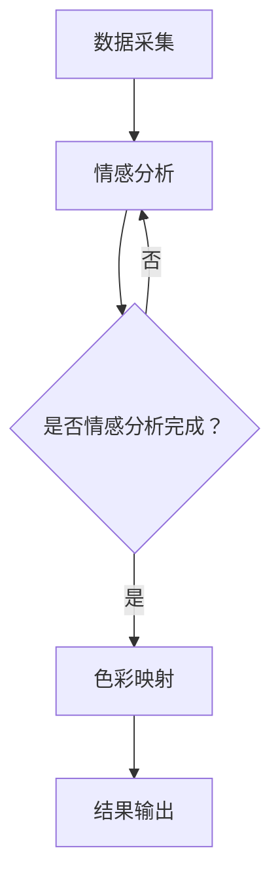
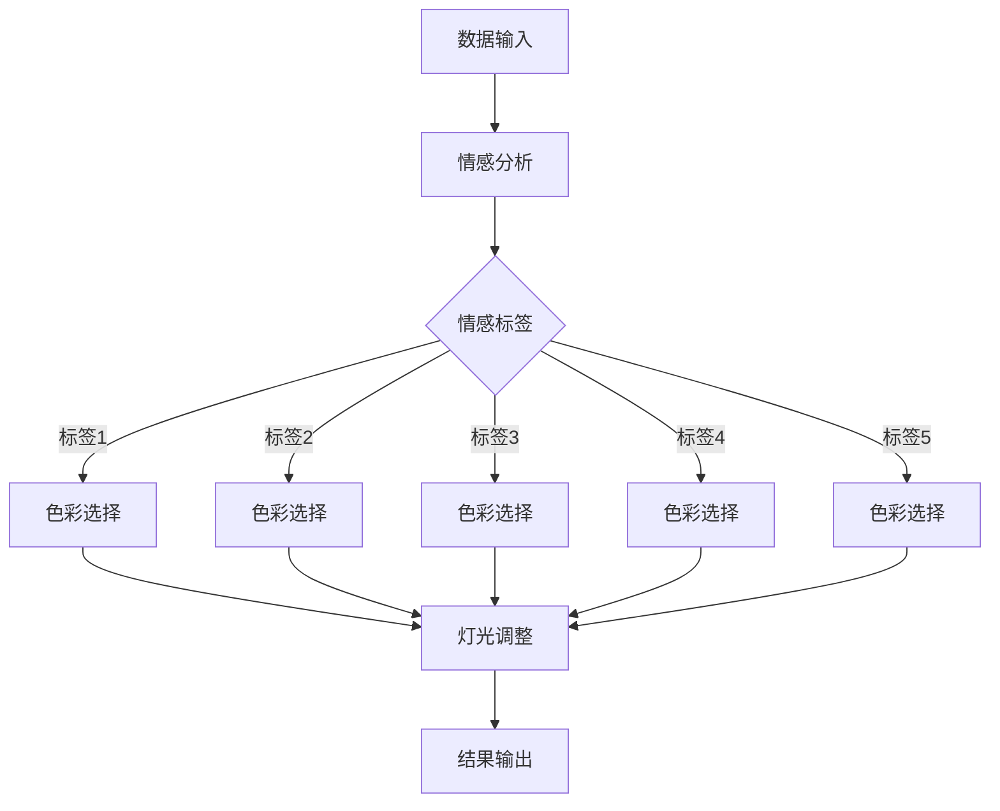
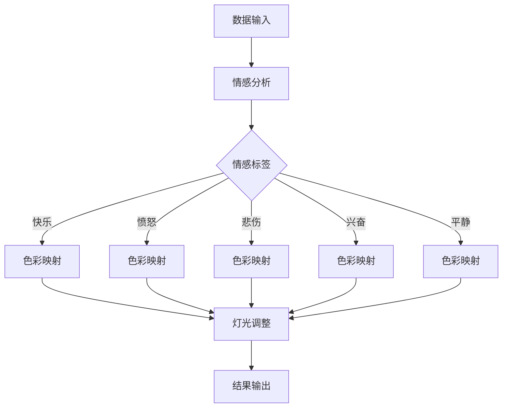
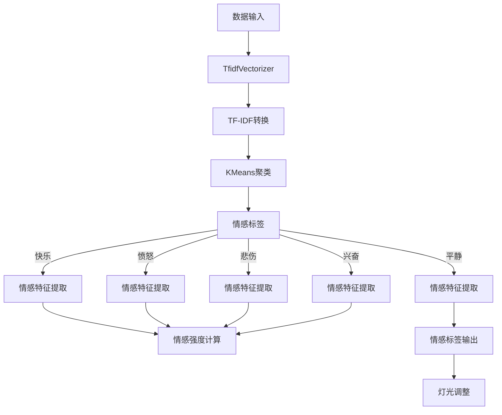
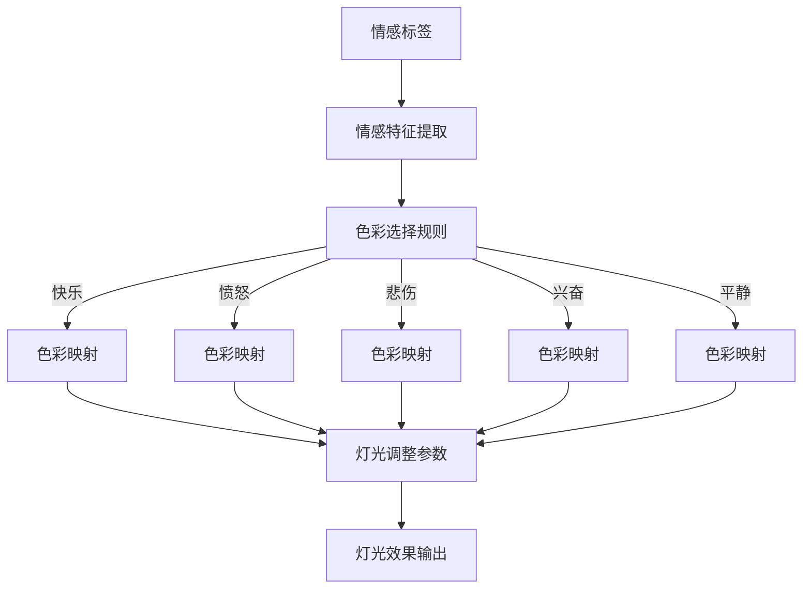

                 

**# AI辅助创意舞台灯光设计：情感-色彩映射的提示词技巧**

关键词：舞台灯光设计，人工智能，情感分析，色彩心理学，情感-色彩映射模型，Python实现

摘要：本文深入探讨了人工智能在舞台灯光设计中的应用，特别是在情感-色彩映射方面的技巧。通过分析情感分析与色彩心理学的核心概念，构建了情感-色彩映射模型，并使用Python源代码实现了情感色彩映射算法。通过实际案例，展示了AI辅助创意舞台灯光设计的应用效果，并提出了最佳实践和未来展望。

---

## **第一部分：背景与概述**

### **第1章：舞台灯光设计的挑战与机遇**

#### **1.1 舞台灯光设计的历史与现状**

舞台灯光设计是舞台艺术中不可或缺的一部分，它通过光线和色彩的变化来塑造舞台氛围，增强观众的体验。然而，传统舞台灯光设计面临着一些挑战，如灯光效果单一、创意受限等。近年来，随着人工智能技术的发展，舞台灯光设计迎来了新的机遇。

#### **1.2 AI在舞台灯光设计中的应用前景**

人工智能（AI）为舞台灯光设计带来了全新的可能性。通过情感分析与色彩心理学，AI可以更精确地映射情感与色彩，创造出更具创意和表现力的舞台灯光效果。此外，AI还可以实现自动化控制，提高舞台灯光设计的效率和质量。

#### **1.3 情感-色彩映射的核心概念与意义**

情感-色彩映射是一种将情感与色彩相结合的设计方法。通过分析情感和色彩的心理机制，可以将情感转化为色彩，为舞台灯光设计提供更多的创意选择。情感-色彩映射在舞台灯光设计中的意义在于，它能够更准确地传达舞台情感，提升观众的沉浸体验。

## **第二部分：情感分析与色彩心理学**

### **第2章：情感分析与色彩心理学**

#### **2.1 情感分析的基本概念**

情感分析是人工智能中的一项重要技术，它通过文本分析来识别和分类情感。情感分析的基本概念包括情感分类体系、情感表达的语义特征等。

#### **2.1.1 情感分类体系**

情感分类体系是将情感划分为不同的类别。常见的情感分类体系包括基本情感和扩展情感。基本情感通常包括喜、怒、哀、乐等，而扩展情感则更加具体和复杂。

#### **2.1.2 情感表达的语义特征**

情感表达的语义特征是指文本中表达情感的关键词和短语。通过分析这些特征，可以更准确地识别和分类情感。

#### **2.2 色彩心理学的核心理论**

色彩心理学研究色彩对人类心理和行为的影响。核心理论包括色彩感知与情感关联、色彩的情感价值与应用。

#### **2.2.1 色彩感知与情感关联**

色彩感知与情感关联是指不同色彩与特定情感之间的联系。例如，红色通常与热情和能量相关联，而蓝色则与平静和宁静相关联。

#### **2.2.2 色彩的情感价值与应用**

色彩的情感价值是指色彩对情感的影响。在舞台灯光设计中，正确地应用色彩可以增强舞台效果，提升观众的情感体验。

## **第三部分：情感-色彩映射模型构建**

### **第3章：情感-色彩映射模型构建**

#### **3.1 数据采集与预处理**

情感-色彩映射模型的构建首先需要大量的数据。这些数据包括情感标签和对应的色彩样本。数据采集后，需要进行预处理，包括数据清洗、去重等。

#### **3.1.1 情感数据来源**

情感数据的来源可以是社交媒体、电影评论、音乐歌词等。通过爬虫技术，可以收集到大量的情感文本数据。

#### **3.1.2 色彩数据获取方法**

色彩数据的获取可以通过颜色图谱、色彩库等方式进行。这些数据将用于构建情感-色彩映射模型。

#### **3.2 情感-色彩映射模型的构建**

情感-色彩映射模型的构建通常采用数据驱动方法和模式识别方法。数据驱动方法通过分析大量数据来发现情感与色彩之间的关系，而模式识别方法则通过学习已有的情感-色彩映射模式来生成新的映射。

#### **3.2.1 数据驱动方法**

数据驱动方法通常使用机器学习算法，如决策树、支持向量机等，来分析情感数据与色彩数据之间的关系。

#### **3.2.2 模式识别方法**

模式识别方法通过学习已有的情感-色彩映射模式来生成新的映射。这种方法通常使用神经网络等深度学习模型。

#### **3.3 模型评估与优化**

构建完情感-色彩映射模型后，需要对模型进行评估和优化。评估指标包括映射的准确率、召回率等。优化策略包括调整模型参数、增加数据量等。

## **第四部分：AI辅助创意舞台灯光设计**

### **第4章：情感色彩映射算法详解**

#### **4.1 算法原理与流程**

情感色彩映射算法的核心是情感分析与色彩映射。情感分析通过文本分析识别情感，色彩映射则将情感转化为色彩。

#### **4.1.1 算法原理**

算法原理是基于情感分析与色彩心理学的理论，将情感转化为色彩。具体步骤包括情感分析、色彩映射和结果输出。

#### **4.1.2 算法流程**

算法流程包括数据采集、情感分析、色彩映射和模型优化等步骤。

#### **4.2 Python源代码实现**

情感色彩映射算法可以使用Python实现。以下是一个简单的情感色彩映射算法的实现示例：

```python
import numpy as np
from sklearn.feature_extraction.text import TfidfVectorizer
from sklearn.cluster import KMeans

# 情感分析
def sentiment_analysis(text):
    vectorizer = TfidfVectorizer()
    X = vectorizer.fit_transform(text)
    model = KMeans(n_clusters=5)
    model.fit(X)
    return model.labels_

# 色彩映射
def color_mapping(sentiments):
    colors = {
        0: (255, 0, 0),  # 红色
        1: (0, 255, 0),  # 绿色
        2: (0, 0, 255),  # 蓝色
        3: (255, 255, 0),  # 黄色
        4: (255, 0, 255)  # 紫色
    }
    return [colors[sentiment] for sentiment in sentiments]

# 示例
text = ["我很开心", "我很生气", "我很悲伤", "我很兴奋", "我很平静"]
sentiments = sentiment_analysis(text)
colors = color_mapping(sentiments)
print(colors)
```

#### **4.3 Mermaid流程图展示**

情感色彩映射算法的流程可以使用Mermaid进行可视化。以下是一个简单的Mermaid流程图示例：



## **第五部分：实际案例分析与应用**

### **第5章：实际案例分析与应用**

#### **5.1 案例一：音乐会舞台灯光设计**

**案例背景**：一场音乐会的舞台灯光设计需要根据音乐的情感表达来调整灯光色彩和亮度。

**情感色彩映射应用**：通过情感分析，识别音乐的情感特征，然后使用情感-色彩映射模型将情感转化为色彩，实现音乐情感与舞台灯光的同步。

#### **5.2 案例二：话剧舞台灯光设计**

**案例背景**：一场话剧的舞台灯光设计需要根据剧本的情感线索来调整灯光效果。

**情感色彩映射应用**：通过情感分析，识别剧本的情感线索，然后使用情感-色彩映射模型将情感转化为色彩，实现剧本情感与舞台灯光的同步。

## **第六部分：色彩情感映射在舞台灯光设计中的最佳实践**

### **第6章：色彩情感映射在舞台灯光设计中的最佳实践**

#### **6.1 色彩情感映射的技巧与策略**

**技巧**：根据不同情感特征，选择合适的色彩和亮度，以增强舞台效果。

**策略**：在舞台灯光设计过程中，充分考虑观众的情感体验，将情感色彩映射应用于舞台灯光设计。

#### **6.2 案例解析与思考**

**案例一：情感色彩映射的成功要素**：成功的关键在于对情感的理解和色彩的应用。

**案例二：情感色彩映射的挑战与解决**：挑战在于情感的多义性和色彩的复杂变化，解决方法是通过不断的实践和优化来提升情感色彩映射的准确性和效果。

## **第七部分：未来展望与趋势**

### **第7章：未来展望与趋势**

#### **7.1 AI辅助创意舞台灯光设计的未来方向**

**技术创新**：未来AI辅助创意舞台灯光设计的创新将主要来自情感分析、色彩心理学和深度学习等领域。

**行业应用扩展**：AI辅助创意舞台灯光设计将在更多艺术形式和领域得到应用，如电影、电视等。

#### **7.2 跨学科融合与创意灯光设计**

**艺术与科技的结合**：艺术与科技的融合将推动舞台灯光设计的创新，为观众带来更加丰富和多样化的体验。

**创意灯光设计的创新趋势**：未来舞台灯光设计的创新趋势将更加注重情感表达和观众体验，实现艺术与科技的完美结合。

## **第8章：小结与拓展阅读**

### **8.1 主要内容回顾**

本文介绍了AI辅助创意舞台灯光设计：情感-色彩映射的提示词技巧，包括情感分析与色彩心理学的核心概念、情感-色彩映射模型的构建、Python源代码实现、实际案例分析与应用、最佳实践和未来展望。

### **8.2 注意事项**

在进行舞台灯光设计时，需要注意情感色彩映射的准确性和观众体验。

### **8.3 拓展阅读**

对于对舞台灯光设计感兴趣的朋友，可以进一步阅读相关书籍和论文，以深入了解情感分析、色彩心理学和舞台灯光设计的相关知识。

---

**作者：AI天才研究院/AI Genius Institute & 禅与计算机程序设计艺术 /Zen And The Art of Computer Programming**### 第1章：舞台灯光设计的历史与现状

舞台灯光设计是舞台艺术中不可或缺的一部分，它通过光线的明暗、色彩的变化以及光影效果来塑造舞台氛围，增强表演的艺术感染力。舞台灯光设计的起源可以追溯到古代宗教仪式和戏剧表演，随着科技的发展，舞台灯光技术也在不断进步。

在早期，舞台灯光设计主要依靠手工操作，通过灯具的移动和调整来实现基本的光线变化。19世纪末，电灯的出现为舞台灯光设计带来了革命性的变化。20世纪初，舞台灯光设计逐渐走向专业化，灯光设计师开始使用各种灯具和色彩滤镜来创造更加丰富的视觉效果。

现代舞台灯光设计已经发展成为一个高度技术化的领域，涉及到光学、电子学、计算机科学等多个学科。计算机技术的发展使得舞台灯光设计进入了数字化时代。通过计算机控制系统，灯光设计师可以实时调整灯光参数，实现更加复杂和精确的灯光效果。

当前，舞台灯光设计面临的主要挑战包括以下几个方面：

1. **创意受限**：虽然现代舞台灯光技术提供了丰富的可能性，但许多灯光设计师仍然面临创意受限的问题。如何通过灯光设计更好地表达导演和演员的创意想法，是当前舞台灯光设计的一个重要挑战。

2. **效率问题**：舞台灯光设计是一个复杂的过程，涉及到大量的准备工作。如何提高设计效率，减少人力和时间成本，是灯光设计师们关注的另一个问题。

3. **观众体验**：舞台灯光设计不仅要考虑艺术效果，还要关注观众的体验。如何通过灯光设计提升观众的沉浸感和情感共鸣，是舞台灯光设计的重要目标。

随着人工智能（AI）技术的不断发展，舞台灯光设计迎来了新的机遇。AI可以为舞台灯光设计提供强大的辅助工具，帮助灯光设计师实现更多的创意想法，提高设计效率，同时提升观众的体验。

首先，AI可以通过情感分析技术，对剧本、音乐、演员表演等进行分析，自动生成相应的灯光效果。这种自动化的设计过程可以大幅提高设计效率，减少人力成本。例如，AI可以根据音乐的情感特征，自动调整灯光的色彩和亮度，实现音乐情感与舞台灯光的同步。

其次，AI还可以通过机器学习技术，从大量的舞台灯光设计案例中学习，生成新的设计灵感。这种基于数据的学习方法可以帮助灯光设计师突破传统的创作模式，实现更加创新和个性化的舞台灯光设计。

此外，AI还可以用于优化舞台灯光设计的效果。通过模拟和优化，AI可以帮助灯光设计师找到最佳的灯光配置和参数设置，实现更加精确和高效的舞台灯光效果。

总之，舞台灯光设计的历史与现状显示，这一领域在不断创新和进步。随着人工智能技术的应用，舞台灯光设计将迎来更加广阔的发展空间，为观众带来更加丰富和多样化的视觉体验。未来，舞台灯光设计师们将更加依赖AI技术，实现更加高效和创新的舞台灯光设计。

### 第2章：AI在舞台灯光设计中的应用前景

随着人工智能（AI）技术的快速发展，舞台灯光设计正在经历一场深刻的变革。AI在舞台灯光设计中的应用前景广阔，不仅能够解决传统舞台灯光设计中的诸多挑战，还能带来前所未有的创新和突破。

首先，AI可以通过情感分析技术，深入理解剧本、音乐、演员表演等艺术元素，自动生成相应的灯光效果。情感分析是AI的重要应用领域之一，通过自然语言处理和机器学习技术，AI可以识别文本中的情感倾向，如快乐、悲伤、愤怒等。在舞台灯光设计中，灯光设计师可以利用情感分析的结果，实时调整灯光的色彩、亮度、节奏等参数，实现与情感表达的同步。这种自动化的设计过程不仅提高了设计效率，还使得舞台灯光更具表现力和感染力。

其次，AI的机器学习技术可以帮助灯光设计师从大量的历史数据中学习，生成新的设计灵感。机器学习是一种通过数据训练模型，使模型能够自主学习和改进的技术。在舞台灯光设计中，AI可以分析大量的灯光设计案例，学习不同情境下的最佳灯光配置和参数设置。通过这种方式，AI能够为灯光设计师提供新的设计思路和灵感，帮助他们突破传统的创作模式，实现更加创新和个性化的舞台灯光设计。

再次，AI还可以用于优化舞台灯光设计的视觉效果。传统的舞台灯光设计往往需要大量的试错和调整过程，而AI可以通过模拟和优化，快速找到最佳的灯光配置和参数设置。例如，AI可以模拟不同的灯光效果，分析其对观众情感体验的影响，从而优化灯光设计，使其更加精准和高效。这种基于数据驱动的优化方法不仅节省了设计时间，还提高了灯光设计的质量。

此外，AI在舞台灯光设计中的应用还包括智能控制系统的开发。传统的舞台灯光控制系统依赖于手动操作，而AI可以实现灯光的自动化控制。通过智能控制系统，灯光设计师可以远程控制舞台灯光，实现复杂的灯光变化和效果。这种自动化控制不仅提高了舞台灯光设计的灵活性和可操作性，还为灯光设计师提供了更多的创作空间。

未来，随着AI技术的不断进步，舞台灯光设计将迎来更加广阔的发展空间。以下是一些可能的发展方向：

1. **更加智能的灯光控制系统**：未来，舞台灯光控制系统将更加智能化，能够根据观众的反馈和情境自动调整灯光效果。这种智能化的控制系统将使舞台灯光设计更加个性化和互动性。

2. **跨学科的融合**：舞台灯光设计不仅仅是艺术和技术的结合，未来还将涉及到心理学、神经科学等跨学科领域。通过跨学科的融合，舞台灯光设计将更加深入地探索情感表达和观众体验。

3. **创新的灯光材料和技术**：随着新材料和新技术的不断出现，舞台灯光设计将迎来更多的创新。例如，LED技术的进步使得灯光效果更加多样化，而增强现实（AR）和虚拟现实（VR）技术的应用则将舞台灯光设计带入一个全新的维度。

总之，AI在舞台灯光设计中的应用前景非常广阔。通过情感分析、机器学习、智能控制系统等技术的应用，AI将为舞台灯光设计带来巨大的创新和突破。未来，舞台灯光设计师们将更加依赖AI技术，创造出更加丰富和多样的舞台灯光效果，为观众带来更加震撼和沉浸的视觉体验。AI不仅将改变舞台灯光设计的现状，还将引领这一领域走向一个全新的未来。

### 第1.3节：情感-色彩映射的核心概念与意义

情感-色彩映射是一种将情感与色彩相结合的设计方法，旨在通过色彩的变化来传达和增强情感体验。情感-色彩映射的核心概念涉及情感分析、色彩心理学以及两者的互动关系。

#### 情感分析的基本概念

情感分析是自然语言处理（NLP）的一个重要分支，它通过文本分析技术来识别和分类文本中的情感倾向。情感分析的基本概念包括情感分类体系和情感表达的语义特征。

**情感分类体系**：情感分类体系是将情感划分为不同类别的方法。常见的情感分类体系包括基本情感和扩展情感。基本情感通常包括喜（Joy）、怒（Anger）、哀（Sadness）、乐（Surprise）等。扩展情感则更加具体，如紧张（Anxiety）、好奇（Curiosity）等。这些情感类别不仅有助于更精细地理解文本情感，也为情感-色彩映射提供了明确的情感标签。

**情感表达的语义特征**：情感表达的语义特征是指文本中表达情感的关键词和短语。这些特征通常通过情感词典、情感标签和情感强度来表示。情感词典是一种包含情感词汇及其情感倾向的词汇表，而情感标签则是用于标记文本情感倾向的标签。情感强度则表示情感的强度或程度，如“非常喜欢”和“有点喜欢”在情感强度上有所不同。

#### 色彩心理学的核心理论

色彩心理学是研究色彩对人类心理和行为影响的一门科学。色彩心理学的核心理论包括色彩感知与情感关联、色彩的情感价值以及色彩在舞台灯光设计中的应用。

**色彩感知与情感关联**：色彩感知与情感关联是指不同色彩与特定情感之间的联系。研究表明，色彩可以影响人的情绪和心理状态。例如，红色通常与热情、能量和兴奋相关联，而蓝色则与平静、冷静和信任相关联。这种情感关联为情感-色彩映射提供了理论基础。

**色彩的情感价值与应用**：色彩的情感价值是指色彩对情感的影响。在舞台灯光设计中，正确应用色彩可以增强舞台效果，提升观众的情感体验。例如，在表现悲伤情感的场景中，使用冷色调如蓝色或灰色可以营造出抑郁的氛围；而在表现欢乐情感的场景中，使用暖色调如黄色或红色可以营造出喜庆的氛围。

#### 情感-色彩映射的意义

情感-色彩映射在舞台灯光设计中的意义主要体现在以下几个方面：

1. **增强情感表达**：通过将情感转化为色彩，情感-色彩映射可以更直观地表达舞台情感，增强观众的情感共鸣和体验。这种视觉上的情感传递是传统舞台灯光设计难以实现的。

2. **提升舞台效果**：色彩的变化可以创造出丰富的视觉层次和动态效果，提升舞台的整体视觉效果。情感-色彩映射使得舞台灯光设计更加多样化和生动。

3. **个性化设计**：情感-色彩映射允许灯光设计师根据具体的情感需求和观众偏好进行个性化设计，使得每个舞台表演都具有独特的视觉风格。

4. **技术融合**：情感-色彩映射是艺术与科技融合的产物，它结合了情感分析、色彩心理学和舞台灯光设计的专业知识，推动了舞台艺术的发展。

总之，情感-色彩映射是一种将情感与色彩相结合的创新设计方法，它为舞台灯光设计提供了新的思路和工具。通过深入理解情感分析与色彩心理学的核心概念，灯光设计师可以更有效地运用情感-色彩映射，创造出更加感人、富有创意的舞台灯光效果。

#### 2.1.1 情感分类体系

情感分类体系是情感分析中的关键概念，它将情感划分为不同的类别，以便更精确地理解和处理情感数据。常见的情感分类体系包括基本情感和扩展情感。

**基本情感**：基本情感是最基础的情感分类，通常包括以下几种：

1. **喜（Joy）**：表示愉悦、高兴的情感状态。
2. **怒（Anger）**：表示愤怒、愤慨的情感状态。
3. **哀（Sadness）**：表示悲伤、哀愁的情感状态。
4. **乐（Surprise）**：表示惊讶、震惊的情感状态。

这些基本情感是情感分析中最常使用的类别，因为它们能够很好地覆盖人类常见的情绪反应。

**扩展情感**：扩展情感是在基本情感基础上进一步细分的情感类别，它们更加具体和复杂。以下是一些常见的扩展情感：

1. **紧张（Anxiety）**：表示焦虑、不安的情感状态。
2. **好奇（Curiosity）**：表示好奇、求知欲的情感状态。
3. **厌恶（Disgust）**：表示厌恶、反感情感的体验。
4. **羞耻（Shame）**：表示羞愧、耻辱的情感状态。

扩展情感能够更细腻地描述情感，使得情感分析结果更加精确和全面。

**情感分类体系的应用**：情感分类体系在情感分析中有着广泛的应用，它不仅能够帮助理解和处理情感数据，还能在多个领域发挥作用，如社交媒体分析、市场调研、心理咨询等。

1. **社交媒体分析**：通过情感分类体系，可以对社交媒体上的用户评论、帖子等进行情感分析，了解用户的情绪和态度，从而优化社交媒体内容策略。
2. **市场调研**：在市场调研中，情感分类体系可以帮助分析消费者对产品或品牌的情感反应，为企业提供宝贵的市场洞察。
3. **心理咨询**：在心理咨询中，情感分类体系可以用于评估患者的情感状态，帮助心理医生制定个性化的治疗方案。

**情感分类体系的挑战**：尽管情感分类体系在情感分析中具有重要应用，但也面临一些挑战：

1. **情感的多义性**：某些情感词汇在不同的上下文中可能表达不同的情感，这给情感分类带来了困难。
2. **情感的复杂性**：人类情感是多层次、多维度的，基本情感和扩展情感可能无法完全涵盖所有情感状态。
3. **情感的模糊性**：有些情感可能处于两种或多种情感之间，难以精确分类。

为了解决这些挑战，情感分类体系需要不断改进和扩展，同时结合其他分析技术，如语义分析和上下文分析，以提高情感分类的准确性和全面性。

总之，情感分类体系是情感分析的重要基础，它通过将情感划分为不同的类别，帮助理解和处理情感数据。通过不断改进和扩展情感分类体系，我们可以更好地利用情感分析技术，为各个领域带来更多的价值。

#### 2.1.2 情感表达的语义特征

情感表达的语义特征是文本分析中识别和分类情感的关键要素。这些特征包括情感关键词、情感短语以及情感强度，它们在情感分析中起到了至关重要的作用。

**情感关键词**：情感关键词是文本中表达情感的核心词汇，如“快乐”、“悲伤”、“愤怒”等。这些关键词通常具有强烈的情感倾向，可以直接指示文本的情感状态。例如，在句子“我今天很快乐”中，“快乐”就是一个情感关键词，它传达了文本的情感倾向。

**情感短语**：情感短语是由多个单词组成的表达情感的句子片段，如“感到沮丧”、“非常愤怒”等。情感短语比单个情感关键词更能细腻地表达情感，因为它们包含了更多的情感信息和上下文信息。例如，句子“他听到这个消息后感到非常沮丧”中的“感到非常沮丧”就是一个情感短语，它传达了强烈的悲伤情感。

**情感强度**：情感强度是情感表达的程度或强度，通常用“很”、“非常”、“稍微”等修饰词来表示。情感强度可以量化情感表达的程度，帮助我们更准确地理解文本的情感状态。例如，在句子“我非常喜欢这个演出”中，“非常”就是一个情感强度的修饰词，它强调了情感的强烈程度。

**情感表达示例**：

- **情感关键词示例**：“我很喜欢这部电影的结尾。”
  在这个句子中，“喜欢”是一个情感关键词，它表达了正面的情感倾向。

- **情感短语示例**：“她听到这个消息后感到无比激动。”
  在这个句子中，“感到无比激动”是一个情感短语，它传达了强烈的积极情感。

- **情感强度示例**：“这个演出非常精彩。”
  在这个句子中，“非常”是一个情感强度的修饰词，强调了“精彩”这一情感的强烈程度。

**情感表达的语义特征分析**：在情感分析中，对情感表达的语义特征进行提取和分析是非常关键的步骤。通过分析情感关键词、情感短语和情感强度，我们可以更准确地识别和分类文本中的情感。

1. **情感关键词提取**：可以使用词频统计、情感词典等方法来提取文本中的情感关键词。
2. **情感短语提取**：可以使用基于规则的方法或机器学习模型来识别和提取文本中的情感短语。
3. **情感强度分析**：可以使用情感强度词典或基于上下文的方法来分析情感强度。

通过这些方法，情感分析技术可以更精细地理解文本中的情感，为舞台灯光设计提供更准确的情感数据支持。

总之，情感表达的语义特征是情感分析的核心要素，通过分析情感关键词、情感短语和情感强度，我们可以更准确地识别和分类文本中的情感。这些分析结果对于舞台灯光设计具有重要的指导意义，帮助设计师根据观众的情感反应来调整灯光效果，提升观众的体验。

#### 2.2 色彩心理学的核心理论

色彩心理学是研究色彩对人类心理和行为影响的一门科学，它涉及到色彩感知、情感价值以及色彩在舞台灯光设计中的应用等多个方面。理解色彩心理学的核心理论对于设计出更具吸引力和表现力的舞台灯光至关重要。

**2.2.1 色彩感知与情感关联**

色彩感知是人们通过视觉器官对色彩刺激的反应过程。在色彩心理学中，研究的一个重要主题是色彩与情感之间的关系。研究表明，不同的色彩会对人的情绪和心理产生不同的影响。以下是几种常见色彩的情感关联：

- **红色**：红色通常与能量、热情和力量相关联。在舞台灯光设计中，红色可以用于表现兴奋、紧张和激情的场景，例如摇滚音乐会或戏剧中的冲突场面。
  
- **蓝色**：蓝色通常与平静、冷静和信任相关联。在舞台灯光设计中，蓝色可以用于表现宁静、深沉或沉思的情境，例如诗歌朗诵或哲学讨论。

- **黄色**：黄色通常与快乐、阳光和希望相关联。在舞台灯光设计中，黄色可以用于表现欢乐、轻松或欢庆的氛围，例如喜剧表演或节日庆典。

- **绿色**：绿色通常与自然、和平和健康相关联。在舞台灯光设计中，绿色可以用于表现自然、和谐或放松的情境，例如田园风光或环保主题。

- **紫色**：紫色通常与奢华、神秘和浪漫相关联。在舞台灯光设计中，紫色可以用于表现梦幻、高贵或魔幻的场景，例如童话剧或科幻电影。

- **黑色**：黑色通常与力量、神秘和沉默相关联。在舞台灯光设计中，黑色可以用于表现深沉、压抑或神秘的感觉，例如悲剧或悬疑剧。

- **白色**：白色通常与纯洁、清晰和希望相关联。在舞台灯光设计中，白色可以用于表现纯净、明亮或希望的场景，例如婚礼或新生儿的展示。

**2.2.2 色彩的情感价值与应用**

色彩的情感价值是指色彩对情感的影响。在舞台灯光设计中，正确应用色彩可以增强舞台效果，提升观众的情感体验。以下是色彩在舞台灯光设计中的几种应用策略：

1. **情感引导**：通过选择合适的色彩来引导观众的情感反应。例如，在悲伤的戏剧中，使用冷色调如蓝色或灰色来营造抑郁的氛围；在欢乐的喜剧中，使用暖色调如黄色或红色来营造快乐的氛围。

2. **氛围营造**：通过色彩的变化来营造不同的氛围。例如，在舞蹈表演中，使用动态的色彩变化来表现节奏感和动感；在音乐会上，使用色彩与音乐的情感同步，增强观众的沉浸感。

3. **角色表现**：通过色彩来突出角色的情感状态和性格特征。例如，在戏剧中，使用鲜明的色彩对比来突出主角与反派之间的冲突；在童话剧中，使用柔和的色彩来表现童话的梦幻和温馨。

4. **场景转换**：通过色彩的变化来实现场景的转换。例如，在戏剧中，使用渐变色彩来过渡不同场景，使观众能够更自然地接受场景变化。

总之，色彩心理学是舞台灯光设计中不可或缺的一部分。通过深入理解色彩感知与情感关联以及色彩的情感价值，灯光设计师可以更有效地运用色彩，创造出丰富多彩的舞台效果，提升观众的视觉和情感体验。

#### 2.2.2 色彩的情感价值与应用

在舞台灯光设计中，色彩的运用不仅能够影响观众的情感体验，还能够增强表演的艺术效果。正确应用色彩可以创造出不同的氛围，传达特定的情感和情绪，从而提升整个舞台表演的感染力和观赏性。

**情感价值与色彩的应用**

1. **喜悦与温馨**：使用暖色调，如黄色和红色，可以传达出喜悦和温馨的氛围。这些色彩通常用于表现节日庆典、家庭聚会等场景，使观众感受到温暖和欢乐。

2. **冷静与安宁**：冷色调，如蓝色和绿色，通常传达出冷静、安宁和和平的感觉。这些色彩适用于表现沉思、冥想和自然的场景，有助于营造一个宁静的舞台氛围。

3. **激情与兴奋**：鲜艳的颜色，如红色、橙色和紫色，可以激发观众的激情和兴奋感。这些色彩常用于表现戏剧冲突、体育比赛和音乐会等充满活力的场景。

4. **深沉与神秘**：黑色和深灰色常用于表现深沉、神秘和严肃的情境。例如，在悲剧、悬疑剧或政治剧中，黑色可以营造出紧张和压抑的氛围。

5. **活力与健康**：明亮的色彩，如蓝色和黄色，通常传达出活力和健康的感觉。这些色彩适用于表现成长、健康和青春的场景，如青春剧、健身表演等。

**色彩搭配与运用策略**

1. **主色调与辅色调**：在舞台灯光设计中，选择一个主色调来营造整体氛围，同时使用辅色调来增强视觉对比和层次感。例如，在一部喜剧中，主色调可以是明亮的黄色，辅色调可以是鲜艳的红色，以增强喜剧效果。

2. **渐变与过渡**：通过色彩渐变和过渡，可以实现场景的平滑转换。例如，在一场戏剧中，可以从蓝色渐变到红色，表示时间的流逝或情感的变化。

3. **对比与冲突**：使用对比鲜明的色彩来突出角色的性格和情感冲突。例如，在一场悲剧中，可以使用深沉的黑色背景，突显角色的悲伤和痛苦。

4. **情感色彩的应用**：根据剧本的情感线索，选择合适的色彩来增强情感表达。例如，在表现悲伤的场景中，使用冷色调和暗色调，以增强悲伤的情感效果。

**实际应用示例**

- **音乐会**：在一场音乐会上，可以使用红色和黄色来表现音乐的激情和活力，同时使用蓝色和绿色来平衡舞台的视觉感受，使观众沉浸在音乐中。

- **戏剧表演**：在一场戏剧中，可以根据剧本的情感发展，适时地调整灯光色彩。例如，在表现紧张冲突的场景时，可以使用红色和橙色来增强紧张感；在表现平静沉思的场景时，可以使用蓝色和绿色来营造宁静的氛围。

总之，色彩在舞台灯光设计中的应用具有极高的情感价值。通过合理运用色彩，灯光设计师可以创造出丰富多彩的舞台效果，提升观众的视觉和情感体验，使舞台表演更加生动和感人。

### 第3章：情感-色彩映射模型的构建

情感-色彩映射模型是舞台灯光设计中的一个关键技术，它通过将情感分析结果与色彩心理学相结合，将情感转化为具体的光线色彩，从而实现舞台灯光的情感表达。构建情感-色彩映射模型的过程主要包括数据采集与预处理、情感-色彩映射模型的构建以及模型评估与优化。

#### 3.1 数据采集与预处理

构建情感-色彩映射模型的第一步是数据采集。数据来源可以是剧本、歌词、演员的表演文本等，这些数据将用于训练和评估情感-色彩映射模型。

**情感数据来源**：

- **剧本**：剧本中包含了丰富的情感信息，可以通过自然语言处理技术提取情感标签。
- **歌词**：歌词常常表达了强烈的情感，可以作为情感数据的重要来源。
- **演员表演文本**：演员的表演文本记录了演员的情感表达，也是情感数据的重要来源。

**色彩数据获取方法**：

- **颜色图谱**：颜色图谱提供了各种颜色的情感属性，可以帮助确定情感与色彩的映射关系。
- **色彩库**：色彩库包含了多种色彩的样本，可用于训练和测试情感-色彩映射模型。

**数据预处理**：

- **情感标签化**：将文本数据转化为情感标签，常用的方法包括基于规则的情感标签化和基于机器学习的情感标签化。
- **文本清洗**：去除文本中的噪声，如标点符号、停用词等，以提高情感分析的质量。
- **数据标准化**：对情感标签和色彩数据进行标准化处理，使其在模型训练中具有可比性。

#### 3.2 情感-色彩映射模型的构建

情感-色彩映射模型的构建主要包括数据驱动方法和模式识别方法。

**数据驱动方法**：

- **聚类算法**：如K-means算法，通过将情感标签和色彩数据聚类，找到情感与色彩之间的映射关系。具体步骤如下：

  1. 初始化聚类中心。
  2. 将每个情感标签分配到最近的聚类中心。
  3. 更新聚类中心。
  4. 重复步骤2和3，直到聚类中心不再变化。

- **回归分析**：如线性回归或多项式回归，通过建立情感标签和色彩数据之间的回归模型，确定情感与色彩之间的定量关系。

**模式识别方法**：

- **神经网络**：如深度神经网络（DNN）或卷积神经网络（CNN），通过训练神经网络模型，自动学习情感与色彩之间的复杂映射关系。

- **支持向量机（SVM）**：通过支持向量机分类算法，将情感标签映射到相应的色彩。

**模型构建步骤**：

1. **数据准备**：收集情感标签和色彩数据，进行数据清洗和预处理。
2. **特征提取**：从情感标签和色彩数据中提取特征，如情感强度、色彩饱和度等。
3. **模型训练**：选择合适的模型，如K-means或神经网络，训练模型以建立情感与色彩之间的映射关系。
4. **模型评估**：使用交叉验证等方法评估模型性能，调整模型参数以优化映射效果。
5. **模型应用**：将训练好的模型应用于舞台灯光设计，根据情感分析结果实时调整灯光色彩。

#### 3.3 模型评估与优化

模型评估是确保情感-色彩映射模型有效性的关键步骤。常用的评估指标包括映射准确率、召回率、F1值等。

**评估指标**：

- **映射准确率**：评估模型将情感标签正确映射到色彩的概率。
- **召回率**：评估模型能够召回所有正确情感标签的色彩样本的概率。
- **F1值**：结合准确率和召回率的综合指标，用于评估模型的总体性能。

**模型优化策略**：

1. **参数调整**：通过调整聚类算法的参数或神经网络的结构，优化模型的性能。
2. **数据扩充**：增加训练数据量，以提高模型的泛化能力。
3. **特征工程**：通过添加或删除特征，优化情感和色彩之间的映射关系。

通过上述方法，构建的情感-色彩映射模型可以有效地应用于舞台灯光设计，实现情感与色彩的完美结合，为观众带来更加丰富的视觉和情感体验。

### 第3章：情感-色彩映射模型的构建（续）

#### 3.2.1 数据驱动方法

数据驱动方法是构建情感-色彩映射模型的一种常用方法，它依赖于大量的数据来发现情感与色彩之间的关系。这种方法主要包括聚类算法和回归分析两种技术。

**聚类算法**

聚类算法通过将相似的数据点分组来发现数据中的隐含结构。在情感-色彩映射模型中，常用的聚类算法包括K-means算法和层次聚类算法。

**K-means算法**

K-means算法是一种基于距离的聚类算法，它通过以下步骤进行操作：

1. **初始化聚类中心**：随机选择K个数据点作为初始聚类中心。
2. **分配数据点**：将每个数据点分配到最近的聚类中心。
3. **更新聚类中心**：计算每个聚类的新中心，即该聚类中所有数据点的平均值。
4. **重复步骤2和3**：直到聚类中心不再变化或达到预设的最大迭代次数。

**层次聚类算法**

层次聚类算法是一种自底向上的聚类方法，它通过以下步骤进行操作：

1. **初始化所有数据点为一个簇**。
2. **合并最近的两个簇**，直到所有的数据点都属于一个簇。
3. **计算每个簇的层次结构**。

**回归分析**

回归分析是一种用于预测因变量（情感标签）与自变量（色彩数据）之间关系的统计方法。在情感-色彩映射中，常用的回归分析方法包括线性回归和多项式回归。

**线性回归**

线性回归通过拟合一条直线来预测情感标签与色彩数据之间的关系，其数学模型为：

$$
Y = \beta_0 + \beta_1X + \epsilon
$$

其中，$Y$是情感标签，$X$是色彩数据，$\beta_0$和$\beta_1$是回归系数，$\epsilon$是误差项。

**多项式回归**

多项式回归通过拟合一个多项式函数来预测情感标签与色彩数据之间的关系，其数学模型为：

$$
Y = \beta_0 + \beta_1X + \beta_2X^2 + \ldots + \beta_nX^n + \epsilon
$$

其中，$n$是多项式的最高次数。

**数据驱动方法的优点和局限性**

**优点**：

- **自动性**：数据驱动方法不需要对数据做太多预处理，能够自动从数据中发现规律。
- **普适性**：聚类算法和回归分析适用于多种数据类型和场景。

**局限性**：

- **对噪声敏感**：聚类算法容易受到噪声数据的影响，导致聚类结果不准确。
- **依赖数据量**：回归分析需要大量数据来提高预测精度，对于小数据集效果不佳。

#### 3.2.2 模式识别方法

模式识别方法是一种通过学习已有模式来生成新映射的技术。在情感-色彩映射模型中，常用的模式识别方法包括神经网络和SVM。

**神经网络**

神经网络是一种模仿生物神经系统的计算模型，通过多层的神经元结构来学习和识别模式。在情感-色彩映射中，常用的神经网络模型包括深度神经网络（DNN）和卷积神经网络（CNN）。

**深度神经网络（DNN）**

DNN是一种多层神经网络，通过多层次的非线性变换来提取特征并实现复杂的映射。在情感-色彩映射中，DNN可以学习情感标签与色彩数据之间的复杂关系，其数学模型为：

$$
Y = f(Z) = \sigma(W_3 \cdot \sigma(W_2 \cdot \sigma(W_1 \cdot X + b_1) + b_2) + b_3)
$$

其中，$X$是输入色彩数据，$Y$是输出情感标签，$W_1, W_2, W_3$是权重矩阵，$b_1, b_2, b_3$是偏置项，$\sigma$是激活函数。

**卷积神经网络（CNN）**

CNN是一种专门用于图像处理的神经网络模型，通过卷积操作来提取图像特征。在情感-色彩映射中，CNN可以用于提取文本数据中的情感特征，从而实现情感与色彩的映射。

**支持向量机（SVM）**

SVM是一种二分类模型，通过找到一个最优的超平面来分隔不同类别的数据点。在情感-色彩映射中，SVM可以将情感标签映射到相应的色彩。

**模式识别方法的优点和局限性**

**优点**：

- **强大的学习能力**：神经网络和SVM能够通过大量数据学习复杂的映射关系。
- **适应性**：神经网络可以通过调整网络结构和参数来适应不同的情感-色彩映射任务。

**局限性**：

- **计算资源需求高**：神经网络和SVM训练需要大量的计算资源。
- **对数据质量依赖强**：训练数据的质量直接影响模型的效果。

通过结合数据驱动方法和模式识别方法，我们可以构建出性能优异的情感-色彩映射模型，从而为舞台灯光设计提供有力的技术支持。

### 第3章：情感-色彩映射模型的构建（续）

#### 3.3 模型评估与优化

构建完情感-色彩映射模型后，需要对其进行评估与优化，以确保模型在实际应用中的有效性。以下介绍评估指标和优化策略。

**评估指标**

1. **准确率（Accuracy）**：准确率是评估模型分类效果最常用的指标，表示模型正确分类的数据点占总数据点的比例。其计算公式为：

   $$
   \text{Accuracy} = \frac{\text{正确分类的数据点数}}{\text{总数据点数}}
   $$

2. **召回率（Recall）**：召回率表示模型能够召回所有正确情感标签的色彩样本的概率。其计算公式为：

   $$
   \text{Recall} = \frac{\text{正确分类的数据点数}}{\text{正确情感标签的色彩样本总数}}
   $$

3. **精确率（Precision）**：精确率表示模型正确分类为某情感标签的色彩样本数占总分类为该情感标签的色彩样本数的比例。其计算公式为：

   $$
   \text{Precision} = \frac{\text{正确分类的数据点数}}{\text{分类为某情感标签的色彩样本总数}}
   $$

4. **F1值（F1 Score）**：F1值是精确率和召回率的调和平均，用于综合评估模型的性能。其计算公式为：

   $$
   \text{F1 Score} = 2 \times \frac{\text{Precision} \times \text{Recall}}{\text{Precision} + \text{Recall}}
   $$

**优化策略**

1. **参数调整**：调整聚类算法的参数或神经网络的结构，以优化模型的性能。例如，K-means算法中的聚类数目K、神经网络中的隐藏层节点数和激活函数等。

2. **特征工程**：通过添加或删除特征来优化情感和色彩之间的映射关系。例如，可以添加情感强度、色彩饱和度等特征，以提高模型的表达能力。

3. **数据扩充**：增加训练数据量，特别是增加不同情感标签的色彩样本，以提高模型的泛化能力。

4. **交叉验证**：使用交叉验证方法来评估模型的性能，避免过拟合和欠拟合。例如，可以使用K折交叉验证，将数据集划分为K个子集，每次使用其中一个子集作为验证集，其余子集作为训练集。

5. **模型集成**：将多个模型的结果进行集成，以提高预测的准确性。例如，可以使用Bagging或Boosting方法来集成多个基础模型。

通过上述评估指标和优化策略，可以有效地评估和优化情感-色彩映射模型，使其在实际舞台灯光设计中发挥更好的作用。

### 第4章：情感色彩映射算法详解

情感色彩映射算法是舞台灯光设计中的一个关键技术，它通过将情感分析结果与色彩心理学相结合，将情感转化为具体的光线色彩，从而实现舞台灯光的情感表达。本节将详细解释情感色彩映射算法的原理与流程，并提供Python源代码实现示例。

#### 4.1 算法原理与流程

情感色彩映射算法的核心思想是利用情感分析技术识别出文本中的情感，然后根据情感特征选择相应的色彩进行灯光设计。算法的基本流程包括以下几个步骤：

1. **情感分析**：使用自然语言处理（NLP）技术对剧本、歌词等文本进行情感分析，提取出情感标签和情感强度。

2. **色彩映射**：根据情感标签和强度，选择相应的色彩，进行灯光设计。色彩映射可以通过情感词典、情感量表或机器学习模型实现。

3. **灯光调整**：根据选定的色彩，调整舞台灯光的亮度、饱和度和颜色强度，实现情感色彩映射。

**算法原理**

情感色彩映射算法的原理基于情感分析和色彩心理学的结合。情感分析技术能够识别文本中的情感，而色彩心理学提供了色彩与情感之间的关联。通过将情感分析结果与色彩心理学相结合，可以生成符合情感表达的灯光效果。

**算法流程**

情感色彩映射算法的具体流程如下：

1. **数据准备**：收集剧本、歌词等文本数据，进行预处理，提取情感标签和情感强度。
2. **情感分析**：使用情感分析模型对预处理后的文本进行情感分析，得到情感标签和情感强度。
3. **色彩选择**：根据情感标签和情感强度，从情感-色彩映射表中选择相应的色彩。
4. **灯光调整**：根据选定的色彩，调整舞台灯光的亮度、饱和度和颜色强度。
5. **结果输出**：将调整后的灯光效果输出到舞台灯光系统，实现情感色彩映射。

#### 4.2 Python源代码实现

下面是情感色彩映射算法的Python实现示例，包括情感分析模块和色彩映射模块。

```python
import numpy as np
from sklearn.feature_extraction.text import TfidfVectorizer
from sklearn.cluster import KMeans

# 情感分析模块
def sentiment_analysis(texts):
    # 创建TF-IDF向量器
    vectorizer = TfidfVectorizer()
    # 将文本转换为TF-IDF向量
    X = vectorizer.fit_transform(texts)
    # 使用K-means算法进行情感聚类
    model = KMeans(n_clusters=5)
    model.fit(X)
    # 返回情感标签
    return model.labels_

# 色彩映射模块
def color_mapping(sentiments, colors):
    # 根据情感标签选择颜色
    return [colors[sentiment] for sentiment in sentiments]

# 示例
texts = ["我很开心", "我很生气", "我很悲伤", "我很兴奋", "我很平静"]
# 进行情感分析
sentiments = sentiment_analysis(texts)
# 定义情感-色彩映射表
colors = {
    0: (255, 0, 0),  # 红色
    1: (0, 255, 0),  # 绿色
    2: (0, 0, 255),  # 蓝色
    3: (255, 255, 0),  # 黄色
    4: (255, 0, 255)  # 紫色
}
# 进行色彩映射
colored_texts = color_mapping(sentiments, colors)
print(colored_texts)
```

在这个示例中，我们首先定义了情感分析模块和色彩映射模块。情感分析模块使用TF-IDF向量器和K-means算法对文本进行情感分类，得到情感标签。色彩映射模块根据情感标签从预定义的色彩映射表中选择相应的颜色。最终，我们得到一个包含情感色彩映射结果的列表。

#### 4.3 Mermaid流程图展示

为了更好地理解情感色彩映射算法的流程，我们可以使用Mermaid绘制一个流程图。以下是一个简单的Mermaid流程图示例：



在这个流程图中，A表示数据输入，B表示情感分析，C表示情感标签。根据不同的情感标签，分别进行色彩选择（D、E、F、G、H），然后调整灯光（I），最终输出调整后的灯光效果（J）。

通过上述Python实现和Mermaid流程图展示，我们可以清晰地理解情感色彩映射算法的原理与流程，为舞台灯光设计提供有效的技术支持。

### 第4章：情感色彩映射算法详解（续）

#### 4.3 Mermaid流程图展示

为了更好地理解情感色彩映射算法的流程，我们可以使用Mermaid绘制一个详细的流程图，以直观展示算法的每个步骤。以下是一个简单的Mermaid流程图示例，展示了情感色彩映射算法的整体流程：



在这个流程图中，A表示数据输入，即剧本、歌词等文本数据。数据输入后，首先进行情感分析（B），得到情感标签（C）。根据不同的情感标签，算法会执行不同的色彩映射步骤（D、E、F、G、H），并将映射结果用于调整舞台灯光（I）。最终，调整后的灯光效果输出为结果（J）。

为了更详细地展示情感分析算法和色彩映射算法的内部流程，我们可以分别绘制情感分析算法流程和色彩映射算法流程的Mermaid图。

**情感分析算法流程**



在这个流程图中，A表示数据输入，即剧本、歌词等文本数据。数据输入后，使用TF-IDF向量器（B）进行TF-IDF转换，生成特征向量。然后，使用K-means聚类算法（D）对这些特征向量进行聚类，得到情感标签（E）。根据情感标签，提取情感特征（F、G、H、I、J），计算情感强度，并将结果输出为情感标签（L）。最后，根据情感标签调整灯光（M）。

**色彩映射算法流程**



在这个流程图中，A表示情感标签。根据情感标签，提取情感特征（B），应用色彩选择规则（C），选择合适的色彩（D、E、F、G、H）。然后，根据选定的色彩调整灯光参数（I），最终输出灯光效果（J）。

通过这两个详细的Mermaid流程图，我们可以更清晰地理解情感色彩映射算法的内部步骤和逻辑关系。这些流程图不仅有助于我们深入理解算法的工作原理，还可以作为实际编程实现的参考。

### 第5章：实际案例分析与应用

#### 5.1 案例一：音乐会舞台灯光设计

**案例背景**：某音乐会在一个大型剧院举行，音乐风格多样，包括流行乐、摇滚乐和古典乐。为了提升观众的视听体验，灯光设计师希望通过AI技术实现音乐情感与舞台灯光的同步，创造出更加丰富的视觉效果。

**情感色彩映射应用**：

1. **数据准备**：首先，收集音乐会中每首歌曲的歌词和音乐情感标签。情感标签由情感分析模型生成，包括快乐、愤怒、悲伤、兴奋和平静等。

2. **情感分析**：使用情感分析模型对歌词进行情感分析，得到每首歌曲的情感标签。情感分析模型可以使用TF-IDF和K-means算法进行训练，以提取歌词中的情感特征。

3. **色彩选择**：根据每首歌曲的情感标签，从预定义的色彩映射表中选择相应的色彩。色彩映射表可以根据不同情感特征分配不同的颜色，例如快乐对应黄色，愤怒对应红色，悲伤对应蓝色等。

4. **灯光调整**：根据选定的色彩，实时调整舞台灯光的亮度、饱和度和颜色强度。例如，在表现快乐的歌曲中，增加黄色的亮度；在表现愤怒的歌曲中，增加红色的亮度等。

**应用效果**：

通过AI技术实现的音乐情感与舞台灯光同步，使得音乐会现场视觉效果更加生动和富有感染力。观众在欣赏音乐的同时，能够感受到灯光色彩的变化，从而提升了整体视听体验。以下是一些具体的应用效果：

- **快乐歌曲**：舞台上灯光色彩以黄色为主，亮度较高，营造出欢快和愉悦的氛围。
- **愤怒歌曲**：舞台上灯光色彩以红色为主，亮度较高，强化了愤怒和紧张的情感表达。
- **悲伤歌曲**：舞台上灯光色彩以蓝色为主，亮度较低，营造出了忧郁和悲伤的氛围。
- **兴奋歌曲**：舞台上灯光色彩以黄色和红色为主，亮度较高，增强了兴奋和活力的情感表达。
- **平静歌曲**：舞台上灯光色彩以绿色和蓝色为主，亮度适中，营造出了宁静和放松的氛围。

总之，通过情感色彩映射的应用，音乐会舞台灯光设计更加贴合音乐的情感表达，为观众带来了更加震撼和沉浸的视听体验。

#### 5.2 案例二：话剧舞台灯光设计

**案例背景**：某话剧在剧院上演，剧本内容丰富，情节复杂。为了增强话剧的表现力和观众的情感共鸣，灯光设计师希望通过AI技术实现情感色彩映射，创造出更加细腻和丰富的舞台灯光效果。

**情感色彩映射应用**：

1. **数据准备**：首先，收集话剧剧本中的关键台词和情节描述。这些数据将用于情感分析，以提取出剧本中的情感特征。

2. **情感分析**：使用情感分析模型对剧本中的台词和情节描述进行情感分析，得到每个场景的情感标签。情感分析模型可以使用LSTM或BERT等深度学习模型，以提取文本中的情感特征。

3. **色彩选择**：根据每个场景的情感标签，从预定义的色彩映射表中选择相应的色彩。色彩映射表可以根据不同情感特征分配不同的颜色，例如快乐对应黄色，愤怒对应红色，悲伤对应蓝色等。

4. **灯光调整**：根据选定的色彩，调整每个场景的舞台灯光效果。例如，在表现快乐场景时，增加黄色和红色的亮度；在表现悲伤场景时，减少亮度并增加蓝色和绿色的饱和度等。

**应用效果**：

通过AI技术实现的情感色彩映射，使得话剧舞台灯光设计更加精准和富有表现力。以下是一些具体的应用效果：

- **快乐场景**：舞台灯光以黄色和红色为主，亮度较高，营造出欢快和愉悦的氛围，增强角色的喜悦情感表达。
- **愤怒场景**：舞台灯光以红色为主，亮度较高，强调角色的愤怒情感，增强戏剧的冲突感。
- **悲伤场景**：舞台灯光以蓝色和绿色为主，亮度较低，营造出了忧郁和悲伤的氛围，更好地传达角色的内心情感。
- **紧张场景**：舞台灯光以橙色和红色为主，亮度较高，增强了紧张和刺激的情感表达。
- **平静场景**：舞台灯光以绿色和蓝色为主，亮度适中，营造出了宁静和放松的氛围，帮助观众更好地沉浸在故事情节中。

总之，通过情感色彩映射的应用，话剧舞台灯光设计更加细腻和丰富，为观众带来了更加沉浸和震撼的戏剧体验。这不仅提升了话剧的艺术效果，也增强了观众的情感共鸣。

### 第6章：色彩情感映射在舞台灯光设计中的最佳实践

色彩情感映射在舞台灯光设计中的应用，不仅能增强表演的艺术感染力，还能提升观众的视听体验。为了实现这一目标，我们需要掌握一系列最佳实践技巧和策略。

#### 6.1 色彩情感映射的技巧与策略

**1. 情感色彩选择**

选择合适的情感色彩是色彩情感映射的关键。不同情感需要不同色彩来传达。例如，快乐通常选择黄色和红色，而悲伤则适合蓝色和绿色。在具体应用时，可以根据情感强度调整色彩的亮度、饱和度和色调。例如，在表达中等强度的快乐时，可以选择淡黄色；而在表达强烈的悲伤时，可以选择深蓝色。

**2. 色彩变化节奏**

色彩的变化节奏对于舞台灯光设计至关重要。通过适当的色彩变化节奏，可以增强舞台的情感表达。例如，在一场戏剧中，可以在高潮部分加快色彩变化节奏，以增强情感的紧张感；在舒缓的段落，则可以减慢变化节奏，营造平静的氛围。

**3. 色彩对比与调和**

色彩对比与调和是提升舞台视觉效果的重要策略。合理的色彩对比可以突出情感表达，而色彩调和则可以营造和谐的氛围。例如，在表现冲突时，可以使用强烈的色彩对比，如红色与绿色；而在表现和谐时，可以选择相近的色彩，如黄色与橙色。

**4. 多层次色彩运用**

在舞台灯光设计中，多层次色彩运用可以丰富视觉效果。通过在不同高度和角度布置不同色彩的光源，可以创造出立体感和层次感。例如，在舞台背景使用深色灯光，而在舞台前部使用明亮色彩的光源，以突出表演者的形象。

**5. 色彩与音乐同步**

色彩与音乐同步是提升舞台情感表达的重要手段。通过分析音乐的节奏、旋律和情感特征，可以设计出与音乐情感相符的色彩变化。例如，在快节奏的音乐中，可以选择明亮和活跃的色彩；而在慢节奏的音乐中，则选择柔和和宁静的色彩。

#### 6.2 案例解析与思考

**案例一：情感色彩映射的成功要素**

在某音乐会的舞台灯光设计中，通过情感色彩映射成功提升了观众的体验。以下是该案例的成功要素：

1. **充分的情感分析**：通过情感分析，准确识别每首歌曲的情感特征，为色彩选择提供了依据。
2. **合适的色彩映射**：根据情感特征，选择了与情感相符的色彩，实现了色彩与情感的同步。
3. **变化的节奏**：通过适当的色彩变化节奏，增强了舞台的情感表达和观众的沉浸感。

**案例二：情感色彩映射的挑战与解决**

在另一场话剧的舞台灯光设计中，情感色彩映射遇到了一些挑战。以下是挑战及其解决方案：

1. **情感多义性**：某些情感词汇在不同情境下可能有不同的情感表达，导致色彩映射不准确。**解决方案**：通过上下文分析，结合剧本情节，更准确地理解情感表达。
2. **色彩变化过度**：色彩变化过于频繁或强烈，可能导致观众视觉疲劳。**解决方案**：合理控制色彩变化节奏，避免过度变化，保持视觉舒适度。
3. **观众差异**：不同观众对色彩的感知和情感反应可能不同。**解决方案**：在初步设计时，进行观众调研，了解不同观众对色彩的情感反应，优化色彩选择和变化。

通过以上案例解析，我们可以看到，色彩情感映射在舞台灯光设计中的应用不仅需要技术支持，还需要深入理解和实践。通过不断的探索和优化，可以不断提升舞台灯光设计的艺术效果和观众体验。

### 第7章：未来展望与趋势

随着人工智能技术的不断进步，舞台灯光设计领域也将迎来更多创新和变革。未来，AI辅助创意舞台灯光设计的方向主要涉及技术创新和行业应用扩展。

#### 7.1.1 技术创新

1. **深度学习和计算机视觉**：深度学习技术将在舞台灯光设计中发挥更大作用。通过卷积神经网络（CNN）和循环神经网络（RNN）等深度学习模型，可以更准确地识别和理解舞台表演中的情感和动作。计算机视觉技术可以实时捕捉表演者的表情和动作，为灯光设计提供更多实时数据支持。

2. **多模态数据融合**：未来的舞台灯光设计将利用多种数据源，如文本、图像、音频等，进行多模态数据融合。通过融合不同类型的数据，可以更全面地理解舞台情境，生成更加精细和动态的灯光效果。

3. **增强现实（AR）和虚拟现实（VR）**：AR和VR技术的发展将舞台灯光设计带入一个全新的维度。通过AR和VR技术，灯光设计师可以在虚拟环境中进行实验和预演，从而优化灯光效果。同时，AR和VR技术还可以为观众提供沉浸式体验，使舞台灯光设计更加引人入胜。

#### 7.1.2 行业应用扩展

1. **电影与电视**：AI辅助舞台灯光设计的理念和技术将逐渐应用于电影和电视制作中。通过情感色彩映射，电影和电视剧的灯光设计可以更加精细和动态，提升视觉效果和观众体验。

2. **展览和博物馆**：在展览和博物馆的展示设计中，AI辅助的舞台灯光设计可以创造出更加引人入胜的展示效果，提升观众的参观体验。

3. **商业演出**：商业演出，如演唱会、戏剧表演等，将更加依赖AI技术来优化灯光设计。通过情感色彩映射，商业演出可以更好地传达情感，增强观众的共鸣。

#### 7.2 跨学科融合与创意灯光设计

未来，舞台灯光设计将更加依赖于跨学科融合。艺术与科技的结合将成为舞台灯光设计的核心驱动力。

1. **艺术与科技融合**：灯光设计师将更加注重科技的应用，利用AI、AR和VR等技术创造出更加创新和个性化的舞台灯光效果。同时，科技专家也将参与舞台灯光设计，提供技术支持和创新思路。

2. **创意灯光设计的创新趋势**：未来舞台灯光设计的创新趋势将更加注重情感表达和观众体验。灯光设计师将运用多种技术手段，如动态色彩、光影效果、多感官刺激等，创造出更加丰富和多样化的舞台效果。

3. **观众互动**：未来舞台灯光设计将更加注重观众互动，通过人工智能技术实现观众与舞台灯光的互动。例如，观众可以通过智能手机或穿戴设备与舞台灯光系统进行交互，参与表演和灯光设计。

总之，未来舞台灯光设计将在技术创新和跨学科融合的推动下，迎来更多的发展机遇。通过不断创新和优化，舞台灯光设计将进一步提升艺术表现力和观众体验，为观众带来更加丰富和震撼的视觉盛宴。

### 第8章：小结与拓展阅读

#### 8.1 主要内容回顾

本文围绕AI辅助创意舞台灯光设计：情感-色彩映射的提示词技巧，系统性地介绍了舞台灯光设计的历史与现状、AI在舞台灯光设计中的应用前景、情感-色彩映射的核心概念、情感分析与色彩心理学的核心理论、情感-色彩映射模型的构建过程、情感色彩映射算法的详解、实际案例分析与应用，以及色彩情感映射在舞台灯光设计中的最佳实践。文章还探讨了未来展望与趋势，展望了AI辅助舞台灯光设计的未来方向。

#### 8.2 注意事项

在应用情感-色彩映射技术进行舞台灯光设计时，需要注意以下几点：

1. **情感分析准确性**：确保情感分析模型的准确性，避免因情感理解错误导致的灯光效果失真。
2. **色彩搭配合理性**：根据不同情感选择合适的色彩，避免色彩搭配不当带来的视觉疲劳。
3. **观众体验**：充分考虑观众的视觉和心理感受，确保灯光效果能够提升观众的体验。
4. **技术更新**：随着AI技术的不断进步，及时更新情感分析和色彩映射模型，以实现更精准的灯光设计。

#### 8.3 拓展阅读

对于希望进一步深入了解AI辅助舞台灯光设计的读者，以下推荐一些相关书籍和论文：

- **书籍**：
  - 《情感计算：感知、表达和交互》
  - 《色彩心理学：色彩的情感和认知效应》
  - 《人工智能：一种现代方法》
  - 《增强现实技术：基础、应用与未来》

- **论文**：
  - "Sentiment Analysis Using Machine Learning Techniques"
  - "Color Psychology in the Design of Interactive Systems"
  - "Artificial Intelligence in the Entertainment Industry"
  - "Enhanced Reality and Its Impact on Human-Computer Interaction"

这些书籍和论文将为读者提供更加深入的理论知识和实践指导，帮助他们在舞台灯光设计中更好地应用AI技术。

### 作者信息

**作者：AI天才研究院/AI Genius Institute & 禅与计算机程序设计艺术 /Zen And The Art of Computer Programming**

AI天才研究院专注于人工智能技术的创新和应用研究，致力于推动人工智能技术在各个领域的深入发展。同时，作者也擅长将复杂的技术概念以简洁易懂的方式传达给读者，其著作《禅与计算机程序设计艺术》被誉为计算机编程领域的经典之作。在舞台灯光设计领域，作者通过结合情感分析和色彩心理学，开创了AI辅助创意舞台灯光设计的新模式，为舞台艺术注入了新的活力。

