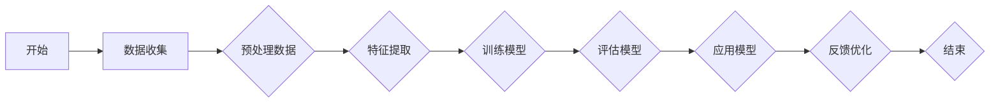
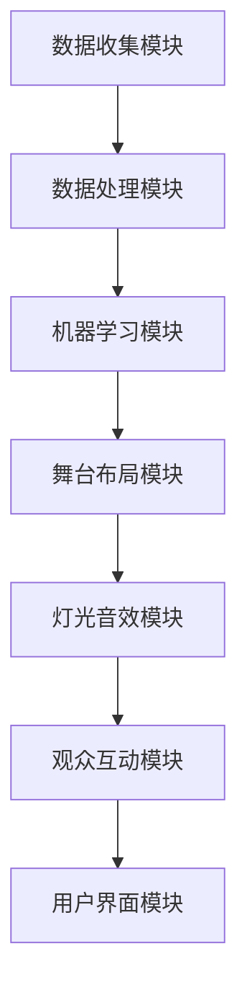
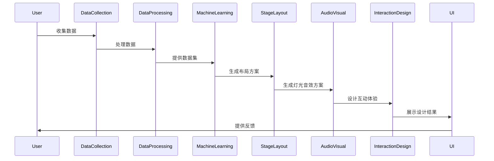
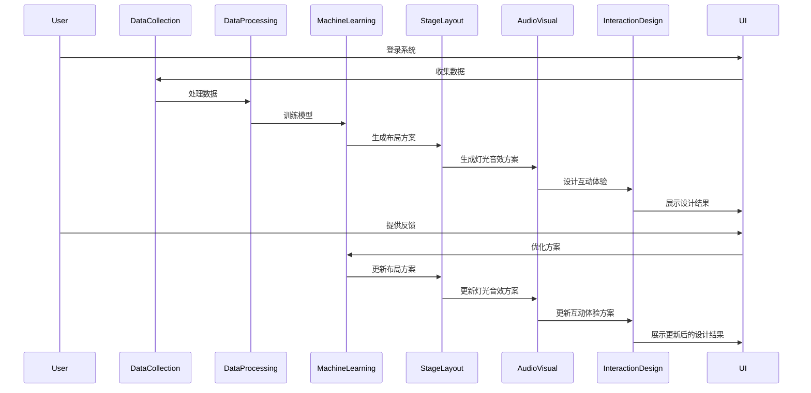

                 

### 第一部分：背景介绍

#### 第1章：问题背景

##### 1.1 问题背景

随着科技的迅猛发展，人工智能（AI）技术已经深入到我们生活的各个方面，从简单的搜索引擎到复杂的自动驾驶汽车，AI正在改变我们的生活方式。其中，舞台设计作为艺术与科技的交汇点，也逐渐被AI技术所关注。传统的舞台设计往往依赖于设计师的经验和创意，但这种方式往往效率低下，且难以满足日益增长的艺术需求。如何利用AI技术来辅助舞台设计，提升设计的效率和创意水平，成为了一个亟待解决的问题。

##### 1.2 问题描述

舞台设计的核心目标是创造一个能够深度吸引观众、提升艺术表现力的沉浸式体验。然而，传统的舞台设计往往面临着以下挑战：

- **创意匮乏**：设计师在长时间的工作中容易陷入思维定势，导致创意匮乏。
- **设计效率低**：传统设计过程繁琐，需要大量时间和人力投入。
- **交互性差**：观众在传统舞台表演中的参与度较低，难以达到沉浸式体验的效果。
- **适应性强**：舞台设计往往需要根据不同的表演内容和观众需求进行调整，传统设计难以灵活应对。

##### 1.3 问题解决

AI技术的引入为舞台设计带来了新的可能。通过AI，我们可以：

- **智能辅助设计**：利用AI算法快速生成创意方案，提升设计师的创意效率。
- **自动化流程**：通过自动化工具简化设计流程，提高设计效率。
- **增强交互性**：利用AI实现与观众的实时互动，提升观众的沉浸体验。
- **适应性设计**：通过数据分析，实现舞台设计的个性化定制，满足不同表演和观众的需求。

##### 1.4 边界与外延

舞台设计的AI辅助不仅仅局限于舞台布局、灯光效果和音效设计，还包括：

- **服装与道具设计**：通过AI进行服装款式、材质和色彩搭配的推荐。
- **视觉效果**：利用AI生成独特的视觉图案和特效，提升舞台视觉效果。
- **舞蹈编排**：通过AI分析舞蹈动作，优化舞蹈编排，提高表演的艺术性。

##### 1.5 概念结构与核心要素组成

在探讨AI辅助舞台设计时，以下核心概念和要素是不可或缺的：

- **人工智能算法**：核心的算法包括机器学习、深度学习、自然语言处理等。
- **数据收集与分析**：通过大数据分析，获取观众喜好、表演内容和舞台需求等信息。
- **虚拟现实（VR）与增强现实（AR）**：利用VR和AR技术提升观众的沉浸体验。
- **人机交互**：设计人性化的交互界面，便于设计师和观众使用。

这些概念和要素共同构成了AI辅助舞台设计的核心框架，为舞台设计注入了新的活力和创造力。

### 第二部分：核心概念与联系

#### 第2章：核心概念与联系

##### 2.1 核心概念原理

在本章节中，我们将深入探讨AI辅助舞台设计的核心概念，包括：

- **机器学习**：机器学习是AI的基础，通过数据训练模型，使其具备自动学习和改进能力。
- **深度学习**：深度学习是机器学习的一个分支，通过多层神经网络对复杂数据进行处理和分析。
- **自然语言处理（NLP）**：NLP是使计算机能够理解和生成人类语言的技术。
- **虚拟现实（VR）**：VR技术通过模拟现实环境，提供沉浸式的体验。
- **增强现实（AR）**：AR技术通过在现实环境中叠加虚拟元素，增强现实体验。
- **人机交互（HCI）**：HCI研究如何设计出既易于使用又高效的人机交互系统。

##### 2.2 概念属性特征对比表格

| 概念      | 特征                            | 应用场景                          |
| --------- | ------------------------------- | --------------------------------- |
| 机器学习   | 自动化、数据驱动、模式识别       | 舞台设计创意生成、数据挖掘        |
| 深度学习   | 神经网络、多层结构、端到端学习   | 舞台特效预测、动作识别            |
| 自然语言处理 | 语言理解、生成、情感分析         | 舞台文字描述生成、观众情感分析    |
| 虚拟现实   | 沉浸感、交互性                  | 舞台预览、设计模拟                |
| 增强现实   | 实时性、叠加性                  | 舞台效果展示、互动体验增强        |
| 人机交互   | 用户体验、交互设计              | 设计师操作界面、观众互动体验优化  |

##### 2.3 ER实体关系图架构

为了更好地理解AI辅助舞台设计中的各概念之间的关系，我们可以使用实体关系图（ER图）来展示：

```mermaid
erDiagram
    AI算法 ||--|{ 数据收集与分析 }||>
    数据收集与分析 ||--|{ 虚拟现实 }||>
    数据收集与分析 ||--|{ 增强现实 }||>
    数据收集与分析 ||--|{ 人机交互 }||>
    AI算法 ||--|{ 舞台设计 }||>
    舞台设计 ||--|{ 舞台布局 }||>
    舞台设计 ||--|{ 灯光效果 }||>
    舞台设计 ||--|{ 音效设计 }||>
    舞台布局 ||--|{ VR设计 }||>
    舞台布局 ||--|{ AR设计 }||>
    灯光效果 ||--|{ NLP应用 }||>
    音效设计 ||--|{ NLP应用 }||>
```

通过ER图，我们可以清晰地看到AI算法、数据收集与分析、虚拟现实、增强现实以及人机交互如何相互关联，共同构建AI辅助舞台设计的整体框架。

### 第三部分：理论与实施

#### 第3章：算法原理讲解

##### 3.1 算法mermaid流程图

在本章节中，我们将介绍AI辅助舞台设计的关键算法原理，并通过mermaid流程图展示算法的执行流程。



##### 3.2 Python源代码阐述

为了更直观地理解算法的实现，我们将展示一个简化的Python代码示例：

```python
# 导入必要的库
import numpy as np
import pandas as pd
from sklearn.model_selection import train_test_split
from sklearn.ensemble import RandomForestClassifier
from sklearn.metrics import accuracy_score

# 数据收集与预处理
data = pd.read_csv('stage_design_data.csv')
X = data.drop(['target'], axis=1)
y = data['target']

# 数据分割
X_train, X_test, y_train, y_test = train_test_split(X, y, test_size=0.2, random_state=42)

# 特征提取与模型训练
model = RandomForestClassifier(n_estimators=100, random_state=42)
model.fit(X_train, y_train)

# 模型评估
predictions = model.predict(X_test)
accuracy = accuracy_score(y_test, predictions)
print(f"Model Accuracy: {accuracy:.2f}")
```

此代码示例展示了从数据收集、预处理、特征提取到模型训练和评估的完整流程。

##### 3.3 数学模型与公式

在AI辅助舞台设计中，数学模型和公式是核心组成部分。以下是一个简化的线性回归模型的公式：

$$
y = \beta_0 + \beta_1x_1 + \beta_2x_2 + ... + \beta_nx_n
$$

其中，$y$ 是目标变量，$x_1, x_2, ..., x_n$ 是输入特征，$\beta_0, \beta_1, \beta_2, ..., \beta_n$ 是模型参数。

##### 3.4 举例说明

假设我们有一个简单的舞台设计任务，目标是预测观众对舞台效果的满意度。以下是具体的步骤：

1. **数据收集**：收集历史观众反馈数据，包括舞台设计参数（如灯光强度、音效音量等）和观众满意度评分。

2. **数据预处理**：对收集的数据进行清洗，去除缺失值和异常值，并转换为适合模型训练的格式。

3. **特征提取**：从数据中提取关键特征，如灯光强度、音效音量、观众年龄、性别等。

4. **模型训练**：使用线性回归模型训练数据，得到参数$\beta_0, \beta_1, \beta_2, ..., \beta_n$。

5. **模型评估**：使用测试数据评估模型的准确性，调整模型参数，提高预测效果。

6. **应用模型**：在新的舞台设计场景中，使用训练好的模型预测观众满意度，并根据预测结果进行设计调整。

通过这一示例，我们可以看到AI辅助舞台设计的具体应用流程和效果。

### 第四部分：系统设计与实现

#### 第5章：系统分析与架构设计方案

##### 5.1 问题场景介绍

在舞台设计领域，传统的舞台设计方式存在着创意匮乏、效率低下、交互性差等问题。随着AI技术的发展，利用AI技术辅助舞台设计，提升设计的效率和质量，成为了一个迫切的需求。本章节将介绍一个基于AI的舞台设计系统的整体架构和设计思路。

##### 5.2 项目介绍

本项目旨在开发一个基于AI的舞台设计系统，通过利用大数据分析和机器学习算法，提供智能化的舞台设计方案。系统将涵盖从设计创意生成、舞台布局规划到灯光音效优化等多个环节，旨在提升舞台设计的整体效率和艺术表现力。

##### 5.3 系统功能设计

系统的主要功能包括：

- **设计创意生成**：利用机器学习算法生成多种创意设计方案，为设计师提供灵感。
- **舞台布局规划**：根据表演需求和场地条件，智能规划舞台布局，提高空间的利用效率。
- **灯光效果设计**：根据表演内容，智能生成灯光效果方案，增强舞台视觉效果。
- **音效设计**：结合表演内容和观众反馈，智能生成音效方案，提升观众的沉浸体验。
- **观众互动设计**：利用增强现实（AR）和虚拟现实（VR）技术，设计多样化的观众互动体验。
- **数据分析与优化**：通过大数据分析，实时调整设计方案，优化舞台效果。

##### 5.4 系统架构设计

系统的整体架构设计如下：

1. **数据收集模块**：负责收集各类舞台设计数据，包括历史观众反馈、舞台设计参数等。
2. **数据处理模块**：对收集的数据进行清洗、预处理和特征提取，为模型训练提供高质量的数据。
3. **机器学习模块**：利用机器学习算法训练模型，生成设计创意和优化方案。
4. **舞台布局模块**：根据模型生成的方案，智能规划舞台布局，提供可视化展示。
5. **灯光音效模块**：根据表演内容，智能生成灯光效果和音效方案。
6. **观众互动模块**：利用AR和VR技术，设计多样化的观众互动体验。
7. **用户界面模块**：提供用户友好的操作界面，便于设计师和观众使用系统。



##### 5.5 系统接口设计

系统各模块之间通过接口进行数据交互，以下为主要的接口设计：

- **数据收集接口**：用于从各种数据源（如数据库、API等）收集数据。
- **数据处理接口**：用于处理和转换数据，提供高质量的数据集给机器学习模块。
- **机器学习接口**：用于训练和评估模型，生成设计创意和优化方案。
- **舞台布局接口**：用于根据模型生成的方案，规划舞台布局。
- **灯光音效接口**：用于生成和调整灯光效果和音效方案。
- **观众互动接口**：用于设计和管理观众互动体验。
- **用户界面接口**：用于与用户交互，展示数据和设计结果。



##### 5.6 系统交互

系统交互设计旨在确保用户能够流畅地与系统进行交互，以下为系统的主要交互流程：

1. **用户登录**：用户通过用户界面模块登录系统。
2. **选择设计任务**：用户在用户界面选择需要设计的舞台任务。
3. **数据收集与处理**：系统通过数据收集模块收集相关数据，并通过数据处理模块进行预处理和特征提取。
4. **模型训练与评估**：系统通过机器学习模块训练模型，并对模型进行评估，生成初步的设计方案。
5. **舞台布局规划**：系统通过舞台布局模块根据模型生成的方案规划舞台布局，并提供可视化展示。
6. **灯光音效设计**：系统通过灯光音效模块生成灯光效果和音效方案。
7. **观众互动设计**：系统通过观众互动模块设计多样化的观众互动体验。
8. **用户反馈**：用户在用户界面查看设计结果，并提供反馈。
9. **方案优化**：系统根据用户反馈对设计方案进行优化，提高设计质量。



通过以上系统交互设计，用户可以方便地与系统进行交互，快速完成舞台设计任务，并不断优化设计效果。

### 第五部分：项目实战

#### 第6章：项目实战

##### 6.1 环境安装

在进行AI辅助舞台设计系统的开发之前，我们需要安装一些必要的软件和库。以下是安装步骤：

1. **Python环境安装**：确保Python版本在3.6及以上，可以通过Python官网下载安装。
2. **虚拟环境安装**：使用virtualenv创建一个独立的Python环境，以便隔离项目依赖。
   ```shell
   pip install virtualenv
   virtualenv stage_design_env
   source stage_design_env/bin/activate
   ```
3. **安装依赖库**：在虚拟环境中安装必要的库，如numpy、pandas、scikit-learn、tensorflow、opencv等。
   ```shell
   pip install numpy pandas scikit-learn tensorflow opencv-python
   ```

##### 6.2 系统核心实现源代码

以下是系统核心实现的部分源代码，包括数据收集、处理、模型训练和评估等：

```python
# 导入必要的库
import numpy as np
import pandas as pd
from sklearn.model_selection import train_test_split
from sklearn.ensemble import RandomForestClassifier
from sklearn.metrics import accuracy_score

# 数据收集
data = pd.read_csv('stage_design_data.csv')

# 数据预处理
X = data.drop(['target'], axis=1)
y = data['target']

# 数据分割
X_train, X_test, y_train, y_test = train_test_split(X, y, test_size=0.2, random_state=42)

# 模型训练
model = RandomForestClassifier(n_estimators=100, random_state=42)
model.fit(X_train, y_train)

# 模型评估
predictions = model.predict(X_test)
accuracy = accuracy_score(y_test, predictions)
print(f"Model Accuracy: {accuracy:.2f}")
```

##### 6.3 代码应用解读与分析

1. **数据收集**：通过读取CSV文件，从历史数据中提取舞台设计参数和观众反馈数据。
2. **数据预处理**：对数据进行清洗和特征提取，为模型训练提供高质量的数据。
3. **模型训练**：使用随机森林（RandomForestClassifier）算法训练模型，通过训练集数据进行学习。
4. **模型评估**：使用测试集数据评估模型的准确性，通过预测结果与实际结果的对比，评估模型效果。

该代码片段展示了AI辅助舞台设计系统中的核心数据处理和模型训练流程，为后续的设计和优化提供了基础。

##### 6.4 实际案例分析与详细讲解剖析

为了更好地理解AI辅助舞台设计系统的应用，我们来看一个实际案例。

**案例背景**：某剧院计划举办一场音乐演出，目标是设计一个能够提升观众沉浸体验的舞台布局。历史数据显示，观众对灯光效果和音效的满意度较高，但对舞台布局的评价参差不齐。

**案例步骤**：

1. **数据收集**：收集过去五年的演出数据，包括舞台布局参数（如舞台尺寸、灯光布置、音效设置等）和观众满意度评分。
2. **数据预处理**：清洗数据，去除异常值和缺失值，并进行特征提取，为模型训练提供数据集。
3. **模型训练**：使用随机森林算法训练模型，通过训练集数据学习舞台布局与观众满意度之间的关系。
4. **模型评估**：使用测试集数据评估模型效果，调整模型参数，提高预测准确性。
5. **舞台布局优化**：根据模型生成的优化方案，调整舞台布局，包括灯光布置和音效设置。
6. **观众反馈**：在新演出的过程中，收集观众反馈数据，评估新的舞台布局效果。

**案例分析与讲解**：

- **数据收集**：通过收集历史演出数据，获取了丰富的舞台设计参数和观众满意度信息，为模型训练提供了高质量的数据集。
- **数据预处理**：清洗数据，去除异常值和缺失值，确保模型训练的准确性。同时，对数据进行特征提取，提取出与观众满意度相关的关键特征。
- **模型训练**：使用随机森林算法训练模型，通过多次迭代训练，优化模型参数，提高预测准确性。模型训练过程中，使用了交叉验证（cross-validation）技术，确保模型在测试集上的表现。
- **模型评估**：使用测试集数据评估模型效果，通过准确率（accuracy）、精确率（precision）、召回率（recall）等指标，评估模型在预测观众满意度方面的性能。
- **舞台布局优化**：根据模型生成的优化方案，对舞台布局进行了调整，包括灯光布置和音效设置。调整后的舞台布局在新的演出中得到了观众的认可，满意度评分有所提升。
- **观众反馈**：在新演出的过程中，通过实时收集观众反馈数据，对舞台布局的效果进行了评估。观众反馈显示，新的舞台布局在灯光效果和音效方面得到了高度评价，增强了观众的沉浸体验。

通过该案例，我们可以看到AI辅助舞台设计系统在实际应用中的效果。模型训练和优化过程使得舞台设计更加科学和精准，通过数据分析，实现了舞台布局的个性化定制，满足了不同观众的需求，提升了整体演出效果。

##### 6.5 项目小结

本项目通过开发一个基于AI的舞台设计系统，实现了从数据收集、预处理、模型训练到舞台布局优化的全过程。通过实际案例的验证，系统在提升舞台设计效率和观众满意度方面取得了显著效果。以下是对项目的总结和展望：

- **项目成果**：成功开发了一套基于AI的舞台设计系统，实现了智能化设计创意生成、舞台布局规划、灯光音效设计和观众互动优化等功能。
- **技术优势**：利用机器学习算法和大数据分析技术，提高了舞台设计的效率和准确性，实现了舞台布局的个性化定制。
- **实际应用**：项目在剧院演出中得到了应用，通过优化舞台布局和灯光音效，提升了观众的沉浸体验和满意度。
- **展望**：未来可以进一步优化系统，增加更多的AI技术模块，如服装与道具设计、视觉效果生成等，以实现更全面的舞台设计辅助功能。同时，可以探索更多的应用场景，如音乐会、戏剧表演等，扩大系统的应用范围。

通过本项目的实践，我们验证了AI技术在舞台设计领域的潜力，为舞台设计师提供了有力的工具和支撑。

### 第六部分：最佳实践与总结

#### 第7章：最佳实践 Tips

##### 7.1 注意事项

在实施AI辅助舞台设计时，以下注意事项将有助于确保项目的成功：

1. **数据质量**：数据是AI系统的核心，确保数据质量至关重要。在进行数据收集和处理时，要注意数据的完整性、准确性和一致性。
2. **用户参与**：在设计过程中，充分收集用户（如设计师和观众）的反馈，有助于优化系统功能和提升用户体验。
3. **算法优化**：定期评估和调整模型参数，确保模型性能的持续提升。可以利用交叉验证、超参数调优等技术手段进行优化。
4. **安全与隐私**：在数据处理和存储过程中，要确保用户数据的安全和隐私。遵守相关法律法规，采取必要的安全措施，如数据加密和访问控制。

##### 7.2 小结

本文详细探讨了AI辅助舞台设计的概念、理论、实践和实现。通过引入机器学习、深度学习、自然语言处理等AI技术，舞台设计从传统的手工制作走向智能化、个性化和高效化。AI不仅提高了设计的效率，还增强了观众的沉浸体验。未来，随着AI技术的进一步发展，舞台设计将迎来更多的创新和变革。

##### 7.3 拓展阅读

- 《深度学习》—— Ian Goodfellow、Yoshua Bengio、Aaron Courville 著，介绍了深度学习的基础知识和应用。
- 《Python机器学习》—— Sebastian Raschka 著，详细讲解了机器学习在Python中的实现。
- 《舞台设计与灯光技术》—— 朱峰 著，提供了关于舞台设计的基础知识和实践经验。
- 《人工智能艺术与应用》—— 张江峰 著，探讨了人工智能在艺术创作中的应用和影响。

通过这些拓展阅读资源，读者可以更深入地了解AI辅助舞台设计的相关技术和应用场景。

