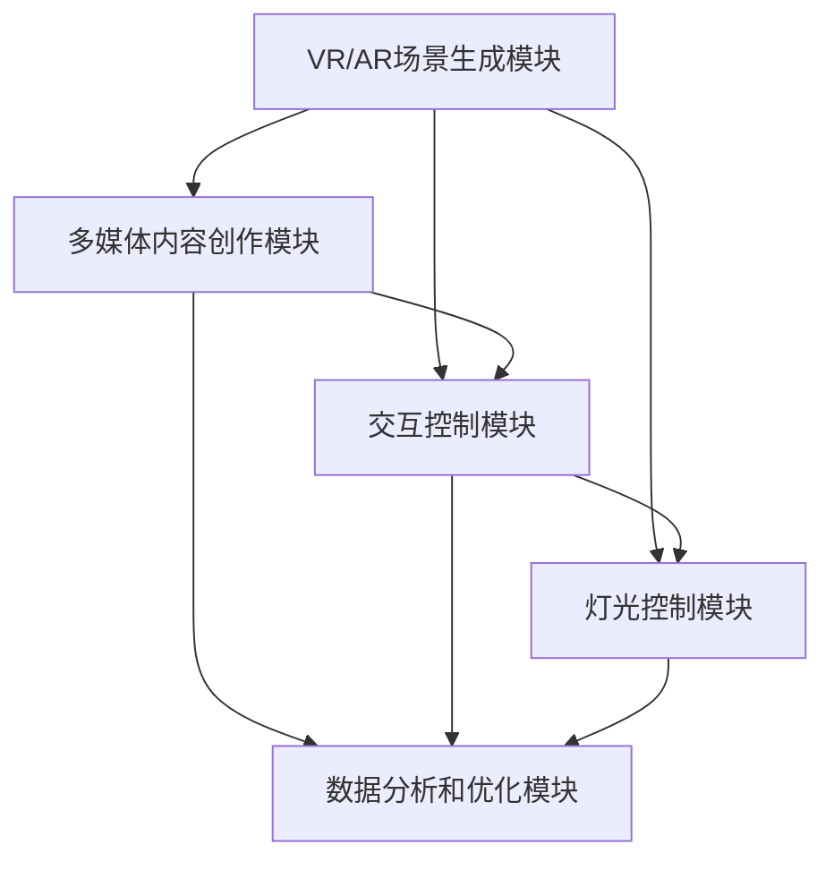
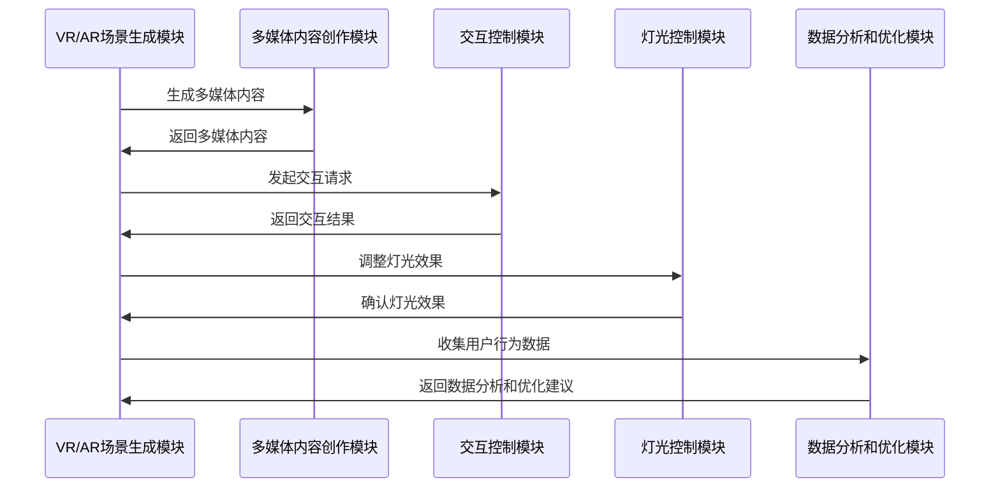

                 


## AI辅助创意舞台设计：沉浸式多媒体整合的提示词技巧

关键词：AI，舞台设计，沉浸式体验，多媒体整合，提示词技巧

摘要：随着科技的不断发展，人工智能（AI）在各个领域都展现出了巨大的潜力。本文将探讨AI在创意舞台设计中的应用，尤其是如何利用AI技术实现沉浸式多媒体整合，并介绍一些实用的提示词技巧，以帮助设计师们更好地完成舞台设计。

-----------------------------------------------------

## 目录大纲

----------------------------------------------------------------

# 第一部分: AI辅助创意舞台设计概述

## 1.1 问题背景

### 1.1.1 创意舞台设计的需求与发展

### 1.1.2 AI技术在舞台设计中的应用现状

## 1.2 问题描述

### 1.2.1 创意舞台设计的主要挑战

### 1.2.2 AI技术如何辅助创意舞台设计

## 1.3 问题解决

### 1.3.1 AI辅助创意舞台设计的流程

### 1.3.2 AI技术在舞台设计中的应用案例分析

## 1.4 边界与外延

### 1.4.1 AI辅助创意舞台设计的适用范围

### 1.4.2 AI技术在舞台设计中的局限性

## 1.5 概念结构与核心要素组成

### 1.5.1 AI辅助创意舞台设计的核心概念

### 1.5.2 创意舞台设计的核心要素

## 1.6 本章小结

----------------------------------------------------------------

# 第二部分: AI辅助创意舞台设计核心概念

## 2.1 AI技术概述

### 2.1.1 AI的定义与发展历程

### 2.1.2 AI的核心技术

## 2.2 多媒体整合

### 2.2.1 多媒体的定义与分类

### 2.2.2 多媒体整合的重要性

## 2.3 沉浸式体验

### 2.3.1 沉浸式体验的定义

### 2.3.2 沉浸式体验的设计原则

## 2.4 提示词技巧

### 2.4.1 提示词的概念

### 2.4.2 提示词的设计与应用

## 2.5 本章小结

----------------------------------------------------------------

# 第三部分: AI辅助创意舞台设计实践

## 3.1 创意舞台设计流程

### 3.1.1 创意阶段

### 3.1.2 设计阶段

### 3.1.3 实施阶段

## 3.2 AI技术应用

### 3.2.1 数据收集与处理

### 3.2.2 模型训练与优化

### 3.2.3 模型部署与应用

## 3.3 多媒体整合与沉浸式体验

### 3.3.1 多媒体内容创作

### 3.3.2 沉浸式体验设计

### 3.3.3 多媒体与沉浸式体验的融合

## 3.4 提示词应用技巧

### 3.4.1 提示词生成与优化

### 3.4.2 提示词在创意舞台设计中的应用案例

## 3.5 本章小结

----------------------------------------------------------------

# 第四部分: AI辅助创意舞台设计案例分析

## 4.1 案例背景

### 4.1.1 案例简介

### 4.1.2 案例需求

## 4.2 系统设计与实现

### 4.2.1 系统架构设计

### 4.2.2 系统功能实现

### 4.2.3 系统接口设计

## 4.3 案例分析

### 4.3.1 创意阶段分析

### 4.3.2 设计阶段分析

### 4.3.3 实施阶段分析

## 4.4 案例小结

### 4.4.1 案例成功经验

### 4.4.2 案例中存在的问题与改进措施

## 4.5 本章小结

----------------------------------------------------------------

# 第五部分: AI辅助创意舞台设计最佳实践

## 5.1 设计原则与技巧

### 5.1.1 创意舞台设计的核心原则

### 5.1.2 AI技术的最佳应用技巧

## 5.2 案例分享

### 5.2.1 成功案例分享

### 5.2.2 失败案例分享

## 5.3 注意事项与拓展阅读

### 5.3.1 设计中常见问题与解决方案

### 5.3.2 拓展阅读推荐

## 5.4 本章小结

----------------------------------------------------------------

# 第六部分: 总结与展望

## 6.1 总结

### 6.1.1 AI辅助创意舞台设计的重要性

### 6.1.2 本书的核心内容与贡献

## 6.2 展望

### 6.2.1 AI辅助创意舞台设计的未来发展趋势

### 6.2.2 研究与探索方向

## 6.3 本章小结

-----------------------------------------------------

----------------------------------------------------------------

**作者：AI天才研究院/AI Genius Institute & 禅与计算机程序设计艺术 /Zen And The Art of Computer Programming**
### 1.1 问题背景

#### 1.1.1 创意舞台设计的需求与发展

舞台设计作为艺术与科技相结合的产物，一直处于不断发展的状态。在过去的几十年里，随着舞台技术的不断进步，舞台设计已经不再局限于传统的布景和灯光效果，而是逐渐融入了多媒体元素，如视频、音频、投影等，从而实现了更加丰富和多样的舞台表现。

**需求分析**：

随着观众对舞台表演的审美要求不断提高，创意舞台设计的需求也越来越大。具体来说，创意舞台设计的需求体现在以下几个方面：

1. **沉浸式体验**：观众希望能够在舞台表演中获得更加沉浸的体验，这要求舞台设计需要能够创造出更加逼真的场景和氛围。
2. **多媒体整合**：现代舞台设计需要整合多种媒体元素，如视频、音频、灯光等，以创造出独特的舞台效果。
3. **交互性**：舞台设计需要与观众进行互动，提高观众的参与度。

**发展历程**：

舞台设计的发展历程可以分为几个阶段：

1. **传统舞台设计**：这一阶段的舞台设计主要依赖于布景和灯光，通过布景的变换和灯光的调节来营造氛围。
2. **多媒体舞台设计**：随着科技的发展，多媒体元素逐渐被引入舞台设计，这一阶段的舞台设计开始融合视频、音频、投影等技术。
3. **沉浸式舞台设计**：近年来，随着虚拟现实（VR）和增强现实（AR）技术的成熟，沉浸式舞台设计逐渐兴起，观众能够身临其境地感受舞台表演。

#### 1.1.2 AI技术在舞台设计中的应用现状

随着人工智能技术的不断发展，AI技术在舞台设计中的应用也越来越广泛。以下是AI技术在舞台设计中的应用现状：

**数据分析**：

1. **创意生成**：AI可以通过大数据分析和机器学习技术，帮助设计师快速生成创意，提高设计效率。
2. **多媒体内容创作**：AI可以自动生成视频、音频等多媒体内容，为舞台设计提供素材。
3. **灯光控制**：AI可以智能控制舞台灯光，根据表演内容和场景需求进行动态调整。
4. **观众互动**：AI可以通过人脸识别、语音识别等技术，与观众进行实时互动，提高观众的参与度。

**实际应用**：

目前，许多舞台设计项目已经开始使用AI技术来提升舞台效果。例如，一些大型音乐会和表演活动使用AI来生成即兴表演，使表演更加生动和有趣。此外，一些舞台设计公司也开始使用AI来优化舞台灯光和音效，以创造出更加沉浸的舞台体验。

#### 1.1.3 创意舞台设计的挑战

尽管AI技术在舞台设计中的应用带来了许多机遇，但也带来了一系列挑战。以下是创意舞台设计面临的几个主要挑战：

**技术挑战**：

1. **算法优化**：AI算法需要不断优化，以提高在舞台设计中的应用效果。
2. **数据处理**：舞台设计涉及大量的数据，如何高效处理这些数据是当前的一个重要挑战。
3. **实时性**：舞台设计需要在短时间内完成，如何保证AI算法的实时性是一个挑战。

**创意限制**：

1. **创造性**：尽管AI可以生成创意，但AI的创意是否能够满足设计师的期望是一个问题。
2. **个性化**：每个舞台设计都有其独特的需求，如何使AI能够理解并满足这些个性化需求是一个挑战。

**安全性**：

1. **数据安全**：舞台设计涉及大量的敏感数据，如何保证这些数据的安全是一个重要问题。
2. **隐私保护**：AI技术在舞台设计中的应用可能会涉及到观众的隐私，如何保护观众的隐私是一个挑战。

#### 1.1.4 AI技术在舞台设计中的应用

**AI在创意生成中的应用**：

AI可以通过大数据分析和机器学习技术，从大量的舞台设计案例中提取出关键特征，从而帮助设计师快速生成创意。例如，AI可以分析过去的成功舞台设计，提取出成功的设计元素，然后根据这些元素生成新的创意。

**AI在多媒体内容创作中的应用**：

AI可以自动生成视频、音频等多媒体内容，为舞台设计提供素材。例如，AI可以通过视频分析技术，从大量的视频素材中提取出关键帧，然后根据这些关键帧生成视频片段。

**AI在灯光控制中的应用**：

AI可以智能控制舞台灯光，根据表演内容和场景需求进行动态调整。例如，AI可以通过人脸识别技术，根据观众的反应调整舞台灯光，从而提高观众的观看体验。

**AI在观众互动中的应用**：

AI可以通过人脸识别、语音识别等技术，与观众进行实时互动，提高观众的参与度。例如，AI可以通过人脸识别技术，识别观众的表情，然后根据这些表情调整舞台表演，从而创造出更加互动的舞台体验。

### 1.2 问题描述

在创意舞台设计过程中，设计师面临着一系列复杂的问题，这些问题涉及创意生成、多媒体内容创作、灯光控制以及观众互动等多个方面。以下是对这些问题的具体描述：

#### 1.2.1 创意舞台设计的主要挑战

1. **创意生成**：如何快速生成具有创意且能够满足观众需求的舞台设计方案是一个重要挑战。传统的设计方法依赖于设计师的个人经验和直觉，效率较低，且容易陷入创作瓶颈。

2. **多媒体内容创作**：舞台设计需要整合多种多媒体元素，如视频、音频、灯光等。如何高效创作并整合这些内容，以创造出独特且令人印象深刻的舞台效果，是设计师面临的另一个挑战。

3. **实时性**：舞台表演通常要求在有限的时间内完成，设计过程中的算法需要具备较高的实时性，以确保设计方案能够及时应用于实际表演中。

4. **个性化**：每个表演都有其特定的主题和内容，如何使AI能够理解并适应这些个性化需求，从而生成符合表演要求的创意，是设计师面临的难题。

5. **安全性**：舞台设计涉及大量的数据，如何保护这些数据的安全，防止数据泄露，是设计师需要关注的问题。

#### 1.2.2 AI技术如何辅助创意舞台设计

1. **数据分析**：AI可以通过大数据分析技术，对历史舞台设计案例进行分析，提取出成功的设计元素和趋势，为设计师提供创意参考。

2. **多媒体内容创作**：AI可以自动生成视频、音频等多媒体内容，为舞台设计提供素材。例如，通过图像识别技术，AI可以从大量视频素材中提取出关键帧，从而快速生成视频片段。

3. **灯光控制**：AI可以智能控制舞台灯光，根据表演内容和场景需求进行动态调整。例如，通过人脸识别技术，AI可以实时监测观众的反应，然后调整灯光效果，以创造出更加沉浸的舞台体验。

4. **观众互动**：AI可以通过人脸识别、语音识别等技术，与观众进行实时互动，提高观众的参与度。例如，AI可以通过语音识别技术，识别观众的提问，然后生成相应的回答，从而实现与观众的互动。

#### 1.2.3 创意舞台设计的核心问题

1. **创意如何实现**：如何在创意生成过程中，确保创意的可行性和实际应用性，是设计师需要解决的核心问题。

2. **技术如何应用**：如何将AI技术有效地应用于舞台设计，以提升舞台效果，是设计师需要考虑的重要问题。

3. **安全性和隐私保护**：如何在保证数据安全的同时，实现个性化设计，是设计师需要关注的核心问题。

4. **实时性和高效性**：如何确保AI算法的实时性和高效性，以满足舞台表演的紧迫性，是设计师需要解决的技术难题。

### 1.3 问题解决

为了解决上述问题，我们需要从以下几个方面进行探讨和尝试：

#### 1.3.1 AI辅助创意舞台设计的流程

AI辅助创意舞台设计的流程可以大致分为以下几个阶段：

1. **需求分析**：首先，需要明确舞台设计的具体需求，包括表演内容、观众群体、舞台环境等。

2. **数据收集**：根据需求分析，收集相关的数据，包括历史舞台设计案例、多媒体素材、观众反馈等。

3. **数据分析**：利用大数据分析技术，对收集到的数据进行分析，提取出关键信息和设计趋势。

4. **创意生成**：基于分析结果，使用AI算法生成创意方案。这一过程可以包括多轮迭代，以优化创意的可行性和实际应用性。

5. **多媒体内容创作**：根据创意方案，利用AI技术自动生成多媒体内容，如视频、音频等。

6. **灯光控制与观众互动**：利用AI技术进行灯光控制和观众互动，以提高舞台的沉浸感和互动性。

7. **实施与反馈**：将创意方案和多媒体内容应用于实际舞台表演，并根据观众的反馈进行优化。

#### 1.3.2 AI技术在舞台设计中的应用案例分析

为了更好地理解AI在舞台设计中的应用，我们可以通过一些实际案例进行分析。

**案例一：沉浸式音乐会**

某知名音乐人举办了一场沉浸式音乐会，通过AI技术实现了多媒体整合和观众互动。音乐会中，AI系统根据观众的反应实时调整灯光和音乐，创造出独特的沉浸式体验。观众可以通过手机应用与舞台互动，投票选择音乐的下一曲，从而参与到表演中。

**案例二：多媒体舞台剧**

某舞台剧制作公司使用AI技术进行多媒体内容创作和灯光控制。制作团队收集了大量的视频和音频素材，利用AI技术进行筛选和整合，生成了符合舞台剧情的多媒体内容。在表演过程中，AI系统根据剧情的发展动态调整灯光和音乐，创造出逼真的舞台效果。

#### 1.3.3 创意舞台设计的核心概念

在创意舞台设计过程中，以下核心概念需要得到重视：

1. **沉浸式体验**：通过多媒体整合和互动技术，创造出让观众身临其境的舞台氛围。

2. **多媒体整合**：将视频、音频、灯光等多种媒体元素整合到舞台设计中，以增强舞台效果。

3. **互动性**：通过观众互动技术，提高观众的参与度和体验感。

4. **创意生成**：利用AI技术快速生成创意方案，提高设计效率。

5. **数据驱动**：通过大数据分析和机器学习技术，为舞台设计提供数据支持。

#### 1.3.4 创意舞台设计的核心要素

创意舞台设计的核心要素包括：

1. **创意**：这是舞台设计的灵魂，决定了舞台的视觉效果和氛围。

2. **多媒体内容**：这是舞台设计的物质基础，包括视频、音频、图片等。

3. **灯光**：这是舞台设计的重要元素，通过灯光的明暗、色彩和动态效果，营造出特定的氛围。

4. **音效**：这是舞台设计的听觉元素，通过音效的配合，增强舞台效果。

5. **观众互动**：这是舞台设计的新趋势，通过互动技术，提高观众的参与度。

### 1.4 边界与外延

#### 1.4.1 AI辅助创意舞台设计的适用范围

AI辅助创意舞台设计适用于各种类型的舞台表演，包括音乐会、戏剧、舞蹈表演等。尤其适用于需要沉浸式体验和多媒体整合的舞台设计。

#### 1.4.2 AI技术在舞台设计中的局限性

虽然AI技术在舞台设计中有许多优势，但也存在一些局限性：

1. **创造性限制**：AI虽然可以生成创意，但仍然依赖于人类的设计理念和需求，无法完全替代人类设计师的创造性思维。

2. **数据处理能力**：虽然AI可以处理大量的数据，但在处理复杂和非结构化数据时，能力有限。

3. **实时性**：AI算法的实时性受到计算资源和算法复杂度的影响，无法在所有情况下保证实时响应。

4. **隐私保护**：AI技术在观众互动中的应用可能会涉及到观众的隐私，需要确保隐私保护措施得到有效实施。

#### 1.4.3 创意舞台设计的未来发展趋势

随着AI技术的不断进步，创意舞台设计未来将呈现以下发展趋势：

1. **智能化**：AI技术将更加智能化，能够更好地理解设计师的需求和观众的行为，提供更加个性化的舞台设计方案。

2. **实时互动**：AI将实现更加实时的观众互动，为观众提供更加沉浸的体验。

3. **多媒体整合**：AI将更广泛地应用于多媒体整合，创造出更加丰富多彩的舞台效果。

4. **数据驱动**：创意舞台设计将更加依赖数据分析和机器学习技术，以实现更加科学和高效的设计。

### 1.5 概念结构与核心要素组成

在探讨AI辅助创意舞台设计时，了解其概念结构和核心要素组成至关重要。以下是相关概念术语的说明、问题背景、问题描述、问题解决、边界与外延、概念结构与核心要素组成的详细解释。

#### 1.5.1 概念术语说明

1. **创意舞台设计**：创意舞台设计是指利用各种技术和艺术手段，创造出一个独特的、具有吸引力的舞台氛围和体验。它不仅包括视觉元素，如布景、灯光、道具，还包括听觉元素，如音乐、音效，以及观众互动等。

2. **人工智能（AI）**：人工智能是指由计算机实现的智能行为，它能够模仿人类的思维过程，进行学习、推理、决策和创造。在舞台设计中，AI可以用于创意生成、多媒体内容创作、灯光控制、观众互动等多个方面。

3. **多媒体整合**：多媒体整合是指将多种媒体元素，如视频、音频、图像、文字等，集成到舞台设计中，以创造出丰富多彩的舞台效果。多媒体整合是实现沉浸式体验的重要手段。

4. **沉浸式体验**：沉浸式体验是指观众在观看表演时，感觉自己完全置身于表演场景之中，无法区分现实与虚拟。沉浸式体验通过多媒体整合、观众互动等技术实现。

5. **提示词技巧**：提示词技巧是指在创意舞台设计中，通过使用特定的词汇或短语，引导观众关注特定的表演元素，增强观众的观看体验。提示词可以是视觉上的，也可以是听觉上的。

#### 1.5.2 问题背景

创意舞台设计的背景可以追溯到舞台艺术的发展历程。在传统舞台设计中，舞台布景、灯光和音效是创造氛围和视觉效果的主要手段。然而，随着多媒体技术和人工智能的不断发展，舞台设计的概念和手段也发生了翻天覆地的变化。现代舞台设计不仅需要考虑视觉和听觉效果，还需要考虑观众的沉浸式体验和互动性。

#### 1.5.3 问题描述

创意舞台设计面临的主要问题包括：

1. **创意生成**：如何快速、高效地生成具有创意且能够满足观众需求的舞台设计方案。

2. **多媒体内容创作**：如何高效创作并整合视频、音频、灯光等多媒体元素，以创造出独特且令人印象深刻的舞台效果。

3. **实时性**：如何在有限的时间内，将创意和多媒体内容应用到舞台表演中。

4. **个性化**：如何根据每个表演的独特需求和观众群体的特点，生成个性化的舞台设计方案。

5. **安全性**：如何在保证数据安全的同时，实现个性化设计。

#### 1.5.4 问题解决

为了解决上述问题，我们可以采用以下方法：

1. **数据分析**：利用大数据分析技术，对历史舞台设计案例和观众反馈进行分析，提取出成功的设计元素和趋势，为设计师提供创意参考。

2. **AI技术**：利用AI技术进行创意生成、多媒体内容创作、灯光控制和观众互动，以提高设计效率和舞台效果。

3. **实时互动**：通过实时互动技术，提高观众的参与度和体验感，实现沉浸式体验。

4. **数据驱动**：通过数据分析和机器学习技术，为舞台设计提供数据支持，实现个性化设计。

5. **安全性**：采取数据加密、隐私保护等措施，确保数据安全和观众隐私。

#### 1.5.5 边界与外延

1. **适用范围**：AI辅助创意舞台设计适用于各种类型的舞台表演，包括音乐会、戏剧、舞蹈表演等。

2. **局限性**：AI技术虽然在舞台设计中具有许多优势，但仍存在创造性限制、数据处理能力不足、实时性挑战以及隐私保护等问题。

3. **未来趋势**：随着AI技术的不断进步，创意舞台设计将向智能化、实时互动、多媒体整合和数据驱动方向发展。

#### 1.5.6 概念结构与核心要素组成

创意舞台设计的概念结构包括以下几个核心要素：

1. **创意生成**：利用AI技术快速生成创意方案，是舞台设计的起点。

2. **多媒体整合**：将视频、音频、灯光等多种媒体元素整合到舞台设计中，以增强视觉效果和氛围。

3. **沉浸式体验**：通过多媒体整合和观众互动，创造出一个让观众身临其境的舞台氛围。

4. **互动性**：通过观众互动技术，提高观众的参与度和体验感。

5. **数据驱动**：通过数据分析和机器学习技术，为舞台设计提供数据支持，实现个性化设计。

6. **安全性**：采取数据加密、隐私保护等措施，确保数据安全和观众隐私。

这些核心要素相互关联，共同构成了创意舞台设计的概念结构，为设计师提供了丰富的设计工具和手段。

### 1.6 本章小结

本章对AI辅助创意舞台设计进行了概述，从问题背景、问题描述、问题解决、边界与外延、概念结构与核心要素组成等方面进行了详细探讨。通过分析，我们了解到创意舞台设计的需求与发展，AI技术在舞台设计中的应用现状，以及AI技术在舞台设计中的应用方法和挑战。本章为后续章节的深入探讨奠定了基础。

-----------------------------------------------------

### 2.1 AI技术概述

#### 2.1.1 AI的定义与发展历程

人工智能（Artificial Intelligence，简称AI）是指由计算机实现的智能行为，模仿人类的思维过程，进行学习、推理、决策和创造。AI的定义可以从不同的角度进行解读，主要包括以下几个方面：

1. **模拟人类智能**：AI旨在模拟人类的智能行为，包括感知、理解、学习、推理、决策、创造等。通过算法和计算模型，AI能够在特定领域内实现类似人类的智能表现。

2. **自动化**：AI的核心目标是实现自动化，即通过计算机程序替代人类进行复杂任务的处理。这包括数据分析和处理、决策制定、问题解决等。

3. **学习与适应**：AI具有学习和适应能力，可以通过大量的数据和经验进行自我优化和改进，提高任务完成的效率和准确性。

AI的发展历程可以分为几个重要阶段：

1. **初始阶段（1950s-1960s）**：AI的概念首次被提出，研究者开始探索如何通过计算机模拟人类的智能行为。这一阶段的代表性成果包括逻辑推理和问题解决。

2. **符号主义阶段（1970s-1980s）**：这一阶段的AI研究主要集中在符号主义方法，通过表示和操作符号来模拟人类思维。代表成果包括专家系统和知识表示。

3. **连接主义阶段（1990s）**：连接主义方法，即神经网络，开始受到关注。通过模拟生物神经网络的结构和功能，研究者试图实现更强大的学习和自适应能力。

4. **大数据和机器学习阶段（2000s-2010s）**：随着计算能力和数据量的提升，机器学习方法得到广泛应用。机器学习通过训练数据集来学习模式和规律，从而实现预测和分类等任务。

5. **深度学习阶段（2010s-至今）**：深度学习是机器学习的一个分支，通过多层神经网络进行数据建模。深度学习在图像识别、自然语言处理等领域取得了突破性成果。

#### 2.1.2 AI的核心技术

AI的核心技术包括机器学习、深度学习、自然语言处理、计算机视觉等。以下是这些核心技术的简要介绍：

1. **机器学习**：机器学习是一种让计算机通过数据学习模式和规律的方法。它包括监督学习、无监督学习和强化学习等不同类型。监督学习通过已标记的数据进行学习，无监督学习从未标记的数据中发现模式，强化学习通过奖励和惩罚来训练模型。

2. **深度学习**：深度学习是机器学习的一个分支，通过多层神经网络进行数据建模。深度学习在图像识别、语音识别和自然语言处理等领域取得了显著成果。常见的深度学习模型包括卷积神经网络（CNN）、循环神经网络（RNN）和生成对抗网络（GAN）。

3. **自然语言处理**：自然语言处理（NLP）是AI的一个重要分支，旨在让计算机理解和处理自然语言。NLP包括文本分类、情感分析、机器翻译、命名实体识别等任务。

4. **计算机视觉**：计算机视觉是让计算机理解和解释图像和视频的领域。它包括图像识别、目标检测、图像分割、人脸识别等任务。

#### 2.1.3 AI技术的优势与局限性

AI技术的优势在于：

1. **高效性**：AI可以快速处理大量数据，进行复杂的计算和分析。

2. **准确性**：通过训练大量数据和优化算法，AI可以在特定任务上达到很高的准确性。

3. **自动化**：AI可以自动化执行复杂任务，减少人力成本。

4. **适应性**：AI可以通过学习不断改进，适应新的环境和任务。

然而，AI技术也存在一些局限性：

1. **数据依赖**：AI性能很大程度上依赖于训练数据的质量和数量，缺乏高质量的数据可能导致性能下降。

2. **解释性**：AI模型，特别是深度学习模型，通常缺乏可解释性，难以理解其决策过程。

3. **泛化能力**：AI模型可能在一个特定任务上表现优秀，但无法泛化到其他任务或领域。

4. **安全性和隐私**：AI技术可能涉及敏感数据的处理，需要确保数据安全和隐私保护。

#### 2.1.4 AI技术在不同领域的应用

AI技术在各个领域都有广泛的应用，以下是一些典型的应用场景：

1. **医疗**：AI在医疗领域的应用包括疾病诊断、药物研发、健康监测等。通过分析大量的医疗数据，AI可以辅助医生做出更准确的诊断和治疗方案。

2. **金融**：AI在金融领域用于风险评估、交易策略、欺诈检测等。AI可以帮助金融机构更好地管理风险，提高交易效率。

3. **制造**：AI在制造业中用于设备维护、质量控制、生产优化等。通过实时监控和分析生产数据，AI可以提高生产效率，减少故障率。

4. **零售**：AI在零售领域用于商品推荐、客户服务、库存管理等。AI可以根据客户的行为数据，提供个性化的购物体验。

5. **交通**：AI在交通领域用于自动驾驶、智能交通管理、车辆调度等。通过分析交通数据和车辆状态，AI可以优化交通流量，提高运输效率。

#### 2.1.5 AI技术在舞台设计中的应用

AI技术在舞台设计中的应用主要集中在以下几个方面：

1. **创意生成**：通过大数据分析和机器学习技术，AI可以快速生成创意设计方案，为设计师提供灵感。

2. **多媒体内容创作**：AI可以自动生成视频、音频等多媒体内容，为舞台设计提供素材。例如，AI可以通过视频分析技术，从大量视频素材中提取出关键帧，生成独特的视频片段。

3. **灯光控制**：AI可以智能控制舞台灯光，根据表演内容和场景需求进行动态调整。例如，AI可以通过人脸识别技术，实时监测观众的反应，调整灯光效果，增强观众的沉浸感。

4. **观众互动**：AI可以通过人脸识别、语音识别等技术，与观众进行实时互动，提高观众的参与度。例如，AI可以通过语音识别技术，识别观众的提问，生成相应的回答，实现与观众的互动。

### 2.2 多媒体整合

#### 2.2.1 多媒体的定义与分类

多媒体（Multimedia）是指结合文字、图像、音频、视频等多种媒体元素的集合，通过计算机技术进行集成和处理。多媒体的定义可以从以下几个方面进行理解：

1. **信息传递**：多媒体是一种信息传递手段，通过多种媒体元素的组合，可以更丰富、更直观地传递信息。

2. **交互性**：多媒体具有交互性，用户可以通过各种方式与多媒体内容进行互动，例如点击、触摸、语音等。

3. **多样性**：多媒体结合了多种媒体元素，具有多样性，能够满足不同用户的需求和兴趣。

多媒体的分类可以根据媒体元素的不同进行划分，以下是几种常见类型的多媒体：

1. **文本多媒体**：文本多媒体主要包含文字和超文本，例如电子书、网页等。

2. **图像多媒体**：图像多媒体主要包含静态图像和动画图像，例如图片、视频、动画等。

3. **音频多媒体**：音频多媒体主要包含声音和音乐，例如音频文件、音乐播放器等。

4. **视频多媒体**：视频多媒体主要包含动态图像和声音，例如电影、电视节目、视频剪辑等。

5. **交互式多媒体**：交互式多媒体结合了文本、图像、音频、视频等多种媒体元素，并提供用户交互功能，例如游戏、虚拟现实（VR）、增强现实（AR）等。

#### 2.2.2 多媒体整合的重要性

多媒体整合在舞台设计中的重要性体现在以下几个方面：

1. **增强视觉效果**：通过整合多种媒体元素，舞台设计可以创造出更加丰富多彩的视觉效果，吸引观众的注意力。

2. **提高沉浸感**：多媒体整合可以使观众在观看表演时，感受到更多的感官刺激，从而提高观众的沉浸感。

3. **增强互动性**：多媒体整合可以提供观众与表演之间的互动，提高观众的参与度和体验感。

4. **创新表现形式**：多媒体整合为舞台设计提供了新的表现形式，例如虚拟现实（VR）、增强现实（AR）等，使舞台表演更加独特和有创意。

#### 2.2.3 多媒体整合的技术与方法

多媒体整合的技术与方法主要包括以下几种：

1. **编程技术**：使用编程语言，如Python、JavaScript等，编写代码来控制和管理多媒体元素。通过编程，可以实现多媒体元素的动态交互和效果展示。

2. **多媒体编辑软件**：使用多媒体编辑软件，如Adobe Premiere、Final Cut Pro等，对多媒体元素进行编辑和整合。这些软件提供了丰富的工具和功能，可以帮助设计师创造出高质量的舞台效果。

3. **音频处理软件**：使用音频处理软件，如Audacity、Adobe Audition等，对音频进行编辑和处理。通过音频处理，可以增强舞台表演的声音效果，提升观众的听觉体验。

4. **视频播放软件**：使用视频播放软件，如Windows Media Player、VLC等，播放视频和音频文件。这些软件提供了多种播放设置和效果，可以满足舞台表演的不同需求。

#### 2.2.4 多媒体整合的挑战与解决方案

多媒体整合在舞台设计中面临一些挑战，主要包括：

1. **数据量巨大**：舞台设计涉及大量的多媒体数据，包括视频、音频、图像等。如何高效管理和处理这些数据是一个挑战。

2. **实时性要求高**：舞台表演通常要求在短时间内完成，多媒体整合需要具备较高的实时性，以确保表演的流畅性。

3. **兼容性问题**：不同媒体格式之间的兼容性问题可能导致多媒体整合的困难，需要使用合适的工具和软件进行格式转换和整合。

4. **交互性要求**：多媒体整合需要提供丰富的交互功能，以增强观众的体验。如何设计出易于操作和互动的界面是一个挑战。

针对上述挑战，以下是一些解决方案：

1. **数据管理**：采用高效的数据存储和管理方法，如分布式存储和数据库管理，以便快速检索和处理多媒体数据。

2. **实时处理技术**：使用实时处理技术，如流处理和并行计算，确保多媒体整合的实时性和流畅性。

3. **兼容性处理**：使用兼容性处理工具，如格式转换器和多媒体编辑软件，解决不同媒体格式之间的兼容性问题。

4. **交互设计**：采用用户友好的交互设计方法，如触摸屏、语音控制等，提高用户的交互体验。

### 2.3 沉浸式体验

#### 2.3.1 沉浸式体验的定义

沉浸式体验（Immersive Experience）是指用户在特定环境下，通过感官刺激和互动，完全投入到所体验的场景中，达到一种身临其境的感觉。沉浸式体验的核心是让用户感受到虚拟与现实的界限模糊，从而获得一种全新的体验。

沉浸式体验的定义可以从以下几个方面进行理解：

1. **感官刺激**：通过视觉、听觉、触觉等多种感官刺激，用户可以感受到场景的真实感和互动性。

2. **互动性**：用户可以与虚拟场景中的对象进行互动，如控制虚拟物体的移动、与虚拟角色对话等。

3. **情感投入**：用户在沉浸式体验中会产生情感投入，感受到紧张、兴奋、放松等情绪，从而增强体验的深度和持久性。

4. **虚拟与现实的界限模糊**：通过技术手段，虚拟场景与现实场景之间的界限变得模糊，用户感觉自己在虚拟世界中。

#### 2.3.2 沉浸式体验的设计原则

为了设计出高质量的沉浸式体验，需要遵循以下设计原则：

1. **真实感**：沉浸式体验需要营造真实感，让用户感受到虚拟场景的细节和质感。这可以通过高质量的视频、音频和图像技术实现。

2. **互动性**：互动性是沉浸式体验的核心，用户需要能够与虚拟场景进行互动。这可以通过虚拟现实（VR）、增强现实（AR）和交互设计等技术实现。

3. **情感投入**：设计需要激发用户的情感，让用户在体验中产生共鸣。这可以通过故事叙述、音乐、音效和视觉效果等手段实现。

4. **控制感**：用户需要感受到自己对体验的控制，这可以通过直观的交互界面和操作方式实现。

5. **适应性**：沉浸式体验需要适应不同的用户需求和场景，提供个性化的体验。这可以通过数据分析、机器学习和用户反馈等技术实现。

#### 2.3.3 沉浸式体验的设计方法

设计沉浸式体验的方法包括以下几种：

1. **用户研究**：通过用户调研、访谈和观察，了解用户的需求和行为模式，为设计提供依据。

2. **场景构建**：根据用户需求和体验目标，构建虚拟场景。场景构建需要考虑视觉、听觉和触觉等多个方面，确保场景的真实感。

3. **交互设计**：设计用户与虚拟场景之间的交互方式，如触摸、手势、语音等。交互设计需要直观、易操作，以提高用户的参与度和满意度。

4. **内容创作**：创作高质量的虚拟内容，如故事情节、角色、音乐和视觉效果等。内容创作需要与场景和交互设计相匹配，以增强沉浸感。

5. **测试与优化**：通过用户测试和反馈，不断优化沉浸式体验。测试需要考虑用户的不同需求和场景，确保体验的稳定性和有效性。

### 2.4 提示词技巧

#### 2.4.1 提示词的概念

提示词（Prompt Word）是指在创意舞台设计中，用于引导观众注意力、激发情感或引导行为的一组关键词或短语。提示词可以是视觉上的，也可以是听觉上的，它们在舞台设计中起到了关键作用。

提示词的设计需要考虑以下几个方面：

1. **清晰性**：提示词需要清晰明了，容易理解，以便观众能够快速抓住重点。

2. **相关性**：提示词需要与表演内容和舞台设计紧密相关，以便增强观众的体验。

3. **创造性**：提示词需要具有一定的创造性，能够激发观众的兴趣和想象力。

4. **情感性**：提示词需要能够唤起观众的情感共鸣，增强体验的深度。

#### 2.4.2 提示词的设计与应用

提示词的设计与应用可以分为以下几个步骤：

1. **需求分析**：首先，需要明确表演内容和目标观众，了解他们的兴趣和需求。

2. **关键词提取**：从表演内容和目标观众中提取出关键信息，形成一组关键词。

3. **提示词组合**：根据关键词，组合成一组有逻辑关系的提示词。提示词的组合需要考虑语言的节奏、韵律和情感。

4. **视觉设计**：将提示词以视觉形式呈现，如文字、图像、动画等。视觉设计需要考虑提示词的字体、颜色、位置等因素。

5. **听觉设计**：将提示词以听觉形式呈现，如语音、音乐等。听觉设计需要考虑提示词的音调、节奏、语气等因素。

6. **测试与优化**：通过测试观众的反馈，不断优化提示词的设计，以提高其效果。

#### 2.4.3 提示词在创意舞台设计中的应用案例

以下是一些提示词在创意舞台设计中的应用案例：

1. **情感引导**：在一场音乐剧中，使用“爱、希望、悲伤”等提示词，引导观众体验角色内心的情感波动。

2. **场景切换**：在一场戏剧表演中，使用“星空、森林、城堡”等提示词，引导观众跟随角色进入不同的场景。

3. **互动引导**：在一场互动表演中，使用“触摸、点击、参与”等提示词，引导观众参与到表演中。

4. **主题强调**：在一场展览中，使用“科技、创新、未来”等提示词，强调展览的主题和理念。

#### 2.4.4 提示词技巧的优缺点

提示词技巧的优点包括：

1. **引导观众注意力**：提示词能够引导观众关注表演的重要部分，提高观看体验。

2. **增强情感共鸣**：通过情感性提示词，能够唤起观众的共鸣，增强体验的深度。

3. **丰富表演内容**：提示词可以为表演添加新的维度，使表演更加丰富和有趣。

提示词技巧的缺点包括：

1. **过度依赖**：如果提示词使用过度，可能导致观众对表演的依赖，减弱他们对表演本身的欣赏。

2. **设计难度**：提示词的设计需要考虑语言的节奏、韵律、情感等多个方面，设计难度较高。

3. **观众适应**：部分观众可能对提示词不敏感，影响体验效果。

### 2.5 本章小结

本章对AI辅助创意舞台设计中的核心概念进行了详细探讨，包括AI技术概述、多媒体整合、沉浸式体验和提示词技巧。通过本章的学习，读者可以了解到AI技术在舞台设计中的应用，以及如何利用多媒体整合和沉浸式体验来增强舞台效果。提示词技巧则提供了引导观众注意力和情感共鸣的有效手段。这些核心概念为后续章节的深入讨论奠定了基础。

-----------------------------------------------------

### 3.1 创意舞台设计流程

#### 3.1.1 创意阶段

创意阶段是舞台设计流程的起点，也是最重要的一环。在这一阶段，设计师需要从零开始，构思出舞台表演的整体框架和核心元素。以下是一系列步骤和技巧，以帮助设计师在创意阶段取得成功：

**1. 需求分析**

首先，设计师需要对表演的需求进行深入分析。这包括理解表演的主题、目标观众、表演时间、表演地点等。此外，还需要考虑表演的具体目标，例如传达什么信息、激发什么情感等。

**2. 研究灵感来源**

设计师可以从各种渠道获取灵感，如观看其他舞台表演、阅读相关书籍、观看电影、参观艺术展览等。通过这些方式，设计师可以积累丰富的创意素材，为后续的创意构思提供支持。

**3. 创意构思**

在需求分析和灵感来源的基础上，设计师可以开始进行创意构思。这一过程通常包括以下几个步骤：

- **主题构思**：确定表演的主题，并将其转化为具体的概念。
- **故事线**：构思表演的故事线，包括开场、发展、高潮和结尾。
- **视觉元素**：思考表演中需要使用的视觉元素，如布景、灯光、道具等。
- **听觉元素**：考虑表演中需要使用的听觉元素，如音乐、音效等。
- **互动设计**：构思表演中的观众互动环节，以提高观众的参与度。

**4. 概念草图**

在创意构思完成后，设计师可以制作概念草图。这些草图应该包括舞台布局、角色移动、道具使用、灯光效果等。概念草图可以帮助设计师和团队更直观地理解创意，并进行讨论和修改。

**5. 风格确定**

在创意阶段，设计师需要确定表演的风格。这包括视觉风格、音乐风格、舞台风格等。风格确定有助于统一整个表演的视觉和听觉体验，增强整体效果。

**6. 创意验证**

在完成初步的创意构思后，设计师需要与团队其他成员进行讨论，以验证创意的可行性和有效性。这一过程可以帮助设计师发现潜在的不足，并进行相应的调整。

**7. 创意文档**

最后，设计师需要将创意构思和草图整理成详细的创意文档。这包括对每个元素的描述、设计理念、预期效果等。创意文档是后续设计阶段的重要参考。

#### 3.1.2 设计阶段

设计阶段是将创意转化为具体设计的过程。在这一阶段，设计师需要考虑舞台设计的技术细节，确保创意能够顺利实现。以下是一系列步骤和技巧，以帮助设计师在设计阶段取得成功：

**1. 技术评估**

在设计阶段开始前，设计师需要对表演所需的技术进行评估。这包括舞台设备、灯光设备、音响设备、多媒体设备等。评估的目的是确定所需的技术资源和预算。

**2. 舞台布局**

舞台布局是舞台设计的关键部分。设计师需要考虑舞台的大小、形状、布景位置、观众座位等。合理的舞台布局可以提高观众的观看体验，增强表演的效果。

**3. 灯光设计**

灯光设计是舞台设计的重要组成部分。设计师需要根据表演的主题和风格，设计出符合要求的灯光效果。这包括基本灯光设置、舞台重点照明、动态灯光效果等。

**4. 音响设计**

音响设计同样重要。设计师需要确保表演的音频效果清晰、平衡，并能够覆盖整个观众区域。这包括音响设备的选择、音频信号处理、混音等。

**5. 多媒体设计**

多媒体设计是现代舞台设计不可或缺的一部分。设计师需要考虑如何将视频、音频、图像等多媒体元素整合到表演中。这包括多媒体内容的创作、播放设备的设置、多媒体与舞台表演的同步等。

**6. 道具和服装设计**

道具和服装设计是表演的重要组成部分。设计师需要根据表演的主题和风格，设计出符合要求的道具和服装。这包括道具的制作、服装的设计和制作等。

**7. 技术测试**

在设计完成后，设计师需要进行技术测试，以确保所有设备和系统都能正常运行。技术测试包括灯光测试、音响测试、多媒体测试等。

**8. 设计文档**

最后，设计师需要将设计阶段的成果整理成详细的设计文档。这包括对每个设计元素的描述、设计思路、预期效果等。设计文档是后续施工和实施阶段的重要参考。

#### 3.1.3 实施阶段

实施阶段是将设计转化为现实的过程。在这一阶段，设计师和施工团队需要密切合作，确保设计能够按时、高质量地完成。以下是一系列步骤和技巧，以帮助设计师在实施阶段取得成功：

**1. 施工计划**

在实施阶段开始前，设计师需要制定详细的施工计划。这包括施工时间表、施工流程、施工资源等。施工计划有助于确保施工的有序进行，避免出现混乱和延误。

**2. 设备安装**

设备安装是实施阶段的重要环节。设计师需要确保所有设备安装到位，并正常工作。这包括舞台设备、灯光设备、音响设备、多媒体设备等。

**3. 灯光调试**

灯光调试是舞台效果的关键。设计师需要与灯光师合作，调整灯光效果，确保其符合设计要求。这包括基本灯光设置、舞台重点照明、动态灯光效果等。

**4. 音响调试**

音响调试同样重要。设计师需要与音响师合作，调整音频效果，确保其清晰、平衡，并能够覆盖整个观众区域。这包括音响设备的选择、音频信号处理、混音等。

**5. 多媒体调试**

多媒体调试是确保多媒体内容与舞台表演同步的关键。设计师需要与多媒体设计师合作，确保多媒体内容的播放流畅、音画同步。

**6. 道具和服装准备**

道具和服装准备是表演顺利进行的基础。设计师需要确保所有道具和服装都准备齐全，并符合设计要求。这包括道具的制作、服装的设计和制作等。

**7. 测试演出**

在施工和调试完成后，设计师需要进行测试演出。通过测试演出，设计师可以检查舞台设计的整体效果，发现并解决潜在的问题。

**8. 最终调整**

在测试演出后，设计师需要对舞台设计进行最终调整。这包括根据观众的反馈调整灯光、音响、多媒体效果等，确保表演能够达到最佳效果。

**9. 文档整理**

最后，设计师需要将实施阶段的成果整理成详细的文档。这包括对每个施工步骤的记录、施工中的问题和解决方案等。文档整理有助于确保施工经验的积累和传承。

#### 3.1.4 创意设计阶段的关键技巧

在创意设计阶段，设计师需要掌握一系列关键技巧，以确保创意能够成功实现。以下是一些关键技巧：

**1. 观察与思考**

设计师需要具备良好的观察力，从生活中汲取灵感。同时，设计师需要善于思考，将观察到的现象和灵感转化为创意。

**2. 多学科知识**

舞台设计涉及多个学科，如艺术、设计、工程等。设计师需要具备多学科知识，以便更好地理解和应对不同领域的需求。

**3. 团队协作**

舞台设计通常需要多个团队的协作，包括设计师、工程师、演员、音响师等。设计师需要具备良好的团队协作能力，确保各方能够高效合作。

**4. 持续学习**

舞台设计技术不断进步，设计师需要持续学习，掌握最新的设计理念和工具。通过持续学习，设计师可以不断提高自己的设计水平。

**5. 敢于尝试**

创意设计需要勇于尝试新的方法和技术。设计师不应害怕失败，而应从失败中学习，不断改进和创新。

#### 3.1.5 设计阶段的关键技巧

在设计阶段，设计师需要掌握一系列关键技巧，以确保设计能够满足创意要求，同时具备实际可操作性。以下是一些关键技巧：

**1. 技术评估**

在设计开始前，设计师需要对所需技术进行详细评估，确保所选技术能够满足设计需求，并且在实际操作中可行。

**2. 细节关注**

设计师需要关注设计的每一个细节，确保设计在视觉、听觉、互动等方面都能达到预期效果。

**3. 可扩展性**

设计需要具备良好的可扩展性，以便在未来能够根据需求进行修改和扩展。

**4. 可维护性**

设计需要易于维护，确保在表演过程中能够正常运行，并在表演结束后能够快速恢复。

**5. 安全性**

设计需要考虑安全性，确保观众和表演者的安全。

#### 3.1.6 实施阶段的关键技巧

在实施阶段，设计师和施工团队需要密切合作，确保设计能够按时、高质量地完成。以下是一些关键技巧：

**1. 明确分工**

明确分工有助于确保每个人都能专注于自己的职责，提高工作效率。

**2. 协调沟通**

良好的沟通是确保施工顺利进行的关键。设计师需要与施工团队、音响师、灯光师等保持密切沟通，确保各方对设计有清晰的理解。

**3. 灵活应对**

在实施过程中，可能会遇到各种意外情况。设计师需要具备灵活应对的能力，及时调整计划和方案。

**4. 定期检查**

定期检查设备、灯光、音响等，确保其正常运行，避免出现故障。

**5. 用户反馈**

在实施过程中，及时收集用户的反馈，并根据反馈进行调整，以提高观众的观看体验。

#### 3.1.7 创意设计阶段与设计阶段的关系

创意设计阶段和设计阶段是舞台设计流程的两个重要环节，它们之间密切相关，相辅相成。

**1. 创意设计阶段是设计阶段的基础**

创意设计阶段产生的创意和设计方案是设计阶段的起点。设计阶段需要根据创意设计阶段的成果，进行具体的技术实现和细节优化。

**2. 设计阶段是对创意设计阶段的深化**

设计阶段是对创意设计阶段的深化和细化。在创意设计阶段产生的初步设计方案需要通过设计阶段的实践和测试，不断完善和优化，确保最终实现的效果符合预期。

**3. 创意设计阶段与设计阶段的互动**

创意设计阶段和设计阶段之间不是单向的，而是互动的。在设计阶段，设计师可能会发现创意设计阶段的某些不足，并对其进行调整。同时，设计阶段的实践和反馈也会对创意设计阶段产生启示，促进创意的进一步发展。

#### 3.1.8 创意设计阶段与设计阶段的难点

在创意设计阶段和设计阶段，设计师和施工团队可能会面临一系列难点。以下是一些常见的难点：

**1. 创意实现的可行性**

创意设计阶段产生的创意可能非常具有创意性，但在实际操作中可能存在技术实现的困难。设计师需要在创意设计与设计阶段之间找到平衡，确保创意既具有创新性，又具备实际可行性。

**2. 技术与艺术的平衡**

舞台设计需要兼顾技术和艺术。设计阶段的技术实现需要符合创意设计阶段的艺术要求，同时，艺术元素也需要符合技术实现的限制。

**3. 时间和资源的限制**

舞台设计通常需要在有限的时间和资源内完成。设计师和施工团队需要在时间紧迫和资源有限的情况下，确保设计质量，同时按时完成施工。

**4. 观众的需求与期望**

设计师需要了解观众的需求和期望，确保设计能够满足观众的期望，提供高质量的观看体验。

#### 3.1.9 创意设计阶段与设计阶段的最佳实践

为了确保创意设计阶段和设计阶段的顺利进行，以下是一些最佳实践：

**1. 预算和进度管理**

在项目开始前，制定详细的预算和进度计划，确保项目能够按时、按预算完成。

**2. 团队协作**

建立高效的团队协作机制，确保团队成员之间的沟通和协作顺畅。

**3. 持续沟通**

定期与团队成员、利益相关者和观众进行沟通，确保各方对项目进展和设计有清晰的理解。

**4. 测试和反馈**

在设计和实施过程中，进行定期测试和收集用户反馈，及时调整设计，提高项目的质量。

**5. 文档记录**

详细记录项目的设计、实施和测试过程，为后续的项目管理和经验积累提供参考。

### 3.2 AI技术应用

#### 3.2.1 数据收集与处理

在AI辅助创意舞台设计的过程中，数据收集与处理是至关重要的一环。以下是对数据收集与处理的详细介绍：

**1. 数据来源**

数据收集的来源可以分为以下几种：

- **历史舞台设计数据**：包括过去的成功案例和失败案例，以及相关的舞台设计方案、多媒体内容、灯光效果等。
- **观众反馈数据**：包括观众对舞台表演的评价、喜好和偏好等。
- **多媒体内容**：包括视频、音频、图片等，这些内容可以作为创意生成的素材。
- **环境数据**：包括舞台环境的温度、湿度、光线等，这些数据可以用于调整舞台效果。

**2. 数据收集方法**

数据收集的方法包括：

- **手动收集**：通过人工调查、问卷、访谈等方式收集数据。
- **自动化收集**：通过传感器、摄像头、麦克风等设备自动收集数据。
- **第三方数据源**：从公开数据集、社交媒体、搜索引擎等第三方数据源获取数据。

**3. 数据处理方法**

数据处理的方法包括：

- **数据清洗**：去除数据中的噪声和异常值，提高数据质量。
- **数据转换**：将数据转换为适合分析的形式，如数值化、标准化等。
- **数据集成**：将不同来源和类型的数据进行整合，形成统一的数据集。
- **特征提取**：从数据中提取出关键特征，用于后续的分析和建模。

**4. 数据处理工具**

数据处理常用的工具包括：

- **Python**：Python是一种广泛使用的编程语言，具有丰富的数据处理库，如Pandas、NumPy、Scikit-learn等。
- **R**：R是一种专门用于数据分析和统计的语言，具有强大的数据处理和分析功能。
- **Excel**：Excel是一种常用的电子表格工具，适合进行数据清洗和简单的数据分析。

#### 3.2.2 模型训练与优化

在AI辅助创意舞台设计中，模型训练与优化是关键步骤。以下是对模型训练与优化的详细介绍：

**1. 模型选择**

根据舞台设计的具体需求和特点，选择合适的模型。常见的模型包括：

- **生成对抗网络（GAN）**：用于生成高质量的多媒体内容，如视频、音频等。
- **循环神经网络（RNN）**：用于处理序列数据，如音频、文本等。
- **卷积神经网络（CNN）**：用于图像识别和分类。
- **长短时记忆网络（LSTM）**：是RNN的一种变体，适合处理长序列数据。

**2. 数据准备**

在模型训练前，需要对数据进行预处理，包括数据清洗、数据转换和特征提取。数据准备的质量直接影响模型的训练效果。

**3. 训练过程**

模型训练的过程包括以下几个步骤：

- **数据加载**：从数据集中加载训练数据和测试数据。
- **模型初始化**：初始化模型的参数。
- **前向传播**：计算输入数据的输出结果。
- **反向传播**：根据输出结果计算损失函数，并更新模型参数。
- **评估**：在测试数据上评估模型的性能，调整模型参数。

**4. 模型优化**

模型优化包括以下几种方法：

- **超参数调整**：调整模型参数，如学习率、批量大小等，以提高模型的性能。
- **正则化**：通过添加正则项，防止模型过拟合。
- **批量归一化**：通过批量归一化，加速模型的训练过程。
- **数据增强**：通过数据增强，增加训练数据的多样性，提高模型的泛化能力。

**5. 模型评估**

模型评估的方法包括：

- **准确率**：衡量模型在分类任务上的准确程度。
- **召回率**：衡量模型在分类任务上召回正类样本的能力。
- **F1分数**：综合考虑准确率和召回率，用于评估模型的平衡性能。
- **ROC曲线**：用于评估模型的分类性能，特别是当类别不平衡时。

#### 3.2.3 模型部署与应用

在模型训练与优化完成后，需要将模型部署到实际应用中，以辅助创意舞台设计。以下是对模型部署与应用的详细介绍：

**1. 部署环境**

模型部署的环境包括硬件和软件两个方面。硬件环境需要具备足够的计算能力和存储能力，软件环境需要支持模型的运行和部署。

**2. 部署方法**

模型部署的方法包括：

- **本地部署**：在本地计算机或服务器上部署模型，适用于小规模的部署。
- **云端部署**：在云端服务器上部署模型，适用于大规模的部署。
- **嵌入式部署**：在嵌入式设备上部署模型，适用于需要实时响应的场景。

**3. 应用场景**

AI模型在创意舞台设计中的应用场景包括：

- **创意生成**：使用生成对抗网络（GAN）生成高质量的多媒体内容，如视频、音频等。
- **多媒体整合**：使用循环神经网络（RNN）处理音频、文本等多媒体数据，实现多媒体的整合。
- **灯光控制**：使用卷积神经网络（CNN）分析舞台环境，实现智能灯光控制。
- **观众互动**：使用人脸识别和语音识别技术，实现与观众的实时互动。

**4. 应用实例**

以下是一些AI模型在创意舞台设计中的应用实例：

- **视频生成**：使用生成对抗网络（GAN）生成视频，为舞台表演提供背景视频。
- **音频处理**：使用循环神经网络（RNN）处理音频，实现音频效果的动态调整。
- **灯光控制**：使用卷积神经网络（CNN）分析舞台环境，实现智能灯光控制。
- **观众互动**：使用人脸识别和语音识别技术，实现与观众的实时互动，提高观众的参与度。

#### 3.2.4 AI技术在舞台设计中的应用案例

为了更好地理解AI技术在舞台设计中的应用，以下是一些具体的案例：

**1. 案例一：沉浸式音乐会**

某知名音乐人举办了一场沉浸式音乐会，使用AI技术生成背景视频和动态灯光效果。音乐会中，AI系统根据观众的反馈实时调整灯光和音乐，创造出独特的沉浸式体验。

**2. 案例二：多媒体舞台剧**

某舞台剧制作公司使用AI技术进行多媒体内容创作和灯光控制。制作团队收集了大量的视频和音频素材，利用AI技术进行筛选和整合，生成了符合舞台剧情的多媒体内容。在表演过程中，AI系统根据剧情的发展动态调整灯光和音乐，创造出逼真的舞台效果。

**3. 案例三：互动舞台剧**

某互动舞台剧使用AI技术实现与观众的实时互动。表演过程中，观众可以通过手机应用与舞台互动，投票选择音乐的下一曲，从而参与到表演中。AI系统通过人脸识别技术，识别观众的表情，然后根据这些表情调整舞台灯光和音效，提高观众的参与度。

#### 3.2.5 AI技术在舞台设计中的应用优势与挑战

**优势**：

1. **高效性**：AI技术可以快速生成创意方案，提高设计效率。
2. **个性化**：AI技术可以根据观众的需求和偏好，生成个性化的舞台设计方案。
3. **实时性**：AI技术可以实时调整舞台效果，提高观众的观看体验。
4. **多媒体整合**：AI技术可以将多种媒体元素整合到舞台设计中，创造出丰富多彩的舞台效果。

**挑战**：

1. **创造性限制**：AI技术虽然可以生成创意，但仍然依赖于人类的设计理念和需求，无法完全替代人类设计师的创造性思维。
2. **数据处理能力**：AI技术在处理复杂和非结构化数据时，能力有限。
3. **实时性挑战**：AI算法的实时性受到计算资源和算法复杂度的影响，无法在所有情况下保证实时响应。
4. **隐私保护**：AI技术在观众互动中的应用可能会涉及到观众的隐私，需要确保隐私保护措施得到有效实施。

### 3.3 多媒体整合与沉浸式体验

#### 3.3.1 多媒体内容创作

多媒体内容创作是创意舞台设计的重要组成部分，它涉及视频、音频、图片等多种媒体元素的创作与整合。以下是对多媒体内容创作的详细介绍：

**1. 视频内容创作**

视频内容创作是舞台设计中不可或缺的一部分，它可以通过视频编辑软件，如Adobe Premiere、Final Cut Pro等，将多个视频片段、特效和转场效果整合在一起，创造出独特的视觉效果。视频内容创作需要考虑以下要点：

- **剧本和故事线**：视频内容应该与舞台表演的剧本和故事线紧密结合，为表演提供视觉支撑。
- **镜头语言**：通过不同的镜头语言，如特写、广角、全景等，展现舞台表演的细节和氛围。
- **特效和转场**：合理使用特效和转场效果，可以增强视频的视觉冲击力和艺术性。
- **色彩和光影**：运用色彩和光影的变化，营造出特定的情感氛围，与舞台表演相呼应。

**2. 音频内容创作**

音频内容创作是舞台设计中另一个重要的方面，它可以通过音频编辑软件，如Audacity、Adobe Audition等，对音频素材进行剪辑、混音和特效处理，创造出丰富的听觉体验。音频内容创作需要考虑以下要点：

- **音乐和音效**：选择与舞台表演风格相符的音乐和音效，为表演创造合适的氛围。
- **音量平衡**：确保音量平衡，使观众能够清晰地听到表演内容。
- **音效处理**：通过音效处理，如回声、混响等，增强音频的立体感和空间感。
- **音频过渡**：在音频内容之间进行平滑过渡，避免突兀的感觉。

**3. 图片内容创作**

图片内容创作在舞台设计中主要用于海报、宣传册等平面设计。它可以通过图形设计软件，如Adobe Photoshop、Illustrator等，创作出具有视觉冲击力的图片。图片内容创作需要考虑以下要点：

- **视觉元素**：合理使用图形、文字、颜色等视觉元素，使图片具有吸引力和辨识度。
- **风格统一**：确保图片内容的风格与舞台表演的风格相统一，形成整体的视觉印象。
- **细节处理**：注意图片的细节处理，如色彩调整、滤镜应用等，提高图片的艺术效果。
- **信息传达**：确保图片能够清晰地传达表演信息，吸引观众的注意力。

**4. 多媒体内容整合**

多媒体内容整合是将视频、音频、图片等多种媒体元素整合到一起，创造出统一的舞台效果。多媒体内容整合需要考虑以下要点：

- **整体协调**：确保多种媒体元素在色彩、风格、节奏等方面相互协调，形成统一的视觉效果。
- **内容关联**：确保多媒体内容与舞台表演内容紧密关联，增强舞台表演的整体效果。
- **观众体验**：关注观众的观看体验，确保多媒体内容的播放流畅、音画同步。
- **技术支持**：利用多媒体播放设备和技术，确保多媒体内容的稳定播放和效果呈现。

#### 3.3.2 沉浸式体验设计

沉浸式体验设计是创意舞台设计的一个重要目标，它通过多媒体整合和互动技术，创造出让观众身临其境的舞台氛围。以下是对沉浸式体验设计的详细介绍：

**1. 空间设计**

空间设计是沉浸式体验设计的基础，它涉及到舞台布局、观众座位安排、布景设置等方面。以下是一些关键要点：

- **舞台布局**：合理规划舞台布局，确保观众能够清晰地观看表演，同时创造出独特的空间感。
- **观众座位**：合理安排观众座位，确保观众能够舒适地观看表演，同时提供多种观看角度。
- **布景设置**：设计独特的布景，通过灯光、道具、布景等元素，创造出逼真的舞台氛围。

**2. 多媒体整合**

多媒体整合是将视频、音频、图片等多种媒体元素整合到舞台设计中，以增强观众的感官体验。以下是一些关键要点：

- **视频**：通过视频技术，创造逼真的虚拟场景，增强观众的视觉体验。
- **音频**：通过音频技术，创造出丰富的听觉效果，增强观众的听觉体验。
- **图片**：通过图片技术，展示精美的视觉内容，增强观众的视觉体验。

**3. 互动设计**

互动设计是沉浸式体验设计的重要组成部分，它通过观众的互动，提高观众的参与度和体验感。以下是一些关键要点：

- **设备选择**：选择合适的互动设备，如触摸屏、传感器、VR眼镜等，以实现与观众的实时互动。
- **互动方式**：设计多种互动方式，如触摸、手势、语音等，以激发观众的互动欲望。
- **互动内容**：设计有趣的互动内容，如游戏、投票、问答等，以增强观众的互动体验。

**4. 情感设计**

情感设计是沉浸式体验设计的核心，它通过情感元素，激发观众的共鸣，提高观众的体验感。以下是一些关键要点：

- **故事叙述**：通过故事叙述，创造情感共鸣，使观众产生强烈的情感反应。
- **音乐和音效**：通过音乐和音效，营造出特定的情感氛围，增强观众的体验感。
- **视觉元素**：通过视觉元素，如色彩、光影等，表达情感，增强观众的体验感。

**5. 测试和优化**

在沉浸式体验设计完成后，需要进行测试和优化，以确保设计的实际效果符合预期。以下是一些关键要点：

- **用户测试**：邀请用户进行测试，收集用户的反馈，发现设计中的不足。
- **优化调整**：根据用户的反馈，对设计进行优化调整，提高用户体验。
- **实时反馈**：在表演过程中，实时收集观众的反馈，及时调整设计，提高观众的体验感。

#### 3.3.3 多媒体与沉浸式体验的融合

多媒体与沉浸式体验的融合是创意舞台设计的关键，它通过多种媒体元素的整合和互动，创造出独特的舞台效果，提高观众的体验感。以下是对多媒体与沉浸式体验融合的详细介绍：

**1. 空间与多媒体的融合**

空间与多媒体的融合是通过多媒体技术，将虚拟场景与现实空间相结合，创造出沉浸式体验。以下是一些关键要点：

- **虚拟场景的营造**：通过视频和投影技术，将虚拟场景投射到现实空间中，增强空间感。
- **互动体验**：通过互动设备，如触摸屏、传感器等，使观众能够与虚拟场景进行互动，提高参与度。
- **动态效果**：通过动态灯光和音频效果，营造出独特的氛围，增强沉浸感。

**2. 视听与互动的融合**

视听与互动的融合是通过视听元素和互动技术的结合，创造出丰富的感官体验。以下是一些关键要点：

- **音画同步**：确保音频和视频的播放同步，创造出流畅的视听体验。
- **互动内容**：设计有趣的互动内容，如游戏、投票、问答等，使观众能够积极参与表演。
- **情感共鸣**：通过视听和互动元素，创造出情感共鸣，使观众产生强烈的情感反应。

**3. 多种媒体元素的融合**

多种媒体元素的融合是通过视频、音频、图片等多种媒体元素的整合，创造出独特的舞台效果。以下是一些关键要点：

- **内容关联**：确保多种媒体元素与舞台表演内容紧密关联，形成统一的视觉效果。
- **风格统一**：确保多种媒体元素在色彩、风格、节奏等方面相互协调，形成整体的视觉印象。
- **动态效果**：通过动态效果，如动画、特效等，增强舞台的视觉效果。

**4. 个性化体验的融合**

个性化体验的融合是通过数据分析和AI技术，为观众提供个性化的舞台体验。以下是一些关键要点：

- **数据收集**：通过传感器、摄像头等设备，收集观众的互动数据，了解观众的需求和偏好。
- **AI分析**：利用AI技术，分析观众的数据，为观众提供个性化的舞台设计方案。
- **实时调整**：根据观众的互动数据和反馈，实时调整舞台效果，提高观众的体验感。

#### 3.3.4 案例分析

以下是一个多媒体与沉浸式体验融合的案例分析：

**案例：虚拟现实（VR）音乐会**

某知名音乐人举办了一场虚拟现实（VR）音乐会，通过多媒体技术和沉浸式体验设计，为观众带来独特的观看体验。

**1. 空间设计**

舞台设计采用了VR技术，通过虚拟场景的营造，将观众带入一个独特的音乐世界。舞台布置了一个巨大的虚拟屏幕，屏幕上展示着与音乐相关的动画和特效，营造出丰富的视觉体验。

**2. 视听与互动的融合**

音乐会中，观众可以通过VR头盔观看三维的舞台效果，感受到音乐带来的视觉冲击。同时，音乐会设置了互动环节，观众可以通过手势和语音与虚拟角色互动，提高参与度。

**3. 多种媒体元素的融合**

音乐会中，视频、音频、图片等多种媒体元素相互融合，创造出独特的舞台效果。视频展示了音乐人演奏的场景，音频提供了高质量的音乐效果，图片展示了与音乐相关的视觉元素。

**4. 个性化体验的融合**

音乐会通过数据分析和AI技术，为观众提供个性化的舞台体验。观众可以通过手机应用与音乐会互动，选择自己喜欢的音乐曲目，音乐会根据观众的选择，动态调整舞台效果。

**5. 测试与优化**

在音乐会前，组织了一场测试演出，邀请观众进行体验，收集观众的反馈。根据观众的反馈，对音乐会的舞台效果和互动环节进行了优化调整，提高了观众的观看体验。

#### 3.3.5 多媒体整合与沉浸式体验的挑战与解决方案

多媒体整合与沉浸式体验在创意舞台设计中的应用带来了许多挑战，以下是一些常见的挑战及相应的解决方案：

**1. 数据处理能力不足**

**挑战**：在多媒体整合过程中，涉及到大量的视频、音频和图像数据，如何高效处理这些数据是一个挑战。

**解决方案**：采用分布式计算和并行处理技术，提高数据处理能力。同时，采用数据压缩和优化技术，减少数据存储和传输的负担。

**2. 实时性要求高**

**挑战**：沉浸式体验要求多媒体内容实时生成和播放，如何在短时间内完成数据处理和内容呈现，是一个挑战。

**解决方案**：采用实时处理技术，如流处理和实时渲染技术，确保多媒体内容能够在短时间内生成和播放。同时，优化算法和硬件配置，提高系统的实时性。

**3. 多媒体内容的质量与一致性**

**挑战**：多媒体内容的质量和一致性对沉浸式体验至关重要，如何保证多媒体内容的质量和一致性是一个挑战。

**解决方案**：采用高质量的多媒体素材和先进的编辑技术，确保多媒体内容的质量。同时，建立统一的质量标准，确保多媒体内容的一致性。

**4. 互动性设计**

**挑战**：沉浸式体验强调互动性，如何设计出有趣的互动环节，提高观众的参与度是一个挑战。

**解决方案**：设计多样化的互动环节，如游戏、投票、问答等，激发观众的互动欲望。同时，利用数据分析和AI技术，个性化互动内容，提高互动体验。

**5. 隐私和安全问题**

**挑战**：沉浸式体验涉及到大量的观众数据和隐私信息，如何保护观众的隐私和安全是一个挑战。

**解决方案**：采取数据加密、访问控制和隐私保护等措施，确保观众数据的安全。同时，制定严格的隐私保护政策，明确数据使用规则，提高观众对隐私保护的信任。

#### 3.3.6 总结与展望

多媒体整合与沉浸式体验在创意舞台设计中的应用，为舞台表演带来了全新的视觉和听觉体验，提高了观众的参与度和满意度。通过多媒体整合，舞台表演变得更加丰富多彩，通过沉浸式体验，观众能够更加深入地感受到舞台表演的魅力。

未来的发展趋势将更加注重个性化体验、实时互动和多媒体整合。随着AI技术的不断进步，创意舞台设计将实现更高的自动化和智能化，为观众带来更加沉浸和个性化的体验。

### 3.4 提示词应用技巧

#### 3.4.1 提示词生成与优化

提示词在舞台设计中起着关键作用，它们可以引导观众的注意力，增强情感共鸣，提高整体体验。提示词的生成与优化是确保舞台效果的关键步骤。以下是对提示词生成与优化方法的详细介绍：

**1. 提示词生成方法**

生成提示词的方法可以分为以下几种：

- **基于规则的方法**：这种方法通过预设的规则和模式，生成符合表演主题的提示词。例如，根据表演的情感氛围，选择相关的词汇和短语。

- **基于数据的生成方法**：这种方法通过分析大量的舞台设计案例和观众反馈，提取出高频使用的提示词，然后根据表演特点进行优化和调整。

- **基于机器学习的方法**：这种方法利用机器学习算法，从历史数据和用户行为中学习，生成具有个性化和自适应性的提示词。例如，可以使用循环神经网络（RNN）或生成对抗网络（GAN）来生成提示词。

- **手动生成**：设计师可以根据表演的具体内容和目标观众，手动生成提示词。这种方法灵活性较高，但需要设计师具备较强的创意能力。

**2. 提示词优化方法**

优化提示词的方法可以分为以下几个方面：

- **情感匹配**：确保提示词与表演的情感氛围相匹配，增强观众的情感共鸣。例如，对于一场浪漫的表演，可以使用温馨、感动等情感色彩的词汇。

- **语言简练**：提示词应该简洁明了，易于理解，避免使用过于复杂的词汇和句子。这样可以确保观众能够快速抓住重点，提高观看体验。

- **情境适应**：根据不同的表演场景和情境，调整提示词的内容和形式。例如，在表演高潮部分，可以使用更强烈、更具冲击力的词汇；在表演平静部分，可以使用柔和、抒情的词汇。

- **观众参与**：设计具有互动性的提示词，激发观众的参与欲望。例如，可以使用疑问句、命令句等，引导观众参与表演。

**3. 提示词生成工具**

在生成和优化提示词的过程中，可以使用以下工具：

- **文本编辑器**：如Microsoft Word、Google Docs等，用于手动编写和编辑提示词。

- **自然语言处理（NLP）工具**：如NLTK、spaCy等，用于分析和处理文本数据，生成提示词。

- **机器学习框架**：如TensorFlow、PyTorch等，用于训练和部署机器学习模型，生成个性化提示词。

- **云平台**：如AWS、Google Cloud等，提供云计算和大数据处理服务，支持大规模提示词生成和优化。

#### 3.4.2 提示词在创意舞台设计中的应用案例

以下是一些提示词在创意舞台设计中的应用案例，展示了提示词如何有效地提升舞台效果：

**1. 案例一：音乐剧《哈姆雷特》**

在音乐剧《哈姆雷特》中，设计师使用了基于数据的生成方法，分析了大量经典的舞台设计和观众反馈，生成了符合故事情节和情感氛围的提示词。以下是一些具体的提示词：

- **开场**：“命运的捉弄”、“暗流涌动的复仇”。
- **高潮**：“绝望的呐喊”、“疯狂的折磨”。
- **结尾**：“永恒的悲痛”、“灵魂的救赎”。

这些提示词有效地引导观众进入故事情境，增强情感共鸣，使表演更加生动和感人。

**2. 案例二：沉浸式舞蹈表演《时光之旅》**

在沉浸式舞蹈表演《时光之旅》中，设计师使用了基于机器学习的方法，结合表演内容和观众行为数据，生成具有个性化特点的提示词。以下是一些具体的提示词：

- **开场**：“时光的漩涡”、“梦境的碎片”。
- **高潮**：“悠远的回忆”、“瞬间的永恒”。
- **结尾**：“时光的轮回”、“生命的轮回”。

这些提示词与舞蹈动作和场景紧密配合，创造出独特的视觉和听觉体验，使观众仿佛置身于时光的长河中。

**3. 案例三：科技舞台秀《未来之城》**

在科技舞台秀《未来之城》中，设计师使用了基于规则的方法，根据表演主题和情感氛围，手动编写提示词。以下是一些具体的提示词：

- **开场**：“科技的光芒”、“未来的召唤”。
- **高潮**：“星际的探索”、“创造的奇迹”。
- **结尾**：“智慧的力量”、“未来的希望”。

这些提示词与多媒体内容和灯光效果相配合，营造出未来科技感十足的舞台氛围，使观众对科技充满期待和向往。

#### 3.4.3 提示词应用的注意事项

在应用提示词时，需要注意以下几个方面：

**1. 文化差异**：不同文化背景的观众可能对提示词有不同的理解，因此在设计提示词时，需要考虑文化差异，确保提示词的普适性。

**2. 语言风格**：提示词的语言风格应该与表演的风格相匹配，确保整体视觉效果的一致性。

**3. 观众群体**：了解目标观众的年龄、性别、文化背景等，设计出符合观众需求的提示词。

**4. 适时性**：提示词的使用需要适时，避免过多或过少，影响观众的观看体验。

**5. 与多媒体内容的整合**：提示词应该与多媒体内容（如视频、音频、图片等）紧密结合，形成统一的视觉和听觉效果。

#### 3.4.4 提示词在创意舞台设计中的作用

提示词在创意舞台设计中的作用至关重要，它们可以：

**1. 引导观众注意力**：通过特定的词汇和短语，将观众的注意力引导到表演的重点部分，提高观众的观看体验。

**2. 增强情感共鸣**：通过情感性的词汇，唤起观众的情感共鸣，使表演更加生动和感人。

**3. 提高互动性**：设计具有互动性的提示词，激发观众的参与欲望，提高观众的参与度。

**4. 增强记忆点**：特定的提示词可以成为表演的记忆点，使观众对表演印象深刻。

**5. 协调表演元素**：提示词可以帮助协调表演中的各个元素（如灯光、音乐、道具等），形成统一的表演效果。

### 3.5 本章小结

本章详细探讨了AI辅助创意舞台设计中的多媒体整合与沉浸式体验，以及提示词的应用技巧。通过多媒体整合，舞台设计可以创造出丰富多彩的视觉效果，通过沉浸式体验，观众可以身临其境地感受舞台表演的魅力。提示词则通过引导观众注意力、增强情感共鸣和互动性，提升了整体表演效果。这些技术和技巧为设计师提供了丰富的工具和手段，帮助他们实现更加精彩和创新的舞台设计。

-----------------------------------------------------

### 4.1 案例背景

#### 4.1.1 案例简介

本案例是一个沉浸式多媒体舞台设计的项目，名为“梦幻星空音乐会”。这场音乐会由一家知名音乐制作公司策划，旨在通过虚拟现实（VR）和增强现实（AR）技术，为观众带来前所未有的视听体验。音乐会的内容包括多首流行歌曲和原创音乐，以星空为主题，营造出梦幻般的氛围。

#### 4.1.2 案例需求

项目需求包括以下几个方面：

1. **沉浸式体验**：通过VR和AR技术，创造出真实的星空场景，使观众仿佛置身于宇宙之中。
2. **多媒体整合**：整合视频、音频、灯光等多种媒体元素，以增强舞台效果。
3. **互动性**：设计多种互动环节，如观众投票选择曲目、与虚拟角色互动等，提高观众的参与度。
4. **实时性**：确保表演的实时性和流畅性，使观众能够第一时间感受到舞台效果。
5. **个性化体验**：根据观众的行为和偏好，提供个性化的舞台体验。

### 4.2 系统设计与实现

#### 4.2.1 系统架构设计

“梦幻星空音乐会”的系统架构包括以下几个关键组成部分：

1. **VR/AR场景生成模块**：负责创建虚拟和增强现实场景，包括星空、恒星、行星等。
2. **多媒体内容创作模块**：负责创作和整合视频、音频等多媒体内容，包括歌曲、视频片段、音效等。
3. **交互控制模块**：负责处理观众的互动请求，如投票、提问等，并与VR/AR场景进行实时交互。
4. **灯光控制模块**：负责实时控制舞台灯光，根据表演内容和观众互动进行调整。
5. **数据分析和优化模块**：负责收集观众行为数据，分析观众偏好，提供个性化体验。

#### 4.2.2 系统功能实现

系统功能实现包括以下几个方面：

1. **VR/AR场景生成**：利用Unity和Unreal Engine等游戏引擎，创建高度真实的虚拟星空场景。通过3D建模和动画技术，使星空中的恒星、行星等元素具有动态效果。

2. **多媒体内容创作**：利用Adobe Premiere、Audacity等工具，创作高质量的视频和音频内容。视频内容包括星空的动画和表演者的舞蹈视频，音频内容包括背景音乐和音效。

3. **交互控制**：使用Unity的UI系统，创建互动界面。观众可以通过触摸屏或VR控制器进行投票、提问等互动操作。

4. **灯光控制**：使用Arduino和Open Sound Control（OSC），实现灯光控制模块。灯光系统根据表演内容和观众互动实时调整。

5. **数据分析和优化**：使用Python和TensorFlow，对观众行为数据进行分析。通过机器学习算法，预测观众偏好，提供个性化推荐。

#### 4.2.3 系统接口设计

系统接口设计包括以下几个方面：

1. **VR/AR接口**：通过Unity的VR/AR插件，实现与VR头盔（如Oculus Rift、HTC Vive）和AR眼镜（如Microsoft HoloLens）的交互。
2. **多媒体接口**：通过FFMPEG库，实现视频和音频文件的播放和控制。
3. **互动接口**：通过WebSocket协议，实现实时交互，如观众的投票、提问等。
4. **灯光接口**：通过Arduino的串口通信，实现与灯光控制系统的交互。
5. **数据分析接口**：通过REST API，实现与数据分析和优化模块的交互。

#### 4.2.4 系统架构图与Mermaid流程图

以下是一个简化的系统架构图和Mermaid流程图：

**系统架构图**：


**Mermaid流程图**：
```mermaid
flowchart LR
    subgraph VRAR
        VRAR[VR/AR场景生成]
        VRAR --> MC[多媒体内容创作]
        VRAR --> IC[交互控制]
        VRAR --> LC[灯光控制]
    end
    subgraph DA
        DA[数据分析和优化]
    end
    MC --> DA
    IC --> DA
    LC --> DA
```

#### 4.2.5 系统交互mermaid序列图

以下是一个简化的系统交互序列图：

**系统交互序列图**：


### 4.3 案例分析

#### 4.3.1 创意阶段分析

在创意阶段，设计师通过对音乐、星空和互动元素的构思，确定了表演的主题和整体风格。以下是创意阶段的关键决策：

1. **主题确定**：以“星空”为主题，通过音乐和视觉效果，营造出梦幻般的氛围。
2. **故事线**：设计一个关于星空探险的故事，结合音乐表演，使观众在视觉和听觉上都能感受到星空的奇妙。
3. **互动设计**：设计多种互动环节，如投票选择曲目、与虚拟角色互动等，提高观众的参与度。
4. **视觉风格**：采用宇宙主题的视觉风格，如星空背景、科幻风格的道具等。

#### 4.3.2 设计阶段分析

在设计阶段，设计师根据创意构思，制定了详细的舞台设计方案。以下是设计阶段的关键决策：

1. **VR/AR场景设计**：使用Unity和Unreal Engine创建虚拟星空场景，通过3D建模和动画技术，实现动态的星空效果。
2. **多媒体内容创作**：创作高质量的音乐视频和多维音效，通过Adobe Premiere和Audacity进行编辑和整合。
3. **灯光设计**：设计符合表演主题的灯光效果，通过Arduino和Open Sound Control实现灯光控制。
4. **互动界面设计**：使用Unity的UI系统，创建互动界面，使观众可以通过触摸屏或VR控制器参与互动。

#### 4.3.3 实施阶段分析

在实施阶段，设计师和施工团队紧密合作，确保舞台设计能够按时、高质量地完成。以下是实施阶段的关键决策：

1. **设备安装**：安装VR头盔、AR眼镜、音响设备、灯光设备等，确保所有设备正常运行。
2. **灯光调试**：与灯光师合作，调整灯光效果，确保与表演内容相匹配。
3. **音频调试**：与音响师合作，调整音频效果，确保音质清晰、均衡。
4. **多媒体调试**：确保多媒体内容播放流畅、音画同步。
5. **测试演出**：进行测试演出，检查舞台设计的整体效果，并根据反馈进行调整。

### 4.4 案例小结

#### 4.4.1 案例成功经验

1. **沉浸式体验**：通过VR和AR技术，成功营造出梦幻星空场景，使观众身临其境。
2. **多媒体整合**：高质量的音乐视频和多维音效，增强了舞台表演的艺术效果。
3. **互动性**：多种互动环节成功提高了观众的参与度和满意度。
4. **实时性**：系统设计充分考虑了实时性要求，保证了表演的流畅性。

#### 4.4.2 案例中存在的问题与改进措施

1. **数据处理能力**：系统在处理大量多媒体数据时，偶尔会出现延迟。改进措施：优化数据传输和处理算法，提高系统性能。
2. **互动性设计**：部分互动环节的响应速度较慢，影响了观众的体验。改进措施：优化交互设计，减少交互延迟。
3. **观众隐私**：在互动环节中，可能涉及到观众的隐私信息。改进措施：加强数据安全措施，确保观众隐私。

### 4.5 本章小结

本章通过分析“梦幻星空音乐会”案例，详细介绍了AI辅助创意舞台设计的系统设计与实现过程。案例成功经验表明，通过VR和AR技术、多媒体整合和互动设计，可以创造出独特的沉浸式舞台体验。案例中存在的问题为未来舞台设计提供了改进方向，有助于进一步提高舞台设计的质量和效果。

-----------------------------------------------------

### 5.1 设计原则与技巧

在创意舞台设计中，设计原则和技巧对于实现高质量的舞台效果至关重要。以下是一些关键的设计原则和技巧：

#### 5.1.1 创意舞台设计的核心原则

1. **用户体验优先**：舞台设计的首要目标是提供良好的用户体验。设计应充分考虑观众的视觉、听觉和互动需求，确保观众能够全身心地投入到表演中。

2. **技术合理应用**：合理应用AI、多媒体整合、沉浸式体验等现代技术，以增强舞台效果。但同时，技术应服务于创意，而非主导创意。

3. **内容与形式统一**：舞台设计的内容和形式应相互统一，确保创意能够通过视觉、听觉和互动等多种形式得以充分表达。

4. **安全与隐私保护**：在设计过程中，应确保观众的数据安全和隐私保护，避免潜在的安全风险。

#### 5.1.2 AI技术的最佳应用技巧

1. **数据驱动**：利用AI技术进行数据分析和预测，为舞台设计提供科学依据。例如，通过分析观众的历史数据和偏好，生成个性化的舞台方案。

2. **智能化互动**：利用AI技术实现智能化互动，提高观众的参与度和满意度。例如，通过语音识别和面部识别技术，实现与观众的实时互动。

3. **动态调整**：利用AI技术进行实时数据处理和动态调整，确保舞台效果的实时性和流畅性。例如，通过机器学习算法，实时调整灯光和音效，以适应表演的变化。

4. **创意生成**：利用AI技术生成创意，提高设计效率。例如，通过生成对抗网络（GAN）生成独特的多媒体内容，为舞台设计提供灵感。

#### 5.1.3 多媒体整合的最佳实践

1. **内容关联性**：确保多媒体内容与表演内容紧密关联，形成统一的视觉效果。例如，视频内容可以与表演动作同步，增强观众的沉浸感。

2. **风格一致性**：在多媒体整合过程中，保持风格一致性，避免视觉和听觉的冲突。例如，使用相同的色调和音乐风格，营造出和谐的氛围。

3. **交互性设计**：设计具有互动性的多媒体内容，提高观众的参与度。例如，通过触摸屏或VR控制器，让观众能够与多媒体内容互动。

4. **高效传输**：确保多媒体内容的高效传输和播放，避免卡顿和延迟。例如，采用优化的视频编码技术和网络传输协议。

#### 5.1.4 沉浸式体验的设计技巧

1. **空间利用**：充分利用舞台空间，创造独特的视觉和听觉体验。例如，通过虚拟现实（VR）和增强现实（AR）技术，营造逼真的场景。

2. **互动设计**：设计丰富的互动环节，提高观众的参与度。例如，通过游戏化互动，让观众在表演中扮演重要角色。

3. **情感共鸣**：通过多媒体整合和互动设计，创造情感共鸣，使观众产生强烈的情感反应。例如，通过音乐和视频，唤起观众对特定情感的共鸣。

4. **实时性**：确保沉浸式体验的实时性，避免延迟和卡顿。例如，采用实时处理技术和高效的计算资源。

#### 5.1.5 提示词设计的技巧

1. **简洁明了**：提示词应简洁明了，易于理解。避免使用过于复杂的词汇和句子，以免影响观众的观看体验。

2. **情感匹配**：提示词应与表演的情感氛围相匹配，增强观众的情感共鸣。例如，在悲伤的表演中使用温暖、抒情的词汇。

3. **情境适应**：根据不同的表演场景和情境，调整提示词的内容和形式。例如，在高潮部分使用强烈、震撼的词汇。

4. **互动引导**：设计具有互动性的提示词，激发观众的参与欲望。例如，使用疑问句或命令句，引导观众参与互动。

### 5.2 案例分享

#### 5.2.1 成功案例分享

以下是一些成功的创意舞台设计案例：

1. **案例一：虚拟现实音乐会**

某虚拟现实音乐会通过VR技术，将观众带入一个沉浸式的音乐世界。音乐会使用了高质量的虚拟场景和三维音频，使观众仿佛置身于现场。音乐会还设置了互动环节，如观众可以投票选择曲目，与虚拟角色互动等，极大地提高了观众的参与度和满意度。

2. **案例二：多媒体舞台剧**

某多媒体舞台剧通过整合视频、音频、灯光等多种媒体元素，创造出一个独特的舞台世界。舞台剧使用了先进的投影技术和动态灯光效果，使表演更加生动和震撼。观众不仅可以观看表演，还可以通过手机应用与舞台互动，提高观众的参与感。

3. **案例三：沉浸式舞蹈表演**

某沉浸式舞蹈表演通过VR和AR技术，将观众带入一个虚拟的舞蹈世界。表演使用了动态的3D模型和三维音频，使观众仿佛置身于舞蹈现场。观众可以通过VR头盔和AR眼镜，实时观看舞蹈动作和音频效果，增强了表演的沉浸感。

#### 5.2.2 失败案例分享

以下是一些失败的创意舞台设计案例及其原因分析：

1. **案例一：过于复杂的互动设计**

某舞台剧试图通过复杂的互动设计，提高观众的参与度。然而，过于复杂的互动界面和操作方式，使观众难以理解和参与，反而降低了观众的满意度。

原因分析：互动设计过于复杂，缺乏用户体验设计。应简化互动界面，提高易用性。

2. **案例二：内容与形式不一致**

某音乐会使用了先进的多媒体技术，但多媒体内容与表演内容不一致，导致观众的观看体验不连贯，降低了表演的效果。

原因分析：内容与形式不一致，缺乏整体规划。应确保多媒体内容与表演内容相互统一，形成统一的视觉效果。

3. **案例三：技术过度依赖**

某舞台剧过于依赖技术，导致表演过程中出现技术故障，影响了观众的观看体验。

原因分析：技术依赖过度，缺乏对技术的合理规划和备份。应确保技术稳定，并制定备份计划。

### 5.3 注意事项与拓展阅读

在创意舞台设计过程中，需要注意以下几点：

1. **用户体验**：始终以用户体验为核心，确保设计易于操作、易于理解，提高观众的满意度。
2. **技术规划**：合理规划技术使用，避免技术过度依赖，确保技术稳定可靠。
3. **数据安全**：确保观众的数据安全和隐私保护，避免数据泄露和滥用。
4. **持续优化**：在设计完成后，持续收集用户反馈，根据反馈进行优化，提高表演效果。

拓展阅读推荐：

1. 《沉浸式体验设计：理论与实践》
2. 《虚拟现实与增强现实技术与应用》
3. 《人工智能在舞台设计中的应用》
4. 《舞台设计手册：从概念到实践》

通过学习和实践这些内容，设计师可以更好地掌握创意舞台设计的方法和技巧，创造出更加精彩和创新的舞台作品。

### 5.4 本章小结

本章详细探讨了创意舞台设计的核心原则、AI技术的最佳应用技巧、多媒体整合的最佳实践、沉浸式体验的设计技巧以及案例分享。通过本章的学习，设计师可以更好地理解如何运用现代技术和设计方法，创造出高质量的舞台作品。同时，本章提供的注意事项和拓展阅读，也为设计师提供了进一步学习的资源。

-----------------------------------------------------

### 6.1 总结

#### 6.1.1 AI辅助创意舞台设计的重要性

AI辅助创意舞台设计在现代舞台艺术中扮演着越来越重要的角色。通过AI技术，舞台设计可以实现智能化、个性化、实时互动，从而提升观众的体验和满意度。AI技术在多媒体内容创作、灯光控制、观众互动等多个方面都有广泛的应用，为舞台设计提供了全新的工具和方法。

#### 6.1.2 本书的核心内容与贡献

本书系统介绍了AI辅助创意舞台设计的相关理论和实践，包括AI技术概述、多媒体整合与沉浸式体验设计、AI技术应用案例等。通过详细的分析和讲解，本书帮助读者理解AI技术在舞台设计中的应用原理和方法，以及如何在实际项目中运用这些技术。此外，本书还提供了多个成功案例和最佳实践，为设计师提供了丰富的参考和启示。

### 6.2 展望

#### 6.2.1 AI辅助创意舞台设计的未来发展趋势

随着AI技术的不断进步，AI辅助创意舞台设计将呈现以下发展趋势：

1. **智能化**：AI技术将更加智能化，能够更好地理解设计师的需求和观众的行为，提供更加个性化的舞台设计方案。
2. **实时互动**：AI将实现更加实时的观众互动，为观众提供更加沉浸的体验。
3. **多媒体整合**：AI将更广泛地应用于多媒体整合，创造出更加丰富多彩的舞台效果。
4. **数据驱动**：创意舞台设计将更加依赖数据分析和机器学习技术，以实现更加科学和高效的设计。

#### 6.2.2 研究与探索方向

未来，AI辅助创意舞台设计的研究和探索方向包括：

1. **创意生成与优化**：研究如何利用AI技术生成更多具有创意且高质量的舞台设计方案，以及如何优化这些设计。
2. **个性化体验**：探索如何通过AI技术实现更加个性化的舞台体验，满足不同观众的个性化需求。
3. **实时互动与反馈**：研究如何实现更加实时和高效的观众互动，以及如何收集和分析观众的反馈，为后续设计提供参考。
4. **数据安全与隐私保护**：研究如何确保观众数据的安全和隐私，避免数据泄露和滥用。

### 6.3 本章小结

本章对AI辅助创意舞台设计进行了总结与展望。通过回顾本书的核心内容和贡献，读者可以更好地理解AI技术在舞台设计中的应用价值和潜力。同时，展望部分为未来的研究和实践指明了方向，为设计师提供了宝贵的启示。随着AI技术的不断进步，我们有理由相信，AI辅助创意舞台设计将迎来更加广阔的发展前景。

