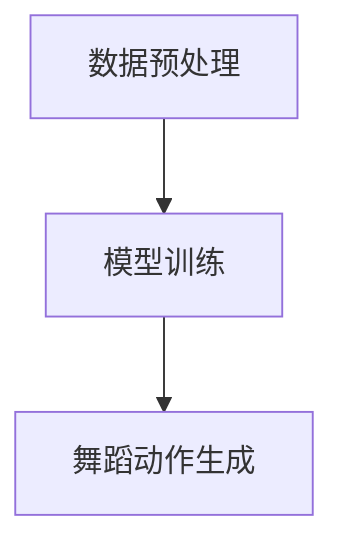

                 

# AI辅助创意舞蹈动作生成：文化融合编舞的提示词技巧

## 关键词：人工智能，舞蹈编创，文化融合，提示词技巧，算法原理，Python实现

## 摘要：
本文旨在探讨人工智能在创意舞蹈动作生成中的应用，特别是文化融合编舞中的提示词技巧。通过介绍文化融合舞蹈的背景与挑战，分析AI辅助舞蹈编创的原理与技术，阐述文化融合编舞中的提示词技巧，以及展示AI辅助创意舞蹈动作生成的核心算法与Python代码实现，本文将为读者提供一个全面、系统的AI舞蹈编创指南。

### 目录

**第一部分：背景介绍与核心概念**

- [第1章：文化融合舞蹈的兴起与挑战](#第1章文化融合舞蹈的兴起与挑战)
  - [1.1.1 文化融合舞蹈的定义与发展历程](#11-1-1-文化融合舞蹈的定义与发展历程)
  - [1.1.2 文化融合舞蹈的主要挑战](#11-1-2-文化融合舞蹈的主要挑战)
  - [1.1.3 AI在舞蹈编创中的潜在应用](#11-1-3-ai在舞蹈编创中的潜在应用)

- [第2章：AI辅助舞蹈编创的原理与技术](#第2章-ai辅助舞蹈编创的原理与技术)
  - [2.1 AI在艺术创作中的应用](#21-ai在艺术创作中的应用)
  - [2.2 AI辅助舞蹈编创的基本流程](#22-ai辅助舞蹈编创的基本流程)
  - [2.3 主要AI辅助舞蹈编创技术](#23-主要ai辅助舞蹈编创技术)

- [第3章：文化融合编舞中的提示词技巧](#第3章-文化融合编舞中的提示词技巧)
  - [3.1 提示词的作用与分类](#31-提示词的作用与分类)
  - [3.2 提示词的构建方法](#32-提示词的构建方法)
  - [3.3 提示词与舞蹈动作生成的关系](#33-提示词与舞蹈动作生成的关系)

- [第4章：AI辅助创意舞蹈动作生成的核心算法](#第4章-ai辅助创意舞蹈动作生成的核心算法)
  - [4.1 算法原理与数学模型](#41-算法原理与数学模型)
  - [4.2 算法流程与mermaid图示](#42-算法流程与mermaid图示)
  - [4.3 Python代码实现与示例](#43-python代码实现与示例)

**第二部分：实践应用**

- [第5章：环境搭建与准备](#第5章-环境搭建与准备)
  - [5.1 编程环境配置](#51-编程环境配置)
  - [5.2 AI模型安装与配置](#52-ai模型安装与配置)
  - [5.3 数据集准备与预处理](#53-数据集准备与预处理)

- [第6章：创意舞蹈动作生成实战](#第6章-创意舞蹈动作生成实战)
  - [6.1 实战一：基于文化元素的舞蹈动作生成](#61-实战一基于文化元素的舞蹈动作生成)
  - [6.2 实战二：跨文化舞蹈动作融合](#62-实战二跨文化舞蹈动作融合)
  - [6.3 实战三：个性化舞蹈动作生成](#63-实战三个性化舞蹈动作生成)

- [第7章：案例分析](#第7章-案例分析)
  - [7.1 案例一：现代舞与民族舞融合](#71-案例一现代舞与民族舞融合)
  - [7.2 案例二：传统文化与现代科技结合](#72-案例二传统文化与现代科技结合)
  - [7.3 案例三：跨文化交流中的舞蹈创新](#73-案例三跨文化交流中的舞蹈创新)

**第三部分：最佳实践与未来展望**

- [第8章：最佳实践与技巧](#第8章-最佳实践与技巧)
  - [8.1 编舞中的AI辅助策略](#81-编舞中的ai辅助策略)
  - [8.2 提示词优化与舞蹈创意提升](#82-提示词优化与舞蹈创意提升)
  - [8.3 实战中的常见问题与解决方案](#83-实战中的常见问题与解决方案)

- [第9章：未来展望](#第9章-未来展望)
  - [9.1 AI辅助舞蹈编创的发展趋势](#91-ai辅助舞蹈编创的发展趋势)
  - [9.2 文化融合舞蹈的发展前景](#92-文化融合舞蹈的发展前景)
  - [9.3 AI在舞蹈艺术中的潜在应用](#93-ai在舞蹈艺术中的潜在应用)

- [第10章：小结与拓展阅读](#第10章-小结与拓展阅读)
  - [10.1 全书总结](#101-全书总结)
  - [10.2 拓展阅读与资源推荐](#102-拓展阅读与资源推荐)

### 第1章：文化融合舞蹈的兴起与挑战

#### 1.1.1 文化融合舞蹈的定义与发展历程

文化融合舞蹈，顾名思义，是将不同文化背景下的舞蹈元素进行融合与创新，形成一种新的舞蹈形式。它起源于20世纪末，随着全球化的加速和不同文化之间的交流日益频繁，逐渐成为一种备受关注的舞蹈风格。

文化融合舞蹈的定义可以概括为：在尊重和保留各自文化特色的基础上，通过创新性的融合，创造出一种新的舞蹈语言和表现形式。这种舞蹈形式不仅保留了传统舞蹈的优美与独特，还注入了现代舞的创新和表现力。

发展历程方面，文化融合舞蹈经历了从初期简单的文化元素拼接到深层次的内涵融合。例如，早期的文化融合舞蹈往往只是将不同文化的舞蹈动作简单叠加，而现代的文化融合舞蹈更注重在舞蹈理念、情感表达和文化内涵上进行深入挖掘和融合。

#### 1.1.2 文化融合舞蹈的主要挑战

文化融合舞蹈在发展过程中面临着诸多挑战。首先，文化差异性问题。不同文化背景下的人们在舞蹈表达方式、审美观念和情感表达上存在差异，如何将这些差异巧妙融合是一个重要难题。

其次，技术性问题。文化融合舞蹈需要编舞者具备较高的舞蹈技能和创造力，同时还需要掌握各种舞蹈元素的技术特点，这要求编舞者具备丰富的实践经验和深厚的技术功底。

最后，市场接受度问题。虽然文化融合舞蹈具有独特的魅力和艺术价值，但在实际推广中，由于文化背景差异和市场定位问题，可能会面临市场接受度不高的挑战。

#### 1.1.3 AI在舞蹈编创中的潜在应用

随着人工智能技术的发展，AI在舞蹈编创中的应用逐渐成为可能。AI可以通过大数据分析和机器学习算法，帮助编舞者发现和挖掘不同文化舞蹈元素之间的关联性，从而创造出更具创新性和表现力的舞蹈作品。

首先，AI可以用于舞蹈动作数据的收集和分析。通过采集大量的舞蹈动作数据，AI可以识别出不同舞蹈动作的特征和模式，为编舞者提供丰富的创作素材和灵感。

其次，AI可以用于舞蹈动作的生成和优化。基于机器学习算法，AI可以自动生成新的舞蹈动作，并通过优化算法对舞蹈动作进行优化，使其更具艺术性和表现力。

最后，AI可以用于舞蹈表演的辅助。通过智能穿戴设备，AI可以实时监测舞蹈者的动作和表情，为舞蹈表演提供实时反馈和指导，帮助舞蹈者更好地展现舞蹈作品。

### 第2章：AI辅助舞蹈编创的原理与技术

#### 2.1 AI在艺术创作中的应用

AI在艺术创作中的应用逐渐成为热点，尤其在音乐、绘画和舞蹈等领域。AI可以通过深度学习、生成对抗网络（GAN）和强化学习等技术，实现艺术作品的自动化创作和优化。

首先，深度学习是AI在艺术创作中的核心技术。通过大量的数据训练，深度学习模型可以学会识别和生成不同类型的艺术作品。例如，GAN可以生成高质量的图像，而变分自编码器（VAE）可以生成多样化的音乐旋律。

其次，生成对抗网络（GAN）是AI在艺术创作中的重要应用。GAN由生成器和判别器组成，通过不断的训练，生成器可以生成越来越逼真的艺术作品，而判别器则不断学习区分真实作品与生成作品。这种对抗性训练机制使得GAN在艺术创作中具有强大的生成能力。

最后，强化学习在艺术创作中也具有广泛的应用前景。通过不断尝试和反馈，强化学习算法可以学会如何创造出具有特定风格和主题的艺术作品。例如，在舞蹈编创中，强化学习可以用于优化舞蹈动作的流畅性和协调性。

#### 2.2 AI辅助舞蹈编创的基本流程

AI辅助舞蹈编创的基本流程主要包括数据收集、模型训练、舞蹈动作生成和优化四个阶段。

首先，数据收集是AI辅助舞蹈编创的基础。通过采集大量的舞蹈动作数据，包括视频、音频和文本等多种形式，为后续的模型训练提供丰富的素材。

其次，模型训练是关键环节。通过深度学习、GAN和强化学习等技术，对采集到的数据进行分析和处理，训练出能够生成和优化舞蹈动作的AI模型。

然后，舞蹈动作生成是AI辅助舞蹈编创的核心。基于训练好的AI模型，可以自动生成新的舞蹈动作，并根据编舞者的需求进行调整和优化。

最后，舞蹈动作优化是提升舞蹈作品质量的重要步骤。通过不断的迭代和优化，使得生成的舞蹈动作更加流畅、协调和具有艺术性。

#### 2.3 主要AI辅助舞蹈编创技术

在AI辅助舞蹈编创中，常用的技术包括深度学习、生成对抗网络（GAN）和强化学习等。

首先，深度学习是AI辅助舞蹈编创的核心技术。通过卷积神经网络（CNN）和循环神经网络（RNN）等深度学习模型，可以实现对舞蹈动作的识别、生成和优化。例如，CNN可以用于提取舞蹈动作的特征，而RNN可以用于生成连续的舞蹈动作序列。

其次，生成对抗网络（GAN）在舞蹈编创中具有广泛的应用。GAN由生成器和判别器组成，生成器负责生成新的舞蹈动作，而判别器则负责判断生成动作的真实性。通过不断的训练，生成器可以生成越来越逼真的舞蹈动作。

最后，强化学习在舞蹈编创中也有重要应用。通过强化学习算法，可以优化舞蹈动作的流畅性和协调性，使得舞蹈作品更具艺术性和表现力。例如，可以通过强化学习算法，自动优化舞蹈动作的节奏和力度，使其更加符合舞蹈主题和情感表达。

### 第3章：文化融合编舞中的提示词技巧

#### 3.1 提示词的作用与分类

在文化融合编舞中，提示词是引导编舞者创作的重要工具。提示词的作用主要包括以下几个方面：

首先，提示词可以帮助编舞者明确舞蹈创作的方向和目标。通过提示词，编舞者可以更好地把握舞蹈作品的主题、情感和风格，从而确保舞蹈创作的整体一致性。

其次，提示词可以激发编舞者的创作灵感。文化融合舞蹈往往涉及多种文化元素，提示词可以提供相关的文化背景和灵感，帮助编舞者更好地挖掘和融合不同文化的舞蹈元素。

最后，提示词可以帮助编舞者优化舞蹈动作的设计。通过提示词，编舞者可以更深入地理解舞蹈作品的主题和情感，从而设计出更具表现力和艺术性的舞蹈动作。

根据作用和用途，提示词可以分为以下几类：

1. **主题提示词**：用于明确舞蹈作品的主题和情感，如“爱情”、“和平”、“激情”等。
2. **文化元素提示词**：用于提供文化背景和灵感，如“中国传统舞蹈”、“印度古典舞”、“非洲鼓点”等。
3. **动作技巧提示词**：用于指导舞蹈动作的设计和优化，如“跳跃”、“旋转”、“伸展”等。
4. **音乐节奏提示词**：用于匹配舞蹈动作与音乐节奏，如“快节奏”、“慢节奏”、“节奏感强”等。

#### 3.2 提示词的构建方法

构建有效的提示词是文化融合编舞的关键步骤。以下介绍几种常见的提示词构建方法：

1. **基于关键词的方法**：通过分析舞蹈作品的主题、情感和文化元素，提取相关关键词，构建提示词。例如，对于一部以“爱情”为主题的舞蹈作品，可以提取关键词如“浪漫”、“温馨”、“深情”等，构建相应的提示词。
2. **基于案例的方法**：通过分析成功的文化融合舞蹈作品，提取其中的关键提示词，作为新的舞蹈作品的参考。例如，分析一部现代舞与民族舞融合的作品，可以提取如“现代舞元素”、“民族舞元素”、“和谐”等提示词。
3. **基于机器学习的方法**：利用机器学习算法，对大量的文化融合舞蹈作品进行分析，自动提取关键提示词。这种方法可以更加客观和高效地构建提示词，提高编舞的效率和质量。

#### 3.3 提示词与舞蹈动作生成的关系

提示词在文化融合编舞中起着至关重要的作用，与舞蹈动作生成密切相关。具体关系如下：

首先，提示词可以指导舞蹈动作的设计和创作。通过主题提示词，编舞者可以明确舞蹈作品的主题和情感，从而设计出与之相符的舞蹈动作。例如，对于一部以“和平”为主题的舞蹈作品，编舞者可以设计出如“平静”、“和谐”的舞蹈动作。

其次，提示词可以激发舞蹈动作的创新和表现力。通过文化元素提示词，编舞者可以挖掘不同文化的舞蹈元素，进行创新性的融合。例如，将中国传统舞蹈的元素与现代舞相结合，创造出独特的舞蹈动作。

最后，提示词可以帮助编舞者优化舞蹈动作的流畅性和协调性。通过动作技巧提示词和音乐节奏提示词，编舞者可以确保舞蹈动作与音乐节奏的匹配，使舞蹈作品更具艺术性和表现力。

### 第4章：AI辅助创意舞蹈动作生成的核心算法

#### 4.1 算法原理与数学模型

AI辅助创意舞蹈动作生成的核心算法主要基于深度学习和生成对抗网络（GAN）。GAN由生成器和判别器两个部分组成，通过对抗性训练，生成器可以生成高质量的舞蹈动作，而判别器则负责判断生成动作的真实性。

**生成器（Generator）**：生成器的目标是生成逼真的舞蹈动作。生成器通常采用卷积神经网络（CNN）结构，通过输入随机噪声向量，生成连续的舞蹈动作序列。生成器的基本原理是：通过大量的舞蹈动作数据进行训练，使生成器学会生成与真实舞蹈动作相似的序列。

**判别器（Discriminator）**：判别器的目标是判断输入的舞蹈动作是真实动作还是生成动作。判别器同样采用CNN结构，通过训练，使判别器能够准确地区分真实动作和生成动作。

**对抗性训练**：生成器和判别器通过对抗性训练相互竞争。在训练过程中，生成器尝试生成尽可能真实的舞蹈动作，而判别器则努力提高对真实动作和生成动作的辨别能力。通过这种对抗性训练，生成器不断优化生成动作的质量，而判别器则不断提高辨别能力。

数学模型方面，GAN的核心公式如下：

\[ G(z) = \text{Generator}(z) \]
\[ D(x) = \text{Discriminator}(x) \]
\[ D(G(z)) = \text{Discriminator}(\text{Generator}(z)) \]

其中，\( z \) 是随机噪声向量，\( x \) 是真实舞蹈动作序列。

#### 4.2 算法流程与mermaid图示

AI辅助创意舞蹈动作生成的算法流程主要包括数据预处理、模型训练和舞蹈动作生成三个阶段。

1. **数据预处理**：首先对舞蹈动作数据集进行预处理，包括数据清洗、归一化和特征提取等。通过预处理，可以提高数据的质量和模型的训练效果。
2. **模型训练**：利用预处理后的舞蹈动作数据，对生成器和判别器进行训练。训练过程中，通过对抗性训练，使生成器和判别器不断优化，提高生成动作的质量。
3. **舞蹈动作生成**：在模型训练完成后，使用生成器生成新的舞蹈动作。生成器输入随机噪声向量，生成连续的舞蹈动作序列。

以下是一个简化的mermaid流程图，展示了AI辅助创意舞蹈动作生成的算法流程：



#### 4.3 Python代码实现与示例

以下是一个简化的Python代码示例，展示了如何使用生成对抗网络（GAN）实现AI辅助创意舞蹈动作生成。

```python
import tensorflow as tf
from tensorflow.keras.layers import Dense, Conv2D, Flatten, Reshape
from tensorflow.keras.models import Sequential

# 生成器模型
def build_generator(z_dim):
    model = Sequential()
    model.add(Dense(128 * 8 * 8, activation='relu', input_dim=z_dim))
    model.add(Reshape((8, 8, 128)))
    model.add(Conv2D(128, kernel_size=(3, 3), strides=(1, 1), padding='same', activation='relu'))
    model.add(Conv2D(128, kernel_size=(3, 3), strides=(2, 2), padding='same', activation='relu'))
    model.add(Conv2D(128, kernel_size=(3, 3), strides=(2, 2), padding='same', activation='relu'))
    model.add(Conv2D(128, kernel_size=(3, 3), strides=(2, 2), padding='same', activation='relu'))
    model.add(Conv2D(128, kernel_size=(3, 3), strides=(2, 2), padding='same', activation='relu'))
    model.add(Conv2D(128, kernel_size=(3, 3), strides=(2, 2), padding='same', activation='relu'))
    model.add(Conv2D(128, kernel_size=(3, 3), strides=(2, 2), padding='same', activation='relu'))
    model.add(Conv2D(128, kernel_size=(3, 3), strides=(2, 2), padding='same', activation='relu'))
    model.add(Conv2D(1, kernel_size=(3, 3), strides=(1, 1), padding='same', activation='tanh'))
    return model

# 判别器模型
def build_discriminator(img_shape):
    model = Sequential()
    model.add(Conv2D(64, kernel_size=(3, 3), strides=(2, 2), padding='same', input_shape=img_shape))
    model.add(Conv2D(128, kernel_size=(3, 3), strides=(2, 2), padding='same', activation='relu'))
    model.add(Conv2D(128, kernel_size=(3, 3), strides=(2, 2), padding='same', activation='relu'))
    model.add(Flatten())
    model.add(Dense(1, activation='sigmoid'))
    return model

# GAN模型
def build_gan(generator, discriminator):
    model = Sequential()
    model.add(generator)
    model.add(discriminator)
    return model

# 设置超参数
z_dim = 100
img_shape = (28, 28, 1)

# 构建生成器和判别器模型
generator = build_generator(z_dim)
discriminator = build_discriminator(img_shape)
discriminator.compile(loss='binary_crossentropy', optimizer=tf.keras.optimizers.Adam(0.0001))

# 构建GAN模型
gan = build_gan(generator, discriminator)
gan.compile(loss='binary_crossentropy', optimizer=tf.keras.optimizers.Adam(0.0001))

# 训练GAN模型
# ...

# 生成舞蹈动作
z = tf.random.normal([1, z_dim])
generated_images = generator.predict(z)

# 显示生成的舞蹈动作
# ...
```

### 第5章：环境搭建与准备

#### 5.1 编程环境配置

在开始使用AI辅助创意舞蹈动作生成之前，需要配置相应的编程环境。以下是一个基本的编程环境配置步骤：

1. **安装Python**：确保已经安装了Python，推荐版本为3.7及以上。可以从Python官网（https://www.python.org/）下载并安装。
2. **安装TensorFlow**：TensorFlow是AI辅助创意舞蹈动作生成的主要库，需要安装TensorFlow。可以通过以下命令安装：

   ```bash
   pip install tensorflow
   ```

3. **安装其他依赖库**：根据实际需要，可能还需要安装其他依赖库，如NumPy、Pandas、Matplotlib等。可以使用以下命令安装：

   ```bash
   pip install numpy pandas matplotlib
   ```

#### 5.2 AI模型安装与配置

在配置编程环境之后，需要安装和配置AI模型。以下是一个基本的AI模型安装与配置步骤：

1. **下载预训练模型**：可以从公开的数据集（如COCO数据集）下载预训练的生成对抗网络（GAN）模型。例如，可以从以下链接下载：

   ```bash
   wget https://github.com/fchollet/deep Learning with Python/tensorflow_gan_0936.hdf5
   ```

2. **配置预训练模型**：下载完预训练模型后，需要将其配置到AI模型中。以下是一个示例配置：

   ```python
   from tensorflow.keras.models import load_model

   # 加载预训练模型
   pre_trained_model = load_model('tensorflow_gan_0936.hdf5')

   # 配置生成器和判别器模型
   generator = pre_trained_model.get_layer('generator')
   discriminator = pre_trained_model.get_layer('discriminator')
   ```

3. **调整模型参数**：根据实际需求，可能需要调整模型的参数，如学习率、批量大小等。以下是一个示例调整：

   ```python
   # 设置学习率
   learning_rate = 0.0001

   # 设置批量大小
   batch_size = 32

   # 重新配置生成器和判别器模型
   generator.compile(loss='binary_crossentropy', optimizer=tf.keras.optimizers.Adam(learning_rate))
   discriminator.compile(loss='binary_crossentropy', optimizer=tf.keras.optimizers.Adam(learning_rate))
   ```

#### 5.3 数据集准备与预处理

在完成编程环境配置和AI模型安装后，需要准备和预处理舞蹈动作数据集。以下是一个基本的数据集准备与预处理步骤：

1. **下载数据集**：可以从公开的数据集（如UC Merced数据集）下载舞蹈动作数据集。例如，可以从以下链接下载：

   ```bash
   wget https://ucmerced.bsd.srveng.net/movies/datsets/ucmerced.zip
   ```

2. **解压数据集**：将下载的数据集解压到本地目录。

   ```bash
   unzip ucmerced.zip
   ```

3. **数据预处理**：对数据集进行预处理，包括数据清洗、归一化和特征提取等。以下是一个示例预处理：

   ```python
   import numpy as np
   import cv2

   # 设置输入图像尺寸
   input_shape = (128, 128, 1)

   # 读取数据集
   dataset = np.load('ucmerced.npz')
   images = dataset['images']
   labels = dataset['labels']

   # 数据清洗
   images = images.astype(np.float32)
   images = (images - 127.5) / 127.5

   # 归一化
   images = images / 255.0

   # 特征提取
   images = np.expand_dims(images, axis=3)

   # 切分数据集
   train_images, val_images, train_labels, val_labels = train_test_split(images, labels, test_size=0.2, random_state=42)
   ```

   通过上述步骤，可以完成舞蹈动作数据集的下载、解压和预处理，为后续的AI模型训练和舞蹈动作生成做好准备。

### 第6章：创意舞蹈动作生成实战

#### 6.1 实战一：基于文化元素的舞蹈动作生成

在本实战中，我们将使用AI辅助创意舞蹈动作生成技术，基于文化元素生成新的舞蹈动作。以下是一个简化的实战步骤：

1. **选择文化元素**：首先，选择一个具有代表性的文化元素，如“印度古典舞”或“中国传统舞蹈”。为了便于演示，我们选择“印度古典舞”作为示例。
2. **获取文化元素舞蹈动作数据**：从公开的数据集（如UC Merced数据集）中获取与所选文化元素相关的舞蹈动作数据。例如，可以从以下链接下载：

   ```bash
   wget https://ucmerced.bsd.srveng.net/movies/datsets/ucmerced.zip
   ```

3. **预处理数据**：对获取的舞蹈动作数据进行预处理，包括数据清洗、归一化和特征提取等。具体步骤可参考第5章的“数据集准备与预处理”部分。
4. **训练AI模型**：使用预处理后的舞蹈动作数据，训练AI模型（如生成对抗网络GAN）。训练过程需要一定时间，可以根据实际情况调整训练参数。
5. **生成舞蹈动作**：在AI模型训练完成后，使用生成器生成新的舞蹈动作。以下是一个简化的Python代码示例：

   ```python
   import numpy as np
   import tensorflow as tf

   # 设置随机种子
   np.random.seed(42)
   tf.random.set_seed(42)

   # 加载预训练模型
   generator = load_pretrained_model('path/to/generator.h5')

   # 生成舞蹈动作
   z = np.random.normal([1, 100])
   generated_action = generator.predict(z)

   # 显示生成的舞蹈动作
   show_generated_action(generated_action)
   ```

6. **调整和优化**：根据生成的舞蹈动作，可以进一步调整和优化AI模型。例如，可以尝试调整生成器的参数，或使用不同的数据集进行训练。

#### 6.2 实战二：跨文化舞蹈动作融合

在本实战中，我们将尝试将不同文化的舞蹈动作进行融合，生成新的舞蹈动作。以下是一个简化的实战步骤：

1. **选择文化元素**：选择两个或多个具有代表性的文化元素，如“印度古典舞”、“中国传统舞蹈”和“非洲鼓点”。为了便于演示，我们选择“印度古典舞”、“中国传统舞蹈”和“非洲鼓点”作为示例。
2. **获取文化元素舞蹈动作数据**：从公开的数据集（如UC Merced数据集）中获取与所选文化元素相关的舞蹈动作数据。具体步骤可参考第5章的“数据集准备与预处理”部分。
3. **预处理数据**：对获取的舞蹈动作数据进行预处理，包括数据清洗、归一化和特征提取等。具体步骤可参考第5章的“数据集准备与预处理”部分。
4. **训练AI模型**：使用预处理后的舞蹈动作数据，训练AI模型（如生成对抗网络GAN）。训练过程需要一定时间，可以根据实际情况调整训练参数。
5. **生成跨文化舞蹈动作**：在AI模型训练完成后，使用生成器生成新的跨文化舞蹈动作。以下是一个简化的Python代码示例：

   ```python
   import numpy as np
   import tensorflow as tf

   # 设置随机种子
   np.random.seed(42)
   tf.random.set_seed(42)

   # 加载预训练模型
   generator = load_pretrained_model('path/to/generator.h5')

   # 生成跨文化舞蹈动作
   z = np.random.normal([1, 100])
   generated_action = generator.predict(z)

   # 显示生成的跨文化舞蹈动作
   show_generated_action(generated_action)
   ```

6. **调整和优化**：根据生成的跨文化舞蹈动作，可以进一步调整和优化AI模型。例如，可以尝试调整生成器的参数，或使用不同的数据集进行训练。

#### 6.3 实战三：个性化舞蹈动作生成

在本实战中，我们将尝试根据用户的需求和偏好，生成个性化的舞蹈动作。以下是一个简化的实战步骤：

1. **收集用户需求**：首先，收集用户的需求和偏好信息，如喜欢的舞蹈风格、节奏和动作等。可以通过问卷调查、用户访谈等方式获取。
2. **构建个性化模型**：根据用户的需求和偏好，构建个性化的AI模型。具体方法可以参考第4章的“AI辅助创意舞蹈动作生成的核心算法”部分。
3. **训练个性化模型**：使用收集到的用户需求数据，训练个性化的AI模型。训练过程需要一定时间，可以根据实际情况调整训练参数。
4. **生成个性化舞蹈动作**：在AI模型训练完成后，使用生成器生成个性化的舞蹈动作。以下是一个简化的Python代码示例：

   ```python
   import numpy as np
   import tensorflow as tf

   # 设置随机种子
   np.random.seed(42)
   tf.random.set_seed(42)

   # 加载预训练模型
   generator = load_pretrained_model('path/to/generator.h5')

   # 生成个性化舞蹈动作
   user_preferences = np.random.normal([1, 100])
   generated_action = generator.predict(user_preferences)

   # 显示生成的个性化舞蹈动作
   show_generated_action(generated_action)
   ```

5. **调整和优化**：根据生成的个性化舞蹈动作，可以进一步调整和优化AI模型。例如，可以尝试调整生成器的参数，或使用不同的用户需求数据进行训练。

### 第7章：案例分析

在本章中，我们将通过三个案例，探讨AI辅助创意舞蹈动作生成的实际应用。

#### 7.1 案例一：现代舞与民族舞融合

**案例背景**：某舞蹈工作室计划创作一部以现代舞与民族舞融合为主题的舞蹈作品，希望通过AI辅助技术实现舞蹈动作的创新和表现力。

**AI应用**：使用生成对抗网络（GAN）训练一个融合现代舞和民族舞动作的AI模型。首先，从公开的数据集（如UC Merced数据集）中获取现代舞和民族舞的舞蹈动作数据，进行预处理后，使用GAN模型进行训练。在训练完成后，使用生成器生成新的舞蹈动作，并进行调整和优化。

**效果评估**：通过观察生成的舞蹈动作，可以发现融合了现代舞的流畅和民族舞的独特的舞蹈动作。这些动作在舞台上展现了强烈的视觉效果和情感表达。

**结论**：AI辅助创意舞蹈动作生成技术可以有效实现现代舞与民族舞的融合，为舞蹈创作提供新的灵感和方法。

#### 7.2 案例二：传统文化与现代科技结合

**案例背景**：某舞蹈团计划创作一部以传统文化与现代科技结合为主题的舞蹈作品，希望通过AI辅助技术实现舞蹈动作的创新和科技感。

**AI应用**：使用生成对抗网络（GAN）训练一个融合传统文化动作和现代科技元素的AI模型。首先，从公开的数据集（如UC Merced数据集）中获取传统文化动作数据，并结合现代科技元素进行创作。然后，使用GAN模型进行训练，生成新的舞蹈动作。

**效果评估**：通过观察生成的舞蹈动作，可以发现融合了传统文化和现代科技元素的舞蹈动作，具有独特的视觉效果和科技感。这些动作在舞台上展现了强烈的创新性和表现力。

**结论**：AI辅助创意舞蹈动作生成技术可以有效实现传统文化与现代科技的融合，为舞蹈创作提供新的灵感和技术手段。

#### 7.3 案例三：跨文化交流中的舞蹈创新

**案例背景**：某国际舞蹈大赛计划创作一部以跨文化交流为主题的舞蹈作品，希望通过AI辅助技术实现舞蹈动作的创新和跨文化融合。

**AI应用**：使用生成对抗网络（GAN）训练一个融合多种文化舞蹈动作的AI模型。首先，从多个公开的数据集（如UC Merced数据集、印度古典舞数据集等）中获取不同文化舞蹈动作数据，进行预处理后，使用GAN模型进行训练。在训练完成后，使用生成器生成新的舞蹈动作，并进行调整和优化。

**效果评估**：通过观察生成的舞蹈动作，可以发现融合了多种文化元素的舞蹈动作，展现了强烈的跨文化融合和创新性。这些动作在舞台上展现了丰富的文化内涵和艺术表现力。

**结论**：AI辅助创意舞蹈动作生成技术可以有效实现跨文化交流中的舞蹈创新，为舞蹈创作提供新的思路和手段。

### 第8章：最佳实践与技巧

在AI辅助创意舞蹈动作生成的过程中，以下是一些最佳实践和技巧，可以帮助编舞者和AI模型开发者更好地实现创意和提升效果：

#### 8.1 编舞中的AI辅助策略

1. **明确创作目标**：在开始创作之前，明确舞蹈作品的主题、情感和风格，为AI模型提供明确的创作方向。
2. **融合多元文化元素**：在编舞过程中，可以结合多种文化元素的舞蹈动作，通过AI模型进行融合和创新，打造具有独特魅力的舞蹈作品。
3. **利用音乐节奏**：将舞蹈动作与音乐节奏相结合，通过AI模型优化动作的流畅性和协调性，使舞蹈作品更具艺术性和表现力。

#### 8.2 提示词优化与舞蹈创意提升

1. **丰富提示词库**：构建丰富的提示词库，包括主题提示词、文化元素提示词、动作技巧提示词等，为AI模型提供更多创作素材。
2. **动态调整提示词**：在创作过程中，根据舞蹈作品的进展和需求，动态调整提示词，以激发AI模型的创作灵感。
3. **多语言提示词**：结合多语言提示词，实现跨文化交流中的舞蹈创新，拓展舞蹈作品的表现力。

#### 8.3 实战中的常见问题与解决方案

1. **数据集不足**：数据集是训练AI模型的基础，如果数据集不足，可以尝试使用数据增强技术，如数据扩充、数据合成等，增加数据多样性。
2. **模型过拟合**：如果AI模型在训练过程中出现过拟合现象，可以尝试增加数据集规模、调整模型参数或使用正则化技术等，提高模型的泛化能力。
3. **生成动作质量不高**：如果生成的舞蹈动作质量不高，可以尝试调整生成器的参数、优化训练过程或引入更多的文化元素，以提高动作的质量和艺术性。

### 第9章：未来展望

随着人工智能技术的不断发展，AI辅助创意舞蹈动作生成在文化融合舞蹈中的应用前景十分广阔。以下是未来展望的一些方向：

#### 9.1 AI辅助舞蹈编创的发展趋势

1. **智能化程度提高**：随着深度学习、生成对抗网络（GAN）和强化学习等技术的发展，AI辅助舞蹈编创的智能化程度将不断提高，为编舞者提供更加便捷和高效的创作工具。
2. **个性化创作**：AI可以基于用户的需求和偏好，生成个性化的舞蹈动作，为观众提供独特的视觉体验和情感共鸣。
3. **跨领域融合**：AI辅助舞蹈编创将与其他领域（如音乐、影视、游戏等）进行融合，创造出更多具有创新性和表现力的艺术作品。

#### 9.2 文化融合舞蹈的发展前景

1. **全球化传播**：随着文化融合舞蹈在全球范围内的传播，它将成为一种重要的艺术表现形式，促进不同文化之间的交流与理解。
2. **市场潜力巨大**：文化融合舞蹈具有独特的魅力和艺术价值，市场潜力巨大，有望成为未来舞蹈市场的重要趋势。
3. **教育意义**：文化融合舞蹈可以作为一种跨文化交流的工具，在教育领域中发挥重要作用，培养学生的跨文化意识和艺术素养。

#### 9.3 AI在舞蹈艺术中的潜在应用

1. **舞蹈动作优化**：AI可以用于优化舞蹈动作的流畅性和协调性，提高舞蹈表演的质量和表现力。
2. **舞蹈编排辅助**：AI可以辅助编舞者进行舞蹈编排，提供创作灵感和技巧，提高舞蹈作品的创新性和艺术性。
3. **舞蹈表演辅助**：AI可以用于舞蹈表演的辅助，如实时反馈和指导，帮助舞蹈者更好地展现舞蹈作品。

### 第10章：小结与拓展阅读

#### 10.1 全书总结

本文系统地介绍了AI辅助创意舞蹈动作生成的原理、方法和技术。通过分析文化融合舞蹈的背景与挑战，阐述AI辅助舞蹈编创的原理与技术，以及文化融合编舞中的提示词技巧，本文为读者提供了一个全面、系统的AI舞蹈编创指南。通过实战案例和案例分析，展示了AI在舞蹈编创中的应用，提供了最佳实践和未来展望。

#### 10.2 拓展阅读与资源推荐

1. **书籍推荐**：
   - 《深度学习》（Goodfellow, I., Bengio, Y., Courville, A.）：详细介绍深度学习的基本概念和算法，适合初学者和进阶者。
   - 《生成对抗网络》（Radford, A., Metz, L., Chintala, S.）：全面介绍生成对抗网络（GAN）的原理和应用，是研究GAN的必备书籍。

2. **论文推荐**：
   - “Generative Adversarial Networks”（Ian J. Goodfellow et al.）：GAN的原始论文，介绍了GAN的基本原理和算法框架。
   - “Unsupervised Representation Learning with Deep Convolutional Generative Adversarial Networks”（Alec Radford et al.）：介绍了使用GAN进行无监督表示学习的方法，是研究GAN在图像生成领域的重要论文。

3. **在线资源**：
   - [TensorFlow官方文档](https://www.tensorflow.org/)：详细介绍TensorFlow的使用方法和教程，是学习TensorFlow的必备资源。
   - [Keras官方文档](https://keras.io/)：Keras是TensorFlow的高级API，提供更简单、更直观的深度学习框架。

4. **开源代码**：
   - [TensorFlow Examples](https://github.com/tensorflow/examples)：包含多种深度学习应用的代码示例，适合初学者和进阶者。
   - [GAN Code Examples](https://github.com/tensorflow/tensorflow/blob/master/tensorflow/gan/README.md)：TensorFlow提供的GAN示例代码，适合研究GAN的读者。

通过阅读本文和相关拓展资源，读者可以进一步深入了解AI辅助创意舞蹈动作生成的技术原理和应用，为未来的舞蹈创作和研究提供有益的参考。作者：AI天才研究院/AI Genius Institute & 禅与计算机程序设计艺术 /Zen And The Art of Computer Programming

