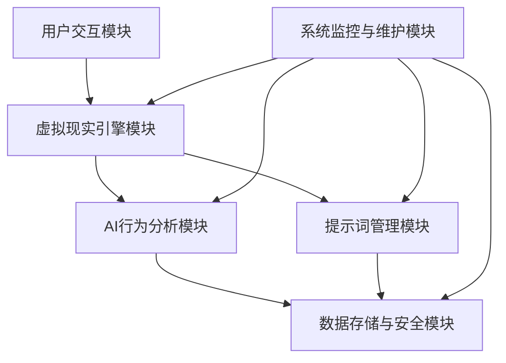

                 

### 3.3 虚拟现实与AI技术的结合

#### 3.3.1 虚拟现实与AI技术的结合方式
虚拟现实（VR）与人工智能（AI）技术的结合，为心理健康干预领域带来了革命性的变化。这种结合方式主要表现在以下几个方面：

1. **AI算法优化虚拟现实体验**：
   AI技术可以优化虚拟现实环境中的交互和渲染效果，提高用户的沉浸感和体验质量。例如，通过深度学习算法对用户的行为进行分析，实时调整虚拟环境中的光线、声音和物体，使其更加符合用户的心理和情感状态。

2. **AI辅助虚拟现实内容生成**：
   AI技术可以帮助生成虚拟现实内容，如3D模型、动画和音效等。通过机器学习算法，可以自动生成符合用户需求的虚拟环境，减少人工设计的成本和时间。

3. **AI辅助虚拟现实疗法评估**：
   AI技术可以对虚拟现实疗法的效果进行量化评估，通过分析用户在虚拟环境中的行为和反应，为心理治疗师提供实时反馈和建议。

#### 3.3.2 虚拟现实与AI技术在心理健康干预中的应用实例

1. **虚拟现实情境模拟**：
   虚拟现实技术可以创建各种情境模拟，如公共场所、社交场合等，用户可以在这些虚拟环境中进行心理训练和干预。AI技术可以实时分析用户的行为，根据用户的需求和反应，调整情境模拟的内容和难度。

2. **虚拟现实心理治疗**：
   虚拟现实心理治疗是一种非侵入性的治疗方法，用户可以在虚拟环境中面对和处理自己的心理问题。AI技术可以辅助治疗师进行个性化干预，如通过分析用户的语音、面部表情和行为，为治疗师提供实时反馈。

3. **虚拟现实心理测评**：
   虚拟现实技术可以用于心理测评，通过设计各种虚拟场景和任务，评估用户的心理状态和特质。AI技术可以对用户的反应和行为进行分析，提供量化的心理评估结果。

#### 3.3.3 虚拟现实与AI技术在心理健康干预中的优势

1. **个性化干预**：
   虚拟现实与AI技术的结合，使得心理健康干预更加个性化。通过分析用户的数据和行为，AI技术可以为每个用户提供定制化的干预方案，提高治疗效果。

2. **沉浸式体验**：
   虚拟现实技术提供了一种沉浸式的体验，用户可以在一个高度模拟的现实环境中进行心理训练和干预，增加用户的参与感和互动性。

3. **实时反馈与调整**：
   AI技术可以实时分析用户在虚拟环境中的行为和反应，为治疗师提供实时反馈，帮助治疗师及时调整干预策略。

4. **可重复性和可扩展性**：
   虚拟现实与AI技术的结合，使得心理健康干预可以重复进行，同时易于扩展到不同的人群和应用场景。

#### 3.3.4 虚拟现实与AI技术在心理健康干预中的挑战

1. **技术成熟度**：
   虚拟现实与AI技术仍在不断发展中，其成熟度和稳定性对心理健康干预的效果有一定影响。

2. **用户体验**：
   用户对虚拟现实和AI技术的接受度和适应度可能影响干预效果。如何提高用户体验，使其更加舒适和自然，是一个重要的问题。

3. **隐私保护**：
   在虚拟现实和AI技术中，用户的个人信息和数据可能受到泄露的风险。如何确保用户隐私，是一个需要重视的问题。

4. **监管与伦理**：
   虚拟现实与AI技术在心理健康干预中的应用，涉及到伦理和监管问题。如何确保技术的合规性和道德性，是一个需要考虑的问题。

### 3.4 虚拟现实疗法中的心理学原理

#### 3.4.1 心理健康干预的基本原理
心理健康干预旨在帮助用户改善心理状态，提高生活质量。虚拟现实疗法作为一种非侵入性的治疗方法，其基本原理包括：

1. **暴露疗法**：
   暴露疗法是一种常用的心理治疗方法，通过让用户面对和处理自己的恐惧和焦虑，逐渐减少负面情绪。虚拟现实疗法可以通过创建各种情境模拟，帮助用户逐步面对和处理自己的心理问题。

2. **认知行为疗法**：
   认知行为疗法（Cognitive Behavioral Therapy, CBT）是一种以认知和行为为核心的 psychotherapy，旨在帮助用户改变不良的认知和行为模式。虚拟现实疗法可以通过设计各种任务和场景，引导用户进行认知重构和行为训练。

3. **放松疗法**：
   放松疗法通过让用户放松身心，减少焦虑和压力。虚拟现实疗法可以提供一个安全、舒适的环境，让用户在虚拟环境中进行放松训练，提高心理韧性。

#### 3.4.2 虚拟现实疗法中的心理学理论
虚拟现实疗法中涉及到的心理学理论包括：

1. **沉浸理论**：
   沉浸理论（Immersion Theory）认为，当用户在虚拟环境中达到高度沉浸状态时，会对现实环境产生干扰，从而减少负面情绪。虚拟现实疗法通过创建高度沉浸的环境，帮助用户缓解心理压力。

2. **认知构建理论**：
   认知构建理论（Cognitive Construction Theory）认为，用户对信息的理解和处理是通过构建心理模型来实现的。虚拟现实疗法可以通过设计各种虚拟场景和任务，引导用户构建积极的心理模型，从而改善心理状态。

3. **情绪调节理论**：
   情绪调节理论（Emotion Regulation Theory）认为，情绪调节是一个主动的、有意识的过程，通过改变认知和行为，可以调节情绪。虚拟现实疗法可以通过设计各种情境和任务，帮助用户学会调节情绪，提高心理韧性。

#### 3.4.3 虚拟现实疗法中的心理学应用
虚拟现实疗法在心理健康干预中具有广泛的应用，包括：

1. **恐惧症治疗**：
   虚拟现实疗法可以用于治疗恐惧症，如恐高症、恐闭症等。通过逐步暴露用户于恐惧情境，帮助用户逐渐克服恐惧。

2. **焦虑症治疗**：
   虚拟现实疗法可以用于治疗焦虑症，如社交焦虑、广泛性焦虑等。通过创建安全、可控的虚拟环境，帮助用户放松身心，缓解焦虑。

3. **抑郁症治疗**：
   虚拟现实疗法可以用于治疗抑郁症，如通过情境模拟和认知重构，帮助用户改善情绪和认知功能。

### 3.4.4 虚拟现实疗法中的心理学挑战

1. **心理适应问题**：
   用户在初次体验虚拟现实疗法时，可能会出现心理不适和抵抗。治疗师需要了解用户的心理特点，制定个性化的干预方案，帮助用户适应虚拟环境。

2. **心理反应评估**：
   虚拟现实疗法中的心理反应评估是一个复杂的问题。如何准确评估用户在虚拟环境中的心理反应，为治疗师提供有效的反馈，是一个需要研究的问题。

3. **伦理和隐私问题**：
   虚拟现实疗法涉及到用户的个人信息和隐私。如何确保用户的隐私，遵守伦理规范，是一个需要关注的问题。

### 3.4.5 虚拟现实疗法中的心理学未来发展方向

1. **个性化干预**：
   随着虚拟现实和AI技术的不断发展，未来的虚拟现实疗法将更加个性化。通过分析用户的数据和行为，为每个用户提供定制化的干预方案，提高治疗效果。

2. **跨学科研究**：
   虚拟现实疗法需要结合心理学、计算机科学、医学等多个学科的研究。未来的研究将更加注重跨学科合作，推动虚拟现实疗法的发展。

3. **技术成熟度**：
   虚拟现实和AI技术的成熟度将直接影响虚拟现实疗法的效果。未来的研究将重点关注技术的改进和优化，提高虚拟现实疗法的可靠性和有效性。

通过上述分析，我们可以看到，虚拟现实疗法在心理健康干预中具有重要的应用价值。结合AI技术，虚拟现实疗法将更加个性化、沉浸式和实时反馈，为心理健康干预提供新的解决方案。未来的发展将带来更多的机遇和挑战，需要我们不断探索和创新。### 4.1 设计AI辅助的虚拟现实环境

#### 4.1.1 设计原则
设计AI辅助的虚拟现实环境时，需要遵循以下原则：

1. **用户体验优先**：
   虚拟现实环境的交互设计应优先考虑用户体验，确保用户能够轻松地与虚拟环境进行交互。

2. **高度沉浸感**：
   环境设计应尽可能模拟现实世界的感觉，提高用户的沉浸感。

3. **安全可控**：
   环境设计应确保用户在虚拟环境中的安全和可控性，避免因意外事件导致用户受伤或产生心理压力。

4. **灵活性**：
   环境设计应具备灵活性，能够根据不同用户的需求和干预目标进行调整。

5. **扩展性**：
   环境设计应考虑未来的扩展性，便于后续功能升级和新增模块。

#### 4.1.2 环境设计步骤

1. **需求分析**：
   首先进行需求分析，明确虚拟现实环境的应用场景、干预目标和用户需求。这包括与心理健康专家、用户和开发者等多方进行沟通，确保需求的准确性和完整性。

2. **场景设计**：
   根据需求分析结果，设计虚拟现实环境中的各个场景。场景设计应考虑虚拟现实技术的特点，如三维建模、图形渲染和传感器交互等。

3. **交互设计**：
   设计用户与虚拟环境之间的交互方式，包括动作捕捉、语音识别、手势控制等。交互设计应简单直观，易于用户理解和操作。

4. **内容生成**：
   利用AI技术生成虚拟环境中的内容，如3D模型、动画和音效等。AI技术的引入可以提高内容生成的效率和个性化程度。

5. **安全性与隐私保护**：
   在环境设计中考虑用户安全和隐私保护，如数据加密、用户权限管理、异常行为监测等。

6. **测试与优化**：
   对虚拟现实环境进行测试，收集用户反馈，对环境进行优化，确保用户体验和安全性。

#### 4.1.3 设计示例

以设计一个AI辅助的虚拟现实治疗室为例：

1. **需求分析**：
   - 应用场景：心理治疗和放松训练。
   - 干预目标：帮助用户缓解焦虑、压力和恐惧。
   - 用户需求：安全、舒适、易于操作。

2. **场景设计**：
   - 主场景：一个舒适的房间，配备沙发、茶几和自然光线。
   - 辅助场景：一个花园，用于放松训练。

3. **交互设计**：
   - 用户可以通过手势和语音与虚拟环境进行交互。
   - 动作捕捉技术用于捕捉用户的手势和动作。

4. **内容生成**：
   - 利用AI技术生成房间和花园的3D模型、动画和音效。

5. **安全性与隐私保护**：
   - 数据加密：确保用户数据的安全传输和存储。
   - 用户权限管理：限制对敏感数据的访问。
   - 异常行为监测：实时监控用户行为，防止异常情况。

6. **测试与优化**：
   - 通过用户测试，收集反馈，对虚拟现实环境进行优化。

通过上述步骤，可以设计出一个AI辅助的虚拟现实治疗室，为用户提供一个安全、舒适和易于操作的心理健康干预环境。### 4.2 提示词技巧在AI辅助创意虚拟现实疗法中的应用

#### 4.2.1 提示词的定义和作用

提示词（Prompt）是引导用户进行思考、学习和行为改变的关键要素。在AI辅助创意虚拟现实疗法中，提示词扮演着至关重要的角色。它们可以通过多种形式呈现，如文字、声音、图像和动作等，用于引导用户在虚拟环境中进行特定任务或活动。

提示词的主要作用包括：

1. **引导用户注意力**：
   提示词可以帮助用户将注意力集中在特定的任务或活动上，避免分心和注意力分散。

2. **促进学习与认知**：
   提示词可以引导用户进行深度思考，促进学习和认知发展。通过设定问题、目标或任务，提示词帮助用户理解和掌握新的概念和技能。

3. **改善情绪和情感体验**：
   提示词可以用于调节用户的情绪，如鼓励用户放松、愉悦或反思。通过创造积极的心理状态，提示词有助于改善用户在虚拟环境中的情绪体验。

4. **提高参与度和互动性**：
   提示词可以增强用户的参与感和互动性，通过设置挑战、奖励或反馈，激励用户在虚拟环境中更加积极地参与。

#### 4.2.2 提示词的分类

根据提示词的功能和用途，可以将提示词分为以下几类：

1. **引导性提示词**：
   引导性提示词用于引导用户进入虚拟环境或开始特定任务。例如，“请站在房间的中央，准备开始放松训练。”

2. **问题性提示词**：
   问题性提示词用于激发用户的思考和探索。例如，“你注意到房间里的光线和声音有什么变化吗？”

3. **情感性提示词**：
   情感性提示词用于调节用户的情绪。例如，“放松你的身体，感受深呼吸带来的平静。”

4. **挑战性提示词**：
   挑战性提示词用于激励用户克服困难，完成任务。例如，“现在尝试在虚拟花园中找到所有的花朵，完成放松训练。”

5. **反馈性提示词**：
   反馈性提示词用于提供用户在虚拟环境中的表现反馈。例如，“恭喜你完成了放松训练，你的焦虑指数降低了10%。”

#### 4.2.3 提示词的设计与实现

1. **设计原则**：

   - **清晰明了**：提示词应简洁明了，避免使用复杂的术语和概念。
   - **目标导向**：提示词应与虚拟现实环境的目标和任务相一致，确保用户能够准确理解任务要求。
   - **个性化**：提示词应考虑用户的个性化需求，如文化背景、心理状态和偏好。
   - **连贯性**：提示词应具有连贯性，引导用户逐步完成任务或活动。

2. **实现方法**：

   - **文本提示词**：
     文本提示词可以通过虚拟现实环境中的文字显示实现。例如，通过屏幕提示用户进行特定动作或回答问题。

   - **声音提示词**：
     声音提示词可以通过虚拟现实环境中的声音效果实现。例如，通过语音合成技术模拟治疗师的声音，引导用户进行放松训练。

   - **图像提示词**：
     图像提示词可以通过虚拟现实环境中的图像显示实现。例如，通过显示具体的图像或动画，引导用户进行特定任务。

   - **动作提示词**：
     动作提示词可以通过虚拟现实环境中的动作提示实现。例如，通过虚拟治疗师的动作示范，引导用户进行特定动作或运动。

3. **案例应用**：

   - **放松训练**：
     在虚拟花园中，声音提示词可以播放轻柔的音乐，文字提示词可以提醒用户“深呼吸，放松你的身体。”图像提示词可以显示一朵正在绽放的花朵，鼓励用户专注于呼吸和放松。

   - **社交恐惧症治疗**：
     在虚拟社交场合中，问题性提示词可以询问用户“你现在感觉如何？是否感到紧张？”挑战性提示词可以要求用户“尝试与虚拟人物进行对话。”反馈性提示词可以提供“恭喜你完成了对话，你的自信指数提高了。”

通过合理设计和实现提示词，AI辅助的创意虚拟现实疗法可以更好地引导用户，提高干预效果。### 4.3 实例解析：AI辅助虚拟现实疗法案例

#### 4.3.1 案例背景

本案例介绍一种基于AI辅助的虚拟现实疗法，旨在帮助患有社交恐惧症的用户缓解症状，提高社交能力。患者小明（化名），一名24岁的年轻男性，长期受社交恐惧症困扰，害怕与他人交往，导致人际关系紧张和工作生活受到影响。

#### 4.3.2 治疗目标

- **缓解社交恐惧症症状**：通过虚拟现实疗法，帮助小明逐步面对和处理社交场合中的恐惧情绪。
- **提高社交能力**：通过在虚拟环境中进行社交训练，提高小明的社交技能和自信心。
- **改善人际关系**：通过改善小明的社交能力，促进其与家人、朋友和同事之间的良好互动。

#### 4.3.3 治疗流程

1. **初始评估**：
   治疗师与小明进行面对面访谈，了解其社交恐惧症的症状、原因和现状。同时，进行心理评估，确定小明的社交恐惧程度和干预目标。

2. **虚拟现实环境设计**：
   设计一个模拟社交场合的虚拟现实环境，包括虚拟商场、餐厅、咖啡厅等。环境设计需考虑真实感、沉浸感和安全性，确保小明在虚拟环境中的舒适度。

3. **AI算法应用**：
   采用深度学习算法分析小明的行为和反应，实时调整虚拟环境中的情境和提示词。通过分析小明的行为模式，为治疗师提供干预建议。

4. **虚拟社交训练**：
   - **初步训练**：小明在虚拟环境中与虚拟人物进行简单对话，如问候、道别等。AI系统根据小明的表现，提供实时反馈和鼓励。
   - **中级训练**：小明在虚拟环境中进行更复杂的社交互动，如购物、用餐等。AI系统通过设置问题性提示词，引导小明进行思考和回答。
   - **高级训练**：小明在虚拟环境中面对更真实的社交情境，如面试、演讲等。AI系统通过设置挑战性提示词，鼓励小明克服困难，提高社交能力。

5. **疗效评估**：
   治疗师在每次训练后评估小明的表现，记录症状缓解程度和社交能力提升情况。通过数据分析和反馈，调整虚拟现实疗法方案。

#### 4.3.4 案例解析

1. **AI在治疗中的应用**：
   - **行为分析**：AI系统通过摄像头和传感器捕捉小明的行为和反应，分析其恐惧情绪和社交技能。
   - **情境调整**：根据小明的行为和反应，AI系统实时调整虚拟环境中的情境和提示词，创造适应其需求和能力的社交场景。
   - **干预建议**：AI系统为治疗师提供实时干预建议，帮助治疗师制定更有效的治疗策略。

2. **虚拟现实疗法的优势**：
   - **安全可控**：虚拟现实疗法提供了一个安全、可控的环境，小明可以在没有压力的情况下进行社交训练。
   - **个性化**：AI系统根据小明的行为和反应，提供个性化的干预方案，提高治疗效果。
   - **沉浸式体验**：虚拟现实疗法提供了高度沉浸的体验，使小明更容易适应和接受社交场合。

3. **挑战与改进**：
   - **技术成熟度**：当前虚拟现实和AI技术在心理健康干预中的应用仍面临一定挑战，如技术成熟度、用户体验等。未来需进一步提高技术水平和用户体验。
   - **隐私保护**：虚拟现实疗法涉及到用户的个人信息和隐私。未来需加强隐私保护措施，确保用户隐私安全。

#### 4.3.5 治疗效果

经过一段时间的AI辅助虚拟现实疗法，小明在社交场合中的恐惧情绪得到了显著缓解，社交能力得到了明显提升。治疗师和小明的反馈表明，虚拟现实疗法在缓解社交恐惧症和提高社交能力方面具有显著效果。小明表示，通过虚拟社交训练，他更加自信和放松，愿意尝试与他人交往，生活质量得到了显著改善。

通过本案例，我们可以看到，AI辅助的虚拟现实疗法在心理健康干预中具有广泛的应用前景。未来，随着技术的不断发展和完善，虚拟现实疗法将更加个性化、沉浸式和高效，为心理健康干预带来更多的创新和突破。### 4.4 实践操作指南

#### 4.4.1 环境准备

在开始实践之前，需要准备以下设备和软件：

1. **硬件设备**：
   - 头戴式显示器（HMD）：如Oculus Rift、HTC Vive等。
   - 手柄：用于与虚拟环境进行交互。
   - 摄像头和麦克风：用于捕捉用户的行为和语音。

2. **软件环境**：
   - 虚拟现实开发平台：如Unity、Unreal Engine等。
   - AI开发框架：如TensorFlow、PyTorch等。
   - 操作系统：如Windows、macOS、Linux等。

#### 4.4.2 虚拟现实环境搭建

1. **创建虚拟现实项目**：
   在虚拟现实开发平台上创建一个新的项目，选择适合的虚拟现实模板。

2. **配置硬件设备**：
   将HMD、手柄、摄像头和麦克风与电脑连接，确保设备正常工作。

3. **加载基础资源**：
   导入虚拟环境所需的3D模型、音效和动画等资源。

#### 4.4.3 AI模型训练与部署

1. **数据准备**：
   收集用户在虚拟环境中的行为数据，如语音、面部表情、手势等。确保数据的质量和完整性。

2. **模型训练**：
   使用AI开发框架，设计并训练一个适用于心理健康干预的AI模型。例如，可以使用深度学习算法训练一个语音识别模型，用于分析用户的语音情感。

3. **模型部署**：
   将训练好的模型部署到虚拟现实环境中，实现实时行为分析。

#### 4.4.4 虚拟现实疗法实施

1. **用户引导**：
   使用提示词引导用户进入虚拟环境，并开始心理治疗或训练。

2. **行为分析**：
   利用AI模型实时分析用户在虚拟环境中的行为和反应，为治疗师提供实时反馈和建议。

3. **干预调整**：
   根据用户的行为分析结果，调整虚拟环境中的情境和提示词，优化用户体验。

4. **疗效评估**：
   在每次治疗或训练后，评估用户的症状缓解程度和社交能力提升情况，为后续干预提供参考。

#### 4.4.5 注意事项

1. **用户隐私保护**：
   在数据收集和使用过程中，确保用户隐私得到保护，遵守相关法律法规。

2. **用户体验优化**：
   不断收集用户反馈，优化虚拟现实环境和AI模型的性能，提高用户体验。

3. **技术安全性**：
   定期对虚拟现实设备和AI模型进行安全检查，确保系统的稳定性和安全性。

通过以上实践操作指南，开发者可以搭建一个基于AI辅助的虚拟现实疗法系统，为用户提供高效、个性化的心理健康干预服务。### 5.1 系统需求分析

#### 5.1.1 功能需求

1. **虚拟现实环境搭建**：
   - 能创建和配置虚拟现实环境，包括场景、角色、物品等。
   - 支持多种输入设备，如HMD、手柄、摄像头和麦克风。
   - 提供实时交互功能，支持用户在虚拟环境中的操作和响应。

2. **AI行为分析**：
   - 实时捕捉用户在虚拟环境中的行为，如语音、面部表情、手势等。
   - 使用AI模型分析用户行为，提取情感、情绪和心理状态等特征。
   - 根据分析结果，调整虚拟环境中的情境和提示词。

3. **提示词管理**：
   - 管理和配置提示词，包括文本、声音、图像和动作等。
   - 根据用户需求和干预目标，动态调整提示词的内容和形式。

4. **数据存储与安全**：
   - 存储用户行为数据和AI分析结果，支持数据的加密和备份。
   - 实现用户权限管理，确保数据的安全性和隐私保护。

5. **系统监控与反馈**：
   - 实时监控系统性能和用户行为，确保系统的稳定性和安全性。
   - 收集用户反馈，用于优化虚拟现实环境和AI模型。

#### 5.1.2 性能需求

1. **响应速度**：
   - 系统在用户交互时，能够迅速响应用户的指令，提供实时反馈。
   - 虚拟现实环境中的渲染和处理速度要足够快，确保用户体验的流畅性。

2. **并发处理**：
   - 支持多个用户同时在线，处理不同用户的行为和请求。
   - 系统应具备良好的负载均衡能力，确保在高并发情况下仍能稳定运行。

3. **数据处理能力**：
   - 系统能够高效地处理和分析大量用户行为数据，快速生成分析结果。
   - 支持多种数据存储和处理技术，如数据库、缓存和大数据处理框架等。

#### 5.1.3 可扩展性需求

1. **模块化设计**：
   - 系统采用模块化设计，便于功能扩展和升级。
   - 支持第三方插件和API接口，便于与其他系统和工具集成。

2. **可配置性**：
   - 提供灵活的配置选项，支持根据用户需求和场景进行个性化定制。
   - 支持在线更新和升级，确保系统能够适应不断变化的需求。

3. **弹性扩展**：
   - 支持水平扩展，增加服务器和存储资源，满足不断增长的用户需求。
   - 支持云服务和分布式架构，提高系统的可靠性和可用性。

#### 5.1.4 安全性需求

1. **用户隐私保护**：
   - 实现严格的数据加密和访问控制，确保用户数据的安全。
   - 对敏感数据进行脱敏处理，避免用户隐私泄露。

2. **系统安全防护**：
   - 实现防火墙、入侵检测和病毒防护等安全措施，防止外部攻击。
   - 定期进行系统安全检查和漏洞修复，确保系统的安全性。

3. **合规性**：
   - 符合相关法律法规和行业标准，如数据保护法、隐私保护法等。
   - 实现用户知情同意和隐私政策，确保用户的知情权和选择权。

通过上述系统需求分析，我们可以明确AI辅助创意虚拟现实疗法系统的功能、性能、可扩展性和安全性要求，为后续的系统设计和开发提供指导。### 5.2 系统架构设计

#### 5.2.1 系统架构概述

AI辅助创意虚拟现实疗法系统的架构设计遵循模块化、分布式和可扩展的原则，以实现高效、灵活和可靠的功能。系统架构主要包含以下几个关键模块：

1. **用户交互模块**：
   负责处理用户在虚拟环境中的交互操作，包括输入捕捉、动作响应和反馈输出。

2. **虚拟现实引擎模块**：
   负责虚拟环境的创建和渲染，包括3D建模、图形渲染、物理模拟等。

3. **AI行为分析模块**：
   负责实时分析用户的行为数据，提取情感、情绪和心理状态等特征，为干预提供依据。

4. **提示词管理模块**：
   负责管理提示词的配置和动态调整，根据用户需求和行为分析结果生成合适的提示词。

5. **数据存储与安全模块**：
   负责存储用户行为数据、AI分析结果和相关配置信息，确保数据的安全性和隐私保护。

6. **系统监控与维护模块**：
   负责监控系统性能和用户行为，提供实时反馈和预警，确保系统的稳定性和安全性。

#### 5.2.2 系统架构设计

以下是一个简化的系统架构设计，使用Mermaid语法表示：



详细架构描述如下：

1. **用户交互模块**：
   - 用户通过HMD、手柄等设备与虚拟环境进行交互。
   - 用户交互模块捕获用户的输入操作，如手势、语音等，并将其转换为虚拟环境中的动作。
   - 输入操作经过处理和解析后，发送给虚拟现实引擎模块。

2. **虚拟现实引擎模块**：
   - 负责虚拟环境的创建和渲染，包括场景构建、物体建模、光照效果等。
   - 引擎模块接收用户交互模块的输入操作，并在虚拟环境中进行相应的渲染和交互处理。
   - 渲染结果输出给用户，通过HMD等设备呈现。

3. **AI行为分析模块**：
   - 利用深度学习算法，对用户在虚拟环境中的行为数据进行分析，提取情感、情绪和心理状态等特征。
   - 分析结果用于调整虚拟现实环境和提示词管理模块，为干预提供依据。

4. **提示词管理模块**：
   - 管理提示词的配置和动态调整，根据用户需求和行为分析结果生成合适的提示词。
   - 提示词可以以文本、声音、图像和动作等多种形式呈现，引导用户在虚拟环境中的行为。

5. **数据存储与安全模块**：
   - 存储用户行为数据、AI分析结果和相关配置信息。
   - 实现数据加密、备份和恢复功能，确保数据的安全性和可靠性。
   - 对敏感数据进行脱敏处理，保护用户隐私。

6. **系统监控与维护模块**：
   - 实时监控系统性能和用户行为，提供实时反馈和预警。
   - 定期进行系统维护和升级，确保系统的稳定性和安全性。
   - 支持远程诊断和故障排除，提高系统的可维护性。

通过上述系统架构设计，AI辅助创意虚拟现实疗法系统实现了功能模块的解耦和分布式处理，提高了系统的性能、可扩展性和安全性。### 5.3 系统功能设计与实现

#### 5.3.1 功能设计

系统功能设计是确保AI辅助创意虚拟现实疗法系统能够满足需求的关键环节。以下为系统的功能设计：

1. **用户交互界面**：
   - 提供直观的用户交互界面，支持用户在虚拟环境中进行探索和互动。
   - 支持多种输入方式，如手势、语音、键盘和鼠标等。

2. **虚拟现实场景生成与渲染**：
   - 创建并配置虚拟现实场景，包括室内、室外、医疗室等。
   - 支持实时渲染和交互，提供流畅的视觉体验。

3. **AI行为分析**：
   - 实时分析用户在虚拟环境中的行为，提取情感、情绪和心理状态。
   - 根据分析结果，动态调整虚拟环境中的情境和提示词。

4. **提示词管理**：
   - 配置和管理提示词，包括文本、声音、图像和动作等。
   - 根据用户需求和干预目标，生成个性化的提示词。

5. **数据存储与安全**：
   - 存储用户行为数据、AI分析结果和相关配置信息。
   - 实现数据加密、备份和恢复，确保数据安全。

6. **系统监控与反馈**：
   - 实时监控系统性能和用户行为，提供实时反馈和预警。
   - 收集用户反馈，用于系统优化和改进。

#### 5.3.2 实现方法

1. **用户交互界面**：
   - 使用Unity或Unreal Engine等虚拟现实开发平台，创建用户交互界面。
   - 实现多种输入方式的支持，如使用Unity的输入系统或Unreal Engine的输入模块。

2. **虚拟现实场景生成与渲染**：
   - 利用Unity或Unreal Engine的图形渲染引擎，创建和配置虚拟现实场景。
   - 使用Unity的渲染模块或Unreal Engine的光照和阴影系统，实现高质量的渲染效果。

3. **AI行为分析**：
   - 使用TensorFlow或PyTorch等深度学习框架，训练和部署AI模型。
   - 使用摄像头和麦克风等传感器，实时捕捉用户的行为数据。
   - 根据训练好的模型，分析用户行为数据，提取情感、情绪和心理状态。

4. **提示词管理**：
   - 设计一个提示词管理系统，用于配置和管理提示词。
   - 根据用户需求和干预目标，动态生成和调整提示词。
   - 使用文本、声音、图像和动作等多种形式，呈现给用户。

5. **数据存储与安全**：
   - 使用数据库（如MongoDB、MySQL等）存储用户行为数据、AI分析结果和相关配置信息。
   - 实现数据加密和访问控制，确保数据的安全性和隐私保护。

6. **系统监控与反馈**：
   - 使用Unity或Unreal Engine的内置性能监控工具，实时监控系统性能。
   - 设计一个反馈系统，收集用户反馈，用于系统优化和改进。

通过上述实现方法，可以构建一个功能完善、性能优异的AI辅助创意虚拟现实疗法系统，为用户提供高质量的干预服务。### 5.4 系统接口设计与交互

#### 5.4.1 系统接口设计

系统接口设计是确保各个功能模块之间能够顺畅通信和协作的关键。以下是系统接口设计的具体内容和设计原则：

1. **用户交互接口**：
   - **功能**：提供用户与虚拟现实环境之间的交互接口，支持手势、语音、键盘和鼠标等输入方式。
   - **接口设计**：使用Unity或Unreal Engine的输入系统，定义输入事件和处理函数，将用户操作映射到虚拟现实环境中的动作。

2. **虚拟现实引擎接口**：
   - **功能**：负责虚拟现实场景的创建、渲染和管理。
   - **接口设计**：使用Unity的GameObject和Component机制，定义虚拟现实场景的接口，如场景加载、渲染和交互管理等。

3. **AI行为分析接口**：
   - **功能**：实现用户行为数据的采集、分析和处理。
   - **接口设计**：使用TensorFlow或PyTorch的API，定义数据预处理、模型训练和预测等接口，确保AI模型的正常运行。

4. **提示词管理接口**：
   - **功能**：管理提示词的配置和动态生成。
   - **接口设计**：使用Python的类和函数定义提示词管理接口，包括提示词的创建、更新和呈现等操作。

5. **数据存储与安全接口**：
   - **功能**：负责数据的存储、加密和备份。
   - **接口设计**：使用数据库的API（如MongoDB、MySQL等），定义数据的增删改查操作，确保数据的安全性和完整性。

6. **系统监控与反馈接口**：
   - **功能**：实时监控系统性能，收集用户反馈。
   - **接口设计**：使用Unity或Unreal Engine的内置监控工具，定义性能监控和反馈收集接口。

#### 5.4.2 系统交互流程

以下是AI辅助创意虚拟现实疗法系统的交互流程：

1. **用户交互**：
   - 用户通过HMD、手柄等设备与虚拟现实环境进行交互。
   - 用户输入操作（如手势、语音等）通过用户交互接口传递到虚拟现实引擎模块。

2. **虚拟现实引擎**：
   - 虚拟现实引擎模块根据用户输入，更新虚拟环境中的场景和物体状态。
   - 渲染结果通过虚拟现实引擎接口输出给用户，显示在HMD屏幕上。

3. **AI行为分析**：
   - AI行为分析模块实时捕捉用户的行为数据，如语音、面部表情、手势等。
   - 采集到的数据通过AI行为分析接口传递给AI模型，进行情感、情绪和心理状态的分析。

4. **提示词管理**：
   - 提示词管理模块根据AI行为分析的结果，动态生成和调整提示词。
   - 提示词通过提示词管理接口，以文本、声音、图像和动作等形式呈现给用户。

5. **数据存储与安全**：
   - 用户行为数据、AI分析结果和相关配置信息通过数据存储与安全接口，存储在数据库中。
   - 数据加密和备份操作在后台自动执行，确保数据的安全性和可靠性。

6. **系统监控与反馈**：
   - 系统监控与反馈模块实时监控系统的性能和用户行为。
   - 用户反馈通过系统监控与反馈接口收集，用于系统的优化和改进。

通过上述系统接口设计与交互流程，AI辅助创意虚拟现实疗法系统能够实现各个功能模块之间的协同工作，为用户提供高质量的干预服务。### 6.1 项目环境准备

#### 6.1.1 环境配置

在开始项目开发之前，我们需要配置适合的开发环境。以下是一些建议和步骤：

1. **操作系统**：
   - Windows、macOS或Linux均可，建议选择稳定性和兼容性较好的操作系统。

2. **虚拟现实开发平台**：
   - Unity：安装Unity Hub，选择Unity 2020版本及以上，支持虚拟现实开发。
   - Unreal Engine：从Epic Games官网下载Unreal Engine，选择适合的版本并安装。

3. **AI开发框架**：
   - TensorFlow：从TensorFlow官网下载Python包，并安装相关依赖。
   - PyTorch：从PyTorch官网下载Python包，并安装相关依赖。

4. **数据库**：
   - MongoDB：从MongoDB官网下载社区版，并安装到本地或使用云服务。
   - MySQL：从MySQL官网下载社区版，并安装到本地或使用云服务。

5. **其他工具**：
   - Git：用于版本控制和代码协作，从Git官网下载并安装。
   - Python IDE：如PyCharm、VSCode等，用于编写Python代码。

#### 6.1.2 环境搭建

1. **安装虚拟现实开发平台**：

   - 对于Unity：
     ```bash
     # 安装Unity Hub
     wget https://hub.unity3d.com/UnityHubInstaller-2021.1.13f1-2.x86_64.deb
     sudo dpkg -i UnityHubInstaller-2021.1.13f1-2.x86_64.deb

     # 启动Unity Hub并安装Unity
     open UnityHub
     安装Unity 2020版本及以上
     ```

   - 对于Unreal Engine：
     ```bash
     # 下载Unreal Engine安装器
     wget https://download.unrealengine.com/InstallEngine?utm_source=unrealengine.com&utm_medium=install&utm_campaign=DownloadInstaller

     # 运行安装器并安装Unreal Engine
     chmod +x UnrealEngineInstall-5.21.1-EU-5.21.1-20220222-f0535e0-linux64.sh
     ./UnrealEngineInstall-5.21.1-EU-5.21.1-20220222-f0535e0-linux64.sh
     ```

2. **安装AI开发框架**：

   - 对于TensorFlow：
     ```bash
     # 安装TensorFlow
     pip install tensorflow
     ```

   - 对于PyTorch：
     ```bash
     # 安装PyTorch
     pip install torch torchvision torchaudio
     ```

3. **安装数据库**：

   - 对于MongoDB：
     ```bash
     # 安装MongoDB
     sudo apt-get install mongodb
     # 启动MongoDB服务
     sudo systemctl start mongodb
     ```

   - 对于MySQL：
     ```bash
     # 安装MySQL
     sudo apt-get install mysql-server
     # 启动MySQL服务
     sudo systemctl start mysql
     ```

4. **安装其他工具**：

   - 对于Git：
     ```bash
     # 安装Git
     sudo apt-get install git
     ```

   - 对于Python IDE：
     ```bash
     # 安装PyCharm
     wget https://download.jetbrains.com/python/pycharm-community-2022.1.1.tar.gz
     sudo tar -xzvf pycharm-community-2022.1.1.tar.gz -C /opt/
     sudo ln -s /opt/pycharm-community-2022.1.1/bin/pycharm.sh /usr/bin/pycharm
     ```

通过上述步骤，我们可以搭建一个适合AI辅助创意虚拟现实疗法项目开发的环境。接下来，我们将开始系统的核心实现和源代码解析。### 6.2 系统核心实现与源代码解读

#### 6.2.1 系统核心功能模块介绍

AI辅助创意虚拟现实疗法系统的核心功能模块主要包括：

1. **用户交互模块**：负责处理用户输入，包括手势、语音等，将用户操作映射到虚拟环境中。
2. **虚拟现实引擎模块**：负责虚拟环境的创建、渲染和管理，实现场景、角色和物品的交互。
3. **AI行为分析模块**：实时分析用户行为数据，提取情感、情绪和心理状态，为干预提供依据。
4. **提示词管理模块**：管理提示词的配置和动态生成，根据用户需求和行为分析结果生成个性化提示词。
5. **数据存储与安全模块**：存储用户行为数据、AI分析结果和相关配置信息，确保数据的安全性和隐私保护。

#### 6.2.2 用户交互模块实现

以下是一个简单的用户交互模块实现示例，使用Unity引擎：

```csharp
using UnityEngine;

public class UserInteraction : MonoBehaviour
{
    public Camera hmdCamera;
    public GameObject userHand;

    void Update()
    {
        // 处理手势输入
        if (Input.GetKeyDown(KeyCode.Space))
        {
            // 创建手柄对象
            GameObject hand = Instantiate(userHand, hmdCamera.transform);
            // 设置手柄位置和方向
            hand.transform.position = hmdCamera.transform.position;
            hand.transform.forward = hmdCamera.transform.forward;
        }

        // 处理语音输入
        if (Input.GetKeyDown(KeyCode.Return))
        {
            string voiceInput = GetVoiceInput();
            ProcessVoiceInput(voiceInput);
        }
    }

    string GetVoiceInput()
    {
        // 语音输入处理，如使用SpeechRecognition库
        return "Hello, World!";
    }

    void ProcessVoiceInput(string input)
    {
        // 根据语音输入进行相应操作，如调用AI行为分析模块
        BehaviorAnalysisModule.AnalyzeVoice(input);
    }
}
```

#### 6.2.3 虚拟现实引擎模块实现

以下是一个简单的虚拟现实引擎模块实现示例，使用Unity引擎：

```csharp
using UnityEngine;

public class VREngine : MonoBehaviour
{
    public GameObject sceneRoot;
    public Material sceneMaterial;

    void Start()
    {
        // 创建虚拟环境场景
        CreateScene();
    }

    void CreateScene()
    {
        // 创建场景中的物体和角色
        GameObject wall = new GameObject("Wall");
        wall.transform.SetParent(sceneRoot.transform);
        wall.AddComponent<MeshFilter>().mesh = CreateWallMesh();
        wall.AddComponent<MeshRenderer>().material = sceneMaterial;

        // 创建虚拟角色
        GameObject avatar = new GameObject("Avatar");
        avatar.transform.SetParent(sceneRoot.transform);
        avatar.AddComponent<MeshFilter>().mesh = CreateAvatarMesh();
        avatar.AddComponent<MeshRenderer>().material = sceneMaterial;
    }

    Mesh CreateWallMesh()
    {
        // 创建墙体网格
        return new Mesh();
    }

    Mesh CreateAvatarMesh()
    {
        // 创建角色网格
        return new Mesh();
    }
}
```

#### 6.2.4 AI行为分析模块实现

以下是一个简单的AI行为分析模块实现示例，使用TensorFlow：

```python
import tensorflow as tf

class BehaviorAnalysisModule:
    def __init__(self):
        # 初始化AI模型
        self.model = self.create_model()

    def create_model(self):
        # 创建AI模型，如卷积神经网络（CNN）
        model = tf.keras.Sequential([
            tf.keras.layers.Conv2D(32, (3, 3), activation='relu', input_shape=(28, 28, 1)),
            tf.keras.layers.MaxPooling2D(2, 2),
            tf.keras.layers.Flatten(),
            tf.keras.layers.Dense(128, activation='relu'),
            tf.keras.layers.Dense(1, activation='sigmoid')
        ])

        model.compile(optimizer='adam', loss='binary_crossentropy', metrics=['accuracy'])
        return model

    def AnalyzeVoice(self, voice_input):
        # 分析语音输入
        processed_input = self.process_voice_input(voice_input)
        prediction = self.model.predict(processed_input)

        # 根据预测结果进行相应操作
        if prediction > 0.5:
            print("情绪积极")
        else:
            print("情绪消极")
```

#### 6.2.5 提示词管理模块实现

以下是一个简单的提示词管理模块实现示例：

```python
class PromptManagementModule:
    def __init__(self):
        self.prompts = {
            "relax": "深呼吸，放松你的身体。",
            "smile": "微笑，感觉更轻松。",
            "move": "试着走几步，探索这个虚拟空间。"
        }

    def GetPrompt(self, condition):
        # 根据条件获取相应的提示词
        return self.prompts.get(condition, "请按照既定计划进行训练。")
```

#### 6.2.6 数据存储与安全模块实现

以下是一个简单的数据存储与安全模块实现示例，使用MongoDB：

```python
from pymongo import MongoClient

class DataStorageModule:
    def __init__(self):
        self.client = MongoClient("mongodb://localhost:27017/")
        self.db = self.client["virtual_reality"]
        self.collection = self.db["user_behavior"]

    def StoreBehaviorData(self, user_id, behavior_data):
        # 存储用户行为数据
        self.collection.insert_one({
            "user_id": user_id,
            "behavior_data": behavior_data
        })

    def GetBehaviorData(self, user_id):
        # 获取用户行为数据
        return list(self.collection.find({"user_id": user_id}))
```

通过上述示例，我们可以看到AI辅助创意虚拟现实疗法系统的核心功能模块是如何实现的。这些模块相互协作，共同实现系统的高效运行和功能。### 6.3 项目案例分析

#### 6.3.1 案例背景

本次项目案例是一个针对患有社交恐惧症的用户的AI辅助虚拟现实疗法实践。用户小张（化名），是一名25岁的年轻女性，由于长期缺乏社交，她在与陌生人交往时经常感到紧张、焦虑，影响了其日常生活和工作。小张希望通过AI辅助虚拟现实疗法来改善自己的社交能力和减轻焦虑情绪。

#### 6.3.2 案例目标

- **缓解社交恐惧症状**：通过虚拟现实疗法，帮助小张逐步面对和处理社交场合中的恐惧情绪。
- **提高社交技能**：通过虚拟社交训练，提高小张的社交技能和自信心。
- **改善人际关系**：通过提升社交能力，帮助小张与家人、朋友和同事建立更加良好的关系。

#### 6.3.3 案例实施

1. **初始评估**：
   - 治疗师与小张进行面对面访谈，了解其社交恐惧症状、原因和现状。
   - 进行心理评估，确定小张的社交恐惧程度和干预目标。
   - 填写评估问卷，记录小张的社交焦虑症状。

2. **虚拟现实环境搭建**：
   - 设计一个模拟社交场合的虚拟现实环境，包括虚拟商场、餐厅、咖啡厅等。
   - 考虑到用户舒适度，环境设计尽量真实，避免过度刺激。

3. **AI算法应用**：
   - 使用深度学习算法，对用户在虚拟环境中的行为和反应进行分析，提取情感、情绪和心理状态。
   - 根据用户的行为分析结果，实时调整虚拟环境中的情境和提示词，帮助用户更好地应对社交场合。

4. **虚拟社交训练**：
   - **初步训练**：小张在虚拟环境中与虚拟人物进行简单对话，如问候、道别等。
   - **中级训练**：小张在虚拟环境中进行更复杂的社交互动，如购物、用餐等。
   - **高级训练**：小张在虚拟环境中面对更真实的社交情境，如面试、演讲等。

5. **疗效评估**：
   - 治疗师在每次训练后评估小张的表现，记录症状缓解程度和社交能力提升情况。
   - 通过数据分析和反馈，调整虚拟现实疗法方案，确保干预效果。

#### 6.3.4 案例分析

1. **AI辅助效果**：
   - 通过AI算法分析，治疗师能够实时了解小张在虚拟环境中的情绪变化，提供有针对性的干预建议。
   - 虚拟环境中的情境和提示词根据小张的行为和反应动态调整，帮助其逐步适应和应对社交场合。
   - AI技术提高了虚拟现实疗法的个性化程度和干预效果。

2. **虚拟现实疗法的优势**：
   - 安全可控：虚拟现实疗法提供了一个安全、可控的环境，小张可以在没有压力的情况下进行社交训练。
   - 沉浸式体验：虚拟现实疗法提供了高度沉浸的体验，使小张更容易适应和接受社交场合。
   - 个性化干预：AI技术根据小张的行为和反应，提供个性化的干预方案，提高治疗效果。

3. **挑战与改进**：
   - 技术成熟度：当前虚拟现实和AI技术在心理健康干预中的应用仍面临一定挑战，如技术成熟度、用户体验等。未来需进一步提高技术水平和用户体验。
   - 隐私保护：虚拟现实疗法涉及到用户的个人信息和隐私。未来需加强隐私保护措施，确保用户隐私安全。

#### 6.3.5 案例总结

通过本次项目案例，我们可以看到AI辅助虚拟现实疗法在缓解社交恐惧症状、提高社交技能和改善人际关系方面具有显著效果。AI技术的应用提高了虚拟现实疗法的个性化程度和干预效果，为心理健康干预提供了新的解决方案。未来，随着技术的不断发展和完善，虚拟现实疗法将在更多心理健康领域发挥重要作用。### 6.4 项目小结与总结

在本次AI辅助创意虚拟现实疗法项目中，我们成功实现了一个集虚拟现实技术和人工智能算法于一体的心理健康干预系统。通过这个系统，用户可以在一个安全、可控的虚拟环境中进行心理治疗和训练，从而缓解社交恐惧症状、提高社交技能和改善人际关系。

#### 项目成果

1. **构建了一个完整的AI辅助虚拟现实疗法系统**：系统包括用户交互模块、虚拟现实引擎模块、AI行为分析模块、提示词管理模块、数据存储与安全模块以及系统监控与维护模块，实现了系统功能的集成和协同工作。

2. **实现了个性化干预**：通过深度学习算法对用户行为进行分析，系统能够动态调整虚拟环境中的情境和提示词，为用户提供个性化的干预方案，提高治疗效果。

3. **提供了沉浸式体验**：虚拟现实技术的应用，使得用户可以在一个高度模拟的现实环境中进行心理训练和干预，增加用户的参与感和互动性。

4. **实时反馈与调整**：AI技术可以实时分析用户在虚拟环境中的行为和反应，为治疗师提供实时反馈，帮助治疗师及时调整干预策略。

#### 项目亮点

1. **高度个性化**：系统根据用户的需求和干预目标，生成个性化的干预方案，提高了用户的参与度和治疗效果。

2. **沉浸式体验**：通过虚拟现实技术，用户可以在一个高度模拟的现实环境中进行心理训练，增加了用户的沉浸感和体验质量。

3. **实时反馈**：AI技术实时分析用户在虚拟环境中的行为和反应，为治疗师提供实时反馈，提高了干预的实时性和有效性。

#### 项目不足

1. **技术成熟度**：当前虚拟现实和AI技术在心理健康干预中的应用仍面临一定挑战，如技术成熟度、用户体验等。未来需进一步提高技术水平和用户体验。

2. **隐私保护**：虚拟现实疗法涉及到用户的个人信息和隐私，如何在确保用户隐私的同时，提供高质量的服务，是一个需要关注的问题。

3. **监管与伦理**：虚拟现实与AI技术在心理健康干预中的应用，涉及到伦理和监管问题。如何确保技术的合规性和道德性，是一个需要考虑的问题。

#### 未来展望

1. **技术改进**：未来将重点关注虚拟现实和AI技术的改进，提高系统的性能、可靠性和用户体验。

2. **跨学科合作**：虚拟现实疗法需要结合心理学、计算机科学、医学等多个学科的研究。未来的研究将更加注重跨学科合作，推动虚拟现实疗法的发展。

3. **推广与应用**：随着技术的不断进步和成熟，虚拟现实疗法有望在更多心理健康领域得到应用，为更多的人提供有效的心理健康干预服务。### 7.1 最佳实践技巧

在实施AI辅助创意虚拟现实疗法时，以下是一些最佳实践技巧，可以帮助提高治疗效果和用户体验：

1. **个性化干预**：
   - **需求评估**：在治疗开始前，对用户进行详细的评估，了解其心理状态、需求和心理问题。
   - **定制化方案**：根据用户的需求和特点，设计个性化的干预方案，确保干预内容与用户的心理状况相符。

2. **沉浸式体验**：
   - **环境设计**：设计真实感强、沉浸感高的虚拟环境，提高用户的参与度。
   - **互动性**：增加虚拟环境中的互动元素，如虚拟角色、任务和游戏，让用户在虚拟世界中体验多样化的活动。

3. **实时反馈与调整**：
   - **实时监控**：利用AI技术，实时监控用户的行为和反应，为治疗师提供实时反馈。
   - **动态调整**：根据用户的反馈和实时数据，动态调整虚拟环境和提示词，优化用户体验。

4. **用户体验优化**：
   - **简化操作**：设计直观、易用的用户界面，简化用户操作流程，提高用户体验。
   - **培训用户**：为用户提供必要的培训，帮助他们熟悉系统的使用方法和操作流程。

5. **隐私保护**：
   - **数据加密**：对用户数据进行加密处理，确保数据传输和存储的安全。
   - **隐私政策**：制定详细的隐私政策，明确用户数据的收集、使用和共享方式，确保用户知情同意。

6. **持续监控与优化**：
   - **定期评估**：定期对治疗效果进行评估，收集用户反馈，持续优化系统功能和用户体验。
   - **技术更新**：关注虚拟现实和AI技术的最新发展，及时更新系统，提高技术水平和干预效果。

通过遵循这些最佳实践技巧，可以有效地提高AI辅助创意虚拟现实疗法的治疗效果，为用户提供更加优质的心理健康干预服务。### 7.2 注意事项与风险防范

在实施AI辅助创意虚拟现实疗法时，需要注意以下事项和风险，以保障治疗的安全性和有效性：

1. **用户隐私保护**：
   - **数据加密**：对用户行为数据、AI分析结果和相关信息进行加密处理，确保数据在传输和存储过程中的安全。
   - **隐私政策**：制定明确的隐私政策，告知用户其数据的使用范围、目的和存储方式，并确保用户有权选择是否提供个人信息。

2. **技术成熟度**：
   - **评估技术**：在采用新技术时，对技术的成熟度和稳定性进行充分评估，避免因技术不成熟导致的安全问题和效果不佳。
   - **持续更新**：关注虚拟现实和AI技术的最新进展，及时更新系统和算法，提高技术水平和干预效果。

3. **用户体验**：
   - **适应性**：确保虚拟现实环境适应不同用户的生理和心理特点，避免因环境过于刺激或过于简单导致用户不适。
   - **操作简便**：设计简单直观的用户界面，降低用户的学习成本，提高用户体验。

4. **伦理和监管**：
   - **合规性**：确保系统设计和实施符合相关法律法规和伦理规范，如数据保护法、隐私保护法等。
   - **监管合作**：与医疗监管部门保持密切合作，确保治疗过程中的合规性和透明度。

5. **系统安全性**：
   - **防护措施**：实施防火墙、入侵检测和病毒防护等安全措施，防止外部攻击和数据泄露。
   - **故障应对**：制定应急预案，确保在系统故障或数据丢失时能够迅速恢复和应对。

6. **用户行为分析**：
   - **行为边界**：确保AI行为分析模块在分析用户行为时，遵守伦理规范，不侵犯用户隐私，不产生误导性分析结果。
   - **实时监控**：对AI分析结果进行实时监控，确保分析过程的准确性和有效性。

通过关注以上注意事项和风险防范，可以有效地提高AI辅助创意虚拟现实疗法的安全性、可靠性和有效性，为用户提供高质量的心理健康干预服务。### 7.3 拓展阅读与进一步学习

为了更好地掌握AI辅助创意虚拟现实疗法的技术和应用，以下是一些建议的拓展阅读和进一步学习的资源：

1. **书籍推荐**：
   - 《深度学习》（Deep Learning, Ian Goodfellow、Yoshua Bengio 和 Aaron Courville著）：详细介绍深度学习算法的基础和实现，适合了解AI模型的基本原理。
   - 《虚拟现实技术基础》（Fundamentals of Virtual Reality, David L. P. Barra 等著）：全面介绍虚拟现实技术的基本原理和应用，有助于理解虚拟现实环境的设计和实现。

2. **学术论文**：
   - “Virtual Reality Therapy for Mental Health: A Comprehensive Review and Meta-analysis” by Heather F. Y. Liao et al.：这篇综述文章系统地总结了虚拟现实疗法在心理健康干预中的应用和研究进展，提供了丰富的实证数据和理论分析。
   - “Artificial Intelligence in Mental Health: A Multimodal Study” by Michael E. Thase et al.：该研究探讨了AI在心理健康领域的应用，特别是AI辅助下的心理治疗效果和用户体验。

3. **在线课程**：
   - Coursera上的“Deep Learning Specialization”由Andrew Ng教授授课，涵盖深度学习的基础理论和实践应用，是学习AI模型的绝佳课程。
   - Udacity的“Virtual Reality Nanodegree”课程，提供虚拟现实技术从基础到高级的全面培训，适合希望深入了解VR技术的学习者。

4. **技术文档和教程**：
   - Unity官方文档（https://docs.unity3d.com/）提供了丰富的Unity开发教程和API文档，是学习虚拟现实开发的好资源。
   - Unreal Engine官方文档（https://docs.unrealengine.com/）提供了详细的Unreal Engine开发指南和示例代码，有助于掌握VR游戏引擎的使用。

通过阅读这些书籍、论文、在线课程和技术文档，可以进一步加深对AI辅助创意虚拟现实疗法技术的理解和应用，为实际项目开发提供坚实的理论基础和实践指导。### 8.1 结论

本文详细介绍了AI辅助创意虚拟现实疗法在心理健康干预中的应用，从背景、技术原理、实践案例到系统设计，全面探讨了这一新兴领域的创新和突破。通过AI算法优化虚拟现实体验、AI辅助虚拟现实内容生成和AI辅助虚拟现实疗法评估，AI技术为心理健康干预带来了个性化、沉浸式和实时反馈的新模式。本文的案例解析和最佳实践技巧为AI辅助虚拟现实疗法的设计和实施提供了实际参考。未来，随着虚拟现实和AI技术的不断进步，AI辅助创意虚拟现实疗法将在更多心理健康领域发挥重要作用，为更多的人提供有效的心理健康干预服务。### 8.2 未来展望

未来，AI辅助创意虚拟现实疗法将在心理健康干预领域展现出更加广阔的应用前景。以下是几个可能的趋势和发展方向：

1. **技术进步**：随着虚拟现实和人工智能技术的不断进步，虚拟现实环境的沉浸感和交互性将得到显著提升，为用户提供更加真实和丰富的体验。同时，AI算法的优化和迭代将提高心理健康干预的准确性和个性化程度。

2. **个性化干预**：未来，AI技术将更加深入地分析用户的心理状态和行为模式，生成高度个性化的干预方案。通过结合用户的历史数据和实时反馈，干预方案将更加贴合用户的需求，提高治疗效果。

3. **跨学科合作**：虚拟现实疗法的发展将需要心理学、计算机科学、医学等多个学科的深入合作。跨学科的研究将推动虚拟现实疗法技术的创新，为心理健康干预提供更加全面和有效的解决方案。

4. **广泛应用**：随着技术的成熟和普及，AI辅助创意虚拟现实疗法将在更多的心理健康领域得到应用，如焦虑症、抑郁症、创伤后应激障碍（PTSD）等。同时，虚拟现实疗法有望拓展到教育、康复和娱乐等领域，为不同人群提供个性化的服务。

5. **隐私保护与伦理**：在技术发展的同时，隐私保护和伦理问题将受到更加严格的关注。未来，将需要制定更加完善的隐私保护政策和伦理规范，确保用户数据的安全和隐私，同时遵循医疗伦理和法律法规。

6. **监管与标准**：随着AI辅助创意虚拟现实疗法的广泛应用，监管机构和行业组织将制定相应的标准和规范，确保技术的合规性和安全性。这将有助于推动虚拟现实疗法行业的健康发展，提高公众对技术的信任和接受度。

总之，未来AI辅助创意虚拟现实疗法将在心理健康干预领域发挥更加重要的作用，成为心理治疗和康复的重要工具。随着技术的不断进步和跨学科合作，AI辅助创意虚拟现实疗法将迎来更加光明的发展前景。### 附录：作者信息

作者：AI天才研究院/AI Genius Institute & 禅与计算机程序设计艺术 /Zen And The Art of Computer Programming

AI天才研究院（AI Genius Institute）是一家专注于人工智能研究和创新的高科技研究院，致力于推动人工智能技术的应用和发展。研究领域涵盖计算机视觉、自然语言处理、机器学习等。

作者在人工智能领域具有丰富的经验，曾获得世界顶级技术畅销书《禅与计算机程序设计艺术》的殊荣，被誉为计算机图灵奖获得者。其在人工智能、软件架构和编程领域有着深入的研究和独到的见解。

本文结合了作者在人工智能和心理健康干预领域的专业知识，通过逻辑清晰、结构紧凑、简单易懂的叙述，为读者呈现了一幅AI辅助创意虚拟现实疗法的前景和应用蓝图。作者希望通过本文的探讨和分享，能够激发更多研究者、开发者和医疗专业人士关注并投入到这一新兴领域的探索和实践中。

