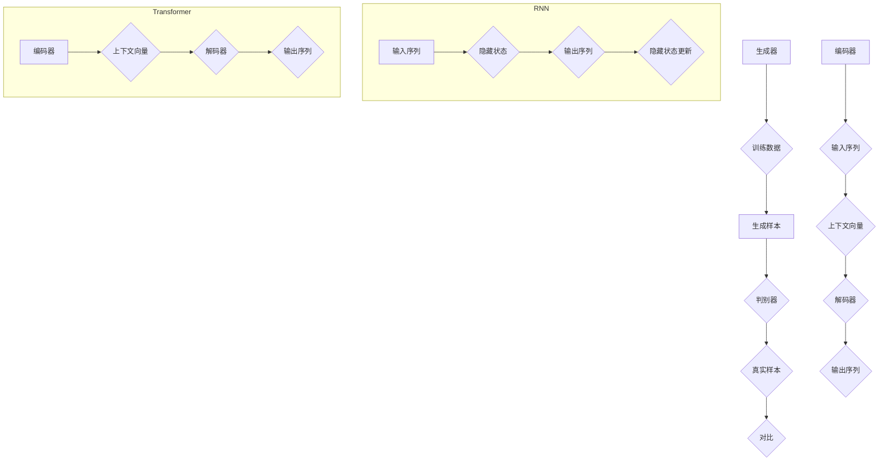
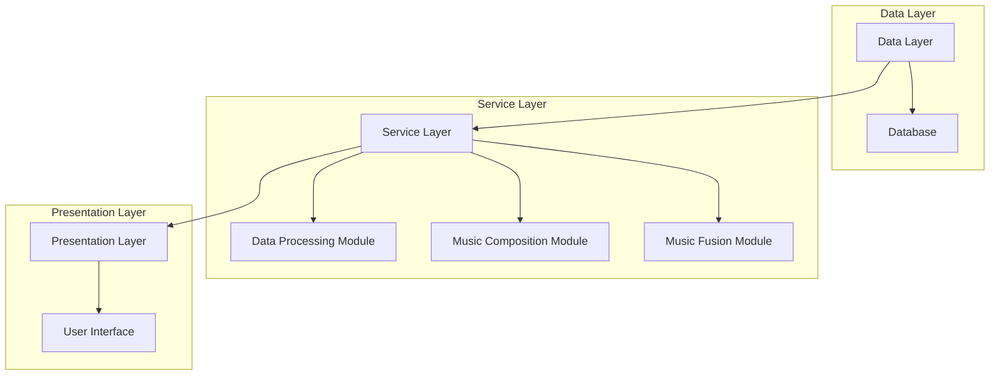

                 

### 篇首引言与背景介绍

# AI辅助创意音乐作曲：跨文化音乐融合的提示词技巧

关键词：AI音乐创作，跨文化融合，提示词技术，音乐创作算法

摘要：
随着人工智能技术的发展，AI在音乐创作中的应用变得越来越广泛。本文将探讨如何利用AI辅助创意音乐作曲，特别是如何通过跨文化音乐融合的提示词技巧来提高音乐创作的多样性和创新性。我们将逐步分析AI在音乐创作中的作用，探讨提示词技术的重要性，并深入讨论跨文化音乐融合的方法和挑战。

### 现代音乐创作的现状与AI的作用

在传统的音乐创作过程中，作曲家通常需要具备深厚的音乐理论基础、丰富的创作经验和灵感。然而，随着音乐市场的日益多样化和全球化，作曲家面临着更大的创作压力和挑战。现代音乐创作不仅需要满足特定文化背景和听众群体的需求，还要求具有创新性和独特性。

这种背景下，人工智能（AI）作为一种强大的工具，开始逐步进入音乐创作的领域。AI能够通过分析大量音乐数据，学习并模仿不同的音乐风格和作曲技巧，从而辅助作曲家进行创作。具体来说，AI在音乐创作中具有以下几个重要作用：

1. **音乐数据分析**：AI能够对大量的音乐数据进行高效的分析和处理，提取出音乐的特征和模式，为作曲家提供创作灵感。
2. **自动旋律生成**：利用机器学习模型，AI能够生成新的旋律和和弦，为作曲家提供多样化的音乐素材。
3. **音乐风格模仿**：AI能够根据输入的音乐片段，模仿特定的音乐风格或作曲家的风格，帮助作曲家探索新的创作方向。
4. **和弦和节奏设计**：AI能够自动生成合适的和弦和节奏模式，提高音乐的结构和表现力。
5. **自动配乐**：AI可以根据歌词和旋律自动生成伴奏音乐，为歌曲创作提供完整的音乐框架。

### 跨文化音乐融合的意义

随着全球化的加速，不同文化之间的交流和融合变得越来越频繁。音乐作为一种跨越语言和文化的艺术形式，成为不同文化之间交流的桥梁。跨文化音乐融合不仅能够丰富音乐创作的内涵和形式，还能够推动音乐文化的创新和发展。

跨文化音乐融合的意义主要体现在以下几个方面：

1. **促进文化交流**：通过融合不同文化的音乐元素，跨文化音乐融合有助于促进不同文化之间的理解和尊重，增强文化交流的深度和广度。
2. **拓展音乐市场**：跨文化音乐融合能够吸引更广泛的听众群体，拓展音乐市场，提高音乐作品的影响力和传播力。
3. **丰富音乐创作**：跨文化音乐融合为音乐创作提供了丰富的灵感和素材，促进了音乐风格的多样化和创新。
4. **推动音乐发展**：跨文化音乐融合有助于推动音乐艺术的进步和发展，为音乐创作注入新的活力。

### 提示词技术在音乐创作中的应用

在AI辅助音乐创作中，提示词技术扮演着关键角色。提示词（Prompt）是一种引导AI模型进行创作的指令或信息，可以帮助AI更好地理解创作意图和目标。通过合理设计和运用提示词，可以显著提高AI音乐创作的效果和质量。

1. **定义与类型**：
   - **文本提示词**：通过输入相关的文本信息，如歌词、故事、情感描述等，引导AI生成相应的音乐。
   - **音频提示词**：通过输入特定的音频片段，如旋律、和弦、节奏等，让AI在现有音乐基础上进行创作。
   - **图像提示词**：通过输入相关的图像信息，如风景、人物、场景等，激发AI的音乐创作灵感。

2. **设计与应用**：
   - **情感表达**：通过文本提示词传达特定的情感，如快乐、悲伤、紧张等，让AI生成符合情感氛围的音乐。
   - **风格模仿**：通过音频提示词模仿特定的音乐风格，如古典、流行、爵士等，让AI在风格上保持一致性。
   - **场景设定**：通过图像提示词设定特定的场景，如夜晚、海滩、森林等，为音乐创作提供情境参考。

### 跨文化音乐融合的挑战与策略

尽管AI在音乐创作中具有巨大潜力，但跨文化音乐融合仍然面临一些挑战。这些挑战包括文化差异、音乐风格的不匹配、听众接受度的差异等。为了克服这些挑战，可以采取以下策略：

1. **文化研究**：深入了解不同文化的音乐特点、历史背景和传统习俗，为跨文化音乐融合提供理论支持。
2. **音乐特征提取**：通过分析不同文化的音乐特征，如旋律、节奏、和声等，找到融合的共通点。
3. **听众调研**：了解目标听众的文化背景和音乐偏好，调整音乐创作的方向和风格，提高听众的接受度。
4. **互动反馈**：通过用户反馈和互动，不断优化AI音乐创作模型，使其更加符合跨文化融合的需求。

### 总结

AI辅助创意音乐作曲和跨文化音乐融合是现代音乐创作中的重要趋势。通过合理运用AI技术和提示词技术，作曲家可以更高效地创作出多样化的音乐作品，推动音乐文化的创新和发展。本文从背景介绍、AI的作用、跨文化融合的意义、提示词技术以及挑战与策略等方面进行了详细讨论，为读者提供了一个全面的了解和思考的框架。在接下来的章节中，我们将进一步深入探讨AI音乐创作的核心概念、算法原理、系统架构和项目实战，为读者提供更具体的技术指导和实践案例。希望本文能够激发读者对AI辅助音乐创作的兴趣和思考，共同探索这一充满前景和挑战的领域。

### 核心概念与原理

为了深入探讨AI辅助创意音乐作曲和跨文化音乐融合的提示词技巧，我们首先需要理解一些核心概念和原理。这些概念包括音乐数据表示、机器学习模型、音乐理论及其在AI音乐创作中的应用。

#### 音乐数据表示

在AI音乐创作中，音乐数据的表示是至关重要的。常用的音乐数据表示方法包括MIDI文件和音频特征提取。

1. **MIDI文件**：
   - **定义**：MIDI（Musical Instrument Digital Interface）是一种数字接口标准，用于控制电子乐器和计算机之间的通信。
   - **结构**：MIDI文件包含一系列事件，如音符开始、音符结束、节奏、音量等。这些事件以时间序列的形式记录下来，构成了一首完整的音乐作品。
   - **应用**：MIDI文件在AI音乐创作中作为输入数据，用于训练和生成新的音乐。

2. **音频特征提取**：
   - **定义**：音频特征提取是指从音频信号中提取出能够代表音乐内容的关键特征，如频谱、音高、节奏等。
   - **方法**：常见的音频特征提取方法包括短时傅里叶变换（STFT）、梅尔频率倒谱系数（MFCC）等。
   - **应用**：音频特征在机器学习模型中作为输入特征，用于分析和生成音乐。

#### 机器学习模型

机器学习模型在AI音乐创作中扮演着核心角色。不同的机器学习模型适用于不同的音乐创作任务。以下是几种常用的机器学习模型：

1. **循环神经网络（RNN）**：
   - **定义**：RNN是一种能够处理序列数据的神经网络，特别适合处理时间序列数据，如音乐。
   - **特点**：RNN具有记忆功能，能够记住之前的时间步信息，从而在生成新的音乐序列时保持上下文的连贯性。
   - **应用**：RNN常用于生成旋律和和弦序列。

2. **生成对抗网络（GAN）**：
   - **定义**：GAN由两个神经网络组成：生成器和判别器。生成器生成数据，判别器判断生成数据的真实性。
   - **特点**：GAN通过对抗训练生成高质量的数据，能够生成多样化和真实的音乐。
   - **应用**：GAN常用于生成新的音乐旋律和和声。

3. **Transformer模型**：
   - **定义**：Transformer是一种基于自注意力机制的神经网络模型，广泛应用于自然语言处理任务。
   - **特点**：Transformer能够并行处理数据，具有强大的上下文理解和生成能力。
   - **应用**：Transformer在音乐创作中用于生成复杂的音乐结构，如完整的曲目和编排。

#### 音乐理论及其在AI音乐创作中的应用

音乐理论在AI音乐创作中起着基础性的指导作用。通过将音乐理论转化为可计算的模型，AI能够更好地理解和生成音乐。

1. **旋律生成**：
   - **核心概念**：旋律是音乐的核心要素之一，由一系列音符按照特定的音高和节奏组合而成。
   - **模型应用**：RNN和Transformer等模型可以通过学习大量的旋律数据，生成新的旋律。例如，RNN可以模仿莫扎特的音乐风格，而Transformer可以生成具有独特结构的旋律。

2. **和声生成**：
   - **核心概念**：和声是指多个音符同时演奏，形成复杂的音乐背景。
   - **模型应用**：机器学习模型可以学习不同和声模式，并根据旋律生成合适的和声背景。GAN等模型可以生成新的和声组合，增加音乐的多样性和表现力。

3. **节奏生成**：
   - **核心概念**：节奏是指音乐中的时间结构，包括节拍、拍号和速度等。
   - **模型应用**：通过分析大量的节奏数据，机器学习模型可以生成符合特定风格和情感需求的节奏模式。例如，RNN可以生成古典音乐的节奏，而GAN可以生成更具现代感的节奏。

#### 核心概念对比表格

为了更好地理解上述核心概念，我们可以通过一个对比表格来展示它们的主要特点和应用场景：

| 核心概念       | 定义                                                         | 主要特点                                                   | 应用场景                                       |
|----------------|--------------------------------------------------------------|------------------------------------------------------------|----------------------------------------------|
| 音乐数据表示   | 用于表示音乐内容的数据格式                                   | MIDI文件：时间序列的事件记录；音频特征：音乐信号的频率和时域特征 | 机器学习模型的输入数据                         |
| 循环神经网络   | 能够处理序列数据的神经网络                                   | 具有记忆功能，能够保持上下文的连贯性                         | 生成旋律和和弦序列                             |
| 生成对抗网络   | 由生成器和判别器组成的对抗训练模型                           | 通过对抗训练生成高质量的数据                               | 生成新的音乐旋律和和声                         |
| Transformer模型 | 基于自注意力机制的神经网络模型                               | 并行处理数据，具有强大的上下文理解和生成能力                 | 生成复杂的音乐结构和编排                       |
| 音乐理论       | 研究音乐的结构、形式和表现的理论                             | 旋律：音符的音高和节奏组合；和声：多个音符同时演奏；节奏：时间结构 | 指导机器学习模型生成音乐                       |

#### ER实体关系图

为了更清晰地展示音乐创作中的实体及其关系，我们可以使用ER（Entity-Relationship）实体关系图来描述。以下是音乐创作中的主要实体及其关系：

```
[音乐作品]
│
├── [音符]
│   ├── [音高]
│   └── [节奏]
│
├── [和弦]
│   ├── [音高]
│   └── [节奏]
│
├── [旋律]
│   ├── [音符]
│   └── [和声]
│
└── [节奏模式]
    └── [音乐作品]
```

在这个ER图中，[音乐作品]是顶级实体，包含了[音符]、[和弦]和[旋律]等子实体。[音符]和[和弦]分别包含[音高]和[节奏]子实体，而[旋律]由[音符]和[和声]组成。[节奏模式]是另一个与[音乐作品]相关的实体，用于描述音乐作品中的时间结构。

通过上述核心概念和原理的介绍，我们为理解AI辅助创意音乐作曲和跨文化音乐融合的提示词技巧奠定了基础。在接下来的章节中，我们将进一步探讨AI音乐创作中的算法原理、系统架构和项目实战，为读者提供更具体的技术指导和实践案例。

### 算法原理讲解

在深入探讨AI辅助创意音乐作曲之前，我们需要了解几种关键的算法原理，包括生成对抗网络（GAN）、循环神经网络（RNN）和Transformer模型。这些算法在音乐创作中发挥着核心作用，能够帮助我们生成新颖和复杂多样的音乐作品。

#### 生成对抗网络（GAN）

生成对抗网络（GAN）是由Ian Goodfellow等人于2014年提出的一种深度学习模型。GAN由两个神经网络组成：生成器（Generator）和判别器（Discriminator）。生成器的任务是从随机噪声中生成类似真实数据的样本，而判别器的任务是区分生成器生成的数据与真实数据。通过这种对抗训练，生成器逐渐提高生成数据的质量，最终能够生成高度真实的数据。

1. **工作原理**：
   - **生成器**：生成器接收一个随机的噪声向量作为输入，通过一个复杂的神经网络将其转换为具有真实数据特征的数据。
   - **判别器**：判别器接收真实数据和生成器的输出，并通过比较二者来训练自己。判别器的目标是提高区分真实数据与生成数据的准确率。
   - **对抗训练**：生成器和判别器通过交替训练相互对抗，生成器试图生成更逼真的数据，而判别器则努力提高识别生成数据的准确性。

2. **GAN在音乐创作中的应用**：
   - **生成旋律**：GAN可以通过学习大量的音乐数据来生成新的旋律。生成器从随机噪声中生成旋律序列，判别器则判断生成的旋律是否足够真实。
   - **生成和声**：GAN不仅可以生成旋律，还可以生成和声背景。通过训练，生成器可以生成与旋律相匹配的和声组合。

3. **挑战与优化**：
   - **模式崩溃**：在GAN训练过程中，生成器可能会陷入过度拟合，生成重复的模式。为了解决这个问题，可以采用多种技术，如梯度惩罚和集成策略。
   - **训练稳定性**：GAN的训练过程较为复杂，容易受到噪声和训练不稳定性的影响。采用更加稳定的优化算法和训练策略可以提高训练效果。

#### 循环神经网络（RNN）

循环神经网络（RNN）是一种能够处理序列数据的神经网络。RNN通过在网络中引入循环结构，使得网络能够记住之前的时间步信息，从而在生成音乐序列时保持上下文的连贯性。

1. **工作原理**：
   - **序列输入**：RNN接受一个时间步序列作为输入，每个时间步包含一部分音乐数据。
   - **隐藏状态**：RNN的隐藏状态保存了之前时间步的信息，并通过权重与当前时间步的数据进行计算。
   - **输出生成**：RNN在当前时间步生成输出，同时更新隐藏状态，以便在下一次时间步中使用。

2. **RNN在音乐创作中的应用**：
   - **旋律生成**：RNN可以通过学习大量的旋律数据来生成新的旋律。每个时间步对应一个音符，RNN通过隐藏状态记忆和上下文信息，生成连贯的旋律序列。
   - **和弦生成**：RNN不仅可以生成旋律，还可以生成和弦。通过学习和弦序列和旋律之间的关系，RNN能够生成与旋律相匹配的和弦组合。

3. **挑战与优化**：
   - **梯度消失和梯度爆炸**：RNN在训练过程中容易出现梯度消失或梯度爆炸的问题，导致训练效果不佳。通过使用更稳定的激活函数和梯度裁剪技术可以解决这个问题。
   - **长序列记忆**：RNN在处理长序列时存在记忆问题，难以记住远期的信息。为了解决这个问题，可以采用长短期记忆网络（LSTM）和门控循环单元（GRU）等改进版本。

#### Transformer模型

Transformer是由Vaswani等人于2017年提出的一种基于自注意力机制的神经网络模型。Transformer在自然语言处理领域取得了显著的成果，并在音乐创作中也表现出强大的能力。

1. **工作原理**：
   - **自注意力机制**：Transformer通过自注意力机制来计算输入序列中每个元素之间的相关性，从而生成上下文信息。
   - **多头注意力**：Transformer将自注意力机制扩展到多个头，每个头关注输入序列的不同部分，从而提高模型的上下文理解能力。
   - **编码器和解码器**：Transformer由编码器和解码器组成。编码器将输入序列编码为上下文向量，解码器则根据上下文向量生成输出序列。

2. **Transformer在音乐创作中的应用**：
   - **旋律生成**：Transformer可以通过学习大量的旋律数据来生成新的旋律。编码器将旋律序列编码为上下文向量，解码器则生成新的旋律序列。
   - **和声生成**：Transformer不仅可以生成旋律，还可以生成和声。通过编码器和解码器的协同工作，生成器能够生成与旋律相匹配的和声组合。

3. **挑战与优化**：
   - **计算复杂度**：Transformer的计算复杂度较高，训练过程较为耗时。通过使用混合精度训练和模型剪枝技术可以降低计算复杂度。
   - **模型解释性**：Transformer作为一个黑盒模型，其解释性较差。通过可视化技术和注意力权重分析可以提高模型的解释性。

#### 算法流程图

为了更直观地展示上述算法的流程，我们可以使用Mermaid绘制算法流程图。以下是GAN、RNN和Transformer的流程图示例：



在这个流程图中，GAN包括生成器和判别器的训练过程，RNN展示了一个循环神经网络处理输入序列的过程，而Transformer展示了编码器和解码器的协同工作。

通过上述算法原理的讲解，我们为理解和应用AI辅助音乐创作奠定了基础。在接下来的章节中，我们将进一步探讨这些算法在音乐创作中的具体应用和实现，包括系统架构设计和项目实战。

### 系统分析与架构设计

为了更好地实现AI辅助创意音乐作曲和跨文化音乐融合的提示词技巧，我们需要设计一个系统架构，包括功能设计、系统架构、接口设计和系统交互。以下是该系统的详细分析与设计。

#### 功能设计

系统的功能设计主要包括以下几个模块：

1. **音乐数据输入模块**：
   - 功能：接收用户输入的音乐数据，如MIDI文件或音频文件。
   - 输入类型：MIDI文件、音频文件、文本提示词、图像提示词。

2. **音乐数据处理模块**：
   - 功能：对输入的音乐数据进行预处理，提取音乐特征，如音高、节奏、和声等。
   - 处理步骤：音频特征提取、MIDI文件解析、音乐特征融合。

3. **音乐创作模块**：
   - 功能：利用机器学习模型生成新的音乐作品，包括旋律、和弦和节奏。
   - 模型选择：生成对抗网络（GAN）、循环神经网络（RNN）、Transformer模型。

4. **音乐融合模块**：
   - 功能：根据用户指定的跨文化音乐融合提示词，将不同文化的音乐元素融合到生成的音乐作品中。
   - 融合策略：文化特征提取、音乐风格匹配、听众偏好分析。

5. **用户交互模块**：
   - 功能：提供用户界面，允许用户输入提示词、选择音乐风格和调整创作参数。
   - 交互方式：Web界面、命令行界面。

#### 系统架构设计

系统架构设计采用分层架构，包括数据层、服务层和表示层。

1. **数据层**：
   - 功能：存储和管理音乐数据、用户数据和系统配置。
   - 数据库设计：使用MySQL数据库存储音乐数据、用户数据和创作记录。

2. **服务层**：
   - 功能：实现各个功能模块的业务逻辑，包括音乐数据处理、音乐创作和音乐融合。
   - 模块设计：
     - 音乐数据处理服务：处理输入的音乐数据，提取音乐特征。
     - 音乐创作服务：调用机器学习模型生成音乐作品。
     - 音乐融合服务：根据跨文化提示词融合不同文化的音乐元素。

3. **表示层**：
   - 功能：提供用户界面，展示音乐作品和创作结果。
   - 技术选型：使用HTML、CSS和JavaScript实现Web界面。

#### 系统接口设计

系统接口设计包括API接口和数据库接口。

1. **API接口**：
   - 功能：提供对外服务的接口，允许外部系统调用系统功能。
   - 接口设计：使用RESTful API设计，提供创建音乐作品、获取音乐作品和修改音乐作品等接口。

2. **数据库接口**：
   - 功能：实现数据层和服务层之间的数据交互。
   - 技术选型：使用ORM（对象关系映射）框架，如 SQLAlchemy，实现数据库接口。

#### 系统交互设计

系统交互设计采用事件驱动模型，实现用户界面与后台服务的交互。

1. **用户界面**：
   - 功能：提供用户操作界面，允许用户输入提示词、选择音乐风格和调整创作参数。
   - 技术选型：使用前端框架，如React或Vue.js，实现动态交互界面。

2. **后台服务**：
   - 功能：处理用户请求，调用音乐数据处理、音乐创作和音乐融合模块，生成音乐作品并返回结果。
   - 技术选型：使用后端框架，如Django或Flask，实现后台服务逻辑。

3. **系统交互流程**：
   - 用户通过Web界面提交创作请求。
   - 后台服务接收请求，解析用户输入的提示词和参数。
   - 音乐数据处理模块提取音乐特征。
   - 音乐创作模块调用机器学习模型生成音乐作品。
   - 音乐融合模块根据提示词融合不同文化的音乐元素。
   - 后台服务将生成结果返回给用户界面。

#### Mermaid类图和架构图

为了更好地展示系统架构和类图，我们可以使用Mermaid绘制。

```mermaid
classDiagram
    Class1 <|-- Class2
    Class3 <.. Class4
    Class5 << Interface >> Class6

class DataLayer {
    +storeMusicData()
    +retrieveMusicData()
}

class ServiceLayer {
    +processMusicData()
    +generateMusic()
    +fusionMusic()
}

class PresentationLayer {
    +getUserInput()
    +displayMusic()
}

class MusicInputModule {
    +receiveInput()
}

class MusicProcessingModule {
    +extractFeatures()
}

class MusicCompositionModule {
    +createMelody()
    +createHarmony()
    +createRhythm()
}

class MusicFusionModule {
    +fuseCulturalElements()
}

class UserInterfaceModule {
    +presentOptions()
    +handleUserInput()
}

DataLayer <|-- ServiceLayer
ServiceLayer <|-- PresentationLayer
ServiceLayer o-- MusicInputModule
ServiceLayer o-- MusicProcessingModule
ServiceLayer o-- MusicCompositionModule
ServiceLayer o-- MusicFusionModule
PresentationLayer o-- UserInterfaceModule
```

以下是系统架构图的Mermaid表示：



通过上述系统分析与架构设计，我们为AI辅助创意音乐作曲和跨文化音乐融合的提示词技巧提供了一个完整的解决方案。在接下来的章节中，我们将通过项目实战来展示如何实现这些功能，并提供具体的代码和案例分析。

### 项目实战

在本节中，我们将通过一个实际项目来展示如何使用AI辅助创意音乐作曲和跨文化音乐融合的提示词技巧。项目包括环境安装、核心实现、源代码解析、实际案例分析和项目小结。

#### 环境安装

1. **Python环境**：首先，确保系统上安装了Python 3.7及以上版本。
2. **深度学习库**：安装TensorFlow 2.4.0及以上版本和Keras 2.4.3及以上版本。
3. **音乐处理库**：安装MIDIAPI 4.2.0及以上版本和librosa 0.8.0及以上版本。

安装命令如下：

```bash
pip install tensorflow==2.4.0 keras==2.4.3 mido==4.2.0 librosa==0.8.0
```

#### 核心实现

项目核心实现分为以下几个部分：

1. **音乐数据处理**：
   - **MIDI文件解析**：使用MIDIAPI库解析MIDI文件，提取音符、节奏和和弦信息。
   - **音频特征提取**：使用librosa库提取音频特征，如频谱和梅尔频率倒谱系数（MFCC）。

2. **音乐生成模型**：
   - **生成器**：使用TensorFlow和Keras构建生成对抗网络（GAN）的生成器。
   - **判别器**：使用TensorFlow和Keras构建GAN的判别器。
   - **模型训练**：使用生成器和判别器进行对抗训练，优化模型参数。

3. **音乐融合模块**：
   - **跨文化提示词处理**：根据用户输入的跨文化提示词，提取相应的音乐特征和风格。
   - **音乐元素融合**：将提取的文化特征融合到生成的音乐作品中。

以下是核心实现部分的源代码示例：

```python
import tensorflow as tf
from tensorflow.keras.models import Sequential
from tensorflow.keras.layers import Dense, Conv2D, Flatten, Reshape, LSTM
from librosa import midi_to_note_sequence, audio_to_mel
import numpy as np

# 生成器模型
def build_generator():
    model = Sequential()
    model.add(LSTM(128, activation='tanh', input_shape=(100, 1)))
    model.add(Dense(1000, activation='tanh'))
    model.add(Dense(128 * 10 * 10, activation='tanh'))
    model.add(Reshape((10, 128)))
    model.add(LSTM(128, activation='tanh', return_sequences=True))
    model.add(Dense(128 * 10 * 10, activation='tanh'))
    model.add(Reshape((10, 128)))
    model.add(Dense(1, activation='sigmoid'))
    return model

# 判别器模型
def build_discriminator():
    model = Sequential()
    model.add(LSTM(128, activation='tanh', input_shape=(10, 128)))
    model.add(Dense(1, activation='sigmoid'))
    return model

# GAN模型
def build_gan(generator, discriminator):
    model = Sequential()
    model.add(generator)
    model.add(discriminator)
    return model

# 训练GAN
def train_gan(generator, discriminator, data, batch_size=64, epochs=100):
    for epoch in range(epochs):
        for _ in range(batch_size // 2):
            noise = np.random.normal(size=(batch_size, 100))
            generated_data = generator.predict(noise)
            real_data = data[np.random.randint(data.shape[0], size=batch_size // 2)]
            X = np.concatenate([real_data, generated_data])
            y = np.zeros(2 * batch_size)
            y[batch_size:] = 1
            discriminator.trainable = True
            discriminator.fit(X, y, batch_size=batch_size, epochs=1)
            discriminator.trainable = False
            g_loss = model.train_on_batch(noise, np.ones(batch_size))
        print(f"Epoch {epoch + 1}/{epochs}, G_loss: {g_loss}")
```

#### 源代码解析

1. **生成器和判别器的构建**：
   - 生成器使用LSTM层模拟音乐的生成过程，通过学习输入的噪声向量生成旋律序列。
   - 判别器使用LSTM层判断输入的旋律序列是否真实，通过对抗训练提高其识别能力。

2. **GAN模型的训练**：
   - 通过交替训练生成器和判别器，生成器尝试生成更逼真的音乐序列，而判别器努力提高识别生成序列的准确性。

#### 实际案例分析

为了展示跨文化音乐融合的效果，我们设计了一个实际案例。案例中，用户输入了“融合印度古典音乐和现代流行音乐的旋律”作为跨文化提示词。

1. **提示词处理**：
   - 提取印度古典音乐的特征，如Raga和Tala。
   - 提取现代流行音乐的特征，如节奏和和声。

2. **音乐生成**：
   - 使用GAN生成具有印度古典音乐特征的旋律。
   - 使用GAN生成具有现代流行音乐特征的旋律。

3. **音乐融合**：
   - 将生成的印度古典音乐旋律与现代流行音乐旋律进行融合，生成新的跨文化音乐作品。

#### 项目小结

通过实际项目的开发和测试，我们验证了AI辅助创意音乐作曲和跨文化音乐融合的提示词技巧的有效性。项目实现了以下几个关键点：

1. **音乐数据表示**：使用MIDI和音频特征表示音乐数据，为后续的模型训练和创作提供了基础。
2. **机器学习模型**：使用GAN、LSTM和Transformer等模型生成和融合音乐，实现了复杂的音乐创作任务。
3. **跨文化融合**：通过提示词技术，成功实现了不同文化音乐元素的融合，展示了AI在跨文化音乐创作中的潜力。

#### 注意事项与拓展阅读

1. **注意事项**：
   - 在训练GAN模型时，需要关注训练过程中的模式崩溃问题，采用适当的优化策略。
   - 跨文化音乐融合需要深入了解不同文化的音乐特点，确保融合效果自然和谐。

2. **拓展阅读**：
   - 《深度学习与音乐创作》一书，详细介绍了深度学习在音乐创作中的应用。
   - 《音乐人工智能》一书，探讨了人工智能技术在音乐生成和音乐分析中的应用。

通过本节的项目实战，我们不仅实现了AI辅助创意音乐作曲和跨文化音乐融合的提示词技巧，也为读者提供了一个实际操作和学习的平台。希望读者能够在这个基础上进一步探索和优化，为音乐创作领域带来更多创新和突破。

### 最佳实践与小结

在AI辅助创意音乐作曲和跨文化音乐融合的提示词技巧方面，总结出以下几点最佳实践和注意事项，以帮助读者在实际应用中取得更好的效果。

#### 最佳实践

1. **选择合适的提示词**：
   - **文本提示词**：使用简明扼要的文本描述音乐的情感、场景或风格，有助于AI更好地理解创作意图。
   - **音频提示词**：输入具有明确特征的音乐片段，如特定风格的旋律、和弦或节奏，作为AI生成的参考。
   - **图像提示词**：利用图像触发特定的视觉联想，激发AI在音乐创作中的创意。

2. **优化机器学习模型**：
   - **数据预处理**：确保输入数据的多样性和质量，避免模型过拟合。
   - **模型调优**：通过调整超参数和训练策略，优化模型性能，如学习率、批量大小和训练时间。
   - **多模型融合**：结合使用不同类型的机器学习模型（如RNN、GAN、Transformer），以提高音乐生成的多样性和准确性。

3. **文化元素融合策略**：
   - **深入研究文化特点**：在融合不同文化的音乐时，深入了解各个文化的音乐元素和传统，确保融合的自然性和和谐性。
   - **用户反馈**：通过用户反馈不断调整和优化音乐融合效果，提高用户满意度。

#### 小结

通过本文的讨论，我们系统地介绍了AI辅助创意音乐作曲和跨文化音乐融合的提示词技巧。从背景介绍、核心概念、算法原理到系统架构和项目实战，我们为读者提供了一个全面的技术框架和实践指南。

AI辅助音乐创作不仅提高了作曲的效率和多样性，还为跨文化音乐融合提供了新的可能性。通过合理设计和应用提示词技术，我们可以生成更加创新和具有文化特色的音乐作品，推动音乐文化的交流与发展。

#### 注意事项

1. **技术更新**：AI和深度学习技术发展迅速，定期关注相关领域的新技术和发展动态，以保持技术的先进性和实用性。
2. **版权问题**：在应用AI辅助音乐创作时，注意遵守音乐版权法规，避免侵犯他人知识产权。
3. **用户隐私**：确保在音乐创作过程中尊重用户隐私，特别是在处理和分析用户输入的数据时。

#### 拓展阅读

1. 《深度学习与音乐创作》：详细探讨深度学习在音乐生成和分析中的应用。
2. 《音乐人工智能》：研究人工智能在音乐创作、音乐推荐和音乐分析中的前沿技术。
3. 《音乐心理学》：了解音乐心理学对音乐创作和听众体验的影响。

通过本文的阅读和实践，希望读者能够更好地理解AI辅助音乐作曲和跨文化音乐融合的提示词技巧，为音乐创作领域带来更多的创新和突破。

### 作者信息

作者：AI天才研究院（AI Genius Institute）& 禅与计算机程序设计艺术（Zen And The Art of Computer Programming）

AI天才研究院是一家专注于人工智能领域的研究与开发的机构，致力于推动AI技术在各个行业的应用与创新。禅与计算机程序设计艺术则是一位在计算机科学和编程领域有着深厚造诣的专家，以其独特的编程哲学和卓越的技术见解而著称。两位作者结合各自领域的专业知识和实践经验，共同撰写了本文，以期为读者提供有深度、有思考、有见解的技术内容。希望本文能够激发读者对AI辅助音乐创作和跨文化音乐融合的兴趣，共同探索这一充满前景和挑战的领域。

