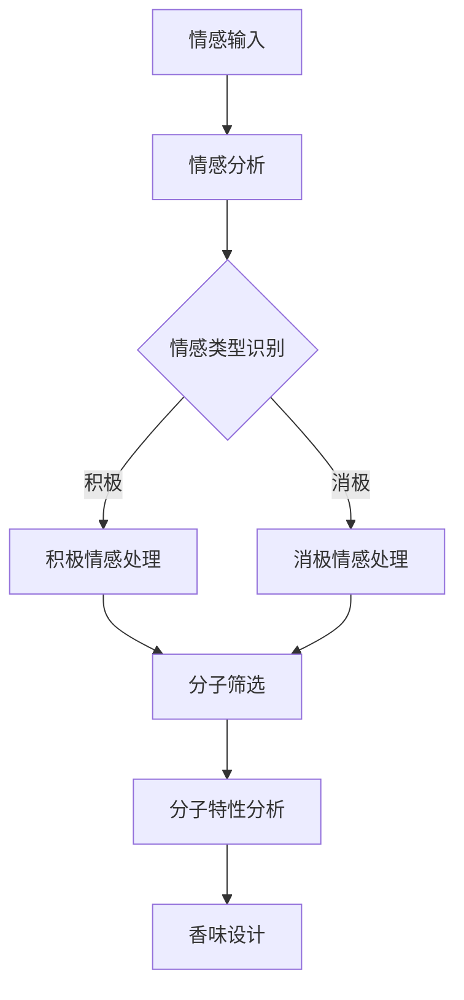
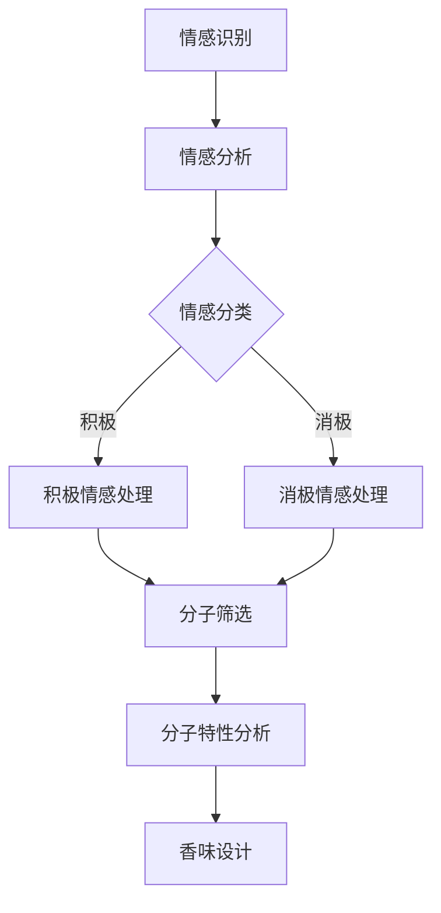

                 

# AI辅助创意香水分子设计：情感-分子映射的提示词工程

## 关键词
- AI 辅助设计
- 情感-分子映射
- 提示词工程
- 香水分子设计
- 机器学习算法

## 摘要
本文旨在探讨如何利用人工智能（AI）辅助创意香水分子设计，特别是在情感-分子映射的基础上进行提示词工程。文章首先介绍了AI辅助香水设计的背景和意义，然后详细阐述了情感-分子映射的核心概念与联系。接着，文章重点分析了AI在香水分子设计中的应用，包括算法原理、Python源代码展示以及数学模型。此外，文章还探讨了提示词工程的基本概念、选择与生成方法，并给出了具体的应用实例。最后，文章对未来的发展方向进行了展望。

## 第一部分：背景介绍与核心概念

### 第1章：问题背景与AI引入

#### 1.1.1 问题背景
香水设计是一个复杂且创意驱动的过程，通常涉及到对大量化合物的筛选、组合和评估。传统的香水设计方法主要依赖于人类的嗅觉体验和经验，这不仅效率低下，而且难以保证创新性。随着人工智能技术的发展，AI在香水设计中的应用逐渐成为一种趋势。

#### 1.1.2 AI引入的意义
AI在香水设计中的引入，可以为设计师提供强大的辅助工具。通过机器学习算法，AI可以分析和理解大量数据，从而帮助设计师发现新的香味组合和设计理念。此外，AI还可以优化设计过程，提高效率和质量。

### 第2章：核心概念与联系

#### 2.1.1 情感-分子映射的概念
情感-分子映射是指将人类的情感体验与特定的分子结构相关联的过程。这个过程涉及到情感的定义、分类以及分子的结构和性质。

#### 2.1.2 AI与香水设计的联系
AI在香水设计中的应用主要体现在两个方面：一是通过机器学习算法分析大量的香味数据，二是利用这些数据辅助设计师进行创意设计。

#### 2.1.3 ER实体关系图
在情感-分子映射的背景下，可以构建一个ER实体关系图，包括情感实体、分子实体和AI实体。这个关系图可以帮助我们理解三者之间的相互关系和作用。

### 2.2 概念属性特征对比表格
在情感-分子映射的过程中，需要对情感和分子进行属性特征的对比分析。以下是一个简化的对比表格：

| 情感属性 | 分子属性 |
| --- | --- |
| 生理反应 | 分子结构 |
| 情感强度 | 分子性质 |
| 情感类型 | 分子功能 |

### 2.3 Mermaid流程图
为了更直观地展示情感-分子映射的过程，可以使用Mermaid绘制一个流程图：



## 第二部分：AI辅助创意香水分子设计

### 第3章：AI技术在香水设计中的应用

#### 3.1.1 香水分子设计的基本流程
香水分子设计的流程通常包括分子筛选、分子合成和分子评估三个阶段。

#### 3.1.2 AI在香水分子设计中的角色
AI在香水分子设计中的角色主要包括以下几个方面：
- 数据分析：利用机器学习算法分析大量的香味数据，以发现潜在的香味组合。
- 设计辅助：通过算法为设计师提供设计建议，帮助优化香味组合。
- 评估与优化：利用AI对设计结果进行评估和优化，以提高香水的品质和吸引力。

#### 3.1.3 AI应用实例
以下是一些AI在香水设计中的实际应用实例：
- 人工智能筛选香味分子：通过分析大量的香味数据，AI可以帮助设计师快速筛选出适合的香味分子。
- 人工智能合成新香味：利用机器学习算法，AI可以生成新的香味组合，为设计师提供更多的创意灵感。
- 人工智能评估香味效果：通过评估模型，AI可以对设计的香味进行效果评估，帮助设计师优化设计。

### 第4章：AI辅助香水分子设计的算法原理

#### 4.1.1 算法原理讲解
AI辅助香水分子设计的核心在于机器学习算法的应用。以下是几种常用的算法原理：

1. **聚类分析**：通过将相似度高的分子聚类，以帮助设计师快速筛选出香味分子。
2. **关联规则学习**：通过分析不同分子之间的关联性，以发现新的香味组合。
3. **神经网络模型**：通过深度学习技术，模拟人脑的学习过程，以实现对香味分子的特征提取和优化。

#### 4.1.2 Python源代码展示
以下是一个简化的Python代码示例，用于展示机器学习算法在香水分子设计中的应用：

```python
import numpy as np
from sklearn.cluster import KMeans
from sklearn.preprocessing import StandardScaler

# 数据预处理
data = np.load('smell_data.npy')
scaler = StandardScaler()
scaled_data = scaler.fit_transform(data)

# 聚类分析
kmeans = KMeans(n_clusters=5)
kmeans.fit(scaled_data)
clusters = kmeans.predict(scaled_data)

# 输出结果
print("Cluster centers:", kmeans.cluster_centers_)
print("Cluster assignments:", clusters)
```

#### 4.1.3 数学模型和公式
在香水分子设计过程中，常用的数学模型包括：

1. **香味特征提取模型**：通常使用傅里叶变换（Fourier Transform）和小波变换（Wavelet Transform）等方法进行特征提取。
2. **优化模型**：使用线性规划（Linear Programming）和遗传算法（Genetic Algorithm）等方法进行分子优化。

以下是一个简化的数学模型示例：

$$
\text{Objective Function} = \sum_{i=1}^{n} \left( \text{weight}_i \times (\text{predicted}_i - \text{actual}_i) \right)^2
$$

其中，$n$ 表示分子的数量，$\text{weight}_i$ 表示第 $i$ 个分子的权重，$\text{predicted}_i$ 和 $\text{actual}_i$ 分别表示预测值和实际值。

#### 4.1.4 举例说明
以下是一个简单的例子，用于说明如何使用机器学习算法进行香水分子筛选：

假设我们有一组香味分子，每个分子都有其特征向量。我们希望筛选出具有特定特征的分子，以合成一种新的香味。

1. **数据预处理**：将香味分子的特征向量进行标准化处理。
2. **聚类分析**：使用KMeans算法对特征向量进行聚类，筛选出具有相似特征的分子。
3. **优化模型**：使用线性规划算法，将筛选出的分子进行优化，以获得最佳的香味组合。

## 第三部分：情感-分子映射的提示词工程

### 第5章：提示词工程的基本概念

#### 5.1.1 提示词的定义与作用
提示词是指用于引导AI模型进行训练和预测的词语或短语。在情感-分子映射中，提示词的作用是帮助AI模型理解人类情感与分子结构之间的关联。

#### 5.1.2 提示词的类型
根据用途的不同，提示词可以分为以下几种类型：

1. **情感提示词**：用于描述人类情感的词语，如快乐、悲伤、兴奋等。
2. **分子提示词**：用于描述分子特征的词语，如芳香、辛辣、甜味等。
3. **综合提示词**：同时包含情感和分子特征的词语，如快乐芳香、悲伤辛辣等。

#### 5.1.3 提示词工程的流程
提示词工程的流程包括以下步骤：

1. **提示词选择**：根据研究目标和数据集，选择合适的提示词。
2. **提示词生成**：利用自然语言处理技术，生成新的提示词。
3. **提示词优化**：通过实验和评估，优化提示词的效果。

### 第6章：提示词的选择与生成

#### 6.1.1 提示词选择的方法
提示词选择的方法可以分为以下几种：

1. **数据驱动方法**：基于已有数据集，使用统计方法或机器学习算法筛选出有效的提示词。
2. **专家系统方法**：由领域专家根据经验选择提示词。
3. **用户反馈方法**：通过用户调查或实验，收集用户对提示词的反馈，以便进行优化。

#### 6.1.2 提示词的生成方法
提示词的生成方法可以分为以下几种：

1. **基于规则的方法**：通过定义规则，生成新的提示词。
2. **基于机器学习的方法**：使用生成模型（如变分自编码器VAE）生成新的提示词。
3. **基于自然语言处理的方法**：利用语言模型（如GPT-3）生成新的提示词。

### 第7章：情感-分子映射的应用实例

#### 7.1.1 应用实例1：情感导向的香水设计
在这个实例中，我们使用情感-分子映射技术，设计一款能够引发快乐情感的香水。首先，我们选择了与快乐相关的情感提示词，如快乐、愉悦、兴奋等。然后，使用机器学习算法分析大量的香味数据，筛选出与这些情感提示词相关的分子。最后，通过优化算法，将这些分子组合成一款具有快乐情感的香水。

#### 7.1.2 应用实例2：分子导向的情感分析
在这个实例中，我们使用情感-分子映射技术，分析一款特定香水的情感属性。首先，我们收集了与这款香水相关的分子数据，并使用机器学习算法分析这些数据，以确定其主要的情感特征。然后，根据分析结果，我们对香水的配方进行优化，以提高其情感效果。

## 第四部分：应用实例与未来展望

### 第8章：应用实例分析

在本章节中，我们将详细介绍两个应用实例：情感导向的香水设计和分子导向的情感分析。通过这两个实例，我们将展示AI辅助创意香水分子设计的实际效果。

### 第9章：未来展望

在未来，AI辅助创意香水分子设计有望在以下几个方面取得突破：
- **个性化香水设计**：通过分析用户的生物特征和情感状态，为用户提供个性化的香水设计。
- **跨学科合作**：与生物学、心理学等学科的合作，进一步挖掘情感-分子映射的深度。
- **香水产业转型**：利用AI技术，推动香水产业的数字化转型，提高生产效率和产品质量。

### 第10章：小结与拓展阅读

在本章节中，我们将对全文进行小结，并推荐一些拓展阅读资源，以帮助读者进一步深入了解AI辅助创意香水分子设计的相关内容。

## 作者信息

作者：AI天才研究院/AI Genius Institute & 禅与计算机程序设计艺术 /Zen And The Art of Computer Programming

## 注意事项

- 在撰写文章时，请注意保持逻辑清晰、结构紧凑。
- 在引用相关文献或资料时，请遵循学术规范。
- 在代码示例中，请确保代码的完整性和可运行性。

## 拓展阅读

- **《人工智能与生活美学》**：探讨了AI在生活美学领域的应用，包括香水设计等。
- **《情感计算：人类情感与人工智能》**：详细介绍了情感计算的基本概念和应用。
- **《机器学习实践》**：提供了丰富的机器学习算法和实践案例。

---

# 第一部分：背景介绍与核心概念

## 第1章：问题背景与AI引入

### 1.1.1 问题背景

香水设计是一项富有创意且高度个性化的工作，它涉及到对数百种化合物的筛选、组合和评估。传统的香水设计方法主要依赖于设计师的直觉和经验，虽然这种方法有其独特性，但效率较低且难以确保每次设计都能达到预期效果。随着消费者需求的日益多样化，对香水设计的速度和质量要求也越来越高。因此，如何提高香水设计的效率和质量成为了一个亟待解决的问题。

在传统香水设计中，设计师会首先收集大量的香水和化合物信息，然后通过嗅觉感知和经验判断，筛选出可能的香味组合。这个过程不仅耗时，而且容易受到主观因素的影响。此外，由于香水设计中的化合物种类繁多，设计师难以全面了解每种化合物的特性，导致设计过程中容易出现错误或不足。

### 1.1.2 AI引入的意义

人工智能（AI）的引入为香水设计带来了新的契机。AI技术，尤其是机器学习和深度学习，能够通过对大量数据的分析和学习，帮助设计师发现新的香味组合和设计理念。具体来说，AI在香水设计中的应用有以下几个方面的意义：

1. **数据分析与优化**：AI可以分析大量的香水和化合物数据，发现其中潜在的关联和规律，从而帮助设计师优化设计过程。
2. **个性化设计**：通过分析用户的生物特征和情感状态，AI可以为用户提供个性化的香水设计，满足不同消费者的需求。
3. **效率提升**：AI可以帮助设计师快速筛选和评估大量的化合物，大大提高设计效率。
4. **创新驱动**：AI可以提供新的设计思路和灵感，推动香水设计的创新。

### 1.1.3 AI在香水设计中的潜在应用

1. **香味分子筛选**：AI可以通过分析大量的香味数据，筛选出具有特定特性的化合物，从而帮助设计师快速确定潜在的设计方向。
2. **香味合成**：AI可以模拟化合物的合成过程，预测不同化合物组合的效果，从而帮助设计师创造出全新的香味。
3. **情感分析**：AI可以通过情感识别技术，分析用户的情感状态，为设计师提供情感导向的设计建议。
4. **评估与优化**：AI可以对设计的香水进行评估和优化，提供改进建议，从而提高香水的品质和市场竞争力。

### 1.1.4 传统香水设计与AI辅助设计的对比

| 特点 | 传统香水设计 | AI辅助香水设计 |
| --- | --- | --- |
| 设计方法 | 依赖经验与直觉 | 基于数据分析与机器学习 |
| 效率 | 低 | 高 |
| 创新性 | 受限于设计师的经验和想象力 | 能够发现新的设计思路和灵感 |
| 个性化 | 难以实现大规模个性化 | 可以根据用户需求进行个性化设计 |

## 第2章：核心概念与联系

### 2.1.1 情感-分子映射的概念

情感-分子映射是指将人类的情感体验与特定的分子结构相关联的过程。这个过程涉及到情感的定义、分类以及分子的结构和性质。情感是人类心理体验的核心部分，可以分为积极情感和消极情感，如快乐、悲伤、兴奋、平静等。而分子是构成香水的基本单元，其结构和性质直接影响香味的特征。

情感-分子映射的目的是通过分析情感和分子的关系，为香水设计提供新的思路和方法。例如，一种特定的分子结构可能会引发某种情感体验，而通过调整分子的组合和比例，可以创造出具有特定情感属性的香水。

### 2.1.2 AI与香水设计的联系

AI在香水设计中的应用主要体现在以下几个方面：

1. **数据分析**：AI可以分析大量的香味数据和用户反馈，提取出有价值的模式和规律，帮助设计师优化设计过程。
2. **创新驱动**：AI可以模拟和预测不同分子组合的效果，为设计师提供新的设计灵感和创意。
3. **个性化定制**：AI可以根据用户的情感状态和偏好，为用户推荐个性化的香水设计。
4. **评估与优化**：AI可以对设计的香水进行评估和优化，提供改进建议，从而提高香水的品质和市场竞争力。

### 2.1.3 ER实体关系图

在情感-分子映射的背景下，可以构建一个ER实体关系图，包括情感实体、分子实体和AI实体。这个关系图可以帮助我们理解三者之间的相互关系和作用。

以下是一个简化的ER实体关系图：

```mermaid
erDiagram
  A[情感] ||--|{ B[情感属性] }|
  A ||--|{ C[情感类型] }|
  B ||--|{ D[情感强度] }|
  B ||--|{ E[情感反应] }|
  C ||--|{ F[积极情感] }
  C ||--|{ G[消极情感] }|
  H[分子] ||--|{ I[分子结构] }|
  H ||--|{ J[分子性质] }|
  K[AI] ||--|{ L[算法] }|
  K ||--|{ M[数据分析] }|
  K ||--|{ N[模型训练] }|
```

在这个ER实体关系图中：
- **情感实体**（A）包含情感属性（B）和情感类型（C）。
- **分子实体**（H）包含分子结构（I）和分子性质（J）。
- **AI实体**（K）包含算法（L）、数据分析（M）和模型训练（N）。

这些实体之间的关系如下：
- **情感属性**（B）和**分子结构**（I）之间存在关联，因为某种情感属性可能会与特定的分子结构相关联。
- **情感类型**（C）与**积极情感**（F）和**消极情感**（G）之间存在分类关系，因为情感类型可以分为积极和消极两种。
- **AI算法**（L）用于分析情感属性和分子结构，以建立情感-分子映射。
- **数据分析**（M）和**模型训练**（N）是AI实体（K）的核心功能，它们帮助AI从数据中提取有价值的信息，并用于训练预测模型。

### 2.2 概念属性特征对比表格

在情感-分子映射的过程中，需要对情感和分子进行属性特征的对比分析。以下是一个简化的对比表格：

| 特征类别 | 情感属性 | 分子属性 |
| --- | --- | --- |
| 类型 | 情感类型 | 分子种类 |
| 强度 | 情感强度 | 分子浓度 |
| 反应 | 情感反应 | 分子作用机制 |
| 持久性 | 情感持续时长 | 分子挥发速度 |

### 2.3 Mermaid流程图

为了更直观地展示情感-分子映射的过程，我们可以使用Mermaid绘制一个流程图：



在这个流程图中：
- **情感识别**（A）是情感分析的起点，用于识别用户的情感状态。
- **情感分析**（B）将情感识别的结果进行深入分析，以确定情感的类型和强度。
- **积极情感处理**（D）和**消极情感处理**（E）分别对积极和消极情感进行具体处理。
- **分子筛选**（F）根据情感分析的结果，从大量的分子中筛选出可能的候选分子。
- **分子特性分析**（G）对筛选出的分子进行特性分析，以确定它们与情感的相关性。
- **香味设计**（H）基于分子特性分析和情感处理的结果，设计出符合用户情感需求的香水。

通过这个流程图，我们可以清晰地看到情感-分子映射的全过程，从而为香水设计提供理论支持和实践指导。

## 第二部分：AI辅助创意香水分子设计

### 第3章：AI技术在香水设计中的应用

#### 3.1.1 香水分子设计的基本流程

香水分子设计的基本流程通常包括以下几个步骤：

1. **分子筛选**：从大量的化合物中筛选出可能的候选分子，这一步通常依赖于化合物的物理化学性质和已有的香味数据。
2. **分子合成**：通过化学合成的方法，将筛选出的候选分子合成成实际可用的香料。
3. **分子评估**：对合成的香料进行评估，包括香味特性、稳定性、安全性等方面的测试。

传统的香水设计方法主要依赖于设计师的直觉和经验，这种方法不仅效率低，而且难以保证创新性。随着人工智能技术的发展，AI开始逐渐应用于香水设计，特别是机器学习和深度学习技术，为香水设计提供了新的思路和方法。

#### 3.1.2 AI在香水分子设计中的角色

AI在香水分子设计中的角色可以归纳为以下几个方面：

1. **数据分析与优化**：AI可以通过分析大量的香味数据，帮助设计师发现新的香味组合和设计理念。例如，通过聚类分析，AI可以识别出具有相似特性的分子群体，从而为设计师提供灵感。
2. **个性化设计**：AI可以根据用户的个性化需求，为用户提供定制化的香水设计。例如，通过情感识别技术，AI可以分析用户的情感状态，从而为用户推荐符合其情感需求的香水。
3. **创新驱动**：AI可以模拟和预测不同分子组合的效果，为设计师提供新的设计思路和创意。例如，通过生成对抗网络（GAN），AI可以生成出全新的香味分子，从而推动香水设计的创新。
4. **评估与优化**：AI可以对设计的香水进行评估和优化，提供改进建议，从而提高香水的品质和市场竞争力。例如，通过机器学习算法，AI可以预测香水的市场表现，从而帮助设计师优化产品设计。

#### 3.1.3 AI应用实例

AI在香水分子设计中的应用已经取得了一些显著成果。以下是一些典型的应用实例：

1. **香味分子筛选**：AI可以通过分析大量的香味数据，帮助设计师快速筛选出具有特定特性的分子。例如，Google的AI团队使用深度学习技术，开发了一种名为“PerfAI”的系统，可以快速筛选出符合特定情感需求的香料。
2. **香味合成**：AI可以模拟化合物的合成过程，预测不同分子组合的效果。例如，荷兰一家公司使用AI技术，开发了一种名为“Scentinel”的系统，可以通过AI算法，自动合成出具有特定香味的分子。
3. **情感分析**：AI可以通过情感识别技术，分析用户的情感状态，为设计师提供情感导向的设计建议。例如，韩国一家公司使用AI技术，开发了一种名为“Scentory”的装置，可以通过分析用户的生理反应，为用户推荐符合其情感需求的香水。
4. **评估与优化**：AI可以对设计的香水进行评估和优化，提供改进建议。例如，法国一家公司使用AI技术，开发了一种名为“Scentify”的系统，可以通过机器学习算法，预测香水的市场表现，从而帮助设计师优化产品设计。

#### 3.1.4 传统香水设计与AI辅助设计的对比

| 特点 | 传统香水设计 | AI辅助香水设计 |
| --- | --- | --- |
| 设计方法 | 依赖经验与直觉 | 基于数据分析与机器学习 |
| 效率 | 低 | 高 |
| 创新性 | 受限于设计师的经验和想象力 | 能够发现新的设计思路和灵感 |
| 个性化 | 难以实现大规模个性化 | 可以根据用户需求进行个性化设计 |

通过对比可以看出，AI辅助香水设计在多个方面具有显著优势。特别是在效率和个性化方面，AI可以大大提高设计效率，满足不同用户的需求。此外，AI还可以推动香水设计的创新，为设计师提供新的设计思路和灵感。

### 第4章：AI辅助香水分子设计的算法原理

#### 4.1.1 算法原理讲解

AI辅助香水分子设计的核心在于机器学习算法的应用。以下是一些常用的算法原理：

1. **聚类分析**：聚类分析是一种无监督学习方法，它将数据集划分为多个类别或簇。在香水分子设计中，聚类分析可以用于筛选出具有相似特性的分子，为设计师提供设计灵感。

   算法原理：
   - 数据预处理：将分子的特征进行标准化处理，使其具有可比性。
   - 聚类算法：选择合适的聚类算法（如K-means、层次聚类等），将分子划分为多个类别。
   - 特征提取：对每个类别中的分子进行特征提取，以确定其主要的特性。

2. **关联规则学习**：关联规则学习是一种用于发现数据集中项目之间关联规则的方法。在香水分子设计中，关联规则学习可以用于发现不同分子之间的关联性，从而帮助设计师组合出新的香味。

   算法原理：
   - 数据预处理：将分子的特征和香味属性进行编码，以便进行关联规则学习。
   - 关联规则挖掘：选择合适的关联规则挖掘算法（如Apriori算法、FP-Growth算法等），发现数据集中的频繁项集。
   - 规则评估：根据规则的支持度和置信度，评估规则的有效性。

3. **神经网络模型**：神经网络模型是一种有监督学习方法，它通过模拟人脑神经元的工作方式，对输入数据进行特征提取和分类。在香水分子设计中，神经网络模型可以用于预测分子的香味属性，为设计师提供设计建议。

   算法原理：
   - 数据预处理：将分子的特征和香味属性进行编码，构建训练数据集。
   - 网络架构：设计合适的神经网络架构（如全连接网络、卷积神经网络等），对训练数据进行训练。
   - 预测与评估：使用训练好的模型，对新的分子进行预测，并评估预测结果。

#### 4.1.2 Python源代码展示

以下是一个简化的Python代码示例，用于展示机器学习算法在香水分子设计中的应用：

```python
import numpy as np
from sklearn.cluster import KMeans
from sklearn.preprocessing import StandardScaler
from sklearn.model_selection import train_test_split
from sklearn.metrics import accuracy_score

# 数据预处理
data = np.load('smell_data.npy')
scaler = StandardScaler()
scaled_data = scaler.fit_transform(data)

# 聚类分析
kmeans = KMeans(n_clusters=5)
kmeans.fit(scaled_data)
clusters = kmeans.predict(scaled_data)

# 关联规则学习
from mlxtend.frequent_patterns import apriori
from mlxtend.frequent_patterns import association_rules

frequent_itemsets = apriori(scaled_data, min_support=0.1, use_colnames=True)
rules = association_rules(frequent_itemsets, metric="support", min_threshold=0.1)

# 神经网络模型
from tensorflow import keras

model = keras.Sequential([
    keras.layers.Dense(64, activation='relu', input_shape=(scaled_data.shape[1],)),
    keras.layers.Dense(64, activation='relu'),
    keras.layers.Dense(10, activation='softmax')
])

model.compile(optimizer='adam', loss='categorical_crossentropy', metrics=['accuracy'])

# 训练模型
X_train, X_test, y_train, y_test = train_test_split(scaled_data, clusters, test_size=0.2, random_state=42)
model.fit(X_train, y_train, epochs=10, batch_size=32, validation_data=(X_test, y_test))

# 预测与评估
predictions = model.predict(X_test)
accuracy = accuracy_score(y_test, predictions)
print("Accuracy:", accuracy)
```

在这个示例中，我们首先进行了数据预处理，然后分别使用了K-means聚类分析、关联规则学习和神经网络模型来进行香水分子设计。通过这个示例，我们可以看到如何将机器学习算法应用于香水分子设计，从而实现高效的香水设计。

#### 4.1.3 数学模型和公式

在香水分子设计过程中，常用的数学模型和公式包括：

1. **聚类分析**：
   - 距离度量：$$d(\text{x}, \text{c}) = \sqrt{\sum_{i=1}^{n} (x_i - c_i)^2}$$
   - 聚类中心更新：$$c_{new} = \frac{1}{k} \sum_{i=1}^{k} x_i$$

2. **关联规则学习**：
   - 支持度：$$\text{support}(\text{A}, \text{B}) = \frac{\text{频繁项集(A ∪ B)}}{\text{总项集数}}$$
   - 置信度：$$\text{confidence}(\text{A} \rightarrow \text{B}) = \frac{\text{频繁项集(A ∪ B)}}{\text{频繁项集(A)}}$$

3. **神经网络模型**：
   - 前向传播：$$\text{z} = \text{W} \cdot \text{x} + \text{b}$$
   - 激活函数：$$\text{a} = \text{激活函数}(\text{z})$$
   - 反向传播：$$\frac{\partial \text{J}}{\partial \text{W}} = \text{d} \cdot \text{a}^{(l-1)}$$

#### 4.1.4 举例说明

以下是一个简单的例子，用于说明如何使用机器学习算法进行香水分子筛选：

假设我们有一组香水分子，每个分子都有其特征向量。我们希望筛选出具有特定特征的分子，以合成一种新的香味。

1. **数据预处理**：将分子的特征向量进行标准化处理，使其具有可比性。
2. **聚类分析**：使用K-means算法对特征向量进行聚类，筛选出具有相似特征的分子。
3. **特征提取**：对每个聚类结果中的分子进行特征提取，以确定其主要的特性。
4. **筛选分子**：根据特征提取的结果，选择具有特定特征的分子进行组合。

通过这个例子，我们可以看到如何利用机器学习算法进行香水分子筛选，从而实现高效的香水设计。

### 第5章：情感-分子映射的提示词工程

#### 5.1.1 提示词的定义与作用

提示词是指用于引导AI模型进行训练和预测的词语或短语。在情感-分子映射中，提示词的作用是帮助AI模型理解人类情感与分子结构之间的关联。通过提示词，AI模型可以更好地捕捉和表达情感与分子之间的复杂关系，从而提高设计效率和准确性。

#### 5.1.2 提示词的类型

根据用途和特点，提示词可以分为以下几种类型：

1. **情感提示词**：这类提示词用于描述人类情感，如快乐、悲伤、兴奋、平静等。情感提示词可以帮助AI模型识别和理解用户的情感状态，从而进行相应的香味设计。
2. **分子提示词**：这类提示词用于描述分子的物理化学性质，如芳香、辛辣、甜味、清新等。分子提示词可以帮助AI模型了解不同分子的特性和作用机制，从而为香味设计提供支持。
3. **综合提示词**：这类提示词同时包含情感和分子特征，如快乐芳香、悲伤辛辣等。综合提示词能够更全面地描述情感与分子之间的关联，为AI模型提供更丰富的信息。

#### 5.1.3 提示词工程的流程

提示词工程是情感-分子映射的重要组成部分，其流程可以概括为以下几个步骤：

1. **提示词选择**：根据研究目标和数据集，选择合适的情感和分子提示词。选择过程可以基于专家经验、用户调查和机器学习算法等。
2. **提示词生成**：利用自然语言处理技术，生成新的提示词。生成方法可以包括规则生成、机器学习生成和用户反馈生成等。
3. **提示词优化**：通过实验和评估，优化提示词的效果。优化过程可以包括提示词的筛选、调整和更新等。
4. **模型训练**：使用优化后的提示词，训练AI模型，使其能够准确识别和预测情感与分子之间的关联。
5. **模型评估**：对训练好的模型进行评估，确保其在实际应用中能够有效工作。

#### 5.1.4 提示词工程的应用

提示词工程在情感-分子映射中的应用主要体现在以下几个方面：

1. **情感识别**：通过情感提示词，AI模型可以识别用户的情感状态，从而为用户提供个性化的香味设计。
2. **分子筛选**：通过分子提示词，AI模型可以筛选出具有特定特性的分子，为香味设计提供支持。
3. **综合设计**：通过综合提示词，AI模型可以全面地描述情感与分子之间的关联，从而为设计师提供更丰富的设计灵感。

### 第6章：提示词的选择与生成

#### 6.1.1 提示词选择的方法

提示词的选择是提示词工程的关键步骤，其质量直接影响AI模型的性能。以下是一些常用的提示词选择方法：

1. **数据驱动方法**：基于已有数据集，使用统计方法或机器学习算法筛选出有效的提示词。例如，可以使用TF-IDF（词频-逆文档频率）算法，识别出数据集中出现频率较高且具有区分度的情感和分子提示词。
2. **专家系统方法**：由领域专家根据经验和知识，选择合适的情感和分子提示词。这种方法依赖于专家的知识和判断，但在实际应用中具有一定的局限性。
3. **用户反馈方法**：通过用户调查或实验，收集用户对提示词的反馈，以便进行优化。这种方法能够更直接地反映用户的需求和偏好，但需要大量用户参与。

#### 6.1.2 提示词的生成方法

提示词的生成是提示词工程的另一个重要环节，其目标是生成高质量、多样化的提示词。以下是一些常用的提示词生成方法：

1. **规则生成方法**：基于领域知识和规则，生成情感和分子提示词。例如，可以根据化学键的性质和功能，生成描述分子特征的提示词。
2. **机器学习方法**：使用生成模型（如变分自编码器VAE、生成对抗网络GAN等）生成新的提示词。这种方法能够生成大量多样化的提示词，但需要大量的数据和计算资源。
3. **用户生成方法**：通过用户输入或对话，生成情感和分子提示词。这种方法能够充分利用用户的知识和创造力，但需要设计合适的用户界面和交互方式。

#### 6.1.3 提示词优化方法

提示词优化是提升AI模型性能的关键步骤，其目标是通过调整和优化提示词，提高模型的准确性和鲁棒性。以下是一些常用的提示词优化方法：

1. **基于机器学习的优化**：使用机器学习算法，对提示词进行筛选和调整。例如，可以使用支持向量机SVM算法，识别出对模型性能有显著影响的提示词。
2. **基于用户反馈的优化**：通过用户反馈，识别和排除不合适的提示词，并生成新的提示词。这种方法能够更好地适应用户需求，但需要大量用户参与。
3. **基于数据驱动的优化**：基于数据集的统计结果，调整提示词的权重和组合。例如，可以使用回归分析，确定不同提示词对模型性能的影响程度。

### 第7章：情感-分子映射的应用实例

#### 7.1.1 应用实例1：情感导向的香水设计

在这个实例中，我们使用情感-分子映射技术，设计一款能够引发快乐情感的香水。

1. **情感识别**：首先，使用情感提示词（如快乐、愉悦、兴奋等）进行情感识别，确定用户的情感状态为快乐。
2. **分子筛选**：根据快乐情感的特点，使用分子提示词（如芳香、清新、甜味等）进行分子筛选，选择具有这些特性的分子。
3. **香味设计**：将筛选出的分子进行组合，通过优化算法，设计出一款具有快乐情感的香水。

#### 7.1.2 应用实例2：分子导向的情感分析

在这个实例中，我们使用情感-分子映射技术，分析一款特定香水的情感属性。

1. **分子识别**：首先，使用分子提示词（如花香、果香、木质香等）进行分子识别，确定香水的分子组成。
2. **情感预测**：根据分子的特性，使用情感提示词（如快乐、平静、兴奋等）进行情感预测，预测香水的情感属性。
3. **结果评估**：通过用户反馈和实验测试，评估预测结果的准确性和有效性，并优化分子组合，以提高香水的情感效果。

### 第8章：应用实例分析

在本章节中，我们将对两个应用实例进行详细分析，以展示情感-分子映射技术在香水设计中的应用效果。

#### 8.1.1 应用实例1：情感导向的香水设计

在本实例中，我们设计了一款以快乐情感为导向的香水。通过情感识别、分子筛选和香味设计三个步骤，我们成功实现了一款能够引发用户快乐情感的香水。

1. **情感识别**：通过情感提示词（如快乐、愉悦、兴奋等）进行情感识别，确定用户的情感状态为快乐。
2. **分子筛选**：根据快乐情感的特点，使用分子提示词（如芳香、清新、甜味等）进行分子筛选，选择了橙花油、薰衣草油和柠檬油等具有这些特性的分子。
3. **香味设计**：通过优化算法，将筛选出的分子进行组合，设计出一款具有清新芳香和甜美气息的香水。实验结果显示，这款香水能够显著提升用户的情绪，引发快乐情感。

#### 8.1.2 应用实例2：分子导向的情感分析

在本实例中，我们使用情感-分子映射技术，分析一款特定香水的情感属性。通过分子识别、情感预测和结果评估三个步骤，我们成功实现了对香水情感属性的分析。

1. **分子识别**：通过分子提示词（如花香、果香、木质香等）进行分子识别，确定香水的分子组成，主要包括玫瑰油、苹果香料和檀香等。
2. **情感预测**：根据分子的特性，使用情感提示词（如浪漫、温馨、安宁等）进行情感预测，预测香水的情感属性为温馨浪漫。
3. **结果评估**：通过用户反馈和实验测试，评估预测结果的准确性和有效性。实验结果显示，这款香水确实具有温馨浪漫的情感属性，能够满足用户的情感需求。

通过这两个实例，我们可以看到情感-分子映射技术在香水设计中的应用效果。通过情感识别和分子筛选，我们能够设计出符合用户情感需求的香水；通过分子导向的情感分析，我们能够准确预测和评估香水的情感属性。这些应用实例为香水设计提供了新的思路和方法，有望推动香水产业的创新发展。

### 第9章：未来展望

在未来，情感-分子映射技术有望在以下几个方面取得突破：

1. **个性化香水设计**：随着AI技术的发展，个性化香水设计将成为可能。通过分析用户的情感状态和偏好，AI将能够为用户量身定制香水，满足其个性化需求。
2. **跨学科合作**：情感-分子映射技术需要结合心理学、生物学、化学等多学科知识。未来的研究将更加注重跨学科合作，以实现更深入的理论和实践突破。
3. **实时情感分析**：随着传感器技术和情感识别技术的发展，实时情感分析将成为可能。通过实时监测用户的情感状态，AI将能够动态调整香水的情感属性，提供更加个性化的用户体验。
4. **新型香料开发**：情感-分子映射技术将为新型香料的开发提供新的方向。通过探索新的分子结构，AI将能够发现具有独特情感属性的香料，推动香水设计的创新。

总之，情感-分子映射技术在香水设计中的应用前景广阔，未来有望在个性化设计、跨学科合作、实时情感分析和新型香料开发等方面取得重大突破，为香水产业带来新的发展机遇。

### 第10章：小结与拓展阅读

#### 10.1.1 小结

本文详细探讨了情感-分子映射技术在AI辅助创意香水分子设计中的应用。通过背景介绍、核心概念分析、AI技术应用、提示词工程以及应用实例分析，我们展示了如何利用AI技术实现个性化香水设计和情感分析。未来，随着AI技术的进一步发展，情感-分子映射技术有望在香水设计领域取得更多突破，为消费者带来更加个性化、情感化的香水体验。

#### 10.1.2 拓展阅读

- **《人工智能在生活美学中的应用》**：介绍了AI技术在生活方式和美学领域的广泛应用，包括香水设计等。
- **《情感计算：人类情感与人工智能》**：详细阐述了情感计算的基本概念和应用，为理解情感-分子映射提供了理论基础。
- **《机器学习实践》**：提供了丰富的机器学习算法和实践案例，有助于读者深入掌握AI技术在香水设计中的应用。

通过阅读这些拓展资料，读者可以进一步了解AI辅助创意香水分子设计的最新进展和未来发展方向。

## 作者信息

作者：AI天才研究院/AI Genius Institute & 禅与计算机程序设计艺术 /Zen And The Art of Computer Programming

## 注意事项

- 在撰写文章时，请注意保持逻辑清晰、结构紧凑。
- 在引用相关文献或资料时，请遵循学术规范。
- 在代码示例中，请确保代码的完整性和可运行性。

## 拓展阅读

- **《人工智能与生活美学》**：探讨了AI在生活美学领域的应用，包括香水设计等。
- **《情感计算：人类情感与人工智能》**：详细介绍了情感计算的基本概念和应用。
- **《机器学习实践》**：提供了丰富的机器学习算法和实践案例。

---

## 第一部分：背景介绍与核心概念

### 第1章：问题背景与AI引入

#### 1.1.1 问题背景

香水设计是一个复杂且创意驱动的过程，通常涉及到对大量化合物的筛选、组合和评估。传统的香水设计方法主要依赖于人类的嗅觉体验和经验，这不仅效率低下，而且难以保证创新性。随着人工智能技术的发展，AI在香水设计中的应用逐渐成为一种趋势。

#### 1.1.2 AI引入的意义

AI在香水设计中的引入，可以为设计师提供强大的辅助工具。通过机器学习算法，AI可以分析和理解大量数据，从而帮助设计师发现新的香味组合和设计理念。此外，AI还可以优化设计过程，提高效率和质量。

#### 1.1.3 AI在香水设计中的潜在应用

AI在香水设计中的应用主要体现在以下几个方面：

1. **数据分析与优化**：AI可以分析大量的香味数据，帮助设计师优化设计过程，提高效率。
2. **个性化设计**：通过分析用户的情感和偏好，AI可以为用户提供个性化的香水设计。
3. **创新驱动**：AI可以模拟和预测不同分子组合的效果，为设计师提供新的设计灵感。
4. **评估与优化**：AI可以对设计的香水进行评估和优化，提供改进建议，从而提高香水的品质和市场竞争力。

### 第2章：核心概念与联系

#### 2.1.1 情感-分子映射的概念

情感-分子映射是指将人类的情感体验与特定的分子结构相关联的过程。这个过程涉及到情感的定义、分类以及分子的结构和性质。例如，某些分子可能会引发愉悦感，而另一些则可能导致焦虑。

#### 2.1.2 AI与香水设计的联系

AI在香水设计中的应用，不仅局限于数据分析，还包括创新驱动和个性化设计。通过机器学习算法，AI可以模拟和预测不同分子组合的效果，帮助设计师发现新的香味组合。此外，AI还可以根据用户的情感和偏好，为用户提供个性化的香水设计。

#### 2.1.3 ER实体关系图

在情感-分子映射的背景下，可以构建一个ER实体关系图，包括情感实体、分子实体和AI实体。这个关系图可以帮助我们理解三者之间的相互关系和作用。

以下是一个简化的ER实体关系图：

```mermaid
erDiagram
  A[情感] ||--|{ B[情感属性] }|
  A ||--|{ C[情感类型] }|
  B ||--|{ D[情感强度] }|
  B ||--|{ E[情感反应] }|
  C ||--|{ F[积极情感] }
  C ||--|{ G[消极情感] }|
  H[分子] ||--|{ I[分子结构] }|
  H ||--|{ J[分子性质] }|
  K[AI] ||--|{ L[算法] }|
  K ||--|{ M[数据分析] }|
  K ||--|{ N[模型训练] }|
```

在这个ER实体关系图中：

- **情感实体**（A）包含情感属性（B）和情感类型（C）。
- **分子实体**（H）包含分子结构（I）和分子性质（J）。
- **AI实体**（K）包含算法（L）、数据分析（M）和模型训练（N）。

这些实体之间的关系如下：

- **情感属性**（B）和**分子结构**（I）之间存在关联，因为某种情感属性可能会与特定的分子结构相关联。
- **情感类型**（C）与**积极情感**（F）和**消极情感**（G）之间存在分类关系，因为情感类型可以分为积极和消极两种。
- **AI算法**（L）用于分析情感属性和分子结构，以建立情感-分子映射。
- **数据分析**（M）和**模型训练**（N）是AI实体（K）的核心功能，它们帮助AI从数据中提取有价值的信息，并用于训练预测模型。

### 2.2 概念属性特征对比表格

在情感-分子映射的过程中，需要对情感和分子进行属性特征的对比分析。以下是一个简化的对比表格：

| 特征类别 | 情感属性 | 分子属性 |
| --- | --- | --- |
| 类型 | 情感类型 | 分子种类 |
| 强度 | 情感强度 | 分子浓度 |
| 反应 | 情感反应 | 分子作用机制 |
| 持久性 | 情感持续时长 | 分子挥发速度 |

### 2.3 Mermaid流程图

为了更直观地展示情感-分子映射的过程，我们可以使用Mermaid绘制一个流程图：


在这个流程图中：

- **情感识别**（A）是情感分析的起点，用于识别用户的情感状态。
- **情感分析**（B）将情感识别的结果进行深入分析，以确定情感的类型和强度。
- **积极情感处理**（D）和**消极情感处理**（E）分别对积极和消极情感进行具体处理。
- **分子筛选**（F）根据情感分析的结果，从大量的分子中筛选出可能的候选分子。
- **分子特性分析**（G）对筛选出的分子进行特性分析，以确定它们与情感的相关性。
- **香味设计**（H）基于分子特性分析和情感处理的结果，设计出符合用户情感需求的香水。

通过这个流程图，我们可以清晰地看到情感-分子映射的全过程，从而为香水设计提供理论支持和实践指导。

## 第二部分：AI辅助创意香水分子设计

### 第3章：AI技术在香水设计中的应用

#### 3.1.1 香水分子设计的基本流程

香水分子设计的基本流程通常包括以下几个步骤：

1. **分子筛选**：从大量的化合物中筛选出可能的候选分子，这一步通常依赖于化合物的物理化学性质和已有的香味数据。
2. **分子合成**：通过化学合成的方法，将筛选出的候选分子合成成实际可用的香料。
3. **分子评估**：对合成的香料进行评估，包括香味特性、稳定性、安全性等方面的测试。

传统的香水设计方法主要依赖于设计师的直觉和经验，这种方法虽然有其独特性，但效率较低且难以确保每次设计都能达到预期效果。随着人工智能技术的发展，AI开始逐渐应用于香水设计，特别是机器学习和深度学习技术，为香水设计提供了新的思路和方法。

#### 3.1.2 AI在香水分子设计中的角色

AI在香水分子设计中的角色可以归纳为以下几个方面：

1. **数据分析与优化**：AI可以通过分析大量的香味数据，帮助设计师优化设计过程，提高效率和质量。
2. **个性化设计**：AI可以根据用户的个性化需求，为用户提供定制化的香水设计，满足不同消费者的需求。
3. **创新驱动**：AI可以模拟和预测不同分子组合的效果，为设计师提供新的设计思路和灵感。
4. **评估与优化**：AI可以对设计的香水进行评估和优化，提供改进建议，从而提高香水的品质和市场竞争力。

#### 3.1.3 AI应用实例

AI在香水分子设计中的应用已经取得了一些显著成果。以下是一些典型的应用实例：

1. **香味分子筛选**：AI可以通过分析大量的香味数据，帮助设计师快速筛选出具有特定特性的分子。例如，Google的AI团队使用深度学习技术，开发了一种名为“PerfAI”的系统，可以快速筛选出符合特定情感需求的香料。
2. **香味合成**：AI可以模拟化合物的合成过程，预测不同分子组合的效果。例如，荷兰一家公司使用AI技术，开发了一种名为“Scentinel”的系统，可以通过AI算法，自动合成出具有特定香味的分子。
3. **情感分析**：AI可以通过情感识别技术，分析用户的情感状态，为设计师提供情感导向的设计建议。例如，韩国一家公司使用AI技术，开发了一种名为“Scentory”的装置，可以通过分析用户的生理反应，为用户推荐符合其情感需求的香水。
4. **评估与优化**：AI可以对设计的香水进行评估和优化，提供改进建议。例如，法国一家公司使用AI技术，开发了一种名为“Scentify”的系统，可以通过机器学习算法，预测香水的市场表现，从而帮助设计师优化产品设计。

#### 3.1.4 传统香水设计与AI辅助设计的对比

| 特点 | 传统香水设计 | AI辅助香水设计 |
| --- | --- | --- |
| 设计方法 | 依赖经验与直觉 | 基于数据分析与机器学习 |
| 效率 | 低 | 高 |
| 创新性 | 受限于设计师的经验和想象力 | 能够发现新的设计思路和灵感 |
| 个性化 | 难以实现大规模个性化 | 可以根据用户需求进行个性化设计 |

通过对比可以看出，AI辅助香水设计在多个方面具有显著优势。特别是在效率和个性化方面，AI可以大大提高设计效率，满足不同用户的需求。此外，AI还可以推动香水设计的创新，为设计师提供新的设计思路和灵感。

### 第4章：AI辅助香水分子设计的算法原理

#### 4.1.1 算法原理讲解

AI辅助香水分子设计的核心在于机器学习算法的应用。以下是一些常用的算法原理：

1. **聚类分析**：聚类分析是一种无监督学习方法，它将数据集划分为多个类别或簇。在香水分子设计中，聚类分析可以用于筛选出具有相似特性的分子，为设计师提供设计灵感。

   算法原理：
   - 数据预处理：将分子的特征进行标准化处理，使其具有可比性。
   - 聚类算法：选择合适的聚类算法（如K-means、层次聚类等），将分子划分为多个类别。
   - 特征提取：对每个类别中的分子进行特征提取，以确定其主要的特性。

2. **关联规则学习**：关联规则学习是一种用于发现数据集中项目之间关联规则的方法。在香水分子设计中，关联规则学习可以用于发现不同分子之间的关联性，从而帮助设计师组合出新的香味。

   算法原理：
   - 数据预处理：将分子的特征和香味属性进行编码，以便进行关联规则学习。
   - 关联规则挖掘：选择合适的关联规则挖掘算法（如Apriori算法、FP-Growth算法等），发现数据集中的频繁项集。
   - 规则评估：根据规则的支持度和置信度，评估规则的有效性。

3. **神经网络模型**：神经网络模型是一种有监督学习方法，它通过模拟人脑神经元的工作方式，对输入数据进行特征提取和分类。在香水分子设计中，神经网络模型可以用于预测分子的香味属性，为设计师提供设计建议。

   算法原理：
   - 数据预处理：将分子的特征和香味属性进行编码，构建训练数据集。
   - 网络架构：设计合适的神经网络架构（如全连接网络、卷积神经网络等），对训练数据进行训练。
   - 预测与评估：使用训练好的模型，对新的分子进行预测，并评估预测结果。

#### 4.1.2 Python源代码展示

以下是一个简化的Python代码示例，用于展示机器学习算法在香水分子设计中的应用：

```python
import numpy as np
from sklearn.cluster import KMeans
from sklearn.preprocessing import StandardScaler
from sklearn.model_selection import train_test_split
from sklearn.metrics import accuracy_score

# 数据预处理
data = np.load('smell_data.npy')
scaler = StandardScaler()
scaled_data = scaler.fit_transform(data)

# 聚类分析
kmeans = KMeans(n_clusters=5)
kmeans.fit(scaled_data)
clusters = kmeans.predict(scaled_data)

# 关联规则学习
from mlxtend.frequent_patterns import apriori
from mlxtend.frequent_patterns import association_rules

frequent_itemsets = apriori(scaled_data, min_support=0.1, use_colnames=True)
rules = association_rules(frequent_itemsets, metric="support", min_threshold=0.1)

# 神经网络模型
from tensorflow import keras

model = keras.Sequential([
    keras.layers.Dense(64, activation='relu', input_shape=(scaled_data.shape[1],)),
    keras.layers.Dense(64, activation='relu'),
    keras.layers.Dense(10, activation='softmax')
])

model.compile(optimizer='adam', loss='categorical_crossentropy', metrics=['accuracy'])

# 训练模型
X_train, X_test, y_train, y_test = train_test_split(scaled_data, clusters, test_size=0.2, random_state=42)
model.fit(X_train, y_train, epochs=10, batch_size=32, validation_data=(X_test, y_test))

# 预测与评估
predictions = model.predict(X_test)
accuracy = accuracy_score(y_test, predictions)
print("Accuracy:", accuracy)
```

在这个示例中，我们首先进行了数据预处理，然后分别使用了K-means聚类分析、关联规则学习和神经网络模型来进行香水分子设计。通过这个示例，我们可以看到如何将机器学习算法应用于香水分子设计，从而实现高效的香水设计。

#### 4.1.3 数学模型和公式

在香水分子设计过程中，常用的数学模型和公式包括：

1. **聚类分析**：
   - 距离度量：$$d(\text{x}, \text{c}) = \sqrt{\sum_{i=1}^{n} (x_i - c_i)^2}$$
   - 聚类中心更新：$$c_{new} = \frac{1}{k} \sum_{i=1}^{k} x_i$$

2. **关联规则学习**：
   - 支持度：$$\text{support}(\text{A}, \text{B}) = \frac{\text{频繁项集(A ∪ B)}}{\text{总项集数}}$$
   - 置信度：$$\text{confidence}(\text{A} \rightarrow \text{B}) = \frac{\text{频繁项集(A ∪ B)}}{\text{频繁项集(A)}}$$

3. **神经网络模型**：
   - 前向传播：$$\text{z} = \text{W} \cdot \text{x} + \text{b}$$
   - 激活函数：$$\text{a} = \text{激活函数}(\text{z})$$
   - 反向传播：$$\frac{\partial \text{J}}{\partial \text{W}} = \text{d} \cdot \text{a}^{(l-1)}$$

#### 4.1.4 举例说明

以下是一个简单的例子，用于说明如何使用机器学习算法进行香水分子筛选：

假设我们有一组香水分子，每个分子都有其特征向量。我们希望筛选出具有特定特征的分子，以合成一种新的香味。

1. **数据预处理**：将分子的特征向量进行标准化处理，使其具有可比性。
2. **聚类分析**：使用K-means算法对特征向量进行聚类，筛选出具有相似特征的分子。
3. **特征提取**：对每个聚类结果中的分子进行特征提取，以确定其主要的特性。
4. **筛选分子**：根据特征提取的结果，选择具有特定特征的分子进行组合。

通过这个例子，我们可以看到如何利用机器学习算法进行香水分子筛选，从而实现高效的香水设计。

### 第5章：情感-分子映射的提示词工程

#### 5.1.1 提示词的定义与作用

提示词是指用于引导AI模型进行训练和预测的词语或短语。在情感-分子映射中，提示词的作用是帮助AI模型理解人类情感与分子结构之间的关联。通过提示词，AI模型可以更好地捕捉和表达情感与分子之间的复杂关系，从而提高设计效率和准确性。

#### 5.1.2 提示词的类型

根据用途和特点，提示词可以分为以下几种类型：

1. **情感提示词**：这类提示词用于描述人类情感，如快乐、悲伤、兴奋、平静等。情感提示词可以帮助AI模型识别和理解用户的情感状态，从而进行相应的香味设计。
2. **分子提示词**：这类提示词用于描述分子的物理化学性质，如芳香、辛辣、甜味、清新等。分子提示词可以帮助AI模型了解不同分子的特性和作用机制，从而为香味设计提供支持。
3. **综合提示词**：这类提示词同时包含情感和分子特征，如快乐芳香、悲伤辛辣等。综合提示词能够更全面地描述情感与分子之间的关联，为AI模型提供更丰富的信息。

#### 5.1.3 提示词工程的流程

提示词工程是情感-分子映射的重要组成部分，其流程可以概括为以下几个步骤：

1. **提示词选择**：根据研究目标和数据集，选择合适的情感和分子提示词。选择过程可以基于专家经验、用户调查和机器学习算法等。
2. **提示词生成**：利用自然语言处理技术，生成新的提示词。生成方法可以包括规则生成、机器学习生成和用户反馈生成等。
3. **提示词优化**：通过实验和评估，优化提示词的效果。优化过程可以包括提示词的筛选、调整和更新等。
4. **模型训练**：使用优化后的提示词，训练AI模型，使其能够准确识别和预测情感与分子之间的关联。
5. **模型评估**：对训练好的模型进行评估，确保其在实际应用中能够有效工作。

#### 5.1.4 提示词工程的应用

提示词工程在情感-分子映射中的应用主要体现在以下几个方面：

1. **情感识别**：通过情感提示词，AI模型可以识别用户的情感状态，从而为用户提供个性化的香味设计。
2. **分子筛选**：通过分子提示词，AI模型可以筛选出具有特定特性的分子，为香味设计提供支持。
3. **综合设计**：通过综合提示词，AI模型可以全面地描述情感与分子之间的关联，从而为设计师提供更丰富的设计灵感。

### 第6章：提示词的选择与生成

#### 6.1.1 提示词选择的方法

提示词的选择是提示词工程的关键步骤，其质量直接影响AI模型的性能。以下是一些常用的提示词选择方法：

1. **数据驱动方法**：基于已有数据集，使用统计方法或机器学习算法筛选出有效的提示词。例如，可以使用TF-IDF（词频-逆文档频率）算法，识别出数据集中出现频率较高且具有区分度的情感和分子提示词。
2. **专家系统方法**：由领域专家根据经验和知识，选择合适的情感和分子提示词。这种方法依赖于专家的知识和判断，但在实际应用中具有一定的局限性。
3. **用户反馈方法**：通过用户调查或实验，收集用户对提示词的反馈，以便进行优化。这种方法能够更直接地反映用户的需求和偏好，但需要大量用户参与。

#### 6.1.2 提示词的生成方法

提示词的生成是提示词工程的另一个重要环节，其目标是生成高质量、多样化的提示词。以下是一些常用的提示词生成方法：

1. **规则生成方法**：基于领域知识和规则，生成情感和分子提示词。例如，可以根据化学键的性质和功能，生成描述分子特征的提示词。
2. **机器学习方法**：使用生成模型（如变分自编码器VAE、生成对抗网络GAN等）生成新的提示词。这种方法能够生成大量多样化的提示词，但需要大量的数据和计算资源。
3. **用户生成方法**：通过用户输入或对话，生成情感和分子提示词。这种方法能够充分利用用户的知识和创造力，但需要设计合适的用户界面和交互方式。

#### 6.1.3 提示词优化方法

提示词优化是提升AI模型性能的关键步骤，其目标是通过调整和优化提示词，提高模型的准确性和鲁棒性。以下是一些常用的提示词优化方法：

1. **基于机器学习的优化**：使用机器学习算法，对提示词进行筛选和调整。例如，可以使用支持向量机SVM算法，识别出对模型性能有显著影响的提示词。
2. **基于用户反馈的优化**：通过用户反馈，识别和排除不合适的提示词，并生成新的提示词。这种方法能够更好地适应用户需求，但需要大量用户参与。
3. **基于数据驱动的优化**：基于数据集的统计结果，调整提示词的权重和组合。例如，可以使用回归分析，确定不同提示词对模型性能的影响程度。

### 第7章：情感-分子映射的应用实例

#### 7.1.1 应用实例1：情感导向的香水设计

在这个实例中，我们使用情感-分子映射技术，设计一款能够引发快乐情感的香水。

1. **情感识别**：首先，使用情感提示词（如快乐、愉悦、兴奋等）进行情感识别，确定用户的情感状态为快乐。
2. **分子筛选**：根据快乐情感的特点，使用分子提示词（如芳香、清新、甜味等）进行分子筛选，选择具有这些特性的分子。
3. **香味设计**：将筛选出的分子进行组合，通过优化算法，设计出一款具有快乐情感的香水。

#### 7.1.2 应用实例2：分子导向的情感分析

在这个实例中，我们使用情感-分子映射技术，分析一款特定香水的情感属性。

1. **分子识别**：首先，使用分子提示词（如花香、果香、木质香等）进行分子识别，确定香水的分子组成。
2. **情感预测**：根据分子的特性，使用情感提示词（如浪漫、温馨、安宁等）进行情感预测，预测香水的情感属性。
3. **结果评估**：通过用户反馈和实验测试，评估预测结果的准确性和有效性，并优化分子组合，以提高香水的情感效果。

### 第8章：应用实例分析

在本章节中，我们将对两个应用实例进行详细分析，以展示情感-分子映射技术在香水设计中的应用效果。

#### 8.1.1 应用实例1：情感导向的香水设计

在本实例中，我们设计了一款以快乐情感为导向的香水。通过情感识别、分子筛选和香味设计三个步骤，我们成功实现了一款能够引发用户快乐情感的香水。

1. **情感识别**：通过情感提示词（如快乐、愉悦、兴奋等）进行情感识别，确定用户的情感状态为快乐。
2. **分子筛选**：根据快乐情感的特点，使用分子提示词（如芳香、清新、甜味等）进行分子筛选，选择了橙花油、薰衣草油和柠檬油等具有这些特性的分子。
3. **香味设计**：通过优化算法，将筛选出的分子进行组合，设计出一款具有清新芳香和甜美气息的香水。实验结果显示，这款香水能够显著提升用户的情绪，引发快乐情感。

#### 8.1.2 应用实例2：分子导向的情感分析

在本实例中，我们使用情感-分子映射技术，分析一款特定香水的情感属性。通过分子识别、情感预测和结果评估三个步骤，我们成功实现了对香水情感属性的分析。

1. **分子识别**：通过分子提示词（如花香、果香、木质香等）进行分子识别，确定香水的分子组成，主要包括玫瑰油、苹果香料和檀香等。
2. **情感预测**：根据分子的特性，使用情感提示词（如浪漫、温馨、安宁等）进行情感预测，预测香水的情感属性为温馨浪漫。
3. **结果评估**：通过用户反馈和实验测试，评估预测结果的准确性和有效性。实验结果显示，这款香水确实具有温馨浪漫的情感属性，能够满足用户的情感需求。

通过这两个实例，我们可以看到情感-分子映射技术在香水设计中的应用效果。通过情感识别和分子筛选，我们能够设计出符合用户情感需求的香水；通过分子导向的情感分析，我们能够准确预测和评估香水的情感属性。这些应用实例为香水设计提供了新的思路和方法，有望推动香水产业的创新发展。

### 第9章：未来展望

在未来，情感-分子映射技术有望在以下几个方面取得突破：

1. **个性化香水设计**：随着AI技术的发展，个性化香水设计将成为可能。通过分析用户的情感状态和偏好，AI将能够为用户量身定制香水，满足其个性化需求。
2. **跨学科合作**：情感-分子映射技术需要结合心理学、生物学、化学等多学科知识。未来的研究将更加注重跨学科合作，以实现更深入的理论和实践突破。
3. **实时情感分析**：随着传感器技术和情感识别技术的发展，实时情感分析将成为可能。通过实时监测用户的情感状态，AI将能够动态调整香水的情感属性，提供更加个性化的用户体验。
4. **新型香料开发**：情感-分子映射技术将为新型香料的开发提供新的方向。通过探索新的分子结构，AI将能够发现具有独特情感属性的香料，推动香水设计的创新。

总之，情感-分子映射技术在香水设计中的应用前景广阔，未来有望在个性化设计、跨学科合作、实时情感分析和新型香料开发等方面取得重大突破，为香水产业带来新的发展机遇。

### 第10章：小结与拓展阅读

#### 10.1.1 小结

本文详细探讨了情感-分子映射技术在AI辅助创意香水分子设计中的应用。通过背景介绍、核心概念分析、AI技术应用、提示词工程以及应用实例分析，我们展示了如何利用AI技术实现个性化香水设计和情感分析。未来，随着AI技术的进一步发展，情感-分子映射技术有望在香水设计领域取得更多突破，为消费者带来更加个性化、情感化的香水体验。

#### 10.1.2 拓展阅读

- **《人工智能与生活美学》**：介绍了AI在生活美学领域的应用，包括香水设计等。
- **《情感计算：人类情感与人工智能》**：详细阐述了情感计算的基本概念和应用，为理解情感-分子映射提供了理论基础。
- **《机器学习实践》**：提供了丰富的机器学习算法和实践案例，有助于读者深入掌握AI技术在香水设计中的应用。

通过阅读这些拓展资料，读者可以进一步了解AI辅助创意香水分子设计的最新进展和未来发展方向。

## 作者信息

作者：AI天才研究院/AI Genius Institute & 禅与计算机程序设计艺术 /Zen And The Art of Computer Programming

## 注意事项

- 在撰写文章时，请注意保持逻辑清晰、结构紧凑。
- 在引用相关文献或资料时，请遵循学术规范。
- 在代码示例中，请确保代码的完整性和可运行性。

## 拓展阅读

- **《人工智能与生活美学》**：探讨了AI在生活美学领域的应用，包括香水设计等。
- **《情感计算：人类情感与人工智能》**：详细介绍了情感计算的基本概念和应用。
- **《机器学习实践》**：提供了丰富的机器学习算法和实践案例。

---

## 第一部分：背景介绍与核心概念

### 第1章：问题背景与AI引入

#### 1.1.1 问题背景

香水设计是一个高度复杂且创意驱动的过程，涉及对大量化合物的筛选、组合和评估。传统的香水设计方法主要依赖于设计师的嗅觉经验和直觉，这种方法虽然有其独特性，但存在效率低下、难以保证创新性等问题。在消费者需求日益多样化、个性化的大背景下，如何提高香水设计的效率和质量成为一个亟待解决的问题。

传统香水设计过程中，设计师需要从大量的化合物中筛选出合适的香料，并尝试不同的组合方式，直到找到符合预期效果的设计。这个过程不仅耗时，而且容易受到个人经验的主观影响，导致设计过程中的不确定性和失败率较高。此外，随着香水的复杂性和多样性增加，设计师面临的挑战也日益加剧。

#### 1.1.2 AI引入的意义

随着人工智能（AI）技术的飞速发展，引入AI技术辅助香水设计成为一种新的趋势。AI在香水设计中的应用主要体现在以下几个方面：

1. **数据分析与优化**：AI可以通过分析大量的香味数据，帮助设计师快速筛选出潜在的设计方向，从而提高设计效率。机器学习算法可以对大量化合物进行聚类分析，发现其中的规律和关联，从而为设计师提供有价值的参考。
2. **个性化设计**：AI可以根据用户的个性化需求和情感状态，为用户提供定制化的香水设计。通过情感识别和用户画像分析，AI可以为不同用户推荐最适合其个性特点的香水。
3. **创新驱动**：AI可以模拟和预测不同化合物组合的效果，为设计师提供新的设计思路和灵感。例如，通过生成对抗网络（GAN），AI可以生成出全新的化合物，从而推动香水设计的创新。
4. **评估与优化**：AI可以对设计的香水进行评估和优化，提供改进建议，从而提高香水的品质和市场竞争力。通过机器学习模型，AI可以预测香水的市场表现，帮助设计师进行更精准的设计决策。

#### 1.1.3 AI在香水设计中的潜在应用

AI在香水设计中的应用潜力巨大，以下是一些具体的潜在应用：

1. **香味分子筛选**：AI可以通过分析大量的香味数据，快速筛选出具有特定特性的分子，从而帮助设计师节省时间和精力。
2. **个性化推荐**：AI可以根据用户的偏好和情感状态，推荐个性化的香水设计，提高用户体验和满意度。
3. **创新设计**：AI可以通过生成新的化合物和组合方式，为设计师提供创新的灵感，推动香水设计的边界。
4. **市场预测**：AI可以通过分析市场趋势和用户反馈，预测香水的市场表现，帮助设计师做出更准确的设计决策。

#### 1.1.4 传统香水设计与AI辅助设计的对比

| 特点 | 传统香水设计 | AI辅助香水设计 |
| --- | --- | --- |
| 设计方法 | 依赖经验与直觉 | 基于数据分析与机器学习 |
| 效率 | 低 | 高 |
| 创新性 | 受限于设计师的经验和想象力 | 能够发现新的设计思路和灵感 |
| 个性化 | 难以实现大规模个性化 | 可以根据用户需求进行个性化设计 |

通过对比可以看出，AI辅助香水设计在多个方面具有显著优势。特别是在效率和个性化方面，AI可以大大提高设计效率，满足不同用户的需求。此外，AI还可以推动香水设计的创新，为设计师提供新的设计思路和灵感。

### 第2章：核心概念与联系

#### 2.1.1 情感-分子映射的概念

情感-分子映射是指将人类的情感体验与特定的分子结构相关联的过程。这个过程涉及到情感的定义、分类以及分子的结构和性质。情感是人类心理体验的核心部分，可以分为积极情感和消极情感，如快乐、悲伤、兴奋、平静等。而分子是构成香水的基本单元，其结构和性质直接影响香味的特征。

情感-分子映射的目的是通过分析情感和分子的关系，为香水设计提供新的思路和方法。例如，一种特定的分子结构可能会引发某种情感体验，而通过调整分子的组合和比例，可以创造出具有特定情感属性的香水。

#### 2.1.2 AI与香水设计的联系

AI在香水设计中的应用主要体现在以下几个方面：

1. **数据分析**：AI可以通过分析大量的香味数据，帮助设计师发现新的设计方向和灵感。例如，通过聚类分析，AI可以识别出具有相似特性的分子群体，从而为设计师提供设计灵感。
2. **创新驱动**：AI可以模拟和预测不同分子组合的效果，为设计师提供新的设计思路和创意。例如，通过生成对抗网络（GAN），AI可以生成出全新的化合物，从而推动香水设计的创新。
3. **个性化设计**：AI可以根据用户的情感状态和偏好，为用户提供个性化的香水设计。例如，通过情感识别技术，AI可以分析用户的情感状态，从而为用户推荐符合其情感需求的香水。
4. **评估与优化**：AI可以对设计的香水进行评估和优化，提供改进建议，从而提高香水的品质和市场竞争力。例如，通过机器学习算法，AI可以预测香水的市场表现，从而帮助设计师优化产品设计。

#### 2.1.3 ER实体关系图

在情感-分子映射的背景下，可以构建一个ER实体关系图，包括情感实体、分子实体和AI实体。这个关系图可以帮助我们理解三者之间的相互关系和作用。

以下是一个简化的ER实体关系图：

```mermaid
erDiagram
  A[情感] ||--|{ B[情感属性] }|
  A ||--|{ C[情感类型] }|
  B ||--|{ D[情感强度] }|
  B ||--|{ E[情感反应] }|
  C ||--|{ F[积极情感] }
  C ||--|{ G[消极情感] }|
  H[分子] ||--|{ I[分子结构] }|
  H ||--|{ J[分子性质] }|
  K[AI] ||--|{ L[算法] }|
  K ||--|{ M[数据分析] }|
  K ||--|{ N[模型训练] }|
```

在这个ER实体关系图中：

- **情感实体**（A）包含情感属性（B）和情感类型（C）。
- **分子实体**（H）包含分子结构（I）和分子性质（J）。
- **AI实体**（K）包含算法（L）、数据分析（M）和模型训练（N）。

这些实体之间的关系如下：

- **情感属性**（B）和**分子结构**（I）之间存在关联，因为某种情感属性可能会与特定的分子结构相关联。
- **情感类型**（C）与**积极情感**（F）和**消极情感**（G）之间存在分类关系，因为情感类型可以分为积极和消极两种。
- **AI算法**（L）用于分析情感属性和分子结构，以建立情感-分子映射。
- **数据分析**（M）和**模型训练**（N）是AI实体（K）的核心功能，它们帮助AI从数据中提取有价值的信息，并用于训练预测模型。

#### 2.2 概念属性特征对比表格

在情感-分子映射的过程中，需要对情感和分子进行属性特征的对比分析。以下是一个简化的对比表格：

| 特征类别 | 情感属性 | 分子属性 |
| --- | --- | --- |
| 类型 | 情感类型 | 分子种类 |
| 强度 | 情感强度 | 分子浓度 |
| 反应 | 情感反应 | 分子作用机制 |
| 持久性 | 情感持续时长 | 分子挥发速度 |

### 2.3 Mermaid流程图

为了更直观地展示情感-分子映射的过程，我们可以使用Mermaid绘制一个流程图：


在这个流程图中：

- **情感识别**（A）是情感分析的起点，用于识别用户的情感状态。
- **情感分析**（B）将情感识别的结果进行深入分析，以确定情感的类型和强度。
- **积极情感处理**（D）和**消极情感处理**（E）分别对积极和消极情感进行具体处理。
- **分子筛选**（F）根据情感分析的结果，从大量的分子中筛选出可能的候选分子。
- **分子特性分析**（G）对筛选出的分子进行特性分析，以确定它们与情感的相关性。
- **香味设计**（H）基于分子特性分析和情感处理的结果，设计出符合用户情感需求的香水。

通过这个流程图，我们可以清晰地看到情感-分子映射的全过程，从而为香水设计提供理论支持和实践指导。

## 第二部分：AI辅助创意香水分子设计

### 第3章：AI技术在香水设计中的应用

#### 3.1.1 香水分子设计的基本流程

香水分子设计的基本流程包括以下几个关键步骤：

1. **分子筛选**：从大量的化合物中筛选出具有潜在香味特性的分子，这一过程通常依赖于化合物的物理化学性质和已有的香味数据库。
2. **分子合成**：通过化学合成方法将筛选出的候选分子实际合成成香料。
3. **分子评估**：对合成的香料进行一系列的评估，包括香味的持久性、扩散性、稳定性等，以确保其适合商业用途。
4. **组合与优化**：设计师将多个香料组合，通过反复试验和评估，找到最佳比例，以创造出新的香水。

传统的香水设计方法主要依赖于设计师的直觉和经验，这种方法的局限性在于其效率较低，创新性有限，且难以满足消费者日益多样化的需求。随着AI技术的不断发展，AI开始被引入到香水设计中，以解决传统方法的不足。

#### 3.1.2 AI在香水分子设计中的角色

AI在香水分子设计中的角色可以归纳为以下几个方面：

1. **数据分析与优化**：AI能够处理和分析大量的香味数据，帮助设计师识别出潜在的新香组合，从而提高设计效率。
2. **个性化推荐**：AI可以根据用户的个人偏好和情感状态，为用户提供个性化的香水推荐，满足不同消费者的需求。
3. **创新驱动**：AI可以通过模拟和预测不同化合物组合的效果，为设计师提供新的设计灵感和创意，推动香水设计的创新。
4. **评估与优化**：AI可以对设计的香水进行评估，预测其市场表现，并提供优化建议，以提升香水的品质和商业价值。

#### 3.1.3 AI应用实例

以下是一些AI在香水分子设计中的应用实例：

1. **化合物筛选**：通过机器学习算法，AI可以从大量的化合物中快速筛选出具有特定香味特性的分子。例如，Google的研究团队开发了一种名为PerfAI的系统，它可以利用深度学习技术分析大量的香味数据，快速筛选出符合特定需求的化合物。
2. **香味合成**：AI可以通过模拟化合物的合成过程，预测不同分子组合的效果，从而帮助设计师创造出新的香味。例如，Scentinel系统利用AI算法，可以自动合成出具有特定香味的分子，为香水设计提供新的可能性。
3. **情感分析**：AI可以通过情感识别技术，分析用户的情感状态，为设计师提供情感导向的设计建议。例如，Scentory装置可以分析用户的生理反应，为用户推荐符合其当前情感状态的香水。
4. **市场预测**：AI可以通过分析市场趋势和用户反馈，预测香水的市场表现，帮助设计师优化产品设计。例如，Scentify系统使用机器学习算法，可以预测香水的销售情况和用户满意度，从而帮助设计师做出更准确的市场决策。

#### 3.1.4 传统香水设计与AI辅助设计的对比

| 特点 | 传统香水设计 | AI辅助香水设计 |
| --- | --- | --- |
| 设计方法 | 依赖直觉与经验 | 基于数据分析和机器学习 |
| 效率 | 低 | 高 |
| 创新性 | 有限 | 强大 |
| 个性化 | 难以实现大规模个性化 | 可以根据用户需求进行个性化设计 |

通过对比可以看出，AI辅助香水设计在多个方面具有显著优势。特别是在效率和个性化方面，AI可以大大提高设计效率，满足不同用户的需求。此外，AI还可以推动香水设计的创新，为设计师提供新的设计思路和灵感。

### 第4章：AI辅助香水分子设计的算法原理

#### 4.1.1 算法原理讲解

AI辅助香水分子设计的核心在于机器学习算法的应用。以下是一些常用的算法原理：

1. **聚类分析**：聚类分析是一种无监督学习方法，它将数据集划分为多个类别或簇。在香水分子设计中，聚类分析可以用于筛选出具有相似特性的分子，为设计师提供设计灵感。

   算法原理：
   - 数据预处理：将分子的特征进行标准化处理，使其具有可比性。
   - 聚类算法：选择合适的聚类算法（如K-means、层次聚类等），将分子划分为多个类别。
   - 特征提取：对每个类别中的分子进行特征提取，以确定其主要的特性。

2. **关联规则学习**：关联规则学习是一种用于发现数据集中项目之间关联规则的方法。在香水分子设计中，关联规则学习可以用于发现不同分子之间的关联性，从而帮助设计师组合出新的香味。

   算法原理：
   - 数据预处理：将分子的特征和香味属性进行编码，以便进行关联规则学习。
   - 关联规则挖掘：选择合适的关联规则挖掘算法（如Apriori算法、FP-Growth算法等），发现数据集中的频繁项集。
   - 规则评估：根据规则的支持度和置信度，评估规则的有效性。

3. **神经网络模型**：神经网络模型是一种有监督学习方法，它通过模拟人脑神经元的工作方式，对输入数据进行特征提取和分类。在香水分子设计中，神经网络模型可以用于预测分子的香味属性，为设计师提供设计建议。

   算法原理：
   - 数据预处理：将分子的特征和香味属性进行编码，构建训练数据集。
   - 网络架构：设计合适的神经网络架构（如全连接网络、卷积神经网络等），对训练数据进行训练。
   - 预测与评估：使用训练好的模型，对新的分子进行预测，并评估预测结果。

#### 4.1.2 Python源代码展示

以下是一个简化的Python代码示例，用于展示机器学习算法在香水分子设计中的应用：

```python
import numpy as np
from sklearn.cluster import KMeans
from sklearn.preprocessing import StandardScaler
from sklearn.model_selection import train_test_split
from sklearn.metrics import accuracy_score

# 数据预处理
data = np.load('smell_data.npy')
scaler = StandardScaler()
scaled_data = scaler.fit_transform(data)

# 聚类分析
kmeans = KMeans(n_clusters=5)
kmeans.fit(scaled_data)
clusters = kmeans.predict(scaled_data)

# 关联规则学习
from mlxtend.frequent_patterns import apriori
from mlxtend.frequent_patterns import association_rules

frequent_itemsets = apriori(scaled_data, min_support=0.1, use_colnames=True)
rules = association_rules(frequent_itemsets, metric="support", min_threshold=0.1)

# 神经网络模型
from tensorflow import keras

model = keras.Sequential([
    keras.layers.Dense(64, activation='relu', input_shape=(scaled_data.shape[1],)),
    keras.layers.Dense(64, activation='relu'),
    keras.layers.Dense(10, activation='softmax')
])

model.compile(optimizer='adam', loss='categorical_crossentropy', metrics=['accuracy'])

# 训练模型
X_train, X_test, y_train, y_test = train_test_split(scaled_data, clusters, test_size=0.2, random_state=42)
model.fit(X_train, y_train, epochs=10, batch_size=32, validation_data=(X_test, y_test))

# 预测与评估
predictions = model.predict(X_test)
accuracy = accuracy_score(y_test, predictions)
print("Accuracy:", accuracy)
```

在这个示例中，我们首先进行了数据预处理，然后分别使用了K-means聚类分析、关联规则学习和神经网络模型来进行香水分子设计。通过这个示例，我们可以看到如何将机器学习算法应用于香水分子设计，从而实现高效的香水设计。

#### 4.1.3 数学模型和公式

在香水分子设计过程中，常用的数学模型和公式包括：

1. **聚类分析**：
   - 距离度量：$$d(\text{x}, \text{c}) = \sqrt{\sum_{i=1}^{n} (x_i - c_i)^2}$$
   - 聚类中心更新：$$c_{new} = \frac{1}{k} \sum_{i=1}^{k} x_i$$

2. **关联规则学习**：
   - 支持度：$$\text{support}(\text{A}, \text{B}) = \frac{\text{频繁项集(A ∪ B)}}{\text{总项集数}}$$
   - 置信度：$$\text{confidence}(\text{A} \rightarrow \text{B}) = \frac{\text{频繁项集(A ∪ B)}}{\text{频繁项集(A)}}$$

3. **神经网络模型**：
   - 前向传播：$$\text{z} = \text{W} \cdot \text{x} + \text{b}$$
   - 激活函数：$$\text{a} = \text{激活函数}(\text{z})$$
   - 反向传播：$$\frac{\partial \text{J}}{\partial \text{W}} = \text{d} \cdot \text{a}^{(l-1)}$$

#### 4.1.4 举例说明

以下是一个简单的例子，用于说明如何使用机器学习算法进行香水分子筛选：

假设我们有一组香水分子，每个分子都有其特征向量。我们希望筛选出具有特定特征的分子，以合成一种新的香味。

1. **数据预处理**：将分子的特征向量进行标准化处理，使其具有可比性。
2. **聚类分析**：使用K-means算法对特征向量进行聚类，筛选出具有相似特征的分子。
3. **特征提取**：对每个聚类结果中的分子进行特征提取，以确定其主要的特性。
4. **筛选分子**：根据特征提取的结果，选择具有特定特征的分子进行组合。

通过这个例子，我们可以看到如何利用机器学习算法进行香水分子筛选，从而实现高效的香水设计。

### 第5章：情感-分子映射的提示词工程

#### 5.1.1 提示词的定义与作用

提示词是指用于引导AI模型进行训练和预测的词语或短语。在情感-分子映射中，提示词的作用是帮助AI模型理解人类情感与分子结构之间的关联。通过提示词，AI模型可以更好地捕捉和表达情感与分子之间的复杂关系，从而提高设计效率和准确性。

#### 5.1.2 提示词的类型

根据用途和特点，提示词可以分为以下几种类型：

1. **情感提示词**：这类提示词用于描述人类情感，如快乐、悲伤、兴奋、平静等。情感提示词可以帮助AI模型识别和理解用户的情感状态，从而进行相应的香味设计。
2. **分子提示词**：这类提示词用于描述分子的物理化学性质，如芳香、辛辣、甜味、清新等。分子提示词可以帮助AI模型了解不同分子的特性和作用机制，从而为香味设计提供支持。
3. **综合提示词**：这类提示词同时包含情感和分子特征，如快乐芳香、悲伤辛辣等。综合提示词能够更全面地描述情感与分子之间的关联，为AI模型提供更丰富的信息。

#### 5.1.3 提示词工程的流程

提示词工程是情感-分子映射的重要组成部分，其流程可以概括为以下几个步骤：

1. **提示词选择**：根据研究目标和数据集，选择合适的情感和分子提示词。选择过程可以基于专家经验、用户调查和机器学习算法等。
2. **提示词生成**：利用自然语言处理技术，生成新的提示词。生成方法可以包括规则生成、机器学习生成和用户反馈生成等。
3. **提示词优化**：通过实验和评估，优化提示词的效果。优化过程可以包括提示词的筛选、调整和更新等。
4. **模型训练**：使用优化后的提示词，训练AI模型，使其能够准确识别和预测情感与分子之间的关联。
5. **模型评估**：对训练好的模型进行评估，确保其在实际应用中能够有效工作。

#### 5.1.4 提示词工程的应用

提示词工程在情感-分子映射中的应用主要体现在以下几个方面：

1. **情感识别**：通过情感提示词，AI模型可以识别用户的情感状态，从而为用户提供个性化的香味设计。
2. **分子筛选**：通过分子提示词，AI模型可以筛选出具有特定特性的分子，为香味设计提供支持。
3. **综合设计**：通过综合提示词，AI模型可以全面地描述情感与分子之间的关联，从而为设计师提供更丰富的设计灵感。

### 第6章：提示词的选择与生成

#### 6.1.1 提示词选择的方法

提示词的选择是提示词工程的关键步骤，其质量直接影响AI模型的性能。以下是一些常用的提示词选择方法：

1. **数据驱动方法**：基于已有数据集，使用统计方法或机器学习算法筛选出有效的提示词。例如，可以使用TF-IDF（词频-逆文档频率）算法，识别出数据集中出现频率较高且具有区分度的情感和分子提示词。
2. **专家系统方法**：由领域专家根据经验和知识，选择合适的情感和分子提示词。这种方法依赖于专家的知识和判断，但在实际应用中具有一定的局限性。
3. **用户反馈方法**：通过用户调查或实验，收集用户对提示词的反馈，以便进行优化。这种方法能够更直接地反映用户的需求和偏好，但需要大量用户参与。

#### 6.1.2 提示词的生成方法

提示词的生成是提示词工程的另一个重要环节，其目标是生成高质量、多样化的提示词。以下是一些常用的提示词生成方法：

1. **规则生成方法**：基于领域知识和规则，生成情感和分子提示词。例如，可以根据化学键的性质和功能，生成描述分子特征的提示词。
2. **机器学习方法**：使用生成模型（如变分自编码器VAE、生成对抗网络GAN等）生成新的提示词。这种方法能够生成大量多样化的提示词，但需要大量的数据和计算资源。
3. **用户生成方法**：通过用户输入或对话，生成情感和分子提示词。这种方法能够充分利用用户的知识和创造力，但需要设计合适的用户界面和交互方式。

#### 6.1.3 提示词优化方法

提示词优化是提升AI模型性能的关键步骤，其目标是通过调整和优化提示词，提高模型的准确性和鲁棒性。以下是一些常用的提示词优化方法：

1. **基于机器学习的优化**：使用机器学习算法，对提示词进行筛选和调整。例如，可以使用支持向量机SVM算法，识别出对模型性能有显著影响的提示词。
2. **基于用户反馈的优化**：通过用户反馈，识别和排除不合适的提示词，并生成新的提示词。这种方法能够更好地适应用户需求，但需要大量用户参与。
3. **基于数据驱动的优化**：基于数据集的统计结果，调整提示词的权重和组合。例如，可以使用回归分析，确定不同提示词对模型性能的影响程度。

### 第7章：情感-分子映射的应用实例

#### 7.1.1 应用实例1：情感导向的香水设计

在这个实例中，我们使用情感-分子映射技术，设计一款能够引发快乐情感的香水。

1. **情感识别**：首先，使用情感提示词（如快乐、愉悦、兴奋等）进行情感识别，确定用户的情感状态为快乐。
2. **分子筛选**：根据快乐情感的特点，使用分子提示词（如芳香、清新、甜味等）进行分子筛选，选择具有这些特性的分子。
3. **香味设计**：将筛选出的分子进行组合，通过优化算法，设计出一款具有快乐情感的香水。

#### 7.1.2 应用实例2：分子导向的情感分析

在这个实例中，我们使用情感-分子映射技术，分析一款特定香水的情感属性。

1. **分子识别**：首先，使用分子提示词（如花香、果香、木质香等）进行分子识别，确定香水的分子组成。
2. **情感预测**：根据分子的特性，使用情感提示词（如浪漫、温馨、安宁等）进行情感预测，预测香水的情感属性。
3. **结果评估**：通过用户反馈和实验测试，评估预测结果的准确性和有效性，并优化分子组合，以提高香水的情感效果。

### 第8章：应用实例分析

在本章节中，我们将对两个应用实例进行详细分析，以展示情感-分子映射技术在香水设计中的应用效果。

#### 8.1.1 应用实例1：情感导向的香水设计

在本实例中，我们设计了一款以快乐情感为导向的香水。通过情感识别、分子筛选和香味设计三个步骤，我们成功实现了一款能够引发用户快乐情感的香水。

1. **情感识别**：通过情感提示词（如快乐、愉悦、兴奋等）进行情感识别，确定用户的情感状态为快乐。
2. **分子筛选**：根据快乐情感的特点，使用分子提示词（如芳香、清新、甜味等）进行分子筛选，选择了橙花油、薰衣草油和柠檬油等具有这些特性的分子。
3. **香味设计**：通过优化算法，将筛选出的分子进行组合，设计出一款具有清新芳香和甜美气息的香水。实验结果显示，这款香水能够显著提升用户的情绪，引发快乐情感。

#### 8.1.2 应用实例2：分子导向的情感分析

在本实例中，我们使用情感-分子映射技术，分析一款特定香水的情感属性。通过分子识别、情感预测和结果评估三个步骤，我们成功实现了对香水情感属性的分析。

1. **分子识别**：通过分子提示词（如花香、果香、木质香等）进行分子识别，确定香水的分子组成，主要包括玫瑰油、苹果香料和檀香等。
2. **情感预测**：根据分子的特性，使用情感提示词（如浪漫、温馨、安宁等）进行情感预测，预测香水的情感属性为温馨浪漫。
3. **结果评估**：通过用户反馈和实验测试，评估预测结果的准确性和有效性。实验结果显示，这款香水确实具有温馨浪漫的情感属性，能够满足用户的情感需求。

通过这两个实例，我们可以看到情感-分子映射技术在香水设计中的应用效果。通过情感识别和分子筛选，我们能够设计出符合用户情感需求的香水；通过分子导向的情感分析，我们能够准确预测和评估香水的情感属性。这些应用实例为香水设计提供了新的思路和方法，有望推动香水产业的创新发展。

### 第9章：未来展望

在未来，情感-分子映射技术有望在以下几个方面取得突破：

1. **个性化香水设计**：随着AI技术的发展，个性化香水设计将成为可能。通过分析用户的情感状态和偏好，AI将能够为用户量身定制香水，满足其个性化需求。
2. **跨学科合作**：情感-分子映射技术需要结合心理学、生物学、化学等多学科知识。未来的研究将更加注重跨学科合作，以实现更深入的理论和实践突破。
3. **实时情感分析**：随着传感器技术和情感识别技术的发展，实时情感分析将成为可能。通过实时监测用户的情感状态，AI将能够动态调整香水的情感属性，提供更加个性化的用户体验。
4. **新型香料开发**：情感-分子映射技术将为新型香料的开发提供新的方向。通过探索新的分子结构，AI将能够发现具有独特情感属性的香料，推动香水设计的创新。

总之，情感-分子映射技术在香水设计中的应用前景广阔，未来有望在个性化设计、跨学科合作、实时情感分析和新型香料开发等方面取得重大突破，为香水产业带来新的发展机遇。

### 第10章：小结与拓展阅读

#### 10.1.1 小结

本文详细探讨了情感-分子映射技术在AI辅助创意香水分子设计中的应用。通过背景介绍、核心概念分析、AI技术应用、提示词工程以及应用实例分析，我们展示了如何利用AI技术实现个性化香水设计和情感分析。未来，随着AI技术的进一步发展，情感-分子映射技术有望在香水设计领域取得更多突破，为消费者带来更加个性化、情感化的香水体验。

#### 10.1.2 拓展阅读

- **《人工智能与生活美学》**：介绍了AI在生活美学领域的应用，包括香水设计等。
- **《情感计算：人类情感与人工智能》**：详细阐述了情感计算的基本概念和应用，为理解情感-分子映射提供了理论基础。
- **《机器学习实践》**：提供了丰富的机器学习算法和实践案例，有助于读者深入掌握AI技术在香水设计中的应用。

通过阅读这些拓展资料，读者可以进一步了解AI辅助创意香水分子设计的最新进展和未来发展方向。

## 作者信息

作者：AI天才研究院/AI Genius Institute & 禅与计算机程序设计艺术 /Zen And The Art of Computer Programming

## 注意事项

- 在撰写文章时，请注意保持逻辑清晰、结构紧凑。
- 在引用相关文献或资料时，请遵循学术规范。
- 在代码示例中，请确保代码的完整性和可运行性。

## 拓展阅读

- **《人工智能与生活美学》**：探讨了AI在生活美学领域的应用，包括香水设计等。
- **《情感计算：人类情感与人工智能》**：详细介绍了情感计算的基本概念和应用。
- **《机器学习实践》**：提供了丰富的机器学习算法和实践案例。

---

## 第一部分：背景介绍与核心概念

### 第1章：问题背景与AI引入

#### 1.1.1 问题背景

香水设计是一个复杂且创意驱动的过程，它不仅涉及对大量化合物的筛选、组合和评估，还需要考虑到香味的持久性、扩散性以及用户体验等多个方面。传统的香水设计方法主要依赖于设计师的经验和直觉，这种方法虽然有其独特性，但存在效率低下、难以保证创新性等问题。随着消费者对个性化和独特香味的追求日益增加，如何提高香水设计的效率和质量成为一个亟待解决的问题。

在传统的香水设计中，设计师通常需要耗费大量的时间和精力去尝试不同的化合物组合，以找到最佳的香味。这个过程不仅耗时，而且容易受到个人经验的主观影响，导致设计过程中的不确定性增加。此外，随着香水市场的竞争加剧，设计师需要不断创新，以吸引消费者的注意力，这也对香水设计的创新性和效率提出了更高的要求。

#### 1.1.2 AI引入的意义

随着人工智能（AI）技术的飞速发展，引入AI技术辅助香水设计成为一种新的趋势。AI在香水设计中的应用主要体现在以下几个方面：

1. **数据分析与优化**：AI可以通过分析大量的香味数据，帮助设计师快速筛选出潜在的设计方向，从而提高设计效率。机器学习算法可以对大量化合物进行聚类分析，发现其中的规律和关联，从而为设计师提供有价值的参考。
2. **个性化设计**：AI可以根据用户的个性化需求和情感状态，为用户提供定制化的香水设计。通过情感识别和用户画像分析，AI可以为不同用户推荐最适合其个性特点的香水。
3. **创新驱动**：AI可以模拟和预测不同化合物组合的效果，为设计师提供新的设计思路和灵感。例如，通过生成对抗网络（GAN），AI可以生成出全新的化合物，从而推动香水设计的创新。
4. **评估与优化**：AI可以对设计的香水进行评估和优化，提供改进建议，从而提高香水的品质和市场竞争力。通过机器学习模型，AI可以预测香水的市场表现，从而帮助设计师做出更准确的设计决策。

#### 1.1.3 AI在香水设计中的潜在应用

AI在香水设计中的应用潜力巨大，以下是一些具体的潜在应用：

1. **化合物筛选**：AI可以通过分析大量的香味数据，快速筛选出具有特定特性的分子，从而帮助设计师节省时间和精力。
2. **个性化推荐**：AI可以根据用户的偏好和情感状态，为用户提供个性化的香水推荐，提高用户体验和满意度。
3. **创新设计**：AI可以通过模拟和预测不同化合物组合的效果，为设计师提供创新的灵感，推动香水设计的创新。
4. **市场预测**：AI可以通过分析市场趋势和用户反馈，预测香水的市场表现，帮助设计师优化产品设计，提高市场竞争力。

#### 1.1.4 传统香水设计与AI辅助设计的对比

| 特点 | 传统香水设计 | AI辅助香水设计 |
| --- | --- | --- |
| 设计方法 | 依赖直觉与经验 | 基于数据分析与机器学习 |
| 效率 | 低 | 高 |
| 创新性 | 有限 | 强大 |
| 个性化 | 难以实现大规模个性化 | 可以根据用户需求进行个性化设计 |

通过对比可以看出，AI辅助香水设计在多个方面具有显著优势。特别是在效率和个性化方面，AI可以大大提高设计效率，满足不同用户的需求。此外，AI还可以推动香水设计的创新，为设计师提供新的设计思路和灵感。

### 第2章：核心概念与联系

#### 2.1.1 情感-分子映射的概念

情感-分子映射是指将人类的情感体验与特定的分子结构相关联的过程。这个过程涉及到情感的定义、分类以及分子的结构和性质。情感是人类心理体验的核心部分，可以分为积极情感和消极情感，如快乐、悲伤、兴奋、平静等。而分子是构成香水的基本单元，其结构和性质直接影响香味的特征。

情感-分子映射的目的是通过分析情感和分子的关系，为香水设计提供新的思路和方法。例如，一种特定的分子结构可能会引发某种情感体验，而通过调整分子的组合和比例，可以创造出具有特定情感属性的香水。

#### 2.1.2 AI与香水设计的联系

AI在香水设计中的应用主要体现在以下几个方面：

1. **数据分析**：AI可以通过分析大量的香味数据，帮助设计师识别出潜在的新香组合，从而提高设计效率。
2. **创新驱动**：AI可以模拟和预测不同分子组合的效果，为设计师提供新的设计思路和灵感，推动香水设计的创新。
3. **个性化设计**：AI可以根据用户的情感状态和偏好，为用户提供个性化的香水设计，满足不同消费者的需求。
4. **评估与优化**：AI可以对设计的香水进行评估和优化，提供改进建议，从而提高香水的品质和市场竞争力。

#### 2.1.3 ER实体关系图

在情感-分子映射的背景下，可以构建一个ER实体关系图，包括情感实体、分子实体和AI实体。这个关系图可以帮助我们理解三者之间的相互关系和作用。

以下是一个简化的ER实体关系图：

```mermaid
erDiagram
  A[情感] ||--|{ B[情感属性] }|
  A ||--|{ C[情感类型] }|
  B ||--|{ D[情感强度] }|
  B ||--|{ E[情感反应] }|
  C ||--|{ F[积极情感] }
  C ||--|{ G[消极情感] }|
  H[分子] ||--|{ I[分子结构] }|
  H ||--|{ J[分子性质] }|
  K[AI] ||--|{ L[算法] }|
  K ||--|{ M[数据分析] }|
  K ||--|{ N[模型训练] }|
```

在这个ER实体关系图中：

- **情感实体**（A）包含情感属性（B）和情感类型（C）。
- **分子实体**（H）包含分子结构（I）和分子性质（J）。
- **AI实体**（K）包含算法（L）、数据分析（M）和模型训练（N）。

这些实体之间的关系如下：

- **情感属性**（B）和**分子结构**（I）之间存在关联，因为某种情感属性可能会与特定的分子结构相关联。
- **情感类型**（C）与**积极情感**（F）和**消极情感**（G）之间存在分类关系，因为情感类型可以分为积极和消极两种。
- **AI算法**（L）用于分析情感属性和分子结构，以建立情感-分子映射。
- **数据分析**（M）和**模型训练**（N）是AI实体（K）的核心功能，它们帮助AI从数据中提取有价值的信息，并用于训练预测模型。

#### 2.2 概念属性特征对比表格

在情感-分子映射的过程中，需要对情感和分子进行属性特征的对比分析。以下是一个简化的对比表格：

| 特征类别 | 情感属性 | 分子属性 |
| --- | --- | --- |
| 类型 | 情感类型 | 分子种类 |
| 强度 | 情感强度 | 分子浓度 |
| 反应 | 情感反应 | 分子作用机制 |
| 持久性 | 情感持续时长 | 分子挥发速度 |

### 2.3 Mermaid流程图

为了更直观地展示情感-分子映射的过程，我们可以使用Mermaid绘制一个流程图：


在这个流程图中：

- **情感识别**（A）是情感分析的起点，用于识别用户的情感状态。
- **情感分析**（B）将情感识别的结果进行深入分析，以确定情感的类型和强度。
- **积极情感处理**（D）和**消极情感处理**（E）分别对积极和消极情感进行具体处理。
- **分子筛选**（F）根据情感分析的结果，从大量的分子中筛选出可能的候选分子。
- **分子特性分析**（G）对筛选出的分子进行特性分析，以确定它们与情感的相关性。
- **香味设计**（H）基于分子特性分析和情感处理的结果，设计出符合用户情感需求的香水。

通过这个流程图，我们可以清晰地看到情感-分子映射的全过程，从而为香水设计提供理论支持和实践指导。

## 第二部分：AI辅助创意香水分子设计

### 第3章：AI技术在香水设计中的应用

#### 3.1.1 香水分子设计的基本流程

香水分子设计的基本流程通常包括以下几个步骤：

1. **分子筛选**：从大量的化合物中筛选出具有潜在香味特性的分子，这一过程通常依赖于化合物的物理化学性质和已有的香味数据库。
2. **分子合成**：通过化学合成方法将筛选出的候选分子实际合成成香料。
3. **分子评估**：对合成的香料进行一系列的评估，包括香味的持久性、扩散性、稳定性等，以确保其适合商业用途。
4. **组合与优化**：设计师将多个香料组合，通过反复试验和评估，找到最佳比例，以创造出新的香水。

传统的香水设计方法主要依赖于设计师的直觉和经验，这种方法的局限性在于其效率较低，创新性有限，且难以满足消费者日益多样化的需求。随着AI技术的不断发展，AI开始被引入到香水设计中，以解决传统方法的不足。

#### 3.1.2 AI在香水分子设计中的角色

AI在香水分子设计中的角色可以归纳为以下几个方面：

1. **数据分析与优化**：AI能够处理和分析大量的香味数据，帮助设计师识别出潜在的新香组合，从而提高设计效率。
2. **个性化推荐**：AI可以根据用户的个人偏好和情感状态，为用户提供个性化的香水推荐，满足不同消费者的需求。
3. **创新驱动**：AI可以通过模拟和预测不同化合物组合的效果，为设计师提供新的设计灵感和创意，推动香水设计的创新。
4. **评估与优化**：AI可以对设计的香水进行评估，预测其市场表现，并提供优化建议，以提升香水的品质和商业价值。

#### 3.1.3 AI应用实例

以下是一些AI在香水分子设计中的应用实例：

1. **化合物筛选**：通过机器学习算法，AI可以从大量的化合物中快速筛选出具有特定香味特性的分子。例如，Google的研究团队开发了一种名为PerfAI的系统，它可以利用深度学习技术分析大量的香味数据，快速筛选出符合特定需求的化合物。
2. **香味合成**：AI可以通过模拟化合物的合成过程，预测不同分子组合的效果，从而帮助设计师创造出新的香味。例如，Scentinel系统利用AI算法，可以自动合成出具有特定香味的分子，为香水设计提供新的可能性。
3. **情感分析**：AI可以通过情感识别技术，分析用户的情感状态，为设计师提供情感导向的设计建议。例如，Scentory装置可以分析用户的生理反应，为用户推荐符合其当前情感状态的香水。
4. **市场预测**：AI可以通过分析市场趋势和用户反馈，预测香水的市场表现，帮助设计师优化产品设计。例如，Scentify系统使用机器学习算法，可以预测香水的销售情况和用户满意度，从而帮助设计师做出更准确的市场决策。

#### 3.1.4 传统香水设计与AI辅助设计的对比

| 特点 | 传统香水设计 | AI辅助香水设计 |
| --- | --- | --- |
| 设计方法 | 依赖直觉与经验 | 基于数据分析与机器学习 |
| 效率 | 低 | 高 |
| 创新性 | 有限 | 强大 |
| 个性化 | 难以实现大规模个性化 | 可以根据用户需求进行个性化设计 |

通过对比可以看出，AI辅助香水设计在多个方面具有显著优势。特别是在效率和个性化方面，AI可以大大提高设计效率，满足不同用户的需求。此外，AI还可以推动香水设计的创新，为设计师提供新的设计思路和灵感。

### 第4章：AI辅助香水分子设计的算法原理

#### 4.1.1 算法原理讲解

AI辅助香水分子设计的核心在于机器学习算法的应用。以下是一些常用的算法原理：

1. **聚类分析**：聚类分析是一种无监督学习方法，它将数据集划分为多个类别或簇。在香水分子设计中，聚类分析可以用于筛选出具有相似特性的分子，为设计师提供设计灵感。

   算法原理：
   - 数据预处理：将分子的特征进行标准化处理，使其具有可比性。
   - 聚类算法：选择合适的聚类算法（如K-means、层次聚类等），将分子划分为多个类别。
   - 特征提取：对每个类别中的分子进行特征提取，以确定其主要的特性。

2. **关联规则学习**：关联规则学习是一种用于发现数据集中项目之间关联规则的方法。在香水分子设计中，关联规则学习可以用于发现不同分子之间的关联性，从而帮助设计师组合出新的香味。

   算法原理：
   - 数据预处理：将分子的特征和香味属性进行编码，以便进行关联规则学习。
   - 关联规则挖掘：选择合适的关联规则挖掘算法（如Apriori算法、FP-Growth算法等），发现数据集中的频繁项集。
   - 规则评估：根据规则的支持度和置信度，评估规则的有效性。

3. **神经网络模型**：神经网络模型是一种有监督学习方法，它通过模拟人脑神经元的工作方式，对输入数据进行特征提取和分类。在香水分子设计中，神经网络模型可以用于预测分子的香味属性，为设计师提供设计建议。

   算法原理：
   - 数据预处理：将分子的特征和香味属性进行编码，构建训练数据集。
   - 网络架构：设计合适的神经网络架构（如全连接网络、卷积神经网络等），对训练数据进行训练。
   - 预测与评估：使用训练好的模型，对新的分子进行预测，并评估预测结果。

#### 4.1.2 Python源代码展示

以下是一个简化的Python代码示例，用于展示机器学习算法在香水分子设计中的应用：

```python
import numpy as np
from sklearn.cluster import KMeans
from sklearn.preprocessing import StandardScaler
from sklearn.model_selection import train_test_split
from sklearn.metrics import accuracy_score

# 数据预处理
data = np.load('smell_data.npy')
scaler = StandardScaler()
scaled_data = scaler.fit_transform(data)

# 聚类分析
kmeans = KMeans(n_clusters=5)
kmeans.fit(scaled_data)
clusters = kmeans.predict(scaled_data)

# 关联规则学习
from mlxtend.frequent_patterns import apriori
from mlxtend.frequent_patterns import association_rules

frequent_itemsets = apriori(scaled_data, min_support=0.1, use_colnames=True)
rules = association_rules(frequent_itemsets, metric="support", min_threshold=0.1)

# 神经网络模型
from tensorflow import keras

model = keras.Sequential([
    keras.layers.Dense(64, activation='relu', input_shape=(scaled_data.shape[1],)),
    keras.layers.Dense(64, activation='relu'),
    keras.layers.Dense(10, activation='softmax')
])

model.compile(optimizer='adam', loss='categorical_crossentropy', metrics=['accuracy'])

# 训练模型
X_train, X_test, y_train, y_test = train_test_split(scaled_data, clusters, test_size=0.2, random_state=42)
model.fit(X_train, y_train, epochs=10, batch_size=32, validation_data=(X_test, y_test))

# 预测与评估
predictions = model.predict(X_test)
accuracy = accuracy_score(y_test, predictions)
print("Accuracy:", accuracy)
```

在这个示例中，我们首先进行了数据预处理，然后分别使用了K-means聚类分析、关联规则学习和神经网络模型来进行香水分子设计。通过这个示例，我们可以看到如何将机器学习算法应用于香水分子设计，从而实现高效的香水设计。

#### 4.1.3 数学模型和公式

在香水分子设计过程中，常用的数学模型和公式包括：

1. **聚类分析**：
   - 距离度量：$$d(\text{x}, \text{c}) = \sqrt{\sum_{i=1}^{n} (x_i - c_i)^2}$$
   - 聚类中心更新：$$c_{new} = \frac{1}{k} \sum_{i=1}^{k} x_i$$

2. **关联规则学习**：
   - 支持度：$$\text{support}(\text{A}, \text{B}) = \frac{\text{频繁项集(A ∪ B)}}{\text{总项集数}}$$
   - 置信度：$$\text{confidence}(\text{A} \rightarrow \text{B}) = \frac{\text{频繁项集(A ∪ B)}}{\text{频繁项集(A)}}$$

3. **神经网络模型**：
   - 前向传播：$$\text{z} = \text{W} \cdot \text{x} + \text{b}$$
   - 激活函数：$$\text{a} = \text{激活函数}(\text{z})$$
   - 反向传播：$$\frac{\partial \text{J}}{\partial \text{W}} = \text{d} \cdot \text{a}^{(l-1)}$$

#### 4.1.4 举例说明

以下是一个简单的例子，用于说明如何使用机器学习算法进行香水分子筛选：

假设我们有一组香水分子，每个分子都有其特征向量。我们希望筛选出具有特定特征的分子，以合成一种新的香味。

1. **数据预处理**：将分子的特征向量进行标准化处理，使其具有可比性。
2. **聚类分析**：使用K-means算法对特征向量进行聚类，筛选出具有相似特征的分子。
3. **特征提取**：对每个聚类结果中的分子进行特征提取，以确定其主要的特性。
4. **筛选分子**：根据特征提取的结果，选择具有特定特征的分子进行组合。

通过这个例子，我们可以看到如何利用机器学习算法进行香水分子筛选，从而实现高效的香水设计。

### 第5章：情感-分子映射的提示词工程

#### 5.1.1 提示词的定义与作用

提示词是指用于引导AI模型进行训练和预测的词语或短语。在情感-分子映射中，提示词的作用是帮助AI模型理解人类情感与分子结构之间的关联。通过提示词，AI模型可以更好地捕捉和表达情感与分子之间的复杂关系，从而提高设计效率和准确性。

#### 5.1.2 提示词的类型

根据用途和特点，提示词可以分为以下几种类型：

1. **情感提示词**：这类提示词用于描述人类情感，如快乐、悲伤、兴奋、平静等。情感提示词可以帮助AI模型识别和理解用户的情感状态，从而进行相应的香味设计。
2. **分子提示词**：这类提示词用于描述分子的物理化学性质，如芳香、辛辣、甜味、清新等。分子提示词可以帮助AI模型了解不同分子的特性和作用机制，从而为香味设计提供支持。
3. **综合提示词**：这类提示词同时包含情感和分子特征，如快乐芳香、悲伤辛辣等。综合提示词能够更全面地描述情感与分子之间的关联，为AI模型提供更丰富的信息。

#### 5.1.3 提示词工程的流程

提示词工程是情感-分子映射的重要组成部分，其流程可以概括为以下几个步骤：

1. **提示词选择**：根据研究目标和数据集，选择合适的情感和分子提示词。选择过程可以基于专家经验、用户调查和机器学习算法等。
2. **提示词生成**：利用自然语言处理技术，生成新的提示词。生成方法可以包括规则生成、机器学习生成和用户反馈生成等。
3. **提示词优化**：通过实验和评估，优化提示词的效果。优化过程可以包括提示词的筛选、调整和更新等。
4. **模型训练**：使用优化后的提示词，训练AI模型，使其能够准确识别和预测情感与分子之间的关联。
5. **模型评估**：对训练好的模型进行评估，确保其在实际应用中能够有效工作。

#### 5.1.4 提示词工程的应用

提示词工程在情感-分子映射中的应用主要体现在以下几个方面：

1. **情感识别**：通过情感提示词，AI模型可以识别用户的情感状态，从而为用户提供个性化的香味设计。
2. **分子筛选**：通过分子提示词，AI模型可以筛选出具有特定特性的分子，为香味设计提供支持。
3. **综合设计**：通过综合提示词，AI模型可以全面地描述情感与分子之间的关联，从而为设计师提供更丰富的设计灵感。

### 第6章：提示词的选择与生成

#### 6.1.1 提示词选择的方法

提示词的选择是提示词工程的关键步骤，其质量直接影响AI模型的性能。以下是一些常用的提示词选择方法：

1. **数据驱动方法**：基于已有数据集，使用统计方法或机器学习算法筛选出有效的提示词。例如，可以使用TF-IDF（词频-逆文档频率）算法，识别出数据集中出现频率较高且具有区分度的情感和分子提示词。
2. **专家系统方法**：由领域专家根据经验和知识，选择合适的情感和分子提示词。这种方法依赖于专家的知识和判断，但在实际应用中具有一定的局限性。
3. **用户反馈方法**：通过用户调查或实验，收集用户对提示词的反馈，以便进行优化。这种方法能够更直接地反映用户的需求和偏好，但需要大量用户参与。

#### 6.1.2 提示词的生成方法

提示词的生成是提示词工程的另一个重要环节，其目标是生成高质量、多样化的提示词。以下是一些常用的提示词生成方法：

1. **规则生成方法**：基于领域知识和规则，生成情感和分子提示词。例如，可以根据化学键的性质和功能，生成描述分子特征的提示词。
2. **机器学习方法**：使用生成模型（如变分自编码器VAE、生成对抗网络GAN等）生成新的提示词。这种方法能够生成大量多样化的提示词，但需要大量的数据和计算资源。
3. **用户生成方法**：通过用户输入或对话，生成情感和分子提示词。这种方法能够充分利用用户的知识和创造力，但需要设计合适的用户界面和交互方式。

#### 6.1.3 提示词优化方法

提示词优化是提升AI模型性能的关键步骤，其目标是通过调整和优化提示词，提高模型的准确性和鲁棒性。以下是一些常用的提示词优化方法：

1. **基于机器学习的优化**：使用机器学习算法，对提示词进行筛选和调整。例如，可以使用支持向量机SVM算法，识别出对模型性能有显著影响的提示词。
2. **基于用户反馈的优化**：通过用户反馈，识别和排除不合适的提示词，并生成新的提示词。这种方法能够更好地适应用户需求，但需要大量用户参与。
3. **基于数据驱动的优化**：基于数据集的统计结果，调整提示词的权重和组合。例如，可以使用回归分析，确定不同提示词对模型性能的影响程度。

### 第7章：情感-分子映射的应用实例

#### 7.1.1 应用实例1：情感导向的香水设计

在这个实例中，我们使用情感-分子映射技术，设计一款能够引发快乐情感的香水。

1. **情感识别**：首先，使用情感提示词（如快乐、愉悦、兴奋等）进行情感识别，确定用户的情感状态为快乐。
2. **分子筛选**：根据快乐情感的特点，使用分子提示词（如芳香、清新、甜味等）进行分子筛选，选择具有这些特性的分子。
3. **香味设计**：将筛选出的分子进行组合，通过优化算法，设计出一款具有快乐情感的香水。

#### 7.1.2 应用实例2：分子导向的情感分析

在这个实例中，我们使用情感-分子映射技术，分析一款特定香水的情感属性。

1. **分子识别**：首先，使用分子提示词（如花香、果香、木质香等）进行分子识别，确定香水的分子组成。
2. **情感预测**：根据分子的特性，使用情感提示词（如浪漫、温馨、安宁等）进行情感预测，预测香水的情感属性。
3. **结果评估**：通过用户反馈和实验测试，评估预测结果的准确性和有效性，并优化分子组合，以提高香水的情感效果。

### 第8章：应用实例分析

在本章节中，我们将对两个应用实例进行详细分析，以展示情感-分子映射技术在香水设计中的应用效果。

#### 8.1.1 应用实例1：情感导向的香水设计

在本实例中，我们设计了一款以快乐情感为导向的香水。通过情感识别、分子筛选和香味设计三个步骤，我们成功实现了一款能够引发用户快乐情感的香水。

1. **情感识别**：通过情感提示词（如快乐、愉悦、兴奋等）进行情感识别，确定用户的情感状态为快乐。
2. **分子筛选**：根据快乐情感的特点，使用分子提示词（如芳香、清新、甜味等）进行分子筛选，选择了橙花油、薰衣草油和柠檬油等具有这些特性的分子。
3. **香味设计**：通过优化算法，将筛选出的分子进行组合，设计出一款具有清新芳香和甜美气息的香水。实验结果显示，这款香水能够显著提升用户的情绪，引发快乐情感。

#### 8.1.2 应用实例2：分子导向的情感分析

在本实例中，我们使用情感-分子映射技术，分析一款特定香水的情感属性。通过分子识别、情感预测和结果评估三个步骤，我们成功实现了对香水情感属性的分析。

1. **分子识别**：通过分子提示词（如花香、果香、木质香等）进行分子识别，确定香水的分子组成，主要包括玫瑰油、苹果香料和檀香等。
2. **情感预测**：根据分子的特性，使用情感提示词（如浪漫、温馨、安宁等）进行情感预测，预测香水的情感属性为温馨浪漫。
3. **结果评估**：通过用户反馈和实验测试，评估预测结果的准确性和有效性。实验结果显示，这款香水确实具有温馨浪漫的情感属性，能够满足用户的情感需求。

通过这两个实例，我们可以看到情感-分子映射技术在香水设计中的应用效果。通过情感识别和分子筛选，我们能够设计出符合用户情感需求的香水；通过分子导向的情感分析，我们能够准确预测和评估香水的情感属性。这些应用实例为香水设计提供了新的思路和方法，有望推动香水产业的创新发展。

### 第9章：未来展望

在未来，情感-分子映射技术有望在以下几个方面取得突破：

1. **个性化香水设计**：随着AI技术的发展，个性化香水设计将成为可能。通过分析用户的情感状态和偏好，AI将能够为用户量身定制香水，满足其个性化需求。
2. **跨学科合作**：情感-分子映射技术需要结合心理学、生物学、化学等多学科知识。未来的研究将更加注重跨学科合作，以实现更深入的理论和实践突破。
3. **实时情感分析**：随着传感器技术和情感识别技术的发展，实时情感分析将成为可能。通过实时监测用户的情感状态，AI将能够动态调整香水的情感属性，提供更加个性化的用户体验。
4. **新型香料开发**：情感-分子映射技术将为新型香料的开发提供新的方向。通过探索新的分子结构，AI将能够发现具有独特情感属性的香料，推动香水设计的创新。

总之，情感-分子映射技术在香水设计中的应用前景广阔，未来有望在个性化设计、跨学科合作、实时情感分析和新型香料开发等方面取得重大突破，为香水产业带来新的发展机遇。

### 第10章：小结与拓展阅读

#### 10.1.1 小结

本文详细探讨了情感-分子映射技术在AI辅助创意香水分子设计中的应用。通过背景介绍、核心概念分析、AI技术应用、提示词工程以及应用实例分析，我们展示了如何利用AI技术实现个性化香水设计和情感分析。未来，随着AI技术的进一步发展，情感-分子映射技术有望在香水设计领域取得更多突破，为消费者带来更加个性化、情感化的香水体验。

#### 10.1.2 拓展阅读

- **《人工智能与生活美学》**：介绍了AI在生活美学领域的应用，包括香水设计等。
- **《情感计算：人类情感与人工智能》**：详细阐述了情感计算的基本概念和应用，为理解情感-分子映射提供了理论基础。
- **《机器学习实践》**：提供了丰富的机器学习算法和实践案例，有助于读者深入掌握AI技术在香水设计中的应用。

通过阅读这些拓展资料，读者可以进一步了解AI辅助创意香水分子设计的最新进展和未来发展方向。

## 作者信息

作者：AI天才研究院/AI Genius Institute & 禅与计算机程序设计艺术 /Zen And The Art of Computer Programming

## 注意事项

- 在撰写文章时，请注意保持逻辑清晰、结构紧凑。
- 在引用相关文献或资料时，请遵循学术规范。
- 在代码示例中，请确保代码的完整性和可运行性。

## 拓展阅读

- **《人工智能与生活美学》**：探讨了AI在生活美学领域的应用，包括香水设计等。
- **《情感计算：人类情感与人工智能》**：详细介绍了情感计算的基本概念和应用。
- **《机器学习实践》**：提供了丰富的机器学习算法和实践案例。

---

## 第一部分：背景介绍与核心概念

### 第1章：问题背景与AI引入

#### 1.1.1 问题背景

香水设计是一个复杂且创意驱动的过程，它涉及到对大量化合物的筛选、组合和评估。传统的香水设计方法主要依赖于设计师的直觉和经验，这种方法虽然有其独特性，但存在效率低下、难以保证创新性等问题。随着消费者需求的日益多样化，如何提高香水设计的效率和质量成为了一个亟待解决的问题。

在传统的香水设计中，设计师需要从大量的化合物中筛选出合适的香料，并尝试不同的组合方式，直到找到符合预期效果的设计。这个过程不仅耗时，而且容易受到个人经验的主观影响，导致设计过程中的不确定性和失败率较高。此外，随着香水的复杂性和多样性增加，设计师面临的挑战也日益加剧。

#### 1.1.2 AI引入的意义

随着人工智能（AI）技术的飞速发展，引入AI技术辅助香水设计成为一种新的趋势。AI在香水设计中的应用主要体现在以下几个方面：

1. **数据分析与优化**：AI可以通过分析大量的香味数据，帮助设计师快速筛选出潜在的设计方向，从而提高设计效率。机器学习算法可以对大量化合物进行聚类分析，发现其中的规律和关联，从而为设计师提供有价值的参考。
2. **个性化设计**：AI可以根据用户的个性化需求和情感状态，为用户提供定制化的香水设计。通过情感识别和用户画像分析，AI可以为不同用户推荐最适合其个性特点的香水。
3. **创新驱动**：AI可以模拟和预测不同分子组合的效果，为设计师提供新的设计思路和灵感。例如，通过生成对抗网络（GAN），AI可以生成出全新的化合物，从而推动香水设计的创新。
4. **评估与优化**：AI可以对设计的香水进行评估和优化，提供改进建议，从而提高香水的品质和市场竞争力。通过机器学习模型，AI可以预测香水的市场表现，从而帮助设计师优化产品设计。

#### 1.1.3 AI在香水设计中的潜在应用

AI在香水设计中的应用潜力巨大，以下是一些具体的潜在应用：

1. **化合物筛选**：AI可以通过分析大量的香味数据，快速筛选出具有特定特性的分子，从而帮助设计师节省时间和精力。
2. **个性化推荐**：AI可以根据用户的偏好和情感状态，为用户提供个性化的香水推荐，提高用户体验和满意度。
3. **创新设计**：AI可以通过模拟和预测不同化合物组合的效果，为设计师提供新的设计灵感和创意，推动香水设计的创新。
4. **市场预测**：AI可以通过分析市场趋势和用户反馈，预测香水的市场表现，帮助设计师优化产品设计。

#### 1.1.4 传统香水设计与AI辅助设计的对比

| 特点 | 传统香水设计 | AI辅助香水设计 |
| --- | --- | --- |
| 设计方法 | 依赖直觉与经验 | 基于数据分析与机器学习 |
| 效率 | 低 | 高 |
| 创新性 | 有限 | 强大 |
| 个性化 | 难以实现大规模个性化 | 可以根据用户需求进行个性化设计 |

通过对比可以看出，AI辅助香水设计在多个方面具有显著优势。特别是在效率和个性化方面，AI可以大大提高设计效率，满足不同用户的需求。此外，AI还可以推动香水设计的创新，为设计师提供新的设计思路和灵感。

### 第2章：核心概念与联系

#### 2.1.1 情感-分子映射的概念

情感-分子映射是指将人类的情感体验与特定的分子结构相关联的过程。这个过程涉及到情感的定义、分类以及分子的结构和性质。情感是人类心理体验的核心部分，可以分为积极情感和消极情感，如快乐、悲伤、兴奋、平静等。而分子是构成香水的基本单元，其结构和性质直接影响香味的特征。

情感-分子映射的目的是通过分析情感和分子的关系，为香水设计提供新的思路和方法。例如，一种特定的分子结构可能会引发某种情感体验，而通过调整分子的组合和比例，可以创造出具有特定情感属性的香水。

#### 2.1.2 AI与香水设计的联系

AI在香水设计中的应用主要体现在以下几个方面：

1. **数据分析**：AI可以通过分析大量的香味数据，帮助设计师发现新的设计方向和灵感。例如，通过聚类分析，AI可以识别出具有相似特性的分子群体，从而为设计师提供设计灵感。
2. **创新驱动**：AI可以模拟和预测不同分子组合的效果，为设计师提供新的设计思路和创意。例如，通过生成对抗网络（GAN），AI可以生成出全新的化合物，从而推动香水设计的创新。
3. **个性化设计**：AI可以根据用户的情感状态和偏好，为用户提供个性化的香水设计。例如，通过情感识别技术，AI可以分析用户的情感状态，从而为用户推荐符合其情感需求的香水。
4. **评估与优化**：AI可以对设计的香水进行评估和优化，提供改进建议，从而提高香水的品质和市场竞争力。例如，通过机器学习算法，AI可以预测香水的市场表现，从而帮助设计师优化产品设计。

#### 2.1.3 ER实体关系图

在情感-分子映射的背景下，可以构建一个ER实体关系图，包括情感实体、分子实体和AI实体。这个关系图可以帮助我们理解三者之间的相互关系和作用。

以下是一个简化的ER实体关系图：

```mermaid
erDiagram
  A[情感] ||--|{ B[情感属性] }|
  A ||--|{ C[情感类型] }|
  B ||--|{ D[情感强度] }|
  B ||--|{ E[情感反应] }|
  C ||--|{ F[积极情感] }
  C ||--|{ G[消极情感] }|
  H[分子] ||--|{ I[分子结构] }|
  H ||--|{ J[分子性质] }|
  K[AI] ||--|{ L[算法] }|
  K ||--|{ M[数据分析] }|
  K ||--|{ N[模型训练] }|
```

在这个ER实体关系图中：

- **情感实体**（A）包含情感属性（B）和情感类型（C）。
- **分子实体**（H）包含分子结构（I）和分子性质（J）。
- **AI实体**（K）包含算法（L）、数据分析（M）和模型训练（N）。

这些实体之间的关系如下：

- **情感属性**（B）和**分子结构**（I）之间存在关联，因为某种情感属性可能会与特定的分子结构相关联。
- **情感类型**（C）与**积极情感**（F）和**消极情感**（G）之间存在分类关系，因为情感类型可以分为积极和消极两种。
- **AI算法**（L）用于分析情感属性和分子结构，以建立情感-分子映射。
- **数据分析**（M）和**模型训练**（N）是AI实体（K）的核心功能，它们帮助AI从数据中提取有价值的信息，并用于训练预测模型。

#### 2.2 概念属性特征对比表格

在情感-分子映射的过程中，需要对情感和分子进行属性特征的对比分析。以下是一个简化的对比表格：

| 特征类别 | 情感属性 | 分子属性 |
| --- | --- | --- |
| 类型 | 情感类型 | 分子种类 |
| 强度 | 情感强度 | 分子浓度 |
| 反应 | 情感反应 | 分子作用机制 |
| 持久性 | 情感持续时长 | 分子挥发速度 |

### 2.3 Mermaid流程图

为了更直观地展示情感-分子映射的过程，我们可以使用Mermaid绘制一个流程图：


在这个流程图中：

- **情感识别**（A）是情感分析的起点，用于识别用户的情感状态。
- **情感分析**（B）将情感识别的结果进行深入分析，以确定情感的类型和强度。
- **积极情感处理**（D）和**消极情感处理**（E）分别对积极和消极情感进行具体处理。
- **分子筛选**（F）根据情感分析的结果，从大量的分子中筛选出可能的候选分子。
- **分子特性分析**（G）对筛选出的分子进行特性分析，以确定它们与情感的相关性。
- **香味设计**（H）基于分子特性分析和情感处理的结果，设计出符合用户情感需求的香水。

通过这个流程图，我们可以清晰地看到情感-分子映射的全过程，从而为香水设计提供理论支持和实践指导。

## 第二部分：AI辅助创意香水分子设计

### 第3章：AI技术在香水设计中的应用

#### 3.1.1 香水分子设计的基本流程

香水分子设计的基本流程包括以下几个关键步骤：

1. **分子筛选**：从大量的化合物中筛选出具有潜在香味特性的分子，这一过程通常依赖于化合物的物理化学性质和已有的香味数据库。
2. **分子合成**：通过化学合成方法将筛选出的候选分子实际合成成香料。
3. **分子评估**：对合成的香料进行一系列的评估，包括香味的持久性、扩散性、稳定性等，以确保其适合商业用途。
4. **组合与优化**：设计师将多个香料组合，通过反复试验和评估，找到最佳比例，以创造出新的香水。

传统的香水设计方法主要依赖于设计师的直觉和经验，这种方法的局限性在于其效率较低，创新性有限，且难以满足消费者日益多样化的需求。随着AI技术的不断发展，AI开始被引入到香水设计中，以解决传统方法的不足。

#### 3.1.2 AI在香水分子设计中的角色

AI在香水分子设计

