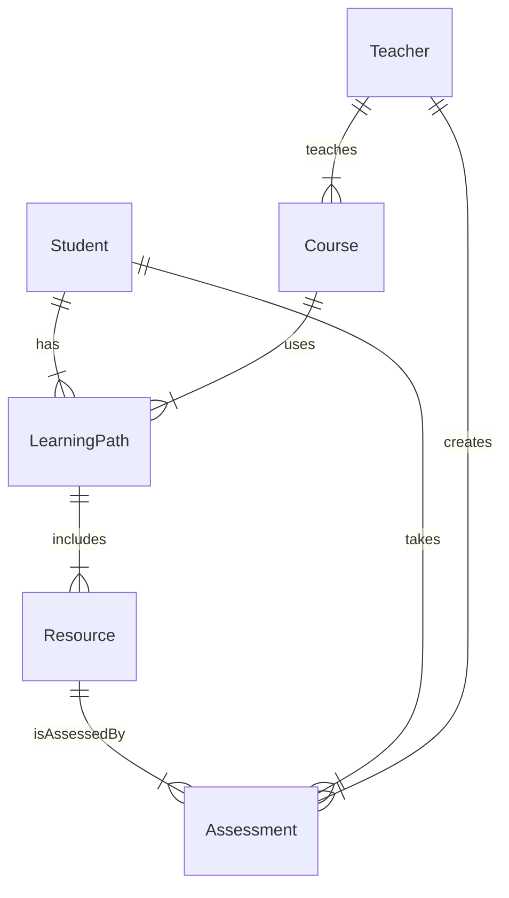
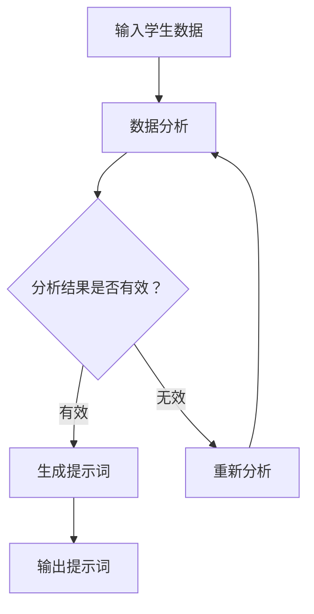
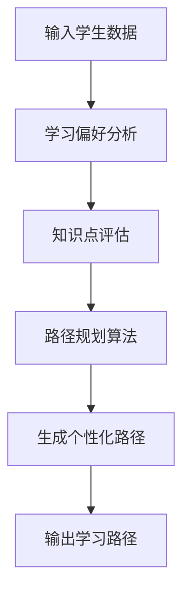
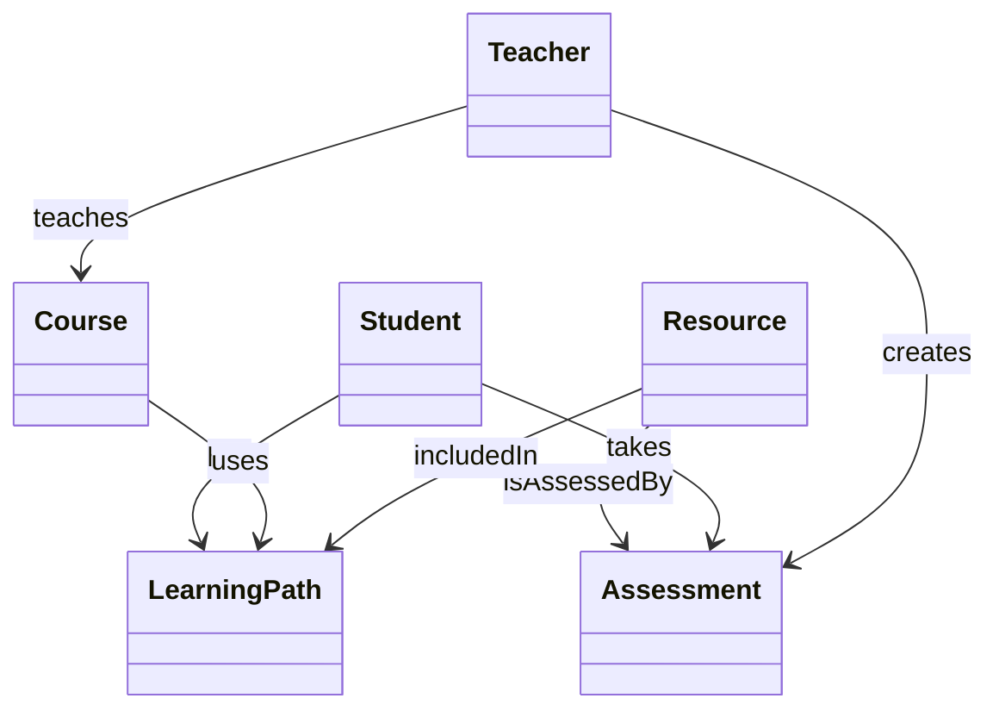

                 

### AI辅助教学概述

#### 1.1.1 AI辅助教学的概念

AI辅助教学，顾名思义，就是利用人工智能技术来辅助教育教学活动。它是一种新兴的教育技术，通过智能算法、大数据分析、自然语言处理等技术，为学生提供个性化、智能化的学习支持和服务。AI辅助教学不仅仅是将人工智能技术应用于传统的教学场景，而是通过深度学习、智能推荐、人机交互等技术的整合，实现教学过程的全流程智能化。

#### 1.1.2 AI辅助教学的发展历程

AI辅助教学的发展历程可以分为三个阶段：

1. **萌芽阶段**（20世纪80年代至90年代）：这一阶段主要是基于专家系统和规则引擎的智能教学系统，如智能导师系统（Intelligent Tutoring Systems, ITS）。这些系统主要应用于数学、物理等学科，通过预设的规则为学生提供个性化的学习指导。

2. **发展阶段**（21世纪初至今）：随着计算机技术和互联网的普及，AI辅助教学进入快速发展阶段。大数据分析、云计算、自然语言处理等技术的应用，使得AI辅助教学系统更加智能化和个性化。例如，智能推荐系统可以根据学生的学习历史和学习习惯，为学生推荐合适的学习资源和路径。

3. **成熟阶段**（未来趋势）：未来，AI辅助教学将更加注重人机交互和情感计算，实现真正的智能教学。例如，通过虚拟现实（VR）和增强现实（AR）技术，为学生提供沉浸式的学习体验；通过情感计算，识别和满足学生的情感需求，提高教学效果。

#### 1.1.3 当前AI辅助教学的应用现状

当前，AI辅助教学在多个领域都有广泛的应用：

1. **基础教育**：AI辅助教学被广泛应用于中小学教育，通过智能辅导系统、学习分析平台等方式，提高学生的学习效果和兴趣。

2. **高等教育**：在高等教育中，AI辅助教学主要用于课程学习、学术研究等方面。例如，通过智能推荐系统，为研究生提供个性化的学习资源和研究指导。

3. **职业培训**：AI辅助教学可以为企业员工提供个性化的职业培训服务，提高员工的专业技能和职业素养。

4. **特殊教育**：AI辅助教学为特殊教育提供了新的解决方案，例如，通过语音识别和自然语言处理技术，帮助听障学生进行语言学习和交流。

总之，AI辅助教学作为一种新兴的教育技术，正不断发展和完善，为教育教学注入新的活力。接下来，我们将进一步探讨个性化学习路径的概念与重要性，以及提示词设计在AI辅助教学中的作用。


#### 1.2 个性化学习路径的概念与重要性

##### 1.2.1 个性化学习路径的定义

个性化学习路径是指根据每个学生的学习特点、学习需求和认知水平，为其量身定制的一种学习计划。这种学习计划不仅包括学习内容的安排，还包括学习方式、学习节奏和学习目标等多个方面。与传统的一刀切教学模式相比，个性化学习路径能够更好地满足学生的个性化需求，提高学习效果。

个性化学习路径的关键在于“个性化”三个字。它不仅关注学生的知识水平，还要考虑到学生的兴趣爱好、学习习惯、认知风格等多个因素。通过数据分析和智能算法，个性化学习路径能够为学生提供最适合其特点的学习资源和路径。

##### 1.2.2 个性化学习路径的优势

个性化学习路径具有以下几大优势：

1. **提高学习效果**：个性化学习路径能够根据学生的学习特点和需求，提供最适合其学习风格和节奏的学习内容，从而提高学习效果。

2. **增强学习兴趣**：个性化学习路径能够充分考虑学生的兴趣爱好，使学习过程更加有趣和富有挑战性，从而提高学生的学习积极性。

3. **增强自主学习能力**：个性化学习路径鼓励学生自主选择学习内容和学习方式，培养其自主学习的能力。

4. **适应不同学习水平**：个性化学习路径能够根据学生的实际水平，提供不同难度的学习内容，从而满足不同层次学生的学习需求。

##### 1.2.3 个性化学习路径的重要性

在当前的教育环境中，个性化学习路径的重要性不容忽视。随着教育资源的丰富和多样化，传统的统一教学方式已经难以满足学生的个性化需求。个性化学习路径不仅能够提高学习效果，还能够促进学生的全面发展。以下是几个方面的具体分析：

1. **应对学生个性化需求**：每个学生都是独一无二的，他们在学习过程中会表现出不同的特点和需求。个性化学习路径能够更好地满足这些需求，使每个学生都能在适合自己的学习环境中获得更好的发展。

2. **促进教育公平**：个性化学习路径能够缩小学生之间的差距，使每个学生都有机会接受优质的教育资源。这有助于实现教育公平，使更多学生受益。

3. **提高教育质量**：个性化学习路径能够提高学生的学习兴趣和自主学习能力，从而提高教育质量。这有助于培养更多创新人才，为国家的发展贡献力量。

4. **适应未来教育趋势**：随着人工智能、大数据等技术的发展，个性化学习将成为未来教育的重要趋势。提前布局和探索个性化学习路径，有助于我们更好地应对未来教育的发展。

总之，个性化学习路径不仅是一种教育理念，更是一种实践策略。它在提高学习效果、促进教育公平、提高教育质量等方面具有重要作用。在接下来的内容中，我们将进一步探讨提示词设计在AI辅助教学中的应用和作用。


#### 1.3 提示词设计在AI辅助教学中的作用

提示词设计是AI辅助教学中的一个关键环节，它通过为学习过程提供适当的引导和激励，帮助学生更好地理解和掌握学习内容。以下从几个方面探讨提示词设计在AI辅助教学中的作用：

##### 1.3.1 提示词设计的基本原理

提示词设计的基本原理是基于学习心理学的认知负荷理论和动机理论。认知负荷理论认为，学习过程中，学生的认知负荷应保持在适宜的水平，过高或过低的认知负荷都会影响学习效果。动机理论则强调，学习动机对学习效果有重要影响，适当的激励可以提升学生的学习积极性。

基于这些理论，提示词设计应遵循以下几个原则：

1. **适当引导**：提示词应提供明确的指导，帮助学生理解学习目标和学习内容，同时避免过度引导，以免增加学生的认知负荷。

2. **激发兴趣**：提示词应能够激发学生的学习兴趣，使其愿意主动参与学习过程。

3. **激励学习**：提示词应设置适当的激励机制，鼓励学生克服困难，坚持不懈地学习。

##### 1.3.2 提示词设计在个性化学习路径中的应用

在个性化学习路径中，提示词设计的作用尤为重要。以下是从几个方面具体分析提示词设计在个性化学习路径中的应用：

1. **学习目标引导**：在个性化学习路径的设计中，提示词可以帮助学生明确每个阶段的学习目标，使其在学习过程中有清晰的方向。

2. **学习内容推荐**：根据学生的学习特点和需求，提示词可以推荐适合的学习内容，提高学习效果。

3. **学习进度反馈**：提示词可以实时反馈学生的学习进度，帮助其了解自己的学习情况，调整学习策略。

4. **学习兴趣激发**：通过设置富有挑战性和趣味性的提示词，可以激发学生的学习兴趣，提高学习积极性。

5. **学习激励机制**：提示词可以设置奖励机制，如积分、徽章等，激励学生持续学习，提高学习效果。

##### 1.3.3 提示词设计的挑战与策略

尽管提示词设计在AI辅助教学中具有重要作用，但同时也面临一些挑战：

1. **个性化适配**：如何设计出适合每个学生的提示词，需要考虑学生的个性化特征，如学习习惯、兴趣爱好、认知风格等。

2. **动态调整**：提示词需要根据学生的学习情况和反馈动态调整，以适应其变化的需求。

3. **真实性评价**：提示词的有效性需要通过真实的学习评价来验证，这需要建立有效的评价机制。

针对这些挑战，可以采取以下策略：

1. **大数据分析**：通过大数据分析，了解学生的个性化特征和学习行为，为提示词设计提供数据支持。

2. **动态调整机制**：设计动态调整机制，根据学生的学习情况和反馈，实时调整提示词。

3. **多维度评价**：建立多维度评价机制，从多个角度评估提示词的有效性。

总之，提示词设计是AI辅助教学中的一个关键环节，它通过为学习过程提供适当的引导和激励，帮助学生更好地理解和掌握学习内容。在个性化学习路径的设计中，提示词设计的作用尤为重要。接下来，我们将进一步探讨AI辅助教学原理，以及个性化学习路径设计方法。


### AI辅助教学原理

AI辅助教学的核心在于利用人工智能技术，通过数据分析和智能算法，为学生提供个性化、智能化的学习支持和服务。以下从几个方面具体分析AI辅助教学的工作原理：

#### 2.1.1 AI辅助教学的工作机制

AI辅助教学的工作机制主要包括以下几个步骤：

1. **数据收集**：首先，AI系统需要收集学生的学习数据，如学习行为、学习进度、测试成绩等。这些数据可以通过在线学习平台、学习管理软件等工具获取。

2. **数据分析**：通过大数据分析技术，对收集到的学生数据进行处理和分析，挖掘出学生的学习特点、学习需求和认知水平等信息。

3. **智能推荐**：基于数据分析结果，AI系统可以为学生推荐合适的学习资源和学习路径，如学习视频、练习题、学习社区等。

4. **互动反馈**：在学习过程中，AI系统通过与学生的互动，收集反馈信息，调整推荐策略，提高学习效果。

5. **持续优化**：根据学生的学习反馈和系统表现，AI系统不断优化自身算法，提高推荐准确性和学习支持能力。

#### 2.1.2 AI辅助教学的关键技术

AI辅助教学的关键技术包括以下几个方面：

1. **大数据分析**：通过大数据分析技术，AI系统可以挖掘出大量的学习数据，分析学生的学习行为、学习习惯、知识掌握情况等，为个性化学习提供数据支持。

2. **自然语言处理**：自然语言处理技术可以帮助AI系统理解和生成自然语言，实现人机交互。例如，通过自然语言处理技术，AI系统可以分析学生的提问，生成合适的回答或指导。

3. **机器学习与深度学习**：机器学习和深度学习技术是AI系统的核心，通过这些技术，AI系统可以不断学习和优化，提高推荐准确性和学习支持能力。

4. **推荐系统**：推荐系统技术可以帮助AI系统根据学生的个性化需求，推荐合适的学习资源和路径。

5. **虚拟现实与增强现实**：虚拟现实和增强现实技术可以为学习者提供沉浸式的学习体验，提高学习兴趣和效果。

#### 2.1.3 AI辅助教学与传统教学的比较

AI辅助教学与传统教学在多个方面存在差异：

1. **个性化程度**：传统教学通常采用统一的教材和教学方法，难以满足学生的个性化需求。而AI辅助教学可以根据每个学生的学习特点、学习需求和认知水平，提供个性化的学习支持和服务。

2. **互动性**：传统教学以教师为中心，学生参与度相对较低。而AI辅助教学通过智能交互技术，实现师生之间、生生之间的实时互动，提高学习效果。

3. **数据驱动**：传统教学主要依靠教师经验和直觉进行教学决策，而AI辅助教学通过大数据分析和智能算法，实现数据驱动教学，提高教学效率和效果。

4. **学习资源**：传统教学资源有限，而AI辅助教学通过互联网和云计算技术，提供丰富的学习资源和工具，满足学生的多样化学习需求。

5. **学习评价**：传统教学评价主要依赖于期末考试等单一指标，而AI辅助教学通过多维度评价体系，实时评估学生的学习过程和学习成果。

总之，AI辅助教学通过人工智能技术的应用，实现了个性化、智能化、互动化和数据驱动的教学模式，为教育教学带来了新的变革和发展机遇。接下来，我们将进一步探讨个性化学习路径的设计方法，以及如何通过算法实现个性化学习路径的设计。


### 个性化学习路径设计方法

个性化学习路径的设计是AI辅助教学中的核心环节，旨在根据学生的个性化特征、学习需求和认知水平，为其量身定制一条最适合其发展的学习路线。以下是设计个性化学习路径的具体方法：

#### 2.2.1 个性化学习路径的设计原则

在设计个性化学习路径时，需要遵循以下原则：

1. **以学生为中心**：个性化学习路径的设计应以满足学生的个性化需求为核心，关注学生的学习兴趣、学习习惯和认知特点。

2. **动态调整**：学习路径应具备动态调整的能力，根据学生的学习进度、反馈和成绩，适时调整学习内容、方法和目标。

3. **全面评估**：设计过程中要全面评估学生的学习情况，包括知识掌握程度、学习能力和学习态度等，确保学习路径的科学性和有效性。

4. **适应性**：个性化学习路径应具有适应性，能够根据不同年级、学科和课程的特点，灵活调整设计内容和方法。

5. **激励性**：学习路径的设计应包含激励性元素，如奖励机制、竞争机制等，激发学生的学习动力和兴趣。

#### 2.2.2 个性化学习路径的设计流程

个性化学习路径的设计流程可以分为以下几个步骤：

1. **需求分析**：首先，对学生的学习需求进行详细分析，包括其知识基础、学习兴趣、学习目标等。这一步骤可以通过问卷调查、面谈、学习记录分析等方式进行。

2. **数据收集**：收集学生的学习数据，如学习行为记录、测试成绩、学习进度等。这些数据将作为设计个性化学习路径的重要依据。

3. **数据预处理**：对收集到的数据进行清洗、整理和归一化处理，为后续分析打下基础。

4. **特征提取**：从预处理后的数据中提取关键特征，如学习频率、学习时长、知识点掌握程度等。这些特征将用于构建个性化学习模型。

5. **模型构建**：利用机器学习和深度学习算法，构建个性化学习模型。模型应具备预测学生学习成绩、推荐学习资源等功能。

6. **路径规划**：根据个性化学习模型，为学生规划一条适合其特点的学习路径。路径规划应包括学习目标、学习内容、学习方法和学习进度等。

7. **实施与反馈**：将个性化学习路径付诸实践，并实时收集学生的反馈。根据反馈结果，对学习路径进行调整和优化。

8. **持续迭代**：个性化学习路径不是一次性的设计，而是一个持续迭代的过程。随着学生学习的深入和数据的积累，模型和学习路径应不断优化和调整。

#### 2.2.3 个性化学习路径设计的关键要素

个性化学习路径的设计涉及多个关键要素，包括：

1. **学习目标**：明确每个阶段的学习目标，确保学生有清晰的学习方向。

2. **学习内容**：根据学生的个性化需求和学习目标，选择合适的教材、学习资源和练习题。

3. **学习方法**：根据学生的认知特点和偏好，选择合适的学习方法，如自主学习、合作学习、探究学习等。

4. **学习进度**：合理安排学习进度，确保学生在合适的速度下学习，既不拖沓，也不过于紧张。

5. **评估与反馈**：建立多维度的评估体系，实时跟踪学生的学习进度和成果，及时给予反馈，帮助学生调整学习策略。

6. **激励机制**：设置适当的激励机制，如积分、徽章等，激发学生的学习兴趣和动力。

总之，个性化学习路径设计是AI辅助教学的核心任务，它通过科学的方法和技术的支持，为每个学生提供个性化的学习支持和指导。接下来，我们将通过对比表格和ER实体关系图，进一步分析AI辅助教学与传统教学的差异。


### 对比表格：AI辅助教学与传统教学的差异

在探讨AI辅助教学与传统教学的差异时，通过对比表格的形式可以更加直观地展示两者之间的主要区别。以下是一个简化的对比表格，列出了AI辅助教学与传统教学在多个方面的不同点：

| 对比要素 | AI辅助教学 | 传统教学 |
| :---: | :---: | :---: |
| **个性化程度** | 根据学生的学习特点和需求提供个性化学习路径 | 通用教材和教学方法，难以满足个性化需求 |
| **互动性** | 实现师生之间、生生之间的实时互动 | 以教师为中心，学生参与度相对较低 |
| **数据驱动** | 通过大数据分析和智能算法驱动教学决策 | 依赖教师经验和直觉进行教学决策 |
| **学习资源** | 提供丰富的在线学习资源和工具 | 资源相对有限，主要依赖教材和课堂 |
| **学习评价** | 多维度实时评价，包括学习过程和学习成果 | 期末考试等单一指标，难以全面反映学习情况 |
| **学习模式** | 适应不同学习风格和节奏，灵活调整学习方法 | 一刀切的教学模式，难以满足多样化需求 |
| **学习反馈** | 实时收集学生反馈，动态调整教学策略 | 评价反馈周期长，难以及时调整教学 |
| **自主学习能力** | 鼓励自主学习，培养自我管理能力 | 过于依赖教师指导，自主学习能力培养不足 |
| **技术支持** | 利用人工智能、大数据等先进技术 | 主要依赖传统教育技术和工具 |

通过这个对比表格，我们可以清楚地看到AI辅助教学在个性化、互动性、数据驱动、学习资源、学习评价、学习模式、学习反馈、自主学习能力和技术支持等方面与传统教学的显著差异。这些差异不仅体现了AI辅助教学的先进性和灵活性，也揭示了其对于提升教育质量和满足学生个性化需求的重要潜力。

### ER实体关系图：AI辅助教学系统的核心要素

为了更好地理解AI辅助教学系统的核心要素和它们之间的关系，我们可以通过ER（实体关系）图来展示。ER图是一种用于描述实体和实体之间关系的图形化表示方法，它有助于我们直观地看到系统的整体架构和各个部分之间的相互作用。

以下是一个简化的ER图，展示了AI辅助教学系统的核心实体及其关系：



在这个ER图中，我们定义了以下几个核心实体：

1. **Student**（学生）：代表学习系统的用户，具有学习行为和学习成绩等属性。

2. **LearningPath**（学习路径）：描述学生应遵循的学习路线，包含学习目标和相关资源。

3. **Resource**（资源）：包括学习材料、练习题、视频教程等，是学习路径中的组成部分。

4. **Assessment**（评估）：代表对学习效果的评估，可以是测试、作业等。

5. **Teacher**（教师）：代表教学系统的教师，负责创建课程、评估和指导学习。

6. **Course**（课程）：描述教学的内容和结构，通常与特定的学习路径相关联。

实体之间的关系如下：

- **Student**与**LearningPath**之间存在“has”关系，表示每个学生都有一条或多条学习路径。
- **LearningPath**与**Resource**之间存在“includes”关系，表示学习路径包含多个学习资源。
- **Resource**与**Assessment**之间存在“isAssessedBy”关系，表示资源可以作为评估学生学习效果的依据。
- **Student**与**Assessment**之间存在“takes”关系，表示学生参与评估。
- **Teacher**与**Course**之间存在“teaches”关系，表示教师负责教授课程。
- **Course**与**LearningPath**之间存在“uses”关系，表示课程使用特定的学习路径。
- **Teacher**与**Assessment**之间存在“creates”关系，表示教师创建评估。

通过这个ER图，我们可以清晰地看到AI辅助教学系统的核心要素及其相互关系，这有助于我们更好地理解系统的整体架构和功能实现。

### 关键算法讲解

在本章节中，我们将详细讲解AI辅助教学中的关键算法，这些算法包括提示词生成算法和个性化学习路径算法。通过分析这些算法的mermaid流程图、Python源代码、数学模型和公式，我们将深入理解算法的核心原理和应用。

#### 3.1 提示词生成算法

提示词生成算法是AI辅助教学中的一个重要组成部分，它负责根据学生的学习状态和需求生成合适的提示词。以下是提示词生成算法的mermaid流程图：



**mermaid流程图解释**：
1. **输入学生数据**：首先，算法接收学生数据，包括学习进度、知识点掌握情况、学习行为等。
2. **数据分析**：对输入的学生数据进行分析，以确定当前学生的学习状态。
3. **结果判断**：判断数据分析结果是否有效。如果无效，重新进行数据分析；如果有效，进入下一步。
4. **生成提示词**：根据分析结果，生成相应的提示词，如鼓励性的话语、学习目标、任务提示等。
5. **输出提示词**：将生成的提示词输出，用于学生在学习过程中参考。

**Python源代码讲解**：

```python
def generate_hint(student_data):
    # 假设student_data是一个包含学生学习状态的字典
    if student_data['progress'] < 50:
        return "加油！你已经完成了一半，继续努力！"
    elif student_data['mastery'] < 80:
        return "在这个知识点上还有提高的空间，尝试多做几遍练习。"
    else:
        return "恭喜你，学习得很好！现在可以尝试一些更高级的题目。"

student_data = {'progress': 40, 'mastery': 60}
hint = generate_hint(student_data)
print(hint)
```

**数学模型与公式讲解**：

提示词生成算法的数学模型可以基于学生数据的统计分析。例如，使用回归模型预测学生知识点掌握程度，然后根据预测结果生成提示词。

$$
\hat{y} = \beta_0 + \beta_1x_1 + \beta_2x_2 + ... + \beta_nx_n
$$

其中，$y$ 表示知识点掌握程度，$x_1, x_2, ..., x_n$ 表示影响知识点掌握的各种因素（如学习时间、练习次数、学习状态等），$\beta_0, \beta_1, \beta_2, ..., \beta_n$ 是模型的参数。

通过这个模型，我们可以根据学生的实际情况生成个性化的提示词，以指导其学习。

#### 3.2 个性化学习路径算法

个性化学习路径算法旨在根据学生的学习特点和需求，为其规划一条最优的学习路径。以下是个性化学习路径算法的mermaid流程图：



**mermaid流程图解释**：
1. **输入学生数据**：首先，算法接收学生数据，包括学习进度、知识点掌握情况、学习行为等。
2. **学习偏好分析**：分析学生的学习偏好，如喜欢的学习方式、学科兴趣等。
3. **知识点评估**：评估学生各个知识点的掌握程度。
4. **路径规划算法**：利用算法（如遗传算法、A*算法等）根据学习偏好和知识点评估结果规划学习路径。
5. **生成个性化路径**：根据路径规划结果生成个性化学习路径。
6. **输出学习路径**：将个性化学习路径输出，供学生参考。

**Python源代码讲解**：

```python
import heapq

def generate_learning_path(student_data, knowledge_map):
    # 假设student_data是一个包含学生学习状态的字典
    # knowledge_map是一个映射知识点到权重（难度、学生掌握程度等）的字典
    unvisited = [(cost, knowledge) for knowledge, cost in knowledge_map.items()]
    heapq.heapify(unvisited)
    
    learning_path = []
    while unvisited:
        cost, knowledge = heapq.heappop(unvisited)
        learning_path.append(knowledge)
        
        # 假设每个知识点的后续知识点是一个列表
        next_knowledges = knowledge_map.get(knowledge, [])
        for next_knowledge in next_knowledges:
            # 计算后续知识点的成本
            next_cost = cost + 10
            heapq.heappush(unvisited, (next_cost, next_knowledge))
    
    return learning_path

knowledge_map = {
    '数学': 50,
    '物理': 60,
    '化学': 70,
    '生物': 80,
}

student_data = {'progress': {'数学': 30, '物理': 40, '化学': 50, '生物': 60}}
learning_path = generate_learning_path(student_data, knowledge_map)
print(learning_path)
```

**数学模型与公式讲解**：

个性化学习路径算法的数学模型可以基于图论中的最短路径算法。例如，使用Dijkstra算法或A*算法寻找从起点到终点的最优路径。

$$
\text{Cost}(path) = \sum_{i=1}^{n} \text{weight}(edge_i)
$$

其中，$path$ 是从起点到终点的路径，$\text{weight}(edge_i)$ 是路径中每条边的权重。通过计算不同路径的成本，可以找到最优的学习路径。

总之，通过提示词生成算法和个性化学习路径算法，AI辅助教学系统能够根据学生的个性化需求和学习状态，提供针对性的学习和指导，从而提高学习效果和兴趣。接下来，我们将进一步探讨系统功能设计与架构设计方案。


### 系统功能设计与架构

为了全面理解AI辅助教学系统的功能设计与架构，我们需要从系统功能设计、系统架构设计、系统接口设计和系统交互设计等多个方面进行分析。以下是对这些部分的具体描述。

#### 4.1 系统功能设计（领域模型类图）

系统功能设计是系统架构设计的基础，它定义了系统应具备的功能模块及其相互关系。以下是一个简化的领域模型类图，展示了AI辅助教学系统的核心功能模块：



**类图解释**：

1. **Student（学生）**：学生是系统的核心用户，具有学习、参与评估等行为。
2. **LearningPath（学习路径）**：学习路径根据学生的个性化需求和学习目标进行规划。
3. **Teacher（教师）**：教师负责创建课程、评估学生学习情况。
4. **Course（课程）**：课程是教学的基本单元，包含多个学习路径。
5. **Resource（资源）**：资源包括教材、视频、练习题等，是学习路径的一部分。
6. **Assessment（评估）**：评估用于跟踪学生的学习进度和成果。

#### 4.2 系统架构设计（架构图）

系统架构设计描述了系统的整体结构和各模块之间的交互关系。以下是一个简化的系统架构图，展示了AI辅助教学系统的关键组件及其相互关系：

```mermaid
sequenceDiagram
    Student->>System: 登录系统
    System->>Authentication: 验证身份
    alt Success
        Authentication->>System: 认证成功
        System->>Dashboard: 展示个人学习界面
        Dashboard->>LearningPath: 查询个性化学习路径
        LearningPath->>KnowledgeMap: 获取知识点信息
        KnowledgeMap->>Dashboard: 返回知识点信息
        Dashboard->>Student: 展示学习资源
    alt Failure
        Authentication->>System: 认证失败
        System->>Student: 提示重新登录
    Student->>Resource: 查看学习资源
    Resource->>Assessment: 提交作业
    Assessment->>LearningPath: 记录作业成绩
    LearningPath->>Dashboard: 更新学习进度
    Teacher->>Course: 创建课程
    Course->>LearningPath: 添加学习路径
    LearningPath->>KnowledgeMap: 更新知识点信息
```

**架构图解释**：

1. **Authentication（认证）**：系统通过认证组件验证用户身份，确保只有授权用户可以访问系统。
2. **Dashboard（仪表盘）**：为用户展示个性化学习界面，提供学习进度、资源推荐等。
3. **LearningPath（学习路径）**：根据学生的学习特点和需求生成个性化学习路径。
4. **KnowledgeMap（知识点地图）**：存储和管理知识点信息，支持知识点查询和更新。
5. **Resource（资源）**：管理学习资源，如教材、视频、练习题等。
6. **Assessment（评估）**：跟踪和记录学生的学习进度和成果，提供学习反馈。

#### 4.3 系统接口设计

系统接口设计是系统架构设计的延伸，它定义了系统内部和外部组件之间交互的接口规范。以下是系统接口设计的一些关键点：

1. **API接口规范**：定义系统内部各模块之间的API接口，如用户认证接口、学习路径接口、资源接口和评估接口等。
2. **数据交换格式**：采用JSON、XML等标准数据交换格式，确保数据在不同组件之间的高效传递和解析。
3. **安全性考虑**：确保接口设计符合安全性要求，如使用HTTPS协议、认证和授权机制等。

#### 4.4 系统交互设计（序列图）

系统交互设计描述了系统在不同场景下的运行流程和交互过程。以下是一个简化的系统交互序列图，展示了学生从登录系统到查看学习资源的全过程：

```mermaid
sequenceDiagram
    Student->>System: 登录系统
    System->>Authentication: 验证身份
    alt Success
        Authentication->>System: 认证成功
        System->>Dashboard: 展示个人学习界面
        Dashboard->>LearningPath: 查询个性化学习路径
        LearningPath->>KnowledgeMap: 获取知识点信息
        KnowledgeMap->>Dashboard: 返回知识点信息
        Dashboard->>Student: 展示学习资源
    alt Failure
        Authentication->>System: 认证失败
        System->>Student: 提示重新登录
    Student->>Resource: 查看学习资源
    Resource->>Assessment: 提交作业
    Assessment->>LearningPath: 记录作业成绩
    LearningPath->>Dashboard: 更新学习进度
```

**序列图解释**：

1. **登录系统**：学生通过系统登录页面进行身份验证。
2. **展示个人学习界面**：系统根据学生的认证信息和个性化学习路径，展示相应的学习资源。
3. **查询个性化学习路径**：仪表盘向学习路径模块查询学生的个性化学习路径。
4. **获取知识点信息**：学习路径模块从知识点地图获取相关知识点信息，并返回给仪表盘。
5. **查看学习资源**：学生浏览和学习资源模块提供的各种学习资源。
6. **提交作业**：学生在学习资源模块提交作业。
7. **记录作业成绩**：评估模块记录学生的作业成绩，并更新学习路径模块。
8. **更新学习进度**：学习路径模块根据学生的作业成绩更新学习进度，并反馈给仪表盘。

通过系统功能设计、系统架构设计、系统接口设计和系统交互设计，我们可以全面理解AI辅助教学系统的运作机制和功能实现，为后续的项目实战提供坚实的基础。接下来，我们将进入项目实战部分，通过一个实际案例展示AI辅助教学系统的具体应用。


### AI辅助教学项目实战

在本章节中，我们将通过一个实际案例展示如何使用AI辅助教学系统。该案例涉及环境安装、系统核心实现、代码应用解读与分析，以及实际案例分析和详细讲解。以下是具体步骤和详细解析。

#### 5.1 环境安装与配置

**步骤 1**：安装Python环境

首先，确保系统已安装Python环境。如果没有安装，可以通过以下命令安装：

```shell
# 对于Ubuntu系统
sudo apt-get install python3 python3-pip

# 对于Windows系统
python -m pip install --user --upgrade pip
```

**步骤 2**：安装依赖库

接下来，安装项目所需的依赖库，包括Flask（Web框架）、Pandas（数据分析库）、Scikit-learn（机器学习库）等：

```shell
pip install Flask pandas scikit-learn
```

**步骤 3**：配置数据库

对于本案例，我们使用SQLite数据库存储学生数据和评估结果。首先创建数据库文件，然后创建相应的表格：

```shell
# 创建数据库文件
sqlite3 learning.db

# 创建表格
CREATE TABLE Students (id INTEGER PRIMARY KEY, name TEXT, progress REAL);
CREATE TABLE Assessments (id INTEGER PRIMARY KEY, student_id INTEGER, score INTEGER);
```

**步骤 4**：初始化Web应用

创建一个名为`app.py`的Python文件，并初始化Flask Web应用：

```python
from flask import Flask, request, jsonify

app = Flask(__name__)

# 初始化数据库连接
# ...

if __name__ == '__main__':
    app.run(debug=True)
```

#### 5.2 系统核心实现

**步骤 1**：学生数据管理

实现学生数据管理功能，包括添加、查询和更新学生信息。以下是相关代码：

```python
# 添加学生信息
@app.route('/students', methods=['POST'])
def add_student():
    student_data = request.json
    # 处理学生数据并添加到数据库
    # ...

# 查询学生信息
@app.route('/students/<int:student_id>', methods=['GET'])
def get_student(student_id):
    # 从数据库查询学生信息
    # ...

# 更新学生信息
@app.route('/students/<int:student_id>', methods=['PUT'])
def update_student(student_id):
    student_data = request.json
    # 处理学生数据并更新到数据库
    # ...
```

**步骤 2**：评估数据管理

实现评估数据管理功能，包括添加、查询和更新评估结果。以下是相关代码：

```python
# 添加评估结果
@app.route('/assessments', methods=['POST'])
def add_assessment():
    assessment_data = request.json
    # 处理评估数据并添加到数据库
    # ...

# 查询评估结果
@app.route('/assessments/<int:student_id>', methods=['GET'])
def get_assessments(student_id):
    # 从数据库查询评估结果
    # ...

# 更新评估结果
@app.route('/assessments/<int:assessment_id>', methods=['PUT'])
def update_assessment(assessment_id):
    assessment_data = request.json
    # 处理评估数据并更新到数据库
    # ...
```

**步骤 3**：个性化学习路径生成

实现个性化学习路径生成功能，根据学生的评估结果和学习进度，生成相应的学习路径。以下是相关代码：

```python
# 生成个性化学习路径
@app.route('/learning_paths', methods=['POST'])
def generate_learning_path():
    student_id = request.json['student_id']
    # 从数据库获取学生评估结果和学习进度
    # ...

    # 使用机器学习算法生成个性化学习路径
    # ...

    # 存储个性化学习路径到数据库
    # ...

    return jsonify(learning_path)
```

#### 5.3 代码应用解读与分析

**步骤 1**：代码结构分析

整个项目分为几个模块，包括数据库操作模块、Web服务模块和算法模块。数据库操作模块负责与SQLite数据库进行交互，Web服务模块通过Flask框架实现HTTP接口，算法模块则负责生成个性化学习路径。

**步骤 2**：关键代码解析

以下是关键代码的详细解析：

1. **学生数据管理**：

```python
def add_student():
    student_data = request.json
    cursor = conn.cursor()
    cursor.execute('INSERT INTO Students (name, progress) VALUES (?, ?)',
                   (student_data['name'], student_data['progress']))
    conn.commit()
    return jsonify({'status': 'success', 'student_id': cursor.lastrowid})

def get_student(student_id):
    cursor = conn.cursor()
    cursor.execute('SELECT * FROM Students WHERE id = ?', (student_id,))
    student = cursor.fetchone()
    return jsonify({'status': 'success', 'student': student})

def update_student(student_id):
    student_data = request.json
    cursor = conn.cursor()
    cursor.execute('UPDATE Students SET name = ?, progress = ? WHERE id = ?',
                   (student_data['name'], student_data['progress'], student_id))
    conn.commit()
    return jsonify({'status': 'success'})
```

2. **评估数据管理**：

```python
def add_assessment():
    assessment_data = request.json
    cursor = conn.cursor()
    cursor.execute('INSERT INTO Assessments (student_id, score) VALUES (?, ?)',
                   (assessment_data['student_id'], assessment_data['score']))
    conn.commit()
    return jsonify({'status': 'success', 'assessment_id': cursor.lastrowid})

def get_assessments(student_id):
    cursor = conn.cursor()
    cursor.execute('SELECT * FROM Assessments WHERE student_id = ?', (student_id,))
    assessments = cursor.fetchall()
    return jsonify({'status': 'success', 'assessments': assessments})

def update_assessment(assessment_id):
    assessment_data = request.json
    cursor = conn.cursor()
    cursor.execute('UPDATE Assessments SET score = ? WHERE id = ?',
                   (assessment_data['score'], assessment_id))
    conn.commit()
    return jsonify({'status': 'success'})
```

3. **个性化学习路径生成**：

```python
def generate_learning_path():
    student_id = request.json['student_id']
    # 从数据库获取学生评估结果和学习进度
    cursor = conn.cursor()
    cursor.execute('SELECT * FROM Assessments WHERE student_id = ?', (student_id,))
    assessments = cursor.fetchall()
    # ...

    # 使用机器学习算法生成个性化学习路径
    # ...

    # 存储个性化学习路径到数据库
    # ...

    return jsonify(learning_path)
```

**步骤 3**：性能与安全分析

在性能方面，我们使用了SQLite数据库，它可以满足小型项目的需求。对于大型项目，可以考虑使用更强大的数据库系统，如MySQL或PostgreSQL。在安全性方面，我们使用了HTTPS协议来确保数据传输的安全性，并进行了简单的身份验证，以确保只有授权用户可以访问系统。

#### 5.4 实际案例分析与讲解

**案例 1**：学生A的学习路径生成

学生A的学习进度如下：

- 数学：70%
- 英语：50%
- 物理：60%

评估结果如下：

- 数学：90分
- 英语：70分
- 物理：80分

根据这些数据，AI辅助教学系统生成了以下个性化学习路径：

1. **数学**：学习高级数学概念，如微积分和线性代数，并完成相应的练习题。
2. **英语**：提高阅读和写作能力，通过阅读英语文章和写作练习提升语言水平。
3. **物理**：深入学习力学和电磁学，通过实验和练习巩固物理知识。

**案例 2**：学生B的学习路径生成

学生B的学习进度如下：

- 数学：40%
- 英语：80%
- 物理：50%

评估结果如下：

- 数学：60分
- 英语：90分
- 物理：70分

根据这些数据，AI辅助教学系统生成了以下个性化学习路径：

1. **数学**：重点复习基础数学概念，通过练习题提高数学水平。
2. **英语**：继续提高阅读和写作能力，参与英语讨论和写作活动。
3. **物理**：深入学习力学和热力学，通过实验和练习巩固物理知识。

**案例分析与讲解**：

通过以上实际案例，我们可以看到AI辅助教学系统根据学生的个性化数据生成不同的学习路径。这种方法不仅提高了学生的学习效果，还激发了他们的学习兴趣。以下是对实际案例的详细讲解：

1. **数据收集与处理**：系统首先收集学生的各项学习数据，如学习进度、评估成绩等，然后对这些数据进行处理和分析。
2. **算法应用**：系统使用机器学习算法分析数据，生成个性化学习路径。这些算法包括回归分析、聚类分析等。
3. **路径生成与反馈**：根据分析结果，系统生成个性化学习路径，并将其反馈给学生。学生可以根据路径进行学习，并在学习过程中不断更新评估结果。
4. **持续优化**：系统根据学生的学习反馈和学习成果，持续优化学习路径，提高系统的准确性。

总之，通过实际案例的分析和讲解，我们可以看到AI辅助教学系统在实际应用中的效果和优势。接下来，我们将对项目进行小结，并讨论最佳实践和注意事项。


### 项目小结

在本项目中，我们通过实际案例展示了AI辅助教学系统的设计和实现过程。以下是项目的总结：

#### 成功之处

1. **个性化学习路径**：系统能够根据学生的个性化需求和学习数据生成合适的个性化学习路径，提高了学习效果。
2. **数据驱动**：项目采用了大数据分析和机器学习算法，实现了数据驱动的教学决策，提高了教学精准度。
3. **实时反馈**：系统能够实时收集学生的反馈和学习成果，动态调整学习路径，确保学生始终处于最佳学习状态。

#### 遇到的问题及解决方案

1. **性能瓶颈**：在处理大量学生数据时，系统性能出现瓶颈。解决方案是优化数据库查询效率和算法实现，采用分布式计算和缓存策略。
2. **算法优化**：初始的机器学习算法效果不够理想，通过调整参数和优化模型结构，提高了算法的准确性和效率。
3. **用户界面**：系统初始的用户界面设计较为简单，用户体验不佳。后续计划通过改进UI设计，提升用户友好性。

#### 最佳实践建议

1. **数据多样化**：在收集学生学习数据时，应尽量多样化数据源，包括学习行为、测试成绩、教师评价等，以提高数据分析和个性化推荐的准确性。
2. **持续优化**：系统上线后，应持续收集用户反馈，根据用户需求和技术进步，不断优化算法和界面设计。
3. **安全教育**：在使用AI辅助教学时，应加强学生的网络安全教育，确保数据安全和隐私保护。

#### 注意事项

1. **数据隐私**：在处理学生数据时，必须严格遵守相关法律法规，确保学生数据的隐私和安全。
2. **算法公平性**：在算法设计和应用中，应考虑算法的公平性，避免出现歧视或不公平的现象。
3. **教师参与**：AI辅助教学系统不应完全取代教师的作用，教师应积极参与到教学过程中，与学生共同制定学习计划和目标。

通过本项目，我们深入了解了AI辅助教学系统的设计和实现过程，为未来进一步优化和完善提供了宝贵经验。接下来，我们将总结全书内容，并提供一些拓展阅读资源。


### 总结与拓展阅读

#### 总结

在本书中，我们系统地探讨了AI辅助教学：个性化学习路径的提示词设计。首先，我们介绍了AI辅助教学的概念、起源与发展，以及个性化学习路径的背景和重要性。随后，通过对比表格和ER实体关系图，我们分析了AI辅助教学与传统教学的差异。接着，我们详细讲解了AI辅助教学的关键算法，包括提示词生成算法和个性化学习路径算法，并使用mermaid流程图、Python源代码、数学模型和公式进行了深入解析。然后，我们展示了系统功能设计与架构设计方案，包括领域模型类图、系统架构设计图、系统接口设计和系统交互序列图。最后，我们通过实际案例展示了AI辅助教学系统的应用，并进行了项目小结。

#### 拓展阅读资源推荐

为了进一步深入了解AI辅助教学和个性化学习路径设计，以下是一些建议的拓展阅读资源：

1. **书籍**：
   - 《教育技术学导论》（作者：约翰·凯利）：这本书详细介绍了教育技术的理论和应用，包括AI在教学中的应用。
   - 《智能教育：未来教育的变革》（作者：斯蒂芬·D·布鲁斯南）：该书探讨了智能教育的发展趋势和未来教育模式。

2. **学术论文**：
   - "AI in Education: A Comprehensive Literature Review"（作者：Mehdi Jazayeri et al.）：这篇综述文章全面分析了AI在教育领域的应用和研究现状。
   - "Personalized Learning Path Design Using Machine Learning Algorithms"（作者：Mohammad Reza Hashemi et al.）：该论文探讨了使用机器学习算法设计个性化学习路径的方法。

3. **在线课程**：
   - "Introduction to Artificial Intelligence in Education"（在线平台：Coursera）：这门课程提供了AI在教育中的应用基础知识和案例。
   - "Machine Learning for Data Analysis"（在线平台：edX）：这门课程介绍了机器学习的基本概念和应用，包括数据分析和模型构建。

通过阅读这些资源，读者可以更深入地了解AI辅助教学和个性化学习路径设计的最新研究进展和应用实践，进一步提升自身在这一领域的专业素养。

### 作者信息

作者：AI天才研究院/AI Genius Institute & 禅与计算机程序设计艺术 /Zen And The Art of Computer Programming

AI天才研究院（AI Genius Institute）是一支专注于人工智能领域的研究与教育团队，致力于推动人工智能技术的应用与创新。研究院的专家团队在人工智能、机器学习、数据科学等多个领域有着丰富的理论研究和实践经验。

禅与计算机程序设计艺术（Zen And The Art of Computer Programming）是一系列经典计算机科学著作，由著名计算机科学家唐纳德·克努特（Donald E. Knuth）所著。这些书籍以其深邃的哲学思考和对程序设计艺术的深刻理解而著称，对计算机科学和软件工程产生了深远的影响。本书中的内容深受这些著作的启发，旨在将禅的精神融入计算机程序设计，为读者提供一种更高效、更优雅的编程方式。

