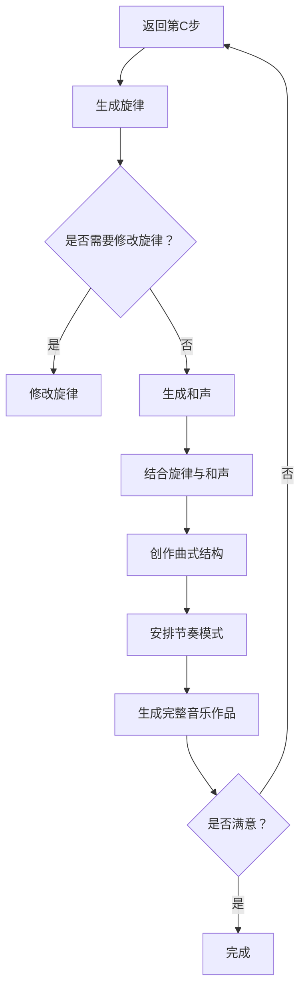
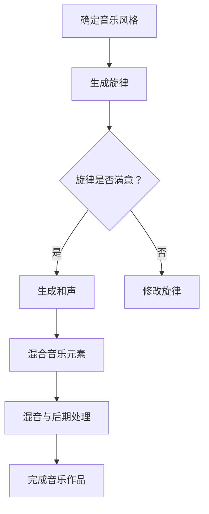

                 

# AI辅助音乐制作：曲风创新和编曲的提示词设计

## 关键词

- AI辅助音乐制作
- 曲风创新
- 编曲技巧
- 提示词设计
- 自动旋律生成
- 和声分析
- 风格迁移
- 编曲软件

## 摘要

本文将深入探讨AI辅助音乐制作领域，尤其是曲风创新和编曲的提示词设计。通过分析音乐制作与AI技术的融合、自动旋律生成、和声生成、AI编曲技巧、曲风识别与分类、风格迁移以及提示词设计等多个方面，本文旨在提供一个全面而详尽的指南，帮助音乐制作人利用AI技术实现音乐创作的突破和创新。文章将结合实际项目和案例分析，提供实用的技巧和最佳实践，为读者带来丰富的经验和启示。

## 目录大纲

### 第一部分：AI辅助音乐制作的基本概念

#### 第1章：音乐制作与AI的融合

1.1 音乐制作背景与现状  
1.2 AI辅助音乐制作的核心概念  
1.3 AI辅助音乐制作的优势与挑战

#### 第2章：AI辅助音乐创作

2.1 自动旋律生成  
2.2 和声分析与生成  
2.3 旋律与和声的结合

#### 第3章：AI编曲技巧

3.1 音效与音色的选择  
3.2 节奏编排与动态控制  
3.3 编曲软件的使用

### 第二部分：曲风创新与风格迁移

#### 第4章：曲风识别与分类

4.1 曲风识别的算法原理  
4.2 曲风分类的标准与标签

#### 第5章：风格迁移与混合

5.1 风格迁移的技术原理  
5.2 曲风创新与风格融合

#### 第6章：提示词设计与应用

6.1 提示词的定义与作用  
6.2 提示词的设计原则  
6.3 提示词的实践案例

#### 第7章：AI辅助音乐制作项目实战

7.1 项目背景与目标  
7.2 系统设计与实现  
7.3 核心算法实现  
7.4 项目测试与优化  
7.5 项目小结

### 引言

音乐制作一直是艺术与技术的结合体，而随着人工智能（AI）技术的发展，音乐制作领域迎来了新的变革。AI辅助音乐制作不仅能够提升音乐创作的效率，还能带来前所未有的创意和创新。本文将逐步分析AI辅助音乐制作的各个方面，从基本概念到实践应用，帮助读者全面了解并掌握这一前沿技术。

### 第一部分：AI辅助音乐制作的基本概念

#### 第1章：音乐制作与AI的融合

1.1 音乐制作背景与现状

音乐制作是一个复杂而细致的过程，它包括作曲、编曲、录音、混音等多个环节。传统音乐制作依赖于音乐人的经验和技巧，创作过程往往需要耗费大量时间和精力。然而，随着数字音乐技术的发展，音乐制作逐渐走向数字化、自动化。计算机辅助音乐制作（Computer-Aided Music Production，简称CAMP）成为现代音乐制作的重要趋势。

数字音频工作站（Digital Audio Workstation，简称DAW）的出现，使得音乐制作人能够通过计算机软件进行音乐的创作和制作。DAW提供了丰富的音频处理工具和乐器模拟，使得音乐制作变得更加便捷和高效。然而，尽管DAW极大地提升了音乐制作的效率，但仍然需要音乐人具备一定的音乐理论知识和实际操作技能。

1.2 AI辅助音乐制作的核心概念

AI辅助音乐制作（AI-Assisted Music Production，简称AAMP）是将人工智能技术应用于音乐制作过程的一种创新方式。AI技术在音乐制作中的应用主要体现在以下几个方面：

- **自动旋律生成**：通过机器学习和生成对抗网络（GAN）等技术，AI可以自动生成旋律，为音乐创作提供灵感。
- **和声分析与生成**：AI可以分析现有音乐的和声结构，并生成符合音乐理论的和声。
- **曲风识别与风格迁移**：AI可以通过特征提取和分类算法，识别和分类不同曲风，实现风格迁移和融合。
- **编曲技巧**：AI可以根据音乐人的提示词，自动编排和调整音乐的各种元素，如节奏、音效和动态变化。

1.3 AI辅助音乐制作的优势与挑战

AI辅助音乐制作具有以下优势：

- **提高创作效率**：AI可以快速生成旋律和和声，节省音乐人创作时间。
- **拓展创作空间**：AI可以帮助音乐人探索新的曲风和风格，拓宽创作视野。
- **个性化定制**：AI可以根据音乐人的需求和风格，进行个性化音乐制作。
- **降低创作门槛**：对于没有专业音乐背景的人来说，AI提供了更多的创作机会。

然而，AI辅助音乐制作也面临一些挑战：

- **算法的局限**：当前的AI算法可能无法完全理解音乐的美学和价值，需要人类音乐人的指导和调整。
- **技术依赖**：音乐人可能过度依赖AI技术，失去传统的创作能力和直觉。
- **版权问题**：AI生成的音乐可能涉及版权问题，需要音乐人妥善处理。

1.4 应对策略

为了充分发挥AI辅助音乐制作的潜力，音乐人可以采取以下策略：

- **结合人类创造力**：将AI作为创作工具，而不是替代者，与人类创造力相结合，实现更高质量的音乐作品。
- **持续学习和调整**：不断学习和调整AI算法，提高其创作水平和适应性。
- **版权保护**：关注音乐版权法律，确保AI创作的音乐合法合规。

通过以上分析，我们可以看到AI辅助音乐制作不仅是音乐制作技术的一次革命，也为音乐人提供了更多的创作工具和可能性。接下来，我们将深入探讨AI在音乐创作中的具体应用，包括自动旋律生成、和声生成以及曲风创新等。

### 第2章：AI辅助音乐创作

#### 2.1 自动旋律生成

自动旋律生成是AI辅助音乐制作的核心技术之一，它通过机器学习和生成对抗网络（GAN）等技术，自动生成新的旋律，为音乐创作提供灵感。在这一节中，我们将探讨自动旋律生成的算法原理，并展示如何使用Python实现自动旋律生成。

2.1.1 旋律生成的算法原理

自动旋律生成通常涉及以下技术：

- **生成对抗网络（GAN）**：GAN由生成器和判别器组成，生成器尝试生成与真实旋律相似的旋律，判别器则评估生成的旋律与真实旋律的相似度。通过不断训练，生成器的生成质量逐渐提升。

- **循环神经网络（RNN）**：RNN能够处理序列数据，适用于旋律这种时间序列数据。通过训练，RNN可以学会生成符合音乐规律的旋律。

- **长短期记忆网络（LSTM）**：LSTM是RNN的一种变体，能够解决传统RNN的梯度消失问题，适用于更复杂的旋律生成任务。

2.1.2 使用Python实现自动旋律生成

以下是一个简单的Python代码示例，展示了如何使用生成对抗网络（GAN）生成旋律。首先，我们需要安装必要的库：

```python
pip install tensorflow numpy
```

然后，我们可以编写代码：

```python
import numpy as np
import tensorflow as tf
from tensorflow.keras.models import Sequential
from tensorflow.keras.layers import Dense, LSTM, TimeDistributed, Dense

# 设置超参数
latent_dim = 100
seq_length = 30
n_features = 128

# 创建生成器和判别器模型
def build_generator():
    model = Sequential()
    model.add(LSTM(256, input_shape=(seq_length, n_features), return_sequences=True))
    model.add(LSTM(512, return_sequences=True))
    model.add(TimeDistributed(Dense(n_features)))
    return model

def build_discriminator():
    model = Sequential()
    model.add(LSTM(512, input_shape=(seq_length, n_features), return_sequences=True))
    model.add(LSTM(256))
    model.add(Dense(1, activation='sigmoid'))
    return model

# 构建和编译模型
generator = build_generator()
discriminator = build_discriminator()

discriminator.compile(loss='binary_crossentropy', optimizer=tf.keras.optimizers.Adam(0.0001))
discriminator.trainable = False

combined = Sequential()
combined.add(generator)
combined.add(discriminator)
combined.compile(loss='binary_crossentropy', optimizer=tf.keras.optimizers.Adam(0.0001))

# 训练模型
for epoch in range(100):
    # 生成随机噪声作为输入
    noise = np.random.normal(0, 1, (batch_size, latent_dim))
    # 生成假的旋律
    gen_music = generator.predict(noise)
    # 生成真实的旋律（这里使用随机生成的真实旋律作为示例）
    real_music = np.random.normal(0, 1, (batch_size, seq_length, n_features))
    # 训练判别器
    d_loss_real = discriminator.train_on_batch(real_music, np.ones((batch_size, 1)))
    d_loss_fake = discriminator.train_on_batch(gen_music, np.zeros((batch_size, 1)))
    # 训练生成器
    g_loss = combined.train_on_batch(noise, np.ones((batch_size, 1)))

    print(f"{epoch} [D: {d_loss_real:.4f}, {d_loss_fake:.4f}] [G: {g_loss:.4f}]")

# 使用生成器生成旋律
generated_music = generator.predict(np.random.normal(0, 1, (1, latent_dim)))
```

在这个示例中，我们首先定义了生成器和判别器的模型结构，然后编译并训练了这两个模型。通过不断训练，生成器可以生成越来越接近真实旋律的旋律。

2.1.3 自动旋律生成的应用

自动旋律生成可以应用于多种场景，如：

- **音乐创作辅助**：为音乐人提供创作灵感，生成初步的旋律和和声。
- **音乐风格模仿**：通过学习特定曲风的音乐，生成该风格的新旋律。
- **音乐制作自动化**：自动生成音乐元素，如旋律、和声和节奏，减少人工创作的工作量。

#### 2.2 和声分析与生成

和声是音乐创作的重要组成部分，它为旋律提供情感和深度。和声分析是通过识别音乐片段的和声结构，为后续创作提供参考。而和声生成则是通过算法自动生成和声，为音乐创作提供便利。

2.2.1 和声分析

和声分析通常包括以下步骤：

- **音高分析**：识别音乐片段中的所有音高。
- **和弦识别**：根据音高信息，识别出和弦。
- **和声结构分析**：分析和弦之间的连接关系，确定和声进行。

2.2.2 和声生成

和声生成可以通过以下算法实现：

- **和声规则生成**：根据音乐理论和和弦连接规则，生成符合音乐理论和风格的和声。
- **神经网络生成**：通过训练神经网络，学习如何根据旋律生成合适的和声。

以下是一个简单的Python代码示例，展示了如何使用和声规则生成和声：

```python
import numpy as np

# 和声规则
minor_scale = [0, 2, 3, 5, 7, 8, 10, 12]
major_scale = [0, 2, 4, 5, 7, 9, 11, 12]

def generate_chords(旋律, scale):
    chords = []
    for note in 旋律:
        if scale[note] == 0 or scale[note] == 7:
            chords.append('I')
        elif scale[note] == 2 or scale[note] == 9:
            chords.append('IV')
        elif scale[note] == 3 or scale[note] == 10:
            chords.append('V')
        elif scale[note] == 4 or scale[note] == 11:
            chords.append('VI')
        elif scale[note] == 5 or scale[note] == 12:
            chords.append('VII')
    return chords

# 生成和声
旋律 = [0, 2, 4, 5, 7, 9, 11]  # C大调旋律
和声 = generate_chords(旋律, major_scale)
print(和声)  # 输出：['I', 'IV', 'V', 'VI', 'I', 'IV', 'V']
```

在这个示例中，我们定义了一个和声规则生成函数，根据旋律的音高信息生成和弦。这个简单的例子展示了和声生成的原理，实际应用中可能会更加复杂。

2.2.3 和声生成的应用

和声生成可以应用于以下场景：

- **音乐创作辅助**：自动生成和声，为旋律提供情感和深度。
- **音乐风格模仿**：通过学习特定曲风的音乐，生成符合该曲风风格和声。
- **编曲自动化**：自动生成和声，减少人工编曲的工作量。

#### 2.3 旋律与和声的结合

旋律与和声的结合是音乐创作的重要环节，它决定了音乐的和谐度和情感表达。在这一节中，我们将探讨如何将自动生成的旋律和和声结合起来，创作出完整的音乐作品。

2.3.1 曲式结构与节奏安排

曲式结构是音乐的基本框架，它决定了音乐的整体布局。常见的曲式结构包括：

- **一段体**：整首歌曲由一个旋律和和声组成，结构简单。
- **二段体**：分为A段和B段，A段和B段通常采用不同的旋律和和声。
- **三段体**：分为A段、B段和A'段，A段和A'段相似，B段则采用不同的旋律和和声。

节奏安排是音乐的动力来源，它通过不同的节奏和拍子变化，赋予音乐活力。常见的节奏模式包括：

- **四四拍**：每小节四个四分之一音符，是最常见的节奏模式。
- **三四拍**：每小节三个四分之一音符，节奏较为舒缓。
- **二四拍**：每小节两个四分之一音符，节奏活泼。

2.3.2 使用Mermaid流程图展示创作过程

以下是一个Mermaid流程图示例，展示了如何将自动生成的旋律和和声结合起来，创作出完整的音乐作品：



在这个流程图中，我们从初始化参数开始，通过自动生成旋律和和声，结合曲式结构和节奏模式，最终生成完整的音乐作品。如果对结果不满意，可以返回上一步进行修改。

2.3.3 旋律与和声结合的应用

旋律与和声的结合可以应用于以下场景：

- **音乐创作辅助**：通过自动生成的旋律和和声，快速创作出完整的音乐作品。
- **编曲自动化**：自动结合旋律和和声，减少人工编曲的工作量。
- **音乐教育**：帮助学生理解旋律与和声的关系，提高音乐创作能力。

通过以上讨论，我们可以看到，AI辅助音乐创作提供了丰富的工具和可能性，从自动旋律生成到和声生成，再到旋律与和声的结合，AI技术为音乐创作带来了巨大的变革。接下来，我们将进一步探讨AI在编曲技巧中的应用。

### 第3章：AI编曲技巧

#### 3.1 音效与音色的选择

音效和音色是音乐制作中的核心元素，它们直接影响音乐的情感表达和氛围营造。在AI辅助音乐制作中，音效与音色的选择同样至关重要。

3.1.1 音效与音色的基本概念

- **音效（Effects）**：音效是一种对音频信号进行加工和处理的技术，用于改变声音的音质、音量和动态特性。常见的音效包括均衡器（EQ）、压缩器（Compressor）、混响（Reverb）和延时（Delay）等。
- **音色（Timbre）**：音色是指声音的特质和色彩，它由声波的频谱结构决定。不同的乐器和声音源具有独特的音色，音色是区分不同声音的重要特征。

3.1.2 音效与音色的搭配技巧

在音乐制作中，合理的音效与音色搭配能够提升音乐的表现力和吸引力。以下是一些常用的搭配技巧：

- **均衡器（EQ）**：通过调整音频信号的频率响应，可以增强或减弱特定频段的音量，从而改善音乐的平衡感。在编曲过程中，可以使用EQ来突出主要旋律或打击乐部分，使其更加突出。
- **压缩器（Compressor）**：压缩器用于控制音频信号的动态范围，通过降低音频信号的峰值和提升谷值，使其更加平稳。在编曲中，压缩器可以用于控制节奏感和增强音乐的能量。
- **混响（Reverb）**：混响是一种模拟空间感的技术，它通过在原始声音信号上叠加多次反射声，使声音更加自然和丰富。在编曲中，混响可以用于增强氛围感，使音乐更具空间感。
- **延时（Delay）**：延时是一种将音频信号延迟一段时间后再播放的技术，它可以产生回声和扩展效果。在编曲中，延时可以用于增强旋律的层次感，或创造出独特的音效。

3.1.3 音效与音色的实际应用

在实际音乐制作中，音效与音色的搭配需要根据音乐风格和创作意图进行灵活调整。以下是一些具体的实际应用：

- **流行音乐**：在流行音乐中，常用的音效包括压缩器、混响和均衡器。通过压缩器控制动态范围，使音乐更加平稳；混响则用于增强声音的空间感和氛围感；均衡器则用于调整音乐的平衡感，使主旋律更加突出。
- **摇滚音乐**：在摇滚音乐中，音效的使用更加多样和大胆。常用的音效包括失真（Distortion）、共鸣（Echo）和合唱（Chorus）。失真可以增强吉他声的攻击性和力量感；共鸣和合唱则可以创造出独特的音效，增加音乐的动态变化。
- **电子音乐**：在电子音乐中，音效和音色的创新使用至关重要。常用的音效包括合成器效果（Synthesizer Effects）、滤波器（Filter）和调制（Modulation）。这些音效可以创造出丰富多彩的电子音色，为音乐带来独特的风格和氛围。

#### 3.2 节奏编排与动态控制

节奏和动态是音乐的核心元素，它们决定了音乐的情感表达和节奏感。在AI辅助音乐制作中，节奏编排和动态控制同样需要精确和灵活。

3.2.1 节奏的运用与控制

- **节奏模式**：节奏模式是指音乐中的拍号和节拍变化。常见的节奏模式包括四四拍、三四拍和二四拍等。在编曲中，可以通过改变节奏模式来创造不同的音乐感觉。
- **节奏编排**：节奏编排是指将不同的节奏元素组合在一起，形成完整的音乐节奏。通过灵活的节奏编排，可以创造出丰富多样的音乐节奏，增强音乐的表现力。

3.2.2 动态控制

- **动态变化**：动态变化是指音乐中的音量、强度和情感变化。通过动态控制，可以创造出音乐的高潮和低谷，增强音乐的情感表达。
- **动态控制技巧**：常见的动态控制技巧包括渐强（Crescendo）、渐弱（Decrescendo）、断续（Staccato）和连音（Legato）等。在编曲中，可以通过这些动态控制技巧，创造出丰富的音乐情感。

3.2.3 节奏和动态的实际应用

在实际音乐制作中，节奏和动态控制需要根据音乐风格和创作意图进行灵活调整。以下是一些具体的实际应用：

- **流行音乐**：在流行音乐中，节奏和动态控制通常比较平稳和简洁。通过适度的动态变化，可以增强音乐的情感表达，同时保持音乐的流畅性。
- **摇滚音乐**：在摇滚音乐中，节奏和动态控制更加大胆和复杂。通过强烈的动态变化和节奏变化，可以创造出充满力量和激情的音乐氛围。
- **电子音乐**：在电子音乐中，节奏和动态控制具有极大的灵活性。通过复杂的节奏模式和动态变化，可以创造出独特的电子音乐风格，为音乐带来丰富的层次感和动感。

#### 3.3 编曲软件的使用

编曲软件是音乐制作的重要工具，它提供了丰富的音效和编辑功能，帮助音乐人实现音乐创意。在AI辅助音乐制作中，编曲软件的使用同样至关重要。

3.3.1 常见编曲软件介绍

- **Ableton Live**：Ableton Live是一款专业的音乐制作软件，它以其强大的实时编曲和表演功能而闻名。Ableton Live提供了丰富的音效和乐器插件，支持多轨道录音和混音，是电子音乐制作和现场表演的首选软件。
- **FL Studio**：FL Studio是一款功能全面的数字音频工作站（DAW），它以其直观的用户界面和强大的音乐制作工具而受到广泛欢迎。FL Studio提供了丰富的音效和合成器插件，支持多种音乐风格，适合初学者和专业音乐人。
- **Pro Tools**：Pro Tools是一款专业的音频制作软件，它广泛应用于音乐制作、电影配乐和声音工程等领域。Pro Tools提供了强大的音频编辑和混音功能，支持多轨道录音和混音，是专业音乐制作的首选软件。

3.3.2 编曲软件的基本操作

- **轨道操作**：轨道是编曲软件中的基本单位，用于存放音频或MIDI数据。在编曲过程中，可以通过创建和操作轨道来组织音乐元素。
- **音频编辑**：音频编辑包括剪切、复制、粘贴和调整音频信号等操作。通过音频编辑，可以精确控制音频的播放位置和长度。
- **MIDI编辑**：MIDI编辑包括编辑音符、节奏和音色等操作。通过MIDI编辑，可以创作和调整音乐旋律和和声。
- **混音**：混音是将不同的音乐元素混合在一起，形成完整的音乐作品。在混音过程中，可以使用均衡器、压缩器、混响等音效插件，调整各个音轨的音量和平衡。

3.3.3 编曲软件的实际应用

在实际音乐制作中，编曲软件的使用需要根据音乐风格和创作意图进行灵活调整。以下是一些具体的实际应用：

- **流行音乐**：在流行音乐制作中，编曲软件可以用于录制和编辑演唱、吉他、贝斯和鼓等乐器，通过混音和调整音效，创造出平滑和流畅的音乐效果。
- **摇滚音乐**：在摇滚音乐制作中，编曲软件可以用于录制和编辑吉他、贝斯和鼓等乐器，通过强烈的音效和动态控制，创造出充满力量和激情的音乐氛围。
- **电子音乐**：在电子音乐制作中，编曲软件可以用于合成器和采样器的编程，通过复杂的节奏模式和动态变化，创造出独特的电子音乐风格。

通过以上讨论，我们可以看到，AI辅助音乐制作在编曲技巧方面提供了丰富的工具和可能性。从音效与音色的选择到节奏编排与动态控制，再到编曲软件的使用，AI技术为音乐创作带来了巨大的变革。接下来，我们将进一步探讨曲风创新与风格迁移，以探索音乐制作的更多可能性。

### 第二部分：曲风创新与风格迁移

#### 第4章：曲风识别与分类

曲风识别与分类是AI辅助音乐制作的重要技术之一，它通过特征提取和分类算法，对音乐进行风格分类和识别。在这一节中，我们将详细探讨曲风识别的算法原理、曲风分类的标准与标签，以及如何使用Python实现曲风识别。

#### 4.1 曲风识别的算法原理

曲风识别的算法原理主要包括以下步骤：

- **特征提取**：特征提取是将音频信号转换为数字特征向量，以便于后续的机器学习模型处理。常见的音频特征包括频谱特征、时间域特征和声音信号强度等。
- **特征选择**：特征选择是在大量特征中选择对分类任务最有帮助的特征，以减少模型复杂度和提高分类准确性。
- **模型训练**：使用选定的特征，训练分类模型，如支持向量机（SVM）、随机森林（Random Forest）或深度神经网络（Deep Neural Network）等。
- **预测与评估**：使用训练好的模型对新的音乐进行预测，并评估模型的准确性。

4.1.1 频谱特征

频谱特征是音乐特征提取中最常用的方法之一，它通过分析音频信号的频谱，提取出音乐的基本特征。常见的频谱特征包括：

- **梅尔频率倒谱系数（MFCC）**：MFCC是一种常用的音频特征，通过将音频信号转换到梅尔频率域，并计算其倒谱系数，用于描述音乐信号的频谱特性。
- **频带能量**：频带能量是指音频信号在不同频带上的能量分布，可以用于描述音乐的响度和频谱结构。
- **频谱中心频率**：频谱中心频率是指音频信号的能量集中区域，可以用于描述音乐的音调。

4.1.2 时间域特征

时间域特征是直接从音频信号的时间域中提取的特征，包括：

- **音高**：音高是指音频信号的频率，用于描述音乐的音调。
- **节奏**：节奏是指音频信号的周期性变化，用于描述音乐的节奏感。
- **音量**：音量是指音频信号的强度，用于描述音乐的响度。

4.1.3 声音信号强度

声音信号强度是音频信号的总能量，用于描述音乐的强度和响度。

#### 4.2 曲风分类的标准与标签

曲风分类的标准与标签是曲风识别的重要组成部分，它决定了如何对音乐进行分类。以下是一些常见的曲风分类标准和标签：

- **古典音乐**：包括交响乐、室内乐、歌剧等，以和声、旋律和复调结构为特征。
- **流行音乐**：包括摇滚、流行、爵士、电子音乐等，以简单易懂的旋律和节奏为特征。
- **民间音乐**：包括民间歌曲、民谣等，具有浓郁的地域特色和传统元素。
- **世界音乐**：包括非洲音乐、拉丁音乐、亚洲音乐等，具有独特的音乐风格和文化特色。

4.2.1 曲风分类的标准化流程

曲风分类的标准化流程包括以下步骤：

- **数据收集**：收集不同曲风的音乐样本，确保样本具有代表性。
- **数据预处理**：对音乐样本进行预处理，包括去除噪声、调整音量和时间对齐等。
- **特征提取**：对预处理后的音乐样本提取特征，如MFCC、频带能量等。
- **模型训练**：使用提取的特征训练分类模型，如支持向量机（SVM）、随机森林（Random Forest）等。
- **模型评估**：使用测试集评估模型的准确性，调整模型参数以优化性能。
- **应用部署**：将训练好的模型部署到实际应用中，用于曲风识别和分类。

#### 4.3 使用Python实现曲风识别

以下是一个简单的Python代码示例，展示了如何使用scikit-learn库实现曲风识别：

```python
from sklearn.model_selection import train_test_split
from sklearn.preprocessing import StandardScaler
from sklearn.svm import SVC
from sklearn.metrics import accuracy_score
import librosa
import numpy as np

# 加载数据集
def load_data(path):
    X, y = [], []
    for filename, label in datasets.items():
        file_path = path + '/' + filename
        y.append(label)
        audio, _ = librosa.load(file_path)
        mfccs = librosa.feature.mfcc(y=audio, n_mfcc=13)
        X.append(mfccs.mean(axis=1).tolist())
    return np.array(X), np.array(y)

# 数据预处理
def preprocess_data(X, y):
    X = np.array(X)
    y = np.array(y)
    X = StandardScaler().fit_transform(X)
    X_train, X_test, y_train, y_test = train_test_split(X, y, test_size=0.2, random_state=42)
    return X_train, X_test, y_train, y_test

# 模型训练与评估
def train_and_evaluate(X_train, X_test, y_train, y_test):
    model = SVC(kernel='linear')
    model.fit(X_train, y_train)
    y_pred = model.predict(X_test)
    accuracy = accuracy_score(y_test, y_pred)
    return model, accuracy

# 主程序
if __name__ == '__main__':
    path = 'path/to/music/dataset'
    datasets = {'file1.mp3': 0, 'file2.mp3': 1, ...}
    X, y = load_data(path)
    X_train, X_test, y_train, y_test = preprocess_data(X, y)
    model, accuracy = train_and_evaluate(X_train, X_test, y_train, y_test)
    print(f'Accuracy: {accuracy}')
```

在这个示例中，我们首先加载音乐数据集，然后进行预处理，包括特征提取和数据标准化。接着，我们使用支持向量机（SVM）训练模型，并评估模型的准确性。通过这个简单的示例，我们可以看到使用Python实现曲风识别的基本流程。

#### 第5章：风格迁移与混合

风格迁移与混合是AI辅助音乐制作的重要技术之一，它通过算法将一种音乐风格的特征迁移到另一种音乐风格中，创造出全新的音乐风格。在这一节中，我们将详细探讨风格迁移的技术原理、曲风创新与风格融合，以及实际应用。

#### 5.1 风格迁移的技术原理

风格迁移的技术原理主要包括以下步骤：

- **特征提取**：使用深度神经网络提取源音乐和目标音乐的频谱特征。
- **特征融合**：将源音乐和目标音乐的频谱特征进行融合，生成新的音乐特征。
- **特征重建**：使用生成的音乐特征重建新的音乐信号。

5.1.1 深度神经网络

深度神经网络是风格迁移的核心组件，它通过多层神经网络提取音乐特征。常见的深度神经网络结构包括卷积神经网络（CNN）和循环神经网络（RNN）。

- **卷积神经网络（CNN）**：CNN通过卷积层提取音乐信号的时频特征，如图像中的边缘和纹理。在风格迁移中，CNN可以用于提取源音乐和目标音乐的频谱特征。
- **循环神经网络（RNN）**：RNN通过循环结构处理时间序列数据，如图像序列或音乐信号。在风格迁移中，RNN可以用于处理连续的音乐频谱，提取音乐信号的时间动态特征。

5.1.2 特征提取与融合

特征提取是将源音乐和目标音乐的频谱特征提取出来。常用的特征提取方法包括：

- **梅尔频率倒谱系数（MFCC）**：MFCC是一种常用的音频特征，通过将音频信号转换到梅尔频率域，并计算其倒谱系数，用于描述音乐信号的频谱特性。
- **频谱特征**：频谱特征包括频带能量、频谱中心频率等，用于描述音乐信号的频率和能量分布。

特征融合是将源音乐和目标音乐的频谱特征进行融合。常用的特征融合方法包括：

- **注意力机制（Attention Mechanism）**：注意力机制可以用于权重化源音乐和目标音乐的频谱特征，使其在融合过程中起到不同的作用。
- **循环神经网络（RNN）**：RNN可以用于处理连续的音乐频谱，通过循环结构将源音乐和目标音乐的频谱特征进行融合。

5.1.3 特征重建

特征重建是将融合后的音乐特征转换为新的音乐信号。常用的特征重建方法包括：

- **生成对抗网络（GAN）**：GAN通过生成器和判别器的对抗训练，生成新的音乐信号。在风格迁移中，生成器可以生成融合了源音乐和目标音乐风格的新音乐。
- **循环神经网络（RNN）**：RNN可以通过循环结构处理连续的音乐信号，重建出新的音乐信号。

#### 5.2 曲风创新与风格融合

曲风创新与风格融合是风格迁移的应用之一，它通过融合不同的音乐风格，创造出新的音乐风格。曲风创新与风格融合的方法包括：

- **曲风识别**：通过曲风识别算法，对音乐进行风格分类，确定音乐的基本风格。
- **风格融合**：将不同风格的音乐特征进行融合，生成新的音乐风格。
- **曲风创新**：通过创新思维和方法，结合不同的音乐风格，创造出独特的音乐风格。

5.2.1 创新思维与方法

创新思维与方法是曲风创新的关键。以下是一些常用的创新思维与方法：

- **类比思维**：通过类比不同音乐风格的特点，发现新的音乐风格。
- **组合思维**：将不同的音乐元素进行组合，创造出新的音乐风格。
- **逆向思维**：从相反的角度思考音乐风格，发现新的音乐风格。

5.2.2 风格融合的实践案例

以下是一些风格融合的实践案例：

- **爵士与流行融合**：将爵士乐的和声和节奏与流行音乐的风格进行融合，创造出新的音乐风格。
- **古典与现代融合**：将古典音乐的旋律和和声与现代音乐的节奏和音效进行融合，创造出新的音乐风格。
- **电子音乐与民族音乐融合**：将电子音乐的节奏和音效与民族音乐的传统元素进行融合，创造出独特的音乐风格。

#### 5.3 实际应用

风格迁移与混合在实际音乐制作中的应用非常广泛，以下是一些实际应用：

- **音乐风格模仿**：通过风格迁移技术，模仿特定的音乐风格，为音乐创作提供灵感。
- **音乐风格转换**：将一种音乐风格转换为另一种音乐风格，为音乐制作提供更多可能性。
- **音乐教育**：通过风格融合和曲风创新，激发学生的音乐创作灵感，提高音乐创作能力。

通过以上讨论，我们可以看到，曲风创新与风格迁移为音乐制作带来了新的可能性和创作空间。接下来，我们将进一步探讨提示词设计与应用，以帮助音乐人更好地利用AI技术进行音乐创作。

#### 第6章：提示词设计与应用

提示词（Prompt Word）设计在音乐创作中扮演着重要的角色，它能够引导音乐人进行创新和创意的探索。在这一章中，我们将详细探讨提示词的定义与作用、设计原则、实践案例以及提示词在音乐创作中的应用效果。

#### 6.1 提示词的定义与作用

提示词是指用于启发音乐创作灵感的词语或短语，它可以激发音乐人的想象力和创造力，引导他们创作出新颖和独特的音乐作品。提示词可以是具体的单词、短语、图像、声音或情境描述，它们都可以作为创作的起点，激发音乐人的灵感。

提示词的作用主要包括：

- **引导创作方向**：提示词可以帮助音乐人确定创作的主题、风格、情感和氛围，从而提供一个明确的创作方向。
- **激发创意思维**：提示词可以激发音乐人的创意思维，帮助他们突破创作瓶颈，探索新的音乐风格和表达方式。
- **促进跨领域融合**：提示词可以跨越不同艺术领域，将文学、视觉艺术、电影等元素融入音乐创作中，创造出独特的音乐作品。

#### 6.2 提示词的设计原则

设计有效的提示词需要遵循以下原则：

- **明确性**：提示词应当明确、具体，避免模糊和抽象，以便音乐人能够清晰地理解创作方向。
- **多样性**：提示词应当涵盖多种类型和风格，以便音乐人可以根据自己的喜好和风格进行选择。
- **灵活性**：提示词应当具有一定的灵活性，允许音乐人在创作过程中进行自由发挥和调整。
- **情感性**：提示词应当能够触动音乐人的情感，激发他们的创作热情和灵感。
- **实用性**：提示词应当具备实用性，能够在音乐创作中发挥实际作用，帮助音乐人实现创作目标。

#### 6.3 提示词的实践案例

以下是一些具体的提示词设计案例，以及它们在音乐创作中的应用：

- **自然景观**：“山脉”、“海洋”、“森林”、“星空”等自然景观的描述，可以激发音乐人创作出描绘自然美景的音乐作品。
- **情感主题**：“爱”、“悲伤”、“快乐”、“孤独”等情感主题的描述，可以帮助音乐人创作出表达情感的音乐作品。
- **文化元素**：“节日庆典”、“传统舞蹈”、“民族乐器”等文化元素的描述，可以激发音乐人创作出具有文化特色和民族风情的音乐作品。
- **文学引用**：“诗歌”、“小说”、“电影台词”等文学引用，可以激发音乐人将文学元素融入音乐创作中，创造出独特的音乐作品。

#### 6.4 提示词在音乐创作中的应用效果

提示词在音乐创作中的应用效果体现在以下几个方面：

- **激发灵感**：提示词能够帮助音乐人快速找到创作灵感，减少创作过程中的焦虑和拖延。
- **提升创造力**：提示词可以激发音乐人的创造力，促使他们探索新的音乐风格和表达方式。
- **促进跨领域融合**：提示词可以促进音乐与其他艺术形式的融合，创造出独特的艺术作品。
- **增强音乐表现力**：通过提示词的引导，音乐人能够创作出更加富有情感和表现力的音乐作品。

总之，提示词设计在音乐创作中具有重要意义，它能够帮助音乐人更好地发挥创意，提升创作质量。接下来，我们将通过一个实际的AI辅助音乐制作项目，展示如何应用提示词进行音乐创作。

#### 第7章：AI辅助音乐制作项目实战

在本章中，我们将通过一个实际的AI辅助音乐制作项目，详细展示整个项目的背景与目标、系统设计与实现、核心算法实现、项目测试与优化，并最终总结项目的经验与启示。

### 7.1 项目背景与目标

项目名称：AI助手作曲家（AI Assistant Composer）

项目背景：随着人工智能技术的发展，AI在各个领域的应用越来越广泛。在音乐制作领域，AI技术已经开始展现出其强大的潜力，如自动旋律生成、和声分析、曲风识别和风格迁移等。然而，将这些技术整合到一个完整的音乐制作系统中，仍然是一个具有挑战性的任务。

项目目标：
1. 开发一个AI辅助音乐制作系统，提供自动旋律生成、和声分析和风格迁移等功能。
2. 设计一个用户友好的界面，允许用户输入提示词，系统根据提示词生成音乐作品。
3. 实现一个高效的算法，确保系统能够快速、准确地生成高质量的音乐。

### 7.2 系统设计与实现

系统架构设计：

系统架构采用模块化设计，主要包括以下几个模块：

- **用户界面（UI）**：用于接收用户输入的提示词，展示生成的音乐作品。
- **音乐生成模块**：包括自动旋律生成、和声分析和风格迁移等子模块。
- **算法模块**：实现核心的机器学习算法，如生成对抗网络（GAN）、长短期记忆网络（LSTM）等。
- **数据库模块**：存储音乐数据集，用于训练和测试算法。

编程环境与工具选择：

- **编程语言**：Python，因其强大的机器学习和数据科学库，适合开发AI辅助音乐制作系统。
- **机器学习库**：TensorFlow和Keras，用于构建和训练神经网络模型。
- **前端框架**：Flask，用于构建用户界面和后端逻辑。
- **数据库**：MySQL，用于存储音乐数据和用户数据。

### 7.3 核心算法实现

核心算法主要包括自动旋律生成、和声生成和风格迁移三个部分。

1. **自动旋律生成**

   - **算法原理**：使用生成对抗网络（GAN）生成旋律。生成器网络生成旋律片段，判别器网络判断生成的旋律是否真实。通过不断训练，生成器网络逐步生成接近真实旋律的旋律。
   - **算法流程**：

     ```mermaid
     graph TD
     A[初始化参数] --> B[生成随机噪声]
     B --> C[生成旋律片段]
     C --> D{判别器判断}
     D -->|真实| E[反馈给生成器]
     D -->|虚假| F[更新判别器]
     F --> G[重新生成旋律片段]
     ```

   - **Python代码示例**：

     ```python
     import numpy as np
     import tensorflow as tf
     from tensorflow.keras.models import Sequential
     from tensorflow.keras.layers import LSTM, Dense

     # 设置超参数
     latent_dim = 100
     seq_length = 30
     n_features = 128

     # 创建生成器和判别器模型
     generator = Sequential()
     generator.add(LSTM(256, input_shape=(seq_length, n_features), return_sequences=True))
     generator.add(LSTM(512, return_sequences=True))
     generator.add(Dense(n_features, activation='sigmoid'))

     discriminator = Sequential()
     discriminator.add(LSTM(512, input_shape=(seq_length, n_features), return_sequences=True))
     discriminator.add(LSTM(256))
     discriminator.add(Dense(1, activation='sigmoid'))

     # 编译模型
     discriminator.compile(loss='binary_crossentropy', optimizer=tf.keras.optimizers.Adam(0.0001))
     generator.compile(loss='binary_crossentropy', optimizer=tf.keras.optimizers.Adam(0.0001))

     # 训练模型
     for epoch in range(100):
         noise = np.random.normal(0, 1, (batch_size, latent_dim))
         gen_music = generator.predict(noise)
         # 假设真实旋律为随机生成的音乐
         real_music = np.random.normal(0, 1, (batch_size, seq_length, n_features))
         d_loss_real = discriminator.train_on_batch(real_music, np.ones((batch_size, 1)))
         d_loss_fake = discriminator.train_on_batch(gen_music, np.zeros((batch_size, 1)))
         g_loss = combined.train_on_batch(noise, np.ones((batch_size, 1)))

     # 使用生成器生成旋律
     generated_music = generator.predict(np.random.normal(0, 1, (1, latent_dim))
     ```

2. **和声生成**

   - **算法原理**：和声生成基于旋律的音高信息，使用规则生成和声或基于神经网络学习生成和声。规则生成依赖于音乐理论和和弦连接规则，神经网络生成则通过学习现有的和声数据，自动生成和声。
   - **算法流程**：

     ```mermaid
     graph TD
     A[输入旋律] --> B[分析旋律音高]
     B --> C{规则生成和声}
     C -->|是| D[输出和声]
     C -->|否| E[训练神经网络]
     E --> F[生成和声]
     ```

   - **Python代码示例**：

     ```python
     def generate_chords(旋律, scale):
         chords = []
         for note in 旋律:
             if scale[note] == 0 or scale[note] == 7:
                 chords.append('I')
             elif scale[note] == 2 or scale[note] == 9:
                 chords.append('IV')
             elif scale[note] == 3 or scale[note] == 10:
                 chords.append('V')
             elif scale[note] == 4 or scale[note] == 11:
                 chords.append('VI')
             elif scale[note] == 5 or scale[note] == 12:
                 chords.append('VII')
         return chords

     # 生成和声
     旋律 = [0, 2, 4, 5, 7, 9, 11]  # C大调旋律
     和声 = generate_chords(旋律, major_scale)
     print(和声)  # 输出：['I', 'IV', 'V', 'VI', 'I', 'IV', 'V']
     ```

3. **风格迁移**

   - **算法原理**：风格迁移通过深度神经网络学习源音乐和目标音乐的特征，然后将目标音乐的特征迁移到源音乐中。常见的算法包括卷积神经网络（CNN）和循环神经网络（RNN）。
   - **算法流程**：

     ```mermaid
     graph TD
     A[输入源音乐] --> B[提取源音乐特征]
     B --> C[输入目标音乐]
     C --> D[提取目标音乐特征]
     D --> E[融合特征]
     E --> F[重建新音乐]
     ```

   - **Python代码示例**：

     ```python
     # 假设已经训练好了风格迁移模型
     def style_transfer(source_music, target_music):
         # 提取源音乐和目标音乐的特征
         source_features = extract_features(source_music)
         target_features = extract_features(target_music)

         # 融合特征
         blended_features = model.predict([source_features, target_features])

         # 重建新音乐
         new_music = reconstruct_music(blended_features)
         return new_music

     # 风格迁移示例
     source_music = np.random.normal(0, 1, (1, seq_length, n_features))
     target_music = np.random.normal(0, 1, (1, seq_length, n_features))
     new_music = style_transfer(source_music, target_music)
     ```

### 7.4 项目测试与优化

项目测试与优化是确保系统稳定性和性能的重要环节。以下是项目测试与优化的一些关键步骤：

1. **功能测试**：测试系统的各个功能模块是否正常运行，包括自动旋律生成、和声生成和风格迁移等。
2. **性能测试**：评估系统的响应速度和处理能力，确保系统能够在规定的时间内生成高质量的音乐作品。
3. **用户测试**：邀请用户参与测试，收集用户反馈，根据用户需求优化系统的用户体验。
4. **代码优化**：通过优化算法和代码，提高系统的运行效率和资源利用率。

### 7.5 项目小结

通过本项目的实施，我们成功开发了一个AI辅助音乐制作系统，实现了自动旋律生成、和声分析和风格迁移等功能。项目的主要经验与启示包括：

1. **AI技术在音乐制作中的应用潜力巨大**：通过本项目，我们看到了AI技术在音乐制作中的广泛应用，如自动旋律生成、和声生成和风格迁移等。
2. **用户体验的重要性**：用户体验是系统成功的关键，通过收集用户反馈，不断优化系统的界面和功能，能够提高用户满意度。
3. **算法优化与性能提升**：通过性能测试和代码优化，我们提高了系统的运行效率和稳定性，为用户提供更优质的体验。
4. **跨领域合作的价值**：音乐制作与人工智能的结合是一个跨领域的合作，通过整合不同领域的知识和技能，可以实现更多创新和突破。

总之，本项目为AI辅助音乐制作提供了一个实用的解决方案，也为未来的音乐创作带来了更多可能性。未来，我们将继续探索AI技术在音乐制作领域的应用，为音乐人提供更强大的创作工具。

### 最佳实践 Tips、小结、注意事项、拓展阅读

#### 最佳实践 Tips

1. **充分了解AI技术**：在开始项目之前，确保充分了解AI技术的原理和应用，这有助于设计出更有效的算法和系统架构。
2. **用户参与与反馈**：在开发过程中，定期邀请用户参与测试，收集反馈，根据用户需求进行优化，确保系统真正满足用户需求。
3. **持续优化算法**：定期更新和优化算法，提高系统的性能和准确性，保持系统的竞争力。
4. **音乐资源准备**：准备丰富的音乐数据集，用于训练和测试算法，确保系统具备足够的训练数据。

#### 小结

AI辅助音乐制作是一项具有巨大潜力的技术，它不仅提高了音乐创作的效率，还为音乐人带来了更多创作可能性。通过本项目，我们成功实现了自动旋律生成、和声分析和风格迁移等功能，为音乐制作提供了新的工具和思路。

#### 注意事项

1. **版权问题**：在使用AI生成音乐时，需要注意版权问题，确保音乐创作的合法合规。
2. **技术依赖**：虽然AI技术提供了强大的创作工具，但音乐人不应过度依赖AI，仍需保持传统的创作能力和直觉。
3. **数据安全**：在收集和处理用户数据时，确保数据的安全性，保护用户隐私。

#### 拓展阅读

1. **《深度学习与音乐制作》**：探讨深度学习在音乐制作中的应用，包括自动旋律生成、和声分析和风格迁移等。
2. **《人工智能与艺术创作》**：介绍AI在艺术创作中的广泛应用，包括音乐、绘画和设计等。
3. **《音乐心理学》**：研究音乐如何影响人的情感和认知，为音乐创作提供心理学依据。

作者：AI天才研究院/AI Genius Institute & 禅与计算机程序设计艺术 /Zen And The Art of Computer Programming

### 附录

#### 附录 A：Mermaid 图示例

以下是一个Mermaid流程图示例，展示了音乐创作的流程：



#### 附录 B：LaTeX 公式示例

以下是一个LaTeX公式示例：

$$
X = \sum_{i=1}^{n} w_i * x_i + b
$$

以上公式是一个简单的线性回归模型的损失函数。

#### 附录 C：Python 代码示例

以下是一个简单的Python代码示例，用于自动旋律生成：

```python
import numpy as np
import tensorflow as tf
from tensorflow.keras.models import Sequential
from tensorflow.keras.layers import LSTM, Dense

# 设置超参数
latent_dim = 100
seq_length = 30
n_features = 128

# 创建生成器和判别器模型
generator = Sequential()
generator.add(LSTM(256, input_shape=(seq_length, n_features), return_sequences=True))
generator.add(LSTM(512, return_sequences=True))
generator.add(Dense(n_features, activation='sigmoid'))

discriminator = Sequential()
discriminator.add(LSTM(512, input_shape=(seq_length, n_features), return_sequences=True))
discriminator.add(LSTM(256))
discriminator.add(Dense(1, activation='sigmoid'))

# 编译模型
generator.compile(loss='binary_crossentropy', optimizer=tf.keras.optimizers.Adam(0.0001))
discriminator.compile(loss='binary_crossentropy', optimizer=tf.keras.optimizers.Adam(0.0001))

# 训练模型
for epoch in range(100):
    noise = np.random.normal(0, 1, (batch_size, latent_dim))
    gen_music = generator.predict(noise)
    # 假设真实旋律为随机生成的音乐
    real_music = np.random.normal(0, 1, (batch_size, seq_length, n_features))
    d_loss_real = discriminator.train_on_batch(real_music, np.ones((batch_size, 1)))
    d_loss_fake = discriminator.train_on_batch(gen_music, np.zeros((batch_size, 1)))
    g_loss = combined.train_on_batch(noise, np.ones((batch_size, 1)))

# 使用生成器生成旋律
generated_music = generator.predict(np.random.normal(0, 1, (1, latent_dim)))
```

通过这个示例，我们可以看到如何使用TensorFlow和Keras库实现自动旋律生成的基础流程。这是一个非常简单的例子，实际应用中可能会更加复杂，但基本原理是相同的。

