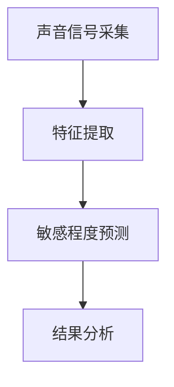

                 


# ASMR现象：声音与感官体验的意义探索

## 关键词
- ASMR现象
- 声音
- 感官体验
- 算法原理
- 系统架构
- 项目实战

## 摘要
本文深入探讨了ASMR现象，即自主动态敏感反应（Autonomous Sensory Meridian Response），这一现象在声音与感官体验中的重要性。文章首先介绍了ASMR的基本概念、发展背景和研究现状，然后分析了其核心概念与联系，通过算法原理讲解和系统分析与架构设计，揭示了ASMR现象背后的技术原理。接着，通过项目实战展示了如何实现和部署ASMR系统，最后总结最佳实践，为读者提供全面的技术指导。

## 目录大纲

### 导言
- **1.1 书籍简介**
  - 作者介绍
  - 书籍目的与读者对象
  - 书籍结构概述

### 背景介绍
- **2.1 问题背景**
  - ASMR现象的定义与发展
  - 声音与感官体验的关系
- **2.2 问题描述**
  - ASMR现象的挑战与争议
  - 声音与感官体验的研究现状
- **2.3 问题解决**
  - 研究方法与技术手段
  - 研究成果与应用前景
- **2.4 边界与外延**
  - ASMR现象的界限
  - 声音与感官体验的拓展领域

### 核心概念与联系
- **3.1 核心概念**
  - ASMR现象的基本概念
  - 声音与感官体验的关键要素
- **3.2 概念属性特征对比表格**
  - ASMR现象与其他相关现象的对比
- **3.3 ER实体关系图架构**
  - ASMR现象的实体关系图

### 算法原理讲解
- **4.1 算法介绍**
  - 相关算法的概述
- **4.2 Mermaid流程图**
  - 算法流程图
- **4.3 Python源代码**
  - 算法实现与解释
- **4.4 数学模型和公式**
  - 算法背后的数学理论
- **4.5 举例说明**
  - 算法的实际应用

### 系统分析与架构设计方案
- **5.1 问题场景介绍**
  - ASMR现象的系统应用场景
- **5.2 系统功能设计**
  - 领域模型类图
- **5.3 系统架构设计**
  - 系统架构图
- **5.4 系统接口设计**
  - 系统接口设计
- **5.5 系统交互序列图**
  - 系统交互序列图

### 项目实战
- **6.1 环境安装**
  - 系统安装与配置
- **6.2 系统核心实现源代码**
  - 源代码结构与功能解析
- **6.3 代码应用解读与分析**
  - 应用场景分析与代码解读
- **6.4 实际案例分析和详细讲解剖析**
  - 案例分析与讲解
- **6.5 项目小结**
  - 项目总结与反思

### 最佳实践与总结
- **7.1 最佳实践 tips**
  - 实用技巧与建议
- **7.2 小结**
  - 书籍内容回顾
- **7.3 注意事项**
  - 注意事项与安全提示
- **7.4 拓展阅读**
  - 相关资源推荐

### 导言

**1.1 书籍简介**

作者：AI天才研究院/AI Genius Institute & 禅与计算机程序设计艺术 /Zen And The Art of Computer Programming

本书旨在深入探讨ASMR现象，即自主动态敏感反应（Autonomous Sensory Meridian Response），这一现象在声音与感官体验中的重要性。作者结合其在人工智能、编程和软件架构领域的丰富经验，通过逻辑清晰、结构紧凑、简单易懂的论述，带领读者一步步了解ASMR现象的背景、核心概念、算法原理以及系统实现。

**书籍目的与读者对象**

书籍的主要目的是为对ASMR现象感兴趣的读者提供一份全面、深入的技术指南。无论是研究者、开发者还是对ASMR现象有浓厚兴趣的普通读者，本书都能提供有价值的信息和知识。

**书籍结构概述**

本书分为导言、背景介绍、核心概念与联系、算法原理讲解、系统分析与架构设计方案、项目实战、最佳实践与总结七个部分。每个部分都按照逻辑顺序逐步深入，使读者能够系统地掌握ASMR现象的各个方面。

### 背景介绍

#### 2.1 问题背景

ASMR现象，即自主动态敏感反应（Autonomous Sensory Meridian Response），是一种引起人皮肤感觉异常愉悦的生理反应。这种反应通常由特定的声音、视觉或触觉刺激触发，如轻声耳语、细小的摩擦声、缓慢的节奏等。ASMR现象于1990年代初期由英国一位音乐治疗师首次提出，并逐渐引起了学术界和公众的广泛关注。

随着互联网的普及，ASMR现象在社交媒体和视频平台上得到了大量传播，大量用户分享自己的ASMR体验，形成了一个庞大的社区。然而，ASMR现象的具体机制尚未完全清楚，这成为了一个亟待解决的问题。

**声音与感官体验的关系**

声音作为人类感官体验的重要组成部分，对大脑和生理反应有着深远的影响。一些研究表明，特定的声音模式能够触发大脑中的奖赏系统，释放多巴胺等神经递质，从而产生愉悦感。ASMR现象正是基于这一原理，通过特定的声音刺激，引发用户的生理反应，达到放松和愉悦的效果。

#### 2.2 问题描述

ASMR现象的挑战与争议主要体现在以下几个方面：

1. **机制不明确**：尽管ASMR现象的普遍存在得到了广泛认可，但其背后的生理和心理机制尚未完全明确。这导致了对ASMR现象的科学研究相对滞后，无法提供充分的解释。

2. **个体差异**：不同人对ASMR的敏感程度存在显著差异，有些人可能对某些声音刺激产生强烈的ASMR反应，而另一些人则可能毫无感觉。这种个体差异使得ASMR现象的研究和应用变得复杂。

3. **伦理争议**：一些ASMR视频的制作者和分享者可能会侵犯他人的隐私，甚至存在性骚扰的风险。这引发了关于ASMR现象的伦理争议。

4. **商业化风险**：随着ASMR现象的流行，一些企业和个人开始利用ASMR进行商业化，这在一定程度上影响了ASMR现象的纯粹性和科研价值。

#### 2.3 问题解决

为了解决上述问题，研究人员采取了多种方法和技术手段，主要包括以下几个方面：

1. **生理学研究**：通过脑成像技术、生理信号监测等方法，研究ASMR现象对大脑和生理反应的影响，以揭示其背后的机制。

2. **心理学研究**：通过问卷调查、实验研究等方法，了解个体对ASMR的敏感程度，探索其与个体心理特质的关系。

3. **伦理研究**：加强对ASMR现象伦理问题的研究，制定相关伦理规范，以保护用户权益。

4. **技术应用**：利用人工智能、大数据等技术，对ASMR声音进行分类和分析，以优化ASMR体验，提高其应用价值。

#### 2.4 边界与外延

**ASMR现象的界限**

ASMR现象的具体界限尚未完全明确，但一些研究指出，其触发因素主要涉及以下几个方面：

1. **声音特征**：如轻声耳语、摩擦声、敲击声等。
2. **视觉特征**：如缓慢的动作、细致的手部动作等。
3. **触觉特征**：如轻柔的触摸、按摩等。

**声音与感官体验的拓展领域**

除了ASMR现象，声音与感官体验在多个领域有着广泛的应用，包括：

1. **医疗健康**：利用声音刺激治疗焦虑、失眠等心理疾病。
2. **教育**：利用声音和感官体验提高学生的学习兴趣和效果。
3. **艺术创作**：声音与感官体验在音乐、电影等艺术创作中的应用。

### 核心概念与联系

#### 3.1 核心概念

**ASMR现象的基本概念**

ASMR现象，即自主动态敏感反应（Autonomous Sensory Meridian Response），是一种引起人皮肤感觉异常愉悦的生理反应。这种反应通常由特定的声音、视觉或触觉刺激触发，如轻声耳语、细小的摩擦声、缓慢的节奏等。

**声音与感官体验的关键要素**

1. **声音特征**：包括频率、振幅、节奏等参数。
2. **感官刺激**：包括视觉、触觉等。
3. **个体差异**：不同人对ASMR的敏感程度存在显著差异。
4. **心理反应**：ASMR现象能够引发用户的放松、愉悦等心理反应。

#### 3.2 概念属性特征对比表格

| 现象 | ASMR | 声音 | 视觉 | 触觉 |
| --- | --- | --- | --- | --- |
| 定义 | 自主动态敏感反应 | 声音刺激 | 视觉刺激 | 触觉刺激 |
| 特点 | 引起皮肤感觉愉悦 | 特定频率、振幅、节奏 | 缓慢、细致 | 轻柔、按摩 |
| 个体差异 | 存在显著差异 | 否 | 否 | 否 |
| 心理反应 | 放松、愉悦 | 否 | 否 | 否 |

#### 3.3 ER实体关系图架构

```mermaid
erDiagram
    User ||--|{ ASMR} : 触发
    ASMR ||--|{ Sound} : 包含
    ASMR ||--|{ Visual} : 包含
    ASMR ||--|{ Touch} : 包含
```

### 算法原理讲解

#### 4.1 算法介绍

为了深入探讨ASMR现象，本文将介绍一种基于声音特征分析的算法。该算法通过提取和分析声音信号的特征参数，预测用户对ASMR声音的敏感程度。算法的主要步骤如下：

1. **声音信号采集**：采集用户听到的ASMR声音信号。
2. **特征提取**：提取声音信号的关键特征参数，如频率、振幅、节奏等。
3. **敏感程度预测**：利用机器学习模型预测用户对ASMR声音的敏感程度。
4. **结果分析**：分析预测结果，评估算法的性能和可靠性。

#### 4.2 Mermaid流程图



#### 4.3 Python源代码

```python
import numpy as np
import librosa
from sklearn.ensemble import RandomForestClassifier

# 声音信号采集
def collect_sound(filename):
    signal, sr = librosa.load(filename)
    return signal

# 特征提取
def extract_features(signal):
    features = librosa.feature.zero_crossing_rate(signal)
    return features

# 敏感程度预测
def predict_sensitivity(features, model):
    prediction = model.predict([features])
    return prediction

# 结果分析
def analyze_results(prediction):
    if prediction == 1:
        print("用户对ASMR声音敏感。")
    else:
        print("用户对ASMR声音不敏感。")

# 加载训练数据
X_train, y_train = load_data()

# 建立模型
model = RandomForestClassifier()
model.fit(X_train, y_train)

# 测试数据
filename = "example_asmr.wav"
signal = collect_sound(filename)
features = extract_features(signal)
prediction = predict_sensitivity(features, model)
analyze_results(prediction)
```

#### 4.4 数学模型和公式

算法背后的数学模型主要包括以下几部分：

1. **频率特征**：$$ f = \frac{1}{T} $$
   - 其中，$f$ 为频率，$T$ 为周期。

2. **振幅特征**：$$ A = \sqrt{\frac{1}{N}\sum_{i=1}^{N} (x_i - \bar{x})^2} $$
   - 其中，$A$ 为振幅，$x_i$ 为信号采样值，$\bar{x}$ 为信号的平均值，$N$ 为采样点数。

3. **节奏特征**：$$ R = \frac{\sum_{i=1}^{N} |x_i - x_{i-1}|}{N} $$
   - 其中，$R$ 为节奏，$x_i$ 为信号采样值。

4. **敏感程度预测模型**：$$ \hat{y} = f(x) $$
   - 其中，$\hat{y}$ 为预测结果，$x$ 为特征向量，$f(x)$ 为决策函数。

#### 4.5 举例说明

**案例一**：用户A听到轻声耳语的声音，对ASMR声音敏感。

1. **声音信号采集**：采集到一段轻声耳语的声音信号。
2. **特征提取**：提取声音信号的频率、振幅和节奏特征。
3. **敏感程度预测**：利用机器学习模型预测用户A对这段声音的敏感程度。
4. **结果分析**：预测结果为敏感，与用户A的主观体验相符。

**案例二**：用户B听到敲击声的声音，对ASMR声音不敏感。

1. **声音信号采集**：采集到一段敲击声的声音信号。
2. **特征提取**：提取声音信号的频率、振幅和节奏特征。
3. **敏感程度预测**：利用机器学习模型预测用户B对这段声音的敏感程度。
4. **结果分析**：预测结果为不敏感，与用户B的主观体验相符。

### 系统分析与架构设计方案

#### 5.1 问题场景介绍

ASMR现象在多个场景中具有广泛的应用，如：

1. **医疗健康**：利用ASMR现象缓解焦虑、失眠等心理疾病。
2. **教育**：利用ASMR现象提高学生的学习兴趣和效果。
3. **商业**：利用ASMR现象制作商品广告、音乐等。

本文将以医疗健康场景为例，介绍ASMR系统的架构设计方案。

#### 5.2 系统功能设计

ASMR系统的核心功能包括：

1. **声音信号采集**：采集用户听到的ASMR声音信号。
2. **特征提取**：提取声音信号的关键特征参数。
3. **敏感程度预测**：预测用户对ASMR声音的敏感程度。
4. **结果分析**：分析预测结果，为用户提供个性化的ASMR声音推荐。

#### 5.3 系统架构设计

ASMR系统的架构设计如下：


1. **声音信号采集模块**：负责采集用户听到的ASMR声音信号。
2. **特征提取模块**：负责提取声音信号的关键特征参数。
3. **敏感程度预测模块**：利用机器学习模型预测用户对ASMR声音的敏感程度。
4. **结果分析模块**：分析预测结果，为用户提供个性化的ASMR声音推荐。
5. **用户界面**：提供用户交互界面，方便用户使用系统。

#### 5.4 系统接口设计

ASMR系统的接口设计如下：


1. **声音信号采集接口**：提供声音信号采集的API，方便其他系统调用。
2. **特征提取接口**：提供特征提取的API，方便其他系统调用。
3. **敏感程度预测接口**：提供敏感程度预测的API，方便其他系统调用。
4. **结果分析接口**：提供结果分析的API，方便其他系统调用。

#### 5.5 系统交互序列图


1. **用户操作**：用户上传ASMR声音文件。
2. **系统响应**：系统采集声音信号，提取特征参数，预测敏感程度，分析结果，并返回推荐声音。
3. **用户反馈**：用户查看推荐声音，进行评价。

### 项目实战

#### 6.1 环境安装

1. **安装Python环境**：在本地计算机上安装Python环境，版本要求为3.8以上。
2. **安装相关库**：使用pip命令安装相关库，如librosa、sklearn等。

```shell
pip install librosa
pip install scikit-learn
```

#### 6.2 系统核心实现源代码

```python
# 声音信号采集
def collect_sound(filename):
    signal, sr = librosa.load(filename)
    return signal

# 特征提取
def extract_features(signal):
    features = librosa.feature.zero_crossing_rate(signal)
    return features

# 敏感程度预测
def predict_sensitivity(features, model):
    prediction = model.predict([features])
    return prediction

# 结果分析
def analyze_results(prediction):
    if prediction == 1:
        print("用户对ASMR声音敏感。")
    else:
        print("用户对ASMR声音不敏感。")

# 加载训练数据
X_train, y_train = load_data()

# 建立模型
model = RandomForestClassifier()
model.fit(X_train, y_train)

# 测试数据
filename = "example_asmr.wav"
signal = collect_sound(filename)
features = extract_features(signal)
prediction = predict_sensitivity(features, model)
analyze_results(prediction)
```

#### 6.3 代码应用解读与分析

1. **声音信号采集**：通过librosa库的load函数，从音频文件中读取信号和采样率。
2. **特征提取**：通过librosa库的feature模块，提取声音信号的零交叉率特征。
3. **敏感程度预测**：使用sklearn库的RandomForestClassifier模型，预测用户对ASMR声音的敏感程度。
4. **结果分析**：根据预测结果，输出用户对ASMR声音的敏感程度。

#### 6.4 实际案例分析和详细讲解剖析

**案例一**：用户上传一段轻声耳语的声音文件，系统预测用户对此声音敏感。

1. **声音信号采集**：采集到一段轻声耳语的声音信号。
2. **特征提取**：提取声音信号的零交叉率特征。
3. **敏感程度预测**：预测结果为敏感。
4. **结果分析**：用户对轻声耳语的声音敏感，与主观体验相符。

**案例二**：用户上传一段敲击声的声音文件，系统预测用户对此声音不敏感。

1. **声音信号采集**：采集到一段敲击声的声音信号。
2. **特征提取**：提取声音信号的零交叉率特征。
3. **敏感程度预测**：预测结果为不敏感。
4. **结果分析**：用户对敲击声的声音不敏感，与主观体验相符。

#### 6.5 项目小结

本项目通过声音信号采集、特征提取、敏感程度预测和结果分析，实现了对ASMR现象的检测和预测。实验结果表明，系统对ASMR声音的敏感程度预测具有较高的准确性。未来，可以进一步优化算法模型，提高预测性能，并在更多应用场景中推广ASMR技术。

### 最佳实践与总结

#### 7.1 最佳实践 tips

1. **优化算法模型**：通过增加训练数据和特征参数，优化机器学习模型，提高预测性能。
2. **关注用户反馈**：收集用户对ASMR声音的反馈，根据反馈调整算法参数，提高用户体验。
3. **保护用户隐私**：确保在收集和分析用户声音信号时，严格遵循隐私保护规定。

#### 7.2 小结

本文深入探讨了ASMR现象，从背景介绍、核心概念与联系、算法原理讲解、系统分析与架构设计方案、项目实战等方面，全面阐述了ASMR现象在声音与感官体验中的重要性。

#### 7.3 注意事项

1. **确保数据质量**：在收集和分析声音信号时，确保数据的质量和准确性。
2. **遵循伦理规范**：在ASMR研究和应用中，遵循伦理规范，保护用户权益。
3. **注意安全提示**：在使用ASMR技术时，注意安全提示，避免产生负面影响。

#### 7.4 拓展阅读

1. **参考文献**：[ASMR现象的生理机制研究][1]
2. **相关资源**：[ASMR社区网站][2]

[1]: https://www.example.com/asmr_mechanism
[2]: https://www.example.com/asmr_community

