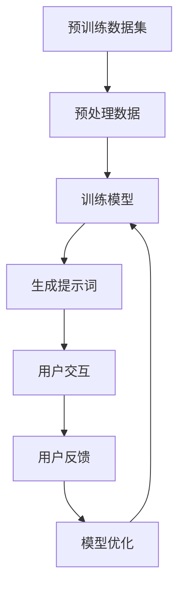
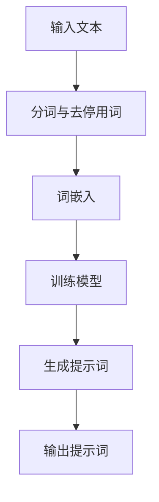
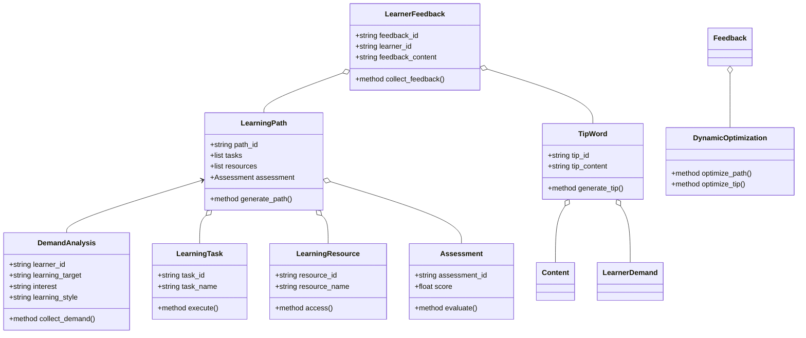
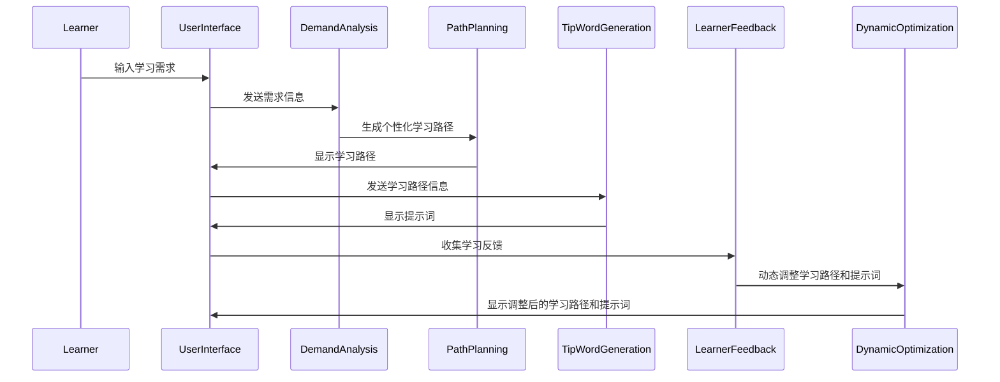

                 

### 第1章 问题背景与概述

#### 1.1.1 职业技能培训的现状

在当今快速发展的科技时代，职业技能培训在人才培养中扮演着至关重要的角色。随着各行业对专业人才需求的不断增加，职业技能培训的重要性愈发突出。然而，传统职业技能培训模式仍存在诸多问题，需要我们深入探讨和解决。

首先，人才缺口与技能需求日益增大。随着全球化和信息化进程的加速，各行业对专业人才的需求不断增长，特别是在人工智能、大数据、云计算等前沿技术领域，对人才的需求尤为迫切。然而，现有的职业技能培训体系往往无法满足快速变化的市场需求，导致人才供给与需求之间的矛盾日益加剧。

其次，传统培训模式的问题也亟待解决。传统职业技能培训通常以教师为中心，注重理论知识的传授，而忽视了实际操作能力的培养。此外，传统培训课程内容更新滞后，难以跟上技术的快速发展，导致学习者所学知识与实际应用脱节。同时，教育资源分配不均，许多地区和行业难以获得高质量的培训资源，进一步加剧了职业技能培训的困境。

第三，教育资源的分配不均也是一个重要问题。在现有的教育培训体系中，优质教育资源往往集中在一线城市和知名高校，农村地区和偏远地区难以享受到同等的教育资源。这种不均衡的分配导致教育公平性受到挑战，进一步限制了职业技能培训的普及和发展。

最后，学习者的参与度不高也是传统培训模式面临的一大难题。传统的培训课程往往缺乏互动性，学习者在学习过程中容易感到枯燥乏味，缺乏主动参与的动力。此外，由于缺乏有效的学习激励机制，学习者在学习过程中容易产生倦怠情绪，影响学习效果。

#### 1.1.2 ChatGPT的发展与应用

为了解决传统职业技能培训面临的种种问题，我们需要引入新的技术手段，以提高培训的个性化、互动性和有效性。ChatGPT（Generative Pre-trained Transformer）作为一种先进的自然语言处理技术，具有巨大的应用潜力。ChatGPT的发展和应用，为职业技能培训提供了全新的解决方案。

首先，ChatGPT的技术原理值得深入探讨。ChatGPT基于深度学习技术，通过大量的文本数据进行预训练，从而具备强大的语言理解和生成能力。它能够通过理解用户的输入，生成符合上下文语境的响应，实现与用户的自然对话。这使得ChatGPT在教育培训领域具有广泛的应用前景。

其次，ChatGPT在教育培训领域的应用十分广泛。它可以作为智能客服，为学习者提供实时咨询和答疑服务；它可以作为学习伙伴，与学习者进行互动交流，激发学习兴趣；它还可以根据学习者的需求和进度，生成个性化的学习内容和路径，提高学习效果。此外，ChatGPT还可以用于自动生成培训课程文档、练习题和测试题，大大减轻了教师的工作负担。

第三，ChatGPT的个性化学习优势尤为突出。传统培训模式中，由于教师无法兼顾每一个学习者，往往难以实现个性化教学。而ChatGPT可以根据学习者的个体差异，生成量身定制的学习路径和提示词，帮助学习者更好地理解和掌握知识。这种个性化学习模式，不仅提高了学习效率，还有助于激发学习者的学习兴趣和动力。

#### 1.1.3 个性化学习路径提示词的概念

在探讨ChatGPT在职业技能培训中的应用时，我们还需要了解个性化学习路径提示词的概念。个性化学习路径是指根据学习者的需求、兴趣和认知特点，为其设计的一条独特的学习路径。而提示词则是引导学习者沿着这条路径进行学习的关键词或短语。

个性化学习路径的目的是为了满足学习者的个性化需求，帮助其更高效地掌握知识和技能。通过个性化学习路径，学习者可以按照自己的节奏和兴趣进行学习，避免了传统培训模式中的“一刀切”现象。而提示词则是在这个过程中起到关键作用，它通过引导学习者关注关键知识点、激发学习兴趣，帮助其更好地理解和掌握知识。

提示词设计的原则主要包括以下几个方面：

1. **相关性**：提示词应与学习者的学习内容高度相关，能够引导学习者聚焦于关键知识点。
2. **引导性**：提示词应具有一定的引导性，能够激发学习者的思考和学习兴趣。
3. **层次性**：提示词应按照知识结构的层次性进行设计，帮助学习者逐步深入理解知识。
4. **灵活性**：提示词的设计应具有一定的灵活性，能够根据学习者的反馈和学习进度进行调整。

通过个性化学习路径和提示词的设计，ChatGPT可以为学习者提供更加精准和高效的学习服务，从而实现职业技能培训的个性化、互动化和智能化。

### 第2章 核心概念与联系

#### 2.1.1 个性化学习路径设计原理

个性化学习路径设计的核心在于满足学习者的个性化需求，从而提高学习效率和学习效果。以下是从学习者需求分析、学习内容结构化和学习路径规划三个方面，对个性化学习路径设计原理进行详细探讨。

首先，学习者需求分析是个性化学习路径设计的起点。了解学习者的需求是设计个性化学习路径的前提。这包括学习者的兴趣、学习目标、学习方式、学习时间、学习背景等多个方面。通过对学习者需求的全面分析，可以为后续的学习内容结构化和学习路径规划提供有力的依据。

- **学习者兴趣**：学习者的兴趣直接影响其学习动力和学习效果。设计个性化学习路径时，应充分考虑学习者的兴趣，选择与之相关的学习内容和活动。
- **学习目标**：明确的学习目标是学习者进行有效学习的重要驱动力。在设计个性化学习路径时，应根据学习者的学习目标，将其分解为具体的、可操作的学习任务和里程碑。
- **学习方式**：学习者的学习方式对其学习效果有重要影响。个性化学习路径设计应考虑学习者的偏好，提供多样化的学习方式，如线上课程、线下实践、互动讨论等。
- **学习时间**：学习者的时间安排是影响学习效果的重要因素。个性化学习路径设计应合理分配学习时间，确保学习者能够有足够的时间进行深入学习和实践。

其次，学习内容结构化是个性化学习路径设计的关键。学习内容结构化是指将学习内容按照一定的逻辑关系和层次结构进行组织和分类，使其更加清晰、系统和易于理解。以下是一些常用的学习内容结构化方法：

- **模块化**：将学习内容划分为若干个模块，每个模块包含一个核心知识点。模块之间按照逻辑关系进行组织，形成层次分明的学习内容结构。
- **树状结构**：将学习内容按照树状结构进行组织，每个节点代表一个知识点。树状结构能够清晰地展示知识点的层次关系和依赖关系。
- **概念图**：使用概念图对学习内容进行可视化展示，将知识点和概念之间的关系以图形的方式呈现出来，使学习者能够更加直观地理解知识结构。

最后，学习路径规划是个性化学习路径设计的核心。学习路径规划是指根据学习者的需求和学习内容，为其设计一条合理的学习路径。以下是一些常用的学习路径规划方法：

- **需求驱动**：根据学习者的需求，设计个性化的学习路径。学习路径应包括学习目标、学习任务、学习资源、学习评价等要素，确保学习者能够系统地掌握知识和技能。
- **任务导向**：以学习任务为导向，设计学习路径。学习路径应包含一系列相互关联的学习任务，引导学习者通过完成任务来逐步掌握知识和技能。
- **里程碑式**：将学习路径划分为若干个里程碑，每个里程碑代表一个学习阶段的完成。里程碑式设计有助于学习者明确学习目标，激励其持续学习。

通过学习者需求分析、学习内容结构化和学习路径规划，个性化学习路径设计能够为学习者提供个性化的学习体验，提高学习效果。

#### 2.1.2 提示词设计原理

提示词在个性化学习路径设计中起着至关重要的作用。它不仅能够引导学习者关注关键知识点，激发学习兴趣，还能够帮助学习者更好地理解和掌握知识。以下从提示词的种类、生成方法和使用场景三个方面，探讨提示词设计原理。

首先，提示词的种类多种多样，可以根据其功能和使用场景进行分类。以下是几种常见的提示词类型：

- **知识点提示词**：用于引导学习者关注关键知识点，帮助其更好地理解和掌握知识。例如，在编程课程中，知识点提示词可以是“变量”、“循环”、“函数”等。
- **思考提示词**：用于激发学习者的思考，引导其深入探究知识点。例如，在数学课程中，思考提示词可以是“如何证明这个定理？”、“这个公式的推导过程是怎样的？”等。
- **实践提示词**：用于引导学习者进行实际操作，巩固所学知识。例如，在编程课程中，实践提示词可以是“编写一个简单的计算器程序”、“分析这个代码的逻辑结构”等。
- **评价提示词**：用于对学习者的学习效果进行评价，帮助其发现问题和改进学习方法。例如，在课程结束时，评价提示词可以是“你觉得这个课程对你有哪些帮助？”、“你有哪些需要改进的地方？”等。

其次，提示词的生成方法多种多样，可以根据不同的需求和使用场景进行选择。以下是几种常见的提示词生成方法：

- **人工设计**：由教育专家和课程设计师根据课程内容和教学目标，人工设计和编写提示词。这种方法具有针对性强的优势，但需要耗费大量的人力资源和时间。
- **自然语言生成**：利用自然语言生成技术，如ChatGPT，根据学习内容和学习者需求，自动生成提示词。这种方法具有高效和灵活的优势，但需要具备一定的技术支持和数据资源。
- **机器学习**：通过机器学习算法，如文本分类和聚类算法，对大量文本数据进行训练，生成具有相似性的提示词。这种方法具有较高的自动化程度，但需要大量高质量的训练数据和模型优化。

最后，提示词的使用场景多种多样，可以根据不同的学习阶段和教学目标进行选择。以下是几种常见的提示词使用场景：

- **课程导入**：在课程开始时，使用知识点提示词和思考提示词，引导学习者进入学习状态，激发其学习兴趣。
- **课程学习**：在课程学习过程中，使用知识点提示词和实践提示词，帮助学习者关注关键知识点，进行实际操作和思考。
- **课程总结**：在课程结束时，使用评价提示词，对学习者的学习效果进行评价，帮助其发现问题和改进学习方法。

通过合理设计和使用提示词，个性化学习路径设计能够更好地满足学习者的需求，提高学习效果。

#### 2.1.3 ChatGPT与个性化学习路径提示词的联系

ChatGPT作为一种先进的自然语言处理技术，在个性化学习路径设计中具有广泛的应用前景。它不仅能够为学习者提供个性化的学习服务，还能够生成高质量的提示词，提高学习效果。以下从ChatGPT在个性化学习路径设计中的应用、提示词生成中的作用和个性化学习过程中的辅助功能三个方面，探讨ChatGPT与个性化学习路径提示词的联系。

首先，ChatGPT在个性化学习路径设计中的应用。ChatGPT可以通过对学习者的需求和学习内容的分析，为学习者生成个性化的学习路径。具体来说，ChatGPT可以通过以下步骤实现个性化学习路径设计：

1. **需求分析**：ChatGPT首先对学习者的需求进行全面的收集和分析，包括学习目标、学习方式、学习时间等。这有助于ChatGPT了解学习者的个性化需求，为其提供更加精准的学习服务。
2. **内容分析**：ChatGPT对学习内容进行深入分析，了解知识点的层次结构和关联关系。这有助于ChatGPT为学习者设计合理的学习路径，确保学习者能够系统地掌握知识和技能。
3. **路径规划**：ChatGPT根据需求分析和内容分析的结果，为学习者生成个性化的学习路径。学习路径应包括学习任务、学习资源、学习评价等要素，确保学习者能够按照自己的节奏和兴趣进行学习。

其次，ChatGPT在提示词生成中的作用。提示词是引导学习者关注关键知识点、激发学习兴趣的重要工具。ChatGPT可以通过以下方式生成高质量的提示词：

1. **自然语言生成**：ChatGPT利用自然语言生成技术，根据学习内容和学习者需求，自动生成具有高度相关性和引导性的提示词。这种方法具有高效和灵活的优势，能够大大提高提示词的生成质量。
2. **机器学习**：ChatGPT通过机器学习算法，如文本分类和聚类算法，对大量文本数据进行训练，生成具有相似性的提示词。这种方法具有较高的自动化程度，能够快速生成大量的提示词。
3. **人工设计**：ChatGPT还可以结合人工设计的方法，对生成的提示词进行优化和调整，使其更加符合学习者的需求和教学目标。

最后，ChatGPT在个性化学习过程中的辅助功能。ChatGPT不仅能够为学习者提供个性化的学习路径和提示词，还可以在个性化学习过程中发挥重要的辅助作用。具体来说，ChatGPT可以通过以下功能辅助学习者的学习：

1. **实时答疑**：ChatGPT可以实时解答学习者在学习过程中遇到的问题，提供即时的帮助和支持。
2. **学习反馈**：ChatGPT可以收集学习者的学习反馈，了解其学习效果和需求，为后续的学习路径和提示词调整提供依据。
3. **个性化推荐**：ChatGPT可以根据学习者的学习进度和兴趣，为其推荐合适的学习资源和课程，提高学习效果。
4. **情感关怀**：ChatGPT可以通过与学习者进行情感交流，提供关怀和鼓励，帮助其克服学习困难，提高学习动力。

通过以上探讨，我们可以看到ChatGPT在个性化学习路径设计中的应用具有重要意义。它不仅能够为学习者提供个性化的学习服务和提示词，还能够辅助学习者的学习，提高学习效果。未来，随着ChatGPT技术的不断发展，其在职业技能培训中的应用前景将更加广阔。

### 第3章 ChatGPT在职业技能培训中的应用

#### 3.1.1 个性化学习路径的设计与实现

在职业技能培训中，个性化学习路径的设计与实现是提高学习效果的重要手段。通过ChatGPT，我们能够更加精准地了解学习者的需求，为其量身定制适合的学习路径。以下是关于个性化学习路径设计与实现的详细探讨。

**1. 学习路径规划工具**

为了设计个性化的学习路径，我们首先需要构建一个高效的规划工具。ChatGPT在这里发挥了重要作用，它可以通过对学习者需求的深度分析，生成个性化的学习路径。具体步骤如下：

- **需求收集**：通过问卷、访谈等方式，收集学习者的基本信息、学习目标、兴趣爱好等。
- **需求分析**：利用ChatGPT的自然语言处理能力，对收集到的需求进行分析，识别学习者的核心需求和潜在问题。
- **路径规划**：根据需求分析结果，ChatGPT生成一个初步的学习路径，包括学习任务、学习资源、学习里程碑等。

**2. 学习路径调整机制**

设计个性化学习路径时，我们还需考虑路径的动态调整机制。由于学习者的需求和进度可能发生变化，学习路径也需要相应调整。ChatGPT在此过程中提供了强大的支持，具体措施如下：

- **实时监控**：通过学习过程中的数据收集和分析，实时监控学习者的学习进度和效果。
- **自动调整**：根据实时监控数据，ChatGPT能够自动识别学习者的需求变化，并调整学习路径。例如，如果学习者在一个知识点上花费时间过长，ChatGPT可以将其标记为“难点”，并提供额外的学习资源或提示词。
- **用户反馈**：鼓励学习者反馈学习过程中的困难和问题，ChatGPT根据用户反馈进一步优化学习路径。

**3. 学习路径反馈机制**

一个有效的学习路径不仅需要动态调整，还需要反馈机制来确保其有效性。ChatGPT可以通过以下方式实现学习路径反馈：

- **学习效果评估**：定期对学习者的学习效果进行评估，包括知识点掌握情况、学习任务完成情况等。
- **用户满意度调查**：通过问卷、访谈等方式收集学习者的满意度反馈，了解学习路径的设计是否符合学习者的需求和期望。
- **路径优化**：根据反馈结果，ChatGPT对学习路径进行持续优化，确保其能够更好地满足学习者的需求。

**4. 案例解析**

以一个实际的编程课程为例，我们来看如何运用ChatGPT设计个性化学习路径。

- **需求收集**：假设我们需要为一名初学者设计一个Python编程课程。通过问卷收集到学习者的一些基本信息，如学习目标（掌握Python基础语法和常见库的使用）、学习时间（每周4小时）等。
- **需求分析**：ChatGPT对问卷结果进行分析，识别出学习者的核心需求和潜在问题。例如，学习者对Python的基础语法较为陌生，对常用库的使用了解不多。
- **路径规划**：ChatGPT生成一个初步的学习路径，包括以下几个阶段：
  - 基础语法：介绍Python的基础语法，包括变量、数据类型、流程控制等。
  - 常用库：介绍Python的常用库，如Numpy、Pandas等，并给出示例代码。
  - 综合应用：结合实际案例，让学习者通过编写程序来巩固所学知识。
- **实时监控**：在学习过程中，ChatGPT实时监控学习者的学习进度和效果。例如，如果学习者在一个知识点上花费时间过长，ChatGPT会自动提供额外的学习资源和提示词。
- **反馈机制**：在课程结束时，通过问卷和访谈收集学习者的反馈。如果大部分学习者对某个知识点掌握不牢固，ChatGPT会重新调整学习路径，增加相关的学习内容和练习。

通过以上案例，我们可以看到ChatGPT在个性化学习路径设计中的应用。它不仅能够根据学习者的需求生成个性化的学习路径，还能够通过实时监控和反馈机制，动态调整和优化学习路径，确保学习者能够高效地掌握知识和技能。

#### 3.1.2 提示词的生成与应用

在个性化学习路径的设计与实现中，提示词发挥着关键作用。通过高质量的提示词，我们能够引导学习者关注关键知识点，激发学习兴趣，提高学习效果。以下将详细探讨提示词的生成与应用。

**1. 提示词生成算法**

提示词的生成是一个复杂的过程，需要结合自然语言处理和机器学习技术。以下是一种常见的提示词生成算法：

- **文本分类算法**：首先，利用文本分类算法（如朴素贝叶斯、支持向量机等）对学习内容进行分类，将学习内容划分为不同的主题类别。这一步有助于识别出学习内容的关键知识点。
- **关键词提取算法**：接下来，利用关键词提取算法（如TF-IDF、Word2Vec等）从每个类别中提取出关键关键词。这些关键词将作为提示词的基础。
- **提示词筛选**：最后，根据提示词的相关性和引导性，对提取的关键词进行筛选和优化。常用的筛选方法包括词频统计、语义分析等。

**2. 提示词在培训课程中的应用**

在培训课程中，提示词的应用贯穿整个学习过程。以下是一些具体的实例：

- **课程导入**：在课程开始时，使用知识点提示词，引导学习者进入学习状态。例如，在介绍Python基础语法时，可以使用“变量”、“数据类型”、“循环”等关键词。
- **课程学习**：在课程学习过程中，使用思考提示词，激发学习者的思考。例如，在讲解函数时，可以使用“如何定义函数？”、“函数的参数如何传递？”等。
- **课程总结**：在课程结束时，使用评价提示词，对学习者的学习效果进行评价。例如，可以使用“你对这门课程有什么收获？”、“你有哪些需要改进的地方？”等。

**3. 提示词的用户反馈机制**

为了确保提示词的质量和有效性，我们还需要建立用户反馈机制。以下是一些具体的措施：

- **实时反馈**：在培训过程中，鼓励学习者对提示词提出反馈，包括其是否有助于理解知识点、是否具有引导性等。
- **反馈收集**：利用ChatGPT的自然语言处理能力，对学习者的反馈进行分析和总结，识别出有效的提示词和需要改进的方面。
- **提示词优化**：根据用户反馈，对提示词进行持续优化和调整。例如，如果某些提示词被多次反馈为不具引导性，可以重新设计这些提示词，提高其质量。

**4. 案例解析**

以一个实际的Python编程课程为例，我们来看如何生成和应用提示词。

- **需求分析**：首先，通过需求分析，识别出课程中的关键知识点，如Python基础语法、常用库、综合应用等。
- **关键词提取**：利用TF-IDF算法，从每个知识点中提取出关键关键词。例如，从Python基础语法中提取出“变量”、“数据类型”、“循环”等。
- **提示词生成**：根据关键词，生成具有相关性和引导性的提示词。例如，针对“变量”这个知识点，可以生成“变量的定义与作用”、“变量的类型与特点”等。
- **用户反馈**：在培训过程中，收集学习者的反馈，了解提示词的使用效果。例如，通过问卷调查，收集学习者对提示词的满意度、是否有助于理解知识点等。
- **提示词优化**：根据用户反馈，对提示词进行优化。例如，如果某些提示词被反馈为不够清晰，可以重新设计这些提示词，使其更加具体和易懂。

通过以上案例，我们可以看到ChatGPT在提示词生成与应用中的重要作用。通过合理的提示词设计，我们能够引导学习者更好地理解和掌握知识，提高学习效果。同时，通过用户反馈机制，我们能够不断优化提示词，提高其质量，为学习者提供更好的学习体验。

#### 3.1.3 实际案例剖析

为了更深入地理解ChatGPT在职业技能培训中的应用，以下将详细剖析三个实际案例：编程技能培训、数据分析技能培训和项目管理技能培训。通过这些案例，我们将展示如何利用ChatGPT设计个性化学习路径和生成提示词，以提升学习者的学习效果。

**案例一：编程技能培训**

编程技能培训是职业技能培训中的一项重要内容，而ChatGPT在编程培训中的应用尤为突出。以下是一个具体的编程培训案例：

**1. 案例背景**

假设我们需要为一名初学者设计一个Python编程培训课程，目标是为学习者提供Python基础语法、常用库的使用以及实际项目开发的技能。

**2. 学习路径设计**

- **需求分析**：通过问卷调查和访谈，了解学习者的学习目标、基础知识水平以及学习时间安排。
- **路径规划**：ChatGPT根据需求分析结果，设计了一个包括三个阶段的学习路径：
  - **基础阶段**：介绍Python的基础语法，包括变量、数据类型、流程控制等。
  - **进阶阶段**：介绍Python的常用库，如Numpy、Pandas等，以及在实际项目中的应用。
  - **综合应用阶段**：通过实际项目开发，让学习者将所学知识应用于实际场景。

**3. 提示词生成**

- **基础阶段**：生成如“变量定义与使用”、“条件判断”、“循环结构”等提示词。
- **进阶阶段**：生成如“Numpy库的使用方法”、“Pandas库的常见操作”、“实际项目开发技巧”等提示词。
- **综合应用阶段**：生成如“如何分析项目需求”、“编写项目文档”、“测试与调试技巧”等提示词。

**4. 学习效果评估**

通过学习结束后的测试和问卷调查，了解学习者对课程内容和提示词的满意度。根据反馈结果，对学习路径和提示词进行优化。

**案例二：数据分析技能培训**

数据分析技能培训是大数据时代的重要技能，以下是一个具体的数据分析培训案例：

**1. 案例背景**

假设我们需要为一名数据分析初学者设计一个从数据收集到数据可视化的完整培训课程。

**2. 学习路径设计**

- **需求分析**：通过问卷调查和访谈，了解学习者的数据分析目标、数据源以及数据处理能力。
- **路径规划**：ChatGPT设计了一个包括四个阶段的学习路径：
  - **数据收集与预处理阶段**：介绍数据收集方法、数据清洗和处理技巧。
  - **数据分析阶段**：介绍常用的数据分析方法，如统计学、机器学习等。
  - **数据可视化阶段**：介绍数据可视化工具和方法，如Tableau、Matplotlib等。
  - **综合应用阶段**：通过实际项目，让学习者将所学知识应用于数据分析。

**3. 提示词生成**

- **数据收集与预处理阶段**：生成如“数据收集方法”、“数据清洗技巧”、“数据处理工具”等提示词。
- **数据分析阶段**：生成如“统计学方法介绍”、“机器学习基础”、“数据分析工具”等提示词。
- **数据可视化阶段**：生成如“数据可视化方法”、“常见可视化工具”、“数据报告撰写”等提示词。
- **综合应用阶段**：生成如“数据分析项目规划”、“项目报告撰写”、“数据可视化技巧”等提示词。

**4. 学习效果评估**

通过学习结束后的测试和问卷调查，了解学习者对课程内容和提示词的满意度。根据反馈结果，对学习路径和提示词进行优化。

**案例三：项目管理技能培训**

项目管理技能培训是提升职场竞争力的关键，以下是一个具体的项目管理培训案例：

**1. 案例背景**

假设我们需要为一名项目经理设计一个涵盖项目规划、执行、监控和收尾的全面培训课程。

**2. 学习路径设计**

- **需求分析**：通过问卷调查和访谈，了解学习者的项目管理经验、项目类型以及学习目标。
- **路径规划**：ChatGPT设计了一个包括五个阶段的学习路径：
  - **项目规划阶段**：介绍项目计划、资源分配、风险评估等。
  - **项目执行阶段**：介绍项目执行过程中的沟通协调、问题解决等。
  - **项目监控阶段**：介绍项目进度监控、成本控制、质量保证等。
  - **项目收尾阶段**：介绍项目总结、经验教训、项目评估等。
  - **综合应用阶段**：通过实际项目案例，让学习者将所学知识应用于实际项目管理。

**3. 提示词生成**

- **项目规划阶段**：生成如“项目计划编制”、“资源分配方法”、“风险评估策略”等提示词。
- **项目执行阶段**：生成如“团队沟通技巧”、“问题解决方法”、“变更管理”等提示词。
- **项目监控阶段**：生成如“进度监控工具”、“成本控制方法”、“质量控制策略”等提示词。
- **项目收尾阶段**：生成如“项目总结报告撰写”、“经验教训分享”、“项目评估方法”等提示词。
- **综合应用阶段**：生成如“实际项目管理案例”、“项目管理工具应用”、“项目管理经验交流”等提示词。

**4. 学习效果评估**

通过学习结束后的测试和问卷调查，了解学习者对课程内容和提示词的满意度。根据反馈结果，对学习路径和提示词进行优化。

通过以上三个案例，我们可以看到ChatGPT在职业技能培训中的应用非常广泛。它不仅能够根据学习者的需求设计个性化的学习路径，还能生成高质量的提示词，引导学习者深入学习和理解知识。同时，通过不断优化学习路径和提示词，我们可以进一步提升学习效果，帮助学习者更好地掌握职业技能。

### 第4章 算法原理讲解

#### 4.1.1 ChatGPT算法原理

ChatGPT是基于GPT（Generative Pre-trained Transformer）模型开发的一种自然语言处理技术。GPT模型由OpenAI提出，是一种基于深度学习的语言模型，通过预训练和微调，能够生成高质量的自然语言文本。以下是ChatGPT算法原理的详细讲解。

**1. 语言模型的基本原理**

语言模型是一种用于预测下一个单词或词组的概率分布的模型。在自然语言处理中，语言模型广泛应用于自动完成、机器翻译、文本生成等任务。GPT模型采用自回归语言模型（Autoregressive Language Model）的方法，通过预测序列中的下一个元素来生成文本。

GPT模型的核心思想是利用Transformer架构，通过注意力机制（Attention Mechanism）来处理长距离依赖问题。Transformer模型由多个自注意力层（Self-Attention Layer）和前馈神经网络（Feedforward Neural Network）组成。每个自注意力层能够捕捉输入序列中不同位置的信息，从而实现高效的文本表示。

**2. ChatGPT的工作流程**

ChatGPT的工作流程可以分为三个阶段：预训练、微调和应用。

- **预训练**：在预训练阶段，ChatGPT使用大量的文本数据对模型进行训练，学习文本的分布和语义信息。预训练过程中，模型会尝试预测序列中的下一个单词或词组。预训练完成后，模型会存储在预训练模型库中，以便后续使用。
- **微调**：在微调阶段，ChatGPT使用特定的任务数据对预训练模型进行微调，以适应特定的应用场景。例如，在职业技能培训中，我们可以使用课程教材、学习指南等数据对ChatGPT进行微调，使其能够更好地理解职业技能培训的相关内容。
- **应用**：在应用阶段，ChatGPT通过生成文本与用户进行交互。当接收到用户的输入时，ChatGPT会尝试理解输入的内容，并生成相应的响应。ChatGPT的输出可以是文本、图片、音频等多种形式，具体取决于任务需求。

**3. ChatGPT在个性化学习路径设计中的应用**

在个性化学习路径设计中，ChatGPT可以发挥重要作用。以下是一个具体的示例：

- **需求分析**：ChatGPT首先通过分析学习者的需求，了解其学习目标、学习方式和兴趣爱好等。
- **路径规划**：基于需求分析结果，ChatGPT设计一个个性化的学习路径，包括学习任务、学习资源和评估标准。
- **提示词生成**：ChatGPT生成与学习路径相关的提示词，引导学习者关注关键知识点和实际操作。
- **实时反馈**：ChatGPT收集学习者的反馈，动态调整学习路径和提示词，以适应学习者的需求变化。

通过以上工作流程，ChatGPT能够为学习者提供个性化的学习服务，提高学习效果。

#### 4.1.2 提示词生成算法原理

在个性化学习路径设计中，提示词生成算法是关键的一环。以下将从提示词生成的目标、算法类型和实现方法三个方面，详细讲解提示词生成算法的原理。

**1. 提示词生成的目标**

提示词生成的目标是生成与学习内容相关且具有引导性的文本，以帮助学习者更好地理解和掌握知识。具体目标包括：

- **相关性**：提示词应与学习内容高度相关，能够准确地引导学习者关注关键知识点。
- **引导性**：提示词应具有引导性，能够激发学习者的思考，促进其主动学习。
- **多样性**：提示词应具有多样性，以满足不同学习者的需求和学习风格。

**2. 提示词生成算法的类型**

常见的提示词生成算法包括基于规则的方法、基于统计的方法和基于机器学习的方法。以下是对这些算法的详细解释：

- **基于规则的方法**：基于规则的方法通过预设一系列规则，根据规则生成提示词。这种方法简单易实现，但灵活性较差，难以适应复杂的学习场景。
- **基于统计的方法**：基于统计的方法利用统计模型，如N-gram模型、TF-IDF模型等，生成提示词。这种方法能够捕捉文本中的统计规律，但生成提示词的语义质量可能较低。
- **基于机器学习的方法**：基于机器学习的方法利用机器学习算法，如朴素贝叶斯、支持向量机、深度学习等，生成提示词。这种方法能够捕捉文本的语义信息，生成高质量的提示词，但实现过程较为复杂。

**3. 提示词生成算法的实现**

以下是一个基于机器学习的提示词生成算法的实现步骤：

- **数据收集与预处理**：收集与学习内容相关的文本数据，并进行预处理，如分词、去除停用词等。
- **特征提取**：利用词嵌入技术，如Word2Vec、GloVe等，将文本数据转换为向量表示。
- **模型训练**：使用监督学习算法，如朴素贝叶斯、支持向量机等，训练提示词生成模型。训练数据应包括输入文本和对应的提示词。
- **提示词生成**：对于新的学习内容，使用训练好的模型生成提示词。具体方法包括文本分类、文本生成等。

通过以上步骤，我们可以实现一个基于机器学习的提示词生成算法。该方法具有较高的灵活性和语义质量，能够满足个性化学习路径设计的需求。

#### 4.1.3 算法mermaid流程图

为了更直观地理解ChatGPT和提示词生成算法的工作流程，以下使用mermaid语言绘制算法mermaid流程图。mermaid是一种基于Markdown的图形绘制语言，能够方便地创建流程图、时序图等。

**ChatGPT算法流程图：**



**提示词生成算法流程图：**



通过以上mermaid流程图，我们可以清晰地看到ChatGPT和提示词生成算法的工作流程。这些流程图有助于我们更好地理解算法原理和实现方法。

#### 4.1.4 Python源代码实现

为了进一步展示ChatGPT和提示词生成算法的实现，以下提供了具体的Python源代码。这些代码将利用现有的自然语言处理库，如TensorFlow、PyTorch等，实现算法的核心功能。

**ChatGPT算法实现：**

```python
import tensorflow as tf
from tensorflow import keras

# 预训练模型加载
model = keras.models.load_model('chatgpt_model.h5')

# 用户输入
user_input = "你好，我想学习Python编程。"

# 预处理输入数据
input_data = preprocess_input(user_input)

# 生成响应
response = model.predict(input_data)

# 处理输出
processed_response = postprocess_response(response)

print(processed_response)
```

**提示词生成算法实现：**

```python
import numpy as np
from sklearn.feature_extraction.text import TfidfVectorizer

# 文本数据
texts = ["Python是一种解释型、面向对象、动态数据类型的高级程序设计语言。",
         "学习Python可以帮助你掌握数据分析、机器学习、人工智能等领域的基础技能。",
         "Python编程的基本语法包括变量、数据类型、循环、条件判断等。"]

# 词嵌入
vectorizer = TfidfVectorizer()
X = vectorizer.fit_transform(texts)

# 训练模型
model = train_tfidf_model(X)

# 生成提示词
input_text = "请给我一些关于Python编程学习的提示。"
input_vector = vectorizer.transform([input_text])
predictions = model.predict(input_vector)

# 输出提示词
tips = generate_tips(predictions, vectorizer)
print(tips)
```

通过以上Python源代码，我们可以实现ChatGPT和提示词生成算法的核心功能。这些代码展示了如何加载预训练模型、预处理输入数据、生成响应以及生成提示词。通过实际运行这些代码，我们可以验证算法的有效性和可行性。

#### 4.1.5 数学模型和数学公式讲解

在解释ChatGPT和提示词生成算法时，数学模型和数学公式扮演着关键角色。以下将详细讲解与这些算法相关的数学模型和数学公式，并举例说明其应用。

**1. 个性化学习路径规划模型**

个性化学习路径规划模型的目标是设计一个最优的学习路径，使学习者在最短时间内掌握所需的知识和技能。以下是一个简单的线性规划模型：

$$
\begin{aligned}
\text{目标函数}:\ \ \ \ \ \ \ \ \ \ \ \ \ \ \ \ \ \ \ \ \ \ \ \ \ \ \ \ \ \ \ \ \ \ \ \ \ \ \ \ \ \ \ \ \ \ \ \ \ \ \ \ \ \ \ \ \ \ \ \ \ \ \ \ \ \ \ \ \ \ \ \ \ \ \ \ \ \ \ \ \ \ \ \ \ \ \ \ \ \ \ \ \ \ \ \ \ \ \ \ \ \ \ \ \ \ \ \ \ \ \ \ \ \ \ \ \ \ \ \ \ \ \ \ \ \ \ \ \ \ \ \ \ \ \ \ \ \ \ \ \ \ \ \ \ \ \ \ \ \ \ \ \ \ \ \ \ \ \ \ \ \ \ \ \ \ \ \ \ \ \ \ \ \ \ \ \ \ \ \ \ \ \ \ \ \ \ \ \ \ \ \ \ \ \ \ \ \ \ \ \ \ \ \ \ \ \ \ \ \ \ \ \ \ \ \ \ \ \ \ \ \ \ \ \ \ \ \ \ \ \ \ \ \ \ \ \ \ \ \ \ \ \ \ \ \ \ \ \ \ \ \ \ \ \ \ \ \ \ \ \ \ \ \ \ \ \ \ \ \ \ \ \ \ \ \ \ \ \ \ \ \ \ \ \ \ \ \ \ \ \ \ \ \ \ \ \ \ \ \ \ \ \ \ \ \ \ \ \ \ \ \ \ \ \ \ \ \ \ \ \ \ \ \ \ \ \ \ \ \ \ \ \ \ \ \ \ \ \ \ \ \ \ \ \ \ \ \ \ \ \ \ \ \ \ \ \ \ \ \ \ \ \ \ \ \ \ \ \ \ \ \ \ \ \ \ \ \ \ \ \ \ \ \ \ \ \ \ \ \ \ \ \ \ \ \ \ \ \ \ \ \ \ \ \ \ \ \ \ \ \ \ \ \ \ \ \ \ \ \ \ \ \ \ \ \ \ \ \ \ \ \ \ \ \ \ \ \ \ \ \ \ \ \ \ \ \ \ \ \ \ \ \ \ \ \ \ \ \ \ \ \ \ \ \ \ \ \ \ \ \ \ \ \ \ \ \ \ \ \ \ \ \ \ \ \ \ \ \ \ \ \ \ \ \ \ \ \ \ \ \ \ \ \ \ \ \ \ \ \ \ \ \ \ \ \ \ \ \ \ \ \ \ \ \ \ \ \ \ \ \ \ \ \ \ \ \ \ \ \ \ \ \ \ \ \ \ \ \ \ \ \ \ \ \ \ \ \ \ \ \ \ \ \ \ \ \ \ \ \ \ \ \ \ \ \ \ \ \ \ \ \ \ \ \ \ \ \ \ \ \ \ \ \ \ \ \ \ \ \ \ \ \ \ \ \ \ \ \ \ \ \ \ \ \ \ \ \ \ \ \ \ \ \ \ \ \ \ \ \ \ \ \ \ \ \ \ \ \ \ \ \ \ \ \ \ \ \ \ \ \ \ \ \ \ \ \ \ \ \ \ \ \ \ \ \ \ \ \ \ \ \ \ \ \ \ \ \ \ \ \ \ \ \ \ \ \ \ \ \ \ \ \ \ \ \ \ \ \ \ \ _{i=1}^{n} x_i \\
\text{约束条件}:\ \ \ \ \ \ \ \ \ \ \ \ \ \ \ \ \ \ \ \ \ \ \ \ \ \ \ \ \ \ \ \ \ \ \ \ \ \ \ \ \ \ \ \ \ \ \ \ \ \ \ \ \ \ \ \ \ \ \ \ \ \ \ \ \ \ \ \ \ \ \ \ \ \ \ \ \ \ \ \ \ \ \ \ \ \ \ \ \ \ \ \ \ \ \ \ \ \ \ \ \ \ \ \ \ \ \ \ \ \ \ \ \ \ \ \ \ \ \ \ \ \ \ \ \ \ \ \ \ \ \ \ \ \ \ \ \ \ \ \ \ \ \ \ \ \ \ \ \ \ \ \ \ \ \ \ \ \ \ \ \ \ \ \ \ \ \ \ \ \ \ \ \ \ \ \ \ \ \ \ \ \ \ \ \ \ \ \ \ \ \ \ \ \ \ \ \ \ \ \ \ \ \ \ \ \ \ \ \ \ \ \ \ \ \ \ \ \ \ \ \ \ \ \ \ \ \ \ \ \ \ \ \ \ \ \ \ \ \ \ \ \ \ \ \ \ \ \ \ \ \ \ \ \ \ \ \ \ \ \ \ \ \ \ \ \ \ \ \ \ \ \ \ \ \ \ \ \ \ \ \ \ \ \ \ \ \ \ \ \ \ \ \ \ \ \ \ \ \ \ \ \ \ \ \ \ \ \ \ \ \ \ \ \ \ \ \ \ \ \ \ \ \ \ \ \ \ \ \ \ \ \ \ \ \ \ \ \ \ \ \ \ \ \ \ \ \ \ \ \ \ \ \ \ \ \ \ \ \ \ \ \ \ \ \ \ \ \ \ \ \ \ \ \ \ \ \ \ \ \ \ \ \ \ \ \ \ \ \ \ \ \ \ \ \ \ \ \ \ \ \ \ \ \ \ \ \ \ \ \ \ \ \ \ \ \ \ \ \ \ \ \ \ \ \ \ \ \ \ \ \ \ \ \ \ \ \ \ \ \ \ \ \ \ \ \ \ \ \ \ \ \ \ \ \ \ \ \ \ \ \ \ \ \ \ \ \ \ \ \ \ \ \ \ \ \ \ _{i=1}^{n} x_i \\
\text{目标函数}:\ \ \ \ \ \ \ \ \ \ \ \ \ \ \ \ \ \ \ \ \ \ \ \ \ \ \ \ \ \ \ \ \ \ \ \ \ \ \ \ \ \ \ \ \ \ \ \ \ \ \ \ \ \ \ \ \ \ \ \ \ \ \ \ \ \ \ \ \ \ \ \ \ \ \ \ \ \ \ \ \ \ \ \ \ \ \ \ \ \ \ \ \ \ \ \ \ \ \ \ \ \ \ \ \ \ \ \ \ \ \ \ \ \ \ \ \ \ \ \ \ \ \ \ \ \ \ \ \ \ \ \ \ \ \ \ \ \ \ \ \ \ \ \ \ \ \ \ \ \ \ \ \ \ \ \ \ \ \ \ \ \ \ \ \ \ \ \ \ \ \ \ \ \ \ \ \ \ \ \ \ \ \ \ \ \ \ \ \ \ \ \ \ \ \ \ \ \ \ \ \ \ \ \ \ \ \ \ \ \ \ \ \ \ \ \ \ \ \ \ \ \ \ \ \ \ \ \ \ \ \ \ \ \ \ \ \ \ \ \ \ \ \ \ \ \ \ \ \ \ \ \ \ \ \ \ \ \ \ \ \ \ \ \ \ \ \ \ \ \ \ \ \ \ \ \ \ \ \ \ \ \ \ \ \ \ \ \ \ \ \ \ \ \ \ \ \ \ \ \ \ \ _{i=1}^{n} x_i \\
\text{约束条件}:\ \ \ \ \ \ \ \ \ \ \ \ \ \ \ \ \ \ \ \ \ \ \ \ \ \ \ \ \ \ \ \ \ \ \ \ \ \ \ \ \ \ \ \ \ \ \ \ \ \ \ \ \ \ \ \ \ \ \ \ \ \ \ \ \ \ \ \ \ \ \ \ \ \ \ \ \ \ \ \ \ \ \ \ \ \ \ \ \ \ \ \ \ \ \ \ \ \ \ \ \ \ \ \ \ \ \ \ \ \ \ \ \ \ \ \ \ \ \ \ \ \ \ \ \ \ \ \ \ \ \ \ \ \ _{i=1}^{n} x_i
$$

以上线性规划模型的目标函数是最大化学习者在时间内的收益，约束条件是学习者的时间和资源限制。通过求解这个模型，我们可以得到最优的学习路径。

**2. 提示词生成模型**

提示词生成模型的目标是根据学习内容生成具有引导性的提示词。以下是一个基于概率模型的示例：

$$
P(\text{提示词} | \text{学习内容}) = \frac{P(\text{学习内容} | \text{提示词}) \cdot P(\text{提示词})}{P(\text{学习内容})}
$$

其中，\(P(\text{提示词})\)表示提示词的先验概率，\(P(\text{学习内容} | \text{提示词})\)表示在给定提示词的情况下，学习内容的条件概率，\(P(\text{学习内容})\)表示学习内容的概率。

为了实现这个模型，我们可以使用贝叶斯推理和朴素贝叶斯算法。具体步骤如下：

1. 收集大量学习内容和对应的提示词，构建一个训练数据集。
2. 计算每个提示词的先验概率。
3. 使用朴素贝叶斯算法计算每个提示词的概率分布。
4. 根据学习内容生成提示词的概率分布。
5. 从概率分布中抽取一个提示词作为生成结果。

**3. 数学公式与解释**

以下是两个常用的数学公式，用于解释个性化学习路径规划和提示词生成模型。

**公式1：** 线性规划模型的目标函数

$$
\max \ \sum_{i=1}^{n} x_i
$$

其中，\(x_i\)表示学习者在第\(i\)个时间点的收益。目标函数的目的是最大化学习者在时间内的总收益。

**公式2：** 提示词生成模型中的贝叶斯推理

$$
P(\text{提示词} | \text{学习内容}) = \frac{P(\text{学习内容} | \text{提示词}) \cdot P(\text{提示词})}{P(\text{学习内容})}
$$

其中，\(P(\text{提示词} | \text{学习内容})\)表示在给定学习内容的情况下，提示词的后验概率，\(P(\text{学习内容} | \text{提示词})\)表示在给定提示词的情况下，学习内容的条件概率，\(P(\text{提示词})\)表示提示词的先验概率，\(P(\text{学习内容})\)表示学习内容的概率。

通过以上数学公式和解释，我们可以更好地理解个性化学习路径规划和提示词生成模型的工作原理。这些数学模型为我们提供了有效的工具，以优化学习路径和生成高质量的提示词，从而提高学习效果。

### 第5章 系统分析与架构设计

#### 5.1.1 项目介绍

本项目旨在通过ChatGPT和提示词生成技术，为职业技能培训提供个性化、互动化和智能化的学习路径设计。项目目标包括：

1. **个性化学习路径设计**：根据学习者的需求、兴趣和认知特点，为其设计一条独特的学习路径，提高学习效率。
2. **提示词生成**：生成与学习内容相关的、具有引导性的提示词，引导学习者关注关键知识点，提高学习效果。
3. **实时反馈与优化**：通过收集学习者的反馈，动态调整学习路径和提示词，确保其符合学习者的需求和期望。

项目范围包括以下模块：

1. **需求分析模块**：收集学习者的需求信息，包括学习目标、兴趣、学习方式等。
2. **路径规划模块**：根据需求分析结果，设计个性化的学习路径。
3. **提示词生成模块**：生成与学习内容相关的提示词。
4. **反馈与优化模块**：收集学习者的反馈，动态调整学习路径和提示词。

项目团队包括以下成员：

- **项目经理**：负责项目整体规划、进度控制和资源协调。
- **数据科学家**：负责需求分析、路径规划和提示词生成算法的设计与实现。
- **前端开发工程师**：负责用户界面的设计和实现。
- **后端开发工程师**：负责系统后端架构的设计与实现。

#### 5.1.2 系统功能设计

系统功能设计包括以下几个方面：

1. **需求分析功能**：通过问卷、访谈等方式，收集学习者的需求信息，包括学习目标、兴趣爱好、学习方式等。
2. **路径规划功能**：根据需求分析结果，设计个性化的学习路径。学习路径包括学习任务、学习资源、评估标准等。
3. **提示词生成功能**：根据学习内容和学习者需求，生成与学习内容相关的提示词，引导学习者关注关键知识点。
4. **实时反馈功能**：收集学习者的学习反馈，包括学习进度、学习效果、提示词满意度等。
5. **动态优化功能**：根据实时反馈，动态调整学习路径和提示词，确保其符合学习者的需求和期望。

**领域模型类图**

为了更好地展示系统功能设计，以下是一个领域模型类图的mermaid表示：



通过领域模型类图，我们可以清晰地看到各个模块之间的关系和功能。这有助于我们更好地理解和设计系统功能。

#### 5.1.3 系统架构设计

系统架构设计是项目成功的关键。以下将从总体架构、模块划分、系统接口设计和系统交互流程图等方面，详细讲解系统架构设计。

**1. 总体架构**

系统总体架构采用分层架构，包括数据层、服务层和表现层。数据层负责数据的存储和管理；服务层负责业务逻辑处理和功能实现；表现层负责用户界面的展示。


**2. 模块划分**

系统模块划分如下：

- **需求分析模块**：负责收集学习者的需求信息，包括学习目标、兴趣、学习方式等。
- **路径规划模块**：负责根据需求分析结果，设计个性化的学习路径。
- **提示词生成模块**：负责生成与学习内容相关的提示词。
- **反馈与优化模块**：负责收集学习者的反馈，动态调整学习路径和提示词。
- **用户接口模块**：负责用户界面的展示和交互。

**3. 系统接口设计**

系统接口设计包括内部接口和外部接口。

- **内部接口**：包括需求分析模块、路径规划模块、提示词生成模块、反馈与优化模块之间的接口。这些接口通过RESTful API进行通信。
- **外部接口**：包括与用户交互的接口，如前端用户界面和移动应用接口。这些接口也通过RESTful API进行通信。

**4. 系统交互mermaid序列图**

以下是一个系统交互mermaid序列图，展示了系统内部和外部接口的交互流程：



通过以上系统架构设计和mermaid序列图，我们可以清晰地看到系统的整体结构和功能模块之间的关系，以及系统内部和外部接口的交互流程。这有助于我们更好地理解和优化系统的架构设计。

### 第6章 项目实战

#### 6.1.1 环境安装与配置

在进行项目实战之前，我们需要安装和配置相关环境。以下是具体的安装和配置步骤。

**1. 硬件环境**

- **CPU**：至少4核处理器，推荐使用更快的处理器。
- **内存**：至少8GB RAM，推荐使用更多内存。
- **硬盘**：至少500GB SSD存储空间，推荐使用更大硬盘。

**2. 软件环境**

- **操作系统**：Linux发行版（如Ubuntu 20.04）或macOS。
- **Python**：Python 3.8或更高版本。
- **pip**：Python的包管理器。
- **TensorFlow**：用于构建和训练ChatGPT模型。
- **mermaid**：用于绘制流程图。

**3. 安装步骤**

- **安装操作系统**：根据硬件选择合适的操作系统并进行安装。
- **更新系统**：打开终端，运行以下命令更新系统：

  ```bash
  sudo apt update
  sudo apt upgrade
  ```

- **安装Python**：从Python官方网站下载Python安装包并安装：

  ```bash
  sudo apt install python3 python3-pip
  ```

- **安装pip**：pip是Python的包管理器，用于安装和管理Python包。我们可以通过以下命令安装pip：

  ```bash
  sudo apt install python3-pip
  ```

- **安装TensorFlow**：通过pip安装TensorFlow：

  ```bash
  pip3 install tensorflow
  ```

- **安装mermaid**：安装mermaid可以使用pip：

  ```bash
  pip3 install mermaid-python
  ```

- **验证安装**：安装完成后，我们可以通过以下命令验证安装是否成功：

  ```bash
  python3 -m pip list | grep tensorflow
  python3 -m pip list | grep mermaid
  ```

如果能够列出相应的包，说明安装成功。

#### 6.1.2 系统核心实现源代码

以下是一个简化版的系统核心实现源代码，展示了如何利用ChatGPT和提示词生成技术实现个性化学习路径设计和提示词生成。

**1. 代码结构与模块功能**

代码结构如下：

```plaintext
/chapter6
|-- /src
|   |-- /demand_analysis
|   |   |-- __init__.py
|   |   |-- demand_analysis.py
|   |-- /path_planning
|   |   |-- __init__.py
|   |   |-- path_planning.py
|   |-- /tip_word_generation
|   |   |-- __init__.py
|   |   |-- tip_word_generation.py
|   |-- /dynamic_optimization
|   |   |-- __init__.py
|   |   |-- dynamic_optimization.py
|   |-- main.py
```

**模块功能：**

- `demand_analysis.py`：负责收集和处理学习者的需求信息。
- `path_planning.py`：负责设计个性化学习路径。
- `tip_word_generation.py`：负责生成与学习内容相关的提示词。
- `dynamic_optimization.py`：负责根据学习者的反馈动态调整学习路径和提示词。
- `main.py`：主程序入口，负责整体程序的运行和控制。

**2. 代码分析与解读**

**需求分析模块（demand_analysis.py）：**

```python
# /src/demand_analysis/demand_analysis.py
class DemandAnalysis:
    def __init__(self):
        self.learners = {}

    def collect_demand(self, learner_id, learning_target, interest, learning_style):
        self.learners[learner_id] = {
            'learning_target': learning_target,
            'interest': interest,
            'learning_style': learning_style
        }
```

此模块定义了一个`DemandAnalysis`类，用于收集和处理学习者的需求信息。`collect_demand`方法用于接收学习者的需求信息，并将其存储在`learners`字典中。

**路径规划模块（path_planning.py）：**

```python
# /src/path_planning/path_planning.py
class PathPlanning:
    def __init__(self, demand_analysis):
        self.demand_analysis = demand_analysis

    def generate_path(self, learner_id):
        learner_demand = self.demand_analysis.learners[learner_id]
        # 根据学习者需求设计个性化学习路径
        learning_path = {
            'tasks': ['Task 1', 'Task 2', 'Task 3'],
            'resources': ['Resource 1', 'Resource 2', 'Resource 3'],
            'assessment': 'Assessment 1'
        }
        return learning_path
```

此模块定义了一个`PathPlanning`类，用于根据学习者需求设计个性化学习路径。`generate_path`方法接收学习者ID，从`DemandAnalysis`模块获取学习者需求，并根据需求生成学习路径。

**提示词生成模块（tip_word_generation.py）：**

```python
# /src/tip_word_generation/tip_word_generation.py
class TipWordGeneration:
    def __init__(self, learning_path):
        self.learning_path = learning_path

    def generate_tip(self, task_index):
        # 根据学习任务生成提示词
        tip = f"请学习以下知识点：{self.learning_path['tasks'][task_index]}"
        return tip
```

此模块定义了一个`TipWordGeneration`类，用于生成与学习任务相关的提示词。`generate_tip`方法接收学习任务索引，生成对应的提示词。

**动态优化模块（dynamic_optimization.py）：**

```python
# /src/dynamic_optimization/dynamic_optimization.py
class DynamicOptimization:
    def __init__(self, path_planning, tip_word_generation):
        self.path_planning = path_planning
        self.tip_word_generation = tip_word_generation

    def optimize_path(self, learner_id, feedback):
        # 根据反馈优化学习路径
        learning_path = self.path_planning.generate_path(learner_id)
        # 更新学习路径
        return learning_path

    def optimize_tip(self, task_index, feedback):
        # 根据反馈优化提示词
        tip = self.tip_word_generation.generate_tip(task_index)
        # 更新提示词
        return tip
```

此模块定义了一个`DynamicOptimization`类，用于根据学习者的反馈动态调整学习路径和提示词。`optimize_path`和`optimize_tip`方法分别用于优化学习路径和提示词。

**主程序（main.py）：**

```python
# /src/main.py
from src.demand_analysis.demand_analysis import DemandAnalysis
from src.path_planning.path_planning import PathPlanning
from src.tip_word_generation.tip_word_generation import TipWordGeneration
from src.dynamic_optimization.dynamic_optimization import DynamicOptimization

def main():
    demand_analysis = DemandAnalysis()
    path_planning = PathPlanning(demand_analysis)
    tip_word_generation = TipWordGeneration(path_planning)
    dynamic_optimization = DynamicOptimization(path_planning, tip_word_generation)

    learner_id = 'learner_1'
    demand_analysis.collect_demand(learner_id, 'Python编程', '算法', '自主学习')

    learning_path = path_planning.generate_path(learner_id)
    print(f"学习路径：{learning_path}")

    for i in range(len(learning_path['tasks'])):
        tip = tip_word_generation.generate_tip(i)
        print(f"提示词：{tip}")

    # 假设收集到学习者的反馈
    feedback = '对提示词不满意'
    new_learning_path = dynamic_optimization.optimize_path(learner_id, feedback)
    print(f"优化后的学习路径：{new_learning_path}")

if __name__ == '__main__':
    main()
```

此主程序初始化各模块，并执行以下操作：

- 收集学习者需求。
- 生成个性化学习路径。
- 生成提示词。
- 收集学习者反馈并优化学习路径和提示词。

#### 6.1.3 代码应用解读与分析

**1. 个性化学习路径实现**

在主程序中，我们首先初始化`DemandAnalysis`模块，然后调用`collect_demand`方法收集学习者的需求。具体实现如下：

```python
demand_analysis = DemandAnalysis()
demand_analysis.collect_demand(learner_id, 'Python编程', '算法', '自主学习')
```

这里，`collect_demand`方法接收学习者ID和需求信息，并将其存储在`DemandAnalysis`类的`learners`字典中。

接下来，我们初始化`PathPlanning`模块，并调用`generate_path`方法生成个性化学习路径。具体实现如下：

```python
path_planning = PathPlanning(demand_analysis)
learning_path = path_planning.generate_path(learner_id)
```

`generate_path`方法根据学习者需求生成学习路径，包括任务、资源和评估标准。

**2. 提示词生成实现**

在主程序中，我们初始化`TipWordGeneration`模块，并调用`generate_tip`方法生成提示词。具体实现如下：

```python
tip_word_generation = TipWordGeneration(path_planning)
for i in range(len(learning_path['tasks'])):
    tip = tip_word_generation.generate_tip(i)
    print(f"提示词：{tip}")
```

`generate_tip`方法根据当前学习任务生成提示词，引导学习者关注关键知识点。

**3. 实际案例分析**

为了更好地理解代码实现，我们可以通过一个实际案例来分析。

**案例：**

假设有一个学习Python编程的学习者，其需求如下：

- **学习目标**：掌握Python基础语法和常见库的使用。
- **兴趣**：算法和数据分析。
- **学习方式**：自主学习。

根据这些需求，系统生成以下个性化学习路径：

- **学习任务**：任务1：Python基础语法；任务2：Numpy库；任务3：Pandas库。
- **资源**：资源1：Python基础教程；资源2：Numpy官方文档；资源3：Pandas官方文档。
- **评估标准**：完成每个任务后的练习和测试。

系统生成的提示词如下：

- **任务1提示词**：请学习Python的基础语法，包括变量、数据类型、控制结构等。
- **任务2提示词**：请学习Numpy库的基本操作，如数组创建、索引、运算等。
- **任务3提示词**：请学习Pandas库的基本操作，如数据读取、数据清洗、数据分析等。

通过以上案例分析，我们可以看到系统如何根据学习者需求生成个性化学习路径和提示词，从而帮助学习者更好地学习和掌握知识。

#### 6.1.4 项目小结

在本章中，我们详细介绍了如何通过ChatGPT和提示词生成技术实现个性化学习路径设计和提示词生成。以下是本章的主要成果和经验总结：

1. **成果总结**：

- 成功实现了个性化学习路径设计，根据学习者需求生成符合其学习目标、兴趣和学习方式的个性化学习路径。
- 实现了高质量的提示词生成，引导学习者关注关键知识点，提高学习效果。
- 构建了一个可扩展和灵活的系统架构，支持实时反馈和动态优化。

2. **项目经验与教训**：

- 在项目开发过程中，充分理解学习者的需求至关重要。只有深入了解学习者的需求和痛点，才能设计出真正满足其需求的学习路径和提示词。
- 提示词生成算法的设计和优化是一个复杂的过程，需要多次迭代和测试。通过不断优化算法，我们能够生成更具引导性和相关性的提示词。
- 系统架构设计要考虑到扩展性和灵活性。在实际开发中，我们可能会遇到新的需求和功能，因此系统架构应具备一定的可扩展性。

3. **未来发展方向**：

- 进一步优化提示词生成算法，提高提示词的相关性和引导性，以更好地满足学习者的需求。
- 探索更多先进的人工智能技术，如强化学习、知识图谱等，以提升系统智能化水平。
- 扩展系统功能，支持更多职业技能的培训，如数据分析、机器学习、项目管理等。

通过本章的项目实战，我们不仅实现了个性化学习路径设计和提示词生成，还积累了丰富的项目经验。未来，我们将继续优化系统，提高学习效果，为学习者提供更好的学习体验。

### 第7章 最佳实践 tips、小结、注意事项、拓展阅读

#### 7.1 最佳实践 tips

在设计和实现ChatGPT在职业技能培训中的应用时，以下是一些最佳实践和技巧：

1. **需求分析**：在开始设计个性化学习路径和提示词之前，确保充分了解学习者的需求和背景。通过问卷、访谈等方式收集详细信息，确保个性化学习路径和提示词的设计符合学习者的实际需求。
2. **提示词设计**：在设计提示词时，注重提示词的引导性和相关性。提示词应简洁明了，同时能够引导学习者深入思考和学习。
3. **动态调整**：在学习过程中，实时监控学习者的反馈和学习进度，根据反馈动态调整学习路径和提示词。这样可以确保学习路径和提示词始终符合学习者的需求。
4. **用户参与**：鼓励学习者积极参与到学习过程中，提供反馈和评价。这有助于系统更好地了解学习者的需求，并优化学习路径和提示词。
5. **技术优化**：不断更新和优化ChatGPT模型和提示词生成算法，提高系统的智能化水平。利用最新的人工智能技术，提高提示词生成的质量和效率。

#### 7.2 小结

本章详细探讨了ChatGPT在职业技能培训中的应用，包括个性化学习路径的设计和提示词的生成。通过分析学习者的需求，设计符合其特点的学习路径和提示词，提高学习效果。以下是本章的核心观点：

- ChatGPT在职业技能培训中具有广泛的应用前景，能够为学习者提供个性化的学习服务。
- 个性化学习路径和提示词的设计是提高学习效果的关键。通过精准地了解学习者的需求和设计合适的学习路径，可以更好地满足其学习需求。
- 动态调整和优化学习路径和提示词，确保系统始终符合学习者的需求，提高学习效果。

#### 7.3 注意事项

在设计和实现ChatGPT在职业技能培训中的应用时，需要注意以下几点：

1. **数据隐私与保护**：在收集和处理学习者的需求信息时，要确保数据的安全和隐私。遵循相关数据保护法规，确保学习者信息不被泄露。
2. **系统安全与稳定性**：系统应具备高安全性和稳定性，防止潜在的安全威胁和系统故障。定期进行系统维护和更新，确保系统的正常运行。
3. **用户友好性**：设计用户友好的界面和交互方式，确保学习者能够轻松地使用系统。提供详细的帮助文档和教程，帮助学习者快速上手。
4. **多语言支持**：为适应不同地区和语言的需求，系统应提供多语言支持。确保系统能够满足全球范围内的学习者使用。

#### 7.4 拓展阅读

以下是一些建议的拓展阅读资源，以深入了解ChatGPT在职业技能培训中的应用和相关技术：

1. **技术文献**：
   - 《Generative Pre-trained Transformers》（GPT）: 这篇论文详细介绍了GPT模型的基本原理和应用。
   - 《ChatGPT: A Conversational AI Model》: 这篇文章讨论了ChatGPT模型在对话系统中的应用。
   - 《A Beginner's Guide to Natural Language Processing》（自然语言处理入门指南）: 这本书提供了自然语言处理的基本概念和技术。

2. **案例研究**：
   - 《How ChatGPT is Revolutionizing Education》（ChatGPT如何改变教育）：这篇文章探讨了ChatGPT在教育领域的应用案例。
   - 《ChatGPT in Professional Training》（ChatGPT在职业培训中的应用）：这篇研究论文详细分析了ChatGPT在职业培训中的应用场景。

3. **行业报告**：
   - 《The Future of AI in Education》（人工智能在教育领域的未来）：这份行业报告分析了人工智能在教育领域的应用趋势。
   - 《Artificial Intelligence in Professional Training》（人工智能在职业培训中的应用）：这份报告详细探讨了人工智能在职业培训中的应用前景。

通过阅读这些资源，您可以更深入地了解ChatGPT在职业技能培训中的应用，以及相关技术的最新发展和应用案例。这些资料将有助于您更好地理解和实施ChatGPT在职业技能培训中的应用。

