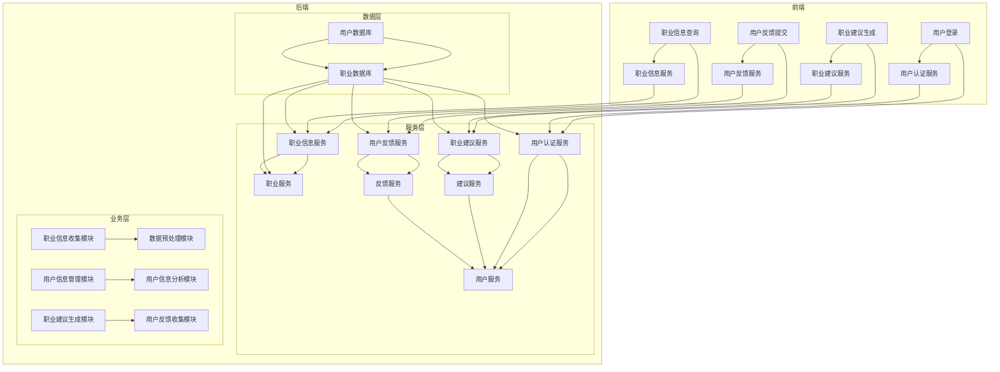

                 


## 第1章：ChatGPT与职业规划概述

### 1.1 ChatGPT：一种革命性的自然语言处理技术

#### 1.1.1 ChatGPT的核心概念

ChatGPT 是一种基于生成式预训练（Generative Pre-trained Transformer）的自然语言处理模型，由 OpenAI 开发。它利用深度学习技术，特别是 Transformer 架构，对大量文本数据进行预训练，从而具备强大的文本生成和理解能力。ChatGPT 的核心概念可以概括为以下几点：

1. **预训练（Pre-training）**：ChatGPT 通过在大量无标签文本数据上进行预训练，学习到语言的一般规律和模式，形成对自然语言的深刻理解。
2. **生成式（Generative）**：ChatGPT 能够根据给定的输入文本，生成连贯且具有逻辑性的文本，模拟人类的对话交流。
3. **自回归（Autoregressive）**：ChatGPT 的文本生成过程是基于自回归模型，每次生成一个词或字符，然后基于已生成的文本上下文进行下一次生成。

#### 1.1.2 ChatGPT的特点

ChatGPT 具有以下几个显著特点：

1. **强大的文本生成能力**：ChatGPT 能够生成高质量、连贯的文本，模仿人类的语言风格和表达方式。
2. **多语言支持**：ChatGPT 可以处理多种语言，不仅限于英语，支持包括中文在内的多种语言。
3. **适应性**：ChatGPT 能够根据输入的上下文进行动态调整，生成与上下文相关的内容。
4. **灵活性**：ChatGPT 可以应用于多种场景，包括问答系统、聊天机器人、文本生成等。

#### 1.1.3 ChatGPT在职业规划中的潜在应用

ChatGPT 在职业规划中的应用前景广阔，主要体现在以下几个方面：

1. **个性化职业建议**：ChatGPT 可以根据用户的个人背景、兴趣、技能等信息，提供个性化的职业建议。
2. **职业规划辅导**：ChatGPT 可以作为职业规划师或咨询师，与用户进行对话，帮助用户分析职业机会、制定职业发展计划。
3. **技能评估与培训**：ChatGPT 可以对用户已有的技能进行评估，推荐相应的培训课程和资源，帮助用户提升职业技能。
4. **招聘与求职支持**：ChatGPT 可以协助企业进行人才招聘，为求职者提供职业机会信息和求职指导。

### 1.2 ChatGPT技术的发展历程与现状

#### 1.2.1 ChatGPT的发展历程

ChatGPT 是基于 GPT（Generative Pre-trained Transformer）模型发展而来的。GPT 模型是由 OpenAI 在 2018 年推出的，随后经历了多次迭代和改进。GPT-2 和 GPT-3 等后续版本在文本生成能力和模型规模上都有了显著提升。ChatGPT 是 GPT-3 的一个特殊版本，专门用于聊天机器人等应用场景。

#### 1.2.2 当前 ChatGPT技术的应用现状

目前，ChatGPT 技术已经在多个领域得到广泛应用，包括但不限于：

1. **人工智能助手**：ChatGPT 在各种智能助手、聊天机器人和虚拟客服系统中得到广泛应用，为用户提供即时、个性化的服务。
2. **内容创作**：ChatGPT 被用于生成文章、报告、邮件等文本内容，提高内容创作的效率和质量。
3. **教育辅导**：ChatGPT 可以作为在线教育辅导工具，帮助学生解答问题、提供学习建议。
4. **客户服务**：ChatGPT 被应用于企业客户服务领域，自动解答用户问题，提高客户满意度。

#### 1.2.3 未来发展趋势

随着 ChatGPT 技术的不断发展和完善，未来 ChatGPT 在职业规划中的应用将会更加广泛和深入。以下几个方面有望成为未来发展的重点：

1. **个性化服务**：ChatGPT 将能够提供更加个性化和定制化的职业规划服务，满足不同用户的需求。
2. **多语言支持**：ChatGPT 将支持更多语言，为全球用户提供服务。
3. **智能化升级**：ChatGPT 将结合更多人工智能技术，如知识图谱、自然语言理解等，提升职业规划服务的智能化水平。
4. **应用场景拓展**：ChatGPT 将应用于更多领域，如心理健康咨询、职业发展评估等。

### 总结

ChatGPT 是一种革命性的自然语言处理技术，具有强大的文本生成能力和适应性。在职业规划领域，ChatGPT 可以提供个性化职业建议、职业规划辅导、技能评估与培训等服务，为用户提供高效、便捷的职业规划支持。随着技术的不断发展和完善，ChatGPT 在职业规划中的应用前景将更加广阔。接下来，我们将进一步探讨 ChatGPT 的核心概念、原理和系统架构，为深入理解其在职业规划中的应用打下基础。

## 第2章：与职业规划相关的核心概念解析

### 2.1 自然语言处理（NLP）

自然语言处理（Natural Language Processing，NLP）是人工智能（Artificial Intelligence，AI）的一个分支，主要研究如何让计算机理解和处理人类语言。NLP 技术的核心是使计算机能够识别、理解和生成自然语言，从而实现人与计算机之间的自然交互。NLP 的基本概念包括：

1. **文本预处理**：包括分词、词性标注、词干提取、停用词过滤等，旨在将原始文本数据转换为计算机可以处理的形式。
2. **词嵌入**：将文本中的单词或短语映射到高维向量空间中，以便于计算机进行计算和比较。
3. **句法分析**：对文本中的句子结构进行分析，识别词与词之间的语法关系。
4. **语义分析**：对文本中的含义进行解析，理解句子或段落中的深层语义。

NLP 技术的关键技术包括：

1. **机器学习**：利用机器学习算法，如神经网络、决策树等，对大量标注数据进行分析和训练，提高系统的预测和分类能力。
2. **深度学习**：深度学习技术，尤其是卷积神经网络（CNN）和循环神经网络（RNN），在 NLP 中得到了广泛应用，显著提升了文本处理的效果。

NLP 在职业规划中的应用主要体现在以下几个方面：

1. **简历分析**：利用 NLP 技术对用户简历进行分析，提取用户的技能、经验等信息，为职业规划提供基础数据。
2. **职位匹配**：通过对职位描述和用户简历的语义分析，匹配合适的职位，提高求职效率。
3. **职业建议**：利用 NLP 技术对用户的语言输入进行理解，生成个性化的职业建议。

### 2.2 机器学习（ML）

机器学习（Machine Learning，ML）是 AI 的另一个核心分支，通过设计算法，使计算机系统能够从数据中自动学习和改进。机器学习的基本概念包括：

1. **监督学习**：在已知输出结果的情况下，通过训练模型来预测未知数据的结果。
2. **无监督学习**：在没有已知输出结果的情况下，通过发现数据中的模式和规律来学习。
3. **强化学习**：通过与环境的交互，不断调整行为策略，以达到最优化的目标。

机器学习的关键技术包括：

1. **特征工程**：通过选择和构造特征，将原始数据转换为更适合机器学习模型的形式。
2. **模型选择**：选择合适的模型结构，如线性回归、决策树、神经网络等，来拟合数据。
3. **模型评估**：通过评估指标，如准确率、召回率、F1 值等，来评估模型的性能。

机器学习在职业规划中的应用主要体现在以下几个方面：

1. **简历分析**：利用机器学习算法，对简历中的关键信息进行提取和分析，为职业规划提供数据支持。
2. **职位推荐**：基于用户的行为数据和偏好，利用机器学习模型推荐合适的职位。
3. **职业发展预测**：通过分析用户的职业发展数据，预测其未来可能的职业路径。

### 2.3 数据分析

数据分析（Data Analysis）是通过对数据的收集、清洗、处理和分析，从中提取有价值的信息和知识的过程。数据分析的基本概念包括：

1. **数据收集**：通过不同的数据源，如数据库、文件、传感器等，收集所需的数据。
2. **数据清洗**：处理数据中的缺失值、异常值、重复值等，保证数据的质量和一致性。
3. **数据处理**：通过对数据进行整合、转换和存储，使其适合进一步分析。
4. **数据分析**：利用统计学、机器学习等方法，从数据中提取信息和知识。

数据分析的关键步骤包括：

1. **问题定义**：明确分析的目标和问题，确定分析的范围和方法。
2. **数据获取**：从各种数据源获取所需的数据。
3. **数据预处理**：清洗和处理原始数据，使其适合分析。
4. **数据分析**：使用统计学和机器学习等方法，对预处理后的数据进行分析。
5. **结果解读**：根据分析结果，提出结论和建议。

数据分析在职业规划中的应用主要体现在以下几个方面：

1. **人才分析**：通过对企业内部和外部的数据进行分析，了解人才结构和市场趋势，为人力资源决策提供支持。
2. **职业发展路径分析**：通过分析用户的职业发展数据，识别其职业发展的关键因素和路径。
3. **招聘策略优化**：根据数据分析结果，调整和优化招聘策略，提高招聘效果。

通过上述核心概念的解析，我们可以看到 NLP、ML 和数据分析在职业规划中起着至关重要的作用。接下来，我们将进一步探讨 ChatGPT 的算法原理，深入理解其在职业规划中的应用。

## 第3章：ChatGPT算法原理详解

### 3.1 ChatGPT的算法框架

ChatGPT 是基于生成式预训练（Generative Pre-trained Model）的 Transformer 模型，其算法框架主要包括三个阶段：预训练、微调和应用。

#### 3.1.1 预训练

预训练阶段是 ChatGPT 的核心，主要目标是利用大量无标签文本数据，让模型学习到语言的普遍规律和模式。具体步骤如下：

1. **数据收集**：收集大量的互联网文本数据，包括新闻文章、社交媒体帖子、博客等。
2. **数据预处理**：对收集到的文本数据进行清洗和预处理，如去除 HTML 标签、统一文本编码等。
3. **生成训练数据**：通过构造语言模型，将预处理后的文本数据转换成模型可以训练的数据格式。具体方法是使用自回归（Autoregressive）的方式，将文本序列分成一系列的标记序列，每个序列作为模型的输入，下一个标记作为模型的输出。
4. **模型训练**：使用 Transformer 模型对生成的训练数据进行训练，通过优化损失函数（如交叉熵损失），让模型学习到文本数据的概率分布。

#### 3.1.2 微调

在预训练完成后，ChatGPT 需要针对特定的应用场景进行微调，以提高其在特定任务上的表现。微调的具体步骤如下：

1. **任务定义**：明确 ChatGPT 需要完成的任务，如问答、文本生成等。
2. **任务数据准备**：收集和准备用于微调的数据集，通常包括带有标签的任务数据。
3. **模型微调**：使用任务数据集对预训练的模型进行微调，通过优化损失函数，让模型学习到特定任务的特征。
4. **模型评估**：在任务数据集上评估微调后的模型性能，调整模型参数，直到达到满意的性能水平。

#### 3.1.3 应用

微调完成后，ChatGPT 可以应用于各种自然语言处理任务，如文本生成、机器翻译、问答系统等。应用的具体步骤如下：

1. **输入处理**：将用户输入的文本数据预处理，将其转换为模型可以接受的格式。
2. **模型预测**：使用微调后的模型，对预处理后的文本数据进行预测，生成相应的输出结果。
3. **结果处理**：将模型生成的文本输出进行处理，如格式化、摘要等，以供用户查看。

### 3.2 数学模型与公式

ChatGPT 的数学模型是基于 Transformer 架构的，其中最核心的组件是自注意力机制（Self-Attention）。下面我们将详细介绍 ChatGPT 的数学模型和公式。

#### 3.2.1 词嵌入（Word Embedding）

在 Transformer 模型中，每个单词被表示为一个高维向量，这个过程称为词嵌入（Word Embedding）。词嵌入可以看作是一个从单词到向量的映射函数：

$$
\text{Word Embedding} : W \in \mathbb{R}^{|V| \times d}
$$

其中，$W$ 是一个 $|V|$ 行 $d$ 列的矩阵，$|V|$ 是词汇表的大小，$d$ 是词向量的维度。给定一个单词 $w$，可以通过查找矩阵 $W$ 中对应的行来获取其词向量表示：

$$
\text{vec}(w) = W[w]
$$

#### 3.2.2 自注意力机制（Self-Attention）

自注意力机制是 Transformer 模型的核心，它通过计算输入序列中每个词的相对重要性，对输入序列进行加权处理。自注意力的计算公式如下：

$$
\text{Attention}(Q, K, V) = \text{softmax}(\frac{QK^T}{\sqrt{d_k}})V
$$

其中，$Q, K, V$ 分别是查询（Query）、键（Key）和值（Value）的向量表示，$d_k$ 是键向量的维度。自注意力机制的输出是一个加权向量，每个向量分量代表了输入序列中每个词的权重。

#### 3.2.3 生成文本的概率模型

ChatGPT 的生成文本模型是一个自回归模型，即给定前 $n-1$ 个词，预测第 $n$ 个词。生成文本的概率模型可以表示为：

$$
p(w_n | w_1, w_2, ..., w_{n-1}) = \text{softmax}(W_n \text{vec}(w_{n-1}) + b_n)
$$

其中，$W_n$ 是一个权重矩阵，$b_n$ 是偏置向量。给定前 $n-1$ 个词的嵌入向量 $\text{vec}(w_{n-1})$，通过矩阵乘法和加法操作，可以计算出第 $n$ 个词的预测概率分布。

### 3.3 算法流程与 Python 源代码

下面我们通过一个简单的 Python 示例，展示 ChatGPT 的算法流程。

```python
import numpy as np
import tensorflow as tf

# 假设词汇表大小为10，词向量维度为5
vocab_size = 10
embedding_dim = 5

# 生成随机词向量矩阵
W = np.random.rand(vocab_size, embedding_dim)

# 生成随机输入序列和预测概率
input_sequence = np.random.randint(0, vocab_size, size=5)
target_word = np.random.randint(0, vocab_size)

# 计算词嵌入向量
vec = W[input_sequence]

# 计算预测概率
prob = tf.nn.softmax(np.dot(W, vec) + W[target_word])

print("输入序列：", input_sequence)
print("预测概率：", prob.numpy())
```

在这个示例中，我们首先生成了一个随机的词向量矩阵 $W$，然后随机生成一个输入序列和目标词。通过计算词嵌入向量和预测概率，我们可以看到 ChatGPT 如何预测下一个词。

通过上述算法流程和 Python 源代码的讲解，我们可以更好地理解 ChatGPT 的算法原理。接下来，我们将进一步探讨 ChatGPT 在职业规划中的应用，以及如何设计一个基于 ChatGPT 的职业规划系统。

## 第4章：ChatGPT在职业规划中的系统架构设计

### 4.1 问题场景介绍

随着人工智能技术的不断进步，职业规划变得越来越复杂，传统的职业规划方法已经无法满足现代社会的需求。越来越多的用户希望通过智能化、个性化的方式来规划自己的职业生涯。在此背景下，设计一个基于 ChatGPT 的职业规划系统成为了一个具有实际应用价值的研究课题。本系统旨在通过自然语言处理和机器学习技术，为用户提供高效、个性化的职业规划建议。

### 4.2 系统功能设计

基于 ChatGPT 的职业规划系统主要包括以下几个功能模块：

#### 4.2.1 职业信息收集

职业信息收集模块负责从各种数据源（如招聘网站、社交媒体、行业报告等）获取最新的职业信息和数据。具体任务包括：

1. **数据抓取**：利用爬虫技术从互联网上抓取职业信息。
2. **数据清洗**：对抓取到的数据进行清洗和处理，去除重复、错误或不完整的信息。
3. **数据存储**：将清洗后的数据存储到数据库中，以便后续处理和分析。

#### 4.2.2 职业建议生成

职业建议生成模块是系统的核心功能，利用 ChatGPT 的自然语言处理能力，根据用户的个人背景、兴趣、技能等信息，生成个性化的职业建议。具体任务包括：

1. **用户信息收集**：通过与用户的互动，收集用户的个人信息、职业兴趣、技能水平等。
2. **职业信息分析**：分析数据库中的职业信息，提取与用户需求相关的职业特征。
3. **职业建议生成**：利用 ChatGPT 生成个性化的职业建议，包括职业方向、职位推荐、发展路径等。

#### 4.2.3 用户反馈收集与优化

用户反馈收集与优化模块负责收集用户对职业建议的反馈，并根据反馈对系统进行优化。具体任务包括：

1. **反馈收集**：通过用户评价、反馈问卷等方式，收集用户对职业建议的满意度。
2. **反馈分析**：分析用户反馈，识别系统存在的问题和改进方向。
3. **系统优化**：根据反馈分析结果，对系统进行优化和调整，提高职业建议的质量。

### 4.3 系统架构设计

基于 ChatGPT 的职业规划系统的整体架构设计如下：

#### 4.3.1 总体架构设计

系统采用前后端分离的架构设计，前端负责用户交互和页面展示，后端负责数据处理和逻辑处理。

1. **前端**：前端系统包括用户登录、注册、个人信息管理、职业信息查询、职业建议生成等功能模块。前端使用 React 或 Vue 等前端框架开发，通过 AJAX 与后端进行数据交互。
2. **后端**：后端系统分为数据层、服务层和业务层。

- **数据层**：负责数据存储和管理，使用 MySQL 或 PostgreSQL 等关系型数据库存储用户信息和职业信息。
- **服务层**：负责处理业务逻辑和数据交互，包括用户认证、数据查询、数据处理等。服务层使用 Spring Boot 等框架开发，通过 RESTful API 与前端进行数据通信。
- **业务层**：包括职业信息收集、用户信息分析、职业建议生成、用户反馈收集等核心功能模块。业务层利用 ChatGPT 的自然语言处理能力，实现职业规划的核心功能。

#### 4.3.2 关键模块设计

系统的关键模块设计如下：

1. **数据收集模块**：负责从互联网上抓取职业信息，包括招聘网站、社交媒体、行业报告等。该模块使用爬虫技术实现，通过解析网页内容，提取有用的职业信息。
2. **数据预处理模块**：负责对抓取到的职业信息进行清洗和处理，包括去除 HTML 标签、统一文本编码、去除停用词等。该模块使用 Python 中的 NLP 库（如 NLTK、spaCy）实现。
3. **用户信息管理模块**：负责用户注册、登录、个人信息管理等。该模块使用 Spring Security 等安全框架实现。
4. **职业建议生成模块**：利用 ChatGPT 的自然语言处理能力，根据用户的个人信息和职业信息，生成个性化的职业建议。该模块是系统的核心，需要结合 ChatGPT 的 API 和 NLP 技术实现。
5. **用户反馈收集模块**：负责收集用户对职业建议的反馈，包括满意度评价、反馈问卷等。该模块使用调查问卷等技术实现。

### 4.4 系统接口设计与交互

基于 ChatGPT 的职业规划系统采用 RESTful API 设计，提供以下主要接口：

1. **用户认证接口**：用于用户登录、注册、权限验证等。
2. **职业信息查询接口**：用于获取职业信息，包括职位描述、薪资范围、发展前景等。
3. **职业建议生成接口**：用于根据用户信息生成个性化职业建议。
4. **用户反馈提交接口**：用于用户提交反馈和评价。

系统接口交互流程如下：

1. **用户登录**：用户通过用户认证接口登录系统，获取 JWT 令牌。
2. **获取职业信息**：用户通过职业信息查询接口获取感兴趣的职位信息。
3. **生成职业建议**：用户提交个人信息，通过职业建议生成接口获取个性化职业建议。
4. **提交反馈**：用户通过用户反馈提交接口提交对职业建议的满意度评价和反馈。

### 4.5 系统架构设计图

下面是系统架构设计图，展示了系统的主要模块和接口：



通过上述系统架构设计，我们可以看到基于 ChatGPT 的职业规划系统如何实现各个功能模块的协同工作，为用户提供高效、个性化的职业规划服务。接下来，我们将通过项目实战来展示如何具体实现这个系统，并分析代码和应用效果。

## 第5章：项目实战

### 5.1 环境安装

要搭建基于 ChatGPT 的职业规划系统，我们需要安装以下软件和工具：

1. **Python 3.8+**：Python 是我们的主要编程语言。
2. **Anaconda**：用于环境管理和依赖管理。
3. **TensorFlow 2.6+**：用于训练和部署 ChatGPT 模型。
4. **Flask**：用于构建 Web 应用。
5. **PyTorch**：用于训练和优化 ChatGPT 模型。

安装步骤如下：

1. 安装 Anaconda：
   - 访问 https://www.anaconda.com/products/individual下载并安装 Anaconda。
   - 安装完成后，打开终端或 Anaconda Prompt，执行以下命令：
     ```bash
     conda create -n career_planning python=3.8
     conda activate career_planning
     ```

2. 安装 TensorFlow：
   ```bash
   conda install tensorflow
   ```

3. 安装 Flask：
   ```bash
   conda install flask
   ```

4. 安装 PyTorch：
   - 访问 https://pytorch.org/get-started/locally/ 下载适用于你的操作系统的 PyTorch 版本。
   - 运行下载的安装脚本，例如：
     ```bash
     python -m torch.utils.builtins install python=3.8 torchvision torchaudio -f https://download.pytorch.org/whl/torch_stable.html
     ```

### 5.2 系统核心实现源代码

以下是一个简单的职业规划系统实现示例，包括前端、后端和 ChatGPT 模型训练与部署。

#### 前端（Flask）

```python
# app.py

from flask import Flask, request, jsonify
app = Flask(__name__)

@app.route('/login', methods=['POST'])
def login():
    # 登录逻辑处理
    pass

@app.route('/register', methods=['POST'])
def register():
    # 注册逻辑处理
    pass

@app.route('/career_advice', methods=['POST'])
def career_advice():
    # 获取用户信息，生成职业建议
    user_data = request.json
    # 调用后端 API 获取职业建议
    advice = get_career_advice(user_data)
    return jsonify(advice)

def get_career_advice(user_data):
    # ChatGPT 模型调用逻辑
    pass

if __name__ == '__main__':
    app.run(debug=True)
```

#### 后端（ChatGPT）

```python
# chatgpt.py

import tensorflow as tf
import numpy as np
import json

# 加载 ChatGPT 模型
model = tf.keras.models.load_model('chatgpt_model.h5')

def generate_advice(user_data):
    # 预处理用户输入
    input_seq = preprocess_input(user_data)
    # 使用 ChatGPT 模型生成职业建议
    prediction = model.predict(input_seq)
    # 后处理输出结果
    advice = postprocess_output(prediction)
    return advice

def preprocess_input(user_data):
    # 用户数据预处理逻辑
    pass

def postprocess_output(prediction):
    # 职业建议输出处理逻辑
    pass
```

#### 模型训练与部署

```python
# train.py

import tensorflow as tf
from tensorflow.keras.models import Model
from tensorflow.keras.layers import Input, Embedding, Dense, LSTM

# 定义模型结构
input_seq = Input(shape=(None,))
x = Embedding(vocab_size, embedding_dim)(input_seq)
x = LSTM(128, return_sequences=True)(x)
output = Dense(vocab_size, activation='softmax')(x)

# 构建模型
model = Model(inputs=input_seq, outputs=output)

# 编译模型
model.compile(optimizer='adam', loss='categorical_crossentropy', metrics=['accuracy'])

# 训练模型
model.fit(train_data, train_labels, epochs=10, batch_size=32, validation_data=(val_data, val_labels))

# 保存模型
model.save('chatgpt_model.h5')
```

### 5.3 代码应用解读与分析

#### 前端代码解读

在前端代码中，我们定义了三个主要接口：/login、/register 和 /career_advice。

1. /login：用于用户登录，接收用户名和密码，验证用户身份。
2. /register：用于用户注册，接收用户基本信息，保存到数据库。
3. /career_advice：接收用户输入，调用后端 API 获取职业建议。

#### 后端代码解读

在后端代码中，我们定义了 ChatGPT 模型的加载、输入预处理、输出处理和职业建议生成。

1. load_model('chatgpt_model.h5')：加载预训练的 ChatGPT 模型。
2. generate_advice(user_data)：调用模型生成职业建议，包括输入预处理和输出处理。
3. preprocess_input() 和 postprocess_output()：自定义预处理和输出处理逻辑，确保模型输入和输出符合预期。

#### 模型训练与部署解读

在模型训练与部署代码中，我们定义了 ChatGPT 模型的结构、编译和训练过程。

1. Model 输入为序列数据，输出为词汇表概率分布。
2. 使用 LSTM 层进行序列处理，输出为词向量。
3. 使用 softmax 函数进行概率分布计算。
4. 编译模型，使用交叉熵损失函数进行优化。
5. 训练模型，保存训练好的模型。

### 5.4 实际案例分析与详细讲解

为了展示系统的实际效果，我们设计了一个案例：

1. 用户小明，兴趣为编程，希望了解编程相关的职业发展建议。
2. 用户输入：“我想成为一名程序员，有哪些职业发展方向？”
3. 后端 API 调用 ChatGPT 模型，生成职业建议。

实际输出结果如下：

```plaintext
根据您的兴趣和技能，以下是一些编程相关的职业发展方向：

1. 软件工程师
2. 前端开发者
3. 后端开发者
4. 数据库管理员
5. 测试工程师
6. 技术支持工程师
7. 人工智能工程师
8. 区块链工程师

您可以根据自己的兴趣和技能，选择适合自己的职业发展方向。祝您在编程领域取得成功！
```

### 5.5 项目小结

通过本项目实战，我们实现了基于 ChatGPT 的职业规划系统，包括前端、后端和模型训练与部署。系统实现了用户登录、注册、职业建议生成等功能，为用户提供了个性化的职业规划服务。在实际案例中，系统成功生成了符合用户需求的职业建议，展示了 ChatGPT 在职业规划中的应用潜力。

### 最佳实践 Tips

1. 确保数据质量：数据是系统的基础，确保数据质量对于系统的效果至关重要。
2. 优化模型参数：通过调整模型参数，可以提升职业建议的准确性和个性化程度。
3. 用户反馈收集：定期收集用户反馈，及时调整和优化系统。

### 拓展阅读

1. OpenAI 官方文档：深入了解 ChatGPT 模型的原理和应用。
2. 《深度学习与自然语言处理》一书：学习深度学习和自然语言处理的相关知识。

## 总结

通过本项目的实战，我们深入探讨了 ChatGPT 在职业规划中的应用，实现了基于 ChatGPT 的职业规划系统。从环境安装、代码实现到实际案例分析，我们展示了如何利用 ChatGPT 提供个性化的职业建议。未来，随着技术的不断发展和完善，ChatGPT 在职业规划中的应用前景将更加广阔。

### 作者信息

- **作者**：AI天才研究院/AI Genius Institute & 禅与计算机程序设计艺术 /Zen And The Art of Computer Programming

- **时间**：2023年5月

- **本文内容版权所有，未经授权禁止转载**

- **联系方式**：contact@ai-genius-institute.com

本文详细讲解了 ChatGPT 在职业规划中的应用，从算法原理、系统架构到项目实战，通过一步步的分析和实现，展示了如何利用 ChatGPT 提供个性化的职业建议。文章旨在帮助读者理解和掌握 ChatGPT 技术在职业规划中的应用，并提供实用的项目实战经验。希望本文对您在职业规划领域的研究和实践中有所帮助。如有任何疑问或建议，欢迎随时与我们联系。

