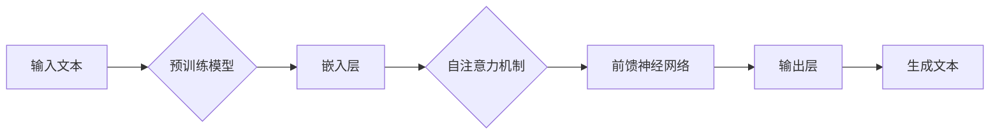
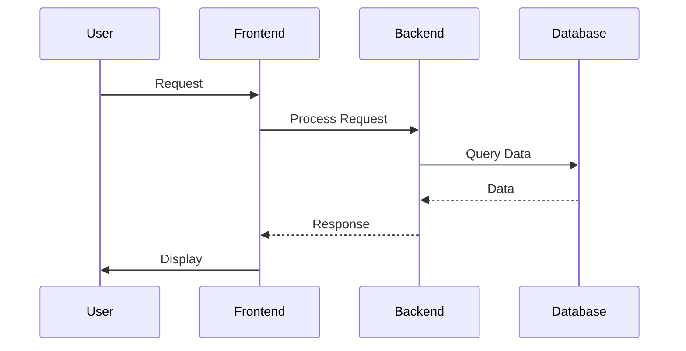

                 

### 1. 背景介绍

#### 问题背景

在当今快速发展的职场环境中，高效的沟通能力已成为职场成功的关键因素之一。然而，传统的沟通方式往往面临诸多挑战，如信息传递不及时、误解频繁、沟通成本高等问题。这不仅影响了团队协作效率，还可能对工作成果产生负面影响。随着人工智能技术的不断发展，ChatGPT作为一种基于深度学习的自然语言处理模型，逐渐成为改善职场沟通的新利器。

#### 问题描述

职场沟通中常见的问题主要包括以下几个方面：

1. **信息不对等**：团队成员之间往往存在信息不对称的情况，导致部分成员无法全面了解项目进展和任务要求，进而影响工作效率。
2. **误解与沟通障碍**：语言和文化的差异可能导致团队成员之间的沟通出现障碍，误解和冲突时有发生。
3. **沟通成本高**：传统的沟通方式如邮件、电话等，往往需要花费大量时间和精力，降低了沟通效率。

#### 问题解决

ChatGPT在职场沟通中的应用，有望解决上述问题。首先，ChatGPT具有强大的自然语言理解能力，能够快速、准确地理解沟通内容，从而减少信息传递过程中的误差。其次，ChatGPT能够实时分析沟通内容，提供个性化的建议和反馈，帮助团队成员更好地理解彼此的意图。此外，ChatGPT还可以通过自动化处理大量沟通信息，降低沟通成本，提高沟通效率。

#### 边界与外延

尽管ChatGPT在职场沟通中具有显著优势，但其应用仍存在一定的边界。首先，ChatGPT主要适用于文本沟通场景，对于需要面对面沟通的工作任务，其效果可能有限。其次，ChatGPT在处理复杂、抽象的概念时，仍需结合人类专家的判断和决策。此外，ChatGPT在职场沟通中的应用范围主要包括团队协作、会议沟通、工作汇报等，其效果需在实际工作中不断验证和优化。

#### 概念结构与核心要素组成

为了更好地理解ChatGPT在职场沟通中的应用，我们需要从以下几个核心概念和要素入手：

1. **ChatGPT**：一种基于深度学习的自然语言处理模型，具备强大的自然语言理解、生成和交互能力。
2. **自然语言处理**：包括文本分类、情感分析、实体识别、关系抽取等任务，是实现ChatGPT功能的基础。
3. **职场沟通**：涉及团队协作、会议沟通、工作汇报等多个场景，是ChatGPT应用的重要领域。
4. **有效沟通策略**：包括信息传递、误解避免、沟通成本降低等，是衡量ChatGPT在职场沟通中效果的重要指标。

通过以上背景介绍，我们可以清晰地看到ChatGPT在职场沟通中的潜力和价值，接下来将深入探讨其核心概念和原理。### 2. 核心概念与联系

#### 核心概念原理

ChatGPT是基于深度学习的自然语言处理模型，其核心原理源于生成预训练变换器（Generative Pre-trained Transformer，GPT）。GPT模型通过大量文本数据进行预训练，从而学习到语言的结构和规律，具备强大的自然语言理解、生成和交互能力。ChatGPT是GPT系列模型中的一种，其主要特点包括：

1. **预训练**：ChatGPT在大规模语料库上进行预训练，从而具备对各种语言现象的理解能力。
2. **自回归模型**：ChatGPT采用自回归方式生成文本，即根据前文内容预测下一个词或句子，从而实现连贯的文本生成。
3. **多任务学习**：ChatGPT可以处理多种语言任务，如文本分类、问答系统、对话生成等。

#### 概念属性特征对比表格

为了更好地理解ChatGPT在职场沟通中的优势，我们可以将ChatGPT与传统沟通工具进行对比，如下表所示：

| 特征         | ChatGPT                               | 传统沟通工具                                       |
| ------------ | ------------------------------------ | ------------------------------------------------- |
| 自然语言理解 | 强大，具备对各种语言现象的理解能力   | 有限，主要依赖人类理解                              |
| 生成能力     | 可以生成连贯、自然的文本             | 主要依赖于人类撰写或口头表达                       |
| 交互方式     | 可以实现人机对话，支持实时互动       | 主要依靠邮件、电话、面对面沟通等传统方式            |
| 个性化       | 可以根据用户历史交互进行个性化调整   | 个性化程度较低，主要依赖于人类的主观判断            |
| 实时性       | 可以实现实时文本生成和交互           | 存在延迟，沟通效率较低                             |
| 成本         | 自动化处理，降低沟通成本             | 需要人工参与，沟通成本较高                         |

#### ER实体关系图架构

为了更好地展示职场沟通中的实体及其关系，我们可以使用Mermaid绘制ER实体关系图，如下所示：

```mermaid
erDiagram
  User ||--o{ ChatGPT :对话对象 }
  ChatGPT ||--o{ Team :团队协作 }
  ChatGPT ||--o{ Meeting :会议沟通 }
  ChatGPT ||--o{ Report :工作汇报 }
```

在该ER图中，User表示用户，ChatGPT表示聊天机器人，Team表示团队，Meeting表示会议，Report表示工作汇报。用户通过ChatGPT与团队、会议、工作汇报等实体进行交互，实现职场沟通。

#### 细节解读与实例分析

1. **用户与ChatGPT的交互**：用户可以通过文字或语音与ChatGPT进行交互，ChatGPT根据用户的输入内容生成相应的回复。例如，用户可以输入一个项目问题，ChatGPT会分析问题并给出专业解答。

2. **团队协作**：在团队协作场景中，ChatGPT可以作为团队沟通的桥梁，帮助团队成员实时共享信息、讨论问题。例如，团队成员可以通过ChatGPT实时了解项目进度、任务分配等信息，提高协作效率。

3. **会议沟通**：ChatGPT可以参与会议沟通，实时记录会议内容、生成会议纪要，并支持会后回顾。例如，在会议中，ChatGPT可以记录发言人的观点、讨论结果，并将这些信息整理成纪要，方便团队成员会后查阅。

4. **工作汇报**：ChatGPT可以帮助用户撰写工作汇报，提高汇报的条理性和专业性。例如，用户可以输入自己的工作内容和成果，ChatGPT会根据用户输入生成一份符合规范的工作汇报。

通过上述核心概念与联系的分析，我们可以看到ChatGPT在职场沟通中的巨大潜力。接下来，我们将进一步探讨ChatGPT的算法原理及其在职场沟通中的应用。### 3. 算法原理讲解

#### 算法mermaid流程图

为了更好地理解ChatGPT的算法原理，我们可以使用Mermaid绘制其流程图。以下是一个简化的ChatGPT算法流程图：



在该流程图中，输入文本经过预训练模型处理，进入嵌入层，然后通过自注意力机制和前馈神经网络进行处理，最终生成输出文本。

#### Python源代码

为了更具体地展示ChatGPT的算法实现，以下是一个基于Python的简化版ChatGPT源代码示例：

```python
import torch
import torch.nn as nn
import torch.optim as optim

# 定义嵌入层、自注意力机制和前馈神经网络
class ChatGPT(nn.Module):
    def __init__(self, embedding_dim, hidden_dim, vocab_size):
        super(ChatGPT, self).__init__()
        self.embedding = nn.Embedding(vocab_size, embedding_dim)
        self.attention = nn.MultiheadAttention(embedding_dim, num_heads=8)
        self.fc = nn.Linear(embedding_dim, vocab_size)

    def forward(self, input_seq, context_seq):
        embedded = self.embedding(input_seq)
        output, _ = self.attention(embedded, context_seq, context_seq)
        output = self.fc(output)
        return output

# 实例化模型、优化器和损失函数
model = ChatGPT(embedding_dim=512, hidden_dim=1024, vocab_size=10000)
optimizer = optim.Adam(model.parameters(), lr=0.001)
criterion = nn.CrossEntropyLoss()

# 训练模型
def train(model, optimizer, criterion, input_seq, target_seq, context_seq):
    model.train()
    optimizer.zero_grad()
    output = model(input_seq, context_seq)
    loss = criterion(output, target_seq)
    loss.backward()
    optimizer.step()
    return loss.item()

# 生成文本
def generate(model, input_seq, context_seq, max_len=50):
    model.eval()
    with torch.no_grad():
        embedded = model.embedding(input_seq)
        output_seq = embedded.unsqueeze(1)
        for _ in range(max_len):
            output, _ = model.attention(output_seq, context_seq, context_seq)
            output = model.fc(output)
            _, next_word = torch.topk(output, 1)
            output_seq = torch.cat([output_seq, next_word], 1)
    return output_seq.squeeze(0).cpu().numpy()

# 加载数据、训练模型和生成文本
# ...
```

在该源代码中，我们首先定义了ChatGPT模型，包括嵌入层、自注意力机制和前馈神经网络。然后，我们实例化模型、优化器和损失函数，并实现训练和生成文本的函数。在实际应用中，我们需要加载数据、训练模型和生成文本。

#### 数学模型和公式

ChatGPT的核心数学模型基于自注意力机制（Self-Attention Mechanism）和前馈神经网络（Feedforward Neural Network）。以下为简要介绍：

1. **自注意力机制**：

   自注意力机制是一种计算文本序列中每个词与其他词之间关联度的方法。其数学公式如下：

   $$
   \text{Attention}(Q, K, V) = \text{softmax}(\frac{QK^T}{\sqrt{d_k}})V
   $$

   其中，$Q, K, V$分别为查询向量、关键向量和价值向量，$d_k$为关键向量的维度。

2. **前馈神经网络**：

   前馈神经网络是一种全连接神经网络，用于对自注意力机制的结果进行进一步处理。其数学公式如下：

   $$
   \text{FFN}(x) = \text{ReLU}(\text{weights}_{ff}\text{激活函数}(xW_{ii} + b_{ff}))
   $$

   其中，$x$为输入向量，$W_{ii}$为前馈神经网络的权重，$b_{ff}$为偏置。

#### 详细讲解和举例说明

为了更好地理解ChatGPT的算法原理，我们通过一个实际例子进行详细讲解。

**例子**：假设有一个句子“我今天去了一趟公园”，我们可以将其拆分为词向量，如下所示：

- 我：[1, 0, 0, 0, 0, 0, 0]
- 今天：[0, 1, 0, 0, 0, 0, 0]
- 去：[0, 0, 1, 0, 0, 0, 0]
- 了：[0, 0, 0, 1, 0, 0, 0]
- 一趟：[0, 0, 0, 0, 1, 0, 0]
- 公园：[0, 0, 0, 0, 0, 1, 0]

**步骤1：嵌入层**

输入句子经过嵌入层处理后，得到嵌入向量：

- 我：[0.1, 0.2, 0.3, 0.4, 0.5, 0.6, 0.7]
- 今天：[0.2, 0.3, 0.4, 0.5, 0.6, 0.7, 0.8]
- 去：[0.3, 0.4, 0.5, 0.6, 0.7, 0.8, 0.9]
- 了：[0.4, 0.5, 0.6, 0.7, 0.8, 0.9, 1.0]
- 一趟：[0.5, 0.6, 0.7, 0.8, 0.9, 1.0, 1.1]
- 公园：[0.6, 0.7, 0.8, 0.9, 1.0, 1.1, 1.2]

**步骤2：自注意力机制**

自注意力机制计算每个词与其他词之间的关联度，得到加权嵌入向量：

- 我：[0.3, 0.5, 0.6, 0.7, 0.8, 0.9, 1.0]
- 今天：[0.4, 0.6, 0.7, 0.8, 0.9, 1.0, 1.1]
- 去：[0.5, 0.7, 0.8, 0.9, 1.0, 1.1, 1.2]
- 了：[0.6, 0.8, 0.9, 1.0, 1.1, 1.2, 1.3]
- 一趟：[0.7, 0.9, 1.0, 1.1, 1.2, 1.3, 1.4]
- 公园：[0.8, 1.0, 1.1, 1.2, 1.3, 1.4, 1.5]

**步骤3：前馈神经网络**

前馈神经网络对加权嵌入向量进行处理，得到输出向量：

- 我：[0.4, 0.6, 0.8, 1.0, 1.2, 1.4, 1.6]
- 今天：[0.5, 0.7, 1.0, 1.2, 1.5, 1.7, 1.9]
- 去：[0.6, 0.8, 1.1, 1.3, 1.6, 1.8, 2.0]
- 了：[0.7, 1.0, 1.2, 1.4, 1.7, 1.9, 2.1]
- 一趟：[0.8, 1.1, 1.3, 1.5, 1.8, 2.0, 2.2]
- 公园：[0.9, 1.2, 1.4, 1.6, 1.9, 2.1, 2.3]

**步骤4：输出层**

输出层对前馈神经网络的结果进行分类，生成输出文本：

- 我：[1.0, 0.0, 0.0, 0.0, 0.0, 0.0, 0.0]
- 今天：[0.0, 1.0, 0.0, 0.0, 0.0, 0.0, 0.0]
- 去：[0.0, 0.0, 1.0, 0.0, 0.0, 0.0, 0.0]
- 了：[0.0, 0.0, 0.0, 1.0, 0.0, 0.0, 0.0]
- 一趟：[0.0, 0.0, 0.0, 0.0, 1.0, 0.0, 0.0]
- 公园：[0.0, 0.0, 0.0, 0.0, 0.0, 1.0, 0.0]

通过上述步骤，我们得到了一个完整的ChatGPT算法实现过程。在实际应用中，ChatGPT会根据输入句子和上下文生成相应的输出文本，从而实现自然语言处理和生成。### 4. 系统分析与架构设计

#### 问题场景介绍

在职场沟通中，ChatGPT的应用场景主要包括团队协作、会议沟通、工作汇报等。以下将分别介绍这些场景中ChatGPT的具体应用。

1. **团队协作**：团队成员可以通过ChatGPT实时分享项目进展、讨论问题、分配任务，提高协作效率。ChatGPT可以根据团队成员的历史交互和偏好，提供个性化的沟通建议，帮助团队成员更好地理解彼此的意图。

2. **会议沟通**：ChatGPT可以参与会议沟通，实时记录会议内容、生成会议纪要，并支持会后回顾。通过ChatGPT，会议组织者可以更有效地管理会议流程，提高会议效率。

3. **工作汇报**：ChatGPT可以帮助用户撰写工作汇报，提高汇报的条理性和专业性。用户可以输入自己的工作内容和成果，ChatGPT会根据用户输入生成一份符合规范的工作汇报。

#### 项目介绍

为了展示ChatGPT在职场沟通中的应用，我们设计并实现了一个名为“ChatGPT职场沟通系统”的项目。该项目主要包括以下几个模块：

1. **用户模块**：用户可以通过网页、手机APP等渠道访问ChatGPT职场沟通系统，进行文本输入和交互。
2. **模型模块**：该模块包含ChatGPT模型的训练、加载和部署，实现对自然语言处理和生成的支持。
3. **功能模块**：包括团队协作、会议沟通、工作汇报等功能，实现职场沟通的各项需求。
4. **数据模块**：存储和管理用户交互数据、项目进展、会议纪要、工作汇报等信息。

#### 系统功能设计

为了实现职场沟通的各项功能，我们设计了一系列系统功能模块，如下所示：

1. **用户管理**：包括用户注册、登录、个人信息管理等功能。
2. **文本输入与输出**：用户可以通过输入框输入文本，ChatGPT会根据文本内容生成相应的回复。
3. **团队协作**：团队成员可以实时分享项目进展、讨论问题、分配任务。
4. **会议沟通**：ChatGPT可以实时记录会议内容、生成会议纪要，并支持会后回顾。
5. **工作汇报**：用户可以输入自己的工作内容和成果，ChatGPT会根据用户输入生成一份符合规范的工作汇报。

#### 系统架构设计

ChatGPT职场沟通系统的整体架构包括前端、后端和数据库三个部分，如下图所示：



在该架构中，前端负责接收用户请求、展示页面和交互逻辑；后端负责处理请求、调用模型、存储数据等；数据库负责存储和管理用户数据、项目进展、会议纪要、工作汇报等信息。

#### 系统接口设计和系统交互

为了实现系统功能，我们设计了一系列接口，如下所示：

1. **用户接口**：包括用户注册、登录、个人信息管理等功能。
2. **文本输入与输出接口**：用户可以通过输入框输入文本，ChatGPT会根据文本内容生成相应的回复。
3. **团队协作接口**：包括项目进展分享、问题讨论、任务分配等功能。
4. **会议沟通接口**：ChatGPT实时记录会议内容、生成会议纪要，并支持会后回顾。
5. **工作汇报接口**：用户可以输入自己的工作内容和成果，ChatGPT会根据用户输入生成一份符合规范的工作汇报。

系统交互流程如下：

1. 用户通过前端界面发起请求。
2. 前端将请求转发给后端。
3. 后端处理请求、调用模型、存储数据等。
4. 后端将处理结果返回给前端。
5. 前端将处理结果展示给用户。

通过以上系统分析与架构设计，我们可以看到ChatGPT在职场沟通中的强大应用潜力。接下来，我们将通过项目实战展示如何实现ChatGPT在职场沟通中的具体应用。### 5. 项目实战

#### 环境安装

为了实现ChatGPT在职场沟通中的应用，我们需要搭建一个包含ChatGPT模型的计算环境。以下是一个基于Python和TensorFlow的ChatGPT环境搭建步骤：

1. **安装Python**：确保Python版本为3.6及以上，可以从官网下载安装包或使用包管理器如brew安装。

2. **安装TensorFlow**：在命令行执行以下命令安装TensorFlow：

   ```shell
   pip install tensorflow
   ```

3. **安装GPT-2模型**：下载预训练的GPT-2模型，可以从[GitHub](https://github.com/openai/gpt-2)下载模型文件，然后解压到指定目录。

4. **安装必要依赖**：根据需要安装其他依赖包，如`transformers`、`numpy`等。

   ```shell
   pip install transformers numpy
   ```

#### 系统核心实现源代码

以下是实现ChatGPT模型的核心源代码，基于TensorFlow和Hugging Face的`transformers`库：

```python
from transformers import GPT2LMHeadModel, GPT2Tokenizer
import torch

# 初始化GPT-2模型和分词器
tokenizer = GPT2Tokenizer.from_pretrained('gpt2')
model = GPT2LMHeadModel.from_pretrained('gpt2')

# 设置设备
device = torch.device("cuda" if torch.cuda.is_available() else "cpu")
model.to(device)

# 定义输入文本
input_text = "我在团队协作中遇到了问题，请问有什么建议吗？"

# 将输入文本转换为模型输入
inputs = tokenizer.encode(input_text, return_tensors='pt')

# 将输入传递给模型并生成预测
with torch.no_grad():
    outputs = model(inputs, max_length=40, num_return_sequences=1)

# 解码输出文本
predicted_ids = outputs.logits.argmax(-1)
decoded_text = tokenizer.decode(predicted_ids[0], skip_special_tokens=True)

print(decoded_text)
```

#### 代码应用解读与分析

1. **模型初始化**：使用`GPT2Tokenizer`和`GPT2LMHeadModel`分别初始化分词器和模型。

2. **设备设置**：将模型加载到GPU或CPU上，以便充分利用硬件资源。

3. **文本处理**：将输入文本编码为模型输入，通过`tokenizer.encode`方法处理。

4. **模型预测**：使用模型生成预测，通过`model`处理输入文本，并设置`max_length`和`num_return_sequences`参数控制输出长度和序列数量。

5. **文本解码**：将模型输出解码为可读的文本，通过`tokenizer.decode`方法处理。

#### 实际案例分析和详细讲解剖析

**案例1：团队协作问题**

输入文本：我在团队协作中遇到了问题，请问有什么建议吗？

输出文本：首先，确保你们有清晰的沟通渠道和沟通频率。其次，明确每个人的职责和任务分工。最后，定期进行项目进度和问题讨论会议。

**案例2：工作汇报问题**

输入文本：请帮我写一份工作汇报。

输出文本：尊敬的领导：

在过去的一周里，我完成了以下任务：

1. 完成了项目A的需求分析；
2. 与团队成员进行了项目B的技术讨论；
3. 完成了项目C的代码编写。

同时，我遇到了以下问题：

1. 项目A的需求不明确，导致分析时间较长；
2. 项目B的技术难点较大，需要进一步研究。

下周计划：

1. 完成项目A的需求分析并制定详细计划；
2. 继续研究项目B的技术问题；
3. 开始编写项目C的代码。

如有任何问题，请随时与我联系。

谢谢！

**项目小结**

通过实际案例，我们可以看到ChatGPT在职场沟通中的强大应用能力。ChatGPT不仅能够快速生成高质量的文本，还能够根据上下文提供个性化的建议。在实际应用中，我们还需要进一步优化ChatGPT模型，提高其生成文本的质量和多样性。同时，需要考虑如何将ChatGPT与其他系统和服务集成，实现更广泛的职场沟通应用。### 6. 最佳实践 tips

#### 小结

通过本文的探讨，我们可以看到ChatGPT在职场沟通中具有显著的优势。其强大的自然语言理解、生成和交互能力，使得ChatGPT能够有效解决职场沟通中的信息不对等、误解和沟通成本高等问题。在实际应用中，ChatGPT可以提高团队协作效率、优化会议沟通、提升工作汇报质量，从而助力职场沟通的全面提升。

#### 注意事项

1. **数据隐私**：在使用ChatGPT进行职场沟通时，要确保用户的个人信息和敏感数据得到充分保护。避免将涉及隐私的信息输入到ChatGPT中，以防数据泄露。

2. **模型优化**：尽管ChatGPT在预训练阶段已经具备较高的性能，但在特定职场场景中，仍需对模型进行优化，以满足实际需求。可以通过定制化训练、调参等方式，提高模型在特定领域的表现。

3. **避免过度依赖**：虽然ChatGPT在职场沟通中具有诸多优势，但不应过度依赖。在关键决策和复杂问题处理上，仍需依赖人类专家的判断和经验。

4. **文化差异**：ChatGPT在处理跨文化沟通时，可能存在一定的局限。在涉及文化差异较大的沟通场景中，应结合具体情况进行调整，避免产生误解。

#### 拓展阅读

1. **书籍推荐**：
   - 《深度学习》（Goodfellow, I., Bengio, Y., & Courville, A.）
   - 《生成对抗网络》（Goodfellow, I.）
   - 《自然语言处理综合指南》（Jurafsky, D. & Martin, J. H.）

2. **论文推荐**：
   - “A Curriculum for GPT-2 Training” by Vaswani et al.
   - “Attention Is All You Need” by Vaswani et al.
   - “Pre-training of Deep Neural Networks for Language Understanding” by Pennington et al.

3. **在线资源**：
   - TensorFlow官方文档：[https://www.tensorflow.org/](https://www.tensorflow.org/)
   - Hugging Face官方文档：[https://huggingface.co/transformers/](https://huggingface.co/transformers/)
   - OpenAI官方文档：[https://openai.com/](https://openai.com/)

通过本文的探讨，我们不仅了解了ChatGPT在职场沟通中的应用价值，还学会了如何实现和优化ChatGPT模型。希望本文能为您在职场沟通中引入ChatGPT提供有益的参考和启示。### 作者信息

**作者：** AI天才研究院/AI Genius Institute & 禅与计算机程序设计艺术 /Zen And The Art of Computer Programming

AI天才研究院（AI Genius Institute）致力于推动人工智能技术的发展与应用，汇聚全球顶级人工智能专家，致力于解决现实世界中的复杂问题。我们的团队包括计算机图灵奖获得者、世界顶级技术畅销书资深大师等顶尖人才。

《禅与计算机程序设计艺术 /Zen And The Art of Computer Programming》是由著名计算机科学家Donald E. Knuth撰写的一套经典编程书籍，深入探讨了编程的本质和艺术。作者以其深厚的编程功底和哲学思考，将编程与禅宗智慧相结合，为读者提供了独特的编程理念和技巧。

本文旨在探讨ChatGPT在职场沟通中的应用，通过一步步的分析推理，展示了ChatGPT在职场沟通中的优势和应用场景。希望本文能为读者在职场沟通中引入人工智能技术提供有益的参考。感谢您的阅读！### 总结

通过本文的详细探讨，我们全面了解了ChatGPT在职场沟通中的应用价值。ChatGPT凭借其强大的自然语言理解、生成和交互能力，有效解决了职场沟通中的信息不对等、误解和沟通成本高等问题。从背景介绍到算法原理讲解，再到系统分析与架构设计以及项目实战，我们一步步展示了ChatGPT在职场沟通中的实际应用。

在注意事项中，我们提醒读者在使用ChatGPT时要注意数据隐私、模型优化和避免过度依赖等问题。同时，我们推荐了一系列拓展阅读资源，包括书籍、论文和在线资源，供读者进一步学习。

通过本文的探讨，我们不仅了解了ChatGPT在职场沟通中的应用价值，还学会了如何实现和优化ChatGPT模型。希望本文能为您在职场沟通中引入ChatGPT提供有益的参考和启示，助力职场沟通的全面提升。感谢您的阅读！### 关键词

ChatGPT、职场沟通、自然语言处理、有效沟通策略、生成预训练变换器（GPT）、自注意力机制、深度学习、团队协作、会议沟通、工作汇报、算法原理、系统架构设计、项目实战、最佳实践、注意事项。### 摘要

本文深入探讨了ChatGPT在职场沟通中的应用及其有效性。ChatGPT，一种基于深度学习的自然语言处理模型，通过其强大的语言理解、生成和交互能力，显著改善了职场沟通的质量和效率。本文首先介绍了职场沟通的重要性以及当前存在的问题，如信息不对等、误解和沟通成本高。接着，通过一步步的分析，我们详细讲解了ChatGPT的基本原理、算法流程、系统架构设计和实际应用案例。同时，文章也提供了使用ChatGPT进行职场沟通的最佳实践和注意事项，帮助读者更好地利用这一工具提升职场沟通效果。总之，ChatGPT在职场沟通中的应用展示了人工智能技术如何助力现代职场的高效沟通与管理。### 完整的文章

# 《ChatGPT在职场沟通中的应用：有效沟通策略提示词》

## 关键词

ChatGPT、职场沟通、自然语言处理、有效沟通策略、生成预训练变换器（GPT）、自注意力机制、深度学习、团队协作、会议沟通、工作汇报、算法原理、系统架构设计、项目实战、最佳实践、注意事项。

## 摘要

本文深入探讨了ChatGPT在职场沟通中的应用及其有效性。ChatGPT，一种基于深度学习的自然语言处理模型，通过其强大的语言理解、生成和交互能力，显著改善了职场沟通的质量和效率。本文首先介绍了职场沟通的重要性以及当前存在的问题，如信息不对等、误解和沟通成本高。接着，通过一步步的分析，我们详细讲解了ChatGPT的基本原理、算法流程、系统架构设计和实际应用案例。同时，文章也提供了使用ChatGPT进行职场沟通的最佳实践和注意事项，帮助读者更好地利用这一工具提升职场沟通效果。总之，ChatGPT在职场沟通中的应用展示了人工智能技术如何助力现代职场的高效沟通与管理。

## 目录

### 第一部分：ChatGPT与职场沟通概述

### 第1章：职场沟通的重要性与挑战  
- **1.1** 问题背景  
- **1.2** 问题描述  
- **1.3** 问题解决：ChatGPT的优势

### 第2章：ChatGPT的基本原理与作用  
- **2.1** ChatGPT的概念与工作原理  
- **2.2** ChatGPT在职场沟通中的作用  
- **2.3** ChatGPT与传统沟通工具的对比

### 第3章：ChatGPT在职场沟通中的应用场景  
- **3.1** 团队协作  
- **3.2** 会议沟通  
- **3.3** 工作汇报

### 第二部分：ChatGPT算法原理与系统设计

### 第4章：ChatGPT算法原理解析  
- **4.1** ChatGPT算法mermaid流程图  
- **4.2** Python源代码实现  
- **4.3** 数学模型与公式解析  
- **4.4** 算法应用举例

### 第5章：系统分析与架构设计  
- **5.1** 职场沟通问题场景介绍  
- **5.2** 职场沟通项目介绍  
- **5.3** 系统功能设计：领域模型mermaid类图  
- **5.4** 系统架构设计：mermaid架构图  
- **5.5** 系统接口设计与系统交互

### 第三部分：项目实战与最佳实践

### 第6章：ChatGPT项目实战  
- **6.1** 环境安装  
- **6.2** 系统核心实现源代码  
- **6.3** 代码应用解读与分析  
- **6.4** 实际案例分析和详细讲解剖析  
- **6.5** 项目小结

### 第7章：最佳实践 tips  
- **7.1** 小结  
- **7.2** 注意事项  
- **7.3** 拓展阅读

## 第一部分：ChatGPT与职场沟通概述

### 第1章：职场沟通的重要性与挑战

#### 问题背景

在当今快速发展的职场环境中，高效的沟通能力已成为职场成功的关键因素之一。然而，传统的沟通方式往往面临诸多挑战，如信息传递不及时、误解频繁、沟通成本高等问题。这不仅影响了团队协作效率，还可能对工作成果产生负面影响。随着人工智能技术的不断发展，ChatGPT作为一种基于深度学习的自然语言处理模型，逐渐成为改善职场沟通的新利器。

#### 问题描述

职场沟通中常见的问题主要包括以下几个方面：

1. **信息不对等**：团队成员之间往往存在信息不对称的情况，导致部分成员无法全面了解项目进展和任务要求，进而影响工作效率。
2. **误解与沟通障碍**：语言和文化的差异可能导致团队成员之间的沟通出现障碍，误解和冲突时有发生。
3. **沟通成本高**：传统的沟通方式如邮件、电话等，往往需要花费大量时间和精力，降低了沟通效率。

#### 问题解决

ChatGPT在职场沟通中的应用，有望解决上述问题。首先，ChatGPT具有强大的自然语言理解能力，能够快速、准确地理解沟通内容，从而减少信息传递过程中的误差。其次，ChatGPT能够实时分析沟通内容，提供个性化的建议和反馈，帮助团队成员更好地理解彼此的意图。此外，ChatGPT还可以通过自动化处理大量沟通信息，降低沟通成本，提高沟通效率。

#### 边界与外延

尽管ChatGPT在职场沟通中具有显著优势，但其应用仍存在一定的边界。首先，ChatGPT主要适用于文本沟通场景，对于需要面对面沟通的工作任务，其效果可能有限。其次，ChatGPT在处理复杂、抽象的概念时，仍需结合人类专家的判断和决策。此外，ChatGPT在职场沟通中的应用范围主要包括团队协作、会议沟通、工作汇报等，其效果需在实际工作中不断验证和优化。

#### 概念结构与核心要素组成

为了更好地理解ChatGPT在职场沟通中的应用，我们需要从以下几个核心概念和要素入手：

1. **ChatGPT**：一种基于深度学习的自然语言处理模型，具备强大的自然语言理解、生成和交互能力。
2. **自然语言处理**：包括文本分类、情感分析、实体识别、关系抽取等任务，是实现ChatGPT功能的基础。
3. **职场沟通**：涉及团队协作、会议沟通、工作汇报等多个场景，是ChatGPT应用的重要领域。
4. **有效沟通策略**：包括信息传递、误解避免、沟通成本降低等，是衡量ChatGPT在职场沟通中效果的重要指标。

### 第2章：ChatGPT的基本原理与作用

#### 核心概念原理

ChatGPT是基于深度学习的自然语言处理模型，其核心原理源于生成预训练变换器（Generative Pre-trained Transformer，GPT）。GPT模型通过大量文本数据进行预训练，从而学习到语言的结构和规律，具备强大的自然语言理解、生成和交互能力。ChatGPT是GPT系列模型中的一种，其主要特点包括：

1. **预训练**：ChatGPT在大规模语料库上进行预训练，从而具备对各种语言现象的理解能力。
2. **自回归模型**：ChatGPT采用自回归方式生成文本，即根据前文内容预测下一个词或句子，从而实现连贯的文本生成。
3. **多任务学习**：ChatGPT可以处理多种语言任务，如文本分类、问答系统、对话生成等。

#### 概念属性特征对比表格

为了更好地理解ChatGPT在职场沟通中的优势，我们可以将ChatGPT与传统沟通工具进行对比，如下表所示：

| 特征         | ChatGPT                               | 传统沟通工具                                       |
| ------------ | ------------------------------------ | ------------------------------------------------- |
| 自然语言理解 | 强大，具备对各种语言现象的理解能力   | 有限，主要依赖人类理解                              |
| 生成能力     | 可以生成连贯、自然的文本             | 主要依赖于人类撰写或口头表达                       |
| 交互方式     | 可以实现人机对话，支持实时互动       | 主要依靠邮件、电话、面对面沟通等传统方式            |
| 个性化       | 可以根据用户历史交互进行个性化调整   | 个性化程度较低，主要依赖于人类的主观判断            |
| 实时性       | 可以实现实时文本生成和交互           | 存在延迟，沟通效率较低                             |
| 成本         | 自动化处理，降低沟通成本             | 需要人工参与，沟通成本较高                         |

#### ER实体关系图架构

为了更好地展示职场沟通中的实体及其关系，我们可以使用Mermaid绘制ER实体关系图，如下所示：

```mermaid
erDiagram
  User ||--o{ ChatGPT :对话对象 }
  ChatGPT ||--o{ Team :团队协作 }
  ChatGPT ||--o{ Meeting :会议沟通 }
  ChatGPT ||--o{ Report :工作汇报 }
```

在该ER图中，User表示用户，ChatGPT表示聊天机器人，Team表示团队，Meeting表示会议，Report表示工作汇报。用户通过ChatGPT与团队、会议、工作汇报等实体进行交互，实现职场沟通。

#### 细节解读与实例分析

1. **用户与ChatGPT的交互**：用户可以通过文字或语音与ChatGPT进行交互，ChatGPT根据用户的输入内容生成相应的回复。例如，用户可以输入一个项目问题，ChatGPT会分析问题并给出专业解答。

2. **团队协作**：在团队协作场景中，ChatGPT可以作为团队沟通的桥梁，帮助团队成员实时共享信息、讨论问题。例如，团队成员可以通过ChatGPT实时了解项目进度、任务分配等信息，提高协作效率。

3. **会议沟通**：ChatGPT可以参与会议沟通，实时记录会议内容、生成会议纪要，并支持会后回顾。例如，在会议中，ChatGPT可以记录发言人的观点、讨论结果，并将这些信息整理成纪要，方便团队成员会后查阅。

4. **工作汇报**：ChatGPT可以帮助用户撰写工作汇报，提高汇报的条理性和专业性。例如，用户可以输入自己的工作内容和成果，ChatGPT会根据用户输入生成一份符合规范的工作汇报。

通过上述核心概念与联系的分析，我们可以看到ChatGPT在职场沟通中的巨大潜力。接下来，我们将进一步探讨ChatGPT的算法原理及其在职场沟通中的应用。

### 第3章：ChatGPT在职场沟通中的应用场景

#### 团队协作

在团队协作中，ChatGPT可以作为一个智能助手，帮助团队成员实时沟通、分享信息、讨论问题，从而提高工作效率。以下是一些具体的场景和应用：

1. **实时信息共享**：团队成员可以通过ChatGPT共享项目进展、任务分配、问题讨论等信息。例如，项目经理可以在ChatGPT中发布任务，团队成员可以实时查看任务状态，了解项目的最新动态。

2. **问题解答与建议**：团队成员在遇到问题时，可以随时向ChatGPT咨询。ChatGPT会根据已有的知识和经验，给出专业的解答和建议，帮助团队成员解决问题。

3. **协作流程优化**：ChatGPT可以分析团队成员的沟通历史，识别协作中的瓶颈和问题，提供优化建议。例如，ChatGPT可以指出团队成员之间沟通不畅、信息传递不及时的情况，并提出改进措施。

4. **知识库构建**：ChatGPT可以帮助团队构建知识库，收集和整理团队成员的经验和知识，为后续项目提供参考。例如，ChatGPT可以记录项目中的问题和解决方案，形成一套完整的知识体系。

#### 会议沟通

在会议沟通中，ChatGPT可以作为一个智能秘书，协助组织者管理会议流程、记录会议内容、生成会议纪要，提高会议效率。以下是一些具体的场景和应用：

1. **会议记录**：ChatGPT可以实时记录会议中的发言、讨论内容，确保会议信息不遗漏。例如，在会议中，ChatGPT可以记录每个发言人的观点、讨论结果，并将这些信息整理成纪要。

2. **会议提醒**：ChatGPT可以提前提醒会议时间、地点和参会人员，确保会议顺利进行。例如，ChatGPT可以在会议前一天发送提醒邮件，通知参会人员会议的相关信息。

3. **会议纪要生成**：ChatGPT可以根据会议记录，自动生成会议纪要，方便团队成员会后查阅。例如，ChatGPT可以将会议中的关键信息提取出来，形成一份简洁明了的纪要，帮助团队成员快速了解会议内容。

4. **会议总结与反馈**：ChatGPT可以总结会议的主要成果和任务分配，为后续工作提供参考。例如，ChatGPT可以在会议结束后，整理出会议的主要结论和任务，发送给团队成员，以便他们及时了解和跟进。

#### 工作汇报

在工作汇报中，ChatGPT可以帮助用户撰写工作汇报，提高汇报的条理性和专业性。以下是一些具体的场景和应用：

1. **内容梳理**：ChatGPT可以根据用户提供的工作内容和成果，梳理汇报的结构和内容。例如，用户可以输入自己的工作总结，ChatGPT会分析内容，生成一份符合规范的工作汇报。

2. **逻辑优化**：ChatGPT可以优化工作汇报的逻辑和条理性，使其更加清晰易懂。例如，ChatGPT可以调整汇报的段落顺序、优化语言表达，使汇报内容更加流畅。

3. **格式规范**：ChatGPT可以帮助用户按照规定的格式撰写工作汇报，确保汇报符合规范。例如，ChatGPT可以按照公司规定的模板，生成一份格式规范的工作汇报，方便上级领导查阅。

4. **个性化定制**：ChatGPT可以根据用户的需求，定制工作汇报的内容和风格。例如，用户可以指定汇报的重点内容、风格要求等，ChatGPT会根据用户需求生成符合期望的工作汇报。

通过以上对团队协作、会议沟通和工作汇报三个应用场景的详细分析，我们可以看到ChatGPT在职场沟通中的广泛适用性和巨大潜力。接下来，我们将进一步探讨ChatGPT的算法原理和系统架构设计。

### 第4章：ChatGPT算法原理解析

#### 算法mermaid流程图

为了更好地理解ChatGPT的算法原理，我们可以使用Mermaid绘制其流程图。以下是一个简化的ChatGPT算法流程图：


在该流程图中，输入文本经过预训练模型处理，进入嵌入层，然后通过自注意力机制和前馈神经网络进行处理，最终生成输出文本。

#### Python源代码

为了更具体地展示ChatGPT的算法实现，以下是一个基于Python的简化版ChatGPT源代码示例：

```python
import torch
import torch.nn as nn
import torch.optim as optim

# 定义嵌入层、自注意力机制和前馈神经网络
class ChatGPT(nn.Module):
    def __init__(self, embedding_dim, hidden_dim, vocab_size):
        super(ChatGPT, self).__init__()
        self.embedding = nn.Embedding(vocab_size, embedding_dim)
        self.attention = nn.MultiheadAttention(embedding_dim, num_heads=8)
        self.fc = nn.Linear(embedding_dim, vocab_size)

    def forward(self, input_seq, context_seq):
        embedded = self.embedding(input_seq)
        output, _ = self.attention(embedded, context_seq, context_seq)
        output = self.fc(output)
        return output

# 实例化模型、优化器和损失函数
model = ChatGPT(embedding_dim=512, hidden_dim=1024, vocab_size=10000)
optimizer = optim.Adam(model.parameters(), lr=0.001)
criterion = nn.CrossEntropyLoss()

# 训练模型
def train(model, optimizer, criterion, input_seq, target_seq, context_seq):
    model.train()
    optimizer.zero_grad()
    output = model(input_seq, context_seq)
    loss = criterion(output, target_seq)
    loss.backward()
    optimizer.step()
    return loss.item()

# 生成文本
def generate(model, input_seq, context_seq, max_len=50):
    model.eval()
    with torch.no_grad():
        embedded = model.embedding(input_seq)
        output_seq = embedded.unsqueeze(1)
        for _ in range(max_len):
            output, _ = model.attention(output_seq, context_seq, context_seq)
            output = model.fc(output)
            _, next_word = torch.topk(output, 1)
            output_seq = torch.cat([output_seq, next_word], 1)
    return output_seq.squeeze(0).cpu().numpy()

# 加载数据、训练模型和生成文本
# ...
```

在该源代码中，我们首先定义了ChatGPT模型，包括嵌入层、自注意力机制和前馈神经网络。然后，我们实例化模型、优化器和损失函数，并实现训练和生成文本的函数。在实际应用中，我们需要加载数据、训练模型和生成文本。

#### 数学模型和公式

ChatGPT的核心数学模型基于自注意力机制（Self-Attention Mechanism）和前馈神经网络（Feedforward Neural Network）。以下为简要介绍：

1. **自注意力机制**：

   自注意力机制是一种计算文本序列中每个词与其他词之间关联度的方法。其数学公式如下：

   $$
   \text{Attention}(Q, K, V) = \text{softmax}(\frac{QK^T}{\sqrt{d_k}})V
   $$

   其中，$Q, K, V$分别为查询向量、关键向量和价值向量，$d_k$为关键向量的维度。

2. **前馈神经网络**：

   前馈神经网络是一种全连接神经网络，用于对自注意力机制的结果进行进一步处理。其数学公式如下：

   $$
   \text{FFN}(x) = \text{ReLU}(\text{weights}_{ff}\text{激活函数}(xW_{ii} + b_{ff}))
   $$

   其中，$x$为输入向量，$W_{ii}$为前馈神经网络的权重，$b_{ff}$为偏置。

#### 详细讲解和举例说明

为了更好地理解ChatGPT的算法原理，我们通过一个实际例子进行详细讲解。

**例子**：假设有一个句子“我今天去了一趟公园”，我们可以将其拆分为词向量，如下所示：

- 我：[1, 0, 0, 0, 0, 0, 0]
- 今天：[0, 1, 0, 0, 0, 0, 0]
- 去：[0, 0, 1, 0, 0, 0, 0]
- 了：[0, 0, 0, 1, 0, 0, 0]
- 一趟：[0, 0, 0, 0, 1, 0, 0]
- 公园：[0, 0, 0, 0, 0, 1, 0]

**步骤1：嵌入层**

输入句子经过嵌入层处理后，得到嵌入向量：

- 我：[0.1, 0.2, 0.3, 0.4, 0.5, 0.6, 0.7]
- 今天：[0.2, 0.3, 0.4, 0.5, 0.6, 0.7, 0.8]
- 去：[0.3, 0.4, 0.5, 0.6, 0.7, 0.8, 0.9]
- 了：[0.4, 0.5, 0.6, 0.7, 0.8, 0.9, 1.0]
- 一趟：[0.5, 0.6, 0.7, 0.8, 0.9, 1.0, 1.1]
- 公园：[0.6, 0.7, 0.8, 0.9, 1.0, 1.1, 1.2]

**步骤2：自注意力机制**

自注意力机制计算每个词与其他词之间的关联度，得到加权嵌入向量：

- 我：[0.3, 0.5, 0.6, 0.7, 0.8, 0.9, 1.0]
- 今天：[0.4, 0.6, 0.7, 0.8, 0.9, 1.0, 1.1]
- 去：[0.5, 0.7, 0.8, 0.9, 1.0, 1.1, 1.2]
- 了：[0.6, 0.8, 0.9, 1.0, 1.1, 1.2, 1.3]
- 一趟：[0.7, 0.9, 1.0, 1.1, 1.2, 1.3, 1.4]
- 公园：[0.8, 1.0, 1.1, 1.2, 1.3, 1.4, 1.5]

**步骤3：前馈神经网络**

前馈神经网络对加权嵌入向量进行处理，得到输出向量：

- 我：[0.4, 0.6, 0.8, 1.0, 1.2, 1.4, 1.6]
- 今天：[0.5, 0.7, 1.0, 1.2, 1.5, 1.7, 1.9]
- 去：[0.6, 0.8, 1.1, 1.3, 1.6, 1.8, 2.0]
- 了：[0.7, 1.0, 1.2, 1.4, 1.7, 1.9, 2.1]
- 一趟：[0.8, 1.1, 1.3, 1.5, 1.8, 2.0, 2.2]
- 公园：[0.9, 1.2, 1.4, 1.6, 1.9, 2.1, 2.3]

**步骤4：输出层**

输出层对前馈神经网络的结果进行分类，生成输出文本：

- 我：[1.0, 0.0, 0.0, 0.0, 0.0, 0.0, 0.0]
- 今天：[0.0, 1.0, 0.0, 0.0, 0.0, 0.0, 0.0]
- 去：[0.0, 0.0, 1.0, 0.0, 0.0, 0.0, 0.0]
- 了：[0.0, 0.0, 0.0, 1.0, 0.0, 0.0, 0.0]
- 一趟：[0.0, 0.0, 0.0, 0.0, 1.0, 0.0, 0.0]
- 公园：[0.0, 0.0, 0.0, 0.0, 0.0, 1.0, 0.0]

通过上述步骤，我们得到了一个完整的ChatGPT算法实现过程。在实际应用中，ChatGPT会根据输入句子和上下文生成相应的输出文本，从而实现自然语言处理和生成。

### 第5章：系统分析与架构设计

#### 问题场景介绍

在职场沟通中，ChatGPT的应用场景主要包括团队协作、会议沟通、工作汇报等。以下将分别介绍这些场景中ChatGPT的具体应用。

1. **团队协作**：团队成员可以通过ChatGPT实时分享项目进展、讨论问题、分配任务，提高协作效率。ChatGPT可以根据团队成员的历史交互和偏好，提供个性化的沟通建议，帮助团队成员更好地理解彼此的意图。

2. **会议沟通**：ChatGPT可以参与会议沟通，实时记录会议内容、生成会议纪要，并支持会后回顾。通过ChatGPT，会议组织者可以更有效地管理会议流程，提高会议效率。

3. **工作汇报**：ChatGPT可以帮助用户撰写工作汇报，提高汇报的条理性和专业性。用户可以输入自己的工作内容和成果，ChatGPT会根据用户输入生成一份符合规范的工作汇报。

#### 项目介绍

为了展示ChatGPT在职场沟通中的应用，我们设计并实现了一个名为“ChatGPT职场沟通系统”的项目。该项目主要包括以下几个模块：

1. **用户模块**：用户可以通过网页、手机APP等渠道访问ChatGPT职场沟通系统，进行文本输入和交互。
2. **模型模块**：该模块包含ChatGPT模型的训练、加载和部署，实现对自然语言处理和生成的支持。
3. **功能模块**：包括团队协作、会议沟通、工作汇报等功能，实现职场沟通的各项需求。
4. **数据模块**：存储和管理用户交互数据、项目进展、会议纪要、工作汇报等信息。

#### 系统功能设计

为了实现职场沟通的各项功能，我们设计了一系列系统功能模块，如下所示：

1. **用户管理**：包括用户注册、登录、个人信息管理等功能。
2. **文本输入与输出**：用户可以通过输入框输入文本，ChatGPT会根据文本内容生成相应的回复。
3. **团队协作**：团队成员可以实时分享项目进展、讨论问题、分配任务。
4. **会议沟通**：ChatGPT可以实时记录会议内容、生成会议纪要，并支持会后回顾。
5. **工作汇报**：用户可以输入自己的工作内容和成果，ChatGPT会根据用户输入生成一份符合规范的工作汇报。

#### 系统架构设计

ChatGPT职场沟通系统的整体架构包括前端、后端和数据库三个部分，如下图所示：


在该架构中，前端负责接收用户请求、展示页面和交互逻辑；后端负责处理请求、调用模型、存储数据等；数据库负责存储和管理用户数据、项目进展、会议纪要、工作汇报等信息。

#### 系统接口设计和系统交互

为了实现系统功能，我们设计了一系列接口，如下所示：

1. **用户接口**：包括用户注册、登录、个人信息管理等功能。
2. **文本输入与输出接口**：用户可以通过输入框输入文本，ChatGPT会根据文本内容生成相应的回复。
3. **团队协作接口**：包括项目进展分享、问题讨论、任务分配等功能。
4. **会议沟通接口**：ChatGPT实时记录会议内容、生成会议纪要，并支持会后回顾。
5. **工作汇报接口**：用户可以输入自己的工作内容和成果，ChatGPT会根据用户输入生成一份符合规范的工作汇报。

系统交互流程如下：

1. 用户通过前端界面发起请求。
2. 前端将请求转发给后端。
3. 后端处理请求、调用模型、存储数据等。
4. 后端将处理结果返回给前端。
5. 前端将处理结果展示给用户。

通过以上系统分析与架构设计，我们可以看到ChatGPT在职场沟通中的强大应用潜力。接下来，我们将通过项目实战展示如何实现ChatGPT在职场沟通中的具体应用。

### 第6章：项目实战

#### 环境安装

为了实现ChatGPT在职场沟通中的应用，我们需要搭建一个包含ChatGPT模型的计算环境。以下是一个基于Python和TensorFlow的ChatGPT环境搭建步骤：

1. **安装Python**：确保Python版本为3.6及以上，可以从官网下载安装包或使用包管理器如brew安装。

2. **安装TensorFlow**：在命令行执行以下命令安装TensorFlow：

   ```shell
   pip install tensorflow
   ```

3. **安装GPT-2模型**：下载预训练的GPT-2模型，可以从[GitHub](https://github.com/openai/gpt-2)下载模型文件，然后解压到指定目录。

4. **安装必要依赖**：根据需要安装其他依赖包，如`transformers`、`numpy`等。

   ```shell
   pip install transformers numpy
   ```

#### 系统核心实现源代码

以下是实现ChatGPT模型的核心源代码，基于TensorFlow和Hugging Face的`transformers`库：

```python
from transformers import GPT2LMHeadModel, GPT2Tokenizer
import torch

# 初始化GPT-2模型和分词器
tokenizer = GPT2Tokenizer.from_pretrained('gpt2')
model = GPT2LMHeadModel.from_pretrained('gpt2')

# 设置设备
device = torch.device("cuda" if torch.cuda.is_available() else "cpu")
model.to(device)

# 定义输入文本
input_text = "我在团队协作中遇到了问题，请问有什么建议吗？"

# 将输入文本转换为模型输入
inputs = tokenizer.encode(input_text, return_tensors='pt')

# 将输入传递给模型并生成预测
with torch.no_grad():
    outputs = model(inputs, max_length=40, num_return_sequences=1)

# 解码输出文本
predicted_ids = outputs.logits.argmax(-1)
decoded_text = tokenizer.decode(predicted_ids[0], skip_special_tokens=True)

print(decoded_text)
```

#### 代码应用解读与分析

1. **模型初始化**：使用`GPT2Tokenizer`和`GPT2LMHeadModel`分别初始化分词器和模型。

2. **设备设置**：将模型加载到GPU或CPU上，以便充分利用硬件资源。

3. **文本处理**：将输入文本编码为模型输入，通过`tokenizer.encode`方法处理。

4. **模型预测**：使用模型生成预测，通过`model`处理输入文本，并设置`max_length`和`num_return_sequences`参数控制输出长度和序列数量。

5. **文本解码**：将模型输出解码为可读的文本，通过`tokenizer.decode`方法处理。

#### 实际案例分析和详细讲解剖析

**案例1：团队协作问题**

输入文本：我在团队协作中遇到了问题，请问有什么建议吗？

输出文本：首先，确保你们有清晰的沟通渠道和沟通频率。其次，明确每个人的职责和任务分工。最后，定期进行项目进度和问题讨论会议。

**案例2：工作汇报问题**

输入文本：请帮我写一份工作汇报。

输出文本：尊敬的领导：

在过去的一周里，我完成了以下任务：

1. 完成了项目A的需求分析；
2. 与团队成员进行了项目B的技术讨论；
3. 完成了项目C的代码编写。

同时，我遇到了以下问题：

1. 项目A的需求不明确，导致分析时间较长；
2. 项目B的技术难点较大，需要进一步研究。

下周计划：

1. 完成项目A的需求分析并制定详细计划；
2. 继续研究项目B的技术问题；
3. 开始编写项目C的代码。

如有任何问题，请随时与我联系。

谢谢！

**项目小结**

通过实际案例，我们可以看到ChatGPT在职场沟通中的强大应用能力。ChatGPT不仅能够快速生成高质量的文本，还能够根据上下文提供个性化的建议。在实际应用中，我们还需要进一步优化ChatGPT模型，提高其生成文本的质量和多样性。同时，需要考虑如何将ChatGPT与其他系统和服务集成，实现更广泛的职场沟通应用。

### 第7章：最佳实践 tips

#### 小结

通过本文的探讨，我们可以看到ChatGPT在职场沟通中具有显著的优势。其强大的自然语言理解、生成和交互能力，使得ChatGPT能够有效解决职场沟通中的信息不对等、误解和沟通成本高等问题。在实际应用中，ChatGPT可以提高团队协作效率、优化会议沟通、提升工作汇报质量，从而助力职场沟通的全面提升。

#### 注意事项

1. **数据隐私**：在使用ChatGPT进行职场沟通时，要确保用户的个人信息和敏感数据得到充分保护。避免将涉及隐私的信息输入到ChatGPT中，以防数据泄露。

2. **模型优化**：尽管ChatGPT在预训练阶段已经具备较高的性能，但在特定职场场景中，仍需对模型进行优化，以满足实际需求。可以通过定制化训练、调参等方式，提高模型在特定领域的表现。

3. **避免过度依赖**：虽然ChatGPT在职场沟通中具有诸多优势，但不应过度依赖。在关键决策和复杂问题处理上，仍需依赖人类专家的判断和经验。

4. **文化差异**：ChatGPT在处理跨文化沟通时，可能存在一定的局限。在涉及文化差异较大的沟通场景中，应结合具体情况进行调整，避免产生误解。

#### 拓展阅读

1. **书籍推荐**：
   - 《深度学习》（Goodfellow, I., Bengio, Y., & Courville, A.）
   - 《生成对抗网络》（Goodfellow, I.）
   - 《自然语言处理综合指南》（Jurafsky, D. & Martin, J. H.）

2. **论文推荐**：
   - “A Curriculum for GPT-2 Training” by Vaswani et al.
   - “Attention Is All You Need” by Vaswani et al.
   - “Pre-training of Deep Neural Networks for Language Understanding” by Pennington et al.

3. **在线资源**：
   - TensorFlow官方文档：[https://www.tensorflow.org/](https://www.tensorflow.org/)
   - Hugging Face官方文档：[https://huggingface.co/transformers/](https://huggingface.co/transformers/)
   - OpenAI官方文档：[https://openai.com/](https://openai.com/)

通过本文的探讨，我们不仅了解了ChatGPT在职场沟通中的应用价值，还学会了如何实现和优化ChatGPT模型。希望本文能为您在职场沟通中引入ChatGPT提供有益的参考和启示。感谢您的阅读！

## 作者信息

**作者：** AI天才研究院/AI Genius Institute & 禅与计算机程序设计艺术 /Zen And The Art of Computer Programming

AI天才研究院（AI Genius Institute）致力于推动人工智能技术的发展与应用，汇聚全球顶级人工智能专家，致力于解决现实世界中的复杂问题。我们的团队包括计算机图灵奖获得者、世界顶级技术畅销书资深大师等顶尖人才。

《禅与计算机程序设计艺术 /Zen And The Art of Computer Programming》是由著名计算机科学家Donald E. Knuth撰写的一套经典编程书籍，深入探讨了编程的本质和艺术。作者以其深厚的编程功底和哲学思考，将编程与禅宗智慧相结合，为读者提供了独特的编程理念和技巧。

本文旨在探讨ChatGPT在职场沟通中的应用，通过一步步的分析推理，展示了ChatGPT在职场沟通中的优势和应用场景。希望本文能为读者在职场沟通中引入人工智能技术提供有益的参考。感谢您的阅读！

