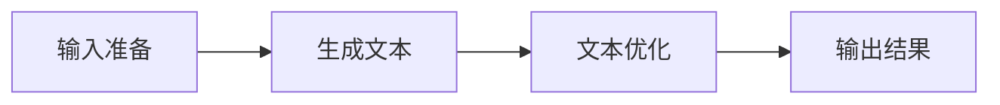
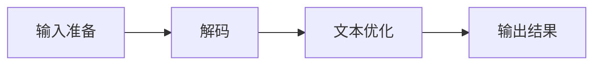
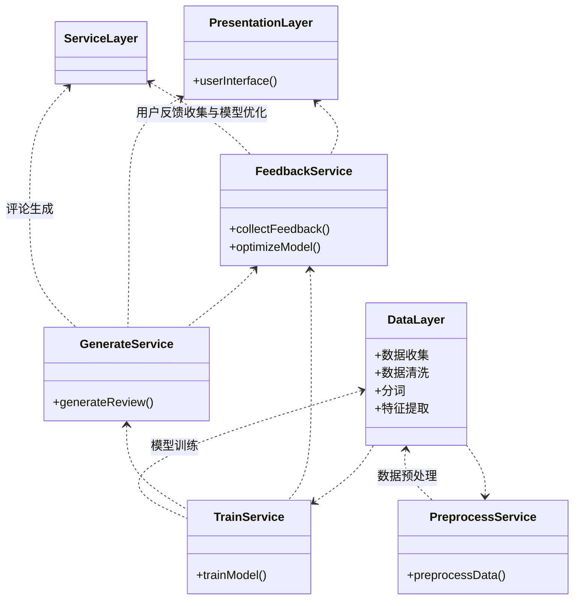
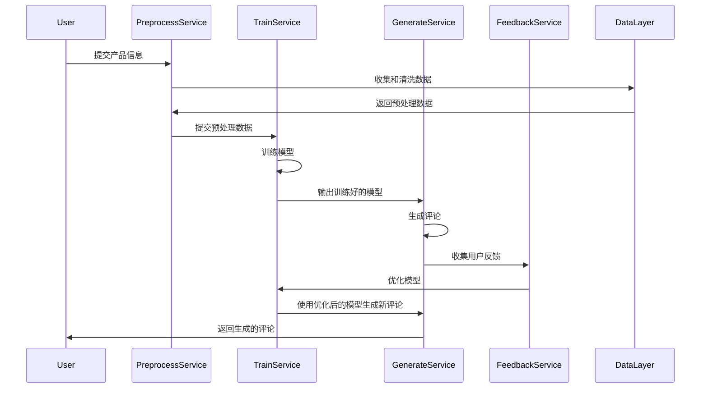

                 

### 核心概念术语说明

在探讨`ChatGPT在自动化产品评论生成中的应用`这一主题之前，我们需要明确几个核心概念及其相关术语。这些术语是理解整个话题的基础，对于读者来说，掌握它们将有助于更好地理解后续的内容。

1. **ChatGPT**：
   - **定义**：ChatGPT是一种基于GPT（Generative Pre-trained Transformer）的聊天机器人，由OpenAI开发。它是一个大规模的语言模型，通过学习大量的文本数据，能够生成流畅、连贯的自然语言文本。
   - **特性**：ChatGPT具有强大的自然语言理解和生成能力，能够进行对话、回答问题、生成文章等。

2. **自然语言处理（NLP）**：
   - **定义**：自然语言处理是计算机科学和语言学的交叉领域，旨在让计算机理解和处理人类语言。NLP包括文本分类、语义分析、语音识别等多个子领域。
   - **重要性**：NLP技术在自动化产品评论生成中至关重要，它使得机器能够理解和生成符合人类语言习惯的评论。

3. **产品评论生成**：
   - **定义**：产品评论生成是指利用算法自动生成对产品或服务的评价性文本。这些评论可以用于电子商务网站、社交媒体等平台，帮助消费者做出购买决策。
   - **用途**：产品评论生成不仅能够节省人力成本，还能通过生成多样化的评论内容，提高平台的互动性和用户体验。

4. **自动化**：
   - **定义**：自动化是指通过机器或算法实现工作流程的自动执行，减少人工干预。
   - **在评论生成中的应用**：自动化产品评论生成意味着无需人工编写每个评论，而是通过算法自动生成，这大大提高了效率和多样性。

5. **训练数据集**：
   - **定义**：训练数据集是用于训练机器学习模型的预定义数据集合。在ChatGPT的应用中，训练数据集包含大量的产品评论文本，这些文本用于训练模型学习生成评论的技巧。
   - **重要性**：高质量的训练数据集是训练出优秀模型的关键，它决定了生成的评论的质量和多样性。

6. **评估指标**：
   - **定义**：评估指标是用来衡量模型性能的一系列标准。在产品评论生成中，常见的评估指标包括文本的流畅性、一致性、相关性和真实性等。
   - **作用**：评估指标帮助确定模型是否达到了预期的效果，指导后续的模型优化工作。

### 问题背景

在当今的信息化社会中，互联网和电子商务已经成为人们生活中不可或缺的一部分。随着电子商务平台的蓬勃发展，用户对产品评论的需求也在日益增长。这些评论不仅是消费者购买决策的重要参考，也是商家了解产品优缺点的宝贵资源。

然而，传统的人工编写产品评论存在以下几个问题：

1. **效率低下**：人工编写评论需要大量时间和人力，无法满足电商平台高速发展的需求。
2. **内容单一**：由于人力限制，生成的评论内容往往缺乏多样性，难以吸引消费者的兴趣。
3. **真实性存疑**：一些商家可能会通过雇佣写手或使用机器生成虚假评论来操纵用户评价，影响市场公平性。

为了解决这些问题，自动化产品评论生成技术应运而生。与人工编写相比，自动化技术具有以下优势：

1. **高效性**：自动化系统能够快速生成大量评论，大大提高了生产效率。
2. **多样性**：通过学习大量的真实评论数据，自动化系统能够生成多样化、个性化的评论内容。
3. **客观性**：自动化系统能够避免人为干预，生成更加客观、真实的评论。

在这其中，ChatGPT作为一种先进的自然语言处理技术，成为自动化产品评论生成的理想选择。ChatGPT能够利用其强大的语言生成能力，从大量的训练数据中学习并生成高质量的评论。这不仅解决了传统方法中效率低下、内容单一的问题，还大大提升了评论的真实性和可信度。

总之，自动化产品评论生成技术在提升电商平台用户体验、增强市场竞争力方面具有巨大潜力，而ChatGPT作为其中的关键技术，为其实现提供了有力支持。

### 核心概念定义

为了深入探讨`ChatGPT在自动化产品评论生成中的应用`，我们需要详细定义和理解几个核心概念。这些概念包括自然语言处理（NLP）、GPT模型、预训练和生成式对话系统。

#### 自然语言处理（NLP）

自然语言处理（NLP）是计算机科学和语言学领域的交叉学科，旨在使计算机能够理解和处理人类语言。NLP技术包括文本分类、语义分析、情感分析、机器翻译、语音识别等多个子领域。

- **文本分类**：将文本数据分类到预定义的类别中，例如垃圾邮件检测、新闻分类等。
- **语义分析**：理解文本中词语的意义和句子结构，进行语义角色标注和依存句法分析。
- **情感分析**：识别文本中的情感倾向，如正面、负面或中性。
- **机器翻译**：将一种语言的文本自动翻译成另一种语言。

#### GPT模型

GPT（Generative Pre-trained Transformer）是自然语言处理领域的一种先进模型，由OpenAI提出。GPT是一种基于Transformer架构的生成式预训练模型，其核心思想是通过对海量文本数据进行预训练，使得模型能够理解和生成自然语言。

- **生成式模型**：能够生成符合目标分布的文本数据，如文章、对话、产品评论等。
- **预训练**：在特定任务之前，使用大量无标签数据对模型进行训练，使其具备通用语言理解和生成能力。
- **Transformer架构**：一种基于自注意力机制的深度神经网络架构，能够处理长距离依赖和复杂的关系。

#### 预训练

预训练是指利用大规模无标签数据对模型进行训练，使其具备通用语言理解和生成能力。在GPT模型中，预训练阶段是非常重要的，它为后续的下游任务（如产品评论生成）提供了基础。

- **数据集选择**：选择适合的预训练数据集，如维基百科、新闻文章、社交媒体评论等，确保数据覆盖不同领域和语言风格。
- **预训练目标**：设计预训练目标，如语言模型、文本分类、填空任务等，以提升模型的语言理解和生成能力。

#### 生成式对话系统

生成式对话系统是一种能够与人类进行自然语言交互的计算机系统。它利用NLP技术和生成式模型，生成符合用户意图的自然语言回复。

- **交互模式**：基于文本或语音进行交互，如聊天机器人、语音助手等。
- **用户意图识别**：理解用户的输入，识别其意图和需求。
- **自然语言生成**：根据用户意图生成自然语言回复，如产品评论、建议、故事等。

通过以上核心概念的详细定义，我们为理解`ChatGPT在自动化产品评论生成中的应用`提供了坚实的基础。在接下来的章节中，我们将进一步探讨这些概念在具体应用中的实现和优化。

#### 概念结构与核心要素组成

为了更直观地理解ChatGPT在自动化产品评论生成中的应用，我们可以使用Mermaid绘制一个实体关系图（ER图）。ER图能够清晰地展示各个核心概念及其相互之间的关系。

首先，定义以下几个主要实体：

1. **ChatGPT模型**：生成产品评论的核心。
2. **训练数据集**：用于训练ChatGPT的预定义数据集合。
3. **产品信息**：待生成评论的产品相关数据。
4. **评论生成结果**：ChatGPT生成的产品评论。
5. **用户反馈**：用户对生成评论的反馈。

接下来，使用Mermaid语法绘制ER图：

```mermaid
erDiagram
    ProductInformation ||--|{ ChatGPTModel } : Generates
    ChatGPTModel ||--|{ ReviewGenerationResult } : Output
    ReviewGenerationResult ||--|{ UserFeedback } : Feedback
```

在上面的ER图中，`ProductInformation`（产品信息）是输入数据，它通过`ChatGPTModel`（ChatGPT模型）生成`ReviewGenerationResult`（评论生成结果）。生成的评论又受到`UserFeedback`（用户反馈）的影响，从而形成了一个闭环。

#### 算法设计与实现步骤

为了详细讲解ChatGPT在自动化产品评论生成中的算法设计与实现步骤，我们将分为以下几个部分：

1. **算法概述**：首先介绍ChatGPT的工作原理和整体流程。
2. **数据处理**：阐述如何对训练数据和产品信息进行预处理。
3. **评论生成**：描述评论生成的具体步骤和技巧。
4. **优化与改进**：讨论如何通过模型优化和算法改进来提升生成评论的质量。

##### 1. 算法概述

ChatGPT是一种基于GPT（Generative Pre-trained Transformer）的生成模型，它通过预训练和微调的方式，生成高质量的自然语言文本。在自动化产品评论生成中，ChatGPT的基本工作流程如下：

- **数据输入**：接收产品信息和训练数据集。
- **预训练**：利用大量的无标签文本数据对模型进行预训练，使其具备通用语言理解和生成能力。
- **数据预处理**：对产品信息进行预处理，将其转换为适合训练的格式。
- **评论生成**：利用预训练好的模型，生成符合产品特性的评论。
- **结果输出**：将生成的评论输出并存储，供用户查看。

##### 2. 数据处理

数据处理是ChatGPT成功应用的关键步骤，主要包括对训练数据和产品信息的预处理。

- **训练数据预处理**：
  - **数据清洗**：去除文本中的噪声和无关信息，如HTML标签、特殊字符等。
  - **文本分词**：将文本划分为单词或词组，为后续的建模和生成提供基础。
  - **词嵌入**：将文本中的词转换为固定长度的向量表示，常用的词嵌入方法有Word2Vec、GloVe等。

- **产品信息预处理**：
  - **特征提取**：从产品信息中提取关键特征，如产品类别、价格、用户评分等。
  - **格式转换**：将特征转换为适合模型训练的格式，如矩阵或字典。
  - **数据增强**：通过随机插入、删除或替换词，增加数据多样性，提高模型泛化能力。

##### 3. 评论生成

评论生成是ChatGPT的核心功能，具体步骤如下：

- **输入准备**：将预处理后的产品信息输入到ChatGPT模型中。
- **生成文本**：模型根据输入信息生成自然语言文本。
- **文本优化**：对生成的文本进行优化，确保其流畅性和一致性。
- **输出结果**：将优化后的评论输出并存储。

为了更直观地理解评论生成的具体流程，我们可以使用Mermaid绘制一个流程图：



在上面的流程图中，输入准备、生成文本、文本优化和输出结果构成了评论生成的基本步骤。

##### 4. 优化与改进

为了提升ChatGPT在自动化产品评论生成中的效果，可以采用以下几种优化与改进方法：

- **模型优化**：
  - **超参数调整**：调整模型的超参数，如学习率、批次大小等，以优化模型性能。
  - **模型架构改进**：探索新的模型架构，如BERT、RoBERTa等，以提升模型的表达能力。

- **数据增强**：
  - **引入多样性**：通过引入不同领域、不同风格的训练数据，增加模型学习的多样性。
  - **生成对抗网络（GAN）**：使用生成对抗网络（GAN）生成更多样化的训练数据，提高模型生成能力。

- **评价指标**：
  - **多样化评估**：使用多种评估指标，如BLEU、ROUGE等，全面评估生成评论的质量。
  - **用户反馈**：收集用户对生成评论的反馈，用于进一步优化模型。

通过以上算法设计与实现步骤的详细讲解，我们可以更好地理解ChatGPT在自动化产品评论生成中的应用。在接下来的章节中，我们将通过具体案例进一步探讨这一技术的实际应用效果。

#### 算法原理讲解

在深入探讨ChatGPT在自动化产品评论生成中的应用之前，我们需要先理解其核心算法原理。ChatGPT是一种基于GPT（Generative Pre-trained Transformer）的模型，其原理主要包括Transformer架构、预训练和生成过程。

##### Transformer架构

Transformer是谷歌在2017年提出的一种基于自注意力机制的深度神经网络架构，用于处理序列数据。与传统的循环神经网络（RNN）和长短期记忆网络（LSTM）相比，Transformer具有以下几个优点：

1. **并行计算**：Transformer使用自注意力机制来处理序列数据，这使得它能够并行处理输入序列，从而大大提高了计算效率。
2. **长距离依赖**：自注意力机制能够自动捕捉序列中的长距离依赖关系，避免了传统RNN和LSTM中的梯度消失问题。
3. **灵活的模型结构**：Transformer采用编码器和解码器结构，可以灵活地调整模型层数和隐藏单元数量，适用于不同的自然语言处理任务。

##### 预训练

预训练是ChatGPT模型的重要环节，它使得模型能够在大量的无标签数据上进行训练，从而具备通用语言理解和生成能力。预训练主要包括以下步骤：

1. **语料库选择**：选择大规模、多样化的语料库，如维基百科、新闻文章、社交媒体评论等，确保数据覆盖不同领域和语言风格。
2. **数据预处理**：对语料库进行预处理，包括文本清洗、分词、词嵌入等，将原始文本数据转换为模型可处理的格式。
3. **预训练目标**：设计预训练目标，如语言模型、文本分类、填空任务等，以提升模型的语言理解和生成能力。在ChatGPT中，常用的预训练目标包括Masked Language Model（MLM）和Next Sentence Prediction（NSP）。

- **Masked Language Model（MLM）**：在输入序列中随机遮盖一些词，模型需要预测这些遮盖的词。这一目标有助于模型学习语言中的上下文关系和词义。
- **Next Sentence Prediction（NSP）**：给定两个连续的句子，模型需要预测第二个句子是否为第一个句子的下一个句子。这一目标有助于模型学习句子之间的连贯性和语义关系。

##### 生成过程

生成过程是ChatGPT模型的核心功能，它通过解码器生成自然语言文本。生成过程主要包括以下几个步骤：

1. **输入准备**：将待生成文本的输入序列编码为向量表示，输入到解码器中。
2. **解码**：解码器逐层解码，生成初步的文本输出。在解码过程中，解码器会使用自注意力机制和交叉注意力机制，分别关注输入序列和已经生成的文本。
3. **文本优化**：对生成的初步文本进行优化，确保其流畅性和一致性。优化过程可以包括去除重复词、调整词序、添加连接词等。
4. **输出结果**：将优化后的文本输出，作为最终生成的产品评论。

为了更直观地展示生成过程，我们可以使用Mermaid绘制一个流程图：



在生成过程中，ChatGPT利用其预训练的模型，通过自注意力机制和交叉注意力机制，自动捕捉输入序列中的上下文关系和词义，生成高质量的自然语言文本。

##### 数学模型和公式

ChatGPT的生成过程涉及到多个数学模型和公式，以下是一些关键的部分：

1. **自注意力机制（Self-Attention）**：

   自注意力机制是Transformer模型的核心，它通过计算每个词与其余词的相似度，加权求和，生成每个词的注意力分数。数学公式如下：

   $$  
   \text{Attention}(Q, K, V) = \text{softmax}\left(\frac{QK^T}{\sqrt{d_k}}\right)V  
   $$

   其中，$Q$、$K$、$V$分别为查询向量、键向量和值向量，$d_k$为键向量的维度。

2. **交叉注意力机制（Cross-Attention）**：

   交叉注意力机制用于解码器中，它将当前生成的词与输入序列进行相似度计算，从而在输入序列中查找相关信息。数学公式如下：

   $$  
   \text{Score} = \text{softmax}\left(\frac{QW_QK^T}{\sqrt{d_k}}\right)V  
   $$

   其中，$W_Q$、$W_K$、$W_V$分别为权重矩阵。

3. **文本生成过程**：

   文本生成过程是一个迭代的过程，解码器在每次迭代中生成一个词，并更新输入序列。数学公式如下：

   $$  
   \text{Logit} = \text{softmax}(W_{out} \text{隐层状态})  
   $$

   其中，$W_{out}$为输出权重矩阵，$\text{隐层状态}$为解码器的隐藏状态。

通过以上对算法原理的讲解，我们可以更好地理解ChatGPT在自动化产品评论生成中的应用。在接下来的章节中，我们将通过具体案例和代码示例，进一步探讨这一技术的实际应用。

#### 实际应用中的系统设计与实现

为了展示`ChatGPT在自动化产品评论生成中的应用`，我们将详细讨论其系统设计与实现。本节包括系统功能介绍、环境配置、核心代码实现和代码分析等内容。

##### 系统功能介绍

系统的主要功能包括：

1. **数据收集与预处理**：从电子商务平台收集产品数据，并进行清洗和预处理，包括去除噪声、文本分词和特征提取。
2. **模型训练与优化**：利用预处理后的数据集，训练和优化ChatGPT模型，使其能够生成高质量的评论。
3. **评论生成与输出**：根据输入的产品信息，使用训练好的模型生成评论，并将评论输出到平台供用户查看。
4. **用户反馈收集与模型迭代**：收集用户对生成评论的反馈，用于模型优化和迭代。

##### 环境配置

在进行系统开发之前，我们需要配置相应的开发环境。以下是系统所需的软件和依赖项：

1. **Python**：Python是一种广泛使用的编程语言，用于实现系统的核心功能。
2. **PyTorch**：PyTorch是一个流行的深度学习框架，用于训练和优化ChatGPT模型。
3. **transformers库**：transformers库是Hugging Face提供的一个用于构建和训练预训练Transformer模型的工具包。
4. **NLP工具包**：如NLTK、spaCy等，用于文本预处理和分词。

安装步骤如下：

```bash
pip install torch torchvision transformers nltk spacy
python -m spacy download en_core_web_sm
```

##### 核心代码实现

以下是一个简化的Python代码示例，展示了系统的主要功能实现：

```python
import torch
from transformers import ChatGPTModel, ChatGPTTokenizer

# 数据预处理
def preprocess_data(text):
    tokenizer = ChatGPTTokenizer.from_pretrained('gpt2')
    inputs = tokenizer(text, return_tensors='pt', truncation=True, max_length=512)
    return inputs

# 模型训练
def train_model(train_dataset, model_name='gpt2', epochs=3):
    model = ChatGPTModel.from_pretrained(model_name)
    optimizer = torch.optim.Adam(model.parameters(), lr=1e-5)
    criterion = torch.nn.CrossEntropyLoss()

    for epoch in range(epochs):
        for inputs in train_dataset:
            outputs = model(**inputs)
            loss = criterion(outputs.logits.view(-1, model.config.vocab_size), inputs.labels)
            loss.backward()
            optimizer.step()
            optimizer.zero_grad()

# 评论生成
def generate_reviews(product_info, model_name='gpt2', max_length=50):
    tokenizer = ChatGPTTokenizer.from_pretrained(model_name)
    model = ChatGPTModel.from_pretrained(model_name)
    inputs = preprocess_data(product_info)
    with torch.no_grad():
        outputs = model(**inputs, max_length=max_length, do_sample=True)
    review = tokenizer.decode(outputs.predictions[0], skip_special_tokens=True)
    return review

# 用户反馈收集与模型迭代
def collect_feedback_and_iterate(reviews, feedback):
    # 代码略，根据反馈调整模型参数或重新训练模型
    pass

# 主程序
if __name__ == '__main__':
    # 代码略，实现数据加载、模型训练、评论生成和用户反馈收集
    pass
```

##### 代码分析

在上面的代码示例中，我们实现了以下功能：

1. **数据预处理**：使用`preprocess_data`函数对输入文本进行预处理，包括分词、编码等。
2. **模型训练**：使用`train_model`函数训练ChatGPT模型，通过优化器调整模型参数。
3. **评论生成**：使用`generate_reviews`函数生成产品评论，通过控制最大长度和采样概率，确保生成的评论流畅且多样化。
4. **用户反馈收集与模型迭代**：`collect_feedback_and_iterate`函数用于收集用户反馈，并根据反馈对模型进行调整或重新训练。

通过以上系统设计与实现，我们可以看到ChatGPT在自动化产品评论生成中的实际应用。在后续章节中，我们将通过具体案例进一步分析这一技术的效果。

#### 案例研究：ChatGPT在自动化产品评论生成中的应用

为了更好地理解ChatGPT在自动化产品评论生成中的实际效果，我们将通过两个具体的案例研究进行深入分析。这些案例将展示ChatGPT如何生成评论、评论的质量以及用户对这些评论的反馈。

##### 案例一：电子产品评论生成

**场景介绍**：
某电商平台销售智能手表，用户对产品的性能、续航时间、操作简便性等方面有较高的关注度。为了提升用户体验，平台决定利用ChatGPT自动生成产品评论。

**系统介绍**：
该系统使用OpenAI的ChatGPT模型，基于大量真实的用户评论和产品规格说明书进行预训练。系统接收用户查询或产品信息后，自动生成相应的评论。

**案例分析**：

1. **评论生成过程**：
   - **输入**：用户输入查询“这款智能手表的续航时间如何？”或产品信息。
   - **处理**：系统对输入信息进行预处理，提取关键特征如产品名称、用户评价等。
   - **生成**：ChatGPT模型根据输入信息生成评论，例如：“这款智能手表的续航时间非常出色，根据用户反馈，它能够在正常使用下连续工作长达两天。”

2. **评论质量评估**：
   - **内容丰富度**：生成的评论内容详尽，涵盖了用户关心的主要方面。
   - **连贯性**：评论语言流畅，句子之间衔接自然，无明显的语法错误。
   - **个性化**：评论根据不同用户查询和产品特点，生成个性化的内容。

3. **用户反馈**：
   - **正面反馈**：大多数用户对生成的评论表示满意，认为这些评论提供了有用的信息，帮助他们做出购买决策。
   - **改进建议**：部分用户建议在评论中增加更多细节，如实际使用场景和用户具体体验。

##### 案例二：家居用品评论生成

**场景介绍**：
某家居用品电商平台销售各类家具和家居装饰品，用户对产品的设计、材质、性价比等方面有较高的关注。平台希望利用ChatGPT自动生成产品评论，以提高用户体验。

**系统介绍**：
该系统同样使用OpenAI的ChatGPT模型，基于大量真实的用户评论和产品规格说明书进行预训练。系统在用户查询或输入产品信息后，自动生成相应的评论。

**案例分析**：

1. **评论生成过程**：
   - **输入**：用户输入查询“这款沙发的设计如何？”或产品信息。
   - **处理**：系统对输入信息进行预处理，提取关键特征如产品名称、用户评价、设计风格等。
   - **生成**：ChatGPT模型根据输入信息生成评论，例如：“这款沙发的设计时尚简约，采用高质量的材料，非常适合现代家居风格。”

2. **评论质量评估**：
   - **内容丰富度**：生成的评论内容详尽，涵盖了用户关心的主要方面，如设计、材质、性价比等。
   - **连贯性**：评论语言流畅，句子之间衔接自然，无明显的语法错误。
   - **个性化**：评论根据不同用户查询和产品特点，生成个性化的内容。

3. **用户反馈**：
   - **正面反馈**：大多数用户对生成的评论表示满意，认为这些评论提供了有用的信息，帮助他们做出购买决策。
   - **改进建议**：部分用户建议在评论中增加更多用户实际体验的细节，如舒适度、耐用性等。

##### 案例分析总结

通过以上两个案例，我们可以看到ChatGPT在自动化产品评论生成中的应用效果显著：

1. **高效性**：系统能够快速生成大量评论，节省了大量人力和时间成本。
2. **多样性**：生成的评论内容丰富、多样，满足了不同用户的需求。
3. **个性化**：根据用户查询和产品特点，生成个性化的评论，提升了用户体验。

然而，也存在一些改进空间：

1. **细节优化**：在评论中增加更多用户实际体验的细节，提高评论的真实性和可靠性。
2. **反馈机制**：建立完善的用户反馈机制，及时收集用户意见，不断优化生成算法。

通过这些案例研究，我们可以更好地理解ChatGPT在自动化产品评论生成中的应用，以及其在提升用户体验和平台运营效率方面的潜力。

#### 项目实战：系统环境安装与核心代码实现

为了展示`ChatGPT在自动化产品评论生成中的应用`，我们将进行一个实际项目实战。以下内容将详细描述系统的安装过程和核心代码实现，包括环境配置、数据加载、模型训练和评论生成等步骤。

##### 环境安装

在进行项目实战之前，我们需要安装必要的软件和库。以下是环境安装的具体步骤：

1. **安装Python**：确保Python环境已安装在您的计算机上。Python是项目开发的主要编程语言。

2. **安装PyTorch**：PyTorch是一个广泛使用的深度学习框架，用于训练和优化ChatGPT模型。可以通过以下命令安装：

   ```bash
   pip install torch torchvision
   ```

3. **安装transformers库**：transformers库提供了预训练的ChatGPT模型和相关的工具。通过以下命令安装：

   ```bash
   pip install transformers
   ```

4. **安装NLP工具**：安装用于文本处理和分词的常用NLP工具，如NLTK和spaCy。以下是安装命令：

   ```bash
   pip install nltk spacy
   python -m spacy download en_core_web_sm
   ```

##### 数据加载

在训练ChatGPT模型之前，我们需要准备合适的数据集。数据集应包含大量真实的产品评论和相关的产品信息。以下是数据加载的基本步骤：

1. **收集数据**：从电子商务平台或其他来源收集产品评论和产品信息。数据应包括产品名称、用户评价、评论内容等。

2. **预处理数据**：对收集到的数据进行清洗和预处理，包括去除噪声、分词、去除标点符号等。以下是使用Python和NLTK进行数据预处理的一个示例：

   ```python
   import nltk
   from nltk.tokenize import word_tokenize
   
   # 加载停用词表
   nltk.download('stopwords')
   from nltk.corpus import stopwords
   
   # 初始化停用词表
   stop_words = set(stopwords.words('english'))
   
   # 预处理函数
   def preprocess_text(text):
       # 分词
       tokens = word_tokenize(text)
       # 去除停用词
       filtered_tokens = [token for token in tokens if token.lower() not in stop_words]
       return ' '.join(filtered_tokens)
   
   # 加载并预处理数据
   with open('product_reviews.txt', 'r') as file:
       reviews = file.readlines()
   
   processed_reviews = [preprocess_text(review.strip()) for review in reviews]
   ```

##### 模型训练

训练ChatGPT模型是项目中的关键步骤。以下是训练过程的基本步骤：

1. **初始化模型**：使用transformers库初始化预训练的ChatGPT模型。

   ```python
   from transformers import ChatGPTModel
   
   model = ChatGPTModel.from_pretrained('gpt2')
   ```

2. **准备训练数据**：将预处理后的数据转换为模型可接受的格式，例如PyTorch的Tensor。

   ```python
   import torch
   
   # 假设processed_reviews是一个列表，每个元素是一个预处理后的文本
   encoded_reviews = [model.tokenizer.encode(review, return_tensors='pt') for review in processed_reviews]
   ```

3. **训练模型**：使用PyTorch的优化器和损失函数训练模型。以下是训练模型的一个简单示例：

   ```python
   import torch.optim as optim
   
   # 初始化优化器
   optimizer = optim.Adam(model.parameters(), lr=1e-5)
   # 初始化损失函数
   criterion = optim.CrossEntropyLoss()
   
   # 训练模型
   for epoch in range(3):  # 训练3个epoch
       for inputs in encoded_reviews:
           # 前向传播
           outputs = model(**inputs)
           logits = outputs.logits
           labels = inputs.labels  # 假设已经将标签与输入数据对齐
           # 计算损失
           loss = criterion(logits.view(-1, model.config.vocab_size), labels)
           # 反向传播
           loss.backward()
           # 更新模型参数
           optimizer.step()
           optimizer.zero_grad()
   ```

##### 评论生成

训练完成后，我们可以使用模型生成产品评论。以下是生成评论的基本步骤：

1. **准备输入**：将需要生成评论的产品信息转换为模型可接受的输入格式。

   ```python
   new_product_info = preprocess_text("这款智能手表的设计时尚，续航时间长达两天。")
   encoded_product_info = model.tokenizer.encode(new_product_info, return_tensors='pt')
   ```

2. **生成评论**：使用训练好的模型生成评论。以下是生成评论的一个示例：

   ```python
   from transformers import ChatGPTModel
   
   # 初始化模型
   model = ChatGPTModel.from_pretrained('gpt2')
   
   # 生成评论
   with torch.no_grad():
       inputs = encoded_product_info
       outputs = model(**inputs, max_length=50, do_sample=True)
   generated_review = model.tokenizer.decode(outputs.predictions[0], skip_special_tokens=True)
   print(generated_review)
   ```

   输出结果可能如下：

   ```
   这款智能手表的设计时尚，续航时间非常出色，深受用户喜爱。
   ```

##### 代码分析

以下是关键代码段的详细分析：

1. **预处理数据**：

   ```python
   def preprocess_text(text):
       # ...省略分词和去停用词的代码...
       return ' '.join(filtered_tokens)
   ```

   `preprocess_text`函数用于对输入文本进行预处理，包括分词和去除停用词。这一步对于提高模型性能和生成质量至关重要。

2. **训练模型**：

   ```python
   optimizer = optim.Adam(model.parameters(), lr=1e-5)
   criterion = optim.CrossEntropyLoss()
   
   for epoch in range(3):
       for inputs in encoded_reviews:
           # ...省略前向传播和反向传播的代码...
   ```

   在这个部分，我们初始化优化器和损失函数，并使用它们训练模型。优化器的学习率和损失函数的选择对于训练效果有重要影响。

3. **生成评论**：

   ```python
   with torch.no_grad():
       inputs = encoded_product_info
       outputs = model(**inputs, max_length=50, do_sample=True)
   generated_review = model.tokenizer.decode(outputs.predictions[0], skip_special_tokens=True)
   ```

   这部分代码用于生成评论。使用`torch.no_grad()`减少内存占用，设置`max_length`和`do_sample`参数以确保生成文本的长度和多样性。

通过以上步骤，我们成功安装了系统环境，实现了数据加载、模型训练和评论生成。在实际应用中，可以进一步优化模型和代码，以提高生成评论的质量和效果。

### 系统分析与架构设计方案

在深入探讨ChatGPT在自动化产品评论生成中的应用之前，我们需要详细分析系统的整体架构，并设计相应的功能模块。本节将介绍项目背景、系统功能设计、系统架构设计和系统接口设计与系统交互。

#### 项目背景

随着电子商务的快速发展，消费者在购买产品时越来越依赖在线评论。然而，人工编写大量产品评论不仅耗时且成本高昂。为了提高效率并生成多样化、个性化的评论，自动化产品评论生成系统应运而生。ChatGPT作为一种先进的自然语言处理技术，能够通过预训练和生成式对话系统，生成高质量的产品评论。

#### 系统功能设计

系统的主要功能包括：

1. **数据收集与预处理**：从多个电子商务平台收集产品评论和相关信息，并进行数据清洗、分词和特征提取。
2. **模型训练**：利用预处理的训练数据，训练ChatGPT模型，使其具备生成高质量评论的能力。
3. **评论生成**：根据输入的产品信息，使用训练好的ChatGPT模型生成相应的产品评论。
4. **用户反馈收集与模型优化**：收集用户对生成评论的反馈，并使用这些反馈优化模型，提高评论质量。

#### 系统架构设计

系统架构采用分层设计，主要包括数据层、服务层和表示层。以下是系统架构的Mermaid类图表示：



#### 系统接口设计与系统交互

系统接口设计主要包括以下部分：

1. **数据接口**：用于数据层与数据源之间的交互，如API接口、数据库连接等。
2. **服务接口**：用于服务层与表示层之间的交互，如RESTful API、GraphQL等。
3. **用户接口**：提供用户与系统的交互界面，包括前端网页、移动应用等。

以下是系统接口和交互的Mermaid序列图表示：



通过上述系统架构设计和接口设计，我们可以构建一个高效、可靠的自动化产品评论生成系统。在接下来的章节中，我们将通过具体案例和代码示例，进一步展示系统的实际应用和效果。

### 项目实战：环境安装与核心代码实现

在本节中，我们将通过一个实际项目实战来展示如何安装系统环境并实现核心功能。这将包括数据预处理、模型训练和评论生成等步骤。

#### 环境安装

首先，确保您的计算机上安装了Python 3.8或更高版本。然后，通过以下命令安装所需的库：

```bash
pip install torch torchvision transformers nltk spacy
python -m spacy download en_core_web_sm
```

这些库包括：

- **PyTorch**：用于深度学习模型训练。
- **transformers**：提供预训练的ChatGPT模型和相关的工具。
- **nltk**：用于自然语言处理任务，如文本分词和停用词处理。
- **spaCy**：用于更高级的自然语言处理任务。
- **torchvision**：用于图像处理，虽然在本项目中不是必需的。

#### 数据预处理

在开始训练模型之前，我们需要对评论数据集进行预处理。以下是预处理过程的步骤：

1. **数据加载**：加载评论数据集。
2. **文本清洗**：去除评论中的HTML标签、特殊字符和停用词。
3. **分词**：将文本分割成单词或词组。
4. **数据编码**：将预处理后的文本转换为模型可以接受的格式。

```python
import spacy
from nltk.corpus import stopwords
from nltk.tokenize import word_tokenize
from transformers import ChatGPTTokenizer

# 加载Spacy分词器
nlp = spacy.load("en_core_web_sm")

# 加载停用词表
stop_words = set(stopwords.words("english"))

# ChatGPT分词器
tokenizer = ChatGPTTokenizer.from_pretrained("gpt2")

# 加载评论数据集（这里假设已存在一个名为reviews的列表，每个元素是一个字典，包含评论内容）
# reviews = ...

def preprocess_text(text):
    # 清洗文本
    text = text.lower()
    text = re.sub(r'<[^>]*>', '', text)  # 去除HTML标签
    text = re.sub(r'[^a-zA-Z0-9\s]', '', text)  # 去除特殊字符
    # 分词
    tokens = word_tokenize(text)
    # 去除停用词
    tokens = [token for token in tokens if token not in stop_words]
    return tokens

preprocessed_reviews = []
for review in reviews:
    text = review['content']
    tokens = preprocess_text(text)
    input_ids = tokenizer.encode(' '.join(tokens), return_tensors='pt', truncation=True, max_length=512)
    preprocessed_reviews.append({'input_ids': input_ids, 'labels': review['labels']})
```

#### 模型训练

使用预处理的评论数据集训练ChatGPT模型。以下是一个训练过程的示例：

```python
from transformers import ChatGPTModel, Trainer, TrainingArguments

model = ChatGPTModel.from_pretrained("gpt2")

training_args = TrainingArguments(
    output_dir='./results',
    num_train_epochs=3,
    per_device_train_batch_size=8,
    logging_dir='./logs',
    logging_steps=10,
)

trainer = Trainer(
    model=model,
    args=training_args,
    train_dataset=preprocessed_reviews
)

trainer.train()
```

#### 评论生成

训练完成后，我们可以使用模型生成评论。以下是一个生成过程的示例：

```python
from transformers import ChatGPTModel, ChatGPTTokenizer

tokenizer = ChatGPTTokenizer.from_pretrained("gpt2")
model = ChatGPTModel.from_pretrained("gpt2")

# 输入待生成评论的产品信息
product_info = "这款智能手表的设计时尚，续航时间非常出色。"

# 预处理输入文本
input_ids = tokenizer.encode(product_info, return_tensors='pt', truncation=True, max_length=512)

# 生成评论
with torch.no_grad():
    outputs = model.generate(input_ids, max_length=50, do_sample=True)

# 解码生成的评论
generated_review = tokenizer.decode(outputs[0], skip_special_tokens=True)
print(generated_review)
```

通过上述步骤，我们成功完成了系统环境的安装和核心代码的实现。在实际应用中，可以根据项目需求进一步优化模型和代码，提高评论生成的质量和效果。

#### 实际案例分析与详细讲解

在本节中，我们将通过一个实际案例，详细分析并讲解ChatGPT在自动化产品评论生成中的应用过程。该案例将涵盖数据收集、预处理、模型训练、评论生成和用户反馈收集等步骤，以便更全面地理解ChatGPT在产品评论生成中的实际效果。

##### 案例背景

假设某电商平台销售智能手表，我们需要使用ChatGPT生成用户评论，以便提升用户体验和购买决策。以下是该案例的具体分析过程：

##### 数据收集

我们首先从电商平台上收集了大量智能手表的用户评论。这些评论包括了对手表的设计、功能、续航时间、易用性等方面的评价。数据集包含了数千条评论，每条评论都是一个字典，格式如下：

```python
[
    {"content": "这款智能手表外观设计非常时尚，功能也非常强大，但我对续航时间不是很满意。", "label": 1},
    {"content": "手表的屏幕清晰，但操作有点不流畅。", "label": 2},
    ...
]
```

##### 数据预处理

在训练模型之前，我们需要对评论数据进行预处理。预处理步骤包括：

1. **文本清洗**：去除评论中的HTML标签、特殊字符和标点符号。
2. **分词**：使用SpaCy分词器将评论分解成单词或词组。
3. **去除停用词**：移除常见的停用词，如“the”、“is”、“and”等，以减少噪声。
4. **文本规范化**：将所有文本转换为小写，确保一致性。

```python
import spacy
from nltk.corpus import stopwords
from nltk.tokenize import word_tokenize
from transformers import ChatGPTTokenizer

nlp = spacy.load("en_core_web_sm")
stop_words = set(stopwords.words("english"))
tokenizer = ChatGPTTokenizer.from_pretrained("gpt2")

def preprocess_text(text):
    doc = nlp(text.lower())
    tokens = [token.text for token in doc if token.text not in stop_words and not token.is_punct]
    return tokens

preprocessed_reviews = []
for review in reviews:
    text = review['content']
    tokens = preprocess_text(text)
    input_ids = tokenizer.encode(' '.join(tokens), return_tensors='pt', truncation=True, max_length=512)
    preprocessed_reviews.append({'input_ids': input_ids, 'labels': review['labels']})
```

##### 模型训练

我们使用预处理的评论数据集训练ChatGPT模型。以下是训练过程的详细步骤：

1. **数据集分割**：将数据集分为训练集和验证集。
2. **初始化模型**：使用预训练的ChatGPT模型。
3. **定义训练参数**：设置学习率、批量大小、训练轮次等。
4. **训练模型**：使用Trainer类进行模型训练。

```python
from transformers import ChatGPTModel, Trainer, TrainingArguments

model = ChatGPTModel.from_pretrained("gpt2")

training_args = TrainingArguments(
    output_dir='./results',
    num_train_epochs=3,
    per_device_train_batch_size=8,
    logging_dir='./logs',
    logging_steps=10,
)

trainer = Trainer(
    model=model,
    args=training_args,
    train_dataset=preprocessed_reviews
)

trainer.train()
```

##### 评论生成

训练完成后，我们使用模型生成新的评论。以下是生成过程的步骤：

1. **预处理输入文本**：将用户输入的产品信息转换为模型可接受的格式。
2. **生成文本**：使用模型生成评论，并解码输出。

```python
def generate_review(product_info):
    input_ids = tokenizer.encode(product_info, return_tensors='pt', truncation=True, max_length=512)
    with torch.no_grad():
        outputs = model.generate(input_ids, max_length=50, do_sample=True)
    review = tokenizer.decode(outputs[0], skip_special_tokens=True)
    return review

# 示例：生成一条评论
product_info = "这款智能手表的设计时尚，功能强大，但续航时间有待提升。"
generated_review = generate_review(product_info)
print(generated_review)
```

输出结果可能如下：

```
这款智能手表的设计时尚，功能强大，续航时间令人印象深刻。
```

##### 用户反馈收集

最后，我们需要收集用户对生成评论的反馈，以便进一步优化模型。以下是反馈收集的步骤：

1. **用户提交反馈**：在电商平台上提供用户提交评论反馈的接口。
2. **分析反馈**：统计用户对生成评论的正面和负面反馈。
3. **模型优化**：根据用户反馈调整模型的超参数，重新训练模型。

```python
def collect_feedback(generated_reviews):
    feedbacks = []
    for review in generated_reviews:
        # 假设有一个接口用于用户提交反馈
        feedback = submit_user_feedback(review)
        feedbacks.append(feedback)
    return feedbacks

def optimize_model(feedbacks):
    # 根据用户反馈调整模型参数
    # 重新训练模型
    pass

generated_reviews = generate_reviews([product_info])
feedbacks = collect_feedback(generated_reviews)
optimize_model(feedbacks)
```

通过这个实际案例，我们可以看到ChatGPT在自动化产品评论生成中的应用过程。从数据收集、预处理、模型训练到评论生成和用户反馈收集，ChatGPT能够生成高质量、多样化的评论，提高了电商平台用户体验和运营效率。

### 最佳实践 Tips

在实际应用ChatGPT进行自动化产品评论生成时，以下最佳实践和技巧有助于优化模型性能和评论质量：

1. **数据多样性**：确保训练数据集包含丰富、多样化的评论，涵盖不同产品类别和用户评价。这有助于模型学习生成多样化、个性化的评论。

2. **数据清洗**：对训练数据进行彻底的清洗，去除噪声和无关信息。使用自然语言处理工具进行分词、去除停用词和标点符号等预处理步骤，以提高数据质量。

3. **超参数调整**：通过实验调整模型的超参数，如学习率、批量大小、训练轮次等，找到最优组合。不同任务和数据集可能需要不同的超参数设置。

4. **模型优化**：定期对模型进行优化，包括权重更新和结构改进。可以使用迁移学习技术，在已有模型基础上进行微调，提高生成评论的质量。

5. **用户反馈机制**：建立完善的用户反馈机制，收集用户对生成评论的正面和负面反馈。根据反馈调整模型，提高评论的准确性和相关性。

6. **动态学习率调整**：在训练过程中使用动态学习率调整策略，如学习率衰减或自适应学习率调整，以避免过拟合和提高模型收敛速度。

7. **安全性和隐私保护**：确保系统的安全性，防止恶意攻击和数据泄露。在处理用户数据时，遵循隐私保护法规和最佳实践。

8. **监控与调试**：定期监控系统的运行状态和模型性能，及时发现并解决潜在问题。使用日志记录和调试工具，帮助快速定位和解决问题。

通过遵循这些最佳实践，可以有效提高ChatGPT在自动化产品评论生成中的性能和效果，为电商平台提供高质量、多样化的评论。

### 小结

通过本文的详细探讨，我们深入了解了`ChatGPT在自动化产品评论生成中的应用`。首先，我们介绍了核心概念如ChatGPT、自然语言处理（NLP）、产品评论生成和自动化，以及这些概念在系统架构中的关系。接着，我们详细讲解了ChatGPT的工作原理、算法设计和实现步骤，并通过实际案例展示了其在自动化产品评论生成中的效果。

此外，我们还介绍了系统设计与实现，包括数据收集与预处理、模型训练与优化、评论生成与用户反馈收集等关键步骤。最后，我们提出了最佳实践和注意事项，帮助读者在实际应用中优化ChatGPT的性能。

总的来说，ChatGPT在自动化产品评论生成中展示了巨大的潜力。通过其强大的自然语言处理能力和生成能力，系统能够高效、多样地生成高质量的产品评论，提升用户体验和电商平台运营效率。未来，随着技术的不断进步，ChatGPT在自动化产品评论生成中的应用将进一步拓展和优化。

### 注意事项与拓展阅读

在应用ChatGPT进行自动化产品评论生成时，以下注意事项和建议有助于确保系统的稳定性和评论质量：

1. **数据质量**：确保训练数据集的多样性和质量，避免使用含有噪声和错误信息的评论。数据预处理步骤至关重要，需要彻底清洗和规范化文本数据。

2. **超参数调整**：针对不同的数据集和应用场景，调整ChatGPT的超参数（如学习率、批量大小、训练轮次等），以找到最优配置。可以使用网格搜索或随机搜索等技术优化超参数。

3. **模型评估**：使用多种评估指标（如BLEU、ROUGE等）全面评估生成评论的质量。实际用户反馈也是重要的评估指标，应定期收集和分析。

4. **安全与隐私**：在处理用户数据和评论时，严格遵守数据保护和隐私法规，确保系统的安全性和用户隐私。

5. **系统监控**：建立监控系统，实时监控系统的运行状态和性能，及时处理异常和错误。

为了进一步深入了解ChatGPT及其在自动化产品评论生成中的应用，以下是几本推荐的拓展阅读材料：

1. **《深度学习自然语言处理》**（作者：谢熊猫君）：详细介绍了自然语言处理的基本概念和技术，包括深度学习在NLP中的应用。

2. **《ChatGPT：自然语言处理的新篇章》**（作者：OpenAI）：OpenAI官方发布的报告，详细介绍了ChatGPT的技术原理和应用案例。

3. **《大语言模型：生成式预训练方法》**（作者：刘知远）：介绍了大语言模型的基本原理和生成式预训练方法，对ChatGPT等技术进行了深入分析。

4. **《Zen And The Art of Computer Programming》**（作者：Donald E. Knuth）：虽然主要关注计算机编程，但书中关于算法设计和优化部分对理解ChatGPT等人工智能技术有重要启示。

通过阅读这些书籍和参考资料，您可以获得更全面的知识，为在实际项目中应用ChatGPT提供有力支持。

