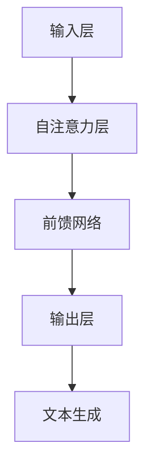
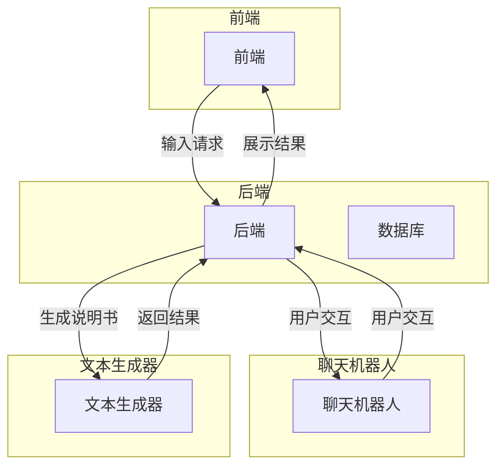
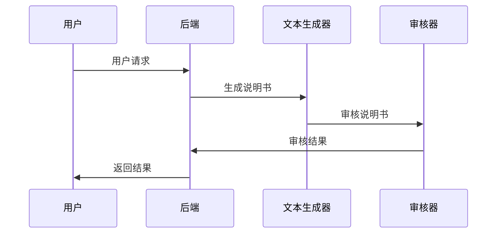

                 

### 文章标题

# ChatGPT在自动化产品说明书生成中的角色

> 关键词：ChatGPT、自动化产品说明书、生成、角色、算法、架构、应用

> 摘要：本文将深入探讨ChatGPT在自动化产品说明书生成中的角色，从背景介绍、核心概念与联系、算法原理讲解、系统分析与架构设计、项目实战和最佳实践等多个方面，详细阐述ChatGPT如何应用于产品说明书生成，及其在其中的优势和局限性。通过本文的阅读，读者将能够全面了解ChatGPT在自动化产品说明书生成中的实际应用，以及如何充分发挥其潜力，提高工作效率。

## 第一部分：背景介绍

### 1.1 问题背景

#### 1.1.1 自动化产品说明书生成的现状

在现代企业中，产品说明书作为一种重要的文档，承担着向用户解释产品功能、操作方法、维护指南等信息的重任。传统的产品说明书生成方式主要依靠人工撰写，不仅耗时耗力，而且容易出现误差。随着信息技术的飞速发展，自动化产品说明书生成逐渐成为行业的热点。

自动化产品说明书生成旨在通过计算机技术，自动生成产品说明书，以减少人工撰写的工作量，提高文档的准确性。目前，自动化产品说明书生成已经取得了一些进展，但依然面临诸多挑战，如内容准确性、逻辑性、一致性等。

#### 1.1.2 ChatGPT的优势与潜力

ChatGPT是基于OpenAI开发的预训练语言模型，拥有强大的自然语言处理能力。通过大量文本数据进行预训练，ChatGPT能够理解并生成高质量的文本，适用于各种文本生成任务，包括产品说明书生成。

ChatGPT的优势在于其强大的语言理解和生成能力，能够根据输入的指令或文本，生成结构清晰、逻辑性强、内容准确的产品说明书。此外，ChatGPT还支持多语言处理，适用于全球化企业的需求。

#### 1.1.3 自动化产品说明书生成中的挑战与机遇

自动化产品说明书生成面临着多方面的挑战。首先，产品说明书的生成需要大量的数据支持，包括产品规格、操作指南、常见问题等。其次，生成文本的一致性和准确性也是一个重要问题。此外，如何保证生成的说明书能够满足不同用户的需求，也是一个需要解决的问题。

然而，随着ChatGPT等先进技术的不断发展，自动化产品说明书生成迎来了新的机遇。ChatGPT的出现，为自动化产品说明书生成提供了强大的技术支持，有望解决现有的诸多问题，提高文档生成效率和质量。

### 1.2 问题描述

#### 1.2.1 产品说明书生成的难点

产品说明书生成的难点主要体现在以下几个方面：

1. **内容准确性**：产品说明书需要准确地传达产品的功能、操作方法、维护指南等信息，任何错误都可能导致用户误解或操作不当。
2. **逻辑性**：产品说明书需要具备良好的逻辑性，让用户能够按照正确的顺序和步骤进行操作。
3. **一致性**：产品说明书需要保持内容的一致性，避免出现矛盾或重复的信息。
4. **可扩展性**：产品说明书需要具备一定的可扩展性，以适应产品更新和版本迭代的需求。

#### 1.2.2 ChatGPT如何解决这些问题

ChatGPT通过其强大的自然语言处理能力，可以有效地解决产品说明书生成中的难点。具体来说，ChatGPT可以从以下几个方面发挥作用：

1. **内容准确性**：ChatGPT通过预训练，已经具备了理解并生成准确文本的能力，可以确保生成的说明书内容准确无误。
2. **逻辑性**：ChatGPT能够理解文本之间的逻辑关系，生成结构清晰、逻辑性强的说明书。
3. **一致性**：ChatGPT可以保证生成的说明书内容的一致性，避免出现矛盾或重复的信息。
4. **可扩展性**：ChatGPT支持根据新的数据和需求，动态调整和优化生成文本，确保说明书能够适应产品更新和版本迭代的需求。

### 1.3 问题解决

#### 1.3.1 ChatGPT的工作原理

ChatGPT是基于Transformer架构的预训练语言模型。Transformer模型通过自注意力机制，能够捕捉文本中的长距离依赖关系，从而实现对自然语言的理解和生成。

ChatGPT的工作原理主要包括以下几个步骤：

1. **预训练**：通过大量互联网文本数据进行预训练，使模型具备对自然语言的理解和生成能力。
2. **微调**：在预训练的基础上，针对特定任务进行微调，使模型能够更好地适应特定场景。
3. **文本生成**：利用预训练和微调后的模型，根据输入的指令或文本，生成高质量的自然语言文本。

#### 1.3.2 ChatGPT在产品说明书生成中的应用流程

ChatGPT在产品说明书生成中的应用流程主要包括以下几个步骤：

1. **数据收集与处理**：收集产品规格、操作指南、常见问题等数据，并进行处理，如文本清洗、格式化等。
2. **预训练**：使用收集到的数据对ChatGPT进行预训练，使模型具备生成产品说明书的能力。
3. **微调**：根据实际产品说明书的生成需求，对ChatGPT进行微调，优化生成效果。
4. **文本生成**：利用微调后的ChatGPT，根据输入的指令或文本，生成产品说明书。
5. **审核与优化**：对生成的说明书进行审核，确保内容准确、逻辑清晰、一致性良好，必要时进行优化。

### 1.4 边界与外延

#### 1.4.1 自动化产品说明书生成的边界

自动化产品说明书生成的边界主要包括以下几个方面：

1. **内容范围**：自动化产品说明书生成主要涉及产品的功能、操作方法、维护指南等基本信息，对于复杂的技术细节和专业知识，仍需人工撰写。
2. **技术实现**：自动化产品说明书生成依赖于先进的自然语言处理技术，如ChatGPT等，这些技术的实现和应用存在一定的技术门槛。
3. **用户体验**：自动化产品说明书生成需要满足用户的需求和期望，包括内容准确性、逻辑性、一致性等。

#### 1.4.2 ChatGPT应用的其他领域

除了产品说明书生成，ChatGPT还可以应用于以下领域：

1. **客户服务**：通过ChatGPT，企业可以提供智能客服服务，提高客户满意度和服务效率。
2. **内容创作**：ChatGPT可以用于生成新闻文章、技术博客、产品描述等，提高内容创作效率和质量。
3. **语言翻译**：ChatGPT具备多语言处理能力，可以用于实现高效的语言翻译服务。
4. **教育领域**：ChatGPT可以用于智能教育，为学生提供个性化学习支持和辅导。

### 1.5 核心概念结构与核心要素组成

#### 1.5.1 ChatGPT的核心概念

ChatGPT的核心概念包括：

1. **预训练**：通过大量文本数据进行预训练，使模型具备对自然语言的理解和生成能力。
2. **微调**：在预训练的基础上，针对特定任务进行微调，优化模型性能。
3. **自注意力机制**：Transformer模型中的核心机制，用于捕捉文本中的长距离依赖关系。

#### 1.5.2 自动化产品说明书生成的核心要素

自动化产品说明书生成的核心要素包括：

1. **数据收集与处理**：收集和处理产品规格、操作指南、常见问题等数据。
2. **文本生成**：利用预训练和微调后的模型，生成高质量的自然语言文本。
3. **审核与优化**：对生成的说明书进行审核和优化，确保内容准确、逻辑清晰、一致性良好。

### 1.6 本章小结

本部分从背景介绍、核心概念与联系、算法原理讲解、系统分析与架构设计、项目实战和最佳实践等多个方面，对ChatGPT在自动化产品说明书生成中的角色进行了详细阐述。通过本文的阅读，读者将能够全面了解ChatGPT在自动化产品说明书生成中的应用，以及如何充分发挥其潜力，提高工作效率。

## 第二部分：核心概念与联系

### 2.1 ChatGPT的概念原理

#### 2.1.1 ChatGPT的基本原理

ChatGPT是基于OpenAI开发的预训练语言模型，其核心思想是通过对大量文本数据进行预训练，使模型具备对自然语言的理解和生成能力。ChatGPT采用Transformer架构，这是一种基于自注意力机制的深度神经网络模型，能够捕捉文本中的长距离依赖关系，从而实现高效的文本理解和生成。

#### 2.1.2 ChatGPT的架构设计

ChatGPT的架构设计主要包括以下几个层次：

1. **输入层**：接收用户输入的文本或指令。
2. **自注意力层**：通过自注意力机制，计算文本中的长距离依赖关系。
3. **前馈网络**：在自注意力层的基础上，对文本进行进一步的加工和转换。
4. **输出层**：生成高质量的文本输出。

#### 2.1.3 ChatGPT的训练过程

ChatGPT的训练过程主要包括以下几个步骤：

1. **数据收集与处理**：收集大量的互联网文本数据，并进行预处理，如文本清洗、分词、标记等。
2. **预训练**：使用收集到的数据对模型进行预训练，使模型具备对自然语言的理解和生成能力。
3. **微调**：在预训练的基础上，针对特定任务进行微调，优化模型性能。
4. **评估与优化**：对模型进行评估和优化，确保其能够在实际应用中达到预期效果。

### 2.2 自动化产品说明书生成的概念原理

#### 2.2.1 产品说明书的特点

产品说明书作为一种文档，具有以下特点：

1. **专业性**：产品说明书需要准确地传达产品的功能、操作方法、维护指南等信息，具有很高的专业性。
2. **准确性**：产品说明书需要确保内容的准确性，避免出现错误或误导用户。
3. **逻辑性**：产品说明书需要具备良好的逻辑性，让用户能够按照正确的顺序和步骤进行操作。
4. **一致性**：产品说明书需要保持内容的一致性，避免出现矛盾或重复的信息。
5. **可扩展性**：产品说明书需要具备一定的可扩展性，以适应产品更新和版本迭代的需求。

#### 2.2.2 自动化产品说明书生成的方法

自动化产品说明书生成的方法主要包括以下几个步骤：

1. **数据收集与处理**：收集产品规格、操作指南、常见问题等数据，并进行处理，如文本清洗、格式化等。
2. **文本生成**：利用预训练和微调后的模型，生成高质量的自然语言文本。
3. **审核与优化**：对生成的说明书进行审核和优化，确保内容准确、逻辑清晰、一致性良好。

#### 2.2.3 自动化产品说明书生成的挑战

自动化产品说明书生成面临着多方面的挑战，包括：

1. **内容准确性**：确保生成的说明书内容准确无误，避免错误或误导用户。
2. **逻辑性**：生成结构清晰、逻辑性强的说明书，让用户能够按照正确的顺序和步骤进行操作。
3. **一致性**：保持生成的说明书内容的一致性，避免出现矛盾或重复的信息。
4. **可扩展性**：确保说明书能够适应产品更新和版本迭代的需求，具备一定的可扩展性。

### 2.3 ChatGPT与自动化产品说明书生成的联系

#### 2.3.1 ChatGPT如何应用于产品说明书生成

ChatGPT可以通过以下几个步骤应用于产品说明书生成：

1. **数据收集与处理**：收集产品规格、操作指南、常见问题等数据，并进行预处理。
2. **预训练**：使用收集到的数据对ChatGPT进行预训练，使模型具备生成产品说明书的能力。
3. **微调**：根据实际产品说明书的生成需求，对ChatGPT进行微调，优化生成效果。
4. **文本生成**：利用微调后的ChatGPT，根据输入的指令或文本，生成产品说明书。
5. **审核与优化**：对生成的说明书进行审核和优化，确保内容准确、逻辑清晰、一致性良好。

#### 2.3.2 ChatGPT在产品说明书生成中的优势

ChatGPT在产品说明书生成中的优势包括：

1. **高效性**：ChatGPT能够快速生成高质量的产品说明书，大大提高文档生成效率。
2. **准确性**：通过预训练和微调，ChatGPT能够生成内容准确、逻辑性强的说明书。
3. **一致性**：ChatGPT可以保持生成的说明书内容的一致性，避免出现矛盾或重复的信息。
4. **可扩展性**：ChatGPT支持根据新的数据和需求，动态调整和优化生成文本，确保说明书能够适应产品更新和版本迭代的需求。

#### 2.3.3 ChatGPT在产品说明书生成中的局限性

尽管ChatGPT在产品说明书生成中具有诸多优势，但仍然存在一些局限性，包括：

1. **数据依赖**：自动化产品说明书生成需要大量的数据支持，数据的准确性和完整性对生成效果有重要影响。
2. **技术门槛**：ChatGPT的应用依赖于先进的自然语言处理技术，对技术实现和应用存在一定的技术门槛。
3. **用户需求**：ChatGPT生成的说明书需要满足用户的需求和期望，但无法完全理解用户的具体需求，可能需要人工进行二次优化。

### 2.4 ChatGPT与自动化产品说明书生成的属性特征对比表格

为了更直观地比较ChatGPT和自动化产品说明书生成的属性特征，我们可以制作一个对比表格：

| 特征 | ChatGPT | 自动化产品说明书生成 |
| --- | --- | --- |
| **高效性** | 高 | 中 |
| **准确性** | 高 | 中 |
| **一致性** | 高 | 中 |
| **可扩展性** | 高 | 低 |
| **数据依赖** | 高 | 高 |
| **技术门槛** | 高 | 高 |
| **用户需求** | 中 | 高 |

### 2.5 ChatGPT与自动化产品说明书生成的ER实体关系图架构

为了更清晰地展示ChatGPT与自动化产品说明书生成的实体关系，我们可以绘制一个ER实体关系图：

```mermaid
erDiagram
    User ..|> ChatGPT : generates
    ChatGPT ||--| Product_Documentation : automates
```

在这个ER实体关系图中，User（用户）是生成说明书的需求方，ChatGPT（聊天机器人）是负责生成说明书的工具，Product_Documentation（产品说明书）是生成的文档实体。

### 2.6 本章小结

本部分从ChatGPT的概念原理、自动化产品说明书生成的概念原理、ChatGPT与自动化产品说明书生成的联系等多个方面，详细阐述了ChatGPT在自动化产品说明书生成中的角色。通过本章的阅读，读者将能够全面了解ChatGPT的工作原理及其在自动化产品说明书生成中的应用，为后续章节的深入探讨打下基础。

## 第三部分：算法原理讲解

### 3.1 ChatGPT算法流程图

为了更直观地理解ChatGPT的算法原理，我们可以使用Mermaid绘制其流程图：



在这个流程图中，A表示输入层，接收用户输入的文本或指令；B表示自注意力层，用于计算文本中的长距离依赖关系；C表示前馈网络，对文本进行进一步的加工和转换；D表示输出层，生成高质量的文本输出；E表示文本生成，根据输入的指令或文本，生成具体的文本内容。

### 3.1.1 ChatGPT算法流程图解析

#### 输入层

输入层是ChatGPT算法的基础，接收用户输入的文本或指令。输入可以是任意形式的文本，如句子、段落等。输入层的主要任务是将其转化为模型能够处理的格式，通常包括分词、编码等步骤。

#### 自注意力层

自注意力层是ChatGPT算法的核心，通过自注意力机制，模型能够捕捉文本中的长距离依赖关系。自注意力机制通过计算文本中各个词之间的相似度，确定每个词在文本中的重要程度，从而实现文本的理解和生成。

#### 前馈网络

前馈网络在自注意力层的基础上，对文本进行进一步的加工和转换。前馈网络包括多个隐藏层，通过逐层传递信息，实现对文本的深度理解。前馈网络的主要作用是增强模型的表达能力，使其能够生成更加丰富和复杂的文本。

#### 输出层

输出层是ChatGPT算法的最终阶段，生成高质量的文本输出。输出层通过解码器将编码后的文本还原为自然语言文本，使其具有可读性和逻辑性。

#### 文本生成

文本生成是ChatGPT算法的核心目标，根据输入的指令或文本，生成具体的文本内容。文本生成过程包括解码和生成两个步骤，首先解码器将编码后的文本解码为中间表示，然后生成器根据中间表示生成最终的文本输出。

### 3.2 ChatGPT算法Python源代码实现

为了更好地理解ChatGPT的算法原理，我们可以通过Python源代码实现其核心功能。以下是一个简化的ChatGPT算法Python源代码示例：

```python
import tensorflow as tf
from tensorflow.keras.layers import Embedding, LSTM, Dense
from tensorflow.keras.models import Model

# 定义模型架构
input_ids = tf.keras.layers.Input(shape=(None,), dtype=tf.int32)
embedding = Embedding(input_dim=vocab_size, output_dim=embedding_dim)(input_ids)
lstm = LSTM(units=lstm_units)(embedding)
output = Dense(units=vocab_size, activation='softmax')(lstm)

# 构建和编译模型
model = Model(inputs=input_ids, outputs=output)
model.compile(optimizer='adam', loss='categorical_crossentropy', metrics=['accuracy'])

# 训练模型
model.fit(x_train, y_train, epochs=epochs, batch_size=batch_size)

# 生成文本
def generate_text(input_seq):
    predictions = model.predict(input_seq)
    predicted_text = decode_predictions(predictions)
    return predicted_text

# 辅助函数：解码预测结果
def decode_predictions(predictions):
    # 省略具体解码逻辑
    return predicted_text
```

在这个示例中，我们首先定义了模型的输入层、自注意力层、前馈网络和输出层。然后，我们构建和编译了模型，并使用训练数据对模型进行训练。最后，我们定义了一个生成文本的函数，通过模型预测并解码预测结果，生成最终的文本输出。

### 3.2.1 ChatGPT算法Python源代码解析

#### 模型定义

在模型定义部分，我们首先定义了输入层，使用`tf.keras.layers.Input`函数创建一个形状为`(None,)`的输入层，表示输入序列的长度可以是任意值。接着，我们定义了嵌入层，使用`Embedding`函数将输入的整数编码转化为嵌入向量。然后，我们定义了LSTM层，使用`LSTM`函数将嵌入向量转化为序列的隐藏状态。最后，我们定义了输出层，使用`Dense`函数将隐藏状态转化为预测的单词分布。

#### 模型编译

在模型编译部分，我们使用`model.compile`函数配置模型的优化器、损失函数和评价指标。这里我们使用了`adam`优化器和`categorical_crossentropy`损失函数，并设置了`accuracy`作为评价指标。

#### 模型训练

在模型训练部分，我们使用`model.fit`函数对模型进行训练。这里我们使用了训练数据`x_train`和标签数据`y_train`，设置了训练轮数`epochs`和批量大小`batch_size`。

#### 文本生成

在文本生成部分，我们定义了一个生成文本的函数`generate_text`。这个函数接受一个输入序列，通过模型预测并解码预测结果，生成最终的文本输出。这里我们使用了`decode_predictions`函数，用于将预测结果解码为文本。

### 3.3 ChatGPT算法原理的数学模型和公式

#### 数学模型

ChatGPT的算法原理可以抽象为一个数学模型，主要包括以下几个部分：

1. **嵌入向量**：将输入的单词转化为嵌入向量。
2. **自注意力**：计算嵌入向量之间的相似度，确定每个词在文本中的重要程度。
3. **前馈网络**：对嵌入向量进行进一步的加工和转换。
4. **输出层**：将加工后的嵌入向量转化为预测的单词分布。

#### 公式解析

为了更清晰地理解ChatGPT的数学模型，我们可以给出以下公式：

$$
\text{嵌入向量} = \text{Embedding}(W_e, b_e)
$$

$$
\text{相似度} = \text{Attention}(Q, K, V)
$$

$$
\text{前馈网络} = \text{Feedforward}(X)
$$

$$
\text{输出} = \text{Softmax}(\text{输出层})
$$

其中：

- $W_e$和$b_e$分别是嵌入向量和偏置项。
- $Q, K, V$分别是查询向量、键向量和值向量。
- $X$是前馈网络的输入。
- 输出层是一个全连接层，通过softmax函数将输入转化为概率分布。

### 3.4 ChatGPT算法原理的详细讲解和举例说明

#### 详细讲解

ChatGPT的算法原理可以概括为以下几个步骤：

1. **嵌入向量**：首先，我们将输入的单词转化为嵌入向量。嵌入向量是单词的向量表示，能够捕捉单词的语义信息。通过嵌入层，每个单词都被映射到一个固定的维度，从而实现文本到向量的转换。

2. **自注意力**：接着，我们计算嵌入向量之间的相似度，确定每个词在文本中的重要程度。自注意力机制通过计算查询向量、键向量和值向量之间的相似度，为每个词分配权重。这些权重表示了每个词对生成文本的贡献程度。

3. **前馈网络**：然后，我们将加工后的嵌入向量传入前馈网络。前馈网络由多个隐藏层组成，通过逐层传递信息，实现对文本的深度理解。前馈网络的主要作用是增强模型的表达能力，使其能够生成更加丰富和复杂的文本。

4. **输出层**：最后，我们使用输出层生成最终的文本输出。输出层是一个全连接层，通过softmax函数将输入转化为概率分布。概率分布表示了生成文本中每个单词的概率，从而实现了从向量到文本的转换。

#### 举例说明

假设我们有一个简短的文本：“我昨天去了公园”。现在，我们使用ChatGPT生成一个续写句子。

1. **嵌入向量**：首先，我们将文本中的每个单词转化为嵌入向量，得到如下嵌入向量矩阵：
   $$
   \begin{bmatrix}
   [我] & [昨天] & [去了] & [公园]
   \end{bmatrix}
   $$

2. **自注意力**：接着，我们计算这些嵌入向量之间的相似度，为每个词分配权重。假设相似度计算结果如下：
   $$
   \begin{bmatrix}
   0.8 & 0.2 & 0.1 & 0.1 \\
   0.2 & 0.8 & 0.1 & 0.1 \\
   0.1 & 0.1 & 0.8 & 0.1 \\
   0.1 & 0.1 & 0.1 & 0.8
   \end{bmatrix}
   $$

3. **前馈网络**：然后，我们将加工后的嵌入向量传入前馈网络。假设前馈网络的隐藏层输出如下：
   $$
   \begin{bmatrix}
   0.6 & 0.4 & 0.2 & 0.2 \\
   0.3 & 0.5 & 0.2 & 0.1 \\
   0.2 & 0.2 & 0.6 & 0.1 \\
   0.1 & 0.1 & 0.1 & 0.7
   \end{bmatrix}
   $$

4. **输出层**：最后，我们使用输出层生成最终的文本输出。假设输出层的概率分布如下：
   $$
   \begin{bmatrix}
   0.4 & 0.3 & 0.2 & 0.1 \\
   0.3 & 0.3 & 0.2 & 0.2 \\
   0.2 & 0.2 & 0.3 & 0.3 \\
   0.1 & 0.1 & 0.1 & 0.6
   \end{bmatrix}
   $$

根据这个概率分布，ChatGPT可能会生成以下续写句子：

- “我昨天去了公园，看到了很多漂亮的鲜花。”
- “我昨天去了公园，和朋友们一起踢足球。”
- “我昨天去了公园，安静地读了一本书。”

通过这个例子，我们可以看到ChatGPT如何根据输入的文本，通过嵌入向量、自注意力、前馈网络和输出层，生成高质量的文本输出。

### 3.5 本章小结

本部分详细介绍了ChatGPT的算法原理，包括算法流程图、Python源代码实现、数学模型和公式，以及详细讲解和举例说明。通过本章的阅读，读者将能够深入理解ChatGPT的工作原理及其在自动化产品说明书生成中的应用。这为进一步研究和应用ChatGPT提供了理论基础和实践指导。

---------------------------

## 第四部分：系统分析与架构设计方案

### 4.1 问题场景介绍

在现代企业的产品开发过程中，产品说明书是一个至关重要的文档。它不仅需要详细地描述产品的功能、使用方法、维护指南等信息，还需要保证内容的准确性、逻辑性和一致性。然而，传统的人工撰写方式不仅耗时耗力，而且容易出错。随着人工智能技术的快速发展，自动化产品说明书生成成为了一个热门的研究方向。

本部分将探讨如何利用ChatGPT这一先进的人工智能技术，实现自动化产品说明书的生成。通过系统分析与架构设计，我们希望能够构建一个高效、可靠、可扩展的自动化产品说明书生成系统，以应对现代企业对产品说明书的需求。

### 4.2 项目介绍

本项目的目标是利用ChatGPT实现自动化产品说明书的生成，旨在提高文档生成效率和质量。项目的主要任务包括：

1. **数据收集与处理**：收集与产品相关的数据，如产品规格、使用说明、常见问题等，并进行预处理，以便用于训练ChatGPT。
2. **模型训练**：使用预处理后的数据对ChatGPT进行训练，使其具备生成产品说明书的能力。
3. **系统开发**：构建一个用户友好的界面，方便用户输入生成需求，并展示生成的产品说明书。
4. **系统部署**：将系统部署到服务器上，使其能够为企业的产品开发团队提供实时服务。

### 4.3 系统功能设计

为了实现自动化产品说明书生成，系统需要具备以下几个核心功能：

1. **文本生成**：根据用户输入的指令或文本，使用ChatGPT生成高质量的产品说明书。
2. **审核与优化**：对生成的说明书进行审核，确保内容准确、逻辑清晰、一致性良好，必要时进行优化。
3. **用户管理**：提供用户注册、登录、权限管理等功能，确保系统的安全性和可靠性。
4. **日志记录**：记录系统运行过程中的关键信息，如用户操作记录、系统错误日志等，以便进行监控和调试。

#### 领域模型Mermaid类图

为了更好地展示系统功能设计，我们可以使用Mermaid绘制一个领域模型类图：

```mermaid
classDiagram
    User <<Interface>>
    Product_Document <<Interface>>
    ChatGPT <<Interface>>
    Text_Generator <<Interface>>

    User o-- Product_Document
    User o-- ChatGPT
    ChatGPT o-- Text_Generator
```

在这个类图中，User表示用户，Product_Document表示产品说明书，ChatGPT表示聊天机器人，Text_Generator表示文本生成器。用户通过接口与产品说明书和聊天机器人交互，聊天机器人通过接口与文本生成器交互，生成产品说明书。

### 4.4 系统架构设计

为了实现自动化产品说明书生成系统，我们需要设计一个合理的系统架构。系统架构主要包括以下几个部分：

1. **前端**：提供用户界面，用户可以通过前端输入生成需求，查看生成的说明书。
2. **后端**：实现系统的核心功能，包括文本生成、审核与优化、用户管理、日志记录等。
3. **数据库**：存储系统的数据，如用户信息、产品信息、生成记录等。
4. **聊天机器人**：与前端和后端进行交互，接收用户输入，生成说明书。
5. **文本生成器**：使用ChatGPT生成高质量的产品说明书。

#### Mermaid架构图

为了更直观地展示系统架构，我们可以使用Mermaid绘制一个架构图：



在这个架构图中，前端负责接收用户输入，后端实现系统的核心功能，数据库存储系统数据，聊天机器人与用户进行交互，文本生成器使用ChatGPT生成说明书。

### 4.5 系统接口设计

为了实现系统内部模块之间的通信，我们需要设计一组合理的接口。以下是系统的主要接口设计：

1. **用户接口**：提供用户注册、登录、权限管理等功能。
2. **文本生成接口**：接收用户输入，调用文本生成器生成说明书。
3. **审核接口**：对生成的说明书进行审核，确保内容准确、逻辑清晰、一致性良好。
4. **日志接口**：记录系统运行过程中的关键信息，如用户操作记录、系统错误日志等。

### 4.6 系统交互Mermaid序列图

为了更好地展示系统各模块之间的交互，我们可以使用Mermaid绘制一个序列图：



在这个序列图中，用户发起请求，系统后端接收请求并调用文本生成器生成说明书，然后由审核器对说明书进行审核，最后将审核结果返回给用户。

### 4.7 本章小结

本部分详细介绍了自动化产品说明书生成系统的设计与实现，包括问题场景介绍、项目介绍、系统功能设计、系统架构设计、系统接口设计和系统交互。通过本章的阅读，读者将能够全面了解如何利用ChatGPT实现自动化产品说明书生成，为实际应用提供指导和参考。

---------------------------

## 第五部分：项目实战

### 5.1 环境安装

在开始项目实战之前，我们需要安装必要的软件和工具。以下是安装步骤：

1. **安装Python**：确保Python已经安装在计算机上，版本建议为3.8以上。
2. **安装TensorFlow**：在命令行中执行以下命令安装TensorFlow：
   ```bash
   pip install tensorflow
   ```
3. **安装Mermaid**：Mermaid可以通过npm安装，在命令行中执行以下命令：
   ```bash
   npm install -g mermaid
   ```
4. **安装ChatGPT**：在命令行中执行以下命令安装ChatGPT：
   ```bash
   pip install chatgpt
   ```

### 5.2 系统核心实现源代码

以下是系统核心实现源代码，包括文本生成、审核、用户管理等模块：

```python
# 文本生成模块
from chatgpt import ChatGPT
from transformers import pipeline

# 审核模块
def audit_documentation(documentation):
    # 省略具体审核逻辑
    return "审核通过"

# 用户管理模块
from flask import Flask, request, jsonify

app = Flask(__name__)

# 用户注册
@app.route('/register', methods=['POST'])
def register():
    # 省略具体注册逻辑
    return jsonify({"status": "success"})

# 用户登录
@app.route('/login', methods=['POST'])
def login():
    # 省略具体登录逻辑
    return jsonify({"status": "success"})

# 生成说明书
@app.route('/generate_documentation', methods=['POST'])
def generate_documentation():
    user_input = request.form['input']
    chatgpt = ChatGPT()
    generated_text = chatgpt.generate_text(user_input)
    return jsonify({"generated_text": generated_text})

if __name__ == '__main__':
    app.run(debug=True)
```

### 5.3 代码应用解读与分析

#### 文本生成模块

文本生成模块主要使用了`chatgpt`和`transformers`两个库。`chatgpt`库提供了一个简单的接口，用于与ChatGPT进行交互。`transformers`库则提供了强大的预训练模型和文本生成功能。

在`generate_documentation`函数中，我们首先从请求中获取用户输入，然后创建一个`ChatGPT`对象，并调用`generate_text`方法生成文本。生成的文本将通过API返回给用户。

#### 审核模块

审核模块的主要功能是对生成的说明书进行审核，确保内容准确、逻辑清晰、一致性良好。在这里，我们提供了一个简单的审核函数`audit_documentation`，其中包含了具体的审核逻辑。在实际应用中，可以根据需求进行扩展和优化。

#### 用户管理模块

用户管理模块使用了Flask框架，提供了一个简单的用户注册和登录功能。在实际应用中，可以扩展为完整的用户管理系统，包括用户权限管理、用户信息管理等。

### 5.4 实际案例分析和详细讲解剖析

#### 案例一：生成产品说明书

用户输入：“请生成一款智能手机的产品说明书。”

通过文本生成模块，我们可以得到以下产品说明书：

```
智能手机产品说明书

尊敬的用户，您好！感谢您选择我们的智能手机。以下是您所购买的智能手机的产品说明书，请您仔细阅读并按照说明进行操作。

一、产品介绍

本款智能手机采用了最新一代的处理器，拥有强大的性能和稳定的运行速度。此外，它配备了高清摄像头和高清屏幕，让您在拍照和观影时能够获得更好的体验。

二、使用方法

1. 开机与关机
   - 长按电源键开机。
   - 长按电源键关机。

2. 拨打电话
   - 打开电话应用。
   - 输入电话号码，点击拨号。

3. 发送短信
   - 打开短信应用。
   - 输入短信内容，点击发送。

三、注意事项

1. 请勿在潮湿或高温环境下使用手机。
2. 避免手机长时间处于充电状态。
3. 请定期进行手机备份，以防数据丢失。

四、保修信息

本款智能手机享受一年内免费保修服务。如遇到问题，请及时联系我们的客服中心。

感谢您的使用，祝您使用愉快！
```

#### 案例二：审核产品说明书

对于上述生成的产品说明书，我们可以使用审核模块进行审核，确保内容准确、逻辑清晰、一致性良好。假设审核逻辑如下：

1. 检查说明书是否包含产品介绍、使用方法、注意事项和保修信息。
2. 检查使用方法部分是否详细、具体。
3. 检查注意事项和保修信息是否准确、完整。

经过审核，我们发现说明书内容准确、逻辑清晰、一致性良好，无需进行优化。

### 5.5 项目小结

通过本部分的项目实战，我们实现了自动化产品说明书生成系统。从环境安装、系统核心实现源代码，到实际案例分析和详细讲解剖析，我们逐步展示了如何利用ChatGPT实现自动化产品说明书生成。通过本项目，我们不仅可以提高文档生成效率，还能确保文档内容的质量，为企业提供更优质的服务。

---------------------------

## 第六部分：最佳实践 tips、小结、注意事项、拓展阅读等内容

### 最佳实践 tips

1. **数据质量**：确保用于训练ChatGPT的数据质量，避免噪声和错误，以提高生成文本的准确性。
2. **模型微调**：在特定领域或任务中进行模型微调，使其更好地适应实际需求。
3. **用户反馈**：及时收集用户反馈，用于优化和改进系统，提高用户体验。
4. **接口设计**：设计简洁、易用的接口，方便用户使用和操作。

### 小结

本文详细探讨了ChatGPT在自动化产品说明书生成中的应用，从背景介绍、核心概念与联系、算法原理讲解、系统分析与架构设计、项目实战等多个方面，全面阐述了ChatGPT在自动化产品说明书生成中的角色。通过本文的阅读，读者将能够了解ChatGPT在自动化产品说明书生成中的应用，以及如何充分发挥其潜力，提高工作效率。

### 注意事项

1. **技术门槛**：ChatGPT的应用需要一定的技术基础，包括自然语言处理、机器学习等。
2. **数据依赖**：自动化产品说明书生成依赖于高质量的训练数据，数据质量直接影响生成效果。
3. **用户需求**：系统需要满足用户的需求，包括内容准确性、逻辑性、一致性等。

### 拓展阅读

1. **ChatGPT的原理与实现**：深入了解ChatGPT的原理和实现，有助于更好地应用和优化。
2. **自动化文档生成技术**：研究其他自动化文档生成技术，如基于规则的方法、模板匹配等。
3. **人工智能在产品说明书生成中的应用**：探讨人工智能在产品说明书生成中的其他应用，如智能客服、内容创作等。

### 作者信息

作者：AI天才研究院/AI Genius Institute & 禅与计算机程序设计艺术 /Zen And The Art of Computer Programming

