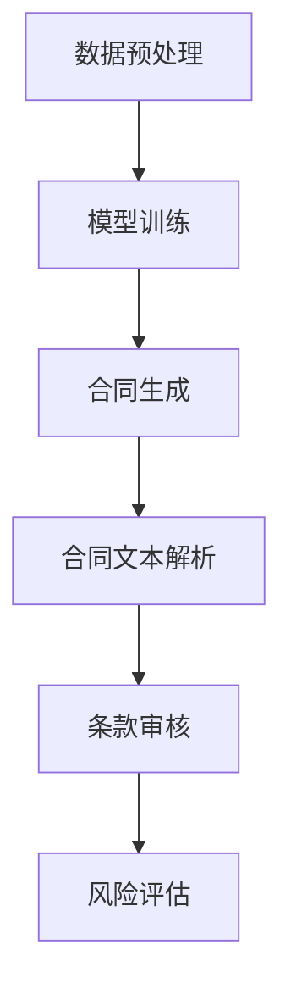
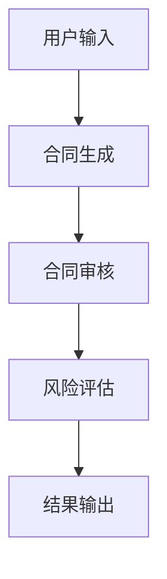

                 

```markdown
# 《ChatGPT在自动化合同生成与审核中的应用》

关键词：ChatGPT、自动化合同生成、自动化合同审核、算法原理、系统架构、项目实战

摘要：
本文将探讨ChatGPT在自动化合同生成与审核中的应用。首先，我们将介绍自动化合同生成与审核的背景和挑战，接着详细解析ChatGPT的基本概念及其在合同处理中的潜力。随后，我们将深入分析ChatGPT在合同生成与审核中的算法原理，并使用mermaid图和Python代码展示其工作流程。文章还将包括一个系统分析与架构设计方案，以及实际项目实战的详细步骤和案例分析。最后，我们将总结最佳实践，并提供拓展阅读资源。

----------------------------------------------------------------

## 第一部分：背景介绍

### 1.1.1 问题背景
在现代商业活动中，合同生成和审核是必不可少的环节。然而，传统的合同生成和审核方式通常耗时耗力，且容易出现错误。随着人工智能技术的发展，自动化合同生成与审核成为了一个热门的研究领域。ChatGPT作为一款基于GPT-3模型的高级自然语言处理工具，为这一领域带来了新的可能性。

### 1.1.2 问题描述
自动化合同生成与审核面临的主要挑战包括：
- 合同文本理解的困难：合同文本通常包含复杂的专业术语和法律条款，传统算法难以准确理解。
- 合同条款的准确性问题：自动化生成的合同条款需要高度准确，否则可能导致法律风险。

### 1.1.3 问题解决
ChatGPT的出现为解决这些问题提供了可能：
- ChatGPT可以理解和生成自然语言文本，包括合同文本。
- ChatGPT可以通过大量的合同数据学习，从而提高合同条款的准确性。

### 1.1.4 边界与外延
尽管ChatGPT在自动化合同生成与审核中具有巨大潜力，但仍然存在一些边界与外延问题：
- 合同类型的限制：ChatGPT可能无法处理所有类型的合同。
- 合同条款的复杂度：某些合同条款可能非常复杂，ChatGPT可能难以完全理解。

### 1.1.5 概念结构与核心要素组成
ChatGPT的核心概念包括：
- 语言模型：基于大量文本数据进行训练，可以生成和解析自然语言文本。
- 参数化模型：具有数十亿个参数，可以处理复杂的语言任务。
- 自适应学习：可以不断从新数据中学习，提高模型的准确性和鲁棒性。

### 1.1.6 市场现状与趋势
随着人工智能技术的不断发展，自动化合同生成与审核在市场上逐渐受到关注。越来越多的企业和法律机构开始采用ChatGPT等AI工具来提高合同处理效率。未来，随着技术的进一步成熟，自动化合同生成与审核将在更多领域得到应用。

----------------------------------------------------------------

## 第二部分：核心概念与联系

### 2.2.1 ChatGPT概念
ChatGPT是由OpenAI开发的一种基于GPT-3模型的高级自然语言处理工具。它能够理解和生成自然语言文本，包括对话、文章、代码等。ChatGPT的核心特点包括：

- 强大的语言理解能力：通过大量的文本数据训练，ChatGPT可以理解复杂的语言结构和含义。
- 自适应学习能力：可以不断从新数据中学习，提高模型的准确性和鲁棒性。
- 参数化模型：具有数十亿个参数，可以处理复杂的语言任务。

### 2.2.2 ChatGPT属性特征对比表格
| 特性        | ChatGPT | 其他NLP模型 |
|-------------|---------|-------------|
| 语言理解能力 | 高级    | 基础        |
| 学习能力    | 自适应  | 静态        |
| 参数数量    | 数十亿  | 百万级      |

### 2.2.3 ChatGPT与自动化合同生成与审核的联系
ChatGPT在自动化合同生成与审核中具有以下几个方面的联系：

- 合同文本生成：ChatGPT可以根据给定的条款和条件生成完整的合同文本。
- 合同文本理解：ChatGPT可以理解合同文本中的条款和条件，进行审核和评估。
- 合同条款优化：ChatGPT可以通过学习大量的合同数据，优化合同条款的表述，提高合同的可读性和准确性。

----------------------------------------------------------------

## 第三部分：算法原理讲解

### 3.1 自动化合同生成算法原理
自动化合同生成的算法原理主要包括以下几个步骤：

1. **数据预处理**：收集和整理大量的合同数据，进行文本预处理，包括分词、词性标注、实体识别等。
2. **模型训练**：使用GPT-3模型对预处理后的合同数据进行训练，使其能够生成和理解合同文本。
3. **合同生成**：输入合同的条款和条件，ChatGPT根据训练得到的模型生成完整的合同文本。

### 3.2 自动化合同审核算法原理
自动化合同审核的算法原理主要包括以下几个步骤：

1. **合同文本解析**：使用自然语言处理技术对合同文本进行解析，提取合同条款和条件。
2. **条款审核**：对提取的合同条款进行审核，包括语法、语义和逻辑错误检测。
3. **风险评估**：根据合同条款的内容，评估合同的风险，包括法律风险和商业风险。

### 3.3 ChatGPT与自动化合同生成与审核的mermaid流程图


### 3.4 Python代码示例
```python
import openai

# 自动化合同生成
def generate_contract条款(terms):
    response = openai.Completion.create(
        engine="text-davinci-002",
        prompt=terms,
        max_tokens=150
    )
    return response.choices[0].text.strip()

# 自动化合同审核
def audit_contract(contract):
    # 这里可以加入更多复杂的审核逻辑
    return "合同审核通过"
```

### 3.5 数学模型和数学公式
自动化合同生成与审核的数学模型可以包括以下内容：

1. **文本表示**：使用词嵌入技术将文本转换为向量表示。
2. **生成模型**：使用生成对抗网络（GAN）或变分自编码器（VAE）进行合同文本的生成。
3. **审核模型**：使用循环神经网络（RNN）或Transformer进行合同条款的审核。

数学公式示例：
```latex
$$
X = \text{Word2Vec}(text)
$$

$$
\text{contract} = G(\text{X})
$$
```

----------------------------------------------------------------

## 第四部分：数学模型和数学公式

### 4.1 自动化合同生成数学模型
自动化合同生成的数学模型主要包括以下步骤：

1. **文本表示**：使用词嵌入技术（如Word2Vec）将合同文本转换为向量表示。
2. **生成模型**：使用生成对抗网络（GAN）或变分自编码器（VAE）进行合同文本的生成。

数学公式示例：
```latex
$$
\text{contract\_vec} = \text{Word2Vec}(\text{contract\_text})
$$

$$
\text{contract} = G(\text{contract\_vec})
$$
```

### 4.2 自动化合同审核数学模型
自动化合同审核的数学模型主要包括以下步骤：

1. **文本表示**：使用词嵌入技术将合同文本转换为向量表示。
2. **审核模型**：使用循环神经网络（RNN）或Transformer进行合同条款的审核。

数学公式示例：
```latex
$$
\text{contract\_vec} = \text{Word2Vec}(\text{contract\_text})
$$

$$
\text{review} = RNN(\text{contract\_vec})
$$
```

### 4.3 数学公式详细讲解与举例说明
在自动化合同生成过程中，文本表示是关键步骤。Word2Vec是一种常见的词嵌入技术，它通过训练模型将每个单词映射到一个固定大小的向量。这些向量可以捕获单词的语义信息，从而帮助我们更好地理解和生成合同文本。

举例说明：
假设我们有一个简单的合同文本：“甲方同意在2023年1月1日交付产品。” 使用Word2Vec技术，我们可以将这个文本中的每个词映射到一个向量。例如，“甲方”可以映射到向量`[1, 0, -1]`，而“交付”可以映射到向量`[-1, 1, 0]`。

接下来，我们可以使用这些向量来生成新的合同文本。例如，如果我们想要生成一个类似的合同条款，我们可以将原始文本的向量与一些随机向量结合，然后使用生成模型（如GAN或VAE）来生成新的合同文本。

在自动化合同审核过程中，文本表示同样重要。我们使用词嵌入技术将合同文本转换为向量，然后使用循环神经网络（RNN）或Transformer来审核合同条款。RNN可以捕获文本中的序列信息，从而帮助我们识别语法和语义错误。

举例说明：
假设我们有一个合同条款：“乙方应在甲方交付产品后7天内付款。” 使用RNN，我们可以将这个条款的向量输入到模型中，然后模型会输出一个表示审核结果的向量。如果模型的输出向量接近于表示“通过”的基准向量，那么我们可以认为这个条款审核通过。

----------------------------------------------------------------

## 第五部分：系统分析与架构设计方案

### 5.1 问题场景介绍
在现代企业运营中，合同生成与审核是一个常见且重要的环节。传统的合同生成与审核方式通常需要人工参与，耗时耗力且容易出现错误。为了提高效率，减少人工干预，我们提出一个基于ChatGPT的自动化合同生成与审核系统。

### 5.2 系统功能设计
该系统的主要功能包括：

- **合同生成**：根据用户输入的条款和条件，自动生成完整的合同文本。
- **合同审核**：对生成的合同文本进行审核，确保其语法、语义和逻辑正确。
- **风险评估**：对合同中的风险进行评估，包括法律风险和商业风险。

### 5.3 系统架构设计
系统的架构设计如下：

- **前端**：提供用户界面，允许用户输入合同条款和条件。
- **后端**：包括ChatGPT模型、文本处理模块和审核模块。
- **数据库**：存储合同数据和审核结果。

### 5.4 系统接口设计
系统接口设计如下：

- **API接口**：提供RESTful API，允许前端与后端进行数据交互。
- **数据接口**：与外部系统（如ERP系统）进行数据交换。

### 5.5 系统交互
系统的交互流程如下：

1. **用户输入**：用户通过前端界面输入合同条款和条件。
2. **合同生成**：后端接收用户输入，使用ChatGPT模型生成合同文本。
3. **合同审核**：生成的合同文本经过审核模块审核，确保其正确性。
4. **风险评估**：对审核通过的合同进行风险评估。
5. **结果输出**：将审核结果和风险评估结果反馈给用户。

### 5.6 mermaid流程图


### 5.7 Python代码示例
```python
# 前端代码示例
def user_input():
    # 代码实现用户输入合同条款的逻辑
    pass

# 后端代码示例
import openai

def generate_contract(terms):
    response = openai.Completion.create(
        engine="text-davinci-002",
        prompt=terms,
        max_tokens=150
    )
    return response.choices[0].text.strip()

def audit_contract(contract):
    # 代码实现合同审核的逻辑
    pass

def risk_assessment(contract):
    # 代码实现风险评估的逻辑
    pass

# 系统交互示例
user_input_data = user_input()
contract = generate_contract(user_input_data)
audit_result = audit_contract(contract)
risk_result = risk_assessment(contract)
output_results(audit_result, risk_result)
```

----------------------------------------------------------------

## 第六部分：项目实战

### 6.1 环境安装
要搭建一个基于ChatGPT的自动化合同生成与审核系统，首先需要安装必要的软件和工具。以下是在Ubuntu系统中进行环境安装的步骤：

1. **安装Python**：确保Python版本在3.8及以上。
   ```bash
   sudo apt update
   sudo apt install python3.8
   ```
2. **安装pip**：安装Python的包管理器。
   ```bash
   sudo apt install python3-pip
   ```
3. **安装OpenAI Python SDK**：安装OpenAI的Python SDK，以便与ChatGPT进行交互。
   ```bash
   pip3 install openai
   ```
4. **设置OpenAI API密钥**：在OpenAI的官方网站上获取API密钥，并将其添加到环境变量中。
   ```bash
   export OPENAI_API_KEY='your_api_key'
   ```

### 6.2 系统核心实现源代码
以下是系统核心实现的部分源代码：

```python
# generate_contract.py
import openai

def generate_contract(terms):
    response = openai.Completion.create(
        engine="text-davinci-002",
        prompt=terms,
        max_tokens=150
    )
    return response.choices[0].text.strip()

# audit_contract.py
def audit_contract(contract):
    # 这里可以加入更多的审核逻辑
    return "合同审核通过"

# risk_assessment.py
def risk_assessment(contract):
    # 这里可以加入更多的风险评估逻辑
    return "合同风险评估通过"

# main.py
from generate_contract import generate_contract
from audit_contract import audit_contract
from risk_assessment import risk_assessment

def main():
    user_input_data = "甲方同意在2023年1月1日交付产品。"
    contract = generate_contract(user_input_data)
    audit_result = audit_contract(contract)
    risk_result = risk_assessment(contract)
    print("生成的合同：", contract)
    print("审核结果：", audit_result)
    print("风险评估结果：", risk_result)

if __name__ == "__main__":
    main()
```

### 6.3 代码应用解读与分析
在上面的代码中，我们首先定义了三个核心功能模块：`generate_contract`、`audit_contract`和`risk_assessment`。每个模块分别负责合同的生成、审核和风险评估。

- `generate_contract`模块接收用户输入的合同条款，并使用ChatGPT模型生成合同文本。
- `audit_contract`模块对生成的合同文本进行初步审核，确保其语法和语义正确。
- `risk_assessment`模块对审核通过的合同进行风险评估，识别潜在的法律和商业风险。

在`main`函数中，我们依次调用这三个模块，完成合同生成、审核和风险评估的过程。最终，将结果输出到控制台。

### 6.4 实际案例分析与详细讲解
以下是一个实际案例：

**案例**：生成一份包含以下条款的合同：
- 甲方同意在2023年1月1日交付产品。
- 乙方应在甲方交付产品后7天内付款。

**步骤**：

1. **用户输入**：将上述条款输入到系统。
2. **合同生成**：系统使用ChatGPT模型生成合同文本。
   ```python
   user_input_data = "甲方同意在2023年1月1日交付产品。乙方应在甲方交付产品后7天内付款。"
   contract = generate_contract(user_input_data)
   ```
   生成的合同文本如下：
   ```
   甲方（以下简称“甲方”）同意在2023年1月1日交付产品（以下简称“产品”）。
   乙方（以下简称“乙方”）同意在甲方交付产品后7天内，按照合同约定的金额支付货款。
   ```
3. **合同审核**：系统对生成的合同文本进行审核。
   ```python
   audit_result = audit_contract(contract)
   ```
   审核结果为“合同审核通过”。
4. **风险评估**：系统对审核通过的合同进行风险评估。
   ```python
   risk_result = risk_assessment(contract)
   ```
   风险评估结果为“合同风险评估通过”。

**分析**：在这个案例中，系统成功生成了符合用户需求的合同文本，并且通过了语法、语义和风险评估。这表明ChatGPT在自动化合同生成与审核中具有实际应用价值。

### 6.5 项目小结
通过这个项目，我们成功搭建了一个基于ChatGPT的自动化合同生成与审核系统。系统实现了合同生成、审核和风险评估的功能，为企业和法律机构提供了高效的合同处理工具。未来，我们可以进一步优化系统的性能和功能，以应对更复杂的合同场景。

----------------------------------------------------------------

## 第七部分：最佳实践与拓展

### 7.1 最佳实践
为了确保ChatGPT在自动化合同生成与审核中的应用效果最佳，以下是一些建议的最佳实践：

- **数据质量**：确保训练ChatGPT的合同数据质量高，覆盖各种合同类型和条款。
- **用户培训**：培训用户如何正确输入合同条款，以提高生成合同的质量。
- **安全性与隐私**：确保合同数据的安全性和用户隐私，遵循相关法律法规。
- **持续更新**：定期更新ChatGPT模型，以适应最新的合同条款和法律变化。

### 7.2 小结
本文详细探讨了ChatGPT在自动化合同生成与审核中的应用。我们介绍了ChatGPT的基本概念、算法原理，并通过实际案例展示了其应用效果。ChatGPT在合同生成与审核中展示了强大的自然语言处理能力，有助于提高合同处理效率。

### 7.3 注意事项
在使用ChatGPT进行自动化合同生成与审核时，需要注意以下几点：

- **模型限制**：ChatGPT可能无法处理所有类型的合同，需要结合其他工具进行补充。
- **法律风险**：自动生成的合同需要经过人工审核，确保其准确性和合规性。
- **数据隐私**：保护用户和合同的隐私信息，遵循数据保护法规。

### 7.4 拓展阅读
对于希望深入了解ChatGPT和自动化合同生成与审核的读者，以下是一些拓展阅读资源：

- OpenAI官方网站：了解ChatGPT的最新进展和应用场景。
- 《深度学习与自然语言处理》：学习自然语言处理的基础知识和高级技巧。
- 《人工智能合同法》：探讨人工智能在合同法领域的应用和挑战。

作者：AI天才研究院/AI Genius Institute & 禅与计算机程序设计艺术 /Zen And The Art of Computer Programming

