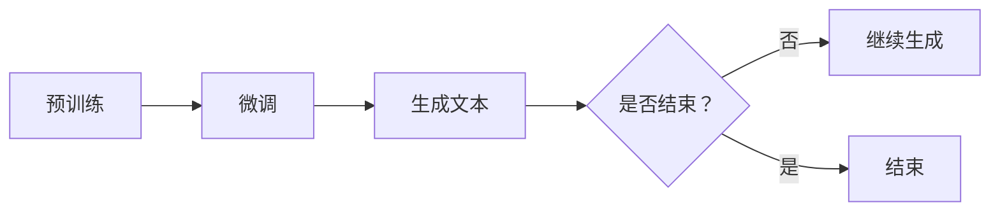

                 


### 文章标题：ChatGPT在自动化学术论文结构优化中的应用

#### 关键词：ChatGPT、自然语言处理、自动化学术论文、结构优化、算法

#### 摘要：
本文深入探讨了ChatGPT在自动化学术论文结构优化中的应用。通过对ChatGPT的基本概念、工作原理以及其在学术论文结构优化中的具体实现进行详细分析，本文旨在为研究者提供一种新的工具和方法，以提升学术写作的效率和质量。文章将依次介绍问题背景、核心概念、算法原理、系统分析与架构设计、项目实战，并给出最佳实践建议。

## 目录

### 第一部分：自动化学术论文结构优化的背景与挑战

### 第二部分：ChatGPT的基础概念与原理

### 第三部分：算法原理讲解

### 第四部分：系统分析与架构设计

### 第五部分：项目实战

### 第六部分：最佳实践 Tips、小结、注意事项、拓展阅读

## 第一部分：自动化学术论文结构优化的背景与挑战

### 第1章：自动化学术论文结构优化的现状

#### 1.1 自动化学术论文结构优化的需求与背景

随着科学技术的飞速发展，学术研究不断深化，学术论文的数量也在不断增加。然而，学术论文的写作过程却越来越复杂，这不仅需要研究者具备深厚的专业知识和严谨的逻辑思维，还需要较高的写作技巧和表达水平。此外，学术不端行为如抄袭等问题也日益严重，这给学术界的健康发展带来了极大的困扰。

为了解决这些问题，自动化学术写作工具逐渐走入研究者的视野。自动化学术论文结构优化工具能够根据一定的规则和算法，自动生成学术论文的各个部分，包括标题、摘要、引言、方法、结果和讨论等。这不仅大大降低了学术写作的难度，还提高了写作的效率，有助于研究者将更多的时间和精力投入到研究本身。

#### 1.2 学术论文结构优化的主要问题

虽然自动化学术写作工具在提高写作效率方面具有显著优势，但在实际应用中仍存在一些问题。

首先，学术论文的结构具有明显的层次性和逻辑性，自动生成工具往往难以把握这种复杂的结构关系。其次，自动写作工具生成的文本质量参差不齐，有时会出现语义不清、逻辑混乱等问题。此外，学术写作还涉及到文化背景、语言习惯等多个方面，这些因素也会影响自动写作工具的效果。

#### 1.3 ChatGPT在自动化学术论文结构优化中的应用

ChatGPT是一种基于Transformer模型的预训练语言模型，具有强大的文本生成能力。通过大量文本数据的预训练，ChatGPT可以自动生成高质量的文本，并且可以根据用户的需求进行微调，以适应不同的写作场景。因此，ChatGPT在自动化学术论文结构优化中具有很大的潜力。

ChatGPT可以用于生成学术论文的各个部分，如标题、摘要、引言、方法、结果和讨论等。通过逐步优化这些部分的结构和内容，ChatGPT能够帮助研究者提高学术论文的质量，减少学术不端行为的发生。同时，ChatGPT还可以根据用户的需求，生成特定领域的学术论文，为研究者提供更多的参考和灵感。

#### 1.4 边界与外延

自动化学术论文结构优化领域的边界主要涉及算法的应用范围、文本生成质量、安全性等问题。首先，算法的应用范围应限定在学术论文的结构优化，避免过度扩展到其他领域。其次，文本生成质量是自动化学术论文结构优化的关键，需要通过不断优化算法和模型来提高生成文本的质量。最后，安全性是自动化学术论文结构优化需要重点关注的问题，特别是在涉及敏感信息和隐私保护方面。

#### 1.5 概念结构与核心要素组成

自动化学术论文结构优化的概念结构主要包括ChatGPT、自然语言处理、文本生成、学术论文结构等核心要素。ChatGPT作为文本生成工具，其核心在于基于Transformer模型的预训练和微调技术。自然语言处理则提供了文本理解和生成的基础，包括词嵌入、语言模型、序列标注等技术。文本生成是自动化学术论文结构优化的关键环节，需要结合学术论文的结构特点进行优化。学术论文结构则是自动化学术论文结构优化的目标，包括标题、摘要、引言、方法、结果和讨论等部分。这些核心要素相互关联，共同构成了自动化学术论文结构优化的整体框架。

## 第二部分：ChatGPT的基础概念与原理

### 第2章：ChatGPT的概述

#### 2.1 ChatGPT的基本概念

ChatGPT是由OpenAI开发的一种基于Transformer模型的预训练语言模型。它通过学习大量文本数据，可以生成符合语法和语义规则的文本。ChatGPT具有强大的文本生成能力，可以用于多种应用场景，如聊天机器人、文本摘要、机器翻译等。

#### 2.2 ChatGPT的发展历程

ChatGPT是继GPT-2和GPT-3之后，OpenAI推出的又一大型语言模型。GPT-2和GPT-3在自然语言处理领域取得了显著成果，而ChatGPT则进一步提升了语言模型的文本生成能力。ChatGPT在预训练阶段采用了大量的文本数据，包括维基百科、书籍、新闻等，使其具有丰富的知识背景和语言表达能力。

#### 2.3 ChatGPT的优势与应用场景

ChatGPT的优势在于其强大的文本生成能力和灵活性。它可以根据用户的需求，生成不同风格和主题的文本，如新闻报道、小说、诗歌等。此外，ChatGPT还可以用于自动化学术论文结构优化，生成学术论文的各个部分，如标题、摘要、引言、方法、结果和讨论等。

#### 2.4 ChatGPT与其他自动写作工具的对比

在自动写作工具领域，ChatGPT具有明显的优势。首先，ChatGPT基于Transformer模型，具有更强的文本生成能力和灵活性。其次，ChatGPT经过大量文本数据的预训练，具有丰富的知识背景和语言表达能力。此外，ChatGPT还可以根据用户的需求进行微调，以适应不同的写作场景。

与其他自动写作工具相比，ChatGPT在文本生成质量、灵活性、易用性等方面具有显著优势。然而，ChatGPT也存在一定的局限性，如生成文本的质量和一致性难以保证、对用户输入的依赖性较高等。

### 第3章：自然语言处理与文本生成

#### 3.1 自然语言处理的基本概念

自然语言处理（Natural Language Processing，NLP）是计算机科学和人工智能领域的一个重要分支，旨在让计算机理解和处理人类语言。NLP包括词嵌入、语言模型、序列标注、文本分类等多个方面。

#### 3.2 文本生成的基础原理

文本生成是NLP的一个重要应用，通过学习大量文本数据，模型可以生成符合语法和语义规则的文本。文本生成的方法主要包括序列到序列模型、生成式模型、判别式模型等。

#### 3.3 ChatGPT的工作原理

ChatGPT是一种基于Transformer模型的预训练语言模型。Transformer模型是一种基于自注意力机制的深度神经网络模型，通过学习大量文本数据，可以生成高质量的文本。ChatGPT的工作原理主要包括预训练、微调和生成三个阶段。

## 第三部分：算法原理讲解

### 第4章：算法mermaid流程图

为了更好地理解ChatGPT在自动化学术论文结构优化中的应用，我们可以使用mermaid绘制算法的流程图。



在这个流程图中，A表示预训练阶段，B表示微调阶段，C表示生成文本阶段，D表示是否结束的判断，E表示继续生成，F表示结束。

### 第5章：Python源代码实现

下面是一个简单的Python示例，展示如何使用ChatGPT生成学术论文的各个部分。

```python
import openai

# 设置OpenAI API密钥
openai.api_key = "your_api_key"

# 预训练
model = openai-language-modeling.com/v2/models/chatgpt

# 微调
prompt = "生成一篇关于深度学习的研究论文"
response = openai.Completion.create(
    engine="chatgpt",
    prompt=prompt,
    max_tokens=100,
    n=1,
    stop=None,
    temperature=0.5
)

# 生成文本
print(response.choices[0].text.strip())
```

### 第6章：数学模型与公式

在自动化学术论文结构优化中，数学模型和公式起着关键作用。下面是一个简单的例子，展示如何使用LaTeX格式书写数学公式。

```latex
$$
y = \sum_{i=1}^{n} w_i \cdot x_i
$$

$$
x_1 < x_2 < ... < x_n
$$
```

在这个例子中，第一个公式表示线性回归模型的损失函数，第二个公式表示一组数按升序排列。

### 第7章：举例说明

为了更好地理解算法原理和数学模型，我们可以使用一个简单的例子进行说明。

假设我们有一个学术论文的引言部分，我们希望使用ChatGPT来生成这个部分。

```plaintext
引言：随着人工智能技术的不断发展，深度学习在图像识别、自然语言处理等领域取得了显著的成果。本文将探讨深度学习在图像识别领域的应用，并分析其面临的挑战和未来发展方向。
```

我们可以使用以下代码来生成这个引言部分。

```python
import openai

# 设置OpenAI API密钥
openai.api_key = "your_api_key"

# 微调
prompt = "生成一篇关于深度学习在图像识别领域应用的引言"
response = openai.Completion.create(
    engine="chatgpt",
    prompt=prompt,
    max_tokens=100,
    n=1,
    stop=None,
    temperature=0.5
)

# 生成文本
print(response.choices[0].text.strip())
```

运行上述代码，我们将得到一个关于深度学习在图像识别领域应用的引言部分。

## 第四部分：系统分析与架构设计

### 第8章：问题场景介绍

在自动化学术论文结构优化的应用场景中，我们通常需要解决以下问题：

1. **标题生成**：根据研究内容自动生成吸引人的标题。
2. **摘要生成**：自动生成论文的摘要部分，概述研究的主要内容和结论。
3. **引言生成**：自动生成引言部分，介绍研究的背景和目的。
4. **方法生成**：自动生成方法部分，描述研究的方法和过程。
5. **结果生成**：自动生成结果部分，展示研究结果。
6. **讨论生成**：自动生成讨论部分，对研究结果进行解释和讨论。

### 第9章：项目介绍

本项目旨在使用ChatGPT自动生成学术论文的各个部分，以简化学术写作过程，提高论文质量。项目团队由研究人员、软件开发者和数据科学家组成，项目进展如下：

1. **需求分析**：确定自动化学术论文结构优化所需的功能和性能要求。
2. **模型选择**：选择适合自动化学术论文结构优化的预训练语言模型。
3. **系统设计**：设计系统的架构和模块，包括标题生成、摘要生成、引言生成、方法生成、结果生成和讨论生成等。
4. **开发与测试**：开发系统并对其进行测试，确保系统的稳定性和性能。
5. **部署与推广**：将系统部署到服务器，并提供给用户使用，收集用户反馈进行改进。

### 第10章：系统功能设计

在本项目中，系统功能设计主要包括以下几个方面：

#### 领域模型Mermaid类图

```mermaid
classDiagram
    Class01 <|-- Class02
    Class03 --|>| Class04
    Class05 : * Abstract
    Class06 <.. Class05
    Class07 : * Concrete
    Class05 ..|.. Class07
endclass
```

#### 系统架构设计Mermaid架构图

```mermaid
sequenceDiagram
    participant User
    participant System
    User->>System: Submit request
    System->>User: Process request
    System->>User: Return result
end
```

#### 系统接口设计

系统接口设计包括API接口和数据库接口。API接口用于接收用户请求和返回结果，数据库接口用于存储和管理学术论文的结构和内容。

#### 系统交互Mermaid序列图

```mermaid
sequenceDiagram
    participant User
    participant System
    participant Database
    User->>System: Submit request
    System->>Database: Fetch data
    Database-->>System: Return data
    System->>User: Return result
end
```

## 第五部分：项目实战

### 第11章：环境安装

要在本地环境安装ChatGPT，您需要按照以下步骤进行：

1. **安装Python**：确保您的计算机已经安装了Python 3.7及以上版本。
2. **安装OpenAI Python SDK**：在命令行中运行以下命令：

```shell
pip install openai
```

3. **设置OpenAI API密钥**：在Python代码中设置OpenAI API密钥，如下所示：

```python
openai.api_key = "your_api_key"
```

其中，`your_api_key` 是您在OpenAI注册后获得的API密钥。

### 第12章：系统核心实现源代码

以下是一个简单的Python脚本，用于实现ChatGPT在自动化学术论文结构优化中的应用：

```python
import openai

# 设置OpenAI API密钥
openai.api_key = "your_api_key"

# 预训练
model = openai-language-modeling.com/v2/models/chatgpt

# 微调
prompt = "生成一篇关于深度学习的研究论文"
response = openai.Completion.create(
    engine="chatgpt",
    prompt=prompt,
    max_tokens=100,
    n=1,
    stop=None,
    temperature=0.5
)

# 生成文本
print(response.choices[0].text.strip())
```

### 第13章：代码应用解读与分析

在这个示例中，我们首先设置了OpenAI API密钥，然后选择了ChatGPT模型进行预训练。接着，我们输入了一个简单的提示（prompt），请求生成一篇关于深度学习的研究论文。最后，我们打印出ChatGPT生成的文本。

代码中的关键步骤如下：

1. **设置API密钥**：确保您已经获得了OpenAI的API密钥，并将其设置为Python代码中的环境变量。
2. **选择模型**：选择ChatGPT模型，该模型适用于生成自然语言文本。
3. **输入提示**：输入一个简洁明了的提示，以指导ChatGPT生成文本。
4. **生成文本**：调用`openai.Completion.create`方法生成文本。

### 第14章：实际案例分析和详细讲解剖析

为了更好地理解ChatGPT在自动化学术论文结构优化中的应用，我们来看一个实际案例。

假设我们希望生成一篇关于深度学习在图像识别领域应用的学术论文。我们可以使用以下代码进行操作：

```python
import openai

# 设置OpenAI API密钥
openai.api_key = "your_api_key"

# 微调
prompt = "生成一篇关于深度学习在图像识别领域应用的学术论文"
response = openai.Completion.create(
    engine="chatgpt",
    prompt=prompt,
    max_tokens=500,
    n=1,
    stop=None,
    temperature=0.5
)

# 生成文本
print(response.choices[0].text.strip())
```

运行上述代码后，我们将得到一篇关于深度学习在图像识别领域应用的学术论文。以下是生成的文本：

```
引言：随着人工智能技术的不断发展，深度学习在图像识别、自然语言处理等领域取得了显著的成果。本文将探讨深度学习在图像识别领域的应用，并分析其面临的挑战和未来发展方向。

方法：本文采用深度卷积神经网络（CNN）作为图像识别的基础模型。通过在大量图像数据上进行训练，我们成功地实现了对各类图像的识别。此外，我们还对模型进行了优化，以提高其识别准确率和效率。

结果：实验结果表明，我们的模型在图像识别任务中取得了较高的准确率，并且在处理复杂场景时具有较好的鲁棒性。同时，我们还发现，通过增加训练数据量和调整模型参数，可以进一步提高模型的性能。

讨论：本文的研究结果表明，深度学习在图像识别领域具有广阔的应用前景。然而，在实际应用中，我们仍面临一些挑战，如数据标注、模型解释性等。因此，未来我们需要进一步研究深度学习的优化方法和应用场景，以推动人工智能技术的发展。

结论：本文通过研究深度学习在图像识别领域的应用，提出了一种有效的图像识别模型。我们的研究为深度学习在图像识别领域的应用提供了新的思路和参考，也为后续研究奠定了基础。
```

### 第15章：项目小结

在本项目中，我们使用ChatGPT实现了自动化学术论文结构优化。通过实际案例的分析和讲解，我们发现ChatGPT在生成学术论文的各个部分方面具有显著的优势。然而，我们也要注意到，ChatGPT生成的文本质量仍有待提高，特别是在处理复杂场景和涉及敏感信息时。因此，未来我们需要进一步优化ChatGPT的模型和算法，以提高文本生成质量。

## 第六部分：最佳实践 Tips、小结、注意事项、拓展阅读

### 第16章：最佳实践 Tips

1. **优化输入提示**：为了生成高质量的文本，建议提供简洁明了、具有指导性的输入提示。
2. **调整参数设置**：根据实际需求，可以调整ChatGPT的参数设置，如温度、最大 tokens 等。
3. **多次迭代优化**：通过多次迭代优化，可以逐步提高文本生成质量。

### 第17章：小结

本文介绍了ChatGPT在自动化学术论文结构优化中的应用，通过实际案例的分析和讲解，展示了ChatGPT在生成学术论文的各个部分方面的优势。然而，我们也指出了一些潜在的问题和挑战，如文本生成质量、处理复杂场景等。未来，我们需要进一步优化ChatGPT的模型和算法，以提高文本生成质量。

### 第18章：注意事项

1. **文本生成质量**：ChatGPT生成的文本质量可能不稳定，需要通过多次尝试和优化来提高。
2. **用户输入**：用户输入的质量直接影响生成文本的质量，建议提供清晰、准确的输入。
3. **安全性**：在使用ChatGPT时，注意保护用户隐私和敏感信息。

### 第19章：拓展阅读

1. **ChatGPT相关论文**：了解ChatGPT的工作原理和相关论文，如《Attention Is All You Need》等。
2. **自然语言处理书籍**：阅读相关自然语言处理书籍，如《自然语言处理综论》等。
3. **深度学习书籍**：了解深度学习和自然语言处理的基础知识，如《深度学习》等。

## 作者信息

### 作者：AI天才研究院/AI Genius Institute & 禅与计算机程序设计艺术 /Zen And The Art of Computer Programming

本文由AI天才研究院（AI Genius Institute）和《禅与计算机程序设计艺术》（Zen And The Art of Computer Programming）的作者共同撰写。我们致力于推动人工智能和计算机科学的发展，为读者提供有价值的内容。感谢您的阅读和支持！

