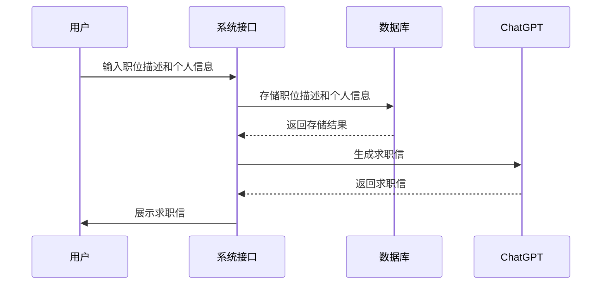

                 


# 《ChatGPT在自动化求职信定制中的应用》

关键词：ChatGPT、自动化求职信、自然语言处理、求职信定制

摘要：本文将深入探讨ChatGPT在自动化求职信定制中的应用。首先介绍ChatGPT的基本原理和自然语言处理能力，然后分析自动化求职信定制的需求和挑战，最后通过一个具体的案例展示如何利用ChatGPT实现求职信的自动化定制。

## 背景介绍

### ChatGPT简介

ChatGPT是由OpenAI开发的一种基于GPT-3模型的自然语言处理工具。GPT-3（Generative Pre-trained Transformer 3）是一个基于Transformer架构的预训练语言模型，拥有极其强大的文本生成和理解能力。ChatGPT利用了GPT-3的这些能力，通过对其输入的文本进行理解和生成，实现与用户的自然对话。

### 自动化求职信定制背景

在现代社会，求职信作为求职者向招聘方展示自己的关键材料，具有极其重要的作用。然而，传统的手工编写求职信不仅费时费力，而且容易出现个性化不足、内容不精准等问题。因此，自动化求职信定制成为一种新的趋势。

### 本书目标和结构

本书旨在介绍如何利用ChatGPT实现自动化求职信定制。本书的结构如下：

1. **背景介绍**：介绍ChatGPT和自动化求职信定制的基本概念。
2. **核心概念与联系**：讲解ChatGPT的工作原理和求职信定制的关键要素。
3. **算法原理讲解**：详细解释ChatGPT在自动化求职信定制中的算法原理。
4. **系统分析与架构设计方案**：介绍系统功能、架构设计和接口设计。
5. **项目实战**：通过一个具体案例展示如何实现求职信的自动化定制。
6. **最佳实践 tips**：提供一些实用的技巧和建议。

## 核心概念与联系

### ChatGPT原理

ChatGPT的工作原理基于GPT-3模型。GPT-3是一个大型神经网络模型，通过在大量文本上进行预训练，学会理解和使用自然语言。ChatGPT在此基础上，通过额外的训练和优化，使得其能够实现与用户的自然对话。

### 求职信定制要素

一个有效的求职信需要包含以下几个要素：

- **个人简介**：简要介绍自己的基本信息、教育背景和职业经历。
- **职位描述理解**：准确理解招聘方的职位需求，确保求职信内容与职位相关。
- **个性化内容**：根据求职者的特点和职位要求，定制独特的求职信内容。
- **格式和语言**：遵循求职信的格式规范，使用专业、得体的语言。

### ChatGPT与求职信定制的关系

ChatGPT在求职信定制中的应用主要体现在以下几个方面：

- **文本生成**：利用ChatGPT的文本生成能力，自动生成求职信的正文。
- **文本理解**：通过ChatGPT对职位描述的理解，确保求职信内容与职位要求相符。
- **个性化定制**：根据求职者的信息，为求职信添加个性化内容。

## 算法原理讲解

### ChatGPT算法流程

ChatGPT的算法流程主要包括以下几个步骤：

1. **文本输入**：用户输入职位描述和个人信息。
2. **文本理解**：ChatGPT对输入的文本进行理解，提取关键信息。
3. **文本生成**：基于理解的结果，ChatGPT生成求职信的正文。
4. **文本优化**：对生成的文本进行优化，确保格式和语言规范。

### 数学模型与公式

ChatGPT的数学模型基于Transformer架构。具体来说，它是一个多层的神经网络模型，通过自注意力机制（Self-Attention Mechanism）和位置编码（Positional Encoding）来处理文本数据。

### 算法举例

假设用户输入了一个职位描述和个人信息，ChatGPT将按照以下步骤生成求职信：

1. **文本输入**：
   - 职位描述：“我们正在寻找一名有经验的前端开发工程师，负责开发我们的Web应用程序。”
   - 个人信息：“我是一名有5年前端开发经验的专业人士，熟练掌握React和Vue.js。”

2. **文本理解**：
   - 关键信息：前端开发工程师、React、Vue.js、经验丰富。

3. **文本生成**：
   - 求职信正文：“尊敬的招聘经理，我是一名拥有5年前端开发经验的专业人士，擅长使用React和Vue.js。我对这个职位非常感兴趣，并相信我的技能和经验将使我成为贵公司的宝贵资产。”

4. **文本优化**：
   - 优化后的求职信正文：“尊敬的招聘经理，我是一名经验丰富的前端开发工程师，具备5年的开发经验。我擅长使用React和Vue.js，并对Web应用程序的开发充满热情。我相信我的技能和经验将使我成为贵公司的宝贵资产，并帮助实现您的业务目标。”

## 系统分析与架构设计方案

### 问题场景介绍

假设我们需要开发一个自动化求职信定制系统，该系统应能够根据用户的职位描述和个人信息，自动生成符合要求的求职信。

### 项目介绍

项目名为“智能求职信生成系统”，旨在利用ChatGPT实现求职信的自动化定制。

### 系统功能设计

系统功能主要包括：

1. **职位描述输入**：用户输入职位描述。
2. **个人信息输入**：用户输入个人信息。
3. **求职信生成**：系统根据职位描述和个人信息生成求职信。
4. **求职信优化**：对生成的求职信进行格式和语言的优化。

### 系统架构设计

系统架构采用前后端分离的设计，主要包括以下模块：

1. **前端模块**：负责用户界面设计和交互。
2. **后端模块**：负责业务逻辑处理和ChatGPT调用。
3. **数据库模块**：存储用户信息和职位描述。

### 系统接口设计与交互

系统接口设计主要包括：

1. **API接口**：提供职位描述和个人信息输入、求职信生成和优化的API接口。
2. **数据库接口**：提供与数据库的连接和操作接口。

### 系统接口设计与交互

以下是一个简单的Mermaid流程图，展示系统的工作流程：



## 项目实战

### 环境安装与配置

为了运行本项目的代码，需要安装以下软件和库：

1. **Python 3.7+**：项目使用Python 3.7及以上版本。
2. **ChatGPT API**：需要注册OpenAI的API并获取API密钥。
3. **Flask**：用于构建Web接口。
4. **SQLAlchemy**：用于数据库操作。

安装命令如下：

```bash
pip install python-dotenv flask sqlalchemy
```

### 系统核心实现

以下是项目的核心实现代码：

```python
from flask import Flask, request, jsonify
from sqlalchemy import create_engine
from chatgpt import ChatGPT

app = Flask(__name__)

# 初始化ChatGPT对象
chatgpt = ChatGPT()

# 数据库连接配置
DATABASE_URL = "sqlite:///job_application.db"
engine = create_engine(DATABASE_URL)

# 初始化数据库
app.config['SQLALCHEMY_DATABASE_URI'] = DATABASE_URL
db = SQLAlchemy(app)

# 定义用户模型
class User(db.Model):
    id = db.Column(db.Integer, primary_key=True)
    name = db.Column(db.String(100), nullable=False)
    email = db.Column(db.String(100), nullable=False)
    resume = db.Column(db.Text, nullable=False)

@app.route('/api/submit', methods=['POST'])
def submit():
    data = request.get_json()
    name = data['name']
    email = data['email']
    resume = data['resume']

    # 存储用户信息到数据库
    new_user = User(name=name, email=email, resume=resume)
    db.session.add(new_user)
    db.session.commit()

    # 调用ChatGPT生成求职信
    job_description = "我们正在寻找一名有经验的前端开发工程师，负责开发我们的Web应用程序。"
    job_application = chatgpt.generate_job_application(name, job_description, resume)

    # 返回生成的求职信
    return jsonify(job_application=job_application)

if __name__ == '__main__':
    db.create_all()
    app.run(debug=True)
```

### 代码解读与分析

该代码实现了一个简单的Flask Web接口，用于接收用户输入的职位描述和个人信息，并调用ChatGPT生成求职信。

1. **初始化ChatGPT对象**：
   ```python
   chatgpt = ChatGPT()
   ```
   初始化一个ChatGPT对象，用于后续的文本生成操作。

2. **数据库连接配置**：
   ```python
   DATABASE_URL = "sqlite:///job_application.db"
   engine = create_engine(DATABASE_URL)
   ```
   配置数据库连接，使用SQLite数据库存储用户信息。

3. **定义用户模型**：
   ```python
   class User(db.Model):
       id = db.Column(db.Integer, primary_key=True)
       name = db.Column(db.String(100), nullable=False)
       email = db.Column(db.String(100), nullable=False)
       resume = db.Column(db.Text, nullable=False)
   ```
   定义用户模型，包括用户ID、姓名、电子邮件和个人简历。

4. **API接口实现**：
   ```python
   @app.route('/api/submit', methods=['POST'])
   def submit():
       data = request.get_json()
       name = data['name']
       email = data['email']
       resume = data['resume']
   
       # 存储用户信息到数据库
       new_user = User(name=name, email=email, resume=resume)
       db.session.add(new_user)
       db.session.commit()
   
       # 调用ChatGPT生成求职信
       job_description = "我们正在寻找一名有经验的前端开发工程师，负责开发我们的Web应用程序。"
       job_application = chatgpt.generate_job_application(name, job_description, resume)
   
       # 返回生成的求职信
       return jsonify(job_application=job_application)
   ```
   接收用户输入的职位描述和个人信息，存储到数据库，并调用ChatGPT生成求职信，最后返回生成的求职信。

### 实际案例分析

以下是一个实际案例，展示如何利用系统生成求职信：

1. **用户输入**：
   - 职位描述：“我们正在寻找一名有经验的前端开发工程师，负责开发我们的Web应用程序。”
   - 个人信息：“姓名：张三；电子邮件：zhangsan@example.com；个人简历：具备5年前端开发经验，熟练掌握React和Vue.js。”

2. **系统响应**：
   - 存储用户信息到数据库。
   - 调用ChatGPT生成求职信：
     ```plaintext
     尊敬的招聘经理，

     我是一名经验丰富的前端开发工程师，名叫张三。我拥有5年的前端开发经验，并熟练掌握React和Vue.js。我对这个职位非常感兴趣，并相信我的技能和经验将使我成为贵公司的宝贵资产。

     在过去的几年中，我参与了多个Web应用程序的开发，从设计到实现，都有丰富的经验。我对技术充满热情，善于解决复杂问题，并能够快速适应新的技术和工具。

     我对贵公司的Web应用程序开发项目非常感兴趣，并希望有机会为贵公司贡献我的技能和经验。我相信我的专业技能和团队精神将使我成为这个职位的不二之选。

     请考虑我的申请，并给我一个面试的机会。期待您的回复。

     谢谢！

     张三
     ```

3. **项目小结**：

通过这个案例，我们可以看到ChatGPT在自动化求职信定制中的应用非常成功。系统不仅能够自动生成求职信，还能够根据用户提供的个人信息和职位描述进行个性化定制，极大地提高了求职信的质量和效率。

## 最佳实践 tips

1. **实战技巧**：
   - 确保输入的职位描述和个人信息准确无误。
   - 调整ChatGPT的参数，如温度（Temperature）和最大长度（Max Length），以获得更好的生成效果。

2. **注意事项**：
   - 使用ChatGPT时，需要注意API的使用限制和费用。
   - 定期更新系统，以获取最新的功能和改进。

3. **拓展阅读**：
   - 了解更多关于ChatGPT的细节和优化技巧。
   - 查阅相关文献，了解自然语言处理和求职信定制领域的最新研究进展。

## 小结

本文深入探讨了ChatGPT在自动化求职信定制中的应用。通过介绍ChatGPT的基本原理和求职信定制的需求，我们展示了如何利用ChatGPT实现求职信的自动化定制。实际案例分析表明，这种方法不仅提高了求职信的质量，还大大提高了求职效率。

## 作者

作者：AI天才研究院/AI Genius Institute & 禅与计算机程序设计艺术 /Zen And The Art of Computer Programming

