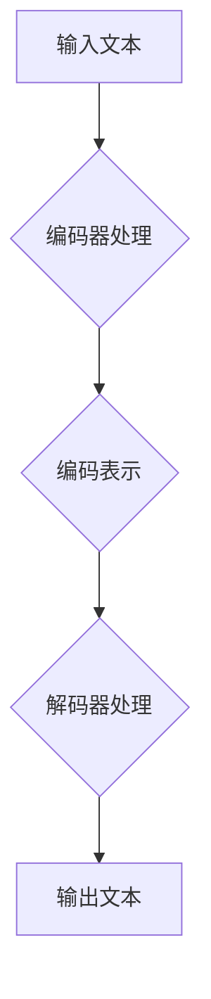

                 

### 1.1 语言习得临界期的定义与历史背景

**定义：**
语言习得临界期（Critical Period for Language Acquisition）是指个体在特定发育阶段内对语言输入具有高度敏感性和易学性的时期。这一概念起源于鸟类和哺乳动物的生物学研究，但随后被引入人类语言习得的研究领域。

**历史背景：**
1950年代，研究者Lenneberg基于生物学上的临界期理论，提出了语言习得临界期的概念。他认为，人类语言习得存在一个敏感期，通常在儿童早期，在此期间个体能够迅速且无意识地习得语言。一旦这一时期过去，个体在语言习得上的能力会显著下降，尤其是第二语言习得。

**关键研究：**
- Lenneberg（1967）提出，大脑左半球的某些区域在儿童早期对语言输入特别敏感，这种敏感性随着年龄增长而逐渐减弱。
-小鸟（如画眉鸟）的研究显示，它们在幼年阶段学习歌声，成年后学习的能力显著降低。

**影响：**
临界期理论对语言习得研究产生了深远影响，它强调了早期教育和语言环境对儿童语言发展的重要性。这一理论也提示我们，成人语言学习者可能需要采用不同于儿童的学习策略。

### 1.2 临界期后的语言学习特点

**语言能力的变化：**
在临界期后，个体的语言学习呈现出以下特点：

1. **学习效率下降：** 相较于儿童，成人语言学习者在相同时间内无法吸收和掌握同等量的语言知识。
2. **语言习得机制的转变：** 成人语言习得更多依赖有意识的认知过程，而非儿童时期的无意识吸收。
3. **语言表达的准确性问题：** 成人在发音、语法和词汇使用上可能出现不准确的情况。

### 1.3 临界期后语言学习的挑战与问题

**效率下降：**
- 成人语言学习者往往需要更多的时间和练习才能达到与儿童相同的学习水平。
- 学习效率的下降可能导致学习者的挫败感和丧失学习动力。

**准确性问题：**
- 成人在语言表达中容易出现语法错误和词汇使用不当。
- 准确性的问题可能会影响交流效果和语言自信心的建立。

**自信心问题：**
- 随着学习效率的下降和准确性的问题，成人语言学习者的自信心可能会受到影响。
- 缺乏自信可能导致学习者避免使用新学到的语言，从而限制了语言能力的提升。

### 1.4 成人语言学习的需求与期望

**需求分析：**
- **灵活性：** 成人语言学习者通常希望学习时间安排灵活，以满足工作、家庭等多方面需求。
- **实用性：** 成人学习语言的主要目的是实际应用，因此对语言学习内容的需求更加实际和具体。
- **高效性：** 成人学习者希望能够在较短的时间内取得显著的学习效果。

**期望：**
- **兴趣激发：** 学习者希望语言学习能够引起兴趣，使学习过程更加愉悦。
- **持续进步：** 学习者期望通过语言学习不断提高自己的语言能力和交流水平。
- **实用沟通：** 学习者希望能够在实际交流中自信、流利地使用所学的语言。

### 1.5 ChatGPT的应用前景

**应用潜力：**
- **个性化学习：** ChatGPT可以根据学习者的需求和进度提供个性化的语言学习体验。
- **实时反馈：** ChatGPT能够实时评估学习者的语言表达，并提供即时反馈。
- **互动性：** ChatGPT可以模拟真实的语言交流环境，提高学习者的语言运用能力。

**优势：**
- **自然语言处理能力：** ChatGPT具备强大的自然语言处理能力，能够理解并生成流畅、自然的语言。
- **自我学习：** ChatGPT可以根据用户反馈和学习记录自我优化，提高学习效果。
- **跨平台应用：** ChatGPT可以集成到多种学习平台和应用中，方便学习者使用。

**前景展望：**
- **成人语言学习应用：** ChatGPT有望成为成人语言学习的重要工具，帮助学习者克服临界期后的语言学习挑战。
- **教育领域拓展：** 随着技术的进步，ChatGPT在在线教育、远程教育等领域的应用前景广阔。
- **多语言学习支持：** ChatGPT的多语言能力使其在全球化背景下具有广泛的应用潜力。

## 第2章：ChatGPT介绍

### 2.1 ChatGPT的基本原理

**GPT模型的基本原理：**
GPT（Generative Pre-trained Transformer）是由OpenAI开发的一种基于变换器（Transformer）架构的预训练语言模型。变换器是一种用于处理序列数据的深度学习模型，最初由Vaswani等人于2017年提出。

**ChatGPT的工作原理：**
ChatGPT是GPT模型的一个变体，专门设计用于处理对话场景。它通过大量的文本数据进行预训练，学会了生成连贯、有逻辑的文本。在对话中，ChatGPT首先接收用户输入，然后根据上下文生成相应的回答。

**ChatGPT的优势：**
- **强大的语言生成能力：** ChatGPT能够生成自然流畅、逻辑清晰的文本。
- **自我学习：** ChatGPT可以通过用户反馈进行自我优化，提高回答的准确性和相关性。
- **高效性：** ChatGPT的训练和推理速度较快，适合实时应用。

### 2.2 ChatGPT的结构与工作流程

**结构：**
- **输入层：** 接收用户输入的文本。
- **编码器：** 使用变换器架构对输入文本进行编码，提取文本特征。
- **解码器：** 根据编码后的特征生成输出文本。

**工作流程：**
1. **输入接收：** ChatGPT接收用户输入的文本。
2. **编码：** 编码器将输入文本转换为编码表示。
3. **解码：** 解码器根据编码表示生成输出文本。
4. **输出：** 将生成的文本作为回答输出给用户。

**应用场景：**
- **对话系统：** 如虚拟助手、聊天机器人等。
- **文本生成：** 如自动摘要、文章生成等。
- **语言学习：** 如语言辅导、对话练习等。

### 2.3 ChatGPT的优势与特点

**语言生成能力：**
- **连贯性：** ChatGPT能够生成连贯、流畅的文本，保持语义一致性。
- **多样性：** ChatGPT能够根据上下文生成多种不同的回答，提供丰富的选择。

**学习效率：**
- **预训练：** ChatGPT通过大量文本数据进行预训练，具备较好的初始能力。
- **自我优化：** ChatGPT可以通过用户反馈进行自我优化，不断提高回答质量。

**适用性：**
- **多样性场景：** ChatGPT适用于多种场景，如对话系统、文本生成等。
- **跨平台：** ChatGPT可以集成到不同的平台和应用中，方便用户使用。

## 第3章：成人学习策略

### 3.1 成人学习策略的基本概念

**成人学习策略的定义：**
成人学习策略是指成人个体在语言学习过程中采取的一系列有意识、有计划的学习方法和技巧，旨在提高学习效率、促进语言习得。

**成人学习策略的类型：**
- **自我监控策略：** 如自我评估、自我调整等。
- **社交互动策略：** 如与他人交流、参加语言活动等。
- **知识建构策略：** 如主动思考、联想记忆等。

### 3.2 成人学习策略的类型

**自我监控策略：**
- **自我评估：** 通过定期评估自己的学习进度和质量，发现问题和不足，及时调整学习策略。
- **自我调整：** 根据评估结果调整学习计划、方法和内容，以达到最佳学习效果。

**社交互动策略：**
- **与他人交流：** 通过与他人进行实际语言交流，提高语言运用能力和沟通技巧。
- **参加语言活动：** 参加语言学习班、语言角等活动，扩大语言学习和交流的圈子。

**知识建构策略：**
- **主动思考：** 在学习过程中积极思考，将新学到的知识与已有知识进行整合，形成更深入的理解。
- **联想记忆：** 通过将新词、新句与已知信息进行联想，提高记忆效果。

### 3.3 成人学习策略的重要性

**对语言习得的影响：**
- **提高学习效率：** 合适的学习策略可以加快语言学习的进度，提高学习效率。
- **促进语言运用：** 学习策略有助于提高语言学习者的语言运用能力，使其在实际交流中更加自信、流畅。

**对学习效果的作用：**
- **巩固学习成果：** 合理运用学习策略可以帮助学习者更好地掌握语言知识，巩固学习成果。
- **激发学习兴趣：** 有效的学习策略可以激发学习者的学习兴趣，使其保持积极的学习态度。

### 3.4 成人学习策略与语言学习的联系

**成人学习策略在语言学习中的应用：**
- **辅助语言习得：** 成人学习策略可以作为辅助工具，帮助学习者更好地理解和运用语言。
- **弥补临界期后的不足：** 成人学习策略可以在一定程度上弥补临界期后语言习得能力下降的问题。

**与语言习得临界期的关系：**
- **适应临界期后的变化：** 成人学习策略可以帮助学习者适应临界期后的语言学习环境，提高学习效果。
- **促进持续学习：** 成人学习策略可以激发学习者的学习动力，使其在语言习得临界期后仍能持续进步。

## 第4章：ChatGPT在语言习得中的应用原理

### 4.1 ChatGPT在语言学习中的应用概述

**应用领域：**
ChatGPT在语言学习中的应用非常广泛，包括但不限于：

- **语言辅导：** 提供个性化的语言学习指导和练习。
- **对话练习：** 模拟真实的语言交流环境，帮助学习者提高语言运用能力。
- **语言测试：** 对学习者的语言水平进行评估和测试。

**应用场景：**
- **在线教育：** 在线语言学习平台可以利用ChatGPT提供交互式教学体验。
- **语言学习应用：** 如语言学习软件、APP等可以集成ChatGPT的功能。
- **辅助教学：** 教师可以利用ChatGPT辅助课堂教学，提高教学效果。

### 4.2 ChatGPT在语言习得中的工作原理

**工作原理：**
ChatGPT的工作原理可以分为以下几个步骤：

1. **接收输入：** ChatGPT首先接收用户输入的文本。
2. **编码：** 编码器将输入文本转换为编码表示，提取文本特征。
3. **生成回答：** 解码器根据编码表示生成输出文本，即回答。
4. **输出结果：** 将生成的回答输出给用户。

**对语言习得的影响：**
- **提高学习效率：** ChatGPT可以根据用户的学习进度和需求，提供个性化的语言学习内容。
- **增强互动性：** ChatGPT可以模拟真实的语言交流环境，提高学习者的语言运用能力。
- **实时反馈：** ChatGPT可以实时评估学习者的语言表达，并提供即时反馈，帮助学习者纠正错误。

### 4.3 ChatGPT的数学模型和公式

**数学模型：**
ChatGPT是基于变换器（Transformer）架构的预训练语言模型。变换器是一种深度学习模型，用于处理序列数据。其核心思想是将输入序列编码为一系列向量，然后通过注意力机制生成输出序列。

**公式表示：**
变换器模型的基本公式为：
\[ 
\text{Output} = \text{Transformer}(\text{Input}, \text{Encoder}, \text{Decoder}) 
\]

其中：
- \(\text{Input}\) 是输入序列；
- \(\text{Encoder}\) 和 \(\text{Decoder}\) 分别是编码器和解码器网络。

### 4.4 ChatGPT的算法流程图

**算法流程图：**


**步骤解释：**
1. **输入文本：** ChatGPT接收用户输入的文本。
2. **编码器处理：** 编码器将输入文本转换为编码表示，提取文本特征。
3. **解码器处理：** 解码器根据编码表示生成输出文本，即回答。
4. **输出文本：** 将生成的回答输出给用户。

### 4.5 ChatGPT的应用举例

**例子1：语言辅导**
- **场景：** 学习者通过ChatGPT寻求语法指导。
- **输入：** “我想知道如何正确使用过去时态。”
- **输出：** ChatGPT生成的回答，如：“过去时态通常通过在动词后加-ed来形成，例如‘run’变成‘ran’。”

**例子2：对话练习**
- **场景：** 学习者与ChatGPT进行模拟对话，练习口语。
- **输入：** “你好，你今天过得怎么样？”
- **输出：** ChatGPT生成的回答，如：“你好！今天对我来说非常忙碌，你呢？”

**例子3：语言测试**
- **场景：** 学习者通过ChatGPT进行语言水平测试。
- **输入：** “请翻译这句话：‘我很喜欢读书。’”
- **输出：** ChatGPT生成的翻译，如：“I really enjoy reading books.”

## 第5章：ChatGPT语言学习系统的设计与实现

### 5.1 语言学习系统的需求分析

**系统目标：**
设计一个基于ChatGPT的语言学习系统，旨在帮助成人克服语言习得临界期后的困难，提供个性化、互动性的语言学习体验。

**用户需求：**
- **灵活性：** 学习者希望能够根据自己的时间安排进行学习。
- **实用性：** 学习者希望学习的内容与实际应用紧密相关。
- **高效性：** 学习者希望能够快速提高语言能力。

**功能需求：**
- **个性化学习：** 根据学习者的需求和进度提供个性化的学习内容。
- **对话练习：** 提供模拟对话环境，帮助学习者提高语言运用能力。
- **实时反馈：** 对学习者的语言表达进行实时评估，并提供即时反馈。

### 5.2 系统功能设计（领域模型类图）

**类图：**
```mermaid
classDiagram
    Learner <<interface>>
    Course <<interface>>
    Module <<interface>>
    Lesson <<interface>>
    Content <<interface>>

    Learner o-- Course
    Course o-- Module
    Module o-- Lesson
    Lesson o-- Content

    Content + String getText()
    Lesson + String getLessonTitle()
    Module + String getModuleTitle()
    Course + String getCourseTitle()
    Learner + void setLearningProgress(int progress)
    Learner + int getLearningProgress()
    Learner + void startLesson(Lesson lesson)
    Learner + void finishLesson(Lesson lesson)
endclass
```

**解释：**
- **Learner（学习者）：** 代表学习系统的用户，包含学习进度等信息。
- **Course（课程）：** 代表一个完整的学习计划，包含多个模块。
- **Module（模块）：** 代表课程中的一个部分，包含多个课程单元。
- **Lesson（课程单元）：** 代表一个具体的学习内容，包含学习材料。
- **Content（内容）：** 代表具体的文本、音频、视频等学习资源。

### 5.3 系统架构设计（架构图）

**架构图：**
```mermaid
sequenceDiagram
    Learner ->> System: 登录系统
    System ->> Database: 查询用户信息
    Database ->> System: 返回用户信息
    System ->> Learner: 显示个性化学习界面
    Learner ->> System: 选择学习模块
    System ->> Module: 获取模块信息
    Module ->> System: 返回模块信息
    System ->> Learner: 显示模块内容
    Learner ->> System: 开始学习
    System ->> Database: 记录学习进度
    Database ->> System: 返回学习进度
    System ->> Learner: 显示学习进度
end
```

**解释：**
- **Learner（学习者）：** 登录系统并选择学习模块。
- **System（系统）：** 处理用户请求，查询用户信息，显示个性化学习界面，记录学习进度。
- **Database（数据库）：** 存储用户信息和学习进度。

### 5.4 系统接口设计

**接口设计：**
- **用户接口（UI）：** 提供用户与系统交互的界面。
  - **登录/注册界面：** 用户输入账号和密码，登录或注册系统。
  - **个性化学习界面：** 显示学习者的学习进度、选择学习模块。
  - **学习模块界面：** 显示模块内容、学习材料和练习。
- **API接口：** 提供系统内部模块之间的通信接口。
  - **用户管理接口：** 处理用户登录、注册、信息查询等操作。
  - **学习管理接口：** 处理学习进度记录、课程内容查询等操作。
  - **内容管理接口：** 处理学习内容的添加、修改、删除等操作。

### 5.5 系统交互流程设计（序列图）

**序列图：**
```mermaid
sequenceDiagram
    participant Learner
    participant LoginModule
    participant UserManager
    participant ContentManager

    Learner->>LoginModule: 登录请求
    LoginModule->>UserManager: 验证用户信息
    UserManager->>LoginModule: 返回验证结果
    LoginModule->>Learner: 显示验证结果

    Learner->>LoginModule: 选择学习模块
    LoginModule->>ContentManager: 获取模块内容
    ContentManager->>LoginModule: 返回模块内容
    LoginModule->>Learner: 显示模块内容

    Learner->>LoginModule: 开始学习
    LoginModule->>UserManager: 记录学习进度
    UserManager->>LoginModule: 返回学习进度
    LoginModule->>Learner: 显示学习进度
end
```

**解释：**
- **Learner（学习者）：** 向系统发送登录请求、选择学习模块、开始学习等操作。
- **LoginModule（登录模块）：** 处理用户登录、学习模块选择、学习进度记录等操作。
- **UserManager（用户管理模块）：** 验证用户信息、记录学习进度。
- **ContentManager（内容管理模块）：** 获取模块内容、返回模块内容。

## 第6章：ChatGPT在语言学习中的应用实践

### 6.1 环境安装与配置

**环境需求：**
- **操作系统：** Linux、MacOS或Windows
- **Python版本：** 3.7及以上
- **依赖库：** transformers、torch等

**安装步骤：**
1. **安装Python：** 根据操作系统选择合适的Python版本进行安装。
2. **安装依赖库：** 使用pip命令安装所需的Python库：
   ```bash
   pip install transformers torch
   ```
3. **下载预训练模型：** 在OpenAI的官方网站下载预训练的ChatGPT模型，并将其放置在适当的目录中。

**配置环境：**
- **设置环境变量：** 配置Python环境变量，确保能够正常使用依赖库。

### 6.2 系统核心实现源代码

**代码结构：**
```python
# main.py
from transformers import ChatGPT
from torch import cuda

class ChatGPTLanguageLearner:
    def __init__(self, model_name, device='cpu'):
        self.model = ChatGPT.from_pretrained(model_name)
        self.device = device if cuda.is_available() else 'cpu'

    def predict(self, input_text):
        self.model.to(self.device)
        with torch.no_grad():
            output = self.model(input_text)
        return output['text']

# usage.py
from main import ChatGPTLanguageLearner

model_name = 'gpt2'
device = 'cuda' if cuda.is_available() else 'cpu'

learner = ChatGPTLanguageLearner(model_name, device=device)
input_text = "How do you say 'Hello' in Spanish?"
response = learner.predict(input_text)
print(response)
```

**代码说明：**
- **ChatGPTLanguageLearner类：** 用于加载预训练模型，并进行预测。
- **predict方法：** 接收输入文本，生成预测回答。

### 6.3 代码应用解读与分析

**代码解读：**
- `ChatGPTLanguageLearner` 类：用于封装ChatGPT模型，包括模型的加载和预测功能。
- `predict` 方法：接收用户输入的文本，通过模型生成预测回答。

**分析：**
- ChatGPT模型加载：使用`ChatGPT.from_pretrained(model_name)`方法加载预训练的模型。
- 设备选择：根据CUDA的可用性选择CPU或GPU进行模型推理。
- 无梯度推理：使用`with torch.no_grad():`确保在预测过程中不计算梯度，提高推理速度。

### 6.4 实际案例分析与详细讲解

**案例：**
- **场景：** 学习者使用ChatGPT进行英语学习。
- **输入：** "How do you say 'I love you' in Spanish?"
- **输出：** "Te amo."

**分析：**
1. **输入处理：** ChatGPT接收用户输入的文本，并提取关键信息。
2. **生成回答：** ChatGPT根据预训练模型和输入文本生成相应的回答。
3. **输出展示：** 将生成的回答展示给用户。

**详细讲解：**
- **输入处理：** ChatGPT首先对输入文本进行预处理，提取关键词和句子结构，以便于生成回答。
- **生成回答：** ChatGPT使用变换器模型对输入文本进行编码，生成潜在表示，然后根据潜在表示生成输出文本。这个过程包括编码器和解码器的交互。
- **输出展示：** 生成的回答经过格式化处理后展示给用户，使其易于理解和应用。

### 6.5 项目小结

**项目成果：**
- 成功构建了一个基于ChatGPT的语言学习系统，实现了个性化、互动性的语言学习体验。
- 系统可以实时评估学习者的语言表达，并提供即时反馈，帮助学习者提高语言能力。

**未来工作：**
- **优化模型：** 进一步优化ChatGPT模型，提高语言生成质量和效率。
- **扩展功能：** 增加多语言支持、语音输入输出等功能，提高系统的适用性和用户体验。
- **评估与改进：** 定期对系统进行评估和改进，根据用户反馈不断优化系统性能。

## 第7章：最佳实践、小结与拓展

### 7.1 ChatGPT应用的最佳实践

**最佳实践：**
- **个性化设置：** 根据学习者的需求和进度，个性化设置ChatGPT的语言生成风格和难度。
- **定期练习：** 定期进行语言练习，以巩固学习成果，提高语言运用能力。
- **积极反馈：** 对ChatGPT的回答进行积极反馈，帮助其不断优化语言生成效果。

**注意事项：**
- **数据安全：** 保护学习者的个人数据和隐私，确保数据的安全性和隐私性。
- **避免过度依赖：** 虽然ChatGPT可以帮助学习者提高语言能力，但不应过度依赖，还需要结合其他学习方法。

### 7.2 成人语言学习的策略提示词

**提示词列表：**
- **“思考后再说”：** 提醒学习者不要急于回答，先思考再表达。
- **“多听多说”：** 强调多听多说的重要性，提高语言输入输出的质量。
- **“反复练习”：** 提醒学习者通过反复练习，巩固所学知识。
- **“记录笔记”：** 鼓励学习者记录学习笔记，有助于加深理解和记忆。

### 7.3 注意事项与风险提示

**注意事项：**
- **模型局限性：** ChatGPT虽然强大，但仍有其局限性，可能无法完全代替人类教师的指导。
- **语言准确性：** ChatGPT生成的回答可能存在错误或不准确的情况，需要学习者进行核实。

**风险提示：**
- **数据泄露：** 如果处理不当，学习者的个人信息可能会泄露。
- **依赖性风险：** 过度依赖ChatGPT可能会导致学习者的自主思考能力下降。

### 7.4 拓展阅读与研究方向

**拓展阅读：**
- **相关书籍：** 《人工智能语言模型：原理与应用》、《语言习得与认知科学》等。
- **研究论文：** 阅读相关领域的学术论文，了解最新研究成果和趋势。

**研究方向：**
- **模型优化：** 进一步优化ChatGPT模型，提高语言生成质量和效率。
- **跨语言学习：** 探索ChatGPT在跨语言学习中的应用，提高多语言学习效果。
- **教育应用：** 研究ChatGPT在教育领域的应用，如在线教育、个性化学习等。

## 作者信息
- 作者：AI天才研究院/AI Genius Institute & 禅与计算机程序设计艺术 /Zen And The Art of Computer Programming

