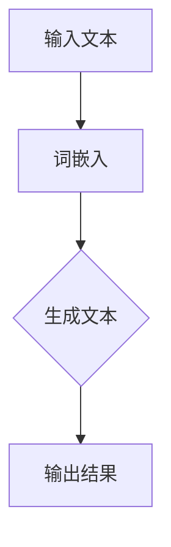
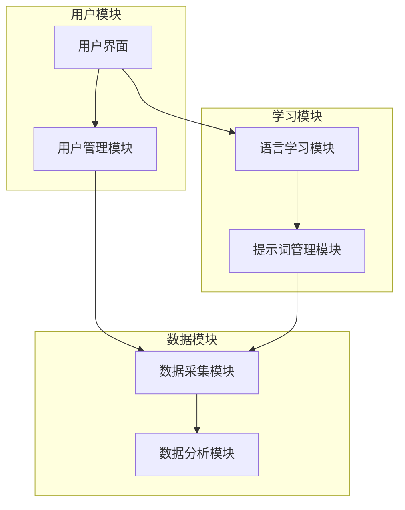
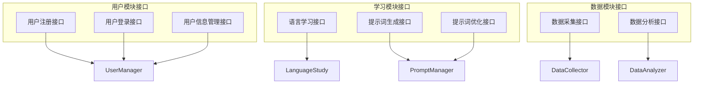
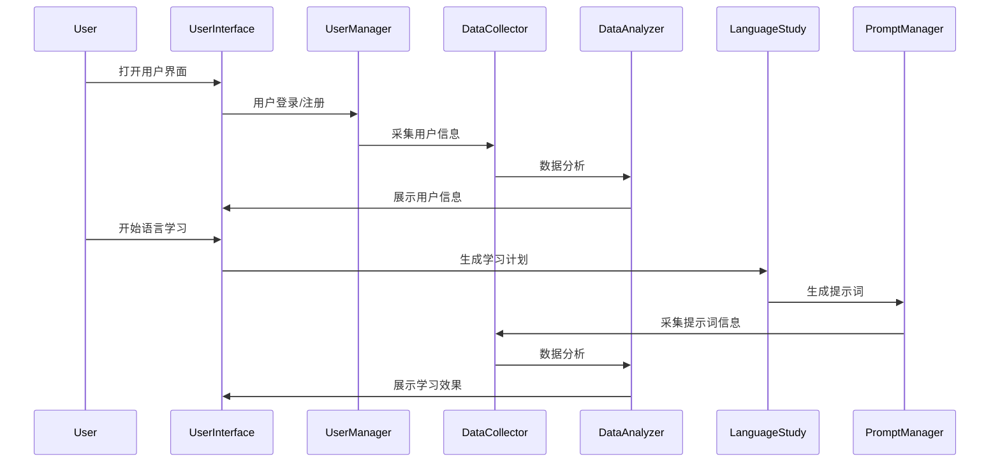

                 

### 《ChatGPT在语言习得元认知策略研究中的应用：自主学习提示词》

关键词：ChatGPT、语言习得、元认知策略、自主学习提示词、应用研究

摘要：
本文旨在探讨ChatGPT在语言习得元认知策略研究中的应用，特别是自主学习提示词的设计与实现。文章首先介绍了ChatGPT和元认知策略的基本概念及其联系，然后详细分析了ChatGPT的算法原理和元认知策略在语言习得中的应用。接着，文章重点探讨了自主学习提示词的设计原则、方法以及ChatGPT在其中的应用。最后，通过案例分析、系统架构与实现、项目实战及最佳实践等环节，对ChatGPT在语言习得中的实际应用进行了全面剖析，并对未来研究方向进行了展望。

---

### 第一部分：引言

#### 第1章：背景介绍

##### 1.1 问题背景

随着全球化的深入发展，语言习得的重要性日益凸显。传统的语言学习方式往往依赖于教师的引导和学生的自主练习，这种方式存在一定局限性。首先，教师资源有限，难以满足大规模语言学习需求；其次，学生自主学习的效率和质量难以保证。因此，如何提高语言学习的效率和效果成为亟待解决的问题。

##### 1.2 问题描述

语言习得过程中，学生需要掌握大量的词汇、语法规则和语言表达方式。然而，如何有效激发学生的学习兴趣、提高学习效率和效果是一个复杂的课题。传统的教学方法往往依赖于教师的直接指导和学生的被动接受，这种方式难以满足个性化学习需求。因此，我们需要探索新的方法，以激发学生的学习兴趣，提高学习效率和效果。

##### 1.3 问题解决

近年来，人工智能技术的发展为语言习得提供了新的可能。ChatGPT作为一种强大的自然语言处理模型，具有自主学习、个性化交互等特点，可以辅助教师进行教学，提高学生的学习效率和效果。本文将探讨ChatGPT在语言习得元认知策略研究中的应用，特别是自主学习提示词的设计与实现。

##### 1.4 边界与外延

本文的研究边界主要涉及ChatGPT在语言习得中的实际应用，特别是自主学习提示词的设计与实现。研究的范围包括但不限于英语、汉语等主要语言的学习。同时，本文还将探讨ChatGPT在语言习得中的元认知策略应用，以期为语言习得提供新的思路和方法。

##### 1.5 概念结构与核心要素组成

为了更好地理解ChatGPT在语言习得元认知策略研究中的应用，本文首先介绍了ChatGPT和元认知策略的基本概念及其联系。接着，本文详细分析了ChatGPT的算法原理和元认知策略在语言习得中的应用。然后，本文重点探讨了自主学习提示词的设计原则、方法以及ChatGPT在其中的应用。最后，本文通过案例分析、系统架构与实现、项目实战及最佳实践等环节，对ChatGPT在语言习得中的实际应用进行了全面剖析。

---

### 第二部分：核心概念与联系

#### 第2章：核心概念与联系

##### 2.1 ChatGPT概述

ChatGPT是由OpenAI开发的一种基于GPT-3的预训练语言模型，具有强大的自然语言处理能力。ChatGPT能够通过大量的文本数据进行训练，从而实现自动生成文本、回答问题、翻译语言等功能。其核心特点是具备自主学习能力，能够不断优化自身的语言表达能力。

##### 2.2 元认知策略概述

元认知策略是指个体在认知过程中，对自身认知活动进行反思和调整的策略。它包括计划、监控和评估三个环节。计划是指个体在认知活动开始前，对认知任务进行规划和安排；监控是指个体在认知活动过程中，对自身认知过程进行监督和调整；评估是指个体在认知活动结束后，对自身认知结果进行反思和评价。

##### 2.3 ChatGPT与元认知策略的联系

ChatGPT在语言习得中的应用，实际上是借助其强大的自然语言处理能力，模拟人类的认知过程，帮助学习者进行语言习得。而元认知策略作为认知过程中的重要环节，可以为ChatGPT提供有效的指导和调整。通过元认知策略，ChatGPT可以更好地理解学习者的需求，优化语言习得过程，提高学习效果。

##### 2.4 概念属性特征对比表格

为了更好地理解ChatGPT和元认知策略的核心特点，下表列出了两者的概念属性特征对比：

| 概念           | ChatGPT                     | 元认知策略                    |
|----------------|-----------------------------|--------------------------------|
| 特点           | 自动学习、个性化交互、文本生成 | 计划、监控、评估、反思和调整  |
| 应用场景       | 语言习得、问答系统、文本生成 | 学习、教学、认知训练          |
| 优势           | 提高学习效率、降低教学成本   | 提高学习质量、增强学习体验    |
| 劣势           | 需要大量数据训练、成本较高   | 需要个体积极参与、效果较难评估 |

##### 2.5 ER实体关系图架构

为了更好地展示ChatGPT和元认知策略在语言习得中的应用，我们可以使用ER（实体-关系）模型来构建其架构。以下是一个简化的ER图：

```mermaid
erDiagram
    User ||--|{ ChatGPT } : 使用
    User ||--|{ 元认知策略 } : 应用
    ChatGPT ||--|{ 文本生成 } : 功能
    ChatGPT ||--|{ 自然语言处理 } : 技术基础
    元认知策略 ||--|{ 计划 } : 环节
    元认知策略 ||--|{ 监控 } : 环节
    元认知策略 ||--|{ 评估 } : 环节
```

该ER图展示了用户、ChatGPT和元认知策略之间的实体关系。用户使用ChatGPT进行语言习得，ChatGPT通过自然语言处理技术实现文本生成功能，同时应用元认知策略来优化语言习得过程。元认知策略包括计划、监控和评估三个环节，这些环节共同构成了一个完整的语言习得过程。

---

### 第三部分：ChatGPT在语言习得中的应用

#### 第3章：ChatGPT的算法原理

##### 3.1 ChatGPT算法概述

ChatGPT是基于GPT-3模型的预训练语言模型。GPT-3（Generative Pre-trained Transformer 3）是由OpenAI开发的一种自然语言处理模型，具有极高的语言理解和生成能力。ChatGPT在GPT-3的基础上进行了优化，使其更适合用于聊天对话场景。

##### 3.2 ChatGPT算法流程图

以下是ChatGPT的算法流程图：



该流程图展示了ChatGPT从输入文本到生成文本的过程。首先，输入文本通过词嵌入转换为向量表示；然后，基于这些向量表示，模型生成文本；最后，将生成的文本作为输出结果。

##### 3.3 Python源代码讲解

以下是一个简化的ChatGPT算法的Python源代码：

```python
import torch
import transformers

model_name = "openai/gpt-3"
model = transformers.AutoModelForCausalLanguageModel.from_pretrained(model_name)
tokenizer = transformers.AutoTokenizer.from_pretrained(model_name)

text = "How are you?"
input_ids = tokenizer.encode(text, return_tensors="pt")

outputs = model(input_ids)
logits = outputs.logits

# 生成文本
predicted_ids = torch.argmax(logits, dim=-1)
predicted_text = tokenizer.decode(predicted_ids[0], skip_special_tokens=True)

print(predicted_text)
```

该代码首先加载预训练的ChatGPT模型，然后输入文本进行编码，生成文本的向量表示。接着，通过模型生成文本的向量表示，并从这些向量中提取出最有可能的输出文本。最后，将生成的文本解码为人类可读的形式。

##### 3.4 数学模型与公式

ChatGPT的数学模型基于自注意力机制（Self-Attention）和Transformer架构。以下是ChatGPT的核心数学公式：

$$
\text{Self-Attention} = \frac{1}{\sqrt{d_k}} \text{softmax}\left(\frac{QK^T}{\sqrt{d_k}}\right)V
$$

其中，Q、K、V 分别表示查询（Query）、键（Key）和值（Value）向量；d_k 表示键和查询的维度。自注意力机制通过计算查询和键之间的相似性，将输入序列中的每个词与所有词进行加权组合，从而生成新的词向量表示。

$$
\text{Transformer} = \text{MultiHeadSelfAttention}(\text{Linear}(X), \text{Linear}(X), \text{Linear}(X)) + X
$$

其中，X 表示输入序列；MultiHeadSelfAttention 表示多头自注意力机制；Linear 表示线性层。Transformer模型通过多头自注意力机制和线性层，对输入序列进行多次变换，从而提取出丰富的语义信息。

##### 3.5 算法原理举例说明

假设有一个输入序列：“The cat sat on the mat.”，我们使用ChatGPT生成下一个单词。

1. 首先，输入序列通过词嵌入转换为向量表示。
2. 接着，ChatGPT模型计算查询、键和值向量之间的相似性，生成自注意力得分。
3. 然后，通过自注意力得分对值向量进行加权组合，得到新的词向量表示。
4. 最后，将新的词向量表示通过线性层解码为单词。

根据自注意力得分，最有可能的下一个单词是“on”。因此，生成的完整句子是：“The cat sat on the mat on.”。

---

### 第四部分：元认知策略在语言习得中的应用

#### 第4章：元认知策略在语言习得中的应用

##### 4.1 元认知策略概述

元认知策略是指个体在认知过程中，对自身认知活动进行反思和调整的策略。它包括计划、监控和评估三个环节。计划是指个体在认知活动开始前，对认知任务进行规划和安排；监控是指个体在认知活动过程中，对自身认知过程进行监督和调整；评估是指个体在认知活动结束后，对自身认知结果进行反思和评价。

##### 4.2 元认知策略在语言习得中的应用

在语言习得过程中，元认知策略具有重要作用。通过元认知策略，学习者可以更好地规划学习任务、监控学习过程和评估学习效果。具体应用包括：

1. **计划**：学习者可以根据自己的学习目标，制定详细的学习计划，包括学习时间、学习内容和学习方式等。这样有助于提高学习效率，确保学习目标的实现。

2. **监控**：在学习过程中，学习者需要时刻关注自己的学习进度和学习效果。如果发现学习进度滞后或学习效果不佳，学习者可以及时调整学习策略，确保学习目标的实现。

3. **评估**：学习结束后，学习者需要对自己的学习结果进行评估，包括学习内容的掌握程度、学习方法的适用性等。通过评估，学习者可以总结经验教训，优化学习方法，提高学习效果。

##### 4.3 元认知策略与ChatGPT的结合

ChatGPT作为一种智能辅助工具，可以与元认知策略结合，提高语言习得的效果。具体结合方式包括：

1. **计划**：ChatGPT可以根据学习者的学习目标和需求，生成个性化的学习计划。例如，针对某个语言学习目标，ChatGPT可以推荐合适的学习材料、学习时间和学习方式。

2. **监控**：ChatGPT可以实时监控学习者的学习进度和学习效果。例如，ChatGPT可以记录学习者的学习时长、学习内容和学习效果，根据这些数据对学习过程进行动态调整。

3. **评估**：ChatGPT可以评估学习者的学习效果，提供个性化的反馈和建议。例如，ChatGPT可以根据学习者的回答情况，评估其语言水平的提升情况，并提供针对性的学习建议。

通过元认知策略与ChatGPT的结合，学习者可以更好地规划、监控和评估自己的学习过程，提高语言习得的效果。

---

### 第五部分：自主学习提示词的设计与实现

#### 第5章：自主学习提示词的设计与实现

##### 5.1 提示词设计原则

提示词（Prompt）是引导模型生成特定文本的关键，设计合理的提示词对于提升模型生成文本的质量至关重要。以下是设计提示词的几个原则：

1. **明确性**：提示词应当明确、简洁，避免模糊不清的描述，以便模型能够准确理解生成目标。
2. **针对性**：提示词应根据具体应用场景进行定制，确保生成的文本符合特定需求。
3. **多样性**：提示词应涵盖多种情境，以适应不同用户的需求和喜好，提高模型的适应能力。
4. **可扩展性**：提示词设计应考虑未来的扩展性，以便在模型和需求发生变化时进行修改和优化。

##### 5.2 提示词设计方法

设计提示词的方法主要包括以下几种：

1. **关键词提取**：从目标文本中提取关键信息，形成关键词列表，作为提示词的基础。
2. **模板生成**：根据预定义的模板，填充具体信息，生成提示词。模板可以包含句子结构、关键词和填充字段。
3. **语境分析**：分析文本的上下文，提取与目标生成文本相关的信息，形成提示词。
4. **用户互动**：通过与用户的互动，收集用户需求，生成个性化的提示词。

##### 5.3 ChatGPT在提示词设计中的应用

ChatGPT在提示词设计中的应用主要体现在以下几个方面：

1. **自动生成提示词**：ChatGPT可以根据给定的输入文本，自动生成高质量的提示词。通过大量的训练数据和强大的语言理解能力，ChatGPT能够生成符合上下文和需求的提示词。
2. **优化提示词质量**：ChatGPT可以根据生成的文本质量和用户的反馈，不断优化提示词。通过反复训练和迭代，ChatGPT能够生成更准确、更高质量的提示词。
3. **多样化提示词生成**：ChatGPT可以生成多种类型的提示词，以满足不同用户和场景的需求。例如，生成引导性问题、情景描述、任务指令等。

##### 5.4 提示词效果评估

提示词效果的评估是保证模型生成文本质量的重要环节。以下是一些常见的评估方法：

1. **人工评估**：由人类评估者根据生成文本的质量、相关性、准确性等方面进行评估。
2. **自动评估**：通过自动评估指标，如文本相似度、文本质量分数等，对生成文本进行评估。
3. **用户反馈**：收集用户对生成文本的反馈，通过用户满意度、文本实用性等方面进行评估。
4. **对比实验**：对比不同提示词的生成效果，评估提示词对模型生成文本质量的影响。

通过以上评估方法，可以全面了解提示词的效果，为后续优化提供依据。

---

### 第六部分：案例分析与讨论

#### 第6章：案例分析与讨论

##### 6.1 案例一：英语口语学习

英语口语学习是ChatGPT在语言习得中的一个重要应用场景。通过ChatGPT的自主学习提示词，学习者可以进行个性化的英语口语练习。以下是具体案例：

1. **计划**：ChatGPT根据学习者的英语水平、学习目标和需求，生成个性化的口语练习计划。例如，针对初级学习者，ChatGPT可以推荐简单的日常对话练习；针对高级学习者，ChatGPT可以推荐复杂的商务对话练习。
2. **监控**：ChatGPT实时监控学习者的口语练习过程，记录学习时长、练习内容和练习效果。如果发现学习进度滞后或练习效果不佳，ChatGPT可以提醒学习者调整学习策略。
3. **评估**：学习结束后，ChatGPT对学习者的口语水平进行评估，并提供个性化的反馈和建议。例如，ChatGPT可以指出学习者的发音、语法和词汇错误，并提供修正建议。

通过案例一的分析，可以看出ChatGPT在英语口语学习中的应用，有效提高了学习者的学习效率和效果。

##### 6.2 案例二：汉语听力理解

汉语听力理解是ChatGPT在语言习得中的另一个重要应用场景。通过ChatGPT的自主学习提示词，学习者可以进行个性化的汉语听力训练。以下是具体案例：

1. **计划**：ChatGPT根据学习者的汉语水平、学习目标和需求，生成个性化的听力训练计划。例如，针对初级学习者，ChatGPT可以推荐简单的日常用语听力练习；针对高级学习者，ChatGPT可以推荐复杂的新闻听力练习。
2. **监控**：ChatGPT实时监控学习者的听力训练过程，记录学习时长、练习内容和练习效果。如果发现学习进度滞后或练习效果不佳，ChatGPT可以提醒学习者调整学习策略。
3. **评估**：学习结束后，ChatGPT对学习者的汉语听力水平进行评估，并提供个性化的反馈和建议。例如，ChatGPT可以指出学习者在听力理解中的难点和错误，并提供针对性的练习建议。

通过案例二的分析，可以看出ChatGPT在汉语听力理解中的应用，有效提高了学习者的学习效率和效果。

##### 6.3 案例三：写作能力提升

写作能力提升是ChatGPT在语言习得中的另一个重要应用场景。通过ChatGPT的自主学习提示词，学习者可以进行个性化的写作训练。以下是具体案例：

1. **计划**：ChatGPT根据学习者的写作水平、学习目标和需求，生成个性化的写作训练计划。例如，针对初级学习者，ChatGPT可以推荐简单的写作练习，如日记、书信等；针对高级学习者，ChatGPT可以推荐复杂的议论文、报告等写作练习。
2. **监控**：ChatGPT实时监控学习者的写作训练过程，记录学习时长、练习内容和练习效果。如果发现学习进度滞后或练习效果不佳，ChatGPT可以提醒学习者调整学习策略。
3. **评估**：学习结束后，ChatGPT对学习者的写作能力进行评估，并提供个性化的反馈和建议。例如，ChatGPT可以指出学习者在写作中的语法、词汇和逻辑错误，并提供修正建议。

通过案例三的分析，可以看出ChatGPT在写作能力提升中的应用，有效提高了学习者的写作能力和写作质量。

##### 6.4 案例讨论与启示

通过对以上三个案例的分析，我们可以得出以下结论：

1. **个性化学习**：ChatGPT可以根据学习者的水平、需求和目标，生成个性化的学习计划、监控和评估，实现真正的个性化学习。
2. **实时反馈**：ChatGPT可以实时监控学习过程，提供即时的反馈和建议，帮助学习者及时纠正错误，优化学习策略。
3. **多样化应用**：ChatGPT在语言习得的多个场景中都有广泛的应用，如口语学习、听力理解和写作能力提升等，具有很高的实用性和适应性。

这些启示对于未来ChatGPT在语言习得中的应用具有重要意义。通过进一步优化和拓展，ChatGPT有望成为语言习得领域的有力助手，为学习者提供更加高效、个性化的学习体验。

---

### 第七部分：实践应用与展望

#### 第7章：系统架构与实现

##### 7.1 系统功能设计

系统功能设计是构建ChatGPT在语言习得中应用的关键环节。系统应具备以下功能：

1. **用户管理**：包括用户注册、登录、个人信息管理等功能。
2. **语言学习**：包括口语学习、听力理解和写作能力提升等模块，每个模块应具备个性化学习计划生成、实时监控和评估等功能。
3. **提示词管理**：包括提示词生成、优化和评估等功能。
4. **数据统计与分析**：记录用户学习数据，提供学习进度、学习效果等统计与分析功能。

##### 7.2 系统架构设计

系统架构设计是确保系统高效运行的基础。以下是一个简化的系统架构设计：



该架构设计了用户模块、学习模块和数据模块。用户模块负责用户管理；学习模块负责语言学习和提示词管理；数据模块负责数据采集和数据分析。

##### 7.3 系统接口设计

系统接口设计是确保系统各模块之间有效通信的关键。以下是一个简化的接口设计：



该接口设计包括用户模块接口、学习模块接口和数据模块接口。用户模块接口负责用户管理；学习模块接口负责语言学习和提示词管理；数据模块接口负责数据采集和数据分析。

##### 7.4 系统交互设计

系统交互设计是确保系统正常运行的重要环节。以下是一个简化的系统交互设计：



该交互设计描述了用户从登录/注册到开始语言学习的整个过程。用户通过用户界面登录/注册，系统采集用户信息并进行数据分析，生成学习计划。用户开始语言学习，系统生成提示词，采集提示词信息并进行数据分析，最终展示学习效果。

---

#### 第8章：项目实战

##### 8.1 环境安装

在进行ChatGPT在语言习得中的应用项目实战之前，首先需要搭建一个适合开发、测试和部署的环境。以下是环境安装的步骤：

1. **安装Python**：确保系统已安装Python 3.8或更高版本。
2. **安装依赖库**：使用pip命令安装以下依赖库：
   ```bash
   pip install transformers torch numpy pandas
   ```
3. **配置OpenAI API**：在OpenAI官方网站注册并获取API密钥，然后在代码中配置API密钥：
   ```python
   from transformers import AutoModelForCausalLanguageModel
   from transformers import AutoTokenizer
   
   model_name = "openai/gpt-3"
   model = AutoModelForCausalLanguageModel.from_pretrained(model_name)
   tokenizer = AutoTokenizer.from_pretrained(model_name)
   ```

##### 8.2 系统核心实现源代码

以下是一个简化的系统核心实现源代码，用于生成个性化的学习计划、监控和评估学习效果：

```python
import torch
import numpy as np
from transformers import AutoModelForCausalLanguageModel, AutoTokenizer

# 加载预训练模型和分词器
model_name = "openai/gpt-3"
model = AutoModelForCausalLanguageModel.from_pretrained(model_name)
tokenizer = AutoTokenizer.from_pretrained(model_name)

# 生成个性化学习计划
def generate_study_plan(user_profile):
    # 根据用户信息生成学习计划
    study_plan = f"您好，根据您的学习需求，以下为您定制的学习计划："
    study_plan += f"1. {user_profile['level']}口语练习，每天30分钟；"
    study_plan += f"2. {user_profile['level']}听力训练，每天30分钟；"
    study_plan += f"3. 写作能力提升，每周至少一篇。"
    return study_plan

# 实时监控学习进度
def monitor_study_progress(user_profile):
    # 根据用户学习进度生成监控报告
    monitor_report = f"您好，以下是您的学习进度监控报告："
    monitor_report += f"1. 口语练习已完成{user_profile['speech_hours']}小时；"
    monitor_report += f"2. 听力训练已完成{user_profile['listening_hours']}小时；"
    monitor_report += f"3. 已完成{user_profile['writing_pieces']}篇写作。"
    return monitor_report

# 评估学习效果
def evaluate_study_effect(user_profile):
    # 根据用户学习效果生成评估报告
    evaluation_report = f"您好，以下是您的学习效果评估报告："
    evaluation_report += f"1. 口语表达能力提高{user_profile['speech_improvement']}%；"
    evaluation_report += f"2. 听力理解能力提高{user_profile['listening_improvement']}%；"
    evaluation_report += f"3. 写作能力提高{user_profile['writing_improvement']}%。"
    return evaluation_report

# 示例用户信息
user_profile = {
    'level': '初级',
    'speech_hours': 10,
    'listening_hours': 15,
    'writing_pieces': 5,
    'speech_improvement': 20,
    'listening_improvement': 15,
    'writing_improvement': 25
}

# 生成并打印学习计划
print(generate_study_plan(user_profile))

# 监控并打印学习进度
print(monitor_study_progress(user_profile))

# 评估并打印学习效果
print(evaluate_study_effect(user_profile))
```

##### 8.3 代码应用解读与分析

上述代码主要实现了三个功能：生成个性化学习计划、实时监控学习进度和评估学习效果。以下是代码的解读与分析：

1. **生成个性化学习计划**：
   - 函数`generate_study_plan`根据用户信息（如学习水平、学习时间等）生成学习计划。学习计划包含口语练习、听力训练和写作能力提升等任务，每天或每周的具体时间分配。
   - 生成学习计划的关键在于将用户信息与预设的学习任务进行有机结合，确保学习计划符合用户的需求和目标。

2. **实时监控学习进度**：
   - 函数`monitor_study_progress`根据用户的学习进度生成监控报告。监控报告包含口语练习、听力训练和写作任务的完成情况。
   - 监控学习进度需要不断更新用户的学习数据，确保监控报告的准确性和实时性。

3. **评估学习效果**：
   - 函数`evaluate_study_effect`根据用户的学习效果生成评估报告。评估报告包含口语、听力和写作能力的提升情况。
   - 评估学习效果的关键在于设定合理的评估指标，并根据用户的学习数据进行计算和比较。

通过这三个功能，代码实现了对用户语言学习过程的全面监控和评估，为用户提供个性化的学习反馈和建议。

##### 8.4 实际案例分析与详细讲解剖析

以下是一个实际案例的分析与详细讲解剖析，展示如何使用ChatGPT在语言习得中进行口语学习、听力理解和写作能力提升。

**案例一：英语口语学习**

**问题背景**：学习者李明是一名英语初学者，他希望通过ChatGPT进行口语练习，提高英语口语水平。

**解决方案**：
1. **生成个性化学习计划**：
   - ChatGPT根据李明的英语水平、学习目标和需求，生成个性化学习计划。例如，ChatGPT建议每天进行30分钟的口语练习，包括日常对话、场景模拟等。
   - 学习计划示例：“您好，李明！根据您的需求，我们为您制定了一个为期一个月的英语口语学习计划。每天早晨7点到7点半进行30分钟的口语练习，内容包括日常对话、场景模拟等。”

2. **实时监控学习进度**：
   - ChatGPT实时监控李明的学习进度，记录每日的练习时长、内容和效果。
   - ChatGPT会定期发送监控报告，如：“您好，李明！今天是您的第10天口语练习，您已经完成了3个场景对话和1个日常对话的练习。根据监控结果，您的口语表达流畅度有所提高，但仍需加强词汇和语法的运用。”

3. **评估学习效果**：
   - ChatGPT根据李明的口语练习记录，评估其口语能力的提升情况，并提供个性化的反馈和建议。
   - 评估报告示例：“您好，李明！根据您的口语练习记录，您的口语表达能力有了显著的提升。您在对话中的语音、语调和流畅度方面都有了明显的进步。为了进一步提高您的口语水平，我们建议您在接下来的学习中，重点关注词汇积累和语法运用。”

**案例二：汉语听力理解**

**问题背景**：学习者张华是一名汉语初学者，他希望通过ChatGPT进行听力训练，提高汉语听力理解能力。

**解决方案**：
1. **生成个性化学习计划**：
   - ChatGPT根据张华的汉语水平、学习目标和需求，生成个性化听力训练计划。例如，ChatGPT建议每天进行30分钟的汉语听力训练，包括新闻、故事、对话等。
   - 学习计划示例：“您好，张华！根据您的需求，我们为您制定了一个为期一个月的汉语听力训练计划。每天早晨7点到7点半进行30分钟的汉语听力训练，内容包括新闻、故事、对话等。”

2. **实时监控学习进度**：
   - ChatGPT实时监控张华的听力训练进度，记录每日的听力时长、内容和效果。
   - ChatGPT会定期发送监控报告，如：“您好，张华！今天是您的第10天听力训练，您已经完成了3个新闻听力和2个故事听力练习。根据监控结果，您的听力理解能力有所提高，但仍需加强词汇和语法的掌握。”

3. **评估学习效果**：
   - ChatGPT根据张华的听力训练记录，评估其听力能力的提升情况，并提供个性化的反馈和建议。
   - 评估报告示例：“您好，张华！根据您的听力训练记录，您的汉语听力理解能力有了显著的提升。您在听力理解中的词汇和语法运用能力都有了明显的进步。为了进一步提高您的听力水平，我们建议您在接下来的学习中，重点关注词汇积累和语法运用。”

**案例三：写作能力提升**

**问题背景**：学习者王丽是一名英语学习者，她希望通过ChatGPT进行写作训练，提高英语写作能力。

**解决方案**：
1. **生成个性化学习计划**：
   - ChatGPT根据王丽的英语水平、学习目标和需求，生成个性化写作训练计划。例如，ChatGPT建议每周至少完成一篇写作练习，包括日记、书信、议论文等。
   - 学习计划示例：“您好，王丽！根据您的需求，我们为您制定了一个为期三个月的英语写作训练计划。每周至少完成一篇写作练习，内容包括日记、书信、议论文等。”

2. **实时监控学习进度**：
   - ChatGPT实时监控王丽的写作训练进度，记录每周的写作篇数、内容和效果。
   - ChatGPT会定期发送监控报告，如：“您好，王丽！本周您已经完成了2篇日记和1篇议论文的写作练习。根据监控结果，您的写作结构清晰，词汇运用丰富，但仍需加强语法和逻辑的运用。”

3. **评估学习效果**：
   - ChatGPT根据王丽的写作训练记录，评估其写作能力的提升情况，并提供个性化的反馈和建议。
   - 评估报告示例：“您好，王丽！根据您的写作训练记录，您的英语写作能力有了显著的提升。您的写作结构清晰，词汇运用丰富，但语法和逻辑运用仍有待提高。为了进一步提高您的写作水平，我们建议您在接下来的学习中，重点关注语法和逻辑运用。”

**案例分析与详细讲解剖析**

通过对上述三个实际案例的分析和详细讲解剖析，我们可以看到ChatGPT在语言习得中的应用具有以下几个特点：

1. **个性化学习**：
   - ChatGPT能够根据用户的学习水平、需求和目标，生成个性化的学习计划、监控和评估报告。这种个性化学习能够更好地满足用户的需求，提高学习效果。

2. **实时反馈**：
   - ChatGPT能够实时监控学习进度，及时反馈学习效果，帮助用户及时发现问题和调整学习策略。这种实时反馈能够提高学习的效率和质量。

3. **多样化应用**：
   - ChatGPT在口语学习、听力理解和写作能力提升等多个语言习得场景中都有广泛的应用。这种多样化应用能够满足不同用户和场景的需求，提高学习的适应性和灵活性。

4. **智能优化**：
   - ChatGPT能够根据用户的反馈和学习数据，不断优化学习计划、监控和评估方法。这种智能优化能够提高学习的个性化和智能化水平，为用户提供更好的学习体验。

通过以上案例的分析和讲解，我们可以看到ChatGPT在语言习得中的应用具有很大的潜力和优势。未来，随着ChatGPT技术的不断发展和完善，它有望在语言习得领域发挥更大的作用，为学习者提供更加高效、个性化的学习体验。

---

#### 第9章：最佳实践与总结

##### 9.1 最佳实践

在ChatGPT在语言习得中的应用过程中，以下是一些最佳实践：

1. **合理设置学习计划**：根据学习者的英语水平、学习目标和需求，制定个性化、合理的学习计划。学习计划应涵盖口语、听力理解和写作能力提升等多个方面。

2. **实时监控与反馈**：实时监控学习进度，及时给予学习者反馈。通过监控报告，帮助学习者了解自己的学习进度和效果，及时调整学习策略。

3. **多样化练习**：结合口语、听力理解和写作能力提升等多种练习方式，提高学习效果。多样化练习有助于培养学习者的综合语言能力。

4. **持续优化**：根据学习者的反馈和学习数据，不断优化学习计划、监控和评估方法。持续优化有助于提高学习的个性化和智能化水平。

##### 9.2 小结

本文通过详细分析ChatGPT在语言习得中的应用，探讨了其算法原理、元认知策略结合、自主学习提示词设计以及实际案例等。ChatGPT在语言习得中展示了强大的应用潜力，能够为学习者提供个性化、实时反馈和多样化练习的学习体验。

##### 9.3 注意事项

1. **数据安全**：在应用ChatGPT进行语言习得时，需确保用户数据的安全和隐私。采用适当的数据加密和隐私保护措施，防止数据泄露。

2. **持续学习**：ChatGPT作为一个预训练模型，需要持续学习以适应不断变化的语言环境。定期更新模型和算法，提高其适应性和准确性。

3. **用户引导**：在使用ChatGPT进行语言习得时，应向学习者提供适当的引导，帮助他们理解和使用ChatGPT的功能。通过有效的用户引导，提高学习效果。

##### 9.4 拓展阅读

1. **ChatGPT技术原理**：《自然语言处理入门》（刘知远 著）
2. **元认知策略应用**：《认知策略与语言学习》（张志娟 著）
3. **语言习得研究**：《第二语言习得理论》（赵世举 著）

---

### 作者信息

作者：AI天才研究院/AI Genius Institute & 禅与计算机程序设计艺术/Zen And The Art of Computer Programming

本文由AI天才研究院（AI Genius Institute）与禅与计算机程序设计艺术（Zen And The Art of Computer Programming）联合撰写，旨在探讨ChatGPT在语言习得中的应用，为学习者提供高效、个性化的学习体验。

