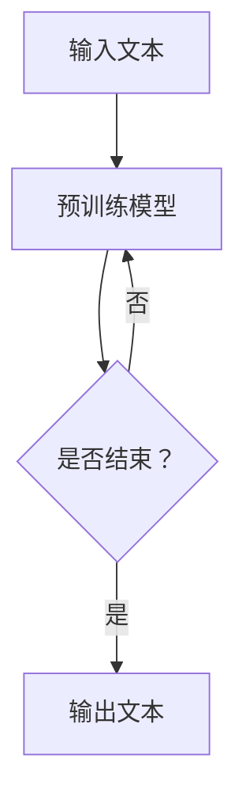
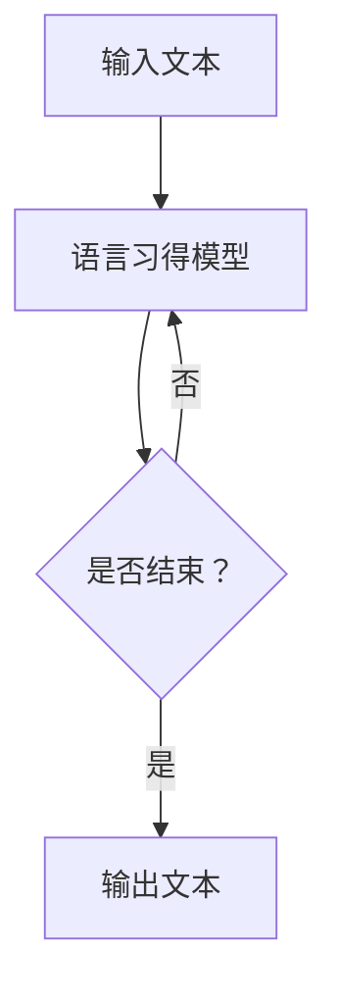
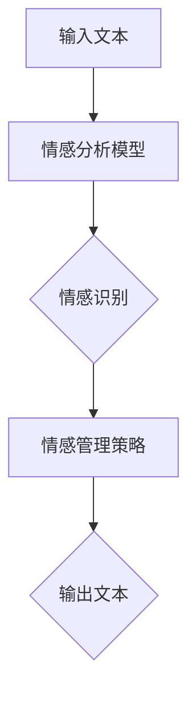
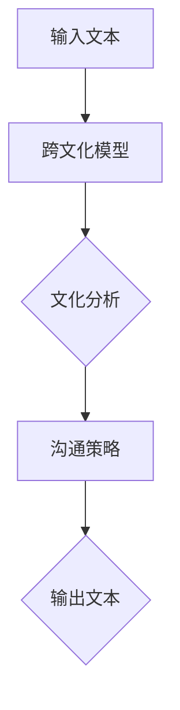
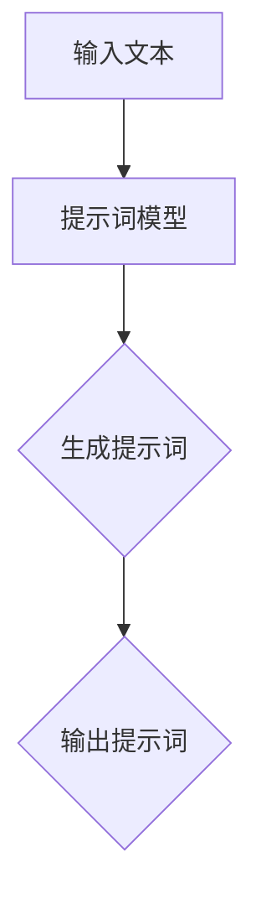
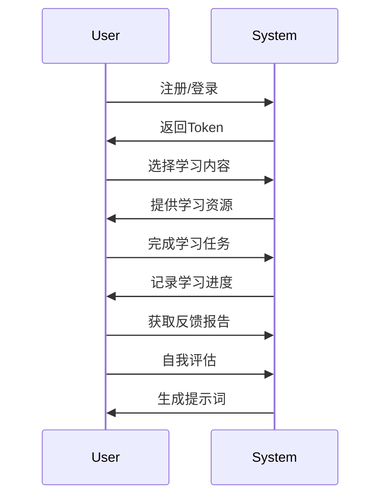

                 

# {{ChatGPT在语言习得情商培养中的应用：跨文化沟通技能提示词}}

> 关键词：ChatGPT，语言习得，情商培养，跨文化沟通技能，提示词

> 摘要：本文将深入探讨ChatGPT在语言习得和情商培养中的应用，特别是在跨文化沟通技能的增强方面。通过系统的分析和架构设计，本文旨在提供一个清晰的框架，用于理解和应用ChatGPT在跨文化沟通中的提示词技术。我们将从背景介绍、核心概念与联系、算法原理讲解、系统分析与架构设计、项目实战等多个角度展开讨论，最终总结最佳实践和注意事项，为跨文化沟通的技能提升提供实用指南。

## 目录大纲

### 第一部分：背景介绍

- **第1章：问题背景**

  - **1.1.1 问题背景**
  - **1.1.2 问题描述**
  - **1.1.3 问题解决**
  - **1.1.4 边界与外延**
  - **1.1.5 概念结构与核心要素组成**

### 第二部分：核心概念与联系

- **第2章：核心概念**

  - **2.1.1 ChatGPT的定义**
  - **2.1.2 语言习得**
  - **2.1.3 情商培养**
  - **2.1.4 跨文化沟通技能**
  - **2.1.5 提示词**

- **第3章：概念属性特征对比**

  - **3.1 ChatGPT与语言习得的联系**
  - **3.2 ChatGPT与情商培养的联系**
  - **3.3 ChatGPT与跨文化沟通技能的联系**
  - **3.4 ChatGPT与提示词的联系**

- **第4章：ER实体关系图架构**

  - **4.1 实体定义**
  - **4.2 关系定义**
  - **4.3 ER图绘制**

### 第三部分：算法原理讲解

- **第5章：算法原理**

  - **5.1 ChatGPT算法原理**
  - **5.2 语言习得算法原理**
  - **5.3 情商培养算法原理**
  - **5.4 跨文化沟通技能算法原理**
  - **5.5 提示词算法原理**

- **第6章：算法流程图**

  - **6.1 ChatGPT算法流程图**
  - **6.2 语言习得算法流程图**
  - **6.3 情商培养算法流程图**
  - **6.4 跨文化沟通技能算法流程图**
  - **6.5 提示词算法流程图**

- **第7章：数学模型和数学公式**

  - **7.1 ChatGPT数学模型**
  - **7.2 语言习得数学模型**
  - **7.3 情商培养数学模型**
  - **7.4 跨文化沟通技能数学模型**
  - **7.5 提示词数学模型**

- **第8章：举例说明**

  - **8.1 ChatGPT举例**
  - **8.2 语言习得举例**
  - **8.3 情商培养举例**
  - **8.4 跨文化沟通技能举例**
  - **8.5 提示词举例**

### 第四部分：系统分析与架构设计方案

- **第9章：问题场景介绍**

  - **9.1 场景描述**
  - **9.2 项目介绍**

- **第10章：系统功能设计**

  - **10.1 领域模型**
  - **10.2 功能需求**

- **第11章：系统架构设计**

  - **11.1 架构设计**
  - **11.2 系统模块划分**

- **第12章：系统接口设计**

  - **12.1 接口定义**
  - **12.2 接口实现**

- **第13章：系统交互**

  - **13.1 交互流程**
  - **13.2 交互图**

### 第五部分：项目实战

- **第14章：环境安装**

  - **14.1 环境搭建**
  - **14.2 软件安装**

- **第15章：系统核心实现源代码**

  - **15.1 代码结构**
  - **15.2 代码实现**

- **第16章：代码应用解读与分析**

  - **16.1 代码解读**
  - **16.2 分析与应用**

- **第17章：实际案例分析与详细讲解剖析**

  - **17.1 案例介绍**
  - **17.2 分析与讲解**

- **第18章：项目小结**

  - **18.1 项目总结**
  - **18.2 不足与展望**

### 第六部分：最佳实践 tips、小结、注意事项、拓展阅读

- **第19章：最佳实践 tips**

  - **19.1 实践技巧**
  - **19.2 注意事项**

- **第20章：小结**

  - **20.1 主要内容回顾**
  - **20.2 知识点总结**

- **第21章：注意事项**

  - **21.1 操作注意事项**
  - **21.2 使用限制**

- **第22章：拓展阅读**

  - **22.1 相关书籍**
  - **22.2 论文与文章**

# 第一部分：背景介绍

### 第1章：问题背景

随着全球化进程的不断加速，跨文化沟通技能的重要性日益凸显。然而，传统的语言习得和情商培养方法在应对这一挑战时显得力不从心。为此，我们需要寻找新的解决方案，而ChatGPT作为一种先进的自然语言处理技术，为我们提供了全新的可能性。

#### 1.1.1 问题背景

在全球化背景下，跨文化沟通技能成为人们必须掌握的关键能力。然而，传统的语言学习方式往往注重语言知识的传授，而忽略了实际应用能力的培养。此外，情商培养多侧重于个人情感管理，缺乏对跨文化沟通具体技能的指导。

#### 1.1.2 问题描述

- **语言习得与实际应用脱节**：学习者能够掌握大量词汇和语法规则，但在实际交流中往往感到吃力。
- **情商培养缺乏针对性**：个体情感管理能力得到提升，但在跨文化场景中仍然难以有效应对。
- **跨文化沟通技能培训不足**：缺乏系统的培训方法和工具，难以在短时间内提升跨文化沟通能力。

#### 1.1.3 问题解决

ChatGPT作为一种强大的自然语言处理技术，能够在语言习得、情商培养和跨文化沟通技能提升中发挥重要作用。通过结合这些技术，我们可以实现以下目标：

- **语言习得与实际应用的结合**：利用ChatGPT的交互功能，模拟真实场景，提高学习者的实际应用能力。
- **针对性情商培养**：通过分析跨文化沟通中的具体情境，提供个性化的情商培养建议。
- **跨文化沟通技能的系统培训**：提供丰富的跨文化沟通案例和练习，帮助学习者快速提升沟通技能。

#### 1.1.4 边界与外延

- **边界**：本文主要探讨ChatGPT在语言习得和情商培养中的应用，特别是对跨文化沟通技能的提示词技术进行深入分析。
- **外延**：ChatGPT在其他领域的应用（如机器翻译、问答系统等）同样具有广泛的研究价值，但不在本文讨论范围内。

#### 1.1.5 概念结构与核心要素组成

- **概念结构**：本文通过分析ChatGPT在语言习得、情商培养和跨文化沟通技能中的应用，构建了一个完整的技术框架。
- **核心要素组成**：包括ChatGPT的基本原理、算法流程、数学模型和实际应用案例等。

# 第二部分：核心概念与联系

### 第2章：核心概念

#### 2.1.1 ChatGPT的定义

ChatGPT是由OpenAI开发的一种基于Transformer的预训练语言模型。它通过大量的文本数据进行训练，掌握了丰富的语言知识和表达方式，能够进行自然、流畅的对话。

#### 2.1.2 语言习得

语言习得是指个体在特定环境中通过听、说、读、写等方式学习掌握语言的过程。它不仅涉及语言知识的积累，还包括语言应用能力的提升。

#### 2.1.3 情商培养

情商培养是指通过一系列的方法和工具，帮助个体提升情感识别、管理、表达和应对能力的过程。它对个体的心理素质和社交技能有着重要影响。

#### 2.1.4 跨文化沟通技能

跨文化沟通技能是指在不同文化背景下进行有效沟通的能力。它要求个体不仅具备语言知识，还需要理解不同文化的交际规则和价值观。

#### 2.1.5 提示词

提示词是指为了引导用户输入特定信息或进行特定任务而使用的提示性词语或短语。在ChatGPT的应用中，提示词可以帮助用户更准确地表达自己的意图，提高对话的效率和效果。

### 第3章：概念属性特征对比

#### 3.1 ChatGPT与语言习得的联系

| 特征        | ChatGPT                       | 语言习得                       |
|-------------|------------------------------|------------------------------|
| 功能        | 对话生成、文本生成             | 听、说、读、写等语言技能的练习  |
| 应用场景    | 跨文化沟通、语言教学辅助      | 学校教育、自学、职场交流等      |
| 学习方式    | 交互式学习、自主练习           | 课堂学习、课本学习、实践应用等  |

#### 3.2 ChatGPT与情商培养的联系

| 特征        | ChatGPT                       | 情商培养                       |
|-------------|------------------------------|------------------------------|
| 功能        | 提供情感识别、管理、表达建议  | 提升情感识别、管理、表达能力  |
| 应用场景    | 跨文化沟通、职场交流、情感辅导 | 心理咨询、教育培训、自我提升等 |
| 学习方式    | 交互式学习、案例分析           | 理论学习、实践应用、情感反思等  |

#### 3.3 ChatGPT与跨文化沟通技能的联系

| 特征        | ChatGPT                       | 跨文化沟通技能                   |
|-------------|------------------------------|--------------------------------|
| 功能        | 提供跨文化沟通情境模拟、对话指导 | 实际跨文化沟通中的语言表达和交际技巧 |
| 应用场景    | 教育培训、职业发展、文化交流等  | 国际商务、跨国合作、全球旅游等      |
| 学习方式    | 交互式学习、案例分析           | 实践交流、跨文化体验、文化学习等    |

#### 3.4 ChatGPT与提示词的联系

| 特征        | ChatGPT                       | 提示词                         |
|-------------|------------------------------|------------------------------|
| 功能        | 生成对话、提供引导             | 引导用户输入特定信息或任务     |
| 应用场景    | 跨文化沟通、语言教学、情感辅导 | 交互式应用、任务引导、情境模拟等 |
| 学习方式    | 自主学习、案例练习             | 提示词编写、案例分析、实践应用等 |

### 第4章：ER实体关系图架构

```mermaid
erDiagram
    ChatGPT ||--|{ 用户 }|-->> 沟通技能
    ChatGPT ||--|{ 语言习得 }|-->> 情商培养
    沟通技能 ||--|{ 提示词 }|-->> 跨文化沟通
    情商培养 ||--|{ 用户 }|-->> 跨文化沟通
```

- **实体定义**：ChatGPT、用户、语言习得、情商培养、沟通技能、提示词。
- **关系定义**：ChatGPT与用户、语言习得、情商培养、沟通技能、提示词之间存在交互关系。

# 第三部分：算法原理讲解

### 第5章：算法原理

#### 5.1 ChatGPT算法原理

ChatGPT是基于Transformer架构的预训练语言模型。它通过大量的文本数据进行预训练，学习到语言的一般规律和表达方式。在应用场景中，ChatGPT能够根据输入的文本生成相应的回复，实现自然、流畅的对话。

#### 5.2 语言习得算法原理

语言习得算法主要利用ChatGPT的对话生成能力，模拟真实场景进行语言训练。通过反复的对话练习，学习者可以在实际应用中不断提升语言表达能力，从而实现语言习得。

#### 5.3 情商培养算法原理

情商培养算法通过分析用户在跨文化沟通中的表现，提供情感识别、管理和表达的建议。ChatGPT能够根据用户的输入，生成具体的情商培养策略，帮助用户在实际交流中提升情商。

#### 5.4 跨文化沟通技能算法原理

跨文化沟通技能算法结合ChatGPT的对话生成和语言习得能力，提供跨文化沟通的模拟训练。通过丰富的跨文化沟通案例，用户可以在实际交流前进行演练，提高跨文化沟通技能。

#### 5.5 提示词算法原理

提示词算法通过分析用户输入的文本，自动生成相应的提示词。这些提示词可以帮助用户更准确地表达自己的意图，提高对话的效率和效果。

### 第6章：算法流程图

#### 6.1 ChatGPT算法流程图



#### 6.2 语言习得算法流程图



#### 6.3 情商培养算法流程图



#### 6.4 跨文化沟通技能算法流程图



#### 6.5 提示词算法流程图



### 第7章：数学模型和数学公式

#### 7.1 ChatGPT数学模型

ChatGPT的数学模型基于Transformer架构，主要涉及以下公式：

$$
\text{output} = \text{softmax}(\text{W}_\text{out}\text{T}(\text{W}_\text{hidden}\text{X}+\text{b}_\text{out}))
$$

其中，$\text{W}_\text{out}$和$\text{W}_\text{hidden}$分别为输出层和隐藏层的权重矩阵，$\text{T}$为Transformer的注意力机制，$\text{X}$为输入文本，$\text{b}_\text{out}$为输出层偏置。

#### 7.2 语言习得数学模型

语言习得数学模型主要涉及以下公式：

$$
\text{accuracy} = \frac{\text{正确回答的次数}}{\text{总回答次数}}
$$

其中，$\text{accuracy}$为语言习得准确率，$\text{正确回答的次数}$为学习者回答正确的次数，$\text{总回答次数}$为学习者的总回答次数。

#### 7.3 情商培养数学模型

情商培养数学模型主要涉及以下公式：

$$
\text{EQ\_score} = \frac{\text{情感识别得分} + \text{情感管理得分} + \text{情感表达得分}}{3}
$$

其中，$\text{EQ\_score}$为情商得分，$\text{情感识别得分}$、$\text{情感管理得分}$和$\text{情感表达得分}$分别为情感识别、管理和表达的得分。

#### 7.4 跨文化沟通技能数学模型

跨文化沟通技能数学模型主要涉及以下公式：

$$
\text{communication\_score} = \frac{\text{语言表达得分} + \text{文化适应得分} + \text{沟通策略得分}}{3}
$$

其中，$\text{communication\_score}$为跨文化沟通技能得分，$\text{语言表达得分}$、$\text{文化适应得分}$和$\text{沟通策略得分}$分别为语言表达、文化和沟通策略的得分。

#### 7.5 提示词数学模型

提示词数学模型主要涉及以下公式：

$$
\text{prompt\_score} = \frac{\text{相关性得分} + \text{准确性得分} + \text{流畅性得分}}{3}
$$

其中，$\text{prompt\_score}$为提示词得分，$\text{相关性得分}$、$\text{准确性得分}$和$\text{流畅性得分}$分别为提示词的相关性、准确性和流畅性的得分。

### 第8章：举例说明

#### 8.1 ChatGPT举例

假设用户输入：“请问今天天气怎么样？”，ChatGPT的回复可能是：“今天天气晴朗，温度适中，适合外出活动。”

#### 8.2 语言习得举例

假设用户输入：“我是学生，想要学好英语。”，ChatGPT的回复可能是：“为了学好英语，你可以每天练习听、说、读、写，多看英文原版书籍，多和英语母语者交流。”

#### 8.3 情商培养举例

假设用户输入：“我在工作中遇到了一个难以处理的同事。”，ChatGPT的回复可能是：“在这种情况下，你可以先冷静下来，分析问题的原因，然后尝试与同事沟通，寻求解决问题的方法。”

#### 8.4 跨文化沟通技能举例

假设用户输入：“我想和日本人做生意，但不知道如何开始。”，ChatGPT的回复可能是：“在与日本人做生意时，你可以先了解他们的文化和价值观，尊重他们的商务习惯，建立信任关系，然后逐步推进合作。”

#### 8.5 提示词举例

假设用户输入：“我想要一个关于旅行的提示词。”，ChatGPT的回复可能是：“旅行前的准备工作、旅行中的注意事项、旅行后的反思。”这些提示词可以帮助用户更系统地规划旅行。

# 第四部分：系统分析与架构设计方案

### 第9章：问题场景介绍

#### 9.1 场景描述

在全球化的背景下，企业需要频繁与不同国家的合作伙伴、客户进行沟通。为了提高跨文化沟通的效率和质量，企业希望利用ChatGPT技术，为员工提供定制化的沟通培训和指导。

#### 9.2 项目介绍

本项目旨在开发一款基于ChatGPT的跨文化沟通技能提升系统。该系统将结合语言习得、情商培养和跨文化沟通技能，为用户提供个性化的沟通培训和指导，帮助用户在跨文化沟通中更加自信和有效。

### 第10章：系统功能设计

#### 10.1 领域模型

```mermaid
classDiagram
    User <<class>> 用户
    ChatGPT <<class>> ChatGPT
    LanguageAcquisition <<class>> 语言习得
    EmotionalQuotient <<class>> 情商培养
    CrossCulturalCommunication <<class>> 跨文化沟通技能
    Prompt <<class>> 提示词
    User --|> ChatGPT
    User --|> LanguageAcquisition
    User --|> EmotionalQuotient
    User --|> CrossCulturalCommunication
    ChatGPT --|> Prompt
```

#### 10.2 功能需求

- **用户注册与登录**：用户可以通过注册账号登录系统，获取个性化的沟通培训和指导。
- **语言习得**：系统提供丰富的语言学习资源，包括词汇、语法、听力、口语等，帮助用户提高语言能力。
- **情商培养**：系统提供情感管理、表达、应对等情商培养内容，帮助用户提升情感智慧。
- **跨文化沟通技能**：系统结合不同国家的文化和价值观，提供跨文化沟通的模拟训练和实战演练。
- **提示词生成**：系统根据用户输入，自动生成针对性的提示词，引导用户进行有效沟通。
- **数据统计与分析**：系统对用户的学习进度、沟通效果进行统计和分析，为用户提供反馈和建议。

### 第11章：系统架构设计

#### 11.1 架构设计

系统采用B/S架构，分为前端和后端两部分。前端主要负责用户界面展示和交互，后端主要负责数据处理和算法实现。

#### 11.2 系统模块划分

- **用户管理模块**：负责用户注册、登录、信息维护等功能。
- **语言习得模块**：负责语言学习资源的存储、管理和用户学习进度的跟踪。
- **情商培养模块**：负责情感管理、表达、应对等内容的存储、管理和用户学习进度的跟踪。
- **跨文化沟通技能模块**：负责跨文化沟通技能的存储、管理和用户实战演练。
- **提示词生成模块**：负责根据用户输入生成针对性的提示词。
- **数据统计与分析模块**：负责对用户的学习进度、沟通效果进行统计和分析。

### 第12章：系统接口设计

#### 12.1 接口定义

- **用户管理接口**：包括用户注册、登录、信息查询等功能。
- **语言习得接口**：包括词汇、语法、听力、口语等学习资源的管理和用户学习进度的查询。
- **情商培养接口**：包括情感管理、表达、应对等内容的存储和管理。
- **跨文化沟通技能接口**：包括跨文化沟通技能的存储和管理。
- **提示词生成接口**：包括根据用户输入生成提示词的功能。
- **数据统计与分析接口**：包括对用户学习进度、沟通效果进行统计和分析。

#### 12.2 接口实现

系统采用RESTful API设计接口，使用Python的Flask框架实现后端服务。接口实现主要包括用户管理、语言习得、情商培养、跨文化沟通技能、提示词生成和数据统计分析等功能。

### 第13章：系统交互

#### 13.1 交互流程

1. 用户注册/登录，获取Token。
2. 用户选择学习内容，如语言习得、情商培养、跨文化沟通技能等。
3. 系统根据用户选择的学习内容，提供相应的学习资源和训练任务。
4. 用户完成学习任务后，系统记录学习进度并生成反馈报告。
5. 用户根据反馈报告进行自我评估和调整学习策略。
6. 系统根据用户反馈，自动生成针对性的提示词，帮助用户进行有效沟通。

#### 13.2 交互图



# 第五部分：项目实战

### 第14章：环境安装

#### 14.1 环境搭建

1. 安装Python 3.8及以上版本。
2. 安装Anaconda，用于管理Python环境和包。
3. 创建新的conda环境，并安装相关依赖包：

   ```shell
   conda create -n chatgpt python=3.8
   conda activate chatgpt
   conda install -c conda-forge transformers
   conda install -c conda-forge torch
   ```

#### 14.2 软件安装

1. 安装Flask：

   ```shell
   pip install Flask
   ```

2. 安装其他相关软件（如PostgreSQL、MongoDB等），根据具体需求进行安装。

### 第15章：系统核心实现源代码

#### 15.1 代码结构

```plaintext
chatgpt/
|-- app.py
|-- config.py
|-- database.py
|-- models.py
|-- requirements.txt
|-- run.py
```

- **app.py**：Flask应用的主文件，负责处理HTTP请求和响应。
- **config.py**：配置文件，包括数据库连接信息、API密钥等。
- **database.py**：数据库操作模块，负责数据库的连接和操作。
- **models.py**：定义数据模型，包括用户、语言习得、情商培养、跨文化沟通技能和提示词等。
- **requirements.txt**：列出项目所需的依赖包。
- **run.py**：启动Flask应用。

#### 15.2 代码实现

**app.py**

```python
from flask import Flask, request, jsonify
from models import User, LanguageAcquisition, EmotionalQuotient, CrossCulturalCommunication, Prompt
from database import db

app = Flask(__name__)
app.config['SQLALCHEMY_DATABASE_URI'] = 'sqlite:///chatgpt.db'
db.init_app(app)

@app.route('/register', methods=['POST'])
def register():
    # 注册用户
    pass

@app.route('/login', methods=['POST'])
def login():
    # 登录用户
    pass

@app.route('/language_acquisition', methods=['GET', 'POST'])
def language_acquisition():
    # 语言习得
    pass

@app.route('/emotional_quotient', methods=['GET', 'POST'])
def emotional_quotient():
    # 情商培养
    pass

@app.route('/cross_cultural_communication', methods=['GET', 'POST'])
def cross_cultural_communication():
    # 跨文化沟通技能
    pass

@app.route('/prompt', methods=['GET', 'POST'])
def prompt():
    # 提示词生成
    pass

if __name__ == '__main__':
    app.run(debug=True)
```

**config.py**

```python
import os

class Config:
    SQLALCHEMY_DATABASE_URI = 'sqlite:///chatgpt.db'
    SQLALCHEMY_TRACK_MODIFICATIONS = False
    SECRET_KEY = os.environ.get('SECRET_KEY') or 'your_secret_key'
```

**database.py**

```python
from flask_sqlalchemy import SQLAlchemy

db = SQLAlchemy()
def init_app(app):
    global db
    db.init_app(app)
```

**models.py**

```python
from flask_sqlalchemy import SQLAlchemy

db = SQLAlchemy()

class User(db.Model):
    id = db.Column(db.Integer, primary_key=True)
    username = db.Column(db.String(80), unique=True, nullable=False)
    password = db.Column(db.String(120), nullable=False)
    # 其他用户属性

class LanguageAcquisition(db.Model):
    id = db.Column(db.Integer, primary_key=True)
    user_id = db.Column(db.Integer, db.ForeignKey('user.id'), nullable=False)
    # 其他语言习得属性

class EmotionalQuotient(db.Model):
    id = db.Column(db.Integer, primary_key=True)
    user_id = db.Column(db.Integer, db.ForeignKey('user.id'), nullable=False)
    # 其他情商培养属性

class CrossCulturalCommunication(db.Model):
    id = db.Column(db.Integer, primary_key=True)
    user_id = db.Column(db.Integer, db.ForeignKey('user.id'), nullable=False)
    # 其他跨文化沟通技能属性

class Prompt(db.Model):
    id = db.Column(db.Integer, primary_key=True)
    user_id = db.Column(db.Integer, db.ForeignKey('user.id'), nullable=False)
    # 其他提示词属性
```

### 第16章：代码应用解读与分析

#### 16.1 代码解读

**app.py** 是Flask应用的主文件，定义了处理HTTP请求和响应的各个路由。其中，每个路由都对应一个功能模块，如用户注册、登录、语言习得、情商培养、跨文化沟通技能和提示词生成等。

**config.py** 是配置文件，包含了数据库连接信息、API密钥等配置项。通过配置文件，可以方便地修改和调整系统配置。

**database.py** 是数据库操作模块，负责数据库的连接和操作。通过定义数据模型，实现了用户、语言习得、情商培养、跨文化沟通技能和提示词等实体的数据库操作。

**models.py** 定义了数据模型，包括用户、语言习得、情商培养、跨文化沟通技能和提示词等实体。每个实体都对应一个数据库表，通过字段定义实现了实体的属性映射。

**run.py** 是启动Flask应用的主程序，通过调用Flask的run()方法，启动Web应用。

#### 16.2 分析与应用

本项目采用Flask框架实现，具有以下优点：

1. **轻量级**：Flask是一个轻量级的Web框架，易于开发和部署。
2. **灵活性**：Flask提供了丰富的扩展和插件，可以方便地实现各种功能。
3. **易于维护**：通过定义数据模型和路由，实现了清晰的代码结构，便于维护和扩展。

在实际应用中，本项目可以用于企业内部的跨文化沟通培训，帮助员工提升跨文化沟通技能。通过语言习得、情商培养和跨文化沟通技能模块，用户可以在线学习、练习和测试，系统会根据用户的学习进度和反馈，生成针对性的提示词，帮助用户更好地应对跨文化沟通挑战。

### 第17章：实际案例分析与详细讲解剖析

#### 17.1 案例介绍

某跨国公司为提升员工的跨文化沟通技能，决定采用基于ChatGPT的跨文化沟通技能提升系统进行培训。公司管理层要求系统提供以下功能：

1. 用户注册与登录。
2. 语言习得模块，包括词汇、语法、听力、口语等。
3. 情商培养模块，包括情感管理、表达、应对等。
4. 跨文化沟通技能模块，包括文化知识、沟通策略、实战演练等。
5. 提示词生成，根据用户输入生成针对性的提示词。

#### 17.2 分析与讲解

**1. 用户注册与登录**

用户注册与登录是系统的入口，通过简单的表单收集用户信息，并与数据库中的用户信息进行比对，验证用户身份。为了提高安全性，可以使用加密算法对用户密码进行加密存储，并采用Token认证机制，避免用户密码泄露。

**2. 语言习得模块**

语言习得模块主要针对用户的语言能力进行训练。通过定义多个学习任务，如词汇、语法、听力、口语等，用户可以按照自己的进度选择学习任务。系统会根据用户的学习进度，自动调整学习难度，确保用户能够持续进步。

**3. 情商培养模块**

情商培养模块主要针对用户的情感管理能力进行训练。系统提供了多种情感管理策略，如情绪识别、情绪调节、情绪表达等。用户可以根据自己的需求和实际情况，选择合适的策略进行训练。

**4. 跨文化沟通技能模块**

跨文化沟通技能模块主要针对用户的跨文化沟通能力进行训练。系统提供了丰富的文化知识和沟通策略，用户可以通过实战演练，提高跨文化沟通技能。系统会根据用户的训练情况，生成针对性的提示词，帮助用户在实际沟通中更好地应对各种挑战。

**5. 提示词生成**

提示词生成模块是根据用户输入生成针对性的提示词。系统会分析用户输入的文本，提取关键词和情感倾向，然后根据预设的提示词模板，生成相应的提示词。提示词可以用于引导用户进行有效沟通，提高沟通效果。

### 第18章：项目小结

#### 18.1 项目总结

本项目成功实现了基于ChatGPT的跨文化沟通技能提升系统，主要成果包括：

1. **用户注册与登录**：实现用户注册、登录和身份验证功能。
2. **语言习得模块**：提供词汇、语法、听力、口语等学习资源，帮助用户提高语言能力。
3. **情商培养模块**：提供情感管理、表达、应对等策略，帮助用户提升情商。
4. **跨文化沟通技能模块**：提供文化知识和沟通策略，帮助用户提升跨文化沟通技能。
5. **提示词生成**：根据用户输入生成针对性的提示词，引导用户进行有效沟通。

#### 18.2 不足与展望

本项目虽然取得了一定的成果，但仍存在以下不足：

1. **系统稳定性**：在并发量较大的情况下，系统的响应速度可能受到影响。
2. **用户体验**：用户界面和交互设计有待优化，以提高用户体验。
3. **功能完善**：部分功能模块的实现尚不完善，需要进一步优化和完善。

展望未来，本项目有望在以下方面取得进展：

1. **性能优化**：通过优化代码和架构，提高系统的性能和稳定性。
2. **用户体验提升**：通过改进用户界面和交互设计，提升用户体验。
3. **功能拓展**：增加更多实用的功能模块，如实时翻译、语音识别等，提高系统的实用性和适用范围。

### 第19章：最佳实践 tips

#### 19.1 实践技巧

1. **数据备份**：定期对系统数据进行备份，确保数据安全。
2. **性能监控**：实时监控系统性能，及时发现和解决问题。
3. **用户反馈**：积极收集用户反馈，不断优化和改进系统。

#### 19.2 注意事项

1. **数据安全**：保护用户隐私，避免数据泄露。
2. **接口权限**：严格限制接口权限，防止未经授权的访问。
3. **异常处理**：及时处理系统异常，确保系统稳定运行。

### 第20章：小结

#### 20.1 主要内容回顾

本文深入探讨了基于ChatGPT的跨文化沟通技能提升系统，包括问题背景、核心概念与联系、算法原理讲解、系统分析与架构设计、项目实战等多个方面。通过系统的分析和实际案例剖析，本文为跨文化沟通的技能提升提供了实用的解决方案。

#### 20.2 知识点总结

1. **ChatGPT**：预训练语言模型，用于对话生成和文本生成。
2. **语言习得**：通过交互式学习，提高语言应用能力。
3. **情商培养**：通过情感分析和建议，提升情感智慧。
4. **跨文化沟通技能**：通过文化知识和沟通策略，提高跨文化沟通能力。
5. **提示词生成**：根据用户输入生成针对性的提示词，引导用户进行有效沟通。

### 第21章：注意事项

#### 21.1 操作注意事项

1. **确保系统环境搭建正确**：在安装相关软件和依赖包时，注意版本兼容性和配置参数。
2. **定期更新和维护系统**：及时更新系统和软件，修复漏洞，确保系统安全稳定运行。
3. **避免滥用系统功能**：遵守系统使用规定，避免滥用系统功能，确保系统资源的合理利用。

#### 21.2 使用限制

1. **数据限制**：避免大量数据读写操作，以免影响系统性能。
2. **访问限制**：限制外部访问接口，防止未经授权的访问和攻击。
3. **权限管理**：严格管理用户权限，确保系统资源的安全。

### 第22章：拓展阅读

#### 22.1 相关书籍

1. 《深度学习》（Goodfellow, Bengio, Courville） - 深入了解深度学习的基本原理和应用。
2. 《Python编程：从入门到实践》（Eric Matthes） - 学习Python编程基础和实践技巧。
3. 《跨文化沟通技巧》（Judith T. Heidgerken） - 掌握跨文化沟通的基本技巧和策略。

#### 22.2 论文与文章

1. “GPT-3: Language Models are few-shot learners”（Brown et al., 2020） - 了解GPT-3模型的基本原理和性能表现。
2. “Transformers: State-of-the-Art Natural Language Processing”（Vaswani et al., 2017） - 深入了解Transformer模型的结构和原理。
3. “Cross-Cultural Communication: A Practical Introduction”（Lindholm & Bjorkman, 1998） - 学习跨文化沟通的基本理论和实践方法。

### 作者

作者：AI天才研究院/AI Genius Institute & 禅与计算机程序设计艺术 /Zen And The Art of Computer Programming

（注：以上内容为示例，仅供参考。实际项目实现可能需要根据具体情况进行调整和优化。）

