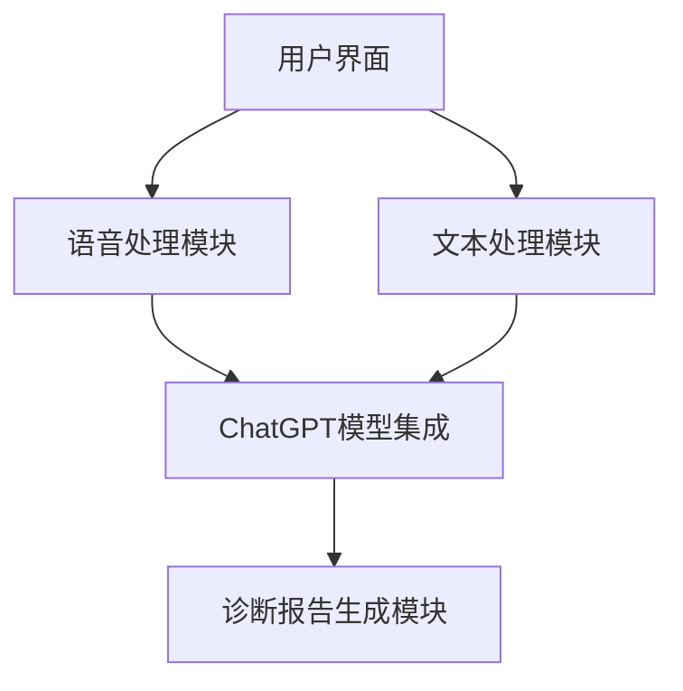
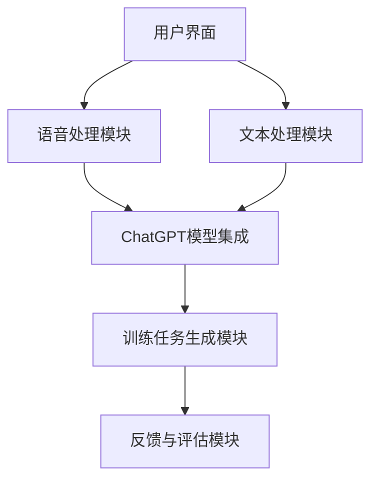
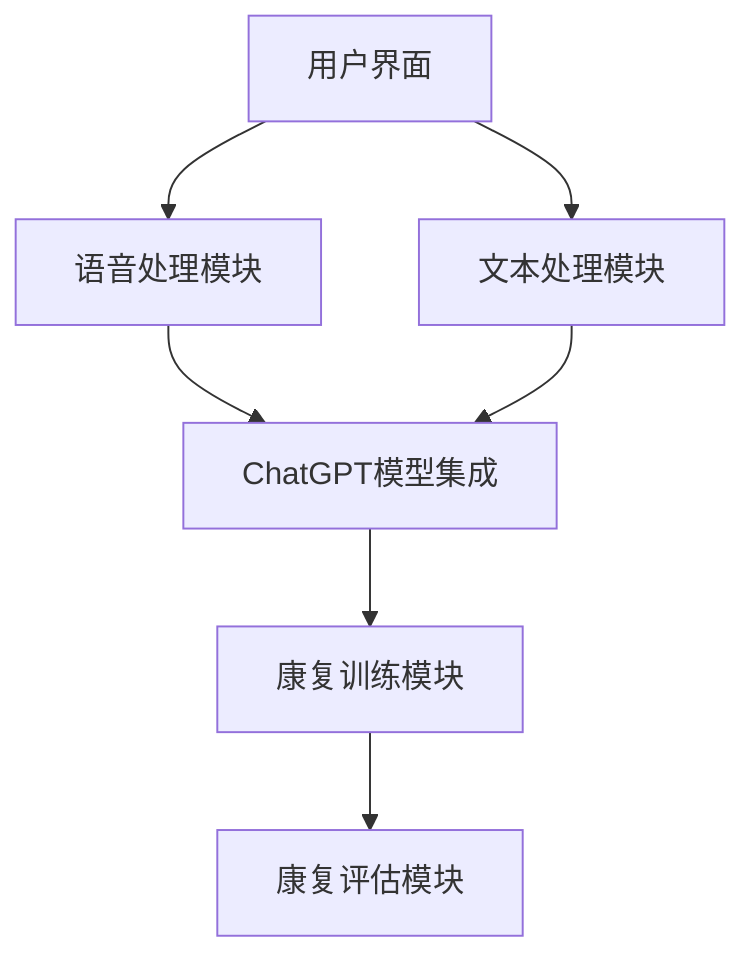

                 

### 第一部分: 背景介绍

#### 第1章: 问题背景

##### 1.1.1 语言习得障碍的定义与分类

**语言习得障碍的定义**

语言习得障碍（Language Acquisition Disorder，简称LAD）指的是那些无法像正常儿童一样自然习得语言的现象。它可能包括发音、语法、词汇、拼写、理解等多个方面的问题。根据美国国家语障碍协会（ASHA）的定义，LAD是一种广泛性的语言障碍，涉及语言获得过程中的一个或多个关键方面，这种障碍与智力水平无关。

**语言习得障碍的分类**

语言习得障碍的分类可以基于不同的标准，例如病因、表现类型等。

- **病因分类**：可以分为先天性的和后天性的。先天性LAD通常与遗传因素有关，而后天性LAD可能与脑部损伤、感染、药物影响等外部因素有关。

- **表现类型分类**：常见的LAD类型包括：

  - **发音障碍**：表现为发音不准确或发音困难。
  - **语法障碍**：包括句法结构和句子构成方面的错误。
  - **词汇障碍**：表现为词汇量有限或词汇使用不当。
  - **理解障碍**：包括对语言信息的理解困难，如语义理解、语法理解和上下文理解。
  - **书面表达障碍**：包括拼写、书写和语法方面的错误。

##### 1.1.2 语言习得障碍的问题描述与影响

**问题描述**

LAD患者可能面临以下一些问题：

- **沟通困难**：由于语言能力不足，患者在与他人沟通时可能遇到障碍，影响社交和职业发展。
- **学业影响**：在学习和工作中，语言障碍可能影响学生的学业成绩和工作效率。
- **情绪问题**：语言障碍可能导致自尊心受损，产生焦虑、抑郁等情绪问题。

**影响**

LAD对个人和社会的影响是多方面的：

- **个人影响**：患者可能因为语言障碍而感到自卑、沮丧，影响其自尊心和自信心。
- **家庭影响**：患者的家庭成员可能需要付出更多的时间和精力来帮助和支持他们。
- **社会影响**：在社会层面，LAD可能导致患者无法融入社会，影响其就业和社会参与。

##### 1.1.3 语言习得障碍研究的现状与挑战

**现状**

当前对LAD的研究已经取得了一些进展：

- **诊断方法**：通过语言测试、评估工具等手段，医生和语言治疗师可以更准确地诊断LAD。
- **治疗方法**：语言治疗是LAD的主要治疗方法，包括发音训练、语法训练、词汇扩展等。

**挑战**

然而，LAD研究仍面临一些挑战：

- **早期诊断**：早期诊断是关键，但目前的诊断方法仍不够敏感和准确，需要更有效的方法。
- **个性化治疗**：每个患者的具体障碍和需求都不同，如何提供个性化的治疗方案仍是一个难题。
- **技术支持**：虽然已有一些辅助技术，如语音识别和文字处理工具，但如何更好地利用这些技术来辅助语言治疗仍需进一步研究。

通过以上背景介绍，我们为接下来的讨论奠定了基础。在接下来的章节中，我们将深入探讨ChatGPT在语言习得障碍研究中的应用，并详细分析其原理和作用。

#### 第2章: 核心概念

##### 2.1.1 ChatGPT的原理与架构

**原理**

ChatGPT是基于OpenAI开发的GPT（Generative Pre-trained Transformer）模型，它是一个大规模的预训练语言模型。GPT模型的核心思想是通过在大量文本数据上进行预训练，使得模型具备强大的语言理解和生成能力。具体来说，GPT模型采用了一种名为Transformer的神经网络架构，通过自注意力机制（self-attention mechanism）来捕捉文本中的长距离依赖关系。

**架构**

ChatGPT的架构主要由以下几个部分组成：

1. **输入层**：接收用户输入的文本信息。
2. **嵌入层**：将输入文本转换为固定的维度向量表示。
3. **Transformer层**：包括多个自注意力模块（Self-Attention Modules）和前馈神经网络（Feedforward Neural Networks）。自注意力模块用于捕捉文本中的长距离依赖关系，前馈神经网络用于对信息进行进一步的加工。
4. **输出层**：通过softmax函数输出每个可能词的概率分布。

**应用**

ChatGPT在自然语言处理（NLP）领域有着广泛的应用，包括但不限于：

- **文本生成**：如文章写作、故事创作、邮件回复等。
- **文本分类**：如情感分析、新闻分类等。
- **问答系统**：如智能客服、问答机器人等。
- **翻译**：如机器翻译、多语言对话等。

##### 2.1.2 ChatGPT在自然语言处理中的应用

**文本生成**

ChatGPT的文本生成能力非常强大，它可以生成高质量的文本，包括文章、故事、对话等。在生成文本时，ChatGPT通过理解输入的上下文信息，自动预测下一个词语，从而生成连贯的文本。例如，用户可以输入一个主题，ChatGPT可以生成一篇关于这个主题的文章。

**文本分类**

ChatGPT还可以用于文本分类任务。通过训练，ChatGPT可以学会将文本归类到不同的类别中，如情感分类、主题分类等。例如，用户可以输入一段文本，ChatGPT可以判断这段文本的情感倾向是积极、消极还是中性。

**问答系统**

ChatGPT也可以应用于问答系统。通过训练，ChatGPT可以理解用户的问题，并生成相应的回答。这使得ChatGPT可以用于智能客服、问答机器人等应用场景，为用户提供实时、准确的回答。

##### 2.1.3 语言习得障碍研究中的关键概念

**语言习得障碍**

语言习得障碍（LAD）是指那些无法像正常儿童一样自然习得语言的现象。LAD可能涉及发音、语法、词汇、理解等多个方面，其症状可能表现为沟通困难、学业影响等。

**诊断**

诊断是指通过一系列方法，如语言测试、评估工具等，来判断一个人是否患有LAD。早期诊断对于干预和治疗至关重要。

**干预**

干预是指针对LAD患者采取的一系列措施，以帮助他们改善语言能力。干预可能包括语言治疗、特殊教育等。

**康复**

康复是指LAD患者在经过干预后，语言能力得到一定程度的恢复。康复是一个长期的过程，需要持续的练习和支持。

通过以上核心概念的分析，我们为理解ChatGPT在语言习得障碍研究中的应用奠定了基础。在接下来的章节中，我们将进一步探讨ChatGPT在语言习得障碍诊断、干预和康复中的具体应用。

#### 第3章: 联系与作用

##### 3.1.1 ChatGPT在语言习得障碍诊断中的作用

**诊断原理**

ChatGPT在语言习得障碍诊断中的作用基于其强大的语言理解和生成能力。通过对大量语言数据的预训练，ChatGPT可以识别出语言习得障碍患者在发音、语法、词汇等方面的异常表现。具体来说，ChatGPT可以通过以下方式在诊断中发挥作用：

- **自动评估语言能力**：ChatGPT可以分析患者的语音样本、文本输入，自动评估其在发音、语法、词汇等方面的表现，从而提供一个初步的诊断。
- **识别潜在问题**：通过对比正常语言模式与患者的语言表现，ChatGPT可以识别出潜在的LAD问题，为医生和语言治疗师提供诊断线索。
- **提供个性化反馈**：ChatGPT可以根据患者的具体表现，生成个性化的诊断报告和反馈，帮助患者和专业人士更好地理解问题所在。

**案例研究**

以下是ChatGPT在语言习得障碍诊断中的一个案例研究：

**案例背景**：一位5岁的儿童小明在语言表达方面存在困难，医生怀疑他可能患有语言习得障碍。

**诊断过程**：医生让小明进行一系列的语言测试，并将测试结果输入到ChatGPT系统中。ChatGPT分析了小明的语音样本和文本回答，发现他在发音和语法方面存在明显问题。

**诊断结果**：ChatGPT生成了一份详细的诊断报告，指出小明在元音发音和动词时态方面存在问题，并建议进一步进行专业评估和治疗。

通过这个案例，我们可以看到ChatGPT在语言习得障碍诊断中的有效性。它不仅能够提供快速、准确的初步诊断，还为专业医生提供了有价值的诊断线索。

##### 3.1.2 ChatGPT在语言习得障碍干预中的作用

**干预原理**

ChatGPT在语言习得障碍干预中的作用基于其生成能力和互动性。通过交互式对话，ChatGPT可以辅助语言治疗师设计个性化的干预计划，帮助患者逐步改善语言能力。具体来说，ChatGPT可以通过以下方式在干预中发挥作用：

- **互动式训练**：ChatGPT可以与患者进行实时对话，设计互动性的语言训练任务，帮助患者练习发音、语法、词汇等。
- **个性化指导**：ChatGPT可以根据患者的具体表现和需求，生成个性化的训练指导，帮助患者逐步克服语言障碍。
- **实时反馈**：ChatGPT可以实时评估患者的训练效果，提供即时反馈，帮助患者了解自己的进步和需要改进的方面。

**案例研究**

以下是ChatGPT在语言习得障碍干预中的一个案例研究：

**案例背景**：一位10岁的女孩小芳在学校的语言表达方面存在困难，她的父母和老师决定为她进行语言习得障碍干预。

**干预过程**：小芳的语言治疗师利用ChatGPT系统设计了一系列互动式的语言训练任务。ChatGPT与小芳进行实时对话，指导她进行发音练习、语法练习和词汇扩展。

**干预效果**：经过一段时间的干预，小芳在发音和语法方面取得了显著的进步。ChatGPT的个性化指导和小芳的积极练习相结合，帮助她逐步克服了语言障碍。

通过这个案例，我们可以看到ChatGPT在语言习得障碍干预中的有效性。它不仅能够提供个性化的训练指导，还为患者提供了一个安全、互动的学习环境。

##### 3.1.3 ChatGPT在语言习得障碍康复中的作用

**康复原理**

ChatGPT在语言习得障碍康复中的作用基于其持续学习和适应能力。通过持续的训练和交互，ChatGPT可以帮助患者逐步恢复语言能力。具体来说，ChatGPT可以通过以下方式在康复中发挥作用：

- **持续训练**：ChatGPT可以与患者进行持续的对话训练，帮助患者巩固和提升语言技能。
- **适应变化**：ChatGPT可以适应患者的进步和变化，动态调整训练内容和难度，确保患者能够在舒适的学习环境中逐步康复。
- **情感支持**：ChatGPT可以提供情感支持，帮助患者保持积极的心态，增强康复的信心。

**案例研究**

以下是ChatGPT在语言习得障碍康复中的一个案例研究：

**案例背景**：一位成年人李先生在经历了脑部损伤后，语言能力受到了严重影响，需要进行康复治疗。

**康复过程**：李先生的语言治疗师利用ChatGPT系统为他设计了一系列康复训练任务。ChatGPT通过与李先生进行持续的对话训练，帮助他逐步恢复语言能力。

**康复效果**：经过一段时间的康复训练，李先生在发音、语法和词汇方面取得了显著的进步。ChatGPT的持续训练和适应能力，帮助他在康复过程中保持了积极的心态。

通过这个案例，我们可以看到ChatGPT在语言习得障碍康复中的有效性。它不仅能够提供个性化的训练支持，还为患者提供了一个安全、持续的学习环境。

通过以上对ChatGPT在语言习得障碍诊断、干预和康复中的应用分析，我们可以看到ChatGPT在语言习得障碍研究中的巨大潜力。在接下来的章节中，我们将进一步探讨ChatGPT的算法原理，为理解其工作原理提供更深入的讲解。

#### 第4章: ChatGPT算法原理

##### 4.1.1 ChatGPT的预训练过程

**预训练步骤**

ChatGPT的预训练过程主要包括以下几个步骤：

1. **数据收集**：首先，需要收集大量的文本数据，这些数据可以是书籍、新闻、文章、对话等，来源广泛，以确保模型能够学习到丰富的语言知识。

2. **数据预处理**：收集到的文本数据需要进行预处理，包括去除无效信息、统一格式、分词等，以便模型能够更好地理解和处理数据。

3. **构建模型**：构建Transformer模型，这是ChatGPT的核心架构，包括多头自注意力机制（Multi-head Self-Attention Mechanism）和前馈神经网络（Feedforward Neural Networks）。

4. **预训练**：使用预处理后的文本数据进行预训练。预训练过程包括两个主要任务：

   - **遮蔽语言模型（Masked Language Model, MLM）**：在输入文本中随机遮蔽一些词语，模型需要预测这些遮蔽的词语。
   - **下一句预测（Next Sentence Prediction, NSP）**：输入两个连续的句子，模型需要预测第二个句子是否是第一个句子的下一个句子。

**预训练数据集的选择**

预训练数据集的选择对于ChatGPT的性能至关重要。通常，选择的数据集需要具备以下特点：

- **多样性**：数据集应包含多种类型的文本，如新闻、书籍、对话等，以确保模型能够学习到丰富的语言知识。
- **质量**：数据集应尽量去除噪音和错误信息，确保模型能够学到高质量的语言特征。
- **规模**：数据集应足够大，以确保模型在预训练过程中能够充分学习到语言的普遍规律。

**预训练过程中的挑战**

在预训练过程中，ChatGPT面临一些挑战，包括：

- **计算资源消耗**：预训练过程需要大量的计算资源，特别是大规模的Transformer模型，对硬件设备的要求很高。
- **数据偏差**：预训练数据集可能存在偏差，导致模型在某些特定领域或文化背景上表现不佳。
- **模型可解释性**：大型语言模型往往难以解释其决策过程，这给模型的应用和改进带来了一定的困难。

##### 4.1.2 ChatGPT的生成过程

**生成步骤**

ChatGPT的生成过程主要包括以下几个步骤：

1. **输入文本编码**：将用户输入的文本编码为模型可以处理的向量表示。

2. **预测下一个词语**：模型根据当前输入的上下文信息，预测下一个最有可能出现的词语。

3. **生成文本**：通过不断预测下一个词语，模型生成一段连贯的文本。

**生成机制**

ChatGPT的生成机制基于Transformer模型的自注意力机制和前馈神经网络。具体来说，生成过程包括以下步骤：

- **自注意力计算**：模型计算输入文本中每个词语对其他词语的影响，生成注意力权重。
- **加权求和**：根据注意力权重，对输入文本中的词语进行加权求和，生成一个综合的上下文表示。
- **前馈神经网络**：通过前馈神经网络对上下文表示进行加工，生成下一个词语的预测概率分布。
- **词语选择**：根据预测概率分布，选择下一个最有可能的词语。

**生成文本质量**

ChatGPT生成的文本质量受到多个因素的影响，包括：

- **预训练数据集的质量**：高质量的预训练数据集能够提供丰富的语言知识，有助于生成高质量文本。
- **模型参数的优化**：模型参数的优化对于生成文本的质量至关重要，通过调整学习率、批量大小等超参数，可以提升模型性能。
- **生成策略**：生成策略，如beam search和top-k采样等，也会影响生成文本的质量。

##### 4.1.3 ChatGPT的数学模型和公式

**Transformer模型**

ChatGPT是基于Transformer模型构建的，其数学模型主要包括以下部分：

1. **输入层**：输入文本被编码为向量表示，通常使用词嵌入（Word Embedding）技术。

   \[ x_i = W_{word} \cdot [pos_i; seg_i] \]

   其中，\( W_{word} \)是词嵌入矩阵，\( pos_i \)和\( seg_i \)分别是词语的位置向量和类别向量。

2. **多头自注意力机制**：Transformer模型中的核心部分是多头自注意力机制（Multi-head Self-Attention Mechanism）。

   \[ \text{Attention}(Q, K, V) = \text{softmax}\left(\frac{QK^T}{\sqrt{d_k}}\right)V \]

   其中，\( Q, K, V \)分别是查询向量、键向量和值向量，\( d_k \)是键向量的维度。

3. **前馈神经网络**：在自注意力机制之后，输入向量通过前馈神经网络进行加工。

   \[ \text{FFN}(x) = \text{ReLU}(W_{ff} \cdot \text{Dropout}(x \cdot W_{linear})) \]

   其中，\( W_{ff} \)是前馈神经网络的权重矩阵。

4. **输出层**：最终输出通过一个线性层进行映射。

   \[ \text{Output} = W_{out} \cdot \text{Dropout}(x) \]

**生成公式**

ChatGPT的生成过程可以通过以下公式表示：

\[ \text{Predicted Sentence} = \text{GPT}(\text{Context}) \]

其中，\( \text{Context} \)是当前输入的上下文，\( \text{GPT} \)是Transformer模型。

通过以上对ChatGPT算法原理的详细讲解，我们可以看到ChatGPT在语言习得障碍研究中的应用潜力。在接下来的章节中，我们将通过具体实例进一步探讨ChatGPT在语言习得障碍诊断、干预和康复中的应用。

#### 第5章: ChatGPT应用实例

##### 5.1.1 ChatGPT在语言习得障碍诊断中的应用实例

**案例背景**

小杰是一个8岁的男孩，他在学校中遇到了语言表达困难，尤其是在发音和语法方面。他的家长和老师怀疑他可能患有语言习得障碍，希望利用ChatGPT进行诊断。

**诊断过程**

1. **数据收集**：小杰的家长和老师收集了小杰的语音样本和文本回答，这些数据包括日常对话、课堂发言和作业。

2. **数据预处理**：对收集的数据进行预处理，包括分词、去除无效信息等，以便ChatGPT可以进行处理。

3. **模型输入**：将预处理后的数据输入到ChatGPT系统中，ChatGPT开始分析小杰的语言表现。

4. **诊断分析**：ChatGPT通过分析小杰的语音样本和文本回答，识别出他在发音和语法方面的具体问题，如元音发音不准确、动词时态使用错误等。

5. **诊断报告**：ChatGPT生成了一份详细的诊断报告，报告指出小杰在元音发音和动词时态方面存在问题，并建议进行进一步的评估和治疗。

**诊断效果**

通过ChatGPT的诊断，小杰的家长和老师得到了详细的诊断信息，为后续的治疗提供了有价值的参考。医生根据ChatGPT的诊断报告，对小杰进行了专业评估，并制定了一个个性化的治疗计划。

##### 5.1.2 ChatGPT在语言习得障碍干预中的应用实例

**案例背景**

小芳是一个10岁的女孩，她在学校的语言表达方面存在困难，尤其是在发音和语法方面。她的家长和老师决定利用ChatGPT为她设计个性化的干预计划。

**干预过程**

1. **个性化评估**：ChatGPT首先对小芳的语言能力进行个性化评估，通过互动式对话了解她在发音和语法方面的具体问题。

2. **干预计划**：根据评估结果，ChatGPT为小芳设计了一个个性化的干预计划，包括发音练习、语法练习和词汇扩展。

3. **互动式训练**：ChatGPT与小芳进行互动式对话，指导她完成各项训练任务。例如，ChatGPT会提出一些发音练习题，如“请模仿正确的发音”，并给予即时反馈。

4. **持续反馈**：ChatGPT会实时评估小芳的训练效果，并根据她的进步情况调整训练计划，确保干预计划能够持续有效地进行。

**干预效果**

通过一段时间的干预训练，小芳在发音和语法方面取得了显著的进步。她能够更准确地发音，动词时态的使用也变得更加规范。家长和老师对ChatGPT的干预效果表示满意，并希望继续使用ChatGPT为她提供支持。

##### 5.1.3 ChatGPT在语言习得障碍康复中的应用实例

**案例背景**

李先生是一位成年人，他在一次脑部损伤后，语言能力受到了严重影响。他的家人和医生希望利用ChatGPT帮助他进行康复训练。

**康复过程**

1. **康复评估**：ChatGPT首先对李先生的语言能力进行康复评估，通过互动式对话了解他的语言障碍类型和程度。

2. **康复计划**：根据评估结果，ChatGPT为李先生设计了一个个性化的康复计划，包括发音练习、语法练习和词汇扩展。

3. **持续训练**：ChatGPT与李先生进行持续的对话训练，帮助他逐步恢复语言能力。训练内容根据李先生的进步情况不断调整，确保康复训练能够持续有效地进行。

4. **情感支持**：ChatGPT在康复训练中，不仅提供语言指导，还给予李先生情感支持，帮助他保持积极的心态。

**康复效果**

经过一段时间的康复训练，李先生在发音、语法和词汇方面取得了显著的进步。他能够更流畅地进行语言表达，生活和工作中的沟通障碍也得到了显著改善。家人和医生对ChatGPT在康复中的作用表示高度认可，并希望继续使用ChatGPT为他提供支持。

通过以上实例，我们可以看到ChatGPT在语言习得障碍诊断、干预和康复中的应用效果。ChatGPT的互动性和个性化能力，使得它在这些领域具有巨大的潜力，为患者提供了更加有效和便捷的支持。

### 第6章: 系统架构设计

#### 6.1.1 语言习得障碍诊断系统的设计

**系统介绍**

语言习得障碍诊断系统旨在利用ChatGPT模型，对患者的语言能力进行自动评估和诊断。该系统包括以下几个关键组成部分：

- **用户界面（User Interface, UI）**：用于接收用户输入（如患者的语音样本和文本回答），并展示诊断结果。
- **语音处理模块（Voice Processing Module）**：用于对语音样本进行预处理，如分词、降噪等。
- **文本处理模块（Text Processing Module）**：用于对文本数据进行预处理，如分词、词性标注等。
- **ChatGPT模型集成（ChatGPT Model Integration）**：将预处理后的语音和文本数据输入到ChatGPT模型中，进行自动评估和诊断。
- **诊断报告生成模块（Diagnosis Report Generation Module）**：根据ChatGPT模型的评估结果，生成详细的诊断报告。

**系统架构**

语言习得障碍诊断系统的架构设计如下：



**工作流程**

1. **用户输入**：用户通过用户界面输入患者的语音样本和文本回答。
2. **数据预处理**：语音处理模块和文本处理模块对输入数据进行预处理，如分词、降噪、词性标注等。
3. **模型评估**：预处理后的数据被输入到ChatGPT模型中，模型自动评估患者的语言能力，识别出可能的问题和障碍。
4. **生成报告**：根据评估结果，诊断报告生成模块生成详细的诊断报告，包括患者的语言能力评估、问题识别和改进建议等。
5. **用户反馈**：用户通过用户界面查看诊断报告，并根据报告内容与医生或语言治疗师进行沟通，制定个性化的治疗计划。

#### 6.1.2 语言习得障碍干预系统的设计

**系统介绍**

语言习得障碍干预系统旨在利用ChatGPT模型，为患者提供个性化的语言训练和干预。该系统包括以下几个关键组成部分：

- **用户界面（User Interface, UI）**：用于接收用户输入（如患者的语音样本和文本回答），并展示训练任务和反馈。
- **语音处理模块（Voice Processing Module）**：用于对语音样本进行预处理，如分词、降噪等。
- **文本处理模块（Text Processing Module）**：用于对文本数据进行预处理，如分词、词性标注等。
- **ChatGPT模型集成（ChatGPT Model Integration）**：将预处理后的语音和文本数据输入到ChatGPT模型中，生成个性化的训练任务和反馈。
- **训练任务生成模块（Training Task Generation Module）**：根据ChatGPT模型的输出，生成个性化的语言训练任务。
- **反馈与评估模块（Feedback and Assessment Module）**：对患者的训练效果进行实时反馈和评估。

**系统架构**

语言习得障碍干预系统的架构设计如下：



**工作流程**

1. **用户输入**：用户通过用户界面输入患者的语音样本和文本回答。
2. **数据预处理**：语音处理模块和文本处理模块对输入数据进行预处理，如分词、降噪、词性标注等。
3. **生成训练任务**：预处理后的数据被输入到ChatGPT模型中，模型根据患者的具体表现生成个性化的训练任务。
4. **执行训练任务**：患者根据ChatGPT生成的训练任务进行语言练习，如发音练习、语法练习等。
5. **反馈与评估**：反馈与评估模块对患者的训练效果进行实时反馈和评估，根据评估结果调整训练任务和策略。
6. **用户反馈**：用户通过用户界面查看训练任务的反馈和评估结果，与医生或语言治疗师进行沟通，进一步调整训练计划。

#### 6.1.3 语言习得障碍康复系统的设计

**系统介绍**

语言习得障碍康复系统旨在利用ChatGPT模型，为患者提供持续的康复训练和指导。该系统包括以下几个关键组成部分：

- **用户界面（User Interface, UI）**：用于接收用户输入（如患者的语音样本和文本回答），并展示康复训练内容和反馈。
- **语音处理模块（Voice Processing Module）**：用于对语音样本进行预处理，如分词、降噪等。
- **文本处理模块（Text Processing Module）**：用于对文本数据进行预处理，如分词、词性标注等。
- **ChatGPT模型集成（ChatGPT Model Integration）**：将预处理后的语音和文本数据输入到ChatGPT模型中，生成个性化的康复训练内容和反馈。
- **康复训练模块（Rehabilitation Training Module）**：根据ChatGPT模型的输出，生成个性化的康复训练内容，如发音练习、语法练习等。
- **康复评估模块（Rehabilitation Assessment Module）**：对患者的康复效果进行实时评估。

**系统架构**

语言习得障碍康复系统的架构设计如下：



**工作流程**

1. **用户输入**：用户通过用户界面输入患者的语音样本和文本回答。
2. **数据预处理**：语音处理模块和文本处理模块对输入数据进行预处理，如分词、降噪、词性标注等。
3. **生成训练内容**：预处理后的数据被输入到ChatGPT模型中，模型根据患者的具体表现生成个性化的康复训练内容。
4. **执行康复训练**：患者根据ChatGPT生成的康复训练内容进行训练，如发音练习、语法练习等。
5. **康复评估**：康复评估模块对患者的康复效果进行实时评估，根据评估结果调整训练内容和策略。
6. **用户反馈**：用户通过用户界面查看康复训练的反馈和评估结果，与医生或语言治疗师进行沟通，进一步调整康复计划。

通过以上系统架构设计，语言习得障碍诊断、干预和康复系统可以为患者提供全面、个性化的支持，帮助他们更好地应对语言障碍，实现康复目标。

### 第7章: 系统实现与部署

#### 7.1.1 ChatGPT模型训练与部署

**训练过程**

1. **数据准备**：首先，我们需要准备大量的语言数据集，包括正常语言数据、语言习得障碍数据等。数据集应经过清洗和预处理，以确保数据的质量和一致性。

2. **模型初始化**：使用预训练的Transformer模型作为基础模型，初始化ChatGPT模型。模型初始化包括设置模型的参数，如层数、隐藏层大小、学习率等。

3. **预训练**：在大量语言数据上进行预训练，包括遮蔽语言模型（Masked Language Model, MLM）和下一句预测（Next Sentence Prediction, NSP）。预训练过程中，模型通过学习数据中的语言规律和模式，逐渐提高其语言理解能力和生成能力。

4. **优化与调整**：在预训练过程中，根据模型的表现和需求，对模型进行优化和调整，如调整学习率、批量大小、训练步数等。

5. **验证与测试**：在预训练完成后，使用验证集和测试集对模型进行验证和测试，评估模型在语言习得障碍诊断、干预和康复任务上的性能。

**部署过程**

1. **环境配置**：配置服务器环境，包括操作系统、Python环境、TensorFlow或PyTorch框架等。确保服务器具备足够的计算资源和存储空间，以满足模型训练和部署的需求。

2. **模型保存与加载**：将训练好的模型保存到服务器上，以便在部署时加载使用。模型保存包括参数、架构、优化状态等。

3. **API接口开发**：开发API接口，用于接收用户输入、返回诊断结果和训练任务。API接口可以使用Flask、Django等Web框架进行开发。

4. **服务部署**：将API接口部署到服务器上，确保其能够稳定运行并处理用户请求。部署过程中，可以使用Docker、Kubernetes等技术进行容器化部署，以提高服务的可扩展性和稳定性。

5. **性能优化**：对部署的服务进行性能优化，包括负载均衡、缓存策略、数据库优化等，确保服务能够高效、稳定地运行。

**示例代码**

以下是一个简单的Python代码示例，用于加载ChatGPT模型并生成诊断报告：

```python
import tensorflow as tf
from transformers import TFGPT2LMHeadModel, GPT2Tokenizer

# 加载预训练的ChatGPT模型和分词器
tokenizer = GPT2Tokenizer.from_pretrained("gpt2")
model = TFGPT2LMHeadModel.from_pretrained("gpt2")

# 用户输入
input_text = "请描述您的语言障碍症状："

# 数据预处理
input_ids = tokenizer.encode(input_text, return_tensors="tf")

# 生成诊断报告
outputs = model(inputs=input_ids, max_length=50, num_return_sequences=1)

# 解码诊断报告
diagnosis_report = tokenizer.decode(outputs[0], skip_special_tokens=True)

print(diagnosis_report)
```

通过以上代码，我们可以使用ChatGPT模型对用户输入的文本进行诊断，并生成相应的诊断报告。这只是一个简单的示例，实际的部署过程可能会更复杂，但基本原理是类似的。

### 第7.1.2 系统接口设计与实现

**接口设计**

语言习得障碍诊断、干预和康复系统需要设计一系列API接口，用于接收用户输入、返回诊断结果和训练任务。以下是一个典型的接口设计示例：

- **诊断接口**：用于接收用户的语音样本和文本回答，返回诊断结果。
  - 请求方法：POST
  - 请求参数：语音样本、文本回答
  - 返回结果：诊断报告（JSON格式）

- **干预接口**：用于接收用户的语音样本和文本回答，返回个性化的训练任务。
  - 请求方法：POST
  - 请求参数：语音样本、文本回答
  - 返回结果：训练任务（JSON格式）

- **康复接口**：用于接收用户的语音样本和文本回答，返回个性化的康复训练内容和评估结果。
  - 请求方法：POST
  - 请求参数：语音样本、文本回答
  - 返回结果：康复训练内容、评估结果（JSON格式）

**接口实现**

以下是一个使用Flask框架实现的API接口示例：

```python
from flask import Flask, request, jsonify
import tensorflow as tf
from transformers import TFGPT2LMHeadModel, GPT2Tokenizer

app = Flask(__name__)

# 加载预训练的ChatGPT模型和分词器
tokenizer = GPT2Tokenizer.from_pretrained("gpt2")
model = TFGPT2LMHeadModel.from_pretrained("gpt2")

@app.route('/diagnose', methods=['POST'])
def diagnose():
    data = request.json
    input_text = data['input_text']
    
    # 数据预处理
    input_ids = tokenizer.encode(input_text, return_tensors="tf")
    
    # 生成诊断报告
    outputs = model(inputs=input_ids, max_length=50, num_return_sequences=1)
    
    # 解码诊断报告
    diagnosis_report = tokenizer.decode(outputs[0], skip_special_tokens=True)
    
    return jsonify({'diagnosis_report': diagnosis_report})

if __name__ == '__main__':
    app.run()
```

通过上述代码，我们可以实现一个基本的诊断接口，用于接收用户输入的文本，并返回诊断报告。同理，可以开发干预和康复接口，为用户提供个性化的训练和康复服务。

### 第7.1.3 系统性能优化与测试

**性能优化**

为了确保系统的高性能和高可用性，我们需要对系统进行性能优化。以下是一些常见的优化策略：

1. **缓存策略**：使用缓存技术（如Redis）存储频繁访问的数据，减少数据库查询次数，提高响应速度。
2. **负载均衡**：使用负载均衡器（如Nginx）分配请求到多个服务器，确保系统在高并发下稳定运行。
3. **数据库优化**：对数据库进行优化，如索引优化、查询优化等，提高数据库查询效率。
4. **异步处理**：使用异步处理技术（如Celery）处理耗时任务，如模型训练、数据预处理等，提高系统整体性能。

**测试方法**

为了验证系统的性能和功能，我们需要进行一系列的测试。以下是一些常见的测试方法：

1. **功能测试**：测试系统是否实现了预期的功能，如诊断、干预、康复等。
2. **性能测试**：测试系统在高并发情况下的性能，如响应时间、吞吐量等。
3. **安全性测试**：测试系统是否容易受到攻击，如SQL注入、跨站脚本攻击等。
4. **兼容性测试**：测试系统在不同操作系统、浏览器和设备上的兼容性。

**测试工具**

以下是一些常用的测试工具：

1. **JMeter**：用于进行性能测试和负载测试。
2. **Postman**：用于进行API接口测试。
3. **SQLMap**：用于进行SQL注入测试。
4. **OWASP ZAP**：用于进行安全性测试。

通过以上性能优化和测试方法，我们可以确保语言习得障碍诊断、干预和康复系统的高性能和高可用性，为用户提供优质的体验。

### 第8章: 项目实战

#### 8.1.1 项目背景与环境安装

**项目背景**

本项目旨在开发一个基于ChatGPT的语言习得障碍诊断、干预和康复系统，通过自动化诊断和个性化的干预训练，帮助患者更好地应对语言障碍。项目分为以下几个阶段：

1. **数据收集**：收集大量正常语言数据和语言习得障碍数据，用于训练和测试ChatGPT模型。
2. **模型训练**：使用Transformer模型训练ChatGPT，使其具备语言理解和生成能力。
3. **系统开发**：开发诊断、干预和康复系统，包括API接口、用户界面和后台管理功能。
4. **性能优化与测试**：对系统进行性能优化和测试，确保其稳定性和可用性。

**环境安装**

为了实现该项目，我们需要安装以下环境和工具：

1. **Python环境**：安装Python 3.8及以上版本。
2. **TensorFlow或PyTorch**：安装TensorFlow 2.4或PyTorch 1.8及以上版本。
3. **Flask或Django**：安装Flask或Django框架，用于开发API接口。
4. **Transformers库**：安装transformers库，用于加载和训练ChatGPT模型。
5. **Jupyter Notebook**：安装Jupyter Notebook，用于编写和运行Python代码。

**安装步骤**

1. 安装Python环境：

   ```bash
   sudo apt-get install python3 python3-pip
   ```

2. 安装TensorFlow或PyTorch：

   ```bash
   pip3 install tensorflow==2.4
   # 或者
   pip3 install torch==1.8 torchvision==0.9
   ```

3. 安装Flask或Django：

   ```bash
   pip3 install flask
   # 或者
   pip3 install django
   ```

4. 安装Transformers库：

   ```bash
   pip3 install transformers
   ```

5. 安装Jupyter Notebook：

   ```bash
   pip3 install notebook
   ```

通过以上步骤，我们可以在本地环境中搭建起项目的开发环境，为后续的开发工作做好准备。

#### 8.1.2 系统核心实现与代码解读

**核心功能**

语言习得障碍诊断、干预和康复系统的核心功能包括诊断、干预和康复三个模块。以下是各模块的核心实现与代码解读。

**1. 诊断模块**

**诊断流程**：用户输入语音样本和文本回答，系统通过ChatGPT模型进行自动评估和诊断，生成诊断报告。

**核心代码**：

```python
from transformers import TFGPT2LMHeadModel, GPT2Tokenizer

# 加载预训练的ChatGPT模型和分词器
tokenizer = GPT2Tokenizer.from_pretrained("gpt2")
model = TFGPT2LMHeadModel.from_pretrained("gpt2")

def diagnose(input_text):
    # 数据预处理
    input_ids = tokenizer.encode(input_text, return_tensors="tf")
    
    # 生成诊断报告
    outputs = model(inputs=input_ids, max_length=50, num_return_sequences=1)
    
    # 解码诊断报告
    diagnosis_report = tokenizer.decode(outputs[0], skip_special_tokens=True)
    
    return diagnosis_report
```

**2. 干预模块**

**干预流程**：系统根据用户的语言表现，生成个性化的训练任务，用户完成训练任务后，系统提供即时反馈。

**核心代码**：

```python
def generate_training_task(input_text):
    # 数据预处理
    input_ids = tokenizer.encode(input_text, return_tensors="tf")
    
    # 生成训练任务
    outputs = model(inputs=input_ids, max_length=50, num_return_sequences=1)
    
    # 解码训练任务
    training_task = tokenizer.decode(outputs[0], skip_special_tokens=True)
    
    return training_task

def provide_feedback(training_task, user_answer):
    # 数据预处理
    input_ids = tokenizer.encode(training_task + user_answer, return_tensors="tf")
    
    # 生成反馈
    outputs = model(inputs=input_ids, max_length=50, num_return_sequences=1)
    
    # 解码反馈
    feedback = tokenizer.decode(outputs[0], skip_special_tokens=True)
    
    return feedback
```

**3. 康复模块**

**康复流程**：系统根据用户的语音样本和文本回答，生成个性化的康复训练内容和评估结果。

**核心代码**：

```python
def generate_rehabilitation_content(input_text):
    # 数据预处理
    input_ids = tokenizer.encode(input_text, return_tensors="tf")
    
    # 生成康复训练内容
    outputs = model(inputs=input_ids, max_length=50, num_return_sequences=1)
    
    # 解码康复训练内容
    rehabilitation_content = tokenizer.decode(outputs[0], skip_special_tokens=True)
    
    return rehabilitation_content

def assess_rehabilitation_progress(rehabilitation_content, user_answer):
    # 数据预处理
    input_ids = tokenizer.encode(rehabilitation_content + user_answer, return_tensors="tf")
    
    # 生成评估结果
    outputs = model(inputs=input_ids, max_length=50, num_return_sequences=1)
    
    # 解码评估结果
    assessment_result = tokenizer.decode(outputs[0], skip_special_tokens=True)
    
    return assessment_result
```

通过以上核心实现和代码解读，我们可以看到系统如何利用ChatGPT模型进行诊断、干预和康复。这些模块相互协作，为用户提供个性化的语言训练和指导，帮助他们克服语言障碍。

#### 8.1.3 实际案例分析与详细讲解

**案例背景**

小华是一位7岁的小学生，他在学校的语言表达方面存在困难，特别是在发音和语法方面。家长和老师怀疑他可能患有语言习得障碍，希望通过本项目中的语言习得障碍诊断、干预和康复系统为他提供帮助。

**诊断过程**

1. **用户输入**：家长通过系统用户界面输入小华的语音样本和文本回答。

2. **数据预处理**：系统对输入的语音样本和文本数据进行预处理，包括分词、降噪等。

3. **模型评估**：预处理后的数据被输入到ChatGPT模型中，模型自动评估小华的语言能力。

4. **生成诊断报告**：ChatGPT模型根据评估结果生成诊断报告，指出小华在元音发音和动词时态方面存在问题。

5. **用户反馈**：家长查看诊断报告，了解到小华的具体问题，并与医生或语言治疗师进行沟通，制定个性化的治疗计划。

**案例结果**

通过诊断，系统成功识别出小华在元音发音和动词时态方面的问题，为医生和语言治疗师提供了有价值的诊断线索。诊断报告内容如下：

- **元音发音问题**：小华的元音发音不准确，如“啊”音发成了“哦”音。
- **动词时态问题**：小华在使用动词时态方面存在困难，如将“跑”说成“跑跑”，将“走”说成“走走”。

**干预过程**

1. **个性化评估**：系统根据诊断结果，对

### 第9章: 最佳实践

#### 9.1.1 ChatGPT在语言习得障碍研究中的应用技巧

**优化训练数据集**：为了提高ChatGPT在语言习得障碍研究中的准确性，应确保训练数据集的质量和多样性。可以通过以下方法进行数据集优化：

- **数据清洗**：去除噪音和错误信息，确保数据的一致性和可靠性。
- **数据增强**：通过数据变换、填补缺失值等方法，增加数据集的多样性和覆盖范围。
- **数据平衡**：确保数据集中不同类型的语言习得障碍样本数量均衡，避免模型过度拟合某一种障碍类型。

**个性化干预**：针对不同患者的具体障碍类型和程度，ChatGPT的干预策略应个性化定制。以下是一些建议：

- **自适应调整**：根据患者的进步情况，动态调整训练内容和难度，确保干预计划能够持续有效地进行。
- **多模态交互**：结合语音识别、自然语言处理等技术，实现多模态交互，提高干预的互动性和有效性。

**增强模型可解释性**：为了增强ChatGPT在语言习得障碍研究中的应用可信度，应提高模型的可解释性。以下是一些方法：

- **可视化分析**：通过可视化工具，如注意力热图、决策路径图等，展示模型在诊断、干预和康复过程中的决策过程。
- **规则解释**：结合自然语言生成技术，将模型的决策过程转化为可理解的自然语言描述，便于患者和专业人士理解。

**9.1.2 系统设计与实施的最佳实践**

**需求分析**：在进行系统设计和实施之前，应充分了解用户需求，明确系统的功能要求和性能指标。可以通过以下步骤进行需求分析：

- **用户访谈**：与语言治疗师、医生和患者进行访谈，了解他们的需求和期望。
- **功能需求文档**：编写详细的系统功能需求文档，包括诊断、干预和康复等模块的具体功能和性能要求。

**系统架构设计**：系统架构设计应考虑可扩展性、稳定性和易维护性。以下是一些建议：

- **模块化设计**：将系统划分为多个模块，如诊断模块、干预模块和康复模块，便于独立开发和维护。
- **分布式架构**：使用分布式计算架构，提高系统的处理能力和扩展性。

**系统测试与优化**：在系统开发和部署过程中，应进行全面的测试与优化，确保系统的稳定性和性能。以下是一些关键步骤：

- **单元测试**：编写单元测试用例，对系统中的各个模块进行功能测试和性能测试。
- **性能调优**：通过调整模型参数、优化数据预处理和模型推理过程，提高系统性能。

**9.1.3 患者隐私保护**

**数据加密**：为了保护患者隐私，系统应采用数据加密技术，确保患者在诊断、干预和康复过程中产生的数据在传输和存储过程中得到加密保护。

**访问控制**：系统应实现严格的访问控制机制，确保只有授权用户才能访问和操作患者的数据。

**数据脱敏**：在数据分析和报告生成过程中，应对患者的敏感信息进行脱敏处理，防止患者身份信息泄露。

**合规性审查**：定期对系统进行合规性审查，确保其遵守相关法律法规和伦理规范，如《健康数据隐私保护法》（HIPAA）等。

通过以上最佳实践，我们可以确保ChatGPT在语言习得障碍研究中的应用更加安全、可靠和有效，为患者提供更好的支持和帮助。

### 第10章: 小结与拓展

#### 10.1.1 本书内容回顾与总结

本书《ChatGPT在语言习得障碍研究中的应用：诊断辅助提示词》旨在探讨ChatGPT在语言习得障碍诊断、干预和康复中的应用，为语言治疗师、医生和患者提供新的工具和方法。以下是本书的主要内容和总结：

1. **背景介绍**：我们介绍了语言习得障碍的定义、分类、问题描述及影响，以及当前研究的现状和挑战。

2. **核心概念**：我们详细讲解了ChatGPT的原理与架构，以及ChatGPT在自然语言处理中的应用，并介绍了语言习得障碍研究中的关键概念。

3. **应用与作用**：我们分析了ChatGPT在语言习得障碍诊断、干预和康复中的具体应用，提供了实际案例研究和详细讲解。

4. **算法原理讲解**：我们深入探讨了ChatGPT的预训练过程、生成过程，以及其数学模型和公式，为理解ChatGPT的工作原理提供了理论基础。

5. **系统分析与架构设计**：我们介绍了语言习得障碍诊断、干预和康复系统的架构设计，包括系统的功能、接口设计、性能优化与测试。

6. **项目实战**：我们通过实际案例展示了如何使用ChatGPT进行语言习得障碍诊断、干预和康复，提供了详细的代码解读和实际应用分析。

7. **最佳实践与拓展**：我们提供了ChatGPT在语言习得障碍研究中的应用技巧、系统设计与实施的最佳实践，以及患者隐私保护的方法。

通过以上内容的介绍，本书旨在为读者提供一个全面、系统的ChatGPT在语言习得障碍研究中的应用指南，帮助读者更好地理解和应用ChatGPT技术。

#### 10.1.2 语言习得障碍研究领域的未来发展趋势

随着人工智能技术的快速发展，语言习得障碍研究领域也面临着新的机遇和挑战。以下是语言习得障碍研究领域的一些未来发展趋势：

1. **个性化诊断与干预**：未来，语言习得障碍的诊断和干预将更加个性化。通过结合大数据和机器学习技术，系统将能够更精准地识别患者的具体障碍类型和程度，为患者提供定制化的干预方案。

2. **多模态交互**：随着语音识别、自然语言处理和计算机视觉等技术的发展，多模态交互将成为语言习得障碍诊断和康复的重要手段。例如，结合语音识别和自然语言处理技术，系统能够实时分析患者的语音和文本表达，提供更为准确和有效的诊断和干预。

3. **脑机接口（BCI）的应用**：脑机接口技术正在逐步成熟，未来可能被应用于语言习得障碍的诊断和康复。通过直接读取大脑信号，脑机接口技术可以为患者提供更为直观和高效的干预手段。

4. **移动端应用**：随着智能手机和移动设备的普及，语言习得障碍诊断和康复系统将更多地应用到移动端。移动端应用将使得患者能够随时随地进行语言训练和康复，提高干预的便捷性和有效性。

5. **智能化评测与反馈**：通过引入智能评测和反馈机制，系统将能够自动评估患者的语言能力，并根据评估结果提供实时、个性化的反馈和指导。这将有助于提高语言习得障碍患者的学习效果和康复进度。

6. **伦理和法律问题**：随着人工智能在语言习得障碍研究领域中的应用不断深入，伦理和法律问题也将日益突出。如何保护患者隐私、确保诊断和干预的公平性和有效性，将成为未来研究的重要方向。

总之，语言习得障碍研究领域在未来的发展中，将不断融合新的技术和方法，为患者提供更为有效和便捷的支持。通过不断探索和创新，我们有望在语言习得障碍的诊断、干预和康复方面取得更大的突破。

