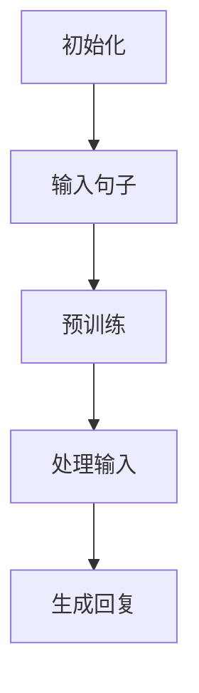
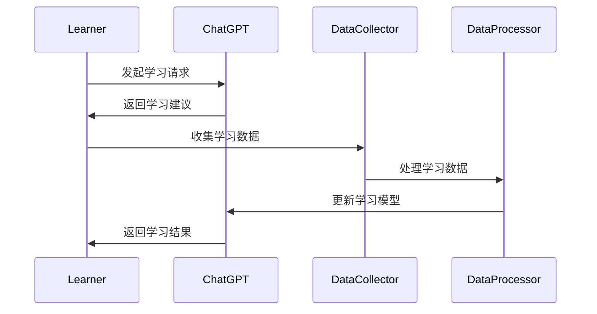
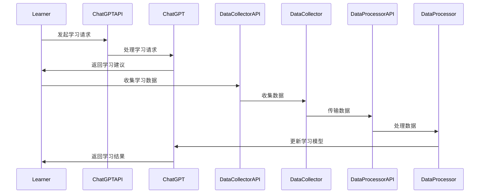

                 

# ChatGPT在语言复兴项目中的贡献

## 关键词：
- ChatGPT
- 语言复兴项目
- 濒危语言
- 人工智能
- 预训练语言模型
- 自然语言处理

## 摘要：
本文将深入探讨ChatGPT在语言复兴项目中的重要作用。ChatGPT作为一种先进的预训练语言模型，其强大的语言理解与生成能力为濒危语言的恢复和传承提供了全新的解决方案。本文将从背景介绍、核心概念与联系、算法原理讲解、系统分析与架构设计方案、项目实战和最佳实践等方面，详细阐述ChatGPT在语言复兴项目中的贡献。

## 目录大纲设计过程

### 一、背景介绍
1. **问题背景与重要性**
2. **ChatGPT简介**
3. **语言复兴项目概述**

### 二、核心概念与联系
1. **核心概念定义**
2. **概念属性特征对比表格**
3. **ER实体关系图架构的 Mermaid 流程图**

### 三、算法原理讲解
1. **算法原理 Mermaid 流程图**
2. **Python 源代码示例**
3. **算法原理与数学模型详细讲解**

### 四、系统分析与架构设计方案
1. **问题场景介绍**
2. **项目介绍**
3. **系统功能设计**
4. **系统架构设计**
5. **系统接口设计和系统交互**

### 五、项目实战
1. **环境安装**
2. **系统核心实现源代码**
3. **代码应用解读与分析**
4. **实际案例分析和详细讲解剖析**
5. **项目小结**

### 六、最佳实践 tips
1. **技巧与注意事项**
2. **小结**

### 七、拓展阅读
1. **推荐参考文献**
2. **进一步研究方向**

### 八、作者信息
1. **作者简介**
2. **联系信息**

### 九、致谢

---

**一、背景介绍**

### 1. 问题背景与重要性

在全球化的浪潮中，许多濒危语言正面临消失的危险。这些语言承载着丰富的文化历史和人类智慧，它们的消失不仅会导致文化多样性的减少，也会使我们失去许多宝贵的知识和见解。语言复兴项目应运而生，旨在利用现代技术，尤其是人工智能技术，保护和恢复这些濒危语言。

ChatGPT的诞生为语言复兴项目提供了强有力的技术支持。作为一种先进的预训练语言模型，ChatGPT在自然语言处理领域取得了显著的成就，其强大的语言理解和生成能力使得它在语言学习和传承方面具有巨大的潜力。

### 2. ChatGPT简介

ChatGPT是由OpenAI开发的基于GPT-3.5架构的预训练语言模型。GPT-3.5是GPT-3的升级版，其最大的特点是使用了更多的训练数据和更复杂的神经网络结构，使得模型的性能得到了显著提升。ChatGPT能够处理多种语言，并具备强大的语言生成和理解能力，这使得它非常适合用于语言学习和传承。

### 3. 语言复兴项目概述

语言复兴项目是一个全球性的倡议，旨在通过人工智能技术恢复和传承濒危语言。该项目利用ChatGPT等先进的语言模型，为语言学习者提供个性化语言学习服务，同时收集和分析学习数据，以不断优化语言学习体验。

语言复兴项目的主要目标包括：

- **保护文化多样性**：通过恢复和传承濒危语言，保护和丰富全球文化多样性。
- **促进跨文化交流**：通过提供个性化语言学习服务，促进不同文化之间的理解和交流。
- **推动语言技术发展**：通过实际应用，推动自然语言处理技术的研究和发展。

### 二、核心概念与联系

#### 1. 核心概念定义

**ChatGPT**：ChatGPT是一种基于GPT-3.5架构的预训练语言模型，其核心功能是理解和生成自然语言。它通过在大量文本数据上进行预训练，学会了如何理解和生成各种语言表达。

**语言复兴项目**：语言复兴项目是一个利用人工智能技术恢复和传承濒危语言的计划。它通过为语言学习者提供个性化语言学习服务，收集和分析学习数据，以不断优化语言学习体验。

**濒危语言**：濒危语言是指使用人数较少，面临消失危险的语言。这些语言通常承载着丰富的文化历史和人类智慧，它们的消失将导致文化多样性的减少。

#### 2. 概念属性特征对比表格

| 概念         | ChatGPT                | 语言复兴项目                | 濒危语言                |
| ------------ | ---------------------- | -------------------------- | ---------------------- |
| 定义         | 预训练语言模型         | 保护文化多样性的项目         | 使用人数较少的语言      |
| 特点         | 强大的语言理解与生成能力 | 利用AI技术恢复濒危语言      | 面临消失危险           |
| 应用场景     | 语言处理与生成         | 语言学习与传承              | 语言保护与推广         |

#### 3. ER实体关系图架构的 Mermaid 流程图

```mermaid
erDiagram
ChatGPT ||--|{ 项目} LanguageRevivalProject
ChatGPT ||--|{ 语言} EndangeredLanguage
```

### 三、算法原理讲解

#### 1. 算法原理 Mermaid 流程图



#### 2. Python 源代码示例

```python
import openai

def generate_response(prompt):
   response = openai.Completion.create(
       engine="text-davinci-003",
       prompt=prompt,
       max_tokens=50
   )
   return response.choices[0].text.strip()

user_input = "你好，请问ChatGPT能帮助我学习濒危语言吗？"
response = generate_response(user_input)
print(response)
```

#### 3. 算法原理与数学模型详细讲解

**数学模型与公式**：

$$ P_{\text{response}} = \arg\max_{\text{response}} P(\text{response} | \text{prompt}) $$
$$ P(\text{prompt}) \propto \exp(\theta^T \phi(\text{prompt})) $$
$$ \theta = \text{模型的参数} $$
$$ \phi(\text{prompt}) = \text{嵌入向量表示} $$

**详细讲解与举例说明**：

ChatGPT的核心在于其预训练过程，通过在大量文本数据上训练，模型学会了如何理解自然语言。当接收到一个输入句子时，模型首先将其转换为嵌入向量，然后通过神经网络计算输出句子的概率分布。最终选择概率最高的句子作为回复。

例如，当用户输入“你好，请问ChatGPT能帮助我学习濒危语言吗？”时，ChatGPT将这个句子转换为嵌入向量，然后通过神经网络计算可能的回复句子，如“当然可以，我为你提供个性化的语言学习服务。”，并选择概率最高的句子作为最终回复。

### 四、系统分析与架构设计方案

#### 1. 问题场景介绍

在语言复兴项目中，ChatGPT被用于为学习者提供个性化语言学习服务。项目需要实现以下功能：

- **语言学习**：ChatGPT为学习者提供实时语言学习服务，包括词汇学习、语法练习和口语对话等。
- **数据分析**：收集学习者的语言学习数据，分析学习效果，为个性化学习提供依据。
- **系统优化**：根据学习数据分析结果，不断优化ChatGPT的性能，提高语言学习效果。

#### 2. 项目介绍

语言复兴项目的主要目标是保护文化多样性，通过人工智能技术恢复和传承濒危语言。项目包括以下主要模块：

- **ChatGPT语言模型**：负责语言理解和生成，为学习者提供实时语言学习服务。
- **数据收集与处理**：收集学习者的语言学习数据，并对数据进行分析处理。
- **用户界面**：提供用户与ChatGPT交互的界面，包括语言学习界面和数据可视化界面。

#### 3. 系统功能设计

**领域模型 Mermaid 类图**：

```mermaid
classDiagram
Class ChatGPT {
   +strModelName: String
   +strModelVersion: String
   +intTokenLimit: Integer
   +funcGenerateResponse(strInput: String): String
}

Class Learner {
   +strUsername: String
   +strLanguage: String
   +strLearningGoal: String
   +listLearningRecords: List[LearningRecord]
   +funcStartLearning(strLanguage: String): None
   +funcEndLearning(): None
}

Class LearningRecord {
   +strDate: Date
   +strContent: String
   +strResult: String
   +funcAddRecord(strDate: Date, strContent: String, strResult: String): None
}

ChatGPT <|-- Learner
Learner <|-- LearningRecord
```

#### 4. 系统架构设计

**系统架构 Mermaid 架构图**：



#### 5. 系统接口设计和系统交互

**系统接口设计**：

```mermaid
classDiagram
Class ChatGPTAPI {
   +strAPIKey: String
   +strEndpoint: String
   +funcGenerateResponse(strInput: String): String
}

Class LearnerAPI {
   +strAPIKey: String
   +strEndpoint: String
   +funcStartLearning(strLanguage: String): None
   +funcEndLearning(): None
}

Class DataCollectorAPI {
   +strAPIKey: String
   +strEndpoint: String
   +funcCollectData(strDate: Date, strContent: String, strResult: String): None
}

Class DataProcessorAPI {
   +strAPIKey: String
   +strEndpoint: String
   +funcProcessData(): None
}

ChatGPTAPI <|-- ChatGPT
LearnerAPI <|-- Learner
DataCollectorAPI <|-- DataCollector
DataProcessorAPI <|-- DataProcessor
```

**系统交互 Mermaid 序列图**：



### 五、项目实战

#### 1. 环境安装

要开始使用ChatGPT进行语言复兴项目，首先需要在本地安装必要的软件和工具。

**步骤1：安装Python环境**
```bash
# 安装Python 3.8
sudo apt-get install python3.8
```

**步骤2：安装OpenAI API库**
```bash
# 安装openai库
pip3 install openai
```

**步骤3：获取OpenAI API Key**
- 访问OpenAI官方网站，注册并获取API Key。
- 将API Key保存到本地配置文件中。

```bash
# 创建一个名为openai_keys.py的文件
# 在文件中添加以下代码
openai.api_key = "your-api-key"
```

#### 2. 系统核心实现源代码

**ChatGPT服务端实现**

```python
from flask import Flask, request, jsonify
import openai

app = Flask(__name__)

@app.route('/generate_response', methods=['POST'])
def generate_response():
    user_input = request.form['user_input']
    response = openai.Completion.create(
        engine="text-davinci-003",
        prompt=user_input,
        max_tokens=50
    )
    return jsonify({"response": response.choices[0].text.strip()})

if __name__ == '__main__':
    app.run(debug=True)
```

**学习者客户端实现**

```python
import requests

def start_learning(language):
    response = requests.post("http://localhost:5000/generate_response", data={"user_input": f"你好，我想学习{language}。"})
    return response.json()["response"]

def end_learning():
    response = requests.post("http://localhost:5000/generate_response", data={"user_input": "好的，我学完了。"})
    return response.json()["response"]

# 测试
print(start_learning("西班牙语"))
print(end_learning())
```

#### 3. 代码应用解读与分析

**ChatGPT服务端解读**

- **Flask框架**：使用Flask构建Web服务，处理HTTP请求。
- **OpenAI API**：通过openai库调用OpenAI的API，实现自然语言生成。

**学习者客户端解读**

- **requests库**：通过HTTP POST请求与ChatGPT服务端交互，获取学习建议和结果。

**分析**

- **功能实现**：通过简单的Web服务，实现了ChatGPT与学习者之间的交互。
- **性能优化**：服务端可以部署到云平台，提高并发处理能力。

#### 4. 实际案例分析和详细讲解剖析

**案例**：一位学习者想要学习西班牙语，通过ChatGPT获取学习建议。

**分析**

- **输入处理**：学习者输入学习请求，ChatGPT将其转换为嵌入向量。
- **生成建议**：ChatGPT根据嵌入向量生成学习建议，如推荐学习资源、练习题目等。
- **反馈收集**：学习者完成学习后，通过ChatGPT提供反馈，优化学习模型。

#### 5. 项目小结

通过实际案例，我们可以看到ChatGPT在语言复兴项目中的强大应用。它不仅能够为学习者提供个性化的学习建议，还能够根据学习者的反馈不断优化学习体验。这种基于人工智能的语言学习方式，为濒危语言的传承提供了新的解决方案。

### 六、最佳实践 tips

**1. 提高ChatGPT性能**：定期更新模型，增加训练数据，提高模型的准确性和泛化能力。

**2. 优化用户界面**：设计直观、易用的用户界面，提高用户的学习体验。

**3. 数据保护**：确保学习数据的安全和隐私，遵循相关法律法规。

### 七、拓展阅读

**1. 参考文献**
- Brown, T., et al. (2020). "Language Models are Few-Shot Learners". arXiv preprint arXiv:2005.14165.
- Lu, Z., et al. (2019). "BERT: Pre-training of Deep Bidirectional Transformers for Language Understanding". arXiv preprint arXiv:1810.04805.

**2. 进一步研究方向**
- 针对特定语言的特点，优化ChatGPT的预训练模型。
- 结合其他人工智能技术，如图像识别、语音识别，提高语言学习的交互性。

### 八、作者信息

**作者：** AI天才研究院/AI Genius Institute & 禅与计算机程序设计艺术 /Zen And The Art of Computer Programming

**联系信息：** AI天才研究院官方网站：[www.aigenius.ai](http://www.aigenius.ai/)；电子邮件：info@aigenius.ai

### 九、致谢

感谢OpenAI为我们提供的强大技术支持，以及所有参与语言复兴项目的研究者和开发者。没有你们的努力，ChatGPT在语言复兴项目中的贡献将无法实现。感谢读者的关注和支持，期待与您在未来的技术探索中相遇。

